# 6.1 Performance Architecture

# 6.1.1 Performance Goals

## Insynergy Cinematic Thought Leadership Platform

### Master Specification v2.1 + Platform v3.4.0 Implementation Candidate

---

# 6.0.3 Platform v3.4.0 Amendment — Pre-Render Preview Runtime and Cost Architecture

## Runtime components

The Build Orchestrator shall isolate planning judgment, still-image generation, and local composition behind separate interfaces:

```python
class PrevisualizationProvider:
    def plan(self, request: PrevisualizationRequest) -> PrevisualizationPlan: ...

class PreviewImageProvider:
    def generate(self, request: PreviewFrameRequest) -> PreviewFrame: ...

class AnimaticComposer:
    def compose(self, request: AnimaticRequest) -> AnimaticResult: ...

class StoryboardPreviewStore:
    def get_by_key(self, key: str) -> ArtifactRef | None: ...
    def put_immutable(self, artifact: Artifact) -> ArtifactRef: ...
```

Production may implement the first two interfaces with `gpt-5.6-sol` and the Responses API `image_generation` tool. `AnimaticComposer` shall use a pinned FFmpeg toolchain without a network provider. Unit, pull-request, replay, and failure-injection tests shall use fake model/image providers and fixture frames; CI shall not require billable calls.

## State projection

```text
DISABLED

PENDING -> PLAN_VALIDATED -> FRAME_GENERATION -> FRAMES_VALIDATED
   |              |                  |                   |
   |              +-> PLAN_CACHE_HIT +-> FRAME_CACHE_HIT +-> COMPOSING
   |                                                        |
   +-> BUDGET_BLOCKED | UNAVAILABLE | ERROR                  v
                                      QUALITY_VALIDATED -> AWAITING_STORYBOARD_PREVIEW_APPROVAL
                                                                  |
                                           APPROVED <-------------+
                                           REVISE | REJECTED
```

These are previsualization sub-states in the authoritative Build Manifest. No transition before `APPROVED` may make a Runway task ready. `REVISE` creates a new immutable revision and invalidates dependent approval; it never mutates the selected artifact set.

## Exact identities and cache hierarchy

```text
plan_key = sha256(
  screenplay_hash + continuity_hashes + visual_grammar_hash
  + planning_model_requested + reasoning_effort
  + prompt_version + structured_contract_version + revision
)

frame_key = sha256(
  image_prompt_hash + approved_reference_hashes
  + mainline_model_requested + image_tool_configuration
  + size + quality + format + safety_policy_version
)

animatic_key = sha256(
  ordered_frame_hashes + narration_caption_hash + preview_audio_hash_or_none
  + ordered_duration_transition_plan_hash + watermark_version
  + ffmpeg_version + ffmpeg_argument_contract_version
)
```

An exact key has at most one accepted immutable result. Concurrent callers join, await, or replay the selected result rather than resubmitting. Cache reads verify content hashes, schema, provenance, safety disposition, and policy eligibility. Model/image inference is not declared byte-deterministic; reproducibility means immutable first-accepted selection per exact key plus deterministic validation and composition.

## Budget and credit accounting

Preflight shall compute upper bounds for GPT-5.6 input/output tokens, image count, image size/quality, optional TTS use, Actions minutes, storage, and wall time. Unknown or over-limit cost fails before the affected provider call. The operator summary shall report estimated and actual OpenAI text/image/voice usage separately from Runway credits.

The core economic invariant is:

```text
runway_tasks = 0
runway_attempts = 0
runway_credits = 0
```

until a current storyboard-preview approval and render approval are both valid. A preview is lower-risk, not free: OpenAI token and image generation charges are expected and shall be budgeted, metered, cached, and attributable.

## Concurrency and recovery

Independent frame calls may run concurrently within an explicit cap after the plan is sealed. Composition waits for the complete ordered validated frame set. Automatic retry is limited to classified transient failures and a bounded structured-output retry. Authentication, authorization, budget, safety, contract, hash, and policy failures are non-retryable.

After a crash or uncertain response, recovery reconciles request evidence and content-addressed storage before resubmission. Valid frames may be reused, but a partial set cannot be approved or silently filled with Runway output. Cancellation prevents new calls, preserves immutable completed evidence, and leaves Runway accounting unchanged.

## Performance objectives and observability

Mandatory metrics include plan/frame/compose latency; GPT-5.6 and image tool requested/resolved model identifiers; input/output/image usage; estimated and actual OpenAI preview cost; cache-hit rates at all three levels; frame concurrency; retry/failure class; exact preview duration; human approval/revise/reject rates; revisions before approval; and Runway calls/credits before approval, which must remain zero.

Logs and remote traces contain safe identifiers, hashes, usage totals, status, and classified failures only. They shall exclude Insight/Screenplay bodies, prompt bodies, generated frame bytes, narration text, credentials, hidden reasoning, and unrestricted model output.

## ADRs

| ADR | Decision |
| --- | --- |
| ADR-6.0.3-A | Planning, image generation, and FFmpeg composition use separate runtime interfaces and credentials. |
| ADR-6.0.3-B | Plan, frame, and animatic each have an exact immutable cache identity. |
| ADR-6.0.3-C | OpenAI preview charges are explicit planning costs; Runway task/attempt/credit counters remain zero before approval. |
| ADR-6.0.3-D | Partial progress is recoverable but never approvable and never triggers a Runway fallback. |
| ADR-6.0.3-E | Fake providers and fixture frames are mandatory for ordinary CI. |

## Acceptance criteria

This runtime amendment is complete when bounded interfaces, states, identities, cache validation, concurrency, retries, recovery, budgets, credential isolation, and metrics are implemented; identical accepted keys replay without billable calls; partial or uncertain work cannot reach approval; duration-exact FFmpeg composition is reproducible; and automated tests prove zero Runway tasks, attempts, and credits before both approvals.

---

# 6.0.2 Platform v3.3.0 Amendment — Persona Council Runtime Architecture

## Runtime topology

The Build Orchestrator owns Persona Council execution. Production uses the OpenAI Agents SDK manager pattern: the Persona Manager retains final output ownership and exposes the Audience Researcher, Empathy and Narrative Analyst, Brand Strategist, and Red-Team Critic only as bounded agents-as-tools. Handoffs, MCP, function tools other than manager-owned specialist calls, filesystem access, network tools, and external writes are prohibited.

```python
class PersonaCouncilProvider:
    def deliberate(self, request: PersonaCouncilRequest) -> PersonaCouncilResult: ...

class PersonaCouncilStore:
    def get_by_key(self, deliberation_key: str) -> PersonaCouncilResult | None: ...
    def put_immutable(self, result: PersonaCouncilResult) -> ArtifactSetRef: ...

class PersonaCouncilPolicy:
    def validate(self, result: PersonaCouncilResult) -> PersonaGateDecision: ...
```

Unit, pull-request, integration, and deterministic replay tests use a fake provider. Live model calls require explicit configuration, the `planning-ai` secret boundary, and a preflight budget.

## Finite run contract

```yaml
persona_council:
  mode: off | council
  orchestration: manager_agents_as_tools
  proposal_specialists:
    - audience_researcher
    - empathy_narrative_analyst
    - brand_strategist
  critic: red_team_critic
  manager: persona_manager
  max_deliberation_rounds: 1
  max_calls_per_specialist: 1
  max_accepted_model_invocations: 5
  max_structured_output_retries: 1
  handoffs: []
  external_tools: []
```

The orchestrator enforces proposal, critique, synthesis, and validation ordering. A specialist cannot schedule another Agent. An allowed structured-output retry repeats only the failed bounded call, is separately metered, and cannot open another deliberation round.

## Canonical identity and immutable selection

```text
deliberation_key = sha256(
  article_hash
  + creative_brief_hash
  + persona_contract_version
  + ordered_specialist_agent_versions
  + ordered_prompt_versions
  + policy_version
  + model_requested_by_role
  + reasoning_effort_by_role
  + canonicalization_version
)
```

For an exact key, at most one live run may own submission. Concurrent callers join or replay the first schema-valid, hash-valid, immutable selected artifact set. Model inference is not declared byte-deterministic; reproducibility is achieved by sealing the first accepted result per exact key. Regeneration is an explicit new revision with a new key member and invalidates Persona Approval.

## State projection

```text
DISABLED

PENDING -> PROPOSALS_COMPLETE -> RED_TEAM_COMPLETE -> SYNTHESIZED
   |                                                    |
   +-> CACHE_HIT -> VALIDATED --------------------------+
                                                        |
                            PASS -> AWAITING_PERSONA_APPROVAL -> APPROVED
                              |               |
                              |               +-> REJECTED -> REWORK_REQUIRED
                              +-> MANUAL_REVIEW_REQUIRED | UNAVAILABLE | ERROR
```

These are Persona Council sub-states inside the authoritative Build Manifest. They do not replace the Build state machine. Story generation is unreachable until `APPROVED` in `council` mode.

## Budget, concurrency, and recovery

Preflight shall enforce maximum Article/Brief bytes, per-role input and output tokens, total accepted invocations, timeout, permitted models, reasoning efforts, retry count, and total estimated cost. Budget violation stops before provider contact. The three proposal specialists may run concurrently; the Red-Team Critic waits for all three sealed proposals, and the Persona Manager waits for the sealed Red-Team report.

Automatic retry is allowed only for classified transient transport failures or invalid structured output within the configured single retry. Authentication, authorization, policy, input, budget, and schema-contract failures are non-retryable. Recovery after uncertain provider acceptance shall reconcile durable request evidence and immutable storage before any resubmission.

## Observability and data handling

Mandatory metrics include total and per-role latency, token usage, estimated/billed cost when verified, cache hits, retry counts, schema-valid-output rate, finding classes, human approval/rejection/rework rates, and Story/Agent Review defect correlation.

SDK traces are metadata-only by default. Remote traces shall exclude Article and Brief bodies, proposal bodies, canonical Persona bodies, personal data, credentials, and chain-of-thought unless an explicit data-classification and retention policy authorizes a narrower payload. Local events may contain hashes, controlled status, role/version metadata, safe usage totals, and trace references. They shall not contain hidden reasoning or unrestricted transcripts.

## ADRs

| ADR | Decision |
| --- | --- |
| ADR-6.0.2-A | Persona Council uses manager-owned agents-as-tools with no handoffs or external tools. |
| ADR-6.0.2-B | The maximum normal run is five accepted model invocations over one deliberation round. |
| ADR-6.0.2-C | The first valid artifact set for an exact key is immutable and cache-replayable. |
| ADR-6.0.2-D | Proposal specialists may run concurrently; critique and synthesis remain ordered barriers. |
| ADR-6.0.2-E | Trace payloads are metadata-only by default and never store chain-of-thought. |

## Acceptance criteria

The runtime amendment is complete when invocation cardinality and order are mechanically bounded, duplicate exact-key submissions are prevented, cache artifacts are hash-verified, budget failure makes no provider call, crash recovery cannot blindly double-submit, fake-provider CI covers every state, and observability exposes useful metadata without unpublished content or hidden reasoning.

---

# 6.0.1 Specification v2.1 Amendment — Agent Review Runtime Architecture

## Purpose

This amendment defines the runtime, performance, identity, caching, recovery, observability, and cost boundaries for Agent Review Mode. Agent Review is a bounded planning-side effect executed after deterministic planning and before high-cost rendering approval.

## Runtime components

The Build Orchestrator shall own the following interfaces:

```python
class AgentReviewProvider:
    def review(self, request: AgentReviewRequest) -> AgentReviewReport: ...

class AgentReviewStore:
    def get_by_review_key(self, review_key: str) -> AgentReviewReport | None: ...
    def put_immutable(self, report: AgentReviewReport) -> ArtifactRef: ...

class AgentReviewPolicy:
    def evaluate(self, report: AgentReviewReport) -> ReviewGateDecision: ...
```

Production may implement `AgentReviewProvider` with the OpenAI Agents SDK. Unit, integration, pull-request, and deterministic replay tests shall use a fake provider and shall not require network access or billable model calls.

One Review Agent, one typed output contract, no tools, no handoffs, and a single model turn are the v2.1 execution limits. Increasing turns or adding tools changes the agent contract version and requires a new architecture and security review.

## Review lifecycle

```text
DISABLED

PENDING -> CACHE_HIT -> VALIDATED -> PASS
   |           |           |          |
   |           |           |          +-> approval pending
   |           |           +-> MANUAL_REVIEW_REQUIRED
   |           +-> corrupt cache -> ERROR
   +-> submit -> validate structured result
                     |-> PASS
                     |-> MANUAL_REVIEW_REQUIRED
                     |-> UNAVAILABLE
                     +-> ERROR
```

These values are an `agent_review.status` projection inside the authoritative Build Manifest; they do not replace or bypass the existing Build state machine. Manifest updates shall use the same optimistic concurrency, versioning, event, and fixity rules as other orchestration evidence.

## Canonical review identity

The orchestrator shall canonicalize an `AgentReviewRequest` and compute:

```text
review_key = sha256(
  article_hash
  + ordered_story_artifact_set_hash
  + ordered_screenplay_artifact_set_hash
  + shot_list_hash
  + storyboard_hash
  + ordered_deterministic_quality_evidence_hash
  + agent_contract_version
  + agent_version
  + prompt_version
  + model_requested
  + reasoning_effort
)
```

Ordering, separators, encoding, and canonical JSON rules shall be versioned and tested. Trace mode, trace identifiers, request identifiers, timestamps, token usage, latency, and provider availability shall not be members of the review key.

At most one live submission may own a review key. Concurrent callers shall join, wait for, or reuse the same immutable result rather than submit duplicate model requests. A cache hit shall be schema-validated and hash-verified before use.

## Determinism boundary

Model inference is not declared byte-deterministic. The platform preserves reproducible execution by separating it from deterministic artifacts:

* Story, Screenplay, Shot, Storyboard, Quality Gate reports, and Execution Plan remain unchanged by Agent Review;
* the first accepted report for an exact review key is sealed as immutable evidence;
* replay of that key returns the sealed report without a new provider call;
* regeneration is an explicit, attributable operation that creates a new review revision and invalidates the associated approval;
* sessions, in-memory run state, or a later model answer never overwrite the selected report.

## Budget and performance controls

Before submission, the orchestrator shall enforce configured maximum input bytes, maximum output tokens, timeout, allowed model, allowed reasoning effort, and review-mode cost policy. A violated preflight budget produces a classified hold without a provider call.

The following measurements are mandatory:

* end-to-end review latency and provider latency;
* cache-hit ratio and avoided-request count;
* input, output, and total token usage when returned by the provider;
* successful structured-output rate;
* disposition distribution by controlled dimension;
* timeout, authentication, quota, rate-limit, schema, and provider error counts;
* human agreement, override, and rework rates;
* estimated or billed cost where a verified source is available.

No fixed production latency or quality SLO is asserted until representative shadow evaluation establishes a baseline. Promotion requires a versioned budget and threshold profile rather than an undocumented default.

## Retry, timeout, and recovery

Provider calls shall use a bounded timeout. Automatic retry is permitted only for explicitly classified transient failures and only when the implementation can prevent or reconcile duplicate accepted requests. Authentication, authorization, invalid request, policy, schema, and budget errors are non-retryable. Retry count and backoff policy are configuration-controlled and recorded as metadata.

If process termination occurs after provider acceptance but before artifact sealing, recovery shall first reconcile durable provider/request evidence and the immutable store. It shall not blindly resubmit. If safe reconciliation is impossible, the run becomes `MANUAL_REVIEW_REQUIRED` or `ERROR` and remains before rendering.

## Manifest and event projection

The manifest shall record references, not prompt bodies:

```yaml
agent_review:
  mode: off | review
  status: DISABLED | PENDING | PASS | MANUAL_REVIEW_REQUIRED | UNAVAILABLE | ERROR
  review_key: sha256:...
  report_ref: artifact://...
  report_content_hash: sha256:...
  reviewed_input_hashes: {}
  agent_contract_version: agent-review/1
  agent_version: ...
  prompt_version: ...
  model_requested: ...
  model_resolved: ...
  trace_ref: null
```

The event stream shall include `agent_review.requested`, `agent_review.cache_hit`, `agent_review.submitted`, `agent_review.completed`, `agent_review.held`, and `agent_review.failed`. Events shall contain build/review identity, status, latency, usage, and safe correlation metadata only; they shall not contain source text, prompts, model output bodies, credentials, or chain-of-thought.

## Tracing and data handling

OpenAI Agents SDK tracing may be enabled only under a documented classification, retention, access, and redaction policy for unpublished content. When payload safety cannot be proven, SDK tracing shall be disabled and the platform shall rely on metadata-only local spans and events. Any trace identifier stored in the report or manifest is a reference, not an authority record.

Local runtime context may carry authenticated clients, loggers, clocks, stores, and correlation IDs. It shall not be serialized into model context. Agent SDK session history shall not replace content-addressed inputs or manifest evidence.

## Deployment sequence

1. `off`: compatibility and secret-isolation verification.
2. `shadow`: live reports collected for evaluation but not shown as an approval requirement; no artifact mutation and no execution authority.
3. `review`: report becomes required approval evidence and non-pass results hold automatic progression.

`shadow` is a deployment profile, not an additional public artifact mode; serialized report mode remains `review`, and shadow influence is recorded in deployment/evaluation metadata. Promotion requires representative evals, security review, cost budget, runbook readiness, and explicit acceptance authority.

## ADRs

| ADR | Decision |
| --- | --- |
| ADR-6.0.1-A | Agent Review is a bounded, manager-owned planning side effect behind a provider interface. |
| ADR-6.0.1-B | Exact-key concurrency is single-flight and exact-key replay performs no second model call. |
| ADR-6.0.1-C | Model nondeterminism is isolated in an immutable derived report; deterministic artifacts stay byte-stable. |
| ADR-6.0.1-D | Provider recovery reconciles before resubmission and fails closed when ambiguity remains. |
| ADR-6.0.1-E | Manifest and event records store safe references and metadata, not prompt or response bodies. |
| ADR-6.0.1-F | Production thresholds are established through shadow evaluation, not asserted without evidence. |

## Acceptance criteria

This amendment is complete when exact-key concurrency makes at most one live call, cache replay makes zero calls, malformed cached or live output is rejected, deterministic artifacts remain byte-identical, retry classes and timeouts are bounded, ambiguous recovery does not resubmit blindly, manifest/events contain no content or secrets, and the `off` profile needs no OpenAI dependency.

---

# Purpose

This section defines the quantitative performance objectives for the Cinematic Thought Leadership Platform.

Performance is treated as a **first-class architectural requirement**, equal in importance to story quality, visual quality, and system reliability.

The platform shall optimize **end-to-end throughput**, **developer productivity**, **cloud cost**, and **operational predictability** without compromising narrative integrity.

---

# Design Philosophy

The platform adopts the following principle:

> **The fastest render is the one that never needs to be rendered.**

Accordingly, optimization shall prioritize:

1. Eliminating unnecessary work
2. Reusing validated artifacts
3. Executing independent work in parallel
4. Deferring expensive computation until approval
5. Measuring every stage of the pipeline

Raw compute power is considered a secondary optimization.

---

# Primary Performance Objectives

The platform shall satisfy the following performance goals.

| Objective               | Target   | Priority |
| ----------------------- | -------- | -------- |
| Preview Build Time      | ≤ 25 min | Critical |
| Final Build Time        | ≤ 35 min | Critical |
| Planning Stage          | ≤ 3 min  | Critical |
| Story Generation        | ≤ 30 sec | High     |
| Screenplay Generation   | ≤ 30 sec | High     |
| Shot Planning           | ≤ 60 sec | High     |
| Storyboard Generation   | ≤ 90 sec | High     |
| Render Queue Submission | ≤ 2 min  | Critical |
| FFmpeg Composition      | ≤ 5 min  | Medium   |
| Metadata Packaging      | ≤ 30 sec | Low      |

The target environment assumes GitHub Actions or an equivalent CI/CD runner with network access to rendering providers.

---

# Success Definition

A build is considered successful only if all of the following conditions are met:

* The generated trailer satisfies all Quality Gates.
* Total build duration remains within the configured Service Level Objective (SLO).
* No manual intervention is required during automated execution.
* Cached artifacts are reused whenever possible.
* No unnecessary rendering requests are issued.

Meeting the time target alone does not constitute success.

---

# Performance Budget

Each pipeline stage is allocated a maximum execution budget.

```yaml
performance_budget:

  planning:
    max_duration: 180s

  screenplay:
    max_duration: 30s

  shot_planning:
    max_duration: 60s

  storyboard:
    max_duration: 90s

  render_submission:
    max_duration: 120s

  provider_rendering:
    external

  download:
    max_duration: 300s

  validation:
    max_duration: 120s

  composition:
    max_duration: 300s

  packaging:
    max_duration: 30s
```

Stages exceeding their allocated budget shall emit performance warnings.

---

# Preview Performance Target

Preview builds exist to validate creative intent rather than final visual fidelity.

Objectives:

* Validate story pacing
* Validate continuity
* Validate shot ordering
* Validate narration timing
* Minimize rendering cost

Target characteristics:

```yaml
preview:

  target_duration:
    15-25 minutes

  runway_profile:
    preview

  render_ratio:
    <=40%

  cache_usage:
    maximum

  validation:
    relaxed
```

Preview rendering should favor speed over image fidelity.

---

# Final Performance Target

Final builds prioritize production quality.

Objectives:

* Generate publication-ready assets
* Preserve cinematic quality
* Validate branding consistency
* Produce distributable media

Target characteristics:

```yaml
final:

  target_duration:
    20-35 minutes

  runway_profile:
    production

  render_ratio:
    <=50%

  validation:
    strict

  retries:
    enabled
```

---

# Service Level Objectives (SLO)

The platform defines measurable service objectives.

```yaml
slo:

  successful_build_rate:
    >=95%

  cache_hit_rate:
    >=70%

  render_retry_rate:
    <=5%

  failed_render_rate:
    <=2%

  average_preview_time:
    <=25m

  average_final_time:
    <=35m
```

Persistent deviation from these objectives requires architectural review.

---

# Key Performance Indicators (KPI)

Operational dashboards shall report, at minimum:

* Average Preview Build Time
* Average Final Build Time
* Story Planning Time
* Queue Submission Time
* Average Provider Render Time
* Cache Hit Ratio
* Cache Miss Ratio
* Average Download Time
* Average Validation Time
* FFmpeg Composition Time
* Total Cost per Trailer
* Average Number of Rendered Shots
* Average Number of Cached Shots
* Retry Count per Build

All KPIs shall be recorded for historical trend analysis.

---

# Performance Constraints

The following constraints are mandatory.

## Constraint 1 — Story First

No optimization may reduce narrative quality.

Example:

Reducing the number of shots solely to decrease rendering time is prohibited unless approved through Story Quality Gates.

---

## Constraint 2 — Determinism

Repeated builds with identical planning artifacts shall produce identical render plans.

Random scheduling decisions are prohibited.

---

## Constraint 3 — Provider Independence

Performance optimizations must remain compatible with alternative rendering providers.

No optimization may depend exclusively on Runway-specific behavior.

---

## Constraint 4 — Incrementality

Previously validated artifacts shall never be regenerated without a material change in inputs.

---

## Constraint 5 — Observability

Every optimization must be measurable.

If an optimization cannot be evaluated through telemetry, it shall not be adopted.

---

# Architectural Performance Priorities

The optimization order is fixed.

```text
1. Eliminate Work

↓

2. Reuse Existing Work

↓

3. Parallelize Remaining Work

↓

4. Reduce Provider Latency

↓

5. Optimize Local Processing
```

This ordering is normative and shall guide all future performance improvements.

---

# Acceptance Criteria

Section 6.1.1 is complete when:

* Quantitative performance targets are explicitly defined.
* Preview and Final build objectives are distinguished.
* Pipeline-wide performance budgets are established.
* SLOs and KPIs are measurable.
* Architectural constraints prevent performance optimizations from degrading story quality.
* The optimization priority order is documented and enforced as a core architectural principle.


# 6.1.2 Architectural Performance Principles

## Insynergy Cinematic Thought Leadership Platform

### Master Specification v2.1

---

# Purpose

This section defines the architectural principles governing performance optimization throughout the platform.

These principles are normative. Every subsystem—including the Story Engine, Screenplay Engine, Shot Planner, Rendering Platform, and Build System—shall conform to them.

Performance is treated as an architectural property rather than a collection of implementation-specific optimizations.

---

# Principle 1 — Performance by Design

Performance shall be considered during architectural design, not added after implementation.

Every new feature must answer the following questions before development begins:

* What computational work does this feature introduce?
* Can existing artifacts satisfy the requirement?
* Can the work execute independently?
* Can execution be deferred?
* Can the result be cached?

If these questions cannot be answered, implementation shall not proceed.

---

# Principle 2 — Eliminate Before Optimizing

The preferred optimization is to remove unnecessary computation.

Priority order:

```text
Remove Work

↓

Reuse Work

↓

Parallelize Work

↓

Optimize Work
```

Example

Wrong

```text
Render every shot faster.
```

Correct

```text
Do not render unchanged shots.
```

---

# Principle 3 — Immutable Planning

Planning artifacts are immutable.

```text
Story

↓

Screenplay

↓

Storyboard

↓

Approved
```

Once approved, these artifacts must never change during rendering.

Benefits include:

* deterministic builds
* reproducibility
* cache stability
* resume capability

---

# Principle 4 — Rendering Is Stateless

Rendering providers must be stateless.

Each render request must contain all required information.

Forbidden:

* hidden session state
* mutable provider memory
* implicit dependencies between shots

Each shot must be independently renderable.

---

# Principle 5 — Fine-Grained Parallelism

The smallest independently executable unit is the Shot.

```text
Trailer

↓

Scene

↓

Shot
```

All scheduling decisions operate at the Shot level.

Scenes are organizational constructs and must not constrain execution.

---

# Principle 6 — Explicit Dependencies

Dependencies must be declared explicitly.

Example

```text
Story

↓

Screenplay

↓

Shot Plan

↓

Render
```

Forbidden

```text
Render

↓

Read Story Again
```

Backward dependencies are prohibited.

---

# Principle 7 — Provider Isolation

Rendering providers are replaceable infrastructure.

The following components must never reference provider-specific APIs:

* Story Engine
* Screenplay Engine
* Shot Planner
* Storyboard Engine
* FFmpeg Composer

Only the Rendering Platform may communicate with external rendering services.

---

# Principle 8 — Incremental Everything

Every pipeline stage shall support incremental execution.

Eligible stages include:

* Story generation
* Screenplay generation
* Storyboard generation
* Prompt assembly
* Rendering
* Validation
* Composition
* Packaging

Stages without incremental capability require architectural justification.

---

# Principle 9 — Observability First

Every stage emits structured telemetry.

Minimum metrics:

```yaml
metrics:

  start_time

  finish_time

  duration

  cache_hit

  cache_key

  retries

  errors

  provider

  output_hash
```

Metrics are mandatory, not optional.

---

# Principle 10 — Fail Fast

Failures should be detected as early as possible.

Examples

Preferred

```text
Story validation fails

↓

Stop pipeline
```

Avoid

```text
Render completes

↓

Validation fails
```

Expensive work must never occur after a known failure.

---

# Principle 11 — Cost Awareness

Performance optimization includes cloud cost.

Optimization targets:

* API requests
* GPU rendering
* storage
* downloads
* bandwidth

Every rendering request should have measurable business value.

---

# Principle 12 — Human Approval Before High-Cost Work

Expensive rendering should occur only after creative approval.

Pipeline

```text
Story

↓

Screenplay

↓

Storyboard

↓

Human Approval

↓

Rendering
```

Rendering before approval is prohibited except in Preview mode.

---

# Principle 13 — Resume by Default

Interrupted builds must continue from the last successful state.

Example

```text
Shot 1

✓

Shot 2

✓

Shot 3

FAILED

↓

Resume

↓

Continue from Shot 3
```

Restarting from the beginning is prohibited unless explicitly requested.

---

# Principle 14 — Predictable Execution

Pipeline execution must be deterministic.

Given identical:

* Story artifacts
* Screenplay
* Storyboard
* Configuration

the generated execution plan shall be identical.

Provider output variability is acceptable; execution planning variability is not.

---

# Principle 15 — Quality Has Priority

Performance improvements shall never reduce:

* story quality
* continuity
* cinematic consistency
* institutional accuracy

If a performance optimization conflicts with quality, quality prevails.

---

# Architectural Decision Matrix

| Decision       | Rule                            |
| -------------- | ------------------------------- |
| Planning       | Immutable                       |
| Rendering      | Stateless                       |
| Scheduling     | Shot-level                      |
| Dependencies   | Explicit                        |
| Resume         | Mandatory                       |
| Cache          | Default                         |
| Metrics        | Mandatory                       |
| Human Approval | Required before Final Rendering |
| Parallelism    | Preferred                       |
| Quality        | Higher priority than speed      |

---

# Anti-Patterns

The following architectural patterns are prohibited.

## AP-001 Full Pipeline Restart

Wrong

```text
One failed shot

↓

Restart entire trailer
```

Correct

```text
Retry failed shot only
```

---

## AP-002 Sequential Rendering

Wrong

```text
Shot1

↓

Shot2

↓

Shot3
```

Correct

```text
Shot1

Shot2

Shot3

↓

Parallel Execution
```

---

## AP-003 Story Recalculation

Wrong

```text
Every render

↓

Rebuild screenplay
```

Story planning must never repeat unless inputs change.

---

## AP-004 Provider-Coupled Architecture

Wrong

```python
RunwayShotGenerator
```

Correct

```python
VideoProvider
```

Provider-specific implementations belong behind the abstraction layer.

---

# Compliance Checklist

Every new module shall satisfy the following checklist before approval.

```yaml
performance_principles:

  immutable_inputs: true

  deterministic_outputs: true

  cacheable: true

  observable: true

  resumable: true

  provider_independent: true

  parallelizable: true

  fail_fast: true

  quality_preserving: true
```

Failure to satisfy any mandatory item requires an Architecture Decision Record (ADR) documenting the exception.

---

# Acceptance Criteria

Section 6.1.2 is complete when:

* Performance optimization principles are formally defined.
* Immutable planning and stateless rendering are established as architectural rules.
* Shot-level parallelism is mandated.
* Resume, observability, and incremental execution are required platform capabilities.
* Provider independence is enforced.
* Anti-patterns are explicitly documented.
* Every future subsystem can be evaluated against a common performance architecture checklist.


# 6.1.3 Build Pipeline Architecture

## Insynergy Cinematic Thought Leadership Platform

### Master Specification v2.1

---

# Purpose

This section defines the canonical Build Pipeline Architecture for the Cinematic Thought Leadership Platform.

The Build Pipeline orchestrates every stage of production, from article ingestion to publication-ready deliverables.

Its responsibilities are to:

* coordinate pipeline execution
* manage dependencies
* optimize throughput
* maximize cache reuse
* recover from failures
* produce deterministic build artifacts

The Build Pipeline is the operational backbone of the platform.

---

# Design Philosophy

The Build Pipeline follows one principle:

> **Plan once. Execute many. Render only what is necessary.**

Accordingly, every build is divided into two distinct phases:

```text
Planning Phase

↓

Execution Phase
```

Planning is computationally inexpensive and deterministic.

Execution is computationally expensive and provider-dependent.

---

# High-Level Pipeline

```text
Insight Article
      │
      ▼
Article Loader
      │
      ▼
Story Engine
      │
      ▼
Screenplay Engine
      │
      ▼
Shot Planner
      │
      ▼
Storyboard Engine
      │
      ▼
Build Planner
      │
      ▼
Execution Plan
      │
      ▼
Parallel Render Queue
      │
      ▼
Asset Validation
      │
      ▼
FFmpeg Composition
      │
      ▼
Quality Gates
      │
      ▼
Publish Package
```

---

# Pipeline Stages

The canonical pipeline consists of ten stages.

| Stage | Name                  | Cacheable | Parallel |
| ----- | --------------------- | --------- | -------- |
| S1    | Article Loading       | Yes       | No       |
| S2    | Story Generation      | Yes       | No       |
| S3    | Screenplay Generation | Yes       | No       |
| S4    | Shot Planning         | Yes       | No       |
| S5    | Storyboard Generation | Yes       | No       |
| S6    | Build Planning        | Yes       | No       |
| S7    | Rendering             | Yes       | Yes      |
| S8    | Validation            | Yes       | Yes      |
| S9    | Composition           | Partial   | Partial  |
| S10   | Packaging             | Yes       | No       |

Only Stage 7 and Stage 8 are massively parallel.

---

# Planning Phase

Planning generates every artifact required before rendering begins.

```text
Article

↓

Story

↓

Screenplay

↓

Shot Plan

↓

Storyboard

↓

Execution Plan
```

Characteristics:

* deterministic
* inexpensive
* cacheable
* repeatable
* provider-independent

Target duration:

```yaml
planning:

  maximum_duration: 180s
```

---

# Execution Phase

Execution consumes the approved execution plan.

```text
Execution Plan

↓

Render Queue

↓

Asset Validation

↓

Composition

↓

Packaging
```

Execution never modifies planning artifacts.

---

# Build Planner

The Build Planner analyzes the Storyboard and produces an Execution Plan.

Responsibilities include:

* determining render strategy
* assigning provider profiles
* identifying cache hits
* estimating execution cost
* generating dependency graph

Output:

```text
execution-plan.json
```

---

# Execution Plan Schema

```json
{
  "build_id": "20260720-001",
  "pipeline_version": "2.0",
  "shots": [],
  "cached_assets": [],
  "render_queue": [],
  "validation_queue": [],
  "composition_plan": {}
}
```

This document is immutable for the duration of the build.

---

# Dependency Graph

The Build Planner constructs a Directed Acyclic Graph (DAG).

```text
Story

↓

Screenplay

↓

Storyboard

↓

Shot A
Shot B
Shot C
Shot D

↓

Validation

↓

Composition
```

Circular dependencies are prohibited.

---

# Build States

Every build transitions through a finite set of states.

```text
CREATED

↓

PLANNING

↓

PLANNED

↓

EXECUTING

↓

VALIDATING

↓

COMPOSING

↓

PACKAGING

↓

COMPLETED
```

Failure path:

```text
EXECUTING

↓

FAILED

↓

RESUMABLE
```

---

# Stage Contracts

Every stage follows the same interface.

```python
class PipelineStage:

    prepare()

    execute()

    validate()

    finalize()
```

Stages must not invoke downstream stages directly.

The Build Orchestrator manages all transitions.

---

# Data Contracts

Each stage produces:

* one primary artifact
* one metadata file
* one execution log

Example:

```text
screenplay.json

screenplay.meta.json

screenplay.log
```

This enables reproducibility and debugging.

---

# Build Orchestrator

The Build Orchestrator is responsible for:

* stage scheduling
* dependency resolution
* cache lookup
* retry policy
* progress tracking
* error propagation

It does **not** perform rendering itself.

---

# Stage Isolation

Each stage must be independently executable.

Example:

```bash
build \
  --from storyboard
```

or

```bash
build \
  --from validation
```

This supports rapid development and debugging.

---

# Dry Run Mode

The platform shall support a dry-run mode.

Purpose:

* verify dependencies
* estimate execution time
* estimate rendering cost
* validate configuration

No rendering providers are contacted.

Example:

```bash
build --dry-run
```

Output includes:

* estimated duration
* estimated cost
* cache hit ratio
* planned render count

---

# Build Profiles

Supported build profiles:

```yaml
profiles:

  preview

  production

  benchmark

  debug
```

Each profile defines:

* render quality
* validation strictness
* provider configuration
* logging verbosity

---

# Execution Modes

The Build Pipeline supports three execution modes.

## Full Build

Rebuild everything.

```bash
build --full
```

---

## Incremental Build

Reuse cached artifacts.

```bash
build
```

Default mode.

---

## Resume Build

Continue from last successful checkpoint.

```bash
build --resume
```

---

# Build Metadata

Every build records:

```yaml
metadata:

  build_id

  git_commit

  pipeline_version

  profile

  execution_mode

  started_at

  completed_at

  total_duration

  total_cost
```

Metadata accompanies all published assets.

---

# Failure Handling

Failures are categorized.

```yaml
failure_types:

  configuration

  validation

  provider

  network

  storage

  quality
```

Each category maps to a predefined recovery strategy.

---

# Build Logging

Every stage produces structured logs.

Minimum fields:

```yaml
log:

  stage

  timestamp

  duration

  status

  retries

  cache_hit

  output_hash
```

Logs must be machine-readable.

---

# Pipeline Invariants

The following rules always apply:

* Planning precedes execution.
* Execution never changes planning artifacts.
* Composition begins only after validation.
* Packaging begins only after successful composition.
* Failed stages never produce publishable outputs.

These invariants are non-negotiable.

---

# Architectural Benefits

This architecture provides:

* deterministic execution
* resumable builds
* efficient cache utilization
* provider independence
* clear separation of planning and execution
* simplified debugging
* scalable parallel rendering
* reproducible outputs

---

# Acceptance Criteria

Section 6.1.3 is complete when:

* The Build Pipeline is formally defined.
* Planning and Execution phases are separated.
* A canonical Execution Plan is generated before rendering.
* The pipeline is modeled as a Directed Acyclic Graph (DAG).
* Every stage exposes a common execution contract.
* Build profiles and execution modes are standardized.
* Dry-run mode is supported.
* Structured metadata and logging are generated for every build.
* Pipeline invariants are documented and enforceable.
* The architecture supports deterministic, resumable, and incremental execution.

# 6.1.4 Parallel Execution Model

## Insynergy Cinematic Thought Leadership Platform

### Master Specification v2.1

---

# Purpose

This section defines the canonical Parallel Execution Model for the Build Pipeline.

The objective is to maximize throughput while preserving deterministic execution and reproducible outputs.

Parallelism is an architectural capability rather than an implementation detail.

The platform shall execute **independent work concurrently** while maintaining explicit dependency boundaries.

---

# Design Philosophy

The platform adopts the following principle:

> **Parallelize independent work, never dependent work.**

Parallel execution must never alter story structure, screenplay ordering, or storyboard intent.

Only execution may be parallelized.

Planning remains sequential and deterministic.

---

# Sequential vs Parallel Pipeline

Planning

```text
Article
    │
    ▼
Story
    │
    ▼
Screenplay
    │
    ▼
Storyboard
    │
    ▼
Execution Plan
```

Execution

```text
Shot 001
Shot 002
Shot 003
Shot 004
Shot 005
Shot 006

↓

Concurrent Rendering

↓

Concurrent Validation

↓

Composition
```

---

# Parallelization Boundary

Only the following stages may execute concurrently.

| Stage              | Parallel |
| ------------------ | -------- |
| Story Engine       | No       |
| Screenplay Engine  | No       |
| Shot Planner       | No       |
| Storyboard Engine  | No       |
| Prompt Assembly    | Yes      |
| Render Submission  | Yes      |
| Provider Rendering | Yes      |
| Download           | Yes      |
| Validation         | Yes      |
| Cache Storage      | Yes      |

Planning artifacts must be finalized before any parallel work begins.

---

# Execution Unit

The canonical execution unit is the **Shot**.

```text
Trailer

↓

Acts

↓

Scenes

↓

Shots
```

The scheduler shall never distribute work at the Scene or Trailer level.

Reasons:

* finer workload balancing
* independent retries
* cache efficiency
* provider abstraction

---

# Worker Model

The platform uses a worker-based execution architecture.

```text
Execution Queue

        │

────────┼────────

Worker 1

Worker 2

Worker 3

Worker N

────────┼────────

Completed Queue
```

Workers are stateless.

Each worker processes one shot at a time.

---

# Worker Lifecycle

Every worker follows the same lifecycle.

```text
Idle

↓

Acquire Job

↓

Prepare Prompt

↓

Submit Provider Task

↓

Monitor

↓

Download

↓

Validate

↓

Store Asset

↓

Complete

↓

Idle
```

Workers never communicate directly with one another.

---

# Queue Architecture

The execution queue is centralized.

```text
Execution Plan

↓

Priority Queue

↓

Workers

↓

Completed Assets
```

Responsibilities include:

* job assignment
* concurrency control
* retry scheduling
* cancellation
* timeout handling

---

# Queue Prioritization

Default priority order:

```yaml
priority:

  cached_asset: 100

  short_shot: 90

  medium_shot: 70

  long_shot: 50

  retry: 40
```

The scheduler should maximize early completion of inexpensive work to improve progress visibility.

---

# Concurrency Configuration

The scheduler exposes configurable limits.

```yaml
parallelism:

  max_workers: 8

  max_provider_requests: 6

  max_downloads: 4

  max_validations: 6
```

Concurrency must be configurable without code changes.

---

# Provider Rate Limiting

External providers may impose API limits.

The scheduler shall respect configurable limits.

```yaml
provider_limits:

  runway:

    requests_per_minute: configurable

    simultaneous_jobs: configurable
```

The scheduler must throttle requests automatically.

---

# Dependency Barrier

Execution begins only after the Execution Plan is complete.

```text
Planning

↓

Execution Barrier

↓

Parallel Rendering
```

No worker may start before the barrier is released.

---

# Synchronization Point

The pipeline contains one mandatory synchronization point.

```text
Parallel Rendering

↓

Parallel Validation

↓

ALL COMPLETE

↓

Composition
```

Composition may begin only after every required asset has reached the READY state.

---

# Failure Isolation

A worker failure affects only its assigned shot.

Example

```text
Shot 12

↓

Failure

↓

Retry

↓

Worker 5
```

Other workers continue uninterrupted.

Global pipeline cancellation is prohibited unless a fatal system condition is detected.

---

# Retry Scheduling

Retry jobs are inserted back into the queue.

```text
FAILED

↓

Retry Queue

↓

Available Worker

↓

Retry
```

Retries must not block first-attempt jobs.

---

# Load Balancing

Workers pull jobs dynamically.

Forbidden:

```text
Worker 1

Shot1

Shot2

Shot3

Worker2

Idle
```

Preferred:

```text
Workers

↓

Acquire Next Available Job

↓

Balanced Utilization
```

The scheduler should avoid idle workers whenever runnable jobs exist.

---

# Resource Allocation

Each worker consumes:

* CPU
* memory
* network bandwidth
* provider quota

The scheduler must prevent oversubscription.

Example

```yaml
resources:

  cpu_limit: configurable

  memory_limit: configurable

  bandwidth_limit: configurable
```

---

# Cancellation Model

Cancellation is cooperative.

```text
Cancel Build

↓

Stop New Jobs

↓

Finish Active Downloads

↓

Persist Manifest

↓

Shutdown Workers
```

Partial work must be preserved for resume.

---

# Backpressure

If downstream systems become saturated, the scheduler applies backpressure.

Example

```text
Download Queue Full

↓

Reduce Render Submission

↓

Resume When Capacity Available
```

This prevents resource exhaustion.

---

# Monitoring

The scheduler records:

```yaml
metrics:

  active_workers

  queued_jobs

  completed_jobs

  failed_jobs

  retry_jobs

  average_wait_time

  average_execution_time

  provider_latency
```

Metrics are emitted continuously.

---

# Parallel Safety Rules

The following rules are mandatory:

* Workers are stateless.
* Jobs are immutable.
* Shared data is read-only unless explicitly synchronized.
* Manifest updates are atomic.
* Assets are written only after validation.
* A shot may never be processed by two workers simultaneously.

---

# Expected Performance Gains

Compared with sequential execution:

| Metric                | Sequential | Parallel Target           |
| --------------------- | ---------- | ------------------------- |
| Queue Submission      | Linear     | Near Constant             |
| Rendering Throughput  | 1×         | 4–8× (provider dependent) |
| Download Throughput   | 1×         | Parallel                  |
| Validation Throughput | 1×         | Parallel                  |
| Overall Build Time    | ~60–90 min | ~20–35 min                |

Actual gains depend on provider concurrency limits and network conditions.

---

# Acceptance Criteria

Section 6.1.4 is complete when:

* The Shot is established as the canonical execution unit.
* Planning and execution remain clearly separated.
* Worker lifecycle is standardized.
* Queue architecture supports dynamic load balancing.
* Provider rate limits are respected automatically.
* Failures are isolated to individual shots.
* Composition waits for a single synchronization barrier.
* Backpressure prevents downstream saturation.
* Scheduler telemetry is continuously emitted.
* Parallel execution improves throughput without sacrificing determinism or story integrity.

# 6.1.5 Resource Management & Capacity Planning

## Insynergy Cinematic Thought Leadership Platform

### Master Specification v2.1

---

# Purpose

This section defines how computational resources are allocated, monitored, protected, and optimized throughout the Build Pipeline.

Unlike conventional video production systems, this platform simultaneously consumes multiple resource types:

* CPU
* Memory
* Storage
* Network bandwidth
* External AI provider capacity
* GPU capacity (provider-side)
* API quotas
* Budget

Resource Management ensures that no single resource becomes a bottleneck while maximizing overall pipeline throughput.

---

# Design Philosophy

The platform follows one governing principle.

> **Resources are allocated to maximize pipeline throughput, not individual task speed.**

Example:

Incorrect

```text
Use every CPU core for FFmpeg.
```

Correct

```text
Reserve enough CPU capacity for
downloads,
queue scheduling,
manifest persistence,
and validation.
```

The objective is continuous pipeline flow rather than isolated task acceleration.

---

# Resource Categories

Resources are classified into six categories.

| Resource | Managed By         | Example                |
| -------- | ------------------ | ---------------------- |
| Compute  | Local Scheduler    | CPU, RAM               |
| Network  | Download Manager   | API requests           |
| Provider | Provider Manager   | Runway concurrent jobs |
| Storage  | Asset Manager      | Cache, Temp files      |
| Budget   | Cost Controller    | Rendering cost         |
| Time     | Build Orchestrator | Execution deadline     |

Each category has independent monitoring and limits.

---

# Capacity Model

Each build calculates available capacity before execution.

```yaml
capacity:

  cpu:

  memory:

  disk:

  network:

  provider_slots:

  budget_remaining:
```

Capacity is recalculated dynamically.

---

# CPU Allocation

CPU resources are divided among worker pools.

Example

```yaml
cpu:

  orchestration:
    1

  rendering_monitor:
    1

  validation:
    2

  ffmpeg:
    remaining
```

FFmpeg must never consume all available CPU resources.

---

# Memory Management

The scheduler tracks estimated memory usage.

Each task declares:

```yaml
memory:

  estimated_mb:

  maximum_mb:
```

The scheduler shall reject new tasks if predicted memory usage exceeds configured thresholds.

---

# Storage Architecture

Working directories are logically separated.

```text
workspace/

planning/

cache/

downloads/

validated/

approved/

composed/

reports/

logs/

temp/
```

Rules:

* Temporary files must remain isolated.
* Approved assets are immutable.
* Cache entries are content-addressed.
* Downloads are never composed directly.

---

# Disk Capacity Policy

Minimum free space shall be enforced.

Example

```yaml
storage:

  minimum_free_space_gb: 20
```

If free space falls below the threshold:

* new rendering tasks stop
* composition pauses
* cleanup policy executes

Build failure occurs only if cleanup cannot recover sufficient space.

---

# Network Allocation

Network bandwidth is treated as a managed resource.

Network-intensive tasks include:

* provider submission
* polling
* downloads
* uploads

Bandwidth-intensive tasks must not starve metadata requests or queue monitoring.

---

# Provider Capacity

Each provider exposes limited concurrent capacity.

Example

```yaml
provider:

  runway:

    concurrent_jobs: 6

    downloads: 3

    polling_threads: 1
```

The scheduler must never exceed provider limits.

---

# Multi-Provider Capacity

Future providers are managed independently.

Example

```yaml
providers:

  runway:

    slots: 6

  veo:

    slots: 4

  luma:

    slots: 3
```

The scheduler may execute across providers simultaneously.

---

# Budget Allocation

Budget is a first-class resource.

Example

```yaml
budget:

  preview:

    max_usd: 20

  final:

    max_usd: 60
```

Every expensive task must request authorization before execution.

---

# Budget Reservation

Before submission:

```text
Estimate Cost

↓

Reserve Budget

↓

Submit Task

↓

Record Actual Cost

↓

Release Difference
```

This prevents budget overcommitment.

---

# Time Budget

Every build has a maximum execution deadline.

Example

```yaml
deadline:

  preview:

    25m

  final:

    35m
```

Tasks unlikely to finish before the deadline may be deferred or replaced with approved fallback assets.

---

# Worker Pools

Different workloads use different worker pools.

```yaml
workers:

  scheduler

  provider

  download

  validation

  ffmpeg

  packaging
```

Worker pools must remain isolated.

---

# Queue Capacity

The scheduler continuously evaluates queue depth.

Metrics:

```yaml
queue:

  pending

  running

  completed

  failed

  retry
```

Excessive queue growth indicates insufficient capacity.

---

# Resource Reservation

Critical tasks reserve resources in advance.

Examples:

* hero shot rendering
* climax scene
* final composition

Reservation prevents starvation.

---

# Resource Priority

Priority order

```text
Critical

↓

High

↓

Normal

↓

Low
```

Critical tasks may preempt lower-priority work.

---

# Cleanup Policy

Temporary resources are removed automatically.

Retention:

```yaml
cleanup:

  temp:

    immediate

  downloads:

    after_validation

  preview_assets:

    configurable

  logs:

    retained
```

Approved assets are never deleted automatically.

---

# Cache Storage Policy

Cache entries use content-addressed storage.

```text
cache/

sha256/

ab/

abcdef123...
```

Duplicate assets are stored only once.

---

# Resource Monitoring

The Resource Manager continuously records:

```yaml
metrics:

  cpu_percent

  memory_percent

  disk_percent

  network_bandwidth

  provider_slots_used

  queue_depth

  cache_size

  budget_remaining
```

Metrics feed the Performance Dashboard.

---

# Resource Alerts

Thresholds trigger warnings.

Example

```yaml
alerts:

  cpu: 90%

  memory: 85%

  disk: 80%

  queue_depth: 100

  budget: 90%
```

Alerts do not automatically terminate builds.

---

# Graceful Degradation

When resources become constrained:

Priority:

```text
Reduce Parallelism

↓

Increase Queue Delay

↓

Use Cached Assets

↓

Use Placeholder Assets

↓

Pause Build
```

Forced termination is the last resort.

---

# Resource Safety Rules

The following are mandatory:

* CPU oversubscription is prohibited.
* Memory exhaustion must be prevented.
* Provider limits shall never be exceeded.
* Budget limits are enforced before submission.
* Temporary storage is isolated.
* Approved assets remain immutable.
* Resource contention must be observable.

---

# Resource Interfaces

```python
ResourceManager

CapacityPlanner

BudgetController

StorageManager

WorkerPoolManager

ProviderCapacityManager

CleanupManager

ResourceMonitor
```

Responsibilities:

```python
class ResourceManager:

    allocate()

    release()

    estimate()

    monitor()

    report()


class BudgetController:

    reserve()

    authorize()

    commit()

    rollback()


class CapacityPlanner:

    calculate()

    predict()

    rebalance()
```

---

# Capacity Planning Report

Every build produces:

```yaml
capacity_report:

  cpu_peak

  memory_peak

  storage_peak

  network_peak

  provider_peak

  cache_growth

  budget_used

  resource_bottlenecks
```

The report supports future infrastructure sizing.

---

# Acceptance Criteria

Section 6.1.5 is complete when:

* All major resource categories are formally defined.
* CPU, memory, storage, network, provider capacity, time, and budget are managed independently.
* Resource allocation is governed by worker pools and capacity planning.
* Provider and budget limits are enforced before task submission.
* Cleanup and cache policies preserve approved artifacts while minimizing storage usage.
* Resource utilization is continuously monitored and reported.
* Graceful degradation strategies prevent catastrophic build failures under constrained resources.
* Resource management remains provider-independent and supports future rendering backends without architectural changes.

# 6.1.6 Acceptance, Governance & Performance Compliance

## Insynergy Cinematic Thought Leadership Platform

### Master Specification v2.1

---

# Purpose

This section defines how the Performance Architecture is governed, validated, and accepted.

Previous sections define **how the system should perform**.

This section defines **how compliance is measured**.

Performance is considered an architectural contract.

Every implementation must prove that it satisfies this contract before being considered production-ready.

---

# Performance Compliance Philosophy

The platform follows one governing principle.

> **Performance claims must be demonstrated through measurable evidence.**

Architectural intent alone is insufficient.

Every optimization shall be:

* measurable
* reproducible
* benchmarked
* reviewable

---

# Definition of Compliance

A build is Performance Compliant only when all of the following conditions are satisfied.

```yaml id="z8r2yt"
performance_compliance:

  planning_within_budget

  execution_within_budget

  cache_policy_respected

  concurrency_policy_respected

  provider_limits_respected

  retry_policy_respected

  quality_gates_passed

  performance_report_generated
```

Failure of any mandatory requirement causes compliance failure.

---

# Compliance Levels

The platform recognizes four maturity levels.

| Level | Name       | Description                             |
| ----- | ---------- | --------------------------------------- |
| P0    | Functional | Pipeline works correctly                |
| P1    | Optimized  | Incremental build supported             |
| P2    | Production | Meets SLO targets                       |
| P3    | Enterprise | Predictive, observable, self-optimizing |

Target release level:

```yaml id="pjcl73"
target_level:

  P3
```

---

# Required Benchmarks

Every release must execute benchmark suites.

Required benchmarks:

```yaml id="byd04g"
benchmarks:

  cold_build

  warm_cache_build

  preview_build

  final_build

  resume_build

  partial_rebuild

  provider_timeout

  cache_hit

  parallel_render
```

Benchmarks are executed automatically in CI.

---

# Cold Build Benchmark

Definition

No cache exists.

Objectives

* verify planning speed
* verify queue generation
* establish baseline duration

Expected

```yaml id="3xwvbt"
cold_build:

  planning:

    <=180s

  total:

    <=35m
```

---

# Warm Cache Benchmark

Definition

Planning and render cache already exist.

Expected improvements

* minimal provider requests
* reduced composition time
* rapid validation

Target

```yaml id="zw9bzs"
warm_cache:

  improvement:

    >=40%
```

---

# Resume Benchmark

Scenario

```text id="5qshnm"
Rendering

↓

Failure

↓

Resume

↓

Completion
```

Success criteria

* no completed shots rerendered
* manifests reused
* cache preserved

---

# Parallel Benchmark

Purpose

Validate scheduler scalability.

Configurations

```yaml id="rwjj1g"
parallel:

  2_workers

  4_workers

  8_workers

  16_workers
```

Metrics collected

* throughput
* queue latency
* idle ratio
* resource utilization

---

# Regression Testing

Every commit compares current performance against baseline.

Regression thresholds

```yaml id="uocuq6"
regression:

  planning:

    +20%

  rendering:

    +15%

  composition:

    +20%

  cache_hit:

    -10%
```

Thresholds are configurable.

---

# Performance Score

Each build receives an aggregate score.

Formula

```text id="6qh4z9"
Performance Score

=

Latency

+

Cache Efficiency

+

Resource Utilization

+

Success Rate

+

Cost Efficiency
```

Output

```json id="p65dhd"
{
  "score": 94,
  "grade": "A"
}
```

---

# Quality vs Performance Matrix

Optimization decisions shall follow the following precedence.

| Quality | Performance | Result      |
| ------- | ----------- | ----------- |
| High    | High        | Accept      |
| High    | Medium      | Accept      |
| High    | Low         | Investigate |
| Low     | High        | Reject      |
| Low     | Low         | Reject      |

Performance never overrides quality.

---

# Operational Dashboard

Minimum dashboard widgets

```yaml id="04jx8j"
dashboard:

  build_duration

  queue_depth

  active_workers

  cache_hit_rate

  retry_rate

  provider_latency

  budget_usage

  bottlenecks

  build_success_rate
```

Dashboard updates continuously during execution.

---

# Performance Report

Every build generates

```text id="58vjnl"
performance-report.json
```

Contents

```yaml id="l2j9ob"
summary

timeline

critical_path

resource_usage

cache_statistics

provider_statistics

quality_statistics

recommendations
```

Reports are immutable.

---

# Architecture Review

Performance architecture shall be reviewed whenever:

* provider changes
* major dependency updates
* pipeline redesign
* new rendering backend
* SLO violations

Review outputs an ADR where necessary.

---

# Continuous Improvement

The platform follows an optimization cycle.

```text id="9ff2ez"
Measure

↓

Analyze

↓

Optimize

↓

Benchmark

↓

Deploy

↓

Measure
```

No optimization enters production without benchmark evidence.

---

# Exception Process

Architectural exceptions require documentation.

Example

```yaml id="ajmflm"
exception:

  id:

  justification:

  impact:

  mitigation:

  expiration:
```

Exceptions are temporary.

---

# Documentation Requirements

Every optimization shall document:

* motivation
* benchmark
* implementation
* trade-offs
* rollback strategy

Undocumented optimizations are prohibited.

---

# Security Compliance

Performance optimizations shall not weaken:

* authentication
* authorization
* artifact integrity
* provenance
* auditability
* approval workflow

Security requirements always take precedence.

---

# Acceptance Checklist

Before production release the following checklist must pass.

```yaml id="uikbtk"
acceptance:

  planning_time:

  preview_time:

  final_time:

  cache_enabled:

  resume_enabled:

  benchmark_complete:

  regression_passed:

  dashboard_available:

  performance_report_generated:

  documentation_complete:

  quality_gates_passed:
```

All mandatory items require positive validation.

---

# Architectural Decision Records

| ADR     | Decision                                                                                              |
| ------- | ----------------------------------------------------------------------------------------------------- |
| ADR-613 | Performance compliance is a release requirement.                                                      |
| ADR-614 | Benchmarks execute automatically in CI.                                                               |
| ADR-615 | Every build produces an immutable performance report.                                                 |
| ADR-616 | Performance regressions are detected against historical baselines.                                    |
| ADR-617 | Quality takes precedence over performance in all optimization decisions.                              |
| ADR-618 | Architectural exceptions require documented approval and expiration.                                  |
| ADR-619 | Performance metrics are part of the platform's governance model, not optional diagnostics.            |
| ADR-620 | Continuous performance improvement follows a Measure → Analyze → Optimize → Benchmark → Deploy cycle. |

---

# Completion Criteria for Section 6.1

Section **6.1 Performance Architecture** is complete when:

* Performance goals are quantitatively defined.
* Architectural performance principles govern every subsystem.
* The Build Pipeline is formally specified.
* The Parallel Execution Model is standardized.
* Resource Management supports scalable and provider-independent execution.
* Performance governance, benchmarking, and compliance processes are documented.
* The platform can objectively demonstrate compliance with its Service Level Objectives (SLOs).
* Performance optimization is fully integrated into the architecture without compromising story quality, cinematic quality, or institutional integrity.

---

# Summary

Section **6.1 Performance Architecture** establishes the foundational execution model for the entire platform.

Subsequent sections build on this foundation:

* **6.2 Cache & Incremental Build**
* **6.3 Manifest & Resume**
* **6.4 Build Orchestrator**
* **6.5 Performance Metrics & Telemetry**
* **6.6 Final Acceptance Criteria**

Together, these sections define a deterministic, resumable, observable, and cost-aware production pipeline capable of generating cinematic thought leadership content at enterprise scale.


# 6.1.7 Build Profiles & Execution Modes

## Insynergy Cinematic Thought Leadership Platform

### Master Specification v2.1

---

# Purpose

This section defines how the platform executes different categories of builds.

Not every build has the same objective.

For example:

* a developer validating screenplay changes,
* an editor reviewing story pacing,
* a production pipeline creating the final trailer,
* a CI system running regression tests,

all require different execution behavior.

The Build Profile System allows the same architecture to optimize for different priorities without changing implementation logic.

---

# Design Philosophy

The Build Profile System follows one governing principle.

> **The pipeline is constant. Execution behavior is configurable.**

The execution graph remains identical.

Only execution policy changes.

Examples include:

* rendering quality
* concurrency
* cache policy
* validation strictness
* retry policy
* budget
* provider profile

---

# Execution Model

```text id="g5p2yb"
Pipeline

↓

Build Profile

↓

Execution Policy

↓

Execution Plan

↓

Workers

↓

Artifacts
```

The Build Profile influences execution without modifying planning artifacts.

---

# Separation of Concerns

The following responsibilities are fixed.

| Component          | Responsibility        |
| ------------------ | --------------------- |
| Story Engine       | Narrative generation  |
| Screenplay Engine  | Screenplay generation |
| Shot Planner       | Visual planning       |
| Build Profile      | Runtime behavior      |
| Build Orchestrator | Scheduling            |
| Rendering Platform | Asset generation      |

Profiles never change the Story.

---

# Build Profiles

The platform defines the following standard profiles.

| Profile        | Primary Goal              |
| -------------- | ------------------------- |
| development    | Fast iteration            |
| preview        | Editorial review          |
| production     | Final quality             |
| benchmark      | Performance measurement   |
| recovery       | Resume interrupted builds |
| cost_optimized | Minimum API cost          |
| quality_max    | Highest visual fidelity   |

Additional custom profiles may be introduced.

---

# Development Profile

Purpose

Rapid local iteration.

Characteristics

```yaml id="zlcvce"
profile:

  development:

    cache: enabled

    validation: basic

    rendering:

      optional

    concurrency: medium

    logging: verbose

    placeholders: enabled
```

Developer productivity is prioritized over visual quality.

---

# Preview Profile

Purpose

Creative review.

Objectives

* screenplay review
* pacing review
* continuity review
* narration review

Configuration

```yaml id="wqzyje"
profile:

  preview:

    rendering:

      draft

    cache:

      aggressive

    placeholders:

      enabled

    validation:

      editorial
```

The preview profile is expected to complete within the Preview SLO.

---

# Production Profile

Purpose

Generate publication-ready assets.

Configuration

```yaml id="4s5hcz"
profile:

  production:

    rendering:

      final

    validation:

      strict

    placeholders:

      disabled

    retries:

      enabled

    cache:

      enabled
```

Every Quality Gate is mandatory.

---

# Benchmark Profile

Purpose

Evaluate platform performance.

Characteristics

```yaml id="65bb1j"
profile:

  benchmark:

    telemetry:

      maximum

    cache:

      configurable

    timing:

      precise

    reports:

      detailed
```

Used by CI and performance regression testing.

---

# Recovery Profile

Purpose

Resume interrupted builds.

Configuration

```yaml id="4o73g8"
profile:

  recovery:

    resume:

      required

    validation:

      verify_existing

    rendering:

      missing_only
```

No completed tasks are repeated.

---

# Cost Optimized Profile

Purpose

Minimize cloud expenditure.

Configuration

```yaml id="40zkmd"
profile:

  cost:

    render_ratio:

      minimum

    cache:

      maximum

    placeholders:

      preferred

    provider:

      economical
```

Visual quality remains acceptable but not maximal.

---

# Quality Maximum Profile

Purpose

Produce the highest possible cinematic quality.

Characteristics

```yaml id="78l29d"
profile:

  quality_max:

    rendering:

      premium

    validation:

      strictest

    retries:

      unlimited_until_budget

    placeholders:

      prohibited
```

Used only for flagship productions.

---

# Execution Modes

Profiles define policy.

Execution Modes define intent.

Supported modes

```yaml id="1rwpvq"
execution_modes:

  full

  incremental

  resume

  dry_run

  validate_only

  render_only

  compose_only
```

---

# Full Mode

Purpose

Generate every artifact.

Workflow

```text id="3p71eb"
Planning

↓

Rendering

↓

Validation

↓

Composition

↓

Packaging
```

Cache may still be consulted.

---

# Incremental Mode

Purpose

Execute only invalidated nodes.

Workflow

```text id="yk2v8z"
Manifest

↓

Dependency Analysis

↓

Invalid Nodes

↓

Execution
```

Default mode.

---

# Resume Mode

Purpose

Recover interrupted execution.

Workflow

```text id="qj63ml"
Manifest

↓

Checkpoint

↓

Pending Tasks

↓

Continue
```

Resume Mode requires a valid manifest.

---

# Dry Run Mode

Purpose

Verify execution without expensive work.

Generates

* execution plan
* cost estimate
* dependency graph
* resource estimate

No provider requests are made.

---

# Validate Only Mode

Purpose

Revalidate artifacts.

Does not

* render
* compose
* publish

Useful after external modifications.

---

# Render Only Mode

Purpose

Generate visual assets.

Planning artifacts are assumed valid.

Composition is skipped.

---

# Compose Only Mode

Purpose

Run FFmpeg composition using existing assets.

Useful for

* subtitle updates
* narration updates
* music replacement

---

# Profile Selection

Selection priority

```text id="4hmbb9"
CLI

↓

Environment Variable

↓

Configuration File

↓

Default
```

Example

```bash id="w2vpg8"
build \
  --profile production \
  --mode incremental
```

---

# Environment Profiles

Recommended environments

```yaml id="u0z8z8"
environments:

  local

  github_actions

  staging

  production
```

Profiles may override

* concurrency
* storage
* cache
* logging

---

# Profile Inheritance

Profiles inherit common defaults.

Example

```text id="y64f0m"
base

↓

preview

↓

production
```

Only overridden properties are redefined.

---

# Profile Compatibility Matrix

| Mode          | Development | Preview | Production |
| ------------- | ----------- | ------- | ---------- |
| Full          | ✓           | ✓       | ✓          |
| Incremental   | ✓           | ✓       | ✓          |
| Resume        | ✓           | ✓       | ✓          |
| Dry Run       | ✓           | ✓       | ✓          |
| Validate Only | ✓           | ✓       | ✓          |
| Render Only   | ✓           | ✓       | ✓          |
| Compose Only  | ✓           | ✓       | ✓          |

All standard profiles support every execution mode.

---

# Profile Metadata

Every build records

```yaml id="ap5o0l"
profile:

  name:

  version:

  execution_mode:

  selected_by:

  activated_at:
```

This metadata becomes part of the Build Manifest.

---

# Configuration Example

```yaml id="9m2myb"
build:

  profile: production

  mode: incremental

  validation: strict

  cache: enabled

  placeholders: false

  max_parallel_workers: 8

  provider_profile: runway_final

  retry_limit: 3

  budget_policy: production
```

---

# Governance Rules

Profiles may configure execution behavior.

Profiles may **not** change:

* Story artifacts
* Screenplay artifacts
* Storyboard artifacts
* Character Bible
* Location Bible
* Narrative structure

Creative artifacts remain profile-independent.

---

# Public Interfaces

```python id="x49a4w"
BuildProfileManager

ExecutionModeResolver

ProfileValidator

EnvironmentResolver

ConfigurationLoader
```

Responsibilities

```python id="yrh0q8"
class BuildProfileManager:

    load()

    validate()

    merge()

    activate()


class ExecutionModeResolver:

    resolve()

    verify_compatibility()

    create_execution_policy()
```

---

# Acceptance Criteria

Section **6.1.7** is complete when:

* Build Profiles are formally defined.
* Execution Modes are independent of Build Profiles.
* The same pipeline supports multiple operational objectives.
* Profiles influence execution policy without changing planning artifacts.
* Profile inheritance minimizes configuration duplication.
* Every build records profile metadata in the Build Manifest.
* Governance rules prevent execution profiles from altering creative outputs.
* The architecture supports future deployment environments without pipeline redesign.

---

# Architectural Decision Records

| ADR     | Decision                                                                                         |
| ------- | ------------------------------------------------------------------------------------------------ |
| ADR-621 | Execution behavior is profile-driven rather than code-driven.                                    |
| ADR-622 | Build Profiles and Execution Modes are orthogonal concepts.                                      |
| ADR-623 | Creative planning artifacts are invariant across profiles.                                       |
| ADR-624 | Every build persists its active profile and execution mode in the Build Manifest.                |
| ADR-625 | New profiles must extend existing schemas rather than introducing incompatible execution models. |

---

# Relationship to Subsequent Sections

This section defines **how** the pipeline executes.

The following sections define **what** the pipeline executes and **how execution state is preserved**:

* **6.2 Cache & Incremental Build** — artifact reuse and invalidation
* **6.3 Manifest & Resume Architecture** — persistent execution state and recovery
* **6.4 Build Orchestrator** — scheduling and dependency resolution
* **6.5 Performance Metrics & Telemetry** — observability and optimization


# 6.1.8 Performance Configuration Architecture

## Insynergy Cinematic Thought Leadership Platform

### Master Specification v2.1

---

# Purpose

This section defines the Performance Configuration Architecture.

The objective is to ensure that **performance behavior is entirely configuration-driven**, allowing the platform to operate efficiently across different environments without modifying application code.

Performance tuning shall be accomplished through declarative configuration rather than conditional logic.

---

# Design Philosophy

The platform follows one governing principle.

> **Execution behavior belongs in configuration, not source code.**

Accordingly:

* Performance parameters are externalized.
* Environment-specific tuning requires no code changes.
* Operational adjustments are version-controlled.
* Configuration is validated before execution.

---

# Architectural Position

```text
Application Code
        │
        ▼
Configuration Loader
        │
        ▼
Configuration Validator
        │
        ▼
Performance Policy
        │
        ▼
Build Orchestrator
        │
        ▼
Scheduler
```

The Build Orchestrator consumes a validated Performance Policy rather than raw configuration files.

---

# Configuration Hierarchy

Configuration is resolved in the following order.

```text
System Defaults

↓

Environment Defaults

↓

Build Profile

↓

Execution Mode

↓

Project Configuration

↓

CLI Overrides

↓

Environment Variables
```

The last applicable value wins.

---

# Configuration Domains

Performance configuration is divided into independent domains.

| Domain      | Responsibility        |
| ----------- | --------------------- |
| Scheduler   | Worker allocation     |
| Rendering   | Provider concurrency  |
| Cache       | Cache behavior        |
| Retry       | Retry policy          |
| Polling     | Provider monitoring   |
| Validation  | Validation strictness |
| Composition | FFmpeg execution      |
| Budget      | Cost control          |
| Logging     | Telemetry verbosity   |
| Recovery    | Resume behavior       |

Each domain evolves independently.

---

# Root Configuration Schema

```yaml
performance:

  scheduler:

  providers:

  cache:

  retry:

  polling:

  validation:

  composition:

  budget:

  telemetry:

  recovery:
```

Unknown keys shall fail validation.

---

# Scheduler Configuration

```yaml
scheduler:

  global_workers: 12

  planning_workers: 1

  render_workers: 6

  validation_workers: 4

  ffmpeg_workers: 2

  packaging_workers: 1
```

Rules

* Planning remains sequential.
* Rendering workers are configurable.
* Worker allocation may differ by environment.

---

# Provider Configuration

Each provider maintains an independent configuration.

Example

```yaml
providers:

  runway:

    enabled: true

    profile: gen4.5

    max_parallel_jobs: 6

    polling_interval_seconds: 15

    timeout_minutes: 45

    retry_limit: 3

  veo:

    enabled: false
```

Adding providers shall not require scheduler modification.

---

# Cache Configuration

```yaml
cache:

  enabled: true

  local:

    enabled: true

  shared:

    enabled: false

  validation_cache:

    enabled: true

  composition_cache:

    enabled: true
```

Each cache layer is independently configurable.

---

# Retry Configuration

```yaml
retry:

  maximum_attempts: 3

  exponential_backoff: true

  multiplier: 2

  maximum_delay_seconds: 300

  retryable_errors:

    - timeout

    - rate_limit

    - temporary_network
```

Validation failures are never retried automatically.

---

# Polling Configuration

```yaml
polling:

  initial_seconds: 10

  maximum_seconds: 60

  multiplier: 1.5

  jitter_ratio: 0.15
```

Polling behavior must remain adaptive.

---

# Validation Configuration

```yaml
validation:

  technical:

    enabled: true

  cinematic:

    enabled: true

  continuity:

    enabled: true

  fail_fast: true
```

Validation rules are profile-aware but schema-compatible.

---

# Composition Configuration

```yaml
composition:

  ffmpeg:

    hardware_acceleration: auto

    parallel_jobs: 2

    temporary_directory: temp/

    preserve_intermediate_files: false
```

Composition configuration shall not modify timeline semantics.

---

# Budget Configuration

```yaml
budget:

  preview:

    maximum_usd: 20

  production:

    maximum_usd: 60

  stop_on_budget_exceeded: true

  estimate_before_submission: true
```

Budget enforcement occurs before provider submission.

---

# Telemetry Configuration

```yaml
telemetry:

  metrics:

    enabled: true

  tracing:

    enabled: true

  structured_logs:

    enabled: true

  performance_reports:

    enabled: true
```

Telemetry may not be disabled in production.

---

# Recovery Configuration

```yaml
recovery:

  checkpoint_interval:

    every_stage

  automatic_resume:

    true

  verify_assets_before_resume:

    true
```

Resume behavior is entirely configurable.

---

# Environment Profiles

Recommended environments

```yaml
environments:

  local

  github_actions

  staging

  production
```

Each environment overrides only necessary values.

Example

```yaml
github_actions:

  scheduler:

    render_workers: 4

  providers:

    runway:

      max_parallel_jobs: 4
```

---

# Configuration Validation

Configuration validation occurs before pipeline execution.

Validation checks

* schema correctness
* value ranges
* dependency consistency
* provider compatibility
* profile compatibility

Invalid configuration blocks execution.

---

# Configuration Versioning

Every configuration declares

```yaml
configuration:

  schema_version:

  profile_version:

  updated_at:
```

Version mismatches require migration.

---

# Configuration Migration

Migration follows semantic versioning.

```text
2.0.0

↓

2.1.0

↓

3.0.0
```

Breaking changes require migration scripts.

---

# Runtime Configuration Snapshot

Every build stores the resolved configuration.

Example

```yaml
runtime_configuration:

  scheduler:

  providers:

  cache:

  retry:

  validation:

  composition:
```

This snapshot is stored in the Build Manifest.

---

# Configuration Immutability

Resolved runtime configuration becomes immutable once execution begins.

Changing configuration during execution is prohibited.

To modify execution behavior:

```text
Cancel Build

↓

Modify Configuration

↓

Start New Build
```

---

# Configuration Security

Sensitive values shall never appear in configuration snapshots.

Examples

Allowed

* worker counts
* polling intervals
* retry limits

Forbidden

* API keys
* access tokens
* OAuth credentials
* signed URLs

Secrets must be injected through the platform's secret management mechanism.

---

# Public Interfaces

```python
ConfigurationLoader

ConfigurationValidator

ConfigurationResolver

EnvironmentProfileManager

RuntimeConfiguration
```

Responsibilities

```python
class ConfigurationLoader:

    load()

    merge()

    resolve()


class ConfigurationValidator:

    validate_schema()

    validate_dependencies()

    validate_values()


class RuntimeConfiguration:

    freeze()

    snapshot()

    export()
```

---

# Configuration Directory Structure

Recommended layout

```text
config/

base.yaml

profiles/

    development.yaml

    preview.yaml

    production.yaml

environments/

    local.yaml

    github_actions.yaml

    staging.yaml

    production.yaml

providers/

    runway.yaml

    veo.yaml

schemas/

    performance.schema.json
```

This structure separates concerns while supporting future expansion.

---

# Acceptance Criteria

Section **6.1.8** is complete when:

* Performance behavior is entirely configuration-driven.
* Configuration domains are independently defined and versioned.
* Environment-specific tuning requires no code modification.
* Runtime configuration is immutable after execution begins.
* Configuration validation prevents invalid builds.
* Sensitive information is excluded from runtime snapshots.
* Provider-specific settings remain isolated behind configuration boundaries.
* Every build records its resolved runtime configuration for reproducibility and auditability.

---

# Architectural Decision Records

| ADR     | Decision                                                                                     |
| ------- | -------------------------------------------------------------------------------------------- |
| ADR-626 | Performance behavior is configuration-driven rather than hard-coded.                         |
| ADR-627 | Runtime configuration is immutable after build start.                                        |
| ADR-628 | Environment-specific optimization is achieved through hierarchical configuration resolution. |
| ADR-629 | Secrets are never persisted in runtime configuration snapshots.                              |
| ADR-630 | Every build records its resolved Performance Configuration for reproducibility and auditing. |

---

# Relationship to Subsequent Sections

This section defines **how execution behavior is parameterized**.

Subsequent sections define **how execution state is managed and optimized**:

* **6.2 Cache & Incremental Build** — reuse of computed artifacts
* **6.3 Manifest & Resume Architecture** — persistent execution state
* **6.4 Build Orchestrator** — orchestration and scheduling logic
* **6.5 Performance Metrics & Telemetry** — measurement, dashboards, and regression detection


# 6.1.9 Architecture Decision Records (Performance Architecture)

## Insynergy Cinematic Thought Leadership Platform

### Master Specification v2.1

---

# Purpose

This section defines the permanent **Architecture Decision Records (ADR)** governing the Performance Architecture.

Unlike implementation documentation, ADRs record **why** important architectural decisions were made.

Every future implementation, optimization, or refactoring shall conform to these decisions unless a newer ADR explicitly supersedes them.

ADRs are immutable historical records.

---

# ADR Philosophy

The platform adopts the following principle.

> **Architectural decisions are long-lived; implementations are replaceable.**

Accordingly,

* provider implementations may change,
* orchestration logic may evolve,
* rendering technology may improve,

but architectural intent must remain stable.

---

# ADR Lifecycle

Every ADR progresses through the following lifecycle.

```text
Proposed

↓

Accepted

↓

Implemented

↓

Superseded

↓

Archived
```

Only **Accepted** ADRs are normative.

---

# ADR Format

Every ADR shall contain the following fields.

```yaml
adr:

  id:

  title:

  status:

  date:

  context:

  decision:

  consequences:

  supersedes:

  superseded_by:
```

---

# ADR-601

## Story Planning is Immutable

### Status

Accepted

### Context

Rendering providers are probabilistic.

Creative planning must therefore remain deterministic.

### Decision

Story, Screenplay and Storyboard become immutable after approval.

Rendering engines consume these artifacts but never modify them.

### Consequences

Benefits

* deterministic cache
* reproducible builds
* resumable execution
* stable review process

Trade-offs

* planning revisions require a new planning cycle

---

# ADR-602

## Rendering is a Stateless Execution Layer

### Status

Accepted

### Context

Rendering providers will change over time.

### Decision

Rendering systems are execution backends only.

They never:

* determine story
* modify screenplay
* redesign shots
* reorder scenes

### Consequences

The platform becomes provider independent.

---

# ADR-603

## Provider Independence

### Status

Accepted

### Context

Runway is today's rendering provider.

Future providers may include

* Veo
* Luma
* OpenAI Video
* Tencent
* internally hosted models

### Decision

Every rendering provider implements the common interface.

```python
submit()

status()

download()

cancel()
```

No business logic may depend on provider-specific APIs.

---

# ADR-604

## Parallelism Operates at Shot Level

### Status

Accepted

### Context

Scene-level execution produces poor workload balance.

### Decision

The Shot is the canonical execution unit.

Scheduling,

retry,

cache,

validation,

and rendering

operate exclusively at Shot granularity.

---

# ADR-605

## Cache is Part of Correctness

### Status

Accepted

### Context

Cache is frequently viewed only as a performance optimization.

### Decision

Cache participates in deterministic execution.

Incorrect cache invalidation is considered a correctness defect.

### Consequences

Cache validation becomes mandatory.

---

# ADR-606

## Incremental Build is Default

### Status

Accepted

### Context

Full rebuilds waste provider resources.

### Decision

Incremental execution becomes the default execution mode.

Full builds require explicit user intent.

---

# ADR-607

## Resume is Mandatory

### Status

Accepted

### Context

Long-running rendering jobs may fail.

Restarting from the beginning is operationally unacceptable.

### Decision

Every build must support deterministic resume.

Resume begins from the latest valid checkpoint.

---

# ADR-608

## Manifest is the Single Source of Truth

### Status

Accepted

### Context

Transient process memory is unreliable.

### Decision

All build state is persisted inside the Manifest System.

Examples

* task state
* checkpoint
* assets
* validation
* composition

The Manifest becomes authoritative.

---

# ADR-609

## Performance is Measured by Critical Path

### Status

Accepted

### Context

Summing task durations exaggerates build time.

### Decision

Performance is evaluated using

```text
Critical Path Duration
```

rather than

```text
Total Task Duration
```

Scheduler optimization focuses on reducing the critical path.

---

# ADR-610

## Human Approval Before High-Cost Rendering

### Status

Accepted

### Context

Rendering costs are significant.

### Decision

Expensive rendering occurs only after

Story,

Storyboard,

and Preview

have been approved.

Preview assets may be generated earlier.

---

# ADR-611

## Preview and Final are Independent Products

### Status

Accepted

### Context

Preview serves editorial validation.

Final serves publication.

### Decision

Preview and Final maintain separate

* quality profiles
* validation policies
* provider settings
* runtime expectations

One never silently replaces the other.

---

# ADR-612

## Performance Configuration is Declarative

### Status

Accepted

### Context

Operational tuning changes frequently.

### Decision

Performance behavior is configured rather than programmed.

Worker counts,

polling,

retry,

timeouts,

budget,

provider limits

are external configuration.

---

# ADR-613

## Performance Telemetry is Mandatory

### Status

Accepted

### Context

Optimization without measurement is impossible.

### Decision

Every stage emits structured metrics.

Telemetry cannot be disabled in production.

---

# ADR-614

## Cost is an Architectural Constraint

### Status

Accepted

### Context

Generative video APIs incur variable costs.

### Decision

Every rendering task must undergo budget authorization before submission.

The scheduler considers:

* cost
* concurrency
* quality

simultaneously.

---

# ADR-615

## Graceful Degradation is Preferred to Failure

### Status

Accepted

### Context

Temporary provider failures should not invalidate the entire creative workflow.

### Decision

Preview builds may substitute deterministic fallback assets.

Final builds require editorial approval for any fallback usage.

---

# ADR-616

## Quality Always Overrides Performance

### Status

Accepted

### Context

Aggressive optimization may reduce cinematic quality.

### Decision

Whenever quality and performance conflict,

quality wins.

Examples

* continuity
* emotional performance
* visual consistency
* institutional accuracy

may never be sacrificed solely to reduce build time.

---

# ADR-617

## Deterministic Execution Plans

### Status

Accepted

### Context

Planning artifacts must produce reproducible execution.

### Decision

Given identical:

* Story
* Screenplay
* Storyboard
* Configuration

the generated Execution Plan shall be identical.

Provider output variability is acceptable.

Planning variability is not.

---

# ADR-618

## Progressive Composition

### Status

Accepted

### Context

Waiting for every render before composition delays feedback.

### Decision

Preview composition may begin using approved placeholder assets.

Final composition requires approved production assets.

---

# ADR-619

## Architectural Metrics Drive Evolution

### Status

Accepted

### Context

Platform evolution should be evidence-driven.

### Decision

Architectural improvements require benchmark evidence.

Changes are evaluated using:

* SLO achievement
* cache efficiency
* cost efficiency
* throughput
* orchestration idle ratio
* critical path reduction

---

# ADR-620

## Performance Architecture is Provider-Agnostic

### Status

Accepted

### Context

Rendering technology will evolve.

### Decision

The Performance Architecture must remain valid regardless of:

* rendering provider
* orchestration framework
* deployment platform
* infrastructure vendor

Only provider adapters require replacement.

---

# ADR Dependency Graph

```text
ADR-601
        │
        ▼
ADR-602
        │
        ▼
ADR-603
        │
        ▼
ADR-604
        │
        ▼
ADR-605
        │
        ▼
ADR-606
        │
        ▼
ADR-607
        │
        ▼
ADR-608
        │
        ▼
ADR-609
        │
        ▼
ADR-610
        │
        ▼
ADR-611
        │
        ▼
ADR-612
        │
        ▼
ADR-613
        │
        ▼
ADR-614
        │
        ▼
ADR-615
        │
        ▼
ADR-616
        │
        ▼
ADR-617
        │
        ▼
ADR-618
        │
        ▼
ADR-619
        │
        ▼
ADR-620
```

This ordering is conceptual rather than procedural and illustrates how foundational decisions support subsequent architectural choices.

---

# ADR Governance

An ADR may be superseded only when all of the following conditions are satisfied:

* the architectural limitation is explicitly documented;
* benchmark evidence demonstrates measurable improvement;
* compatibility impact is assessed;
* migration strategy is defined;
* replacement ADR is approved.

Historical ADRs shall never be deleted.

---

# ADR Repository Structure

Recommended repository layout:

```text
docs/

architecture/

adr/

ADR-601-story-planning-is-immutable.md

ADR-602-rendering-is-stateless.md

...

ADR-620-provider-agnostic-performance.md

README.md

index.md
```

Each ADR is maintained as an independent Markdown document while this Master Specification serves as the normative consolidated reference.

---

# Public Interfaces

```python
ArchitectureDecisionRegistry

ADRValidator

ADRIndex

ArchitectureReviewBoard
```

Responsibilities:

```python
class ArchitectureDecisionRegistry:

    register()

    supersede()

    archive()

    search()


class ADRValidator:

    verify_reference()

    verify_status()

    verify_dependencies()
```

---

# Acceptance Criteria

Section **6.1.9** is complete when:

* Permanent architectural decisions are explicitly documented.
* Performance Architecture is governed through immutable ADRs.
* Story planning, rendering, caching, manifests, scheduling, telemetry, and cost management are all covered by formal architectural decisions.
* Every future implementation can trace design rationale back to an accepted ADR.
* ADR lifecycle, governance, repository structure, and supersession rules are formally defined.
* The Performance Architecture remains provider-agnostic, deterministic, measurable, and maintainable over time.


# 6.1.10 Section Summary & Interface to Part 6.2

## Insynergy Cinematic Thought Leadership Platform

### Master Specification v2.1

---

# Purpose

This section formally concludes **Section 6.1 – Performance Architecture**.

Its purpose is to:

* summarize the architectural decisions established in Section 6.1;
* define the stable interfaces consumed by downstream systems;
* establish the contract between the Performance Architecture and subsequent sections;
* ensure that all later components inherit a common execution model.

This section does not introduce new execution behavior.

Instead, it consolidates the architectural foundation upon which the remainder of Part 6 is built.

---

# Performance Architecture Overview

The Performance Architecture is responsible for one objective.

> **Execute the approved cinematic production pipeline with deterministic, scalable, observable, and resumable behavior.**

It does **not** determine:

* narrative quality;
* screenplay structure;
* cinematic language;
* camera direction;
* editorial decisions.

Those responsibilities belong to upstream planning systems.

---

# Responsibilities Established by Section 6.1

Section 6.1 establishes the following permanent responsibilities.

| Domain                    | Responsibility                        |
| ------------------------- | ------------------------------------- |
| Performance Goals         | Define measurable SLOs                |
| Architectural Principles  | Govern optimization strategy          |
| Build Pipeline            | Define execution phases               |
| Parallel Execution        | Execute independent work concurrently |
| Resource Management       | Allocate computational capacity       |
| Governance                | Validate compliance                   |
| Build Profiles            | Configure execution behavior          |
| Performance Configuration | Externalize runtime tuning            |
| ADRs                      | Preserve architectural intent         |

No downstream component shall redefine these responsibilities.

---

# Canonical Execution Flow

The complete execution flow established by Section 6.1 is shown below.

```text id="bnnb3k"
Insight Article
        │
        ▼
Story Engine
        │
        ▼
Screenplay Engine
        │
        ▼
Shot Planner
        │
        ▼
Storyboard Engine
        │
        ▼
Execution Plan
        │
        ▼
Performance Architecture
        │
        ▼
Build Orchestrator
        │
        ▼
Parallel Workers
        │
        ▼
Rendering Platform
        │
        ▼
Validation
        │
        ▼
Composition
        │
        ▼
Packaging
```

The Story Pipeline is complete before execution begins.

---

# Stable Architectural Invariants

The following invariants become permanent platform rules.

## Invariant 1

Planning precedes execution.

---

## Invariant 2

Planning artifacts are immutable.

---

## Invariant 3

Rendering never modifies planning artifacts.

---

## Invariant 4

Execution is deterministic.

---

## Invariant 5

Execution is resumable.

---

## Invariant 6

Execution is observable.

---

## Invariant 7

Quality takes precedence over performance.

---

## Invariant 8

Provider implementations are replaceable.

---

## Invariant 9

Cache participates in correctness.

---

## Invariant 10

Every expensive operation requires explicit justification.

---

# Architectural Contracts

The Performance Architecture exports the following contracts.

## Execution Contract

Guarantees

* deterministic scheduling
* dependency enforcement
* checkpoint creation
* state persistence

Consumed by

* Build Orchestrator
* Resume Engine

---

## Resource Contract

Guarantees

* bounded concurrency
* resource allocation
* budget enforcement
* provider isolation

Consumed by

* Worker Pools
* Provider Manager

---

## Configuration Contract

Guarantees

* immutable runtime configuration
* validated execution parameters
* environment-specific tuning

Consumed by

* Scheduler
* Queue Manager
* Rendering Platform

---

## Observability Contract

Guarantees

* structured telemetry
* timing metrics
* resource metrics
* audit events

Consumed by

* Dashboard
* Performance Reports
* Regression Tests

---

## Governance Contract

Guarantees

* Quality Gates
* ADR compliance
* benchmark verification
* SLO validation

Consumed by

* CI Pipeline
* Release Process

---

# Interfaces to Downstream Sections

Section 6.1 intentionally delegates specialized responsibilities to later sections.

## Interface to Section 6.2

Provides:

```text id="m7o2r4"
Execution Policy
```

Receives:

```text id="d4vmpo"
Cache Decisions

Incremental Build Plan
```

---

## Interface to Section 6.3

Provides:

```text id="9xg9ta"
Execution State Model
```

Receives:

```text id="q6dyx5"
Persistent Manifest

Checkpoint Recovery
```

---

## Interface to Section 6.4

Provides:

```text id="2lx1q4"
Scheduling Principles
```

Receives:

```text id="gwukzn"
Concrete Orchestration Logic
```

---

## Interface to Section 6.5

Provides:

```text id="1tvvg5"
Metric Definitions
```

Receives:

```text id="1qkkr8"
Telemetry Implementation

Dashboards

Performance Reports
```

---

## Interface to Section 6.6

Provides:

```text id="f7psq0"
Performance Governance
```

Receives:

```text id="xvdrw2"
Final Verification

Release Acceptance
```

---

# Performance Architecture Boundaries

The following responsibilities are explicitly outside the scope of Section 6.1.

* Cache implementation
* Manifest persistence
* Queue implementation
* FFmpeg implementation
* Provider SDK implementation
* Telemetry storage
* CI workflow implementation

These concerns are addressed in subsequent sections.

---

# Traceability Matrix

| Section | Primary Output      | Consumed By      |
| ------- | ------------------- | ---------------- |
| 6.1     | Execution Policy    | 6.2–6.6          |
| 6.2     | Cache Plan          | 6.4              |
| 6.3     | Manifest State      | 6.4              |
| 6.4     | Orchestration       | 6.5              |
| 6.5     | Metrics             | 6.6              |
| 6.6     | Acceptance Evidence | Release Pipeline |

This matrix defines the dependency relationships within Part 6.

---

# Performance Architecture Maturity Model

Section 6.1 enables progressive platform maturity.

```text id="6lz4jk"
Level 1

Deterministic Planning

↓

Level 2

Incremental Execution

↓

Level 3

Resumable Pipeline

↓

Level 4

Observable Platform

↓

Level 5

Self-Optimizing Pipeline
```

Future enhancements should extend maturity rather than replace the architecture.

---

# Implementation Roadmap

Recommended implementation order.

```text id="ly6i3h"
Phase 1

Build Pipeline

↓

Phase 2

Cache Layer

↓

Phase 3

Manifest System

↓

Phase 4

Build Orchestrator

↓

Phase 5

Telemetry

↓

Phase 6

Optimization
```

Each phase depends only on stable interfaces defined in this specification.

---

# Compliance Checklist

Before implementing downstream sections, the following checklist shall pass.

```yaml id="j7g6h9"
performance_architecture:

  execution_model_defined: true

  dependency_model_defined: true

  resource_model_defined: true

  configuration_model_defined: true

  governance_model_defined: true

  provider_independence_verified: true

  deterministic_execution_verified: true

  resumable_execution_verified: true

  observability_contract_defined: true

  adr_registry_complete: true
```

Failure of any mandatory item blocks progression to implementation.

---

# Section Completion Statement

Section **6.1 – Performance Architecture** establishes the canonical execution model for the Insynergy Cinematic Thought Leadership Platform.

From this point onward:

* execution behavior is deterministic;
* runtime behavior is configuration-driven;
* scheduling is provider-independent;
* planning artifacts remain immutable;
* performance is measurable;
* execution is resumable;
* governance is enforceable.

All subsequent sections shall extend this architecture rather than redefine it.

---

# Transition to Section 6.2

The Performance Architecture now defines **how the platform executes work**.

The next section, **6.2 Cache & Incremental Build**, defines **how previously completed work is identified, reused, invalidated, and regenerated**.

Together, Sections **6.1** and **6.2** establish the foundation for a deterministic, cost-aware, high-throughput production pipeline capable of scaling cinematic thought leadership generation while preserving narrative integrity, reproducibility, and operational efficiency.

---

# Acceptance Criteria

Section **6.1.10** is complete when:

* Section 6.1 is formally summarized without introducing conflicting behavior.
* Stable architectural contracts are defined for all downstream components.
* Boundaries between execution policy and implementation are explicitly documented.
* Interfaces to Sections 6.2–6.6 are standardized.
* Traceability between architectural decisions and implementation phases is established.
* The Performance Architecture is positioned as the authoritative execution framework for the remainder of the Master Specification.


# 6.1.11 Operational State Model

## Insynergy Cinematic Thought Leadership Platform

### Master Specification v2.1

---

# Purpose

This section defines the **Operational State Model** governing the runtime behavior of the Build Pipeline.

While previous sections define architecture, configuration, and execution principles, this section defines the lifecycle of an executing build.

The Operational State Model provides:

* deterministic execution
* lifecycle visibility
* state consistency
* resumable execution
* operational observability

Every build, stage, task, and asset shall conform to this state model.

---

# Design Philosophy

The Operational State Model follows one governing principle.

> **Every operational entity shall exist in one explicit state at any moment.**

Implicit state is prohibited.

Examples of implicit state:

* "probably completed"
* "currently downloading"
* "might have failed"

Every state transition shall be explicitly recorded.

---

# Operational Hierarchy

The state model exists at five independent levels.

```text id="p5m7ut"
Build

↓

Stage

↓

Task

↓

Asset

↓

Publication
```

Each level owns its own lifecycle.

---

# Build Lifecycle

A Build progresses through the following canonical states.

```text id="b1o4xg"
CREATED

↓

PLANNING

↓

PLANNED

↓

WAITING_FOR_APPROVAL

↓

EXECUTING

↓

VALIDATING

↓

COMPOSING

↓

PACKAGING

↓

READY

↓

PUBLISHED
```

Failure path

```text id="v2n0re"
FAILED

↓

RECOVERABLE

↓

RESUMED
```

Terminal path

```text id="y3n4gf"
CANCELLED
```

---

# Build State Definitions

| State                | Meaning                            |
| -------------------- | ---------------------------------- |
| CREATED              | Build initialized                  |
| PLANNING             | Story pipeline executing           |
| PLANNED              | Planning complete                  |
| WAITING_FOR_APPROVAL | Human review required              |
| EXECUTING            | Rendering and asset generation     |
| VALIDATING           | Technical and editorial validation |
| COMPOSING            | FFmpeg composition                 |
| PACKAGING            | Distribution artifacts generated   |
| READY                | Awaiting publication               |
| PUBLISHED            | Successfully distributed           |

Only one build state may be active.

---

# Stage Lifecycle

Each pipeline stage follows its own lifecycle.

```text id="q4f6pa"
PENDING

↓

RUNNING

↓

VALIDATED

↓

COMPLETED
```

Failure

```text id="f0q2lv"
FAILED

↓

RETRY

↓

FAILED
```

Stage completion does not imply Build completion.

---

# Task Lifecycle

Every task progresses independently.

```text id="v7m8so"
QUEUED

↓

ASSIGNED

↓

RUNNING

↓

DOWNLOADING

↓

VALIDATING

↓

DONE
```

Retry path

```text id="n8z5ht"
FAILED

↓

RETRY_PENDING

↓

RUNNING
```

Terminal path

```text id="j6x3yw"
ABANDONED
```

---

# Asset Lifecycle

Generated assets have an independent lifecycle.

```text id="r5g1mu"
PLANNED

↓

GENERATING

↓

DOWNLOADED

↓

TECHNICALLY_VALID

↓

EDITORIALLY_VALID

↓

APPROVED

↓

COMPOSED

↓

ARCHIVED
```

Rejected assets remain immutable.

---

# Publication Lifecycle

Publication is intentionally separated from production.

```text id="t9v2dc"
NOT_READY

↓

READY

↓

SCHEDULED

↓

PUBLISHED

↓

VERIFIED
```

Rollback

```text id="u3h7fr"
PUBLISHED

↓

WITHDRAWN
```

Publication never alters production artifacts.

---

# State Ownership

Each state transition has one owner.

| Entity      | Owner              |
| ----------- | ------------------ |
| Build       | Build Orchestrator |
| Stage       | Stage Controller   |
| Task        | Scheduler          |
| Asset       | Asset Manager      |
| Publication | Publishing Manager |

Ownership is exclusive.

---

# State Transition Rules

Transitions must satisfy:

* monotonic progression
* dependency validation
* manifest persistence
* audit recording

Backward transitions are prohibited.

Example

Allowed

```text id="r2q5oa"
RUNNING

↓

COMPLETED
```

Forbidden

```text id="g9d4xi"
COMPLETED

↓

RUNNING
```

---

# Operational Events

Every transition emits an event.

Example

```json id="m1l7zu"
{
  "event":"task.completed",
  "entity":"shot-004",
  "previous_state":"RUNNING",
  "new_state":"DONE",
  "timestamp":"..."
}
```

Events are append-only.

---

# State Validation

Before a transition occurs:

Verify

* dependencies
* ownership
* manifest integrity
* artifact availability
* approval requirements

Failed validation blocks transition.

---

# Human Approval States

Certain transitions require explicit approval.

Examples

```text id="k8c2eq"
PLANNED

↓

WAITING_FOR_APPROVAL

↓

APPROVED

↓

EXECUTING
```

and

```text id="a7u5ln"
READY

↓

PUBLISH_APPROVAL

↓

PUBLISHED
```

Approval events become part of the audit trail.

---

# Cancellation Model

Cancellation is explicit.

```text id="z5r9pb"
RUNNING

↓

CANCELLING

↓

CANCELLED
```

Cancellation preserves:

* manifest
* completed assets
* checkpoints

---

# Recovery Model

Recoverable failures follow:

```text id="l0j3md"
FAILED

↓

RECOVERABLE

↓

RESTORING

↓

RUNNING
```

Recovery always begins from the latest valid checkpoint.

---

# State Persistence

Every state transition immediately updates:

* Build Manifest
* Execution Manifest
* Event Log
* Performance Metrics

No transition exists only in memory.

---

# Operational Invariants

The following invariants always apply.

1.

One entity

One state

---

2.

Completed work is immutable.

---

3.

Rejected assets remain traceable.

---

4.

Every transition is auditable.

---

5.

Every transition has exactly one owner.

---

6.

State restoration is deterministic.

---

# Operational Interfaces

```python id="e7k4ny"
StateManager

BuildStateController

StageStateController

TaskStateController

AssetStateController

PublicationStateController

StateValidator

StateTransitionRecorder
```

Responsibilities

```python id="w8f2cl"
class StateManager:

    current_state()

    transition()

    validate()

    persist()


class StateValidator:

    verify_transition()

    verify_dependencies()

    verify_permissions()
```

---

# State Metrics

Collected metrics

```yaml id="v4t8dx"
metrics:

  state_transition_count

  average_state_duration

  blocked_transitions

  approval_wait_time

  recovery_count

  cancellation_count
```

These metrics contribute to operational dashboards.

---

# Acceptance Criteria

Section **6.1.11** is complete when:

* Every operational entity has a formally defined lifecycle.
* Build, Stage, Task, Asset, and Publication states are independent but coordinated.
* State transitions are monotonic, validated, and persisted.
* Human approval states are explicitly modeled.
* Recovery and cancellation preserve execution integrity.
* Every transition is auditable and measurable.
* The Operational State Model provides a deterministic runtime foundation for Build Orchestration, Manifest Management, and Resume Execution.

# Part 6.2 Cache & Incremental Execution

# Part 6.2.1 — Purpose & Execution Optimization Philosophy

## Insynergy Cinematic Thought Leadership Platform

### Master Specification v2.1

---

# Purpose

This section defines the **Execution Optimization Layer**, the architectural foundation responsible for minimizing execution time, reducing cloud cost, maximizing asset reuse, and preserving deterministic behavior throughout the Build Pipeline.

Unlike the Performance Architecture defined in Section 6.1, which governs **how work is executed**, the Execution Optimization Layer governs **whether work should be executed at all**.

This distinction is fundamental.

Performance Architecture optimizes execution.

Execution Optimization minimizes execution.

---

# Position in the Overall Architecture

The Execution Optimization Layer is positioned between planning and execution.

```text id="b6v5pu"
Story Engine
        │
        ▼
Screenplay Engine
        │
        ▼
Storyboard Engine
        │
        ▼
Execution Optimization Layer
        │
        ├───────────────┐
        ▼               ▼
 Cache Decision     Execution Decision
        │               │
        └──────┬────────┘
               ▼
        Build Orchestrator
               │
               ▼
        Rendering Platform
```

The layer determines:

* whether an artifact already exists;
* whether it remains valid;
* whether regeneration is required;
* whether execution can be skipped entirely.

---

# Scope

The Execution Optimization Layer is responsible for:

* cache management;
* content-addressed storage;
* dependency analysis;
* incremental execution;
* partial rebuild planning;
* artifact lifecycle management;
* cache consistency;
* execution reuse;
* optimization telemetry.

The layer is **not** responsible for:

* story generation;
* screenplay generation;
* shot planning;
* scheduling;
* rendering;
* FFmpeg composition;
* publishing.

---

# Architectural Philosophy

The platform adopts the following governing principle.

> **The fastest execution is the execution that never occurs.**

Therefore, optimization follows a strict hierarchy.

```text id="j03dcp"
Avoid Work

↓

Reuse Existing Work

↓

Reuse Existing Assets

↓

Execute Only What Changed

↓

Optimize Remaining Execution
```

This hierarchy is normative.

Every future optimization shall preserve this ordering.

---

# Core Objectives

The Execution Optimization Layer pursues six architectural objectives.

## Objective O-201

Minimize unnecessary execution.

---

## Objective O-202

Guarantee deterministic reuse.

---

## Objective O-203

Preserve artifact correctness.

---

## Objective O-204

Reduce external rendering cost.

---

## Objective O-205

Support resumable production.

---

## Objective O-206

Provide measurable optimization evidence.

---

# Optimization Hierarchy

Execution decisions shall always follow this order.

```text id="7vhmgo"
Already Exists?

↓

YES

↓

Still Valid?

↓

YES

↓

Reuse

↓

NO

↓

Regenerate
```

Execution without evaluation is prohibited.

---

# Architectural Layers

The Execution Optimization Layer consists of seven logical components.

```text id="ibjkmq"
Cache Manager

↓

Dependency Analyzer

↓

Incremental Planner

↓

Artifact Store

↓

Consistency Validator

↓

Retention Manager

↓

Optimization Reporter
```

Each component has one clearly defined responsibility.

---

# Relationship to Performance Architecture

Section 6.1 defines:

* worker scheduling;
* concurrency;
* execution policy;
* resource allocation.

Section 6.2 defines:

* execution elimination;
* cache decisions;
* artifact reuse;
* invalidation;
* incremental rebuild.

Together they form the platform's execution model.

```text id="1uz36k"
Performance

↓

Execute Efficiently

Execution Optimization

↓

Execute Less
```

---

# Optimization Domains

The platform optimizes execution across multiple domains.

| Domain      | Optimization Target      |
| ----------- | ------------------------ |
| Story       | Reuse planning artifacts |
| Screenplay  | Scene-level reuse        |
| Storyboard  | Shot-level reuse         |
| Prompt      | Prompt reuse             |
| Rendering   | Asset reuse              |
| Validation  | Validation reuse         |
| Composition | Timeline reuse           |
| Packaging   | Metadata reuse           |

Each domain maintains independent optimization policies.

---

# Artifact Reuse Principle

Every artifact is classified as one of the following.

```yaml id="mfyumq"
artifact:

  reusable

  regenerable

  immutable

  disposable
```

Examples

| Artifact           | Classification |
| ------------------ | -------------- |
| Story              | Immutable      |
| Screenplay         | Immutable      |
| Storyboard         | Immutable      |
| Prompt             | Regenerable    |
| Render Asset       | Reusable       |
| Temporary Download | Disposable     |

Classification governs lifecycle behavior.

---

# Execution Decision Model

Every task passes through the following decision process.

```text id="ecjvts"
Need Artifact

↓

Locate Artifact

↓

Validate Artifact

↓

Reuse?

↓

YES

↓

Skip Execution

↓

NO

↓

Generate
```

The Build Orchestrator consumes this decision.

---

# Deterministic Reuse

Reuse is permitted only when all of the following remain unchanged.

* normalized input
* dependency graph
* engine version
* schema version
* configuration version
* profile compatibility

Partial equivalence is insufficient.

---

# Optimization Boundaries

The Execution Optimization Layer shall never:

* modify planning artifacts;
* alter screenplay semantics;
* change shot order;
* replace approved assets without validation;
* bypass Quality Gates;
* bypass Human Approval.

Optimization changes execution only—not creative intent.

---

# Relationship to Build Modes

Optimization behavior varies by build mode.

| Mode        | Optimization Goal       |
| ----------- | ----------------------- |
| Development | Maximum reuse           |
| Preview     | Fast feedback           |
| Production  | Correctness and quality |
| Benchmark   | Measurement accuracy    |
| Recovery    | Resume efficiency       |

The optimization strategy is profile-aware but architecture-independent.

---

# Expected Benefits

A correctly implemented Execution Optimization Layer should provide:

* significantly reduced rendering requests;
* lower provider cost;
* faster preview generation;
* faster incremental builds;
* deterministic reproducibility;
* efficient distributed execution;
* simplified disaster recovery.

These benefits emerge from architectural decisions rather than provider-specific optimizations.

---

# Architectural Principles

The Execution Optimization Layer follows the following permanent principles.

1. Reuse before regenerate.
2. Immutable artifacts are never modified.
3. Cache correctness is more important than cache hit rate.
4. Dependency analysis precedes execution.
5. Incremental execution is the default.
6. Every optimization must be measurable.
7. Optimization shall never compromise story quality or institutional correctness.

---

# Public Interfaces

The Execution Optimization Layer exports the following architectural interfaces.

```python id="qgls4w"
ExecutionOptimizationLayer

CacheManager

DependencyAnalyzer

IncrementalPlanner

ArtifactStore

ConsistencyValidator

OptimizationReporter
```

Conceptual responsibilities:

```python id="rmg2rm"
class ExecutionOptimizationLayer:

    evaluate()

    optimize()

    generate_execution_plan()

    report()


class DependencyAnalyzer:

    analyze()

    determine_impact()

    generate_invalidation_plan()
```

Detailed interface specifications are defined in subsequent sections.

---

# Relationship to Subsequent Sections

This section establishes the purpose of the Execution Optimization Layer.

The following sections expand each component in detail.

| Section | Responsibility              |
| ------- | --------------------------- |
| 6.2.2   | Optimization Philosophy     |
| 6.2.3   | Cache Architecture          |
| 6.2.4   | Content Addressable Storage |
| 6.2.5   | Artifact Dependency Graph   |
| 6.2.6   | Incremental Build Algorithm |
| 6.2.7   | Partial Rebuild Strategy    |
| 6.2.8   | Prompt Reuse Strategy       |
| 6.2.9   | Cache Consistency           |
| 6.2.10  | Cache Lifecycle             |
| 6.2.11  | Cache Governance            |
| 6.2.12  | Shared Cache                |
| 6.2.13  | Optimization Metrics        |
| 6.2.14  | Public Interfaces           |
| 6.2.15  | Acceptance Criteria         |

Together, these sections define the complete Execution Optimization Layer.

---

# Acceptance Criteria

Section **6.2.1** is complete when:

* The Execution Optimization Layer is formally introduced as a distinct architectural layer.
* Responsibilities are clearly separated from the Performance Architecture.
* The optimization hierarchy is established as a governing architectural principle.
* Scope and non-scope are explicitly documented.
* Artifact reuse and execution elimination are defined as primary optimization objectives.
* Stable interfaces and downstream dependencies are identified.
* The section provides the architectural foundation for all subsequent cache, dependency, and incremental build specifications.


# Part 6.2.2 — Execution Optimization Philosophy

## Insynergy Cinematic Thought Leadership Platform

### Master Specification v2.1

---

# Purpose

This section defines the philosophical foundation of the **Execution Optimization Layer**.

Whereas Section 6.1 defines **how the platform executes work**, this section defines **how the platform decides whether work should exist at all**.

Execution Optimization is therefore an architectural discipline rather than a collection of implementation techniques.

Its purpose is to minimize unnecessary computation while preserving:

* deterministic behavior;
* cinematic quality;
* institutional correctness;
* reproducibility;
* auditability.

---

# Governing Principle

The platform adopts the following principle.

> **Execution is a cost. Creation is the exception. Reuse is the default.**

Every operation executed by the platform consumes one or more limited resources:

* CPU
* Memory
* Network
* Storage
* External GPU
* Provider Quota
* Budget
* Time

Execution shall therefore be treated as an architectural liability rather than an unlimited capability.

---

# Optimization Hierarchy

Every execution decision shall follow the same hierarchy.

```text id="h4hk7n"
Can the work be avoided?

↓

YES

↓

Avoid

↓

NO

↓

Can previous work be reused?

↓

YES

↓

Reuse

↓

NO

↓

Can only part be regenerated?

↓

YES

↓

Partial Rebuild

↓

NO

↓

Execute
```

This hierarchy is normative.

Later optimizations may not bypass earlier decisions.

---

# Principle 1 — Eliminate Before Accelerate

Removing work is always superior to accelerating work.

Preferred

```text id="vpyd4s"
No rendering request
```

Less preferred

```text id="jlwm7n"
Faster rendering request
```

The scheduler shall first determine whether execution is necessary before allocating resources.

---

# Principle 2 — Reuse Before Recreate

Previously validated artifacts represent institutional knowledge.

They shall be reused whenever their provenance and dependencies remain valid.

Examples

* screenplay
* storyboard
* prompts
* rendered clips
* narration
* subtitles
* metadata

The platform shall regard every approved artifact as a reusable production asset.

---

# Principle 3 — Immutable Knowledge

Once approved, planning artifacts become institutional records.

They are immutable.

```text id="ql8qca"
Story

↓

Approved

↓

Immutable
```

Rendering never changes them.

Optimization never changes them.

---

# Principle 4 — Deterministic Optimization

Optimization decisions shall always produce identical results given identical inputs.

Example

```text id="j9hdls"
Input A

↓

Optimization

↓

Execution Plan X
```

Repeated execution must produce the same Execution Plan.

Random optimization decisions are prohibited.

---

# Principle 5 — Dependency-Driven Execution

Execution follows dependency relationships rather than execution order.

Example

```text id="m0qkga"
Prompt

↓

Render

↓

Validation

↓

Composition
```

Tasks without dependency changes shall not execute.

---

# Principle 6 — Local Knowledge Before External Work

The platform shall prefer local computation whenever it can produce equivalent results.

Priority

```text id="5m6v9e"
Existing Asset

↓

Cache

↓

Local Generation

↓

External Provider
```

External AI generation is considered the last resort.

---

# Principle 7 — Validate Once

Validation is expensive.

Previously validated artifacts shall remain valid until one of their dependencies changes.

Validation shall therefore participate in cache reuse.

---

# Principle 8 — Progressive Commitment

The platform postpones expensive decisions until sufficient certainty exists.

Example

```text id="krm6m5"
Story

↓

Preview

↓

Approval

↓

Final Rendering
```

The platform never commits premium rendering resources before creative approval.

---

# Principle 9 — Smallest Necessary Change

The platform regenerates only the smallest affected unit.

Hierarchy

```text id="jvh3j4"
Trailer

↓

Act

↓

Scene

↓

Shot

↓

Frame
```

The canonical regeneration unit is the Shot.

Regenerating an entire trailer because one shot changed is prohibited.

---

# Principle 10 — Quality Preservation

Optimization shall never reduce:

* narrative coherence;
* character consistency;
* institutional realism;
* visual continuity;
* editorial integrity.

If optimization conflicts with quality,

quality prevails.

---

# Optimization Domains

Execution optimization occurs across multiple domains.

| Domain          | Goal                     |
| --------------- | ------------------------ |
| Planning        | Reuse planning artifacts |
| Prompt Assembly | Reuse prompts            |
| Rendering       | Reuse clips              |
| Validation      | Reuse validation         |
| Composition     | Reuse timelines          |
| Packaging       | Reuse metadata           |

Each domain maintains independent optimization policies.

---

# Optimization Decision Matrix

Every task is evaluated using the following matrix.

| Artifact Exists | Dependencies Changed | Action          |
| --------------- | -------------------- | --------------- |
| No              | —                    | Generate        |
| Yes             | No                   | Reuse           |
| Yes             | Yes                  | Invalidate      |
| Partial         | Partial              | Partial Rebuild |

No additional execution paths are permitted.

---

# Optimization Levels

The platform recognizes four optimization levels.

## Level O0

No reuse.

Everything executes.

Used only for diagnostics.

---

## Level O1

Planning reuse.

Rendering executes.

---

## Level O2

Planning and rendering reuse.

Composition executes.

---

## Level O3

Full incremental execution.

Only invalidated artifacts execute.

Target production level:

```yaml id="yrvjlwm"
optimization_level:

  O3
```

---

# Optimization Safety

Every optimization decision shall satisfy all of the following.

```yaml id="u7mxo9"
safe_optimization:

  deterministic

  reproducible

  auditable

  reversible

  measurable
```

Unsafe optimizations are prohibited.

---

# Optimization Evidence

Every optimization shall produce measurable evidence.

Required metrics include:

* execution avoided;
* provider requests avoided;
* GPU minutes avoided;
* cache reuse ratio;
* execution time saved;
* cost saved.

Optimization without evidence shall not be accepted into production.

---

# Relationship to Performance

Execution Optimization and Performance Architecture are complementary.

Performance asks:

> How can execution become faster?

Execution Optimization asks:

> How can execution disappear?

Together they define the complete execution strategy.

```text id="q0v2fz"
Performance

↓

Efficient Execution

+

Execution Optimization

↓

Minimal Execution
```

---

# Anti-Patterns

The following optimization strategies are prohibited.

## OP-001

Render First

Optimize Later

---

## OP-002

Regenerate Entire Trailer

For One Changed Shot

---

## OP-003

Ignore Existing Cache

---

## OP-004

Validate Every Artifact

Every Build

---

## OP-005

Prefer Provider Rendering

Over Existing Approved Assets

---

# Optimization Checklist

Every optimization shall answer the following questions.

```yaml id="8gk9ik"
optimization:

  can_execution_be_removed:

  can_existing_work_be_reused:

  can_regeneration_be_reduced:

  can_dependencies_be_narrowed:

  can_external_calls_be_eliminated:

  can_quality_be_preserved:

  can_results_be_measured:
```

Implementation proceeds only after affirmative evaluation.

---

# Public Interfaces

```python id="4jk1b7"
OptimizationPolicy

OptimizationEvaluator

ExecutionDecisionEngine

ReuseStrategy

OptimizationMetrics
```

Responsibilities

```python id="3fslcm"
class ExecutionDecisionEngine:

    evaluate()

    determine_action()

    generate_decision()


class OptimizationEvaluator:

    estimate_benefit()

    verify_safety()

    record_metrics()
```

---

# Acceptance Criteria

Section **6.2.2** is complete when:

* Execution Optimization Philosophy is formally defined.
* Optimization hierarchy is established as a permanent architectural principle.
* Reuse is defined as the default execution strategy.
* Immutable knowledge and deterministic optimization are mandated.
* Dependency-driven execution replaces execution-order-driven behavior.
* Quality preservation is explicitly prioritized over optimization gains.
* Optimization decisions become measurable, auditable, and reproducible.
* The philosophical foundation supports all subsequent specifications for caching, dependency analysis, incremental execution, and artifact lifecycle management.


# Part 6.2.3 — Cache Architecture

## Insynergy Cinematic Thought Leadership Platform

### Master Specification v2.1

---

# Purpose

This section defines the canonical Cache Architecture for the Insynergy Cinematic Thought Leadership Platform.

The Cache Architecture is the primary implementation of the Execution Optimization Layer.

Its purpose is not simply to improve performance.

Its purpose is to preserve computational knowledge.

Every cache entry represents previously validated work that may safely replace future computation.

---

# Architectural Philosophy

The platform adopts the following principle.

> **The cache is an architectural subsystem, not a temporary storage mechanism.**

Therefore the Cache Architecture must satisfy:

* determinism
* traceability
* immutability
* auditability
* portability
* reproducibility

---

# Architectural Position

```text
Story Engine
      │
      ▼
Story Cache
      │
      ▼
Screenplay Cache
      │
      ▼
Storyboard Cache
      │
      ▼
Prompt Cache
      │
      ▼
Render Cache
      │
      ▼
Validation Cache
      │
      ▼
Composition Cache
```

Each cache layer owns one artifact type.

---

# Responsibilities

The Cache Architecture is responsible for:

* artifact persistence
* artifact lookup
* dependency-aware reuse
* invalidation
* lifecycle management
* integrity verification
* cache metrics

The Cache Architecture is **not** responsible for:

* scheduling
* orchestration
* rendering
* FFmpeg composition
* publication

---

# Cache Hierarchy

The platform defines seven cache layers.

| Layer | Artifact          | Scope                  |
| ----- | ----------------- | ---------------------- |
| L1    | Article Cache     | Markdown normalization |
| L2    | Story Cache       | Story artifacts        |
| L3    | Screenplay Cache  | Screenplay             |
| L4    | Storyboard Cache  | Shot planning          |
| L5    | Prompt Cache      | Prompt assembly        |
| L6    | Render Cache      | Video assets           |
| L7    | Composition Cache | Final media            |

Each layer is independently versioned.

---

# Cache Dependency Model

Dependencies always flow downward.

```text
Article

↓

Story

↓

Screenplay

↓

Storyboard

↓

Prompt

↓

Render

↓

Validation

↓

Composition
```

Reverse dependencies are prohibited.

---

# Cache Ownership

Every cache layer has exactly one owner.

| Cache       | Owner              |
| ----------- | ------------------ |
| Article     | Article Loader     |
| Story       | Story Engine       |
| Screenplay  | Screenplay Engine  |
| Storyboard  | Shot Planner       |
| Prompt      | Prompt Builder     |
| Render      | Rendering Platform |
| Validation  | Validation Engine  |
| Composition | FFmpeg Composer    |

Ownership is exclusive.

---

# Cache Object

Every cache entry represents one immutable artifact.

Canonical model

```yaml
cache_object:

  id:

  type:

  hash:

  parent_hashes:

  engine_version:

  schema_version:

  profile:

  created_at:

  checksum:

  status:

  storage_uri:
```

Every field is mandatory.

---

# Cache States

Every cache object follows the same lifecycle.

```text
CREATED

↓

VALIDATED

↓

APPROVED

↓

ARCHIVED

↓

REMOVED
```

Objects never return to previous states.

---

# Cache Status

A cache object may have one of the following statuses.

```yaml
status:

  valid

  invalid

  stale

  orphaned

  corrupted

  archived
```

Each status has deterministic handling rules.

---

# Cache Lookup

The lookup algorithm follows the same order.

```text
Memory

↓

Local Cache

↓

Shared Cache

↓

Generate
```

The first valid artifact terminates lookup.

---

# Cache Read Contract

A cache read returns exactly one of the following.

```yaml
result:

  hit

  miss

  stale

  corrupted
```

No other result values are permitted.

---

# Cache Write Contract

Writing a cache entry requires:

* successful generation
* checksum verification
* schema validation
* dependency registration

Failed artifacts are never cached.

---

# Cache Replacement Policy

Cache entries are immutable.

Replacement is prohibited.

Instead

```text
Generate New Object

↓

Store

↓

Update References
```

Old objects remain available until retention policies remove them.

---

# Cache Key

Every cache key consists of:

```text
Artifact Type

+

Content Hash

+

Engine Version

+

Configuration Version
```

Example

```text
story

6ac9d3...

v2.0

cfg4
```

Human-readable names are never used as identifiers.

---

# Parent-Child Relationships

Every cache object records its parents.

Example

```text
Story

↓

Screenplay

↓

Storyboard
```

This supports deterministic invalidation.

---

# Child Discovery

Each object maintains references to descendants.

Example

```text
Story

↓

Screenplay A

↓

Storyboard A

↓

Render A
```

Dependency traversal is bidirectional.

---

# Cache Namespaces

Artifacts are grouped into namespaces.

```text
story/

screenplay/

storyboard/

prompt/

render/

validation/

composition/
```

Namespace collisions are prohibited.

---

# Directory Structure

Recommended layout

```text
cache/

story/

screenplay/

storyboard/

prompt/

render/

validation/

composition/

metadata/

checksums/
```

Each namespace contains:

* object data
* metadata
* checksum
* dependency references

---

# Metadata

Every object stores metadata separately.

Example

```yaml
metadata:

  created_by:

  build_id:

  pipeline_version:

  profile:

  dependencies:

  validation_status:
```

Metadata is immutable.

---

# Integrity Verification

Every lookup performs:

* checksum verification
* schema verification
* dependency verification

Objects failing verification are classified as corrupted.

---

# Corrupted Cache Policy

Corrupted cache entries are never reused.

Workflow

```text
Lookup

↓

Corrupted

↓

Remove From Candidate Set

↓

Regenerate
```

Corrupted objects remain available for diagnostics until cleanup.

---

# Stale Cache Policy

Stale objects differ from corrupted objects.

Stale

* structurally valid
* dependency mismatch

Workflow

```text
Lookup

↓

Dependency Changed

↓

Invalidate

↓

Regenerate
```

---

# Orphan Detection

An orphan object has no reachable parent.

Example

```text
Render

↓

Parent Deleted
```

Policy

```yaml
orphans:

  detect: true

  report: true

  cleanup: configurable
```

Automatic deletion requires approval.

---

# Duplicate Detection

Duplicate objects share the same hash.

Policy

```text
One Object

↓

Multiple References
```

Duplicate physical storage is prohibited.

---

# Cache Consistency Rules

The following rules always apply.

1.

One hash

One object

---

2.

One object

One namespace

---

3.

Approved objects are immutable.

---

4.

Corrupted objects are never reused.

---

5.

Dependency graph is acyclic.

---

# Cache Capacity

The platform records

```yaml
capacity:

  objects

  bytes

  namespaces

  growth_rate

  duplicate_ratio
```

Capacity planning is continuous.

---

# Cache Metrics

Minimum metrics

```yaml
metrics:

  lookup_latency

  hit_ratio

  miss_ratio

  stale_ratio

  corruption_ratio

  duplicate_ratio

  bytes_saved

  render_requests_saved
```

Metrics feed the Performance Dashboard.

---

# Cache Security

Requirements

* immutable storage
* checksum verification
* metadata integrity
* namespace isolation
* access control
* audit trail

Cache poisoning must be impossible.

---

# Public Interfaces

```python
CacheManager

CacheStore

CacheLookup

CacheWriter

CacheValidator

CacheInspector

CacheMetrics
```

Responsibilities

```python
class CacheLookup:

    find()

    verify()

    classify()


class CacheWriter:

    create()

    persist()

    register()


class CacheValidator:

    verify_checksum()

    verify_schema()

    verify_dependencies()
```

---

# Relationship to Subsequent Sections

This section defines the architecture of the cache itself.

Subsequent sections define:

* **6.2.4** — Content Addressable Storage
* **6.2.5** — Artifact Dependency Graph
* **6.2.6** — Incremental Build Algorithm

Those sections extend, but do not redefine, this architecture.

---

# Acceptance Criteria

Section **6.2.3** is complete when:

* A layered cache architecture is formally defined.
* Each cache layer has a single owner and a single artifact type.
* Cache objects are immutable, content-identified, and independently versioned.
* Lookup, write, validation, and lifecycle rules are standardized.
* Corrupted, stale, orphaned, and duplicate cache objects are explicitly handled.
* Dependency-aware relationships are established between cache layers.
* Cache metrics, integrity verification, and security requirements are defined.
* The Cache Architecture serves as the canonical foundation for Content Addressable Storage, Dependency Analysis, and Incremental Build execution.


# Part 6.2.4 — Content Addressable Storage (CAS)

## Insynergy Cinematic Thought Leadership Platform

### Master Specification v2.1

---

# Purpose

This section defines the **Content Addressable Storage (CAS)** architecture used by the Execution Optimization Layer.

The CAS architecture ensures that every generated artifact is identified by **what it is**, rather than **where it is stored** or **what it is named**.

This guarantees:

* deterministic cache lookup
* immutable artifact identity
* reproducible builds
* distributed execution
* storage deduplication
* cryptographic integrity verification

CAS is the storage foundation of the entire platform.

---

# Design Philosophy

The platform adopts one governing principle.

> **Content defines identity. Location does not.**

Traditional file systems identify objects by filename.

Example

```text id="7c1s0h"
scene04.mp4
```

CAS identifies objects by content.

Example

```text id="5tw2lw"
sha256:

5ab41e2e...
```

Moving a file does not change its identity.

Changing a single byte creates a new object.

---

# Architectural Position

```text id="i2x8vd"
Execution Optimization Layer
            │
            ▼
Content Addressable Storage
            │
    ┌───────┼────────┐
    ▼       ▼        ▼
 Story   Render   Metadata
            │
            ▼
Cache Architecture
            │
            ▼
Build Orchestrator
```

The CAS layer is shared across every cache namespace.

---

# Responsibilities

CAS is responsible for:

* immutable object identity
* object persistence
* object retrieval
* deduplication
* checksum verification
* storage abstraction
* object provenance

CAS is **not** responsible for:

* dependency analysis
* invalidation
* scheduling
* rendering
* orchestration

---

# Object Identity

Every stored artifact has exactly one canonical identity.

```text id="76ehcf"
Object Identity

=

SHA-256(
Canonical Representation
)
```

Identity never changes.

---

# Canonical Representation

Before hashing, every artifact shall be normalized.

Examples

Markdown

* UTF-8
* LF line endings
* normalized whitespace

JSON

* sorted keys
* UTF-8
* deterministic formatting

YAML

* canonical ordering
* normalized indentation

Binary

* original bytes

Normalization must always precede hashing.

---

# Object Schema

Every CAS object contains two parts.

```text id="khv70u"
Object

├── Payload

└── Metadata
```

Payload is immutable.

Metadata is append-only.

---

# Payload

The payload contains the artifact itself.

Examples

* screenplay
* prompt
* rendered clip
* subtitle
* narration
* thumbnail

The payload is never modified.

---

# Metadata

Metadata is stored separately.

Canonical schema

```yaml id="vkz3wf"
metadata:

  object_id:

  object_type:

  checksum:

  created_at:

  producer:

  pipeline_version:

  schema_version:

  build_id:

  dependencies:
```

Metadata shall never alter object identity.

---

# Object Identifier

Canonical format

```text id="g08k2o"
sha256:

5ab41e2ec70d...

```

No UUIDs shall be used for immutable artifacts.

UUIDs may exist only for runtime entities.

---

# Storage Layout

Recommended layout

```text id="e5gvv0"
objects/

5a/

5ab41e2ec70d...

metadata/

5a/

5ab41e2ec70d.yaml
```

The first two hexadecimal digits form the storage bucket.

This prevents excessively large directories.

---

# Namespace Separation

Logical namespace

```text id="90a5qn"
story/

screenplay/

storyboard/

prompt/

render/

validation/

composition/
```

Physical storage

```text id="8a1q0d"
objects/

ab/

abcdef...
```

Namespaces reference objects.

Objects remain namespace-independent.

---

# Object References

Artifacts reference one another by hash.

Example

```yaml id="yxwvk5"
screenplay:

  object:

    sha256:123...

story:

  parent:

    sha256:456...
```

References are immutable.

---

# Object Graph

Relationships form a directed graph.

```text id="z7d31x"
Story

↓

Screenplay

↓

Storyboard

↓

Prompt

↓

Render
```

CAS stores references.

Dependency evaluation belongs to Section 6.2.5.

---

# Object Deduplication

Objects with identical content are stored once.

Example

```text id="hnpk2m"
Render A

↓

Hash

↓

Existing Object

↓

Reuse Reference
```

Duplicate storage is prohibited.

---

# Object Immutability

Objects may never be modified.

Instead

```text id="yz7j4t"
Old Object

↓

New Content

↓

New Object

↓

New Hash
```

Historical objects remain available.

---

# Object Integrity

Every retrieval verifies:

* SHA-256 checksum
* object length
* metadata consistency
* schema compatibility

Objects failing verification are rejected.

---

# Object Verification

Verification workflow

```text id="s9i8j3"
Load

↓

Hash

↓

Compare

↓

Valid?

↓

YES

↓

Return

↓

NO

↓

Reject
```

Verification is mandatory.

---

# Object Compression

Compression is transparent.

Allowed

* zstd
* gzip

Compression must not affect object identity.

Hashes are calculated before compression.

---

# Object Encryption

Optional storage encryption is supported.

Requirements

* encryption occurs after hashing
* object identity remains unchanged
* integrity verification precedes decryption validation

Encryption shall be storage-layer transparent.

---

# Object Provenance

Every object records provenance.

```yaml id="klp2wr"
provenance:

  producer:

  build:

  engine:

  timestamp:

  source_hash:
```

Provenance supports:

* audit
* debugging
* reproducibility

---

# Object Lifecycle

```text id="m6uq1g"
Created

↓

Validated

↓

Approved

↓

Referenced

↓

Archived

↓

Deleted
```

Deletion occurs only after retention approval.

---

# Reference Counting

Each object records usage.

Example

```yaml id="6vbjdn"
references:

  total: 8

  active: 5

  archived: 3
```

Unused objects become cleanup candidates.

Deletion never depends solely on age.

---

# Garbage Collection

Garbage Collection removes unreachable objects.

Workflow

```text id="8hr6xo"
Object

↓

Referenced?

↓

YES

↓

Keep

↓

NO

↓

Retention Expired?

↓

YES

↓

Delete
```

Approved objects require explicit approval before deletion.

---

# CAS Consistency

The following invariants always apply.

1.

One hash

One object

---

2.

One object

One payload

---

3.

Payload never changes.

---

4.

Metadata never changes identity.

---

5.

References are immutable.

---

6.

Verification precedes use.

---

# Distributed Storage

CAS supports distributed execution.

Architecture

```text id="v8rtpj"
Worker

↓

Local Cache

↓

Shared CAS

↓

Object Storage
```

Workers exchange hashes rather than binary payloads whenever possible.

---

# CAS Metrics

Collected metrics

```yaml id="wrx5n2"
metrics:

  object_count

  duplicate_objects

  bytes_saved

  lookup_latency

  verification_latency

  storage_growth

  orphan_objects
```

These metrics feed the Optimization Dashboard.

---

# Public Interfaces

```python id="3ecqgo"
ContentAddressableStore

ObjectRepository

ObjectHasher

ObjectVerifier

ObjectReferenceManager

GarbageCollector
```

Responsibilities

```python id="2hmvzt"
class ContentAddressableStore:

    store()

    retrieve()

    exists()

    verify()


class ObjectHasher:

    normalize()

    hash()


class GarbageCollector:

    mark()

    sweep()

    report()
```

---

# Relationship to Subsequent Sections

This section defines **how immutable artifacts are physically stored**.

The following sections build upon this foundation:

* **6.2.5** — Artifact Dependency Graph (logical relationships between CAS objects)
* **6.2.6** — Incremental Build Algorithm (dependency-driven invalidation)
* **6.2.7** — Partial Rebuild Strategy (minimal regeneration using CAS references)

CAS provides immutable object identity; later sections determine how those objects participate in execution planning.

---

# Acceptance Criteria

Section **6.2.4** is complete when:

* Content Addressable Storage is established as the canonical storage model.
* Every immutable artifact is identified solely by its content hash.
* Payload and metadata are cleanly separated.
* Object normalization precedes hashing.
* Deduplication, integrity verification, and provenance tracking are mandatory.
* Distributed execution is supported through hash-based object exchange.
* Reference counting and garbage collection are formally defined.
* CAS serves as the storage foundation for cache management, dependency analysis, and incremental execution throughout the platform.


# Part 6.2.5 — Artifact Dependency Graph

## Insynergy Cinematic Thought Leadership Platform

### Master Specification v2.1

---

# Purpose

This section defines the **Artifact Dependency Graph (ADG)** used throughout the Execution Optimization Layer.

The Artifact Dependency Graph is the authoritative model describing how every artifact in the production pipeline depends upon every other artifact.

Unlike the Content Addressable Storage (CAS), which defines **how artifacts are stored**, the Artifact Dependency Graph defines **how artifacts influence one another**.

It enables:

* deterministic cache invalidation;
* incremental execution;
* partial rebuilds;
* impact analysis;
* execution planning;
* provenance tracing.

---

# Design Philosophy

The platform adopts the following governing principle.

> **Artifacts are connected by dependency, not by execution order.**

Execution order is temporary.

Dependencies are architectural.

Therefore, dependency relationships must remain stable regardless of execution strategy.

---

# Architectural Position

```text
                Content Addressable Storage
                          │
                          ▼
                Artifact Dependency Graph
                          │
        ┌─────────────────┼─────────────────┐
        ▼                 ▼                 ▼
 Incremental Build   Cache Invalidation   Resume Engine
        │                 │                 │
        └─────────────────┴─────────────────┘
                          ▼
                  Build Orchestrator
```

The ADG is consumed by every execution-planning component.

---

# Responsibilities

The Artifact Dependency Graph is responsible for:

* dependency registration;
* dependency traversal;
* impact analysis;
* invalidation planning;
* rebuild planning;
* provenance traversal;
* execution ordering.

It is **not** responsible for:

* storage;
* scheduling;
* rendering;
* queue management;
* validation execution.

---

# Artifact Model

Every artifact becomes a node.

Examples

```text
Article

Story

Screenplay

Storyboard

Prompt

Render

Validation

Composition

Package
```

Nodes are immutable.

---

# Dependency Model

Every relationship becomes a directed edge.

```text
Article

↓

Story

↓

Screenplay

↓

Storyboard

↓

Prompt

↓

Render

↓

Validation

↓

Composition

↓

Package
```

Edges always point from dependency to dependent.

---

# Canonical Node Schema

```yaml
node:

  artifact_id:

  artifact_type:

  object_hash:

  schema_version:

  producer:

  created_at:

  state:
```

Every node references exactly one CAS object.

---

# Canonical Edge Schema

```yaml
edge:

  source:

  destination:

  dependency_type:

  required:

  created_at:
```

Edges are immutable.

---

# Dependency Types

Supported dependency types

```yaml
dependency_types:

  structural

  content

  configuration

  runtime

  validation
```

Definitions

| Type          | Meaning                           |
| ------------- | --------------------------------- |
| Structural    | Required pipeline relationship    |
| Content       | Depends on artifact contents      |
| Configuration | Depends on runtime configuration  |
| Runtime       | Depends on execution environment  |
| Validation    | Depends on approval or validation |

---

# Graph Properties

The ADG is a Directed Acyclic Graph (DAG).

Properties

* directed
* acyclic
* immutable
* deterministic
* versioned

Cycles are prohibited.

---

# Root Node

Every build has exactly one root node.

```text
Article
```

All dependency paths originate from this node.

---

# Leaf Nodes

Typical leaf nodes include

* package
* publish metadata
* trailer
* thumbnail

Leaf nodes have no descendants.

---

# Parent Relationships

Every node records all parents.

Example

```text
Storyboard

↓

Prompt

↓

Render
```

Render references Prompt.

Prompt references Storyboard.

---

# Child Relationships

Nodes maintain child references.

Example

```text
Story

↓

Screenplay A

↓

Screenplay B
```

Traversal is bidirectional.

---

# Graph Traversal

Supported traversals

```yaml
traversal:

  parents

  children

  ancestors

  descendants
```

Traversal must be deterministic.

---

# Dependency Resolution

When a node changes

```text
Locate Node

↓

Locate Descendants

↓

Invalidate

↓

Generate Execution Plan
```

Ancestors remain unchanged.

---

# Impact Analysis

Every modification generates an Impact Report.

Example

```text
Storyboard Changed

↓

Affected Prompts

↓

Affected Render Assets

↓

Affected Composition

↓

Unaffected Story
```

Only affected descendants are regenerated.

---

# Invalidation Rules

Rule 1

Parent changes invalidate descendants.

---

Rule 2

Descendants never invalidate parents.

---

Rule 3

Sibling nodes never invalidate each other.

---

Rule 4

Configuration changes invalidate only configuration-dependent nodes.

---

# Configuration Dependencies

Configuration is represented as explicit graph nodes.

Example

```text
Render Profile

↓

Prompt

↓

Render
```

Changing provider profile does not invalidate Story.

---

# Validation Dependencies

Validation creates dependency edges.

Example

```text
Render

↓

Technical Validation

↓

Editorial Validation

↓

Composition
```

Composition depends upon successful validation.

---

# Runtime Dependencies

Runtime dependencies are isolated.

Example

```text
Provider

↓

Render Task
```

Provider availability does not invalidate Story artifacts.

---

# Graph Construction

Graph construction occurs during Planning.

Workflow

```text
Story

↓

Screenplay

↓

Storyboard

↓

Dependency Graph

↓

Execution Plan
```

The graph becomes immutable after Planning Approval.

---

# Graph Versioning

Each graph records

```yaml
graph:

  version:

  schema_version:

  created_at:

  build_id:
```

Version changes require graph regeneration.

---

# Graph Integrity

Integrity checks

* cycle detection
* orphan detection
* missing node detection
* duplicate edge detection
* hash consistency

Failure blocks execution.

---

# Cycle Detection

Cycles are prohibited.

Forbidden

```text
Story

↓

Screenplay

↓

Story
```

Detection occurs before execution planning.

---

# Orphan Detection

Orphan nodes

```text
Render

(no parent)
```

Policy

* report
* isolate
* prevent execution

---

# Duplicate Edge Detection

Duplicate edges are prohibited.

Example

Wrong

```text
Story

↓

Screenplay

↓

Story
```

Only one edge may exist between identical node pairs.

---

# Graph Serialization

Recommended format

```text
dependency-graph.json
```

Example

```json
{
  "nodes": [],
  "edges": []
}
```

Serialization must be deterministic.

---

# Graph Visualization

The platform shall generate Mermaid diagrams automatically.

Example

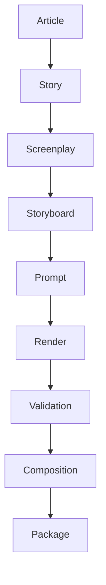

Visualization supports debugging and architecture review.

---

# Incremental Planning

The Build Orchestrator consumes the graph.

Algorithm

```text
Changed Node

↓

Traverse Descendants

↓

Invalidate

↓

Create Execution Plan

↓

Execute Only Invalid Nodes
```

This enables deterministic incremental execution.

---

# Provenance Traversal

The graph supports reverse provenance.

Example

```text
Render Asset

↑

Prompt

↑

Storyboard

↑

Screenplay

↑

Story

↑

Article
```

Every artifact can be traced to its originating article.

---

# Graph Metrics

Collected metrics

```yaml
metrics:

  node_count

  edge_count

  graph_depth

  average_branching_factor

  invalidated_nodes

  reused_nodes

  traversal_latency
```

These metrics support optimization analysis.

---

# Public Interfaces

```python
ArtifactDependencyGraph

DependencyNode

DependencyEdge

DependencyAnalyzer

ImpactAnalyzer

GraphValidator

GraphSerializer
```

Responsibilities

```python
class DependencyAnalyzer:

    build_graph()

    find_descendants()

    find_ancestors()

    determine_impact()


class GraphValidator:

    detect_cycles()

    detect_orphans()

    verify_integrity()
```

---

# Relationship to Subsequent Sections

This section defines **logical dependency relationships**.

The following sections use this graph to implement execution behavior.

* **6.2.6** — Incremental Build Algorithm (graph-driven invalidation and execution)
* **6.2.7** — Partial Rebuild Strategy (minimal regeneration using affected subgraphs)
* **6.2.8** — Prompt Reuse Strategy (prompt dependency analysis)

The Artifact Dependency Graph is therefore the canonical decision engine for all execution optimization.

---

# Acceptance Criteria

Section **6.2.5** is complete when:

* Every artifact is represented as an immutable graph node.
* Every dependency is represented as a directed edge.
* The graph is a deterministic Directed Acyclic Graph (DAG).
* Dependency types are explicitly classified.
* Parent, child, ancestor, and descendant traversal are supported.
* Impact analysis and invalidation planning are graph-driven.
* Cycle, orphan, and duplicate-edge detection are mandatory integrity checks.
* Every artifact can be traced back to its originating article.
* The graph serves as the authoritative dependency model for cache invalidation, incremental execution, and resumable builds.


# Part 6.2.6 — Incremental Build Algorithm

## Insynergy Cinematic Thought Leadership Platform

### Master Specification v2.1

---

# Purpose

This section defines the canonical **Incremental Build Algorithm** for the Insynergy Cinematic Thought Leadership Platform.

The Incremental Build Algorithm determines **exactly which artifacts require regeneration** after one or more inputs have changed.

Its objective is to minimize computational work while guaranteeing:

* deterministic outputs;
* dependency correctness;
* reproducibility;
* cache consistency;
* architectural integrity.

Unlike conventional build systems that rebuild entire pipelines, the Incremental Build Algorithm regenerates **only the minimal dependency subgraph**.

---

# Design Philosophy

The platform adopts the following governing principle.

> **Regenerate the smallest valid dependency graph. Never regenerate the entire pipeline unless explicitly requested.**

Execution is therefore graph-driven rather than stage-driven.

---

# Architectural Position

```text id="9gk2wa"
            Artifact Dependency Graph
                       │
                       ▼
          Incremental Build Algorithm
                       │
       ┌───────────────┼────────────────┐
       ▼               ▼                ▼
 Invalid Node     Reusable Node    New Node
       │               │                │
       └───────────────┼────────────────┘
                       ▼
              Execution Plan
                       │
                       ▼
              Build Orchestrator
```

The Incremental Build Algorithm consumes the **Artifact Dependency Graph** and produces an **Execution Plan**.

---

# Responsibilities

The Incremental Build Algorithm is responsible for:

* change detection;
* dependency traversal;
* invalidation planning;
* reuse planning;
* execution planning;
* rebuild minimization.

It is **not** responsible for:

* cache storage;
* rendering;
* scheduling;
* composition;
* publication.

---

# Inputs

Required inputs:

```yaml id="d2rw83"
inputs:

  dependency_graph

  current_manifest

  previous_manifest

  runtime_configuration

  cache_index
```

Optional inputs:

```yaml id="xzlp6h"
optional:

  changed_files

  changed_assets

  changed_configuration
```

---

# Outputs

Primary output:

```text id="5z1vwn"
execution-plan.json
```

Secondary outputs:

```text id="m7d8pk"
impact-report.json

reuse-report.json

invalidation-report.json
```

---

# Algorithm Overview

```text id="7pk4vo"
Detect Changes

↓

Locate Graph Nodes

↓

Traverse Descendants

↓

Invalidate

↓

Locate Reusable Artifacts

↓

Generate Execution Plan

↓

Execute
```

The algorithm is deterministic.

---

# Step 1 — Detect Changes

Every build begins by identifying changes.

Possible sources:

* article modifications;
* screenplay edits;
* storyboard updates;
* provider profile changes;
* runtime configuration changes;
* engine version changes.

Changes are normalized before comparison.

---

# Step 2 — Resolve Artifact Nodes

Each detected change maps to graph nodes.

Example

```text id="2fwz8u"
story.md

↓

Story Node
```

The graph becomes the only source of dependency information.

---

# Step 3 — Dependency Traversal

Traversal begins at every changed node.

Traversal direction

```text id="ewfg7q"
Changed Node

↓

Descendants
```

Ancestor traversal is prohibited during invalidation.

---

# Step 4 — Invalidation

Every affected descendant is classified.

```yaml id="nb4ozd"
classification:

  reusable

  invalid

  regenerated

  unchanged
```

Classification is deterministic.

---

# Step 5 — Reuse Evaluation

Each invalidated node attempts reuse.

Decision tree

```text id="e4vpkm"
Artifact Exists?

↓

YES

↓

Compatible?

↓

YES

↓

Reuse

↓

NO

↓

Regenerate
```

Compatibility requires:

* matching content hash;
* matching schema version;
* matching dependency hashes;
* matching execution profile.

---

# Step 6 — Execution Planning

Only nodes requiring regeneration become executable tasks.

Output example

```yaml id="gdcjlwm"
execution:

  regenerate:

    - prompt_scene_06

    - render_scene_06

    - validation_scene_06

  reuse:

    - story

    - screenplay

    - storyboard

    - render_scene_01
```

---

# Canonical Algorithm

Pseudo-code

```python id="w3uhq7"
changed = detect_changes()

affected = dependency_graph.descendants(changed)

for node in affected:

    if cache.is_valid(node):

        reuse(node)

    else:

        invalidate(node)

execution_plan = planner.generate()

execute(execution_plan)
```

No implementation may alter this logical sequence.

---

# Graph Traversal Rules

Traversal always proceeds forward.

Allowed

```text id="up0r3d"
Story

↓

Screenplay

↓

Storyboard
```

Forbidden

```text id="tnz34n"
Storyboard

↓

Story
```

Backward invalidation is prohibited.

---

# Incremental Execution Rules

Rule 1

Planning artifacts remain immutable.

---

Rule 2

Only descendants are invalidated.

---

Rule 3

Reusable artifacts remain untouched.

---

Rule 4

Validation executes only for regenerated artifacts.

---

Rule 5

Composition executes only if composition inputs changed.

---

# Partial Rebuild Example

Scenario

```text id="b4kr0h"
Dialogue Updated

↓

Narration

↓

Composition
```

Execution

Reuse

* Story
* Screenplay
* Storyboard
* Render Assets

Regenerate

* Narration
* Composition

Rendering is skipped entirely.

---

# Render Change Example

Scenario

```text id="v7mz6q"
Render Scene 08

↓

Rejected
```

Execution

Reuse

* Story
* Screenplay
* Storyboard
* Prompt

Regenerate

* Render Scene 08
* Validation Scene 08
* Composition

Only one render task is submitted.

---

# Story Change Example

Scenario

```text id="hv0a5j"
Story Updated
```

Execution

Invalidate

* Story
* Screenplay
* Storyboard
* Prompt
* Render
* Validation
* Composition

Full downstream rebuild.

---

# Configuration Change Matrix

| Configuration Change      | Regeneration Scope                         |
| ------------------------- | ------------------------------------------ |
| Logging                   | None                                       |
| Worker Count              | None                                       |
| Retry Policy              | None                                       |
| Provider Model            | Prompt → Render → Validation → Composition |
| Story Engine Version      | Story and descendants                      |
| Screenplay Engine Version | Screenplay and descendants                 |
| FFmpeg Profile            | Composition only                           |

Operational configuration changes should not invalidate creative artifacts.

---

# Execution Categories

Each node receives one action.

```yaml id="fljlwm"
action:

  reuse

  regenerate

  validate_only

  compose_only

  skip
```

Exactly one action is assigned.

---

# Rebuild Granularity

Default regeneration unit

```text id="q2v9pr"
Shot
```

Exceptions

| Artifact    | Regeneration Unit |
| ----------- | ----------------- |
| Story       | Document          |
| Screenplay  | Scene             |
| Storyboard  | Shot              |
| Prompt      | Shot              |
| Render      | Shot              |
| Validation  | Asset             |
| Composition | Timeline          |

---

# Safety Guarantees

The algorithm guarantees:

* deterministic execution;
* no unnecessary rendering;
* dependency correctness;
* reproducible outputs;
* cache consistency.

It does **not** guarantee identical provider-generated imagery.

Provider stochasticity is outside algorithm scope.

---

# Failure Handling

If dependency analysis fails:

```text id="lz6q8a"
Abort

↓

Report

↓

No Execution
```

Executing with an incomplete dependency graph is prohibited.

---

# Performance Characteristics

Expected complexity

```text id="n2djlwm"
Change Detection

O(1)

Traversal

O(V + E)

Execution Planning

O(V)
```

Where

* V = graph nodes
* E = graph edges

The algorithm scales linearly with graph size.

---

# Incremental Build Report

Each build generates

```yaml id="h1o7zu"
report:

  changed_nodes

  invalidated_nodes

  reused_nodes

  regenerated_nodes

  execution_time_saved

  render_requests_saved

  estimated_cost_saved
```

The report is stored in the Build Manifest.

---

# Public Interfaces

```python id="8wtjlwm"
IncrementalBuildEngine

ChangeDetector

ImpactAnalyzer

ReusePlanner

ExecutionPlanner

IncrementalReportGenerator
```

Responsibilities

```python id="3zyjlwm"
class IncrementalBuildEngine:

    detect_changes()

    invalidate()

    reuse()

    generate_plan()


class ImpactAnalyzer:

    descendants()

    affected_nodes()

    estimate_scope()


class ReusePlanner:

    evaluate()

    classify()

    report()
```

---

# Relationship to Subsequent Sections

This section defines **how execution plans are generated**.

The following sections specialize that behavior.

* **6.2.7** — Partial Rebuild Strategy (domain-specific rebuild rules)
* **6.2.8** — Prompt Reuse Strategy (prompt-level reuse and invalidation)
* **6.2.9** — Cache Consistency (correctness guarantees)
* **6.2.10** — Cache Lifecycle (artifact state management)

The Incremental Build Algorithm provides the deterministic decision engine for all execution optimization.

---

# Acceptance Criteria

Section **6.2.6** is complete when:

* A deterministic Incremental Build Algorithm is formally specified.
* Change detection is separated from dependency traversal.
* Descendant-based invalidation is mandatory.
* Reuse evaluation precedes regeneration.
* Execution plans contain only the minimal set of regeneration tasks.
* Configuration changes invalidate only compatible artifact domains.
* Partial rebuilds preserve unaffected artifacts.
* Complexity, safety guarantees, and failure behavior are explicitly defined.
* Every incremental build produces an auditable execution report describing reuse, regeneration, time savings, and cost savings.


# Part 6.2.7 — Partial Rebuild Strategy

## Insynergy Cinematic Thought Leadership Platform

### Master Specification v2.1

---

# Purpose

This section defines the **Partial Rebuild Strategy**, which determines the minimum executable scope required after one or more artifacts have changed.

While Section **6.2.6 Incremental Build Algorithm** determines *what* must be invalidated, this section defines *how much* of the pipeline must actually be rebuilt.

The objective is to minimize:

* build duration
* rendering requests
* cloud cost
* unnecessary validation
* unnecessary composition

while preserving deterministic correctness.

---

# Design Philosophy

The platform adopts the following governing principle.

> **Rebuild the smallest semantically correct unit.**

A semantic unit represents the smallest artifact that can be regenerated without introducing inconsistency.

This is different from the smallest file.

Example

```text id="rps1d1"
One sentence changes

↓

Narration

↓

NOT Story
```

---

# Architectural Position

```text id="gwy5j6"
Artifact Dependency Graph
          │
          ▼
Incremental Build Engine
          │
          ▼
Partial Rebuild Planner
          │
          ▼
Execution Plan
          │
          ▼
Build Orchestrator
```

The Partial Rebuild Planner consumes dependency analysis and produces the minimal execution scope.

---

# Responsibilities

The Partial Rebuild Strategy is responsible for:

* rebuild scope calculation;
* semantic impact classification;
* regeneration minimization;
* rebuild optimization;
* execution grouping.

It is **not** responsible for:

* dependency graph generation;
* cache persistence;
* rendering;
* scheduling.

---

# Rebuild Hierarchy

Artifacts are grouped into rebuild scopes.

```text id="ph5sl4"
Document

↓

Act

↓

Scene

↓

Shot

↓

Asset
```

The planner always chooses the smallest valid scope.

---

# Canonical Rebuild Units

| Artifact    | Rebuild Unit     |
| ----------- | ---------------- |
| Article     | Document         |
| Story       | Document         |
| Screenplay  | Scene            |
| Storyboard  | Shot             |
| Prompt      | Shot             |
| Render      | Shot             |
| Validation  | Asset            |
| Composition | Timeline Segment |
| Packaging   | Metadata         |

This table is normative.

---

# Semantic Impact Levels

Every change is classified.

```yaml id="m2pfzs"
impact:

  none

  cosmetic

  editorial

  structural

  architectural
```

Definitions

| Level         | Meaning                    |
| ------------- | -------------------------- |
| None          | No rebuild required        |
| Cosmetic      | Metadata only              |
| Editorial     | Local rebuild              |
| Structural    | Downstream subtree rebuild |
| Architectural | Full downstream rebuild    |

---

# Change Classification

Example

```text id="l4wr91"
Typo

↓

Cosmetic
```

```text id="qntd6h"
Dialogue

↓

Editorial
```

```text id="g3r7qs"
Story Premise

↓

Architectural
```

---

# Rebuild Decision Matrix

| Change           | Rebuild Scope           |
| ---------------- | ----------------------- |
| Metadata         | Package                 |
| Thumbnail        | Thumbnail               |
| Subtitle         | Composition             |
| Music            | Composition             |
| Narration        | Narration + Composition |
| Prompt           | Prompt + Render         |
| Camera           | Shot                    |
| Character        | Scene                   |
| Storyboard       | Shot                    |
| Screenplay Scene | Scene                   |
| Story            | Entire downstream graph |

---

# Example 1 — Subtitle Update

Input

```text id="o8qjlwm"
Subtitle corrected
```

Execution

Reuse

* Story
* Screenplay
* Storyboard
* Prompt
* Render

Regenerate

* Subtitle
* Composition

---

# Example 2 — Narration Update

Input

```text id="jlwm91"
Voice timing changed
```

Execution

Reuse

* Story
* Screenplay
* Storyboard
* Prompt
* Render

Regenerate

* Narration
* Timeline
* Composition

---

# Example 3 — Camera Update

Input

```text id="gjlwm8"
Shot 08

Camera changed
```

Execution

Reuse

* Story
* Screenplay
* Other Shots

Regenerate

* Prompt
* Render
* Validation

for Shot 08 only.

---

# Example 4 — Character Costume

Input

```text id="jlwmc5"
Character Bible updated
```

Impact

Affected shots only.

Execution

Reuse

* Story
* Screenplay

Regenerate

* Prompts
* Render Assets
* Validation

for affected shots.

---

# Example 5 — Story Change

Input

```text id="jlwmd9"
Story revised
```

Execution

Invalidate

Entire downstream graph.

Partial rebuild is impossible.

---

# Timeline Segmentation

Composition is divided into segments.

```text id="jlwmx3"
Opening

↓

Middle

↓

Climax

↓

Ending
```

If only one segment changes:

Only that segment is recomposed.

Final concatenation is then regenerated.

---

# Segment Composition

Example

```text id="jlwmm2"
Scene 6 changed

↓

Middle Segment

↓

Compose Middle

↓

Merge Final
```

Opening and Ending remain unchanged.

---

# Render Grouping

Related shots may be regenerated together.

Example

```text id="jlwmf7"
Scene 4

Shot A

Shot B

Shot C
```

If:

* identical location
* identical character
* continuous camera

The planner may batch rendering.

Batching must never change shot identity.

---

# Prompt Rebuild Rules

Prompt regeneration occurs only if one of the following changes:

* Character Bible
* Location Bible
* Camera Plan
* Blocking
* Emotion
* Prompt Template
* Provider Profile

Otherwise prompts remain valid.

---

# Validation Rebuild Rules

Validation executes only for regenerated assets.

Previously approved assets remain approved.

Validation shall never rerun globally.

---

# Composition Rebuild Rules

Composition regenerates only when one or more of the following change:

* video asset
* narration
* subtitle
* music
* timeline

Metadata changes alone do not require composition.

---

# Packaging Rebuild Rules

Packaging regenerates only when:

* metadata changes;
* publication targets change;
* thumbnails change.

Rendering is never triggered.

---

# Rebuild Cost Estimation

Before execution, the planner estimates rebuild cost.

Example

```yaml id="jlwm73"
estimate:

  shots: 2

  renders: 2

  validation: 2

  composition: partial

  estimated_cost_usd: 3.20

  estimated_duration_minutes: 6
```

This estimate becomes part of the Execution Plan.

---

# Optimization Rules

The planner always prefers:

```text id="jlwm92"
Reuse

↓

Partial Rebuild

↓

Full Rebuild
```

A Full Rebuild requires explicit justification.

---

# Safety Rules

Partial rebuilds shall never:

* violate dependency integrity;
* mix incompatible versions;
* bypass Quality Gates;
* reuse stale assets;
* invalidate approved provenance.

Correctness takes precedence over rebuild size.

---

# Partial Rebuild Report

Every execution generates:

```yaml id="jlwm31"
partial_rebuild:

  changed_nodes

  reused_nodes

  regenerated_nodes

  skipped_nodes

  saved_render_requests

  saved_minutes

  saved_cost
```

The report is stored in the Build Manifest.

---

# Public Interfaces

```python id="jlwm04"
PartialRebuildPlanner

ImpactClassifier

ScopeResolver

RebuildEstimator

TimelineSegmentPlanner
```

Responsibilities

```python id="jlwm55"
class PartialRebuildPlanner:

    classify_change()

    determine_scope()

    create_plan()


class ImpactClassifier:

    classify()

    estimate_cost()

    estimate_duration()


class ScopeResolver:

    affected_shots()

    affected_segments()

    affected_assets()
```

---

# Relationship to Subsequent Sections

This section determines **how much of the pipeline is rebuilt**.

Subsequent sections define:

* **6.2.8** — Prompt Reuse Strategy (fine-grained prompt compatibility)
* **6.2.9** — Cache Consistency (correctness guarantees during reuse)
* **6.2.10** — Cache Lifecycle (artifact state evolution)

Together they enable deterministic, low-cost, high-throughput production without compromising narrative or visual integrity.

---

# Acceptance Criteria

Section **6.2.7** is complete when:

* Rebuild scope is determined using semantic impact rather than file-level changes.
* Canonical rebuild units are defined for every artifact type.
* Semantic impact levels are standardized.
* Decision matrices cover common modification scenarios.
* Timeline segmentation enables partial composition.
* Validation and rendering execute only for affected artifacts.
* Cost and duration are estimated before execution.
* Partial rebuild reports quantify time, cost, and render requests saved.
* Partial rebuilds preserve correctness, provenance, and Quality Gate compliance while minimizing unnecessary execution.


# Part 6.2.8 — Prompt Reuse Strategy

## Insynergy Cinematic Thought Leadership Platform

### Master Specification v2.1

---

# Purpose

This section defines the **Prompt Reuse Strategy** for the Insynergy Cinematic Thought Leadership Platform.

Prompt generation is one of the most expensive planning activities because it directly influences downstream rendering.

Although prompt generation itself is inexpensive compared with video generation, **small prompt changes frequently invalidate expensive render assets**.

The Prompt Reuse Strategy minimizes unnecessary prompt regeneration while preserving:

* visual consistency
* character continuity
* deterministic rendering
* cache correctness
* provider independence

---

# Design Philosophy

The platform adopts one governing principle.

> **A prompt is a compiled artifact, not handwritten text.**

Prompts are not authored manually.

They are deterministically assembled from approved planning artifacts.

Therefore:

* prompts are reproducible;
* prompts are cacheable;
* prompts are versioned;
* prompts participate in dependency analysis.

---

# Architectural Position

```text id="i5pz2u"
Character Bible
        │
        ▼
Location Bible
        │
        ▼
Camera Plan
        │
        ▼
Storyboard
        │
        ▼
Prompt Compiler
        │
        ▼
Compiled Prompt
        │
        ▼
Render Cache
```

The Prompt Compiler is the only component permitted to construct rendering prompts.

---

# Responsibilities

The Prompt Reuse Strategy is responsible for:

* prompt generation;
* prompt normalization;
* prompt hashing;
* prompt compatibility;
* prompt reuse;
* prompt invalidation.

It is **not** responsible for:

* screenplay generation;
* rendering;
* provider execution;
* shot planning.

---

# Prompt Philosophy

A prompt represents the **visual specification** of one shot.

It is not:

* a screenplay;
* an article summary;
* free-form prose.

It is the deterministic compilation of planning artifacts into provider-compatible instructions.

---

# Prompt Components

Every compiled prompt consists of the following logical sections.

```text id="9j8swd"
Character

↓

Location

↓

Composition

↓

Camera

↓

Lighting

↓

Blocking

↓

Emotion

↓

Action

↓

Visual Style

↓

Provider Directives
```

The ordering is fixed.

---

# Prompt Schema

Canonical model

```yaml id="j1x8am"
prompt:

  prompt_id:

  shot_id:

  prompt_version:

  provider:

  provider_profile:

  character_ref:

  location_ref:

  camera_ref:

  lighting_ref:

  emotion_ref:

  blocking_ref:

  style_ref:

  checksum:
```

Free-form prompt editing is prohibited.

---

# Prompt Identity

Prompt identity is calculated from its compiled representation.

```text id="o2mhvl"
Prompt Hash

=

SHA-256(

Compiled Prompt

+

Prompt Compiler Version

+

Provider Profile

)
```

Two identical compiled prompts always produce identical hashes.

---

# Prompt Compilation

Compilation follows the same sequence.

```text id="w4ncde"
Storyboard

↓

Resolve References

↓

Normalize

↓

Expand Templates

↓

Generate Prompt

↓

Hash

↓

Store
```

Every stage is deterministic.

---

# Prompt Templates

Prompt generation uses structured templates.

Example

```text id="x0lyqg"
{character}

inside

{location}

captured with

{camera}

under

{lighting}

while

{action}
```

Templates are version-controlled artifacts.

---

# Reference Resolution

The Prompt Compiler resolves references rather than duplicating descriptions.

Example

```yaml id="p9hrub"
character:

  ref:

    maya_v2
```

↓

Resolved

```text id="l3kwaj"
Enterprise Risk Director
...
```

The compiled prompt contains expanded values.

---

# Prompt Compatibility

A prompt is reusable only when all dependencies remain compatible.

Required compatibility:

* Character Bible
* Location Bible
* Camera Plan
* Lighting Plan
* Blocking
* Storyboard
* Prompt Template
* Provider Profile

Failure in any dependency invalidates the prompt.

---

# Prompt Compatibility Matrix

| Change           | Prompt Reuse |
| ---------------- | ------------ |
| Subtitle         | Yes          |
| Music            | Yes          |
| Narration        | Yes          |
| Packaging        | Yes          |
| Storyboard       | No           |
| Camera           | No           |
| Character        | No           |
| Location         | No           |
| Prompt Template  | No           |
| Provider Profile | No           |

This matrix is normative.

---

# Prompt Versioning

Every prompt records:

```yaml id="m8gczn"
prompt:

  compiler_version:

  template_version:

  provider_version:

  schema_version:
```

Version changes invalidate only affected prompts.

---

# Prompt Normalization

Before hashing:

* whitespace is normalized;
* line endings are normalized;
* reference expansion is deterministic;
* ordering is fixed;
* provider directives are canonicalized.

Normalization guarantees stable hashes.

---

# Prompt Classification

Prompts are classified by purpose.

```yaml id="i9lqer"
prompt_type:

  render

  image

  animation

  transition

  title
```

Each type follows its own template.

---

# Prompt Reuse Decision

Workflow

```text id="z4evyx"
Locate Prompt

↓

Verify Dependencies

↓

Verify Versions

↓

Verify Provider

↓

Compatible?

↓

YES

↓

Reuse

↓

NO

↓

Recompile
```

Recompilation occurs only when necessary.

---

# Provider Isolation

Provider-specific syntax is isolated.

Example

```text id="wbn9r5"
Storyboard

↓

Canonical Prompt

↓

Provider Adapter

↓

Runway Prompt
```

Switching providers does not require Storyboard regeneration.

---

# Prompt Storage

Compiled prompts are stored as immutable CAS objects.

Example

```text id="s0tmfr"
prompt/

sha256/

ab/

abcdef...
```

Metadata references:

* Shot
* Storyboard
* Template
* Provider

---

# Prompt Provenance

Every prompt records provenance.

```yaml id="km6x0w"
provenance:

  shot:

  storyboard:

  template:

  compiler:

  build:
```

This supports deterministic reconstruction.

---

# Prompt Validation

Validation checks

* template completeness;
* unresolved references;
* duplicate sections;
* invalid provider directives;
* schema compatibility.

Invalid prompts are rejected before rendering.

---

# Prompt Optimization

The Prompt Compiler shall remove redundant information.

Example

Instead of repeating:

```text id="w8tdmi"
executive operations center
```

five times,

the compiler references the Location Bible once and expands it during compilation.

Optimization must not alter meaning.

---

# Prompt Metrics

Collected metrics

```yaml id="mjlwm9"
metrics:

  prompts_generated

  prompts_reused

  prompts_invalidated

  compilation_latency

  average_prompt_length

  provider_specific_sections

  render_requests_saved
```

These metrics contribute to optimization reports.

---

# Prompt Cache Policy

The Prompt Cache follows these rules.

* immutable
* content-addressed
* dependency-aware
* provider-aware
* version-aware

Prompt reuse is preferred over recompilation.

---

# Prompt Security

Compiled prompts may contain proprietary institutional information.

Requirements

* encrypted storage where required;
* audit logging;
* access control;
* prompt redaction in public logs;
* provider-specific secret removal.

Sensitive prompts shall never appear in telemetry.

---

# Public Interfaces

```python id="7rmpga"
PromptCompiler

PromptTemplateEngine

PromptNormalizer

PromptCompatibilityChecker

PromptRepository

PromptValidator
```

Responsibilities

```python id="h7a2fe"
class PromptCompiler:

    compile()

    normalize()

    hash()

    store()


class PromptCompatibilityChecker:

    verify()

    compare_versions()

    determine_reuse()


class PromptValidator:

    validate_schema()

    validate_provider()

    validate_references()
```

---

# Relationship to Subsequent Sections

This section defines **how prompts become reusable execution artifacts**.

Subsequent sections define:

* **6.2.9** — Cache Consistency (ensuring reused prompts remain valid)
* **6.2.10** — Cache Lifecycle (prompt state transitions)
* **6.2.11** — Cache Governance (authority over invalidation)

Prompt reuse therefore acts as the bridge between Storyboard planning and provider rendering while minimizing unnecessary recompilation and downstream rendering cost.

---

# Acceptance Criteria

Section **6.2.8** is complete when:

* Prompts are formally defined as compiled artifacts rather than free-form text.
* Prompt identity is determined by deterministic compilation and content hashing.
* Prompt compatibility depends on explicit planning artifacts and provider configuration.
* Provider-specific syntax is isolated behind adapters.
* Prompt normalization guarantees stable hashes.
* Prompt reuse decisions are deterministic and dependency-aware.
* Prompt provenance, validation, metrics, and security requirements are formally specified.
* The Prompt Reuse Strategy minimizes recompilation while preserving visual consistency and provider independence.


# Part 6.2.9 — Cache Consistency & Integrity Management

## Insynergy Cinematic Thought Leadership Platform

### Master Specification v2.1

---

# Purpose

This section defines the **Cache Consistency & Integrity Management** architecture.

The purpose of this subsystem is to guarantee that every cached artifact used during execution is:

* correct;
* complete;
* internally consistent;
* dependency-consistent;
* cryptographically verifiable;
* architecturally trustworthy.

A cache hit is **not** sufficient for reuse.

The artifact must first be proven consistent.

---

# Design Philosophy

The platform adopts one governing principle.

> **Reuse is permitted only after consistency has been proven.**

The objective of the Cache Layer is **not** maximizing cache-hit rate.

The objective is maximizing **safe reuse**.

---

# Architectural Position

```text id="nn6t0m"
Content Addressable Storage
            │
            ▼
 Cache Consistency Engine
            │
     ┌──────┼──────┐
     ▼      ▼      ▼
 Integrity  Dependency  Compatibility
 Validation Validation Validation
            │
            ▼
     Cache Decision
            │
            ▼
Incremental Build
```

The Cache Consistency Engine is executed before every cache reuse decision.

---

# Responsibilities

The Cache Consistency Engine is responsible for:

* integrity verification;
* dependency consistency;
* version compatibility;
* cache health monitoring;
* corruption detection;
* stale artifact detection;
* consistency reporting.

It is **not** responsible for:

* cache storage;
* dependency graph generation;
* rendering;
* orchestration.

---

# Consistency Model

A cache object is reusable only if **all** consistency checks succeed.

```text id="u8n2ad"
Object Exists

↓

Integrity

↓

Dependency

↓

Version

↓

Schema

↓

Approval

↓

Reusable
```

Failure of any stage rejects reuse.

---

# Consistency Levels

The platform defines five consistency levels.

| Level | Description             |
| ----- | ----------------------- |
| C0    | Exists                  |
| C1    | Cryptographically valid |
| C2    | Dependency consistent   |
| C3    | Version compatible      |
| C4    | Fully reusable          |

Production execution requires **C4**.

---

# Integrity Verification

Every object undergoes checksum verification.

Workflow

```text id="db6gye"
Load Object

↓

SHA-256

↓

Compare

↓

Match?

↓

YES

↓

Continue

↓

NO

↓

Reject
```

Checksum mismatch immediately invalidates the object.

---

# Schema Verification

The cache object schema must match the current schema version.

Example

```yaml id="9bjlwm"
schema:

  version: 2.0
```

Unsupported schema versions are treated as incompatible.

Migration is handled separately.

---

# Version Compatibility

The following versions are verified.

```yaml id="hrjlwm"
versions:

  pipeline

  engine

  template

  provider

  configuration
```

Any incompatible version invalidates the artifact.

---

# Dependency Consistency

Every dependency hash must match.

Example

```text id="jlwm32"
Storyboard

↓

Prompt

↓

Render
```

If Storyboard hash changes

↓

Prompt becomes inconsistent

↓

Render becomes inconsistent

↓

Reuse prohibited

---

# Configuration Consistency

Configuration-dependent artifacts verify

* provider profile
* prompt template
* rendering profile
* validation profile

Operational configuration

(example: worker count)

does **not** invalidate artifacts.

Creative configuration does.

---

# Approval Consistency

Approved assets require approval compatibility.

Example

```text id="jlwm63"
Approved

↓

Approved Build

↓

Reusable
```

Preview assets cannot satisfy Final approval.

---

# Provider Consistency

Provider-generated artifacts verify

```yaml id="jlwm10"
provider:

  runway

provider_profile:

  gen4.5
```

Changing provider profile invalidates render assets.

Changing scheduler configuration does not.

---

# Artifact Compatibility Matrix

| Validation   | Result |
| ------------ | ------ |
| Integrity    | Pass   |
| Schema       | Pass   |
| Dependencies | Pass   |
| Versions     | Pass   |
| Approval     | Pass   |
| Provider     | Pass   |

Only a full pass permits reuse.

---

# Corruption Detection

Corruption categories

```yaml id="jlwm90"
corruption:

  checksum

  missing_file

  invalid_metadata

  truncated_payload

  malformed_schema
```

Corrupted objects are quarantined.

---

# Staleness Detection

Stale artifacts remain structurally valid.

However

dependency mismatch exists.

Example

```text id="jlwm81"
Prompt

↓

Old Storyboard

↓

Stale
```

Stale artifacts are regenerated.

---

# Orphan Detection

An orphan object has no reachable dependency path.

Workflow

```text id="jlwm82"
Object

↓

No Parent

↓

Report

↓

Retention Policy
```

Automatic deletion is configurable.

---

# Duplicate Detection

Objects with identical hashes

↓

One physical object

↓

Many logical references

Duplicate payload storage is prohibited.

---

# Incompatible Artifact Detection

Objects are incompatible if:

* provider changed
* schema changed
* engine changed
* dependency hash changed
* approval level changed

Compatibility is binary.

---

# Consistency Decision Matrix

| Check      | Pass     | Fail             |
| ---------- | -------- | ---------------- |
| Integrity  | Continue | Reject           |
| Schema     | Continue | Reject           |
| Dependency | Continue | Regenerate       |
| Version    | Continue | Regenerate       |
| Approval   | Continue | Downgrade/Reject |
| Provider   | Continue | Regenerate       |

This matrix is normative.

---

# Consistency Report

Every build generates

```yaml id="jlwm71"
consistency:

  checked

  valid

  stale

  corrupted

  regenerated

  reused
```

The report becomes part of the Build Manifest.

---

# Health Score

Every cache namespace receives a health score.

Formula

```text id="jlwm20"
Health

=

Integrity

+

Consistency

+

Availability

+

Reuse
```

Output

```yaml id="jlwm74"
health:

  score: 98

  grade: A
```

Health scores support operational monitoring.

---

# Consistency Metrics

Collected metrics

```yaml id="jlwm21"
metrics:

  consistency_checks

  failed_checks

  stale_objects

  corrupted_objects

  orphan_objects

  regenerated_objects

  reused_objects

  verification_latency
```

Metrics feed the Performance Dashboard.

---

# Self-Healing Policy

Certain inconsistencies may be repaired automatically.

Allowed

* regenerate stale prompt
* rebuild validation metadata
* recreate dependency index

Forbidden

* modify approved render asset
* rewrite immutable CAS object
* alter checksum
* change provenance

Self-healing never changes immutable artifacts.

---

# Consistency Security

Requirements

* checksum verification before use;
* immutable metadata;
* append-only audit log;
* namespace isolation;
* provenance preservation;
* access-controlled repair operations.

Consistency verification shall precede every cache reuse.

---

# Public Interfaces

```python id="jlwm57"
CacheConsistencyEngine

IntegrityValidator

DependencyConsistencyChecker

CompatibilityChecker

HealthMonitor

ConsistencyReporter
```

Responsibilities

```python id="jlwm44"
class CacheConsistencyEngine:

    verify()

    classify()

    approve_reuse()

    generate_report()


class IntegrityValidator:

    verify_checksum()

    verify_payload()


class CompatibilityChecker:

    verify_versions()

    verify_dependencies()

    verify_provider()
```

---

# Relationship to Subsequent Sections

This section establishes **when cached artifacts are trustworthy**.

Subsequent sections build upon this foundation.

* **6.2.10** — Cache Lifecycle (state transitions of trusted artifacts)
* **6.2.11** — Cache Governance (authority over cache mutation)
* **6.2.12** — Shared Cache (distributed consistency)
* **6.2.13** — Optimization Metrics (system-wide optimization evidence)

Cache Consistency is therefore the trust boundary between cached artifacts and execution.

---

# Acceptance Criteria

Section **6.2.9** is complete when:

* Cache consistency is formally separated from cache existence.
* Every cache reuse decision requires integrity, dependency, version, approval, and provider validation.
* Consistency levels are standardized from C0 through C4.
* Corruption, staleness, orphaning, duplication, and incompatibility are explicitly handled.
* Health scoring and consistency metrics support operational monitoring.
* Self-healing is limited to regenerable artifacts and never modifies immutable approved assets.
* The Cache Consistency Engine serves as the authoritative trust gate for all artifact reuse within the Execution Optimization Layer.


# Part 6.2.10 — Cache Lifecycle Management

## Insynergy Cinematic Thought Leadership Platform

### Master Specification v2.1

---

# Purpose

This section defines the **Cache Lifecycle Management** architecture.

Where previous sections define:

* how artifacts are cached,
* how they are identified,
* how they are validated,

this section defines **how cached artifacts evolve over time**.

Every cached artifact shall follow a deterministic lifecycle from creation through retirement.

The lifecycle guarantees:

* traceability
* reproducibility
* auditability
* safe cleanup
* deterministic reuse

---

# Design Philosophy

The platform adopts one governing principle.

> **A cache object is never modified. It only progresses through states.**

Artifacts evolve by changing lifecycle state—not by changing content.

Content remains immutable.

State changes remain append-only.

---

# Architectural Position

```text id="2smpm4"
Content Addressable Storage
          │
          ▼
Cache Lifecycle Manager
          │
    ┌─────┼─────┐
    ▼     ▼     ▼
Retention Archive Cleanup
          │
          ▼
Execution Optimization Layer
```

Lifecycle management governs every cache namespace.

---

# Responsibilities

The Cache Lifecycle Manager is responsible for:

* lifecycle transitions
* retention policies
* archival
* cleanup
* expiration
* restoration
* lifecycle auditing

It is **not** responsible for:

* dependency analysis
* cache lookup
* rendering
* orchestration

---

# Lifecycle Model

Every cache object follows the same canonical lifecycle.

```text id="hxpc9v"
CREATED

↓

VALIDATED

↓

APPROVED

↓

REFERENCED

↓

ARCHIVED

↓

EXPIRED

↓

DELETED
```

Only forward transitions are allowed.

---

# Lifecycle States

## CREATED

Artifact has been generated.

Characteristics

* immutable payload
* metadata incomplete
* not reusable

---

## VALIDATED

Technical validation completed.

Examples

* checksum verified
* schema verified
* dependency verified

Reusable only after approval.

---

## APPROVED

Editorial and technical validation complete.

Characteristics

* reusable
* immutable
* referenceable

This is the normal operational state.

---

## REFERENCED

Artifact is actively used by one or more builds.

Example

```text id="dbx6dp"
Render Asset

↓

Referenced

↓

Build A

Build B

Build C
```

Referenced objects are protected from deletion.

---

## ARCHIVED

Artifact is no longer actively referenced.

Characteristics

* retained
* immutable
* reusable
* lower storage priority

Archived objects remain discoverable.

---

## EXPIRED

Retention period has elapsed.

Characteristics

* candidate for cleanup
* still recoverable
* no longer eligible for new builds

Deletion is not automatic.

---

## DELETED

Object removed.

Metadata remains.

Payload removed.

Deletion is irreversible.

---

# Lifecycle State Diagram

```text id="djlwm0"
CREATED

↓

VALIDATED

↓

APPROVED

↓

REFERENCED

↓

ARCHIVED

↓

EXPIRED

↓

DELETED
```

Backward transitions are prohibited.

---

# Transition Rules

Every transition requires explicit validation.

Example

```text id="jlwm27"
VALIDATED

↓

APPROVED
```

Requirements

* technical validation
* editorial approval
* metadata complete

---

# Invalid Transitions

Forbidden

```text id="jlwm95"
DELETED

↓

APPROVED
```

```text id="jlwm83"
ARCHIVED

↓

CREATED
```

Lifecycle history is immutable.

---

# Reference Tracking

Every artifact records references.

Example

```yaml id="jlwm11"
references:

  builds:

    - build001

    - build014

    - build103

  active: 3
```

Reference tracking prevents premature cleanup.

---

# Active Object Policy

Objects currently referenced by builds

↓

Protected

↓

Not eligible for deletion

Reference count must reach zero before expiration.

---

# Retention Policy

Retention varies by artifact type.

Example

```yaml id="jlwm14"
retention:

  story:

    forever

  screenplay:

    forever

  storyboard:

    forever

  prompt:

    configurable

  render:

    configurable

  validation:

    configurable

  temporary:

    immediate
```

Approved planning artifacts are permanent by default.

---

# Archive Policy

Archiving preserves:

* payload
* metadata
* provenance
* dependency links

Archived objects remain searchable.

Retrieval latency may increase.

---

# Expiration Policy

Expiration requires

* no active references
* retention elapsed
* integrity verified

Expired objects become cleanup candidates.

---

# Cleanup Policy

Cleanup executes only after expiration.

Workflow

```text id="jlwm15"
Expired

↓

Verify References

↓

Delete Payload

↓

Preserve Metadata
```

Deletion of metadata is prohibited.

---

# Restoration

Archived artifacts may be restored.

Workflow

```text id="jlwm16"
Archived

↓

Requested

↓

Referenced

↓

Reusable
```

Deleted payloads cannot be restored.

---

# Lifecycle Metadata

Every object records

```yaml id="jlwm17"
lifecycle:

  current_state:

  entered_at:

  previous_state:

  transition_reason:

  actor:
```

History is append-only.

---

# Lifecycle History

Example

```yaml id="jlwm18"
history:

  - CREATED

  - VALIDATED

  - APPROVED

  - REFERENCED

  - ARCHIVED
```

History supports auditing.

---

# State Ownership

Only one component owns lifecycle transitions.

| Transition | Owner              |
| ---------- | ------------------ |
| CREATED    | Producer           |
| VALIDATED  | Validation Engine  |
| APPROVED   | Editorial Review   |
| REFERENCED | Build Orchestrator |
| ARCHIVED   | Lifecycle Manager  |
| EXPIRED    | Retention Manager  |
| DELETED    | Cleanup Manager    |

Ownership is exclusive.

---

# Lifecycle Events

Every transition emits an event.

Example

```json id="jlwm19"
{
  "event":"cache.archived",
  "artifact":"render-008",
  "previous":"REFERENCED",
  "current":"ARCHIVED"
}
```

Events are immutable.

---

# Lifecycle Metrics

Collected metrics

```yaml id="jlwm22"
metrics:

  created

  validated

  approved

  archived

  expired

  deleted

  restored

  average_retention_days
```

These metrics support capacity planning.

---

# Storage Tiering

Lifecycle state determines storage tier.

| State      | Storage          |
| ---------- | ---------------- |
| CREATED    | Fast SSD         |
| VALIDATED  | Fast SSD         |
| APPROVED   | Standard Storage |
| REFERENCED | Standard Storage |
| ARCHIVED   | Archive Storage  |
| EXPIRED    | Cleanup Queue    |

Tiering is transparent to callers.

---

# Governance Rules

The following rules are mandatory.

1.

Approved artifacts are immutable.

---

2.

Deleted payloads cannot reappear.

---

3.

Lifecycle transitions are monotonic.

---

4.

Metadata always survives payload deletion.

---

5.

Referenced artifacts are protected.

---

6.

Retention policies are configurable.

---

# Public Interfaces

```python id="jlwm23"
CacheLifecycleManager

RetentionManager

ArchiveManager

CleanupManager

LifecycleEventRecorder

LifecycleReporter
```

Responsibilities

```python id="jlwm24"
class CacheLifecycleManager:

    transition()

    archive()

    restore()

    expire()


class RetentionManager:

    evaluate()

    schedule_cleanup()

    verify_references()


class CleanupManager:

    delete_payload()

    preserve_metadata()

    report()
```

---

# Relationship to Subsequent Sections

This section defines **how cached artifacts evolve over time**.

Subsequent sections define:

* **6.2.11** — Cache Governance (who may authorize lifecycle transitions)
* **6.2.12** — Shared Cache (distributed lifecycle management)
* **6.2.13** — Optimization Metrics (lifecycle performance analysis)

Lifecycle management therefore provides the temporal dimension of the Execution Optimization Layer.

---

# Acceptance Criteria

Section **6.2.10** is complete when:

* Every cache artifact follows a deterministic lifecycle.
* Lifecycle transitions are monotonic and append-only.
* Retention, archival, expiration, restoration, and cleanup are formally defined.
* Reference tracking prevents deletion of active artifacts.
* Metadata survives payload deletion to preserve provenance.
* Storage tiering aligns with lifecycle state.
* Lifecycle events and metrics support auditing and operational planning.
* Cache Lifecycle Management serves as the authoritative state model for every immutable artifact managed by the Execution Optimization Layer.


# Part 6.2.11 — Cache Governance & Authority Model

## Insynergy Cinematic Thought Leadership Platform

### Master Specification v2.1

---

# Purpose

This section defines the **Cache Governance & Authority Model**.

Previous sections define:

* how cache objects are created;
* how they are validated;
* how they evolve;
* how they are reused.

This section defines **who is authorized to perform those actions**.

Cache Governance ensures that cached artifacts are treated as institutional assets rather than temporary implementation details.

Every mutation of cache state shall have an explicitly authorized actor.

---

# Design Philosophy

The platform adopts one governing principle.

> **Cache mutation is an institutional decision, not a technical side effect.**

Accordingly,

* cache creation,
* cache approval,
* cache invalidation,
* cache archival,
* cache deletion

are governed by explicit authority.

No component may modify cache state simply because it has technical capability.

---

# Architectural Position

```text id="gvx0a1"
Build Orchestrator
        │
        ▼
Cache Governance Layer
        │
 ┌──────┼───────────┐
 ▼      ▼           ▼
Authority Policy   Lifecycle Policy
        │
        ▼
Cache Manager
        │
        ▼
Content Addressable Storage
```

The Cache Governance Layer sits between orchestration and storage.

---

# Responsibilities

The Cache Governance Layer is responsible for:

* authority verification;
* cache mutation authorization;
* policy enforcement;
* governance auditing;
* approval validation;
* lifecycle authorization.

It is **not** responsible for:

* rendering;
* scheduling;
* dependency analysis;
* storage implementation.

---

# Governance Principles

The platform permanently adopts the following principles.

### Principle 1

Creation requires ownership.

---

### Principle 2

Reuse requires trust.

---

### Principle 3

Invalidation requires evidence.

---

### Principle 4

Deletion requires authorization.

---

### Principle 5

Every governance decision is auditable.

---

# Governance Domains

Governance is divided into six domains.

| Domain       | Responsibility         |
| ------------ | ---------------------- |
| Creation     | Register new artifacts |
| Validation   | Verify correctness     |
| Approval     | Approve reuse          |
| Invalidation | Withdraw trust         |
| Retention    | Control lifecycle      |
| Deletion     | Remove payload         |

Each domain has a distinct authority.

---

# Authority Model

Every cache operation has one owner.

| Operation  | Authority           |
| ---------- | ------------------- |
| Create     | Producing Engine    |
| Validate   | Validation Engine   |
| Approve    | Editorial Authority |
| Reference  | Build Orchestrator  |
| Invalidate | Dependency Analyzer |
| Archive    | Lifecycle Manager   |
| Delete     | Cleanup Manager     |

Authority may not be shared.

---

# Authority Hierarchy

```text id="x4s9rh"
Editorial Authority

↓

Execution Authority

↓

Technical Authority

↓

Storage Authority
```

Higher authorities may approve lower-level actions.

Lower authorities may not override higher ones.

---

# Governance Decision Model

Every mutation follows the same workflow.

```text id="k4e3pc"
Request

↓

Authority Check

↓

Policy Check

↓

Approval

↓

Execution

↓

Audit Log
```

Skipping governance checks is prohibited.

---

# Creation Policy

New cache objects require:

* successful generation;
* valid checksum;
* complete metadata;
* ownership declaration.

Only then may the object enter the CREATED state.

---

# Validation Policy

Validation authority verifies:

* integrity;
* dependency consistency;
* schema compatibility;
* provider compatibility.

Validation does not imply approval.

---

# Approval Policy

Approval authorizes reuse.

Requirements:

* successful validation;
* provenance complete;
* lifecycle state compatible;
* editorial approval (where required).

Only APPROVED artifacts may participate in production builds.

---

# Invalidation Policy

Invalidation requires explicit evidence.

Acceptable evidence includes:

* dependency change;
* engine version change;
* schema migration;
* configuration incompatibility;
* editorial withdrawal.

Manual invalidation must record justification.

---

# Deletion Policy

Deletion requires all of the following:

* zero active references;
* retention policy satisfied;
* lifecycle state = EXPIRED;
* cleanup authorization.

Deletion without authorization is prohibited.

---

# Governance Rules

The following operations are forbidden.

```text id="m2p9kd"
Modify Approved Artifact

↓

Forbidden
```

```text id="h9n2sy"
Delete Referenced Artifact

↓

Forbidden
```

```text id="j7x4fd"
Reuse Unvalidated Artifact

↓

Forbidden
```

---

# Governance Policies

Policies are declarative.

Example

```yaml id="f6q2mk"
policy:

  approved_only_for_production: true

  delete_requires_zero_references: true

  invalidate_requires_dependency_change: true

  metadata_is_append_only: true
```

Policies are version-controlled.

---

# Separation of Duties

No single component may perform every governance operation.

Example

Wrong

```text id="z6v4pk"
Render Engine

↓

Create

↓

Approve

↓

Delete
```

Correct

```text id="k8w1bm"
Render Engine

↓

Create

Validation Engine

↓

Validate

Editorial Authority

↓

Approve

Cleanup Manager

↓

Delete
```

This separation supports institutional accountability.

---

# Governance Events

Every governance decision emits an event.

Example

```json id="d3w8na"
{
  "event":"cache.approved",
  "artifact":"render-scene-08-shot-02",
  "authority":"EditorialAuthority",
  "timestamp":"2026-07-20T12:34:56Z",
  "reason":"Editorial review passed"
}
```

Events are append-only.

---

# Governance Audit Log

Every mutation is recorded.

Minimum fields

```yaml id="n5u7hr"
audit:

  artifact:

  action:

  authority:

  timestamp:

  justification:

  previous_state:

  new_state:
```

Audit logs are immutable.

---

# Governance Policy Versioning

Every policy declares:

```yaml id="b8q1me"
governance:

  policy_version:

  effective_date:

  approved_by:
```

Policy changes require review.

---

# Governance Exceptions

Exceptions require explicit approval.

Example

```yaml id="y4t8wc"
exception:

  artifact:

  authority:

  justification:

  expires:

  approved_by:
```

Expired exceptions become invalid automatically.

---

# Governance Metrics

Collected metrics

```yaml id="p7r3la"
metrics:

  approvals

  invalidations

  manual_overrides

  deletions

  policy_violations

  exception_count

  audit_events
```

Metrics feed governance dashboards.

---

# Governance Security

Requirements

* append-only audit logs;
* immutable approval records;
* authority verification before mutation;
* policy validation before execution;
* separation of duties;
* tamper detection.

Governance records are considered security-relevant artifacts.

---

# Public Interfaces

```python id="q2m8xt"
CacheGovernanceManager

AuthorityValidator

PolicyEngine

ApprovalManager

GovernanceAuditor

ExceptionRegistry
```

Responsibilities

```python id="v6n4pw"
class CacheGovernanceManager:

    authorize()

    validate_policy()

    record_decision()


class PolicyEngine:

    evaluate()

    resolve_policy()

    verify_authority()


class GovernanceAuditor:

    record_event()

    generate_audit_report()
```

---

# Relationship to Subsequent Sections

This section defines **who is permitted to modify cache state**.

Subsequent sections extend governance across distributed execution.

* **6.2.12** — Shared Cache (multi-runner governance)
* **6.2.13** — Optimization Metrics (governance-aware optimization)
* **6.2.14** — Public Interfaces (complete Execution Optimization API)

The Cache Governance Layer ensures that execution optimization remains institutionally controlled rather than purely technically optimized.

---

# Acceptance Criteria

Section **6.2.11** is complete when:

* Cache governance is formally separated from cache implementation.
* Every cache mutation has exactly one authoritative owner.
* Governance domains are explicitly defined.
* Creation, validation, approval, invalidation, archival, and deletion follow policy-driven authorization.
* Separation of duties prevents a single component from controlling the entire cache lifecycle.
* Governance decisions are fully auditable and append-only.
* Policy versioning and exception management are standardized.
* Cache Governance serves as the institutional authority layer for all cache operations within the Execution Optimization Layer.


# Part 6.2.12 — Shared Cache Architecture

## Insynergy Cinematic Thought Leadership Platform

### Master Specification v2.1

---

# Purpose

This section defines the **Shared Cache Architecture** used by the Execution Optimization Layer.

While previous sections describe cache behavior within a single execution environment, this section extends those principles to **multiple execution environments**.

The Shared Cache Architecture enables:

* distributed builds;
* GitHub Actions execution;
* local development;
* build farm execution;
* cloud rendering;
* future horizontal scaling.

The goal is to ensure that **artifacts created anywhere may be safely reused everywhere**.

---

# Design Philosophy

The platform adopts one governing principle.

> **An artifact belongs to the platform, not to the machine that created it.**

Accordingly,

* cache ownership is logical,
* storage location is physical.

The same artifact shall be reusable regardless of:

* operating system;
* CI runner;
* developer workstation;
* cloud region;
* rendering provider.

---

# Architectural Position

```text id="7kv5wd"
                 Local Runner
                      │
                      ▼
              Local Cache Layer
                      │
                      ▼
              Shared Cache Layer
                      │
          ┌───────────┼───────────┐
          ▼           ▼           ▼
     Object Store  Metadata DB  Index Store
                      │
                      ▼
           Distributed Build Nodes
```

The Shared Cache is the canonical source of reusable artifacts.

---

# Responsibilities

The Shared Cache is responsible for:

* cross-runner artifact sharing;
* distributed cache lookup;
* cache synchronization;
* distributed deduplication;
* artifact discovery;
* cache availability.

It is **not** responsible for:

* dependency analysis;
* scheduling;
* orchestration;
* rendering.

---

# Storage Topology

The platform defines three storage tiers.

```text id="y9x0sa"
Tier 1

Memory Cache

↓

Tier 2

Local Cache

↓

Tier 3

Shared Cache
```

Lookup always proceeds in this order.

---

# Shared Cache Components

The Shared Cache consists of four logical services.

```text id="m5q2hj"
Object Store

↓

Metadata Store

↓

Index Service

↓

Reference Registry
```

Each service has one responsibility.

---

# Object Store

Stores immutable payloads.

Examples

* screenplay
* prompt
* render asset
* narration
* subtitle

Objects are addressed by SHA-256.

The Object Store never stores mutable state.

---

# Metadata Store

Stores object metadata.

Examples

```yaml id="d8j1vq"
metadata:

  object_hash

  namespace

  producer

  dependencies

  lifecycle_state

  approval_state
```

Metadata is append-only.

---

# Index Service

Provides fast lookup.

Responsibilities

* object discovery;
* namespace lookup;
* reference counting;
* version lookup.

Indexes are derived data and may be rebuilt.

---

# Reference Registry

Tracks relationships between objects and builds.

Example

```yaml id="r3n8lf"
references:

  object:

  builds:

  active_references:

  archived_references:
```

Reference Registry supports safe cleanup.

---

# Distributed Lookup

Lookup follows this sequence.

```text id="v0t6dw"
Memory

↓

Local Cache

↓

Shared Cache

↓

Generate
```

Only validated artifacts are returned.

---

# Shared Cache Identity

Identity is independent of storage.

```text id="k7z4mn"
Object Hash

=

Canonical Identity
```

Object location is irrelevant.

Objects may move without changing identity.

---

# Namespace Synchronization

Each namespace synchronizes independently.

Example

```text id="w4m8jb"
story/

↓

render/

↓

composition/
```

Synchronization policies may differ.

---

# Distributed Deduplication

Identical objects are stored once.

Workflow

```text id="c1p9hs"
Upload

↓

Hash Exists?

↓

YES

↓

Register Reference

↓

NO

↓

Store Object
```

Duplicate payload uploads are prohibited.

---

# Upload Policy

Uploading requires:

* checksum verification;
* metadata validation;
* namespace validation;
* lifecycle compatibility.

Invalid objects are rejected.

---

# Download Policy

Downloading requires:

* object verification;
* approval verification;
* compatibility verification.

Objects failing verification are not returned.

---

# Cache Synchronization

Synchronization occurs asynchronously.

```text id="h5y7rc"
Local Cache

↓

Background Sync

↓

Shared Cache
```

Build execution must not block on synchronization unless explicitly required.

---

# Offline Operation

The platform supports disconnected execution.

Workflow

```text id="n2u4pd"
Shared Cache Unavailable

↓

Use Local Cache

↓

Generate Missing Artifacts

↓

Synchronize Later
```

Synchronization resumes automatically when connectivity returns.

---

# Conflict Resolution

Conflicts are resolved by identity rather than timestamp.

Example

```text id="z8q5jw"
Hash A

↓

Hash A

↓

Same Object
```

Different hashes always represent different objects.

Timestamp precedence is prohibited.

---

# Distributed Consistency

Consistency checks include:

* checksum verification;
* metadata verification;
* lifecycle verification;
* approval verification.

Consistency is evaluated before synchronization.

---

# Shared Cache Availability

The platform shall tolerate temporary cache outages.

Example

```text id="x4m1te"
Shared Cache Offline

↓

Fallback

↓

Local Cache

↓

Generation
```

Availability degradation shall not corrupt execution.

---

# Multi-Runner Example

```text id="p6g3as"
Developer Laptop

↓

Shared Cache

↓

GitHub Actions

↓

Cloud Runner

↓

Shared Cache
```

All environments reuse identical immutable objects.

---

# GitHub Actions Integration

Recommended workflow

```text id="j7w2fv"
Build

↓

Lookup Shared Cache

↓

Reuse Artifacts

↓

Generate Missing Objects

↓

Upload New Objects
```

GitHub Actions becomes another cache participant rather than a privileged environment.

---

# Distributed Locking

Mutable operations require distributed locks.

Examples

* metadata updates;
* reference registration;
* lifecycle transitions.

Immutable object uploads do not require exclusive object locks.

---

# Shared Cache Security

Requirements

* encrypted transport;
* checksum verification;
* immutable payloads;
* signed metadata;
* access-controlled namespaces;
* audit logging.

Unauthorized cache modification is prohibited.

---

# Shared Cache Metrics

Collected metrics

```yaml id="s6f0yt"
metrics:

  cache_hit_rate

  remote_hit_rate

  upload_latency

  download_latency

  synchronization_latency

  duplicate_uploads_prevented

  bytes_uploaded

  bytes_downloaded
```

Metrics support distributed optimization.

---

# Failure Handling

Failure categories

```yaml id="q8l2em"
failures:

  network

  unavailable_store

  metadata_conflict

  checksum_failure

  authentication

  authorization
```

Each failure has a deterministic recovery strategy.

---

# Public Interfaces

```python id="u5x9na"
SharedCacheManager

ObjectStore

MetadataStore

IndexService

ReferenceRegistry

SynchronizationManager

DistributedLockManager
```

Responsibilities

```python id="b2r7qw"
class SharedCacheManager:

    lookup()

    upload()

    download()

    synchronize()


class SynchronizationManager:

    push()

    pull()

    verify()

    reconcile()


class DistributedLockManager:

    acquire()

    release()

    verify_owner()
```

---

# Relationship to Subsequent Sections

This section defines **distributed cache reuse**.

The following sections build on this foundation.

* **6.2.13** — Optimization Metrics (measuring distributed optimization effectiveness)
* **6.2.14** — Public Interfaces (complete Execution Optimization API)
* **6.2.15** — Acceptance Criteria (Execution Optimization Layer validation)

The Shared Cache Architecture enables deterministic artifact reuse across local development, CI/CD pipelines, and future distributed rendering environments without changing the logical execution model.

---

# Acceptance Criteria

Section **6.2.12** is complete when:

* A three-tier cache architecture (Memory → Local → Shared) is formally defined.
* Shared cache identity is based solely on content-addressed objects.
* Object Store, Metadata Store, Index Service, and Reference Registry have clearly separated responsibilities.
* Distributed lookup, upload, synchronization, and deduplication policies are standardized.
* Offline execution and later synchronization are supported.
* Conflict resolution is based on object identity rather than timestamps.
* GitHub Actions and distributed runners participate as equal cache clients.
* Security, availability, locking, and synchronization requirements are explicitly defined.
* The Shared Cache Architecture enables scalable, deterministic artifact reuse across multiple execution environments.


# Part 6.2.13 — Execution Optimization Metrics & Analytics

## Insynergy Cinematic Thought Leadership Platform

### Master Specification v2.1

---

# Purpose

This section defines the **Execution Optimization Metrics & Analytics** architecture.

The purpose of this subsystem is to measure whether the Execution Optimization Layer is fulfilling its architectural objectives.

Unlike traditional monitoring, which focuses on infrastructure health, this subsystem measures **optimization effectiveness**.

The platform must answer questions such as:

* How much work was eliminated?
* How many rendering requests were avoided?
* How much GPU time was saved?
* How much money was saved?
* Which optimization generated the greatest benefit?
* Which cache layer contributes the most value?

Optimization without evidence is prohibited.

---

# Design Philosophy

The platform adopts one governing principle.

> **Every optimization must produce measurable business value.**

Success is not defined by cache-hit rate alone.

Success is measured by the reduction of:

* execution
* latency
* cost
* provider utilization

while preserving quality.

---

# Architectural Position

```text id="mtd3w6"
Execution Optimization Layer
            │
            ▼
Optimization Metrics Engine
            │
     ┌──────┼────────┐
     ▼      ▼        ▼
 Collection Analysis Reporting
            │
            ▼
Performance Dashboard
```

The Metrics Engine operates independently of execution.

---

# Responsibilities

The Optimization Metrics Engine is responsible for:

* optimization telemetry
* metric aggregation
* KPI calculation
* optimization reporting
* trend analysis
* ROI analysis
* architectural benchmarking

It is **not** responsible for:

* scheduling
* orchestration
* rendering
* cache mutation

---

# Metric Categories

Metrics are organized into seven domains.

| Domain      | Purpose               |
| ----------- | --------------------- |
| Cache       | Cache effectiveness   |
| Execution   | Work avoided          |
| Rendering   | Provider optimization |
| Cost        | Financial savings     |
| Performance | Time savings          |
| Storage     | Capacity efficiency   |
| Quality     | Optimization safety   |

---

# Cache Metrics

The platform records:

```yaml id="u0d8fh"
cache:

  lookup_count

  cache_hits

  cache_misses

  hit_ratio

  miss_ratio

  stale_objects

  corrupted_objects

  duplicate_objects
```

Cache-hit rate alone shall never be used as a success metric.

---

# Execution Metrics

The platform measures avoided execution.

```yaml id="4k2bva"
execution:

  executed_tasks

  skipped_tasks

  reused_tasks

  regenerated_tasks

  avoided_tasks
```

Derived metric

```text id="a5tx0y"
Execution Elimination Ratio

=

Avoided Tasks

/

Total Tasks
```

---

# Rendering Metrics

The platform measures provider utilization.

```yaml id="gcjlwm"
rendering:

  render_requests

  render_requests_saved

  gpu_minutes

  gpu_minutes_saved

  provider_latency

  retries
```

Provider optimization is evaluated independently from cache metrics.

---

# Cost Metrics

The platform records both estimated and actual cost.

```yaml id="0kjlwm"
cost:

  estimated_usd

  actual_usd

  cost_saved

  provider_cost

  storage_cost

  network_cost
```

Derived KPI

```text id="jlwm52"
Cost Saving Ratio

=

Saved Cost

/

Estimated Cost
```

---

# Time Metrics

Measured values

```yaml id="jlwm26"
time:

  planning

  rendering

  validation

  composition

  packaging

  total

  time_saved
```

Derived metric

```text id="jlwm61"
Time Reduction

=

Baseline

-

Actual
```

---

# Storage Metrics

The platform measures storage optimization.

```yaml id="jlwm62"
storage:

  total_objects

  duplicate_objects

  bytes_saved

  bytes_used

  archive_size

  active_size
```

Storage efficiency contributes to long-term scalability.

---

# Quality Metrics

Optimization must preserve quality.

Metrics

```yaml id="jlwm33"
quality:

  validation_pass_rate

  reused_asset_pass_rate

  regenerated_asset_pass_rate

  consistency_score

  continuity_score
```

Optimization that reduces quality is rejected.

---

# Optimization KPIs

The platform calculates the following KPIs.

| KPI                         | Formula                        |
| --------------------------- | ------------------------------ |
| Cache Hit Ratio             | Hits / Lookups                 |
| Execution Elimination Ratio | Avoided / Total                |
| Render Avoidance Ratio      | Saved Renders / Total          |
| Cost Saving Ratio           | Saved Cost / Estimated Cost    |
| Time Saving Ratio           | Saved Time / Baseline          |
| Reuse Ratio                 | Reused / Total Artifacts       |
| Optimization ROI            | Saved Cost / Optimization Cost |

These KPIs are normative.

---

# Optimization Score

Every build receives an overall Optimization Score.

Formula

```text id="jlwm75"
Optimization Score

=

Execution

+

Cost

+

Time

+

Reuse

+

Quality
```

Example

```yaml id="jlwm36"
optimization:

  score: 96

  grade: A+

  recommendation:

    Excellent
```

---

# Layer Contribution Analysis

Optimization benefit is attributed to each layer.

Example

| Layer             | Saved Time |
| ----------------- | ---------- |
| Story Cache       | 2 min      |
| Screenplay Cache  | 1 min      |
| Prompt Cache      | 6 min      |
| Render Cache      | 18 min     |
| Composition Cache | 3 min      |

This identifies the highest-value optimizations.

---

# Trend Analysis

Metrics are stored historically.

Example

```text id="jlwm37"
Build 1

↓

Build 2

↓

Build 3

↓

Trend
```

The platform detects:

* improving reuse
* increasing latency
* rising cost
* declining cache efficiency

---

# Regression Detection

Optimization regressions trigger alerts.

Threshold example

```yaml id="jlwm38"
regression:

  cache_hit:

    -10%

  cost:

    +20%

  build_time:

    +15%

  render_requests:

    +25%
```

Thresholds are configurable.

---

# Benchmark Comparison

Each build compares itself against:

* previous build
* project baseline
* profile baseline

Output

```yaml id="jlwm39"
benchmark:

  baseline

  current

  delta

  trend
```

---

# Dashboard Model

Recommended dashboard sections.

```text id="jlwm40"
Execution

↓

Cache

↓

Rendering

↓

Cost

↓

Storage

↓

Quality

↓

Trend
```

All values update after build completion.

---

# Optimization Report

Generated artifact

```text id="jlwm41"
optimization-report.json
```

Contents

```yaml id="jlwm42"
summary

metrics

kpis

layer_analysis

trend

recommendations
```

Reports are immutable.

---

# Recommendation Engine

Recommendations are evidence-based.

Examples

```text id="jlwm43"
Increase Prompt Cache TTL

Reduce Render Parallelism

Review Storyboard Invalidations

Enable Shared Cache
```

Recommendations never modify configuration automatically.

---

# Metric Retention

Retention policy

```yaml id="jlwm45"
metrics:

  raw:

    90 days

  aggregated:

    forever

  dashboards:

    configurable
```

Historical trends are preserved.

---

# Public Interfaces

```python id="jlwm46"
OptimizationMetricsEngine

MetricsCollector

KPIEngine

TrendAnalyzer

RecommendationEngine

OptimizationReporter
```

Responsibilities

```python id="jlwm47"
class OptimizationMetricsEngine:

    collect()

    aggregate()

    publish()


class KPIEngine:

    calculate()

    benchmark()

    grade()


class RecommendationEngine:

    analyze()

    recommend()
```

---

# Relationship to Subsequent Sections

This section defines **how optimization effectiveness is measured**.

The remaining sections complete the Execution Optimization Layer.

* **6.2.14** — Public API & Integration Contracts
* **6.2.15** — Section Acceptance & Architecture Summary

Optimization Metrics provide the quantitative evidence that validates the architectural decisions established throughout Section 6.2.

---

# Acceptance Criteria

Section **6.2.13** is complete when:

* Optimization metrics are formally categorized.
* Cache, execution, rendering, cost, performance, storage, and quality metrics are defined.
* Standard KPIs and the Optimization Score are specified.
* Layer contribution analysis quantifies the value of each optimization subsystem.
* Historical trend analysis and regression detection are supported.
* Optimization reports and dashboards are standardized.
* Recommendations are generated from measured evidence rather than heuristics.
* The Optimization Metrics Engine provides objective proof that the Execution Optimization Layer delivers measurable reductions in execution time, provider utilization, and operational cost while preserving quality and architectural correctness.


# Part 6.2.14 — Public API & Integration Contracts

## Insynergy Cinematic Thought Leadership Platform

### Master Specification v2.1

---

# Purpose

This section defines the **public interfaces** of the Execution Optimization Layer.

Unlike previous sections, which define internal architecture, this section specifies **how other subsystems interact with the Execution Optimization Layer**.

The objective is to establish stable contracts that remain unchanged even if implementation details evolve.

Every external interaction shall occur through these interfaces.

Direct access to internal cache structures is prohibited.

---

# Design Philosophy

The platform adopts one governing principle.

> **Depend on contracts, never on implementations.**

Accordingly,

* Story Engine shall not know cache internals.
* Build Orchestrator shall not manipulate storage directly.
* Rendering Platform shall not invalidate cache entries.
* Manifest System shall not inspect object storage.

Every subsystem communicates through published interfaces.

---

# Architectural Position

```text id="e4vnjt"
Story Engine
      │
Screenplay Engine
      │
Shot Planner
      │
Build Orchestrator
      │
Rendering Platform
      │
Manifest System
      │
Telemetry
      │
      ▼
Execution Optimization API
      │
      ▼
Internal Components
```

The API represents the sole integration boundary.

---

# Architectural Layers

The public interface consists of four layers.

```text id="b9rkgd"
Facade API

↓

Domain Services

↓

Infrastructure Services

↓

Storage Providers
```

Only the Facade API is exposed externally.

---

# Public Services

The Execution Optimization Layer exposes the following services.

| Service                   | Responsibility         |
| ------------------------- | ---------------------- |
| Cache Service             | Artifact lookup        |
| Dependency Service        | Dependency analysis    |
| Incremental Build Service | Execution planning     |
| Prompt Service            | Prompt reuse           |
| Consistency Service       | Cache verification     |
| Lifecycle Service         | Lifecycle transitions  |
| Governance Service        | Authority verification |
| Metrics Service           | Optimization analytics |

Each service owns one domain.

---

# API Design Principles

All public APIs shall satisfy:

* deterministic behavior;
* idempotency where applicable;
* provider independence;
* immutable inputs;
* explicit outputs;
* structured errors.

No API shall expose internal storage details.

---

# Canonical Service Interfaces

```python id="d7b0qu"
ExecutionOptimizationService

CacheService

DependencyService

IncrementalBuildService

PromptReuseService

ConsistencyService

LifecycleService

GovernanceService

MetricsService
```

---

# ExecutionOptimizationService

Primary façade.

```python id="x2lr6q"
class ExecutionOptimizationService:

    evaluate_build()

    generate_execution_plan()

    validate_reuse()

    report()
```

Responsibilities

* entry point
* orchestration
* façade

---

# CacheService

```python id="q6fpmj"
class CacheService:

    lookup()

    store()

    invalidate()

    exists()

    statistics()
```

The CacheService never exposes physical storage.

---

# DependencyService

```python id="d3n5yb"
class DependencyService:

    analyze()

    descendants()

    ancestors()

    impact_report()
```

Consumes the Artifact Dependency Graph.

---

# IncrementalBuildService

```python id="s4wjha"
class IncrementalBuildService:

    detect_changes()

    classify()

    generate_plan()

    estimate_cost()

    estimate_duration()
```

Produces deterministic execution plans.

---

# PromptReuseService

```python id="j8m7rx"
class PromptReuseService:

    compile()

    compare()

    reusable()

    invalidate()
```

Provider-independent.

---

# ConsistencyService

```python id="m1v5zk"
class ConsistencyService:

    verify()

    classify()

    approve()

    health()
```

Performs cache trust verification.

---

# LifecycleService

```python id="u9d4lc"
class LifecycleService:

    transition()

    archive()

    restore()

    expire()

    delete()
```

State transitions are append-only.

---

# GovernanceService

```python id="c7t2ea"
class GovernanceService:

    authorize()

    approve()

    reject()

    record_decision()
```

Used by Build Orchestrator and Editorial Approval.

---

# MetricsService

```python id="k5h8mn"
class MetricsService:

    collect()

    aggregate()

    benchmark()

    report()
```

Provides optimization analytics.

---

# Request Model

All requests follow the same structure.

```yaml id="a2w7jf"
request:

  request_id

  timestamp

  caller

  operation

  payload

  context
```

---

# Response Model

Canonical response

```yaml id="z6l3rt"
response:

  request_id

  success

  result

  warnings

  metrics

  errors
```

Partial success is explicitly supported.

---

# Error Model

Errors are standardized.

```yaml id="g8x1pd"
errors:

  ValidationError

  ConsistencyError

  GovernanceError

  DependencyError

  CacheError

  ConfigurationError

  InternalError
```

Errors are machine-readable.

---

# Idempotency

The following operations must be idempotent.

* lookup
* verify
* exists
* report
* benchmark

The following are intentionally non-idempotent.

* create
* archive
* expire
* delete

---

# Transaction Model

Operations modifying state follow

```text id="r3f9uk"
Validate

↓

Authorize

↓

Execute

↓

Persist

↓

Emit Event
```

Rollback occurs on failure.

---

# Event Contracts

Each service emits structured events.

Example

```json id="v1q4mh"
{
  "event":"cache.lookup.completed",
  "service":"CacheService",
  "duration_ms":18,
  "result":"hit"
}
```

Events are append-only.

---

# API Versioning

Every service declares

```yaml id="n7j2eb"
api:

  version

  compatibility

  deprecated
```

Breaking changes require major version increments.

---

# Security Model

Every public API requires:

* authenticated caller;
* authorized operation;
* immutable audit trail;
* structured logging.

Internal services must not bypass governance.

---

# Extension Points

The architecture supports future services.

Examples

```text id="f4k8ts"
SemanticCacheService

MLPredictionService

PredictiveInvalidationService

DistributedOptimizer
```

New services shall implement the same integration principles.

---

# Integration Matrix

| Consumer           | Services Used       |
| ------------------ | ------------------- |
| Story Engine       | Cache, Metrics      |
| Screenplay Engine  | Cache               |
| Shot Planner       | Dependency          |
| Build Orchestrator | All                 |
| Rendering Platform | Prompt, Cache       |
| Manifest System    | Lifecycle           |
| Telemetry          | Metrics             |
| CI Pipeline        | Metrics, Governance |

The matrix prevents unintended coupling.

---

# Backward Compatibility

Public interfaces shall remain stable.

Internal implementation may change freely.

Adapters shall be used when introducing new providers or optimization engines.

---

# Public API Governance

API modifications require:

* ADR update;
* compatibility review;
* benchmark validation;
* documentation update.

Breaking changes without governance approval are prohibited.

---

# Acceptance Criteria

Section **6.2.14** is complete when:

* A stable public integration surface is formally defined.
* External systems depend only on façade services rather than internal implementations.
* Every optimization domain exposes a dedicated service.
* Request, response, error, transaction, and event models are standardized.
* API versioning and backward compatibility policies are defined.
* Security, governance, and auditability are mandatory for every public operation.
* The Execution Optimization Layer can evolve internally without breaking upstream or downstream integrations.


# Part 6.2.15 — Section Acceptance, Architecture Summary & Transition

## Insynergy Cinematic Thought Leadership Platform

### Master Specification v2.1

---

# Purpose

This section formally concludes **Part 6.2 – Execution Optimization Layer**.

Its objectives are to:

* summarize the architecture established throughout Section 6.2;
* define the architectural guarantees provided to downstream systems;
* establish acceptance criteria for implementation;
* define the transition to the Build Orchestrator architecture (Section 6.3).

Unlike previous sections, this chapter introduces no new implementation behavior.

Instead, it establishes the **architectural contract** that the completed Execution Optimization Layer must satisfy.

---

# Architectural Summary

The Execution Optimization Layer answers one fundamental question.

> **"Can previously completed work be trusted instead of executed again?"**

Everything within Section 6.2 exists to answer that question deterministically.

The resulting architecture transforms execution from a linear pipeline into a graph-driven optimization system.

---

# Components Delivered

Part 6.2 defines the following architectural components.

| Section | Component                    |
| ------- | ---------------------------- |
| 6.2.1   | Execution Optimization Layer |
| 6.2.2   | Optimization Philosophy      |
| 6.2.3   | Cache Architecture           |
| 6.2.4   | Content Addressable Storage  |
| 6.2.5   | Artifact Dependency Graph    |
| 6.2.6   | Incremental Build Algorithm  |
| 6.2.7   | Partial Rebuild Strategy     |
| 6.2.8   | Prompt Reuse Strategy        |
| 6.2.9   | Cache Consistency Engine     |
| 6.2.10  | Cache Lifecycle              |
| 6.2.11  | Cache Governance             |
| 6.2.12  | Shared Cache                 |
| 6.2.13  | Optimization Metrics         |
| 6.2.14  | Public API                   |

Together these components constitute the complete Execution Optimization Layer.

---

# Layered Architecture

The resulting architecture is shown below.

```text id="3pxtgx"
                 Story Engine
                       │
                 Screenplay Engine
                       │
                 Storyboard Engine
                       │
                       ▼
         Execution Optimization Layer
──────────────────────────────────────────

Content Addressable Storage

↓

Artifact Dependency Graph

↓

Incremental Build

↓

Partial Rebuild

↓

Prompt Reuse

↓

Cache Consistency

↓

Lifecycle Management

↓

Governance

↓

Shared Cache

↓

Optimization Metrics

↓

Public API

──────────────────────────────────────────
                       │
                       ▼
              Build Orchestrator
```

Every downstream execution decision depends on this layer.

---

# Architectural Responsibilities

The Execution Optimization Layer is solely responsible for:

* artifact identity;
* artifact reuse;
* dependency analysis;
* invalidation;
* optimization;
* cache governance;
* lifecycle management;
* optimization telemetry.

The following responsibilities remain outside its scope:

* scheduling;
* worker management;
* rendering;
* FFmpeg composition;
* publishing.

---

# Architectural Guarantees

The Execution Optimization Layer guarantees the following.

## G-201

Deterministic artifact identity.

---

## G-202

Deterministic dependency analysis.

---

## G-203

Deterministic incremental execution.

---

## G-204

Immutable approved artifacts.

---

## G-205

Provider-independent optimization.

---

## G-206

Graph-driven invalidation.

---

## G-207

Safe cache reuse.

---

## G-208

Distributed artifact sharing.

---

## G-209

Governed cache mutation.

---

## G-210

Optimization evidence.

These guarantees become contractual obligations for all implementations.

---

# Architectural Invariants

The following invariants shall always hold.

### Invariant 1

One content hash identifies exactly one immutable artifact.

---

### Invariant 2

One artifact belongs to exactly one namespace.

---

### Invariant 3

Dependency graphs are directed and acyclic.

---

### Invariant 4

Approved artifacts are never modified.

---

### Invariant 5

Reuse requires successful consistency verification.

---

### Invariant 6

Only descendants are invalidated.

---

### Invariant 7

Partial rebuilds preserve unaffected artifacts.

---

### Invariant 8

Optimization never bypasses Quality Gates.

---

### Invariant 9

Governance precedes mutation.

---

### Invariant 10

Optimization decisions are measurable.

---

# Execution Flow

The complete optimization workflow is summarized below.

```text id="o2xq0k"
Planning

↓

Artifact Creation

↓

Content Addressable Storage

↓

Dependency Registration

↓

Consistency Verification

↓

Reuse Decision

↓

Incremental Planning

↓

Execution Plan

↓

Build Orchestrator
```

Every execution passes through this flow.

---

# Integration Contracts

The Execution Optimization Layer exports the following contracts.

## Contract A

Artifact Identity

Provided by

Content Addressable Storage

Consumed by

* Cache
* Manifest
* Build Orchestrator

---

## Contract B

Dependency Analysis

Provided by

Artifact Dependency Graph

Consumed by

* Incremental Build
* Resume Engine

---

## Contract C

Optimization Decisions

Provided by

Incremental Build Engine

Consumed by

Build Orchestrator

---

## Contract D

Consistency Decisions

Provided by

Consistency Engine

Consumed by

Execution Planner

---

## Contract E

Governance

Provided by

Cache Governance Layer

Consumed by

Lifecycle Manager

---

## Contract F

Metrics

Provided by

Optimization Metrics Engine

Consumed by

Performance Dashboard

---

# Compliance Matrix

Every implementation shall satisfy the following matrix.

| Capability           | Required |
| -------------------- | -------- |
| CAS                  | ✓        |
| Dependency Graph     | ✓        |
| Incremental Build    | ✓        |
| Partial Rebuild      | ✓        |
| Prompt Reuse         | ✓        |
| Cache Consistency    | ✓        |
| Lifecycle Management | ✓        |
| Governance           | ✓        |
| Shared Cache         | ✓        |
| Optimization Metrics | ✓        |
| Public API           | ✓        |

No capability is optional for production deployments.

---

# Quality Gates

The Execution Optimization Layer is considered complete only if the following gates pass.

```yaml id="c2uxr5"
quality_gates:

  deterministic_hashing: true

  dependency_validation: true

  cache_consistency: true

  incremental_execution: true

  partial_rebuild: true

  governance_enabled: true

  lifecycle_management: true

  shared_cache_enabled: true

  optimization_metrics: true

  public_api_verified: true
```

Failure of any gate blocks production release.

---

# Performance Objectives

The completed architecture shall contribute to the following measurable outcomes.

| Objective                  |                 Target |
| -------------------------- | ---------------------: |
| Cache Hit Ratio            | ≥ 70% after warm cache |
| Render Requests Eliminated |                  ≥ 60% |
| Partial Rebuild Coverage   | ≥ 90% of routine edits |
| Composition Reuse          |                  ≥ 80% |
| Average Preview Reduction  |  ≥ 40% vs full rebuild |
| Average Final Reduction    |  ≥ 30% vs full rebuild |

These values are measured through the Optimization Metrics Engine.

---

# Traceability

Every optimization decision shall be traceable.

Example

```text id="9j5mru"
Render Reused

↑

Prompt Reused

↑

Storyboard Reused

↑

Screenplay Reused

↑

Story Reused
```

No optimization may lack provenance.

---

# Risks

The architecture explicitly addresses the following risks.

| Risk                       | Mitigation         |
| -------------------------- | ------------------ |
| Stale cache                | Consistency Engine |
| Duplicate artifacts        | CAS deduplication  |
| Unnecessary rendering      | Incremental Build  |
| Incorrect invalidation     | Dependency Graph   |
| Unauthorized deletion      | Governance Layer   |
| Lost optimization evidence | Metrics Engine     |

Every identified risk has an architectural mitigation.

---

# Relationship to Part 6.3

Part **6.2** determines **what should execute**.

Part **6.3** determines **how execution is orchestrated**.

The boundary is explicit.

```text id="yk3dpt"
Execution Optimization

↓

Execution Plan

↓

Build Orchestrator

↓

Worker Scheduler

↓

Rendering
```

The Build Orchestrator consumes execution plans but never determines optimization policy.

---

# Architectural Decision Records

The following ADRs are established by Part 6.2.

| ADR     | Decision                                                                       |
| ------- | ------------------------------------------------------------------------------ |
| ADR-701 | Artifact identity is content-addressed.                                        |
| ADR-702 | Dependency analysis is graph-based.                                            |
| ADR-703 | Incremental execution is the default execution strategy.                       |
| ADR-704 | Prompt compilation produces immutable artifacts.                               |
| ADR-705 | Cache reuse requires explicit consistency verification.                        |
| ADR-706 | Cache lifecycle is monotonic and append-only.                                  |
| ADR-707 | Cache mutation is governance-controlled.                                       |
| ADR-708 | Shared cache is platform-wide rather than machine-local.                       |
| ADR-709 | Optimization effectiveness must be measurable.                                 |
| ADR-710 | External systems integrate only through the public Execution Optimization API. |

These ADRs extend, but do not replace, the architectural decisions established in Part 6.1.

---

# Section Acceptance Criteria

Part **6.2 – Execution Optimization Layer** is complete when:

* The Execution Optimization Layer is fully specified as an independent architectural subsystem.
* Content Addressable Storage provides immutable artifact identity.
* The Artifact Dependency Graph enables deterministic dependency analysis.
* Incremental Build and Partial Rebuild minimize execution scope without compromising correctness.
* Prompt Reuse, Cache Consistency, Lifecycle Management, and Governance operate together as a unified trust model.
* Shared Cache enables deterministic artifact reuse across local, CI, and distributed execution environments.
* Optimization Metrics provide objective evidence of execution elimination, cost reduction, and performance improvement.
* Stable Public APIs expose optimization capabilities without leaking implementation details.
* All architectural guarantees, invariants, and ADRs are satisfied.
* The Execution Optimization Layer is ready to serve as the authoritative optimization subsystem for the Build Orchestrator defined in the next part of the specification.

---

# Transition to Part 6.3

With Parts **6.1** and **6.2** complete, the platform now possesses:

* a deterministic execution architecture;
* a complete optimization layer;
* immutable artifact management;
* dependency-aware execution planning;
* provider-independent reuse;
* measurable optimization.

The next architectural layer, **Part 6.3 – Build Orchestrator**, will define **how the approved execution plan is transformed into coordinated runtime execution**, including orchestration, scheduling, state management, concurrency control, and interaction with rendering providers.


# 6.3 — Build Orchestrator  (SUPERSEDED)

> ⚠ SUPERSEDED — Part 6.3 (Build Orchestrator) has been superseded by **Part 6.5 — Build Orchestrator**, which delegates persistence, checkpointing, resume, and recovery to Part 6.4 (Manifest & Resume) instead of re-specifying them internally. The original Part 6.3 text is retained for historical reference in the archive at the end of this document (see "Archived — Part 6.3 (Superseded by Part 6.5)"). All in-document references to 6.3.x have been updated to the corresponding 6.5.x sections.


# Part 7.1 — Purpose & Operational Boundary

## Insynergy Cinematic Thought Leadership Platform

### Master Specification v2.1

---

# Purpose

This section defines the purpose, scope, responsibilities, authority boundaries, and operational limits of **Chapter 7 — Production Operations, Governance & Platform Evolution**.

Chapter 7 governs how the Insynergy Cinematic Thought Leadership Platform is:

* deployed;
* operated;
* monitored;
* supported;
* secured;
* governed;
* scaled;
* funded;
* changed;
* recovered;
* continuously improved

after the Build Orchestration & Runtime Control architecture defined in Chapter 6 has been implemented.

Chapter 6 defines how an individual Build executes safely.

Chapter 7 defines how the shared production platform that executes many Builds is operated safely over time.

The distinction is fundamental.

```text
Chapter 6
=
Build Runtime Control

Chapter 7
=
Platform Operations and Institutional Governance
```

Chapter 7 does not replace Chapter 6 runtime controls.

It establishes the operating system around them.

---

# Governing Principle

The platform adopts the following principle.

> **A technically correct Build runtime is not production-ready until the platform that hosts it has explicit ownership, service levels, operating controls, financial boundaries, recovery procedures, security operations, and governed change processes.**

Production operation is not defined by whether the platform can run.

It is defined by whether the platform can be:

* trusted;
* observed;
* controlled;
* recovered;
* changed;
* funded;
* audited;
* operated by accountable authorities.

---

# Chapter 7 Mission

The mission of Chapter 7 is to transform the Chapter 6 runtime architecture into a sustainable production capability.

The chapter must ensure that the platform can operate under:

* multiple concurrent Builds;
* multiple Worker Pools;
* multiple providers;
* multiple environments;
* repeated deployments;
* changing configurations;
* provider degradation;
* infrastructure failure;
* security incidents;
* cost constraints;
* operational handovers;
* governance review;
* long-term platform evolution.

---

# Architectural Context

```text
Content and Editorial Inputs
           │
           ▼
Planning and Production Design
           │
           ▼
Chapter 6
Build Orchestration & Runtime Control
           │
           ▼
Chapter 7
Production Operations, Governance & Platform Evolution
           │
           ▼
Chapter 8
Publishing, Distribution & Audience Intelligence
```

Chapter 7 surrounds the Chapter 6 runtime with the production capabilities required to operate it as a service.

---

# Operational Architecture Position

```text
                        Governance Authorities
                                 │
                                 ▼
                    Platform Operating Model
                                 │
          ┌──────────────────────┼──────────────────────┐
          ▼                      ▼                      ▼
   Platform Control         Service Operations    Change Governance
          │                      │                      │
          └──────────────────────┼──────────────────────┘
                                 ▼
                    Chapter 6 Runtime Platform
                                 │
          ┌──────────────────────┼──────────────────────┐
          ▼                      ▼                      ▼
       Builds                 Providers             Artifacts
```

---

# Operational Boundary

The Chapter 7 operational boundary includes all shared capabilities necessary to host, operate, govern, maintain, and evolve the Chapter 6 runtime.

Canonical boundary:

```yaml
chapter_7_operational_boundary:
  included:
    - PRODUCTION_PLATFORM_ARCHITECTURE
    - ENVIRONMENT_MANAGEMENT
    - DEPLOYMENT
    - INFRASTRUCTURE_AS_CODE
    - RELEASE_MANAGEMENT
    - CHANGE_MANAGEMENT
    - SERVICE_OWNERSHIP
    - SERVICE_LEVEL_MANAGEMENT
    - MONITORING_AND_ALERTING
    - INCIDENT_MANAGEMENT
    - PROBLEM_MANAGEMENT
    - RUNBOOK_MANAGEMENT
    - BACKUP_AND_DISASTER_RECOVERY
    - CAPACITY_MANAGEMENT
    - COST_MANAGEMENT
    - PROVIDER_PORTFOLIO_MANAGEMENT
    - MODEL_AND_PROMPT_OPERATIONS
    - ARTIFACT_AND_DATA_LIFECYCLE
    - SECURITY_OPERATIONS
    - GOVERNANCE_AND_AUDIT
    - COMPLIANCE_AND_CONTENT_RIGHTS
    - CONTINUOUS_IMPROVEMENT
    - OPERATIONAL_MATURITY

  excluded:
    - STORY_GENERATION
    - SCREENPLAY_AUTHORING
    - STORYBOARD_GENERATION
    - SCENE_RENDERING_LOGIC
    - TASK_STATE_MACHINE_IMPLEMENTATION
    - BUILD_SCHEDULING_LOGIC
    - TASK_RETRY_DECISION_LOGIC
    - PROVIDER_TASK_COORDINATION_LOGIC
    - BUILD_CHECKPOINT_IMPLEMENTATION
    - BUILD_ROLLBACK_IMPLEMENTATION
    - CHANNEL_SPECIFIC_PUBLISHING
    - AUDIENCE_ANALYTICS
```

Excluded capabilities remain governed by their respective chapters.

---

# Chapter 6 and Chapter 7 Boundary

Chapter 6 and Chapter 7 must remain distinct but integrated.

## Chapter 6 Responsibility

Chapter 6 governs the execution of one Build and its runtime entities.

Examples:

* Build State;
* Task State;
* Dependency Resolution;
* Queue Item;
* Worker Lease;
* provider submission;
* Artifact validation;
* Checkpoint;
* Resume;
* Retry;
* Compensation;
* Rollback;
* Build-level Backpressure;
* Runtime Events.

## Chapter 7 Responsibility

Chapter 7 governs the production platform that hosts those runtime entities.

Examples:

* environment provisioning;
* deployment;
* Worker fleet capacity;
* Queue service availability;
* database backup;
* provider portfolio approval;
* operational alerting;
* on-call response;
* service ownership;
* budget governance;
* security reviews;
* platform-wide configuration release;
* infrastructure disaster recovery.

---

# Boundary Matrix

| Domain        | Chapter 6 Responsibility                       | Chapter 7 Responsibility                                     |
| ------------- | ---------------------------------------------- | ------------------------------------------------------------ |
| Build         | Execute one Build safely                       | Operate the service supporting many Builds                   |
| Task          | State, readiness, retry, result                | Capacity, support, fleet health                              |
| Queue         | Queue semantics and delivery                   | Queue infrastructure, scaling, maintenance                   |
| Worker        | Lease and execution contract                   | Deployment, versioning, capacity, patching                   |
| Provider      | Submission, monitoring, reconciliation         | Provider evaluation, certification, contract, lifecycle      |
| Configuration | Resolve immutable Build Snapshot               | Promote, release, govern, and retire configuration           |
| Security      | Runtime identity and authorization enforcement | Credential rotation, access review, vulnerability management |
| Observability | Produce runtime evidence                       | Operate dashboards, alerts, on-call, and SLOs                |
| Recovery      | Build-level Checkpoint and Resume              | Platform backup, restore, and disaster recovery              |
| Cost          | Build budget enforcement                       | Portfolio forecasting, allocation, and FinOps                |
| Quality       | Runtime Quality Gates                          | Release, operational, and platform-level Quality Gates       |
| Governance    | Runtime approvals and authority checks         | Periodic review, audit, recertification, and accountability  |
| Events        | Runtime Event creation and dispatch            | Event infrastructure operation, retention, and capacity      |
| Artifacts     | Artifact creation and lifecycle state          | Storage policy, retention, archival, and legal hold          |

---

# Build Runtime vs Platform Runtime

The architecture distinguishes between two runtime levels.

```yaml
runtime_levels:
  build_runtime:
    unit: BUILD
    owner: ORCHESTRATOR
    authority_source: RUNTIME_MANIFEST
    lifecycle: BUILD_STATE_MACHINE

  platform_runtime:
    unit: SERVICE
    owner: PLATFORM_OPERATIONS
    authority_source: OPERATING_MODEL
    lifecycle: SERVICE_LIFECYCLE
```

---

# Build Runtime

Build Runtime includes:

* Build State Machine;
* Task graph;
* Task Attempts;
* Worker leases;
* provider Tasks;
* Artifact Results;
* Retry and Compensation;
* Checkpoints;
* Runtime Manifest;
* Build Events.

---

# Platform Runtime

Platform Runtime includes:

* Orchestrator deployment;
* Scheduler fleet;
* Worker fleet;
* Queue infrastructure;
* databases;
* object storage;
* Secret Manager;
* Configuration Registry;
* Event infrastructure;
* monitoring;
* networking;
* identity platform;
* provider accounts;
* operational controls.

---

# Control Plane and Data Plane

Chapter 7 formalizes the distinction between the **Control Plane** and the **Data Plane**.

```text
Control Plane
=
Decides, records, authorizes, coordinates, and governs

Data Plane
=
Executes compute, transfers media, stores artifacts,
and interacts with generation providers
```

---

# Control Plane Components

Canonical Control Plane components:

```yaml
control_plane_components:
  - PUBLIC_INTERFACE
  - ORCHESTRATOR
  - BUILD_CONTROLLER
  - SCHEDULER
  - MANIFEST_STORE
  - CONFIGURATION_REGISTRY
  - EVENT_STORE
  - EVENT_DISPATCHER
  - POLICY_ENGINE
  - AUTHORIZATION_SERVICE
  - APPROVAL_SERVICE
  - OBSERVABILITY_CONTROL
```

---

# Data Plane Components

Canonical Data Plane components:

```yaml
data_plane_components:
  - WORKER_POOLS
  - PROVIDER_ADAPTER_EXECUTION
  - DOWNLOAD_WORKERS
  - VALIDATION_WORKERS
  - AUDIO_WORKERS
  - FFMPEG_WORKERS
  - PACKAGING_WORKERS
  - ARTIFACT_STORAGE
  - TEMPORARY_WORKSPACES
  - NETWORK_TRANSFER
```

---

# Control Plane Invariants

The Control Plane must remain available for:

* cancellation;
* pause;
* provider monitoring;
* lease management;
* Checkpoint creation;
* compensation;
* security response;
* incident containment.

Data Plane saturation must not exhaust Control Plane capacity.

---

# Data Plane Invariants

The Data Plane must not:

* create authoritative Build State directly;
* bypass Task Leases;
* select its own provider policy;
* resolve secrets outside approved boundaries;
* publish artifacts without Control Plane authorization;
* continue work after lease or authority revocation.

---

# Management Plane

A separate Management Plane may be used for platform administration.

```yaml
management_plane_components:
  - INFRASTRUCTURE_AS_CODE
  - CI_CD
  - DEPLOYMENT_CONTROLLER
  - SECRET_ROTATION
  - ACCESS_REVIEW
  - BACKUP_CONTROL
  - DISASTER_RECOVERY_CONTROL
  - COST_MANAGEMENT
  - SECURITY_SCANNING
```

The Management Plane must not directly mutate Build Runtime State.

---

# Chapter 7 Responsibilities

Chapter 7 is responsible for defining:

## Platform Availability

* how platform dependencies remain available;
* how failure is detected;
* how services are restored;
* how planned maintenance is handled.

## Platform Change

* how code, configuration, provider, model, prompt, infrastructure, and policy changes are reviewed and deployed.

## Platform Ownership

* who owns each operational domain;
* who responds to incidents;
* who authorizes high-risk changes;
* who accepts residual risk.

## Platform Economics

* how costs are forecast;
* how budgets are allocated;
* how cost anomalies are detected;
* how provider economics are managed.

## Platform Governance

* how operational authority is assigned;
* how privileged actions are reviewed;
* how exceptions and overrides are controlled;
* how accountability evidence is preserved.

## Platform Evolution

* how operational evidence becomes approved improvement;
* how maturity is measured;
* how obsolete components and providers are retired.

---

# Explicit Non-Responsibilities

Chapter 7 must not redefine:

* Story Engine semantics;
* Screenplay Engine semantics;
* Storyboard grammar;
* Scene Rendering composition rules;
* Build State Machine;
* Task State Machine;
* Dependency semantics;
* Scheduler priority formula;
* provider Task state mapping;
* Runtime Manifest schema;
* Event identity semantics;
* Build-level Retry Policy;
* Build-level Compensation semantics.

Changes to those domains require amendment of their authoritative chapters.

---

# Production Service Definition

The platform is treated as a production service when:

```yaml
production_service_definition:
  has_versioned_deployment_artifact: true
  has_declared_owners: true
  has_supported_environments: true
  has_service_level_objectives: true
  has_monitoring_and_alerting: true
  has_incident_response: true
  has_backup_and_restore: true
  has_security_operations: true
  has_cost_controls: true
  has_change_management: true
  has_release_and_rollback: true
  has_governance_and_audit: true
```

A functioning GitHub Actions workflow alone does not satisfy this definition.

---

# Service Units

The production platform is composed of service units.

```yaml
service_units:
  - ORCHESTRATION_API
  - ORCHESTRATOR_CONTROL
  - SCHEDULER
  - QUEUE_SERVICE
  - MANIFEST_SERVICE
  - EVENT_SERVICE
  - CONFIGURATION_SERVICE
  - WORKER_FLEET
  - PROVIDER_GATEWAY
  - ARTIFACT_SERVICE
  - OBSERVABILITY_SERVICE
  - SECURITY_SERVICE
  - PUBLICATION_GATEWAY
```

Each service unit must have:

* an owner;
* an interface;
* a deployment unit;
* a health model;
* an SLO where material;
* a Runbook;
* a recovery procedure;
* a compatibility policy.

---

# Operational Domains

Chapter 7 defines the following operational domains.

```yaml
operational_domains:
  - DEPLOYMENT_OPERATIONS
  - RUNTIME_OPERATIONS
  - PROVIDER_OPERATIONS
  - DATA_OPERATIONS
  - SECURITY_OPERATIONS
  - GOVERNANCE_OPERATIONS
  - FINANCIAL_OPERATIONS
  - RELEASE_OPERATIONS
  - INCIDENT_OPERATIONS
  - PLATFORM_EVOLUTION
```

---

# Deployment Operations

Responsible for:

* infrastructure provisioning;
* application deployment;
* configuration promotion;
* schema migration;
* release rollback;
* version compatibility.

---

# Runtime Operations

Responsible for:

* service health;
* Queue health;
* Worker health;
* Build throughput;
* provider monitoring;
* incident containment;
* operational Runbooks.

---

# Provider Operations

Responsible for:

* provider onboarding;
* provider certification;
* quota management;
* credential ownership;
* quality and cost monitoring;
* provider suspension and retirement.

---

# Data Operations

Responsible for:

* Artifact Store;
* Manifest Store;
* Event Store;
* backup;
* restore;
* retention;
* archival;
* lifecycle policy.

---

# Security Operations

Responsible for:

* vulnerability management;
* access review;
* credential rotation;
* threat detection;
* security incidents;
* policy enforcement;
* evidence preservation.

---

# Governance Operations

Responsible for:

* approval authority;
* override review;
* rollback review;
* Decision Log review;
* audit;
* accountability recertification.

---

# Financial Operations

Responsible for:

* budgets;
* cost attribution;
* provider spend;
* cost forecasting;
* anomaly review;
* cost optimization.

---

# Release Operations

Responsible for:

* Release Candidates;
* release evidence;
* Quality Gates;
* production approval;
* staged rollout;
* rollback readiness.

---

# Incident Operations

Responsible for:

* detection;
* triage;
* containment;
* recovery;
* communication;
* review;
* corrective actions.

---

# Platform Evolution

Responsible for:

* continuous improvement;
* maturity assessment;
* technical debt;
* provider replacement;
* model migration;
* architectural modernization.

---

# Operational Authority Model

Chapter 7 defines explicit operational authorities.

```yaml
operational_authorities:
  platform_owner:
    authority: PLATFORM_GOVERNANCE

  runtime_operations_owner:
    authority: RUNTIME_OPERATIONS

  release_authority:
    authority: RELEASE_APPROVAL

  security_authority:
    authority: SECURITY_CONTROL

  governance_authority:
    authority: GOVERNANCE_DECISION

  budget_authority:
    authority: FINANCIAL_APPROVAL

  provider_owner:
    authority: PROVIDER_LIFECYCLE

  publication_authority:
    authority: PUBLICATION_APPROVAL
```

---

# Separation of Duties

The following duties must remain separated where operationally feasible.

| Action                 | Requesting Authority | Approving Authority               | Executing Authority    |
| ---------------------- | -------------------- | --------------------------------- | ---------------------- |
| Production release     | Engineering          | Release Authority                 | Deployment System      |
| Security policy change | Security Operator    | Security Authority                | Configuration System   |
| Provider onboarding    | Provider Owner       | Platform and Security Authorities | Integration Team       |
| Budget increase        | Runtime Owner        | Budget Authority                  | Configuration System   |
| Publication enablement | Publication Operator | Publication Authority             | Publication Gateway    |
| Emergency rollback     | Runtime Operator     | Governance or Release Authority   | Transition Coordinator |
| Acceptance exception   | Engineering Owner    | Relevant Risk Authority           | Acceptance Registry    |

No execution component may approve its own privileged action.

---

# Operational Decision Boundaries

Chapter 7 applies Decision Design to platform operations.

A Decision Boundary must define:

* what may be automated;
* what requires operator judgment;
* what requires institutional authority;
* what must be recorded;
* what may be reversed;
* what must fail closed.

---

# Example Decision Boundary

```yaml
operational_decision_boundary:
  decision: "Suspend video generation provider"

  machine_authorized:
    - open_circuit_breaker
    - stop_new_submissions
    - preserve_active_monitoring

  operator_authorized:
    - extend_suspension
    - activate_approved_fallback

  governance_authorized:
    - permanently_remove_provider
    - approve_new_provider
    - accept_data_policy_exception

  evidence:
    - provider_health
    - failure_rate
    - cost_impact
    - affected_builds
```

---

# Automation Boundary

Automation is permitted for actions that are:

* bounded;
* deterministic;
* reversible;
* policy-defined;
* observable;
* independently verifiable.

Examples:

* restart stateless Worker;
* reduce concurrency;
* open provider circuit;
* renew certificate;
* rotate short-lived token;
* trigger backup;
* route alert;
* block new Build admission.

---

# Reserved Human or Institutional Authority

Human or institutional authority is required for:

* publication approval;
* acceptance of unresolved security risk;
* permanent provider removal;
* irreversible data deletion;
* emergency governance waiver;
* production security control weakening;
* approval of non-waivable exception;
* public correction or takedown;
* platform decommissioning.

---

# Authority Escalation

```text
Automated Control
      │
      ▼
Runtime Operator
      │
      ▼
Platform Owner
      │
      ├── Security Authority
      ├── Governance Authority
      ├── Budget Authority
      └── Publication Authority
```

Escalation must be based on decision type, not merely organizational seniority.

---

# Operational State Model

The platform may expose a high-level operational state.

```yaml
platform_operational_states:
  - HEALTHY
  - DEGRADED
  - RESTRICTED
  - MAINTENANCE
  - INCIDENT
  - RECOVERY
  - SUSPENDED
```

---

# HEALTHY

The platform operates within declared SLOs and safety limits.

---

# DEGRADED

The platform remains available, but one or more service objectives are not met.

Examples:

* provider latency;
* reduced Worker capacity;
* delayed Event dispatch.

---

# RESTRICTED

The platform is operational under explicit restrictions.

Examples:

* Preview Builds only;
* publication disabled;
* provider submissions limited;
* manual approvals required.

---

# MAINTENANCE

Planned operational change is in progress.

New Build admission may be limited.

---

# INCIDENT

An active event requires coordinated operational response.

---

# RECOVERY

The platform is restoring service, data, or capacity following an incident.

---

# SUSPENDED

The platform or affected capability is intentionally unavailable due to security, governance, integrity, or operational risk.

---

# Platform State vs Build State

Platform Operational State does not replace Build State.

Example:

```text
Platform State = DEGRADED
Build A = RUNNING
Build B = WAITING
Build C = COMPLETED
```

A Platform State may constrain Build admission or dispatch through Chapter 6 controls.

---

# Platform Control Interface

The platform may issue runtime-wide control policies.

Examples:

```yaml
platform_controls:
  - BLOCK_NEW_BUILDS
  - BLOCK_PROVIDER_SUBMISSIONS
  - BLOCK_PUBLICATION
  - REDUCE_GLOBAL_CONCURRENCY
  - REQUIRE_MANUAL_APPROVAL
  - ACTIVATE_RECOVERY_PROFILE
  - DRAIN_WORKER_POOL
  - OPEN_MAINTENANCE_WINDOW
```

These controls must be translated into Chapter 6-compatible configuration or control commands.

Direct mutation of active Build State is prohibited.

---

# Operational Policy Model

Canonical operational policy:

```yaml
operational_policy:
  policy_id:
  policy_version:
  domain:
  scope:
  rules:
  authority:
  effective_at:
  expires_at:
  rollback_reference:
```

---

# Operational Policy Characteristics

Every policy must be:

* versioned;
* attributable;
* scope-bounded;
* compatible with Chapter 6 invariants;
* auditable;
* reversible where possible;
* enforced through declared interfaces.

---

# Service Ownership Model

Canonical ownership record:

```yaml
service_ownership:
  service_unit:
  accountable_owner:
  operational_owner:
  technical_owner:
  security_owner:
  governance_owner:
  escalation_contact:
  on_call_group:
  documentation_reference:
```

---

# Ownership Principles

Every production service unit must have:

* one accountable owner;
* one operational owner;
* one technical owner;
* explicit escalation;
* documented authority;
* defined backup ownership.

Shared ownership without a final accountable owner is prohibited.

---

# Operational Readiness

A service unit is operationally ready only when:

```yaml
operational_readiness:
  owner_assigned: true
  deployment_defined: true
  health_checks_defined: true
  metrics_defined: true
  alerts_defined: true
  runbook_defined: true
  backup_or_recovery_defined: true
  security_reviewed: true
  capacity_reviewed: true
  change_process_defined: true
```

---

# Platform Safety Objectives

Chapter 7 must preserve the following safety objectives.

```yaml
platform_safety_objectives:
  - NO_UNCONTROLLED_EXTERNAL_SIDE_EFFECTS
  - NO_UNTRACKED_PROVIDER_TASKS
  - NO_UNAUTHORIZED_PUBLICATION
  - NO_UNRECOVERABLE_COMMITTED_STATE_LOSS
  - NO_SECRET_DISCLOSURE
  - NO_CROSS_BUILD_DATA_ACCESS
  - NO_UNBOUNDED_COST_EXPOSURE
  - NO_UNAUDITED_PRIVILEGED_CHANGE
  - NO_SILENT_CONFIGURATION_DRIFT
  - NO_UNOWNED_CRITICAL_SERVICE
```

---

# Platform Reliability Objectives

```yaml
platform_reliability_objectives:
  - CONTROL_PLANE_AVAILABILITY
  - MANIFEST_DURABILITY
  - EVENT_DURABILITY
  - QUEUE_RECOVERABILITY
  - CHECKPOINT_RECOVERABILITY
  - PROVIDER_RECONCILIATION
  - ARTIFACT_INTEGRITY
  - CONFIGURATION_REPRODUCIBILITY
  - OPERATIONAL_DIAGNOSTIC_COMPLETENESS
```

---

# Platform Governance Objectives

```yaml
platform_governance_objectives:
  - EXPLICIT_AUTHORITY
  - SEPARATION_OF_DUTIES
  - DECISION_TRACEABILITY
  - OVERRIDE_ACCOUNTABILITY
  - POLICY_VERSIONING
  - AUDIT_PRESERVATION
  - PERIODIC_RECERTIFICATION
  - EXCEPTION_EXPIRATION
```

---

# Operational Evidence

Chapter 7 relies on durable operational evidence.

Canonical evidence classes:

```yaml
operational_evidence:
  - DEPLOYMENT_RECORD
  - CONFIGURATION_ACTIVATION
  - CHANGE_RECORD
  - INCIDENT_RECORD
  - PROVIDER_HEALTH_RECORD
  - COST_RECORD
  - CAPACITY_RECORD
  - SECURITY_EVENT
  - ACCESS_REVIEW
  - QUALITY_GATE_RESULT
  - ACCEPTANCE_RECORD
  - RUNBOOK_EXECUTION
  - BACKUP_RESULT
  - RESTORE_RESULT
  - DISASTER_RECOVERY_DRILL
```

---

# Evidence Authority

Operational evidence must be:

* immutable or append-only;
* integrity-protected;
* versioned;
* time-stamped;
* attributable;
* linked to relevant Builds or service units;
* retained according to policy.

---

# Operational Event Domains

Chapter 7 introduces platform-level Event Domains.

```yaml
platform_event_domains:
  - deployment
  - release
  - change
  - service
  - incident
  - problem
  - capacity
  - cost
  - provider_portfolio
  - security_operations
  - governance_operations
  - backup
  - restore
  - disaster_recovery
  - platform_improvement
```

These events remain distinct from Build Runtime Events while sharing common identity and integrity principles.

---

# Failure Domain Boundary

Chapter 7 distinguishes failure domains.

```yaml
failure_domains:
  - SINGLE_TASK
  - SINGLE_BUILD
  - SINGLE_WORKER
  - WORKER_POOL
  - SINGLE_PROVIDER
  - QUEUE_SERVICE
  - MANIFEST_SERVICE
  - EVENT_SERVICE
  - ARTIFACT_STORAGE
  - CONTROL_PLANE
  - REGION
  - GLOBAL_PLATFORM
```

Operational controls must contain failure at the narrowest viable domain.

---

# Blast Radius Principle

> **Operational action must be scoped to the smallest boundary capable of containing the identified risk.**

Examples:

* one provider degradation should not stop local rendering;
* one Worker defect should not cancel all Builds;
* one Build corruption should not trigger global storage deletion;
* one publication defect should not disable Build generation unless required.

---

# Shared Infrastructure Boundary

Shared infrastructure must be treated as a higher-risk operational domain because failure may affect multiple Builds.

Examples:

* Manifest database;
* Event Store;
* Queue;
* Artifact Storage;
* Secret Manager;
* Configuration Registry;
* identity provider.

Shared services require stronger:

* availability;
* backup;
* access control;
* capacity planning;
* incident response;
* change control.

---

# External System Boundary

External providers, publication channels, and third-party services are outside the platform trust boundary.

The platform must assume they may:

* become unavailable;
* change behavior;
* change pricing;
* change terms;
* return malformed data;
* duplicate callbacks;
* expose inconsistent state;
* retire capabilities.

Chapter 7 governs the continuing suitability of those dependencies.

---

# Provider Operational Boundary

Chapter 7 provider responsibility begins where Chapter 6 provider coordination ends.

```text
Chapter 6:
How a declared provider Task is submitted and reconciled

Chapter 7:
Whether the provider should be approved, funded,
trusted, monitored, limited, suspended, or retired
```

---

# Publication Boundary

Chapter 7 may govern:

* whether publication infrastructure is operational;
* whether publication is globally enabled;
* who owns publication authority;
* how publication incidents are handled.

Chapter 8 governs:

* channel-specific content preparation;
* distribution strategy;
* audience-facing metadata;
* channel analytics.

---

# Content Rights Boundary

Chapter 7 governs policy and compliance controls for:

* source rights;
* generated asset rights;
* voice rights;
* attribution;
* confidential content;
* takedown procedures.

It does not define editorial content itself.

---

# Cost Boundary

Chapter 6 may reject or defer a Task based on Build-level budget.

Chapter 7 governs:

* overall provider budget;
* monthly platform budget;
* portfolio allocation;
* cost forecasting;
* account-level spend limits;
* cost anomaly response;
* financial approval.

---

# Security Boundary

Chapter 6 enforces runtime security controls.

Chapter 7 operates and maintains those controls through:

* access review;
* credential rotation;
* vulnerability management;
* security patching;
* incident response;
* policy recertification;
* audit.

---

# Configuration Boundary

Chapter 6 resolves and freezes Build Configuration Snapshots.

Chapter 7 governs:

* configuration authorship;
* promotion;
* environment activation;
* staged rollout;
* operational override;
* deprecation;
* rollback;
* change approval.

---

# Observability Boundary

Chapter 6 produces:

* metrics;
* Events;
* traces;
* logs;
* explanations.

Chapter 7 governs:

* dashboard design;
* alert thresholds;
* alert routing;
* on-call response;
* retention;
* SLOs;
* operational review.

---

# Quality Boundary

Chapter 6 Quality Gates determine whether a Build or Task may proceed.

Chapter 7 Quality Gates determine whether:

* a platform release may deploy;
* an environment may be promoted;
* a provider may be approved;
* an incident may be closed;
* a backup may be accepted;
* a service may enter production;
* an operational change may proceed.

---

# Operational Lifecycle

The platform operational lifecycle is:

```text
Design
→ Build
→ Verify
→ Release
→ Deploy
→ Operate
→ Observe
→ Respond
→ Improve
→ Retire
```

Each stage must have:

* authority;
* evidence;
* entry criteria;
* exit criteria;
* rollback or retirement plan.

---

# Service Lifecycle States

```yaml
service_lifecycle_states:
  - PROPOSED
  - DEVELOPING
  - VERIFYING
  - PILOT
  - ACTIVE
  - RESTRICTED
  - DEPRECATED
  - RETIRING
  - RETIRED
```

---

# PROPOSED

The service or capability is under consideration.

No production dependency is allowed.

---

# DEVELOPING

Implementation is underway.

Only development environments may depend on it.

---

# VERIFYING

Testing, security, operational readiness, and acceptance evaluation are underway.

---

# PILOT

Production use is limited by scope, capacity, provider, or authority.

---

# ACTIVE

The capability is approved for its declared production scope.

---

# RESTRICTED

Use is constrained due to risk, incident, cost, provider, or policy.

---

# DEPRECATED

New dependencies are discouraged or prohibited.

A replacement or retirement plan exists.

---

# RETIRING

Active dependencies are being migrated or removed.

---

# RETIRED

The capability may no longer be used.

Historical evidence remains preserved.

---

# Operational Change Principle

No production change may occur without:

* declared scope;
* impact analysis;
* evidence;
* authority;
* deployment plan;
* rollback or forward-recovery plan;
* post-change verification.

Emergency changes remain subject to after-the-fact review.

---

# Chapter 7 Configuration Scope

Chapter 7 configuration governs platform operation.

Examples:

```yaml
chapter_7_configuration:
  environment:
  deployment:
  service_levels:
  alerting:
  provider_portfolio:
  capacity:
  budgets:
  retention:
  security_operations:
  backup:
  disaster_recovery:
  change_management:
  governance_review:
```

These settings must not silently alter Build semantics.

---

# Operational Consistency

Platform operation must preserve consistency across:

* deployed runtime version;
* Configuration Snapshot versions;
* Worker versions;
* provider adapter versions;
* Event versions;
* Manifest versions;
* Checkpoint compatibility;
* Public API versions.

---

# Unsupported Mixed State

The platform must fail closed when an unsupported mixed state is detected.

Examples:

* Worker incompatible with active Build;
* Event consumer incompatible with emitted Event Version;
* provider adapter incompatible with Provider Task Record;
* configuration schema incompatible with runtime;
* Checkpoint incompatible with deployed Resume Engine.

---

# Production Entry Preconditions

A Chapter 6 implementation may not be treated as a Chapter 7 production platform until:

```yaml
production_entry_preconditions:
  runtime_acceptance_completed: true
  deployment_model_defined: true
  environment_model_defined: true
  owners_assigned: true
  service_levels_defined: true
  monitoring_and_alerting_ready: true
  incident_response_ready: true
  backup_and_restore_verified: true
  security_operations_ready: true
  provider_operations_ready: true
  cost_controls_ready: true
  change_management_ready: true
  rollback_ready: true
```

---

# Chapter 7 Completion Condition

Chapter 7 is complete only when the platform can demonstrate:

* repeatable deployment;
* safe change;
* continuous operation;
* controlled degradation;
* incident recovery;
* provider governance;
* cost governance;
* security operations;
* auditability;
* platform improvement;
* operational ownership.

---

# Public Interfaces

The operational layer should expose typed administrative interfaces rather than direct infrastructure mutation.

```python
class PlatformOperationsService:
    def inspect_platform(
        self,
        query: "PlatformInspectionQuery",
    ) -> "PlatformOperationalView":
        ...

    def apply_operational_control(
        self,
        command: "OperationalControlCommand",
    ) -> "OperationReference":
        ...

    def request_change(
        self,
        command: "ChangeRequestCommand",
    ) -> "ChangeOperationReference":
        ...

    def inspect_service_unit(
        self,
        service_unit_id: str,
    ) -> "ServiceUnitView":
        ...
```

---

# Operational Control Command

```yaml
operational_control_command:
  command_id:
  idempotency_key:
  control_type:
  scope:
  reason:
  authority_reference:
  expected_platform_state:
  expires_at:
```

---

# Supported Operational Controls

```yaml
operational_control_types:
  - RESTRICT_NEW_BUILDS
  - DISABLE_PROVIDER
  - ENABLE_PROVIDER
  - REDUCE_CAPACITY
  - DRAIN_SERVICE_UNIT
  - ENABLE_MAINTENANCE
  - DISABLE_PUBLICATION
  - ACTIVATE_RECOVERY_MODE
  - APPLY_SECURITY_HOLD
  - RELEASE_SECURITY_HOLD
```

---

# Operational Control Constraints

An operational control must:

* use typed commands;
* be scoped;
* be authorized;
* be idempotent;
* have a reason;
* have an expiry where temporary;
* emit Events;
* preserve audit evidence;
* use Chapter 6 Public Interfaces for Build effects.

---

# Platform Operational View

```yaml
platform_operational_view:
  platform_state:
  runtime_version:
  active_configuration:
  service_units:
  active_builds:
  provider_health:
  queue_health:
  worker_health:
  storage_health:
  control_plane_health:
  open_incidents:
  active_restrictions:
  service_level_status:
  current_cost_rate:
  last_backup:
  disaster_recovery_readiness:
```

This view is derived and must not become authoritative state.

---

# Operational Events

Required foundational Events:

```text
platform.state.changed
platform.restriction.applied
platform.restriction.released
service.owner.assigned
service.health.changed
service.lifecycle.changed
operational.control.requested
operational.control.applied
operational.control.expired
operational.control.rejected
```

---

# Operational Metrics

Foundational metrics:

```yaml
operational_metrics:
  platform_availability:
  control_plane_availability:
  active_builds:
  active_restrictions:
  degraded_service_units:
  open_incidents:
  operational_control_count:
  failed_operational_controls:
  unowned_service_units:
  unsupported_version_combinations:
```

---

# Security Requirements

The Chapter 7 operational layer must enforce:

* authenticated operators;
* contextual authorization;
* separation of duties;
* immutable privileged-action audit;
* temporary elevated access;
* Build and project isolation;
* restricted infrastructure detail;
* Secret Reference use;
* secure administrative interfaces;
* fail-closed behavior for unknown authority;
* protected operational evidence.

---

# Operational Access Classes

```yaml
operational_access_classes:
  - PLATFORM_VIEWER
  - RUNTIME_OPERATOR
  - RELEASE_OPERATOR
  - PROVIDER_OPERATOR
  - SECURITY_OPERATOR
  - GOVERNANCE_AUTHORITY
  - BUDGET_AUTHORITY
  - PLATFORM_ADMINISTRATOR
  - AUDITOR
```

---

# Break-Glass Access

Emergency access must be:

* separately authenticated;
* time-bounded;
* scope-bounded;
* justified;
* fully audited;
* reviewed after use;
* automatically revoked.

Break-glass access may not disable audit logging.

---

# Testing Requirements

## Unit Tests

* Chapter 6 / Chapter 7 boundary classification;
* operational state transitions;
* operational-control validation;
* authority resolution;
* service ownership validation;
* policy-scope validation;
* control expiry;
* platform-state derivation.

## Architecture Tests

* Management Plane cannot mutate Manifest directly;
* Observability cannot mutate runtime;
* Worker cannot issue platform operational controls;
* provider adapter cannot approve provider lifecycle;
* Public Interface cannot bypass Chapter 6 commands;
* Chapter 7 configuration cannot silently mutate active Build semantics.

## Integration Tests

* platform restriction blocks new Build admission;
* provider suspension blocks new submissions while preserving monitoring;
* maintenance mode drains compatible services;
* security hold disables publication;
* operational control emits Event;
* temporary control expires;
* Platform Operational View reflects authoritative evidence.

## Authority Tests

* Runtime Operator may reduce capacity;
* Runtime Operator may not approve provider retirement;
* Provider Owner may request suspension;
* Security Authority may apply security hold;
* Budget Authority may change financial limit;
* execution component may not self-authorize.

## Failure Tests

* Control Plane degraded;
* operational-control Event dispatch fails;
* authority service unavailable;
* service ownership missing;
* unsupported runtime combination detected;
* expired restriction remains active due to reconciliation failure.

## Security Tests

* unauthorized platform restriction;
* forged authority;
* unrestricted break-glass access;
* cross-project operational access;
* privileged action without audit;
* direct infrastructure mutation attempt;
* sensitive service topology disclosure.

## Determinism Tests

Given identical:

* authoritative platform evidence;
* operational policy;
* active controls;
* runtime versions;
* service ownership;

the derived Platform Operational State must be identical.

---

# Purpose & Operational Boundary Quality Gate

```yaml
purpose_operational_boundary_quality_gate:
  chapter_6_and_7_boundary_explicit: true
  build_runtime_and_platform_runtime_distinguished: true
  control_plane_and_data_plane_distinguished: true
  management_plane_defined: true
  chapter_7_responsibilities_defined: true
  chapter_7_non_responsibilities_defined: true
  operational_domains_defined: true
  service_units_defined: true
  service_ownership_required: true
  authority_separation_defined: true
  operational_decision_boundaries_defined: true
  platform_states_defined: true
  platform_controls_typed_and_audited: true
  failure_domains_defined: true
  blast_radius_principle_defined: true
  production_entry_preconditions_defined: true
  security_boundary_defined: true
  architecture_boundary_tests_defined: true
```

---

# Architectural Invariants

## Invariant PO-301

Chapter 6 governs Build execution; Chapter 7 governs the production platform that hosts, supports, and evolves that execution.

## Invariant PO-302

Build Runtime State and Platform Operational State remain distinct authoritative domains.

## Invariant PO-303

Control Plane, Data Plane, and Management Plane responsibilities are explicitly separated.

## Invariant PO-304

Platform operational controls may constrain Chapter 6 execution only through typed, authorized, auditable interfaces.

## Invariant PO-305

No shared production service unit may operate without an accountable owner, operational owner, health model, and recovery responsibility.

## Invariant PO-306

External providers and publication systems remain outside the platform trust boundary and are continuously governed as operational dependencies.

## Invariant PO-307

Operational automation is limited to bounded, policy-defined, observable, and reversible actions.

## Invariant PO-308

Governance, security, publication, financial, and release authority remain institutionally separate from ordinary runtime execution authority.

## Invariant PO-309

Platform failures and operational actions are contained to the narrowest safe failure domain and blast radius.

## Invariant PO-310

A functioning Build runtime is not considered production-ready without deployment, ownership, service levels, monitoring, incident response, recovery, security operations, cost control, and governed change.

---

# Architectural Decision Records

| ADR      | Decision                                                                                                                                                                                          |
| -------- | ------------------------------------------------------------------------------------------------------------------------------------------------------------------------------------------------- |
| ADR-1101 | Chapter 7 is defined as the production operations, governance, and platform-evolution layer surrounding the Chapter 6 Build Runtime.                                                              |
| ADR-1102 | Build Runtime and Platform Runtime are modeled as separate operational domains with separate state, ownership, and lifecycle.                                                                     |
| ADR-1103 | Control Plane, Data Plane, and Management Plane responsibilities are explicitly separated to protect runtime authority and operational integrity.                                                 |
| ADR-1104 | Platform operational controls influence Builds only through typed Chapter 6-compatible commands, policies, and configuration boundaries.                                                          |
| ADR-1105 | Every production service unit requires explicit accountable, operational, technical, security, and governance ownership where applicable.                                                         |
| ADR-1106 | Operational authority is separated across Runtime, Release, Security, Governance, Budget, Provider, and Publication responsibilities.                                                             |
| ADR-1107 | Platform Operational State is a distinct service-level state and never replaces individual Build State.                                                                                           |
| ADR-1108 | Shared infrastructure and external providers are treated as explicit failure and trust boundaries requiring stronger operational controls.                                                        |
| ADR-1109 | Production readiness requires operational ownership, service levels, monitoring, Runbooks, recovery, security operations, cost governance, and change control in addition to runtime correctness. |
| ADR-1110 | Chapter 7 operational evidence, controls, decisions, and state changes are versioned, attributable, auditable, and preserved independently of transient infrastructure state.                     |

---

# Acceptance Criteria

Section **7.1** is complete when:

* The purpose of Chapter 7 is explicitly distinguished from Chapter 6.
* Build Runtime, Platform Runtime, Control Plane, Data Plane, and Management Plane are formally defined.
* Chapter 7 responsibilities and non-responsibilities are explicit.
* Boundaries for Queue, Worker, Provider, Configuration, Security, Observability, Recovery, Cost, Quality, Governance, Artifact, Event, and Publication concerns are documented.
* Production service units and operational domains are defined.
* Platform Operational States and Service Lifecycle States are specified.
* Platform operational controls are typed, authorized, scoped, idempotent, auditable, and prohibited from directly mutating Build runtime stores.
* Operational authorities and separation of duties are defined.
* Operational Decision Boundaries distinguish automated, operator-authorized, governance-authorized, and prohibited actions.
* Service ownership requires accountable, operational, technical, security, governance, escalation, and on-call responsibilities where applicable.
* Shared infrastructure, external systems, providers, and publication channels are treated as explicit trust and failure boundaries.
* Failure domains and the narrowest-safe-blast-radius principle are defined.
* Platform safety, reliability, and governance objectives are specified.
* Operational evidence, Events, metrics, Public Interfaces, security requirements, tests, Quality Gates, invariants, and ADRs are sufficient for Codex to implement Chapter 7 without duplicating Chapter 6 runtime logic, bypassing Build-level controls, conflating operational state with Build State, or creating unowned production responsibilities.

Part 6.4 — Manifest & Resume

Part 6.4.1 — Purpose & State Recovery Boundary

Insynergy Cinematic Thought Leadership Platform

Master Specification v2.1

⸻

Purpose

This section defines the purpose, scope, authority boundary, and recovery guarantees of Part 6.4 — Manifest & Resume.

Part 6.4 establishes the persistent state architecture required to reconstruct and continue a Build after interruption without:

* repeating completed work;
* duplicating external provider operations;
* losing accepted artifacts;
* invalidating provenance;
* bypassing approvals;
* resetting retry or cost history;
* corrupting Build or Task state;
* relying on transient runtime memory.

The architecture converts runtime progress into a durable and independently verifiable recovery contract.

Part 6.5 defines how the Build Orchestrator executes and controls a Build.

Part 6.4 defines how the authoritative state of that Build survives beyond any individual:

* Orchestrator process;
* Worker process;
* Queue delivery;
* GitHub Actions runner;
* deployment;
* provider session;
* infrastructure instance.

The distinction is normative.

Part 6.5
=
Runtime Execution and Control
Part 6.4
=
Persistent State and Deterministic Recovery

⸻

Governing Principle

The platform adopts the following principle:

A Build is recoverable only when every fact required to continue execution safely has been persisted, verified, and reconciled against current internal and external state.

A process restart does not constitute a resume.

A resume is a governed state transition that reconstructs the Build from authoritative evidence.

⸻

Mission

The mission of Part 6.4 is to ensure that interruption does not destroy Build continuity or cause unsafe repetition.

The subsystem must preserve:

* Build identity;
* execution generation;
* Execution Plan identity;
* Configuration Snapshot identity;
* Runtime Graph identity;
* current Build state;
* current Task states;
* Task attempt history;
* dependency satisfaction;
* provider Task identities;
* artifact identities and provenance;
* Queue intent;
* Worker lease evidence;
* retry schedules;
* failure history;
* approval history;
* Quality Gate results;
* resource reservations;
* budget and cost history;
* Checkpoint history;
* reconciliation results;
* audit continuity.

Recovery must continue from the most recent safe and verified state rather than from the beginning of the pipeline.

⸻

Architectural Context

Approved Execution Plan
          │
          ▼
Build Orchestrator
          │
          ├── Build State Mutations
          ├── Task State Mutations
          ├── Provider Operations
          ├── Artifact Registration
          ├── Approval Decisions
          └── Quality Gate Results
          │
          ▼
Authoritative Runtime Manifest
          │
          ├── Versioned State
          ├── Immutable History
          ├── Checkpoints
          ├── Recovery Metadata
          └── External References
          │
          ▼
Resume and Reconciliation Engine
          │
          ▼
Reconstructed Runtime

The Manifest & Resume subsystem forms the durable continuity layer between runtime execution and recovered execution.

⸻

State Recovery Boundary

The State Recovery Boundary defines the complete set of information that must survive interruption before execution may continue safely.

The boundary includes all state required to answer:

* Which Build is being recovered?
* Which execution generation is authoritative?
* Which Execution Plan was approved?
* Which Configuration Snapshot governed execution?
* Which Tasks are complete?
* Which Tasks remain executable?
* Which Tasks were active when execution stopped?
* Which provider operations may still be running?
* Which provider submissions may have ambiguous outcomes?
* Which artifacts are valid and reusable?
* Which artifacts require revalidation?
* Which approvals remain valid?
* Which Quality Gates have already been evaluated?
* Which retries remain permitted?
* Which budgets have already been consumed or reserved?
* Which side effects must not be repeated?
* Which Queue entries must be reconstructed?
* Which leases are stale?
* Which recovery action is authorized?

If any required answer cannot be derived from persisted evidence, ordinary resume must be denied.

⸻

Recovery Boundary Model

state_recovery_boundary:
  identity:
    build_id:
    project_id:
    content_id:
    execution_generation:
    runtime_manifest_id:
  execution_definition:
    execution_plan_id:
    execution_plan_hash:
    runtime_graph_hash:
    pipeline_version:
    configuration_snapshot_id:
    configuration_snapshot_hash:
  runtime_state:
    build_state:
    task_states:
    task_attempts:
    dependency_state:
    queue_intent:
    worker_leases:
    provider_tasks:
    retry_schedules:
    blocking_conditions:
  evidence:
    artifacts:
    approvals:
    quality_gate_results:
    failures:
    events:
    checkpoints:
    costs:
    reservations:
  recovery:
    recovery_policy:
    latest_verified_checkpoint:
    reconciliation_status:
    compatibility_status:
    resume_eligibility:
    required_authority:

Every field within the applicable recovery boundary must be persisted before the corresponding runtime fact is considered recoverable.

⸻

Authoritative State Hierarchy

Recovery must use an explicit state-authority hierarchy.

1. Approved Execution Plan
2. Immutable Configuration Snapshot
3. Current Verified Runtime Manifest
4. Published Checkpoint
5. Append-Only Event and Transition History
6. Artifact and Provider Evidence
7. Reconstructed Queue and Worker State
8. Derived Metrics, Logs, and Dashboards

Higher-level authority must not be overridden by lower-level operational evidence.

Examples:

* Queue contents must not override the Runtime Manifest.
* Worker memory must not override a persisted Task state.
* provider dashboard status must not independently mark a Task complete.
* logs must not replace missing state records.
* a cached artifact must not override recorded artifact invalidation.
* a prior approval must not override an approval invalidated by subject-hash change.

⸻

Authoritative and Derived State

The architecture distinguishes authoritative state from derived state.

Authoritative State

Authoritative state includes:

* Build identity;
* execution generation;
* Execution Plan reference;
* Configuration Snapshot reference;
* Runtime Manifest version;
* Build State;
* Task State;
* provider Task identity;
* accepted Artifact Records;
* Approval Records;
* Quality Gate decisions;
* Retry Records;
* Failure Records;
* Checkpoint Records;
* cost commitments;
* idempotency records.

Authoritative state must be:

* durable;
* versioned;
* attributable;
* integrity-verifiable;
* recoverable;
* auditable.

Derived State

Derived state includes:

* dashboards;
* Queue depth projections;
* estimated completion time;
* aggregated metrics;
* health summaries;
* search indexes;
* operator views;
* cached status responses.

Derived state may be rebuilt from authoritative state.

It must never become the sole source of recovery truth.

⸻

Recovery Unit

The canonical recovery unit is one Build execution generation.

recovery_unit:
  build_id:
  execution_generation:
  manifest_id:
  execution_plan_id:
  configuration_snapshot_id:

A Build may have multiple execution generations.

Each generation has an independent:

* Runtime Manifest;
* state history;
* Checkpoint sequence;
* provider operation history;
* artifact lineage;
* cost history;
* recovery status.

Resume must not merge state across execution generations.

Reusable artifacts from another generation may be referenced only through the Cache and Artifact validation contracts defined elsewhere in Chapter 6.

⸻

Interruption Model

The subsystem must support recovery from the following interruption classes:

interruption_classes:
  - INTENTIONAL_PAUSE
  - GRACEFUL_SHUTDOWN
  - ORCHESTRATOR_RESTART
  - WORKER_TERMINATION
  - RUNNER_TIMEOUT
  - QUEUE_DELIVERY_LOSS
  - QUEUE_REDELIVERY
  - PROVIDER_DELAY
  - PROVIDER_CALLBACK_LOSS
  - NETWORK_PARTITION
  - STORAGE_UNAVAILABILITY
  - PROCESS_CRASH
  - DEPLOYMENT_REPLACEMENT
  - INFRASTRUCTURE_FAILURE
  - RECOVERABLE_TASK_FAILURE
  - MANUAL_RECOVERY

Different interruption classes may require different reconciliation depth.

The selected recovery procedure must be deterministic for the same:

* persisted state;
* interruption classification;
* active policy;
* external evidence;
* authority decisions.

⸻

Recovery Continuity

Recovery continuity consists of four dimensions.

Dimension	Required Guarantee
Identity continuity	The same Build, execution generation, plan, and configuration remain bound
State continuity	Completed and accepted state is preserved without regression
Side-effect continuity	External operations are reconciled before any repetition
Evidence continuity	History, provenance, approvals, failures, costs, and decisions remain intact

All four dimensions are mandatory.

A recovery that preserves output files but loses execution history is invalid.

A recovery that preserves Task state but duplicates provider submission is invalid.

A recovery that reconstructs execution using a changed Configuration Snapshot is invalid unless an approved migration creates a new recovery-compatible state.

⸻

Recovery Contract

A Build may resume only when all mandatory recovery conditions are satisfied.

resume_contract:
  manifest:
    present: true
    schema_supported: true
    integrity_verified: true
    version_authoritative: true
  execution:
    build_identity_verified: true
    execution_generation_verified: true
    execution_plan_hash_verified: true
    runtime_graph_hash_verified: true
    configuration_snapshot_verified: true
  checkpoint:
    selected: true
    published: true
    integrity_verified: true
    compatible: true
  reconciliation:
    task_state_reconciled: true
    provider_state_reconciled: true
    artifact_state_reconciled: true
    queue_state_reconstructed: true
    lease_state_reconciled: true
    approval_state_revalidated: true
    retry_state_restored: true
    budget_state_revalidated: true
  governance:
    build_resumable: true
    no_active_hold: true
    required_authority_present: true
  result:
    resume_eligible: true

Failure of a mandatory condition must produce a denied, blocked, or manual-review outcome.

⸻

Resume Outcomes

The Resume Engine may produce only the following canonical outcomes:

resume_outcomes:
  - RESUME_APPROVED
  - RESUME_APPROVED_WITH_RECONCILIATION
  - RESUME_BLOCKED
  - MANUAL_REVIEW_REQUIRED
  - NEW_EXECUTION_GENERATION_REQUIRED
  - RECOVERY_IMPOSSIBLE

RESUME_APPROVED

The persisted state is valid, compatible, and fully reconciled.

Execution may continue from the calculated recovery position.

RESUME_APPROVED_WITH_RECONCILIATION

Recoverable divergence was detected and corrected through an authorized deterministic reconciliation procedure.

All corrections must be recorded before dispatch resumes.

RESUME_BLOCKED

A temporary condition prevents safe continuation.

Examples:

* Manifest Store unavailable;
* provider status unavailable;
* required artifact temporarily inaccessible;
* active governance hold;
* unresolved Build lock.

MANUAL_REVIEW_REQUIRED

The platform cannot safely determine the recovery action automatically.

Examples:

* ambiguous provider submission;
* conflicting Artifact Records;
* approval validity uncertainty;
* cost reconciliation failure;
* incompatible external evidence.

NEW_EXECUTION_GENERATION_REQUIRED

The current execution generation cannot continue without changing an immutable execution condition.

Examples:

* Execution Plan amendment;
* incompatible Configuration Snapshot change;
* unsupported Manifest migration;
* changed runtime graph;
* recovery policy change affecting completed work.

RECOVERY_IMPOSSIBLE

Required authoritative evidence is missing, corrupted, or irreconcilable.

The system must preserve the failed recovery evidence and must not silently restart the Build.

⸻

Responsibilities

The Manifest & Resume capability is responsible for:

* defining the authoritative Runtime Manifest contract;
* defining Manifest identity and versioning;
* persisting Build and Task state;
* preserving immutable execution identity;
* defining Checkpoint creation and publication;
* selecting eligible Checkpoints;
* validating recovery compatibility;
* detecting incomplete or conflicting state;
* reconciling internal and external state;
* reconstructing Queue intent;
* invalidating stale Worker leases;
* reconciling provider operations;
* validating reusable artifacts;
* restoring retry schedules;
* revalidating approvals and Quality Gates;
* preserving budget and cost continuity;
* calculating the deterministic recovery plan;
* recording recovery decisions;
* preventing duplicate side effects;
* exposing recovery status;
* preserving recovery evidence;
* supporting cross-runner continuation.

⸻

Excluded Responsibilities

The Manifest & Resume capability is not responsible for:

* creating or editing the Execution Plan;
* changing approved creative intent;
* rescheduling Tasks outside Orchestrator policy;
* executing provider operations directly;
* generating media artifacts;
* deciding editorial approval;
* replacing the Cache subsystem;
* treating Queue contents as authoritative state;
* inferring missing state from console logs;
* rewriting historical failures;
* resetting cost history;
* reviving a cancelled Build automatically;
* merging independent execution generations;
* bypassing Quality Gates;
* bypassing governance holds;
* concealing recovery uncertainty.

⸻

Relationship to Part 6.2

Part 6.2 governs Cache and Incremental Execution.

Part 6.4 governs whether cached and previously generated artifacts remain valid within recovered execution.

Cache Record
+
Artifact Integrity
+
Dependency Compatibility
+
Manifest Reference
+
Recovery Reconciliation
=
Eligible Artifact Reuse

Cache presence alone does not authorize reuse.

The Resume Engine must validate:

* cache key compatibility;
* dependency hashes;
* artifact integrity;
* validation status;
* lifecycle state;
* provenance;
* Configuration Snapshot compatibility.

⸻

Relationship to Part 6.5

Part 6.5 remains responsible for:

* lifecycle control;
* dependency evaluation;
* scheduling;
* Queue coordination;
* Worker dispatch;
* provider coordination;
* retries;
* cancellation;
* event dispatch;
* Quality Gate enforcement.

Part 6.4 supplies Part 6.5 with:

* authoritative recovered state;
* verified Checkpoint;
* reconciliation results;
* reconstructed Queue intent;
* invalidated lease records;
* provider continuation instructions;
* eligible Artifact Records;
* restored retry schedules;
* resume authorization.

The Resume Engine must not independently dispatch ordinary Tasks.

Control returns to the Build Orchestrator only after recovery has completed successfully.

⸻

Recovery Execution Boundary

The recovery process consists of three controlled phases.

Recovery Preparation
        │
        ▼
State Reconciliation
        │
        ▼
Runtime Reactivation

Recovery Preparation

The subsystem:

* acquires exclusive recovery authority;
* loads the current Runtime Manifest;
* verifies Manifest integrity;
* identifies the latest eligible Checkpoint;
* validates schema and runtime compatibility;
* freezes incompatible state mutations.

State Reconciliation

The subsystem:

* compares Manifest state with external evidence;
* verifies artifacts;
* reconciles provider Tasks;
* expires stale leases;
* reconstructs Queue intent;
* restores retry schedules;
* revalidates approvals;
* verifies budgets and reservations;
* records every divergence and resolution.

Runtime Reactivation

The subsystem:

* persists the Recovery Plan;
* applies authorized corrections;
* publishes the recovered Manifest version;
* emits recovery events;
* releases execution authority to the Orchestrator;
* permits scheduling to resume.

No ordinary dispatch may occur before Runtime Reactivation is complete.

⸻

Recovery Plan

Every resume attempt must produce an immutable Recovery Plan.

recovery_plan:
  recovery_id:
  build_id:
  execution_generation:
  source_manifest_version:
  source_checkpoint_id:
  target_manifest_version:
  interruption_class:
  compatibility_result:
  reconciliation_actions:
  preserved_tasks:
  redispatchable_tasks:
  monitored_provider_tasks:
  invalidated_leases:
  reconstructed_queue_intents:
  artifacts_to_verify:
  approvals_to_revalidate:
  retries_to_restore:
  blocked_actions:
  required_authorities:
  predicted_resume_state:
  plan_hash:
  created_at:

The Recovery Plan must be persisted before any recovery mutation is applied.

⸻

Safe Recovery Position

The safe recovery position is not defined only by the most recent completed Task.

It is the latest state at which:

* Manifest integrity is valid;
* execution identity remains unchanged;
* completed Task Results are accepted;
* provider identities are persisted;
* external side effects are reconcilable;
* artifact provenance is complete;
* approvals remain applicable;
* retry history is preserved;
* budget history is consistent;
* Queue intent can be reconstructed;
* execution can continue without state regression.

The most recent Checkpoint may be rejected if these conditions are not satisfied.

⸻

State Regression Prohibition

Resume must never move authoritative state backward.

Forbidden examples:

SUCCEEDED → RUNNING
ACCEPTED → UNVALIDATED
PUBLISHED → PENDING
CANCELLED → RUNNING
Provider Accepted → Unsubmitted
Retry Attempt 3 → Retry Attempt 1
Approved Artifact → Different Unapproved Artifact

If recovery requires repeating a completed logical operation, the platform must create:

* a new Task attempt;
* a superseding artifact;
* an explicit compensation action;
* or a new execution generation.

Historical state must remain preserved.

⸻

Fail-Closed Recovery

Recovery must fail closed.

The platform must not resume when:

* Build identity cannot be verified;
* Manifest integrity fails;
* Execution Plan hash differs;
* Configuration Snapshot is unavailable;
* Checkpoint integrity fails;
* provider submission state is ambiguous and duplicate execution is possible;
* required Artifact Records are missing;
* artifact integrity cannot be verified;
* approval subject hashes differ;
* a governance hold is active;
* required cost or budget state is unresolved;
* schema compatibility is unsupported;
* two active recovery authorities exist;
* the safe recovery position cannot be calculated.

Operational urgency must not override these conditions.

⸻

Recovery Authority

Recovery authority must be explicit.

recovery_authority:
  automatic:
    permitted_for:
      - GRACEFUL_SHUTDOWN
      - ORCHESTRATOR_RESTART
      - RUNNER_TIMEOUT
      - STALE_WORKER_LEASE
      - RECOVERABLE_QUEUE_LOSS
  operator:
    required_for:
      - MANUAL_PAUSE_RELEASE
      - AMBIGUOUS_PROVIDER_STATE
      - PARTIAL_ARTIFACT_RECOVERY
      - FAILED_AUTOMATIC_RECONCILIATION
  governance:
    required_for:
      - APPROVAL_INVALIDATION
      - QUALITY_GATE_OVERRIDE_REQUEST
      - COMPENSATION_WAIVER
      - CANCELLED_BUILD_REACTIVATION
      - EXECUTION_GENERATION_CHANGE

A recovery process must not expand its own authority.

⸻

Recovery Evidence

Every recovery attempt must preserve:

recovery_evidence:
  recovery_id:
  requested_by:
  requested_at:
  interruption_class:
  source_manifest:
  selected_checkpoint:
  compatibility_report:
  reconciliation_report:
  external_evidence:
  divergences:
  decisions:
  authorities:
  recovery_plan:
  resulting_manifest:
  outcome:
  completed_at:

Failed and denied recovery attempts must remain auditable.

⸻

Operational Guarantees

Part 6.4 must provide the following guarantees:

1. Durability
    Required runtime state survives process and runner termination.
2. Determinism
    Identical recovery inputs produce the same Recovery Plan.
3. Idempotency
    Repeated resume requests do not duplicate logical or external operations.
4. Integrity
    Manifest, Checkpoint, and Artifact Records are hash-verifiable.
5. Compatibility
    Resume occurs only under a supported runtime, schema, and configuration contract.
6. Reconciliation
    Internal state is compared with current external evidence before continuation.
7. Non-regression
    Accepted state and historical evidence are never silently reversed.
8. Auditability
    Every recovery decision and mutation is attributable and reconstructable.
9. Isolation
    Recovery of one Build cannot mutate another Build or execution generation.
10. Governance preservation
    Resume cannot bypass approvals, holds, Quality Gates, or reserved authority.

⸻

Architectural Invariants

Invariant MR-001

Every recoverable Build has exactly one authoritative Runtime Manifest per execution generation.

Invariant MR-002

Every authoritative Manifest mutation creates a monotonically increasing version.

Invariant MR-003

No resume may change the Build identity, Execution Plan identity, Runtime Graph identity, or Configuration Snapshot identity within the same execution generation.

Invariant MR-004

A Queue, Worker, provider dashboard, log stream, or local file is never the sole source of recovery truth.

Invariant MR-005

Every external side effect has a persisted identity or idempotency record before it may be considered recoverable.

Invariant MR-006

Only a published and integrity-verified Checkpoint may authorize ordinary resume.

Invariant MR-007

Resume must reconcile provider Tasks, artifacts, leases, Queue intent, retries, approvals, and budgets before scheduling restarts.

Invariant MR-008

Completed and accepted Task Results must not be recomputed unless invalidated through an explicit, auditable rule.

Invariant MR-009

Cancelled Builds do not resume automatically.

Invariant MR-010

Recovery uncertainty produces a blocked or manual-review state rather than speculative execution.

Invariant MR-011

All failed, denied, and completed recovery attempts remain part of immutable Build history.

Invariant MR-012

Recovery of one Build execution generation cannot modify the state of another generation.

⸻

Prohibited Patterns

MR-AP-001 — Restart from Beginning

Runner terminated
↓
Start the entire pipeline again

This pattern is prohibited when a verified recovery state exists.

MR-AP-002 — Queue as State Store

Queue entry exists
↓
Assume Task requires execution

Queue state must be reconciled against the Runtime Manifest.

MR-AP-003 — Provider Resubmission Without Reconciliation

Provider response was lost
↓
Submit the request again

The existing provider operation must be discovered or proven absent first.

MR-AP-004 — Configuration Drift During Resume

Checkpoint created under Configuration A
↓
Resume under Configuration B

A changed immutable configuration requires compatibility evaluation or a new execution generation.

MR-AP-005 — Recovery from Logs

Console logs may support diagnosis but cannot reconstruct authoritative state.

MR-AP-006 — Approval Carryover Without Validation

An approval must not remain effective if its approved subject, artifact hash, plan, or applicable policy has changed.

MR-AP-007 — Silent State Repair

Every recovery correction must be persisted with:

* previous state;
* detected divergence;
* evidence;
* applied action;
* authority;
* resulting state.

⸻

Initial Scope

Part 6.4 applies to:

* Preview Builds;
* Final Builds;
* local execution;
* GitHub Actions execution;
* distributed Worker execution;
* synchronous Tasks;
* asynchronous provider Tasks;
* partial rebuilds;
* paused Builds;
* recoverable failed Builds;
* deployment restarts;
* cross-runner continuation.

The strictness of validation may vary by Build Profile, but core identity, integrity, idempotency, and governance guarantees are mandatory for all profiles.

⸻

Acceptance Criteria

Section 6.4.1 is complete when:

* the purpose of Manifest & Resume is explicitly defined;
* the boundary between runtime execution and persistent recovery is established;
* the State Recovery Boundary includes every fact required for safe continuation;
* authoritative state is distinguished from derived operational state;
* the Build execution generation is defined as the canonical recovery unit;
* supported interruption classes are documented;
* identity, state, side-effect, and evidence continuity are mandatory;
* resume eligibility is governed by an explicit Recovery Contract;
* canonical Resume Outcomes are defined;
* Recovery Preparation, State Reconciliation, and Runtime Reactivation are separated;
* every resume attempt produces an immutable Recovery Plan;
* state regression and speculative recovery are prohibited;
* recovery authority is explicitly bounded;
* failed and denied recovery attempts remain auditable;
* Queue, Worker, provider, log, and local runtime state cannot replace the Runtime Manifest;
* relationships with Parts 6.2 and 6.5 are explicitly defined;
* architectural invariants establish durability, determinism, idempotency, integrity, isolation, and governance preservation.


⸻

Part 6.4.2 — Manifest Architecture

Insynergy Cinematic Thought Leadership Platform

Master Specification v2.1

⸻

Purpose

This section defines the **Manifest Architecture** of Part 6.4 — Manifest & Resume.

Section 6.4.1 established *what* must survive interruption by defining the State Recovery Boundary. This section defines *the structure that holds it*: the Runtime Manifest, its logical planes, its component domains, its storage model, and the mutation and read semantics that make it authoritative.

The Runtime Manifest is the single durable structure from which a Build can be reconstructed and continued after any interruption class defined in 6.4.1.

The Manifest Architecture must guarantee that:

* every fact inside the State Recovery Boundary has exactly one authoritative home;
* authoritative state is separated from derived and operational state;
* current state and immutable history coexist without contradiction;
* every mutation is versioned, ordered, and attributable;
* external side effects are referenced by durable identity, never by transient memory;
* the structure is reconstructable independently of any Orchestrator, Worker, Queue, or runner;
* the structure is verifiable without executing the Build.

The architecture converts runtime progress into a persisted, versioned, and independently verifiable system of record.

⸻

Position Within Part 6.4

Part 6.4.1 defined the recovery boundary and the guarantees.

Part 6.4.2 defines the architecture that realizes those guarantees.

Part 6.4.3 defines the concrete Manifest Schema and its versioning rules.

The relationship is normative.

Section 6.4.1
=
What must survive and why

Section 6.4.2
=
The architecture that holds it

Section 6.4.3
=
The concrete schema and version contract

This section defines architecture and semantics. It does not define field-level schema; the canonical schema, field types, and version negotiation are specified in 6.4.3.

⸻

Governing Principle

The platform adopts the following principle.

> The Runtime Manifest is the authoritative system of record for a Build execution generation, and no runtime component may hold recovery-critical state that is not derivable from it.

The Manifest is not a cache of runtime memory.

Runtime memory is a projection of the Manifest.

If the Orchestrator, a Worker, the Queue, and every provider session were destroyed simultaneously, the Manifest alone must contain everything required to decide whether, and from where, the Build may continue.

⸻

Definition — The Runtime Manifest

The Runtime Manifest is the versioned, durable, authoritative representation of exactly one Build execution generation.

It is:

* **authoritative** — it is the source of truth for recovery-critical state;
* **versioned** — every authoritative mutation produces a new monotonic version;
* **durable** — it survives process, Worker, Queue, runner, and infrastructure loss;
* **verifiable** — its integrity can be validated without executing the Build;
* **bounded** — it governs one Build and one execution generation only;
* **complete** — it contains or references every fact inside the State Recovery Boundary;
* **explainable** — it records not only current state but the ordered history that produced it.

The Runtime Manifest is scoped by the pair (Build identity, execution generation). A new execution generation produces a new authoritative Manifest lineage; it never mutates a prior generation.

⸻

Architectural Position

Approved Execution Plan
          │
          ▼
Manifest Initialization
          │
          ▼
Build Orchestrator Runtime  ── mutations ──►  Manifest Write Path
          │                                        │
          │                                        ├── Current State (versioned)
          │                                        ├── Append-Only History
          │                                        ├── Checkpoint Index
          │                                        ├── External Reference Registry
          │                                        ├── Recovery Metadata
          │                                        └── Event Outbox
          │                                        │
          ▼                                        ▼
Runtime Projections  ◄── read models ──   Manifest Repository
          │                                        │
          ▼                                        ▼
      Execution                          Resume & Reconciliation Engine

The Manifest Repository is a first-class infrastructure dependency of the Orchestrator. The Orchestrator does not own authoritative state; it owns the right to *propose* authoritative state transitions to the Manifest, which accepts, versions, and persists them.

⸻

The Manifest as System of Record

The Manifest is the system of record. Every other runtime store is subordinate.

Authoritative
=
Runtime Manifest

Subordinate / Derived
=
Orchestrator memory
Worker memory
Queue contents
Provider dashboards
Console logs
Runner-local files
In-flight events

A subordinate store may be faster, more convenient, or closer to execution, but it is never permitted to be the sole basis for a recovery decision. When a subordinate store and the Manifest disagree, the Manifest is authoritative and the divergence is reconciled and recorded (see 6.4.7 and 6.4.8).

⸻

Design Objectives

The Manifest Architecture is designed to satisfy the following objectives.

1. Durability
   Every recovery-critical fact is persisted before it is treated as authoritative.

2. Determinism
   Reconstructing runtime state from the Manifest yields the same logical state every time.

3. Ordering
   Every authoritative mutation is monotonically ordered within the execution generation.

4. Attribution
   Every mutation records its actor, cause, and evidence.

5. Integrity
   The Manifest and its history can be validated for tampering, truncation, and corruption.

6. Isolation
   One execution generation cannot read or mutate another generation's authoritative state.

7. Explainability
   Current state is always accompanied by the immutable history that produced it.

8. Independence
   Reconstruction does not require any live runtime component.

9. Idempotency Support
   The structure records external side-effect identity so operations are never blindly repeated.

10. Governance Preservation
    Approvals, holds, and Quality Gate results are persisted as first-class state, not inferred.

⸻

Logical Architecture — Manifest Planes

The Manifest is organized into distinct logical planes. Each plane has a different lifecycle, mutation model, and integrity guarantee. Separating them is normative, because conflating them destroys recoverability.

Identity Plane

Immutable. Established at initialization. Contains Build identity, execution generation, Execution Plan identity, Runtime Graph identity, and Configuration Snapshot identity. Never mutated within a generation.

State Plane

Mutable but versioned. Contains current authoritative state: Build lifecycle state, Task states, dependency satisfaction, resource and budget reservations, and current governance status. Every mutation produces a new version; prior versions are never overwritten in place.

History Plane

Append-only and immutable per entry. Contains the ordered log of every authoritative state transition. The State Plane is derivable by folding the History Plane. History is never edited or deleted; corrections are new entries.

External Reference Plane

Append-authoritative. Contains durable identities of external side effects and stored objects: provider Job identities, idempotency keys, artifact content addresses, and storage references. These are recorded before or at the moment the side effect becomes authoritative.

Checkpoint Plane

Append-only index. Contains the ordered set of published, integrity-verified Checkpoints, each referencing a specific Manifest version and integrity proof. Defined in detail in 6.4.5.

Recovery Plane

Append-only. Contains recovery metadata: interruption records, Recovery Plans, reconciliation results, recovery attempt outcomes (including failed and denied attempts), and the current recovery eligibility status.

Evidence & Audit Plane

Immutable. Contains the evidence chain: who or what caused each authoritative change, the detected divergence (if any), the applied action, the authority, and the resulting state. This plane makes every correction accountable.

The planes relate as follows.

Identity Plane      → fixed anchor for the generation
History Plane       → ordered truth of what happened
State Plane         → fold of History into current state
External Ref Plane  → durable handles to side effects
Checkpoint Plane    → verified resume points into State/History
Recovery Plane      → what recovery did and decided
Evidence Plane      → why every change was legitimate

⸻

Manifest Component Domains

Within the planes, the Manifest is decomposed into component domains. Each domain owns a bounded slice of the State Recovery Boundary. The list is exhaustive for recovery purposes; anything not represented by a domain is not authoritative.

Build Record

The root record of the execution generation. Holds Build identity, execution generation, current Build lifecycle state, creation and transition timestamps, Build Profile, and the bindings to Execution Plan, Runtime Graph, and Configuration Snapshot identities.

Execution Plan Binding

An immutable reference to the approved Execution Plan identity and its integrity hash. Recovery must confirm the recovered Build continues the same approved plan.

Runtime Graph Binding

An immutable reference to the Runtime Graph identity that defines Tasks and dependencies for this generation.

Configuration Snapshot Binding

An immutable reference to the frozen Configuration Snapshot that governed execution. Configuration drift across a resume is evaluated against this binding (see 6.4.6).

Task Records

One authoritative record per Task. Each holds the immutable Task Definition reference, the current Task state, the ordered Task attempt history, dependency satisfaction, assigned Worker lease references, provider Task references, produced artifact references, retry and failure history, and Quality Gate results relevant to the Task.

Dependency & Readiness State

The persisted satisfaction status of dependencies for each Task. Readiness is recomputable from this state and the Runtime Graph, and is never inferred solely from Queue contents.

Queue Intent References

Durable references describing what the Orchestrator *intended* to enqueue, not the transient Queue contents. Queue reality is reconciled against intent (see 6.4.8 and MR-AP anti-patterns).

Worker Lease Records

Persisted evidence of Worker leases: lease identity, holder, scope, issue and expiry, and current lease status. Leases are reconciled on resume; an expired or orphaned lease is resolved rather than trusted.

Provider Job Registry

The authoritative registry of external provider operations: provider Job identity, idempotency key, submission evidence, last known provider status, and linkage to the owning Task. This registry is what makes provider reconciliation possible without blind resubmission (see 6.4.8).

Artifact Registry

The authoritative registry of artifacts produced or accepted by the Build: artifact identity, content address, provenance, producing Task, acceptance status, and integrity hash. Artifact bytes live in content-addressable storage (Part 6.2); the Manifest holds the authoritative references and provenance.

Approval Ledger

An append-only ledger of approval decisions: approved subject, approved artifact hash, plan identity, applicable policy, authority, and timestamp. Approvals are validated on resume against current subject, hash, plan, and policy; a carried-over approval whose subject changed is not honored.

Quality Gate Ledger

An append-only ledger of Quality Gate evaluations and results, bound to the artifact and Task state they judged.

Retry & Failure Ledger

An append-only ledger of retries, backoff schedules, failure classifications, and failure history. Recovery preserves this history so retry budgets and backoff are not silently reset.

Resource & Budget Ledger

Persisted resource reservations and budget/cost history. Recovery restores reservations and continues cost accounting rather than resetting it.

Checkpoint Index

The ordered index of published Checkpoints for the generation, each with its target Manifest version and integrity proof (see 6.4.5).

Reconciliation Log

An append-only record of reconciliation activities and outcomes across artifacts, provider Jobs, leases, Queue intent, retries, approvals, and budgets.

Recovery Attempt Log

An append-only record of every recovery attempt — including blocked, denied, and failed attempts — with the Recovery Plan, decision, and outcome.

Event Outbox

A durable outbox of events that must be published exactly once, so events survive process loss and are neither lost nor duplicated (relationship to the Event Model in 6.5.17).

Runtime Metrics

Persisted operational metrics required for observability continuity across resume. Metrics are operational, not recovery-critical; their loss must never block recovery.

⸻

Current State and Immutable History

The Manifest maintains two coexisting representations of the same truth.

Current State
=
The latest authoritative value of each domain, at a monotonic version.

Immutable History
=
The ordered, append-only log of every transition that produced the current state.

The relationship is a fold.

History Entry 1
+
History Entry 2
+
...
+
History Entry N
=
Current State at version N

Current State exists for fast, correct reads during execution and recovery. Immutable History exists for explainability, audit, integrity verification, and reconstruction when Current State is suspect. Neither may contradict the other; when they diverge, History is authoritative and Current State is rebuilt from it.

Current State is never mutated in place without producing a corresponding History entry, and History is never rewritten to match a change made only to Current State.

⸻

Manifest Repository Architecture

The Manifest Repository is the storage abstraction that persists the Manifest. It exposes a stable contract to the Orchestrator and hides the physical backend.

The repository contract provides:

* initialize a Manifest for a (Build, execution generation);
* read Current State at the latest or a specified version;
* read History in order, in whole or by range;
* append a History entry and advance Current State atomically;
* apply a compare-and-set update against an expected version;
* publish a Checkpoint reference with integrity proof;
* register external references (provider Jobs, artifacts, leases);
* read and drain the Event Outbox;
* validate integrity of Current State and History;
* seal a Manifest at a terminal Build state;
* archive and retain per policy.

The repository is backend-agnostic. Supported backends include a local filesystem store for local execution, an object store for CI and distributed execution, and a database-backed store where transactional guarantees are required. Backend selection may vary by Build Profile, but the contract and its guarantees are invariant across backends.

The repository must provide, regardless of backend:

* atomic or recoverable advancement of Current State together with its History entry;
* monotonic version assignment with no gaps that hide lost mutations;
* durable persistence before acknowledgment;
* integrity verification of stored state and history;
* concurrency control sufficient to prevent conflicting authoritative writers (see 6.4.11).

⸻

Physical Storage Model

The physical layout separates the planes so that immutable data is written once and mutable pointers advance safely.

manifest/<build_id>/<execution_generation>/
        │
        ├── identity            (immutable)
        ├── current/            (versioned current-state snapshots)
        │      ├── v000001
        │      ├── v000002
        │      └── HEAD  → vNNNNNN
        ├── history/            (append-only ordered entries)
        │      ├── 000001
        │      ├── 000002
        │      └── ...
        ├── references/         (provider jobs, artifacts, leases)
        ├── checkpoints/        (published checkpoint index + proofs)
        ├── recovery/           (recovery plans, attempts, reconciliation)
        ├── evidence/           (audit + evidence chain)
        ├── outbox/             (event outbox)
        └── integrity/          (hashes, chain digests, seals)

HEAD is the only mutable pointer that names the authoritative Current State version. Advancing HEAD is the commit point of an authoritative mutation and is performed only after the new current-state snapshot and its History entry are durably written.

This layout is illustrative of the architecture; exact encodings and field schemas are defined in 6.4.3.

⸻

Write Model and Mutation Semantics

All authoritative mutation follows one model.

Propose
↓
Validate against Identity + current version
↓
Write History entry (append-only)
↓
Write new Current State snapshot (new version)
↓
Advance HEAD (compare-and-set on expected version)
↓
Record evidence
↓
Acknowledge

The mutation is atomic at the point of advancing HEAD. If the process dies before HEAD advances, the partially written history/current entries are unreferenced and are reconciled or discarded on recovery; the last acknowledged version remains authoritative. If the process dies after HEAD advances, the mutation is durable and authoritative.

The write model is governed by these rules.

* Mutations are proposed against an expected current version and rejected on mismatch (compare-and-set).
* History is append-only; no entry is edited or removed.
* Current State advances only by producing a new version that references its History entry.
* External side effects register their durable identity before the side effect is treated as authoritative.
* No authoritative fact is acknowledged to the runtime until it is durably persisted.

Concurrency, single-writer enforcement, and conflict resolution are specified in 6.4.11.

⸻

Read Model and Projections

Runtime components read the Manifest through projections. A projection is a derived, read-optimized view of Current State (or of a History range) shaped for a specific consumer — the scheduler, the reconciliation engine, an observability exporter, or a resume planner.

Projections are always derived and never authoritative. A projection may be rebuilt at any time from Current State or History. A projection is never written back as truth; it is a read shape only. This preserves the invariant that runtime memory is a projection of the Manifest, not a peer of it.

⸻

Manifest, Checkpoint, and Event Store Boundaries

Three durable structures are related but distinct, and conflating them is prohibited.

Runtime Manifest
=
Authoritative current + historical state of the execution generation.

Checkpoint
=
A published, integrity-verified marker naming a specific Manifest version that is safe to resume from (Part 6.4.5). A Checkpoint does not hold independent state; it references Manifest state.

Event Store / Outbox
=
The durable delivery mechanism for events (Part 6.5.17). It guarantees event delivery, not recovery truth. Events are never the sole source of authoritative state.

The boundary rule: the Manifest holds truth, the Checkpoint marks safe resume points into that truth, and the Event Store moves notifications about that truth. None substitutes for another.

⸻

Relationship to Section 6.5

Section 6.5 defined the Runtime Manifest as the Orchestrator's persisted runtime state and defined Manifest Persistence as an Orchestrator concern. Section 6.4 elevates the same structure to the authoritative recovery system of record and adds the planes, history model, external reference discipline, checkpoint index, and recovery metadata required for deterministic resume.

The division of responsibility is:

Section 6.5
=
How runtime mutates and controls the Manifest during execution.

Section 6.4
=
How the Manifest guarantees durability, integrity, and deterministic recovery of that state.

They describe one structure from two responsibilities; they must remain consistent. Where 6.5 persists a runtime fact, 6.4 governs the durability, versioning, integrity, and recovery semantics of that persistence.

⸻

Relationship to Section 6.2

Section 6.2 owns content-addressable storage and cache validity. Artifact bytes and cache entries live in Part 6.2 storage. The Manifest holds authoritative *references* — content addresses, provenance, and acceptance status — not the bytes themselves.

On recovery, the Manifest's Artifact Registry is reconciled against Part 6.2 storage: a referenced artifact must be present and integrity-valid to be treated as recovered (see 6.4.7). The Manifest decides *which* artifacts are authoritative for the Build; Part 6.2 decides whether the *bytes* are valid and reusable.

⸻

Durability and Consistency Guarantees

The Manifest Architecture guarantees:

* **Write durability** — an acknowledged mutation is persisted and survives immediate process loss.
* **Version monotonicity** — versions increase monotonically with no silent gaps.
* **Fold consistency** — Current State equals the fold of History; divergence is detectable and resolved in favor of History.
* **Reference-before-effect** — an external side effect has a persisted identity before it is authoritative.
* **Integrity verifiability** — Current State and History carry integrity proofs that detect tampering and truncation.
* **Generation isolation** — one execution generation's Manifest cannot be mutated by recovery of another.
* **Terminal sealing** — a Manifest at a terminal Build state is sealed and thereafter immutable except for archival metadata.

⸻

Architectural Invariants

Invariant MR-013

A Build execution generation has exactly one authoritative Runtime Manifest lineage, addressed by (Build identity, execution generation).

Invariant MR-014

Every fact inside the State Recovery Boundary is owned by exactly one Manifest component domain; unowned recovery-critical state does not exist.

Invariant MR-015

The Manifest is the system of record; no runtime component may hold recovery-critical state that is not derivable from the Manifest.

Invariant MR-016

Current State always equals the fold of the immutable History; when they diverge, History is authoritative.

Invariant MR-017

Every authoritative mutation appends an immutable History entry and advances Current State to a new monotonic version.

Invariant MR-018

Advancing the authoritative HEAD pointer is the atomic commit point of a mutation, performed only after the History entry and Current State snapshot are durably written.

Invariant MR-019

The Identity Plane is fixed at initialization and is never mutated within an execution generation.

Invariant MR-020

An external side effect is registered with a durable identity before it may be treated as authoritative or recoverable.

Invariant MR-021

Projections are derived and read-only; a projection is never written back as authoritative state.

Invariant MR-022

A Checkpoint references a Manifest version and never holds independent authoritative state.

Invariant MR-023

An acknowledged authoritative fact is durably persisted before acknowledgment is returned to the runtime.

Invariant MR-024

A Manifest at a terminal Build state is sealed and immutable except for archival and retention metadata.

⸻

Prohibited Patterns

MR-AP-008 — Runtime Memory as Truth

Orchestrator holds state in memory
↓
Treat memory as authoritative without persisting

Recovery-critical state must be persisted to the Manifest before it is authoritative.

MR-AP-009 — In-Place State Mutation Without History

Overwrite current state
↓
Advance without a History entry

Current State must never advance without a corresponding immutable History entry.

MR-AP-010 — Two Authoritative Stores

Manifest holds state
↓
A second store also claims authority over the same fact

Each recovery-critical fact has exactly one authoritative home.

MR-AP-011 — Side Effect Before Reference

Submit provider Job
↓
Persist its identity later, or never

External identity must be registered before or at the moment the side effect becomes authoritative.

MR-AP-012 — Projection Writeback

Build a read projection
↓
Persist the projection as authoritative truth

Projections are read-only and are rebuilt from authoritative state, never written back.

MR-AP-013 — History Rewrite

Detect an inconsistency
↓
Edit or delete a History entry to hide it

History is append-only; corrections are new, attributed entries, never edits.

MR-AP-014 — Cross-Generation Mutation

Recover generation N
↓
Modify the Manifest of generation N−1

Recovery of one execution generation cannot mutate another generation's state.

⸻

Acceptance Criteria

Section 6.4.2 is complete when:

* the Runtime Manifest is defined as the authoritative system of record for one Build execution generation;
* the Manifest is addressed by (Build identity, execution generation) and isolated across generations;
* the logical planes — Identity, State, History, External Reference, Checkpoint, Recovery, and Evidence — are defined with their mutation and integrity semantics;
* every State Recovery Boundary fact is assigned to exactly one component domain, and the domains are enumerated;
* Current State and immutable History are defined as coexisting representations related by a fold, with History authoritative on divergence;
* the Manifest Repository contract and its backend-agnostic guarantees are specified;
* the physical storage model separates immutable and mutable data and identifies HEAD as the atomic commit point;
* the write model defines propose, append-history, version, compare-and-set, evidence, and acknowledge semantics;
* the read model defines projections as derived and non-authoritative;
* the boundaries between Manifest, Checkpoint, and Event Store are explicit;
* relationships to Section 6.5 (runtime mutation) and Section 6.2 (artifact references) are defined;
* durability, monotonicity, fold-consistency, reference-before-effect, integrity, isolation, and sealing guarantees are stated;
* architectural invariants MR-013 through MR-024 are established;
* prohibited patterns MR-AP-008 through MR-AP-014 are documented;
* the section defers concrete field-level schema and versioning to Section 6.4.3.

⸻

⸻

Part 6.4.3 — Manifest Schema & Versioning

Insynergy Cinematic Thought Leadership Platform

Master Specification v2.1

⸻

# Purpose

This section defines the **concrete schema** of the Runtime Manifest and the **versioning contract** that governs its evolution.

Section 6.4.2 defined the Manifest Architecture: its planes, its component domains, and its mutation and read semantics. This section makes that architecture concrete by specifying:

* the canonical top-level Manifest document;
* the field-level schema of every component domain;
* the field conventions, types, and identity rules;
* the enumerations referenced by the schema;
* the schema versioning model and compatibility contract;
* the schema evolution rules and unknown-field handling;
* the integrity representation of the schema.

The schema is the interface contract between every producer and consumer of the Manifest — the Orchestrator, the Resume & Reconciliation Engine, the Checkpoint subsystem, observability exporters, and audit tooling. It must be precise, versioned, and independently verifiable.

---

# Position Within Part 6.4

```text
Section 6.4.2  = the architecture that holds recovery state
Section 6.4.3  = the concrete schema and version contract   ◄── this section
Section 6.4.4  = how Build and Task state is persisted onto this schema
```

This section defines the *shape and version* of the data. It does not define *how state transitions are persisted at runtime* (Section 6.4.4), nor how Checkpoints reference schema versions (Section 6.4.5). Where this section shows a domain schema, the runtime persistence semantics of that domain are governed by 6.4.2 and detailed in 6.4.4.

---

# Governing Principle

The platform adopts the following principle.

> The Manifest schema is an explicit, versioned contract; every persisted Manifest declares the schema version it conforms to, and no consumer interprets a Manifest without first resolving that version.

A Manifest without a resolvable schema version is not recoverable state — it is unverified data. Version resolution precedes interpretation, always.

---

# Schema Design Principles

The schema is designed under the following principles.

1. Explicit versioning
   Every Manifest declares `schema_version`; interpretation is gated on it.

2. Reference, do not duplicate
   Immutable upstream artifacts (Execution Plan, Runtime Graph, Configuration Snapshot) are referenced by identity and hash, not copied.

3. Separation of immutable and mutable regions
   Identity and definition fields are fixed; state fields evolve under versioning.

4. Explainability by construction
   Every domain that can change carries an append-only history and evidence linkage.

5. External effects are addressable
   Provider Jobs, artifacts, and leases are represented by durable identity and idempotency keys.

6. Additive-by-default evolution
   Schema growth is additive; breaking changes require a major version and migration.

7. Verifiable integrity
   The schema includes integrity fields that allow tamper and truncation detection.

8. Backend independence
   The schema is a logical contract; it does not assume a physical backend encoding.

---

# Schema Identity

Every Manifest document begins with a schema identity block.

```yaml
schema_identity:
  schema_name: "insynergy.runtime_manifest"
  schema_version: "MAJOR.MINOR.PATCH"
  compatibility_floor: "MAJOR.MINOR.PATCH"
  generated_by:
  generated_at:
```

Field meanings:

* `schema_name` — stable identifier of the schema family.
* `schema_version` — the semantic version this document conforms to.
* `compatibility_floor` — the lowest schema version a consumer must support to safely read this document (see Versioning Model).
* `generated_by` — the producing component and its version.
* `generated_at` — the logical timestamp of production.

`schema_version` is distinct from `manifest_version` (the monotonic mutation counter) and from `execution_generation` (the recovery unit). These three version-like values are orthogonal and never conflated.

```text
schema_version       → shape of the document (evolves across releases)
manifest_version     → mutation counter within one generation (increments per write)
execution_generation → the recovery unit / lineage of the Build
```

---

# Canonical Top-Level Schema

The canonical Runtime Manifest document has the following top-level structure. Each named region corresponds to a component domain defined in 6.4.2.

```yaml
runtime_manifest:
  schema_identity:
  manifest_identity:

  # Identity Plane (immutable within a generation)
  build_record:
  execution_plan_reference:
  runtime_graph_reference:
  configuration_snapshot_reference:

  # State Plane (versioned)
  build_state:
  task_records:
  dependency_state:
  resource_budget_state:
  governance_state:

  # External Reference Plane
  queue_intent_references:
  worker_lease_records:
  provider_job_registry:
  artifact_registry:

  # Ledgers (append-only)
  approval_ledger:
  quality_gate_ledger:
  retry_failure_ledger:

  # Checkpoint / Recovery / Evidence Planes
  checkpoint_index:
  reconciliation_log:
  recovery_attempt_log:
  evidence_chain:

  # Delivery + Observability
  event_outbox:
  runtime_metrics:

  # Integrity Plane
  integrity:

  created_at:
  updated_at:
```

The top-level regions map one-to-one to the planes and domains of 6.4.2. A conforming Manifest contains every region; a region may be empty but is never absent.

---

# Immutable and Mutable Regions

The schema is explicitly divided.

```text
Runtime Manifest
├── Immutable Region (Identity Plane)
│   ├── manifest_identity
│   ├── build_record (identity fields)
│   ├── execution_plan_reference
│   ├── runtime_graph_reference
│   └── configuration_snapshot_reference
│
└── Mutable Region (State / Reference / Ledger / Recovery)
    ├── build_state
    ├── task_records
    ├── dependency_state
    ├── external references
    ├── ledgers
    ├── checkpoint / recovery / evidence
    └── outbox / metrics
```

Mutable regions must never rewrite immutable regions. A change to an immutable field is only expressed by opening a new execution generation, never by mutating the current Manifest.

---

# Manifest Identity Schema

```yaml
manifest_identity:
  manifest_id:
  build_id:
  execution_generation:
  manifest_version:
  head_version:
  lineage_id:
```

* `manifest_id` — stable identifier of the (Build, execution generation) Manifest.
* `manifest_version` — monotonic mutation counter; incremented on every authoritative mutation.
* `head_version` — the authoritative current version named by HEAD (see 6.4.2 storage model).
* `lineage_id` — identifier of the Manifest lineage across versions within the generation.

Recommended derivation:

```text
manifest_id = build_id + "@" + execution_generation
```

---

# Build Record Schema

```yaml
build_record:
  build_id:
  content_id:
  project_id:
  execution_generation:
  build_profile:
  execution_mode:
  pipeline_version:
  configuration_version:
  build_state:            # current lifecycle state (enum: Build State)
  created_at:
  updated_at:
  terminal:               # boolean; true when sealed
  sealed_at:
```

Identity fields (`build_id`, `content_id`, `project_id`, `execution_generation`, `build_profile`, `execution_mode`, `pipeline_version`, `configuration_version`) are immutable within the generation. `build_state`, `terminal`, and the timestamps are mutable state.

---

# Execution Plan Reference Schema

The Manifest references, but never redefines, the immutable Execution Plan.

```yaml
execution_plan_reference:
  execution_plan_id:
  execution_plan_hash:
  execution_plan_schema_version:
  approved_at:
  approval_reference:
  storage_reference:
```

The Execution Plan hash must be verified during initialization and during every resume. A mismatch invalidates continuation within the current generation.

---

# Runtime Graph Reference Schema

```yaml
runtime_graph_reference:
  runtime_graph_id:
  runtime_graph_hash:
  runtime_graph_schema_version:
  node_count:
  edge_count:
  storage_reference:
```

The Runtime Graph defines the Task nodes and dependency edges. The Manifest references it by identity and hash; Task readiness is computed against it, never against Queue contents.

---

# Configuration Snapshot Reference Schema

```yaml
configuration_snapshot_reference:
  configuration_snapshot_id:
  configuration_snapshot_hash:
  configuration_schema_version:
  frozen_at:
  storage_reference:
```

The Configuration Snapshot is the frozen configuration that governed execution. Configuration drift across resume is evaluated against this reference (see 6.4.6).

---

# Task Record Schema

One record per Task. `task_records` is a map keyed by `task_id`.

```yaml
task_record:
  task_id:
  task_definition_ref:
    task_definition_hash:
    storage_reference:
  task_state:               # enum: Task State
  dependency_satisfaction:  # enum: satisfied | pending | blocked
  assigned_lease_ref:
  provider_task_refs: []
  artifact_refs: []
  quality_gate_refs: []
  attempts: []              # ordered list of task_attempt
  current_attempt:
  retry_state_ref:
  last_transition_at:
  created_at:
  updated_at:
```

Each attempt is an immutable record.

```yaml
task_attempt:
  attempt_number:
  attempt_id:
  started_at:
  ended_at:
  outcome:                  # enum: succeeded | failed | cancelled | superseded
  worker_lease_ref:
  provider_task_ref:
  failure_ref:
  evidence_ref:
```

The immutable `task_definition_ref` binds the Task to its definition in the Runtime Graph; `task_state`, `attempts`, and references are mutable state.

---

# Dependency State Schema

```yaml
dependency_state:
  <task_id>:
    depends_on: []          # task_ids
    satisfied_by: []        # task_ids whose acceptance satisfied a dependency
    status:                 # enum: satisfied | pending | blocked
    evaluated_at:
```

Dependency satisfaction is authoritative persisted state; readiness is recomputable from it plus the Runtime Graph.

---

# Queue Intent Reference Schema

The Manifest records intent, not transient Queue contents.

```yaml
queue_intent_reference:
  intent_id:
  task_id:
  intended_action:          # enum: enqueue | dequeue | requeue | cancel
  intended_at:
  queue_ref:
  reconciliation_status:    # enum: pending | reconciled | divergent
```

Queue reality is reconciled against intent on resume (see 6.4.8).

---

# Worker Lease Record Schema

```yaml
worker_lease_record:
  lease_id:
  task_id:
  holder:
  scope:
  issued_at:
  expires_at:
  status:                   # enum: active | expired | released | orphaned
  last_heartbeat_at:
  evidence_ref:
```

Leases are reconciled on resume; expired or orphaned leases are resolved rather than trusted.

---

# Provider Job Record Schema

The authoritative registry of external provider operations.

```yaml
provider_job_record:
  provider_job_id:
  task_id:
  provider:
  idempotency_key:
  submission_evidence_ref:
  submitted_at:
  last_known_status:        # enum: unknown | submitted | running | completed | failed | cancelled
  last_polled_at:
  result_ref:
  reconciliation_status:    # enum: pending | reconciled | divergent
```

`idempotency_key` and `provider_job_id` are what make provider reconciliation possible without blind resubmission (see 6.4.8). A provider operation is registered before or at the moment of submission.

---

# Artifact Record Schema

Artifact bytes live in Part 6.2 content-addressable storage; the Manifest holds authoritative references and provenance.

```yaml
artifact_record:
  artifact_id:
  content_address:          # CAS reference (Part 6.2)
  producing_task_id:
  provenance:
    execution_generation:
    task_attempt_id:
    inputs_hash:
  acceptance_status:        # enum: produced | accepted | rejected | superseded
  integrity_hash:
  registered_at:
  reconciliation_status:    # enum: pending | present | missing | invalid
```

On resume the Artifact Registry is reconciled against Part 6.2 storage (see 6.4.7); a referenced artifact must be present and integrity-valid to be treated as recovered.

---

# Approval Ledger Schema

Append-only ledger of approval decisions.

```yaml
approval_record:
  approval_id:
  approved_subject_ref:
  approved_artifact_hash:
  plan_id:
  applicable_policy_ref:
  authority:
  decision:                 # enum: approved | rejected | revoked
  decided_at:
  evidence_ref:
```

On resume, an approval is re-validated against the current subject, artifact hash, plan, and policy. A carried-over approval whose subject changed is not honored (see MR-AP-006 in 6.4.1).

---

# Quality Gate Ledger Schema

```yaml
quality_gate_record:
  gate_id:
  gate_type:
  subject_ref:              # task_id or artifact_id
  result:                   # enum: passed | failed | waived
  evaluated_at:
  evidence_ref:
```

---

# Retry & Failure Ledger Schema

```yaml
retry_failure_record:
  record_id:
  task_id:
  attempt_number:
  failure_classification:   # enum: transient | permanent | provider | policy | integrity | unknown
  backoff_schedule:
  next_eligible_at:
  retry_budget_remaining:
  failure_detail_ref:
  recorded_at:
```

Recovery preserves this ledger so retry budgets and backoff are never silently reset.

---

# Resource & Budget State Schema

```yaml
resource_budget_state:
  reservations: []          # resource reservation records
  budget:
    allocated:
    consumed:
    reserved:
    currency_or_unit:
  cost_history: []          # append-only cost entries
  updated_at:
```

Recovery restores reservations and continues cost accounting rather than resetting it.

---

# Governance State Schema

```yaml
governance_state:
  holds: []                 # active holds
  active_approvals: []      # approval_ids currently effective
  gate_status:              # aggregate Quality Gate status
  authority_bindings: []
  updated_at:
```

Governance status is persisted as first-class state, not inferred at runtime.

---

# Checkpoint Index Schema

The ordered index of published Checkpoints (detailed in 6.4.5).

```yaml
checkpoint_reference:
  checkpoint_id:
  target_manifest_version:
  integrity_proof:
  published_at:
  resume_eligible:          # boolean
```

A Checkpoint references a Manifest version and never holds independent authoritative state (Invariant MR-022).

---

# Reconciliation Log Schema

```yaml
reconciliation_record:
  reconciliation_id:
  domain:                   # enum: artifact | provider | lease | queue | retry | approval | budget
  detected_divergence:
  applied_action:
  authority:
  previous_state_ref:
  resulting_state_ref:
  reconciled_at:
```

---

# Recovery Attempt Log Schema

Every recovery attempt — including blocked, denied, and failed — is recorded.

```yaml
recovery_attempt_record:
  attempt_id:
  triggered_by:             # enum: restart | manual | schedule | crash_detection
  recovery_plan_ref:
  decision:                 # enum: resumed | blocked | denied | failed
  interruption_class:       # enum from 6.4.1 interruption classes
  started_at:
  ended_at:
  outcome_evidence_ref:
```

---

# Event Outbox Schema

Durable outbox for exactly-once event publication.

```yaml
event_outbox_entry:
  event_id:
  event_type:
  payload_ref:
  created_at:
  delivery_status:          # enum: pending | delivered | failed
  delivered_at:
```

Events are a delivery mechanism, not authoritative state (see 6.4.2 boundaries).

---

# Evidence Chain Schema

Immutable evidence records referenced across the Manifest.

```yaml
evidence_record:
  evidence_id:
  subject_ref:
  actor:                    # who or what caused the change
  cause:
  detected_divergence:
  applied_action:
  authority:
  previous_state:
  resulting_state:
  recorded_at:
```

Every authoritative correction links to an evidence record; silent repair is prohibited (see MR-AP-007 in 6.4.1).

---

# Integrity Schema

```yaml
integrity:
  current_state_hash:
  history_chain_digest:     # digest over the ordered History entries
  history_entry_count:
  external_reference_digest:
  sealed:                   # boolean
  seal_hash:
  algorithm:                # e.g. sha-256
```

`current_state_hash` detects tampering of Current State; `history_chain_digest` and `history_entry_count` detect truncation or reordering of History. When a Manifest is sealed at a terminal state, `seal_hash` fixes its final integrity.

---

# Field Conventions

The schema follows uniform conventions.

* **Identifiers** — every entity carries a stable `*_id`; identifiers are opaque strings and are never reused across entities.
* **References** — a `*_ref` names another record or an external object by identity and, where integrity matters, by hash.
* **Timestamps** — all timestamps are logical and monotonic within the generation; wall-clock values are advisory only and never a basis for ordering.
* **Hashes** — content and integrity hashes name the algorithm and are computed over a canonical serialization.
* **Enumerations** — state and status fields are closed enumerations; an unrecognized enum value is a schema violation, not a free value.
* **Required vs optional** — every region is present; within a region, identity fields are required and mutable fields may be empty but not absent.
* **Ordering** — ordered collections (attempts, history, ledgers) preserve insertion order and are append-only.

---

# Referenced Enumerations

The schema references, but does not redefine, the canonical state enumerations owned by Section 6.5.

```text
Build State          → owned by 6.5.4 (Build Lifecycle & State Machine)
Task State           → owned by 6.5.5 (Task Model & Task State Machine)
Failure Class        → owned by 6.5.12 (Retry, Backoff & Failure Classification)
Interruption Class   → owned by 6.4.1 (State Recovery Boundary)
```

The Manifest schema binds to these enumerations by name and by their owning section's schema version. A change to a referenced enumeration is a compatibility event evaluated under the Versioning Model below.

---

# Versioning Model

The Manifest schema is versioned with a three-part semantic version.

```text
schema_version = MAJOR . MINOR . PATCH
```

* **MAJOR** — incremented for a breaking change: a removed or renamed field, a narrowed type, a changed field meaning, or a removed enum value. A consumer at a lower MAJOR must not interpret the document.
* **MINOR** — incremented for a backward-compatible addition: a new optional field, a new region, or a new enum value in an open-ended position. Older consumers ignore unknown additive fields.
* **PATCH** — incremented for a non-structural clarification that does not change interpretation.

Compatibility contract:

```text
A consumer supporting schema_version C can read a Manifest of version M if:
   MAJOR(C) == MAJOR(M)
   and MINOR(C) >= compatibility_floor.MINOR(M)
```

The `compatibility_floor` in the document declares the minimum MINOR a consumer must support to interpret the document safely. A producer sets `compatibility_floor` to the lowest MINOR at which every field it actually populated is defined.

---

# Version Resolution on Read and Resume

Interpretation is gated on version resolution.

```text
Read Manifest
↓
Parse schema_identity only
↓
Resolve schema_version + compatibility_floor
↓
   ├── MAJOR mismatch      → refuse to interpret; require migration
   ├── below floor         → refuse to interpret; require upgrade
   └── compatible          → interpret full document
↓
Verify integrity
↓
Proceed
```

A Manifest whose schema version cannot be resolved is treated as unverified data, not as recoverable state (Governing Principle). Resume never interprets a Manifest before version resolution and integrity verification succeed.

---

# Schema Evolution Rules

Evolution is additive by default.

Permitted without a MAJOR bump (MINOR):

* adding a new optional field to a region;
* adding a new region;
* adding a new enum value where the field is documented as open-ended;
* adding a new ledger entry type.

Requires a MAJOR bump and migration:

* removing or renaming a field;
* changing a field's type or meaning;
* removing an enum value or changing its semantics;
* making a previously optional field required;
* changing an identity or reference derivation.

Every MAJOR bump ships with a migration definition (below).

---

# Migration Model

When a Manifest is read under a newer MAJOR than it was written, it is migrated.

```text
Manifest at MAJOR N
↓
Load migration N → N+1 → ... → current
↓
Produce upgraded in-memory representation
↓
On next authoritative mutation, persist upgraded schema_version
```

Migration rules:

* migration is deterministic and side-effect free with respect to Build execution;
* migration never fabricates recovery-critical facts that were absent in the source;
* a field that cannot be safely migrated blocks recovery into a manual-review state rather than being guessed;
* the upgrade is persisted lazily on the next mutation, and the migration event is recorded in the evidence chain;
* the original document is never destructively overwritten before the upgraded version is durably written and HEAD advances.

---

# Unknown Field Handling

Within a compatible MAJOR, unknown additive fields are tolerated.

* A consumer encountering an unknown field at a compatible MAJOR/MINOR ignores it for interpretation but **preserves it on rewrite** (lossless passthrough), so a newer producer's data is not silently dropped by an older consumer that later persists a mutation.
* An unknown value in a **closed** enumeration is a schema violation and blocks interpretation.
* An unknown field at an **incompatible** MAJOR is not tolerated; the document is migrated first.

Lossless passthrough prevents an older consumer from corrupting a newer Manifest during a mixed-version window.

---

# Architectural Invariants

Invariant MR-025

Every persisted Manifest declares a resolvable `schema_version`, and no consumer interprets a Manifest before resolving it.

Invariant MR-026

`schema_version`, `manifest_version`, and `execution_generation` are orthogonal and are never conflated.

Invariant MR-027

Immutable schema regions (identity and upstream references) are never rewritten within an execution generation.

Invariant MR-028

Upstream artifacts (Execution Plan, Runtime Graph, Configuration Snapshot) are referenced by identity and hash and are never duplicated into the Manifest.

Invariant MR-029

A schema change that removes, renames, retypes, or re-means a field, or removes an enum value, requires a MAJOR version increment and a migration.

Invariant MR-030

A Manifest read under a newer MAJOR is migrated deterministically without fabricating recovery-critical facts; unresolvable migration blocks recovery rather than guessing.

Invariant MR-031

Within a compatible MAJOR, unknown additive fields are ignored for interpretation but preserved losslessly on rewrite.

Invariant MR-032

An unknown value in a closed enumeration is a schema violation and blocks interpretation.

Invariant MR-033

Every conforming Manifest contains all top-level regions; a region may be empty but is never absent.

Invariant MR-034

The integrity block covers Current State and the History chain such that tampering, truncation, and reordering are detectable.

⸻

# Prohibited Patterns

MR-AP-015 — Unversioned Manifest

Persist Manifest state
↓
Omit or leave schema_version unresolved

State without a resolvable schema version is unverified data, not recoverable state.

MR-AP-016 — Interpret Before Resolve

Read a Manifest
↓
Interpret fields before resolving schema_version and integrity

Version resolution and integrity verification precede interpretation, always.

MR-AP-017 — Silent Breaking Change

Change a field's meaning or remove an enum value
↓
Keep the same MAJOR version

Breaking changes require a MAJOR bump and migration; reusing the version corrupts every consumer.

MR-AP-018 — Duplicate Upstream Artifacts

Copy the Execution Plan or Configuration into the Manifest
↓
Mutate or drift the copy

Upstream artifacts are referenced by identity and hash, never duplicated.

MR-AP-019 — Drop Unknown Fields on Rewrite

Older consumer reads a newer Manifest
↓
Rewrite it, discarding unrecognized additive fields

Unknown additive fields at a compatible MAJOR are preserved losslessly.

MR-AP-020 — Migration by Fabrication

Migrate to a newer MAJOR
↓
Invent values for newly required recovery-critical fields

Migration never fabricates recovery-critical facts; missing facts block recovery for manual review.

⸻

# Acceptance Criteria

Section 6.4.3 is complete when:

* the schema identity block and its `schema_version` / `compatibility_floor` fields are defined;
* `schema_version`, `manifest_version`, and `execution_generation` are defined as orthogonal;
* the canonical top-level Manifest document is specified and maps one-to-one to the planes and domains of 6.4.2;
* immutable and mutable regions are explicitly separated;
* a field-level schema is defined for every component domain, including tasks, attempts, dependencies, queue intent, leases, provider Jobs, artifacts, approvals, Quality Gates, retries/failures, resources/budgets, governance, checkpoints, reconciliation, recovery attempts, the event outbox, evidence, and integrity;
* field conventions for identifiers, references, timestamps, hashes, enumerations, presence, and ordering are stated;
* referenced enumerations are bound to their owning sections rather than redefined;
* the semantic versioning model (MAJOR/MINOR/PATCH) and the compatibility contract are defined;
* version resolution gates interpretation on both compatibility and integrity;
* schema evolution rules distinguish additive from breaking changes;
* the migration model is deterministic and never fabricates recovery-critical facts;
* unknown-field handling specifies lossless passthrough within a compatible MAJOR and rejection of unknown closed-enum values;
* the integrity block detects tampering, truncation, and reordering;
* architectural invariants MR-025 through MR-034 are established;
* prohibited patterns MR-AP-015 through MR-AP-020 are documented;
* the section defers runtime state-persistence semantics to Section 6.4.4.

⸻

⸻

Part 6.4.4 — Build and Task State Persistence

Insynergy Cinematic Thought Leadership Platform

Master Specification v2.1

⸻

# Purpose

This section defines how **Build state** and **Task state** are durably persisted onto the Manifest so that lifecycle progress survives interruption and can be reconstructed deterministically.

Section 6.4.2 defined the Manifest Architecture and its write model in the abstract. Section 6.4.3 defined the concrete schema. This section defines the **runtime persistence semantics** of the two most frequently mutated domains — the Build lifecycle and the Task lifecycle — including transition records, ordering, atomicity, attempt handling, and the boundary between authoritative and derived state.

The Build and Task state machines themselves are owned by Section 6.5 (6.5.4 and 6.5.5). This section does not redefine them. It defines how each transition those machines perform becomes durable, ordered, attributable, and recoverable.

---

# Position Within Part 6.4

```text
Section 6.4.2  = the architecture and write model
Section 6.4.3  = the concrete schema
Section 6.4.4  = how Build/Task transitions are persisted onto that schema   ◄── this section
Section 6.4.5  = how safe resume points are marked over that persisted state
```

---

# Governing Principle

The platform adopts the following principle.

> A Build or Task state transition is authoritative only after it is durably recorded as an ordered, attributed transition in the Manifest; runtime may act on a transition only once it is durable.

The runtime does not advance behavior on an in-memory transition and persist it "soon after." Persistence precedes authoritative action. A transition that has not been durably recorded has not happened, from the perspective of recovery.

---

# Relationship to Section 6.5 State Machines

The division is normative.

```text
Section 6.5.4  = defines the Build lifecycle states and legal transitions
Section 6.5.5  = defines the Task states, attempts, and legal transitions
Section 6.4.4  = defines how each legal transition is persisted and recovered
```

Section 6.4.4 binds to the state enumerations and transition legality owned by 6.5 and adds durability, ordering, attribution, and recovery semantics. A transition that is illegal under 6.5 is never persisted; a transition that is legal under 6.5 is not authoritative until persisted under 6.4.

---

# The Transition Record

Every persisted state change is expressed as an immutable transition record appended to the History Plane.

```yaml
transition_record:
  transition_id:
  subject:                  # enum: build | task
  subject_id:               # build_id or task_id
  from_state:
  to_state:
  cause:                    # what triggered the transition
  actor:                    # orchestrator | worker | recovery | governance
  manifest_version_before:
  manifest_version_after:
  evidence_ref:
  recorded_at:
```

The transition record is the atom of durable progress. Current State (the `build_state` field, the `task_state` fields) is the fold of the ordered transition records. A transition record is never edited or removed; a correction is a new transition record with its own evidence.

---

# Build State Persistence

The Build lifecycle state (owned by 6.5.4) is persisted as follows.

```text
Build transition proposed (legal per 6.5.4)
↓
Append transition_record (subject = build)
↓
Advance build_state in Current State (new manifest_version)
↓
Advance HEAD (compare-and-set)
↓
Record evidence
↓
Transition is authoritative
```

The Build's current state always equals the `to_state` of the most recent build transition record. Resumable and non-resumable Build states (defined in 6.5) are persisted identically; their *recovery treatment* differs (see 6.4.6), but their *persistence* is uniform.

A Build reaching a terminal state additionally triggers sealing (see 6.4.11 integrity and 6.4.2 sealing): the Manifest is frozen and its final integrity is fixed.

---

# Task State Persistence

Each Task's state (owned by 6.5.5) is persisted per Task.

```text
Task transition proposed (legal per 6.5.5)
↓
Append transition_record (subject = task, subject_id = task_id)
↓
Advance task_record.task_state (new manifest_version)
↓
Advance HEAD (compare-and-set)
↓
Record evidence
↓
Transition is authoritative
```

Because a Build contains many Tasks, Task transitions are frequent. Persistence must remain correct under high transition volume; it must not sacrifice durability or ordering for throughput. Coalescing is permitted only under the batching rules below and never weakens durability.

---

# Task Attempt Persistence

A Task may execute across multiple attempts. Each attempt is an immutable record; the Task's current attempt pointer advances, but prior attempts are preserved.

```text
New attempt starts
↓
Append task_attempt (attempt_number = N, outcome = running)
↓
Link worker_lease_ref / provider_task_ref
↓
... execution ...
↓
Attempt ends → append terminal outcome to the attempt (immutable)
↓
Advance current_attempt / task_state
```

Rules:

* an attempt record is immutable once its outcome is terminal;
* a superseded attempt is marked `superseded`, never deleted;
* attempt history preserves the linkage to the Worker lease and provider Job that executed it, so reconciliation (6.4.7, 6.4.8) can find external effects per attempt;
* retry budget and backoff (6.4.3 retry ledger) are updated as part of, and ordered with, the attempt's terminal transition.

Preserving attempt history is what allows recovery to distinguish "never ran" from "ran, produced a side effect, and was interrupted."

---

# Dependency Satisfaction Persistence

Dependency satisfaction is authoritative persisted state, not a runtime inference.

```text
Task T completes and is accepted
↓
Append transition_record for T (to_state = accepted)
↓
Update dependency_state for each Task depending on T (satisfied_by += T)
↓
Recompute readiness for affected Tasks from Runtime Graph + dependency_state
```

Readiness is derived from persisted dependency satisfaction plus the Runtime Graph. It is never derived from Queue contents (see MR-AP-002 in 6.4.1). On resume, readiness is recomputed from persisted dependency satisfaction, guaranteeing the same readiness decisions as before interruption.

---

# Atomicity of a Transition

A single logical transition may touch several fields — the state field, an attempt record, the retry ledger, dependency state. All parts of one logical transition are committed atomically at the point HEAD advances.

```text
Begin transition
├── append transition_record
├── append/close attempt record
├── update retry/failure ledger
├── update dependency_state
└── update build_state / task_state
↓
Durably write history entry + new current-state version
↓
Advance HEAD  ← atomic commit point
```

If the process fails before HEAD advances, none of the parts are authoritative; the partial writes are unreferenced and reconciled or discarded on recovery. If it fails after HEAD advances, the entire transition is authoritative. There is no partial transition.

---

# Ordering and Causality

Transitions are totally ordered within an execution generation by `manifest_version`.

```text
manifest_version : 41  → Task A: pending → running
manifest_version : 42  → Task B: pending → running
manifest_version : 43  → Task A: running → succeeded
manifest_version : 44  → Task A dependents: readiness recomputed
```

The total order preserves causality: a dependent Task's readiness recomputation is always ordered after the transition that satisfied its dependency. Reconstruction replays this order and arrives at the identical logical state.

---

# Batching and Coalescing

To sustain high Task transition volume, the persistence layer may batch multiple transitions into one durable write, subject to strict rules.

* A batch is committed atomically; either all its transitions become authoritative or none do.
* Within a batch, transition order and causality are preserved.
* A batch never spans two execution generations.
* Batching may reduce write count but must not reduce durability: an acknowledged transition is durable regardless of batching.
* Runtime must not act on any transition in a batch until the batch is durably committed.

Batching is an optimization of the write path, never a relaxation of the durability or ordering guarantees.

---

# Authoritative vs Derived State

The persistence layer distinguishes what it stores from what it computes.

```text
Authoritative (persisted)          Derived (computed on demand)
─────────────────────────          ────────────────────────────
build_state                        readiness
task_state                         runnable set
task attempts + outcomes           scheduling projections
dependency satisfaction            progress percentages
retry ledger                       next-eligible ordering
```

Derived state is never persisted as authoritative and is always recomputable from authoritative state. This preserves the 6.4.2 invariant that projections are read-only.

---

# Read-Your-Writes for Runtime

Runtime components require read-your-writes consistency: after a transition is acknowledged, any subsequent read by the same or another runtime component observes it.

* An acknowledged transition is immediately visible at the new `manifest_version`.
* A read specifying an expected minimum version observes at least that version or waits/fails deterministically.
* Recovery reads always observe the last durable HEAD, never a partially written successor.

---

# Persistence During Failure

If persistence itself fails (backend unavailable, integrity check fails on write), the transition is not acknowledged and the runtime does not treat it as authoritative.

```text
Persist transition
↓
   ├── durable write succeeds → acknowledge → authoritative
   └── durable write fails     → do not acknowledge
                                → runtime holds; retry or escalate
```

The runtime never proceeds as though a failed persistence succeeded. A persistence failure degrades to a hold or a failure classification (6.4.13), never to silent progress.

---

# Architectural Invariants

Invariant MR-035

A Build or Task transition is authoritative only after its transition record is durably persisted and HEAD advances.

Invariant MR-036

Current Build and Task state equals the fold of the ordered transition records; the state fields never diverge from the transition history.

Invariant MR-037

A transition record is immutable; corrections are new, attributed transition records, never edits.

Invariant MR-038

All parts of one logical transition commit atomically at the point HEAD advances; there is no partial transition.

Invariant MR-039

Task attempts are immutable once terminal; superseded attempts are marked, never deleted, and retain their external-effect linkage.

Invariant MR-040

Dependency satisfaction is authoritative persisted state; readiness is derived from it and the Runtime Graph, never from Queue contents.

Invariant MR-041

Transitions are totally ordered within an execution generation by `manifest_version`, preserving causality.

Invariant MR-042

Batching preserves atomicity, order, and durability; runtime does not act on a batched transition before the batch is durably committed.

Invariant MR-043

Derived state is never persisted as authoritative and is always recomputable from authoritative state.

Invariant MR-044

A failed persistence is never treated as success; the runtime holds or escalates rather than proceeding.

⸻

# Prohibited Patterns

MR-AP-021 — Act Before Persist

Transition state in memory
↓
Act on it, persist later

Persistence precedes authoritative action; acting before persisting risks unrecoverable progress.

MR-AP-022 — State Field Without Transition Record

Overwrite build_state or task_state
↓
Skip the transition record

Every state advance appends a transition record; the field never advances silently.

MR-AP-023 — Delete or Rewrite an Attempt

Attempt failed
↓
Delete or overwrite the attempt record

Attempts are immutable; supersede, do not erase.

MR-AP-024 — Readiness from the Queue

Queue has an entry for Task T
↓
Treat T as ready

Readiness derives from persisted dependency satisfaction and the Runtime Graph, not the Queue.

MR-AP-025 — Partial Transition

Persist some parts of a transition
↓
Advance HEAD with the rest missing

A transition commits atomically or not at all.

MR-AP-026 — Throughput over Durability

High transition volume
↓
Acknowledge before durable write to keep up

Batching optimizes the write path; it never relaxes durability.

⸻

# Acceptance Criteria

Section 6.4.4 is complete when:

* the transition record is defined as the immutable atom of durable progress;
* Build state persistence is specified and bound to the 6.5.4 state machine without redefining it;
* Task state persistence is specified and bound to the 6.5.5 state machine without redefining it;
* Task attempt persistence preserves immutable attempts, supersession, and external-effect linkage;
* dependency satisfaction is persisted authoritatively and readiness is derived, never taken from the Queue;
* transition atomicity is defined with HEAD advance as the single commit point;
* transitions are totally ordered by `manifest_version` and preserve causality;
* batching rules preserve atomicity, order, and durability;
* authoritative and derived state are separated and derived state is recomputable;
* read-your-writes consistency for runtime is specified;
* persistence failure degrades to hold or escalation, never silent progress;
* architectural invariants MR-035 through MR-044 are established;
* prohibited patterns MR-AP-021 through MR-AP-026 are documented;
* the section defers safe-resume-point marking to Section 6.4.5.

⸻

⸻

Part 6.4.5 — Checkpoint Architecture

Insynergy Cinematic Thought Leadership Platform

Master Specification v2.1

⸻

# Purpose

This section defines the **Checkpoint Architecture**: how the platform marks specific, integrity-verified points in a Build's persisted history as safe places to resume from.

Section 6.4.4 established that every Build and Task transition is durably persisted and totally ordered. This section defines how a subset of those persisted states is **published as Checkpoints** — verified, resume-authorizing markers — and how ordinary resume is anchored to them.

A Checkpoint does not hold independent state. It is a verified reference into the Manifest that certifies: *at this version, the Build's state is internally consistent, its external effects are accounted for, and continuation from here is safe.*

---

# Position Within Part 6.4

```text
Section 6.4.4  = every transition is persisted and ordered
Section 6.4.5  = which persisted states are certified safe to resume from   ◄── this section
Section 6.4.6  = whether and how a given Checkpoint authorizes a specific resume
```

---

# Governing Principle

The platform adopts the following principle.

> Ordinary resume is authorized only by a published, integrity-verified Checkpoint; every other persisted version is recoverable only through explicit reconciliation or manual review.

Persistence makes many versions technically reconstructable. A Checkpoint makes one of them *certified safe*. The distinction is what separates a routine resume from a forensic recovery.

---

# Definition — Checkpoint

A Checkpoint is a published, immutable, integrity-verified marker that:

* references exactly one Manifest version (its target);
* carries an integrity proof over that version's Current State and History chain;
* certifies that the referenced state is internally consistent and side-effect-accounted;
* declares whether it is eligible to authorize ordinary resume;
* is itself immutable once published.

A Checkpoint holds no authoritative Build state of its own (Invariant MR-022). It points at Manifest state that already exists.

```text
Manifest history:  v40  v41  v42  v43  v44  v45 ...
                          ▲              ▲
                     Checkpoint C1   Checkpoint C2
                     (verified)      (verified)
```

---

# Checkpoint Schema

```yaml
checkpoint:
  checkpoint_id:
  target_manifest_version:
  lineage_id:
  execution_generation:
  integrity_proof:
    current_state_hash:
    history_chain_digest:
    history_entry_count:
    external_reference_digest:
    algorithm:
  side_effect_boundary:       # enum: before | after | none
  resume_eligible:            # boolean
  reason:                     # why this version was checkpointed
  published_at:
  published_by:
```

The `integrity_proof` binds the Checkpoint to the exact bytes of the target version. If the target version is later found altered, the proof fails and the Checkpoint is rejected as a resume anchor.

---

# Continuous State vs Published Checkpoints

The architecture distinguishes two things that are often conflated.

```text
Continuous Persisted State (6.4.4)
= every transition, every version, always durable
= reconstructable, but not automatically certified safe

Published Checkpoints (6.4.5)
= selected versions, verified and certified
= the only anchors for ordinary resume
```

Every version is persisted; not every version is a Checkpoint. Resume prefers the latest eligible Checkpoint. Recovery from a non-checkpoint version is possible but requires the full reconciliation path and, where uncertainty remains, manual review (see 6.4.6, 6.4.13).

---

# Checkpoint Triggers

Checkpoints are created at points where the Build's state is naturally consistent and worth certifying. Triggers include:

* **Milestone transitions** — a Build lifecycle transition into a stable phase (e.g., planning complete, a stage boundary).
* **Post-acceptance** — after a Task result is accepted and its artifact is registered and integrity-valid.
* **Side-effect boundaries** — immediately after an external side effect's durable identity is registered (so a resume never loses track of a submitted provider Job).
* **Interval** — after a configurable number of transitions or elapsed logical progress, to bound the replay distance.
* **Pre-shutdown** — before a graceful pause or cancel, to certify the paused state.

Trigger selection may vary by Build Profile (6.4.16), but side-effect-boundary and post-acceptance checkpoints are mandatory for all profiles, because they bound the blast radius of a lost external effect.

---

# Side-Effect Boundary Checkpoints

A Checkpoint's relationship to external side effects is explicit.

```text
Register provider Job identity + idempotency key   (external ref persisted)
↓
Publish Checkpoint (side_effect_boundary = after)
↓
Await provider result
```

Checkpointing *after* the external identity is registered guarantees that a resume from that Checkpoint knows the operation was submitted and can reconcile it (6.4.8) rather than blindly resubmitting. A Checkpoint is never published in a state where an external effect has been initiated but its identity is not yet persisted.

---

# Checkpoint Publication Protocol

Publication is a verified, atomic step.

```text
Select target version V
↓
Compute integrity proof over V (current-state hash + history chain digest + external ref digest)
↓
Verify V is internally consistent (state ↔ history fold; references resolvable)
↓
   ├── verification fails → do not publish; record anomaly (6.4.13)
   └── verification passes → publish
↓
Append checkpoint reference to the Checkpoint Index (append-only)
↓
Checkpoint is immutable and available
```

Publication is append-only into the Checkpoint Index. A Checkpoint is never modified after publication; a superseding Checkpoint is a new entry at a later version.

---

# Resume Eligibility of a Checkpoint

`resume_eligible` records whether a Checkpoint may anchor an ordinary resume. A Checkpoint is eligible only if, at publication:

* its integrity proof verified;
* the referenced state is internally consistent (state equals the fold of history up to the target version);
* all external references at that version are resolvable identities;
* no unresolved side-effect-in-flight-without-identity condition existed.

Eligibility is a property established at publication and re-verified at resume time (6.4.6). A Checkpoint that fails re-verification at resume time is not used, regardless of its stored eligibility flag.

---

# Checkpoint Selection for Resume

When resume is requested, the engine selects the anchor.

```text
Candidate = latest resume_eligible Checkpoint whose integrity re-verifies now
↓
   ├── found      → anchor ordinary resume at its target version
   └── none found → fall back to reconciliation-based recovery (6.4.6/6.4.13)
```

Resume always prefers the **latest** eligible, re-verified Checkpoint to minimize repeated work, while never selecting a Checkpoint whose integrity no longer holds.

---

# Checkpoint Retention and Pruning

Checkpoints accumulate; retention is bounded but safe.

* The Checkpoint Index is append-only; pruning removes only *superseded, non-terminal* Checkpoints under an explicit retention policy.
* At least the latest eligible Checkpoint is always retained while the Build is non-terminal.
* Terminal and sealed Build Checkpoints are retained per audit and archival policy (6.4.14, 6.4.15).
* Pruning never removes a Checkpoint that is the current resume anchor or that is referenced by an open recovery attempt.

Retention policy is configurable per Build Profile (6.4.16) but is bounded by these safety floors.

---

# Failure During Checkpointing

Checkpointing is best-effort-safe: a failed Checkpoint never corrupts state.

```text
Checkpoint publication fails midway
↓
No partial Checkpoint is indexed (publication is atomic append)
↓
Manifest state is unaffected; the last good Checkpoint remains the anchor
↓
Anomaly recorded; next trigger retries
```

Because Checkpoints reference existing Manifest state and never mutate it, a failed Checkpoint leaves the Build exactly as consistent as it was; only the certification is deferred.

---

# Architectural Invariants

Invariant MR-045

A Checkpoint references exactly one Manifest version and holds no independent authoritative Build state.

Invariant MR-046

Only a published, integrity-verified, resume-eligible Checkpoint authorizes ordinary resume.

Invariant MR-047

A Checkpoint's integrity proof binds it to the exact Current State and History chain of its target version; a version altered after checkpointing fails the proof.

Invariant MR-048

A Checkpoint is never published in a state where an external side effect was initiated but its durable identity is not yet persisted.

Invariant MR-049

Checkpoint publication is atomic and append-only; a Checkpoint is immutable once published and is superseded, never edited.

Invariant MR-050

Checkpoint eligibility is re-verified at resume time; a Checkpoint whose integrity no longer holds is not used regardless of its stored eligibility.

Invariant MR-051

Resume prefers the latest eligible, re-verified Checkpoint; absent one, recovery falls back to reconciliation or manual review rather than trusting an unverified version.

Invariant MR-052

Pruning never removes the current resume anchor, a Checkpoint referenced by an open recovery attempt, or the latest eligible Checkpoint of a non-terminal Build.

⸻

# Prohibited Patterns

MR-AP-027 — Resume from an Unverified Version

Pick any recent Manifest version
↓
Resume without a verified Checkpoint

Ordinary resume requires a verified, eligible Checkpoint; other versions require reconciliation or review.

MR-AP-028 — Checkpoint Before Side-Effect Identity

Submit an external operation
↓
Publish a Checkpoint before persisting its identity

The side effect's durable identity is persisted before any Checkpoint certifies that state.

MR-AP-029 — Mutable Checkpoint

Publish a Checkpoint
↓
Later edit its target or proof

Checkpoints are immutable; supersede with a new Checkpoint instead.

MR-AP-030 — Trust the Eligibility Flag Blindly

Read resume_eligible = true
↓
Resume without re-verifying integrity now

Eligibility is re-verified at resume time; the stored flag alone is insufficient.

MR-AP-031 — Prune the Anchor

Apply retention policy
↓
Remove the latest eligible Checkpoint of a live Build

Retention floors protect the current and latest-eligible Checkpoints from pruning.

⸻

# Acceptance Criteria

Section 6.4.5 is complete when:

* a Checkpoint is defined as a published, immutable, integrity-verified reference into the Manifest that holds no independent state;
* the Checkpoint schema, including its integrity proof and side-effect boundary, is specified;
* continuous persisted state is distinguished from published Checkpoints, and ordinary resume is anchored to Checkpoints;
* Checkpoint triggers are defined, with side-effect-boundary and post-acceptance Checkpoints mandatory for all profiles;
* side-effect boundary Checkpoints guarantee external identity is persisted before certification;
* the publication protocol verifies integrity and consistency and appends atomically;
* Checkpoint resume eligibility is defined and re-verified at resume time;
* resume selects the latest eligible, re-verified Checkpoint and falls back safely when none exists;
* retention and pruning honor safety floors that protect live anchors;
* checkpoint failure never corrupts Manifest state;
* architectural invariants MR-045 through MR-052 are established;
* prohibited patterns MR-AP-027 through MR-AP-031 are documented;
* the section defers per-resume eligibility evaluation to Section 6.4.6.

⸻

⸻

Part 6.4.6 — Resume Eligibility & Recovery Planning

Insynergy Cinematic Thought Leadership Platform

Master Specification v2.1

⸻

# Purpose

This section defines how the platform decides **whether** a Build may resume and, when it may, how it produces an immutable **Recovery Plan** that governs the resume.

Section 6.4.5 defined Checkpoints as certified resume anchors. This section defines the **Recovery Contract** that evaluates eligibility against current internal and external state, the canonical **Resume Outcomes**, the separation of recovery into distinct phases, and the immutable Recovery Plan that every resume attempt produces.

Resume is not a restart. It is a governed state transition, evaluated against evidence, that either produces a safe continuation or refuses.

---

# Position Within Part 6.4

```text
Section 6.4.5  = safe resume anchors exist (Checkpoints)
Section 6.4.6  = may THIS Build resume, and under what plan?              ◄── this section
Section 6.4.7  = reconcile artifacts referenced by the chosen state
Section 6.4.8  = reconcile provider Jobs referenced by the chosen state
```

---

# Governing Principle

The platform adopts the following principle.

> A Build resumes only when a Recovery Contract confirms that identity, integrity, configuration, governance, and side-effect continuity all hold; any unresolved uncertainty yields a blocked or manual-review outcome rather than speculative execution.

Eligibility is proven, not assumed. When it cannot be proven, the safe outcome is to stop, not to guess.

---

# The Recovery Contract

The Recovery Contract is the explicit set of conditions that must all hold before ordinary resume is authorized.

```yaml
recovery_contract:
  identity_continuity:        # Build, generation, plan, graph, config identities unchanged
  anchor_integrity:           # a resume-eligible Checkpoint re-verifies
  configuration_compatibility: # config snapshot compatible or same
  governance_validity:        # approvals/holds still valid for current subjects
  side_effect_accountability: # provider Jobs and artifacts reconcilable
  state_consistency:          # current state equals fold of history
  generation_isolation:       # no cross-generation interference
```

Each clause is evaluated independently and produces evidence. Ordinary resume requires all clauses to hold. A failed clause routes to a specific outcome (below), never to an unguarded continuation.

---

# Eligibility Evaluation

Eligibility is evaluated in a fixed order, cheapest and most fundamental first.

```text
1. Identity continuity
   Build / generation / plan / graph / config identities match the Manifest.
   ↓ fail → DENIED (identity mismatch is never resumable in this generation)

2. Anchor integrity
   A resume-eligible Checkpoint re-verifies now (6.4.5).
   ↓ fail → fall back to reconciliation-based recovery or BLOCKED

3. State consistency
   Current State equals the fold of History up to the anchor.
   ↓ fail → CORRUPTION handling (6.4.13)

4. Configuration compatibility
   Config Snapshot is identical, or compatible under policy.
   ↓ fail → BLOCKED (requires new generation or manual decision)

5. Governance validity
   Approvals/holds still apply to current subjects and hashes.
   ↓ fail → BLOCKED pending re-approval

6. Side-effect accountability
   Provider Jobs and artifacts are reconcilable (6.4.7 / 6.4.8).
   ↓ unresolved → BLOCKED / MANUAL REVIEW

All hold → RESUMABLE
```

The order guarantees that fundamental, non-negotiable failures (identity) short-circuit before expensive reconciliation is attempted.

---

# Canonical Resume Outcomes

Every eligibility evaluation produces exactly one canonical outcome.

```text
RESUMABLE       → a Recovery Plan is generated and resume proceeds
BLOCKED         → resume is not currently safe; a condition must change first
MANUAL_REVIEW   → a human authority must adjudicate before resume
DENIED          → resume is not permitted in this generation (e.g., identity change, cancelled Build)
COMPLETED       → no resume needed; the Build already reached a terminal state
```

Outcomes are mutually exclusive and are recorded in the Recovery Attempt Log (6.4.3), including for BLOCKED, MANUAL_REVIEW, and DENIED. Failed and denied attempts are part of immutable Build history (Invariant MR-011).

---

# Configuration Compatibility

Configuration drift across a resume is evaluated against the frozen Configuration Snapshot referenced by the Manifest.

```text
Checkpoint created under Configuration Snapshot A
↓
Resume requested under Configuration B
↓
   ├── B.identity == A.identity        → compatible; resume
   ├── B compatible-with A per policy  → resume with recorded compatibility evidence
   └── B incompatible with A           → BLOCKED; requires a new execution generation
```

A changed immutable configuration does not silently apply to an in-flight generation (see MR-AP-004 in 6.4.1). It either passes an explicit compatibility policy or forces a new generation.

---

# Governance Re-Validation

Approvals and holds are re-validated, never carried over blindly.

```text
For each active approval:
   subject unchanged? artifact hash unchanged? plan unchanged? policy unchanged?
   ↓
   ├── all unchanged → approval remains effective
   └── any changed   → approval is not honored; BLOCKED pending re-approval
```

A hold that was active at interruption remains active on resume. Governance state is recovered as first-class state; it is never inferred from the fact that execution had progressed.

---

# Recovery Phases

Recovery is separated into three phases with a clear boundary between deciding and acting.

```text
Phase 1 — Recovery Preparation
  Evaluate the Recovery Contract.
  Select the anchor Checkpoint.
  Produce the immutable Recovery Plan.
  (No runtime side effects yet.)

Phase 2 — State Reconciliation
  Reconcile artifacts (6.4.7) and provider Jobs (6.4.8).
  Resolve leases and Queue intent.
  Update the Manifest with reconciliation results (auditable).
  (Reconciliation adjusts recorded state; it does not restart Tasks.)

Phase 3 — Runtime Reactivation
  Reconstruct runtime projections from the reconciled Manifest.
  Resume scheduling from the reconciled, verified state.
  (Only now do new Task executions begin.)
```

Preparation decides; reconciliation aligns recorded state with reality; reactivation resumes execution. No Task is (re)started before reconciliation completes.

---

# The Recovery Plan

Every resume attempt produces an immutable Recovery Plan before any runtime reactivation.

```yaml
recovery_plan:
  recovery_plan_id:
  build_id:
  execution_generation:
  anchor_checkpoint_id:
  anchor_manifest_version:
  contract_evaluation:        # per-clause result + evidence refs
  outcome:                    # RESUMABLE | BLOCKED | MANUAL_REVIEW | DENIED | COMPLETED
  reconciliation_scope:       # artifacts, provider Jobs, leases, queue intent to reconcile
  tasks_to_resume: []
  tasks_to_reevaluate: []
  tasks_preserved: []         # completed/accepted, not recomputed
  prohibited_actions: []      # e.g., no provider resubmission without reconciliation
  authority:
  created_at:
```

The Recovery Plan is immutable once created. If circumstances change, a new Recovery Plan is created for a new attempt; the prior plan and its outcome remain in history. The plan explicitly lists what will be preserved (completed, accepted work) so recovery cannot silently recompute accepted results (Invariant MR-008 in 6.4.1).

---

# Preservation of Completed Work

Recovery continues from the most recent safe state; it does not restart from the beginning.

```text
Completed + accepted Tasks     → preserved; not recomputed
In-flight Tasks with a side effect → reconciled (discover the effect), then continued or completed
In-flight Tasks with no side effect → safely re-runnable
Not-yet-started Tasks          → scheduled normally from reconciled readiness
```

A completed, accepted Task result is recomputed only if an explicit, auditable invalidation rule applies — never as a side effect of resuming.

---

# Uncertainty Handling

When any clause cannot be proven, the evaluation does not proceed optimistically.

```text
Reconciliation cannot determine a provider Job's outcome
↓
Do NOT resubmit and do NOT assume success
↓
Outcome = BLOCKED or MANUAL_REVIEW
↓
Record the uncertainty and the evidence gathered
```

Recovery uncertainty produces a blocked or manual-review state rather than speculative execution (Invariant MR-010 in 6.4.1). Safety is preferred over progress whenever evidence is incomplete.

---

# Cancelled and Terminal Builds

* A cancelled Build does not resume automatically; any resume request yields DENIED unless an explicit, authorized re-open creates a new generation.
* A Build already in a terminal COMPLETED state yields the COMPLETED outcome; there is nothing to resume.
* A Build in a terminal FAILED state resumes only if its failure class is recoverable and an authorized attempt is made; otherwise DENIED.

---

# Architectural Invariants

Invariant MR-053

Ordinary resume is authorized only when every clause of the Recovery Contract holds; any failing clause routes to a specific non-resumable outcome.

Invariant MR-054

Eligibility evaluation is ordered so that identity and integrity failures short-circuit before reconciliation is attempted.

Invariant MR-055

Every eligibility evaluation yields exactly one canonical outcome (RESUMABLE, BLOCKED, MANUAL_REVIEW, DENIED, COMPLETED) recorded in immutable history.

Invariant MR-056

A changed immutable configuration is never silently applied to an in-flight generation; it passes an explicit compatibility policy or forces a new generation.

Invariant MR-057

Approvals and holds are re-validated against current subjects, hashes, plans, and policy; changed subjects invalidate carried-over approvals.

Invariant MR-058

Recovery is separated into Preparation, State Reconciliation, and Runtime Reactivation; no Task is (re)started before reconciliation completes.

Invariant MR-059

Every resume attempt produces an immutable Recovery Plan before any runtime reactivation.

Invariant MR-060

Completed and accepted work is preserved and recomputed only under an explicit, auditable invalidation rule.

Invariant MR-061

Unprovable eligibility yields BLOCKED or MANUAL_REVIEW, never speculative execution.

Invariant MR-062

A cancelled Build never resumes automatically; a terminal COMPLETED Build yields COMPLETED.

⸻

# Prohibited Patterns

MR-AP-032 — Resume as Restart

Interruption detected
↓
Start the pipeline from the beginning

Recovery continues from the latest safe state; restarting discards preserved work and repeats side effects.

MR-AP-033 — Optimistic Resume Under Uncertainty

A clause cannot be proven
↓
Resume anyway and hope

Unprovable eligibility yields BLOCKED or MANUAL_REVIEW, not optimistic continuation.

MR-AP-034 — Silent Configuration Application

New configuration exists
↓
Apply it to the in-flight generation on resume

Configuration drift is evaluated against the frozen snapshot; incompatibility forces a new generation.

MR-AP-035 — Blind Approval Carryover

Approval existed before interruption
↓
Treat it as valid without revalidation

Approvals are re-validated against current subjects and hashes.

MR-AP-036 — Reactivate Before Reconcile

Resume requested
↓
Restart Tasks before reconciling artifacts and provider Jobs

Reconciliation precedes runtime reactivation; no Task starts before recorded state matches reality.

MR-AP-037 — Recompute Accepted Work

Resuming
↓
Recompute already-accepted Task results by default

Accepted work is preserved; recomputation requires an explicit invalidation rule.

⸻

# Acceptance Criteria

Section 6.4.6 is complete when:

* the Recovery Contract and its clauses (identity, anchor integrity, state consistency, configuration compatibility, governance validity, side-effect accountability, generation isolation) are defined;
* eligibility evaluation is ordered to short-circuit fundamental failures before reconciliation;
* the canonical Resume Outcomes are defined and are mutually exclusive and recorded in immutable history;
* configuration compatibility is evaluated against the frozen snapshot and never silently applied;
* governance re-validation invalidates carried-over approvals whose subjects changed;
* recovery is separated into Preparation, State Reconciliation, and Runtime Reactivation with no Task restart before reconciliation;
* every resume attempt produces an immutable Recovery Plan enumerating resumed, re-evaluated, and preserved Tasks and prohibited actions;
* completed and accepted work is preserved and recomputed only under explicit invalidation;
* uncertainty yields BLOCKED or MANUAL_REVIEW rather than speculative execution;
* cancelled and terminal Build cases are defined;
* architectural invariants MR-053 through MR-062 are established;
* prohibited patterns MR-AP-032 through MR-AP-037 are documented;
* the section defers artifact and provider reconciliation mechanics to Sections 6.4.7 and 6.4.8.

⸻

⸻

Part 6.4.7 — Artifact Reconciliation

Insynergy Cinematic Thought Leadership Platform

Master Specification v2.1

⸻

# Purpose

This section defines **Artifact Reconciliation**: how, on resume, the Manifest's Artifact Registry is verified against the actual content-addressable storage owned by Part 6.2, so that recovered execution reuses only artifacts that genuinely exist and are integrity-valid.

Section 6.4.6 produced a Recovery Plan whose reconciliation scope may include artifacts. This section defines the mechanics of that reconciliation: what is compared, how divergences are classified, and what recovery does for each class.

The Manifest decides *which* artifacts are authoritative for the Build. Part 6.2 owns the *bytes*. Reconciliation confirms the two agree before recovered execution depends on an artifact.

---

# Position Within Part 6.4

```text
Section 6.4.6  = the Recovery Plan lists artifacts to reconcile
Section 6.4.7  = confirm those artifacts exist and are valid in CAS        ◄── this section
Section 6.4.8  = reconcile external provider Jobs
```

---

# Governing Principle

The platform adopts the following principle.

> A recovered Build may treat an artifact as reusable only after its Manifest reference is reconciled against content-addressable storage and proven present and integrity-valid; a referenced-but-absent or altered artifact is never assumed usable.

Presence in the registry is a claim. Reconciliation turns the claim into a verified fact, or exposes it as a divergence to resolve.

---

# Relationship to Part 6.2

```text
Part 6.2  = Content-Addressable Storage (CAS), cache validity, byte integrity
Part 6.4  = authoritative artifact references, provenance, acceptance status
```

The Manifest's Artifact Registry (6.4.3) holds artifact identity, content address, provenance, acceptance status, and integrity hash. Part 6.2 holds the addressed bytes and their own integrity guarantees. Reconciliation is the cross-check between the two authorities.

---

# What Is Reconciled

For each artifact reference in the Recovery Plan's scope, reconciliation checks:

```text
1. Presence      — does the content address resolve to stored bytes in CAS?
2. Integrity     — does the stored content hash match the Manifest integrity_hash?
3. Provenance    — does the stored artifact's provenance match the recorded producing Task/attempt?
4. Acceptance    — is the recorded acceptance status consistent (produced/accepted/rejected/superseded)?
5. Address form  — is the content address well-formed and within this generation's scope?
```

All five must agree for the artifact to be marked reconciled and reusable.

---

# Reconciliation Outcomes per Artifact

Each reconciled artifact is assigned a status.

```text
PRESENT_VALID    → resolves, integrity matches, provenance matches → reusable
MISSING          → content address does not resolve in CAS
INVALID          → resolves but integrity hash mismatches
PROVENANCE_DRIFT → resolves and hashes match, but provenance disagrees
SUPERSEDED       → a newer accepted artifact supersedes this reference
AMBIGUOUS        → multiple candidates or unresolved conflict
```

The status is written to the artifact record's `reconciliation_status` and recorded in the Reconciliation Log with evidence (6.4.3).

---

# Recovery Action per Outcome

```text
PRESENT_VALID
   → keep the reference; the producing Task remains completed; no recompute.

MISSING
   → the artifact must be regenerated: the producing Task attempt is marked
     for re-execution under an explicit invalidation rule; downstream
     dependents are re-evaluated.

INVALID
   → the stored bytes are corrupt or wrong: treat as MISSING for reuse,
     quarantine the corrupt object (do not delete blindly), regenerate,
     and record the integrity failure (6.4.13).

PROVENANCE_DRIFT
   → do not reuse; the bytes may be valid but their origin is unproven.
     Escalate to MANUAL_REVIEW or regenerate under policy.

SUPERSEDED
   → use the superseding artifact; mark the old reference superseded.

AMBIGUOUS
   → BLOCKED / MANUAL_REVIEW; recovery does not choose arbitrarily.
```

The default bias is conservative: when reuse cannot be proven safe, the artifact is regenerated or the resume is blocked, never silently reused.

---

# Reconciliation Procedure

```text
For each artifact reference in scope:
   resolve content_address in CAS (Part 6.2)
   ↓
   ├── not found            → MISSING
   └── found
        verify stored hash == integrity_hash
        ↓
        ├── mismatch        → INVALID (quarantine)
        └── match
             verify provenance == recorded producing task/attempt
             ↓
             ├── mismatch   → PROVENANCE_DRIFT
             └── match
                  check acceptance/supersession
                  ↓
                  ├── superseded → SUPERSEDED
                  └── ok         → PRESENT_VALID
↓
Write reconciliation_status + evidence to Manifest (auditable)
```

Reconciliation adjusts *recorded* state and marks Tasks for re-execution where needed; it does not itself start Task execution. Runtime reactivation (6.4.6 Phase 3) acts on the reconciled result.

---

# Interaction with Dependency State

An artifact's reconciliation outcome propagates to dependents.

```text
Artifact of Task T → MISSING/INVALID
↓
T's completion is invalidated under an explicit rule
↓
dependency_state for Tasks depending on T is recomputed (no longer satisfied)
↓
Those dependents become not-ready until T reproduces a valid artifact
```

This guarantees that recovery never runs a downstream Task against a dependency whose artifact has vanished or been corrupted.

---

# Idempotency of Reconciliation

Artifact reconciliation is idempotent: running it again on the same state yields the same statuses and the same recorded outcomes.

* Re-running reconciliation does not double-invalidate or oscillate a Task's state.
* A PRESENT_VALID artifact remains PRESENT_VALID on repeated reconciliation.
* Quarantine of an INVALID object is performed once; repeated runs detect the quarantine and do not re-quarantine.

Idempotency lets reconciliation be safely retried after an interruption during recovery itself (see 6.4.12).

---

# Quarantine, Never Blind Delete

A corrupt or mismatched artifact is quarantined, not deleted.

```text
INVALID artifact detected
↓
Move/mark the object as quarantined in a recovery-scoped location
↓
Record the integrity failure with evidence
↓
Regenerate the artifact into a new content address
```

Quarantine preserves forensic evidence and honors the principle that recovery corrections are auditable, not silent (see MR-AP-007 in 6.4.1). The Manifest reference is repointed to the regenerated artifact; the corrupt object remains available for diagnosis.

---

# Scope and Isolation

Reconciliation operates only within the execution generation being recovered.

* Content addresses are validated against the generation's scope; a reference to another generation's artifact is a scope error, not a silent reuse.
* Reconciliation of one generation never mutates another generation's artifact registry (Invariant MR-012).
* Cache entries owned by Part 6.2 across Builds are consulted through Part 6.2's validity rules, not reinterpreted by 6.4.

---

# Architectural Invariants

Invariant MR-063

An artifact is reusable on resume only after reconciliation proves it present in CAS and integrity-valid; a referenced-but-absent or altered artifact is never assumed usable.

Invariant MR-064

Artifact reconciliation verifies presence, integrity, provenance, acceptance, and address scope; all must agree for PRESENT_VALID.

Invariant MR-065

A MISSING or INVALID artifact invalidates its producing Task's completion under an explicit rule and propagates to dependents' readiness.

Invariant MR-066

A corrupt or mismatched artifact is quarantined with evidence, never blindly deleted, and the reference is repointed to a regenerated artifact.

Invariant MR-067

When reuse cannot be proven safe (PROVENANCE_DRIFT or AMBIGUOUS), recovery regenerates or blocks rather than reusing.

Invariant MR-068

Artifact reconciliation is idempotent; repeated runs on the same state yield the same statuses and recorded outcomes.

Invariant MR-069

Reconciliation adjusts recorded state and marks Tasks for re-execution but does not itself start Task execution.

Invariant MR-070

Reconciliation operates within the recovered execution generation only and never mutates another generation's registry.

⸻

# Prohibited Patterns

MR-AP-038 — Trust the Registry Reference

Manifest references an artifact
↓
Reuse it without checking CAS

A reference is a claim; reconciliation must prove presence and integrity before reuse.

MR-AP-039 — Reuse on Hash Mismatch

Stored bytes resolve
↓
Reuse despite an integrity mismatch

An integrity mismatch means the artifact is not the recorded one; regenerate instead.

MR-AP-040 — Blind Delete of Corrupt Artifacts

Detect a corrupt artifact
↓
Delete it immediately

Quarantine with evidence; blind deletion destroys forensic and audit trails.

MR-AP-041 — Run Dependents on a Missing Dependency

Dependency artifact is MISSING
↓
Run downstream Tasks anyway

A missing/invalid dependency artifact makes dependents not-ready until it is reproduced.

MR-AP-042 — Arbitrary Choice on Ambiguity

Multiple candidate artifacts
↓
Pick one arbitrarily and continue

Ambiguity blocks for review; recovery does not choose arbitrarily.

⸻

# Acceptance Criteria

Section 6.4.7 is complete when:

* artifact reconciliation is defined as the cross-check between the Manifest Artifact Registry and Part 6.2 CAS;
* the five reconciliation checks (presence, integrity, provenance, acceptance, address scope) are specified;
* per-artifact reconciliation outcomes and their recovery actions are defined, with a conservative reuse bias;
* the reconciliation procedure adjusts recorded state without starting Task execution;
* artifact outcomes propagate to dependency readiness so dependents never run on missing/invalid dependencies;
* reconciliation is idempotent and safely retryable;
* corrupt artifacts are quarantined with evidence and references repointed to regenerated artifacts;
* reconciliation is scoped to the recovered generation and isolated from others;
* architectural invariants MR-063 through MR-070 are established;
* prohibited patterns MR-AP-038 through MR-AP-042 are documented;
* the section defers external provider operation reconciliation to Section 6.4.8.

⸻

⸻

Part 6.4.8 — Provider Job Reconciliation

Insynergy Cinematic Thought Leadership Platform

Master Specification v2.1

⸻

# Purpose

This section defines **Provider Job Reconciliation**: how, on resume, the platform discovers the true state of external provider operations (rendering, generation, or other asynchronous provider Tasks) and aligns the Manifest with reality **without blindly resubmitting** work that may already have run.

Section 6.4.7 reconciled internal artifacts. This section reconciles external side effects — the operations the platform initiated on third-party providers, whose results may have completed, failed, or remained in flight while the Build was interrupted.

External operations are the most dangerous thing to get wrong on resume: a blind resubmission wastes cost, duplicates side effects, and can corrupt provenance. Reconciliation exists to make resume safe against exactly this.

---

# Position Within Part 6.4

```text
Section 6.4.7  = reconcile internal artifacts against CAS
Section 6.4.8  = reconcile external provider operations                    ◄── this section
Section 6.4.9  = handle crash-specific recovery of in-flight operations
```

---

# Governing Principle

The platform adopts the following principle.

> Before an external provider operation is (re)submitted during recovery, its prior submission must be discovered and reconciled, or proven absent; a lost response is never grounds for blind resubmission.

The Manifest's Provider Job Registry (6.4.3) exists so that every external operation has a durable identity and idempotency key recorded before or at submission. Reconciliation uses those to find what already happened.

---

# Why Provider Reconciliation Is Necessary

An interruption can occur at any point around an external call.

```text
Case A: submitted, identity persisted, response not yet received
Case B: submitted, response received, result not yet persisted
Case C: about to submit, identity persisted, submission may or may not have reached provider
Case D: not yet submitted, no identity persisted
```

Without reconciliation, recovery cannot distinguish these, and the tempting-but-wrong action is to resubmit. Reconciliation resolves each case against durable evidence.

---

# Prerequisite — Reference Before Effect

Provider reconciliation is only possible because the write model guarantees reference-before-effect (6.4.2).

```text
Generate idempotency_key
↓
Persist provider_job_record (status = submitted-intent) with idempotency_key
↓
Submit to provider using the idempotency_key
↓
Persist provider_job_id + submission evidence
```

Because the idempotency key and intent are persisted before the call, even Case C (uncertain whether the submission reached the provider) is discoverable: recovery can query the provider by idempotency key.

---

# Reconciliation Inputs

For each provider Job in the Recovery Plan's scope, reconciliation uses:

```text
provider_job_id          (if persisted)
idempotency_key          (always persisted before submission)
last_known_status        (from the Manifest)
submission_evidence_ref  (proof the platform attempted submission)
provider query interface (per provider)
```

---

# Discovery Procedure

```text
For each provider Job in scope:
   query provider by provider_job_id (if known) else by idempotency_key
   ↓
   ├── provider reports COMPLETED
   │      fetch result reference; register artifact (→ 6.4.7 checks integrity)
   │      mark provider_job COMPLETED; do NOT resubmit
   │
   ├── provider reports RUNNING / IN-PROGRESS
   │      re-attach: continue awaiting; do NOT resubmit
   │
   ├── provider reports FAILED / CANCELLED
   │      classify failure (6.4.13); eligible retry uses a NEW idempotency key
   │
   ├── provider reports NOT FOUND (no operation for this key)
   │      the submission never took effect → safe to submit once, with the
   │      same idempotency_key (provider dedup protects against races)
   │
   └── provider UNREACHABLE / status UNKNOWN
          do NOT resubmit; outcome = BLOCKED / MANUAL_REVIEW; retry discovery later
↓
Persist reconciliation result + evidence (auditable)
```

The default under uncertainty is never to resubmit. Only a definitive NOT FOUND authorizes a (single, idempotency-keyed) submission.

---

# Idempotency Keys as the Safety Mechanism

The idempotency key is the primary defense against duplicate side effects.

```text
Same idempotency_key submitted twice
↓
Provider deduplicates → at most one operation runs
```

Rules:

* every provider submission carries an idempotency key persisted before the call;
* a retry after a *classified failure* uses a **new** idempotency key (it is a new attempt), and the failed attempt's key remains in history;
* a re-attach to an *in-flight or completed* operation reuses the **original** key/identity and never creates a new one;
* the platform never fabricates or reuses keys across semantically different operations.

The distinction between "re-attach to the same operation" (same key) and "retry a failed operation" (new key) is central and must be preserved.

---

# Re-Attachment vs Resubmission

```text
Re-attachment (safe, preferred)
= find the existing operation by identity/key and continue tracking it.
  No new provider work is created.

Resubmission (dangerous, restricted)
= create a new provider operation.
  Permitted ONLY when discovery proves the prior operation is absent
  (NOT FOUND) or definitively failed and is eligible for retry.
```

Recovery always attempts re-attachment first. Resubmission is a last resort gated by definitive evidence.

---

# Result Integration

When discovery finds a completed provider operation, its result is integrated through the artifact path.

```text
Provider COMPLETED
↓
Fetch result → register as artifact reference in the Manifest
↓
Artifact reconciliation (6.4.7) verifies integrity + provenance
↓
Producing Task marked completed/accepted per governance
```

A provider result is not trusted merely because the provider reports success; its artifact is integrity-checked like any other (6.4.7) before the Task is treated as complete.

---

# Cost and Budget Continuity

Reconciliation preserves cost accounting.

* A rediscovered completed operation's cost is already recorded (or is recorded on discovery) so budget is not double-counted.
* A resubmission after a definitive NOT FOUND accounts for exactly one operation.
* Retries after classified failures accrue cost per attempt, consistent with the retry ledger (6.4.3).

Budget history is continued, never reset, across reconciliation (Invariant MR — resource continuity from 6.4.1).

---

# Ordering with Lease and Queue Reconciliation

Provider reconciliation is coordinated with lease and Queue-intent reconciliation.

```text
Reconcile Worker leases (expired/orphaned resolved)
↓
Reconcile provider Jobs (this section)
↓
Reconcile Queue intent vs Queue reality
↓
Recompute readiness; proceed to runtime reactivation
```

A Task whose provider operation is re-attached does not have its lease or Queue entry treated as a signal to re-run it; the Provider Job Registry is authoritative over Queue presence (see MR-AP-002 in 6.4.1).

---

# Idempotency of the Reconciliation Itself

Provider reconciliation is idempotent: re-running discovery on the same state produces the same classification and never creates duplicate operations, because discovery is query-first and submission is gated on a definitive NOT FOUND that a prior successful submission would no longer report.

---

# Architectural Invariants

Invariant MR-071

Every provider submission carries an idempotency key persisted before the call, enabling discovery of prior submissions during recovery.

Invariant MR-072

On resume, a provider operation's prior submission is discovered and reconciled, or proven absent, before any (re)submission.

Invariant MR-073

A lost or unknown provider response never authorizes resubmission; only a definitive NOT FOUND does.

Invariant MR-074

Re-attachment to an in-flight or completed operation reuses the original identity/key; a retry after classified failure uses a new key, with the failed key retained in history.

Invariant MR-075

Provider results are integrated as artifacts and integrity-checked (6.4.7) before the producing Task is treated as complete.

Invariant MR-076

Cost accounting is continued across reconciliation with no double-counting and no reset.

Invariant MR-077

The Provider Job Registry is authoritative over Queue or lease presence when deciding whether an operation needs execution.

Invariant MR-078

Provider reconciliation is idempotent and creates no duplicate operations under repeated runs.

⸻

# Prohibited Patterns

MR-AP-043 — Resubmit on Lost Response

Response was not received
↓
Submit the request again

Discover the existing operation first; a lost response is not proof of absence.

MR-AP-044 — Submit Without a Persisted Key

Call the provider
↓
Record the idempotency key afterward, or never

The idempotency key and intent are persisted before the call, or the operation is not recoverable.

MR-AP-045 — New Key for a Re-Attach

Operation is still running
↓
Resubmit with a new idempotency key

Re-attachment reuses the original key; a new key creates a duplicate operation.

MR-AP-046 — Trust Provider Success Blindly

Provider reports completed
↓
Mark the Task complete without integrity-checking the result

Provider results are integrity-checked as artifacts before completion is accepted.

MR-AP-047 — Queue Presence Implies Re-Run

Task has a Queue entry
↓
Re-run the provider operation

The Provider Job Registry, not the Queue, decides whether the operation needs execution.

⸻

# Acceptance Criteria

Section 6.4.8 is complete when:

* provider reconciliation is defined as discovery-first alignment of external operations with the Manifest;
* the reference-before-effect prerequisite (persisted idempotency key and intent before submission) is stated;
* the interruption cases around an external call are enumerated and each is resolvable by discovery;
* the discovery procedure resolves COMPLETED, RUNNING, FAILED, NOT FOUND, and UNKNOWN outcomes, with resubmission gated only on definitive NOT FOUND;
* idempotency keys are defined as the duplicate-prevention mechanism, with distinct rules for re-attach vs retry;
* re-attachment is preferred over resubmission and resubmission is a last resort;
* provider results are integrated as artifacts and integrity-checked before Task completion;
* cost accounting is continued without double-counting or reset;
* provider reconciliation is ordered with lease and Queue-intent reconciliation, with the registry authoritative over Queue presence;
* provider reconciliation is idempotent and creates no duplicate operations;
* architectural invariants MR-071 through MR-078 are established;
* prohibited patterns MR-AP-043 through MR-AP-047 are documented;
* the section defers crash-specific recovery mechanics to Section 6.4.9.

⸻

⸻

Part 6.4.9 — Crash Recovery

Insynergy Cinematic Thought Leadership Platform

Master Specification v2.1

⸻

# Purpose

This section defines **Crash Recovery**: how the platform detects an abnormal termination, distinguishes it from a graceful stop, reconstructs the last durable state, and safely resumes after a process, Worker, runner, or infrastructure crash.

Sections 6.4.6 through 6.4.8 defined eligibility, planning, and reconciliation for resume in general. This section addresses the specific conditions a crash creates — partial writes, orphaned leases, in-flight external operations, and the absence of any graceful shutdown record — and how recovery handles them deterministically.

A crash is the hardest interruption class because nothing announced it. Crash Recovery makes the Manifest's durability guarantees sufficient to recover anyway.

---

# Position Within Part 6.4

```text
Section 6.4.8  = reconcile external operations on resume
Section 6.4.9  = detect and recover specifically from crashes               ◄── this section
Section 6.4.10 = resume on a different runner than the one that crashed
```

---

# Governing Principle

The platform adopts the following principle.

> A crash is recovered from the last durably committed Manifest state; anything written but not committed at the crash is discarded, and any external effect initiated near the crash is reconciled, never assumed.

The commit point (HEAD advance, 6.4.2) is the line between what survives a crash and what does not. Crash Recovery treats that line as absolute.

---

# What a Crash Leaves Behind

A crash can leave the system in any of these conditions.

```text
1. A partially written mutation (history/current written, HEAD not advanced)
2. An orphaned Worker lease (holder gone, lease not released)
3. An in-flight provider operation (submitted, outcome unknown)
4. A stale Queue entry (intent recorded, delivery state uncertain)
5. Lost runtime memory (all projections gone)
6. No graceful-shutdown record (the distinguishing signature of a crash)
```

Crash Recovery has a defined response to each.

---

# Crash Detection

A crash is inferred from the absence of a clean-shutdown record plus evidence of an abandoned runtime.

```text
Signals of a crash:
   - no graceful pause/cancel transition recorded before the gap
   - HEAD points at a version older than the newest written (uncommitted) entries
   - an active Worker lease is past expiry with no heartbeat and no release
   - a Build in a non-terminal running state with no live owner

Detection sources:
   - startup self-check when a runner reattaches to a Build
   - lease expiry without release
   - an external supervisor / scheduled recovery trigger
```

Detection classifies the interruption as a crash (versus a graceful stop, which carries a recorded transition). The classification is recorded in the Recovery Attempt Log (`triggered_by = crash_detection`).

---

# Last-Durable-State Reconstruction

Recovery reconstructs from the last committed HEAD, never from uncommitted successors.

```text
Read HEAD → last committed manifest_version V
↓
Verify Current State at V equals the fold of History up to V (6.4.11 integrity)
↓
Discard any history/current entries beyond V that HEAD does not reference
   (these are partial writes from the crashed mutation)
↓
State at V is the authoritative starting point
```

A mutation that had not advanced HEAD at the moment of the crash never happened, authoritatively. Its partial artifacts are unreferenced and are discarded (or quarantined for diagnosis), never promoted.

---

# Handling Each Crash Residue

```text
Partial write beyond HEAD
   → discard/quarantine; V (committed HEAD) is authoritative.

Orphaned Worker lease
   → detect via expiry + no heartbeat; mark orphaned; reclaim safely.
     The Task the lease covered is reconciled: if it produced a side effect,
     reconcile it (6.4.8); otherwise it is safely re-runnable.

In-flight provider operation
   → provider reconciliation (6.4.8): discover, re-attach, or (only on
     definitive NOT FOUND) submit once. Never blind resubmit.

Stale Queue entry
   → reconcile Queue reality against persisted intent; the registry/manifest,
     not the Queue, decides whether work remains.

Lost runtime memory
   → rebuild projections from the Manifest at V; memory is derived, not truth.

No shutdown record
   → confirms crash classification; proceed via crash recovery, not graceful path.
```

Every residue resolves to either "discard the uncommitted" or "reconcile the external," with no speculative execution.

---

# Orphaned Lease Reclamation

A crash typically orphans the lease held by the crashed Worker.

```text
Lease L: holder = crashed Worker, expires_at passed, no release
↓
Detect orphaned (expiry + missing heartbeat)
↓
Fence the old holder (6.4.11): any late write from the crashed Worker is rejected
↓
Reclaim L; the covered Task is reconciled and re-evaluated
```

Fencing (6.4.11) is essential: a Worker presumed dead may briefly revive and attempt a write. Reclamation must guarantee that a reclaimed lease's prior holder can no longer mutate authoritative state.

---

# Partial-Write Safety

The write model (6.4.2) makes partial writes safe by construction.

```text
Crash during a mutation:
   history entry written?      possibly
   current-state version written? possibly
   HEAD advanced?              NO (crash before commit)
↓
Because HEAD did not advance, the mutation is not authoritative.
The orphaned entries are unreferenced and are ignored/quarantined.
```

Because HEAD advance is atomic and is the sole commit point, there is never a "half-committed" transition to reason about. A transition either committed (HEAD advanced, durable) or it did not (ignored).

---

# Crash During Recovery

A crash can occur during recovery itself. Recovery is therefore idempotent and re-entrant (see 6.4.12).

```text
Crash during Phase 2 (reconciliation)
↓
Re-run recovery from the last committed state
↓
Reconciliation is idempotent (6.4.7/6.4.8): repeated runs converge, no duplicates
↓
A new Recovery Attempt record is created; prior partial attempt remains in history
```

Recovery never assumes it is the first attempt. It always reconstructs from durable state and reconciles again.

---

# Distinguishing Crash from Graceful Stop

```text
Graceful stop (pause/cancel)
   = a recorded lifecycle transition + a clean-state Checkpoint (6.4.5)
   = resume is anchored to the certified paused state.

Crash
   = no recorded stop transition + evidence of abandonment
   = resume reconstructs from last committed HEAD + reconciliation.
```

The two paths converge on the same safety guarantees but start from different evidence. Misclassifying a crash as graceful (or vice versa) is prohibited because it changes which residues must be reconciled.

---

# Architectural Invariants

Invariant MR-079

Crash Recovery reconstructs from the last durably committed Manifest version (HEAD); entries written but not committed at the crash are never promoted to authoritative.

Invariant MR-080

A crash is classified by the absence of a recorded graceful-stop transition plus evidence of abandonment, and the classification is recorded.

Invariant MR-081

A partial mutation whose HEAD advance did not occur is not authoritative and is discarded or quarantined, never completed on resume.

Invariant MR-082

An orphaned lease is fenced before reclamation so the crashed holder can no longer mutate authoritative state.

Invariant MR-083

External operations in flight at a crash are reconciled (6.4.8), never blindly resubmitted.

Invariant MR-084

Runtime memory lost in a crash is rebuilt from the Manifest; it is never a source of recovery truth.

Invariant MR-085

Recovery is idempotent and re-entrant; a crash during recovery is recovered by reconstructing from durable state and reconciling again.

Invariant MR-086

Crash and graceful-stop recovery are not interchangeable; misclassification is prohibited because it changes required reconciliation.

⸻

# Prohibited Patterns

MR-AP-048 — Promote Uncommitted Writes

Find history entries beyond HEAD after a crash
↓
Treat them as authoritative

Only HEAD-committed state is authoritative; uncommitted entries are discarded.

MR-AP-049 — Reclaim Without Fencing

Lease appears orphaned
↓
Reclaim it while the old holder might still write

Fence the prior holder before reclamation to prevent split-brain writes.

MR-AP-050 — Assume First Attempt

Begin recovery
↓
Assume no prior recovery ran and skip reconciliation

Recovery always reconstructs from durable state and reconciles; it never assumes it is first.

MR-AP-051 — Rebuild State from Memory Dumps or Logs

Crash lost runtime memory
↓
Reconstruct authoritative state from logs or memory dumps

Authoritative state is rebuilt from the Manifest only; logs and memory are not authoritative.

MR-AP-052 — Treat a Crash as a Graceful Stop

No shutdown record
↓
Resume as if the Build paused cleanly

A crash requires full residue reconciliation; treating it as graceful skips required checks.

⸻

# Acceptance Criteria

Section 6.4.9 is complete when:

* the residues a crash leaves (partial writes, orphaned leases, in-flight operations, stale Queue entries, lost memory, no shutdown record) are enumerated;
* crash detection is defined by the absence of a graceful-stop transition plus abandonment evidence, and is recorded;
* last-durable-state reconstruction uses HEAD and discards uncommitted successors;
* a defined response exists for each crash residue with no speculative execution;
* orphaned lease reclamation fences the prior holder before reclaiming;
* partial-write safety follows from HEAD advance as the sole atomic commit point;
* crash-during-recovery is handled by idempotent, re-entrant recovery;
* crash and graceful-stop recovery are distinguished and not interchangeable;
* architectural invariants MR-079 through MR-086 are established;
* prohibited patterns MR-AP-048 through MR-AP-052 are documented;
* the section defers cross-runner continuation to Section 6.4.10.

⸻

⸻

Part 6.4.10 — Cross-Runner Resume

Insynergy Cinematic Thought Leadership Platform

Master Specification v2.1

⸻

# Purpose

This section defines **Cross-Runner Resume**: how a Build that started on one execution host — a local machine, a GitHub Actions runner, or a distributed Worker instance — is safely resumed on a **different** host, without shared local state and without duplicating work.

Section 6.4.9 handled recovery from a crash on the same logical owner. This section addresses the case where the resuming environment is not the original one: the original runner is gone (terminated, expired, or migrated) and a new, unrelated runner must continue the Build using only the durable Manifest.

Cross-runner resume is the proof that the Manifest is genuinely portable authority: if recovery depends on anything local to the original host, it fails here.

---

# Position Within Part 6.4

```text
Section 6.4.9  = recover from a crash (possibly same host)
Section 6.4.10 = resume on a DIFFERENT host than the origin                 ◄── this section
Section 6.4.11 = the integrity and concurrency control that makes it safe
```

---

# Governing Principle

The platform adopts the following principle.

> A Build must be resumable on any conforming runner using only the durable Manifest and shared external stores; no recovery-critical state may live in a runner's local filesystem, memory, or environment.

If a second runner cannot continue a Build from the Manifest alone, the Build was never truly recoverable — it was merely restartable on its original host.

---

# The Cross-Runner Problem

```text
Runner R1 starts Build B, execution generation G
   writes state to the shared Manifest Repository
   holds local caches, temp files, in-memory projections
↓
R1 disappears (runner expiry, host loss, deployment migration)
↓
Runner R2 (fresh, unrelated) must continue B@G
   R2 has: the shared Manifest, shared CAS, shared provider registry
   R2 lacks: R1's local files, memory, environment, and any local-only state
```

Cross-runner resume succeeds only if everything R2 needs is in the shared, durable stores.

---

# Portability Requirements

For cross-runner resume, all recovery-critical state must be in shared, durable, runner-independent stores.

```text
MUST be shared/durable (runner-independent):
   - the Runtime Manifest (state, history, checkpoints, references)
   - content-addressable artifact storage (Part 6.2)
   - the provider Job registry and idempotency keys
   - the configuration snapshot and plan/graph references
   - approval and governance state

MUST NOT be relied upon (runner-local):
   - local temp files and scratch directories
   - in-memory projections and caches
   - environment variables set only on the origin runner
   - local process identifiers or host-specific paths
```

Any dependency on a runner-local item is a portability defect that breaks cross-runner resume.

---

# Runner Identity and Ownership

A Build execution generation has at most one *active runner owner* at a time, expressed through the Manifest, not through host identity.

```yaml
runtime_ownership:
  build_id:
  execution_generation:
  current_owner_token:      # fencing token of the active runner
  owner_since:
  last_heartbeat_at:
  ownership_status:         # enum: active | released | orphaned | fenced
```

Ownership is a Manifest-recorded lease, not a property of a host. R2 acquires ownership by taking the lease with a new fencing token (6.4.11), which fences R1.

---

# Cross-Runner Resume Procedure

```text
R2 requests ownership of B@G
↓
Acquire ownership lease with a new fencing token   (fences R1 — 6.4.11)
↓
Read the Manifest at committed HEAD from shared storage
↓
Run standard resume: eligibility (6.4.6) → reconciliation (6.4.7/6.4.8)
↓
Rebuild runtime projections locally on R2 from the Manifest
↓
Reactivate execution on R2 from the reconciled state
```

The procedure is the standard resume path with one addition: an explicit, fenced ownership handoff. Everything else — eligibility, reconciliation, planning — is identical, because it depends only on shared state.

---

# Fencing the Original Runner

The origin runner may still be alive (e.g., a network partition, not a true crash). Fencing prevents split-brain.

```text
R2 acquires ownership with fencing token T2 > T1
↓
Manifest records current_owner_token = T2
↓
Any write from R1 (token T1) is rejected: T1 < current_owner_token
↓
R1 cannot mutate authoritative state; at most one runner owns the generation
```

Fencing (detailed in 6.4.11) guarantees single-writer authority across runners. Without it, two runners could both believe they own the Build and corrupt its state.

---

# Environment Compatibility

The resuming runner must be *compatible*, even if not identical.

```text
Compatibility checks on R2:
   - pipeline_version compatible with the Manifest's recorded pipeline_version
   - configuration snapshot resolvable and compatible (6.4.6)
   - provider access available for the registered providers
   - CAS reachable and consistent
↓
   ├── compatible     → proceed
   └── incompatible   → BLOCKED (e.g., runner cannot honor the frozen config)
```

Cross-runner resume does not silently adapt the Build to R2's environment; it verifies R2 can honor the Build's frozen context, or blocks.

---

# Local vs Distributed Execution

Cross-runner resume spans execution modes.

```text
Local → CI:        a Build started locally resumes on a CI runner if all state
                   is in shared stores reachable from CI.
CI → CI:           a new CI runner continues after the first runner expired.
Distributed:       any Worker in the pool can continue any Task, because Task
                   state and leases are Manifest-recorded, not Worker-local.
```

In all modes, continuity depends on shared state plus fenced ownership, never on the specific host.

---

# Work Preservation Across Runners

Cross-runner resume preserves completed work exactly as same-host resume does.

```text
Completed + accepted Tasks (artifacts in shared CAS)  → preserved on R2
In-flight provider operations (registry in Manifest)  → re-attached by R2 (6.4.8)
Not-started Tasks                                      → scheduled by R2 from readiness
```

Because artifacts live in shared CAS and provider operations live in the shared registry, R2 reuses them without recomputation or resubmission — the same guarantees as 6.4.6 through 6.4.8, now across a host boundary.

---

# Architectural Invariants

Invariant MR-087

A Build is resumable on any conforming runner using only the durable Manifest and shared external stores; no recovery-critical state lives in a runner's local filesystem, memory, or environment.

Invariant MR-088

Runtime ownership of an execution generation is a Manifest-recorded, fenced lease, not a property of a host.

Invariant MR-089

At most one runner owns an execution generation at a time; acquiring ownership fences all prior owners.

Invariant MR-090

A write from a fenced (superseded) runner is rejected; single-writer authority holds across runners.

Invariant MR-091

Cross-runner resume runs the standard eligibility and reconciliation path; it adds only a fenced ownership handoff.

Invariant MR-092

The resuming runner verifies environment compatibility with the Build's frozen context or blocks; it never silently adapts the Build to itself.

Invariant MR-093

Completed work and in-flight external operations are preserved and re-attached across runners via shared CAS and the provider registry, without recomputation or resubmission.

Invariant MR-094

Any reliance on runner-local state that breaks cross-runner resume is a portability defect, not an acceptable optimization.

⸻

# Prohibited Patterns

MR-AP-053 — Runner-Local Recovery State

Store recovery-critical state in a runner's temp dir or memory
↓
Expect another runner to resume

Recovery-critical state must be in shared, durable, runner-independent stores.

MR-AP-054 — Ownership by Host Identity

Assume the host that started the Build owns it
↓
Let any host with the same name continue

Ownership is a fenced Manifest lease, not a host property.

MR-AP-055 — Resume Without Fencing the Origin

R2 takes over
↓
R1 is not fenced and may still write

Acquiring ownership must fence prior owners to prevent split-brain corruption.

MR-AP-056 — Silent Environment Adaptation

R2's environment differs from the frozen config
↓
Adapt the Build to R2 and continue

Compatibility is verified against the frozen context; incompatibility blocks, not adapts.

MR-AP-057 — Recompute Because the Host Changed

New runner
↓
Recompute completed Tasks because their producing host is gone

Completed artifacts live in shared CAS and are reused across runners; the host change is irrelevant.

⸻

# Acceptance Criteria

Section 6.4.10 is complete when:

* cross-runner resume is defined as continuation on a different host using only shared, durable state;
* portability requirements enumerate what must be shared and what must not be relied upon;
* runtime ownership is defined as a Manifest-recorded, fenced lease independent of host identity;
* the cross-runner procedure is the standard resume path plus a fenced ownership handoff;
* fencing prevents split-brain by rejecting writes from superseded runners;
* environment compatibility is verified against the frozen context or blocks;
* local, CI, and distributed execution modes are covered;
* completed work and in-flight operations are preserved and re-attached across runners without recomputation or resubmission;
* architectural invariants MR-087 through MR-094 are established;
* prohibited patterns MR-AP-053 through MR-AP-057 are documented;
* the section defers the integrity and concurrency-control mechanics of fencing to Section 6.4.11.

⸻

⸻

Part 6.4.11 — Manifest Integrity & Concurrency Control

Insynergy Cinematic Thought Leadership Platform

Master Specification v2.1

⸻

# Purpose

This section defines how the Manifest guarantees **integrity** (its content is verifiably untampered and complete) and **concurrency control** (only one authorized writer advances authoritative state at a time).

Sections 6.4.9 and 6.4.10 relied on two mechanisms without fully specifying them: verifying that reconstructed state is intact, and fencing a superseded writer so two runners cannot both mutate a Build. This section specifies both — integrity proofs, the single-writer model, fencing tokens, compare-and-set commits, and conflict handling.

Integrity answers "is this state real?" Concurrency control answers "who is allowed to change it?" Recovery correctness depends on both.

---

# Position Within Part 6.4

```text
Section 6.4.10 = resume across runners (relied on fencing)
Section 6.4.11 = the integrity + concurrency control that makes it safe      ◄── this section
Section 6.4.12 = idempotency built on top of these guarantees
```

---

# Governing Principle

The platform adopts the following principle.

> Authoritative Manifest state advances only through a single fenced writer performing an integrity-verified, compare-and-set commit; any unverified or ungated write is rejected, not merged.

There is no "last write wins." There is one writer with a valid fencing token, committing against an expected version, over integrity-verified state. Everything else is refused.

---

# Integrity Model

Integrity covers both Current State and the History chain.

```text
Current State integrity
   = current_state_hash over a canonical serialization of Current State.

History integrity
   = history_chain_digest: each history entry's digest incorporates the prior
     entry's digest, forming a hash chain; plus history_entry_count.

External reference integrity
   = external_reference_digest over the registered provider/artifact/lease identities.
```

Together these detect:

```text
- tampering        → current_state_hash mismatch
- truncation       → history_entry_count / chain digest mismatch
- reordering       → chain digest mismatch (order-sensitive)
- silent insertion → chain digest mismatch
- reference forgery → external_reference_digest mismatch
```

---

# The History Hash Chain

The History Plane is an append-only hash chain.

```text
entry[0].digest = H( entry[0].payload )
entry[n].digest = H( entry[n].payload || entry[n-1].digest )
history_chain_digest = entry[last].digest
```

Because each entry binds the previous digest, no entry can be altered, removed, reordered, or inserted without breaking every subsequent digest. Verifying the chain is O(n) but can be anchored at Checkpoints (6.4.5) so ordinary resume verifies only from the anchor forward.

---

# Fold Consistency Verification

Before trusting reconstructed state, recovery verifies that Current State equals the fold of History.

```text
Recompute Current State by folding History up to HEAD
↓
Compare recomputed hash to stored current_state_hash
↓
   ├── match     → state is consistent; proceed
   └── mismatch  → corruption; route to 6.4.13 (do not resume on it)
```

This is the concrete realization of the 6.4.2 invariant that Current State equals the fold of History, with History authoritative on divergence.

---

# Single-Writer Model

At most one writer holds authoritative write access to an execution generation at any time.

```yaml
writer_lease:
  build_id:
  execution_generation:
  fencing_token:            # monotonic; strictly increasing per acquisition
  holder:
  acquired_at:
  expires_at:
  heartbeat_at:
```

Rules:

* acquiring the writer lease issues a strictly increasing `fencing_token`;
* only the current highest fencing token may commit authoritative mutations;
* the lease is heartbeated; expiry without heartbeat makes it reclaimable;
* reclaiming issues a higher token, fencing the prior holder.

---

# Fencing Tokens

Fencing prevents a superseded writer from corrupting state.

```text
Writer W1 holds token T1
↓
W1 stalls (GC pause, network partition) — presumed gone
↓
Writer W2 acquires the lease with token T2 (T2 > T1)
↓
Manifest records current_writer_token = T2
↓
W1 revives and attempts a commit with T1
↓
Commit rejected: T1 < current_writer_token
```

The Manifest Repository enforces the token check at the commit point. A write carrying a stale token is rejected atomically; it is never merged or queued.

---

# Compare-and-Set Commit

Every authoritative mutation is a compare-and-set against the expected version, guarded by the fencing token.

```text
Commit(mutation):
   require fencing_token == current_writer_token       (else reject: fenced)
   require expected_version == current HEAD version     (else reject: conflict)
   append history entry (extends the hash chain)
   write new current-state version
   advance HEAD atomically                              (the commit point)
   update integrity fields
   acknowledge
```

Both conditions — valid token and expected version — must hold. The HEAD advance is atomic; a concurrent or stale attempt fails the compare and is rejected without partial effect.

---

# Conflict Handling

A rejected commit is surfaced, never silently overwritten.

```text
Rejection reasons:
   FENCED    → the writer's token is stale (another writer owns the generation)
   CONFLICT  → expected_version != HEAD (state advanced since the writer read it)
   INTEGRITY → the proposed state fails an integrity precondition

Response:
   FENCED    → the writer stops; it no longer owns the generation.
   CONFLICT  → the writer re-reads HEAD, re-derives the mutation, retries.
   INTEGRITY → route to corruption handling (6.4.13); do not force the write.
```

There is no merge of conflicting authoritative writes. The single-writer model means CONFLICT should be rare (only around ownership handoff); when it occurs, the loser re-reads or yields.

---

# Backend Enforcement

The concurrency and integrity guarantees are enforced by the Manifest Repository regardless of backend.

```text
Filesystem backend  → atomic rename of HEAD pointer; token+version checked before rename.
Object store        → conditional put / if-match on the HEAD object; token embedded.
Database backend     → transactional compare-and-set on (token, version).
```

Each backend implements the same contract: an atomic, conditional HEAD advance gated on fencing token and expected version. A backend that cannot provide a conditional atomic advance is not conformant.

---

# Integrity at Rest and on Read

```text
At rest:
   Current State, History entries, and references carry stored hashes/digests.
   A seal fixes final integrity at terminal state (6.4.2).

On read (resume, audit, cross-runner):
   Recompute and compare hashes before interpreting state.
   Verify the history chain from the anchor Checkpoint forward.
   A mismatch blocks use and routes to corruption handling.
```

Integrity is verified on every recovery read, not assumed from a prior verification. Cross-runner resume (6.4.10) especially re-verifies, because the reader is a different host.

---

# Relationship to Idempotency and Recovery

* Fencing guarantees that recovery (6.4.9, 6.4.10) has exactly one authoritative writer, so reconciliation results are not clobbered by a zombie writer.
* Integrity verification guarantees that the state recovery reconstructs is the state that was committed, so eligibility (6.4.6) is evaluated on real data.
* Compare-and-set guarantees that idempotent recovery steps (6.4.12) commit exactly once even under retries.

---

# Architectural Invariants

Invariant MR-095

Authoritative Manifest state advances only through a compare-and-set commit gated on a valid fencing token and the expected HEAD version.

Invariant MR-096

At most one writer holds authoritative write access to an execution generation; acquiring the writer lease issues a strictly increasing fencing token.

Invariant MR-097

A commit carrying a stale fencing token is rejected atomically and is never merged or queued.

Invariant MR-098

The History Plane is an append-only hash chain in which each entry binds the prior entry's digest, making tampering, truncation, reordering, and insertion detectable.

Invariant MR-099

Recovery verifies that Current State equals the fold of History before trusting it; a mismatch blocks resume and routes to corruption handling.

Invariant MR-100

Conflicting authoritative writes are never merged; the loser re-reads and retries or yields, and integrity failures are never forced through.

Invariant MR-101

Integrity is re-verified on every recovery read, not assumed from a prior verification.

Invariant MR-102

Every conformant backend provides an atomic, conditional HEAD advance gated on fencing token and expected version.

⸻

# Prohibited Patterns

MR-AP-058 — Last Write Wins

Two writers submit
↓
Accept whichever arrives last

Authoritative writes are gated by fencing token and expected version; there is no last-write-wins.

MR-AP-059 — Skip the Version Check

Commit a mutation
↓
Advance HEAD without comparing the expected version

Compare-and-set on the expected version is mandatory; skipping it loses concurrent updates.

MR-AP-060 — Honor a Stale Token

A superseded writer commits
↓
Accept it because the data looks fine

A stale fencing token is rejected regardless of content; it may be a zombie writer.

MR-AP-061 — Assume Integrity from Last Time

State was verified earlier
↓
Interpret it now without re-verifying

Integrity is re-verified on every recovery read, especially across runners.

MR-AP-062 — Force Through an Integrity Failure

Fold mismatch detected
↓
Overwrite current_state_hash to match and continue

An integrity failure routes to corruption handling; it is never masked by rewriting the proof.

⸻

# Acceptance Criteria

Section 6.4.11 is complete when:

* the integrity model covers Current State, the History chain, and external references, detecting tampering, truncation, reordering, insertion, and reference forgery;
* the History hash chain is specified so each entry binds the prior digest;
* fold-consistency verification compares recomputed state to the stored hash before trusting it;
* the single-writer model issues strictly increasing fencing tokens on lease acquisition;
* fencing rejects stale-token commits atomically without merge or queue;
* compare-and-set commits are gated on both a valid token and the expected HEAD version, with an atomic HEAD advance;
* conflict handling never merges authoritative writes and never forces integrity failures;
* backend enforcement provides an atomic conditional HEAD advance across filesystem, object store, and database backends;
* integrity is re-verified on every recovery read;
* the relationship to recovery and idempotency is stated;
* architectural invariants MR-095 through MR-102 are established;
* prohibited patterns MR-AP-058 through MR-AP-062 are documented;
* the section provides the guarantees on which Section 6.4.12 builds resume idempotency.

⸻

⸻

Part 6.4.12 — Resume Idempotency

Insynergy Cinematic Thought Leadership Platform

Master Specification v2.1

⸻

# Purpose

This section defines **Resume Idempotency**: the guarantee that resuming a Build any number of times — including resuming a resume that was itself interrupted — produces the same end state and causes no duplicated side effects.

Sections 6.4.6 through 6.4.11 defined how a single resume is planned, reconciled, and committed under integrity and concurrency control. This section makes the whole resume operation *repeatable*: recovery must be safe to attempt again after it fails partway, because crashes during recovery are expected, not exceptional.

Idempotency is what lets the platform retry recovery freely. Without it, a failed recovery would be as dangerous as the original interruption.

---

# Position Within Part 6.4

```text
Section 6.4.11 = integrity + concurrency control (exactly-once commits)
Section 6.4.12 = resume is repeatable and side-effect-safe under retries      ◄── this section
Section 6.4.13 = what to do when resume cannot succeed (failure/corruption)
```

---

# Governing Principle

The platform adopts the following principle.

> Every recovery step is idempotent: applying it once or many times yields the same authoritative state and the same set of external side effects. Resume may be retried freely without additional risk.

Recovery is designed so that "did this step already run?" never has a dangerous answer. A repeated step either detects it already ran and no-ops, or re-derives the same result.

---

# Why Resume Must Be Idempotent

```text
Resume can be interrupted at any point:
   - during eligibility evaluation
   - during artifact reconciliation
   - during provider reconciliation
   - during runtime reactivation
↓
The next resume attempt re-runs from the last committed state
↓
If any step were NOT idempotent, retrying it would duplicate effects or corrupt state
```

Because crashes during recovery are ordinary, idempotency is not a nicety; it is the precondition for retrying recovery at all.

---

# Idempotency Keys for Recovery Steps

Each recovery step that could cause a side effect is keyed so repetition is detectable.

```yaml
recovery_step_record:
  step_id:
  recovery_attempt_id:
  step_type:                # eligibility | artifact_recon | provider_recon | reactivation
  idempotency_key:          # deterministic from (build, generation, step scope)
  status:                   # pending | committed | superseded
  result_ref:
  committed_at:
```

A recovery step's idempotency key is deterministic from the Build, generation, and step scope, so a re-run computes the same key, finds the prior committed record, and does not repeat the effect.

---

# Idempotency by Layer

Idempotency is guaranteed at every layer recovery touches.

```text
Manifest commits        → exactly-once via compare-and-set + fencing (6.4.11)
Artifact reconciliation → idempotent classification + one-time quarantine (6.4.7)
Provider reconciliation → discovery-first; re-attach not resubmit (6.4.8)
Task re-execution       → keyed attempts; completed work preserved (6.4.4/6.4.6)
Runtime reactivation    → rebuild projections (pure function of the Manifest)
```

Each layer's idempotency was specified in its own section; this section composes them into a single guarantee for the whole resume.

---

# The Repeatable Resume

```text
Resume attempt N:
   read last committed HEAD
   for each recovery step in the Recovery Plan:
      compute idempotency_key
      ↓
      ├── prior committed record exists → no-op (reuse result)
      └── no prior record               → perform step, commit exactly once
↓
If attempt N is interrupted:
   attempt N+1 repeats the loop
   already-committed steps are skipped (their keys are found)
   only the incomplete tail is performed
↓
Converges to the same end state regardless of how many attempts occurred
```

Repeated attempts converge; they do not accumulate effects.

---

# Side-Effect Safety

The dangerous class is external side effects. Idempotency protects them specifically.

```text
Provider submission
   → guarded by a persisted idempotency key (6.4.8); a repeat re-attaches,
     it does not create a second operation.

Artifact quarantine
   → performed once; a repeat detects the quarantine and no-ops.

Cost accounting
   → keyed per operation; a repeat does not double-charge.

Approval/governance mutations
   → recorded once; a repeat is a no-op against the existing ledger entry.
```

No recovery step causes a second external effect on repetition.

---

# Runtime Reactivation Is Pure

Rebuilding runtime projections is a pure function of the reconciled Manifest.

```text
projections = f(Manifest at reconciled HEAD)
```

Because reactivation derives projections rather than mutating authoritative state, it is inherently idempotent: running it twice yields identical projections. No side effect is produced by reactivation itself; effects come only from subsequent scheduled Task execution, which is governed by keyed attempts.

---

# Interaction with Task Attempts

Idempotent resume does not mean Tasks never re-run; it means re-running is controlled.

```text
A Task that never produced a side effect → safely re-runnable (new attempt).
A Task that produced a side effect       → reconciled, not blindly re-run.
A completed + accepted Task              → preserved; not re-run.
```

Each re-execution is a keyed attempt (6.4.4), so even Task-level repetition is bounded and attributable, and it never silently duplicates an accepted result.

---

# Detecting Prior Progress

Idempotency depends on reliably detecting what already happened.

```text
Detection sources (all durable, all in the Manifest):
   - committed recovery_step_records (this section)
   - provider_job_records with idempotency keys (6.4.8)
   - artifact reconciliation_status (6.4.7)
   - task attempts and outcomes (6.4.4)
   - the Recovery Attempt Log (6.4.3)
```

Because prior progress is durable and queryable, a new attempt always knows what to skip. Nothing about "already done" lives only in memory.

---

# Convergence Guarantee

```text
For any sequence of interrupted-and-retried resume attempts A1, A2, ..., Ak
that eventually completes, the resulting authoritative state and external
side-effect set are identical to a single uninterrupted resume from the same
starting HEAD.
```

This convergence property is the formal statement of resume idempotency and is the basis for the crash-during-recovery handling in 6.4.9.

---

# Architectural Invariants

Invariant MR-103

Every recovery step is idempotent; applying it once or many times yields the same authoritative state and the same external side-effect set.

Invariant MR-104

Each side-effecting recovery step carries a deterministic idempotency key so repetition is detectable and no-ops on repeat.

Invariant MR-105

Resume is repeatable: a new attempt re-runs from the last committed HEAD, skips already-committed steps, and performs only the incomplete tail.

Invariant MR-106

No recovery step causes a second external side effect on repetition; provider re-attach, quarantine, cost accounting, and governance mutations are all repeat-safe.

Invariant MR-107

Runtime reactivation is a pure function of the reconciled Manifest and produces no side effect itself.

Invariant MR-108

Task re-execution during resume is bounded by keyed attempts; completed and accepted work is preserved, not repeated.

Invariant MR-109

All detection of prior progress is durable and Manifest-backed; "already done" never lives only in memory.

Invariant MR-110

Any interrupted-and-retried resume that eventually completes converges to the same state and side-effect set as a single uninterrupted resume.

⸻

# Prohibited Patterns

MR-AP-063 — Non-Idempotent Recovery Step

Perform a recovery step
↓
Assume it runs exactly once and skip keying it

Recovery can be interrupted and retried; every step must be idempotent and keyed.

MR-AP-064 — In-Memory "Already Done" Flag

Mark a step complete in memory
↓
Rely on that flag to skip it on retry

Progress detection must be durable and Manifest-backed; memory is lost on the next crash.

MR-AP-065 — Duplicate Side Effect on Retry

Retry recovery
↓
Re-issue an external operation without checking prior progress

Repeat-safety requires detecting the prior operation and re-attaching, not re-issuing.

MR-AP-066 — Reactivation with Side Effects

Rebuild projections
↓
Emit external effects as part of reactivation

Reactivation is pure; effects come only from governed, keyed Task execution.

MR-AP-067 — Re-run Accepted Work on Every Resume

Resume
↓
Re-execute accepted Tasks each attempt

Accepted work is preserved across attempts; re-running it violates convergence and wastes effort.

⸻

# Acceptance Criteria

Section 6.4.12 is complete when:

* resume idempotency is defined as convergence to the same state and side-effect set under any number of retried attempts;
* the necessity of idempotency (crashes during recovery are ordinary) is established;
* recovery steps are keyed with deterministic idempotency keys and durable step records;
* idempotency is composed from the per-layer guarantees of Manifest commits, artifact reconciliation, provider reconciliation, Task attempts, and reactivation;
* the repeatable-resume loop skips committed steps and performs only the incomplete tail;
* side-effect safety is guaranteed for provider operations, quarantine, cost, and governance;
* runtime reactivation is a pure function of the reconciled Manifest;
* Task re-execution is bounded by keyed attempts with accepted work preserved;
* prior-progress detection is entirely durable and Manifest-backed;
* the convergence guarantee is stated formally;
* architectural invariants MR-103 through MR-110 are established;
* prohibited patterns MR-AP-063 through MR-AP-067 are documented;
* the section defers unrecoverable-failure handling to Section 6.4.13.

⸻

⸻

Part 6.4.13 — Failure and Corruption Handling

Insynergy Cinematic Thought Leadership Platform

Master Specification v2.1

⸻

# Purpose

This section defines how the Manifest & Resume subsystem behaves when recovery **cannot** proceed normally: when the Manifest is corrupt, truncated, or internally inconsistent; when reconciliation cannot resolve an external effect; or when eligibility fails in ways that cannot be automatically repaired.

Sections 6.4.6 through 6.4.12 defined the happy and retry paths. This section defines the **unhappy path**: how failure and corruption are detected, classified, contained, and either safely repaired or escalated — always without fabricating state and always preserving auditability.

The measure of a recovery subsystem is not how it behaves when everything is intact, but how it behaves when the durable record itself is damaged.

---

# Position Within Part 6.4

```text
Section 6.4.12 = resume is repeatable when it CAN succeed
Section 6.4.13 = what happens when it CANNOT                                 ◄── this section
Section 6.4.14 = how all of this is observed and audited
```

---

# Governing Principle

The platform adopts the following principle.

> When recovery cannot be proven safe, the subsystem contains the damage, preserves evidence, and escalates to a blocked or manual-review state; it never fabricates missing state, never masks corruption, and never resumes on unverified data.

Failure is a first-class outcome with a defined, safe behavior. The wrong response to damaged state is to guess; the right response is to stop safely and make the damage visible.

---

# Failure and Corruption Classes

```text
CORRUPTION
   - current_state_hash mismatch (tampering)
   - history_chain_digest mismatch (reordering/insertion)
   - history_entry_count mismatch (truncation)
   - fold inconsistency (Current State ≠ fold of History)
   - unresolvable reference (dangling artifact/provider/lease id)

RECONCILIATION FAILURE
   - provider status permanently UNKNOWN / provider unreachable
   - artifact AMBIGUOUS or PROVENANCE_DRIFT unresolved
   - lease ownership unresolved

ELIGIBILITY FAILURE
   - configuration incompatibility with no policy path
   - governance invalidation requiring human re-approval

PERSISTENCE FAILURE
   - Manifest backend unavailable
   - integrity precondition fails on write
```

Each class has a defined containment and escalation path.

---

# Detection

Failure and corruption are detected proactively during every recovery read, not discovered by downstream misbehavior.

```text
On every recovery read (6.4.11):
   verify current_state_hash
   verify history chain from the anchor forward
   verify fold consistency
   verify all in-scope references resolve
↓
Any failure → classify → contain (do not proceed to reactivation)
```

Detection is upstream of any Task execution, so damaged state never reaches runtime.

---

# Containment

Containment stops the damage from spreading and preserves the evidence.

```text
On CORRUPTION:
   - freeze the affected execution generation (no authoritative writes)
   - quarantine the corrupt artifacts/entries (never delete)
   - record a corruption finding with full evidence (6.4.14)
   - set outcome = BLOCKED or MANUAL_REVIEW

On RECONCILIATION FAILURE:
   - leave the unresolved item marked divergent
   - block only the dependent scope, not necessarily the whole Build
   - record the unresolved evidence

On PERSISTENCE FAILURE:
   - do not acknowledge unpersisted mutations (6.4.4)
   - hold; retry with backoff; escalate if persistent
```

Containment is scoped: a localized reconciliation failure blocks only the affected Tasks where possible, while a Manifest-level corruption freezes the generation.

---

# Safe Repair vs Escalation

Some failures are safely repairable; others require human authority. The subsystem never blurs the line.

```text
Safely repairable (automatic, auditable):
   - MISSING/INVALID artifact → regenerate under an explicit invalidation rule (6.4.7)
   - orphaned lease → fence + reclaim (6.4.9/6.4.11)
   - in-flight provider op → re-attach via discovery (6.4.8)
   - uncommitted partial write → discard/quarantine (6.4.9)

Requires escalation (MANUAL_REVIEW):
   - history chain corruption (cannot be recomputed from within)
   - fold inconsistency that repair cannot resolve deterministically
   - ambiguous provenance with no authoritative tiebreak
   - configuration incompatibility with no policy path
   - governance invalidation requiring re-approval
```

Every automatic repair is deterministic and recorded with previous state, detected divergence, applied action, authority, and resulting state (the evidence discipline of 6.4.1's MR-AP-007).

---

# Recovering to an Earlier Checkpoint

When the latest state is corrupt but an earlier Checkpoint is intact, recovery may fall back.

```text
Latest HEAD state fails integrity
↓
Find the most recent Checkpoint whose integrity re-verifies (6.4.5)
↓
   ├── found      → propose fallback recovery to that Checkpoint
   │                 (work after it is re-derived under explicit invalidation)
   └── none found → MANUAL_REVIEW; the generation may be unrecoverable
```

Fallback to an earlier verified Checkpoint is itself an auditable decision, not a silent rewind, and it never fabricates the discarded interval — that work is re-derived, not invented.

---

# No Fabrication Rule

The subsystem never invents recovery-critical facts to make recovery proceed.

```text
Missing required fact
↓
Do NOT default it, guess it, or synthesize it
↓
Block or escalate; record exactly what is missing and why it matters
```

A recovery that fabricates state is worse than one that stops, because it produces a Build that appears valid but is not. Fabrication is prohibited across every recovery path (6.4.6, 6.4.7, 6.4.8).

---

# Terminal Unrecoverability

Some generations are genuinely unrecoverable. This is a defined, terminal outcome.

```text
Declared UNRECOVERABLE when:
   - no verified Checkpoint exists and current state fails integrity, or
   - required state is irretrievably lost with no safe re-derivation, and
   - an authorized reviewer confirms no safe continuation exists
↓
The generation is sealed as failed-unrecoverable (immutable, audited)
↓
Continuation, if any, is a NEW execution generation, not a resume
```

Declaring unrecoverability is authorized and audited; it is never an automatic silent give-up, and it never mutates the damaged generation into a pretend-healthy one.

---

# Failure Does Not Corrupt Neighbors

Failure handling is isolated.

* A corrupt generation never mutates another generation (Invariant MR-012).
* A blocked Build never forces changes on shared CAS or provider state beyond auditable quarantine.
* A persistence failure holds the writer rather than partially applying a mutation.

---

# Architectural Invariants

Invariant MR-111

Recovery failure and corruption are detected proactively on every recovery read, upstream of any Task execution.

Invariant MR-112

Detected corruption freezes the affected generation, quarantines evidence without deletion, and yields BLOCKED or MANUAL_REVIEW.

Invariant MR-113

Containment is scoped: localized reconciliation failures block only the affected scope where possible; Manifest-level corruption freezes the generation.

Invariant MR-114

Automatic repairs are deterministic and recorded with previous state, divergence, action, authority, and result; non-deterministic or ambiguous cases escalate.

Invariant MR-115

Fallback to an earlier verified Checkpoint is an auditable decision; discarded work is re-derived, never fabricated.

Invariant MR-116

The subsystem never fabricates, defaults, or synthesizes missing recovery-critical facts; it blocks or escalates instead.

Invariant MR-117

Terminal unrecoverability is an authorized, audited, sealed outcome; continuation is a new execution generation, never a resume of the damaged one.

Invariant MR-118

Failure handling is isolated and never corrupts other generations or partially applies mutations.

⸻

# Prohibited Patterns

MR-AP-068 — Mask Corruption

Detect an integrity failure
↓
Rewrite the integrity proof or silently drop the bad entry and continue

Corruption is contained, evidenced, and escalated; masking it produces a false-healthy Build.

MR-AP-069 — Fabricate Missing State

A required fact is missing
↓
Default or synthesize a value to let recovery proceed

Missing recovery-critical facts block or escalate; they are never invented.

MR-AP-070 — Silent Give-Up

Recovery is hard
↓
Quietly abandon the Build with no audited decision

Unrecoverability is an authorized, audited, terminal outcome, not a silent abandonment.

MR-AP-071 — Delete Corrupt Evidence

Find corrupt entries
↓
Delete them to clean up

Corrupt state is quarantined with evidence for audit and diagnosis, never deleted.

MR-AP-072 — Global Block for a Local Failure

One Task's provider op is unresolved
↓
Freeze the entire Build unnecessarily

Containment is scoped; block only what the failure actually affects where possible.

⸻

# Acceptance Criteria

Section 6.4.13 is complete when:

* failure and corruption classes (corruption, reconciliation failure, eligibility failure, persistence failure) are enumerated;
* detection is proactive on every recovery read and upstream of Task execution;
* containment freezes or scopes appropriately and preserves evidence without deletion;
* safe automatic repair is distinguished from escalation, with every repair deterministic and audited;
* fallback to an earlier verified Checkpoint is auditable and re-derives rather than fabricates discarded work;
* the no-fabrication rule is stated and enforced across recovery paths;
* terminal unrecoverability is an authorized, audited, sealed outcome leading to a new generation;
* failure handling is isolated and never corrupts neighbors or partially applies mutations;
* architectural invariants MR-111 through MR-118 are established;
* prohibited patterns MR-AP-068 through MR-AP-072 are documented;
* the section defers observability and audit of these behaviors to Section 6.4.14.

⸻

⸻

Part 6.4.14 — Observability & Auditability

Insynergy Cinematic Thought Leadership Platform

Master Specification v2.1

⸻

# Purpose

This section defines how the Manifest & Resume subsystem is made **observable** (its runtime behavior is measurable and explainable in real time) and **auditable** (every authoritative change and recovery decision is permanently attributable after the fact).

Prior sections repeatedly required that decisions be "recorded with evidence" and that failures be "made visible." This section specifies what is emitted, what is retained, and how the durable record supports both live operations and after-the-fact audit — including of the recovery process itself.

A recovery subsystem that cannot explain what it did is not trustworthy. Observability makes recovery legible while it happens; auditability makes it defensible forever.

---

# Position Within Part 6.4

```text
Section 6.4.13 = failure and corruption produce evidence
Section 6.4.14 = how all behavior is observed live and audited later          ◄── this section
Section 6.4.15 = who is allowed to see and change it
```

---

# Governing Principle

The platform adopts the following principle.

> Every authoritative state change and every recovery decision is explainable from the durable record alone; observability never becomes a source of truth, and auditability never depends on transient telemetry.

Metrics and logs describe the system; they do not define it. The audit trail lives inside the Manifest's immutable history and evidence chain, not in an external log that could be lost.

---

# Two Distinct Concerns

```text
Observability
   = live, operational visibility into behavior and health.
   = metrics, structured events, traces, dashboards.
   = derived, best-effort, may be lossy; NEVER authoritative.

Auditability
   = durable, complete, attributable record of what happened and why.
   = the Manifest's immutable History + Evidence Chain (6.4.2/6.4.3).
   = authoritative, lossless, permanent.
```

The two are separated deliberately: losing a metric must never impair recovery, and an audit must never depend on a metrics pipeline being intact.

---

# Auditability — The Durable Record

Auditability rests entirely on already-authoritative Manifest structures.

```text
Immutable History (transition records)   → what changed, in what order
Evidence Chain (evidence records)        → who/what caused it, and why it was legitimate
Reconciliation Log                       → what recovery aligned and how
Recovery Attempt Log                     → every attempt, including blocked/denied/failed
Approval + Quality Gate Ledgers          → governance decisions
Checkpoint Index                         → certified resume points
Integrity block                          → proofs the record is intact
```

No additional audit store is required or trusted; the audit trail is the Manifest. Every recovery correction already carries previous state, detected divergence, applied action, authority, and resulting state (the 6.4.1 evidence discipline).

---

# Explainability of a Resume

Any resume must be fully explainable from the record.

```text
Given a Recovery Attempt, the record answers:
   - which Checkpoint anchored it, and did its integrity verify?
   - which Recovery Contract clauses passed or failed, with what evidence?
   - what outcome was produced (RESUMABLE/BLOCKED/MANUAL_REVIEW/DENIED/COMPLETED)?
   - what was reconciled (artifacts, provider Jobs, leases, Queue intent)?
   - which Tasks were resumed, re-evaluated, or preserved?
   - what side effects were re-attached vs newly created, and why?
   - who or what authorized each corrective action?
```

If any of these cannot be answered from the durable record, the subsystem has an auditability gap, which is itself a defect.

---

# Observability — What Is Emitted

Live telemetry is derived from authoritative state and emitted for operations.

```text
Metrics:
   - recovery attempts by outcome (resumed/blocked/denied/manual/completed)
   - time-to-resume; reconciliation duration by domain
   - checkpoint frequency and replay distance
   - integrity verification pass/fail counts
   - orphaned-lease reclamations; provider re-attach vs resubmit counts
   - corruption findings; fabrication-blocked events

Structured events:
   - recovery started / phase transitions / completed
   - checkpoint published; integrity failure detected
   - reconciliation divergence found/resolved
   - escalation to manual review

Traces:
   - a resume attempt as a span tree across phases and reconciliation domains
```

Telemetry references authoritative identities (build_id, generation, attempt_id) so an operator can pivot from a metric to the durable record.

---

# Telemetry Is Never Authoritative

```text
Metric or log says X happened
↓
X is authoritative ONLY if the Manifest records X
↓
If telemetry and the Manifest disagree, the Manifest is authoritative
```

Telemetry may be sampled, buffered, dropped, or delayed. Recovery decisions are never made from telemetry, and audits never rely on it. This preserves the 6.4.2 boundary that logs and dashboards are subordinate stores.

---

# Correlation and Identity

Every emitted signal and every durable record shares correlation identity.

```yaml
correlation:
  build_id:
  execution_generation:
  manifest_version:
  recovery_attempt_id:
  step_id:
  trace_id:
```

Shared identity lets an operator move seamlessly from a live alert to the exact Manifest version and evidence record that explains it, and lets an auditor reconstruct a timeline without guessing.

---

# Audit Queries

The durable record supports standard audit questions without replaying execution.

```text
- "Show every state this Build passed through and why."      → History + Evidence
- "Prove this artifact was accepted under a valid approval."  → Artifact + Approval ledgers
- "List every recovery attempt and its outcome."             → Recovery Attempt Log
- "Show that no provider operation was duplicated."          → Provider Registry + keys
- "Demonstrate the history was not tampered with."           → Integrity chain verification
```

Because the record is immutable and hash-chained, audit answers are verifiable, not merely asserted.

---

# Retention

```text
Authoritative audit record (History, Evidence, ledgers, integrity)
   → retained per governance/compliance policy; not pruned while required;
     sealed at terminal state (6.4.2); archived, never silently discarded.

Operational telemetry (metrics, logs, traces)
   → retained per operational policy; may be sampled/aged out;
     its loss never impairs recovery or audit.
```

Retention floors protect the authoritative audit trail independently of operational telemetry retention.

---

# Observability of Recovery Itself

The recovery process is observable and audited to the same standard as normal execution.

* Every recovery attempt — including blocked, denied, and failed — is recorded and emitted.
* Every automatic repair and every escalation is attributable.
* Corruption findings and fabrication-blocked events are surfaced as first-class signals, not buried.

Recovery is not a privileged, unobserved backstage process; it is as legible as the execution it restores.

---

# Architectural Invariants

Invariant MR-119

Every authoritative state change and recovery decision is explainable from the durable Manifest record alone.

Invariant MR-120

Observability and auditability are distinct: telemetry is derived and may be lossy; the audit trail is the immutable History and Evidence Chain and is lossless.

Invariant MR-121

Telemetry is never authoritative; when telemetry and the Manifest disagree, the Manifest governs.

Invariant MR-122

Every resume attempt is fully explainable — anchor, contract evaluation, outcome, reconciliation, Task disposition, side-effect handling, and authority — from the record.

Invariant MR-123

Signals and durable records share correlation identity so operators and auditors can pivot between them without guessing.

Invariant MR-124

Audit answers are verifiable against the hash-chained immutable record, not merely asserted.

Invariant MR-125

Retention floors protect the authoritative audit trail independently of operational telemetry retention.

Invariant MR-126

Recovery — including blocked, denied, and failed attempts, repairs, escalations, and corruption findings — is observed and audited to the same standard as normal execution.

⸻

# Prohibited Patterns

MR-AP-073 — Audit from Logs

Reconstruct what happened
↓
Rely on external logs as the audit trail

The audit trail is the immutable History and Evidence Chain; logs are lossy and subordinate.

MR-AP-074 — Decide from Telemetry

A metric indicates a state
↓
Make a recovery decision from the metric

Recovery decisions come from the authoritative Manifest, never from derived telemetry.

MR-AP-075 — Unexplained Recovery Action

Perform a corrective action during recovery
↓
Record no evidence of cause or authority

Every recovery action is attributable with cause, authority, and result.

MR-AP-076 — Prune the Audit Trail as Telemetry

Apply log-retention policy
↓
Age out immutable History or Evidence records

The authoritative audit trail has independent retention floors and is not aged out like telemetry.

MR-AP-077 — Unobserved Recovery

Run recovery as a silent backstage process
↓
Emit no signals for blocked/denied/failed attempts

Recovery is observed and audited to the same standard as normal execution.

⸻

# Acceptance Criteria

Section 6.4.14 is complete when:

* observability and auditability are defined as distinct concerns with telemetry derived and the audit trail authoritative;
* the durable audit record is identified as the Manifest's immutable History, Evidence Chain, ledgers, logs, Checkpoint Index, and integrity block, requiring no separate audit store;
* full explainability of a resume is specified as a set of answerable questions from the record;
* emitted metrics, events, and traces are enumerated and tied to authoritative identities;
* telemetry is never authoritative and the Manifest governs on disagreement;
* correlation identity links signals and records for pivoting;
* audit answers are verifiable against the hash-chained record;
* retention floors protect the audit trail independently of telemetry;
* recovery itself is observed and audited to the same standard, including blocked/denied/failed attempts;
* architectural invariants MR-119 through MR-126 are established;
* prohibited patterns MR-AP-073 through MR-AP-077 are documented;
* the section defers access control over this record to Section 6.4.15.

⸻

⸻

Part 6.4.15 — Security & Access Boundaries

Insynergy Cinematic Thought Leadership Platform

Master Specification v2.1

⸻

# Purpose

This section defines the **security and access boundaries** of the Manifest & Resume subsystem: who may read the Manifest, who may advance authoritative state, how secrets are kept out of the durable record, how recovery authority is bounded, and how the audit trail itself is protected from tampering.

The Manifest is the most sensitive structure in the build system: it holds the authoritative state, the external operation identities, the governance decisions, and the audit trail. A weakness here undermines every guarantee in Sections 6.4.1 through 6.4.14.

Access control answers "who may act on this state?" Secret hygiene answers "what must never be in this state?" Both are required for the Manifest to be safely durable and portable across runners.

---

# Position Within Part 6.4

```text
Section 6.4.14 = the record is observable and auditable
Section 6.4.15 = who may read/write it, and what must never enter it          ◄── this section
Section 6.4.16 = how its behavior is configured
```

---

# Governing Principle

The platform adopts the following principle.

> Reading, mutating, checkpointing, and recovering a Manifest are separately authorized capabilities; recovery grants no authority beyond continuing an already-approved Build, and no secret material is ever persisted in the durable record.

Recovery is not a backdoor. It cannot approve, cannot escalate privilege, and cannot bypass governance. It can only continue what was already authorized.

---

# Capability Model

Access to the Manifest is decomposed into distinct capabilities, granted independently.

```text
READ            → read Current State / History / evidence (may be scoped)
WRITE           → propose authoritative mutations (requires the writer lease + fencing token)
CHECKPOINT      → publish Checkpoints
RECOVER         → initiate a recovery attempt and produce a Recovery Plan
APPROVE         → make governance decisions (owned by governance, not recovery)
ADMINISTER      → manage retention, archival, sealing policy
AUDIT           → read the immutable record for audit (read-only, broad scope)
```

Holding one capability never implies another. In particular, RECOVER does not imply APPROVE, and WRITE does not imply ADMINISTER.

---

# Recovery Authority Is Bounded

Recovery operates strictly within pre-existing authorization.

```text
Recovery MAY:
   - read the Manifest and reconcile state
   - re-attach to existing provider operations
   - regenerate missing/invalid artifacts under explicit invalidation rules
   - continue Tasks that were already authorized to run

Recovery MUST NOT:
   - grant or carry over approvals that no longer validate (6.4.6)
   - bypass an active hold
   - escalate privilege or widen scope beyond the original plan
   - authorize new external operations that were not part of the approved plan
   - modify immutable identity or the approved Execution Plan
```

Recovery authority is a continuation authority, not a creation authority. Anything requiring fresh authorization escalates to the appropriate authority (governance for approvals, administration for policy).

---

# Writer Authority and Fencing

Authoritative write access is gated by the writer lease and fencing token (6.4.11).

```text
WRITE capability
   + valid writer lease
   + highest fencing token
   = permitted to advance authoritative state
```

A principal with the WRITE capability but a stale fencing token is still rejected — the capability is necessary but not sufficient; current, fenced ownership is also required. This unifies access control with concurrency control: only one authorized, fenced writer advances state.

---

# Secret Hygiene

Secrets never enter the durable Manifest.

```text
Prohibited in the Manifest:
   - provider API keys / tokens / credentials
   - signing keys
   - raw personal or sensitive payloads that governance marks non-persistable

Permitted in the Manifest:
   - references/handles to secrets in a secret manager
   - idempotency keys (non-secret operation identifiers)
   - content addresses / hashes (non-reversible)
```

Provider operations are re-attached using non-secret identities and idempotency keys; the credentials to talk to the provider are resolved at runtime from a secret manager, never read from the Manifest. This keeps the durable, portable, auditable record free of material that must not be replicated across runners or retained in audit storage.

---

# Cross-Runner Trust

Because a Manifest is portable across runners (6.4.10), its security must not assume a trusted local host.

```text
A resuming runner must:
   - authenticate to the Manifest Repository with its own credentials
   - present WRITE/RECOVER capabilities to act
   - acquire a fenced writer lease to mutate state
   - resolve provider secrets from the secret manager under its own authority
↓
A runner never inherits authority from the mere possession of a Manifest copy.
```

Possessing Manifest data confers no authority; authority is presented and verified at the repository and secret-manager boundaries.

---

# Integrity of the Audit Trail

The audit trail (6.4.14) is protected against tampering.

```text
- History is a hash chain; altering it breaks the chain digest (6.4.11).
- Evidence records are immutable and attributable.
- Sealing fixes final integrity at terminal state.
- ADMINISTER capability governs retention/archival but CANNOT edit history content.
```

No capability — including ADMINISTER — permits rewriting or selectively deleting the immutable audit content. Administration governs lifecycle (retention, archival, sealing), not truth.

---

# Least Privilege and Scoping

* Capabilities are granted at the least scope required (a Build, a project, or a generation), not globally.
* READ and AUDIT may be scoped to redact secret-referenced fields for principals without need-to-know.
* Automated recovery principals hold RECOVER/READ/WRITE within their assigned scope only, never APPROVE or ADMINISTER.

---

# Access Denials Are Audited

Security-relevant events are themselves recorded.

```text
- a rejected write (fenced or unauthorized)
- a denied recovery attempt (capability or governance)
- an attempt to persist prohibited secret material (blocked)
- a capability escalation attempt
↓
recorded as security findings with actor and evidence (6.4.14)
```

Denials are first-class audit events, so attempts to exceed authority are visible.

---

# Architectural Invariants

Invariant MR-127

Read, write, checkpoint, recover, approve, administer, and audit are separately granted capabilities; holding one never implies another.

Invariant MR-128

Recovery authority is a continuation authority only; it cannot approve, bypass holds, escalate privilege, widen scope, or authorize operations outside the approved plan.

Invariant MR-129

Authoritative write requires both the WRITE capability and current, fenced ownership; a stale fencing token is rejected regardless of capability.

Invariant MR-130

No secret material is persisted in the Manifest; only non-secret references, idempotency keys, and hashes are stored.

Invariant MR-131

Provider operations are re-attached via non-secret identities; provider credentials are resolved at runtime from a secret manager, never from the Manifest.

Invariant MR-132

Possessing Manifest data confers no authority; a resuming runner authenticates and presents capabilities at the repository and secret-manager boundaries.

Invariant MR-133

No capability, including ADMINISTER, permits rewriting or selectively deleting immutable audit content; administration governs lifecycle only.

Invariant MR-134

Security-relevant denials and blocked secret-persistence attempts are recorded as first-class audit events.

⸻

# Prohibited Patterns

MR-AP-078 — Recovery as Privilege Escalation

Recover a Build
↓
Grant approvals or widen scope as part of resuming

Recovery only continues already-approved work; it never approves or escalates.

MR-AP-079 — Secrets in the Manifest

Persist a provider API key or credential
↓
Reuse it directly on resume

Secrets are never persisted; store references and resolve credentials at runtime.

MR-AP-080 — Authority by Possession

A runner has a copy of the Manifest
↓
Let it mutate state without authenticating

Authority is presented and verified at boundaries; possession of data grants nothing.

MR-AP-081 — Capability Implies Capability

Principal has WRITE
↓
Assume it may also ADMINISTER or APPROVE

Capabilities are independent; each is granted explicitly.

MR-AP-082 — Edit History Under Administration

Hold ADMINISTER
↓
Delete or rewrite inconvenient history entries

Administration governs retention/archival, never the content of the immutable audit trail.

⸻

# Acceptance Criteria

Section 6.4.15 is complete when:

* the capability model (READ, WRITE, CHECKPOINT, RECOVER, APPROVE, ADMINISTER, AUDIT) is defined with no implied capabilities;
* recovery authority is bounded to continuation and explicitly cannot approve, bypass holds, escalate, or authorize out-of-plan operations;
* authoritative write requires both capability and fenced ownership;
* secret hygiene prohibits persisting credentials and permits only references, idempotency keys, and hashes;
* provider credentials are resolved at runtime from a secret manager, never from the Manifest;
* cross-runner trust requires authentication and capability presentation, not possession;
* the audit trail's immutable content is protected from all capabilities, with administration limited to lifecycle;
* least-privilege scoping and redaction are specified;
* security-relevant denials and blocked secret-persistence attempts are audited;
* architectural invariants MR-127 through MR-134 are established;
* prohibited patterns MR-AP-078 through MR-AP-082 are documented;
* the section defers the configuration surface to Section 6.4.16.

⸻

⸻

Part 6.4.16 — Configuration Model

Insynergy Cinematic Thought Leadership Platform

Master Specification v2.1

⸻

# Purpose

This section defines the **configuration model** of the Manifest & Resume subsystem: what is configurable, how configuration varies by Build Profile, how it is resolved and validated, and — most importantly — the **safety floors** that no configuration may cross.

Prior sections repeatedly noted that a behavior "may vary by Build Profile." This section centralizes that variation into an explicit configuration surface and draws a hard line between tunable behavior and non-negotiable guarantees.

Configuration tunes cost, latency, and strictness. It never weakens the identity, integrity, idempotency, and governance guarantees that make recovery safe.

---

# Position Within Part 6.4

```text
Section 6.4.15 = who may act on the Manifest
Section 6.4.16 = how the subsystem's behavior is configured, within safety floors  ◄── this section
Section 6.4.17 = the public interfaces that expose this behavior
```

---

# Governing Principle

The platform adopts the following principle.

> Configuration may tune performance and strictness, but it can never disable durability, integrity verification, side-effect accountability, idempotency, or governance preservation; these are safety floors below which no profile may go.

Every configurable value has a range whose worst case is still safe. There is no configuration that turns a correctness guarantee off.

---

# Configuration Surface

The subsystem exposes a bounded configuration surface.

```yaml
manifest_resume_config:
  checkpoint:
    trigger_mode:            # milestone | interval | milestone+interval
    interval_transitions:    # max transitions between interval checkpoints
    mandatory_boundaries:    # ALWAYS includes side-effect + post-acceptance (floor)
  retention:
    checkpoint_retention:    # how many superseded checkpoints to keep
    audit_retention:         # bounded below by compliance floor
    telemetry_retention:
  reconciliation:
    strictness:              # strict | standard  (floor = standard for identity/integrity)
    provider_discovery_retries:
    provider_unknown_timeout:
  resume:
    auto_resume:             # whether crash detection auto-initiates resume
    max_auto_attempts:
    uncertainty_policy:      # block | manual_review (never: proceed)
  configuration_drift:
    compatibility_policy:    # identical_only | policy_evaluated
  integrity:
    verify_on_read:          # ALWAYS true (floor)
    chain_verification:      # from_anchor | full
  concurrency:
    lease_ttl:
    heartbeat_interval:
  observability:
    metrics_enabled:
    trace_sampling:
```

Fields marked as floors are not freely settable to an unsafe value; their permitted range excludes unsafe settings.

---

# Configuration Is Bound to the Generation

The configuration that governs a Build is frozen into the Configuration Snapshot (6.4.3) at initialization.

```text
Build initialized
↓
Effective manifest_resume_config resolved and frozen into the Configuration Snapshot
↓
The generation executes and recovers under that frozen config
↓
A changed config does not apply to the in-flight generation (6.4.6 drift rules)
```

This makes recovery deterministic: the config that governed execution is the config under which it resumes, unless an explicit compatibility policy permits otherwise or a new generation is opened.

---

# Per-Build-Profile Variation

Build Profiles (owned by 6.1.7) select different points in the configurable ranges.

```text
Preview Profile   → cheaper: wider checkpoint intervals, standard reconciliation
Final Profile     → stricter: tighter checkpoints, strict reconciliation
Local Profile     → filesystem backend, shorter lease TTLs
CI / Distributed  → object-store/database backend, cross-runner ownership tuned
```

Profiles differ in tuning, never in guarantees. A Preview Build is cheaper to recover, not less safe to recover: its identity, integrity, idempotency, and governance floors are identical to a Final Build's.

---

# Configuration Resolution

Effective configuration is resolved by precedence and then frozen.

```text
Platform defaults
↓ overridden by
Build Profile settings
↓ overridden by
Explicit per-Build configuration (within allowed ranges)
↓
Validate against safety floors and ranges
↓
Freeze into the Configuration Snapshot
```

An override that would violate a floor or exceed an allowed range is rejected at resolution time, before the Build starts — not silently clamped in a way that hides operator intent, but reported as invalid.

---

# Safety Floors

The following are floors: every valid configuration honors them regardless of profile or override.

```text
1. Durability        — acknowledged mutations are persisted before acknowledgment.
2. Integrity verify  — integrity is verified on every recovery read.
3. Side-effect ID    — external effects are registered before they are authoritative.
4. Idempotency       — recovery steps are idempotent and keyed.
5. Governance        — approvals/holds are preserved and re-validated on resume.
6. Mandatory checkpoints — side-effect-boundary and post-acceptance checkpoints exist.
7. No speculative resume — uncertainty yields block/manual-review, never proceed.
8. Generation isolation — recovery never mutates another generation.
```

A configuration cannot disable any of these. They are the invariant floor beneath the tunable surface.

---

# Configuration Validation

Configuration is validated before it takes effect.

```text
Validation checks:
   - every field within its declared range
   - no floor violated
   - internally consistent (e.g., heartbeat_interval < lease_ttl)
   - backend supports required guarantees (atomic conditional HEAD advance)
↓
   ├── valid   → freeze into snapshot
   └── invalid → reject with a specific reason; Build does not start
```

An unvalidatable or floor-violating configuration blocks Build initialization rather than starting an unsafe Build.

---

# Configuration Drift on Resume

Configuration drift is governed by 6.4.6 and referenced here for completeness.

```text
Resume under a config differing from the frozen snapshot
↓
compatibility_policy = identical_only  → must match, else BLOCKED / new generation
compatibility_policy = policy_evaluated → evaluate compatibility; record evidence
↓
Incompatible non-floor changes → new generation
Any attempt to lower a floor    → rejected outright
```

Even under policy_evaluated, a config change that would lower a safety floor is never accepted; drift evaluation can relax tuning, never guarantees.

---

# Architectural Invariants

Invariant MR-135

Configuration tunes performance and strictness only; no configuration disables durability, integrity verification, side-effect accountability, idempotency, or governance preservation.

Invariant MR-136

The effective configuration is frozen into the Configuration Snapshot at initialization, and the generation executes and recovers under that frozen configuration.

Invariant MR-137

Build Profiles differ in tuning, never in guarantees; a cheaper profile is not a less safe one.

Invariant MR-138

Configuration is resolved by precedence and validated against safety floors and ranges before freezing; a floor-violating or out-of-range override is rejected, not silently clamped.

Invariant MR-139

The safety floors (durability, integrity verification, side-effect identity, idempotency, governance, mandatory checkpoints, no speculative resume, generation isolation) hold for every valid configuration.

Invariant MR-140

An unvalidatable or floor-violating configuration blocks Build initialization rather than starting an unsafe Build.

Invariant MR-141

Configuration drift on resume may relax tuning under an explicit policy but never lowers a safety floor; floor-lowering drift is rejected outright.

Invariant MR-142

A backend that cannot provide the required guarantees fails configuration validation and is not used.

⸻

# Prohibited Patterns

MR-AP-083 — Configure Away a Guarantee

Set a config value
↓
Disable integrity verification or durability to go faster

Guarantees are floors; configuration cannot turn them off.

MR-AP-084 — Silent Clamp of an Unsafe Override

Operator sets an out-of-range value
↓
Silently clamp it and proceed

Invalid overrides are rejected with a reason; silent clamping hides operator intent.

MR-AP-085 — Apply New Config to an In-Flight Generation

Change the config
↓
Let it take effect on a running generation mid-flight

The generation runs under its frozen snapshot; changes require drift evaluation or a new generation.

MR-AP-086 — Profile as Weaker Safety

Preview Build
↓
Skip reconciliation or checkpoints because it is "just a preview"

Profiles change tuning, not safety floors; previews recover under the same guarantees.

MR-AP-087 — Start on an Unvalidated Config

Resolve configuration
↓
Start the Build without validating floors and ranges

Configuration is validated before freezing; an invalid config blocks initialization.

⸻

# Acceptance Criteria

Section 6.4.16 is complete when:

* the configuration surface is enumerated with checkpoint, retention, reconciliation, resume, drift, integrity, concurrency, and observability settings;
* configuration is frozen into the Configuration Snapshot at initialization and governs both execution and recovery of the generation;
* per-Build-Profile variation is defined as tuning within ranges, never a change in guarantees;
* configuration resolution follows a defined precedence and validates before freezing;
* the safety floors are enumerated and hold for every valid configuration;
* validation rejects floor-violating, out-of-range, inconsistent, or unsupported-backend configurations before the Build starts;
* configuration drift on resume may relax tuning but never lowers a floor;
* architectural invariants MR-135 through MR-142 are established;
* prohibited patterns MR-AP-083 through MR-AP-087 are documented;
* the section defers the public interface surface to Section 6.4.17.

⸻

⸻

Part 6.4.17 — Public Interfaces

Insynergy Cinematic Thought Leadership Platform

Master Specification v2.1

⸻

# Purpose

This section defines the **public interfaces** of the Manifest & Resume subsystem: the stable contracts through which the Build Orchestrator (Part 6.5), operators, and tooling initialize Manifests, advance state, publish Checkpoints, initiate recovery, query reconciliation, read projections, and audit history.

Prior sections defined the subsystem's behavior; this section defines its **contract surface** — the operations, their semantics, their guarantees, their error model, their capability gating, and their versioning. These interfaces are the only supported way to interact with the Manifest; direct backend access bypasses the guarantees and is prohibited.

An interface here is a semantic contract, not a language binding. Concrete SDK/API shapes conform to these contracts.

---

# Position Within Part 6.4

```text
Section 6.4.16 = how behavior is configured
Section 6.4.17 = the stable contracts that expose the behavior              ◄── this section
Section 6.4.18 = how those contracts are tested
```

---

# Governing Principle

The platform adopts the following principle.

> All interaction with the Manifest goes through capability-gated, versioned, idempotent public interfaces that enforce the subsystem's guarantees; no consumer bypasses them to touch the backend directly.

The interfaces are the enforcement boundary. Every guarantee — durability, integrity, fencing, idempotency, governance — is enforced at the interface, so a conforming consumer cannot violate it.

---

# Interface Categories

```text
Lifecycle     → initialize, seal, archive a Manifest
Mutation      → propose authoritative state transitions
Checkpoint    → publish and query Checkpoints
Recovery      → initiate recovery, produce/read Recovery Plans, report outcome
Reconciliation→ query reconciliation status; drive reconciliation steps
Read          → read Current State, History, projections
Audit         → read the immutable record and verify integrity
Admin         → manage retention, archival, configuration snapshots
```

Each category is gated by the matching capability from 6.4.15.

---

# Lifecycle Interface

```text
initialize_manifest(build_id, execution_generation, plan_ref, graph_ref, config_snapshot_ref)
   → creates the Identity Plane; returns manifest_id
   guarantees: identity is immutable; config frozen; idempotent on the same key.
   errors: ALREADY_EXISTS, INVALID_REFERENCE, CONFIG_INVALID.

seal_manifest(manifest_id)
   → seals at a terminal Build state; fixes final integrity.
   guarantees: post-seal the Manifest is immutable except archival metadata.
   errors: NOT_TERMINAL, ALREADY_SEALED.

archive_manifest(manifest_id, policy)
   → moves a sealed Manifest to archival storage per retention policy.
   errors: NOT_SEALED, RETENTION_FLOOR_VIOLATION.
```

---

# Mutation Interface

```text
commit_transition(manifest_id, expected_version, fencing_token, transition, evidence)
   → appends a transition record, advances Current State, advances HEAD atomically.
   guarantees: exactly-once via compare-and-set + fencing (6.4.11); durable before ack.
   errors: FENCED (stale token), CONFLICT (version mismatch),
           INTEGRITY_PRECONDITION, ILLEGAL_TRANSITION (per 6.5 state machines),
           NOT_AUTHORIZED, PERSISTENCE_UNAVAILABLE.

register_external_reference(manifest_id, fencing_token, reference)
   → registers a provider Job / artifact / lease identity (reference-before-effect).
   guarantees: identity durable before the side effect is authoritative.
   errors: FENCED, NOT_AUTHORIZED, PERSISTENCE_UNAVAILABLE.
```

`commit_transition` is the single authoritative write path; there is no interface that advances state without compare-and-set and fencing.

---

# Checkpoint Interface

```text
publish_checkpoint(manifest_id, target_version, fencing_token, reason)
   → verifies integrity + consistency of target_version, appends a Checkpoint.
   guarantees: append-only, immutable; never published over an unpersisted side effect.
   errors: FENCED, INTEGRITY_FAILURE, INVALID_TARGET, NOT_AUTHORIZED.

list_checkpoints(manifest_id) / get_latest_eligible_checkpoint(manifest_id)
   → read the Checkpoint Index; eligibility is re-verified on read.
```

---

# Recovery Interface

```text
initiate_recovery(manifest_id, triggered_by)
   → evaluates the Recovery Contract; produces an immutable Recovery Plan.
   returns: Recovery Plan with outcome
            (RESUMABLE | BLOCKED | MANUAL_REVIEW | DENIED | COMPLETED).
   guarantees: produces a plan before any reactivation; idempotent per attempt key.
   errors: NOT_AUTHORIZED, GENERATION_UNKNOWN.

get_recovery_plan(recovery_plan_id) / list_recovery_attempts(manifest_id)
   → read recovery planning and history, including blocked/denied/failed attempts.

report_recovery_outcome(recovery_attempt_id, outcome, evidence)
   → records the terminal outcome of an attempt (auditable).
```

`initiate_recovery` never itself reactivates runtime; it decides and plans. Reactivation is driven by the Orchestrator after reconciliation, using the mutation interface.

---

# Reconciliation Interface

```text
get_reconciliation_status(manifest_id, domain?)
   → current reconciliation state for artifacts / provider Jobs / leases / queue intent.

reconcile(manifest_id, fencing_token, scope)
   → drives idempotent reconciliation for the scope; records results + evidence.
   guarantees: idempotent (6.4.7/6.4.8); creates no duplicate external operations.
   errors: FENCED, PROVIDER_UNREACHABLE (→ status UNKNOWN, not failure), NOT_AUTHORIZED.
```

---

# Read Interface

```text
read_current_state(manifest_id, at_version?)
   → returns Current State (or a specific version); verifies integrity on read.

read_history(manifest_id, from_version?, to_version?)
   → returns the ordered, hash-chained History range.

read_projection(manifest_id, projection_type)
   → returns a derived, read-only projection (scheduler, resume, observability).
   guarantees: projections are never authoritative and are rebuilt from state.
```

All reads verify integrity before returning and never mutate state.

---

# Audit Interface

```text
verify_integrity(manifest_id, from_anchor?)
   → recomputes and checks current-state hash + history chain; returns a verifiable result.

export_audit_record(manifest_id, scope)
   → exports the immutable History, Evidence, ledgers, and integrity proofs (read-only).
```

The audit interface is read-only and cannot alter the record (6.4.15).

---

# Error Model

Errors are typed, deterministic, and actionable.

```text
FENCED                 → caller lost ownership; stop (do not retry as-is).
CONFLICT               → re-read HEAD, re-derive, retry.
INTEGRITY_FAILURE      → route to corruption handling (6.4.13); do not force.
ILLEGAL_TRANSITION     → programming/logic error against the 6.5 state machine.
NOT_AUTHORIZED         → missing capability; no state change occurred.
PERSISTENCE_UNAVAILABLE→ transient; hold and retry with backoff.
PROVIDER_UNREACHABLE   → discovery inconclusive; yields UNKNOWN, never resubmit.
INVALID_*/NOT_*        → precondition violations; no state change occurred.
```

Every error is side-effect-free with respect to authoritative state unless it explicitly commits; a failed call never partially mutates the Manifest.

---

# Idempotency of Interface Operations

All mutating interfaces are idempotent under a caller-supplied or deterministic key.

```text
A repeated commit_transition with the same expected_version + transition key
   → commits once; a repeat observes the advanced version and no-ops or CONFLICTs.
A repeated publish_checkpoint for the same target
   → yields the existing Checkpoint, not a duplicate.
A repeated reconcile over the same scope
   → converges; creates no duplicate external operations.
```

This makes the interfaces safe to call through retries and network uncertainty (consistent with 6.4.12).

---

# Contract Stability and Versioning

The interface contract is versioned alongside the schema (6.4.3).

```text
- Additive changes (new optional params, new operations) → MINOR; backward compatible.
- Breaking changes (removed/renamed operations, changed semantics) → MAJOR + migration notice.
- The interface version and the schema compatibility_floor are declared together.
- A consumer negotiates the version before use; an unsupported MAJOR is refused.
```

Interface stability lets the Orchestrator and tooling depend on the contract across releases without silent breakage.

---

# Backend Bypass Is Prohibited

```text
Direct backend access (reading/writing storage under the Manifest)
↓
Bypasses fencing, compare-and-set, integrity, idempotency, and audit
↓
Prohibited: all interaction goes through the public interfaces
```

The interfaces are the enforcement boundary; touching the backend directly voids every guarantee the subsystem makes.

---

# Architectural Invariants

Invariant MR-143

All interaction with the Manifest goes through capability-gated public interfaces; direct backend access is prohibited.

Invariant MR-144

`commit_transition` is the single authoritative write path and always enforces compare-and-set on the expected version plus a valid fencing token, durable before acknowledgment.

Invariant MR-145

`initiate_recovery` produces an immutable Recovery Plan and never itself reactivates runtime.

Invariant MR-146

All read and audit interfaces verify integrity before returning and never mutate state.

Invariant MR-147

Every mutating interface is idempotent under a supplied or deterministic key and creates no duplicate side effects on repetition.

Invariant MR-148

Errors are typed and deterministic; a failed call is side-effect-free with respect to authoritative state unless it explicitly commits.

Invariant MR-149

The interface contract is versioned alongside the schema; breaking changes require a MAJOR bump and are negotiated before use.

Invariant MR-150

The public interfaces are the enforcement boundary for all subsystem guarantees; bypassing them voids those guarantees and is prohibited.

⸻

# Prohibited Patterns

MR-AP-088 — Direct Backend Write

Write to the Manifest's storage backend directly
↓
Skip the public interface

Direct backend access bypasses fencing, integrity, and audit; all writes go through the interface.

MR-AP-089 — Reactivate Inside initiate_recovery

Call initiate_recovery
↓
Start Task execution as a side effect of planning

Planning and reactivation are separate; recovery planning produces a plan, not execution.

MR-AP-090 — Retry a FENCED Call As-Is

Receive FENCED
↓
Retry the same write with the stale token

FENCED means ownership was lost; the caller stops rather than retrying with a dead token.

MR-AP-091 — Mutating Read

Read state through an interface
↓
Have the read mutate or "repair" state as a side effect

Reads verify but never mutate; repair is an explicit, authorized, audited operation.

MR-AP-092 — Silent Interface Break

Change an operation's semantics
↓
Keep the same interface version

Breaking changes require a MAJOR bump and negotiation; silent changes break consumers.

⸻

# Acceptance Criteria

Section 6.4.17 is complete when:

* the interface categories (lifecycle, mutation, checkpoint, recovery, reconciliation, read, audit, admin) are defined and gated by 6.4.15 capabilities;
* each interface's operations, semantics, guarantees, and errors are specified;
* `commit_transition` is the single authoritative write path enforcing compare-and-set and fencing;
* `initiate_recovery` produces a Recovery Plan and never reactivates runtime;
* read and audit interfaces verify integrity and never mutate;
* all mutating interfaces are idempotent and create no duplicate side effects;
* the error model is typed, deterministic, and side-effect-free on failure;
* the interface contract is versioned with the schema and negotiated before use;
* direct backend bypass is prohibited and the interfaces are the enforcement boundary;
* architectural invariants MR-143 through MR-150 are established;
* prohibited patterns MR-AP-088 through MR-AP-092 are documented;
* the section defers verification of these contracts to Section 6.4.18.

⸻

⸻

Part 6.4.18 — Testing Strategy

Insynergy Cinematic Thought Leadership Platform

Master Specification v2.1

⸻

# Purpose

This section defines the **testing strategy** for the Manifest & Resume subsystem: how its guarantees are verified by deliberately injecting the interruptions, races, and corruptions it claims to survive.

A recovery subsystem cannot be validated by testing the happy path. Its correctness is entirely about behavior under failure, so the testing strategy is built around **fault injection** — killing processes at every point, partitioning runners, corrupting the record, and losing provider responses — and asserting that the invariants of Sections 6.4.1 through 6.4.17 continue to hold.

If an invariant is not exercised by a failing scenario, it is not tested.

---

# Position Within Part 6.4

```text
Section 6.4.17 = the contracts to verify
Section 6.4.18 = how the subsystem's guarantees are tested under failure       ◄── this section
Section 6.4.19 = the quality gates those tests must satisfy to ship
```

---

# Governing Principle

The platform adopts the following principle.

> Every recovery guarantee is verified by injecting the specific interruption it claims to survive; the test suite kills, partitions, corrupts, and duplicates, and asserts that identity, integrity, idempotency, and governance invariants still hold.

Testing recovery means causing the disasters recovery exists for, on purpose, repeatably, and checking that the system still ends up correct.

---

# Test Categories

```text
Unit                → schema conformance, transition legality, integrity math,
                      fencing-token comparison, config validation.
Integration         → end-to-end Build with induced interruptions and resume.
Property-based      → invariants over random operation sequences (convergence,
                      idempotency, fold consistency).
Fault injection     → kill/pause/partition at every pipeline point.
Crash tests         → hard-kill the writer around the commit point.
Concurrency tests   → two writers racing; fencing correctness.
Cross-runner tests  → resume on a different runner; portability.
Corruption tests    → tamper/truncate/reorder the record; detection + containment.
Provider tests      → provider fakes returning COMPLETED/RUNNING/FAILED/NOT_FOUND/UNKNOWN.
Migration tests     → read older-schema Manifests; version negotiation + migration.
Security tests      → capability gating, secret-hygiene, backend-bypass rejection.
```

---

# Fault Injection Matrix

Interruptions are injected at every meaningful point in the pipeline and around every side effect.

```text
Injection points (rows):
   - before a transition's HEAD advance
   - after HEAD advance, before acknowledgment
   - before / after external reference registration
   - before / after provider submission
   - during each recovery phase (prepare / reconcile / reactivate)
   - during checkpoint publication
   - during migration

Interruption classes (columns):
   - process kill (SIGKILL)          - graceful pause
   - Worker loss                     - runner termination / expiry
   - network partition (split-brain) - provider timeout / lost response
   - backend unavailability          - clock skew (logical-order stress)

Assertion for every cell:
   after recovery, the Build's authoritative state and external side-effect set
   equal a single uninterrupted run (convergence, 6.4.12), with all invariants intact.
```

The matrix is the core of the suite: each cell is a repeatable scenario with a deterministic assertion.

---

# Crash-Around-Commit Tests

The commit point (HEAD advance) is the most critical boundary and is tested exhaustively.

```text
Kill the writer:
   - after history entry written, before current-state write
   - after current-state write, before HEAD advance
   - after HEAD advance, before acknowledgment
↓
Assert:
   - a kill before HEAD advance leaves the mutation non-authoritative (discarded)
   - a kill after HEAD advance leaves it durable and authoritative
   - never a half-committed transition
```

---

# Concurrency and Fencing Tests

```text
Scenario: two writers W1 (token T1) and W2 (token T2>T1) both attempt commits.
Assert:
   - only the highest-token writer commits; the other is FENCED.
   - a stalled-then-revived W1 cannot overwrite W2's state.
   - HEAD never regresses; no lost update.
Scenario: partition then rejoin (split-brain).
Assert:
   - at most one writer's mutations are authoritative; the fenced side is rejected.
```

---

# Property-Based Invariants

Randomized operation sequences assert the subsystem's core properties.

```text
- Convergence:      any interrupted-and-retried resume converges to the single-run state.
- Idempotency:      applying any recovery step 1..N times yields identical state/effects.
- Fold consistency: Current State always equals the fold of History.
- Monotonicity:     manifest_version and fencing_token never regress.
- No duplication:   provider operations are never duplicated across retries.
```

Property tests run over generated histories, including adversarial interleavings, and shrink failures to minimal counterexamples.

---

# Deterministic Replay

Recovery scenarios are deterministic and replayable.

```text
- Logical timestamps and seeded ordering make runs reproducible.
- A captured failing interleaving replays identically for debugging.
- Reconciliation and reactivation are pure/idempotent, so replays match.
```

Determinism is required so that a flaky recovery test indicates a real defect, not test noise.

---

# Test Doubles

```text
Provider fakes    → return each provider status on demand; simulate lost responses,
                    duplicate submissions (verify idempotency-key dedup), latency.
Backend fakes     → filesystem/object/db conforming doubles that can inject
                    unavailability and delayed durability; verify atomic conditional advance.
Clock control     → advance logical time to force lease expiry and orphan detection.
Fault hooks       → deterministic kill/pause at named injection points.
```

Doubles conform to the same contracts as real dependencies so tests exercise real code paths.

---

# Corruption and Migration Tests

```text
Corruption:
   - tamper Current State → assert current_state_hash detection + containment.
   - truncate/reorder History → assert chain-digest detection + block/manual-review.
   - dangling reference → assert reconciliation flags it, no fabrication.
   - assert fallback to an earlier verified Checkpoint where applicable.

Migration/versioning:
   - read a Manifest at MAJOR N under a consumer at N+ → migrate deterministically.
   - unknown additive field → preserved losslessly on rewrite.
   - unknown closed-enum value → schema violation, blocked.
   - missing recovery-critical field on migration → blocked, never fabricated.
```

---

# Coverage Requirements

```text
- Every architectural invariant (MR-###) in 6.4 has at least one failing-scenario test.
- Every prohibited pattern (MR-AP-###) has a test proving the subsystem refuses it.
- Every fault-matrix cell has a repeatable scenario with a convergence assertion.
- Every public interface error type is triggered and asserted.
- Every safety floor (6.4.16) has a test proving it cannot be configured away.
```

Coverage is measured against the invariants and patterns, not merely against lines of code.

---

# Non-Goals

* Testing provider-internal correctness (the provider's own behavior) is out of scope; the subsystem is tested against provider *contracts* via fakes.
* Performance benchmarking is covered by Part 6.1 compliance, not here, though recovery time-to-resume is measured as an observability metric.

---

# Architectural Invariants

Invariant MR-151

Every recovery guarantee is verified by injecting the specific interruption it claims to survive; happy-path testing alone is insufficient.

Invariant MR-152

The fault-injection matrix covers every pipeline point crossed with every interruption class, each cell asserting convergence and invariant preservation.

Invariant MR-153

Crash-around-commit tests prove there is never a half-committed transition: a kill before HEAD advance is non-authoritative, after is durable.

Invariant MR-154

Concurrency tests prove only the highest-fencing-token writer commits and HEAD never regresses under races or partitions.

Invariant MR-155

Property-based tests assert convergence, idempotency, fold consistency, monotonicity, and no-duplication over randomized adversarial sequences.

Invariant MR-156

Recovery scenarios are deterministic and replayable so failures reproduce exactly.

Invariant MR-157

Corruption tests assert detection, containment, and no fabrication; migration tests assert deterministic migration and lossless unknown-field passthrough.

Invariant MR-158

Every architectural invariant and every prohibited pattern in Part 6.4 has explicit test coverage, and coverage is measured against invariants, not only code lines.

⸻

# Prohibited Patterns

MR-AP-093 — Happy-Path-Only Testing

Test successful Builds
↓
Ship recovery without injecting failures

Recovery correctness is about failure behavior; it must be tested by injecting failures.

MR-AP-094 — Untested Invariant

Assert an invariant in the spec
↓
Ship with no failing-scenario test that exercises it

Every invariant has at least one test that would fail if the invariant were violated.

MR-AP-095 — Non-Deterministic Recovery Test

Recovery test passes sometimes
↓
Accept the flakiness as environmental

Recovery tests are deterministic; flakiness indicates a real defect, not noise.

MR-AP-096 — Mocking Away the Commit Boundary

Stub out the commit point
↓
Never test a kill around HEAD advance

The commit boundary is the most critical path and is tested with real kill points.

MR-AP-097 — Provider Fake Without Duplicate/Lost Cases

Fake only returns success
↓
Never test lost responses or duplicate submissions

Provider fakes must exercise NOT_FOUND, UNKNOWN, lost responses, and duplicate-submission dedup.

⸻

# Acceptance Criteria

Section 6.4.18 is complete when:

* the test categories spanning unit, integration, property-based, fault injection, crash, concurrency, cross-runner, corruption, provider, migration, and security are defined;
* the fault-injection matrix crosses pipeline points with interruption classes and asserts convergence per cell;
* crash-around-commit tests prove no half-committed transition;
* concurrency and fencing tests prove single-writer authority and no HEAD regression under races and partitions;
* property-based tests assert convergence, idempotency, fold consistency, monotonicity, and no-duplication;
* recovery scenarios are deterministic and replayable;
* test doubles for providers, backends, and clocks conform to real contracts and inject faults;
* corruption and migration tests assert detection, containment, no fabrication, and deterministic migration;
* coverage is measured against every invariant, prohibited pattern, fault-matrix cell, interface error, and safety floor;
* non-goals are stated;
* architectural invariants MR-151 through MR-158 are established;
* prohibited patterns MR-AP-093 through MR-AP-097 are documented;
* the section defers ship-readiness thresholds to Section 6.4.19.

⸻

⸻

Part 6.4.19 — Quality Gates

Insynergy Cinematic Thought Leadership Platform

Master Specification v2.1

⸻

# Purpose

This section defines the **Quality Gates** that the Manifest & Resume subsystem must pass before it is considered correct, shippable, and trustworthy for production recovery.

Section 6.4.18 defined how the subsystem is tested. This section defines the **thresholds** those tests must meet: the explicit, measurable conditions — correctness, durability, integrity, idempotency, concurrency, reconciliation, security, observability, and coverage — that gate a release and gate trust in a recovery.

A Quality Gate is a binary, evidence-backed decision. Either the evidence proves the criterion holds, or the gate fails and the subsystem does not ship.

---

# Position Within Part 6.4

```text
Section 6.4.18 = how the subsystem is tested
Section 6.4.19 = the thresholds those tests must meet to ship                 ◄── this section
Section 6.4.20 = section-level acceptance and transition to the next Part
```

---

# Governing Principle

The platform adopts the following principle.

> The subsystem ships only when every non-negotiable Quality Gate passes with recorded evidence; a failing gate blocks release, and gate results are themselves auditable.

Gates are not aspirations. Each is a pass/fail check whose result is recorded, so "it passed" is a verifiable fact, not a claim.

---

# Gate Structure

Each Quality Gate is defined by:

```yaml
quality_gate:
  gate_id:
  category:
  criterion:            # the measurable condition
  evidence_required:    # what proves it (test results, property runs, audits)
  pass_condition:       # the exact threshold
  severity:             # blocking | advisory
```

Blocking gates must pass for release. Advisory gates are recorded and reviewed but do not by themselves block.

---

# Correctness Gates

```text
QG-CORRECT-1  Convergence
   criterion: every fault-matrix cell converges to the single-run state.
   pass: 100% of fault-matrix cells pass their convergence assertion.  [blocking]

QG-CORRECT-2  Transition legality
   criterion: no persisted transition is illegal under the 6.5 state machines.
   pass: property tests find zero illegal persisted transitions.  [blocking]

QG-CORRECT-3  Preservation of accepted work
   criterion: resume never recomputes accepted work absent an invalidation rule.
   pass: zero unexplained recomputations across the suite.  [blocking]
```

---

# Durability Gates

```text
QG-DURABLE-1  Commit boundary
   criterion: no half-committed transition exists under crash-around-commit tests.
   pass: kills before HEAD advance are non-authoritative; after are durable; 0 half-states. [blocking]

QG-DURABLE-2  Ack-after-persist
   criterion: no acknowledged mutation is lost after immediate process death.
   pass: zero acknowledged-but-lost mutations across kill tests.  [blocking]
```

---

# Integrity Gates

```text
QG-INTEGRITY-1  Tamper/truncate/reorder detection
   criterion: every injected corruption is detected before use.
   pass: 100% detection; zero corrupt states reach reactivation.  [blocking]

QG-INTEGRITY-2  Fold consistency
   criterion: Current State always equals the fold of History.
   pass: property tests find zero fold inconsistencies.  [blocking]

QG-INTEGRITY-3  No fabrication
   criterion: missing recovery-critical facts never get fabricated.
   pass: zero fabrication events; all such cases block/escalate.  [blocking]
```

---

# Idempotency & Concurrency Gates

```text
QG-IDEMPOTENT-1  Repeatable resume
   criterion: applying recovery steps 1..N times yields identical state/effects.
   pass: property tests confirm idempotency; zero duplicate side effects.  [blocking]

QG-CONCURRENCY-1  Fencing
   criterion: only the highest-token writer commits; no lost update; HEAD never regresses.
   pass: zero split-brain writes across race/partition tests.  [blocking]
```

---

# Reconciliation Gates

```text
QG-RECON-1  No blind resubmission
   criterion: no provider operation is resubmitted without definitive NOT_FOUND.
   pass: zero blind resubmissions; duplicate-submission dedup verified.  [blocking]

QG-RECON-2  Artifact safety
   criterion: no dependent runs on a missing/invalid dependency artifact.
   pass: zero unsafe reuses; missing/invalid artifacts regenerate or block.  [blocking]
```

---

# Security Gates

```text
QG-SECURITY-1  No secrets persisted
   criterion: no secret material is written to the Manifest.
   pass: scanners + tests find zero persisted secrets.  [blocking]

QG-SECURITY-2  Capability enforcement
   criterion: no capability is implied; recovery cannot approve or escalate.
   pass: zero unauthorized actions succeed in tests.  [blocking]

QG-SECURITY-3  No backend bypass
   criterion: direct backend writes are rejected/impossible via supported paths.
   pass: bypass attempts fail closed.  [blocking]
```

---

# Observability & Audit Gates

```text
QG-AUDIT-1  Full explainability
   criterion: every recovery attempt is fully explainable from the record.
   pass: audit queries answer all required questions for sampled attempts.  [blocking]

QG-AUDIT-2  Denials recorded
   criterion: security-relevant denials and corruption findings are recorded.
   pass: 100% of injected denials/findings appear in the audit record.  [blocking]

QG-OBSERVE-1  Telemetry non-authority
   criterion: recovery decisions never depend on telemetry.
   pass: telemetry-loss tests do not alter recovery outcomes.  [advisory→blocking on regression]
```

---

# Performance Gates

```text
QG-PERF-1  Time-to-resume
   criterion: resume completes within the profile's target window.
   pass: measured time-to-resume within Part 6.1 targets for the profile.  [advisory]

QG-PERF-2  Bounded replay distance
   criterion: checkpoint policy bounds work replayed on resume.
   pass: replay distance within configured bounds.  [advisory]
```

Performance gates are advisory here because Part 6.1 owns performance compliance; recovery correctness gates are blocking regardless of performance.

---

# Coverage Gates

```text
QG-COVERAGE-1  Invariant coverage
   criterion: every MR-### invariant in 6.4 has a failing-scenario test.
   pass: 100% invariant coverage.  [blocking]

QG-COVERAGE-2  Prohibited-pattern coverage
   criterion: every MR-AP-### pattern has a test proving refusal.
   pass: 100% prohibited-pattern coverage.  [blocking]

QG-COVERAGE-3  Safety-floor coverage
   criterion: every safety floor (6.4.16) has a test proving it cannot be configured away.
   pass: 100% floor coverage.  [blocking]
```

---

# Gate Enforcement

```text
Pre-merge   → unit, property, and fast fault-injection gates run on every change.
Release     → full fault matrix, cross-runner, corruption, migration, security gates.
Continuous  → periodic chaos runs; regressions reopen gates.
↓
A blocking gate failure prevents merge/release.
Gate results are recorded (Quality Gate Ledger, 6.4.3) with evidence refs.
```

Gate results are themselves auditable: a release carries the recorded, evidence-backed proof that its blocking gates passed.

---

# Non-Negotiable vs Advisory

* **Blocking** gates encode the safety floors and core invariants; they never ship failing, and they cannot be waived by configuration or profile.
* **Advisory** gates (chiefly performance) inform release decisions and escalate to blocking on regression, but do not by themselves gate correctness.

No blocking gate is waivable for a "preview" or "fast" profile; profiles tune performance, not correctness (6.4.16).

---

# Architectural Invariants

Invariant MR-159

The subsystem ships only when every blocking Quality Gate passes with recorded, evidence-backed results.

Invariant MR-160

Each Quality Gate is a binary criterion with a defined pass condition, required evidence, and severity.

Invariant MR-161

Correctness, durability, integrity, idempotency, concurrency, reconciliation, security, and coverage gates are blocking and cannot be waived by configuration or profile.

Invariant MR-162

Convergence, no-half-commit, corruption detection, no-fabrication, no-blind-resubmission, fencing, and no-secrets-persisted each have a blocking gate with a zero-tolerance pass condition.

Invariant MR-163

Every architectural invariant, prohibited pattern, and safety floor in Part 6.4 is covered by a blocking coverage gate at 100%.

Invariant MR-164

Gate results are recorded in the Quality Gate Ledger with evidence references and are auditable.

Invariant MR-165

Performance gates are advisory here (Part 6.1 owns performance) but escalate to blocking on regression; correctness gates remain blocking regardless of performance.

Invariant MR-166

A blocking gate failure prevents merge or release; there is no override path for a correctness gate.

⸻

# Prohibited Patterns

MR-AP-098 — Ship on a Failing Blocking Gate

A blocking gate fails
↓
Release anyway with a note to fix later

Blocking gates prevent release; a failing correctness gate is never shipped.

MR-AP-099 — Waive a Gate for a Fast Profile

Preview/fast profile
↓
Skip reconciliation or integrity gates to ship quicker

Correctness gates are non-waivable; profiles tune performance, not safety.

MR-AP-100 — Unrecorded Gate Pass

Gates pass
↓
Ship without recording evidence of the pass

Gate results are recorded with evidence and are auditable; an unrecorded pass is not a pass.

MR-AP-101 — Advisory-Only Correctness

Treat a correctness criterion as advisory
↓
Ship despite convergence or fencing failures

Correctness criteria are blocking; only performance is advisory.

MR-AP-102 — Coverage by Line Count

Report high line coverage
↓
Claim the invariants are covered

Coverage is measured against invariants, prohibited patterns, and floors, not line counts.

⸻

# Acceptance Criteria

Section 6.4.19 is complete when:

* the Quality Gate structure (criterion, evidence, pass condition, severity) is defined;
* correctness, durability, integrity, idempotency/concurrency, reconciliation, security, observability/audit, performance, and coverage gates are enumerated with pass conditions;
* zero-tolerance blocking gates exist for convergence, no-half-commit, corruption detection, no-fabrication, no-blind-resubmission, fencing, and no-secrets-persisted;
* coverage gates require 100% coverage of invariants, prohibited patterns, and safety floors;
* gate enforcement spans pre-merge, release, and continuous chaos, with blocking failures preventing merge/release;
* gate results are recorded in the Quality Gate Ledger with evidence and are auditable;
* blocking correctness gates are non-waivable by configuration or profile, while performance gates are advisory and escalate on regression;
* architectural invariants MR-159 through MR-166 are established;
* prohibited patterns MR-AP-098 through MR-AP-102 are documented;
* the section defers section-level acceptance and transition to Section 6.4.20.

⸻

⸻

Part 6.4.20 — Acceptance Criteria & Transition

Insynergy Cinematic Thought Leadership Platform

Master Specification v2.1

⸻

# Purpose

This section closes **Part 6.4 — Manifest & Resume**. It consolidates the guarantees established across Sections 6.4.1 through 6.4.19, states the section-level acceptance criteria for Part 6.4 as a whole, summarizes the architectural invariant and prohibited-pattern families, defines the interfaces Part 6.4 delivers to the rest of the platform, and transitions to the next section.

Where each subsection defined and accepted its own scope, this section certifies that the subsections compose into a single, coherent durable-continuity layer and that Part 6.4 is ready to serve the Build Orchestrator (Part 6.5) and the wider platform.

---

# Position Within Part 6.4

```text
Sections 6.4.1 – 6.4.19  = the architecture, mechanics, and quality of Manifest & Resume
Section 6.4.20           = consolidation, section acceptance, and transition            ◄── this section
```

---

# Governing Principle

The platform adopts the following principle.

> Part 6.4 is complete only when interruption cannot destroy Build continuity or cause unsafe repetition, and when every guarantee that ensures this is specified, invariant-backed, tested, and gated.

The mission stated in 6.4.1 — that interruption does not destroy continuity or cause unsafe repetition — is the acceptance bar for the entire Part.

---

# Part 6.4 Capability Summary

Part 6.4 delivers the durable continuity layer between runtime execution and recovered execution.

```text
6.4.1  State Recovery Boundary      → what must survive interruption, and why
6.4.2  Manifest Architecture        → the authoritative system of record and its planes
6.4.3  Schema & Versioning          → the concrete, versioned contract for that record
6.4.4  Build/Task State Persistence → durable, ordered, attributed transitions
6.4.5  Checkpoint Architecture      → certified safe resume points
6.4.6  Resume Eligibility & Planning→ the Recovery Contract and immutable Recovery Plan
6.4.7  Artifact Reconciliation      → verified reuse of internal artifacts
6.4.8  Provider Job Reconciliation  → safe re-attach, never blind resubmission
6.4.9  Crash Recovery               → reconstruction from last durable state
6.4.10 Cross-Runner Resume          → portable recovery across hosts
6.4.11 Integrity & Concurrency      → hash-chained integrity + single fenced writer
6.4.12 Resume Idempotency           → repeatable, convergent recovery
6.4.13 Failure & Corruption Handling→ contain, evidence, escalate; never fabricate
6.4.14 Observability & Auditability → explainable, verifiable, auditable recovery
6.4.15 Security & Access Boundaries → capability-gated, secret-free, bounded authority
6.4.16 Configuration Model          → tunable behavior above non-negotiable floors
6.4.17 Public Interfaces            → the enforcement boundary and stable contracts
6.4.18 Testing Strategy             → guarantees verified by injected failure
6.4.19 Quality Gates                → evidence-backed thresholds that gate release
```

Together these convert runtime progress into a durable, verifiable, deterministically recoverable record.

---

# Consolidated Architectural Invariant Families

Part 6.4 establishes invariants MR-001 through MR-166, grouped by theme.

```text
Identity & generation isolation      MR-001, MR-003, MR-012, MR-013, MR-019, MR-070, MR-118
Authoritative system of record       MR-004, MR-014, MR-015, MR-021, MR-084, MR-109
Versioning & fold consistency        MR-002, MR-016, MR-017, MR-026, MR-036, MR-099, MR-101
Durable commit & write model         MR-018, MR-023, MR-035, MR-038, MR-044, MR-095, MR-102
History immutability & integrity     MR-037, MR-034, MR-098, MR-100, MR-124
Side-effect accountability           MR-005, MR-020, MR-071–MR-078, MR-131
Checkpoints & safe resume            MR-006, MR-022, MR-045–MR-052
Eligibility & recovery planning      MR-007, MR-053–MR-062
Reconciliation (artifact/provider)   MR-063–MR-078
Crash & cross-runner recovery        MR-079–MR-094
Concurrency & fencing                MR-096, MR-097, MR-129, MR-154
Idempotency & convergence            MR-103–MR-110, MR-147
Failure, corruption & no-fabrication MR-010, MR-111–MR-118, MR-157
Observability & audit                MR-011, MR-119–MR-126, MR-164
Security & bounded authority         MR-127–MR-134, MR-143, MR-150
Configuration & safety floors        MR-135–MR-142
Interfaces & enforcement             MR-143–MR-150
Testing & quality gates              MR-151–MR-166
```

The families are cross-cutting; many invariants reinforce more than one theme. No invariant is superseded; all remain in force for the whole Part.

---

# Consolidated Prohibited-Pattern Families

Part 6.4 prohibits patterns MR-AP-001 through MR-AP-102, grouped by theme.

```text
Restart / speculative recovery       MR-AP-001, MR-AP-032, MR-AP-033, MR-AP-093
State-store confusion                MR-AP-002, MR-AP-005, MR-AP-010, MR-AP-024, MR-AP-047, MR-AP-051, MR-AP-073, MR-AP-074
Side-effect duplication              MR-AP-003, MR-AP-011, MR-AP-028, MR-AP-043–MR-AP-045, MR-AP-065, MR-AP-097
Configuration drift & floors         MR-AP-004, MR-AP-034, MR-AP-083–MR-AP-087, MR-AP-099
Approval / governance bypass         MR-AP-006, MR-AP-035, MR-AP-078
Silent repair / fabrication          MR-AP-007, MR-AP-068–MR-AP-071, MR-AP-100
Write-model & integrity violations   MR-AP-009, MR-AP-012, MR-AP-013, MR-AP-021–MR-AP-023, MR-AP-025, MR-AP-058–MR-AP-062
Schema & versioning violations       MR-AP-015–MR-AP-020
Checkpoint misuse                    MR-AP-027, MR-AP-029–MR-AP-031
Reconciliation misuse                MR-AP-038–MR-AP-042, MR-AP-046
Crash / cross-runner errors          MR-AP-048–MR-AP-057
Idempotency violations               MR-AP-063–MR-AP-067
Security violations                  MR-AP-079–MR-AP-082, MR-AP-088–MR-AP-092
Quality-gate evasion                 MR-AP-098–MR-AP-102
```

Every prohibited pattern has a refusal test (6.4.18) and a coverage gate (6.4.19).

---

# Interfaces Delivered to the Platform

Part 6.4 supplies Part 6.5 (Build Orchestrator) and the wider platform with:

```text
- initialization of an authoritative Runtime Manifest per execution generation;
- a single, fenced, compare-and-set authoritative write path for state transitions;
- durable external-reference registration for provider Jobs, artifacts, and leases;
- certified Checkpoints as safe resume anchors;
- an eligibility evaluation producing canonical Resume Outcomes and immutable Recovery Plans;
- artifact and provider reconciliation that preserve accepted work and prevent duplication;
- crash and cross-runner recovery from durable state alone;
- integrity verification and single-writer concurrency control;
- an auditable, explainable record of all state and recovery decisions;
- capability-gated, secret-free access with bounded recovery authority;
- versioned public interfaces as the sole enforcement boundary.
```

Part 6.4 consumes from Part 6.2 (content-addressable artifact storage and cache validity) and reflects the state machines owned by Part 6.5 (Build and Task lifecycles), binding to them by reference rather than redefining them.

---

# Closing Invariants

Invariant MR-167

Part 6.4 is accepted only when every subsection (6.4.1–6.4.19) meets its own acceptance criteria and the subsections compose without contradiction.

Invariant MR-168

No invariant established in Part 6.4 is superseded by a later subsection; all MR-001 through MR-166 remain in force for the entire Part.

Invariant MR-169

The mission of Part 6.4 — interruption destroys neither continuity nor safety — is the binding acceptance bar; a subsystem that can lose continuity or repeat unsafely does not satisfy Part 6.4 regardless of other criteria.

⸻

# Prohibited Patterns

MR-AP-103 — Partial Part Acceptance

Some subsections pass
↓
Declare Part 6.4 complete while others are unmet or contradictory

Part 6.4 is accepted only when all subsections are met and compose without contradiction.

MR-AP-104 — Invariant Erosion Over Time

A later subsection or release
↓
Quietly relaxes an earlier invariant to ship

No Part 6.4 invariant is superseded; erosion of an invariant is a regression, not an evolution.

⸻

# Section-Level Acceptance Criteria

Part 6.4 — Manifest & Resume is complete when:

* the State Recovery Boundary (6.4.1) enumerates every fact required for safe continuation and distinguishes authoritative from derived state;
* the Manifest Architecture (6.4.2) defines the authoritative system of record, its planes, and its component domains;
* the Schema & Versioning contract (6.4.3) makes the record concrete and evolvable without breaking consumers;
* Build and Task state persistence (6.4.4) is durable, ordered, attributed, and atomic;
* the Checkpoint Architecture (6.4.5) certifies safe resume anchors bound to integrity proofs;
* Resume Eligibility & Recovery Planning (6.4.6) gates resume behind the Recovery Contract and produces immutable Recovery Plans with canonical outcomes;
* Artifact Reconciliation (6.4.7) and Provider Job Reconciliation (6.4.8) preserve accepted work and prevent duplicated side effects;
* Crash Recovery (6.4.9) reconstructs from last durable state, and Cross-Runner Resume (6.4.10) does so portably under fenced ownership;
* Integrity & Concurrency Control (6.4.11) guarantees hash-chained integrity and a single fenced writer;
* Resume Idempotency (6.4.12) guarantees convergent, repeatable recovery;
* Failure & Corruption Handling (6.4.13) contains damage, preserves evidence, escalates, and never fabricates;
* Observability & Auditability (6.4.14) makes every decision explainable and verifiable from the durable record;
* Security & Access Boundaries (6.4.15) gate access by capability, keep secrets out of the record, and bound recovery authority;
* the Configuration Model (6.4.16) tunes behavior above non-negotiable safety floors;
* the Public Interfaces (6.4.17) are the sole, versioned, capability-gated enforcement boundary;
* the Testing Strategy (6.4.18) verifies every guarantee by injected failure;
* the Quality Gates (6.4.19) gate release on evidence-backed thresholds;
* architectural invariants MR-001 through MR-169 are established and in force;
* prohibited patterns MR-AP-001 through MR-AP-104 are documented and refusal-tested;
* interruption cannot destroy Build continuity or cause unsafe repetition across every supported interruption class and Build Profile.

⸻

# Transition

Part 6.4 has established the durable continuity layer: how the authoritative state of a Build survives beyond any process, Worker, Queue, runner, provider session, or infrastructure instance, and how that state is deterministically and safely recovered.

The platform can now generate, orchestrate, optimize, and recover Builds. What remains is to make the behavior of the running system measurable, comparable, and continuously improvable.

The next section, **6.5 Performance Metrics & Telemetry**, defines how the platform measures every stage of the pipeline, exposes dashboards and regression detection, and turns the operational signals emitted throughout Parts 6.1–6.4 into a coherent measurement and optimization discipline.

Where Part 6.4 guaranteed that a Build never loses itself, Part 6.5 will guarantee that the platform always knows how well it is running.

⸻

End of Part 6.4 — Manifest & Resume

⸻

6.5 — Build Orchestrator

Part 6.5.1 — Purpose & Orchestration Boundary

Insynergy Cinematic Thought Leadership Platform

Master Specification v2.1

⸻

> Note — Part 6.5 supersedes the earlier Part 6.3 (Build Orchestrator). It is a restructured version that delegates persistence, checkpointing, resume, and recovery to Part 6.4 (Manifest & Resume) rather than re-specifying them, and refers to Part 6.4 as the authoritative owner of durable state. The original Part 6.3 is retained, marked superseded, in the archive at the end of this document.

⸻

# Purpose

This section defines the purpose, scope, authority, and architectural boundary of the **Build Orchestrator** — the runtime control plane that transforms an approved Execution Plan into coordinated, monitored, and safely terminating execution.

The Build Orchestrator decides when work becomes runnable, where it is dispatched, how dependencies are enforced, how external provider operations are coordinated, how failures are isolated and retried, and how execution pauses, cancels, or completes. It is the component that *runs* the Build.

Crucially, the Orchestrator does not own durable state. It proposes authoritative state transitions to the Runtime Manifest (Part 6.4), which persists, versions, verifies, and recovers them. This division — the Orchestrator controls execution, Part 6.4 guarantees durability and recovery — is the organizing principle of this restructured section.

---

# Position Within Part 6

```text
Part 6.1  Performance Architecture        → performance goals and execution model
Part 6.2  Cache & Incremental Execution   → what work can be reused vs regenerated
Part 6.4  Manifest & Resume               → the authoritative durable-state + recovery layer
Part 6.5  Build Orchestrator              → the runtime control plane  ◄── this Part (supersedes 6.3)
Part 6.6  Performance Metrics & Acceptance→ measurement and acceptance of the whole platform
```

The Orchestrator consumes an approved Execution Plan (produced upstream), reuses validated work per Part 6.2, records authoritative state through Part 6.4, and emits the operational signals that Part 6.6 measures.

---

# Governing Principle

The platform adopts the following principle.

> The Build Orchestrator is the runtime control plane; it executes previously approved intent and proposes every authoritative state change to the Runtime Manifest, but it never owns durable state, defines creative intent, or bypasses governance.

The Orchestrator is authoritative over *what happens next in execution*. It is never authoritative over *what the durable truth is* — that authority belongs to Part 6.4.

---

# What the Orchestrator Controls

```text
The Build Orchestrator controls:
   - when a Task becomes runnable (dependency + readiness enforcement);
   - where a Task is dispatched (Worker pools, execution mode);
   - how the Build advances through its lifecycle state machine;
   - how external provider operations are submitted and monitored;
   - how failures are classified, retried, compensated, or isolated;
   - how the system applies backpressure and flow control;
   - how a Build pauses, cancels, or terminates safely;
   - how runtime events are emitted for observers.
```

---

# What the Orchestrator Does Not Control

```text
The Build Orchestrator does NOT:
   - define creative or editorial intent (that is decided upstream and approved);
   - own durable state or the authoritative history (Part 6.4 owns these);
   - guarantee durability, integrity, or recovery of state (Part 6.4 guarantees these);
   - decide cache validity or artifact byte integrity (Part 6.2 owns these);
   - grant or bypass approvals, holds, or Quality Gates (governance owns these);
   - set performance targets (Part 6.1 owns these; the Orchestrator honors them).
```

The Orchestrator executes approved intent within these boundaries; it never widens them.

---

# Relationship to Part 6.4 (Authoritative State)

The most important boundary in this restructured Part is with Part 6.4.

```text
Build Orchestrator (Part 6.5)          Manifest & Resume (Part 6.4)
────────────────────────────          ────────────────────────────
proposes state transitions      →     persists, versions, verifies them
initiates external operations    →     registers durable identities (reference-before-effect)
requests checkpoints              →     publishes integrity-verified Checkpoints
detects interruption              →     evaluates eligibility, plans recovery, reconciles
reconstructs runtime from state  ←     supplies the authoritative recovered state
```

The Orchestrator mutates state only through Part 6.4's public interfaces (6.4.17), under fenced single-writer ownership (6.4.11). It holds no recovery-critical state that is not derivable from the Manifest. Where the earlier Part 6.3 defined Manifest Persistence and a Checkpoint & Resume engine internally, this Part references Part 6.4 as their authoritative owner and does not re-specify them.

---

# Relationship to Parts 6.1 and 6.2

```text
Part 6.1 (Performance)
   → the Orchestrator's parallelism, scheduling, and capacity decisions honor
     the performance targets and execution model defined in Part 6.1.

Part 6.2 (Cache & Incremental Execution)
   → before dispatching work, the Orchestrator consults Part 6.2 to determine
     whether a validated artifact may be reused rather than regenerated.
```

The Orchestrator is the point where performance intent (6.1) and reuse decisions (6.2) become concrete runtime actions.

---

# The Execution Generation as the Unit of Orchestration

The Orchestrator operates on a single Build execution generation at a time, matching Part 6.4's recovery unit.

```text
Approved Execution Plan
↓
Build execution generation G  (the unit the Orchestrator runs and Part 6.4 recovers)
↓
Runtime control: schedule → dispatch → monitor → transition → terminate
```

An execution generation is the canonical boundary for both runtime control and recovery, so the Orchestrator and Part 6.4 always agree on what is being executed and what would be recovered.

---

# Scope

```text
Part 6.5 applies to:
   - Preview and Final Builds;
   - local, GitHub Actions, and distributed Worker execution;
   - synchronous Tasks and asynchronous provider Tasks;
   - partial rebuilds and incremental execution;
   - paused, cancelled, and recoverable Builds.

Part 6.5 governs runtime control for all of these; durability and recovery of their
state is governed by Part 6.4, and their performance acceptance by Part 6.6.
```

---

# Architectural Invariants

Invariant BO-001

The Build Orchestrator is a runtime control plane that executes previously approved intent and never defines creative intent.

Invariant BO-002

Every authoritative state change is proposed to the Runtime Manifest through Part 6.4's interfaces; the Orchestrator never owns durable state.

Invariant BO-003

The Orchestrator holds no recovery-critical state that is not derivable from the Manifest.

Invariant BO-004

The Orchestrator mutates state only under fenced single-writer ownership; it never bypasses Part 6.4's concurrency and integrity controls.

Invariant BO-005

The Orchestrator initiates an external side effect only after its durable identity is registered through Part 6.4 (reference-before-effect).

Invariant BO-006

The Orchestrator never grants, carries over, or bypasses approvals, holds, or Quality Gates; governance authority is external to it.

Invariant BO-007

The Orchestrator operates on one Build execution generation at a time, matching Part 6.4's recovery unit.

Invariant BO-008

The Orchestrator honors Part 6.1 performance targets and Part 6.2 reuse decisions; it does not redefine them.

⸻

# Prohibited Patterns

BO-AP-001 — Orchestrator as State Owner

Hold authoritative Build state in the Orchestrator
↓
Treat it as truth without persisting through Part 6.4

The Orchestrator proposes state to the Manifest; it never owns durable truth.

BO-AP-002 — Side Effect Before Registration

Submit a provider operation
↓
Register its identity later, or never

External identities are registered through Part 6.4 before the effect is authoritative.

BO-AP-003 — Redefine Persistence Locally

Re-implement Manifest persistence or a resume engine inside the Orchestrator
↓
Diverge from Part 6.4

Persistence, checkpointing, and resume are owned by Part 6.4 and referenced, not re-specified.

BO-AP-004 — Govern from the Orchestrator

Encounter a governance decision
↓
Approve or bypass it within the Orchestrator

Governance is external; the Orchestrator executes only already-approved intent.

BO-AP-005 — Ignore Reuse and Targets

Dispatch work
↓
Skip Part 6.2 reuse checks or Part 6.1 targets

The Orchestrator honors reuse decisions and performance targets rather than ignoring them.

⸻

# Acceptance Criteria

Section 6.5.1 is complete when:

* the Build Orchestrator is defined as the runtime control plane that executes approved intent;
* what the Orchestrator controls and does not control is enumerated;
* the boundary with Part 6.4 is explicit: the Orchestrator proposes state and Part 6.4 owns durability and recovery;
* persistence, checkpointing, and resume are delegated to Part 6.4 rather than re-specified;
* relationships to Part 6.1 (performance) and Part 6.2 (reuse) are defined;
* the execution generation is established as the shared unit of orchestration and recovery;
* the scope across profiles and execution modes is stated;
* architectural invariants BO-001 through BO-008 are established;
* prohibited patterns BO-AP-001 through BO-AP-005 are documented;
* the section supersedes Part 6.3.1 and defers detailed architecture to Section 6.5.2.

⸻

⸻

Part 6.5.2 — Orchestrator Architecture

Insynergy Cinematic Thought Leadership Platform

Master Specification v2.1

⸻

# Purpose

This section defines the internal architecture of the Build Orchestrator: its control loop, its subsystems, their responsibilities, and how they interact with the Runtime Manifest (Part 6.4), the Cache (Part 6.2), and external providers.

Section 6.5.1 established the Orchestrator as a runtime control plane bounded against Part 6.4. This section decomposes that control plane into named subsystems with explicit responsibilities, so later sections can specify each in depth.

---

# Position Within Part 6.5

```text
Section 6.5.1  = the Orchestrator's purpose and boundary
Section 6.5.2  = its internal architecture and subsystems      ◄── this section
Section 6.5.3  = how an Execution Plan enters and is validated
```

---

# Governing Principle

The platform adopts the following principle.

> The Orchestrator is a deterministic control loop over authoritative state: it reads state from the Manifest, decides the next legal actions, performs them, and proposes the resulting transitions back to the Manifest — never advancing behavior ahead of durable state.

Every cycle of the control loop is anchored to authoritative state. The Orchestrator's in-memory model is a projection of the Manifest (Part 6.4), rebuilt on recovery, never a competing source of truth.

---

# Architectural Overview

```text
Approved Execution Plan
        │
        ▼
┌───────────────────────────────────────────────┐
│                Build Orchestrator              │
│                                                │
│  Plan Intake & Preflight                       │
│  Runtime Graph & Dependency Resolver           │
│  Readiness Evaluator                           │
│  Scheduler & Priority Engine                   │
│  Queue Manager                                 │
│  Worker Pool & Dispatch                        │
│  Provider Task Coordinator                     │
│  Failure Classifier / Retry Engine             │
│  Compensation & Rollback Controller            │
│  Lifecycle & Flow Controller (pause/cancel/BP) │
│  Event Emitter                                 │
│  Manifest Client (Part 6.4 interface)          │
└───────────────────────────────────────────────┘
        │                         │
        ▼                         ▼
   Providers / Workers      Runtime Manifest (Part 6.4)
                                  │
                                  ▼
                            Cache / CAS (Part 6.2)
```

Every subsystem that changes authoritative state does so exclusively through the Manifest Client, which wraps Part 6.4's public interfaces.

---

# The Control Loop

```text
loop while the Build is non-terminal and owned:
   1. read authoritative state (Manifest at HEAD)
   2. evaluate readiness of Tasks (dependencies satisfied?)
   3. schedule runnable Tasks by priority within capacity
   4. dispatch to Workers / submit to providers (reference-before-effect)
   5. observe results and classify outcomes
   6. propose resulting transitions to the Manifest (fenced compare-and-set)
   7. emit events; request checkpoints at boundaries
   8. apply backpressure / honor pause/cancel signals
```

The loop is idempotent per cycle: re-running a cycle from the same authoritative state yields the same decisions, which is what makes crash recovery (6.4.9) and cross-runner resume (6.4.10) safe.

---

# Subsystem Responsibilities

```text
Plan Intake & Preflight (6.5.3)
   validate and admit an approved Execution Plan; build the initial Manifest via Part 6.4.

Runtime Graph & Dependency Resolver (6.5.6)
   materialize Tasks and dependency edges; compute readiness.

Scheduler & Priority Engine (6.5.8)
   order runnable Tasks by priority and fairness within capacity.

Queue Manager (6.5.7)
   record enqueue/dequeue intent (authoritative in the Manifest, not the queue).

Worker Pool & Dispatch (6.5.9)
   lease Workers and dispatch Tasks; track leases through the Manifest.

Provider Task Coordinator (6.5.10)
   submit and monitor asynchronous provider operations under reference-before-effect.

Failure Classifier / Retry Engine (6.5.12)
   classify failures and schedule retries/backoff.

Compensation & Rollback Controller (6.5.13)
   undo or neutralize partial effects when required.

Lifecycle & Flow Controller (6.5.4 / 6.5.14 / 6.5.15)
   drive the Build state machine; handle pause, cancel, shutdown, backpressure.

Event Emitter (6.5.17)
   publish runtime events via the durable outbox (Part 6.4).

Manifest Client (6.5.11)
   the sole path to authoritative state; wraps Part 6.4 interfaces.
```

Each responsibility is specified in the section noted; this section fixes the decomposition.

---

# The Manifest Client Boundary

All authoritative state access is funneled through one boundary.

```text
Any subsystem needing to change state
↓
Manifest Client
↓
Part 6.4 public interfaces (commit_transition / register_external_reference /
                            publish_checkpoint / initiate_recovery / reads)
↓
fenced, compare-and-set, integrity-verified authoritative state
```

No subsystem touches the Manifest backend directly (prohibited by 6.4.17). The Manifest Client also holds the Orchestrator's fencing token and writer lease, so the whole Orchestrator acts as a single fenced writer for its owned generation.

---

# In-Memory Model Is a Projection

```text
Orchestrator in-memory model = projection(Manifest at HEAD)
```

The scheduler's runnable set, the dependency view, and the dispatch table are all derived projections (6.4.2). On startup or recovery, they are rebuilt from the Manifest; they are never persisted as authoritative and never diverge from it. Losing the in-memory model (crash) loses nothing authoritative.

---

# Execution Modes

The same architecture serves every execution mode; only dispatch and ownership differ.

```text
Local        → in-process Workers; filesystem Manifest backend.
GitHub Actions→ runner-hosted; object-store/db Manifest backend; runner-scoped ownership.
Distributed  → Worker pool across hosts; any Worker executes any Task; Manifest-recorded leases.
```

Because leases, provider identities, and state all live in the Manifest, the architecture is portable across modes and runners without change (6.4.10).

---

# Architectural Invariants

Invariant BO-009

The Orchestrator is a deterministic control loop over authoritative state; each cycle reads state, decides, acts, and proposes transitions back to the Manifest.

Invariant BO-010

Every subsystem changes authoritative state exclusively through the Manifest Client, which wraps Part 6.4 interfaces; no subsystem touches the backend directly.

Invariant BO-011

The Orchestrator's in-memory model is a projection of the Manifest, rebuilt on recovery and never persisted as authoritative.

Invariant BO-012

The whole Orchestrator acts as a single fenced writer for its owned execution generation, holding one writer lease and fencing token.

Invariant BO-013

A control-loop cycle is idempotent: re-running from the same authoritative state yields the same decisions.

Invariant BO-014

The architecture is identical across execution modes; only dispatch and ownership scope differ, because leases, identities, and state are Manifest-recorded.

⸻

# Prohibited Patterns

BO-AP-006 — Backend Access Outside the Client

A subsystem writes Manifest storage directly
↓
Bypass the Manifest Client and Part 6.4 controls

All authoritative access goes through the Manifest Client; direct backend access is prohibited.

BO-AP-007 — Persist the Projection

Build the scheduler's in-memory model
↓
Treat or store it as authoritative state

The in-memory model is a projection; authoritative state lives only in the Manifest.

BO-AP-008 — Multiple Writers Within the Orchestrator

Several subsystems commit independently
↓
Without a single fencing token

The Orchestrator commits as one fenced writer; concurrent uncoordinated writers risk split-brain.

BO-AP-009 — Mode-Specific State Stores

Local mode keeps state on local disk
↓
Distributed mode cannot see it

State is Manifest-recorded and mode-independent; mode-local authoritative stores break portability.

⸻

# Acceptance Criteria

Section 6.5.2 is complete when:

* the Orchestrator's subsystems and their responsibilities are enumerated and mapped to later sections;
* the deterministic control loop is defined with its ordered steps;
* the Manifest Client is defined as the sole boundary to authoritative state, wrapping Part 6.4 interfaces;
* the in-memory model is defined as a projection rebuilt on recovery;
* the Orchestrator acts as a single fenced writer for its owned generation;
* control-loop cycles are idempotent;
* the architecture is shown identical across local, CI, and distributed modes;
* architectural invariants BO-009 through BO-014 are established;
* prohibited patterns BO-AP-006 through BO-AP-009 are documented;
* the section defers plan intake to Section 6.5.3.

⸻

⸻

Part 6.5.3 — Execution Plan Intake & Preflight

Insynergy Cinematic Thought Leadership Platform

Master Specification v2.1

⸻

# Purpose

This section defines how an approved Execution Plan enters the Orchestrator and is validated before any Task executes. Intake admits the plan; preflight proves the Build can start safely; initialization creates the authoritative Runtime Manifest through Part 6.4.

Nothing runs until intake and preflight succeed. A plan that fails preflight never dispatches a Task.

---

# Position Within Part 6.5

```text
Section 6.5.2  = the Orchestrator's architecture
Section 6.5.3  = admitting and preflighting an Execution Plan      ◄── this section
Section 6.5.4  = the Build lifecycle the admitted plan drives
```

---

# Governing Principle

The platform adopts the following principle.

> A Build begins only after its Execution Plan is admitted, integrity-verified, and preflighted against configuration, graph, provider, and capacity feasibility; the authoritative Manifest is initialized before the first Task becomes runnable.

Admission is a gate, not a formality. Every reason a Build could fail immediately is checked before, not during, execution.

---

# Intake

```text
Receive approved Execution Plan
↓
Verify plan identity + integrity hash
↓
Verify the approval reference is valid and applies to this plan/hash
↓
   ├── invalid → REJECT (not admitted; recorded)
   └── valid   → proceed to preflight
```

Intake confirms the plan is exactly the approved artifact (by hash) and that its approval is current. A plan whose hash or approval does not validate is rejected without initializing a Build.

---

# Preflight Checks

```text
1. Plan integrity        → plan hash matches the approved reference.
2. Configuration         → the Configuration Snapshot is resolvable and valid (6.4.16).
3. Runtime Graph         → the graph builds; nodes/edges are consistent and acyclic.
4. Provider availability → registered providers are reachable and authorized.
5. Capacity feasibility  → required Worker/provider capacity is plausibly available (6.1).
6. Cache consultation    → Part 6.2 is consulted for reusable validated artifacts.
7. Governance state      → no blocking hold prevents start.
```

Each check produces evidence. A failed check yields a specific admission outcome; preflight never partially admits a Build.

---

# Manifest Initialization

On successful preflight, the authoritative Manifest is created through Part 6.4.

```text
initialize_manifest(build_id, execution_generation,
                    plan_ref, graph_ref, config_snapshot_ref)   [Part 6.4.17]
↓
Identity Plane fixed (immutable); configuration frozen
↓
Runtime Graph bound; Task records created in their initial state
↓
Manifest is authoritative; the Build may become runnable
```

Initialization is idempotent on the (build_id, execution_generation) key: a repeated intake of the same plan finds the existing Manifest rather than creating a duplicate.

---

# Admission Outcomes

```text
ADMITTED   → Manifest initialized; Build enters its initial lifecycle state.
REJECTED   → plan/approval invalid; no Manifest created; recorded with reason.
BLOCKED    → admissible but a hold or capacity condition prevents start now; retried.
```

Outcomes are recorded so a rejected or blocked admission is auditable, consistent with Part 6.4's evidence discipline.

---

# Preflight Uses Cache but Does Not Execute

```text
Preflight consults Part 6.2 to mark which Tasks may reuse validated artifacts
↓
Reuse marks are recorded as initial Task state (produced/accepted references)
↓
No Task is executed during preflight; only feasibility and reuse are established
```

Preflight is read-and-plan only. It never submits a provider operation or runs a Worker; execution begins after admission, in the control loop.

---

# Idempotent, Recoverable Intake

Intake and preflight are safe to repeat.

```text
Intake interrupted before initialization → repeat intake; no Manifest yet, safe.
Intake interrupted after initialization  → repeat finds the existing Manifest (idempotent).
```

Because initialization is keyed and idempotent (6.4.12), a crash during startup is recovered by re-running intake, which converges on a single initialized Manifest.

---

# Architectural Invariants

Invariant BO-015

A Build begins only after intake verifies plan identity, integrity, and a valid current approval.

Invariant BO-016

Preflight verifies configuration, runtime graph, provider availability, capacity feasibility, cache reuse, and governance before admission; a failed check prevents start.

Invariant BO-017

The authoritative Manifest is initialized through Part 6.4 before the first Task becomes runnable.

Invariant BO-018

Manifest initialization is idempotent on (build_id, execution_generation); repeated intake never creates a duplicate Manifest.

Invariant BO-019

Preflight is read-and-plan only; it executes no Task and initiates no external side effect.

Invariant BO-020

Every admission outcome (ADMITTED, REJECTED, BLOCKED) is recorded with evidence and is auditable.

⸻

# Prohibited Patterns

BO-AP-010 — Execute Before Admission

Receive a plan
↓
Start dispatching Tasks before preflight completes

No Task runs until intake and preflight succeed and the Manifest is initialized.

BO-AP-011 — Admit an Unverified Plan

Receive a plan
↓
Admit without verifying its hash and approval

Only a plan matching its approved hash with a valid approval is admitted.

BO-AP-012 — Side Effects in Preflight

Preflight a provider Task
↓
Submit a real provider operation to "check"

Preflight verifies availability without executing; real operations begin after admission.

BO-AP-013 — Duplicate Build on Retry

Intake interrupted
↓
Re-intake creates a second Manifest for the same generation

Initialization is idempotent; re-intake converges on one Manifest.

⸻

# Acceptance Criteria

Section 6.5.3 is complete when:

* intake verifies plan identity, integrity hash, and a valid current approval, rejecting otherwise;
* preflight verifies configuration, runtime graph, provider availability, capacity, cache reuse, and governance, with a failed check preventing start;
* the Manifest is initialized through Part 6.4 before any Task becomes runnable;
* initialization is idempotent on the generation key and never duplicates a Build;
* preflight is read-and-plan only, executing no Task and no external side effect;
* admission outcomes are recorded and auditable;
* intake and preflight are recoverable and converge on a single Manifest after interruption;
* architectural invariants BO-015 through BO-020 are established;
* prohibited patterns BO-AP-010 through BO-AP-013 are documented;
* the section defers the Build lifecycle to Section 6.5.4.

⸻

⸻

Part 6.5.4 — Build Lifecycle & State Machine

Insynergy Cinematic Thought Leadership Platform

Master Specification v2.1

⸻

# Purpose

This section defines the Build lifecycle state machine: the canonical Build states, the legal transitions between them, their triggers, and their terminal and recoverable classifications. The Orchestrator owns and drives this state machine; Part 6.4 persists each transition durably (6.4.4) and classifies recoverability (6.4.6).

This section owns the *definition* of the Build states; it is the authority that Part 6.4 binds to by reference.

---

# Position Within Part 6.5

```text
Section 6.5.3  = admitting a plan
Section 6.5.4  = the Build lifecycle the admitted Build follows     ◄── this section
Section 6.5.5  = the Task-level state machine within the Build
```

---

# Governing Principle

The platform adopts the following principle.

> A Build advances only through legal, triggered transitions of a single canonical state machine; every transition is durably persisted before it is authoritative, and terminal states are final within the execution generation.

There is exactly one Build state machine. No subsystem invents states or transitions outside it.

---

# Build States

```text
CREATED      → Manifest initialized; not yet started.
PLANNING     → runtime graph resolved; readiness being established.
RUNNING      → Tasks are being scheduled, dispatched, and executed.
PAUSED       → execution suspended by a governed pause (6.5.14).
BLOCKED      → cannot progress (governance hold, capacity, or recovery block).
FINALIZING   → all required Tasks complete; assembling final results.
COMPLETED    → terminal; the Build succeeded and is sealed.
FAILED       → terminal; the Build failed (recoverable class may allow a new attempt).
CANCELLED    → terminal; the Build was cancelled by authority.
```

---

# State Transition Diagram

```text
CREATED → PLANNING → RUNNING ⇄ PAUSED
                      │   ⇅
                      │  BLOCKED
                      ▼
                  FINALIZING → COMPLETED
                      │
                      ├──────────────→ FAILED
                      └──────────────→ CANCELLED

(PAUSED, BLOCKED return to RUNNING when the condition clears;
 CANCELLED reachable from any non-terminal state by authority.)
```

---

# Legal Transitions

```text
CREATED    → PLANNING | CANCELLED
PLANNING   → RUNNING | BLOCKED | CANCELLED
RUNNING    → PAUSED | BLOCKED | FINALIZING | FAILED | CANCELLED
PAUSED     → RUNNING | CANCELLED
BLOCKED    → RUNNING | FAILED | CANCELLED
FINALIZING → COMPLETED | FAILED | CANCELLED
COMPLETED  → (terminal)
FAILED     → (terminal)
CANCELLED  → (terminal)
```

Any transition not listed is illegal and is never persisted (Part 6.4 rejects an illegal transition, 6.4.17). The state machine is the sole authority on legality.

---

# Transition Triggers

```text
CREATED → PLANNING       admission succeeded; graph resolution begins.
PLANNING → RUNNING       readiness established; runnable Tasks exist.
RUNNING → PAUSED         governed pause signal (6.5.14).
RUNNING → BLOCKED        governance hold, capacity exhaustion, or recovery block.
RUNNING → FINALIZING     all required Tasks accepted.
* → FAILED               unrecoverable failure classification (6.5.12).
* → CANCELLED            authorized cancel (6.5.14).
FINALIZING → COMPLETED   final assembly accepted; Build sealed via Part 6.4.
```

---

# Terminal States and Sealing

```text
COMPLETED / FAILED / CANCELLED are terminal within the execution generation.
↓
On entering a terminal state, the Orchestrator requests Part 6.4 to seal the Manifest.
↓
A sealed Manifest is immutable except archival metadata (6.4.2).
```

A terminal Build does not transition further. Any continuation is a new execution generation, not a transition of the sealed one.

---

# Recoverable vs Non-Recoverable States

The Orchestrator defines the states; Part 6.4 classifies recoverability.

```text
Recoverable (resume continues the generation):
   PLANNING, RUNNING, PAUSED, BLOCKED, FINALIZING
Non-recoverable (no in-generation resume):
   COMPLETED (nothing to do), CANCELLED (not automatic), FAILED (only if class allows)
```

This mirrors Part 6.4.6's Resume Outcomes: a PAUSED or RUNNING Build resumes; a CANCELLED Build yields DENIED; a COMPLETED Build yields COMPLETED.

---

# Persistence of Transitions

Every Build transition is persisted before it is authoritative.

```text
Orchestrator proposes a legal Build transition
↓
Manifest Client → commit_transition (fenced, compare-and-set)   [Part 6.4.4]
↓
transition durable; HEAD advances; Build state authoritative
↓
event emitted; checkpoint requested at milestone transitions (6.4.5)
```

The Orchestrator never acts on a Build transition it has not durably persisted (6.4.4 / BO-002).

---

# Architectural Invariants

Invariant BO-021

There is exactly one canonical Build state machine; no subsystem introduces states or transitions outside it.

Invariant BO-022

A Build advances only through legal, triggered transitions; illegal transitions are never persisted.

Invariant BO-023

Every Build transition is durably persisted through Part 6.4 before it is authoritative.

Invariant BO-024

COMPLETED, FAILED, and CANCELLED are terminal within the execution generation; on entry the Manifest is sealed.

Invariant BO-025

A terminal Build does not transition further; continuation is a new execution generation.

Invariant BO-026

Recoverability of a Build state is classified by Part 6.4 consistently with the Resume Outcomes; the Orchestrator does not override that classification.

⸻

# Prohibited Patterns

BO-AP-014 — Ad-Hoc State

Introduce a Build state or transition
↓
Outside the canonical state machine

The state machine is canonical; ad-hoc states break persistence, recovery, and observability.

BO-AP-015 — Act on an Unpersisted Transition

Decide a Build transition
↓
Behave as if it happened before persisting it

Transitions are durable before authoritative; acting early risks unrecoverable divergence.

BO-AP-016 — Resurrect a Terminal Build

Build is COMPLETED/FAILED/CANCELLED
↓
Transition it back to RUNNING

Terminal states are final; continuation opens a new execution generation.

BO-AP-017 — Auto-Resume a Cancelled Build

Build was CANCELLED
↓
Resume it automatically on restart

A cancelled Build does not auto-resume (consistent with 6.4.6).

⸻

# Acceptance Criteria

Section 6.5.4 is complete when:

* the canonical Build states are defined;
* the state transition diagram and the table of legal transitions are specified;
* transition triggers are enumerated;
* terminal states seal the Manifest via Part 6.4 and permit no further transition;
* recoverable vs non-recoverable states are classified consistently with Part 6.4.6;
* every transition is persisted through Part 6.4 before it is authoritative;
* architectural invariants BO-021 through BO-026 are established;
* prohibited patterns BO-AP-014 through BO-AP-017 are documented;
* the section owns the Build-state definition that Part 6.4 binds to, and defers the Task state machine to Section 6.5.5.

⸻

⸻

Part 6.5.5 — Task Model & Task State Machine

Insynergy Cinematic Thought Leadership Platform

Master Specification v2.1

⸻

# Purpose

This section defines the Task model — the unit of work the Orchestrator schedules — and the canonical Task state machine, including attempts. As with the Build state machine, this section owns the Task-state definition that Part 6.4 persists (6.4.4) and recovers (6.4.6).

---

# Position Within Part 6.5

```text
Section 6.5.4  = the Build lifecycle
Section 6.5.5  = the Task model and its state machine       ◄── this section
Section 6.5.6  = how Task readiness is computed
```

---

# Governing Principle

The platform adopts the following principle.

> A Task advances only through legal transitions of a single canonical Task state machine, each attempt is immutable and attributable, and every transition is durably persisted before it is authoritative.

Tasks are the atoms of execution; their state machine is as strict and as durable as the Build's.

---

# Task Kinds

```text
Compute Task    → runs synchronously on a Worker (planning, transformation, composition).
Provider Task   → submits an asynchronous external operation (rendering/generation).
Assembly Task   → composes accepted artifacts into a downstream artifact.
Gate Task       → applies a Quality Gate or governance checkpoint.
```

All kinds share one state machine; they differ in how they are dispatched (Worker vs provider) and in their reconciliation on recovery (6.4.7 / 6.4.8).

---

# Task States

```text
PENDING     → defined; dependencies not yet satisfied.
READY       → dependencies satisfied; eligible to schedule.
DISPATCHED  → assigned to a Worker / submitted to a provider (attempt started).
RUNNING     → executing.
SUCCEEDED   → produced a result awaiting acceptance.
ACCEPTED    → result accepted (Quality Gate / governance passed).
FAILED      → attempt failed; may retry (6.5.12).
BLOCKED     → cannot proceed (dependency invalidated, hold).
CANCELLED   → cancelled with the Build or individually.
SUPERSEDED  → replaced by a newer attempt/artifact.
```

---

# Task State Diagram

```text
PENDING → READY → DISPATCHED → RUNNING → SUCCEEDED → ACCEPTED
   ▲         │         │           │          │
   │         │         └───────────┴──────────┴──→ FAILED → (retry: READY) 
   │         └──→ BLOCKED ──→ READY
   └── (dependency invalidated) ← ACCEPTED/SUCCEEDED can be invalidated → PENDING
Any non-terminal state → CANCELLED
Superseded attempt → SUPERSEDED
```

ACCEPTED is the success sink; FAILED may route back to READY for a retry under the retry policy; an accepted Task may be invalidated back to PENDING only under an explicit, auditable rule (6.4.7).

---

# Attempts

Each execution of a Task is an immutable attempt (6.4.4).

```text
task_attempt: attempt_number, attempt_id, started_at, ended_at,
              outcome (succeeded|failed|cancelled|superseded),
              worker_lease_ref, provider_task_ref, failure_ref, evidence_ref
```

* an attempt is immutable once terminal;
* a superseded attempt is marked, never deleted;
* each attempt retains its Worker lease and provider Job linkage so recovery can find side effects per attempt (6.4.8);
* retry increments the attempt number and, for provider Tasks, uses a new idempotency key (6.4.8).

---

# Legal Task Transitions

```text
PENDING    → READY | BLOCKED | CANCELLED
READY      → DISPATCHED | BLOCKED | CANCELLED
DISPATCHED → RUNNING | FAILED | CANCELLED
RUNNING    → SUCCEEDED | FAILED | CANCELLED
SUCCEEDED  → ACCEPTED | FAILED | SUPERSEDED | CANCELLED
ACCEPTED   → SUPERSEDED | PENDING (explicit invalidation only)
FAILED     → READY (retry eligible) | BLOCKED | CANCELLED
BLOCKED    → READY | CANCELLED
```

Transitions outside this table are illegal and are never persisted.

---

# Persistence and Recovery

```text
Task transition proposed (legal)
↓
commit_transition through Part 6.4 (fenced, durable)   [6.4.4]
↓
authoritative; readiness of dependents recomputed if ACCEPTED (6.5.6)
```

On recovery, Task state and attempts are reconstructed from the Manifest; in-flight attempts are reconciled (6.4.7 / 6.4.8) rather than assumed complete or blindly re-run.

---

# Architectural Invariants

Invariant BO-027

There is one canonical Task state machine shared by all Task kinds; kinds differ only in dispatch and reconciliation, not in state legality.

Invariant BO-028

A Task advances only through legal transitions; illegal transitions are never persisted.

Invariant BO-029

Each Task attempt is immutable once terminal, is superseded rather than deleted, and retains its Worker lease and provider Job linkage.

Invariant BO-030

An accepted Task result is invalidated only under an explicit, auditable rule; resume never silently re-runs accepted work.

Invariant BO-031

Every Task transition is durably persisted through Part 6.4 before it is authoritative.

Invariant BO-032

On recovery, in-flight attempts are reconciled, not assumed complete or blindly re-run.

⸻

# Prohibited Patterns

BO-AP-018 — Kind-Specific State Machine

Give provider Tasks a different state machine
↓
Diverge state legality by kind

All kinds share one state machine; divergence breaks persistence and recovery.

BO-AP-019 — Mutable Attempt

Attempt failed
↓
Overwrite or delete the attempt record

Attempts are immutable; supersede, never erase.

BO-AP-020 — Silent Re-Run of Accepted Work

Resume a Build
↓
Re-run accepted Tasks by default

Accepted work is preserved; invalidation requires an explicit rule.

BO-AP-021 — Assume In-Flight Completed

Recovery finds a DISPATCHED/RUNNING Task
↓
Mark it SUCCEEDED without reconciliation

In-flight attempts are reconciled against Workers/providers, not assumed.

⸻

# Acceptance Criteria

Section 6.5.5 is complete when:

* Task kinds are defined and share one canonical state machine;
* the Task states, diagram, and legal transitions are specified;
* attempts are immutable, superseded not deleted, and retain external-effect linkage;
* accepted results are invalidated only under explicit rules;
* every Task transition is persisted through Part 6.4 before it is authoritative;
* recovery reconciles in-flight attempts rather than assuming or blindly re-running them;
* architectural invariants BO-027 through BO-032 are established;
* prohibited patterns BO-AP-018 through BO-AP-021 are documented;
* the section owns the Task-state definition that Part 6.4 binds to, and defers readiness computation to Section 6.5.6.

⸻

⸻

Part 6.5.6 — Dependency Resolution & Readiness Evaluation

Insynergy Cinematic Thought Leadership Platform

Master Specification v2.1

⸻

# Purpose

This section defines how the Orchestrator resolves Task dependencies and evaluates readiness — the decision of which Tasks are eligible to schedule. Readiness is computed from the Runtime Graph and persisted dependency satisfaction, never from Queue contents.

---

# Position Within Part 6.5

```text
Section 6.5.5  = the Task state machine
Section 6.5.6  = which Tasks are ready to schedule       ◄── this section
Section 6.5.7  = the Queue that holds scheduled work
```

---

# Governing Principle

The platform adopts the following principle.

> Task readiness is a deterministic function of the Runtime Graph and persisted dependency satisfaction; it is recomputable from authoritative state alone and is never inferred from Queue presence.

Readiness is derived, not stored as truth, and it is reproducible after any interruption, guaranteeing identical scheduling decisions on resume.

---

# The Runtime Graph

```text
Runtime Graph = nodes (Tasks) + directed edges (dependencies)
   - acyclic (verified at preflight, 6.5.3);
   - bound to the Manifest by identity and hash (6.4.3);
   - immutable within the execution generation.
```

The graph defines *what depends on what*. Dependency *satisfaction* is mutable persisted state; the graph structure is not.

---

# Dependency Satisfaction

```text
Task T depends on {A, B, C}
↓
Each dependency is satisfied when its producing Task reaches ACCEPTED
↓
dependency_state[T].satisfied_by grows as A, B, C are accepted (persisted, 6.4.4)
↓
T is READY when all its dependencies are satisfied
```

Dependency satisfaction is authoritative persisted state (6.4.4). Readiness is the derived predicate over it.

---

# Readiness Computation

```text
readiness(T) =
   T.state == PENDING
   AND all dependencies of T are satisfied (per dependency_state + Runtime Graph)
   AND no blocking hold applies to T
↓
if readiness(T) → transition T: PENDING → READY (persisted)
```

Readiness is computed purely from authoritative state and the immutable graph. It never consults the Queue, a Worker, or in-memory-only flags (BO / MR-AP-002).

---

# Recomputation on Acceptance

```text
Task A → ACCEPTED (persisted)
↓
for each T depending on A:
   mark A in dependency_state[T].satisfied_by
   recompute readiness(T)
   if now ready → T: PENDING → READY
```

Acceptance is the event that can newly satisfy dependencies; readiness is recomputed for affected dependents in the same causal order the transitions are persisted (6.4.4).

---

# Incremental and Partial Rebuilds

```text
Part 6.2 marks some Tasks as reusable (validated artifact exists)
↓
Those Tasks enter as ACCEPTED (reused) at initialization (6.5.3)
↓
Their dependents' readiness is computed as if they ran, without re-running them
```

Incremental builds reuse validated work by admitting reused Tasks in an accepted state; readiness then flows to dependents normally. A partial rebuild invalidates a subset (explicit rule, 6.4.7), returning affected Tasks to PENDING and recomputing downstream readiness.

---

# Readiness After Recovery

```text
On resume:
   reconstruct dependency_state and Task states from the Manifest
   recompute readiness for all PENDING Tasks
↓
Identical readiness decisions as before interruption (deterministic)
```

Because readiness derives from persisted state and the immutable graph, resume reproduces the exact runnable set, never losing or double-scheduling a Task.

---

# Architectural Invariants

Invariant BO-033

The Runtime Graph is immutable within the execution generation; dependency satisfaction is mutable persisted state.

Invariant BO-034

Readiness is a deterministic function of the Runtime Graph and persisted dependency satisfaction, recomputable from authoritative state alone.

Invariant BO-035

Readiness never consults the Queue, a Worker, or in-memory-only flags.

Invariant BO-036

Readiness is recomputed for dependents when a dependency is accepted, in the causal order transitions are persisted.

Invariant BO-037

Reused Tasks are admitted in an accepted state so dependents' readiness flows without re-running them.

Invariant BO-038

On resume, recomputed readiness reproduces the exact runnable set that existed before interruption.

⸻

# Prohibited Patterns

BO-AP-022 — Readiness from the Queue

A Task has a Queue entry
↓
Treat it as ready

Readiness derives from dependency satisfaction and the graph, not Queue presence.

BO-AP-023 — Mutable Graph

Change the Runtime Graph mid-generation
↓
Alter dependencies during execution

The graph is immutable within a generation; structural change opens a new generation.

BO-AP-024 — In-Memory Readiness Truth

Compute readiness
↓
Persist the runnable set as authoritative state

Readiness is derived and recomputable; it is not authoritative stored truth.

BO-AP-025 — Re-Run Reused Tasks

Incremental build
↓
Re-execute Tasks whose validated artifacts exist

Reused Tasks are admitted accepted; re-running them wastes work and breaks incrementality.

⸻

# Acceptance Criteria

Section 6.5.6 is complete when:

* the Runtime Graph is defined as immutable within the generation with mutable dependency satisfaction;
* readiness is defined as a deterministic function of the graph and persisted satisfaction;
* readiness never consults the Queue, Workers, or in-memory-only flags;
* readiness is recomputed for dependents on acceptance in persisted causal order;
* incremental and partial rebuilds admit reused Tasks as accepted and invalidate under explicit rules;
* resume reproduces the exact runnable set deterministically;
* architectural invariants BO-033 through BO-038 are established;
* prohibited patterns BO-AP-022 through BO-AP-025 are documented;
* the section defers the Queue architecture to Section 6.5.7.

⸻

⸻

Part 6.5.7 — Queue Architecture

Insynergy Cinematic Thought Leadership Platform

Master Specification v2.1

⸻

# Purpose

This section defines the Queue architecture: how ready Tasks are staged for dispatch. The Queue is an operational delivery mechanism, not a source of truth; the authoritative record of what must run is the Manifest, and the Orchestrator records Queue *intent* durably (6.4.3) so Queue reality can be reconciled on recovery.

---

# Position Within Part 6.5

```text
Section 6.5.6  = which Tasks are ready
Section 6.5.7  = how ready Tasks are staged for dispatch      ◄── this section
Section 6.5.8  = how staged Tasks are ordered by priority
```

---

# Governing Principle

The platform adopts the following principle.

> The Queue moves ready work toward Workers and providers, but it is never authoritative; the Manifest records enqueue and dequeue intent, and Queue reality is reconciled against that intent on recovery.

A Queue entry is a hint that work is staged, not proof that it must run. Truth about what runs is the Manifest.

---

# Queue Role

```text
Task becomes READY
↓
Orchestrator records enqueue INTENT in the Manifest (6.4.3 queue_intent_reference)
↓
Task is placed on the Queue for dispatch
↓
Worker/coordinator dequeues → dispatch (6.5.9 / 6.5.10)
↓
Orchestrator records dequeue/consumption outcome in the Manifest
```

Intent is persisted before and after the Queue operation, so the Queue is bracketed by durable authoritative records.

---

# Queue Is Subordinate

```text
Authoritative              Subordinate
─────────────              ───────────
Manifest queue intent  vs  Queue contents
Task state (6.5.5)     vs  "there is a Queue entry"
```

When Queue reality and Manifest intent disagree (a lost, duplicated, or stale entry), the Manifest governs. A Queue entry without matching intent is discarded; intent without a delivered entry is re-enqueued (idempotently).

---

# Queue Properties

```text
- at-least-once delivery is acceptable because dispatch is idempotent (6.5.16);
- ordering within a priority class is best-effort; authoritative ordering is the
  Scheduler's decision (6.5.8), not the Queue's arrival order;
- visibility timeouts / leases prevent two Workers running the same entry, backed by
  Manifest Worker leases (6.5.9) as the authoritative guard;
- the Queue may be in-memory (local), a managed queue (CI), or distributed.
```

The Queue's own guarantees are treated as best-effort; correctness is enforced by the Manifest and idempotent dispatch, not by the Queue.

---

# Reconciliation on Recovery

```text
On resume:
   read Manifest queue intent
   inspect Queue reality
   ↓
   ├── intent present, no entry  → re-enqueue (idempotent)
   ├── entry present, no intent  → discard the orphan entry
   └── both present              → keep; dispatch remains idempotent
```

The Provider Job Registry and Task state — not the Queue — decide whether work remains (6.4.8). Queue reconciliation only re-aligns the delivery mechanism.

---

# Architectural Invariants

Invariant BO-039

The Queue is an operational delivery mechanism and is never authoritative; the Manifest records enqueue and dequeue intent.

Invariant BO-040

When Queue reality and Manifest intent disagree, the Manifest governs: orphan entries are discarded and unfulfilled intent is re-enqueued idempotently.

Invariant BO-041

At-least-once Queue delivery is acceptable because dispatch is idempotent; correctness never depends on exactly-once Queue semantics.

Invariant BO-042

Authoritative dispatch ordering is the Scheduler's decision, not the Queue's arrival order.

Invariant BO-043

Two Workers never run the same entry: the Manifest Worker lease is the authoritative guard, above any Queue visibility timeout.

Invariant BO-044

On recovery, Task state and the Provider Job Registry — not the Queue — decide whether work remains.

⸻

# Prohibited Patterns

BO-AP-026 — Queue as Source of Truth

Consult the Queue
↓
Decide what must run from Queue contents

Truth is the Manifest; the Queue is a subordinate delivery mechanism.

BO-AP-027 — Exactly-Once Queue Dependence

Require the Queue to deliver exactly once
↓
Skip idempotent dispatch

Dispatch is idempotent; correctness never relies on exactly-once Queue delivery.

BO-AP-028 — Trust Queue Order

Take Queue arrival order
↓
As the authoritative execution order

Authoritative ordering is the Scheduler's; Queue order is best-effort.

BO-AP-029 — Queue Lease as Sole Guard

Rely only on a Queue visibility timeout
↓
To prevent duplicate execution

The authoritative guard is the Manifest Worker lease; the Queue timeout is advisory.

⸻

# Acceptance Criteria

Section 6.5.7 is complete when:

* the Queue is defined as a subordinate delivery mechanism bracketed by durable enqueue/dequeue intent;
* the Manifest governs on Queue/intent disagreement, discarding orphans and re-enqueuing unfulfilled intent;
* at-least-once delivery is acceptable because dispatch is idempotent;
* authoritative ordering is the Scheduler's, not the Queue's;
* duplicate execution is guarded by Manifest Worker leases above Queue timeouts;
* recovery decides remaining work from Task state and the Provider Registry, not the Queue;
* architectural invariants BO-039 through BO-044 are established;
* prohibited patterns BO-AP-026 through BO-AP-029 are documented;
* the section defers scheduling and priority to Section 6.5.8.

⸻

⸻

Part 6.5.8 — Scheduling & Priority Model

Insynergy Cinematic Thought Leadership Platform

Master Specification v2.1

⸻

# Purpose

This section defines how the Orchestrator orders ready Tasks for dispatch: the priority model, fairness, capacity constraints, and the deterministic scheduling decision. Scheduling turns the runnable set (6.5.6) into an ordered dispatch sequence within available capacity (6.1).

---

# Position Within Part 6.5

```text
Section 6.5.7  = staging ready Tasks
Section 6.5.8  = ordering them for dispatch within capacity      ◄── this section
Section 6.5.9  = dispatching them to Workers
```

---

# Governing Principle

The platform adopts the following principle.

> Scheduling is a deterministic, capacity-bounded ordering of the runnable set by priority and fairness; the same runnable set and capacity always yield the same dispatch decisions, so scheduling reproduces identically on resume.

Determinism makes scheduling recoverable: after interruption, the reconstructed runnable set schedules the same way.

---

# Priority Model

```text
Priority factors (in precedence):
   1. Critical-path position   → Tasks on the longest dependency chain first (6.1).
   2. Build Profile priority   → Final vs Preview weighting.
   3. Deadline / SLO pressure  → Tasks nearing a target window (6.6).
   4. Fairness                 → avoid starving low-priority Tasks.
   5. Cost/efficiency          → prefer reuse and cheaper paths where equal.
```

Priority is computed from authoritative state and static plan attributes; it is deterministic given the same inputs.

---

# Capacity Constraints

```text
Capacity dimensions:
   - Worker pool slots (per pool / per mode);
   - provider concurrency limits (per provider);
   - budget/cost ceilings (6.4 resource ledger);
   - performance targets and parallelism model (6.1).
↓
Schedule at most capacity-many Tasks concurrently, respecting all dimensions.
```

The scheduler never dispatches beyond capacity; excess ready Tasks wait, ordered by priority, and are dispatched as capacity frees.

---

# Scheduling Decision

```text
input: runnable set R (READY Tasks), capacity C, priorities P
↓
sort R by P (deterministic tie-break by task_id)
↓
select the top items that fit within C across all capacity dimensions
↓
transition selected: READY → DISPATCHED (persisted, 6.4.4)
↓
hand to dispatch (6.5.9) / provider coordination (6.5.10)
```

The deterministic tie-break (by stable Task identity) ensures two runs over the same inputs produce the same selection.

---

# Fairness and Anti-Starvation

```text
- aging: a Task's effective priority rises the longer it waits, bounding starvation;
- reservations: a fraction of capacity may be reserved for low-priority classes;
- fairness never overrides a hard dependency or a hard capacity limit.
```

Fairness shapes ordering within legality; it never dispatches an unready Task or exceeds capacity.

---

# Interaction with Cost and Performance

```text
Part 6.1 (performance)  → parallelism model and targets bound concurrency.
Part 6.6 (metrics)      → SLO pressure feeds deadline priority; scheduler emits
                          scheduling metrics (queue wait, dispatch latency).
Part 6.4 (budget)       → budget ceilings constrain concurrent cost-bearing Tasks.
```

The scheduler is where performance targets, cost ceilings, and SLO pressure become concrete dispatch order.

---

# Scheduling After Recovery

```text
On resume:
   reconstruct runnable set + capacity + priorities from the Manifest
   recompute the scheduling decision deterministically
↓
DISPATCHED Tasks with live attempts are reconciled (6.4.8), not re-selected;
only genuinely un-dispatched READY Tasks are scheduled.
```

Recovery does not blindly re-schedule Tasks that were already dispatched; it reconciles their attempts first (6.5.10 / 6.4.8), then schedules the remaining ready set.

---

# Architectural Invariants

Invariant BO-045

Scheduling is a deterministic, capacity-bounded ordering of the runnable set; identical inputs yield identical dispatch decisions.

Invariant BO-046

Priority is computed from authoritative state and static plan attributes, with a stable tie-break by Task identity.

Invariant BO-047

The scheduler never dispatches beyond any capacity dimension (Worker, provider, budget, performance model).

Invariant BO-048

Fairness and aging bound starvation but never dispatch an unready Task or exceed capacity.

Invariant BO-049

Selecting a Task transitions it READY → DISPATCHED and is persisted before dispatch is authoritative.

Invariant BO-050

On resume, already-dispatched Tasks are reconciled rather than re-selected; only un-dispatched ready Tasks are scheduled.

⸻

# Prohibited Patterns

BO-AP-030 — Non-Deterministic Scheduling

Order ready Tasks
↓
With an unstable or random tie-break

Scheduling is deterministic with a stable tie-break so it reproduces on resume.

BO-AP-031 — Over-Capacity Dispatch

Many Tasks are ready
↓
Dispatch beyond Worker/provider/budget capacity

The scheduler respects every capacity dimension; excess waits.

BO-AP-032 — Starvation

Always prefer high priority
↓
Never advance low-priority Tasks

Aging and reservations bound starvation within legality.

BO-AP-033 — Re-Dispatch on Resume

Resume
↓
Re-schedule already-dispatched Tasks without reconciliation

Already-dispatched Tasks are reconciled; only un-dispatched ready Tasks are scheduled.

⸻

# Acceptance Criteria

Section 6.5.8 is complete when:

* the priority model and its precedence factors are defined;
* capacity constraints across Worker, provider, budget, and performance dimensions are specified;
* the deterministic scheduling decision with a stable tie-break is defined;
* fairness and anti-starvation shape ordering without violating legality or capacity;
* interactions with Parts 6.1, 6.6, and 6.4 (budget) are stated;
* recovery reconciles dispatched Tasks and schedules only un-dispatched ready Tasks;
* architectural invariants BO-045 through BO-050 are established;
* prohibited patterns BO-AP-030 through BO-AP-033 are documented;
* the section defers Worker dispatch to Section 6.5.9.

⸻

⸻

Part 6.5.9 — Worker Pools & Dispatch Model

Insynergy Cinematic Thought Leadership Platform

Master Specification v2.1

⸻

# Purpose

This section defines how Tasks are dispatched to Workers: the Worker pool model, lease-based assignment, execution, and result return. Worker leases are recorded in the Manifest (6.4.3) so that assignment survives interruption and is reconciled on recovery.

---

# Position Within Part 6.5

```text
Section 6.5.8  = ordering Tasks for dispatch
Section 6.5.9  = dispatching to Workers under leases      ◄── this section
Section 6.5.10 = coordinating asynchronous provider Tasks
```

---

# Governing Principle

The platform adopts the following principle.

> A Task is assigned to a Worker under a Manifest-recorded lease; the lease, not Worker memory or Queue state, is the authoritative record of assignment, and it is fenced and reconciled on recovery.

Assignment is durable and authoritative. A Worker holding a Task without a valid lease has no authority to complete it.

---

# Worker Pool Model

```text
Worker pool = a set of interchangeable execution slots.
   - Local:        in-process or local subprocess Workers.
   - CI:           runner-hosted Workers.
   - Distributed:  Workers across hosts; any Worker executes any compatible Task.
Pools have capacity (6.5.8) and may be specialized by capability (e.g., GPU).
```

Because any Worker in a compatible pool can execute any Task, and leases are Manifest-recorded, a lost Worker's Task can be reclaimed and re-dispatched to another (6.4.9).

---

# Lease-Based Dispatch

```text
Scheduler selects Task T (READY → DISPATCHED)
↓
Issue a Worker lease (Manifest worker_lease_record): lease_id, holder, scope, expiry
↓
Dispatch T to the leased Worker
↓
Worker executes; heartbeats the lease
↓
Worker returns result → Orchestrator records outcome (SUCCEEDED/FAILED) via Part 6.4
↓
Release the lease
```

The lease is issued and recorded before execution and released after the outcome is persisted. A heartbeat keeps the lease alive; missed heartbeats past expiry mark it orphaned (6.4.9).

---

# Lease Fencing

```text
Worker W1 holds lease L (token t1)
↓
W1 stalls past expiry; lease reclaimed; re-dispatched to W2 (token t2 > t1)
↓
W1 revives and returns a result for L
↓
Result rejected: L's fencing token is stale (6.4.11)
```

A reclaimed lease fences its prior holder, so a zombie Worker cannot complete or mutate a Task that has been reassigned. This prevents duplicate execution and split-brain results.

---

# Result Handling

```text
Worker returns a result
↓
verify the lease is current (not fenced)
↓
register produced artifact reference (reference-before-effect, Part 6.4)
↓
transition Task RUNNING → SUCCEEDED (persisted)
↓
Quality Gate / acceptance (6.5.5) → ACCEPTED
```

A result from a fenced or expired lease is rejected. Only a current-lease result advances the Task.

---

# Dispatch Recovery

```text
On resume:
   read Worker leases from the Manifest
   ↓
   ├── active + heartbeating   → re-attach; continue awaiting result
   ├── expired / no heartbeat  → orphaned: fence, reclaim, re-dispatch or reconcile
   └── released                → Task already progressed; no action
↓
A Task's produced side effects are reconciled (6.4.7) before it is re-dispatched.
```

Recovery never assumes a dispatched Task completed or blindly re-runs it; it reconciles the lease and any produced artifacts first.

---

# Architectural Invariants

Invariant BO-051

A Task is assigned under a Manifest-recorded Worker lease; the lease is the authoritative record of assignment, above Worker memory or Queue state.

Invariant BO-052

A lease is issued and recorded before execution and released after the outcome is persisted.

Invariant BO-053

A reclaimed lease fences its prior holder; a result from a fenced or expired lease is rejected.

Invariant BO-054

Any Worker in a compatible pool can execute any Task, so a lost Worker's Task is reclaimable and re-dispatchable.

Invariant BO-055

A produced artifact reference is registered through Part 6.4 before the Task is marked SUCCEEDED.

Invariant BO-056

On resume, leases are re-attached or fenced-and-reclaimed, and produced side effects are reconciled before re-dispatch.

⸻

# Prohibited Patterns

BO-AP-034 — Assignment in Worker Memory

Dispatch a Task
↓
Track the assignment only in the Worker's memory

Assignment is a Manifest-recorded lease; memory-only assignment is lost on crash.

BO-AP-035 — Accept a Fenced Result

A stalled Worker returns late
↓
Accept its result after the lease was reclaimed

Results from fenced or expired leases are rejected to prevent duplicate/split-brain completion.

BO-AP-036 — Re-Dispatch Without Reconciliation

Worker lost
↓
Re-dispatch the Task without reconciling its side effects

Produced artifacts and provider operations are reconciled before re-dispatch.

BO-AP-037 — Mark Success Before Registering the Artifact

Worker returns a result
↓
Mark SUCCEEDED before registering the artifact reference

The artifact reference is registered before the success transition (reference-before-effect).

⸻

# Acceptance Criteria

Section 6.5.9 is complete when:

* the Worker pool model across local, CI, and distributed modes is defined;
* lease-based dispatch issues and records a lease before execution and releases it after the outcome persists;
* lease fencing rejects results from reclaimed or expired leases;
* interchangeable Workers make a lost Worker's Task reclaimable and re-dispatchable;
* produced artifacts are registered through Part 6.4 before the SUCCEEDED transition;
* recovery re-attaches or reclaims leases and reconciles side effects before re-dispatch;
* architectural invariants BO-051 through BO-056 are established;
* prohibited patterns BO-AP-034 through BO-AP-037 are documented;
* the section defers asynchronous provider coordination to Section 6.5.10.

⸻

⸻

Part 6.5.10 — Provider Task Coordination

Insynergy Cinematic Thought Leadership Platform

Master Specification v2.1

⸻

# Purpose

This section defines how the Orchestrator coordinates asynchronous external provider operations (rendering, generation, and similar) — submission, monitoring, and result integration — under the reference-before-effect discipline so that provider work is never lost or duplicated across interruption. Provider identities and idempotency keys live in the Manifest Provider Job Registry (6.4.3); recovery reconciles them (6.4.8).

---

# Position Within Part 6.5

```text
Section 6.5.9  = dispatching to Workers
Section 6.5.10 = coordinating asynchronous provider operations      ◄── this section
Section 6.5.11 = how all this runtime state integrates with the Manifest
```

---

# Governing Principle

The platform adopts the following principle.

> Every provider operation is registered with a durable identity and idempotency key before submission, monitored against that identity, and integrated only after its result is integrity-verified; a lost response is reconciled, never resubmitted blindly.

Provider operations are the costliest and most dangerous side effects. Their coordination is built entirely around durable identity and reconciliation.

---

# Provider Task Lifecycle

```text
Provider Task READY → DISPATCHED
↓
generate idempotency_key; register provider_job_record (submitted-intent)  [6.4.3, reference-before-effect]
↓
submit to provider using idempotency_key
↓
persist provider_job_id + submission evidence
↓
poll / await callback → last_known_status updated
↓
COMPLETED → fetch result → register artifact → integrity-verify (6.4.7) → ACCEPTED
FAILED    → classify (6.5.12); retry uses a NEW idempotency key
```

The idempotency key and intent are persisted before the call, which is exactly what makes recovery able to discover a prior submission (6.4.8).

---

# Monitoring

```text
Monitoring modes:
   - polling: query provider status on a bounded schedule;
   - callback/webhook: provider notifies; the Orchestrator verifies against the registry.
Either way, status changes are persisted as authoritative updates to the provider_job_record.
```

Monitoring never trusts a transient in-memory status; the authoritative status is the persisted `last_known_status`, updated through Part 6.4.

---

# Result Integration

```text
Provider reports COMPLETED
↓
fetch result reference
↓
register artifact (content address, provenance) via Part 6.4
↓
artifact reconciliation / integrity check (6.4.7)
↓
   ├── valid   → Task SUCCEEDED → ACCEPTED (governance)
   └── invalid → treat as failed result; regenerate under explicit rule
```

A provider's "success" is not accepted on the provider's word; the produced artifact is integrity-checked like any other before the Task is accepted (6.4.8).

---

# Recovery and Reconciliation

```text
On resume, for each in-flight provider Task:
   query provider by provider_job_id else idempotency_key   [6.4.8]
   ↓
   ├── COMPLETED  → integrate result; do not resubmit
   ├── RUNNING    → re-attach; continue monitoring
   ├── FAILED     → classify; retry with a new key if eligible
   ├── NOT_FOUND  → safe to submit once (same key; provider dedup protects)
   └── UNKNOWN    → BLOCKED / manual review; never resubmit
```

Coordination delegates the reconciliation mechanics to Part 6.4.8; the Orchestrator's role is to drive submission and monitoring under reference-before-effect and to act on the reconciliation outcome.

---

# Cost and Concurrency

```text
- provider concurrency limits bound how many provider Tasks run at once (6.5.8);
- each submission accrues cost recorded in the Manifest budget ledger (6.4);
- re-attachment on recovery does not double-count cost; a retry after failure does accrue.
```

Provider coordination respects provider concurrency and records cost so budget accounting is continuous across recovery (6.4.8).

---

# Architectural Invariants

Invariant BO-057

Every provider operation registers a durable identity and idempotency key before submission (reference-before-effect).

Invariant BO-058

The authoritative provider status is the persisted `last_known_status`, updated through Part 6.4; transient in-memory status is never authoritative.

Invariant BO-059

A provider result is integrated only after its artifact is registered and integrity-verified; provider success is never accepted on the provider's word alone.

Invariant BO-060

On recovery, a provider operation is discovered and reconciled (6.4.8); a lost or unknown response never triggers blind resubmission.

Invariant BO-061

A retry after a classified provider failure uses a new idempotency key; a re-attachment reuses the original identity.

Invariant BO-062

Provider coordination respects provider concurrency limits and records cost so budget accounting is continuous across recovery.

⸻

# Prohibited Patterns

BO-AP-038 — Submit Before Registering Identity

Call the provider
↓
Record the idempotency key afterward, or never

Identity and intent are persisted before submission so recovery can discover the operation.

BO-AP-039 — Blind Resubmission

Response lost
↓
Submit the operation again

Discover the existing operation first; only a definitive NOT_FOUND authorizes one submission.

BO-AP-040 — Accept Provider Success Unverified

Provider says completed
↓
Accept the Task without integrity-checking the result

Provider results are integrity-verified as artifacts before acceptance.

BO-AP-041 — Reuse Key for a Retry

Provider failed
↓
Retry with the same idempotency key

A retry is a new attempt with a new key; the failed key is retained in history.

⸻

# Acceptance Criteria

Section 6.5.10 is complete when:

* the provider Task lifecycle under reference-before-effect is defined;
* monitoring persists authoritative status and never trusts transient in-memory status;
* result integration registers and integrity-verifies the artifact before acceptance;
* recovery discovers and reconciles provider operations (6.4.8) and never resubmits blindly;
* retry uses a new idempotency key while re-attachment reuses the original identity;
* provider concurrency and cost accounting are respected and continuous across recovery;
* architectural invariants BO-057 through BO-062 are established;
* prohibited patterns BO-AP-038 through BO-AP-041 are documented;
* the section defers runtime-state/Manifest integration to Section 6.5.11.

⸻

⸻

Part 6.5.11 — Runtime State & Manifest Integration

Insynergy Cinematic Thought Leadership Platform

Master Specification v2.1

⸻

# Purpose

This section defines how the Orchestrator's runtime state maps onto the authoritative Runtime Manifest, and how the Orchestrator integrates with Part 6.4 for persistence, checkpointing, resume, and recovery. It consolidates what the earlier Part 6.3 specified as two internal subsystems (Manifest Persistence, and a Checkpoint & Resume engine) into a single integration boundary that **delegates to Part 6.4 as the authoritative owner**.

This is the section where the restructuring is most visible: the Orchestrator does not implement persistence or resume; it maps its runtime state to Manifest domains and drives Part 6.4's interfaces.

---

# Position Within Part 6.5

```text
Section 6.5.10 = provider coordination
Section 6.5.11 = mapping runtime state to the Manifest; delegating to Part 6.4   ◄── this section
Section 6.5.12 = retry, backoff, and failure classification over that state
```

---

# Governing Principle

The platform adopts the following principle.

> The Orchestrator's runtime state is a projection of the Runtime Manifest; the Orchestrator maps each runtime fact to a Manifest domain and mutates it only through Part 6.4, which owns durability, integrity, checkpointing, and recovery.

Part 6.5 owns *runtime control*; Part 6.4 owns *durable truth and recovery*. This section is the contract between them.

---

# Runtime State to Manifest Mapping

```text
Orchestrator runtime fact          Manifest domain (Part 6.4.3)
─────────────────────────          ────────────────────────────
Build lifecycle state (6.5.4)   →  build_record / build_state
Task states + attempts (6.5.5)  →  task_records
Dependency satisfaction (6.5.6) →  dependency_state
Queue intent (6.5.7)            →  queue_intent_references
Worker leases (6.5.9)           →  worker_lease_records
Provider operations (6.5.10)    →  provider_job_registry
Produced artifacts              →  artifact_registry
Retries / failures (6.5.12)     →  retry_failure_ledger
Resource / budget usage         →  resource_budget_state
Events (6.5.17)                 →  event_outbox
```

Every runtime fact the Orchestrator holds has an authoritative home in the Manifest. Nothing recovery-critical exists only in Orchestrator memory (BO-003).

---

# The Manifest Client Contract

```text
The Orchestrator interacts with Part 6.4 exclusively through the Manifest Client:
   commit_transition(...)            → persist a Build/Task transition (6.4.4, fenced)
   register_external_reference(...)  → register provider/artifact/lease identity (6.4)
   publish_checkpoint(...)           → request a Checkpoint (6.4.5)
   initiate_recovery(...)            → begin recovery; obtain a Recovery Plan (6.4.6)
   reconcile(...)                    → drive reconciliation (6.4.7 / 6.4.8)
   read_current_state / read_projection → rebuild the runtime model (6.4.2)
```

The Client holds the Orchestrator's writer lease and fencing token, so the Orchestrator writes as a single fenced writer (BO-012). It never bypasses these interfaces (6.4.17).

---

# Checkpointing Is Requested, Not Implemented

```text
Orchestrator reaches a checkpoint-worthy boundary (milestone, post-acceptance, post-side-effect)
↓
Manifest Client → publish_checkpoint(target_version)   [Part 6.4.5 verifies + publishes]
↓
Part 6.4 owns integrity proof, eligibility, and the Checkpoint Index
```

The Orchestrator decides *when* a checkpoint is worthwhile (it knows the runtime boundaries); Part 6.4 decides *whether* the state is certifiable and owns the published Checkpoint. The Orchestrator does not compute integrity proofs or manage a checkpoint store.

---

# Resume Is Delegated, Then Reactivated

```text
Interruption detected (crash, restart, cross-runner)
↓
Manifest Client → initiate_recovery()   [Part 6.4.6 evaluates eligibility, plans]
↓
Recovery Plan returned (RESUMABLE / BLOCKED / MANUAL_REVIEW / DENIED / COMPLETED)
↓
if RESUMABLE:
   Part 6.4 reconciles artifacts (6.4.7) and provider Jobs (6.4.8)
   Orchestrator rebuilds its runtime projection from the reconciled Manifest
   Orchestrator resumes the control loop from the reconciled, verified state
```

Part 6.4 decides eligibility and reconciles; the Orchestrator performs runtime reactivation (rebuild projections, resume scheduling). No Task is (re)dispatched before Part 6.4's reconciliation completes (6.4.6 phase separation).

---

# Ownership Boundary

```text
Owned by Part 6.5 (Orchestrator)      Owned by Part 6.4 (Manifest & Resume)
────────────────────────────────      ──────────────────────────────────────
runtime control decisions             durable persistence + versioning
when to transition / dispatch         integrity verification + hash chain
when to checkpoint                    checkpoint publication + eligibility
detecting interruption                eligibility evaluation + Recovery Plan
runtime reactivation                  reconciliation (artifacts, providers)
projection of state for scheduling    authoritative current + historical state
```

Where the earlier Part 6.3 blurred these (implementing persistence and a resume engine internally), Part 6.5 draws the line explicitly and defers the right column to Part 6.4.

---

# Architectural Invariants

Invariant BO-063

Every Orchestrator runtime fact maps to a Manifest domain; no recovery-critical state exists only in Orchestrator memory.

Invariant BO-064

The Orchestrator mutates authoritative state exclusively through the Manifest Client wrapping Part 6.4 interfaces, as a single fenced writer.

Invariant BO-065

The Orchestrator requests Checkpoints at runtime boundaries but does not implement checkpoint integrity, eligibility, or storage; Part 6.4 owns these.

Invariant BO-066

The Orchestrator delegates resume eligibility, planning, and reconciliation to Part 6.4 and performs only runtime reactivation.

Invariant BO-067

No Task is re-dispatched on resume before Part 6.4's reconciliation completes.

Invariant BO-068

Persistence, checkpointing, and recovery are not re-implemented in the Orchestrator; Part 6.4 is their authoritative owner.

⸻

# Prohibited Patterns

BO-AP-042 — Re-Implement Persistence

Build a persistence/checkpoint/resume engine in the Orchestrator
↓
Parallel to Part 6.4

Part 6.4 owns these; the Orchestrator integrates with them, it does not duplicate them.

BO-AP-043 — Memory-Only Runtime Fact

Hold a recovery-critical fact
↓
Only in Orchestrator memory, unmapped to a Manifest domain

Every recovery-critical fact maps to a Manifest domain and is persisted through Part 6.4.

BO-AP-044 — Reactivate Before Reconcile

Resume
↓
Re-dispatch Tasks before Part 6.4 reconciliation completes

Reconciliation precedes reactivation; no Task runs on unreconciled state.

BO-AP-045 — Orchestrator-Computed Integrity

Compute checkpoint integrity in the Orchestrator
↓
Publish a checkpoint without Part 6.4 verification

Checkpoint integrity and eligibility are owned by Part 6.4, not the Orchestrator.

⸻

# Acceptance Criteria

Section 6.5.11 is complete when:

* every Orchestrator runtime fact is mapped to a Manifest domain, with nothing recovery-critical in memory only;
* the Manifest Client contract enumerates the Part 6.4 interfaces the Orchestrator uses as a single fenced writer;
* checkpointing is requested at runtime boundaries but implemented by Part 6.4;
* resume is delegated to Part 6.4 for eligibility, planning, and reconciliation, with the Orchestrator performing only reactivation;
* no Task is re-dispatched before reconciliation completes;
* the ownership boundary between Part 6.5 and Part 6.4 is explicit and supersedes the earlier Part 6.3's internal implementation;
* architectural invariants BO-063 through BO-068 are established;
* prohibited patterns BO-AP-042 through BO-AP-045 are documented;
* the section defers retry and failure handling to Section 6.5.12.

⸻

⸻

Part 6.5.12 — Retry, Backoff & Failure Classification

Insynergy Cinematic Thought Leadership Platform

Master Specification v2.1

⸻

# Purpose

This section defines how the Orchestrator classifies failures and schedules retries: the failure taxonomy, backoff policy, retry budgets, and the persistence of retry history. This section owns the Failure Class enumeration that Part 6.4 binds to (6.4.3) and preserves across recovery (6.4.8).

---

# Position Within Part 6.5

```text
Section 6.5.11 = runtime state and Manifest integration
Section 6.5.12 = classifying failures and scheduling retries      ◄── this section
Section 6.5.13 = compensating or rolling back partial effects
```

---

# Governing Principle

The platform adopts the following principle.

> Every failure is classified before it is retried; retries follow a bounded backoff within a retry budget, each retry is a new attempt with its own identity, and the full failure and retry history is persisted so it is never silently reset.

Retry is disciplined, not reflexive. The classification decides whether a retry is even appropriate.

---

# Failure Classification

```text
TRANSIENT   → temporary (network blip, throttle); retry with backoff.
PERMANENT   → deterministic failure (bad input, logic); do not retry; fail the Task.
PROVIDER    → provider-side failure; retry per provider policy with a new key.
POLICY      → governance/Quality-Gate rejection; not a retry — requires resolution.
INTEGRITY   → corrupt/invalid artifact; regenerate under explicit rule (6.4.7).
CAPACITY    → resource/budget exhaustion; defer, not fail.
UNKNOWN     → indeterminate; conservative handling (block/manual review).
```

Classification is deterministic given the failure evidence and is recorded with the failure (6.4.3 retry_failure_ledger).

---

# Retry Eligibility

```text
retry eligible if:
   class ∈ {TRANSIENT, PROVIDER}  (CAPACITY defers rather than retries)
   AND retry_budget_remaining > 0
   AND no PERMANENT/POLICY/INTEGRITY blocker applies
↓
   ├── eligible    → schedule retry (new attempt)
   └── not eligible→ Task FAILED (or BLOCKED for POLICY/CAPACITY)
```

A PERMANENT or POLICY failure is never retried; retrying it wastes cost and cannot succeed. UNKNOWN routes conservatively.

---

# Backoff Policy

```text
backoff(attempt n) = min(base * factor^(n-1), cap)  + jitter
   - exponential with a cap;
   - jitter avoids synchronized retry storms;
   - next_eligible_at is persisted (6.4.3) so backoff survives interruption.
```

Backoff timing is persisted, not held in memory, so a crash during a backoff window resumes with the correct next-eligible time rather than retrying immediately.

---

# Retry as a New Attempt

```text
Retry of Task T:
   increment attempt_number (new immutable attempt, 6.5.5)
   for provider Tasks: generate a NEW idempotency key (6.5.10 / 6.4.8)
   decrement retry_budget_remaining
   transition T: FAILED → READY (persisted)
```

Each retry is a distinct, attributable attempt; the prior failed attempt and its key remain in history. Retry never mutates or reuses a prior attempt.

---

# Retry History Preservation

```text
The retry_failure_ledger (6.4.3) records, per attempt:
   failure_classification, backoff_schedule, next_eligible_at,
   retry_budget_remaining, failure_detail_ref
↓
On recovery, this ledger is preserved (6.4.8); budgets and backoff are NOT reset.
```

Recovery continues the retry history rather than restarting it, so a Task near its retry budget on interruption does not silently regain a full budget on resume.

---

# Escalation

```text
retry_budget exhausted → Task FAILED
Task FAILED on a required path → Build may transition RUNNING → FAILED (6.5.4)
   unless compensation/rollback (6.5.13) or partial completion policy applies
```

Failure escalates from attempt to Task to Build per the state machines, with compensation considered before a Build-level failure where applicable.

---

# Architectural Invariants

Invariant BO-069

Every failure is classified before any retry decision; the Failure Class enumeration is owned here and bound by Part 6.4.

Invariant BO-070

PERMANENT, POLICY, and INTEGRITY failures are never retried; UNKNOWN routes conservatively to block/manual review.

Invariant BO-071

Retries follow a bounded, jittered backoff whose next-eligible time is persisted and survives interruption.

Invariant BO-072

Each retry is a new immutable attempt; provider retries use a new idempotency key, and prior attempts/keys are retained.

Invariant BO-073

Retry budgets and failure history are persisted and preserved across recovery; recovery never resets them.

Invariant BO-074

Failure escalates from attempt to Task to Build per the state machines, with compensation considered before a Build-level failure where applicable.

⸻

# Prohibited Patterns

BO-AP-046 — Retry Without Classification

A Task fails
↓
Retry immediately without classifying the failure

Classification precedes retry; some classes must never be retried.

BO-AP-047 — Retry a Permanent Failure

Deterministic/permanent failure
↓
Retry it repeatedly

PERMANENT/POLICY/INTEGRITY failures are not retried; retrying cannot succeed.

BO-AP-048 — Reset Budget on Resume

Resume a Build
↓
Restore full retry budgets

Retry budgets and history are preserved across recovery, not reset.

BO-AP-049 — In-Memory Backoff

Hold the next-retry time in memory
↓
Lose it on crash and retry immediately

Backoff timing is persisted so it survives interruption.

⸻

# Acceptance Criteria

Section 6.5.12 is complete when:

* the failure taxonomy is defined and owned here for Part 6.4 to bind;
* retry eligibility excludes PERMANENT, POLICY, and INTEGRITY classes and routes UNKNOWN conservatively;
* backoff is bounded and jittered with a persisted next-eligible time;
* each retry is a new attempt, with provider retries using a new idempotency key and prior attempts retained;
* retry budgets and failure history are persisted and preserved across recovery;
* failure escalation from attempt to Task to Build is defined, with compensation considered first;
* architectural invariants BO-069 through BO-074 are established;
* prohibited patterns BO-AP-046 through BO-AP-049 are documented;
* the section defers compensation and rollback to Section 6.5.13.

⸻

⸻

Part 6.5.13 — Compensation & Rollback

Insynergy Cinematic Thought Leadership Platform

Master Specification v2.1

⸻

# Purpose

This section defines how the Orchestrator undoes or neutralizes partial effects when a Task or Build cannot complete cleanly: the compensation model, when rollback is required, and how compensation is itself durable, idempotent, and auditable.

Because many effects are external (provider operations, registered artifacts), rollback is not a simple in-memory undo; it is a governed sequence of compensating actions recorded in the Manifest.

---

# Position Within Part 6.5

```text
Section 6.5.12 = classifying failures and retrying
Section 6.5.13 = undoing partial effects when completion is impossible      ◄── this section
Section 6.5.14 = pausing, cancelling, and shutting down
```

---

# Governing Principle

The platform adopts the following principle.

> Compensation neutralizes partial effects through explicit, idempotent, recorded compensating actions; it never silently deletes state or leaves an external effect unaccounted.

Undo is forward motion: a compensating action is a new, recorded transition, not an erasure of history.

---

# When Compensation Applies

```text
- a Task failed permanently after producing a partial or external effect;
- a Build is cancelled while Tasks hold in-flight external operations;
- a partial rebuild invalidates an accepted artifact whose dependents advanced;
- a governance rejection requires undoing a provisional effect.
```

Compensation applies when leaving the effect in place would be inconsistent or unsafe, and completion is not possible.

---

# Compensation Model

```text
For each effect requiring compensation:
   identify the effect via its Manifest reference (artifact/provider/lease)
   determine the compensating action (cancel provider op, supersede artifact, release lease)
   register the compensation intent (reference-before-effect)
   perform the compensating action (idempotently)
   record the result + evidence (6.4)
```

Compensation is expressed as compensating actions with their own durable identities, so a crash during compensation is itself recoverable and idempotent (6.4.12).

---

# Rollback vs Forward-Fix

```text
Rollback     → neutralize the partial effect and return the Task/dependents to a
               prior consistent state (e.g., back to PENDING under an explicit rule).
Forward-fix  → where rollback is unsafe or impossible, mark the effect superseded
               and proceed with a regenerated artifact.
```

The Orchestrator prefers the safest consistent outcome. History is never rewritten; a rollback is expressed as new transitions that supersede, not delete, prior state (6.4).

---

# Idempotent, Recoverable Compensation

```text
Compensation interrupted midway
↓
On resume, compensation intents are reconciled (6.4.7 / 6.4.8)
↓
Already-performed compensations are detected (idempotency keys) and not repeated
↓
Remaining compensations complete
```

Compensation converges under retries exactly as recovery does; it neither double-compensates nor leaves an effect half-undone.

---

# Architectural Invariants

Invariant BO-075

Compensation neutralizes partial effects through explicit, idempotent, recorded compensating actions; it never silently deletes state.

Invariant BO-076

Every compensating action registers a durable identity before it acts (reference-before-effect) and records its result with evidence.

Invariant BO-077

Rollback is expressed as new transitions that supersede prior state; history is never rewritten.

Invariant BO-078

Where rollback is unsafe, a forward-fix supersedes the effect and proceeds with a regenerated artifact.

Invariant BO-079

Compensation is idempotent and recoverable; an interrupted compensation converges without double-compensating or leaving effects half-undone.

⸻

# Prohibited Patterns

BO-AP-050 — Silent Undo

Task failed with a partial effect
↓
Delete the effect and its record silently

Compensation is explicit, recorded, and evidenced; silent deletion destroys auditability.

BO-AP-051 — Unaccounted External Effect

Cancel a Build
↓
Leave an in-flight provider operation running, unaccounted

External effects are compensated (cancelled/superseded) and recorded, never abandoned untracked.

BO-AP-052 — History Rewrite on Rollback

Roll back
↓
Delete the transitions that produced the effect

Rollback supersedes via new transitions; it never rewrites or deletes history.

BO-AP-053 — Double Compensation

Compensation interrupted
↓
Re-run it, compensating the same effect twice

Compensation is idempotent; already-performed compensations are detected and not repeated.

⸻

# Acceptance Criteria

Section 6.5.13 is complete when:

* the conditions requiring compensation are enumerated;
* the compensation model uses explicit, idempotent, recorded compensating actions under reference-before-effect;
* rollback supersedes via new transitions and never rewrites history, with forward-fix as the alternative when rollback is unsafe;
* compensation is idempotent and recoverable, converging under interruption;
* architectural invariants BO-075 through BO-079 are established;
* prohibited patterns BO-AP-050 through BO-AP-053 are documented;
* the section defers pause, cancel, and shutdown to Section 6.5.14.

⸻

⸻

Part 6.5.14 — Pause, Cancel & Graceful Shutdown

Insynergy Cinematic Thought Leadership Platform

Master Specification v2.1

⸻

# Purpose

This section defines how the Orchestrator suspends, cancels, and shuts down execution cleanly: the pause and cancel signals, the graceful-shutdown sequence, and how each produces a durable, recoverable state that is distinguishable from a crash.

---

# Position Within Part 6.5

```text
Section 6.5.13 = undoing partial effects
Section 6.5.14 = pausing, cancelling, and shutting down cleanly      ◄── this section
Section 6.5.15 = backpressure and flow control
```

---

# Governing Principle

The platform adopts the following principle.

> A pause, cancel, or shutdown is a governed, durably recorded transition that leaves the Build in a certified, resumable-or-terminal state; a clean stop is always distinguishable from a crash.

The difference between a graceful stop and a crash is a recorded transition plus a clean-state Checkpoint. This section guarantees that record exists.

---

# Pause

```text
Pause signal (authorized)
↓
stop scheduling new Tasks; let in-flight Tasks reach a safe boundary or be re-attachable
↓
Build RUNNING → PAUSED (persisted, 6.5.4)
↓
request a clean-state Checkpoint (6.4.5)
↓
in-flight provider operations remain tracked (re-attach on resume, 6.4.8)
```

A pause does not kill in-flight work; it stops new dispatch and certifies the paused state so resume is anchored to a Checkpoint (6.4.6), not a reconstruction.

---

# Cancel

```text
Cancel signal (authorized)
↓
stop scheduling; compensate in-flight external effects (6.5.13)
↓
Build * → CANCELLED (persisted, terminal)
↓
seal the Manifest (6.4.2)
```

Cancel is terminal. In-flight external effects are compensated (cancelled/superseded), not abandoned. A cancelled Build does not auto-resume (6.4.6 / BO-AP-017).

---

# Graceful Shutdown

```text
Shutdown signal (runner stopping, deployment)
↓
stop accepting new dispatch
↓
persist in-flight state; ensure external identities are registered
↓
release Worker leases cleanly (or let them expire for reclamation)
↓
publish a clean-state Checkpoint
↓
record a graceful-stop transition (distinguishes from crash, 6.4.9)
```

Graceful shutdown converts an infrastructure stop into a certified resumable state, so the next runner resumes from a Checkpoint rather than reconstructing from a crash.

---

# Distinguishing Clean Stop from Crash

```text
Clean stop  = recorded pause/cancel/shutdown transition + clean-state Checkpoint
Crash       = no such transition + evidence of abandonment (6.4.9)
```

Because a clean stop always records its transition and checkpoints, recovery correctly classifies it (6.4.9) and takes the anchored-resume path rather than the crash-reconstruction path.

---

# Idempotent, Recoverable Stop

```text
Shutdown interrupted before the Checkpoint
↓
recovery classifies it as a crash (no clean-state Checkpoint) and reconstructs safely
Shutdown completed with a Checkpoint
↓
resume anchors to the clean-state Checkpoint
```

Even a stop that is itself interrupted is safe: the absence of the clean-state Checkpoint simply routes recovery to the (equally safe) crash path.

---

# Architectural Invariants

Invariant BO-080

Pause, cancel, and shutdown are governed, durably recorded transitions that leave a certified resumable-or-terminal state.

Invariant BO-081

A pause stops new dispatch, keeps in-flight work re-attachable, and certifies the paused state with a Checkpoint.

Invariant BO-082

Cancel is terminal, compensates in-flight external effects, seals the Manifest, and never auto-resumes.

Invariant BO-083

Graceful shutdown persists in-flight state, ensures external identities are registered, and records a graceful-stop transition with a clean-state Checkpoint.

Invariant BO-084

A clean stop is always distinguishable from a crash by its recorded transition and Checkpoint; an interrupted stop safely routes to the crash-recovery path.

⸻

# Prohibited Patterns

BO-AP-054 — Kill Instead of Pause

Pause requested
↓
Hard-kill in-flight work, losing external tracking

Pause stops new dispatch and keeps in-flight work re-attachable; it does not hard-kill.

BO-AP-055 — Abandon on Cancel

Cancel a Build
↓
Leave provider operations running untracked

Cancel compensates in-flight external effects; it does not abandon them.

BO-AP-056 — Unrecorded Shutdown

Runner stops
↓
Exit without recording a graceful-stop transition or Checkpoint

A graceful stop records its transition and Checkpoint so recovery classifies it correctly.

BO-AP-057 — Auto-Resume a Cancelled Build

Build CANCELLED
↓
Resume it on the next start

Cancelled Builds are terminal and do not auto-resume.

⸻

# Acceptance Criteria

Section 6.5.14 is complete when:

* pause stops new dispatch, keeps in-flight work re-attachable, and certifies the paused state with a Checkpoint;
* cancel is terminal, compensates external effects, seals the Manifest, and never auto-resumes;
* graceful shutdown persists state, registers external identities, and records a graceful-stop transition with a clean-state Checkpoint;
* a clean stop is distinguishable from a crash, and an interrupted stop safely routes to crash recovery;
* architectural invariants BO-080 through BO-084 are established;
* prohibited patterns BO-AP-054 through BO-AP-057 are documented;
* the section defers backpressure and flow control to Section 6.5.15.

⸻

⸻

Part 6.5.15 — Backpressure & Flow Control

Insynergy Cinematic Thought Leadership Platform

Master Specification v2.1

⸻

# Purpose

This section defines how the Orchestrator regulates the rate of work to stay within capacity and provider limits: backpressure signals, flow-control mechanisms, and how throttling remains safe and recoverable.

---

# Position Within Part 6.5

```text
Section 6.5.14 = pausing and stopping
Section 6.5.15 = regulating the rate of work within capacity      ◄── this section
Section 6.5.16 = preventing duplicate execution
```

---

# Governing Principle

The platform adopts the following principle.

> The Orchestrator regulates dispatch to stay within Worker, provider, and budget limits; backpressure delays work, it never drops authoritative state or loses a ready Task.

Flow control shapes timing, not truth. A throttled Task waits; it is never forgotten.

---

# Sources of Backpressure

```text
- Worker pool saturation (no free slots);
- provider concurrency or rate limits (throttling / 429s);
- budget/cost ceilings approaching (6.4 resource ledger);
- downstream queue depth or storage pressure;
- performance-model limits (6.1 parallelism bounds).
```

Each source produces a signal that reduces the effective dispatch rate.

---

# Flow-Control Mechanisms

```text
- admission throttling: cap concurrent DISPATCHED Tasks per pool/provider;
- rate limiting: bound submissions per unit logical progress;
- adaptive backoff: on provider throttling, slow submissions (jittered);
- reservation: protect capacity for high-priority classes (6.5.8);
- shedding-to-wait: excess ready Tasks wait in priority order, never dropped.
```

Throttled Tasks remain READY and persisted; they are dispatched as capacity frees. Nothing is discarded to relieve pressure.

---

# Backpressure Is Safe and Recoverable

```text
Backpressure delays a Task
↓
the Task stays READY in the Manifest (authoritative)
↓
a crash during throttling loses no Task: readiness recomputes on resume (6.5.6)
```

Because backpressure only defers dispatch and never mutates authoritative readiness away, an interruption during throttling is fully recovered — the deferred Tasks are simply still ready.

---

# Interaction with Providers and Budget

```text
Provider throttling (429/limit)
↓
adaptive backoff on submissions to that provider; retries use new keys (6.5.10)
Budget ceiling approaching
↓
reduce concurrent cost-bearing dispatch; defer, do not fail (6.5.12 CAPACITY)
```

Backpressure translates provider and budget limits into deferral, coordinating with retry (CAPACITY defers) and provider coordination (adaptive backoff).

---

# Architectural Invariants

Invariant BO-085

Backpressure delays dispatch to stay within Worker, provider, and budget limits; it never drops authoritative state or loses a ready Task.

Invariant BO-086

Throttled Tasks remain READY and persisted and are dispatched as capacity frees, in priority order.

Invariant BO-087

Backpressure never mutates authoritative readiness; an interruption during throttling loses no Task.

Invariant BO-088

Provider throttling produces adaptive, jittered backoff; budget pressure defers cost-bearing dispatch rather than failing it.

⸻

# Prohibited Patterns

BO-AP-058 — Drop Work Under Pressure

Capacity exceeded
↓
Discard ready Tasks to relieve pressure

Excess Tasks wait in priority order; they are never dropped.

BO-AP-059 — Mutate Readiness to Throttle

Throttle
↓
Move ready Tasks out of READY to slow down

Backpressure defers dispatch without mutating authoritative readiness.

BO-AP-060 — Ignore Provider Limits

Provider returns throttling signals
↓
Keep submitting at full rate

Provider throttling produces adaptive backoff; ignoring it causes cascading failures.

BO-AP-061 — Fail on Budget Pressure

Budget ceiling near
↓
Fail Tasks instead of deferring

Budget pressure defers cost-bearing dispatch (CAPACITY class), not fails it.

⸻

# Acceptance Criteria

Section 6.5.15 is complete when:

* the sources of backpressure are enumerated;
* flow-control mechanisms defer work in priority order without dropping any Task;
* throttled Tasks remain READY and persisted, and backpressure never mutates authoritative readiness;
* an interruption during throttling loses no Task;
* provider throttling produces adaptive backoff and budget pressure defers rather than fails;
* architectural invariants BO-085 through BO-088 are established;
* prohibited patterns BO-AP-058 through BO-AP-061 are documented;
* the section defers idempotency and duplicate prevention to Section 6.5.16.

⸻

⸻

Part 6.5.16 — Idempotency & Duplicate Prevention

Insynergy Cinematic Thought Leadership Platform

Master Specification v2.1

⸻

# Purpose

This section defines how the Orchestrator prevents duplicate execution and duplicate side effects: dispatch idempotency, idempotency keys for external operations, and the delegation of resume-level idempotency to Part 6.4. It is the runtime-control counterpart to Part 6.4.12 (Resume Idempotency).

---

# Position Within Part 6.5

```text
Section 6.5.15 = regulating rate
Section 6.5.16 = preventing duplicate execution and side effects      ◄── this section
Section 6.5.17 = the event model
```

---

# Governing Principle

The platform adopts the following principle.

> Dispatch, provider submission, and event emission are idempotent under durable keys; re-executing any of them — through retry, at-least-once delivery, or recovery — produces at most one authoritative effect.

At-least-once delivery everywhere (Queue, events, recovery retries) is made safe by idempotency, so the Orchestrator never needs exactly-once transport.

---

# Dispatch Idempotency

```text
Dispatch of Task attempt A is keyed by (task_id, attempt_number)
↓
a duplicate dispatch of the same key:
   - is guarded by the Worker lease (only the lease holder may complete, 6.5.9)
   - is detected via the attempt record (6.5.5) and no-ops
↓
at most one authoritative completion per attempt
```

Because completion requires a current lease and the attempt is keyed, a duplicated dispatch cannot produce two authoritative results.

---

# External Operation Idempotency

```text
Provider submission carries a durable idempotency_key (6.5.10 / 6.4.8)
↓
a duplicate submission with the same key → provider deduplicates (at most one operation)
a retry after failure → a NEW key (a genuinely new operation)
```

The idempotency key is the boundary between "the same operation" (reuse the key) and "a new attempt" (new key), preventing duplicate external side effects.

---

# Event Idempotency

```text
Events are emitted through the durable outbox (6.4.3 / 6.5.17) with an event_id
↓
at-least-once delivery is deduplicated by consumers on event_id
↓
re-delivery after a crash produces no duplicate authoritative effect
```

---

# Resume Idempotency Is Delegated

```text
Recovery re-runs recovery steps and may re-dispatch Tasks
↓
Part 6.4.12 guarantees resume steps are idempotent and convergent
↓
The Orchestrator relies on this: re-dispatch after resume produces no duplicate effect
```

The Orchestrator does not re-implement resume idempotency; it relies on Part 6.4.12's convergence guarantee and ensures its own dispatch and submission are keyed so that re-execution is safe.

---

# Detecting Prior Execution

```text
All prior-execution evidence is durable and Manifest-backed:
   - attempt records + outcomes (6.5.5 / 6.4.4)
   - provider_job_records + idempotency keys (6.4.8)
   - Worker leases (6.5.9)
↓
"already executed" never lives only in memory
```

Because prior execution is durable, a duplicate dispatch or a recovery re-run reliably detects what already happened and no-ops.

---

# Architectural Invariants

Invariant BO-089

Dispatch is idempotent under (task_id, attempt_number); a duplicate dispatch produces at most one authoritative completion, guarded by the Worker lease.

Invariant BO-090

External operations carry durable idempotency keys; a duplicate submission deduplicates and a retry uses a new key.

Invariant BO-091

Events are emitted with durable identifiers and deduplicated by consumers; re-delivery causes no duplicate authoritative effect.

Invariant BO-092

Resume idempotency is delegated to Part 6.4.12; the Orchestrator keys its dispatch and submission so re-execution after recovery is safe.

Invariant BO-093

All prior-execution evidence is durable and Manifest-backed; "already executed" never lives only in memory.

⸻

# Prohibited Patterns

BO-AP-062 — Unkeyed Dispatch

Dispatch a Task
↓
Without a stable attempt key

Dispatch is keyed by (task_id, attempt_number) so duplicates are detectable.

BO-AP-063 — Exactly-Once Transport Dependence

Assume the Queue/event bus delivers exactly once
↓
Skip idempotency

At-least-once transport is made safe by idempotency; exactly-once transport is not assumed.

BO-AP-064 — In-Memory Dedup

Track "already executed" in memory
↓
Lose it on crash and duplicate the effect

Prior-execution evidence is durable and Manifest-backed.

BO-AP-065 — Reuse Key for a New Operation

New attempt after failure
↓
Reuse the prior idempotency key

A genuinely new operation uses a new key; reuse would collide with the prior operation.

⸻

# Acceptance Criteria

Section 6.5.16 is complete when:

* dispatch is idempotent under a stable attempt key and guarded by the Worker lease;
* external operations use durable idempotency keys with new keys for retries;
* events are deduplicated by durable identifiers;
* resume idempotency is delegated to Part 6.4.12 with the Orchestrator keying dispatch/submission accordingly;
* prior-execution evidence is durable and Manifest-backed;
* architectural invariants BO-089 through BO-093 are established;
* prohibited patterns BO-AP-062 through BO-AP-065 are documented;
* the section defers the event model to Section 6.5.17.

⸻

⸻

Part 6.5.17 — Event Model & Event Dispatch

Insynergy Cinematic Thought Leadership Platform

Master Specification v2.1

⸻

# Purpose

This section defines how the Orchestrator emits runtime events: the event taxonomy, the durable outbox, delivery semantics, and how events survive interruption without loss or duplication. This section owns the Orchestrator's event model, which the earlier Part 6.3 defined and which Part 6.4's Event Outbox (6.4.3) durably backs.

---

# Position Within Part 6.5

```text
Section 6.5.16 = duplicate prevention
Section 6.5.17 = emitting runtime events durably      ◄── this section
Section 6.5.18 = observing the Orchestrator
```

---

# Governing Principle

The platform adopts the following principle.

> Runtime events are emitted through a durable outbox with exactly-once-effect delivery; an event is a notification derived from authoritative state, never a substitute for it.

Events tell observers what happened. Truth remains in the Manifest; events are a derived, durable notification stream.

---

# Event Taxonomy

```text
Build events      → created, planning, running, paused, blocked, finalizing, completed, failed, cancelled.
Task events       → ready, dispatched, running, succeeded, accepted, failed, superseded.
Provider events   → submitted, running, completed, failed, reconciled.
Recovery events   → recovery started, phase transitions, outcome (via Part 6.4).
Governance events → approval, hold, Quality Gate result.
Operational events→ backpressure engaged/released, checkpoint published.
```

Each event references authoritative identities (build_id, generation, manifest_version, task_id) so consumers can correlate to the record (6.4.14).

---

# Durable Outbox

```text
Event produced
↓
written to the Event Outbox (6.4.3) as part of, or ordered after, the transition that caused it
↓
outbox entry: event_id, event_type, payload_ref, delivery_status
↓
a dispatcher drains the outbox and delivers to subscribers
↓
delivery_status advanced to delivered
```

Because the event is durably recorded in the outbox, a crash after the causing transition but before delivery does not lose the event: recovery re-drains the outbox.

---

# Delivery Semantics

```text
- at-least-once delivery from the outbox;
- consumers deduplicate on event_id (exactly-once effect, 6.5.16);
- ordering within a subject (a Build/Task) follows manifest_version order;
- delivery failure retries; it never drops the outbox entry.
```

Exactly-once *effect* is achieved by at-least-once delivery plus consumer dedup, consistent with the platform's idempotency discipline.

---

# Events Are Derived, Not Authoritative

```text
Event says "Task accepted"
↓
authoritative iff the Manifest records the acceptance transition
↓
if an event and the Manifest disagree, the Manifest governs (6.4.14)
```

An event is never the source of truth. A lost event impairs observation, not correctness; recovery reconstructs state from the Manifest, not from the event stream.

---

# Recovery of Events

```text
On resume:
   undelivered outbox entries are re-drained and delivered
   consumers dedup on event_id
↓
no event is lost; none is duplicated in effect
```

The outbox is reconciled on recovery like any other Manifest domain, so the event stream is continuous across interruption.

---

# Architectural Invariants

Invariant BO-094

Runtime events are emitted through the durable Event Outbox and survive interruption; a crash before delivery does not lose an event.

Invariant BO-095

Events are derived notifications referencing authoritative identities; an event is never a substitute for Manifest state, which governs on disagreement.

Invariant BO-096

Delivery is at-least-once with consumer deduplication on event_id, yielding exactly-once effect; outbox entries are never dropped on delivery failure.

Invariant BO-097

Event ordering within a subject follows manifest_version order.

Invariant BO-098

On resume, undelivered outbox entries are re-drained; the event stream is continuous with no loss or duplicated effect.

⸻

# Prohibited Patterns

BO-AP-066 — Fire-and-Forget Events

Emit an event directly to subscribers
↓
Without recording it in the durable outbox

Events go through the durable outbox so a crash before delivery does not lose them.

BO-AP-067 — Event as Source of Truth

Reconstruct state
↓
From the event stream instead of the Manifest

Events are derived; authoritative state is reconstructed from the Manifest.

BO-AP-068 — Drop on Delivery Failure

Delivery fails
↓
Discard the outbox entry

Delivery retries; outbox entries are never dropped.

BO-AP-069 — Unkeyed Events

Emit events without stable identifiers
↓
Consumers cannot deduplicate

Events carry event_id so at-least-once delivery yields exactly-once effect.

⸻

# Acceptance Criteria

Section 6.5.17 is complete when:

* the event taxonomy is defined and each event references authoritative identities;
* the durable outbox records events with the causing transition and survives interruption;
* delivery is at-least-once with consumer dedup for exactly-once effect, and entries are never dropped;
* events are derived and the Manifest governs on disagreement;
* event ordering within a subject follows manifest_version;
* recovery re-drains the outbox for a continuous event stream;
* architectural invariants BO-094 through BO-098 are established;
* prohibited patterns BO-AP-066 through BO-AP-069 are documented;
* the section defers observability to Section 6.5.18.

⸻

⸻

Part 6.5.18 — Orchestration Observability

Insynergy Cinematic Thought Leadership Platform

Master Specification v2.1

⸻

# Purpose

This section defines how the Orchestrator's runtime behavior is made observable: the metrics, traces, and structured logs it emits, and how these operational signals stay distinct from the authoritative audit record owned by Part 6.4. The measurement discipline for the whole platform is defined in Part 6.6; this section specifies what the Orchestrator contributes.

---

# Position Within Part 6.5

```text
Section 6.5.17 = emitting events
Section 6.5.18 = observing the Orchestrator's runtime      ◄── this section
Section 6.5.19 = securing it
```

---

# Governing Principle

The platform adopts the following principle.

> The Orchestrator emits operational telemetry derived from authoritative state; telemetry is never authoritative, and its loss never impairs correctness or recovery.

Observability makes the running Orchestrator legible; it does not define what is true. That distinction (6.4.14) holds here.

---

# What the Orchestrator Emits

```text
Metrics:
   - schedulable/runnable/dispatched/running Task counts;
   - queue wait time; dispatch latency; scheduling decision time;
   - Worker pool utilization; provider concurrency utilization;
   - retry rates by failure class; backpressure engaged duration;
   - build stage durations vs Part 6.1 targets.

Traces:
   - a Build as a trace; Tasks and provider operations as spans;
   - recovery attempts as spans (correlated with Part 6.4).

Structured logs:
   - transition decisions with correlation identity;
   - dispatch/reconciliation actions with evidence references.
```

All signals carry correlation identity (build_id, generation, manifest_version, task_id, trace_id) so operators can pivot to the authoritative record (6.4.14).

---

# Telemetry Is Derived

```text
Metric/log/trace derived from authoritative state
↓
authoritative iff the Manifest records it
↓
telemetry loss → degraded visibility, never degraded correctness or recovery
```

The Orchestrator makes no runtime-control decision from telemetry; decisions come from authoritative state read through the Manifest Client (6.5.11).

---

# Feeding Part 6.6

```text
Orchestration metrics → Part 6.6 telemetry pipeline (aggregation, SLOs, dashboards, regression)
```

The Orchestrator is a primary source of the pipeline-stage and throughput metrics that Part 6.6 aggregates and evaluates against targets. It emits; Part 6.6 measures, stores, and gates.

---

# Observability of Recovery

```text
The Orchestrator's role in recovery (detect interruption, reactivate) is observable:
   - recovery-initiated / reactivation spans and metrics;
   - correlation to Part 6.4's recovery attempt record.
```

Recovery is observed to the same standard as normal execution (6.4.14); the Orchestrator emits its reactivation signals correlated with Part 6.4's recovery record.

---

# Architectural Invariants

Invariant BO-099

The Orchestrator emits operational telemetry derived from authoritative state; telemetry is never authoritative.

Invariant BO-100

Telemetry loss degrades visibility only; it never impairs correctness or recovery.

Invariant BO-101

All Orchestrator signals carry correlation identity so operators can pivot to the authoritative record.

Invariant BO-102

The Orchestrator makes no runtime-control decision from telemetry; decisions derive from authoritative state.

Invariant BO-103

The Orchestrator's recovery role is observed to the same standard as normal execution, correlated with Part 6.4's recovery record.

⸻

# Prohibited Patterns

BO-AP-070 — Decide from Telemetry

Read a metric
↓
Make a scheduling or recovery decision from it

Runtime decisions come from authoritative state, never derived telemetry.

BO-AP-071 — Telemetry as Audit

Rely on Orchestrator logs
↓
As the audit trail

The audit trail is Part 6.4's immutable record; Orchestrator logs are lossy operational signals.

BO-AP-072 — Uncorrelated Signals

Emit metrics/logs
↓
Without correlation identity

Signals carry correlation identity so they can be pivoted to the authoritative record.

⸻

# Acceptance Criteria

Section 6.5.18 is complete when:

* the metrics, traces, and structured logs the Orchestrator emits are enumerated with correlation identity;
* telemetry is derived and never authoritative, and its loss never impairs correctness or recovery;
* the Orchestrator makes no runtime decision from telemetry;
* Orchestration metrics feed the Part 6.6 pipeline;
* the Orchestrator's recovery role is observable and correlated with Part 6.4;
* architectural invariants BO-099 through BO-103 are established;
* prohibited patterns BO-AP-070 through BO-AP-072 are documented;
* the section defers security and secret boundaries to Section 6.5.19.

⸻

⸻

Part 6.5.19 — Security & Secret Boundaries

Insynergy Cinematic Thought Leadership Platform

Master Specification v2.1

⸻

# Purpose

This section defines the security boundaries of the Build Orchestrator: how it authenticates to the Manifest and providers, how it handles secrets, and how its authority is bounded. It aligns with Part 6.4.15 (Security & Access Boundaries), which owns Manifest access control; this section covers the Orchestrator's runtime-side obligations.

---

# Position Within Part 6.5

```text
Section 6.5.18 = observability
Section 6.5.19 = securing the Orchestrator and its secrets      ◄── this section
Section 6.5.20 = configuring it
```

---

# Governing Principle

The platform adopts the following principle.

> The Orchestrator authenticates to every boundary it crosses, resolves secrets at runtime without persisting them, and acts only within its granted capabilities; it never escalates authority or bypasses governance.

The Orchestrator is powerful — it runs the Build — but its power is bounded by capabilities it must present, not possess implicitly.

---

# Authentication Boundaries

```text
- to the Manifest Repository: authenticate; present WRITE/RECOVER capabilities (6.4.15);
  hold a fenced writer lease to mutate state.
- to providers: authenticate with provider credentials resolved from a secret manager.
- to Workers: authenticated dispatch; leases are Manifest-recorded.
```

The Orchestrator never assumes authority from possession; it presents credentials and capabilities at each boundary (6.4.15 / BO reference).

---

# Secret Handling

```text
Secrets (provider credentials, signing keys) are:
   - resolved at runtime from a secret manager;
   - never written to the Manifest (6.4.15);
   - never emitted in events, logs, metrics, or traces;
   - referenced by handle, not by value, in any persisted structure.
↓
Provider operations are re-attached on recovery using non-secret idempotency keys and
job identities; credentials are re-resolved, never recovered from durable state.
```

The durable record stays secret-free so it can be replicated across runners and retained for audit without leaking credentials.

---

# Bounded Authority

```text
The Orchestrator MAY: schedule, dispatch, submit registered operations, propose transitions.
The Orchestrator MUST NOT: approve content, bypass holds, escalate scope,
   authorize operations outside the approved plan, or edit the audit trail.
```

Governance (approvals, holds, Quality Gates) is external. The Orchestrator executes approved intent within its capabilities and never widens them (BO-006).

---

# Secret Redaction in Telemetry

```text
Before any signal leaves the Orchestrator:
   redact secret-referenced fields;
   never include credential values in payloads;
   log handles/identifiers, not secrets.
```

Telemetry and events carry identifiers and evidence references, never secret material.

---

# Architectural Invariants

Invariant BO-104

The Orchestrator authenticates at every boundary (Manifest, providers, Workers) and never assumes authority from possession.

Invariant BO-105

Secrets are resolved at runtime from a secret manager and never persisted in the Manifest, events, logs, metrics, or traces.

Invariant BO-106

Provider operations are re-attached on recovery via non-secret identities; credentials are re-resolved, never recovered from durable state.

Invariant BO-107

The Orchestrator acts only within granted capabilities and never approves content, bypasses holds, escalates scope, or edits the audit trail.

Invariant BO-108

Telemetry and events are redacted of secret material before emission.

⸻

# Prohibited Patterns

BO-AP-073 — Persist a Secret

Store a provider credential
↓
In the Manifest or an event payload

Secrets are never persisted; store references and resolve at runtime.

BO-AP-074 — Authority by Possession

Hold a Manifest handle
↓
Mutate state without authenticating and presenting capabilities

Authority is presented at boundaries, not implied by possession.

BO-AP-075 — Escalate via the Orchestrator

Encounter a governance decision
↓
Approve or widen scope within the Orchestrator

Governance is external; the Orchestrator executes only approved intent.

BO-AP-076 — Leak Secrets in Telemetry

Emit a log or event
↓
Include a credential value

Signals are redacted of secret material before emission.

⸻

# Acceptance Criteria

Section 6.5.19 is complete when:

* the Orchestrator authenticates at the Manifest, provider, and Worker boundaries and never assumes authority from possession;
* secrets are resolved at runtime and never persisted or emitted;
* provider operations re-attach via non-secret identities with credentials re-resolved;
* the Orchestrator's authority is bounded to its capabilities with no governance bypass or audit edit;
* telemetry and events are redacted of secret material;
* architectural invariants BO-104 through BO-108 are established;
* prohibited patterns BO-AP-073 through BO-AP-076 are documented;
* the section aligns with Part 6.4.15 and defers configuration to Section 6.5.20.

⸻

⸻

Part 6.5.20 — Configuration Model

Insynergy Cinematic Thought Leadership Platform

Master Specification v2.1

⸻

# Purpose

This section defines the Orchestrator's configuration surface: what is tunable (concurrency, scheduling, retry, backpressure, timeouts), how it varies by Build Profile, and the safety floors it may never cross. It aligns with Part 6.4.16 (Configuration Model), which owns the persistence/recovery configuration and the frozen Configuration Snapshot.

---

# Position Within Part 6.5

```text
Section 6.5.19 = security
Section 6.5.20 = the Orchestrator's configuration surface and floors      ◄── this section
Section 6.5.21 = its public interfaces
```

---

# Governing Principle

The platform adopts the following principle.

> Orchestrator configuration tunes concurrency, timing, and policy; it never disables durability, fenced single-writer authority, reference-before-effect, or governance, which are safety floors.

Configuration changes performance and behavior within bounds; it cannot turn off a correctness guarantee.

---

# Configuration Surface

```yaml
orchestrator_config:
  concurrency:
    max_concurrent_tasks:
    worker_pool_slots:
    provider_concurrency:        # per provider
  scheduling:
    priority_weights:            # critical-path / profile / deadline / fairness
    aging_rate:
    reservation_fraction:
  retry:
    max_attempts:                # per Task class
    backoff_base / factor / cap / jitter:
  backpressure:
    provider_throttle_policy:
    budget_guard_threshold:
  timeouts:
    dispatch_timeout:
    lease_ttl / heartbeat_interval:   # coordinated with Part 6.4.11
    provider_poll_interval:
  checkpoint:
    request_boundaries:          # milestone / post-acceptance / post-side-effect (floors)
```

Fields that encode safety floors (checkpoint boundaries, lease/fencing behavior) have permitted ranges that exclude unsafe settings.

---

# Bound to the Configuration Snapshot

```text
The effective orchestrator_config is frozen into the Configuration Snapshot (6.4.16)
at Build initialization; the generation runs and recovers under that frozen config.
A changed config does not apply mid-flight (6.4.6 drift rules).
```

The Orchestrator honors the frozen configuration; it does not adopt a changed configuration for an in-flight generation.

---

# Per-Build-Profile Variation

```text
Preview   → higher concurrency ceilings tuned for speed; standard retry.
Final     → stricter timeouts, tighter checkpoint boundaries, full retry discipline.
Local     → smaller pools; shorter lease TTLs.
CI/Dist   → provider concurrency tuned to plan; cross-runner ownership settings.
```

Profiles differ in tuning; the safety floors are identical across profiles (6.4.16 / BO safety-floor alignment).

---

# Safety Floors

```text
1. Durability + reference-before-effect are always on.
2. Fenced single-writer authority is always enforced.
3. Governance (approvals/holds/gates) is never bypassable by config.
4. Mandatory checkpoint boundaries (post-acceptance, post-side-effect) always exist.
5. No speculative resume — uncertainty blocks (delegated to 6.4).
```

No configuration setting disables these. An override that would is rejected at validation (6.4.16).

---

# Validation

```text
Resolve config (defaults → profile → per-Build overrides)
↓
validate ranges, floors, internal consistency (heartbeat < lease_ttl, etc.)
↓
   ├── valid   → freeze into the Configuration Snapshot
   └── invalid → reject; the Build does not start
```

---

# Architectural Invariants

Invariant BO-109

Orchestrator configuration tunes concurrency, timing, and policy but never disables durability, fenced authority, reference-before-effect, or governance.

Invariant BO-110

The effective configuration is frozen into the Configuration Snapshot at initialization and governs the generation's execution and recovery; a changed config does not apply mid-flight.

Invariant BO-111

Build Profiles differ in tuning only; the safety floors are identical across profiles.

Invariant BO-112

Configuration is validated against ranges, floors, and internal consistency before freezing; a floor-violating or out-of-range override is rejected, not silently clamped.

⸻

# Prohibited Patterns

BO-AP-077 — Configure Off a Guarantee

Set a value
↓
Disable checkpoints, fencing, or governance to go faster

Safety floors cannot be configured off.

BO-AP-078 — Mid-Flight Config Swap

Change config
↓
Apply it to a running generation

The generation runs under its frozen snapshot; changes require drift evaluation or a new generation.

BO-AP-079 — Silent Clamp

Out-of-range override
↓
Silently clamp and proceed

Invalid overrides are rejected with a reason.

⸻

# Acceptance Criteria

Section 6.5.20 is complete when:

* the Orchestrator configuration surface is enumerated;
* configuration is frozen into the Configuration Snapshot and governs execution and recovery of the generation;
* per-Profile variation is tuning-only with identical safety floors;
* safety floors are enumerated and cannot be configured off;
* validation rejects floor-violating or out-of-range overrides before the Build starts;
* architectural invariants BO-109 through BO-112 are established;
* prohibited patterns BO-AP-077 through BO-AP-079 are documented;
* the section aligns with Part 6.4.16 and defers public interfaces to Section 6.5.21.

⸻

⸻

Part 6.5.21 — Public Interfaces

Insynergy Cinematic Thought Leadership Platform

Master Specification v2.1

⸻

# Purpose

This section defines the Build Orchestrator's public interfaces: the contracts through which upstream systems submit Builds and observe and control them, and the contracts through which the Orchestrator consumes Part 6.4 (Manifest & Resume) and Part 6.2 (Cache). These are semantic contracts, versioned and capability-gated.

---

# Position Within Part 6.5

```text
Section 6.5.20 = configuration
Section 6.5.21 = the Orchestrator's public contracts      ◄── this section
Section 6.5.22 = how they are tested
```

---

# Governing Principle

The platform adopts the following principle.

> The Orchestrator exposes capability-gated, versioned, idempotent interfaces for Build submission and control, and consumes Part 6.4 as its sole authoritative-state boundary; all control operations are recorded through Part 6.4.

Control of a Build is itself a governed, recorded operation, not an out-of-band side channel.

---

# Inbound Interfaces (Build Control)

```text
submit_build(execution_plan_ref, profile, config_overrides?)
   → intake + preflight (6.5.3); returns build_id/generation or a rejection.
   idempotent on the plan/approval key.

pause_build(build_id) / resume_build(build_id) / cancel_build(build_id)
   → governed control transitions (6.5.14); recorded via Part 6.4.
   capability-gated; pause/resume/cancel require the CONTROL capability.

get_build_status(build_id)
   → derived read of Build/Task state (projection of the Manifest).

list_tasks(build_id) / get_task(build_id, task_id)
   → derived reads for observers.
```

Control operations (pause/resume/cancel) are proposed as transitions through Part 6.4 and are subject to fencing and governance; they are never applied as out-of-band mutations.

---

# Outbound Interfaces (Consumed)

```text
Part 6.4 (Manifest & Resume) — the authoritative-state boundary:
   commit_transition / register_external_reference / publish_checkpoint /
   initiate_recovery / reconcile / read_current_state / read_projection   (6.4.17)

Part 6.2 (Cache & CAS):
   reuse lookups, artifact byte storage/retrieval, cache validity checks.

Providers:
   submit / poll / fetch-result, under reference-before-effect (6.5.10).

Workers:
   dispatch / heartbeat / return-result, under leases (6.5.9).
```

The Orchestrator consumes Part 6.4 as its only authoritative-state boundary; it never bypasses Part 6.4 to mutate state (6.4.17).

---

# Interface Guarantees and Errors

```text
Guarantees:
   - submit/control operations are idempotent under stable keys;
   - control transitions are fenced, governed, and recorded;
   - reads are derived projections that verify integrity (via Part 6.4) and never mutate.

Errors (typed):
   NOT_AUTHORIZED, INVALID_PLAN, ALREADY_EXISTS, ILLEGAL_CONTROL (e.g., resume a
   cancelled Build), FENCED, BLOCKED, PROVIDER_UNAVAILABLE.
   A failed control call is side-effect-free with respect to authoritative state.
```

---

# Versioning

```text
The Orchestrator's interface contract is versioned; additive changes are backward
compatible (MINOR), breaking changes require a MAJOR bump and negotiation, consistent
with Part 6.4.17's versioning discipline.
```

---

# Architectural Invariants

Invariant BO-113

Build submission and control interfaces are capability-gated, versioned, and idempotent under stable keys.

Invariant BO-114

Control operations (pause/resume/cancel) are proposed as governed, fenced, recorded transitions through Part 6.4; they are never out-of-band mutations.

Invariant BO-115

The Orchestrator consumes Part 6.4 as its sole authoritative-state boundary and never bypasses it to mutate state.

Invariant BO-116

Read interfaces are derived projections that verify integrity and never mutate.

Invariant BO-117

Interface errors are typed and deterministic; a failed control call is side-effect-free with respect to authoritative state.

⸻

# Prohibited Patterns

BO-AP-080 — Out-of-Band Control

Pause/cancel a Build
↓
By mutating state outside Part 6.4

Control operations are recorded, fenced transitions through Part 6.4.

BO-AP-081 — Bypass Part 6.4

Mutate authoritative state
↓
Through a side channel instead of Part 6.4 interfaces

Part 6.4 is the sole authoritative-state boundary.

BO-AP-082 — Mutating Read

get_build_status
↓
Has a side effect on state

Reads are derived projections and never mutate.

BO-AP-083 — Silent Interface Break

Change a control operation's semantics
↓
Keep the same interface version

Breaking changes require a MAJOR bump and negotiation.

⸻

# Acceptance Criteria

Section 6.5.21 is complete when:

* inbound Build-submission and control interfaces are defined, capability-gated, versioned, and idempotent;
* control operations are governed, fenced, recorded transitions through Part 6.4;
* outbound consumption of Part 6.4, Part 6.2, providers, and Workers is defined, with Part 6.4 as the sole authoritative-state boundary;
* read interfaces are derived projections that verify integrity and never mutate;
* the error model is typed and side-effect-free on failure;
* versioning aligns with Part 6.4.17;
* architectural invariants BO-113 through BO-117 are established;
* prohibited patterns BO-AP-080 through BO-AP-083 are documented;
* the section defers testing to Section 6.5.22.

⸻

⸻

Part 6.5.22 — Testing Strategy

Insynergy Cinematic Thought Leadership Platform

Master Specification v2.1

⸻

# Purpose

This section defines the testing strategy for the Build Orchestrator: how its scheduling, dispatch, state-machine, coordination, and recovery-integration guarantees are verified, including under injected failure and concurrency.

---

# Position Within Part 6.5

```text
Section 6.5.21 = the contracts to verify
Section 6.5.22 = how the Orchestrator's guarantees are tested      ◄── this section
Section 6.5.23 = the quality gates those tests must satisfy
```

---

# Governing Principle

The platform adopts the following principle.

> The Orchestrator is verified against authoritative state under injected failure, concurrency, and interruption; every state-machine, dispatch, and coordination guarantee has a failing-scenario test, and recovery integration is tested against a real Part 6.4.

Correctness of a control plane shows under contention and failure, not on the happy path.

---

# Test Categories

```text
Unit              → state-machine legality (Build/Task), scheduling determinism,
                    priority/backoff math, config validation.
Integration       → end-to-end Build against a real Part 6.4 and Part 6.2.
Property-based     → scheduling determinism, readiness = f(graph, satisfaction),
                    dispatch idempotency, no duplicate completion.
Concurrency        → lease fencing; two Workers racing; scheduler under contention.
Fault injection    → kill/pause/partition at dispatch, provider submit, transition commit.
Recovery integration→ crash and cross-runner resume through Part 6.4; reconcile-then-reactivate.
Provider fakes     → COMPLETED/RUNNING/FAILED/NOT_FOUND/UNKNOWN; lost responses; dup dedup.
Backpressure       → saturation and throttling; no Task dropped.
Security           → capability gating; secret hygiene; no out-of-band control.
```

---

# Key Scenarios

```text
- illegal transition rejected (Build and Task);
- scheduling reproduces identically from the same runnable set + capacity;
- readiness recomputes to the same runnable set after resume;
- a fenced Worker's late result is rejected;
- a dispatched Task is reconciled (not re-run) on resume;
- a provider operation is re-attached, never blindly resubmitted;
- pause/cancel/shutdown produce a clean, distinguishable state;
- backpressure drops no Task;
- control operations are recorded, fenced transitions (no out-of-band mutation).
```

---

# Recovery Integration Testing

```text
Orchestrator + real Part 6.4:
   kill the Orchestrator around a transition commit → recover → assert convergence.
   resume on a different runner → assert portability (6.4.10).
   assert reconcile-then-reactivate ordering (no Task before reconciliation).
```

Because the Orchestrator delegates persistence and recovery to Part 6.4, recovery is tested through the real integration, not a stub, to catch boundary defects.

---

# Architectural Invariants

Invariant BO-118

Every Build/Task state-machine, scheduling, dispatch, and coordination guarantee has a failing-scenario test.

Invariant BO-119

Scheduling determinism and readiness reproducibility are verified by property-based tests, including after resume.

Invariant BO-120

Lease fencing and no-duplicate-completion are verified under concurrency and partition.

Invariant BO-121

Recovery integration is tested against a real Part 6.4, asserting convergence, portability, and reconcile-then-reactivate ordering.

Invariant BO-122

Provider coordination is tested with fakes covering all statuses, lost responses, and duplicate-submission dedup.

⸻

# Prohibited Patterns

BO-AP-084 — Stub Out Part 6.4 for Recovery Tests

Test recovery
↓
Against a persistence stub instead of a real Part 6.4

Recovery integration is tested against a real Part 6.4 to catch boundary defects.

BO-AP-085 — Happy-Path Scheduling Only

Test scheduling with no contention
↓
Never test concurrency, fencing, or resume reproducibility

Determinism and fencing are verified under contention and after resume.

BO-AP-086 — Untested Illegal Transitions

Assume the state machine is correct
↓
Never test that illegal transitions are rejected

Illegal-transition rejection is explicitly tested for both Build and Task machines.

⸻

# Acceptance Criteria

Section 6.5.22 is complete when:

* test categories spanning unit, integration, property-based, concurrency, fault injection, recovery integration, provider, backpressure, and security are defined;
* key scenarios including illegal transitions, scheduling determinism, readiness reproducibility, fencing, reconcile-not-rerun, provider re-attach, clean stops, and no-drop backpressure are covered;
* recovery is tested against a real Part 6.4 for convergence, portability, and ordering;
* architectural invariants BO-118 through BO-122 are established;
* prohibited patterns BO-AP-084 through BO-AP-086 are documented;
* the section defers ship thresholds to Section 6.5.23.

⸻

⸻

Part 6.5.23 — Quality Gates

Insynergy Cinematic Thought Leadership Platform

Master Specification v2.1

⸻

# Purpose

This section defines the Quality Gates the Build Orchestrator must pass to ship: the evidence-backed thresholds for correctness, concurrency, recovery integration, coordination, security, and coverage.

---

# Position Within Part 6.5

```text
Section 6.5.22 = how the Orchestrator is tested
Section 6.5.23 = the thresholds those tests must meet to ship      ◄── this section
Section 6.5.24 = section acceptance and transition
```

---

# Governing Principle

The platform adopts the following principle.

> The Orchestrator ships only when every blocking Quality Gate passes with recorded evidence; correctness, concurrency, and recovery-integration gates are non-waivable by configuration or profile.

Gates are pass/fail with evidence; a failing correctness gate does not ship.

---

# Gates

```text
QG-BO-CORRECT-1  State-machine legality
   pass: zero illegal Build/Task transitions persisted across the suite.  [blocking]

QG-BO-CORRECT-2  Scheduling determinism
   pass: identical runnable set + capacity → identical dispatch decisions.  [blocking]

QG-BO-CORRECT-3  Readiness reproducibility
   pass: resume reproduces the exact runnable set.  [blocking]

QG-BO-CONCURRENCY-1  Lease fencing
   pass: zero fenced-result acceptances; zero duplicate completions.  [blocking]

QG-BO-RECOVERY-1  Reconcile-then-reactivate
   pass: zero Tasks re-dispatched before Part 6.4 reconciliation completes.  [blocking]

QG-BO-RECOVERY-2  Convergence + portability
   pass: crash and cross-runner resume converge to the single-run state.  [blocking]

QG-BO-PROVIDER-1  No blind resubmission
   pass: zero provider resubmissions without definitive NOT_FOUND.  [blocking]

QG-BO-FLOW-1  No dropped work
   pass: backpressure drops zero ready Tasks.  [blocking]

QG-BO-SECURITY-1  Bounded authority + secret hygiene
   pass: zero governance bypass; zero persisted/emitted secrets;
         zero out-of-band control mutations.  [blocking]

QG-BO-COVERAGE-1  Invariant + pattern coverage
   pass: 100% of BO-### invariants and BO-AP-### patterns covered.  [blocking]

QG-BO-PERF-1  Orchestration overhead
   pass: scheduling/dispatch overhead within Part 6.1 budgets.  [advisory]
```

---

# Enforcement

```text
Pre-merge → unit, property, fast concurrency/fault gates.
Release   → full recovery-integration, cross-runner, provider, security gates.
↓
Blocking failure prevents merge/release; results recorded in the Quality Gate Ledger (6.4.3).
```

Correctness, concurrency, and recovery-integration gates cannot be waived by a "fast" or "preview" profile; profiles tune performance, not correctness (6.5.20).

---

# Architectural Invariants

Invariant BO-123

The Orchestrator ships only when every blocking Quality Gate passes with recorded, evidence-backed results.

Invariant BO-124

State-machine legality, scheduling determinism, readiness reproducibility, lease fencing, reconcile-then-reactivate, convergence/portability, no-blind-resubmission, no-dropped-work, and security gates are blocking with zero-tolerance pass conditions.

Invariant BO-125

Invariant and prohibited-pattern coverage is a blocking gate at 100%.

Invariant BO-126

Blocking correctness gates are non-waivable by configuration or profile; performance gates are advisory and owned by Part 6.1/6.6.

Invariant BO-127

Gate results are recorded in the Quality Gate Ledger and are auditable.

⸻

# Prohibited Patterns

BO-AP-087 — Ship on a Failing Blocking Gate

A blocking gate fails
↓
Release anyway

Blocking gates prevent release; a failing correctness gate is never shipped.

BO-AP-088 — Waive a Gate for a Profile

Preview/fast profile
↓
Skip fencing, recovery, or security gates

Correctness/concurrency/recovery gates are non-waivable; profiles tune performance only.

BO-AP-089 — Unrecorded Gate Pass

Gates pass
↓
Ship without recording evidence

Gate results are recorded and auditable; an unrecorded pass is not a pass.

⸻

# Acceptance Criteria

Section 6.5.23 is complete when:

* correctness, concurrency, recovery-integration, provider, flow, security, coverage, and performance gates are defined with pass conditions;
* zero-tolerance blocking gates exist for state-machine legality, scheduling determinism, readiness reproducibility, fencing, reconcile-then-reactivate, convergence/portability, no-blind-resubmission, no-dropped-work, and security;
* coverage of BO invariants and patterns is a blocking 100% gate;
* blocking correctness gates are non-waivable by profile; performance gates are advisory;
* gate results are recorded and auditable;
* architectural invariants BO-123 through BO-127 are established;
* prohibited patterns BO-AP-087 through BO-AP-089 are documented;
* the section defers section acceptance and transition to Section 6.5.24.

⸻

⸻

Part 6.5.24 — Acceptance Criteria & Transition

Insynergy Cinematic Thought Leadership Platform

Master Specification v2.1

⸻

# Purpose

This section closes **Part 6.5 — Build Orchestrator**. It consolidates the guarantees of Sections 6.5.1 through 6.5.23, states the section-level acceptance criteria, summarizes the invariant and prohibited-pattern families, confirms the supersession of the earlier Part 6.3, and transitions to Part 6.6.

---

# Governing Principle

The platform adopts the following principle.

> Part 6.5 is complete when the Orchestrator reliably transforms an approved Execution Plan into coordinated, recoverable execution — controlling runtime while delegating durability and recovery to Part 6.4 — with every guarantee invariant-backed, tested, and gated.

---

# Part 6.5 Capability Summary

```text
6.5.1  Purpose & Orchestration Boundary  → runtime control plane; delegates to 6.4
6.5.2  Orchestrator Architecture         → deterministic control loop + subsystems
6.5.3  Plan Intake & Preflight           → admit only verified, feasible plans
6.5.4  Build Lifecycle & State Machine    → the canonical Build states (owned here)
6.5.5  Task Model & State Machine         → the canonical Task states + attempts
6.5.6  Dependency & Readiness            → deterministic runnable set
6.5.7  Queue Architecture                → subordinate delivery; intent authoritative
6.5.8  Scheduling & Priority             → deterministic, capacity-bounded ordering
6.5.9  Worker Pools & Dispatch           → fenced lease-based assignment
6.5.10 Provider Task Coordination        → reference-before-effect; reconcile not resubmit
6.5.11 Runtime State & Manifest Integ.   → maps to 6.4; delegates persistence/resume
6.5.12 Retry, Backoff & Failure Class    → disciplined, budgeted, persisted retries
6.5.13 Compensation & Rollback           → explicit, idempotent, recorded undo
6.5.14 Pause, Cancel & Shutdown          → clean, distinguishable, recoverable stops
6.5.15 Backpressure & Flow Control       → defer, never drop
6.5.16 Idempotency & Duplicate Prevention→ at-most-one effect; delegates resume idem. to 6.4
6.5.17 Event Model & Dispatch            → durable outbox; exactly-once effect
6.5.18 Orchestration Observability       → derived telemetry; never authoritative
6.5.19 Security & Secret Boundaries      → authenticated, secret-free, bounded authority
6.5.20 Configuration Model               → tuning above safety floors
6.5.21 Public Interfaces                 → capability-gated, versioned control contracts
6.5.22 Testing Strategy                  → verified under failure and concurrency
6.5.23 Quality Gates                     → evidence-backed ship thresholds
```

---

# Consolidated Invariant Families

Part 6.5 establishes invariants BO-001 through BO-127.

```text
Boundary & delegation to 6.4      BO-001–008, BO-063–068, BO-115
Control loop & architecture       BO-009–014
Plan intake & preflight           BO-015–020
Build & Task state machines       BO-021–032
Dependency & readiness            BO-033–038
Queue, scheduling, dispatch       BO-039–056
Provider coordination             BO-057–062
Retry, compensation               BO-069–079
Lifecycle stops & backpressure    BO-080–088
Idempotency & events              BO-089–098
Observability                     BO-099–103
Security & configuration          BO-104–112
Interfaces, testing, gates        BO-113–127
```

---

# Consolidated Prohibited-Pattern Families

Part 6.5 prohibits patterns BO-AP-001 through BO-AP-089, spanning: state ownership and backend bypass; execute-before-admission; ad-hoc/illegal transitions; queue-as-truth; non-deterministic or over-capacity scheduling; assignment-in-memory and fenced-result acceptance; blind resubmission; reset-budget and in-memory backoff; silent undo and history rewrite; kill-instead-of-pause and unrecorded shutdown; drop-under-pressure; unkeyed dispatch and exactly-once-transport dependence; fire-and-forget events; secret persistence and authority-by-possession; configure-off-a-guarantee; out-of-band control; and gate evasion. Each has a refusal test (6.5.22) and coverage gate (6.5.23).

---

# Supersession of Part 6.3

```text
Part 6.5 supersedes Part 6.3 (Build Orchestrator).
   - Persistence, checkpointing, resume, and recovery are delegated to Part 6.4,
     not re-specified as internal subsystems (as they were in Part 6.3).
   - The Build/Task state machines are retained and owned here.
   - The original Part 6.3 is retained, marked superseded, in the archive at the end
     of this document; all in-document references to 6.3.x are updated to 6.5.x.
```

---

# Section-Level Acceptance Criteria

Part 6.5 — Build Orchestrator is complete when:

* the Orchestrator is defined as a runtime control plane that delegates durability and recovery to Part 6.4;
* plan intake and preflight admit only verified, feasible plans and initialize the Manifest before execution;
* the canonical Build and Task state machines are owned here and persisted through Part 6.4;
* dependency readiness, scheduling, queueing, and dispatch are deterministic, capacity-bounded, and Manifest-anchored;
* Worker dispatch and provider coordination are fenced, lease/identity-based, and reconciled on recovery;
* runtime state maps to the Manifest and persistence/checkpoint/resume are delegated to Part 6.4;
* retry, compensation, stops, and backpressure are disciplined, recorded, and recoverable;
* idempotency, events, observability, security, and configuration honor their respective floors and align with Parts 6.4/6.1/6.6;
* public interfaces are capability-gated, versioned, and recorded;
* the Orchestrator is tested under failure and concurrency against a real Part 6.4 and gated on evidence-backed thresholds;
* architectural invariants BO-001 through BO-127 are established and in force;
* prohibited patterns BO-AP-001 through BO-AP-089 are documented and refusal-tested;
* Part 6.5 supersedes Part 6.3, which is archived and cross-referenced accordingly.

---

# Transition

Part 6.5 has defined the runtime control plane: how an approved Execution Plan becomes coordinated, monitored, and safely terminating execution, with durability and recovery delegated to Part 6.4 and reuse to Part 6.2.

The platform can now plan, orchestrate, optimize, persist, and recover Builds. What remains is to measure the whole system — to prove that it meets its performance targets and to gate the platform on acceptance.

The next section, **6.6 Performance Metrics & Acceptance Criteria**, defines how every pipeline stage is measured, how telemetry becomes SLOs, dashboards, and regression detection, and how the platform's performance is formally accepted against the targets set in Part 6.1.

⸻

End of Part 6.5 — Build Orchestrator

⸻

6.6 — Performance Metrics & Acceptance Criteria

Part 6.6.1 — Purpose & Measurement Boundary

Insynergy Cinematic Thought Leadership Platform

Master Specification v2.1

⸻

# Purpose

This section opens **Part 6.6 — Performance Metrics & Acceptance Criteria** and defines its purpose, scope, and measurement boundary. Part 6.6 is where the operational signals emitted throughout Parts 6.1–6.5 become a coherent measurement discipline: instrumentation, telemetry pipelines, service-level objectives, dashboards, regression detection, and — ultimately — the formal performance acceptance of the platform against the targets set in Part 6.1.

Part 6.6 measures the platform; it does not execute it. Its authority is over *how well the system runs is known*, never over the authoritative build state (owned by Part 6.4) or runtime control (owned by Part 6.5).

---

# Position Within Part 6

```text
Part 6.1  Performance Architecture        → sets the performance TARGETS
Part 6.2  Cache & Incremental Execution   → a measured optimization subsystem
Part 6.4  Manifest & Resume               → owns the authoritative audit record
Part 6.5  Build Orchestrator              → a primary source of runtime metrics
Part 6.6  Performance Metrics & Acceptance→ measures, evaluates, and accepts  ◄── this Part
```

Part 6.1 defines what "fast enough" means; Part 6.6 proves whether the platform achieves it, continuously and at acceptance.

---

# Governing Principle

The platform adopts the following principle.

> Measurement is a first-class, derived discipline: metrics describe the platform's behavior against Part 6.1 targets, but telemetry is never authoritative state, and its loss never impairs correctness or recovery.

Part 6.6 makes performance visible and accountable. It never becomes a source of truth about the build itself; that boundary (established in 6.4.14) is foundational to this Part.

---

# Measurement Boundary

```text
Part 6.6 owns:
   - instrumentation standards and metric taxonomy;
   - the telemetry pipeline (collection, aggregation, storage);
   - SLOs, error budgets, dashboards, alerting;
   - regression detection and performance baselines;
   - benchmarking and load modeling;
   - cost observability;
   - the platform's performance acceptance criteria.

Part 6.6 does NOT own:
   - authoritative build state or the audit trail (Part 6.4);
   - runtime control or scheduling decisions (Part 6.5);
   - the performance targets themselves (Part 6.1 sets them; 6.6 measures against them).
```

---

# Metrics vs the Audit Record

Part 6.6 restates and depends on the distinction from 6.4.14.

```text
Metrics / telemetry (Part 6.6)        Audit record (Part 6.4)
──────────────────────────────        ────────────────────────
derived, operational                  authoritative, immutable
may be sampled / lossy                 lossless, hash-chained
answer "how well / how fast"           answer "what happened / why"
never gate correctness                 govern correctness and recovery
```

A lost metric degrades insight, not correctness. A performance acceptance decision uses metrics; a correctness or recovery decision never does.

---

# What Part 6.6 Measures

```text
- pipeline stage durations (planning, story, screenplay, shot planning, storyboard,
  render submission, composition, packaging) vs Part 6.1 targets;
- end-to-end preview and final build times;
- throughput, latency, and concurrency;
- cost per build and per stage;
- quality and reliability (success rates, retries, recovery frequency);
- cache effectiveness (reuse rates) as a measured input from Part 6.2.
```

These are the dimensions Part 6.1 set targets for; Part 6.6 instruments and evaluates each.

---

# Relationship to Sources

```text
Part 6.5 Orchestrator  → emits stage, scheduling, dispatch, retry, backpressure metrics.
Part 6.4 Manifest      → emits recovery/checkpoint/integrity metrics; owns the audit record.
Part 6.2 Cache         → emits reuse/hit/miss metrics.
Part 6.1               → provides the targets these metrics are evaluated against.
```

Part 6.6 aggregates these derived signals; it does not re-instrument the subsystems, it standardizes and consumes what they emit.

---

# Architectural Invariants

Invariant PM-001

Measurement is a first-class, derived discipline; metrics describe behavior against Part 6.1 targets and are never authoritative state.

Invariant PM-002

Telemetry loss degrades insight only; it never impairs correctness or recovery.

Invariant PM-003

Performance acceptance decisions use metrics; correctness and recovery decisions never do.

Invariant PM-004

Part 6.6 owns the measurement discipline but not the performance targets (Part 6.1), the audit record (Part 6.4), or runtime control (Part 6.5).

Invariant PM-005

Part 6.6 standardizes and consumes signals emitted by Parts 6.1–6.5; it does not re-instrument those subsystems as a parallel source of truth.

⸻

# Prohibited Patterns

PM-AP-001 — Metrics as Truth

Treat a metric as authoritative build state
↓
Make a correctness or recovery decision from it

Metrics are derived; the authoritative record is Part 6.4's.

PM-AP-002 — Gate Correctness on Telemetry

A metric is missing or anomalous
↓
Block or alter a build's correctness handling

Telemetry gates performance acceptance, never correctness or recovery.

PM-AP-003 — Redefine Targets in 6.6

Measure performance
↓
Set new targets inside Part 6.6

Part 6.1 owns the targets; Part 6.6 measures against them.

PM-AP-004 — Parallel Instrumentation Truth

Re-instrument subsystems in Part 6.6
↓
As a competing source of authoritative state

Part 6.6 consumes emitted signals; it does not create a parallel truth.

⸻

# Acceptance Criteria

Section 6.6.1 is complete when:

* Part 6.6 is defined as the platform's measurement and acceptance discipline;
* the measurement boundary distinguishes what Part 6.6 owns from Parts 6.1, 6.4, and 6.5;
* metrics are distinguished from the audit record and are never authoritative;
* performance decisions use metrics while correctness/recovery decisions never do;
* the measured dimensions and their sources across Parts 6.1–6.5 are identified;
* architectural invariants PM-001 through PM-005 are established;
* prohibited patterns PM-AP-001 through PM-AP-004 are documented;
* the section defers the metrics architecture and taxonomy to Section 6.6.2.

⸻

⸻

Part 6.6.2 — Metrics Architecture & Taxonomy

Insynergy Cinematic Thought Leadership Platform

Master Specification v2.1

⸻

# Purpose

This section defines the metrics architecture and taxonomy: the metric types, the dimensional model, the naming and labeling conventions, and how metrics are organized so they can be aggregated, compared, and evaluated against Part 6.1 targets.

---

# Position Within Part 6.6

```text
Section 6.6.1  = the measurement boundary
Section 6.6.2  = the metric types, dimensions, and taxonomy      ◄── this section
Section 6.6.3  = how metrics are instrumented
```

---

# Governing Principle

The platform adopts the following principle.

> Every metric has a defined type, a stable name, a bounded dimensional model, and a target linkage; unstructured or unbounded-cardinality metrics are not admitted.

A metric is only useful if it is comparable over time and across builds. Structure and bounded cardinality are what make comparison possible.

---

# Metric Types

```text
COUNTER    → monotonically increasing count (builds started, retries, cache hits).
GAUGE      → point-in-time value (in-flight Tasks, queue depth, budget remaining).
HISTOGRAM  → distribution of a value (stage duration, dispatch latency).
SUMMARY    → pre-aggregated quantiles where histograms are impractical.
RATE       → derived per-unit-time value (throughput, error rate).
```

Each metric declares its type; type determines how it aggregates (sum, average, percentile) and how it is compared to a target.

---

# Dimensional Model

```text
Standard dimensions (labels):
   build_id, execution_generation      (high cardinality — for drill-down, not aggregation)
   build_profile                       (preview / final)
   execution_mode                      (local / ci / distributed)
   pipeline_stage                      (planning / story / … / packaging)
   task_kind                           (compute / provider / assembly / gate)
   provider                            (per external provider)
   outcome                             (success / failure class)
```

Aggregation dimensions (profile, mode, stage, kind, provider, outcome) are bounded. Identity dimensions (build_id, generation) are high-cardinality and used for drill-down, never as aggregation keys in long-term storage (cardinality control, 6.6.8).

---

# Naming Convention

```text
<domain>.<subject>.<measurement>[.<unit>]
   examples:
   build.duration.seconds
   stage.planning.duration.seconds
   task.retry.count
   provider.submission.latency.seconds
   cache.reuse.ratio
   recovery.attempt.count
```

Names are stable and hierarchical so metrics from all subsystems compose into one namespace.

---

# Metric Taxonomy

```text
Throughput/Latency  → build/stage durations, dispatch/queue latency, provider latency.
Reliability         → success rate, failure rate by class, retry rate, recovery frequency.
Efficiency          → cache reuse ratio, parallelism achieved, resource utilization.
Cost                → cost per build/stage/provider, budget consumption.
Capacity            → worker/provider utilization, queue depth, backpressure duration.
Integrity/Recovery  → checkpoint frequency, replay distance, integrity pass/fail.
```

Every taxonomy entry links to the Part 6.1 target (if any) it is measured against (6.6.9 SLOs).

---

# Target Linkage

```text
metric → target (Part 6.1) → SLO (6.6.9) → acceptance gate (6.6.20)
   e.g. build.preview.duration.seconds → ≤ 25 min → SLO p95 ≤ 25 min → acceptance pass
```

A metric without a purpose is not admitted; each is either linked to a target/SLO or explicitly declared diagnostic-only.

---

# Architectural Invariants

Invariant PM-006

Every metric declares a type (counter/gauge/histogram/summary/rate) that determines its aggregation and target comparison.

Invariant PM-007

Aggregation dimensions are bounded; identity dimensions are high-cardinality and used for drill-down, never as long-term aggregation keys.

Invariant PM-008

Metric names are stable and hierarchical so all subsystems compose into one namespace.

Invariant PM-009

Every metric is either linked to a Part 6.1 target/SLO or explicitly declared diagnostic-only; purposeless metrics are not admitted.

Invariant PM-010

Unstructured or unbounded-cardinality metrics are not admitted.

⸻

# Prohibited Patterns

PM-AP-005 — Unbounded Cardinality

Label metrics with build_id/generation
↓
Aggregate on them in long-term storage

Identity dimensions are drill-down only; aggregating on them explodes cardinality.

PM-AP-006 — Ad-Hoc Metric Names

Emit metrics with inconsistent names
↓
Cannot compose or compare across subsystems

Names follow the stable hierarchical convention.

PM-AP-007 — Typeless Metric

Emit a value
↓
Without declaring its metric type

Type determines aggregation and comparison; typeless metrics are inadmissible.

PM-AP-008 — Purposeless Metric

Collect a metric
↓
With no target/SLO linkage or diagnostic declaration

Every metric is target-linked or explicitly diagnostic.

⸻

# Acceptance Criteria

Section 6.6.2 is complete when:

* the metric types and their aggregation semantics are defined;
* the dimensional model bounds aggregation dimensions and restricts identity dimensions to drill-down;
* the naming convention yields a single composed namespace;
* the metric taxonomy spans throughput/latency, reliability, efficiency, cost, capacity, and integrity/recovery;
* every metric links to a Part 6.1 target/SLO or is declared diagnostic-only;
* architectural invariants PM-006 through PM-010 are established;
* prohibited patterns PM-AP-005 through PM-AP-008 are documented;
* the section defers instrumentation to Section 6.6.3.

⸻

⸻

Part 6.6.3 — Instrumentation Model

Insynergy Cinematic Thought Leadership Platform

Master Specification v2.1

⸻

# Purpose

This section defines how the platform is instrumented: where measurements are taken, how they correlate to authoritative identities, how instrumentation avoids affecting the behavior it measures, and how metrics are emitted from the subsystems of Parts 6.1–6.5 into the Part 6.6 pipeline.

---

# Position Within Part 6.6

```text
Section 6.6.2  = the metric taxonomy
Section 6.6.3  = how the platform is instrumented      ◄── this section
Section 6.6.4  = the pipeline-stage metrics it produces
```

---

# Governing Principle

The platform adopts the following principle.

> Instrumentation measures authoritative state transitions at their source, correlates every measurement to authoritative identity, and never alters the behavior it observes.

Measurement is passive with respect to correctness: instrumenting a transition never changes whether or how it happens.

---

# Instrumentation Points

```text
- at Build/Task state transitions (durations between states);
- at dispatch and result-return boundaries (latency);
- at provider submission and completion (external latency);
- at checkpoint publication and recovery phases (Part 6.4);
- at cache lookups (hit/miss, Part 6.2);
- at scheduling decisions and backpressure engagement (Part 6.5).
```

Instrumentation is anchored to the same transitions the Manifest records, so metrics correlate exactly to authoritative state.

---

# Correlation

```text
Every measurement carries:
   build_id, execution_generation, manifest_version, pipeline_stage,
   task_id (where applicable), provider (where applicable), trace_id
↓
enabling pivot from any metric to the authoritative record (6.4.14)
```

Correlation is what lets an aggregate metric be drilled down to a specific build and then to its immutable audit record.

---

# Deriving Durations from Transitions

```text
stage_duration = timestamp(stage_end_transition) − timestamp(stage_start_transition)
```

Durations are derived from the logical timestamps of persisted transitions (6.4.4), so a build's measured timing is reconstructable from its Manifest history, not from ephemeral in-process timers alone. This makes measurement recoverable and auditable.

---

# Non-Interference

```text
Instrumentation must not:
   - block or slow a transition beyond a bounded, budgeted overhead;
   - change ordering or scheduling decisions;
   - introduce a failure path into the control flow it measures.
↓
Emission is asynchronous/buffered; a metrics-pipeline outage never stalls execution.
```

If the metrics pipeline is unavailable, execution proceeds; metrics are buffered or dropped (6.6.7), never allowed to block the build (PM-002).

---

# Sampling

```text
- counters and stage durations: measured for every build (full fidelity for acceptance);
- high-frequency internal traces: may be sampled with recorded sampling rate;
- sampling is declared so aggregates account for it and are not silently biased.
```

Acceptance-relevant metrics (stage durations, build times, success rates) are measured at full fidelity; only high-volume diagnostic traces are sampled, with the rate recorded.

---

# Architectural Invariants

Invariant PM-011

Instrumentation measures authoritative state transitions at their source and correlates every measurement to authoritative identity.

Invariant PM-012

Durations are derived from persisted transition timestamps so a build's timing is reconstructable from its Manifest history.

Invariant PM-013

Instrumentation never alters the behavior it observes: it does not change ordering, scheduling, or introduce failure paths, and its overhead is bounded and budgeted.

Invariant PM-014

Emission is asynchronous/buffered; a metrics-pipeline outage never stalls execution.

Invariant PM-015

Acceptance-relevant metrics are measured at full fidelity; only diagnostic traces are sampled, with the sampling rate recorded so aggregates are unbiased.

⸻

# Prohibited Patterns

PM-AP-009 — Blocking Instrumentation

Emit a metric synchronously
↓
Stall a transition when the pipeline is slow

Emission is asynchronous/buffered; measurement never stalls execution.

PM-AP-010 — Uncorrelated Measurement

Measure a duration
↓
Without correlation identity

Every measurement carries correlation identity for pivot to the authoritative record.

PM-AP-011 — Behavior-Altering Instrumentation

Add measurement
↓
That changes scheduling/ordering or adds a failure path

Instrumentation is non-interfering with the behavior it measures.

PM-AP-012 — Silent Sampling Bias

Sample acceptance metrics
↓
Without recording the rate

Acceptance metrics are full-fidelity; sampled diagnostics record their rate to avoid bias.

⸻

# Acceptance Criteria

Section 6.6.3 is complete when:

* instrumentation points are anchored to authoritative state transitions;
* every measurement is correlated to authoritative identity for drill-down;
* durations are derived from persisted transition timestamps and are reconstructable;
* instrumentation is non-interfering with bounded overhead and asynchronous emission;
* acceptance metrics are full-fidelity and diagnostic sampling records its rate;
* architectural invariants PM-011 through PM-015 are established;
* prohibited patterns PM-AP-009 through PM-AP-012 are documented;
* the section defers pipeline-stage metrics to Section 6.6.4.

⸻

⸻

Part 6.6.4 — Pipeline Stage Metrics

Insynergy Cinematic Thought Leadership Platform

Master Specification v2.1

⸻

# Purpose

This section defines the per-stage metrics for the production pipeline and binds each to the corresponding Part 6.1 target. Stage metrics are the finest-grained performance signal and the foundation for build-level throughput and acceptance.

---

# Position Within Part 6.6

```text
Section 6.6.3  = how the platform is instrumented
Section 6.6.4  = per-pipeline-stage metrics vs Part 6.1 targets      ◄── this section
Section 6.6.5  = build-level throughput, latency, and cost
```

---

# Governing Principle

The platform adopts the following principle.

> Every pipeline stage is measured for duration, outcome, and cost, and each measurement is evaluated against the stage's Part 6.1 target; a stage without a measured duration is a measurement gap, not an accepted stage.

If a stage runs, its performance is measured; unmeasured stages cannot be accepted.

---

# Pipeline Stages and Targets

The stage targets are owned by Part 6.1; Part 6.6 measures against them.

```text
Stage                    Metric                         Part 6.1 Target
──────────────────────   ───────────────────────────    ───────────────
Planning                 stage.planning.duration         ≤ 3 min
Story Generation         stage.story.duration            ≤ 30 sec
Screenplay Generation    stage.screenplay.duration       ≤ 30 sec
Shot Planning            stage.shot_planning.duration    ≤ 60 sec
Storyboard Generation    stage.storyboard.duration       ≤ 90 sec
Render Queue Submission  stage.render_submit.duration    ≤ 2 min
FFmpeg Composition       stage.composition.duration      ≤ 5 min
Metadata Packaging       stage.packaging.duration        ≤ 30 sec
```

(Targets shown are those defined in Part 6.1; Part 6.6 evaluates measured values against whatever Part 6.1 currently specifies.)

---

# Per-Stage Metric Set

```text
For each stage:
   duration            → HISTOGRAM (p50/p90/p95/p99), compared to the target
   outcome             → COUNTER by outcome (success / failure class)
   retry_count         → COUNTER
   cost                → SUMMARY (per-stage cost)
   reuse               → COUNTER (reused vs regenerated, from Part 6.2)
   concurrency         → GAUGE (parallel Tasks in the stage)
```

Stage duration is measured from the stage-start to stage-end transitions (6.6.3), correlated to build and generation.

---

# Stage Target Evaluation

```text
For a stage S with target T:
   measured p95(S.duration) ≤ T   → stage meets target
   measured p95(S.duration) > T    → stage misses target (feeds SLO + acceptance)
```

Evaluation uses a declared percentile (default p95) so a stage's target compliance is a stable, comparable judgment, not a single-run reading.

---

# Stage Attribution

```text
Stage duration decomposes into:
   - compute time (Worker execution);
   - provider wait time (external latency);
   - queue/scheduling wait;
   - reconciliation/recovery overhead (if the build was interrupted).
```

Decomposition lets a missed target be attributed to the right cause (slow provider vs scheduling contention vs recovery overhead), which drives optimization and regression analysis (6.6.12).

---

# Reused Stages

```text
A stage whose Tasks are reused (Part 6.2 validated artifacts) records:
   duration ≈ reuse cost (near-zero compute), outcome = reused
↓
reused stages count toward throughput but are attributed as reuse, not fresh compute
```

Incremental builds legitimately show near-zero durations for reused stages; these are attributed distinctly so aggregates are not misread as impossibly fast fresh runs.

---

# Architectural Invariants

Invariant PM-016

Every pipeline stage is measured for duration, outcome, and cost, correlated to build and generation.

Invariant PM-017

Each stage metric is evaluated against its Part 6.1 target using a declared percentile, yielding a stable target-compliance judgment.

Invariant PM-018

A stage that runs without a measured duration is a measurement gap and cannot be accepted.

Invariant PM-019

Stage duration is attributable to compute, provider wait, scheduling wait, and recovery overhead.

Invariant PM-020

Reused stages are measured and attributed as reuse, distinct from fresh compute, so aggregates are not misread.

⸻

# Prohibited Patterns

PM-AP-013 — Unmeasured Stage

Run a stage
↓
Emit no duration metric

Every stage is measured; unmeasured stages are gaps, not accepted stages.

PM-AP-014 — Single-Run Target Judgment

Take one run's duration
↓
Declare the stage compliant or not

Target compliance uses a declared percentile over the distribution, not a single run.

PM-AP-015 — Misattributed Reuse

Reused stage shows near-zero duration
↓
Count it as fresh compute in aggregates

Reused stages are attributed distinctly so aggregates remain meaningful.

PM-AP-016 — Opaque Stage Duration

Measure total stage time
↓
Without decomposition into compute/provider/wait/recovery

Stage duration is attributable so missed targets can be diagnosed.

⸻

# Acceptance Criteria

Section 6.6.4 is complete when:

* the pipeline stages and their Part 6.1 targets are enumerated for measurement;
* the per-stage metric set (duration, outcome, retry, cost, reuse, concurrency) is defined;
* stage target evaluation uses a declared percentile for stable judgment;
* stage duration is attributable to compute, provider, wait, and recovery;
* reused stages are measured and attributed distinctly;
* architectural invariants PM-016 through PM-020 are established;
* prohibited patterns PM-AP-013 through PM-AP-016 are documented;
* the section defers build-level throughput, latency, and cost to Section 6.6.5.

⸻

⸻

Part 6.6.5 — Throughput, Latency & Cost Metrics

Insynergy Cinematic Thought Leadership Platform

Master Specification v2.1

⸻

# Purpose

This section defines the build-level and system-level metrics for throughput, latency, and cost: end-to-end build times, concurrency and throughput, latency percentiles, and cost per build and stage. These roll up the stage metrics (6.6.4) into the headline figures Part 6.1 sets targets for.

---

# Position Within Part 6.6

```text
Section 6.6.4  = per-stage metrics
Section 6.6.5  = build-level throughput, latency, and cost      ◄── this section
Section 6.6.6  = quality and reliability
```

---

# Governing Principle

The platform adopts the following principle.

> Build time, throughput, and cost are measured end-to-end against Part 6.1 targets using stable percentiles; a single fast or slow build never establishes or refutes target compliance.

Headline performance is a distribution, judged at declared percentiles, not an anecdote.

---

# Build-Level Latency

```text
build.preview.duration.seconds   → target ≤ 25 min (Part 6.1)
build.final.duration.seconds     → target ≤ 35 min (Part 6.1)
   measured as HISTOGRAM; judged at p95 (declared) against the target
   decomposed into stage durations (6.6.4) + inter-stage overhead
```

End-to-end build time is the sum of stage times plus scheduling and (if any) recovery overhead; its decomposition is preserved so a missed build target maps to the responsible stages.

---

# Throughput

```text
throughput.builds.per_hour        → RATE (completed builds per unit time)
throughput.stage.parallelism      → GAUGE (achieved parallel Tasks vs the 6.1 model)
throughput.provider.concurrency   → GAUGE (concurrent provider ops vs limits)
```

Throughput measures how much work the platform completes per unit time and how well it achieves the parallelism model Part 6.1 defines.

---

# Latency Percentiles

```text
Report p50 / p90 / p95 / p99 for:
   - build time (preview/final);
   - stage durations;
   - dispatch latency (ready → dispatched);
   - queue wait (enqueued → dispatched);
   - provider latency (submitted → completed).
```

Percentiles (not just averages) are reported so tail latency — which dominates user-perceived slowness and SLO risk — is visible.

---

# Cost Metrics

```text
cost.build.total          → SUMMARY per build (all cost-bearing operations)
cost.stage.total          → SUMMARY per stage
cost.provider.total       → SUMMARY per provider
cost.per_accepted_output  → derived (total cost / accepted outputs)
```

Cost is sourced from the Manifest budget ledger (6.4) so measured cost reconciles with authoritative cost accounting and is continuous across recovery (no double-counting).

---

# Efficiency Ratios

```text
efficiency.cache.reuse_ratio     → reused Tasks / total Tasks (from Part 6.2)
efficiency.recovery.overhead     → recovery time / build time (should be small)
efficiency.parallelism.achieved  → achieved / theoretical parallelism (6.1)
```

Efficiency ratios show how effectively the platform uses reuse, recovery, and parallelism — the levers Part 6.1 prioritizes ("the fastest render is the one that never needs to be rendered").

---

# Architectural Invariants

Invariant PM-021

Build time, throughput, and cost are measured end-to-end against Part 6.1 targets at declared percentiles; a single build never establishes or refutes compliance.

Invariant PM-022

Build time decomposes into stage durations plus inter-stage and recovery overhead, so a missed build target maps to responsible stages.

Invariant PM-023

Latency is reported as p50/p90/p95/p99 so tail latency is visible, not hidden by averages.

Invariant PM-024

Cost metrics are sourced from the Manifest budget ledger and reconcile with authoritative cost accounting, continuous across recovery.

Invariant PM-025

Efficiency ratios measure reuse, recovery overhead, and achieved parallelism against the Part 6.1 model.

⸻

# Prohibited Patterns

PM-AP-017 — Average-Only Latency

Report only mean latency
↓
Hide tail latency

Percentiles are reported so tail latency and SLO risk are visible.

PM-AP-018 — Anecdotal Compliance

One fast build
↓
Declare the target met

Compliance is judged at declared percentiles over the distribution.

PM-AP-019 — Cost Divergent from the Ledger

Compute cost metrics independently
↓
Diverge from the Manifest budget ledger

Cost metrics are sourced from the authoritative budget ledger and reconcile with it.

PM-AP-020 — Opaque Build Time

Report total build time
↓
Without stage decomposition

Build time decomposes to stages so misses are diagnosable.

⸻

# Acceptance Criteria

Section 6.6.5 is complete when:

* build-level latency is measured against Part 6.1 targets at declared percentiles and decomposed to stages;
* throughput and achieved parallelism/concurrency are measured against the Part 6.1 model;
* latency is reported as p50/p90/p95/p99 to expose tail latency;
* cost metrics are sourced from the Manifest budget ledger and reconcile with it;
* efficiency ratios measure reuse, recovery overhead, and parallelism;
* architectural invariants PM-021 through PM-025 are established;
* prohibited patterns PM-AP-017 through PM-AP-020 are documented;
* the section defers quality and reliability metrics to Section 6.6.6.

⸻

⸻

Part 6.6.6 — Quality & Reliability Metrics

Insynergy Cinematic Thought Leadership Platform

Master Specification v2.1

⸻

# Purpose

This section defines the metrics that measure the platform's quality and reliability: success and failure rates, retry and recovery frequency, integrity outcomes, and Quality-Gate pass rates. These sit alongside performance metrics because a fast platform that fails or corrupts is not acceptable.

---

# Position Within Part 6.6

```text
Section 6.6.5  = throughput, latency, cost
Section 6.6.6  = quality and reliability      ◄── this section
Section 6.6.7  = the telemetry pipeline that carries all of these
```

---

# Governing Principle

The platform adopts the following principle.

> Reliability is measured with the same rigor as speed; success rate, failure classification, recovery frequency, and integrity outcomes are first-class metrics, and performance is never accepted at the expense of reliability.

A build that is fast but unreliable fails acceptance. Reliability metrics guard against optimizing speed into fragility.

---

# Reliability Metrics

```text
reliability.build.success_rate      → COUNTER-derived RATE (completed / started)
reliability.build.failure_rate      → RATE, broken down by failure class (6.5.12)
reliability.task.retry_rate         → retries / attempts
reliability.recovery.frequency      → recovery attempts / builds
reliability.recovery.success_rate   → resumed / recovery attempts
reliability.recovery.overhead       → recovery time / build time (also 6.6.5)
```

Recovery is measured because frequent or slow recovery indicates instability even if builds ultimately complete.

---

# Failure Classification Breakdown

```text
Failures are measured by class (6.5.12):
   TRANSIENT / PROVIDER  → expected, retried; high rates flag provider/infra issues.
   PERMANENT / POLICY    → non-retryable; high rates flag input/plan/governance issues.
   INTEGRITY             → corruption; ANY sustained rate is a reliability alarm.
```

Classifying failures turns a raw failure rate into an actionable signal about where instability originates.

---

# Integrity Metrics

```text
integrity.verification.pass_rate    → integrity checks passed / performed (6.4.11)
integrity.corruption.detected       → COUNTER (corruption findings, 6.4.13)
integrity.fabrication_blocked       → COUNTER (blocked fabrications, 6.4.13)
```

Integrity metrics surface the health of the durable record itself. A nonzero corruption rate is treated as a reliability alarm, not a routine metric.

---

# Quality-Gate Metrics

```text
quality_gate.pass_rate              → gates passed / evaluated (by gate type)
quality_gate.waiver_rate            → waived / evaluated (advisory gates only)
```

Quality-Gate metrics measure how often produced work meets its acceptance criteria, complementing performance with quality of output.

---

# Reliability vs Performance Trade-off

```text
Acceptance requires BOTH:
   performance within Part 6.1 targets (6.6.4 / 6.6.5)
   AND reliability within reliability SLOs (6.6.9)
↓
A build fast but with a failing reliability SLO does NOT pass acceptance.
```

Performance and reliability are jointly required; neither is traded for the other at acceptance (6.6.20).

---

# Architectural Invariants

Invariant PM-026

Reliability is measured with the same rigor as performance: success/failure rates, retry and recovery frequency, and integrity outcomes are first-class metrics.

Invariant PM-027

Failures are measured by classification so a failure rate is an actionable signal about its origin.

Invariant PM-028

Integrity metrics surface the health of the durable record; a nonzero corruption rate is a reliability alarm, not a routine metric.

Invariant PM-029

Recovery frequency, success rate, and overhead are measured because instability manifests as recovery even when builds complete.

Invariant PM-030

Acceptance requires both performance and reliability SLOs; performance is never accepted at the expense of reliability.

⸻

# Prohibited Patterns

PM-AP-021 — Speed Over Reliability

Meet performance targets
↓
Accept despite failing reliability SLOs

Acceptance requires both; speed never buys out reliability.

PM-AP-022 — Unclassified Failure Rate

Report a single failure rate
↓
Without breaking it down by class

Failures are classified so the rate is actionable.

PM-AP-023 — Ignore Integrity Metrics

Track performance
↓
Treat corruption findings as routine noise

Integrity/corruption is a reliability alarm, surfaced first-class.

PM-AP-024 — Hide Recovery Instability

Builds complete after recovery
↓
Do not measure recovery frequency/overhead

Recovery is measured because it reveals instability behind eventual completion.

⸻

# Acceptance Criteria

Section 6.6.6 is complete when:

* reliability metrics (success/failure rates, retry, recovery frequency/success/overhead) are defined;
* failures are measured by classification for actionable signal;
* integrity metrics surface record health with corruption treated as an alarm;
* Quality-Gate pass/waiver metrics measure output quality;
* acceptance is defined to require both performance and reliability SLOs;
* architectural invariants PM-026 through PM-030 are established;
* prohibited patterns PM-AP-021 through PM-AP-024 are documented;
* the section defers the telemetry pipeline to Section 6.6.7.

⸻

⸻

Part 6.6.7 — Telemetry Pipeline & Aggregation

Insynergy Cinematic Thought Leadership Platform

Master Specification v2.1

⸻

# Purpose

This section defines the telemetry pipeline: how emitted metrics are collected, buffered, aggregated, and made available for storage (6.6.8), SLOs (6.6.9), dashboards (6.6.10), and regression detection (6.6.12). The pipeline is best-effort and lossy by design; its failure never affects the platform's correctness.

---

# Position Within Part 6.6

```text
Section 6.6.6  = quality/reliability metrics
Section 6.6.7  = collecting and aggregating all telemetry      ◄── this section
Section 6.6.8  = storing it under retention and cardinality limits
```

---

# Governing Principle

The platform adopts the following principle.

> The telemetry pipeline is best-effort and decoupled from execution; it may buffer, sample, or drop under load, and its outage degrades observability alone, never correctness or recovery.

The pipeline is explicitly allowed to lose data. That freedom is what guarantees it can never stall or corrupt the platform it measures.

---

# Pipeline Stages

```text
Emit (subsystems)  →  Collect (agents)  →  Buffer  →  Aggregate  →  Store (6.6.8)
                                                  └→  Stream (alerting 6.6.11)
```

Each stage is decoupled: emission is asynchronous (6.6.3); collection and buffering absorb bursts; aggregation reduces raw points to comparable series; storage and streaming serve queries and alerts.

---

# Aggregation

```text
- counters: summed over windows;
- gauges: last-value or averaged over windows;
- histograms: merged into distributions; percentiles computed at query time or pre-aggregated;
- rates: derived over windows.
Aggregation is by bounded dimensions (6.6.2); identity dimensions are dropped or
down-sampled beyond a short drill-down window.
```

Aggregation preserves the percentile fidelity needed for target evaluation (6.6.4/6.6.5) while bounding cardinality (6.6.8).

---

# Backpressure and Loss

```text
Pipeline under load:
   buffer up to a bound
   ↓
   ├── within bound → deliver
   └── over bound   → sample or drop, RECORDING what was dropped
↓
Execution is never slowed; drops are counted (a meta-metric) so gaps are known.
```

Loss is explicit and counted, so a gap in a dashboard is distinguishable from "nothing happened" (consistent with no-silent-truncation discipline).

---

# Decoupling From Execution

```text
Pipeline outage
↓
subsystems keep emitting to local buffers (bounded); execution proceeds
↓
on pipeline recovery, buffered metrics flush (best-effort)
↓
acceptance-critical metrics reconstructable from the Manifest (6.6.3) even if the
pipeline lost them
```

Because acceptance metrics (stage/build durations, outcomes, cost) derive from persisted transitions (6.6.3) and the budget ledger (6.4), they can be recomputed from the authoritative record even if the telemetry pipeline dropped them — the pipeline is a convenience, not the system of record.

---

# Architectural Invariants

Invariant PM-031

The telemetry pipeline is best-effort and decoupled from execution; buffering, sampling, or dropping under load never slows or fails the platform.

Invariant PM-032

Aggregation preserves the percentile fidelity required for target evaluation while bounding cardinality.

Invariant PM-033

Dropped telemetry is counted as a meta-metric so gaps are distinguishable from absence of activity.

Invariant PM-034

A pipeline outage degrades observability only; subsystems keep emitting to bounded local buffers and execution proceeds.

Invariant PM-035

Acceptance-critical metrics are reconstructable from the Manifest and budget ledger even if the pipeline lost them; the pipeline is not the system of record.

⸻

# Prohibited Patterns

PM-AP-025 — Pipeline Coupled to Execution

Execution waits on the telemetry pipeline
↓
Stalls when the pipeline is slow or down

The pipeline is decoupled; execution never waits on it.

PM-AP-026 — Silent Drop

Drop telemetry under load
↓
Without counting what was dropped

Drops are counted so dashboard gaps are not misread as inactivity.

PM-AP-027 — Pipeline as System of Record

Treat the telemetry store as authoritative
↓
For acceptance-critical facts

Acceptance metrics are reconstructable from the Manifest; the pipeline is a convenience store.

PM-AP-028 — Cardinality Explosion in Aggregation

Aggregate on identity dimensions
↓
Retain per-build series indefinitely

Aggregation uses bounded dimensions; identity dimensions are down-sampled beyond drill-down.

⸻

# Acceptance Criteria

Section 6.6.7 is complete when:

* the pipeline stages (emit, collect, buffer, aggregate, store, stream) are defined and decoupled;
* aggregation preserves percentile fidelity while bounding cardinality;
* backpressure sampling/dropping is explicit and counted;
* a pipeline outage degrades observability only, with bounded local buffering;
* acceptance-critical metrics are reconstructable from the Manifest and budget ledger;
* architectural invariants PM-031 through PM-035 are established;
* prohibited patterns PM-AP-025 through PM-AP-028 are documented;
* the section defers storage, retention, and cardinality to Section 6.6.8.

⸻

⸻

Part 6.6.8 — Metric Storage, Retention & Cardinality

Insynergy Cinematic Thought Leadership Platform

Master Specification v2.1

⸻

# Purpose

This section defines how metrics are stored: the storage tiers, retention policies, cardinality controls, and downsampling that keep the metrics system bounded and queryable over time without unbounded growth.

---

# Position Within Part 6.6

```text
Section 6.6.7  = the pipeline that produces aggregated series
Section 6.6.8  = storing them under retention and cardinality limits      ◄── this section
Section 6.6.9  = defining SLOs over the stored series
```

---

# Governing Principle

The platform adopts the following principle.

> Metric storage is bounded by explicit retention and cardinality limits; long-term series are downsampled aggregates, and identity-level detail is retained only for a short drill-down window.

Unbounded metric storage is a failure mode. Every series has a defined lifetime and resolution.

---

# Storage Tiers

```text
Hot   (high resolution, short retention)  → recent raw/aggregated series for live dashboards/alerts.
Warm  (downsampled, medium retention)     → daily/weekly rollups for trend and regression.
Cold  (heavily downsampled, long retention)→ baselines and acceptance history.
```

Resolution decreases and retention increases across tiers, so long-term trends persist cheaply while recent detail stays available.

---

# Retention Policy

```text
- hot: short (days) at full aggregated resolution;
- warm: medium (weeks–months) downsampled;
- cold: long (months–years) for baselines/acceptance records;
- acceptance-relevant summaries: retained per governance/audit policy (floor).
```

Acceptance records (which builds passed which targets, and the evidence summary) are retained under a floor independent of ordinary metric retention, so a past acceptance remains provable.

---

# Cardinality Control

```text
- aggregation keys are bounded dimensions (profile, mode, stage, kind, provider, outcome);
- identity dimensions (build_id, generation) live only in a short-window drill-down tier;
- new label values are bounded; a runaway label source is capped and flagged.
```

Cardinality is the primary cost and stability risk of a metrics system; it is controlled by construction (bounded aggregation dims) and by capping identity-level retention.

---

# Downsampling

```text
raw/hot series → warm rollups (e.g., hourly p50/p95) → cold rollups (daily/weekly)
   percentiles are preserved through downsampling (merge distributions, not averages of
   percentiles) so long-term target evaluation remains valid.
```

Percentile-preserving downsampling ensures a build-time p95 remains meaningful in warm/cold tiers, which is essential for regression detection (6.6.12) and long-horizon acceptance trends.

---

# Reconstructability Floor

```text
Even with aggressive metric retention, acceptance-critical per-build facts
(stage/build durations, outcomes, cost) remain reconstructable from the Manifest
history and budget ledger (6.6.3 / 6.6.7), independent of metric storage.
```

Metric storage optimizes query convenience; the authoritative reconstructable source is the Manifest, so trimming metric storage never destroys the ability to prove a past build's performance.

---

# Architectural Invariants

Invariant PM-036

Metric storage is bounded by explicit retention and cardinality limits; every series has a defined lifetime and resolution.

Invariant PM-037

Storage is tiered (hot/warm/cold) with decreasing resolution and increasing retention.

Invariant PM-038

Identity-level detail is retained only in a short drill-down window; long-term series are downsampled aggregates.

Invariant PM-039

Downsampling preserves percentiles by merging distributions, so long-term target evaluation remains valid.

Invariant PM-040

Acceptance records are retained under a floor independent of ordinary metric retention, and acceptance-critical per-build facts remain reconstructable from the Manifest regardless of metric retention.

⸻

# Prohibited Patterns

PM-AP-029 — Unbounded Retention

Keep all metrics forever at full resolution
↓
Storage and cardinality grow without bound

Storage is bounded by explicit retention and cardinality limits.

PM-AP-030 — Average of Percentiles

Downsample p95 by averaging p95 values
↓
Produce a statistically invalid long-term percentile

Percentiles are preserved by merging distributions, not averaging percentiles.

PM-AP-031 — Identity Retention Forever

Retain per-build_id series long-term
↓
Explode cardinality

Identity-level detail lives only in a short drill-down window.

PM-AP-032 — Trim Away Acceptance Proof

Apply metric retention
↓
Lose the ability to prove a past acceptance

Acceptance records have a retention floor and per-build facts reconstruct from the Manifest.

⸻

# Acceptance Criteria

Section 6.6.8 is complete when:

* storage tiers with decreasing resolution and increasing retention are defined;
* retention policies bound each tier, with an acceptance-record retention floor;
* cardinality is controlled by bounded aggregation dimensions and capped identity retention;
* downsampling preserves percentiles by merging distributions;
* acceptance-critical facts remain reconstructable from the Manifest regardless of metric retention;
* architectural invariants PM-036 through PM-040 are established;
* prohibited patterns PM-AP-029 through PM-AP-032 are documented;
* the section defers SLOs and error budgets to Section 6.6.9.

⸻

⸻

Part 6.6.9 — Service Level Objectives & Error Budgets

Insynergy Cinematic Thought Leadership Platform

Master Specification v2.1

⸻

# Purpose

This section defines the platform's Service Level Objectives (SLOs) and error budgets: how Part 6.1 targets and reliability requirements become measurable objectives with budgets, and how budget consumption governs operational and release decisions.

---

# Position Within Part 6.6

```text
Section 6.6.8  = stored, retained metric series
Section 6.6.9  = objectives and budgets over those series      ◄── this section
Section 6.6.10 = visualizing them
```

---

# Governing Principle

The platform adopts the following principle.

> Each SLO turns a Part 6.1 target or reliability requirement into a measurable objective with an explicit error budget; budget consumption is tracked and governs operational response, but never overrides correctness or recovery.

An SLO is a target made accountable: a threshold, a measurement window, and a budget for how often it may be missed.

---

# SLO Structure

```yaml
slo:
  slo_id:
  metric:                 # the series it evaluates
  objective:              # e.g., p95 build.preview.duration ≤ 25 min
  window:                 # rolling evaluation window (e.g., 30 days)
  target_attainment:      # e.g., 99% of builds within objective
  error_budget:           # 1 − target_attainment
  severity:               # blocking (acceptance) | operational
```

---

# Performance SLOs

```text
- p95 preview build time ≤ Part 6.1 preview target, over the window;
- p95 final build time ≤ Part 6.1 final target;
- per-stage p95 within each stage target (6.6.4);
- dispatch/queue latency within operational bounds.
```

Performance SLOs are derived directly from Part 6.1 targets; Part 6.6 does not invent target values, it wraps them in attainment objectives and budgets.

---

# Reliability SLOs

```text
- build success rate ≥ objective;
- integrity verification pass rate = 100% (zero-tolerance; any corruption burns budget hard);
- recovery success rate ≥ objective;
- provider failure rate ≤ objective.
```

Integrity is a zero-tolerance SLO: unlike latency, there is no acceptable rate of corruption, so its "budget" is effectively zero and any breach is a hard alarm (6.6.6 / 6.4.13).

---

# Error Budgets

```text
error_budget = allowed fraction of window that may miss the objective
   consumed as misses accrue
↓
   ├── budget remaining → normal operation
   ├── budget low       → tighten change control; prioritize reliability work
   └── budget exhausted → operational response (freeze risky changes); NEVER relax
                          correctness or recovery to reclaim budget
```

Error budgets govern operational and release posture (e.g., slowing risky changes), but they never authorize weakening a correctness or recovery guarantee to save budget.

---

# Budget Consumption and Response

```text
Budget burn rate is tracked:
   fast burn → page/alert (6.6.11); investigate immediately.
   slow burn → trend review; schedule remediation.
Budget status feeds acceptance (6.6.20): a blocking SLO out of budget fails acceptance.
```

Budget burn rate (not just remaining budget) is tracked so a sudden regression is caught early, distinct from gradual drift.

---

# Architectural Invariants

Invariant PM-041

Each SLO wraps a Part 6.1 target or reliability requirement in a measurable objective, window, attainment target, and error budget.

Invariant PM-042

Performance SLO thresholds are derived from Part 6.1 targets; Part 6.6 does not invent target values.

Invariant PM-043

Integrity is a zero-tolerance SLO; any corruption is a hard breach, not an acceptable rate.

Invariant PM-044

Error budgets govern operational and release posture but never authorize weakening a correctness or recovery guarantee to reclaim budget.

Invariant PM-045

Budget burn rate is tracked distinctly from remaining budget so sudden regressions are caught early.

⸻

# Prohibited Patterns

PM-AP-033 — Relax Correctness for Budget

Error budget exhausted
↓
Weaken integrity/recovery to stop burning budget

Budgets never authorize weakening correctness or recovery.

PM-AP-034 — Invent SLO Thresholds

Set a performance SLO threshold
↓
Different from the Part 6.1 target

Performance SLO thresholds derive from Part 6.1 targets.

PM-AP-035 — Tolerate Corruption Budget

Treat integrity as a rate-based SLO
↓
Accept a nonzero corruption rate

Integrity is zero-tolerance; any corruption is a hard breach.

PM-AP-036 — Ignore Burn Rate

Track only remaining budget
↓
Miss a sudden regression until budget is gone

Burn rate is tracked so fast regressions alert early.

⸻

# Acceptance Criteria

Section 6.6.9 is complete when:

* the SLO structure (metric, objective, window, attainment, budget, severity) is defined;
* performance SLOs derive from Part 6.1 targets and reliability SLOs cover success, integrity, recovery, and provider failure;
* integrity is a zero-tolerance SLO;
* error budgets govern operational/release posture but never weaken correctness or recovery;
* burn rate is tracked distinctly and feeds alerting and acceptance;
* architectural invariants PM-041 through PM-045 are established;
* prohibited patterns PM-AP-033 through PM-AP-036 are documented;
* the section defers dashboards to Section 6.6.10.

⸻

⸻

Part 6.6.10 — Dashboards & Visualization

Insynergy Cinematic Thought Leadership Platform

Master Specification v2.1

⸻

# Purpose

This section defines the dashboards and visualizations through which the platform's performance and reliability are made legible: the standard views, their audiences, and the principles that keep visualizations accurate and non-misleading.

---

# Position Within Part 6.6

```text
Section 6.6.9  = SLOs and error budgets
Section 6.6.10 = visualizing metrics, SLOs, and budgets      ◄── this section
Section 6.6.11 = alerting on them
```

---

# Governing Principle

The platform adopts the following principle.

> Dashboards present derived metrics accurately against their targets, expose distributions and gaps rather than hiding them, and always allow a pivot from an aggregate to the authoritative record.

A dashboard's job is honest legibility: show the distribution, show the target line, show where data is missing, and let the viewer drill to the truth.

---

# Standard Dashboards

```text
Build Performance     → build time (p50/p95/p99) vs target; stage decomposition.
Stage Breakdown       → per-stage durations vs targets; attribution (compute/provider/wait).
Reliability           → success/failure by class; recovery frequency; integrity status.
SLO & Error Budget    → attainment vs objective; budget remaining and burn rate.
Cost                  → cost per build/stage/provider; budget consumption.
Throughput & Capacity → builds/hour; parallelism achieved; utilization; backpressure.
Cache Effectiveness   → reuse ratios (from Part 6.2).
Recovery              → recovery attempts/outcomes; replay distance; cross-runner events.
```

Each dashboard serves a defined audience (engineering, operations, governance) and links each panel to the target/SLO it visualizes.

---

# Visualization Principles

```text
- show the target line on every performance panel;
- show distributions (percentiles), not just averages (6.6.5);
- mark data gaps explicitly (from drop meta-metrics, 6.6.7) — never interpolate over them;
- use accessible, consistent encodings across dashboards;
- every aggregate supports drill-down to build_id and then to the audit record (6.4.14).
```

Visualizations must not mislead: a missing-data gap is drawn as a gap, a percentile is labeled as such, and a target is always visible for comparison.

---

# Drill-Down to Authority

```text
Aggregate panel (e.g., p95 build time by profile)
↓
drill to the contributing builds (drill-down window, 6.6.8)
↓
pivot to a specific build's Manifest record (6.4.14)
```

Because every metric carries correlation identity (6.6.3), a dashboard is a starting point for investigation that always terminates at the authoritative record, not at an unverifiable aggregate.

---

# Persisted vs Ad-Hoc Views

```text
Persisted dashboards → standard, versioned, shared views for recurring monitoring.
Ad-hoc exploration   → transient queries for investigation; not a substitute for
                       persisted acceptance/SLO views.
```

Acceptance and SLO dashboards are persisted and versioned so a past performance posture can be reviewed consistently; ad-hoc views are for exploration.

---

# Architectural Invariants

Invariant PM-046

Every performance panel shows the target line and presents distributions/percentiles, not only averages.

Invariant PM-047

Data gaps are drawn explicitly from drop meta-metrics and are never interpolated over.

Invariant PM-048

Every aggregate visualization supports drill-down to contributing builds and then to the authoritative Manifest record.

Invariant PM-049

Acceptance and SLO dashboards are persisted and versioned so a past posture can be reviewed consistently.

Invariant PM-050

Visualizations use accessible, consistent encodings and never present a metric in a way that misleads about its type or target.

⸻

# Prohibited Patterns

PM-AP-037 — Target-Free Panel

Show build time
↓
Without the target line for comparison

Performance panels always show the target for honest comparison.

PM-AP-038 — Interpolate Over Gaps

Data is missing
↓
Draw a smooth line through the gap

Gaps are drawn explicitly; interpolation hides missing data.

PM-AP-039 — Dead-End Aggregate

Show an aggregate
↓
With no drill-down to the authoritative record

Aggregates support drill-down to builds and the audit record.

PM-AP-040 — Average Masquerading as Distribution

Plot the mean
↓
Label or imply it as the platform's latency

Distributions/percentiles are shown and labeled; means do not stand in for them.

⸻

# Acceptance Criteria

Section 6.6.10 is complete when:

* the standard dashboards and their audiences are defined and linked to targets/SLOs;
* visualization principles require target lines, distributions, explicit gaps, accessible encodings, and drill-down;
* drill-down terminates at the authoritative Manifest record via correlation identity;
* acceptance/SLO dashboards are persisted and versioned;
* architectural invariants PM-046 through PM-050 are established;
* prohibited patterns PM-AP-037 through PM-AP-040 are documented;
* the section defers alerting to Section 6.6.11.

⸻

⸻

Part 6.6.11 — Alerting & Anomaly Detection

Insynergy Cinematic Thought Leadership Platform

Master Specification v2.1

⸻

# Purpose

This section defines how the platform alerts on performance and reliability problems: alert conditions tied to SLOs and integrity, anomaly detection, alert routing and severity, and the discipline that keeps alerts actionable rather than noisy.

---

# Position Within Part 6.6

```text
Section 6.6.10 = visualizing metrics
Section 6.6.11 = alerting and anomaly detection      ◄── this section
Section 6.6.12 = detecting regressions over time
```

---

# Governing Principle

The platform adopts the following principle.

> Alerts fire on SLO budget burn and integrity breaches — symptoms that matter — with severity matched to impact; every alert is actionable and traceable to the authoritative record, and alerting never gates correctness.

Alert on what hurts (budget burn, corruption), not on every fluctuation. An alert that is not actionable is noise, and noise erodes response.

---

# Alert Conditions

```text
- SLO fast burn        → error budget consuming rapidly (page).
- SLO slow burn        → sustained drift toward budget exhaustion (ticket).
- integrity breach     → any corruption/fold-inconsistency detected (page, zero-tolerance).
- recovery spike       → recovery frequency above baseline (investigate instability).
- provider degradation → provider failure/latency above objective.
- capacity saturation  → sustained backpressure / utilization at ceiling.
- cost anomaly         → cost per build/stage sharply above baseline.
```

Integrity breaches page immediately regardless of budget, because integrity is zero-tolerance (6.6.9).

---

# Anomaly Detection

```text
- baseline-relative: compare current series to established baselines (6.6.12);
- seasonality-aware: account for expected variation (profile mix, load patterns);
- change-point detection: flag sudden shifts in distribution;
- multi-signal: correlate (e.g., latency up + provider errors up) to reduce false positives.
```

Anomaly detection surfaces problems that fixed thresholds miss (gradual drift, distributional shifts), correlated across signals to avoid false alarms.

---

# Severity and Routing

```text
CRITICAL (page)   → integrity breach, fast SLO burn on a blocking objective.
HIGH (page/ticket)→ recovery spike, provider degradation with user impact.
MEDIUM (ticket)   → slow burn, cost anomaly.
LOW (dashboard)   → informational drift.
Routing carries correlation identity so responders pivot to the authoritative record.
```

Severity matches impact; only genuine, actionable conditions page. Every alert carries the identity needed to drill to the Manifest (6.4.14).

---

# Alerting Never Gates Correctness

```text
An alert (or a failed alerting pipeline) informs humans/operations
↓
it NEVER alters build correctness, blocks recovery, or mutates authoritative state
```

Alerting is an operational signal. A missed or false alert affects response time, not the correctness of any build (PM-002).

---

# Alert Quality Discipline

```text
- every alert has a defined, documented response;
- alerts are tuned to minimize false positives (multi-signal, baselines);
- flapping alerts are debounced;
- an alert with no possible action is removed, not muted-and-forgotten.
```

---

# Architectural Invariants

Invariant PM-051

Alerts fire on SLO budget burn and integrity breaches with severity matched to impact; integrity breaches page immediately regardless of budget.

Invariant PM-052

Anomaly detection is baseline-relative, seasonality-aware, and multi-signal to catch drift and shifts while limiting false positives.

Invariant PM-053

Every alert is actionable, carries correlation identity to the authoritative record, and has a documented response.

Invariant PM-054

Alerting never gates correctness: a missed or false alert affects response time, not build correctness or recovery.

Invariant PM-055

Alerts with no possible action are removed; flapping is debounced.

⸻

# Prohibited Patterns

PM-AP-041 — Alert on Everything

Fire alerts on every fluctuation
↓
Bury real signals in noise

Alerts fire on actionable symptoms (budget burn, integrity), not every fluctuation.

PM-AP-042 — Fixed-Threshold Only

Use only static thresholds
↓
Miss gradual drift and distributional shifts

Anomaly detection is baseline-relative and change-point aware, complementing thresholds.

PM-AP-043 — Alert Gates Correctness

Alerting pipeline fails
↓
Block or alter builds

Alerting is operational; it never gates correctness or recovery.

PM-AP-044 — Actionless Alert

Keep an alert with no response
↓
Mute it and leave it firing

Actionless alerts are removed, not muted-and-forgotten.

⸻

# Acceptance Criteria

Section 6.6.11 is complete when:

* alert conditions tied to SLO burn, integrity, recovery, provider, capacity, and cost are defined;
* integrity breaches page immediately regardless of budget;
* anomaly detection is baseline-relative, seasonality-aware, and multi-signal;
* severity and routing match impact and carry correlation identity;
* alerting never gates correctness or recovery;
* alert quality discipline (documented response, debounce, remove actionless) is defined;
* architectural invariants PM-051 through PM-055 are established;
* prohibited patterns PM-AP-041 through PM-AP-044 are documented;
* the section defers regression detection to Section 6.6.12.

⸻

⸻

Part 6.6.12 — Regression Detection & Performance Baselines

Insynergy Cinematic Thought Leadership Platform

Master Specification v2.1

⸻

# Purpose

This section defines how the platform detects performance and reliability regressions over time: how baselines are established, how changes are compared to them, and how regressions are caught before and after release.

---

# Position Within Part 6.6

```text
Section 6.6.11 = alerting on current problems
Section 6.6.12 = detecting regressions vs baselines over time      ◄── this section
Section 6.6.13 = benchmarking and load modeling that feed baselines
```

---

# Governing Principle

The platform adopts the following principle.

> Performance is defended against regression by comparing every candidate change and every release to an established baseline; a statistically significant regression on a tracked metric is a release-blocking signal, not a tolerated drift.

Regressions are caught by comparison to a known-good baseline, statistically, so normal variance is not mistaken for regression and real regressions are not dismissed as noise.

---

# Baselines

```text
A baseline is an established distribution for a tracked metric under defined conditions:
   - per Build Profile and execution mode;
   - percentile-based (p50/p95/p99), from percentile-preserving history (6.6.8);
   - versioned and dated; updated deliberately, not silently.
```

Baselines are versioned artifacts: a baseline update is an explicit, recorded decision (e.g., after an intentional performance improvement), never an automatic drift that hides regressions.

---

# Regression Comparison

```text
Candidate metric distribution vs baseline:
   compute the shift (e.g., p95 delta) with a significance test
   ↓
   ├── within noise band        → no regression
   ├── significant improvement  → candidate baseline update (deliberate)
   └── significant regression   → flag; block release on tracked metrics (6.6.20)
```

Significance testing distinguishes a real shift from run-to-run variance, so the regression signal is trustworthy.

---

# Pre-Release Regression Gates

```text
Candidate change (pre-merge/pre-release):
   run the benchmark suite (6.6.13)
   compare to baseline
   ↓
   significant regression on a tracked metric → block (acceptance gate, 6.6.20)
```

Regressions are caught before release by comparing benchmark results to baselines, so a performance regression does not reach production unnoticed.

---

# Post-Release Regression Monitoring

```text
Production series vs baseline (continuous):
   change-point detection (6.6.11) + baseline comparison
   ↓
   sustained regression → alert + investigation + potential rollback decision
```

Post-release monitoring catches regressions that only appear under production conditions (real load, real provider behavior) that benchmarks approximate but do not fully reproduce.

---

# Attribution

```text
A detected regression is attributed via stage decomposition (6.6.4) and correlation:
   which stage regressed? compute vs provider vs scheduling vs recovery overhead?
   correlated with what change (version, config, provider)?
```

Attribution turns "builds got slower" into "the storyboard stage's provider latency regressed after version X," which is actionable.

---

# Architectural Invariants

Invariant PM-056

Baselines are versioned, percentile-based, per-profile/mode artifacts updated only by deliberate, recorded decisions.

Invariant PM-057

Regression detection uses significance testing to distinguish real shifts from run-to-run variance.

Invariant PM-058

A statistically significant regression on a tracked metric is a release-blocking signal (6.6.20), not tolerated drift.

Invariant PM-059

Regressions are caught pre-release via benchmark-to-baseline comparison and post-release via continuous baseline monitoring.

Invariant PM-060

Detected regressions are attributed via stage decomposition and correlation to the responsible change.

⸻

# Prohibited Patterns

PM-AP-045 — Silent Baseline Drift

Let the baseline follow current performance
↓
Automatically absorb regressions into a new baseline

Baselines update only by deliberate, recorded decisions; silent drift hides regressions.

PM-AP-046 — Noise-as-Regression

Flag any run slower than baseline
↓
Without significance testing

Significance testing distinguishes real regressions from variance.

PM-AP-047 — Ship a Tracked Regression

Benchmark shows a significant regression
↓
Release anyway

A significant regression on a tracked metric blocks release.

PM-AP-048 — Unattributed Regression

Detect a slowdown
↓
Report it without stage/change attribution

Regressions are attributed to a stage and a responsible change to be actionable.

⸻

# Acceptance Criteria

Section 6.6.12 is complete when:

* baselines are versioned, percentile-based, per-profile/mode artifacts updated only deliberately;
* regression comparison uses significance testing to separate shifts from variance;
* significant regressions on tracked metrics block release;
* regressions are caught pre-release (benchmark) and post-release (continuous monitoring);
* regressions are attributed via stage decomposition and change correlation;
* architectural invariants PM-056 through PM-060 are established;
* prohibited patterns PM-AP-045 through PM-AP-048 are documented;
* the section defers benchmarking and load modeling to Section 6.6.13.

⸻

⸻

Part 6.6.13 — Benchmarking & Load Modeling

Insynergy Cinematic Thought Leadership Platform

Master Specification v2.1

⸻

# Purpose

This section defines how the platform is benchmarked and how load is modeled: the benchmark suite that produces comparable performance measurements under controlled conditions, and the load models that predict behavior under varying concurrency and scale.

---

# Position Within Part 6.6

```text
Section 6.6.12 = regression detection vs baselines
Section 6.6.13 = benchmarks and load models that establish baselines      ◄── this section
Section 6.6.14 = cost observability
```

---

# Governing Principle

The platform adopts the following principle.

> Benchmarks measure performance under controlled, reproducible conditions to establish baselines and detect regressions; load models predict behavior at scale; neither substitutes for production measurement, and both are honest about what they approximate.

Benchmarks are controlled experiments; production is reality. Benchmarks establish comparability; production confirms it.

---

# Benchmark Suite

```text
The benchmark suite runs representative Builds under fixed conditions:
   - fixed Build Profiles and plans (representative workloads);
   - controlled capacity and provider behavior (real or faithful fakes);
   - repeated runs to produce distributions, not single points;
   - percentile outputs comparable to targets and baselines (6.6.12).
```

Benchmarks are reproducible: the same suite under the same conditions yields comparable distributions, which is what makes regression comparison valid.

---

# Controlled Provider Behavior

```text
Benchmarks may use:
   - real providers (highest fidelity; variable, costly);
   - faithful provider fakes (deterministic latency/outcome; reproducible).
Which is used is recorded, because provider behavior dominates some stage timings.
```

Provider variability is the largest source of benchmark noise; using faithful fakes for reproducible comparison and real providers for fidelity validation is an explicit, recorded choice.

---

# Load Modeling

```text
Load models predict platform behavior under varying:
   - concurrent Builds;
   - Task/provider concurrency;
   - queue depth and backpressure onset;
   - capacity (Worker pool size, provider limits).
↓
outputs: predicted throughput, latency, saturation points vs the Part 6.1 model.
```

Load models identify where the platform saturates and whether it meets throughput targets at expected scale, informing capacity planning and the Part 6.1 parallelism model.

---

# Benchmarks Feed Baselines and Gates

```text
benchmark run → distribution → baseline (6.6.12) / pre-release regression gate (6.6.20)
```

Benchmarks are the primary source of pre-release performance evidence: a candidate change's benchmark distribution is compared to the baseline to gate release (6.6.12).

---

# Honesty About Approximation

```text
Benchmarks/load models are labeled with:
   - what they approximate (fakes vs real, synthetic vs representative load);
   - their known divergences from production;
↓
a benchmark pass is necessary but not sufficient; production monitoring (6.6.12) confirms.
```

A benchmark result never claims more fidelity than it has; production measurement remains the final confirmation.

---

# Architectural Invariants

Invariant PM-061

Benchmarks run representative Builds under controlled, reproducible conditions and output distributions comparable to targets and baselines.

Invariant PM-062

Provider behavior used in benchmarks (real vs faithful fake) is recorded, because it dominates some stage timings.

Invariant PM-063

Load models predict throughput, latency, and saturation under varying concurrency and capacity against the Part 6.1 model.

Invariant PM-064

Benchmarks are the primary source of pre-release performance evidence and feed baselines and regression gates.

Invariant PM-065

Benchmarks and load models are labeled with what they approximate; a benchmark pass is necessary but not sufficient, with production monitoring confirming.

⸻

# Prohibited Patterns

PM-AP-049 — Single-Run Benchmark

Run a benchmark once
↓
Treat the single result as the performance figure

Benchmarks produce distributions over repeated runs, not single points.

PM-AP-050 — Hidden Provider Substitution

Benchmark with fakes
↓
Report results without recording the substitution

Provider behavior used is recorded because it dominates timings.

PM-AP-051 — Benchmark as Production Truth

Benchmark passes
↓
Assume production performance is confirmed

Benchmarks are necessary but not sufficient; production monitoring confirms.

PM-AP-052 — Unlabeled Approximation

Publish a load model
↓
Without stating its divergences from production

Benchmarks/models are labeled with what they approximate.

⸻

# Acceptance Criteria

Section 6.6.13 is complete when:

* the benchmark suite runs representative Builds under reproducible conditions producing distributions;
* provider behavior (real vs faithful fake) is recorded;
* load models predict throughput, latency, and saturation against the Part 6.1 model;
* benchmarks feed baselines and pre-release regression gates;
* benchmarks and models are honest about what they approximate, with production confirming;
* architectural invariants PM-061 through PM-065 are established;
* prohibited patterns PM-AP-049 through PM-AP-052 are documented;
* the section defers cost observability to Section 6.6.14.

⸻

⸻

Part 6.6.14 — Cost Observability & Attribution

Insynergy Cinematic Thought Leadership Platform

Master Specification v2.1

⸻

# Purpose

This section defines how the platform observes and attributes cost: measuring spend per build, stage, provider, and output, reconciling with the authoritative budget ledger, and attributing cost so it can be optimized alongside speed and reliability.

---

# Position Within Part 6.6

```text
Section 6.6.13 = benchmarking and load modeling
Section 6.6.14 = observing and attributing cost      ◄── this section
Section 6.6.15 = trusting the metrics themselves
```

---

# Governing Principle

The platform adopts the following principle.

> Cost is measured and attributed with the same rigor as time, sourced from the authoritative budget ledger so it reconciles exactly, and never double-counted across retries or recovery.

Cost is a first-class performance dimension (Part 6.1 treats cloud cost as an objective); it is measured from the authoritative ledger, not estimated independently.

---

# Cost Sources

```text
Authoritative cost source = the Manifest resource/budget ledger (6.4):
   - provider operation costs (per submission);
   - compute costs (Worker time);
   - storage costs (artifacts, CAS);
   - recorded per attempt, continuous across recovery.
```

Cost metrics (6.6.5) derive from this ledger, so observed cost equals accounted cost and reconciles by construction.

---

# Attribution Dimensions

```text
Cost attributed by:
   build / execution_generation
   pipeline_stage
   provider
   task_kind
   profile (preview/final) and mode
   accepted output (cost per delivered result)
```

Attribution answers "where does the money go," enabling targeted optimization (e.g., a stage or provider dominating spend).

---

# No Double-Counting

```text
Recovery re-attaches an existing provider operation (6.4.8)
↓
its cost was already recorded; re-attachment does NOT re-charge
Retry after failure creates a new operation
↓
it accrues new cost (a genuinely new attempt)
```

Cost accounting is continuous across recovery: a re-attached operation is not re-charged, and a retry is charged once. This mirrors the budget-ledger discipline (6.4.8) so cost metrics never inflate on recovery.

---

# Cost vs Reuse

```text
efficiency.cache.reuse_ratio (6.6.5) × avoided cost
↓
reuse (Part 6.2) directly reduces cost: a reused stage bears near-zero fresh cost
↓
cost dashboards attribute avoided cost to reuse, quantifying the "never render" principle
```

Cost observability quantifies the payoff of Part 6.1's guiding principle ("the fastest render is the one that never needs to be rendered") by attributing avoided cost to reuse.

---

# Cost Budgets and Alerts

```text
- per-build and aggregate cost budgets (Part 6.4 ceilings, 6.6.9 SLOs);
- cost anomaly alerts (6.6.11) on sharp deviations from baseline;
- cost regression detection (6.6.12) on cost-per-output baselines.
```

Cost is governed by budgets and monitored for anomalies and regressions, exactly like latency and reliability.

---

# Architectural Invariants

Invariant PM-066

Cost is sourced from the authoritative Manifest budget ledger so observed cost equals accounted cost and reconciles by construction.

Invariant PM-067

Cost is attributed by build, stage, provider, task kind, profile/mode, and accepted output.

Invariant PM-068

Cost is never double-counted across recovery: a re-attached operation is not re-charged and a retry is charged once.

Invariant PM-069

Reuse-avoided cost is attributed to reuse, quantifying the cost payoff of incremental execution.

Invariant PM-070

Cost is governed by budgets and monitored for anomalies and regressions like latency and reliability.

⸻

# Prohibited Patterns

PM-AP-053 — Independent Cost Estimate

Estimate cost separately from the budget ledger
↓
Diverge from authoritative accounting

Cost metrics derive from the authoritative ledger and reconcile with it.

PM-AP-054 — Double-Charge on Recovery

Re-attach a provider operation
↓
Re-charge its cost

Re-attachment does not re-charge; cost is continuous across recovery.

PM-AP-055 — Unattributed Cost

Report total cost
↓
Without attribution to stage/provider/output

Cost is attributed so spend can be optimized.

PM-AP-056 — Ignore Cost Regression

Track latency regressions
↓
Ignore cost-per-output regressions

Cost is monitored for regressions like latency and reliability.

⸻

# Acceptance Criteria

Section 6.6.14 is complete when:

* cost is sourced from the authoritative budget ledger and reconciles by construction;
* cost is attributed by build, stage, provider, kind, profile/mode, and accepted output;
* cost is never double-counted across recovery;
* reuse-avoided cost is attributed to reuse;
* cost is governed by budgets and monitored for anomalies and regressions;
* architectural invariants PM-066 through PM-070 are established;
* prohibited patterns PM-AP-053 through PM-AP-056 are documented;
* the section defers metric integrity and trust to Section 6.6.15.

⸻

⸻

Part 6.6.15 — Metric Integrity & Trust

Insynergy Cinematic Thought Leadership Platform

Master Specification v2.1

⸻

# Purpose

This section defines how the platform ensures its metrics are trustworthy: the integrity of measurement, the handling of gaps and clock issues, and the reconciliation of metrics against the authoritative record so that a performance or acceptance decision rests on sound data.

---

# Position Within Part 6.6

```text
Section 6.6.14 = cost observability
Section 6.6.15 = trusting the metrics themselves      ◄── this section
Section 6.6.16 = securing telemetry
```

---

# Governing Principle

The platform adopts the following principle.

> A metric used for acceptance must be trustworthy: derived from authoritative transitions, reconcilable to the Manifest, honest about gaps, and robust to clock and aggregation errors; an untrustworthy metric is not used for acceptance.

Metrics inform consequential decisions (SLOs, acceptance, release). Those decisions are only as sound as the metrics, so metric integrity is itself specified.

---

# Sources of Metric Error

```text
- gaps: dropped telemetry (6.6.7) creating missing intervals;
- clock skew: wall-clock timestamps disagreeing across hosts;
- aggregation error: invalid percentile math (e.g., averaging percentiles);
- cardinality truncation: dropped label values biasing aggregates;
- double-emission: a metric emitted twice for one event.
```

Each error class has a defined mitigation so it does not silently corrupt a decision.

---

# Integrity Measures

```text
- acceptance metrics derive from persisted transition timestamps (6.6.3), which are
  logical and monotonic (6.4.4), avoiding wall-clock skew;
- gaps are marked from drop meta-metrics (6.6.7) and never interpolated (6.6.10);
- percentiles are computed by merging distributions, never averaging percentiles (6.6.8);
- events carry identifiers so double-emission is deduplicated (6.5.16 / 6.5.17);
- truncated cardinality is flagged so biased aggregates are known.
```

Because acceptance-critical durations come from logical transition timestamps, they are immune to host clock skew — a key trust property for cross-runner builds.

---

# Reconciliation to the Authoritative Record

```text
A metric used for acceptance is reconcilable to the Manifest:
   stage/build durations ↔ transition timestamps (6.4.4)
   outcomes ↔ Task/Build states
   cost ↔ budget ledger (6.4)
↓
if a metric cannot be reconciled to the authoritative record, it is not used for acceptance
```

Reconciliation is the trust anchor: an acceptance metric must be reproducible from the Manifest, so a suspect metric can always be checked against the source of truth.

---

# Handling Untrustworthy Metrics

```text
Metric fails a trust check (gap, unreconcilable, biased)
↓
it is excluded from acceptance; the gap is surfaced (6.6.10)
↓
acceptance for the affected scope waits for reconstructable data (6.6.7/6.6.3)
```

An untrustworthy metric never silently drives an acceptance decision; the decision waits for data that reconciles.

---

# Architectural Invariants

Invariant PM-071

Acceptance metrics derive from logical, monotonic transition timestamps and are immune to wall-clock skew across hosts.

Invariant PM-072

Gaps are marked from drop meta-metrics and never interpolated; truncated cardinality is flagged.

Invariant PM-073

Percentiles are computed by merging distributions and events are deduplicated, avoiding aggregation and double-emission errors.

Invariant PM-074

A metric used for acceptance is reconcilable to the authoritative Manifest record; an unreconcilable metric is not used for acceptance.

Invariant PM-075

An untrustworthy metric never silently drives an acceptance decision; acceptance waits for reconstructable data.

⸻

# Prohibited Patterns

PM-AP-057 — Wall-Clock Acceptance Timing

Time stages by host wall-clock
↓
Compare across hosts despite skew

Acceptance timing uses logical transition timestamps immune to skew.

PM-AP-058 — Interpolated Acceptance Data

A gap exists in acceptance metrics
↓
Interpolate to fill it and accept

Gaps are surfaced; acceptance waits for reconstructable data.

PM-AP-059 — Unreconciled Acceptance Metric

Use a metric for acceptance
↓
That cannot be reconciled to the Manifest

Acceptance metrics must reconcile to the authoritative record.

PM-AP-060 — Silent Trust Failure

A metric fails a trust check
↓
Use it for acceptance anyway

Untrustworthy metrics are excluded; the decision waits for sound data.

⸻

# Acceptance Criteria

Section 6.6.15 is complete when:

* the sources of metric error (gaps, clock skew, aggregation error, cardinality truncation, double-emission) are enumerated with mitigations;
* acceptance metrics derive from logical transition timestamps immune to clock skew;
* gaps are marked not interpolated, percentiles merged not averaged, events deduplicated;
* acceptance metrics are reconcilable to the Manifest, and unreconcilable metrics are excluded;
* untrustworthy metrics never silently drive acceptance;
* architectural invariants PM-071 through PM-075 are established;
* prohibited patterns PM-AP-057 through PM-AP-060 are documented;
* the section defers telemetry security and privacy to Section 6.6.16.

⸻

⸻

Part 6.6.16 — Security & Privacy of Telemetry

Insynergy Cinematic Thought Leadership Platform

Master Specification v2.1

⸻

# Purpose

This section defines the security and privacy boundaries of the telemetry system: keeping secrets and sensitive content out of metrics and traces, controlling access to observability data, and aligning with the platform's security model (6.4.15 / 6.5.19).

---

# Position Within Part 6.6

```text
Section 6.6.15 = metric trust
Section 6.6.16 = securing and privacy-protecting telemetry      ◄── this section
Section 6.6.17 = configuring the metrics system
```

---

# Governing Principle

The platform adopts the following principle.

> Telemetry carries measurements and identifiers, never secrets or sensitive content; observability data is access-controlled, and no metric, trace, or dashboard becomes a channel for leaking what the platform otherwise protects.

Observability must not undo the platform's security. Metrics measure; they do not expose.

---

# What Telemetry May and May Not Contain

```text
MAY contain:
   - measurements (durations, counts, cost, rates);
   - non-secret identifiers (build_id, generation, stage, provider name, task_id);
   - failure classifications and evidence references (not payloads).

MUST NOT contain:
   - secrets (credentials, keys, tokens);
   - sensitive editorial/creative payload content;
   - personal data beyond what governance permits;
   - raw provider request/response bodies.
```

Telemetry references identities and evidence; it never embeds the protected content itself (aligns with 6.5.19 secret hygiene).

---

# Redaction

```text
Before emission (6.6.3) and in traces:
   redact secret-referenced fields;
   record handles/identifiers, not values;
   truncate or omit payload content, keeping only measurements.
```

Redaction is applied at emission so sensitive material never enters the pipeline or storage, where it would be hard to purge.

---

# Access Control

```text
Observability data access is capability-gated:
   - dashboards/metrics: read access scoped by audience (engineering/ops/governance);
   - drill-down to identity-level data: narrower scope;
   - export of raw telemetry: restricted and audited.
```

Access to telemetry is scoped like other capabilities (6.4.15); broad metric access does not imply access to identity-level drill-down or raw exports.

---

# Privacy and Retention

```text
- telemetry retention (6.6.8) honors privacy/governance constraints;
- identity-level data is short-lived (drill-down window) reducing exposure;
- aggregates carry no sensitive content by construction.
```

Bounded identity retention (6.6.8) doubles as a privacy control: aggregated, long-lived series contain no sensitive content.

---

# Architectural Invariants

Invariant PM-076

Telemetry contains measurements and non-secret identifiers only; it never contains secrets, sensitive payload content, or raw provider bodies.

Invariant PM-077

Redaction is applied at emission so sensitive material never enters the pipeline or storage.

Invariant PM-078

Observability data access is capability-gated and scoped by audience; broad metric access does not imply identity-level or raw-export access.

Invariant PM-079

Bounded identity retention doubles as a privacy control; long-lived aggregates carry no sensitive content by construction.

Invariant PM-080

No metric, trace, or dashboard becomes a channel to leak what the platform otherwise protects.

⸻

# Prohibited Patterns

PM-AP-061 — Secrets in Telemetry

Emit a metric/trace
↓
Containing a credential or token

Telemetry carries identifiers, never secrets; redaction is applied at emission.

PM-AP-062 — Payload in Traces

Trace a provider call
↓
Include the raw request/response body

Traces carry measurements and references, not sensitive payloads.

PM-AP-063 — Ungated Observability

Grant metric access
↓
Also grant raw export and identity drill-down implicitly

Observability access is scoped; broad access does not imply narrow-scope data.

PM-AP-064 — Long-Lived Sensitive Detail

Retain identity-level sensitive data
↓
Long-term in metric storage

Identity-level data is short-lived; long-lived aggregates carry no sensitive content.

⸻

# Acceptance Criteria

Section 6.6.16 is complete when:

* what telemetry may and may not contain is defined, excluding secrets and sensitive payloads;
* redaction is applied at emission before the pipeline or storage;
* observability access is capability-gated and scoped by audience;
* bounded identity retention serves as a privacy control;
* no metric, trace, or dashboard leaks protected content;
* architectural invariants PM-076 through PM-080 are established;
* prohibited patterns PM-AP-061 through PM-AP-064 are documented;
* the section aligns with Parts 6.4.15/6.5.19 and defers configuration to Section 6.6.17.

⸻

⸻

Part 6.6.17 — Configuration Model

Insynergy Cinematic Thought Leadership Platform

Master Specification v2.1

⸻

# Purpose

This section defines the configuration surface of the metrics and acceptance system: what is tunable (sampling, retention, SLO thresholds, alert routing, baseline policy), how it varies by environment, and the floors that keep measurement trustworthy and acceptance sound.

---

# Position Within Part 6.6

```text
Section 6.6.16 = telemetry security
Section 6.6.17 = configuring the metrics/acceptance system      ◄── this section
Section 6.6.18 = its public interfaces
```

---

# Governing Principle

The platform adopts the following principle.

> Configuration tunes sampling, retention, thresholds, and routing; it never lowers acceptance metrics below full fidelity, never weakens metric integrity, and never sets performance thresholds inconsistent with Part 6.1 targets.

Measurement can be tuned for cost and volume, but not in ways that make acceptance unsound or targets inconsistent.

---

# Configuration Surface

```yaml
metrics_config:
  sampling:
    diagnostic_trace_rate:        # acceptance metrics are full-fidelity (floor)
  retention:
    hot / warm / cold:            # bounded (6.6.8); acceptance-record floor
  slo:
    windows / attainment_targets: # thresholds derived from Part 6.1 (floor)
  alerting:
    routing / severity_mapping / debounce:
  baselines:
    update_policy:                # deliberate-only (floor); no silent drift
  anomaly:
    sensitivity / seasonality:
  dashboards:
    persisted_views:
```

Fields marked floor have ranges that exclude unsafe/unsound settings.

---

# Safety Floors

```text
1. Acceptance metrics are always full-fidelity (never sampled away).
2. Metric integrity measures (logical timestamps, no interpolation, merged percentiles) are always on.
3. Performance SLO thresholds are consistent with Part 6.1 targets (not invented).
4. Integrity SLO is zero-tolerance.
5. Baselines update only by deliberate, recorded decision (no silent drift).
6. Acceptance records meet their retention floor.
```

No configuration disables these. An override that would is rejected at validation.

---

# Environment Variation

```text
Development → higher sampling, shorter retention, relaxed alerting.
Staging     → benchmark-focused; baseline candidate generation.
Production  → full-fidelity acceptance metrics; strict SLOs; full retention floors.
```

Environments differ in tuning; the acceptance and integrity floors hold wherever acceptance decisions are made (production and release gates).

---

# Validation

```text
Resolve config (defaults → environment → overrides)
↓
validate ranges, floors, and Part 6.1 consistency
↓
   ├── valid   → apply
   └── invalid → reject with reason
```

A configuration that would make acceptance unsound (sampling acceptance metrics, inventing thresholds, enabling silent baseline drift) is rejected.

---

# Architectural Invariants

Invariant PM-081

Configuration tunes sampling, retention, thresholds, and routing but never lowers acceptance metrics below full fidelity or weakens metric integrity.

Invariant PM-082

Performance SLO thresholds are configured consistently with Part 6.1 targets; they are never invented in configuration.

Invariant PM-083

The safety floors (full-fidelity acceptance metrics, integrity measures, zero-tolerance integrity SLO, deliberate-only baselines, acceptance-record retention) hold for every valid configuration.

Invariant PM-084

Environment variation is tuning-only; acceptance and integrity floors hold wherever acceptance decisions are made.

Invariant PM-085

A configuration that would make acceptance unsound is rejected at validation.

⸻

# Prohibited Patterns

PM-AP-065 — Sample Acceptance Metrics

Configure sampling
↓
Sample away acceptance-critical metrics

Acceptance metrics are always full-fidelity; only diagnostics are sampled.

PM-AP-066 — Invent Thresholds in Config

Set an SLO threshold in config
↓
Inconsistent with the Part 6.1 target

Thresholds derive from Part 6.1 targets; configuration does not invent them.

PM-AP-067 — Enable Silent Baseline Drift

Configure baselines
↓
To auto-follow current performance

Baselines update only by deliberate, recorded decision.

PM-AP-068 — Unsound-Config Acceptance

Apply a config that weakens integrity
↓
Make acceptance decisions on it

Unsound configurations are rejected at validation.

⸻

# Acceptance Criteria

Section 6.6.17 is complete when:

* the configuration surface (sampling, retention, SLO, alerting, baselines, anomaly, dashboards) is defined;
* safety floors keep acceptance metrics full-fidelity, integrity measures on, thresholds Part 6.1-consistent, integrity zero-tolerance, and baselines deliberate-only;
* environment variation is tuning-only with floors holding where acceptance decisions are made;
* validation rejects configurations that would make acceptance unsound;
* architectural invariants PM-081 through PM-085 are established;
* prohibited patterns PM-AP-065 through PM-AP-068 are documented;
* the section defers public interfaces to Section 6.6.18.

⸻

⸻

Part 6.6.18 — Public Interfaces

Insynergy Cinematic Thought Leadership Platform

Master Specification v2.1

⸻

# Purpose

This section defines the public interfaces of the metrics and acceptance system: the contracts for emitting metrics, querying series and SLOs, retrieving baselines and regression results, and obtaining acceptance evaluations. These are capability-gated, versioned, read-oriented contracts.

---

# Position Within Part 6.6

```text
Section 6.6.17 = configuration
Section 6.6.18 = the metrics/acceptance public contracts      ◄── this section
Section 6.6.19 = how they are tested
```

---

# Governing Principle

The platform adopts the following principle.

> The metrics system exposes capability-gated, versioned interfaces for emission and query; emission is non-blocking and derived, and every query result that feeds acceptance is reconcilable to the authoritative record.

Interfaces make measurement usable without making it authoritative: they emit derived signals and answer derived queries, always traceable back to the Manifest.

---

# Emission Interface

```text
emit_metric(name, type, value, dimensions)
   → non-blocking; buffered; may sample/drop under load (6.6.7).
   guarantees: never stalls the caller; carries correlation identity.
emit_event(event) / emit_span(span)
   → structured events/traces to the pipeline.
```

Emission is fire-and-buffer: it never blocks the emitting subsystem (PM-031) and always carries correlation identity (6.6.3).

---

# Query Interface

```text
query_series(metric, dimensions, window, aggregation)
   → aggregated series (percentile-preserving); read-only.
get_slo_status(slo_id)
   → attainment, error budget remaining, burn rate (6.6.9).
get_baseline(metric, profile, mode) / get_regression(candidate_ref)
   → baseline distribution / regression comparison result (6.6.12).
get_acceptance(build_id | release_ref)
   → performance acceptance evaluation (6.6.20).
```

Query interfaces are read-only and never mutate metrics or authoritative state.

---

# Acceptance Query Reconcilability

```text
get_acceptance(...) returns:
   per-target results + evidence references reconcilable to the Manifest (6.6.15)
↓
an acceptance result that cannot be reconciled to the authoritative record is not returned
as authoritative; it is flagged as pending reconstructable data
```

An acceptance evaluation is only authoritative if its underlying metrics reconcile to the Manifest, preserving the trust chain (6.6.15).

---

# Errors and Versioning

```text
Errors (typed): NOT_AUTHORIZED, UNKNOWN_METRIC, WINDOW_OUT_OF_RETENTION,
                DATA_GAP (result includes gap markers), PENDING_RECONCILIATION.
Versioning: additive changes MINOR; breaking changes MAJOR + negotiation
            (consistent with 6.4.17 / 6.5.21).
```

A query spanning a gap returns explicit gap markers (6.6.10), never silently interpolated data.

---

# Architectural Invariants

Invariant PM-086

Metric emission is non-blocking and buffered; it never stalls the caller and always carries correlation identity.

Invariant PM-087

Query interfaces are read-only and never mutate metrics or authoritative state.

Invariant PM-088

An acceptance evaluation is authoritative only if its metrics reconcile to the Manifest; otherwise it is flagged pending reconstructable data.

Invariant PM-089

Queries spanning gaps return explicit gap markers and never silently interpolate.

Invariant PM-090

Interfaces are capability-gated and versioned; breaking changes require a MAJOR bump and negotiation.

⸻

# Prohibited Patterns

PM-AP-069 — Blocking Emission Interface

Provide emit_metric
↓
That blocks the caller when the pipeline is slow

Emission is non-blocking and buffered.

PM-AP-070 — Mutating Query

Query metrics
↓
Have the query mutate state

Query interfaces are read-only.

PM-AP-071 — Unreconciled Acceptance Result

Return an acceptance evaluation
↓
Whose metrics do not reconcile to the Manifest

Acceptance results are reconcilable or flagged pending reconstruction.

PM-AP-072 — Silent Gap in Query

Query spans missing data
↓
Return interpolated values without gap markers

Queries return explicit gap markers, never silent interpolation.

⸻

# Acceptance Criteria

Section 6.6.18 is complete when:

* the emission interface is non-blocking, buffered, and correlation-bearing;
* the query interface for series, SLOs, baselines, regressions, and acceptance is read-only;
* acceptance evaluations are authoritative only if reconcilable to the Manifest;
* queries spanning gaps return explicit gap markers;
* the error model is typed and interfaces are capability-gated and versioned;
* architectural invariants PM-086 through PM-090 are established;
* prohibited patterns PM-AP-069 through PM-AP-072 are documented;
* the section defers testing to Section 6.6.19.

⸻

⸻

Part 6.6.19 — Testing Strategy

Insynergy Cinematic Thought Leadership Platform

Master Specification v2.1

⸻

# Purpose

This section defines the testing strategy for the metrics and acceptance system: how instrumentation correctness, aggregation math, SLO evaluation, regression detection, and acceptance logic are verified, including that measurement never interferes with execution.

---

# Position Within Part 6.6

```text
Section 6.6.18 = the contracts to verify
Section 6.6.19 = how the metrics/acceptance system is tested      ◄── this section
Section 6.6.20 = the acceptance criteria it evaluates
```

---

# Governing Principle

The platform adopts the following principle.

> The metrics system is tested for measurement correctness, aggregation validity, non-interference, and acceptance soundness; a metric that could mislead an acceptance decision is a defect.

Because acceptance decisions rest on metrics, testing the metrics system is testing the trustworthiness of every acceptance.

---

# Test Categories

```text
Unit              → aggregation math (percentile merges), SLO evaluation, config validation.
Correctness       → measured durations match known transition timestamps (6.6.3).
Non-interference   → instrumentation does not change scheduling/ordering or add failure paths.
Aggregation        → percentile-preserving downsampling; no average-of-percentiles.
Pipeline resilience→ loss/backpressure counted; outage does not stall execution.
Regression         → known regressions detected; variance not flagged (significance).
Acceptance         → acceptance passes/fails correctly against synthetic target scenarios.
Trust              → gap handling, clock-skew immunity, reconcilability to the Manifest.
Security/Privacy   → no secrets/payloads in telemetry; access gating.
```

---

# Key Scenarios

```text
- measured stage duration equals the transition-timestamp delta (correctness);
- a metrics-pipeline outage does not slow or fail a build (non-interference);
- downsampled p95 matches a distribution-merge, not an average of p95s;
- a seeded regression is detected; run-to-run variance is not flagged;
- an acceptance evaluation fails when a target is missed and passes when met;
- an acceptance metric with a data gap yields PENDING_RECONCILIATION, not a silent pass;
- clock skew across hosts does not change measured durations (logical timestamps);
- no secret or payload appears in any emitted metric/trace.
```

---

# Non-Interference Testing

```text
Run a Build with instrumentation on and off (or heavily loaded pipeline):
   assert identical scheduling decisions and outcomes;
   assert bounded overhead;
   assert a pipeline outage causes no execution stall or failure.
```

Non-interference is tested directly, because the whole premise (telemetry never affects correctness) must be demonstrated, not assumed.

---

# Architectural Invariants

Invariant PM-091

Measured durations are tested to equal the corresponding transition-timestamp deltas.

Invariant PM-092

Non-interference is tested directly: instrumentation and pipeline outages do not change scheduling, outcomes, or stall execution.

Invariant PM-093

Aggregation is tested for percentile-preserving downsampling and against average-of-percentiles errors.

Invariant PM-094

Regression detection is tested to catch seeded regressions and to not flag run-to-run variance.

Invariant PM-095

Acceptance evaluation is tested to pass/fail correctly and to yield pending-reconciliation on gaps rather than a silent pass; telemetry is tested to carry no secrets or payloads.

⸻

# Prohibited Patterns

PM-AP-073 — Untested Non-Interference

Assume instrumentation is harmless
↓
Never test that it does not alter execution

Non-interference is demonstrated by test, not assumed.

PM-AP-074 — Untested Aggregation Math

Ship percentile aggregation
↓
Without testing distribution merges

Aggregation math is tested to avoid statistically invalid percentiles.

PM-AP-075 — Acceptance Logic Untested

Ship acceptance evaluation
↓
Without synthetic pass/fail scenarios

Acceptance logic is tested against synthetic target scenarios.

PM-AP-076 — Untested Secret Hygiene

Ship telemetry
↓
Without testing that no secrets/payloads leak

Telemetry secret/payload hygiene is tested explicitly.

⸻

# Acceptance Criteria

Section 6.6.19 is complete when:

* test categories spanning correctness, non-interference, aggregation, pipeline resilience, regression, acceptance, trust, and security are defined;
* key scenarios including timestamp-equality, outage-non-interference, percentile correctness, regression significance, acceptance pass/fail, gap handling, clock-skew immunity, and secret hygiene are covered;
* non-interference is tested directly;
* architectural invariants PM-091 through PM-095 are established;
* prohibited patterns PM-AP-073 through PM-AP-076 are documented;
* the section defers the performance acceptance criteria to Section 6.6.20.

⸻

⸻

Part 6.6.20 — Performance Acceptance Criteria

Insynergy Cinematic Thought Leadership Platform

Master Specification v2.1

⸻

# Purpose

This section defines the platform's **performance acceptance criteria**: the formal, evidence-backed conditions under which the platform's performance and reliability are accepted against the Part 6.1 targets. This is where measurement becomes a pass/fail decision that gates release.

---

# Position Within Part 6.6

```text
Section 6.6.19 = testing the metrics/acceptance system
Section 6.6.20 = the formal performance acceptance criteria      ◄── this section
Section 6.6.21 = Part 6 acceptance and transition
```

---

# Governing Principle

The platform adopts the following principle.

> Performance is accepted only when every blocking performance and reliability SLO is met with reconcilable, full-fidelity evidence over the acceptance window; a missed blocking target or an unreconcilable metric fails acceptance.

Acceptance is not a vibe or a single good run. It is a recorded, evidence-backed judgment against Part 6.1 targets over a defined window.

---

# Acceptance Structure

```yaml
performance_acceptance:
  scope:                  # release / platform version
  window:                 # acceptance evaluation window
  criteria: []            # per-target results
  evidence: []            # reconcilable metric references (6.6.15)
  outcome:                # ACCEPTED | REJECTED | PENDING_RECONCILIATION
  recorded_at:
```

---

# Blocking Acceptance Criteria

```text
Performance (vs Part 6.1 targets, at declared percentiles over the window):
   - p95 preview build time ≤ preview target;
   - p95 final build time ≤ final target;
   - each pipeline stage p95 within its stage target (6.6.4).

Reliability:
   - build success rate ≥ objective;
   - integrity verification pass rate = 100% (zero-tolerance);
   - recovery success rate ≥ objective.

Efficiency (as targeted by Part 6.1):
   - cache reuse and parallelism within expected ranges;
   - cost per accepted output within budget.

Evidence:
   - all acceptance metrics full-fidelity and reconcilable to the Manifest (6.6.15).
```

All blocking criteria must pass for ACCEPTED. A single missed blocking target yields REJECTED; unreconcilable/gapped evidence yields PENDING_RECONCILIATION (not a silent pass).

---

# Evaluation Over a Window

```text
Acceptance uses a defined window (not a single build):
   percentiles computed over the window's builds;
   SLO attainment and error budget evaluated (6.6.9);
   regression status checked against baseline (6.6.12).
↓
transient single-build outliers neither pass nor fail acceptance on their own.
```

Windowed evaluation makes acceptance stable and representative, resistant to a single lucky or unlucky build.

---

# Acceptance and Release

```text
Release candidate
↓
performance acceptance evaluated (this section)
↓
   ├── ACCEPTED → release permitted (from a performance standpoint)
   ├── REJECTED → release blocked; regression/miss attributed (6.6.12)
   └── PENDING  → release blocked until reconcilable evidence exists
↓
outcome recorded with evidence (auditable; Quality Gate Ledger, 6.4.3)
```

Performance acceptance is a release gate; its outcome is recorded with evidence so a past acceptance is provable (retention floor, 6.6.8).

---

# Relationship to Correctness Gates

```text
Performance acceptance (6.6.20)   governs whether the platform is fast/reliable ENOUGH.
Correctness gates (6.4.19 / 6.5.23) govern whether it is CORRECT.
↓
Both must pass to release; performance acceptance never substitutes for correctness gates,
and correctness gates never substitute for performance acceptance.
```

The two are independent and jointly required; a correct-but-too-slow platform fails here, and a fast-but-incorrect platform fails the correctness gates.

---

# Architectural Invariants

Invariant PM-096

Performance is accepted only when every blocking performance and reliability SLO is met with full-fidelity, reconcilable evidence over the acceptance window.

Invariant PM-097

A single missed blocking target yields REJECTED; unreconcilable or gapped evidence yields PENDING_RECONCILIATION, never a silent pass.

Invariant PM-098

Acceptance is evaluated over a defined window at declared percentiles, so single-build outliers do not decide it.

Invariant PM-099

Performance acceptance is a recorded, evidence-backed release gate whose outcome is auditable and retained.

Invariant PM-100

Performance acceptance and correctness gates are independent and jointly required; neither substitutes for the other.

⸻

# Prohibited Patterns

PM-AP-077 — Single-Build Acceptance

One good build
↓
Declare performance accepted

Acceptance is evaluated over a window at declared percentiles.

PM-AP-078 — Silent Pass on Gaps

Acceptance evidence has gaps
↓
Pass acceptance anyway

Gapped/unreconcilable evidence yields PENDING_RECONCILIATION, not a pass.

PM-AP-079 — Performance Substitutes for Correctness

Performance accepted
↓
Skip correctness gates

Performance acceptance and correctness gates are jointly required; neither substitutes.

PM-AP-080 — Unrecorded Acceptance

Accept performance
↓
Without recording the evidence-backed outcome

Acceptance outcomes are recorded, auditable, and retained.

⸻

# Acceptance Criteria

Section 6.6.20 is complete when:

* the acceptance structure (scope, window, criteria, evidence, outcome) is defined;
* blocking performance, reliability, and efficiency criteria are enumerated against Part 6.1 targets with full-fidelity reconcilable evidence;
* a missed blocking target rejects and gapped evidence yields pending, never a silent pass;
* acceptance is evaluated over a window at declared percentiles;
* performance acceptance is a recorded, auditable release gate;
* performance acceptance and correctness gates are independent and jointly required;
* architectural invariants PM-096 through PM-100 are established;
* prohibited patterns PM-AP-077 through PM-AP-080 are documented;
* the section defers Part-level acceptance and transition to Section 6.6.21.

⸻

⸻

Part 6.6.21 — Part 6 Acceptance & Transition

Insynergy Cinematic Thought Leadership Platform

Master Specification v2.1

⸻

# Purpose

This section closes **Part 6.6 — Performance Metrics & Acceptance Criteria** and, with it, **Part 6** as a whole. It consolidates the measurement discipline of Sections 6.6.1 through 6.6.20, states the Part 6.6 and Part 6 acceptance criteria, summarizes the invariant and prohibited-pattern families, and transitions to the next Part of the specification.

---

# Governing Principle

The platform adopts the following principle.

> Part 6 is complete when the platform can plan, orchestrate, optimize, persist, recover, and measure Builds — and can prove, with reconcilable evidence, that it meets its performance and reliability targets.

The final bar for Part 6 is not just that the platform runs, but that it runs measurably well and can demonstrate it.

---

# Part 6.6 Capability Summary

```text
6.6.1  Purpose & Measurement Boundary   → measurement discipline, derived not authoritative
6.6.2  Metrics Architecture & Taxonomy  → typed, dimensioned, target-linked metrics
6.6.3  Instrumentation Model            → transition-anchored, non-interfering measurement
6.6.4  Pipeline Stage Metrics           → per-stage vs Part 6.1 targets
6.6.5  Throughput, Latency & Cost       → build-level headline metrics
6.6.6  Quality & Reliability Metrics    → reliability measured with equal rigor
6.6.7  Telemetry Pipeline & Aggregation → best-effort, decoupled, lossy-by-design
6.6.8  Storage, Retention & Cardinality → bounded, tiered, percentile-preserving
6.6.9  SLOs & Error Budgets             → targets made accountable
6.6.10 Dashboards & Visualization       → honest, drill-down-to-truth views
6.6.11 Alerting & Anomaly Detection     → actionable, never gates correctness
6.6.12 Regression Detection & Baselines → defend performance over time
6.6.13 Benchmarking & Load Modeling     → controlled evidence for baselines
6.6.14 Cost Observability & Attribution → cost as a first-class dimension
6.6.15 Metric Integrity & Trust         → trustworthy acceptance data
6.6.16 Security & Privacy of Telemetry  → measure without exposing
6.6.17 Configuration Model              → tuning above soundness floors
6.6.18 Public Interfaces                → non-blocking emission, reconcilable queries
6.6.19 Testing Strategy                 → correctness and non-interference verified
6.6.20 Performance Acceptance Criteria  → the formal, evidence-backed release gate
```

---

# Consolidated Invariant Families

Part 6.6 establishes invariants PM-001 through PM-100.

```text
Measurement boundary & derivation      PM-001–005, PM-031, PM-034–035
Taxonomy & instrumentation             PM-006–020
Throughput/latency/cost/reliability    PM-021–030, PM-066–070
Pipeline, storage, cardinality         PM-031–040
SLOs & error budgets                   PM-041–045
Dashboards & alerting                  PM-046–055
Regression & benchmarking              PM-056–065
Metric integrity & trust               PM-071–075
Security & privacy                     PM-076–080
Configuration & interfaces             PM-081–090
Testing & acceptance                   PM-091–100
```

---

# Consolidated Prohibited-Pattern Families

Part 6.6 prohibits patterns PM-AP-001 through PM-AP-080, spanning: metrics-as-truth and correctness-gating-on-telemetry; unbounded cardinality and typeless/purposeless metrics; blocking or behavior-altering instrumentation; average-only and anecdotal reporting; pipeline coupling and silent drops; unbounded retention and average-of-percentiles; correctness-for-budget and invented thresholds; misleading dashboards; alert noise and correctness-gating alerts; silent baseline drift and shipped regressions; single-run and hidden-substitution benchmarks; double-charged and unattributed cost; wall-clock and unreconciled acceptance data; secrets/payloads in telemetry; unsound-config acceptance; blocking/mutating interfaces; and single-build, silent-pass, or unrecorded acceptance. Each has a refusal test (6.6.19) and a coverage expectation.

---

# Part 6.6 Section-Level Acceptance Criteria

Part 6.6 is complete when:

* measurement is a first-class, derived discipline bounded against Parts 6.1/6.4/6.5;
* metrics are typed, dimensioned, target-linked, and instrumented without interference;
* stage and build performance, throughput, cost, and reliability are measured against Part 6.1 targets;
* the telemetry pipeline is best-effort and decoupled, with bounded, percentile-preserving storage;
* SLOs and error budgets make targets accountable without ever weakening correctness or recovery;
* dashboards are honest and drill down to the authoritative record; alerts are actionable and never gate correctness;
* regressions are detected against versioned baselines and block release;
* cost is attributed and reconciled to the budget ledger;
* metric integrity guarantees trustworthy, reconcilable acceptance data;
* telemetry is secret- and payload-free and access-controlled;
* performance acceptance is a recorded, evidence-backed release gate, independent of and jointly required with correctness gates;
* architectural invariants PM-001 through PM-100 are established;
* prohibited patterns PM-AP-001 through PM-AP-080 are documented and refusal-tested.

---

# Part 6 Acceptance Criteria

Part 6 — the platform's build, execution, and performance layer — is complete when:

* Part 6.1 (Performance Architecture) sets quantitative targets and the execution model;
* Part 6.2 (Cache & Incremental Execution) reuses validated work correctly;
* Part 6.4 (Manifest & Resume) guarantees durable state and deterministic, safe recovery;
* Part 6.5 (Build Orchestrator) transforms approved plans into coordinated, recoverable execution, delegating durability to Part 6.4 (superseding the archived Part 6.3);
* Part 6.6 (Performance Metrics & Acceptance) measures the platform and formally accepts it against Part 6.1 targets;
* the parts compose without contradiction: identity, integrity, idempotency, governance, and measurement guarantees hold across the whole layer;
* interruption cannot destroy continuity or cause unsafe repetition, and performance is provably within target.

---

# Closing Invariants

Invariant PM-101

Part 6.6 is accepted only when every subsection (6.6.1–6.6.20) meets its acceptance criteria and the measurement discipline composes without contradiction.

Invariant PM-102

Part 6 is accepted only when Parts 6.1, 6.2, 6.4, 6.5, and 6.6 each meet their acceptance criteria and compose without contradiction, with the archived Part 6.3 superseded by Part 6.5.

Invariant PM-103

Performance acceptance (Part 6.6) and correctness/recovery guarantees (Parts 6.4/6.5) are jointly required for Part 6 acceptance; neither is sufficient alone.

⸻

# Prohibited Patterns

PM-AP-081 — Partial Part 6 Acceptance

Some sub-parts pass
↓
Declare Part 6 complete while others are unmet or contradictory

Part 6 is accepted only when all sub-parts are met and compose without contradiction.

PM-AP-082 — Accept Without Measurement

Part 6 runs correctly
↓
Ship without evidence-backed performance acceptance

Correctness and measured performance acceptance are jointly required for Part 6.

⸻

# Transition

Part 6 has defined how the platform builds, executes, optimizes, persists, recovers, and measures its work — from performance targets (6.1), through reuse (6.2), durable state and recovery (6.4), runtime orchestration (6.5), to measurement and acceptance (6.6).

The platform can now produce cinematic thought-leadership content reliably, recoverably, and measurably within target. What remains is to operate it: to deploy, run, monitor, and evolve the platform in production.

The next Part of the specification, **Part 7 — Operations, Deployment & Governance**, defines the operational boundary, deployment topologies, release and rollback procedures, on-call and incident response, and the governance under which the platform runs in production.

Where Part 6 guaranteed that the platform builds correctly, recoverably, and measurably, Part 7 will guarantee that it is operated safely and sustainably.

⸻

End of Part 6.6 — Performance Metrics & Acceptance Criteria

End of Part 6


⸻

# Archived — Part 6.3 (Superseded by Part 6.5)

> ⚠ ARCHIVED / SUPERSEDED — The following is the original Part 6.3 — Build Orchestrator, retained for historical reference only. It has been SUPERSEDED by Part 6.5 — Build Orchestrator. Do not treat this archived section as authoritative: its internal Manifest Persistence and Checkpoint & Resume subsystems are superseded by Part 6.4 (Manifest & Resume), and all live cross-references now point to Part 6.5.x. Its original invariant codes (O-3xx / OA-3xx) are preserved as-is for historical fidelity. Superseded 2026-07-20.

⸻

# 6.3 — Build Orchestrator

# Part 6.3.1 — Purpose & Orchestration Boundary

## Insynergy Cinematic Thought Leadership Platform

### Master Specification v2.1

---

# Purpose

This section defines the purpose, scope, authority, and architectural boundary of the **Build Orchestration & Runtime Control Layer**.

The Build Orchestrator is responsible for transforming an approved Execution Plan into coordinated runtime execution.

It controls:

* when tasks become runnable;
* where tasks are dispatched;
* how dependencies are enforced;
* how provider tasks are monitored;
* how runtime state is persisted;
* how failures are isolated;
* how interrupted builds resume;
* how execution terminates safely.

The Build Orchestrator is the runtime control plane of the platform.

It does not determine creative intent.

It executes previously approved intent.

---

# Governing Principle

The platform adopts the following principle.

> **The Build Orchestrator executes an approved plan. It does not redesign it.**

The Orchestrator may decide:

* execution timing;
* dispatch order;
* worker allocation;
* retry timing;
* checkpoint timing;
* provider coordination.

The Orchestrator may not decide:

* story structure;
* screenplay content;
* shot purpose;
* camera direction;
* character behavior;
* visual metaphor;
* approved render strategy.

Execution flexibility is permitted.

Creative reinterpretation is prohibited.

---

# Position in the Overall Architecture

```text
Insight Article
        │
        ▼
Story Engine
        │
        ▼
Screenplay Engine
        │
        ▼
Shot Planner & Storyboard
        │
        ▼
Execution Optimization Layer
        │
        ▼
Approved Execution Plan
        │
        ▼
Build Orchestration & Runtime Control
        │
        ├── Dependency Resolution
        ├── Queue Management
        ├── Task Scheduling
        ├── Worker Dispatch
        ├── Provider Coordination
        ├── State Persistence
        ├── Failure Recovery
        └── Event Dispatch
        │
        ▼
Rendering / Validation / Composition / Packaging
```

The Orchestrator begins only after the Execution Optimization Layer has determined what must execute.

---

# Relationship to Section 6.1

Section 6.1 defines:

> How execution should behave.

It establishes:

* performance targets;
* concurrency principles;
* resource constraints;
* execution profiles;
* operational states;
* performance governance.

Section 6.3 implements those principles at runtime.

The Orchestrator consumes:

* active Build Profile;
* resolved Performance Configuration;
* concurrency limits;
* resource policies;
* timeout policies;
* state-transition rules;
* performance SLOs.

The Orchestrator may not redefine them.

---

# Relationship to Section 6.2

Section 6.2 defines:

> What should execute.

It produces:

* cache decisions;
* invalidation decisions;
* reusable artifact references;
* partial rebuild scope;
* execution actions;
* the approved Execution Plan.

Section 6.3 consumes that plan.

The Build Orchestrator shall not:

* broaden invalidation scope;
* rerender reusable assets;
* bypass cache decisions;
* replace optimization policy;
* recalculate creative dependencies.

If the Execution Plan is invalid, the Orchestrator must reject it rather than silently repair its semantics.

---

# Core Responsibility

The Build Orchestrator owns runtime coordination.

Its core responsibility is expressed as:

```text
Approved Execution Plan
        │
        ▼
Validate
        │
        ▼
Materialize Runtime Tasks
        │
        ▼
Resolve Readiness
        │
        ▼
Dispatch
        │
        ▼
Observe
        │
        ▼
Persist
        │
        ▼
Recover or Complete
```

The Orchestrator converts declarative work into controlled execution.

---

# Scope

The Build Orchestration & Runtime Control Layer is responsible for the following domains.

## Execution Plan Intake

* load the approved Execution Plan;
* verify schema compatibility;
* verify plan identity;
* verify approval status;
* verify dependency integrity.

---

## Preflight Control

* provider health;
* credentials availability;
* budget authorization;
* storage capacity;
* local tool availability;
* cache consistency;
* build-level locking.

---

## Runtime Task Materialization

* convert execution-plan nodes into runtime tasks;
* assign task identity;
* assign idempotency keys;
* register dependencies;
* classify task types;
* persist initial task state.

---

## Dependency Resolution

* determine which tasks are blocked;
* determine which tasks are runnable;
* enforce mandatory dependencies;
* evaluate optional dependencies;
* record blocking reasons.

---

## Queue and Scheduling Control

* enqueue runnable tasks;
* prioritize tasks;
* allocate worker capacity;
* enforce concurrency limits;
* dispatch tasks deterministically.

---

## Provider Coordination

* submit external jobs;
* persist provider task identifiers;
* monitor asynchronous status;
* handle rate limits;
* download completed assets;
* cancel eligible provider jobs.

---

## Runtime State Persistence

* update manifests;
* record state transitions;
* create checkpoints;
* persist event history;
* maintain resumable state.

---

## Failure Coordination

* classify failures;
* determine retry eligibility;
* apply retry and backoff;
* move permanent failures to manual review or dead-letter handling;
* isolate task-level failures.

---

## Flow Control

* apply backpressure;
* pause dispatch under resource pressure;
* prevent queue saturation;
* coordinate graceful shutdown.

---

## Runtime Observability

* emit structured events;
* emit orchestration metrics;
* measure queue delay;
* measure dispatch latency;
* identify critical-path delay;
* explain pending tasks.

---

# Explicit Non-Scope

The Orchestrator is not responsible for the following.

## Story Design

It must not:

* create a dramatic premise;
* select a protagonist;
* modify stakes;
* change the three-act structure.

---

## Screenplay Design

It must not:

* rewrite dialogue;
* reorder scenes;
* modify scene purpose;
* alter emotional progression.

---

## Shot Design

It must not:

* change lens choice;
* replace camera movement;
* alter blocking;
* merge shots for creative reasons;
* introduce new render strategies.

---

## Cache Policy Design

It must not:

* decide cache retention policy;
* redefine cache compatibility;
* mutate approved cache artifacts directly.

---

## Rendering Semantics

It must not:

* rewrite prompts;
* alter provider-facing creative instructions;
* accept visually incorrect output merely to complete the build.

---

## Editorial Approval

It must not approve:

* screenplay;
* storyboard;
* preview;
* final assets;
* publication.

Human or designated editorial authority owns those decisions.

---

# Orchestration Boundary

The Build Orchestrator is bounded by two contracts.

```text
Upstream Contract
Execution Plan
        │
        ▼
Build Orchestrator
        │
        ▼
Downstream Contract
Runtime Task Result
```

The upstream contract defines what must happen.

The downstream contract defines what actually happened.

The Orchestrator owns the transformation between the two but may not alter their semantic meaning.

---

# Upstream Contract

The Orchestrator requires an immutable Execution Plan containing, at minimum:

```yaml
execution_plan:
  plan_id:
  build_id:
  schema_version:
  profile:
  mode:
  approval:
  tasks:
  dependencies:
  artifact_references:
  cache_decisions:
  resource_estimates:
  cost_estimates:
```

The Orchestrator shall reject plans missing mandatory fields.

---

# Downstream Contract

For every runtime task, the Orchestrator shall produce:

```yaml
task_result:
  task_id:
  task_definition_hash:
  final_state:
  attempts:
  started_at:
  completed_at:
  provider_task_id:
  output_artifacts:
  validation_state:
  failure:
  metrics:
```

A task result must always be explainable and traceable to its originating Execution Plan node.

---

# Execution Plan Immutability

The approved Execution Plan is immutable during execution.

The Orchestrator may create runtime metadata around the plan, including:

* queue priority;
* assigned worker;
* retry attempt;
* provider task ID;
* timing metrics;
* state history.

It may not alter:

* task purpose;
* artifact dependency;
* render strategy;
* expected output;
* approval requirement.

If plan semantics must change, a new Execution Plan must be generated.

---

# Runtime Plan vs Execution Plan

The platform distinguishes between two models.

## Execution Plan

A declarative, immutable description of required work.

Produced by:

* Execution Optimization Layer.

Contains:

* what must execute;
* what may be reused;
* dependencies;
* expected artifacts.

---

## Runtime Plan

An operational projection of the Execution Plan.

Produced by:

* Build Orchestrator.

Contains:

* queue placement;
* worker assignment;
* attempt number;
* scheduling metadata;
* provider task state;
* runtime timestamps.

The Runtime Plan may evolve.

The Execution Plan may not.

---

# Authority Model

The Build Orchestrator possesses **Execution Authority**.

It does not possess **Creative Authority** or **Editorial Authority**.

```text
Creative Authority
        │
        ▼
Defines Story and Visual Intent

Editorial Authority
        │
        ▼
Approves Planning and Outputs

Execution Authority
        │
        ▼
Coordinates Approved Work
```

Execution Authority is bounded and procedural.

---

# Permitted Orchestration Decisions

The Orchestrator may make the following decisions autonomously:

* when to dispatch a runnable task;
* which available worker receives it;
* when to poll a provider;
* whether a transient failure qualifies for retry;
* when to apply backpressure;
* when to create a checkpoint;
* whether a task has reached a terminal state;
* whether execution can safely pause or resume.

These decisions must follow configured policy.

---

# Prohibited Orchestration Decisions

The Orchestrator may not autonomously:

* replace a failed hero shot with an unrelated asset;
* lower final quality to meet a deadline;
* change provider model if the plan does not permit substitution;
* omit a required shot;
* bypass failed editorial validation;
* promote a preview asset to final without approval;
* continue after a Fail Closed condition.

---

# Fail Closed Boundary

The Orchestrator shall stop before external execution when any mandatory preflight requirement fails.

Examples:

* invalid Execution Plan;
* missing approval;
* dependency cycle;
* unavailable secret;
* budget not authorized;
* insufficient storage;
* incompatible schema;
* invalid cache reference.

The required behavior is:

```text
Detect Invalid Condition
        │
        ▼
Persist Failure
        │
        ▼
Emit Event
        │
        ▼
Stop Dispatch
```

Silent degradation is prohibited.

---

# Failure Isolation Boundary

Task-level failures should remain local whenever possible.

Example:

```text
Shot 08 Render Fails
        │
        ├── Other Independent Tasks Continue
        │
        └── Shot 08 Enters Retry or Manual Review
```

A single task failure shall not terminate the entire build unless:

* it is on the mandatory critical path;
* retry policy is exhausted;
* no approved fallback exists;
* the failure violates a global invariant;
* configuration marks it as fatal.

---

# Determinism Boundary

The Orchestrator must produce deterministic runtime decisions wherever provider variability is not involved.

Given identical:

* Execution Plan;
* Runtime Configuration;
* queue state;
* resource state;
* manifest state;

the Orchestrator shall produce identical:

* task identities;
* idempotency keys;
* dependency resolution;
* initial priority scores;
* queue classification;
* retry classification.

Provider completion order may vary.

Semantic execution behavior may not.

---

# Persistence Boundary

No important runtime state may exist only in process memory.

The Orchestrator shall persist:

* task creation;
* task readiness;
* task dispatch;
* provider submission;
* provider task ID;
* retry state;
* downloaded artifact identity;
* validation result;
* checkpoint;
* terminal state.

A process crash must not erase the truth of the build.

---

# Idempotency Boundary

All externally visible execution actions must be idempotent or protected by idempotency controls.

Examples:

* provider submission;
* asset download;
* cache registration;
* validation registration;
* composition request;
* package creation.

The Orchestrator must assume that:

* network responses may be lost;
* CI jobs may restart;
* provider status may be returned more than once;
* the same event may be delivered repeatedly.

Duplicate execution must not create duplicate billing or conflicting artifacts.

---

# Resource Boundary

The Orchestrator consumes capacity through the Resource Manager.

It may not bypass:

* global task limits;
* provider concurrency limits;
* worker-pool limits;
* storage thresholds;
* budget limits;
* rate limits.

The Orchestrator coordinates resources.

It does not own unlimited resources.

---

# Human Approval Boundary

The Orchestrator must pause at approval gates.

Canonical approval points include:

```text
Planning Complete
        │
        ▼
Story / Storyboard Approval
        │
        ▼
Preview Execution
        │
        ▼
Preview Approval
        │
        ▼
Final Execution
        │
        ▼
Final Approval
        │
        ▼
Packaging or Publication
```

Approval is represented as a formal dependency, not an informal process note.

---

# Security Boundary

The Orchestrator may access provider credentials only through authorized secret injection.

It must never persist:

* API keys;
* bearer tokens;
* OAuth refresh tokens;
* signed download URLs;
* secret-bearing headers.

The Manifest may record secret references but never secret values.

---

# Orchestration Invariants

The following invariants are mandatory.

## Invariant O-301

The Execution Plan is immutable.

---

## Invariant O-302

Every runtime task maps to exactly one Execution Plan node.

---

## Invariant O-303

Every task has one explicit owner at any moment.

---

## Invariant O-304

Every state transition is persisted.

---

## Invariant O-305

Every external task ID is persisted immediately after submission.

---

## Invariant O-306

No task executes before its mandatory dependencies are satisfied.

---

## Invariant O-307

No expensive task executes without budget authorization.

---

## Invariant O-308

No production artifact bypasses validation and approval.

---

## Invariant O-309

No duplicate provider submission occurs for the same idempotency generation.

---

## Invariant O-310

Every pending task has an explicit blocking reason.

---

# Boundary Violation Examples

## Violation 1 — Creative Reinterpretation

Wrong:

```text
Provider rejects shot
        │
        ▼
Orchestrator rewrites prompt
```

Correct:

```text
Provider rejects shot
        │
        ▼
Persist Failure
        │
        ▼
Retry Existing Task if Eligible
        │
        ▼
Otherwise Manual Review or New Planning Revision
```

---

## Violation 2 — Unapproved Quality Downgrade

Wrong:

```text
Final render delayed
        │
        ▼
Use preview asset automatically
```

Correct:

```text
Final render delayed
        │
        ▼
Evaluate Configured Fallback
        │
        ▼
Require Editorial Approval
```

---

## Violation 3 — Global Restart

Wrong:

```text
One task fails
        │
        ▼
Restart whole build
```

Correct:

```text
One task fails
        │
        ▼
Retry or resume affected task only
```

---

## Violation 4 — State Held in Memory

Wrong:

```text
Provider task ID stored only in worker memory
```

Correct:

```text
Provider task ID persisted before monitoring begins
```

---

# Public Boundary Interfaces

The Orchestrator exposes the following top-level contracts.

```python
class BuildOrchestrator:
    def prepare(self, execution_plan_id: str) -> "PreflightResult": ...
    def start(self, build_id: str) -> "BuildRun": ...
    def pause(self, build_id: str) -> "PauseResult": ...
    def resume(self, build_id: str) -> "ResumeResult": ...
    def cancel(self, build_id: str) -> "CancellationResult": ...
    def status(self, build_id: str) -> "BuildStatus": ...
```

The Orchestrator shall not expose internal worker or storage implementation details.

---

# Required Inputs

The Orchestrator requires:

```yaml
orchestration_input:
  execution_plan:
  runtime_configuration:
  build_profile:
  manifest_reference:
  approval_records:
  secret_references:
  resource_policy:
  budget_policy:
```

Missing mandatory input causes preflight failure.

---

# Required Outputs

The Orchestrator produces:

```yaml
orchestration_output:
  runtime_manifest:
  task_results:
  artifact_references:
  checkpoint_history:
  event_history:
  orchestration_metrics:
  terminal_build_state:
```

Outputs are immutable records or append-only histories.

---

# Relationship to Subsequent Sections

This section defines the Orchestrator's purpose and authority boundary.

The remaining sections define its internal behavior.

| Section | Responsibility                      |
| ------- | ----------------------------------- |
| 6.3.2   | Internal Orchestrator Architecture  |
| 6.3.3   | Execution Plan Intake and Preflight |
| 6.3.4   | Build Lifecycle and State Machine   |
| 6.3.5   | Task Model and Task State Machine   |
| 6.3.6   | Dependency Resolution and Readiness |
| 6.3.7   | Queue Architecture                  |
| 6.3.8   | Scheduling and Priority             |
| 6.3.9   | Worker Pools and Dispatch           |
| 6.3.10  | Provider Task Coordination          |
| 6.3.11  | Manifest Persistence                |
| 6.3.12  | Checkpoint and Resume               |
| 6.3.13  | Retry and Failure Classification    |
| 6.3.14  | Compensation and Rollback           |
| 6.3.15  | Pause, Cancel, and Shutdown         |
| 6.3.16  | Backpressure and Flow Control       |
| 6.3.17  | Idempotency                         |
| 6.3.18  | Event Model                         |
| 6.3.19  | Observability                       |
| 6.3.20  | Security                            |
| 6.3.21  | Configuration                       |
| 6.3.22  | Public Interfaces                   |
| 6.3.23  | Testing                             |
| 6.3.24  | Quality Gates                       |
| 6.3.25  | Acceptance and Transition           |

---

# Architectural Decision Records

| ADR     | Decision                                                                                                    |
| ------- | ----------------------------------------------------------------------------------------------------------- |
| ADR-801 | The Build Orchestrator executes approved plans and may not redesign them.                                   |
| ADR-802 | Execution Authority is distinct from Creative and Editorial Authority.                                      |
| ADR-803 | Execution Plan semantics are immutable during runtime.                                                      |
| ADR-804 | Runtime state must be persistent and resumable.                                                             |
| ADR-805 | Task-level failures are isolated whenever global invariants remain intact.                                  |
| ADR-806 | Every external action requires idempotency protection.                                                      |
| ADR-807 | Human approval is modeled as an explicit runtime dependency.                                                |
| ADR-808 | Every pending task must expose a machine-readable blocking reason.                                          |
| ADR-809 | The Orchestrator must fail closed before external execution when preflight fails.                           |
| ADR-810 | The Orchestrator coordinates resources but cannot override resource, budget, quality, or governance policy. |

---

# Acceptance Criteria

Section **6.3.1** is complete when:

* The Build Orchestrator is formally defined as the runtime control plane.
* Its relationship to Sections 6.1 and 6.2 is explicit.
* Execution Authority is separated from Creative and Editorial Authority.
* Scope and non-scope are unambiguous.
* Upstream and downstream contracts are defined.
* Execution Plan immutability is mandatory.
* Runtime metadata is distinguished from planning semantics.
* Fail Closed, failure isolation, determinism, persistence, idempotency, resource, approval, and security boundaries are established.
* Every subsequent orchestration component can be evaluated against a stable authority and responsibility model.


# Part 6.3.2 — Orchestrator Architecture

## Insynergy Cinematic Thought Leadership Platform

### Master Specification v2.1

---

# Purpose

This section defines the internal architecture of the **Build Orchestration & Runtime Control Layer**.

Section 6.3.1 established the Orchestrator’s purpose and authority boundary.

This section defines:

* the internal components of the Orchestrator;
* the responsibility of each component;
* the interaction model between components;
* the separation between orchestration logic and infrastructure;
* the runtime control flow from Execution Plan intake through terminal completion.

The objective is to create an orchestration architecture that is:

* deterministic;
* modular;
* resumable;
* observable;
* provider-independent;
* failure-tolerant;
* independently testable.

---

# Governing Principle

The platform adopts the following principle.

> **The Orchestrator coordinates execution through explicit components. No single component owns the entire runtime lifecycle.**

The architecture shall avoid a monolithic control class that:

* loads plans;
* schedules tasks;
* calls providers;
* writes manifests;
* handles retries;
* composes assets;
* emits telemetry.

Each responsibility belongs to a dedicated component with a stable contract.

---

# Architectural Position

```text
Approved Execution Plan
          │
          ▼
┌─────────────────────────────────────────────┐
│ Build Orchestration & Runtime Control Layer │
│                                             │
│  Execution Plan Loader                      │
│          │                                  │
│          ▼                                  │
│  Preflight Validator                        │
│          │                                  │
│          ▼                                  │
│  Runtime Graph Builder                      │
│          │                                  │
│          ▼                                  │
│  Dependency Resolver                        │
│          │                                  │
│          ▼                                  │
│  Task Scheduler                             │
│          │                                  │
│          ▼                                  │
│  Queue Manager                              │
│          │                                  │
│          ▼                                  │
│  Worker Pool Manager                        │
│          │                                  │
│          ▼                                  │
│  Provider Coordinator                       │
│          │                                  │
│          ▼                                  │
│  State / Manifest / Checkpoint Services     │
│          │                                  │
│          ▼                                  │
│  Event Dispatcher & Observability           │
└─────────────────────────────────────────────┘
          │
          ▼
Rendering / Download / Validation /
Composition / Packaging
```

---

# Architectural Layers

The Orchestrator is divided into five logical layers.

```text
Facade Layer
      │
      ▼
Application Coordination Layer
      │
      ▼
Runtime Domain Layer
      │
      ▼
Infrastructure Adapter Layer
      │
      ▼
External Systems
```

Each layer has a distinct responsibility.

---

# Layer 1 — Facade Layer

The Facade Layer exposes the public orchestration API.

Primary component:

```python
BuildOrchestrator
```

Responsibilities:

* accept orchestration commands;
* validate command shape;
* delegate to application services;
* return structured results;
* prevent external callers from accessing internal components directly.

Public commands include:

```text
prepare
start
pause
resume
cancel
status
```

The Facade Layer does not:

* resolve dependencies;
* dispatch tasks;
* call provider APIs;
* write manifests directly.

---

# Layer 2 — Application Coordination Layer

The Application Coordination Layer coordinates use cases.

Primary components:

```python
BuildCoordinator
PreflightCoordinator
ExecutionCoordinator
RecoveryCoordinator
ShutdownCoordinator
```

Responsibilities:

* coordinate multi-component workflows;
* preserve transaction boundaries;
* enforce orchestration sequencing;
* initiate state transitions;
* invoke domain services in the correct order.

Example:

```text
Start Build
    │
    ▼
Acquire Build Lock
    │
    ▼
Load Execution Plan
    │
    ▼
Run Preflight
    │
    ▼
Materialize Runtime Graph
    │
    ▼
Persist Initial State
    │
    ▼
Start Scheduling Loop
```

The Application Coordination Layer does not contain provider-specific logic.

---

# Layer 3 — Runtime Domain Layer

The Runtime Domain Layer contains the orchestration rules.

Primary components:

```python
ExecutionPlanLoader
RuntimeGraphBuilder
DependencyResolver
ReadinessEvaluator
TaskScheduler
PriorityCalculator
TaskStateController
BuildStateController
FailureCoordinator
RetryPolicyEngine
BackpressureController
IdempotencyManager
```

Responsibilities:

* interpret the Execution Plan;
* create runtime tasks;
* determine task readiness;
* calculate priority;
* apply state-transition rules;
* classify failures;
* select retry behavior;
* enforce idempotency;
* control flow under resource pressure.

This layer is deterministic and infrastructure-independent.

---

# Layer 4 — Infrastructure Adapter Layer

The Infrastructure Adapter Layer connects domain logic to external systems.

Primary components:

```python
QueueAdapter
ManifestStore
CheckpointStore
ProviderAdapter
WorkerAdapter
SecretProvider
ObjectStoreAdapter
EventStore
MetricsExporter
Clock
DistributedLockAdapter
```

Responsibilities:

* persist state;
* communicate with providers;
* enqueue and dequeue tasks;
* acquire locks;
* retrieve secrets;
* write events;
* export telemetry.

Infrastructure adapters implement domain-defined interfaces.

Domain services must not import provider SDKs directly.

---

# Layer 5 — External Systems

External systems include:

* Runway;
* future video providers;
* text-to-speech providers;
* object storage;
* shared cache;
* GitHub Actions;
* FFmpeg runtime;
* notification systems;
* metrics backends;
* secret stores.

External systems are considered unreliable dependencies.

The Orchestrator shall assume:

* temporary outages;
* duplicate responses;
* delayed responses;
* rate limits;
* partial failures;
* network interruption.

---

# Core Component Model

The Orchestrator contains the following core components.

```text
BuildOrchestrator
├── ExecutionPlanLoader
├── PreflightValidator
├── RuntimeGraphBuilder
├── DependencyResolver
├── ReadinessEvaluator
├── TaskScheduler
├── PriorityCalculator
├── QueueManager
├── WorkerPoolManager
├── ProviderCoordinator
├── StateController
├── ManifestCoordinator
├── CheckpointManager
├── ResumeEngine
├── FailureCoordinator
├── RetryPolicyEngine
├── BackpressureController
├── IdempotencyManager
├── EventDispatcher
├── ResourceCoordinator
└── OrchestrationReporter
```

Each component must be independently testable.

---

# BuildOrchestrator

The `BuildOrchestrator` is the public facade and top-level lifecycle entry point.

```python
class BuildOrchestrator:
    def prepare(self, execution_plan_id: str) -> "PreflightResult": ...
    def start(self, build_id: str) -> "BuildRun": ...
    def pause(self, build_id: str) -> "PauseResult": ...
    def resume(self, build_id: str) -> "ResumeResult": ...
    def cancel(self, build_id: str) -> "CancellationResult": ...
    def status(self, build_id: str) -> "BuildStatus": ...
```

Responsibilities:

* expose lifecycle commands;
* enforce command-level authorization;
* delegate to coordinators;
* return stable API responses.

The facade shall remain thin.

---

# ExecutionPlanLoader

The `ExecutionPlanLoader` retrieves and verifies the approved Execution Plan.

Responsibilities:

* load plan by immutable reference;
* verify checksum;
* verify schema version;
* verify approval record;
* verify build identity;
* reject mutable or incomplete plans.

Interface:

```python
class ExecutionPlanLoader:
    def load(self, plan_id: str) -> "ExecutionPlan": ...
    def verify(self, plan: "ExecutionPlan") -> "PlanVerificationResult": ...
```

The loader may not alter the plan.

---

# PreflightValidator

The `PreflightValidator` determines whether runtime execution may begin.

Responsibilities:

* validate Execution Plan integrity;
* verify dependency graph;
* verify required approvals;
* verify provider health;
* verify secret references;
* verify budget;
* verify resource capacity;
* verify cache references;
* verify local runtime dependencies.

Interface:

```python
class PreflightValidator:
    def validate(self, context: "PreflightContext") -> "PreflightResult": ...
```

A failed mandatory check blocks dispatch.

---

# RuntimeGraphBuilder

The `RuntimeGraphBuilder` transforms immutable Execution Plan nodes into runtime task objects.

```text
Execution Plan Node
        │
        ▼
Runtime Task Definition
```

Responsibilities:

* assign runtime task IDs;
* calculate task-definition hashes;
* generate idempotency keys;
* register task dependencies;
* assign task class;
* assign initial state;
* attach expected outputs.

Interface:

```python
class RuntimeGraphBuilder:
    def build(self, plan: "ExecutionPlan") -> "RuntimeTaskGraph": ...
```

The runtime graph must preserve plan semantics exactly.

---

# DependencyResolver

The `DependencyResolver` evaluates declared task dependencies.

Responsibilities:

* identify satisfied dependencies;
* identify unsatisfied dependencies;
* distinguish mandatory and optional dependencies;
* identify approval dependencies;
* identify failed dependency chains;
* calculate downstream impact.

Interface:

```python
class DependencyResolver:
    def evaluate(self, task_id: str, graph: "RuntimeTaskGraph") -> "DependencyResult": ...
    def descendants(self, task_id: str) -> list[str]: ...
    def ancestors(self, task_id: str) -> list[str]: ...
```

It does not schedule tasks.

---

# ReadinessEvaluator

The `ReadinessEvaluator` determines whether a task may enter the runnable state.

Readiness requires:

```yaml
task_readiness:
  dependencies_satisfied: true
  approval_satisfied: true
  resource_capacity_available: true
  budget_authorized: true
  retry_delay_elapsed: true
  build_state_allows_execution: true
  cancellation_not_requested: true
```

Interface:

```python
class ReadinessEvaluator:
    def evaluate(self, task: "RuntimeTask", context: "RuntimeContext") -> "ReadinessDecision": ...
```

Every blocked decision must include a reason.

---

# TaskScheduler

The `TaskScheduler` selects runnable tasks for dispatch.

Responsibilities:

* retrieve runnable tasks;
* sort tasks by deterministic priority;
* respect concurrency limits;
* reserve resources;
* dispatch tasks;
* record scheduling decisions.

Interface:

```python
class TaskScheduler:
    def schedule(self, context: "SchedulingContext") -> list["DispatchDecision"]: ...
```

The scheduler does not execute tasks itself.

---

# PriorityCalculator

The `PriorityCalculator` calculates deterministic task priority.

Potential inputs:

* critical-path weight;
* editorial importance;
* downstream fan-out;
* estimated duration;
* task age;
* retry state;
* deadline pressure;
* provider capacity;
* cost constraints.

Interface:

```python
class PriorityCalculator:
    def calculate(self, task: "RuntimeTask", context: "PriorityContext") -> "PriorityScore": ...
```

Identical inputs must produce identical scores.

---

# QueueManager

The `QueueManager` owns logical queues.

Required queues:

```text
Ready Queue
Retry Queue
Provider Monitor Queue
Download Queue
Validation Queue
Composition Queue
Packaging Queue
Manual Review Queue
Dead Letter Queue
```

Responsibilities:

* enqueue;
* dequeue;
* acknowledge;
* reject;
* reschedule;
* preserve queue ordering;
* prevent duplicate active entries.

Interface:

```python
class QueueManager:
    def enqueue(self, queue_name: str, task: "QueuedTask") -> None: ...
    def lease(self, queue_name: str, worker_id: str) -> "TaskLease | None": ...
    def acknowledge(self, lease_id: str) -> None: ...
    def release(self, lease_id: str, reason: str) -> None: ...
```

---

# WorkerPoolManager

The `WorkerPoolManager` controls worker pools by task class.

Required pools:

```text
Provider Submission Workers
Provider Monitoring Workers
Download Workers
Validation Workers
FFmpeg Workers
Packaging Workers
```

Responsibilities:

* register workers;
* track worker health;
* expose capacity;
* assign leases;
* reclaim lost leases;
* coordinate graceful shutdown.

Interface:

```python
class WorkerPoolManager:
    def register(self, worker: "WorkerDescriptor") -> None: ...
    def capacity(self, pool: str) -> "PoolCapacity": ...
    def lease_task(self, pool: str) -> "TaskLease | None": ...
    def heartbeat(self, worker_id: str) -> None: ...
```

---

# ProviderCoordinator

The `ProviderCoordinator` manages asynchronous external provider work.

Responsibilities:

* select approved provider adapter;
* submit tasks;
* persist provider task IDs;
* monitor status;
* apply adaptive polling;
* process completion;
* initiate download;
* request cancellation.

Interface:

```python
class ProviderCoordinator:
    def submit(self, task: "ExternalTask") -> "ProviderSubmission": ...
    def status(self, provider_task_id: str) -> "ProviderStatus": ...
    def download(self, provider_task_id: str) -> "DownloadedArtifact": ...
    def cancel(self, provider_task_id: str) -> "ProviderCancellation": ...
```

Provider IDs must be persisted before the submission workflow is considered complete.

---

# StateController

The `StateController` enforces state-transition rules.

It may be separated into:

```python
BuildStateController
TaskStateController
AssetStateController
```

Responsibilities:

* validate transitions;
* reject illegal transitions;
* persist new state;
* emit state events;
* maintain monotonic progression.

Interface:

```python
class TaskStateController:
    def transition(
        self,
        task_id: str,
        expected_state: str,
        new_state: str,
        reason: str
    ) -> "StateTransitionResult": ...
```

Expected-state comparison prevents stale writers.

---

# ManifestCoordinator

The `ManifestCoordinator` persists authoritative runtime state.

Responsibilities:

* initialize runtime manifests;
* apply atomic updates;
* append history;
* verify manifest integrity;
* reconcile runtime events;
* produce snapshots.

Interface:

```python
class ManifestCoordinator:
    def initialize(self, build: "BuildDefinition") -> "ManifestReference": ...
    def update(self, command: "ManifestUpdateCommand") -> "ManifestVersion": ...
    def snapshot(self, build_id: str) -> "ManifestSnapshot": ...
    def verify(self, build_id: str) -> "ManifestVerificationResult": ...
```

The manifest is the runtime SSOT.

---

# CheckpointManager

The `CheckpointManager` creates persistent recovery points.

Responsibilities:

* determine checkpoint eligibility;
* capture current manifest version;
* record completed and pending work;
* verify referenced artifacts;
* restore checkpoint state.

Interface:

```python
class CheckpointManager:
    def create(self, build_id: str, stage: str) -> "Checkpoint": ...
    def latest_valid(self, build_id: str) -> "Checkpoint | None": ...
    def verify(self, checkpoint_id: str) -> "CheckpointVerificationResult": ...
```

Checkpoints do not duplicate payload artifacts.

They reference immutable artifacts.

---

# ResumeEngine

The `ResumeEngine` reconstructs runtime execution after interruption.

Responsibilities:

* load latest valid checkpoint;
* verify manifest and artifacts;
* reconcile provider tasks;
* identify pending work;
* reconstruct queue state;
* prevent duplicate submission.

Interface:

```python
class ResumeEngine:
    def create_resume_plan(self, build_id: str) -> "ResumePlan": ...
    def reconcile(self, build_id: str) -> "ReconciliationResult": ...
```

Completed work must remain completed.

---

# FailureCoordinator

The `FailureCoordinator` centralizes failure handling.

Responsibilities:

* classify failures;
* determine scope;
* determine retry eligibility;
* isolate affected tasks;
* trigger compensation;
* escalate to manual review;
* determine whether build failure is necessary.

Interface:

```python
class FailureCoordinator:
    def handle(self, failure: "TaskFailure") -> "FailureDecision": ...
```

It does not silently modify task definitions.

---

# RetryPolicyEngine

The `RetryPolicyEngine` evaluates retries.

Inputs include:

* failure class;
* current attempt;
* provider policy;
* configured limit;
* budget availability;
* elapsed deadline;
* idempotency state.

Interface:

```python
class RetryPolicyEngine:
    def evaluate(self, context: "RetryContext") -> "RetryDecision": ...
```

Output:

```yaml
retry_decision:
  retry: true
  delay_seconds:
  next_attempt:
  reason:
```

---

# BackpressureController

The `BackpressureController` protects downstream systems from saturation.

Monitored conditions include:

* queue depth;
* disk pressure;
* memory pressure;
* download congestion;
* validation backlog;
* FFmpeg saturation;
* provider rate limits.

Interface:

```python
class BackpressureController:
    def evaluate(self, snapshot: "ResourceSnapshot") -> "FlowControlDecision": ...
```

Possible decisions:

```text
CONTINUE
THROTTLE
PAUSE_SUBMISSIONS
PAUSE_DISPATCH
DRAIN
```

---

# IdempotencyManager

The `IdempotencyManager` prevents duplicate external effects.

Responsibilities:

* generate idempotency keys;
* register execution attempts;
* detect duplicate submission;
* resolve ambiguous external outcomes;
* preserve generation boundaries.

Interface:

```python
class IdempotencyManager:
    def key_for(self, task: "RuntimeTask", generation: int) -> str: ...
    def register(self, key: str) -> "IdempotencyRecord": ...
    def verify(self, key: str) -> "IdempotencyStatus": ...
```

---

# EventDispatcher

The `EventDispatcher` distributes runtime events.

Event consumers may include:

* Manifest Coordinator;
* Metrics Collector;
* Dashboard;
* GitHub Actions Summary;
* Audit Log;
* Notification Adapter.

Interface:

```python
class EventDispatcher:
    def publish(self, event: "DomainEvent") -> None: ...
    def replay(self, build_id: str, from_sequence: int = 0) -> None: ...
```

Events are append-only and ordered per build.

---

# ResourceCoordinator

The `ResourceCoordinator` integrates with Section 6.1 resource policies.

Responsibilities:

* reserve capacity;
* release capacity;
* enforce provider slots;
* enforce local worker limits;
* enforce budget reservations;
* communicate resource availability to readiness evaluation.

Interface:

```python
class ResourceCoordinator:
    def reserve(self, request: "ResourceRequest") -> "ResourceReservation": ...
    def release(self, reservation_id: str) -> None: ...
    def availability(self) -> "ResourceSnapshot": ...
```

---

# OrchestrationReporter

The `OrchestrationReporter` generates runtime reports.

Reports include:

* queue behavior;
* task-state distribution;
* retry summary;
* critical-path delays;
* blocked-task reasons;
* worker utilization;
* provider coordination performance;
* resume history.

Interface:

```python
class OrchestrationReporter:
    def generate(self, build_id: str) -> "OrchestrationReport": ...
```

---

# Internal Communication Model

Components communicate through three mechanisms.

## Direct Commands

Used for synchronous domain operations.

Examples:

```text
Load Execution Plan
Validate Transition
Reserve Resource
```

---

## Domain Events

Used for asynchronous state propagation.

Examples:

```text
task.runnable
task.dispatched
provider.submitted
asset.downloaded
checkpoint.created
```

---

## Persistent References

Used to exchange immutable artifacts and state references.

Examples:

```text
plan_id
manifest_version
checkpoint_id
artifact_hash
provider_task_id
```

Large binary payloads must not pass through orchestration events.

---

# Command Model

Canonical command:

```yaml
command:
  command_id:
  command_type:
  build_id:
  task_id:
  actor:
  issued_at:
  expected_state:
  payload:
```

Commands express intent.

They are not historical facts.

---

# Event Model

Canonical event:

```yaml
event:
  event_id:
  event_type:
  build_id:
  task_id:
  sequence:
  occurred_at:
  previous_state:
  new_state:
  payload:
```

Events express facts that have occurred.

Commands and events must not be conflated.

---

# Read Model

The Orchestrator may maintain derived read models for efficient status queries.

Examples:

* build summary;
* active task count;
* queue depth;
* blocked-task list;
* provider slot usage;
* current critical path.

Read models are rebuildable from manifests and events.

They are not authoritative state.

---

# Single Source of Truth

Authoritative sources are:

| Domain                 | Authoritative Source |
| ---------------------- | -------------------- |
| Approved work          | Execution Plan       |
| Runtime state          | Manifest             |
| Immutable asset        | CAS                  |
| Historical transitions | Event Store          |
| Recovery state         | Checkpoint           |
| External task identity | Provider Task Record |

Derived dashboards and indexes are not authoritative.

---

# Orchestration Loop

The canonical orchestration loop is:

```text
Load Runtime State
        │
        ▼
Reconcile External State
        │
        ▼
Evaluate Dependencies
        │
        ▼
Evaluate Readiness
        │
        ▼
Apply Backpressure Policy
        │
        ▼
Calculate Priority
        │
        ▼
Dispatch Eligible Tasks
        │
        ▼
Persist State
        │
        ▼
Emit Events
        │
        ▼
Wait for Next Trigger
```

Triggers include:

* task completion;
* provider status update;
* retry delay expiration;
* resource availability;
* approval event;
* cancellation request;
* periodic reconciliation.

---

# Event-Driven and Poll-Driven Hybrid Model

The Orchestrator shall support a hybrid control model.

## Event-Driven

Used when systems can notify completion.

Examples:

* worker completion;
* internal validation completion;
* approval submission;
* queue acknowledgement.

## Poll-Driven

Used where external providers require status polling.

Examples:

* Runway task status;
* object availability;
* provider health.

The orchestration domain must remain independent of notification mechanism.

---

# Deployment Topologies

The architecture supports multiple deployment topologies.

## Local Single Process

```text
Orchestrator
Workers
Manifest
Queue
```

Used for development.

---

## GitHub Actions Hybrid

```text
GitHub Actions Job
        │
        ├── Orchestrator
        ├── Local Workers
        └── External Providers
```

Persistent manifests and shared cache must survive runner termination.

---

## Distributed Runtime

```text
Orchestrator Service
        │
        ├── Queue Service
        ├── Worker Fleet
        ├── Shared Manifest Store
        ├── Shared CAS
        └── Provider Adapters
```

Used for future scaling.

The logical architecture remains identical across topologies.

---

# Thread and Process Safety

All mutable runtime operations require concurrency protection.

Required protections:

* atomic state transitions;
* task leasing;
* compare-and-set manifest updates;
* distributed build lock;
* idempotency records;
* queue visibility timeout;
* worker heartbeat.

In-process mutexes alone are insufficient for distributed deployments.

---

# Transaction Boundaries

The architecture does not require one global distributed transaction.

Instead, it uses bounded transactions and compensating actions.

Example provider submission transaction:

```text
Reserve Budget
        │
        ▼
Register Idempotency Key
        │
        ▼
Submit Provider Task
        │
        ▼
Persist Provider Task ID
        │
        ▼
Commit Submission State
```

If persistence fails after submission, reconciliation must discover the external task using the idempotency record.

---

# Fault Isolation

Components must fail independently where possible.

Examples:

* Metrics exporter failure must not fail rendering.
* Dashboard failure must not stop scheduling.
* One provider outage must not corrupt other provider branches.
* One validation worker failure must not terminate all validation.
* Read-model corruption must not alter authoritative state.

Critical components include:

* Manifest Store;
* Queue;
* Idempotency Store;
* Checkpoint Store.

Failure of a critical component pauses new dispatch.

---

# Component Dependency Rules

Allowed dependencies:

```text
Facade
↓
Application Coordination
↓
Runtime Domain
↓
Interfaces
↓
Infrastructure Adapters
```

Forbidden dependencies:

```text
Runtime Domain
↓
Runway SDK
```

```text
Provider Adapter
↓
Story Engine
```

```text
Queue Adapter
↓
Editorial Approval Logic
```

Dependency inversion is mandatory.

---

# Configuration Boundary

Components receive resolved configuration through typed configuration objects.

Example:

```python
@dataclass(frozen=True)
class OrchestratorConfig:
    max_active_tasks: int
    dispatch_interval_seconds: int
    heartbeat_seconds: int
    task_lease_seconds: int
    shutdown_grace_seconds: int
```

Components must not read environment variables directly.

Only the Configuration Loader resolves raw environment values.

---

# Security Boundary

Access is segmented by component.

| Component           | Required Access           |
| ------------------- | ------------------------- |
| ExecutionPlanLoader | Plan store read           |
| ProviderCoordinator | Provider secret reference |
| ManifestCoordinator | Manifest read/write       |
| WorkerPoolManager   | Queue access              |
| EventDispatcher     | Event append              |
| Metrics Exporter    | Metrics write             |
| Reporter            | Read-only runtime state   |

Least privilege is mandatory.

---

# Reference Directory Structure

Recommended implementation layout:

```text
src/
└── orchestration/
    ├── api/
    │   ├── build_orchestrator.py
    │   └── models.py
    ├── application/
    │   ├── build_coordinator.py
    │   ├── preflight_coordinator.py
    │   ├── execution_coordinator.py
    │   ├── recovery_coordinator.py
    │   └── shutdown_coordinator.py
    ├── domain/
    │   ├── execution_plan.py
    │   ├── runtime_graph.py
    │   ├── dependency_resolver.py
    │   ├── readiness_evaluator.py
    │   ├── scheduler.py
    │   ├── priority.py
    │   ├── state.py
    │   ├── failure.py
    │   ├── retry.py
    │   ├── backpressure.py
    │   └── idempotency.py
    ├── ports/
    │   ├── queue.py
    │   ├── manifest_store.py
    │   ├── checkpoint_store.py
    │   ├── provider.py
    │   ├── event_store.py
    │   ├── lock.py
    │   └── secret_provider.py
    ├── adapters/
    │   ├── queue/
    │   ├── manifest/
    │   ├── checkpoint/
    │   ├── providers/
    │   ├── events/
    │   ├── locks/
    │   └── secrets/
    ├── workers/
    │   ├── submission_worker.py
    │   ├── monitor_worker.py
    │   ├── download_worker.py
    │   ├── validation_worker.py
    │   ├── ffmpeg_worker.py
    │   └── packaging_worker.py
    └── reporting/
        └── orchestration_reporter.py
```

---

# Public Component Interfaces

The minimum public contracts are:

```python
class ExecutionPlanPort:
    def load(self, plan_id: str) -> "ExecutionPlan": ...


class QueuePort:
    def enqueue(self, queue: str, task: "QueuedTask") -> None: ...
    def lease(self, queue: str, worker_id: str) -> "TaskLease | None": ...
    def acknowledge(self, lease_id: str) -> None: ...


class ManifestPort:
    def load(self, build_id: str) -> "RuntimeManifest": ...
    def compare_and_set(
        self,
        build_id: str,
        expected_version: int,
        update: "ManifestUpdate"
    ) -> "ManifestVersion": ...


class ProviderPort:
    def submit(self, task: "ExternalTask", idempotency_key: str) -> "ProviderSubmission": ...
    def status(self, provider_task_id: str) -> "ProviderStatus": ...
    def download(self, provider_task_id: str) -> "ArtifactReference": ...
    def cancel(self, provider_task_id: str) -> "CancellationResult": ...


class EventPort:
    def append(self, event: "DomainEvent") -> int: ...


class LockPort:
    def acquire(self, resource_id: str, owner_id: str, ttl_seconds: int) -> "LockLease": ...
    def renew(self, lease_id: str) -> None: ...
    def release(self, lease_id: str) -> None: ...
```

---

# Architectural Invariants

## Invariant OA-301

No component may bypass the Build Orchestrator facade for lifecycle commands.

---

## Invariant OA-302

Runtime domain logic may not depend on infrastructure SDKs.

---

## Invariant OA-303

The Execution Plan remains the authoritative source of required work.

---

## Invariant OA-304

The Manifest remains the authoritative source of runtime state.

---

## Invariant OA-305

CAS remains the authoritative source of immutable artifacts.

---

## Invariant OA-306

Events are append-only historical facts.

---

## Invariant OA-307

Read models are derived and rebuildable.

---

## Invariant OA-308

Provider coordination is isolated behind adapters.

---

## Invariant OA-309

Every mutable operation is protected by atomicity or idempotency.

---

## Invariant OA-310

Failure of a noncritical observer must not terminate execution.

---

# Architectural Decision Records

| ADR     | Decision                                                                                             |
| ------- | ---------------------------------------------------------------------------------------------------- |
| ADR-811 | The Orchestrator uses a layered architecture with dependency inversion.                              |
| ADR-812 | The public facade remains thin and delegates to application coordinators.                            |
| ADR-813 | Runtime domain logic is infrastructure-independent.                                                  |
| ADR-814 | Provider SDKs are isolated behind provider ports and adapters.                                       |
| ADR-815 | Commands express intent; events express completed facts.                                             |
| ADR-816 | Manifest, CAS, Event Store, and Checkpoint Store have distinct authoritative roles.                  |
| ADR-817 | The runtime uses bounded transactions and compensation rather than a global distributed transaction. |
| ADR-818 | Event-driven and poll-driven coordination coexist behind common domain contracts.                    |
| ADR-819 | Logical architecture remains unchanged across local, CI, and distributed deployments.                |
| ADR-820 | Read models and dashboards are derived state and may never override authoritative runtime records.   |

---

# Acceptance Criteria

Section **6.3.2** is complete when:

* The Orchestrator is decomposed into explicit architectural layers.
* Every internal component has one clearly defined responsibility.
* Public facade, application coordination, runtime domain, and infrastructure adapters are separated.
* Execution Plan, Manifest, CAS, Event Store, and Checkpoint responsibilities are unambiguous.
* Provider-specific SDKs are isolated behind adapters.
* Commands, events, and read models are formally distinguished.
* The canonical orchestration loop is defined.
* Local, GitHub Actions, and future distributed deployment topologies are supported without changing domain logic.
* Atomic state changes, task leasing, idempotency, and reconciliation protect concurrent execution.
* The reference directory structure and core interfaces are sufficient for Codex to begin implementation without architectural ambiguity.


# Part 6.3.3 — Execution Plan Intake & Preflight

## Insynergy Cinematic Thought Leadership Platform

### Master Specification v2.1

---

# Purpose

This section defines the intake, validation, authorization, and preflight controls applied before the Build Orchestrator begins runtime execution.

The purpose of Preflight is to ensure that the platform does not allocate expensive or irreversible resources to an invalid, incomplete, unauthorized, or operationally unsafe build.

Preflight exists to answer one question:

> **Is this build safe, authorized, complete, and technically ready to execute?**

No provider task, local composition job, or external paid operation may begin until all mandatory Preflight checks have passed.

---

# Governing Principle

The platform adopts the following principle.

> **Fail before execution, not after cost has been incurred.**

The Build Orchestrator must identify preventable failures before:

* provider task submission;
* external API billing;
* large artifact download;
* FFmpeg composition;
* cache mutation;
* package generation.

A failed Preflight must produce a structured, auditable result.

It must never silently degrade into partial execution.

---

# Architectural Position

```text
Approved Execution Plan
        │
        ▼
Execution Plan Loader
        │
        ▼
Plan Integrity Validation
        │
        ▼
Approval Validation
        │
        ▼
Dependency Validation
        │
        ▼
Resource & Budget Validation
        │
        ▼
Provider & Runtime Validation
        │
        ▼
Build Lock Acquisition
        │
        ▼
Preflight Passed
        │
        ▼
Runtime Graph Materialization
```

Preflight occurs after Execution Optimization and before runtime task dispatch.

---

# Responsibilities

The Execution Plan Intake & Preflight subsystem is responsible for:

* loading the immutable Execution Plan;
* validating plan identity;
* validating schema compatibility;
* validating execution-mode compatibility;
* validating dependency integrity;
* validating artifact references;
* validating approval records;
* validating cache decisions;
* validating provider availability;
* validating secret references;
* validating local runtime dependencies;
* validating storage capacity;
* validating budget availability;
* acquiring the build lock;
* producing a deterministic Preflight Result.

It is not responsible for:

* changing the Execution Plan;
* repairing creative content;
* rebuilding missing planning artifacts;
* dispatching runtime tasks;
* submitting provider jobs;
* approving editorial content.

---

# Intake Boundary

The Orchestrator accepts only an immutable Execution Plan reference.

Accepted:

```yaml
execution_plan_reference:
  plan_id: plan-20260720-001
  object_hash: sha256:abc123
  schema_version: 2.0
  approval_id: approval-001
```

Prohibited:

* mutable local file path without checksum;
* unversioned plan;
* partially generated plan;
* direct task list without plan identity;
* plan reconstructed from runtime memory;
* plan modified after approval.

---

# Execution Plan Intake Workflow

```text
Receive Plan Reference
        │
        ▼
Load Immutable Plan
        │
        ▼
Verify Content Hash
        │
        ▼
Verify Schema
        │
        ▼
Verify Plan Status
        │
        ▼
Verify Approval
        │
        ▼
Verify Runtime Compatibility
        │
        ▼
Run Preflight Checks
        │
        ├── Pass → Initialize Build
        └── Fail → Persist Failure and Stop
```

---

# Required Execution Plan Fields

The Execution Plan must contain the following top-level fields.

```yaml
execution_plan:
  plan_id:
  build_id:
  content_id:
  schema_version:
  pipeline_version:
  profile:
  execution_mode:
  created_at:
  created_by:
  approval:
  source_artifacts:
  tasks:
  dependencies:
  artifact_references:
  cache_decisions:
  provider_requirements:
  resource_estimates:
  cost_estimates:
  expected_outputs:
  quality_requirements:
  integrity:
```

Unknown mandatory semantic fields are prohibited.

Extension fields may be accepted only when explicitly namespaced.

Example:

```yaml
extensions:
  insynergy.experimental:
    value:
```

---

# Plan Identity Validation

Every Execution Plan must have one immutable identity.

Canonical identity:

```text
plan_identity =
sha256(
  canonical_execution_plan
)
```

The `plan_id` is a human-readable reference.

The content hash is the authoritative identity.

Validation requirements:

* the retrieved plan hash matches the declared hash;
* the plan has not changed since approval;
* the plan identity matches the approval record;
* the plan belongs to the requested build;
* the plan has not already been superseded.

A mismatch is fatal.

---

# Schema Validation

The Execution Plan must validate against the supported JSON Schema.

Checks include:

* required fields;
* field types;
* enumerated values;
* array uniqueness;
* reference format;
* task identifiers;
* dependency identifiers;
* output definitions;
* configuration compatibility.

Schema validation must complete before semantic validation.

Example failure:

```yaml
preflight_failure:
  code: PLAN_SCHEMA_INVALID
  path: tasks[4].task_class
  message: Unsupported task class
```

---

# Schema Version Compatibility

Supported compatibility rules:

```yaml
schema_compatibility:
  exact_match:
    allowed: true

  backward_compatible_minor:
    allowed: true

  newer_major:
    allowed: false

  older_unsupported:
    allowed: false
```

A migration may occur only before approval.

The Orchestrator must not migrate an approved plan during execution intake.

---

# Pipeline Version Compatibility

The plan must declare the pipeline version used to produce it.

Validation compares:

* planning pipeline version;
* orchestration runtime version;
* provider adapter version;
* manifest schema version;
* artifact schema versions.

Compatibility decisions must be deterministic and configuration-driven.

Example:

```yaml
compatibility:
  plan_pipeline_version: 2.0.1
  runtime_pipeline_version: 2.0.3
  compatible: true
```

---

# Execution Mode Validation

The requested execution mode must be compatible with the plan.

Examples:

| Execution Mode | Required Plan Data                           |
| -------------- | -------------------------------------------- |
| full           | Complete task graph                          |
| incremental    | Cache decisions and invalidation scope       |
| resume         | Existing manifest and checkpoint             |
| dry_run        | Cost and resource estimates                  |
| validate_only  | Existing artifact references                 |
| render_only    | Approved planning artifacts and render tasks |
| compose_only   | Complete validated asset list and timeline   |

Invalid combinations must fail Preflight.

Example:

```text
compose_only
+
missing timeline
=
Preflight Failure
```

---

# Build Profile Validation

The plan profile must be compatible with the requested Build Profile.

Examples:

* Preview plan may not be executed as Production without a new plan.
* Production plan may not use placeholder-required outputs.
* Benchmark mode may override telemetry but not creative semantics.
* Recovery mode must reference an existing build state.

Profile mismatch is a semantic error.

---

# Approval Validation

Approval is a mandatory execution dependency.

The plan must contain an approval reference.

```yaml
approval:
  approval_id:
  approval_type:
  approved_plan_hash:
  approved_at:
  approved_by:
  scope:
  status:
```

Required checks:

* approval exists;
* approval status is active;
* approved plan hash matches the loaded plan;
* approval scope covers the requested execution mode;
* approval has not expired or been revoked;
* approval authority is valid.

---

# Approval Scope

Approval may apply to:

```yaml
approval_scope:
  planning
  preview
  final
  packaging
  publication
```

The Orchestrator must not infer broader approval.

Example:

```text
Preview Approval
≠
Final Approval
```

---

# Approval Revocation

Approval revocation must be checked at Preflight.

If approval has been revoked:

```text
Approval Revoked
        │
        ▼
Preflight Failure
        │
        ▼
No Dispatch
```

Revocation is a terminal Preflight failure until a new approval is issued.

---

# Task Identity Validation

Every task must have:

```yaml
task:
  task_id:
  task_definition_hash:
  task_class:
  execution_action:
  dependencies:
  expected_outputs:
```

Task IDs must be unique within the plan.

Task-definition hashes must be deterministic.

Duplicate or conflicting task definitions are fatal.

---

# Task Class Validation

Supported task classes include:

```yaml
task_classes:
  - local_generation
  - external_render
  - external_audio
  - provider_monitor
  - download
  - validation
  - composition
  - packaging
  - metadata
```

Unsupported task classes must be rejected before runtime graph construction.

---

# Dependency Graph Validation

The Preflight Validator must verify:

* every dependency references an existing task;
* no dependency cycle exists;
* no self-dependency exists;
* required dependencies are explicitly marked;
* optional dependencies are valid;
* approval dependencies exist;
* terminal outputs are reachable;
* no required output is disconnected from the graph.

---

# Cycle Detection

The task dependency graph must be acyclic.

Forbidden:

```text
Task A
↓
Task B
↓
Task C
↓
Task A
```

Cycle detection failure blocks execution.

---

# Root and Leaf Validation

A valid plan must contain:

* one or more root tasks;
* one or more terminal tasks;
* a valid path from root work to every required output.

Orphan tasks may be allowed only when explicitly marked optional.

---

# Critical Path Validation

The plan should identify or permit calculation of the critical path.

Required checks:

* all mandatory terminal outputs are reachable;
* estimated durations are nonnegative;
* task weights are valid;
* no critical-path task is marked optional;
* no required task lacks a resource class.

Critical-path calculation is required for scheduling and SLO estimation.

---

# Artifact Reference Validation

Every artifact reference must contain:

```yaml
artifact_reference:
  artifact_id:
  object_hash:
  namespace:
  lifecycle_state:
  validation_state:
  approval_state:
```

Preflight must verify:

* artifact exists;
* checksum is valid;
* namespace is correct;
* lifecycle state permits reuse;
* validation state meets plan requirement;
* approval state matches build profile.

---

# Cache Decision Validation

The Execution Plan may classify tasks as:

```yaml
execution_action:
  reuse
  regenerate
  validate_only
  compose_only
  skip
```

Preflight must confirm that every `reuse` decision remains valid.

Checks include:

* cached artifact still exists;
* cache consistency level is sufficient;
* dependency hashes still match;
* artifact has not been invalidated;
* approval state remains valid;
* provider/profile compatibility remains valid.

If a reuse decision becomes invalid, the Orchestrator must not silently convert it to regenerate.

Required behavior:

```text
Invalid Reuse Decision
        │
        ▼
Preflight Failure
        │
        ▼
Return to Execution Optimization
```

This preserves the separation between optimization and orchestration.

---

# Expected Output Validation

Every required output must be declared.

Example:

```yaml
expected_outputs:
  - output_id: final_video
    type: video
    required: true
    profile: production
  - output_id: subtitles_srt
    type: subtitle
    required: true
  - output_id: thumbnail
    type: image
    required: true
```

Checks:

* every output has a producing task;
* every required output is reachable;
* output type is supported;
* output profile matches build profile;
* output naming is deterministic;
* no duplicate output identity exists.

---

# Provider Requirement Validation

The plan must declare provider requirements for external tasks.

```yaml
provider_requirement:
  provider:
  model_profile:
  capability:
  region:
  minimum_api_version:
  fallback_allowed:
```

Preflight verifies:

* provider adapter exists;
* model profile is supported;
* capability is available;
* account permission is valid;
* region is allowed;
* fallback policy is explicit.

---

# Provider Health Check

The Orchestrator must perform provider health checks before submission.

Checks may include:

* API reachability;
* authentication;
* account status;
* quota availability;
* model availability;
* service degradation;
* supported endpoint version.

Health checks must be cached briefly to avoid excessive requests.

Example:

```yaml
provider_health:
  provider: runway
  status: healthy
  checked_at:
  expires_at:
```

---

# Provider Outage Policy

Provider outage handling depends on plan policy.

Possible outcomes:

```yaml
provider_outage_action:
  fail_preflight
  allow_configured_fallback
  defer_execution
  manual_review
```

The Orchestrator must not invent a fallback provider.

---

# Secret Reference Validation

The plan may reference secrets only by logical identifier.

Allowed:

```yaml
secret_reference:
  provider: runway
  secret_id: secrets/runway/api-token
```

Prohibited:

```yaml
api_token: raw-secret-value
```

Preflight verifies:

* secret reference exists;
* caller is authorized;
* secret can be resolved;
* secret has not expired;
* secret is compatible with the provider.

Secret values must never be written to logs or manifests.

---

# Local Runtime Dependency Validation

Required local tools may include:

* FFmpeg;
* FFprobe;
* Python runtime;
* image-processing libraries;
* font resources;
* subtitle renderer;
* checksum tool.

Preflight verifies:

* executable exists;
* version is supported;
* required codec is available;
* required format support exists;
* runtime can write to the workspace.

---

# FFmpeg Preflight

Checks:

```yaml
ffmpeg_preflight:
  ffmpeg_available:
  ffprobe_available:
  h264_encoder_available:
  aac_encoder_available:
  required_filters_available:
  version_compatible:
```

A missing required codec blocks builds that depend on it.

---

# Storage Capacity Validation

The plan must include estimated storage requirements.

Preflight verifies:

* workspace exists;
* workspace is writable;
* temporary storage is available;
* cache storage is available;
* minimum free-space threshold is satisfied;
* expected download volume is supportable;
* expected composition overhead is supportable.

Required calculation:

```text
required_free_space =
estimated_download_bytes
+
estimated_intermediate_bytes
+
estimated_output_bytes
+
safety_margin
```

---

# Storage Safety Margin

Example:

```yaml
storage:
  safety_margin_ratio: 0.25
  minimum_free_space_gb: 20
```

Insufficient storage causes Preflight failure.

Cleanup may run before final failure if policy permits.

---

# Resource Capacity Validation

Preflight compares plan estimates with runtime capacity.

Required resources may include:

* CPU;
* memory;
* network;
* local worker slots;
* provider slots;
* FFmpeg capacity;
* expected build duration.

The check determines whether the build is executable, not whether every resource is immediately idle.

---

# Budget Validation

Every expensive build requires budget authorization.

Plan fields:

```yaml
cost_estimates:
  preview:
  final:
  provider_cost:
  storage_cost:
  estimated_total:
  currency:
```

Budget checks:

* budget policy exists;
* estimate does not exceed maximum;
* required amount can be reserved;
* per-task cost limit is satisfied;
* build cost category is valid.

---

# Budget Reservation

Preflight should reserve budget before dispatch.

```text
Validate Estimate
        │
        ▼
Reserve Budget
        │
        ▼
Persist Reservation ID
        │
        ▼
Allow Execution
```

If Preflight later fails, the reservation must be released.

---

# Cache and Shared Storage Validation

Preflight verifies access to:

* local cache;
* shared cache;
* CAS;
* manifest store;
* checkpoint store;
* event store.

Read-only degradation may be permitted only when the selected mode allows it.

Example:

* Dry run may proceed without write access to Render Cache.
* Production build may not proceed without manifest persistence.

---

# Manifest Store Validation

Checks:

* store reachable;
* schema compatible;
* build ID not conflicting;
* write permission available;
* atomic update supported;
* lock capability available.

The Orchestrator must not start if authoritative state cannot be persisted.

---

# Event Store Validation

Event persistence is required for production builds.

Checks:

* event append available;
* build-level ordering supported;
* event sequence can be generated;
* write permission exists.

Metrics export may be degraded.

Event persistence may not.

---

# Build Lock Acquisition

Before runtime initialization, the Orchestrator must acquire an exclusive build lock.

```yaml
build_lock:
  resource_id: build-20260720-001
  owner_id:
  lease_id:
  ttl_seconds:
  acquired_at:
```

The lock prevents multiple Orchestrators from owning the same build.

---

# Lock Conflict Handling

If another valid owner holds the lock:

```text
Lock Conflict
        │
        ▼
Reject Start
        │
        ▼
Return Existing Owner Information
```

The Orchestrator must not steal a valid lock.

Expired locks require reconciliation before reacquisition.

---

# Preflight Check Categories

Checks are classified as:

```yaml
preflight_check_category:
  integrity
  compatibility
  approval
  dependency
  provider
  secret
  storage
  resource
  budget
  infrastructure
  governance
```

Every result must identify its category.

---

# Mandatory and Advisory Checks

Checks may be:

```yaml
severity:
  mandatory
  advisory
```

Mandatory failure blocks execution.

Advisory failure produces a warning.

Examples:

| Check                            | Severity  |
| -------------------------------- | --------- |
| Plan checksum                    | Mandatory |
| Approval validity                | Mandatory |
| Manifest store write             | Mandatory |
| Metrics backend unavailable      | Advisory  |
| Historical benchmark unavailable | Advisory  |
| Dashboard unavailable            | Advisory  |

Production profile may elevate advisory checks to mandatory through configuration.

---

# Preflight Result Model

Canonical result:

```yaml
preflight_result:
  build_id:
  plan_id:
  status:
  started_at:
  completed_at:
  duration_ms:
  checks:
  warnings:
  failures:
  reservations:
  lock:
  runtime_compatibility:
  next_action:
```

Status values:

```yaml
preflight_status:
  passed
  passed_with_warnings
  failed
  manual_review
```

---

# Check Result Model

```yaml
check_result:
  check_id:
  category:
  severity:
  status:
  message:
  evidence:
  remediation:
  duration_ms:
```

Check statuses:

```yaml
check_status:
  pass
  warn
  fail
  skipped
```

Skipped mandatory checks are treated as failures.

---

# Preflight Failure Model

Canonical failure:

```yaml
preflight_failure:
  failure_id:
  code:
  category:
  message:
  affected_component:
  remediation:
  retryable:
  requires_new_plan:
```

Examples:

```yaml
code:
  PLAN_HASH_MISMATCH
  PLAN_SCHEMA_INVALID
  APPROVAL_MISSING
  DEPENDENCY_CYCLE
  CACHE_REFERENCE_INVALID
  PROVIDER_UNAVAILABLE
  SECRET_UNAVAILABLE
  STORAGE_INSUFFICIENT
  BUDGET_EXCEEDED
  BUILD_LOCK_CONFLICT
  MANIFEST_STORE_UNAVAILABLE
```

---

# Retryability

Some Preflight failures may be retried without a new plan.

Retryable examples:

* temporary provider outage;
* temporary secret-store outage;
* transient storage mount failure;
* lock held by active owner;
* temporary network failure.

Non-retryable examples:

* invalid plan schema;
* plan checksum mismatch;
* approval mismatch;
* dependency cycle;
* unsupported task class;
* cost estimate above policy;
* invalid artifact reference requiring re-optimization.

---

# Parallel Preflight Execution

Independent checks should run concurrently after plan integrity is established.

Example:

```text
Plan Integrity Passed
        │
        ├── Provider Health
        ├── Secret Validation
        ├── Storage Capacity
        ├── Resource Capacity
        ├── Budget Authorization
        ├── Cache Validation
        └── Runtime Dependency Check
```

Approval and dependency validation must complete before expensive provider checks when possible.

---

# Preflight Ordering

Recommended order:

```text
1. Load Plan
2. Verify Hash
3. Validate Schema
4. Validate Profile and Mode
5. Validate Approval
6. Validate Task and Dependency Graph
7. Validate Artifact and Cache References
8. Validate Infrastructure
9. Validate Providers and Secrets
10. Validate Resources and Storage
11. Validate Budget and Reserve
12. Acquire Build Lock
13. Persist Preflight Result
14. Initialize Runtime Manifest
```

This order minimizes unnecessary external checks.

---

# Runtime Manifest Initialization

After Preflight passes, the Orchestrator initializes the Runtime Manifest.

Initial state:

```yaml
runtime_manifest:
  build_state: READY
  execution_plan_hash:
  preflight_result_id:
  runtime_configuration_hash:
  budget_reservation_id:
  build_lock_id:
  tasks:
    initial_state: DECLARED
```

Runtime task dispatch may begin only after manifest initialization succeeds.

---

# Fail Closed Workflow

```text
Mandatory Check Fails
        │
        ▼
Stop Remaining Dependent Checks
        │
        ▼
Release Budget Reservation
        │
        ▼
Release Build Lock if Acquired
        │
        ▼
Persist Failure
        │
        ▼
Emit preflight.failed
        │
        ▼
Return Structured Result
```

No external execution side effect may remain active after failed Preflight.

---

# Preflight Events

Required events:

```text
preflight.started
plan.loaded
plan.verified
approval.verified
dependency_graph.verified
artifact_references.verified
provider_health.verified
budget.reserved
build_lock.acquired
preflight.passed
preflight.failed
preflight.manual_review
```

Events are append-only.

---

# Preflight Metrics

Collected metrics:

```yaml
preflight_metrics:
  total_duration_ms:
  plan_load_ms:
  schema_validation_ms:
  approval_validation_ms:
  dependency_validation_ms:
  artifact_validation_ms:
  provider_check_ms:
  secret_check_ms:
  resource_check_ms:
  budget_check_ms:
  lock_acquisition_ms:
  warning_count:
  failure_count:
```

---

# Preflight Performance Objective

Target:

```yaml
preflight_slo:
  local_p95_seconds: 15
  github_actions_p95_seconds: 30
  distributed_p95_seconds: 20
```

Provider health checks may extend duration when external services are slow.

Preflight shall prioritize correctness over speed.

---

# Idempotent Preflight

Preflight must be idempotent where external reservations are concerned.

Repeated Preflight for the same:

* build ID;
* plan hash;
* runtime configuration hash;
* execution generation;

must not create duplicate budget reservations or conflicting locks.

---

# Preflight Snapshot

Every successful Preflight must persist an immutable snapshot.

```yaml
preflight_snapshot:
  plan_hash:
  runtime_configuration_hash:
  approval_hash:
  provider_health_snapshot:
  resource_snapshot:
  budget_snapshot:
  storage_snapshot:
  completed_at:
```

This snapshot becomes evidence of execution authorization.

---

# Security Requirements

Preflight must:

* redact secret values;
* redact signed URLs;
* avoid logging provider authorization headers;
* preserve approval identity;
* validate caller authorization;
* prevent arbitrary local executable paths;
* validate provider endpoint configuration;
* reject untrusted plan extensions.

---

# Public Interfaces

```python
class ExecutionPlanIntakeService:
    def intake(self, plan_reference: "ExecutionPlanReference") -> "IntakeResult": ...


class PreflightValidator:
    def validate(self, context: "PreflightContext") -> "PreflightResult": ...


class ApprovalValidator:
    def validate(self, approval_reference: str, plan_hash: str) -> "ApprovalResult": ...


class DependencyGraphValidator:
    def validate(self, plan: "ExecutionPlan") -> "GraphValidationResult": ...


class ArtifactReferenceValidator:
    def validate(self, references: list["ArtifactReference"]) -> "ArtifactValidationResult": ...


class ProviderHealthValidator:
    def validate(self, requirements: list["ProviderRequirement"]) -> "ProviderHealthResult": ...


class BudgetPreflightService:
    def estimate_and_reserve(self, plan: "ExecutionPlan") -> "BudgetReservation": ...


class BuildLockService:
    def acquire(self, build_id: str, owner_id: str) -> "BuildLock": ...
```

---

# Reference Configuration

```yaml
orchestrator:
  preflight:
    enabled: true
    fail_closed: true
    parallel_checks: true
    timeout_seconds: 60

    mandatory_checks:
      - plan_integrity
      - plan_schema
      - approval
      - dependency_graph
      - artifact_references
      - manifest_store
      - provider_health
      - secrets
      - storage
      - budget
      - build_lock

    advisory_checks:
      - metrics_backend
      - dashboard
      - historical_baseline

    provider_health_ttl_seconds: 300
    minimum_storage_safety_ratio: 0.25
    acquire_lock_after_budget_reservation: true
```

---

# Testing Requirements

## Unit Tests

* plan hash verification;
* schema validation;
* profile compatibility;
* execution-mode compatibility;
* approval-scope validation;
* dependency-cycle detection;
* duplicate task detection;
* cache-reference validation;
* budget-threshold validation;
* lock-conflict handling.

## Integration Tests

* complete successful Preflight;
* provider unavailable;
* secret-store unavailable;
* manifest store unavailable;
* invalid approval;
* invalid cache reuse decision;
* insufficient disk space;
* budget reservation and release;
* lock acquisition and release;
* repeated idempotent Preflight.

## Failure Injection Tests

* plan corrupted after approval;
* provider health timeout;
* lock-store timeout;
* budget-service timeout;
* storage becomes unavailable mid-check;
* manifest initialization failure after successful checks.

---

# Preflight Quality Gate

```yaml
preflight_quality_gate:
  plan_hash_verified: true
  schema_valid: true
  profile_compatible: true
  execution_mode_compatible: true
  approval_valid: true
  dependency_graph_valid: true
  task_ids_unique: true
  artifact_references_valid: true
  cache_decisions_valid: true
  providers_healthy: true
  secrets_resolvable: true
  runtime_dependencies_available: true
  storage_sufficient: true
  resources_sufficient: true
  budget_reserved: true
  build_lock_acquired: true
  runtime_manifest_initialized: true
```

All mandatory values must be true before dispatch.

---

# Architectural Invariants

## Invariant PF-301

No runtime task may be dispatched before successful Preflight.

## Invariant PF-302

The Execution Plan must be verified against its approved content hash.

## Invariant PF-303

The Orchestrator may not silently repair semantic plan defects.

## Invariant PF-304

Invalid cache reuse decisions return to Execution Optimization.

## Invariant PF-305

Budget reservation precedes paid external execution.

## Invariant PF-306

A build lock is required before runtime ownership begins.

## Invariant PF-307

Manifest persistence must be available before execution starts.

## Invariant PF-308

Preflight failure must leave no unreconciled external side effects.

## Invariant PF-309

Secret values never enter plans, manifests, logs, or events.

## Invariant PF-310

Successful Preflight produces an immutable authorization snapshot.

---

# Architectural Decision Records

| ADR     | Decision                                                                                       |
| ------- | ---------------------------------------------------------------------------------------------- |
| ADR-821 | Preflight is mandatory before every executable build.                                          |
| ADR-822 | Execution Plan integrity is verified before semantic checks.                                   |
| ADR-823 | Approval scope is explicit and may not be inferred.                                            |
| ADR-824 | Invalid optimization decisions are returned upstream rather than repaired by the Orchestrator. |
| ADR-825 | Independent Preflight checks may execute concurrently after plan integrity is established.     |
| ADR-826 | Budget is reserved before paid external execution.                                             |
| ADR-827 | Exclusive build ownership is established through a persistent lock.                            |
| ADR-828 | Manifest initialization is part of successful Preflight.                                       |
| ADR-829 | Preflight is idempotent for the same execution generation.                                     |
| ADR-830 | Successful Preflight produces an immutable runtime-authorization snapshot.                     |

---

# Acceptance Criteria

Section **6.3.3** is complete when:

* Execution Plan intake is based on immutable identity and checksum verification.
* Schema, pipeline version, profile, and execution-mode compatibility are validated.
* Approval is modeled as a mandatory scoped dependency.
* Task identities, dependency graph, critical path, artifact references, and expected outputs are validated.
* Cache reuse decisions are reverified without being silently rewritten.
* Provider, secret, runtime dependency, storage, resource, and budget checks are standardized.
* Budget reservation and build-lock acquisition are transactional and reversible.
* Runtime Manifest initialization occurs before any task dispatch.
* Mandatory and advisory checks are clearly distinguished.
* Preflight results, failures, events, metrics, and snapshots are persistently recorded.
* Failed Preflight leaves no paid, locked, or unreconciled external side effects.
* The Orchestrator can prove that every started build was valid, approved, affordable, technically executable, and exclusively owned at the moment execution began.


# Part 6.3.4 — Build Lifecycle & State Machine

## Insynergy Cinematic Thought Leadership Platform

### Master Specification v2.1

---

# Purpose

This section defines the canonical lifecycle and state machine for every orchestrated build.

The Build Lifecycle represents the authoritative runtime status of the production process from initial creation through completion, cancellation, failure, recovery, and publication readiness.

Its objectives are to ensure that:

* every build exists in exactly one explicit state;
* every transition is deterministic;
* illegal transitions are rejected;
* every state change is persisted;
* interrupted execution can be recovered;
* approval boundaries are enforced;
* terminal outcomes are unambiguous;
* operators can always explain what the build is doing and why.

The Build State Machine governs the lifecycle of the build as a whole.

Task-level states are defined separately in Section 6.3.5.

---

# Governing Principle

The platform adopts the following principle.

> **A build may progress only through an explicit, valid, persisted state transition.**

A build must never be described through inferred conditions such as:

* “probably running”;
* “mostly complete”;
* “waiting somewhere”;
* “failed, but possibly recoverable”;
* “finished except for one task.”

Every operational condition must map to one canonical state.

---

# Architectural Position

```text
Execution Plan Approved
        │
        ▼
Build Created
        │
        ▼
Preflight
        │
        ▼
Runtime Execution
        │
        ▼
Validation
        │
        ▼
Composition
        │
        ▼
Packaging
        │
        ▼
Ready / Completed
```

Exception paths include:

```text
Pause
Cancel
Failure
Recovery
Manual Review
```

The Build State Machine is enforced by the `BuildStateController`.

---

# State Machine Scope

The Build State Machine controls:

* build initialization;
* Preflight;
* approval waiting;
* execution;
* provider waiting;
* validation;
* composition;
* packaging;
* pause;
* resume;
* cancellation;
* failure;
* recovery;
* manual review;
* successful completion.

It does not control:

* individual task retries;
* asset lifecycle;
* publication-channel status;
* cache-object lifecycle;
* editorial content revision.

Those concerns have separate state models.

---

# Canonical Build States

The platform defines the following build states.

```yaml
build_states:
  - CREATED
  - PREFLIGHT
  - READY
  - RUNNING
  - WAITING
  - VALIDATING
  - COMPOSING
  - PACKAGING
  - AWAITING_APPROVAL
  - PAUSING
  - PAUSED
  - RESUMING
  - CANCELLING
  - CANCELLED
  - FAILED
  - RECOVERABLE
  - MANUAL_REVIEW
  - COMPLETED
```

Every build must be in exactly one of these states.

---

# State Categories

States are grouped into five categories.

| Category                | States                                             |
| ----------------------- | -------------------------------------------------- |
| Initialization          | CREATED, PREFLIGHT, READY                          |
| Active                  | RUNNING, WAITING, VALIDATING, COMPOSING, PACKAGING |
| Approval                | AWAITING_APPROVAL, MANUAL_REVIEW                   |
| Controlled Interruption | PAUSING, PAUSED, RESUMING, CANCELLING, CANCELLED   |
| Terminal or Recovery    | FAILED, RECOVERABLE, COMPLETED                     |

This grouping supports reporting and policy evaluation.

---

# CREATED

## Meaning

The build identity has been created, but Preflight has not begun.

## Entry Conditions

* Build ID assigned;
* Execution Plan reference recorded;
* initial metadata persisted;
* no runtime tasks dispatched.

## Permitted Actions

* begin Preflight;
* cancel build;
* inspect metadata.

## Allowed Transitions

```text
CREATED → PREFLIGHT
CREATED → CANCELLING
```

## Prohibited Actions

* provider submission;
* worker dispatch;
* composition;
* publication.

---

# PREFLIGHT

## Meaning

The system is validating whether execution may begin.

## Activities

* plan integrity validation;
* schema validation;
* approval validation;
* dependency validation;
* provider health check;
* secret resolution;
* resource validation;
* budget reservation;
* build-lock acquisition;
* manifest initialization.

## Allowed Transitions

```text
PREFLIGHT → READY
PREFLIGHT → FAILED
PREFLIGHT → MANUAL_REVIEW
PREFLIGHT → CANCELLING
```

## Invariant

No runtime task may begin while the build remains in `PREFLIGHT`.

---

# READY

## Meaning

Preflight has passed and the build is authorized to begin execution.

The runtime graph and manifest exist, but task dispatch has not yet started.

## Entry Conditions

* all mandatory Preflight checks passed;
* budget reserved where required;
* build lock acquired;
* Runtime Manifest initialized;
* task graph materialized.

## Allowed Transitions

```text
READY → RUNNING
READY → AWAITING_APPROVAL
READY → CANCELLING
READY → FAILED
```

## Use Cases

`READY` provides a clean boundary between authorization and actual execution.

This is useful for:

* GitHub Actions stage separation;
* human-controlled start;
* scheduled execution;
* dry-run review.

---

# RUNNING

## Meaning

One or more runtime tasks are actively executing or are eligible for dispatch.

## Activities

* task readiness evaluation;
* queue insertion;
* worker dispatch;
* provider submission;
* local generation;
* download;
* task completion;
* retry scheduling.

## Allowed Transitions

```text
RUNNING → WAITING
RUNNING → VALIDATING
RUNNING → AWAITING_APPROVAL
RUNNING → PAUSING
RUNNING → CANCELLING
RUNNING → FAILED
RUNNING → RECOVERABLE
```

## Invariant

`RUNNING` means the Orchestrator is permitted to dispatch new work.

---

# WAITING

## Meaning

The build has incomplete required work, but no task is currently dispatchable.

Waiting is not failure.

Common reasons include:

* external provider jobs still running;
* retry delay not elapsed;
* resource capacity unavailable;
* rate-limit cooldown;
* approval dependency pending;
* downstream queue under backpressure;
* scheduled resume condition.

## Required Waiting Reason

Every `WAITING` build must record one or more explicit reasons.

```yaml
waiting_reasons:
  - PROVIDER_COMPLETION
  - RETRY_DELAY
  - RESOURCE_CAPACITY
  - RATE_LIMIT
  - APPROVAL
  - BACKPRESSURE
  - SCHEDULED_WINDOW
```

An unexplained `WAITING` state is an orchestration defect.

## Allowed Transitions

```text
WAITING → RUNNING
WAITING → AWAITING_APPROVAL
WAITING → PAUSING
WAITING → CANCELLING
WAITING → FAILED
WAITING → RECOVERABLE
```

---

# VALIDATING

## Meaning

All required generation tasks for the current phase have completed, and output validation is in progress.

## Activities

* technical media validation;
* continuity validation;
* editorial validation;
* artifact consistency validation;
* output completeness checks.

## Allowed Transitions

```text
VALIDATING → COMPOSING
VALIDATING → RUNNING
VALIDATING → AWAITING_APPROVAL
VALIDATING → MANUAL_REVIEW
VALIDATING → FAILED
VALIDATING → PAUSING
VALIDATING → CANCELLING
```

## Transition Back to RUNNING

The build may return to `RUNNING` when validation identifies a retryable artifact that requires regeneration.

This transition must not modify the approved Execution Plan.

It must activate an already defined retry or replacement path.

---

# COMPOSING

## Meaning

Validated assets are being assembled into preview or final media outputs.

## Activities

* timeline assembly;
* FFmpeg processing;
* audio mixing;
* subtitle rendering;
* visual overlays;
* master-file creation.

## Allowed Transitions

```text
COMPOSING → VALIDATING
COMPOSING → PACKAGING
COMPOSING → PAUSING
COMPOSING → CANCELLING
COMPOSING → FAILED
COMPOSING → RECOVERABLE
```

The transition to `VALIDATING` represents post-composition validation.

---

# PACKAGING

## Meaning

Production outputs have passed composition and are being transformed into distributable artifacts.

## Activities

* output naming;
* checksums;
* metadata generation;
* thumbnails;
* subtitle bundles;
* manifest export;
* archive creation;
* publishing package preparation.

## Allowed Transitions

```text
PACKAGING → AWAITING_APPROVAL
PACKAGING → COMPLETED
PACKAGING → FAILED
PACKAGING → PAUSING
PACKAGING → CANCELLING
```

Publishing itself may remain outside this build lifecycle unless explicitly included in the selected profile.

---

# AWAITING_APPROVAL

## Meaning

The build cannot progress until an explicit human or institutional approval is received.

Typical approval points:

* Story approval;
* Storyboard approval;
* Preview approval;
* Final approval;
* publication approval.

## Required Fields

```yaml
approval_wait:
  approval_type:
  requested_at:
  requested_from:
  approved_artifact_hash:
  expiration:
```

## Allowed Transitions

```text
AWAITING_APPROVAL → READY
AWAITING_APPROVAL → RUNNING
AWAITING_APPROVAL → PACKAGING
AWAITING_APPROVAL → COMPLETED
AWAITING_APPROVAL → MANUAL_REVIEW
AWAITING_APPROVAL → CANCELLING
AWAITING_APPROVAL → FAILED
```

The target state depends on the approval type.

---

# PAUSING

## Meaning

A pause has been requested, and the Orchestrator is transitioning toward a safe paused condition.

## Required Behavior

* stop dispatching new tasks;
* preserve active provider jobs unless policy requires cancellation;
* allow safe atomic operations to complete;
* persist current states;
* create a checkpoint;
* release nonessential local resources.

## Allowed Transitions

```text
PAUSING → PAUSED
PAUSING → FAILED
PAUSING → CANCELLING
```

`PAUSING` must not become a long-lived state.

---

# PAUSED

## Meaning

Execution is intentionally suspended.

No new tasks may be dispatched.

## Preserved State

* completed assets;
* active provider task references;
* manifests;
* checkpoints;
* budget reservation policy;
* pending task graph;
* event history.

## Allowed Transitions

```text
PAUSED → RESUMING
PAUSED → CANCELLING
PAUSED → FAILED
```

## Invariant

A paused build remains resumable unless explicitly marked otherwise.

---

# RESUMING

## Meaning

The Orchestrator is reconstructing runtime state from persisted manifests and checkpoints.

## Activities

* verify latest checkpoint;
* reacquire build lock;
* reconcile provider jobs;
* reconcile local artifacts;
* rebuild queue state;
* verify idempotency records;
* identify pending tasks.

## Allowed Transitions

```text
RESUMING → RUNNING
RESUMING → WAITING
RESUMING → AWAITING_APPROVAL
RESUMING → FAILED
RESUMING → MANUAL_REVIEW
```

No task may be redispatched until reconciliation is complete.

---

# CANCELLING

## Meaning

Cancellation has been requested, and the Orchestrator is safely terminating execution.

## Required Behavior

* stop new dispatch;
* cancel eligible provider tasks;
* allow non-cancellable operations to settle;
* persist completed outputs;
* release budget reservations;
* release locks;
* mark temporary outputs appropriately;
* create final cancellation checkpoint.

## Allowed Transitions

```text
CANCELLING → CANCELLED
CANCELLING → FAILED
CANCELLING → MANUAL_REVIEW
```

---

# CANCELLED

## Meaning

The build was intentionally terminated before successful completion.

## Characteristics

* terminal state;
* completed assets remain immutable;
* incomplete outputs are not publishable;
* resume is prohibited unless a new recovery policy explicitly creates a new execution generation.

`CANCELLED` is distinct from `FAILED`.

---

# FAILED

## Meaning

The build encountered a terminal failure that prevents further automatic execution.

Examples:

* invalid state transition;
* permanent provider rejection;
* exhausted retries on a mandatory task;
* corrupted authoritative manifest;
* unrecoverable storage failure;
* failed global quality gate.

## Required Failure Record

```yaml
build_failure:
  failure_id:
  failure_class:
  failed_at:
  failed_component:
  failed_task_id:
  retryable:
  recoverable:
  remediation:
```

## Allowed Transitions

```text
FAILED → RECOVERABLE
FAILED → MANUAL_REVIEW
```

Direct transition from `FAILED` to `RUNNING` is prohibited.

---

# RECOVERABLE

## Meaning

The build failed or was interrupted, but sufficient authoritative state exists to resume safely.

## Entry Conditions

* valid manifest exists;
* valid checkpoint exists;
* immutable completed artifacts remain available;
* unresolved failure has a defined recovery path;
* no violated invariant prevents resume.

## Allowed Transitions

```text
RECOVERABLE → RESUMING
RECOVERABLE → CANCELLING
RECOVERABLE → MANUAL_REVIEW
```

---

# MANUAL_REVIEW

## Meaning

Automation cannot safely decide how the build should proceed.

Typical causes:

* editorial rejection;
* ambiguous provider result;
* conflicting manifests;
* expired approval;
* unclassified failure;
* incompatible fallback;
* governance exception required.

## Required Review Context

```yaml
manual_review:
  reason:
  affected_tasks:
  affected_artifacts:
  available_actions:
  requested_at:
  assigned_authority:
```

## Allowed Transitions

```text
MANUAL_REVIEW → READY
MANUAL_REVIEW → RUNNING
MANUAL_REVIEW → RESUMING
MANUAL_REVIEW → FAILED
MANUAL_REVIEW → CANCELLING
MANUAL_REVIEW → COMPLETED
```

Each transition requires an explicit recorded decision.

---

# COMPLETED

## Meaning

The build has produced all outputs required by its Execution Plan, passed mandatory validation and approval, and persisted final manifests and reports.

## Entry Conditions

* all mandatory tasks in terminal success states;
* all required outputs exist;
* all required validations passed;
* required approvals exist;
* final manifest persisted;
* final event emitted;
* build lock released or scheduled for release;
* budget reconciled.

## Characteristics

* terminal state;
* immutable execution record;
* no further task dispatch;
* outputs may proceed to downstream publication workflows.

---

# Terminal States

The canonical terminal states are:

```yaml
terminal_states:
  - COMPLETED
  - CANCELLED
```

`FAILED` is operationally terminal for automatic execution but may transition to `RECOVERABLE` or `MANUAL_REVIEW`.

---

# Canonical State Diagram

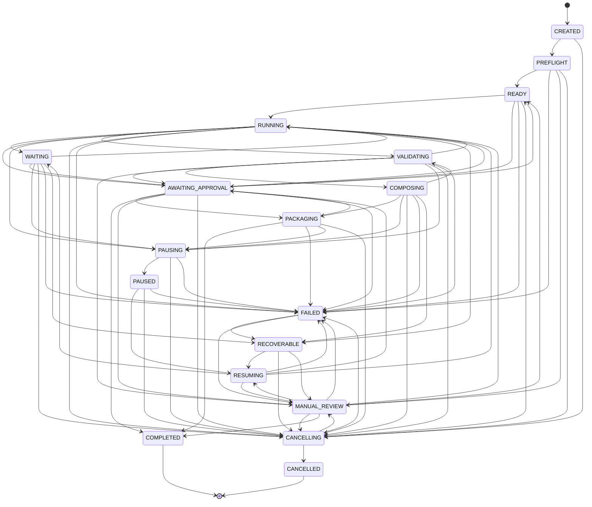

---

# State Transition Contract

Every state transition must contain:

```yaml
state_transition:
  transition_id:
  build_id:
  expected_state:
  new_state:
  reason:
  actor:
  occurred_at:
  manifest_version:
  evidence:
```

A transition is valid only when the current persisted state equals `expected_state`.

---

# Compare-and-Set Transition

Required transition method:

```python
class BuildStateController:
    def transition(
        self,
        build_id: str,
        expected_state: BuildState,
        new_state: BuildState,
        reason: str,
        actor: str
    ) -> StateTransitionResult:
        ...
```

If another writer has already changed the state, the operation must fail with a concurrency conflict.

---

# State Ownership

Only the `BuildStateController` may mutate the build state.

Other components may request transitions but may not write state directly.

| Component               | Permitted Action                          |
| ----------------------- | ----------------------------------------- |
| Preflight Coordinator   | Request PREFLIGHT → READY                 |
| Scheduler               | Request READY → RUNNING                   |
| Readiness Evaluator     | Request RUNNING → WAITING                 |
| Validation Coordinator  | Request RUNNING → VALIDATING              |
| Composition Coordinator | Request VALIDATING → COMPOSING            |
| Packaging Coordinator   | Request COMPOSING → PACKAGING             |
| Approval Manager        | Request transition from AWAITING_APPROVAL |
| Recovery Coordinator    | Request RECOVERABLE → RESUMING            |
| Shutdown Coordinator    | Request PAUSING or CANCELLING             |

Exclusive ownership prevents inconsistent state mutation.

---

# Transition Validation

Before every transition, the controller must verify:

* source state matches;
* transition is allowed;
* actor is authorized;
* required evidence exists;
* mandatory tasks satisfy transition conditions;
* no cancellation supersedes the transition;
* manifest can be persisted;
* event can be appended.

A transition must fail atomically if any check fails.

---

# State Entry Actions

Each state may define mandatory entry actions.

Example:

```yaml
state_entry_actions:
  READY:
    - persist_preflight_snapshot
    - initialize_runtime_graph

  RUNNING:
    - start_scheduler
    - enable_dispatch

  PAUSED:
    - create_checkpoint
    - disable_dispatch

  COMPLETED:
    - finalize_manifest
    - reconcile_budget
    - release_build_lock
```

Entry actions must be idempotent.

---

# State Exit Actions

Example:

```yaml
state_exit_actions:
  PREFLIGHT:
    - finalize_preflight_result

  RUNNING:
    - stop_new_dispatch_when_required

  CANCELLING:
    - reconcile_active_tasks

  RESUMING:
    - finalize_runtime_reconciliation
```

Exit actions may not invalidate already completed work.

---

# State Guards

A guard is a condition that must be true before transition.

Example:

```yaml
transition_guard:
  from: VALIDATING
  to: COMPOSING
  conditions:
    all_required_assets_valid: true
    no_mandatory_validation_failures: true
    timeline_available: true
```

Guards are deterministic and testable.

---

# Core Transition Guards

## PREFLIGHT → READY

```yaml
guards:
  preflight_passed: true
  build_lock_acquired: true
  budget_reserved: true
  runtime_manifest_initialized: true
```

---

## READY → RUNNING

```yaml
guards:
  execution_authorized: true
  runtime_graph_valid: true
  dispatch_enabled: true
```

---

## RUNNING → VALIDATING

```yaml
guards:
  generation_tasks_complete: true
  required_downloads_complete: true
  no_unresolved_mandatory_failure: true
```

---

## VALIDATING → COMPOSING

```yaml
guards:
  validation_passed: true
  approved_assets_complete: true
  composition_inputs_available: true
```

---

## COMPOSING → PACKAGING

```yaml
guards:
  composition_complete: true
  composed_output_valid: true
```

---

## PACKAGING → COMPLETED

```yaml
guards:
  all_required_outputs_exist: true
  all_required_approvals_exist: true
  final_manifest_complete: true
  quality_gate_passed: true
```

---

# Aggregate State Derivation

The build state is explicit and not automatically inferred solely from task states.

However, task aggregates may trigger transition requests.

Example:

```text
All generation tasks SUCCEEDED
        │
        ▼
Request RUNNING → VALIDATING
```

The transition still requires controller validation.

---

# WAITING State Derivation

The Orchestrator may request `WAITING` when:

```yaml
waiting_condition:
  incomplete_required_tasks: true
  runnable_tasks: 0
  active_tasks: 0_or_external_only
  recoverable_future_condition: true
```

The build must not enter `WAITING` when a runnable task exists and capacity is available.

---

# Active Provider Work During WAITING

A build may be `WAITING` while provider tasks are still executing externally.

Example:

```yaml
waiting_context:
  reason: PROVIDER_COMPLETION
  active_provider_tasks: 5
  locally_runnable_tasks: 0
```

Provider monitors remain active.

New generation dispatch may remain disabled until a completion event changes readiness.

---

# Approval State Strategy

Approval may be represented in two ways:

1. a build-level `AWAITING_APPROVAL` state;
2. task-level approval dependencies.

Build-level state is used when approval blocks the current phase globally.

Task-level dependency is used when only a subset of work is blocked.

---

# State Persistence

Every transition must update:

* Runtime Manifest;
* state history;
* append-only Event Store;
* orchestration metrics;
* status read model.

The Manifest update and event append must either:

* succeed atomically; or
* be recoverable through deterministic reconciliation.

---

# State Transition Event

Canonical event:

```yaml
event:
  event_type: build.state_changed
  build_id:
  sequence:
  previous_state:
  new_state:
  reason:
  actor:
  occurred_at:
  manifest_version:
```

---

# Illegal Transition Handling

An illegal transition must produce:

```yaml
state_error:
  code: ILLEGAL_BUILD_STATE_TRANSITION
  current_state:
  requested_state:
  actor:
  allowed_states:
  message:
```

Illegal transitions must never be silently ignored.

Repeated illegal transition requests should trigger an orchestration alert.

---

# Concurrent Transition Handling

Example conflict:

```text
Scheduler requests RUNNING → VALIDATING
Cancellation requests RUNNING → CANCELLING
```

Priority:

```text
CANCELLING
>
PAUSING
>
FAILURE
>
NORMAL PROGRESSION
```

Cancellation and shutdown intents supersede normal forward progression.

The exact precedence must be configuration-independent and deterministic.

---

# State Transition Precedence

Recommended precedence:

```yaml
transition_precedence:
  100: CANCELLING
  90: PAUSING
  80: FAILED
  70: MANUAL_REVIEW
  60: RECOVERABLE
  50: AWAITING_APPROVAL
  10: NORMAL_FORWARD_TRANSITION
```

This prevents race-condition ambiguity.

---

# Build Generation

A resumed or retried build retains the same `build_id` but may increment an execution generation.

```yaml
build_execution:
  build_id: build-001
  generation: 3
```

Generation increments when:

* a cancelled build is explicitly recreated;
* a manual recovery creates a new execution attempt;
* a new approved Execution Plan supersedes the previous plan while retaining business identity.

Task idempotency keys must include execution generation.

---

# State Timeout Policies

Certain states may have maximum durations.

Example:

```yaml
state_timeouts:
  PREFLIGHT: 60s
  PAUSING: 120s
  CANCELLING: 300s
  RESUMING: 300s
```

Long-running states such as `RUNNING`, `WAITING`, and `AWAITING_APPROVAL` use SLO monitoring rather than hard termination by default.

---

# State Timeout Handling

A timeout may cause:

```yaml
timeout_action:
  retry
  fail
  recoverable
  manual_review
  alert_only
```

Timeout policy depends on state and build profile.

---

# State Metrics

Required metrics:

```yaml
build_state_metrics:
  state_transition_count:
  state_duration_seconds:
  illegal_transition_count:
  waiting_duration_seconds:
  approval_wait_seconds:
  pause_count:
  resume_count:
  cancellation_count:
  recovery_count:
  time_to_terminal_state:
```

State-duration metrics must be calculated from persisted transition events.

---

# State History

The Runtime Manifest must maintain an append-only state history.

```yaml
state_history:
  - sequence: 1
    state: CREATED
    entered_at:
    reason: BUILD_INITIALIZED

  - sequence: 2
    state: PREFLIGHT
    entered_at:
    reason: PREFLIGHT_STARTED

  - sequence: 3
    state: READY
    entered_at:
    reason: PREFLIGHT_PASSED
```

Historical entries must never be modified or removed.

---

# State Reconciliation

After process restart, the Orchestrator must reconcile:

* persisted build state;
* task states;
* active provider jobs;
* held locks;
* active leases;
* checkpoint status.

Example:

```text
Manifest says RUNNING
+
No active local workers
+
Provider tasks still active
=
Reconciled Build State: WAITING
```

Reconciliation produces a new recorded transition rather than rewriting history.

---

# Crash-State Handling

If the process crashes during an intermediate state:

| Persisted State | Recovery Behavior                      |
| --------------- | -------------------------------------- |
| PREFLIGHT       | Re-run idempotent Preflight            |
| READY           | Start or remain ready                  |
| RUNNING         | Reconcile tasks and provider jobs      |
| VALIDATING      | Reconcile validation outputs           |
| COMPOSING       | Verify partial output and rerun safely |
| PAUSING         | Complete pause workflow                |
| CANCELLING      | Complete cancellation workflow         |
| RESUMING        | Restart reconciliation                 |

---

# Quality Gate Integration

Build state progression is conditional on Quality Gates.

Examples:

```text
VALIDATING
↓
Quality Gate Pass
↓
COMPOSING
```

```text
VALIDATING
↓
Quality Gate Fail
↓
RUNNING / MANUAL_REVIEW / FAILED
```

The Orchestrator may not override a failed mandatory Quality Gate.

---

# Build State API

```python
from enum import Enum


class BuildState(str, Enum):
    CREATED = "CREATED"
    PREFLIGHT = "PREFLIGHT"
    READY = "READY"
    RUNNING = "RUNNING"
    WAITING = "WAITING"
    VALIDATING = "VALIDATING"
    COMPOSING = "COMPOSING"
    PACKAGING = "PACKAGING"
    AWAITING_APPROVAL = "AWAITING_APPROVAL"
    PAUSING = "PAUSING"
    PAUSED = "PAUSED"
    RESUMING = "RESUMING"
    CANCELLING = "CANCELLING"
    CANCELLED = "CANCELLED"
    FAILED = "FAILED"
    RECOVERABLE = "RECOVERABLE"
    MANUAL_REVIEW = "MANUAL_REVIEW"
    COMPLETED = "COMPLETED"
```

---

# Transition Policy Interface

```python
class BuildTransitionPolicy:
    def allowed(
        self,
        current_state: BuildState,
        requested_state: BuildState
    ) -> bool:
        ...

    def guards(
        self,
        current_state: BuildState,
        requested_state: BuildState
    ) -> list["TransitionGuard"]:
        ...

    def precedence(
        self,
        requested_state: BuildState
    ) -> int:
        ...
```

---

# State Controller Interface

```python
class BuildStateController:
    def current(self, build_id: str) -> BuildState:
        ...

    def transition(
        self,
        build_id: str,
        expected_state: BuildState,
        requested_state: BuildState,
        reason: str,
        actor: str,
        evidence: dict
    ) -> "BuildStateTransition":
        ...

    def history(self, build_id: str) -> list["BuildStateTransition"]:
        ...
```

---

# Configuration

```yaml
orchestrator:
  build_state:
    compare_and_set: true
    persist_every_transition: true
    emit_event_every_transition: true
    unexplained_waiting_forbidden: true

    state_timeouts:
      PREFLIGHT: 60
      PAUSING: 120
      CANCELLING: 300
      RESUMING: 300

    transition_precedence:
      CANCELLING: 100
      PAUSING: 90
      FAILED: 80
      MANUAL_REVIEW: 70
      RECOVERABLE: 60
      AWAITING_APPROVAL: 50
```

---

# Testing Requirements

## Unit Tests

* every allowed transition;
* every prohibited transition;
* transition guard evaluation;
* transition precedence;
* compare-and-set conflict;
* terminal-state behavior;
* waiting-reason requirement;
* approval-state routing;
* state-timeout behavior.

## Integration Tests

* successful full lifecycle;
* Preflight failure;
* pause and resume;
* cancel during provider execution;
* validation retry loop;
* manual-review route;
* crash and reconciliation;
* approval gate;
* completed-build immutability.

## Concurrency Tests

* cancel vs normal transition;
* pause vs validation transition;
* simultaneous state writers;
* stale manifest version;
* duplicate transition request.

## Determinism Tests

Given identical:

* current state;
* requested state;
* evidence;
* configuration;

the transition decision must be identical.

---

# Build Lifecycle Quality Gate

```yaml
build_lifecycle_quality_gate:
  one_explicit_state: true
  all_transitions_validated: true
  all_transitions_persisted: true
  all_transitions_audited: true
  terminal_states_immutable: true
  waiting_states_explained: true
  approvals_enforced: true
  pause_resume_test_passed: true
  cancellation_test_passed: true
  recovery_test_passed: true
  concurrency_conflict_test_passed: true
```

---

# Architectural Invariants

## Invariant BL-301

A build exists in exactly one canonical state.

## Invariant BL-302

Only the Build State Controller may mutate build state.

## Invariant BL-303

Every state transition must use compare-and-set semantics.

## Invariant BL-304

Every transition is persisted and evented.

## Invariant BL-305

Every `WAITING` state contains a machine-readable reason.

## Invariant BL-306

Terminal states are immutable.

## Invariant BL-307

Cancellation and pause intents supersede normal forward progression.

## Invariant BL-308

Approval boundaries are explicit states or dependencies.

## Invariant BL-309

Reconciliation appends corrective transitions and never rewrites history.

## Invariant BL-310

A build may not reach `COMPLETED` until every required output, validation, approval, and manifest obligation is satisfied.

---

# Architectural Decision Records

| ADR     | Decision                                                                                                   |
| ------- | ---------------------------------------------------------------------------------------------------------- |
| ADR-831 | Build lifecycle is modeled as an explicit finite-state machine.                                            |
| ADR-832 | Build and Task state machines are separate.                                                                |
| ADR-833 | State transitions use compare-and-set persistence.                                                         |
| ADR-834 | Waiting is a valid state only when a blocking reason is recorded.                                          |
| ADR-835 | Pause, cancellation, failure, and recovery are first-class lifecycle paths.                                |
| ADR-836 | State history is append-only and cannot be rewritten during reconciliation.                                |
| ADR-837 | Approval waiting is explicitly represented in runtime state.                                               |
| ADR-838 | Terminal build states are immutable.                                                                       |
| ADR-839 | Transition precedence resolves concurrent lifecycle intents deterministically.                             |
| ADR-840 | Completion requires satisfaction of outputs, validation, approval, reporting, and persistence obligations. |

---

# Acceptance Criteria

Section **6.3.4** is complete when:

* The canonical Build States are formally defined.
* Initialization, active execution, waiting, approval, interruption, failure, recovery, and terminal states are represented.
* Every state has explicit entry conditions, permitted actions, and allowed transitions.
* A complete state diagram is documented.
* State guards and entry/exit actions are deterministic and testable.
* Compare-and-set persistence protects concurrent transitions.
* Every `WAITING` state has an explicit reason.
* Pause, resume, cancellation, recovery, and manual review are fully modeled.
* Approval dependencies are represented explicitly.
* State transition precedence resolves race conditions deterministically.
* State history, events, metrics, reconciliation, configuration, interfaces, and tests are specified.
* A build can never be considered complete, cancelled, failed, paused, or recoverable through inference alone; its lifecycle status must always be explicit, persisted, auditable, and authoritative.


# Part 6.3.5 — Task Model & Task State Machine

## Insynergy Cinematic Thought Leadership Platform

### Master Specification v2.1

---

# Purpose

This section defines the canonical **Runtime Task Model** and **Task State Machine** used by the Build Orchestration & Runtime Control Layer.

The Build State Machine defined in Section 6.3.4 represents the lifecycle of the build as a whole.

The Task State Machine represents the lifecycle of each independently executable unit within that build.

Its objectives are to ensure that:

* every unit of work has one immutable identity;
* every task has one explicit state;
* dependencies and readiness are evaluated deterministically;
* task execution is idempotent;
* retries do not duplicate external effects;
* failures remain isolated;
* completed work is never repeated unnecessarily;
* every task result is traceable to the approved Execution Plan.

The canonical runtime execution unit is the **Task**.

For visual production work, a Task commonly represents one Shot-level operation, but Tasks may also represent downloads, validations, compositions, or packaging operations.

---

# Governing Principle

The platform adopts the following principle.

> **Every executable action must be represented as an immutable Task Definition with a persistent runtime state.**

No executable work may exist only as:

* an in-memory function call;
* an implicit queue message;
* a shell command without task identity;
* an untracked provider request;
* an unnamed retry;
* an informal worker operation.

Before work begins, it must exist as a registered runtime task.

---

# Architectural Position

```text id="kkq6f2"
Approved Execution Plan
        │
        ▼
Runtime Graph Builder
        │
        ▼
Task Definitions
        │
        ▼
Task State Controller
        │
        ├── Dependency Resolution
        ├── Readiness Evaluation
        ├── Queue Assignment
        ├── Worker Dispatch
        ├── Provider Coordination
        ├── Retry
        └── Completion
        │
        ▼
Task Results
```

The Task Model is the bridge between the immutable Execution Plan and actual runtime operations.

---

# Task vs Build

A Build and a Task are separate operational entities.

| Entity | Meaning                                   |
| ------ | ----------------------------------------- |
| Build  | The complete production execution         |
| Task   | One independently controlled unit of work |

A Build may contain:

* zero active tasks;
* one active task;
* many parallel active tasks;
* completed tasks;
* failed tasks;
* skipped tasks;
* tasks awaiting manual review.

The Build State is not a direct copy of any one Task State.

---

# Task Definition

A **Task Definition** is an immutable declaration of required work.

It is produced from one Execution Plan node.

Canonical schema:

```yaml id="rnp416"
task_definition:
  task_id:
  build_id:
  execution_plan_id:
  plan_node_id:
  task_definition_hash:
  task_class:
  task_type:
  execution_action:
  priority_inputs:
  dependencies:
  approval_dependencies:
  resource_requirements:
  budget_requirements:
  provider_requirements:
  input_artifacts:
  expected_outputs:
  retry_policy:
  timeout_policy:
  idempotency_policy:
  quality_requirements:
  optional:
```

Once runtime execution begins, the Task Definition is immutable.

---

# Runtime Task

A **Runtime Task** combines the immutable Task Definition with mutable execution state.

```yaml id="tdjol4"
runtime_task:
  definition:
  runtime:
    state:
    attempt:
    execution_generation:
    assigned_queue:
    worker_id:
    lease_id:
    provider_task_id:
    scheduled_at:
    dispatched_at:
    started_at:
    completed_at:
    next_retry_at:
    blocking_reasons:
    resource_reservation_id:
    budget_reservation_id:
    result:
    failure:
```

The immutable and mutable portions must remain logically separated.

---

# Task Identity

Each task has three related identifiers.

## Task ID

Human-readable, build-scoped identifier.

Example:

```text id="y4jvif"
scene-004-shot-002-render
```

## Task Definition Hash

Cryptographic identity of the immutable Task Definition.

```text id="nq9c0t"
sha256(
  canonical_task_definition
)
```

## Idempotency Key

Identity of one externally visible execution generation.

```text id="ezpytx"
sha256(
  build_id
  + task_id
  + task_definition_hash
  + execution_generation
  + attempt_generation
)
```

The three values serve different purposes and must not be conflated.

---

# Task Classes

Task Classes identify the execution domain and worker pool.

```yaml id="q9goj5"
task_classes:
  - LOCAL_GENERATION
  - EXTERNAL_RENDER
  - EXTERNAL_IMAGE
  - EXTERNAL_AUDIO
  - PROVIDER_MONITOR
  - DOWNLOAD
  - VALIDATION
  - COMPOSITION
  - PACKAGING
  - METADATA
  - APPROVAL
  - CONTROL
```

Every Task Definition must declare exactly one Task Class.

---

# Task Types

Task Type provides more specific semantics within a Task Class.

Examples:

```yaml id="swspr4"
task_types:
  - GENERATE_STORYBOARD_FRAME
  - GENERATE_ANIMATED_STILL
  - SUBMIT_RUNWAY_SHOT
  - MONITOR_RUNWAY_SHOT
  - DOWNLOAD_VIDEO_ASSET
  - VALIDATE_VIDEO_TECHNICAL
  - VALIDATE_VISUAL_CONTINUITY
  - SYNTHESIZE_NARRATION
  - GENERATE_SUBTITLES
  - COMPOSE_TIMELINE_SEGMENT
  - COMPOSE_FINAL_MASTER
  - BUILD_PUBLISH_PACKAGE
```

Task Type values must be versioned and schema-controlled.

---

# Execution Actions

The Execution Optimization Layer assigns one execution action to every plan node.

```yaml id="uvfr97"
execution_actions:
  - EXECUTE
  - REUSE
  - VALIDATE_ONLY
  - COMPOSE_ONLY
  - SKIP
```

The Orchestrator must preserve this decision.

## EXECUTE

Generate a new artifact or perform a new operation.

## REUSE

Reference an existing approved artifact.

## VALIDATE_ONLY

Run validation against an existing artifact.

## COMPOSE_ONLY

Perform composition using existing inputs.

## SKIP

Do not execute because the task is optional or intentionally excluded.

---

# Canonical Task States

The platform defines the following Task States.

```yaml id="8zrt3x"
task_states:
  - DECLARED
  - BLOCKED
  - RUNNABLE
  - QUEUED
  - LEASED
  - DISPATCHED
  - RUNNING
  - WAITING_EXTERNAL
  - DOWNLOADING
  - VALIDATING
  - RETRY_PENDING
  - PAUSING
  - PAUSED
  - CANCELLING
  - SUCCEEDED
  - SKIPPED
  - FAILED_RETRYABLE
  - FAILED_PERMANENT
  - MANUAL_REVIEW
  - CANCELLED
```

Every runtime task must exist in exactly one state.

---

# Task State Categories

| Category                | States                                             |
| ----------------------- | -------------------------------------------------- |
| Definition              | DECLARED                                           |
| Dependency              | BLOCKED, RUNNABLE                                  |
| Queue and Dispatch      | QUEUED, LEASED, DISPATCHED                         |
| Active                  | RUNNING, WAITING_EXTERNAL, DOWNLOADING, VALIDATING |
| Retry                   | FAILED_RETRYABLE, RETRY_PENDING                    |
| Controlled Interruption | PAUSING, PAUSED, CANCELLING                        |
| Successful Terminal     | SUCCEEDED, SKIPPED                                 |
| Unsuccessful Terminal   | FAILED_PERMANENT, MANUAL_REVIEW, CANCELLED         |

---

# DECLARED

## Meaning

The task has been created from an Execution Plan node and registered in the Runtime Manifest.

It has not yet been evaluated for readiness.

## Entry Conditions

* Task Definition hash calculated;
* task ID registered;
* dependencies registered;
* idempotency policy registered;
* initial manifest entry persisted.

## Allowed Transitions

```text id="3in4kh"
DECLARED → BLOCKED
DECLARED → RUNNABLE
DECLARED → SKIPPED
DECLARED → FAILED_PERMANENT
```

---

# BLOCKED

## Meaning

The task cannot currently execute because one or more readiness conditions are unsatisfied.

Blocking reasons may include:

```yaml id="f8qz4u"
blocking_reasons:
  - DEPENDENCY_INCOMPLETE
  - APPROVAL_MISSING
  - RESOURCE_UNAVAILABLE
  - BUDGET_UNAVAILABLE
  - PROVIDER_UNAVAILABLE
  - RATE_LIMIT
  - RETRY_DELAY
  - BUILD_PAUSED
  - BACKPRESSURE
  - MANUAL_HOLD
```

Every blocked task must contain at least one machine-readable reason.

## Allowed Transitions

```text id="w3ep55"
BLOCKED → RUNNABLE
BLOCKED → SKIPPED
BLOCKED → CANCELLING
BLOCKED → FAILED_PERMANENT
BLOCKED → MANUAL_REVIEW
```

An unexplained `BLOCKED` state is an orchestration defect.

---

# RUNNABLE

## Meaning

All mandatory readiness requirements have been satisfied, and the task is eligible for queue insertion.

Required conditions:

```yaml id="74oj22"
runnable_conditions:
  dependencies_satisfied: true
  approval_satisfied: true
  execution_policy_allows: true
  budget_authorized: true
  required_configuration_valid: true
  build_state_allows_dispatch: true
```

Resource capacity does not need to be actively leased yet.

## Allowed Transitions

```text id="5oxrph"
RUNNABLE → QUEUED
RUNNABLE → BLOCKED
RUNNABLE → CANCELLING
RUNNABLE → SKIPPED
```

---

# QUEUED

## Meaning

The task has been inserted into an execution queue and is waiting for worker capacity.

Required fields:

```yaml id="d13bsn"
queue_state:
  queue_name:
  queue_position:
  priority_score:
  enqueued_at:
```

## Allowed Transitions

```text id="gab0i5"
QUEUED → LEASED
QUEUED → BLOCKED
QUEUED → CANCELLING
QUEUED → SKIPPED
```

Queue insertion must be idempotent.

---

# LEASED

## Meaning

A worker has obtained temporary exclusive ownership of the task.

The task has not yet begun its external or local side effect.

Required fields:

```yaml id="92bf87"
lease:
  lease_id:
  worker_id:
  acquired_at:
  expires_at:
```

## Allowed Transitions

```text id="1y0w10"
LEASED → DISPATCHED
LEASED → QUEUED
LEASED → CANCELLING
LEASED → FAILED_RETRYABLE
```

If a lease expires before dispatch, the task returns to `QUEUED`.

---

# DISPATCHED

## Meaning

The worker has accepted the task, and execution startup has begun.

Examples:

* local subprocess being initialized;
* provider submission being prepared;
* validation process being started.

## Allowed Transitions

```text id="0nfle0"
DISPATCHED → RUNNING
DISPATCHED → WAITING_EXTERNAL
DISPATCHED → FAILED_RETRYABLE
DISPATCHED → FAILED_PERMANENT
DISPATCHED → CANCELLING
```

`DISPATCHED` should be a short-lived state.

---

# RUNNING

## Meaning

The task is actively performing local computation or coordinating an external operation.

Examples:

* generating SVG;
* synthesizing narration;
* running FFmpeg;
* validating an asset;
* submitting a provider request.

## Allowed Transitions

```text id="nknprc"
RUNNING → WAITING_EXTERNAL
RUNNING → DOWNLOADING
RUNNING → VALIDATING
RUNNING → SUCCEEDED
RUNNING → FAILED_RETRYABLE
RUNNING → FAILED_PERMANENT
RUNNING → PAUSING
RUNNING → CANCELLING
RUNNING → MANUAL_REVIEW
```

---

# WAITING_EXTERNAL

## Meaning

The task depends on an external asynchronous system that has accepted the work but not completed it.

Typical example:

```text id="6h9a9r"
Runway task submitted
↓
Provider task ID persisted
↓
WAITING_EXTERNAL
```

Required fields:

```yaml id="5i0tsc"
external_wait:
  provider:
  provider_task_id:
  submitted_at:
  next_poll_at:
  last_known_status:
```

## Allowed Transitions

```text id="o1ytkg"
WAITING_EXTERNAL → DOWNLOADING
WAITING_EXTERNAL → RUNNING
WAITING_EXTERNAL → FAILED_RETRYABLE
WAITING_EXTERNAL → FAILED_PERMANENT
WAITING_EXTERNAL → CANCELLING
WAITING_EXTERNAL → MANUAL_REVIEW
```

A task may return temporarily to `RUNNING` for status reconciliation.

---

# DOWNLOADING

## Meaning

The task is retrieving an external artifact.

Required fields:

```yaml id="25qpga"
download:
  source_reference:
  destination_reference:
  expected_bytes:
  downloaded_bytes:
  checksum_expected:
```

## Allowed Transitions

```text id="up36cm"
DOWNLOADING → VALIDATING
DOWNLOADING → SUCCEEDED
DOWNLOADING → FAILED_RETRYABLE
DOWNLOADING → FAILED_PERMANENT
DOWNLOADING → CANCELLING
```

Downloaded media must not become approved solely because the download completed.

---

# VALIDATING

## Meaning

The task is validating the result of generation, download, composition, or reuse.

Validation may include:

* checksum;
* schema;
* media decoding;
* duration;
* codec;
* continuity;
* quality;
* approval compatibility.

## Allowed Transitions

```text id="3ckzhj"
VALIDATING → SUCCEEDED
VALIDATING → FAILED_RETRYABLE
VALIDATING → FAILED_PERMANENT
VALIDATING → MANUAL_REVIEW
VALIDATING → CANCELLING
```

Validation failures are not automatically retryable unless policy explicitly classifies them.

---

# FAILED_RETRYABLE

## Meaning

The current attempt failed, but policy permits another attempt.

Examples:

* transient network error;
* rate limit;
* provider timeout;
* corrupted download;
* worker interruption.

Required fields:

```yaml id="i0560b"
retryable_failure:
  failure_class:
  attempt:
  maximum_attempts:
  retry_after:
  compensation_required:
```

## Allowed Transitions

```text id="5eb6bd"
FAILED_RETRYABLE → RETRY_PENDING
FAILED_RETRYABLE → FAILED_PERMANENT
FAILED_RETRYABLE → MANUAL_REVIEW
FAILED_RETRYABLE → CANCELLING
```

---

# RETRY_PENDING

## Meaning

A retry has been authorized but cannot begin until its delay, budget, resource, or policy conditions are satisfied.

Required fields:

```yaml id="kbml8m"
retry:
  next_attempt:
  retry_at:
  delay_seconds:
  previous_failure_id:
  new_idempotency_generation:
```

## Allowed Transitions

```text id="no919m"
RETRY_PENDING → RUNNABLE
RETRY_PENDING → BLOCKED
RETRY_PENDING → FAILED_PERMANENT
RETRY_PENDING → CANCELLING
```

Retry tasks must not remain in the primary Ready Queue before the retry delay expires.

---

# PAUSING

## Meaning

The task is transitioning to a safe paused condition.

Not all Task Types support pausing.

Examples:

* local long-running operation may checkpoint;
* external provider generation may continue remotely;
* atomic manifest write must finish.

## Allowed Transitions

```text id="mtvnzu"
PAUSING → PAUSED
PAUSING → WAITING_EXTERNAL
PAUSING → FAILED_RETRYABLE
PAUSING → CANCELLING
```

---

# PAUSED

## Meaning

The task is intentionally suspended without being cancelled.

Required preserved information:

* task definition;
* attempt;
* external provider ID;
* partial local checkpoint where supported;
* resource release status;
* resume requirements.

## Allowed Transitions

```text id="3bsqqn"
PAUSED → RUNNABLE
PAUSED → WAITING_EXTERNAL
PAUSED → CANCELLING
PAUSED → FAILED_PERMANENT
```

---

# CANCELLING

## Meaning

Cancellation has been requested and compensation or cleanup is in progress.

Required behavior may include:

* cancel provider task;
* stop local subprocess;
* release lease;
* release resources;
* quarantine partial artifact;
* preserve completed outputs;
* record cancellation reason.

## Allowed Transitions

```text id="ge290f"
CANCELLING → CANCELLED
CANCELLING → SUCCEEDED
CANCELLING → MANUAL_REVIEW
CANCELLING → FAILED_PERMANENT
```

A task may reach `SUCCEEDED` if it completes atomically before cancellation takes effect.

---

# SUCCEEDED

## Meaning

The task completed its required action and produced a valid result.

Required success evidence:

```yaml id="zz59x9"
task_success:
  output_artifacts:
  result_hash:
  validation_state:
  completed_at:
  metrics:
```

`SUCCEEDED` is immutable.

---

# SKIPPED

## Meaning

The task was intentionally not executed.

Valid reasons include:

* execution action = SKIP;
* optional task excluded by profile;
* approved reuse made execution unnecessary;
* downstream branch no longer required.

Required fields:

```yaml id="utwgt9"
skip:
  reason:
  policy_reference:
  replacement_artifact:
```

`SKIPPED` is a successful terminal state only when the Execution Plan permits skipping.

---

# FAILED_PERMANENT

## Meaning

The task cannot proceed automatically and no retry is permitted.

Examples:

* invalid prompt;
* permanent provider rejection;
* exhausted retry limit;
* incompatible configuration;
* corrupted immutable input;
* mandatory validation failure without retry path.

Required fields:

```yaml id="1l47yz"
permanent_failure:
  failure_id:
  failure_class:
  attempts:
  remediation:
  affects_build:
  downstream_tasks:
```

`FAILED_PERMANENT` is terminal.

The Build may still continue if the failed Task is optional.

---

# MANUAL_REVIEW

## Meaning

Automation cannot safely determine the correct outcome.

Typical causes:

* ambiguous provider output;
* visual quality requires editorial judgment;
* fallback substitution requires approval;
* conflicting artifact evidence;
* governance exception required.

Required fields:

```yaml id="oxvprb"
manual_review:
  reason:
  available_actions:
  assigned_authority:
  requested_at:
  evidence:
```

## Allowed Transitions

```text id="ain1df"
MANUAL_REVIEW → RUNNABLE
MANUAL_REVIEW → SUCCEEDED
MANUAL_REVIEW → SKIPPED
MANUAL_REVIEW → FAILED_PERMANENT
MANUAL_REVIEW → CANCELLING
```

Every transition from `MANUAL_REVIEW` requires a recorded authority decision.

---

# CANCELLED

## Meaning

The task was intentionally terminated before successful completion.

Characteristics:

* terminal state;
* no further automatic retry;
* partial artifacts are not valid outputs;
* completed immutable child artifacts may remain preserved.

---

# Terminal Task States

```yaml id="o6o45t"
terminal_task_states:
  successful:
    - SUCCEEDED
    - SKIPPED

  unsuccessful:
    - FAILED_PERMANENT
    - CANCELLED

  authority_required:
    - MANUAL_REVIEW
```

`MANUAL_REVIEW` is operationally non-runnable but not a final semantic outcome until authority decides.

---

# Canonical Task State Diagram

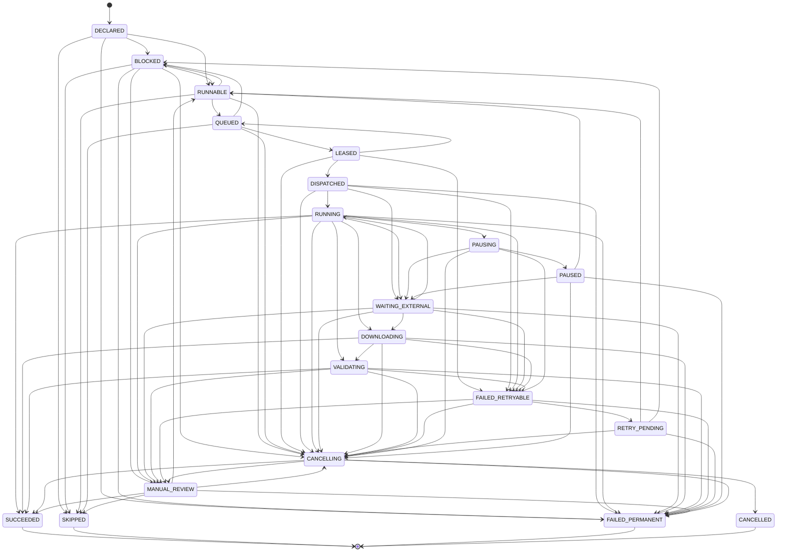

---

# Task Dependency Types

The Task Model supports the following dependency types.

```yaml id="w04psb"
task_dependency_types:
  - SUCCESS_REQUIRED
  - TERMINAL_REQUIRED
  - ARTIFACT_REQUIRED
  - APPROVAL_REQUIRED
  - OPTIONAL
  - ORDER_ONLY
```

## SUCCESS_REQUIRED

Parent Task must reach `SUCCEEDED` or a permitted successful `SKIPPED` state.

## TERMINAL_REQUIRED

Parent Task must reach any terminal state before this Task may proceed.

## ARTIFACT_REQUIRED

A specific immutable artifact must exist and pass consistency checks.

## APPROVAL_REQUIRED

A recorded approval must exist.

## OPTIONAL

Dependency contributes when available but does not block execution.

## ORDER_ONLY

Dependency enforces ordering but does not require artifact exchange.

---

# Task Readiness Model

A task is `RUNNABLE` only when all mandatory readiness conditions pass.

```yaml id="ivvr6u"
task_readiness:
  dependency_state:
  artifact_state:
  approval_state:
  retry_state:
  resource_state:
  budget_state:
  provider_state:
  build_state:
  governance_state:
```

The final readiness decision is binary:

```yaml id="lq72yg"
readiness_decision:
  runnable: true
  blocking_reasons: []
```

or:

```yaml id="n5ld4e"
readiness_decision:
  runnable: false
  blocking_reasons:
    - DEPENDENCY_INCOMPLETE
```

---

# Task Result Model

Every terminal task must produce a Task Result.

```yaml id="xffw8l"
task_result:
  task_id:
  task_definition_hash:
  terminal_state:
  attempts:
  execution_generation:
  started_at:
  completed_at:
  duration_ms:
  input_artifacts:
  output_artifacts:
  provider:
  provider_task_id:
  validation_results:
  failure:
  metrics:
  provenance:
```

Task Results are immutable.

---

# Task Attempt Model

Retries create new Attempts under the same Task identity.

```yaml id="4clyvq"
task_attempt:
  task_id:
  attempt_number:
  attempt_generation:
  idempotency_key:
  state:
  started_at:
  completed_at:
  worker_id:
  provider_task_id:
  failure:
```

A new Attempt does not create a new Task Definition.

---

# Attempt Number vs Attempt Generation

## Attempt Number

Monotonically increases for ordinary retries.

```text id="5v8ky1"
1
2
3
```

## Attempt Generation

Changes when the external side effect must use a new idempotency scope.

Example:

* provider confirmed rejection;
* previous provider task permanently cancelled;
* manually approved rerender;
* execution generation changed.

This distinction prevents accidental reuse of an ambiguous provider submission.

---

# Task State Transition Contract

```yaml id="vqhyf0"
task_state_transition:
  transition_id:
  build_id:
  task_id:
  attempt:
  expected_state:
  new_state:
  actor:
  reason:
  evidence:
  occurred_at:
  manifest_version:
```

All transitions use expected-state comparison.

---

# State Controller Interface

```python id="cyhng1"
class TaskStateController:
    def current(self, build_id: str, task_id: str) -> "TaskState":
        ...

    def transition(
        self,
        build_id: str,
        task_id: str,
        expected_state: "TaskState",
        new_state: "TaskState",
        actor: str,
        reason: str,
        evidence: dict
    ) -> "TaskStateTransition":
        ...

    def history(
        self,
        build_id: str,
        task_id: str
    ) -> list["TaskStateTransition"]:
        ...
```

Only the Task State Controller may mutate Task State.

---

# Task Ownership

A Task may have one of the following owners.

```yaml id="gh9fmx"
task_owner:
  orchestrator
  queue
  worker
  provider
  manual_authority
  none
```

Ownership rules:

| State            | Owner                |
| ---------------- | -------------------- |
| DECLARED         | Orchestrator         |
| BLOCKED          | Orchestrator         |
| RUNNABLE         | Scheduler            |
| QUEUED           | Queue                |
| LEASED           | Worker               |
| DISPATCHED       | Worker               |
| RUNNING          | Worker               |
| WAITING_EXTERNAL | Provider Coordinator |
| MANUAL_REVIEW    | Assigned Authority   |
| Terminal         | None                 |

A Task may not have two active owners simultaneously.

---

# Leasing Model

Workers do not permanently own Tasks.

They receive time-bounded leases.

```yaml id="rk4u0h"
task_lease:
  lease_id:
  task_id:
  worker_id:
  issued_at:
  expires_at:
  heartbeat_required:
```

Lease expiration does not imply Task failure.

The Orchestrator must reconcile whether an external effect already occurred.

---

# Heartbeat Model

Workers executing long-running local tasks must report heartbeats.

```yaml id="4sjb8r"
worker_heartbeat:
  worker_id:
  lease_id:
  task_id:
  observed_at:
  progress:
```

Missing heartbeat may trigger lease recovery.

Provider-side tasks in `WAITING_EXTERNAL` do not require a local worker heartbeat.

---

# Progress Model

Progress may be recorded but never used as authoritative completion evidence.

```yaml id="x2ywpq"
task_progress:
  percentage:
  message:
  updated_at:
```

Only state transitions and verified outputs determine completion.

---

# Timeout Model

Every task may define:

```yaml id="e0i2tk"
timeout_policy:
  dispatch_timeout:
  execution_timeout:
  external_wait_timeout:
  download_timeout:
  validation_timeout:
  total_timeout:
```

Timeout does not automatically mean retry.

The Failure Coordinator classifies the resulting failure.

---

# Cancellation Semantics by Task Class

| Task Class       | Cancellation Behavior                     |
| ---------------- | ----------------------------------------- |
| LOCAL_GENERATION | Stop subprocess safely                    |
| EXTERNAL_RENDER  | Request provider cancellation             |
| WAITING_EXTERNAL | Cancel provider task if supported         |
| DOWNLOAD         | Abort and remove partial payload          |
| VALIDATION       | Stop and preserve source artifact         |
| COMPOSITION      | Stop FFmpeg and quarantine partial output |
| PACKAGING        | Stop and remove incomplete package        |
| APPROVAL         | Withdraw request if allowed               |

Cancellation behavior must be explicit per Task Type.

---

# Skipping Semantics

A task may enter `SKIPPED` only when:

* Execution Plan marks it skippable;
* required output has an approved replacement;
* profile excludes it;
* parent branch has been deliberately disabled;
* reuse satisfies its intended result.

The Task Result must identify the reason and replacement artifact.

---

# Optional Tasks

Optional Task failure does not necessarily fail the Build.

```yaml id="m9ofsp"
optional_task_policy:
  optional: true
  failure_effect:
    warn
```

However, optionality must be declared in the approved Execution Plan.

The Orchestrator may not decide retroactively that a failed mandatory Task is optional.

---

# Mandatory Task Failure

A mandatory Task reaching `FAILED_PERMANENT` requires downstream impact analysis.

Possible Build outcomes:

```yaml id="k4gkpx"
mandatory_failure_action:
  - FAILED
  - MANUAL_REVIEW
  - RECOVERABLE
  - CONTINUE_WITH_APPROVED_FALLBACK
```

The selected action must come from policy or explicit authority.

---

# Dependency Failure Propagation

When a parent Task fails permanently:

```text id="ee6nw9"
Parent FAILED_PERMANENT
        │
        ▼
Evaluate Dependency Type
        │
        ├── SUCCESS_REQUIRED → Child BLOCKED or SKIPPED
        ├── TERMINAL_REQUIRED → Child may proceed
        ├── OPTIONAL → Child may proceed
        └── ARTIFACT_REQUIRED → Child BLOCKED
```

Failure propagation is dependency-type-specific.

---

# State Transition Precedence

Concurrent task intents are resolved deterministically.

Recommended precedence:

```yaml id="skzr5o"
task_transition_precedence:
  CANCELLING: 100
  FAILED_PERMANENT: 90
  MANUAL_REVIEW: 80
  PAUSING: 70
  FAILED_RETRYABLE: 60
  SUCCEEDED: 50
  NORMAL_PROGRESS: 10
```

A verified success may supersede cancellation when the side effect completed atomically before cancellation.

---

# Duplicate Completion Handling

Workers or providers may report completion more than once.

Required behavior:

```text id="g5hmuc"
Duplicate Completion Event
        │
        ▼
Check Task Terminal State
        │
        ├── Same Result Hash → Ignore Idempotently
        └── Different Result Hash → MANUAL_REVIEW
```

Conflicting completion results are never silently overwritten.

---

# Ambiguous Submission Handling

Example:

```text id="n109ml"
Provider submission request sent
↓
Network timeout
↓
Response unknown
```

The Task must not immediately retry.

Required flow:

```text id="f6b7ps"
Check Idempotency Record
↓
Reconcile Provider
↓
Find Existing Task?
├── Yes → Persist Provider ID and WAITING_EXTERNAL
└── No → Authorize New Attempt
```

This avoids duplicate provider billing.

---

# Task Manifest Entry

Canonical persisted representation:

```yaml id="dknc20"
task_manifest:
  task_id:
  task_definition_hash:
  task_class:
  task_type:
  execution_action:
  state:
  optional:
  attempt:
  execution_generation:
  dependencies:
  blocking_reasons:
  queue:
  lease:
  worker:
  provider:
  resource_reservation:
  budget_reservation:
  inputs:
  expected_outputs:
  actual_outputs:
  result:
  failure:
  state_history:
```

---

# Task Events

Required event types include:

```text id="tqj48p"
task.declared
task.blocked
task.runnable
task.queued
task.leased
task.dispatched
task.started
task.waiting_external
task.downloading
task.validating
task.retryable_failed
task.retry_scheduled
task.pausing
task.paused
task.cancelling
task.succeeded
task.skipped
task.permanently_failed
task.manual_review_requested
task.cancelled
```

All Task Events are append-only.

---

# Task Metrics

Required metrics:

```yaml id="pa25zj"
task_metrics:
  declared_count:
  runnable_count:
  blocked_count:
  queued_count:
  active_count:
  succeeded_count:
  skipped_count:
  retry_count:
  permanent_failure_count:
  cancellation_count:
  manual_review_count:
  queue_wait_seconds:
  lease_wait_seconds:
  execution_seconds:
  external_wait_seconds:
  download_seconds:
  validation_seconds:
  total_task_latency_seconds:
```

---

# Queue Wait Measurement

```text id="b6sv77"
queue_wait =
leased_at
-
queued_at
```

High queue wait indicates:

* insufficient workers;
* provider capacity saturation;
* poor priority policy;
* backpressure;
* resource constraints.

---

# Task Criticality

Tasks may declare criticality.

```yaml id="qoa3vh"
task_criticality:
  - CRITICAL_PATH
  - HIGH
  - NORMAL
  - LOW
  - OPTIONAL
```

Criticality influences priority but does not override dependency, budget, or quality policy.

---

# Task Serialization

Task Definitions and Runtime Tasks must serialize deterministically.

Recommended artifacts:

```text id="mjmcpi"
runtime-task-graph.json
task-manifest.json
task-results.json
```

Dictionary ordering and timestamps must not affect Task Definition hashes.

---

# Public Interfaces

```python id="3hgtas"
class RuntimeTaskFactory:
    def create(
        self,
        plan_node: "ExecutionPlanNode",
        build_context: "BuildContext"
    ) -> "RuntimeTask":
        ...


class TaskReadinessService:
    def evaluate(
        self,
        task: "RuntimeTask",
        runtime_context: "RuntimeContext"
    ) -> "ReadinessDecision":
        ...


class TaskAttemptManager:
    def create_attempt(
        self,
        task_id: str,
        retry_decision: "RetryDecision"
    ) -> "TaskAttempt":
        ...


class TaskResultRepository:
    def store(self, result: "TaskResult") -> str:
        ...

    def load(self, build_id: str, task_id: str) -> "TaskResult | None":
        ...
```

---

# Reference Configuration

```yaml id="sqyfjx"
orchestrator:
  tasks:
    persist_every_transition: true
    require_blocking_reason: true
    require_task_definition_hash: true
    require_idempotency_key_for_external_effects: true

    leases:
      default_seconds: 300
      heartbeat_seconds: 30
      reclaim_expired: true

    attempts:
      default_maximum: 3
      preserve_attempt_history: true

    timeouts:
      dispatch_seconds: 60
      download_seconds: 300
      validation_seconds: 180

    terminal_states_immutable: true
```

---

# Testing Requirements

## Unit Tests

* deterministic Task Definition hash;
* initial state creation;
* every allowed transition;
* every prohibited transition;
* blocking-reason requirement;
* readiness evaluation;
* dependency-type behavior;
* state precedence;
* attempt generation;
* idempotency-key generation;
* optional Task handling;
* terminal-state immutability.

## Integration Tests

* local Task success;
* external provider Task lifecycle;
* asynchronous wait and download;
* validation flow;
* retryable failure;
* permanent failure;
* lease expiration;
* pause and resume;
* cancellation;
* duplicate completion event;
* ambiguous provider submission;
* manual review flow.

## Concurrency Tests

* two workers lease the same Task;
* stale state transition;
* completion vs cancellation;
* retry scheduling vs manual review;
* duplicate provider callback or poll result.

## Recovery Tests

* crash in `LEASED`;
* crash in `DISPATCHED`;
* crash after provider submission before provider ID persistence;
* crash in `DOWNLOADING`;
* crash in `VALIDATING`;
* crash after output creation before Task success persistence.

---

# Task Model Quality Gate

```yaml id="apqv6d"
task_model_quality_gate:
  every_plan_node_has_task: true
  every_task_has_definition_hash: true
  every_external_task_has_idempotency_key: true
  every_task_has_one_state: true
  every_blocked_task_has_reason: true
  every_active_task_has_owner: true
  every_leased_task_has_expiration: true
  every_terminal_task_has_result: true
  every_retry_has_new_attempt_record: true
  no_illegal_transitions: true
  no_duplicate_active_execution: true
  terminal_states_immutable: true
```

---

# Architectural Invariants

## Invariant TM-301

Every executable action is represented by one Runtime Task.

## Invariant TM-302

Every Runtime Task maps to exactly one immutable Execution Plan node.

## Invariant TM-303

Task Definition and runtime state are stored separately.

## Invariant TM-304

Every Task exists in exactly one canonical state.

## Invariant TM-305

Only the Task State Controller may mutate Task State.

## Invariant TM-306

Every blocked Task has at least one explicit blocking reason.

## Invariant TM-307

Every external side effect is protected by idempotency.

## Invariant TM-308

A Task may have only one active owner or lease.

## Invariant TM-309

Retries create new Attempts without mutating the Task Definition.

## Invariant TM-310

Every terminal Task produces an immutable Task Result.

---

# Architectural Decision Records

| ADR     | Decision                                                                              |
| ------- | ------------------------------------------------------------------------------------- |
| ADR-841 | Every executable operation is represented as a persistent Runtime Task.               |
| ADR-842 | Task Definition and mutable runtime state are separate models.                        |
| ADR-843 | The Task is the smallest independently controlled runtime unit.                       |
| ADR-844 | Task readiness is distinct from queue availability and worker capacity.               |
| ADR-845 | External asynchronous execution uses an explicit WAITING_EXTERNAL state.              |
| ADR-846 | Retries create new Task Attempts rather than new Task Definitions.                    |
| ADR-847 | Worker ownership is time-bounded through leases.                                      |
| ADR-848 | Blocked Tasks require machine-readable blocking reasons.                              |
| ADR-849 | Duplicate and ambiguous provider outcomes are reconciled through idempotency records. |
| ADR-850 | Terminal Task Results are immutable and preserve complete provenance.                 |

---

# Acceptance Criteria

Section **6.3.5** is complete when:

* Task Definition, Runtime Task, Task Attempt, and Task Result are formally separated.
* Task identity, definition hash, and idempotency key have distinct roles.
* Task Classes, Task Types, Execution Actions, dependency types, and criticality are standardized.
* Every Task State has explicit meaning, entry conditions, and permitted transitions.
* A complete Task State Machine is documented.
* Readiness, queueing, leasing, dispatch, external waiting, downloading, validation, retry, pause, cancellation, manual review, and terminal outcomes are modeled.
* Every active Task has one owner or lease.
* Retry attempts preserve history without mutating the Task Definition.
* Duplicate completion and ambiguous provider submission are handled deterministically.
* Task manifests, results, events, metrics, configuration, interfaces, and testing requirements are defined.
* The Build Orchestrator can coordinate thousands of independent Task lifecycles without losing identity, duplicating external work, repeating completed execution, or inferring operational state from transient process memory.


# Part 6.3.6 — Dependency Resolution & Readiness Evaluation

## Insynergy Cinematic Thought Leadership Platform

### Master Specification v2.1

---

# Purpose

This section defines the canonical **Dependency Resolution** and **Task Readiness Evaluation** architecture used by the Build Orchestration & Runtime Control Layer.

Dependency Resolution determines whether a Task's declared prerequisites have been satisfied.

Readiness Evaluation determines whether that Task may proceed from a passive state into executable runtime flow.

These are related but distinct decisions.

A Task may have all dependencies satisfied and still remain non-runnable because:

* required approval is missing;
* resources are unavailable;
* budget authorization is absent;
* the provider is unavailable;
* the retry delay has not elapsed;
* the Build is paused;
* backpressure is active;
* governance has placed the Task on hold.

The subsystem exists to answer two questions:

> **What must be true before this Task may execute?**

and

> **Are those conditions true now?**

---

# Governing Principle

The platform adopts the following principle.

> **A Task becomes runnable only when every mandatory dependency and every runtime execution condition has been explicitly satisfied.**

The Orchestrator shall never infer readiness from:

* queue position;
* elapsed time;
* task creation order;
* scene order;
* worker availability alone;
* absence of a known error.

Readiness must be proven.

---

# Architectural Position

```text id="m9p4df"
Runtime Task Graph
        │
        ▼
Dependency Resolver
        │
        ▼
Dependency Result
        │
        ▼
Readiness Evaluator
        │
        ├── Approval
        ├── Resources
        ├── Budget
        ├── Provider
        ├── Retry
        ├── Build State
        ├── Governance
        └── Backpressure
        │
        ▼
Readiness Decision
        │
        ├── RUNNABLE
        ├── BLOCKED
        ├── SKIPPED
        ├── MANUAL_REVIEW
        └── FAILED_PERMANENT
```

Dependency Resolution occurs before queue insertion.

---

# Responsibilities

The subsystem is responsible for:

* evaluating declared Task dependencies;
* determining dependency satisfaction;
* determining dependency failure propagation;
* validating required artifact availability;
* validating approval dependencies;
* evaluating runtime execution conditions;
* generating machine-readable blocking reasons;
* promoting Tasks from `BLOCKED` to `RUNNABLE`;
* demoting Tasks from `RUNNABLE` to `BLOCKED` when conditions change;
* identifying impossible execution paths;
* producing readiness events and metrics.

It is not responsible for:

* calculating final scheduling priority;
* assigning workers;
* submitting provider tasks;
* modifying Task Definitions;
* changing the Execution Plan;
* approving editorial content;
* inventing fallback paths.

---

# Dependency Resolution vs Readiness Evaluation

## Dependency Resolution

Answers:

> Have the Task's declared prerequisites reached the required state?

Examples:

* upstream render completed;
* required asset exists;
* parent validation passed;
* approval record exists;
* composition segment is complete.

## Readiness Evaluation

Answers:

> Is the Task operationally allowed to execute now?

Examples:

* Build is running;
* provider capacity exists;
* budget is reserved;
* retry delay elapsed;
* no cancellation request exists;
* disk space is sufficient.

The distinction is normative.

---

# Dependency Model

Every Task may declare zero or more dependencies.

Canonical schema:

```yaml id="3hz7yy"
task_dependency:
  dependency_id:
  source_task_id:
  target_task_id:
  dependency_type:
  required:
  artifact_requirement:
  approval_requirement:
  condition:
  failure_policy:
  timeout_policy:
```

Dependencies are immutable after Execution Plan approval.

---

# Dependency Types

The platform supports the following dependency types.

```yaml id="hp3kq7"
dependency_types:
  - SUCCESS_REQUIRED
  - TERMINAL_REQUIRED
  - ARTIFACT_REQUIRED
  - VALIDATION_REQUIRED
  - APPROVAL_REQUIRED
  - RESOURCE_REQUIRED
  - PROVIDER_REQUIRED
  - BUDGET_REQUIRED
  - ORDER_ONLY
  - OPTIONAL
```

---

# SUCCESS_REQUIRED

The source Task must reach a successful terminal state.

Accepted source states:

```yaml id="xxlwc3"
success_states:
  - SUCCEEDED
  - SKIPPED
```

`SKIPPED` qualifies only when the source Task Result identifies an approved equivalent artifact or plan-authorized skip.

A source Task in:

* `FAILED_PERMANENT`;
* `CANCELLED`;
* unresolved `MANUAL_REVIEW`;

does not satisfy this dependency.

---

# TERMINAL_REQUIRED

The source Task must reach any terminal state before the target Task may proceed.

Accepted source states:

```yaml id="c3hgtf"
terminal_states:
  - SUCCEEDED
  - SKIPPED
  - FAILED_PERMANENT
  - CANCELLED
```

Use cases:

* cleanup after either success or failure;
* reporting after all attempts conclude;
* failure-summary packaging;
* branch reconciliation.

This dependency does not imply that the upstream result was successful.

---

# ARTIFACT_REQUIRED

A specific immutable artifact must exist and satisfy declared conditions.

Canonical requirement:

```yaml id="hn6z8k"
artifact_requirement:
  artifact_id:
  object_hash:
  namespace:
  minimum_lifecycle_state:
  minimum_validation_state:
  approval_scope:
  compatible_profile:
```

The dependency is satisfied only when the artifact:

* exists;
* matches its expected hash;
* passes consistency verification;
* meets lifecycle requirements;
* meets validation requirements;
* is profile-compatible.

---

# VALIDATION_REQUIRED

A specified validation must pass.

Example:

```yaml id="z9r2nx"
validation_requirement:
  artifact_id:
  validation_type: technical_media
  required_result: PASS
  validator_version:
```

Possible validation types include:

* technical media;
* checksum;
* schema;
* continuity;
* visual quality;
* narration;
* subtitle timing;
* composition;
* packaging.

A warning result does not satisfy a `PASS` requirement unless policy explicitly permits it.

---

# APPROVAL_REQUIRED

A formal approval record must exist.

```yaml id="rm8y2d"
approval_requirement:
  approval_type:
  artifact_hash:
  scope:
  approved_by_role:
  minimum_status:
  expires_at:
```

The approval must:

* reference the correct artifact or plan hash;
* cover the required scope;
* remain active;
* come from an authorized role;
* not be revoked or expired.

---

# RESOURCE_REQUIRED

The Task requires a defined resource reservation.

Examples:

* provider slot;
* FFmpeg worker;
* storage capacity;
* validation worker;
* network download slot.

```yaml id="qv8f3z"
resource_requirement:
  resource_class:
  amount:
  reservation_required:
```

Resource dependencies are typically evaluated during Readiness, not static graph construction.

---

# PROVIDER_REQUIRED

The required provider or capability must be available.

```yaml id="dn1e8j"
provider_requirement:
  provider:
  capability:
  model_profile:
  health_status:
  quota_required:
```

A Provider dependency is not satisfied solely because a provider adapter exists.

Current operational availability must also be evaluated.

---

# BUDGET_REQUIRED

The Task requires budget authorization.

```yaml id="e9qf5r"
budget_requirement:
  cost_category:
  estimated_amount:
  currency:
  reservation_id:
  maximum_task_cost:
```

Execution is blocked until the required budget has been reserved.

---

# ORDER_ONLY

The source Task must reach its declared boundary before the target Task proceeds, but no artifact or success condition is required.

Use cases:

* prevent two mutually exclusive phases from overlapping;
* preserve ordered control operations;
* sequence budget reconciliation;
* serialize access to constrained non-shareable systems.

---

# OPTIONAL

An Optional dependency contributes when available but does not block the target Task.

Example:

```text id="oe0g2i"
Optional ambience asset
        │
        ├── Available → Include
        └── Missing → Continue without it
```

Optional dependencies must not silently become mandatory at runtime.

---

# Dependency Satisfaction States

Every dependency receives one of the following states.

```yaml id="zqbepv"
dependency_states:
  - SATISFIED
  - UNSATISFIED
  - WAITING
  - FAILED
  - WAIVED
  - NOT_APPLICABLE
```

## SATISFIED

The requirement is currently met.

## UNSATISFIED

The requirement is not met but may become satisfiable.

## WAITING

The dependency is awaiting an active upstream condition.

Example:

* provider task still running;
* approval request pending;
* retry delay active.

## FAILED

The dependency cannot be satisfied automatically.

## WAIVED

An authorized governance decision has waived the requirement.

Waivers must be explicitly permitted by policy.

## NOT_APPLICABLE

The dependency does not apply under the active Build Profile or branch.

---

# Dependency Result Model

```yaml id="lmf7tk"
dependency_result:
  task_id:
  evaluated_at:
  overall_status:
  dependencies:
    - dependency_id:
      type:
      status:
      source_state:
      evidence:
      blocking_reason:
      failure_effect:
```

Overall status values:

```yaml id="ya49wr"
dependency_overall_status:
  - SATISFIED
  - BLOCKED
  - FAILED
  - MANUAL_REVIEW
```

---

# Dependency Resolution Algorithm

Canonical algorithm:

```text id="fdqzj3"
Load Task Definition
        │
        ▼
Load Declared Dependencies
        │
        ▼
Resolve Current Source States
        │
        ▼
Resolve Artifact / Approval Evidence
        │
        ▼
Evaluate Each Dependency Type
        │
        ▼
Apply Failure Policy
        │
        ▼
Aggregate Result
        │
        ▼
Persist Dependency Decision
```

Pseudo-code:

```python id="fz7h9n"
def resolve_dependencies(task, runtime_context):
    results = []

    for dependency in task.dependencies:
        result = evaluate_dependency(
            dependency=dependency,
            runtime_context=runtime_context,
        )
        results.append(result)

    return aggregate_dependency_results(results)
```

---

# Dependency Aggregation Rules

The aggregate result is determined by the strongest unresolved condition.

Recommended precedence:

```yaml id="7mj4ca"
dependency_result_precedence:
  FAILED: 100
  MANUAL_REVIEW: 90
  WAITING: 70
  UNSATISFIED: 60
  SATISFIED: 10
  NOT_APPLICABLE: 0
```

`WAIVED` is treated as satisfied only when the waiver is valid.

---

# Dependency Failure Policies

Every dependency must declare or inherit a failure policy.

```yaml id="vx3myt"
dependency_failure_policies:
  - BLOCK_TARGET
  - FAIL_TARGET
  - SKIP_TARGET
  - MANUAL_REVIEW
  - CONTINUE
  - USE_APPROVED_FALLBACK
```

## BLOCK_TARGET

Target remains `BLOCKED`.

## FAIL_TARGET

Target transitions to `FAILED_PERMANENT`.

## SKIP_TARGET

Target becomes `SKIPPED` when the Execution Plan permits.

## MANUAL_REVIEW

Target enters `MANUAL_REVIEW`.

## CONTINUE

Used only for Optional dependencies.

## USE_APPROVED_FALLBACK

A fallback declared in the Execution Plan may satisfy the dependency.

The Orchestrator may not create new fallback choices.

---

# Dependency Failure Propagation

Example:

```text id="b96ktq"
Render Task FAILED_PERMANENT
        │
        ▼
Validation Task
dependency = SUCCESS_REQUIRED
        │
        ▼
Validation Task cannot execute
        │
        ▼
Apply failure policy
```

The target outcome may be:

* `SKIPPED`;
* `FAILED_PERMANENT`;
* `MANUAL_REVIEW`;
* fallback branch activation.

Propagation is explicit and policy-driven.

---

# Dependency Graph Re-evaluation

Dependencies must be re-evaluated when relevant state changes occur.

Triggers include:

```text id="4c9qlu"
task.succeeded
task.failed
task.skipped
task.cancelled
artifact.created
artifact.validated
approval.granted
approval.revoked
resource.available
budget.reserved
provider.recovered
retry.delay_elapsed
build.resumed
```

Periodic full-graph scanning is allowed as a safety mechanism but should not be the primary mechanism.

---

# Readiness Model

After dependencies are resolved, the Readiness Evaluator determines whether execution is permitted now.

Canonical readiness dimensions:

```yaml id="lt9vsz"
readiness_dimensions:
  dependency:
  artifact:
  approval:
  retry:
  build_state:
  resource:
  budget:
  provider:
  governance:
  backpressure:
  cancellation:
  timeout:
```

---

# Readiness Decision

Canonical output:

```yaml id="5h1a7u"
readiness_decision:
  task_id:
  evaluated_at:
  runnable:
  target_state:
  conditions:
  blocking_reasons:
  next_evaluation_at:
  evidence:
```

Possible target states:

```yaml id="6d83pa"
readiness_target_states:
  - RUNNABLE
  - BLOCKED
  - SKIPPED
  - MANUAL_REVIEW
  - FAILED_PERMANENT
```

---

# Mandatory Readiness Conditions

A Task may become `RUNNABLE` only when all mandatory conditions are true.

```yaml id="g8ecjd"
mandatory_readiness:
  dependencies_satisfied: true
  required_artifacts_valid: true
  required_approvals_valid: true
  retry_delay_elapsed: true
  build_state_allows_dispatch: true
  governance_allows_execution: true
  cancellation_not_requested: true
  task_not_terminal: true
```

Depending on scheduling policy, resource and provider capacity may be checked before queueing or before leasing.

This specification requires at least policy authorization before `RUNNABLE`.

Actual capacity reservation may occur at dispatch.

---

# Build State Readiness

Task dispatch is allowed only in compatible Build States.

Recommended matrix:

| Build State       | New Task Dispatch                      |
| ----------------- | -------------------------------------- |
| CREATED           | No                                     |
| PREFLIGHT         | No                                     |
| READY             | Policy-dependent                       |
| RUNNING           | Yes                                    |
| WAITING           | No, until triggering condition changes |
| VALIDATING        | Validation Tasks only                  |
| COMPOSING         | Composition-related Tasks only         |
| PACKAGING         | Packaging Tasks only                   |
| AWAITING_APPROVAL | No, except approval-control Tasks      |
| PAUSING           | No                                     |
| PAUSED            | No                                     |
| RESUMING          | No                                     |
| CANCELLING        | Cancellation Tasks only                |
| CANCELLED         | No                                     |
| FAILED            | No                                     |
| RECOVERABLE       | No                                     |
| MANUAL_REVIEW     | Review-control Tasks only              |
| COMPLETED         | No                                     |

---

# Approval Readiness

Approval is evaluated dynamically.

A previously valid approval may become invalid because:

* it expired;
* it was revoked;
* the artifact hash changed;
* the execution scope changed;
* the approving authority lost authorization.

A Task must revalidate approval immediately before high-cost or irreversible execution.

---

# Retry Readiness

A Task in `RETRY_PENDING` becomes eligible only when:

```yaml id="myn3sl"
retry_readiness:
  retry_authorized: true
  retry_at_reached: true
  attempt_limit_not_exceeded: true
  deadline_not_exceeded: true
  budget_available: true
  idempotency_generation_valid: true
```

Retry delay is calculated by the Retry Policy Engine.

---

# Resource Readiness

Resource readiness may include:

* worker capacity;
* provider slot;
* CPU;
* memory;
* disk;
* network;
* validation slot;
* FFmpeg slot.

Canonical result:

```yaml id="ca9v7p"
resource_readiness:
  available:
  reservations:
  unavailable_resources:
  next_expected_availability:
```

A temporary resource shortage blocks the Task rather than failing it.

---

# Budget Readiness

Budget readiness requires:

* active reservation or available budget;
* Task estimated cost within per-Task maximum;
* Build remaining budget sufficient;
* no cost-policy hold;
* retry cost authorized.

A Task must transition to `BLOCKED` with `BUDGET_UNAVAILABLE` when the condition may be resolved.

It enters `FAILED_PERMANENT` or `MANUAL_REVIEW` when policy refuses the cost.

---

# Provider Readiness

Provider readiness requires:

* provider health acceptable;
* capability available;
* model profile supported;
* quota sufficient;
* region allowed;
* rate-limit window open;
* provider substitution policy satisfied.

Possible blocking reasons:

```yaml id="b2d6zs"
provider_blocking_reasons:
  - PROVIDER_UNHEALTHY
  - MODEL_UNAVAILABLE
  - QUOTA_EXHAUSTED
  - RATE_LIMIT
  - REGION_UNAVAILABLE
  - ADAPTER_INCOMPATIBLE
```

---

# Governance Readiness

Governance may block execution because:

* approval is under review;
* an artifact was invalidated;
* an exception expired;
* a policy version changed;
* a manual hold was applied;
* segregation-of-duties requirements are unmet.

Governance holds must identify:

```yaml id="hbz0fv"
governance_hold:
  hold_id:
  authority:
  reason:
  created_at:
  expires_at:
  remediation:
```

---

# Backpressure Readiness

Backpressure may temporarily block tasks even when other conditions pass.

Examples:

* Download Queue full;
* disk pressure;
* Validation Queue saturated;
* FFmpeg pool saturated;
* provider submissions intentionally throttled.

Backpressure decisions must specify a next evaluation trigger.

---

# Cancellation Readiness

A cancellation request immediately blocks normal forward execution.

Tasks not yet dispatched transition toward `CANCELLING` or `CANCELLED`.

Readiness must always check cancellation before ordinary execution conditions.

---

# Readiness Evaluation Order

Recommended order:

```text id="yx5j5r"
1. Terminal State Check
2. Cancellation Check
3. Build State Check
4. Dependency Resolution
5. Approval and Governance
6. Retry Policy
7. Artifact Compatibility
8. Budget Authorization
9. Provider Policy
10. Backpressure
11. Resource Policy
12. RUNNABLE
```

This order minimizes unnecessary external checks.

---

# Readiness Precedence

If several blocking conditions exist, all should be recorded.

However, the primary reason follows deterministic precedence.

```yaml id="8x60sg"
blocking_reason_precedence:
  CANCELLATION_REQUESTED: 100
  BUILD_STATE_DISALLOWS: 95
  DEPENDENCY_FAILED: 90
  MANUAL_REVIEW_REQUIRED: 85
  APPROVAL_MISSING: 80
  GOVERNANCE_HOLD: 75
  RETRY_DELAY: 70
  BUDGET_UNAVAILABLE: 65
  PROVIDER_UNAVAILABLE: 60
  BACKPRESSURE: 50
  RESOURCE_UNAVAILABLE: 40
  DEPENDENCY_INCOMPLETE: 30
```

---

# Blocking Reason Model

```yaml id="b4x16m"
blocking_reason:
  code:
  category:
  primary:
  message:
  evidence:
  blocking_entity:
  detected_at:
  next_evaluation_trigger:
  remediation:
```

Blocking reasons must be machine-readable and human-readable.

---

# Standard Blocking Reason Codes

```yaml id="a2e4vb"
blocking_reason_codes:
  - DEPENDENCY_INCOMPLETE
  - DEPENDENCY_FAILED
  - ARTIFACT_MISSING
  - ARTIFACT_STALE
  - VALIDATION_INCOMPLETE
  - APPROVAL_MISSING
  - APPROVAL_REVOKED
  - GOVERNANCE_HOLD
  - RETRY_DELAY
  - RETRY_LIMIT_EXCEEDED
  - RESOURCE_UNAVAILABLE
  - BUDGET_UNAVAILABLE
  - PROVIDER_UNAVAILABLE
  - RATE_LIMIT
  - BACKPRESSURE
  - BUILD_PAUSED
  - BUILD_STATE_DISALLOWS
  - CANCELLATION_REQUESTED
  - MANUAL_REVIEW_REQUIRED
```

---

# Next Evaluation Trigger

Every temporary block must identify how it may be reevaluated.

Examples:

```yaml id="oa7m0q"
next_evaluation_trigger:
  event: task.succeeded
```

```yaml id="94rx13"
next_evaluation_trigger:
  time: 2026-07-20T12:30:00Z
```

```yaml id="nh3qpl"
next_evaluation_trigger:
  event: provider.health_changed
```

Tasks must not rely solely on periodic polling when a precise trigger exists.

---

# State Transition Behavior

## Dependency Satisfied

```text id="x9hsw3"
BLOCKED
↓
All mandatory readiness conditions pass
↓
RUNNABLE
```

## Temporary Block Appears

```text id="7l92u6"
RUNNABLE
↓
Provider rate limit or Build pause
↓
BLOCKED
```

A Task may be demoted before leasing.

## Dependency Becomes Impossible

```text id="o1h6cj"
BLOCKED
↓
Required parent FAILED_PERMANENT
↓
Apply failure policy
↓
FAILED_PERMANENT / SKIPPED / MANUAL_REVIEW
```

---

# Readiness Reconciliation

After restart or resume, every nonterminal Task must be reevaluated.

The system must not trust the previous `RUNNABLE` or `BLOCKED` state without reconciliation because:

* approvals may have changed;
* provider health may have changed;
* retry delays may have elapsed;
* artifacts may have appeared;
* locks may have expired;
* budget reservations may have changed.

---

# Readiness Caching

Readiness results may be cached only briefly and must be invalidated by relevant events.

Cache key inputs:

```text id="ne7fqs"
task_definition_hash
+ dependency_state_version
+ approval_state_version
+ build_state_version
+ resource_snapshot_version
+ budget_snapshot_version
+ provider_health_version
+ governance_policy_version
```

A stale readiness decision must never authorize execution.

---

# Dependency Snapshot

Every readiness evaluation should reference a dependency snapshot.

```yaml id="zx08d3"
dependency_snapshot:
  snapshot_id:
  task_id:
  graph_version:
  source_states:
  artifact_hashes:
  approval_versions:
  evaluated_at:
```

This makes the decision auditable.

---

# Readiness Event Model

Required events include:

```text id="9d3eym"
dependency.evaluated
dependency.satisfied
dependency.blocked
dependency.failed
task.readiness_evaluated
task.became_runnable
task.became_blocked
task.readiness_failed
task.manual_review_required
```

---

# Readiness Metrics

Required metrics:

```yaml id="y5r2hk"
readiness_metrics:
  evaluations_total:
  runnable_decisions:
  blocked_decisions:
  failed_decisions:
  manual_review_decisions:
  dependency_evaluation_ms:
  readiness_evaluation_ms:
  blocked_duration_seconds:
  blocked_by_reason:
  reevaluation_count:
  readiness_cache_hit_ratio:
```

---

# Blocked Duration

Blocked duration must be attributed by reason.

Example:

```yaml id="oz5gx3"
blocked_time:
  DEPENDENCY_INCOMPLETE: 140
  RATE_LIMIT: 90
  RESOURCE_UNAVAILABLE: 35
```

This supports orchestration bottleneck analysis.

---

# Critical Path Integration

Readiness Evaluator must identify when a blocked Task is on the critical path.

```yaml id="bwp4jx"
critical_path_block:
  task_id:
  blocking_reason:
  estimated_build_delay_seconds:
```

Critical-path blocking may raise scheduling or operational alerts.

It may not bypass policy.

---

# Fan-Out Evaluation

When one Task completes, the Dependency Resolver evaluates its immediate descendants first.

```text id="2ut61q"
Parent Task Completed
        │
        ▼
Evaluate Direct Children
        │
        ▼
Promote Newly Runnable Tasks
```

Full graph traversal is not required on every event.

---

# Fan-In Evaluation

Tasks with multiple mandatory parents become runnable only when all required conditions pass.

Example:

```text id="gk0szq"
Video Asset Validated ─┐
Narration Ready ───────┼──► Composition Task
Subtitles Ready ───────┘
```

The Composition Task remains blocked until every required parent is satisfied.

---

# Branch Conditions

A Task Graph may include conditional branches declared in the Execution Plan.

Example:

```yaml id="xj0t7p"
condition:
  expression: render_strategy == "runway_video"
```

Branch conditions must be:

* deterministic;
* based on immutable plan data or persisted runtime evidence;
* free of arbitrary code execution.

Tasks outside the selected branch become `NOT_APPLICABLE` and may transition to `SKIPPED`.

---

# Fallback Dependencies

Fallbacks must be declared explicitly.

Example:

```yaml id="yfb2xu"
fallback_dependency:
  primary_task_id: runway_render_08
  fallback_task_id: animated_still_08
  activation_condition: primary_failed_permanent
  approval_required: true
```

The Orchestrator may activate only approved fallback branches.

---

# Approval Dependency Example

```yaml id="lwtdme"
dependency:
  dependency_type: APPROVAL_REQUIRED
  approval_requirement:
    approval_type: PREVIEW_APPROVAL
    artifact_hash: sha256:preview123
    scope: FINAL_RENDER
```

Until approval exists:

```text id="75rjai"
Final Render Task
↓
BLOCKED
reason = APPROVAL_MISSING
```

---

# Artifact Dependency Example

```yaml id="oql71n"
dependency:
  dependency_type: ARTIFACT_REQUIRED
  artifact_requirement:
    artifact_id: scene-04-shot-02-prompt
    object_hash: sha256:prompt123
    minimum_validation_state: VALIDATED
```

A different prompt hash does not satisfy the requirement.

---

# Provider Dependency Example

```yaml id="2br1fp"
dependency:
  dependency_type: PROVIDER_REQUIRED
  provider_requirement:
    provider: runway
    capability: image_to_video
    model_profile: final
```

If Runway is unavailable and no fallback is approved, the Task remains blocked or enters manual review according to policy.

---

# Readiness Evaluator Interface

```python id="57125k"
class ReadinessEvaluator:
    def evaluate(
        self,
        task: "RuntimeTask",
        context: "ReadinessContext"
    ) -> "ReadinessDecision":
        ...

    def reevaluate_descendants(
        self,
        source_task_id: str,
        graph: "RuntimeTaskGraph"
    ) -> list["ReadinessDecision"]:
        ...
```

---

# Dependency Resolver Interface

```python id="ew0ggx"
class DependencyResolver:
    def evaluate_all(
        self,
        task_id: str,
        context: "DependencyContext"
    ) -> "DependencyResult":
        ...

    def evaluate_one(
        self,
        dependency: "TaskDependency",
        context: "DependencyContext"
    ) -> "DependencyEvaluation":
        ...

    def affected_descendants(
        self,
        task_id: str
    ) -> list[str]:
        ...
```

---

# Failure Propagation Interface

```python id="co7pjk"
class DependencyFailureResolver:
    def resolve(
        self,
        task: "RuntimeTask",
        failed_dependencies: list["DependencyEvaluation"]
    ) -> "DependencyFailureDecision":
        ...
```

---

# Configuration

```yaml id="ykaezo"
orchestrator:
  readiness:
    evaluate_on_state_change: true
    evaluate_on_approval_change: true
    evaluate_on_resource_change: true
    periodic_reconciliation_seconds: 60
    require_blocking_reason: true
    record_all_blocking_reasons: true
    critical_path_alerting: true

  dependencies:
    fail_on_cycle: true
    fail_on_missing_source: true
    optional_dependency_default: false
    allow_governance_waiver: true

  readiness_cache:
    enabled: true
    ttl_seconds: 10
```

---

# Testing Requirements

## Unit Tests

* each dependency type;
* dependency aggregation precedence;
* optional dependency behavior;
* waiver behavior;
* approval expiration;
* artifact-hash mismatch;
* Build State readiness matrix;
* retry-delay evaluation;
* provider unavailability;
* budget block;
* resource block;
* cancellation precedence;
* blocking-reason precedence;
* branch-condition evaluation;
* fallback activation.

## Integration Tests

* fan-out after parent success;
* fan-in with multiple dependencies;
* approval granted while blocked;
* provider recovery;
* retry delay expiration;
* resource capacity restored;
* Build pause and resume;
* fallback branch requiring approval;
* artifact invalidation after prior readiness;
* manual review route.

## Concurrency Tests

* parent completion while Task is being blocked;
* approval revocation immediately before leasing;
* cancellation concurrent with readiness promotion;
* duplicate dependency events;
* provider health flapping;
* stale readiness decision.

## Recovery Tests

* restart with Tasks marked `RUNNABLE`;
* restart with expired approval;
* restart after retry delay elapsed;
* restart with changed provider status;
* restart with stale artifact reference.

---

# Dependency and Readiness Quality Gate

```yaml id="wpnj9u"
dependency_readiness_quality_gate:
  all_dependencies_reference_valid_entities: true
  dependency_graph_acyclic: true
  every_dependency_has_type: true
  every_dependency_has_failure_policy: true
  every_blocked_task_has_reason: true
  every_temporary_block_has_reevaluation_trigger: true
  approval_dependencies_revalidated: true
  artifact_dependencies_hash_verified: true
  no_task_runnable_with_unsatisfied_mandatory_dependency: true
  no_cancelled_build_dispatches_normal_tasks: true
  stale_readiness_decisions_rejected: true
  critical_path_blocks_reported: true
```

---

# Architectural Invariants

## Invariant DR-301

No Task may become `RUNNABLE` while a mandatory dependency is unsatisfied.

## Invariant DR-302

Dependency Resolution and Readiness Evaluation are distinct operations.

## Invariant DR-303

Every dependency has an explicit type and failure policy.

## Invariant DR-304

Every blocked Task has at least one machine-readable reason.

## Invariant DR-305

Every temporary block has a defined reevaluation trigger.

## Invariant DR-306

Approval and artifact dependencies are verified against immutable identities.

## Invariant DR-307

Runtime resource or provider shortages block Tasks but do not mutate Task Definitions.

## Invariant DR-308

Cancellation and Build State restrictions supersede ordinary readiness.

## Invariant DR-309

Fallback branches may activate only when declared and authorized.

## Invariant DR-310

A stale readiness decision may never authorize dispatch.

---

# Architectural Decision Records

| ADR     | Decision                                                                                            |
| ------- | --------------------------------------------------------------------------------------------------- |
| ADR-851 | Dependency satisfaction and operational readiness are modeled separately.                           |
| ADR-852 | Every dependency declares an explicit type and failure policy.                                      |
| ADR-853 | Readiness requires proof rather than inference from task order or queue state.                      |
| ADR-854 | Every blocked Task exposes machine-readable blocking reasons and reevaluation triggers.             |
| ADR-855 | Approval, artifact, resource, provider, and budget conditions are first-class readiness dimensions. |
| ADR-856 | Dependency evaluation is event-driven with periodic reconciliation as a safety mechanism.           |
| ADR-857 | Readiness decisions may be cached only with complete state-version inputs and short TTLs.           |
| ADR-858 | Conditional and fallback branches must be declared in the approved Execution Plan.                  |
| ADR-859 | Critical-path blocking is observable but never overrides governance or quality policy.              |
| ADR-860 | Resume requires complete readiness reevaluation for every nonterminal Task.                         |

---

# Acceptance Criteria

Section **6.3.6** is complete when:

* Dependency Resolution and Readiness Evaluation are formally separated.
* Every supported dependency type has explicit satisfaction rules.
* Dependency state, aggregation, failure propagation, waiver, and fallback behavior are defined.
* Readiness includes dependency, approval, artifact, retry, Build State, resource, budget, provider, governance, backpressure, and cancellation dimensions.
* Every blocked Task records explicit reasons, evidence, remediation, and reevaluation triggers.
* Fan-in, fan-out, branch conditions, and fallback paths are deterministic.
* Stale readiness results cannot authorize dispatch.
* Approval revocation, artifact invalidation, provider recovery, resource changes, retries, pause, resume, and cancellation trigger reevaluation.
* Critical-path blocking is measured and reported.
* Interfaces, events, metrics, configuration, tests, Quality Gates, invariants, and ADRs are sufficient for Codex to implement a deterministic readiness engine without conflating dependency correctness with worker availability or scheduling priority.


# Part 6.3.7 — Queue Architecture

## Insynergy Cinematic Thought Leadership Platform

### Master Specification v2.1

---

# Purpose

This section defines the canonical **Queue Architecture** used by the Build Orchestration & Runtime Control Layer.

The Queue Architecture is responsible for holding executable work between:

* readiness evaluation;
* scheduling;
* worker dispatch;
* retry;
* provider monitoring;
* download;
* validation;
* composition;
* packaging;
* manual review.

Its purpose is to ensure that runtime work moves through the platform in a:

* deterministic;
* durable;
* observable;
* idempotent;
* capacity-aware;
* failure-tolerant

manner.

The Queue Architecture does not decide what work should exist.

It receives already materialized Runtime Tasks and coordinates their safe transfer between runtime components.

---

# Governing Principle

The platform adopts the following principle.

> **A Queue stores execution intent temporarily. It does not own Task truth.**

The authoritative Task State remains in the Runtime Manifest.

The Queue is an execution transport and coordination mechanism.

It must never become the only source of:

* Task identity;
* Task State;
* dependency information;
* retry history;
* provider task identity;
* output provenance;
* Build status.

If Queue data is lost, runtime execution must be reconstructable from authoritative persisted state.

---

# Architectural Position

```text
Dependency Resolution
        │
        ▼
Readiness Evaluation
        │
        ▼
Task Scheduler
        │
        ▼
Queue Architecture
        │
        ├── Ready Queue
        ├── Retry Queue
        ├── Provider Monitor Queue
        ├── Download Queue
        ├── Validation Queue
        ├── Composition Queue
        ├── Packaging Queue
        ├── Manual Review Queue
        └── Dead Letter Queue
        │
        ▼
Worker Pools
```

Tasks enter Queues only after their state and eligibility have been persisted.

---

# Responsibilities

The Queue Architecture is responsible for:

* durable task enqueuing;
* queue classification;
* queue ordering;
* task leasing;
* visibility timeout;
* acknowledgement;
* release and requeue;
* delayed execution;
* retry scheduling;
* duplicate active-entry prevention;
* backpressure integration;
* dead-letter routing;
* queue metrics;
* crash recovery;
* queue reconstruction.

It is not responsible for:

* dependency evaluation;
* readiness decisions;
* final scheduling policy;
* provider execution;
* Task State ownership;
* artifact validation;
* creative fallback selection.

---

# Queue Design Objectives

The Queue Architecture shall satisfy the following objectives.

## Q-301 — Durable Intent

A queued Task must survive:

* process termination;
* worker crash;
* GitHub Actions runner termination;
* temporary network failure;
* Orchestrator restart.

---

## Q-302 — Single Active Delivery

One Task Attempt may have only one active Queue delivery or lease at any moment.

---

## Q-303 — At-Least-Once Transport

The Queue may deliver a Task more than once under failure conditions.

Therefore all consumers must be idempotent.

Exactly-once delivery is not assumed.

---

## Q-304 — Deterministic Ordering

Given identical Queue contents, priority scores, timestamps, and configuration, dequeue order must be deterministic.

---

## Q-305 — Recoverability

Queue state must be reconstructable from:

* Runtime Manifest;
* Task State;
* retry schedule;
* active lease records;
* provider task records.

---

## Q-306 — Isolation

Different workload classes must not block one another unnecessarily.

A Download backlog must not prevent Provider monitoring.

A Packaging backlog must not prevent Validation.

---

# Queue Topology

The platform defines multiple logical Queues rather than one global Queue.

```text
Ready Queue
Retry Queue
Provider Submission Queue
Provider Monitor Queue
Download Queue
Validation Queue
Composition Queue
Packaging Queue
Control Queue
Manual Review Queue
Dead Letter Queue
```

Each Queue serves one operational purpose.

---

# Queue Classes

```yaml
queue_classes:
  - READY
  - RETRY
  - PROVIDER_SUBMISSION
  - PROVIDER_MONITOR
  - DOWNLOAD
  - VALIDATION
  - COMPOSITION
  - PACKAGING
  - CONTROL
  - MANUAL_REVIEW
  - DEAD_LETTER
```

Every queued item must belong to exactly one Queue Class.

---

# Ready Queue

## Purpose

Holds Tasks that have reached `RUNNABLE` and are eligible for scheduling.

## Eligible Task States

```yaml
eligible_states:
  - RUNNABLE
```

## Responsibilities

* preserve scheduler-assigned priority;
* prevent duplicate entries;
* expose candidates to Worker Pool leasing;
* record queue wait time;
* remove tasks no longer runnable.

## Prohibited Content

The Ready Queue may not contain:

* blocked Tasks;
* Tasks awaiting retry delay;
* terminal Tasks;
* Tasks missing approval;
* Tasks already leased elsewhere.

---

# Retry Queue

## Purpose

Holds authorized retries until their scheduled retry time.

## Eligible Task States

```yaml
eligible_states:
  - RETRY_PENDING
```

## Required Fields

```yaml
retry_queue_item:
  task_id:
  attempt_number:
  retry_at:
  priority:
  previous_failure_id:
  idempotency_generation:
```

## Behavior

A Retry Queue item becomes eligible for promotion only when:

* `retry_at` has been reached;
* retry remains authorized;
* Build State allows execution;
* budget remains valid;
* cancellation has not been requested.

Promotion target:

```text
Retry Queue
↓
Readiness Re-evaluation
↓
Ready Queue
```

The Retry Queue must not dispatch directly to Workers.

---

# Provider Submission Queue

## Purpose

Holds external provider Tasks awaiting submission capacity.

Typical Task Types:

* Runway video generation;
* external image generation;
* external audio synthesis.

## Eligible States

```yaml
eligible_states:
  - QUEUED
```

## Constraints

* provider-specific concurrency;
* rate limit;
* budget reservation;
* idempotency registration;
* provider health;
* model availability.

This Queue must remain separate from Provider monitoring.

Submission workers should be released immediately after the provider task ID is persisted.

---

# Provider Monitor Queue

## Purpose

Tracks asynchronous provider jobs that have already been submitted.

## Eligible Task States

```yaml
eligible_states:
  - WAITING_EXTERNAL
```

## Required Fields

```yaml
provider_monitor_item:
  task_id:
  provider:
  provider_task_id:
  next_poll_at:
  polling_attempt:
  last_known_status:
  timeout_at:
```

## Behavior

The Queue supports delayed visibility based on `next_poll_at`.

After polling:

```text
Still Running
↓
Update status
↓
Calculate next poll
↓
Requeue
```

or:

```text
Completed
↓
Download Queue
```

or:

```text
Failed
↓
Failure Coordinator
```

---

# Download Queue

## Purpose

Holds completed provider tasks whose artifacts must be retrieved.

## Eligible Task States

```yaml
eligible_states:
  - DOWNLOADING
```

## Constraints

* maximum parallel downloads;
* network bandwidth;
* disk capacity;
* signed URL expiry;
* checksum availability;
* destination reservation.

Download Tasks must remain isolated from Provider Monitor capacity.

---

# Validation Queue

## Purpose

Holds artifacts awaiting validation.

Validation classes may include:

* checksum validation;
* technical media validation;
* continuity validation;
* cinematic quality validation;
* narration validation;
* subtitle validation;
* composition validation.

## Eligible Task States

```yaml
eligible_states:
  - VALIDATING
```

The Queue may be subdivided by validation class if workloads differ materially.

Example:

```text
Technical Validation Queue
Editorial Validation Queue
Continuity Validation Queue
```

---

# Composition Queue

## Purpose

Holds composition Tasks awaiting FFmpeg capacity.

Typical Tasks:

* compose timeline segment;
* audio mix;
* subtitle burn-in;
* final master composition;
* preview composition.

## Constraints

* FFmpeg worker availability;
* CPU;
* memory;
* disk;
* input completeness;
* timeline lock;
* validated source assets.

Composition Queue saturation must trigger backpressure before additional large downloads or provider submissions overwhelm storage.

---

# Packaging Queue

## Purpose

Holds Tasks that transform validated outputs into distributable packages.

Examples:

* checksum bundles;
* metadata files;
* subtitle packages;
* thumbnail bundles;
* publish manifests;
* archive generation.

Packaging Tasks should not compete directly with critical rendering Tasks for Worker capacity.

---

# Control Queue

## Purpose

Carries Orchestrator control operations.

Examples:

* pause request;
* resume request;
* cancellation request;
* reconciliation request;
* checkpoint creation;
* lock renewal;
* Build State transition;
* approval event.

Control Queue priority must exceed normal execution Queues.

It must remain available even when workload Queues are saturated.

---

# Manual Review Queue

## Purpose

Holds Tasks or Build decisions requiring authorized human judgment.

Examples:

* ambiguous provider result;
* editorial validation failure;
* fallback approval;
* conflicting artifact;
* governance exception;
* unclassified failure.

## Required Fields

```yaml
manual_review_item:
  review_id:
  build_id:
  task_id:
  reason:
  evidence:
  allowed_actions:
  assigned_authority:
  created_at:
  expires_at:
```

Manual Review Queue entries may not be processed by ordinary Workers.

---

# Dead Letter Queue

## Purpose

Stores Queue items that cannot safely continue through automated execution.

Typical causes:

* repeated deserialization failure;
* invalid Task reference;
* missing Task Definition;
* exhausted delivery attempts;
* Queue metadata corruption;
* unknown Task Type;
* unrecoverable lease conflict.

## Required Fields

```yaml
dead_letter_item:
  original_queue:
  queue_item_id:
  task_id:
  failure_code:
  delivery_attempts:
  payload_reference:
  first_failed_at:
  last_failed_at:
  remediation:
```

Dead-lettering does not automatically mark the Task `FAILED_PERMANENT`.

The Failure Coordinator must reconcile Task State.

---

# Queue Item Model

Canonical Queue item:

```yaml
queue_item:
  queue_item_id:
  queue_class:
  build_id:
  task_id:
  task_definition_hash:
  attempt_number:
  execution_generation:
  priority_score:
  enqueued_at:
  visible_at:
  lease:
  delivery_count:
  idempotency_key:
  payload_reference:
  metadata:
```

Large payloads must be referenced, not embedded.

---

# Queue Item Identity

Queue item identity must be deterministic for one Task Attempt and Queue Class.

Recommended formula:

```text
queue_item_id =
sha256(
  build_id
  + task_id
  + attempt_number
  + execution_generation
  + queue_class
)
```

Re-enqueueing the same Task Attempt to the same Queue must not create duplicate active items.

---

# Queue Item Payload

Queue messages shall contain only execution references and routing metadata.

Allowed:

* Build ID;
* Task ID;
* Task Definition hash;
* Attempt;
* artifact references;
* provider task ID;
* manifest version;
* idempotency key.

Prohibited:

* full binary artifact;
* raw video;
* API secret;
* complete Execution Plan;
* mutable embedded Task Definition copy;
* signed URL beyond minimal short-lived use.

---

# Queue Ownership

Each Queue has exactly one logical owner.

| Queue               | Owner                         |
| ------------------- | ----------------------------- |
| Ready               | Task Scheduler                |
| Retry               | Retry Policy Engine           |
| Provider Submission | Provider Coordinator          |
| Provider Monitor    | Provider Coordinator          |
| Download            | Download Coordinator          |
| Validation          | Validation Coordinator        |
| Composition         | Composition Coordinator       |
| Packaging           | Packaging Coordinator         |
| Control             | Build Orchestrator            |
| Manual Review       | Governance / Approval Manager |
| Dead Letter         | Failure Coordinator           |

Ownership controls mutation policy.

---

# Enqueue Contract

A Task may be enqueued only when:

* persisted Task State is compatible;
* queue class is compatible with Task Class;
* queue item identity is valid;
* no active duplicate exists;
* expected manifest version matches;
* cancellation has not superseded execution;
* Queue accepts new work.

Canonical interface:

```python
class QueueManager:
    def enqueue(
        self,
        queue_name: str,
        item: "QueueItem",
        expected_task_state: "TaskState"
    ) -> "EnqueueResult":
        ...
```

---

# Atomic Enqueue

Task State transition and Queue insertion must not diverge.

Required logical transaction:

```text
Verify Expected Task State
↓
Create Queue Item
↓
Persist Queue Reference
↓
Transition Task State
↓
Emit Event
```

If atomic multi-system transactions are unavailable, use an Outbox pattern and reconciliation.

---

# Outbox Pattern

Recommended workflow:

```text
Persist Task State + Outbox Event
↓
Commit Manifest Update
↓
Outbox Dispatcher Enqueues Item
↓
Mark Outbox Event Delivered
```

This prevents a Task from becoming `QUEUED` without an actual Queue item.

---

# Dequeue and Lease Contract

Workers do not permanently remove items at dequeue.

They acquire a lease.

```yaml
task_lease:
  lease_id:
  queue_item_id:
  worker_id:
  leased_at:
  visibility_deadline:
  heartbeat_required:
```

Queue item remains recoverable until acknowledged.

---

# Visibility Timeout

After a Worker leases an item, it becomes temporarily invisible to other Workers.

If not acknowledged before the deadline:

```text
Visibility Timeout
↓
Lease Expires
↓
Reconciliation
↓
Requeue or Manual Review
```

The Queue must not immediately assume the Task did not create an external side effect.

---

# Lease Renewal

Long-running Workers may renew a lease.

Requirements:

* Worker still owns lease;
* Task State remains compatible;
* Build not cancelling;
* heartbeat valid;
* lease has not already expired.

Provider jobs in `WAITING_EXTERNAL` should not retain Worker leases.

---

# Acknowledgement

A Queue item may be acknowledged only after:

* required state transition persisted;
* output or provider task reference persisted;
* event emitted or staged in outbox;
* resource lease handled.

Examples:

## Provider Submission

```text
Submit Provider Task
↓
Persist Provider Task ID
↓
Transition to WAITING_EXTERNAL
↓
Acknowledge Submission Queue Item
```

## Local Task

```text
Complete Work
↓
Persist Output Reference
↓
Transition Task State
↓
Acknowledge Queue Item
```

---

# Negative Acknowledgement

A Worker may release an item without success.

Reasons:

```yaml
release_reasons:
  - TRANSIENT_FAILURE
  - RESOURCE_LOST
  - WORKER_SHUTDOWN
  - BACKPRESSURE
  - RATE_LIMIT
  - TASK_NO_LONGER_ELIGIBLE
  - BUILD_PAUSED
```

The Queue Manager does not determine retry policy.

It returns control to the Failure or Readiness subsystem.

---

# Queue Ordering

Queue ordering is deterministic.

Default ordering keys:

```text
1. Control precedence
2. Priority score descending
3. Visible-at ascending
4. Enqueued-at ascending
5. Task ID ascending
6. Queue item ID ascending
```

FIFO alone is insufficient for execution Queues.

---

# Priority Preservation

The Scheduler calculates priority.

The Queue stores and applies it.

The Queue must not independently reinterpret editorial or critical-path importance.

Priority changes require a recorded reprioritization operation.

---

# Reprioritization

Allowed when:

* critical path changes;
* deadline pressure changes;
* provider capacity changes;
* manual authority escalates Task priority;
* starvation threshold reached.

Required record:

```yaml
reprioritization:
  task_id:
  previous_score:
  new_score:
  reason:
  actor:
  occurred_at:
```

---

# Starvation Prevention

Low-priority Tasks must not wait indefinitely.

Recommended aging:

```text
effective_priority =
base_priority
+
aging_factor × queue_wait_duration
```

Aging must be bounded and deterministic.

It may not elevate optional work above cancellation or critical control operations.

---

# Delayed Queue Items

Retry and Provider Monitor Queues require delayed visibility.

```yaml
delayed_item:
  visible_at:
  delay_reason:
```

Items must not be leased before `visible_at`.

Time comparisons must use the Orchestrator Clock abstraction.

---

# Duplicate Prevention

The Queue must prevent two active entries for the same:

```text
build_id
+ task_id
+ attempt_number
+ execution_generation
+ queue_class
```

Duplicate insertion result:

```yaml
enqueue_result:
  accepted: false
  reason: DUPLICATE_ACTIVE_ITEM
  existing_queue_item_id:
```

Duplicate prevention does not replace Worker idempotency.

Both are required.

---

# Delivery Semantics

The platform adopts:

```yaml
delivery_semantics:
  transport: at_least_once
  consumer_side_effects: idempotent
  ordering: deterministic_per_queue
```

Exactly-once execution is achieved through combined:

* Queue deduplication;
* Task leasing;
* idempotency keys;
* persistent Task State;
* output-hash comparison;
* reconciliation.

---

# Queue Persistence

Production Queues must be durable.

Queue state to persist:

* active items;
* delayed items;
* lease ownership;
* visibility deadlines;
* delivery counts;
* queue class;
* priority;
* payload references.

In-memory Queues are allowed only in local development profiles.

---

# Queue Reconstruction

After Queue loss or CI runner restart:

```text
Load Runtime Manifest
↓
Find Tasks in QUEUED / LEASED / RETRY_PENDING / WAITING_EXTERNAL
↓
Reconcile Leases and Provider State
↓
Recreate Missing Queue Items
↓
Resume
```

Queue reconstruction must not create duplicate provider submissions.

---

# Queue and Manifest Reconciliation

Possible inconsistencies:

## Manifest says QUEUED, Queue item missing

Action:

* recreate Queue item idempotently.

## Queue item exists, Task State is BLOCKED

Action:

* remove or quarantine Queue item;
* retain Task as BLOCKED.

## Queue item leased, lease owner missing

Action:

* expire lease;
* reconcile external effects;
* requeue if safe.

## Queue item exists for terminal Task

Action:

* acknowledge and remove idempotently.

---

# Queue State Is Not Task State

A Queue item status may include:

```yaml
queue_item_status:
  - DELAYED
  - VISIBLE
  - LEASED
  - ACKNOWLEDGED
  - RELEASED
  - DEAD_LETTERED
```

These do not replace Task States such as:

* QUEUED;
* RUNNING;
* RETRY_PENDING;
* SUCCEEDED.

The two models must remain separate.

---

# Queue Capacity

Each Queue must define capacity policies.

```yaml
queue_capacity:
  maximum_visible_items:
  maximum_delayed_items:
  maximum_leased_items:
  warning_threshold:
  hard_limit:
```

Capacity may be logically unlimited in durable backends, but operational thresholds are still required.

---

# Backpressure Integration

Queue depth and age feed the Backpressure Controller.

Examples:

## Download Saturation

```text
Download Queue exceeds threshold
↓
Pause new provider submissions
↓
Continue monitoring active provider jobs
↓
Resume submissions when queue drains
```

## Validation Saturation

```text
Validation Queue backlog
↓
Throttle downloads
↓
Preserve completed provider task references
```

## Composition Saturation

```text
Composition Queue full
↓
Pause noncritical final downloads
↓
Continue preview-independent work
```

---

# Queue Isolation

Each Queue should have independent:

* capacity;
* Worker Pool;
* retry behavior;
* timeout;
* metrics;
* priority policy;
* dead-letter policy.

A failure in one Queue must not corrupt another.

---

# Queue Partitioning

Future distributed deployments may partition Queues by:

* provider;
* Task Class;
* Build Profile;
* region;
* project;
* priority tier.

Example:

```text
provider-submission.runway
provider-submission.veo
validation.technical
validation.editorial
composition.preview
composition.final
```

Partitioning must preserve deterministic Task routing.

---

# Queue Routing

Routing is based on immutable Task properties.

```yaml
queue_routing:
  task_class:
  task_type:
  provider:
  build_profile:
  execution_action:
```

Routing rules are configuration-driven and versioned.

---

# Routing Decision Model

```yaml
routing_decision:
  task_id:
  queue_name:
  routing_rule_id:
  evaluated_at:
  configuration_version:
```

The Queue Manager must reject incompatible routing.

---

# Queue Failure Classification

Queue-specific failures include:

```yaml
queue_failures:
  - ENQUEUE_FAILED
  - DUPLICATE_ACTIVE_ITEM
  - LEASE_CONFLICT
  - LEASE_EXPIRED
  - ACKNOWLEDGEMENT_FAILED
  - QUEUE_UNAVAILABLE
  - ITEM_CORRUPTED
  - ROUTING_FAILED
  - VISIBILITY_TIMEOUT
  - DEAD_LETTER_THRESHOLD
```

Queue failures are passed to the Failure Coordinator.

---

# Dead-Letter Policy

A Queue item may enter the Dead Letter Queue when:

* deserialization repeatedly fails;
* referenced Task does not exist;
* Task Definition hash conflicts;
* routing cannot be resolved;
* delivery attempts exceed Queue transport threshold;
* persistent Queue corruption exists.

Dead-lettering requires an event and audit record.

---

# Dead-Letter Recovery

Recovery flow:

```text
Inspect Dead Letter
↓
Verify Task and Manifest
↓
Classify Root Cause
↓
Repair Reference or Configuration
↓
Create New Queue Item Generation
↓
Return to Correct Queue
```

The original Dead Letter record remains immutable.

---

# Manual Review Queue Governance

Manual Review entries require authority assignment.

Supported actions:

```yaml
manual_review_actions:
  - APPROVE_RETRY
  - APPROVE_FALLBACK
  - MARK_SUCCEEDED
  - SKIP_TASK
  - FAIL_TASK
  - CANCEL_TASK
  - RETURN_TO_PLANNING
```

Actions must map to valid Task State transitions.

---

# Control Queue Precedence

The Control Queue must always remain serviceable.

Control operations include:

* cancellation;
* pause;
* lease reconciliation;
* lock renewal;
* emergency shutdown;
* Build failure transition.

Normal workload Queues may not starve the Control Queue.

---

# Multi-Build Fairness

When multiple Builds share Workers, Queue scheduling should prevent one Build from monopolizing capacity.

Possible policy:

```yaml
fairness:
  strategy: weighted_round_robin
  per_build_active_task_limit:
  profile_weights:
    preview:
    final:
    benchmark:
```

Fairness applies after critical control and safety priorities.

---

# Queue Metrics

Required metrics:

```yaml
queue_metrics:
  visible_items:
  delayed_items:
  leased_items:
  acknowledged_items:
  released_items:
  dead_letter_items:
  enqueue_latency_ms:
  lease_latency_ms:
  queue_wait_seconds:
  item_age_seconds:
  delivery_count:
  duplicate_prevented_count:
  lease_expiration_count:
  acknowledgement_failure_count:
  reconstruction_count:
```

Metrics must be labeled by:

* Queue Class;
* Task Class;
* provider;
* Build Profile;
* Build ID where cardinality policy permits.

---

# Queue Health Score

A derived Queue Health Score may consider:

```text
Health =
Availability
+ Delivery Success
+ Low Lease Conflict
+ Low Dead-Letter Rate
+ Acceptable Queue Age
```

Queue Health is diagnostic only.

It does not override Task truth.

---

# Queue Events

Required events include:

```text
queue.item_enqueued
queue.item_visible
queue.item_leased
queue.lease_renewed
queue.lease_expired
queue.item_acknowledged
queue.item_released
queue.item_requeued
queue.item_reprioritized
queue.item_dead_lettered
queue.reconstructed
queue.backpressure_activated
queue.backpressure_released
```

Events are append-only.

---

# Public Interfaces

```python
class QueueManager:
    def enqueue(
        self,
        queue_name: str,
        item: "QueueItem"
    ) -> "EnqueueResult":
        ...

    def lease(
        self,
        queue_name: str,
        worker_id: str,
        lease_seconds: int
    ) -> "TaskLease | None":
        ...

    def renew(
        self,
        lease_id: str,
        worker_id: str,
        extension_seconds: int
    ) -> "LeaseRenewalResult":
        ...

    def acknowledge(
        self,
        lease_id: str,
        result_reference: str
    ) -> "AcknowledgementResult":
        ...

    def release(
        self,
        lease_id: str,
        reason: str,
        visible_at: str | None = None
    ) -> "ReleaseResult":
        ...

    def reprioritize(
        self,
        queue_item_id: str,
        new_priority: int,
        reason: str
    ) -> "ReprioritizationResult":
        ...
```

---

# Queue Adapter Interface

```python
class QueuePort:
    def put(self, queue_name: str, item: "SerializedQueueItem") -> None:
        ...

    def lease(
        self,
        queue_name: str,
        visibility_timeout_seconds: int
    ) -> "LeasedMessage | None":
        ...

    def ack(self, receipt_handle: str) -> None:
        ...

    def release(
        self,
        receipt_handle: str,
        delay_seconds: int
    ) -> None:
        ...

    def depth(self, queue_name: str) -> "QueueDepth":
        ...
```

Infrastructure-specific implementations may use:

* local persistent database;
* Redis-compatible Queue;
* cloud message Queue;
* workflow-native task storage.

The domain contract remains unchanged.

---

# Queue Repository Interface

```python
class QueueItemRepository:
    def register(self, item: "QueueItem") -> None:
        ...

    def find_active(
        self,
        build_id: str,
        task_id: str,
        attempt_number: int,
        queue_class: str
    ) -> "QueueItem | None":
        ...

    def mark_acknowledged(self, queue_item_id: str) -> None:
        ...

    def history(self, queue_item_id: str) -> list["QueueItemEvent"]:
        ...
```

This repository supports deduplication and auditability independently of the message backend.

---

# Queue Configuration

```yaml
orchestrator:
  queues:
    durable: true
    delivery_semantics: at_least_once
    require_idempotent_consumers: true
    prevent_duplicate_active_items: true
    persist_queue_history: true

    ready:
      maximum_visible_items: 1000
      lease_seconds: 300
      aging_enabled: true

    retry:
      maximum_delayed_items: 1000
      minimum_delay_seconds: 10
      maximum_delay_seconds: 3600

    provider_submission:
      lease_seconds: 120

    provider_monitor:
      lease_seconds: 60
      delayed_visibility: true

    download:
      maximum_leased_items: 3
      backpressure_threshold: 20

    validation:
      maximum_leased_items: 4
      backpressure_threshold: 30

    composition:
      maximum_leased_items: 2
      backpressure_threshold: 10

    control:
      reserved_capacity: true
      highest_priority: true

    dead_letter:
      enabled: true
      maximum_delivery_attempts: 5
```

---

# Queue Persistence Profiles

## Local Development

Allowed:

* SQLite-backed durable Queue;
* filesystem-backed Queue;
* in-memory Queue only for unit tests.

## GitHub Actions

Required:

* Queue state persisted outside ephemeral process memory;
* reconstruction from Manifest supported;
* shared CAS and Manifest references;
* safe resume after runner termination.

## Distributed Production

Required:

* durable shared Queue;
* distributed leasing;
* visibility timeout;
* partition support;
* authenticated access;
* operational monitoring.

---

# Security Requirements

Queue messages must not contain:

* API keys;
* bearer tokens;
* raw secret values;
* unredacted signed URLs;
* confidential prompts beyond allowed references;
* binary payloads.

Required controls:

* Queue access authorization;
* namespace isolation;
* encryption in transit;
* encryption at rest where applicable;
* tamper detection;
* audit events;
* least-privilege Worker access.

---

# Testing Requirements

## Unit Tests

* deterministic Queue item ID;
* routing by Task Class;
* duplicate active-item prevention;
* deterministic ordering;
* delayed visibility;
* lease creation;
* lease renewal;
* lease expiration;
* acknowledgement;
* release;
* reprioritization;
* starvation aging;
* dead-letter threshold.

## Integration Tests

* Ready Queue to Worker dispatch;
* Retry Queue promotion;
* Provider Monitor delayed polling;
* Download Queue backpressure;
* Validation Queue isolation;
* Control Queue precedence;
* Queue reconstruction from Manifest;
* multi-Build fairness;
* duplicate enqueue after process retry.

## Concurrency Tests

* two Workers lease same item;
* acknowledgement concurrent with lease expiration;
* cancellation concurrent with dequeue;
* reprioritization concurrent with lease;
* duplicate Queue delivery;
* Worker crash after external side effect.

## Failure Injection Tests

* Queue backend unavailable;
* manifest update succeeds but enqueue fails;
* enqueue succeeds but process crashes before state update;
* acknowledgement failure;
* corrupted Queue message;
* expired lease with active provider job;
* Dead Letter Queue unavailable.

## Recovery Tests

* rebuild missing Ready Queue items;
* reconcile terminal Tasks with stale Queue entries;
* recover leased items after Worker loss;
* reconstruct Retry Queue from `next_retry_at`;
* reconstruct Provider Monitor Queue from provider task records.

---

# Queue Quality Gate

```yaml
queue_quality_gate:
  all_queued_items_reference_valid_tasks: true
  no_duplicate_active_items: true
  all_leases_have_expiration: true
  all_acknowledgements_follow_persisted_state: true
  all_delayed_items_have_visible_at: true
  all_retry_items_have_retry_authorization: true
  control_queue_reserved_capacity: true
  dead_letter_queue_enabled: true
  queue_reconstruction_test_passed: true
  worker_crash_test_passed: true
  at_least_once_delivery_test_passed: true
  idempotent_consumer_test_passed: true
  backpressure_test_passed: true
```

---

# Architectural Invariants

## Invariant QA-301

Queue state is not authoritative Task State.

## Invariant QA-302

Every Queue item references one persisted Runtime Task.

## Invariant QA-303

One Task Attempt may have at most one active item per Queue Class.

## Invariant QA-304

Queue delivery is at least once; Task side effects are idempotent.

## Invariant QA-305

Workers acquire time-bounded leases rather than permanent ownership.

## Invariant QA-306

Acknowledgement occurs only after authoritative state and outputs are persisted.

## Invariant QA-307

Retry and Provider Monitor delays are represented through delayed visibility.

## Invariant QA-308

The Control Queue cannot be starved by workload Queues.

## Invariant QA-309

Queue loss must be recoverable from authoritative persisted state.

## Invariant QA-310

Dead-lettering preserves evidence and never silently changes Task outcome.

---

# Architectural Decision Records

| ADR     | Decision                                                                                                           |
| ------- | ------------------------------------------------------------------------------------------------------------------ |
| ADR-861 | The platform uses multiple purpose-specific logical Queues rather than one global Queue.                           |
| ADR-862 | Queue transport is at least once; exactly-once effects are achieved through idempotency and persistent Task State. |
| ADR-863 | Queue items contain references and routing metadata rather than large payloads or secrets.                         |
| ADR-864 | Worker ownership is implemented through renewable time-bounded leases.                                             |
| ADR-865 | Task State persistence precedes Queue acknowledgement.                                                             |
| ADR-866 | Queue state is reconstructable and never the sole runtime source of truth.                                         |
| ADR-867 | Retry and provider monitoring use delayed Queue visibility.                                                        |
| ADR-868 | Control operations receive reserved Queue capacity and precedence.                                                 |
| ADR-869 | Queue saturation participates in system-wide backpressure.                                                         |
| ADR-870 | Dead Letter Queue records are immutable evidence requiring explicit reconciliation.                                |

---

# Acceptance Criteria

Section **6.3.7** is complete when:

* The Queue Architecture is formally separated from Task State and scheduling policy.
* Ready, Retry, Provider Submission, Provider Monitor, Download, Validation, Composition, Packaging, Control, Manual Review, and Dead Letter Queues are defined.
* Every Queue has explicit ownership, eligibility rules, capacity, routing, and failure behavior.
* Queue items use deterministic identity and reference persisted Task Definitions.
* At-least-once delivery and idempotent consumption are mandatory.
* Leasing, visibility timeout, renewal, acknowledgement, release, and dead-letter handling are specified.
* Task State and Queue insertion are coordinated through atomic persistence or an Outbox pattern.
* Duplicate active Queue entries are prevented.
* Queue ordering, reprioritization, aging, and multi-Build fairness are deterministic.
* Queue depth and age integrate with Backpressure Control.
* Queue state can be reconstructed from Runtime Manifests, retry schedules, leases, and provider records.
* Control operations remain executable under workload saturation.
* Events, metrics, security, configuration, testing, Quality Gates, invariants, and ADRs provide sufficient detail for Codex to implement a durable Queue subsystem without treating the Queue as the authoritative source of runtime truth.


# Part 6.3.8 — Scheduling & Priority Model

## Insynergy Cinematic Thought Leadership Platform

### Master Specification v2.1

---

# Purpose

This section defines the canonical **Scheduling & Priority Model** used by the Build Orchestration & Runtime Control Layer.

Scheduling determines:

* which runnable Task should execute next;
* when that Task should be dispatched;
* which constrained resource it may consume;
* how competing Builds share capacity;
* how critical-path delay is minimized;
* how starvation is prevented;
* how deadlines, cost, editorial importance, and provider capacity influence execution order.

The Scheduler consumes only Tasks that have already passed Dependency Resolution and Readiness Evaluation.

It does not decide whether a Task is semantically valid.

It decides how valid executable work should be ordered and dispatched.

---

# Governing Principle

The platform adopts the following principle.

> **Schedule work according to critical-path impact and execution policy, not merely arrival order.**

Simple FIFO scheduling is insufficient because:

* a low-value decorative shot may arrive before a climax shot;
* a short validation Task may unblock many downstream Tasks;
* a provider Task may occupy scarce capacity for a long period;
* a retry may be less valuable than first-attempt critical work;
* one Build may monopolize shared capacity;
* a Task may be inexpensive but have high downstream fan-out.

Scheduling must therefore be deterministic, multi-factor, resource-aware, and policy-driven.

---

# Architectural Position

```text id="2uhjko"
Readiness Evaluator
        │
        ▼
Runnable Tasks
        │
        ▼
Priority Calculator
        │
        ▼
Scheduling Policy
        │
        ▼
Resource & Capacity Check
        │
        ▼
Dispatch Decisions
        │
        ▼
Queue Manager / Worker Pools
```

The Scheduler operates after readiness and before leasing.

---

# Responsibilities

The Scheduling & Priority subsystem is responsible for:

* selecting runnable Tasks;
* calculating deterministic priority;
* ranking competing Tasks;
* minimizing critical-path delay;
* respecting provider and worker capacity;
* reserving resources before dispatch;
* preventing starvation;
* enforcing multi-Build fairness;
* respecting Build Profile policy;
* handling deadline pressure;
* coordinating retry priority;
* producing auditable Dispatch Decisions;
* measuring scheduler efficiency.

It is not responsible for:

* dependency resolution;
* readiness determination;
* Task execution;
* provider submission;
* retry classification;
* creative prioritization outside declared metadata;
* changing Task Definitions.

---

# Scheduler Inputs

The Scheduler consumes:

```yaml id="4u1cfi"
scheduling_context:
  runnable_tasks:
  runtime_graph:
  build_states:
  active_build_profiles:
  critical_path:
  queue_snapshot:
  worker_capacity:
  provider_capacity:
  resource_snapshot:
  budget_snapshot:
  deadline_snapshot:
  backpressure_state:
  scheduling_configuration:
```

All inputs must be versioned or timestamped.

---

# Scheduler Outputs

The Scheduler produces zero or more Dispatch Decisions.

```yaml id="r6u6kh"
dispatch_decision:
  decision_id:
  build_id:
  task_id:
  task_attempt:
  queue_name:
  worker_pool:
  priority_score:
  rank:
  resource_reservations:
  provider_reservation:
  budget_reservation:
  reason:
  evaluated_at:
  scheduling_snapshot_id:
```

A Dispatch Decision is not execution.

It authorizes queueing or leasing under current conditions.

---

# Scheduling Phases

The canonical scheduling cycle consists of six phases.

```text id="m0qydq"
Collect Runnable Tasks
        │
        ▼
Apply Hard Eligibility Filters
        │
        ▼
Calculate Priority Scores
        │
        ▼
Apply Fairness and Capacity Policy
        │
        ▼
Reserve Resources
        │
        ▼
Produce Dispatch Decisions
```

Every phase must be deterministic.

---

# Hard Eligibility Filters

Before scoring, the Scheduler excludes Tasks that are not dispatchable.

Filters include:

```yaml id="gtp4eh"
hard_filters:
  task_state_is_runnable:
  build_state_allows_task_class:
  cancellation_not_requested:
  queue_accepting_work:
  required_worker_pool_exists:
  provider_policy_compatible:
  hard_budget_limit_not_exceeded:
  global_concurrency_limit_not_exceeded:
  task_not_already_active:
```

A filtered Task returns to readiness or remains runnable with an explicit scheduling hold reason.

---

# Scheduling Hold Reasons

A Task may be runnable but temporarily not selected.

Standard reasons:

```yaml id="7c4vdu"
scheduling_hold_reasons:
  - GLOBAL_CAPACITY_EXHAUSTED
  - WORKER_POOL_EXHAUSTED
  - PROVIDER_SLOT_EXHAUSTED
  - BUILD_CONCURRENCY_LIMIT
  - BUDGET_RESERVATION_PENDING
  - FAIRNESS_QUOTA_REACHED
  - BACKPRESSURE_ACTIVE
  - HIGHER_PRIORITY_WORK_SELECTED
  - DEADLINE_POLICY_DEFERRED
```

A scheduling hold is distinct from a readiness block.

---

# Priority Model

Priority is calculated from weighted factors.

Canonical formula:

```text id="5hml7h"
Priority Score =
Critical Path Score
+ Editorial Importance Score
+ Downstream Fan-Out Score
+ Deadline Pressure Score
+ Task Age Score
+ Completion Acceleration Score
+ Resource Efficiency Score
+ Cache Leverage Score
+ Profile Weight
- Expected Cost Penalty
- Retry Penalty
- Risk Penalty
- Resource Contention Penalty
```

Weights are configuration-driven.

---

# Priority Score Range

Recommended normalized range:

```yaml id="9p0fqv"
priority_score:
  minimum: 0
  maximum: 1000
```

Scores must be clamped to the configured range.

---

# Critical Path Score

Tasks on the current critical path receive the highest scheduling weight.

```yaml id="y7ffh3"
critical_path:
  on_critical_path:
  slack_seconds:
  estimated_build_delay_if_deferred:
```

Suggested calculation:

```text id="fgx542"
Critical Path Score =
base_critical_weight
+
estimated_build_delay_seconds × delay_weight
-
available_slack_seconds × slack_discount
```

A Task with zero scheduling slack should rank above a noncritical decorative Task.

---

# Dynamic Critical Path

The critical path may change during execution because:

* provider completion times differ from estimates;
* retries occur;
* cached assets become available;
* optional branches are skipped;
* Tasks finish early or late;
* resource bottlenecks change.

The Scheduler must recalculate or incrementally update the critical path when material events occur.

Triggers include:

```text id="c24s1m"
task.succeeded
task.failed
task.retry_scheduled
provider.estimate_updated
artifact.reused
branch.skipped
resource.capacity_changed
```

---

# Editorial Importance Score

Editorial importance is declared upstream.

Allowed values:

```yaml id="y64nq4"
editorial_priority:
  - HERO
  - OPENING
  - CLIMAX
  - RESOLUTION
  - SUPPORTING
  - OPTIONAL
```

Recommended relative order:

```text id="1xq31o"
HERO
>
CLIMAX
>
OPENING
>
RESOLUTION
>
SUPPORTING
>
OPTIONAL
```

The Scheduler may not invent editorial importance.

It may only consume declared metadata.

---

# Editorial Priority Mapping

Example configuration:

```yaml id="df2qqt"
editorial_priority_weights:
  HERO: 180
  CLIMAX: 160
  OPENING: 140
  RESOLUTION: 120
  SUPPORTING: 60
  OPTIONAL: 0
```

Editorial importance influences order but never overrides mandatory dependency or governance constraints.

---

# Downstream Fan-Out Score

A Task that unlocks many descendants should receive higher priority.

Example:

```text id="1x7mms"
Narration Timing Task
↓
Subtitles
↓
Composition
↓
Validation
↓
Packaging
```

Suggested score:

```text id="w6b75h"
Fan-Out Score =
direct_descendant_count × direct_weight
+
transitive_descendant_count × transitive_weight
```

Fan-out must be bounded to avoid dominating all other factors.

---

# Deadline Pressure Score

Tasks receive increasing priority as deadlines approach.

Inputs:

```yaml id="snilwg"
deadline_context:
  build_deadline:
  task_deadline:
  estimated_duration:
  remaining_slack:
```

Suggested model:

```text id="59e1c7"
Deadline Pressure =
max(
  0,
  deadline_weight ×
  (
    estimated_duration
    -
    remaining_slack
  )
)
```

Deadline pressure may not authorize quality downgrade or policy bypass.

---

# Task Age Score

Aging prevents starvation.

```text id="2oo9b5"
Age Score =
min(
  maximum_age_bonus,
  queue_wait_seconds × age_weight
)
```

Aging begins when the Task first becomes runnable.

Requeueing must not reset starvation age unless the Task Definition or execution generation changes.

---

# Completion Acceleration Score

Some Tasks are prioritized because they quickly complete a phase or Build.

Examples:

* final remaining validation;
* final remaining packaging Task;
* last short Task blocking completion;
* small Task that releases an approval gate.

Suggested signal:

```yaml id="zxc1e7"
completion_acceleration:
  remaining_tasks_in_phase:
  task_is_last_blocker:
  estimated_duration:
```

This policy improves time-to-feedback and time-to-terminal-state.

---

# Shortest-Job Consideration

Short Tasks may be prioritized when they:

* free constrained Workers quickly;
* unblock multiple downstream Tasks;
* complete a phase;
* reduce queue congestion.

However, pure shortest-job-first scheduling is prohibited because it may delay critical long-running provider Tasks.

Shortest-job preference is one bounded factor only.

---

# Resource Efficiency Score

Tasks may receive a modest bonus when they use currently underutilized resources.

Example:

* validation Workers idle while render Workers saturated;
* local CPU available while provider slots full;
* metadata Workers available.

This enables cross-pool throughput without distorting priority within the same scarce resource.

---

# Cache Leverage Score

A Task may receive priority when its completion enables substantial downstream cache reuse or eliminates expensive work.

Examples:

* validation of an existing cached asset;
* resolving a Prompt Cache compatibility check;
* finalizing a reusable narration artifact.

Cache leverage must be based on Execution Optimization metadata.

---

# Build Profile Weight

Build Profiles may influence scheduling.

Example:

```yaml id="4fsmec"
profile_weights:
  production: 100
  preview: 80
  development: 40
  benchmark: 20
  recovery: 90
```

Profile weight applies within configured governance.

Production must not always monopolize capacity if fairness policy requires reserved preview capacity.

---

# Expected Cost Penalty

Cost-aware scheduling may defer expensive Tasks when:

* budget is constrained;
* cheaper critical Tasks should run first;
* completing validation may make expensive rendering unnecessary;
* provider pricing windows differ;
* fallback approval is pending.

Suggested calculation:

```text id="55kpfg"
Cost Penalty =
estimated_cost × cost_weight
```

Cost penalty may not permanently starve required expensive Tasks.

---

# Retry Penalty

Retries generally rank below equivalent first attempts to avoid repeated failure consuming all capacity.

Example:

```yaml id="ejt9k8"
retry_penalty:
  attempt_1: 0
  attempt_2: 20
  attempt_3: 50
```

Exceptions:

* critical-path retry;
* final mandatory blocker;
* transient failure with very high success probability;
* editorially critical hero shot.

The penalty is bounded and policy-driven.

---

# Risk Penalty

Tasks with higher execution risk may be deferred until dependencies or evidence improve.

Risk signals may include:

* provider instability;
* known validation failure probability;
* large output size;
* ambiguous prior attempt;
* fragile signed URL;
* low remaining budget.

Risk scoring must never become opaque machine-learning behavior without explainability.

---

# Resource Contention Penalty

Tasks requiring highly constrained resources may receive a penalty when alternative runnable work can proceed on underused capacity.

Example:

```text id="dbqgeq"
All Runway slots full
↓
Local SVG and subtitle Tasks prioritized
```

This enables pipeline progress while scarce external resources are saturated.

---

# Canonical Priority Configuration

```yaml id="vk1vym"
orchestrator:
  scheduler:
    priority_weights:
      critical_path: 300
      editorial_importance: 160
      downstream_fanout: 80
      deadline_pressure: 120
      age: 50
      completion_acceleration: 70
      resource_efficiency: 40
      cache_leverage: 30
      profile: 60

      expected_cost_penalty: 40
      retry_penalty: 30
      risk_penalty: 20
      resource_contention_penalty: 30
```

Weights must be normalized and versioned.

---

# Priority Calculation Contract

```python id="79rh54"
class PriorityCalculator:
    def calculate(
        self,
        task: "RuntimeTask",
        context: "PriorityContext"
    ) -> "PriorityScore":
        ...
```

Output:

```yaml id="p6pku1"
priority_score:
  total:
  components:
    critical_path:
    editorial_importance:
    downstream_fanout:
    deadline_pressure:
    age:
    completion_acceleration:
    resource_efficiency:
    cache_leverage:
    profile:
    expected_cost_penalty:
    retry_penalty:
    risk_penalty:
    resource_contention_penalty:
  configuration_version:
```

Every score must be explainable by component.

---

# Deterministic Tie-Breaking

When two Tasks have identical priority scores, apply:

```text id="pb2mb3"
1. Lower critical-path slack
2. Earlier runnable_at
3. Lower estimated duration
4. Lower attempt number
5. Lexicographically smaller Build ID
6. Lexicographically smaller Task ID
```

Tie-breaking must not use random values.

---

# Scheduling Policies

The platform supports multiple policy modes.

```yaml id="esfmqd"
scheduling_policies:
  - CRITICAL_PATH_FIRST
  - BALANCED
  - DEADLINE_AWARE
  - COST_AWARE
  - FAIR_SHARE
  - RECOVERY_FIRST
  - BENCHMARK_FIXED
```

Only one primary policy is active per scheduling domain.

Secondary constraints may still apply.

---

# CRITICAL_PATH_FIRST

Prioritizes Tasks that most directly reduce total Build duration.

Recommended for:

* production;
* final rendering;
* deadline-sensitive delivery.

---

# BALANCED

Balances:

* critical path;
* fairness;
* throughput;
* cost;
* resource utilization.

Recommended default.

---

# DEADLINE_AWARE

Increases priority as Build or Task deadlines approach.

Recommended when:

* scheduled publication exists;
* approval window is constrained;
* external campaign timing matters.

Deadline-aware scheduling may not bypass mandatory Quality Gates.

---

# COST_AWARE

Prioritizes Tasks likely to:

* eliminate expensive downstream work;
* validate reuse;
* use local deterministic generation;
* stay within constrained budget.

Recommended for cost-optimized profile.

---

# FAIR_SHARE

Ensures multiple Builds receive proportional resource access.

Recommended for distributed environments.

---

# RECOVERY_FIRST

Prioritizes reconciliation and pending recovery Tasks.

Recommended after:

* runner restart;
* provider outage;
* partial infrastructure failure.

---

# BENCHMARK_FIXED

Uses fixed deterministic Task ordering for performance comparisons.

No dynamic reprioritization is allowed except for safety.

---

# Multi-Build Fairness

When several Builds compete for the same capacity, the Scheduler must enforce fairness.

Supported strategies:

```yaml id="hqmhkm"
fairness_strategies:
  - WEIGHTED_ROUND_ROBIN
  - DEFICIT_ROUND_ROBIN
  - PER_BUILD_CONCURRENCY_CAP
  - RESERVED_CAPACITY
```

A Build may not consume unlimited shared capacity solely because it has many runnable Tasks.

---

# Per-Build Concurrency Limits

Example:

```yaml id="kcjmrw"
per_build_limits:
  preview:
    max_active_tasks: 4
  production:
    max_active_tasks: 8
  benchmark:
    max_active_tasks: 2
```

Global and provider-specific limits still apply.

---

# Reserved Capacity

The system may reserve capacity for:

* Control operations;
* Recovery;
* Provider monitoring;
* urgent production;
* preview feedback.

Example:

```yaml id="2hw8qj"
reserved_capacity:
  control_workers: 1
  provider_monitor_workers: 1
  preview_provider_slots: 1
```

Reserved capacity prevents starvation of operationally important work.

---

# Fairness Weight

Example:

```yaml id="99rmgt"
fairness_weights:
  production: 4
  preview: 3
  recovery: 4
  development: 1
  benchmark: 1
```

Weights affect capacity share, not semantic Task priority within a Build.

---

# Provider-Aware Scheduling

External provider Tasks require provider-specific scheduling.

Inputs include:

* provider concurrency;
* current queue latency;
* rate limit;
* model availability;
* estimated provider duration;
* current account quota;
* regional availability.

Provider submission must stop before provider limits are exceeded.

---

# Provider Slot Reservation

Before dispatching an external Task:

```text id="rf5qri"
Check Provider Capacity
↓
Reserve Slot
↓
Persist Reservation
↓
Enqueue Provider Submission
```

If Queueing fails, the reservation must be released.

---

# Provider Slot Release

A provider submission slot may be released after the provider accepts the Task.

A provider active-job slot remains consumed until:

* completion;
* failure;
* cancellation;
* provider confirms release.

Submission and active-job capacity are separate dimensions.

---

# Worker Pool Scheduling

The Scheduler routes Tasks to compatible Worker Pools.

Example mapping:

| Task Class       | Worker Pool         |
| ---------------- | ------------------- |
| EXTERNAL_RENDER  | Provider Submission |
| PROVIDER_MONITOR | Provider Monitor    |
| DOWNLOAD         | Download            |
| VALIDATION       | Validation          |
| COMPOSITION      | FFmpeg              |
| PACKAGING        | Packaging           |
| CONTROL          | Control             |

A Task may not be dispatched to an incompatible pool.

---

# Heterogeneous Scheduling

Independent Worker Pools may schedule simultaneously.

Example:

```text id="2t5rrp"
Runway slots full
+
Validation Worker free
+
Subtitle Worker free
=
Continue Validation and Subtitle Tasks
```

The Scheduler must maximize global throughput without violating per-pool policy.

---

# Resource Reservation

Dispatch requires reserving all required scarce resources.

Canonical reservation:

```yaml id="xgnnfn"
scheduling_reservation:
  task_id:
  cpu:
  memory:
  disk:
  worker_pool_slot:
  provider_slot:
  network_slot:
  budget:
  expires_at:
```

Partial reservation must not lead to deadlock.

---

# Reservation Order

To prevent deadlock, resources must be reserved in a fixed order.

Recommended order:

```text id="fo4uv0"
1. Budget
2. Provider Capacity
3. Worker Pool
4. Memory
5. Disk
6. Network
7. CPU
```

If any reservation fails, all earlier reservations are released.

---

# Scheduling Batch

The Scheduler may produce multiple Dispatch Decisions per cycle.

Batch size is bounded by:

* global active-task limit;
* queue capacity;
* Worker capacity;
* provider capacity;
* backpressure;
* per-Build limits;
* budget.

Example:

```yaml id="9lr5u4"
scheduling_batch:
  evaluated_tasks: 40
  selected_tasks: 8
  deferred_tasks: 32
```

---

# Dispatch Cycle

Canonical cycle:

```text id="a1yq74"
Load Runnable Snapshot
↓
Filter
↓
Score
↓
Apply Fairness
↓
Apply Capacity
↓
Reserve Resources
↓
Persist Dispatch Decisions
↓
Enqueue
↓
Emit Events
```

The Runnable snapshot must have a version identifier.

---

# Stale Scheduling Snapshot

If Task State, Build State, or resource state changes before dispatch:

```text id="z7h9uo"
Snapshot Stale
↓
Reject Dispatch Decision
↓
Re-evaluate
```

The Scheduler must not dispatch based on stale readiness.

---

# Scheduler State

The Scheduler itself may be:

```yaml id="lufcqe"
scheduler_states:
  - ACTIVE
  - THROTTLED
  - PAUSED
  - DRAINING
  - STOPPED
```

Scheduler state is distinct from Build State.

---

# THROTTLED

Used when:

* backpressure active;
* provider rate limit;
* budget near threshold;
* infrastructure degraded.

The Scheduler continues limited dispatch according to policy.

---

# DRAINING

Used during graceful shutdown.

Behavior:

* no new non-control Tasks;
* active leases complete;
* Queue state persists;
* checkpoints created.

---

# Reprioritization Triggers

Priority may be recalculated when:

```text id="usmj28"
task.completed
task.failed
task.retry_scheduled
critical_path.changed
deadline.changed
provider.capacity_changed
resource.capacity_changed
build.profile_changed_before_start
manual.priority_override
starvation_threshold_reached
```

Runtime profile changes after execution begins are prohibited unless explicitly supported by a new execution generation.

---

# Manual Priority Override

Authorized operators may override priority.

Required record:

```yaml id="z3s2c2"
priority_override:
  task_id:
  override_value:
  authority:
  reason:
  created_at:
  expires_at:
```

Overrides must:

* remain bounded;
* preserve safety constraints;
* be auditable;
* expire or be explicitly removed.

Manual override may not bypass readiness.

---

# Priority Inversion Prevention

Priority inversion occurs when a high-priority Task waits on a lower-priority prerequisite.

The Scheduler should detect:

```text id="0hx9ml"
High-Priority Child
↓
Blocked by Low-Priority Parent
```

The parent may inherit bounded priority.

This is called dependency priority inheritance.

---

# Dependency Priority Inheritance

Suggested rule:

```text id="hh3t5b"
Effective Parent Priority =
max(
  Parent Priority,
  Child Priority - inheritance_discount
)
```

Inheritance is allowed only along mandatory dependency paths.

---

# Starvation Detection

A Task is considered at risk of starvation when:

```yaml id="x1zwxc"
starvation:
  runnable_duration_seconds:
  maximum_expected_wait:
  dispatch_count_of_higher_priority_tasks:
```

Starvation triggers:

* priority aging;
* alerting;
* fairness rebalancing;
* optional manual review.

---

# Scheduler Idle Defect

A scheduler defect exists when:

```yaml id="otjaqa"
idle_defect:
  runnable_tasks: "> 0"
  compatible_capacity: "> 0"
  dispatches: 0
  blocking_policy: none
```

The duration of this condition contributes to `orchestration_idle_ratio`.

---

# Scheduling Efficiency Metrics

Required metrics:

```yaml id="91ldc7"
scheduler_metrics:
  scheduling_cycles:
  tasks_evaluated:
  tasks_selected:
  tasks_deferred:
  dispatch_latency_ms:
  priority_calculation_ms:
  resource_reservation_ms:
  scheduler_idle_seconds:
  starvation_events:
  fairness_violations:
  priority_inheritance_events:
  stale_snapshot_rejections:
  provider_slot_utilization:
  worker_pool_utilization:
  critical_path_delay_seconds:
```

---

# Dispatch Latency

```text id="dyoy1d"
dispatch_latency =
dispatched_at
-
runnable_at
```

This must be measured separately from Queue wait.

---

# Scheduler Utilization

```text id="etnv4s"
Scheduler Utilization =
time with valid dispatch work performed
/
time runnable work and capacity existed
```

The target is to minimize avoidable idle periods.

---

# Scheduling Decision Event

```yaml id="he42og"
event:
  event_type: scheduler.dispatch_decided
  build_id:
  task_id:
  priority_score:
  rank:
  queue_name:
  resource_reservations:
  reason:
  scheduling_snapshot_id:
  occurred_at:
```

---

# Scheduling Defer Event

```yaml id="0j3vzs"
event:
  event_type: scheduler.task_deferred
  task_id:
  priority_score:
  defer_reason:
  next_evaluation_trigger:
  occurred_at:
```

Deferred Tasks remain `RUNNABLE` unless the defer reason requires a readiness state change.

---

# Scheduler Interface

```python id="6b3qbz"
class TaskScheduler:
    def schedule(
        self,
        context: "SchedulingContext"
    ) -> list["DispatchDecision"]:
        ...

    def explain(
        self,
        task_id: str,
        context: "SchedulingContext"
    ) -> "SchedulingExplanation":
        ...
```

---

# Scheduling Explanation

```yaml id="v2g7ga"
scheduling_explanation:
  task_id:
  eligible:
  priority_score:
  score_components:
  rank:
  selected:
  defer_reason:
  fairness_adjustment:
  capacity_constraints:
  next_evaluation_trigger:
```

Every scheduling decision must be explainable.

---

# Fairness Controller Interface

```python id="4caa32"
class FairnessController:
    def allocate(
        self,
        candidates: list["ScoredTask"],
        capacity: "CapacitySnapshot"
    ) -> list["FairnessAdjustedTask"]:
        ...
```

---

# Resource Reservation Interface

```python id="yapvbl"
class SchedulingResourceManager:
    def reserve_for_dispatch(
        self,
        task: "RuntimeTask",
        context: "ResourceContext"
    ) -> "DispatchReservation":
        ...

    def release(
        self,
        reservation_id: str,
        reason: str
    ) -> None:
        ...
```

---

# Critical Path Service Interface

```python id="c4lnq9"
class CriticalPathService:
    def calculate(
        self,
        runtime_graph: "RuntimeTaskGraph",
        runtime_state: "RuntimeState"
    ) -> "CriticalPath":
        ...

    def delay_impact(
        self,
        task_id: str
    ) -> "DelayImpact":
        ...
```

---

# Reference Configuration

```yaml id="0mg3gi"
orchestrator:
  scheduler:
    enabled: true
    policy: BALANCED
    cycle_interval_seconds: 2
    maximum_dispatch_batch: 12
    deterministic_tie_breaking: true
    critical_path_recalculation: event_driven
    priority_inheritance: true
    starvation_aging: true
    starvation_threshold_seconds: 600

    global:
      max_active_tasks: 12

    per_build:
      preview: 4
      production: 8
      recovery: 8
      development: 2
      benchmark: 2

    fairness:
      strategy: WEIGHTED_ROUND_ROBIN
      weights:
        production: 4
        preview: 3
        recovery: 4
        development: 1
        benchmark: 1

    reserved_capacity:
      control_workers: 1
      provider_monitor_workers: 1

    priority:
      minimum: 0
      maximum: 1000
      age_bonus_maximum: 100
      retry_penalty_maximum: 100
```

---

# Scheduling Profiles

## Preview

Priorities:

* fast feedback;
* hero and climax shots;
* narration timing;
* representative motion samples;
* minimal cost.

## Production

Priorities:

* critical path;
* required final assets;
* mandatory validation;
* final composition blockers.

## Recovery

Priorities:

* reconciliation;
* ambiguous external tasks;
* checkpoint restoration;
* incomplete mandatory Tasks.

## Benchmark

Priorities:

* fixed deterministic order;
* no dynamic aging;
* no manual override;
* repeatable capacity.

---

# Security Requirements

The Scheduler must not access:

* raw provider secrets;
* binary media payloads;
* confidential prompt content beyond metadata required for routing.

It may access:

* Task metadata;
* provider identity;
* resource requirements;
* cost estimate;
* priority metadata;
* critical-path information.

Manual priority overrides require authorization.

---

# Testing Requirements

## Unit Tests

* every priority component;
* score normalization;
* deterministic tie-breaking;
* retry penalty;
* age bonus;
* critical-path score;
* deadline pressure;
* fan-out score;
* fairness allocation;
* provider slot handling;
* priority inheritance;
* resource reservation rollback;
* starvation detection.

## Integration Tests

* multiple runnable Tasks across Worker Pools;
* Runway slots saturated while local Tasks proceed;
* multi-Build fairness;
* critical-path Task preempts decorative work;
* preview reserved capacity;
* deadline pressure;
* retry vs first attempt;
* recovery-first scheduling;
* Control Queue precedence;
* stale scheduling snapshot rejection.

## Concurrency Tests

* resource capacity changes during scheduling;
* cancellation during resource reservation;
* two Scheduler instances;
* duplicate Dispatch Decision;
* provider slot released while cycle is running;
* Build pause after Task selection before enqueue.

## Performance Tests

* 10 runnable Tasks;
* 100 runnable Tasks;
* 1,000 runnable Tasks;
* 10 concurrent Builds;
* frequent critical-path updates;
* high provider latency;
* mixed Worker Pool saturation.

## Determinism Tests

Given identical:

* runnable Task set;
* Runtime Graph;
* state snapshots;
* configuration;
* Clock;

the ranking and Dispatch Decisions must be identical.

---

# Scheduling Quality Gate

```yaml id="euhe29"
scheduling_quality_gate:
  every_selected_task_is_runnable: true
  no_dispatch_exceeds_global_capacity: true
  no_dispatch_exceeds_provider_capacity: true
  no_dispatch_exceeds_build_limit: true
  all_priority_scores_explainable: true
  tie_breaking_deterministic: true
  fairness_policy_enforced: true
  starvation_detection_enabled: true
  critical_path_tasks_identified: true
  resource_reservations_atomic: true
  stale_snapshots_rejected: true
  scheduler_idle_defects_reported: true
  control_capacity_reserved: true
```

---

# Architectural Invariants

## Invariant SP-301

Only Tasks in `RUNNABLE` state may be scheduled for normal execution.

## Invariant SP-302

Scheduling priority is deterministic and explainable.

## Invariant SP-303

Critical-path impact is a primary scheduling factor.

## Invariant SP-304

FIFO alone is insufficient for production scheduling.

## Invariant SP-305

Scheduling may order valid work but may not bypass readiness, governance, budget, or quality policy.

## Invariant SP-306

Resource reservations precede dispatch.

## Invariant SP-307

No Build may monopolize shared capacity beyond configured fairness policy.

## Invariant SP-308

Low-priority work receives bounded aging to prevent starvation.

## Invariant SP-309

Stale scheduling snapshots may not authorize dispatch.

## Invariant SP-310

Runnable work with compatible free capacity and no policy block must not remain undispatched without a recorded scheduler defect.

---

# Architectural Decision Records

| ADR     | Decision                                                                                             |
| ------- | ---------------------------------------------------------------------------------------------------- |
| ADR-871 | Scheduling is multi-factor and critical-path-aware rather than FIFO-only.                            |
| ADR-872 | Priority scores are fully decomposable and explainable.                                              |
| ADR-873 | Editorial importance is consumed as approved metadata and never invented by the Scheduler.           |
| ADR-874 | Multi-Build execution uses explicit fairness policy and per-Build limits.                            |
| ADR-875 | Provider, Worker, budget, and local resource capacity are reserved before dispatch.                  |
| ADR-876 | Scheduler decisions use deterministic tie-breaking and reject stale snapshots.                       |
| ADR-877 | Starvation prevention uses bounded aging.                                                            |
| ADR-878 | Mandatory dependency chains support priority inheritance.                                            |
| ADR-879 | Independent Worker Pools may progress concurrently when one resource class is saturated.             |
| ADR-880 | Scheduler idle time with runnable work and available capacity is treated as an orchestration defect. |

---

# Acceptance Criteria

Section **6.3.8** is complete when:

* Scheduling is formally separated from readiness, Queue transport, and Task execution.
* Runnable Tasks are filtered, scored, ranked, capacity-checked, and dispatched through a deterministic cycle.
* Critical path, editorial importance, fan-out, deadline pressure, age, completion acceleration, resource efficiency, cache leverage, profile, cost, retry, risk, and contention factors are defined.
* Priority scores are bounded, versioned, and explainable by component.
* Deterministic tie-breaking eliminates random ordering.
* Multiple Scheduling Policies are standardized.
* Multi-Build fairness, per-Build limits, reserved capacity, and starvation prevention are implemented.
* Provider and Worker Pool capacity are independently managed.
* Resource reservation is atomic and deadlock-resistant.
* Critical-path recalculation and priority inheritance are event-driven.
* Stale scheduling snapshots cannot authorize dispatch.
* Scheduler events, metrics, configuration, security boundaries, interfaces, tests, Quality Gates, invariants, and ADRs are sufficient for Codex to implement a production scheduler that minimizes total Build time without sacrificing fairness, cost control, governance, quality, or reproducibility.


# Part 6.3.9 — Worker Pools & Dispatch Model

## Insynergy Cinematic Thought Leadership Platform

### Master Specification v2.1

---

# Purpose

This section defines the canonical **Worker Pool Architecture** and **Dispatch Model** used by the Build Orchestration & Runtime Control Layer.

The Worker Pool subsystem is responsible for converting approved Dispatch Decisions into controlled execution.

Its purpose is to ensure that:

* each Task is routed to a compatible execution capability;
* Worker capacity is explicitly managed;
* Workers receive temporary, exclusive leases;
* duplicate execution is prevented;
* Worker failure does not corrupt Task State;
* long-running provider jobs do not occupy submission Workers;
* local CPU-intensive operations do not block provider monitoring;
* shutdown, pause, resume, and recovery remain safe;
* execution scales from a local process to distributed Workers without changing domain semantics.

The Worker Pool subsystem does not decide which Task should run next.

The Scheduler makes that decision.

The Worker Pool subsystem decides how the selected Task is safely assigned and executed.

---

# Governing Principle

The platform adopts the following principle.

> **Workers execute leased Tasks. They do not own Tasks, define Tasks, or redesign Tasks.**

A Worker may:

* receive a Task lease;
* load the immutable Task Definition;
* execute the declared operation;
* report progress;
* persist results through approved interfaces;
* acknowledge or release the lease.

A Worker may not:

* alter Task semantics;
* change the Execution Plan;
* rewrite prompts;
* select an undeclared fallback;
* modify retry policy;
* mark itself successful without output evidence;
* retain ownership after lease expiration.

---

# Architectural Position

```text id="v8x9p2"
Task Scheduler
      │
      ▼
Dispatch Decision
      │
      ▼
Queue Manager
      │
      ▼
Worker Pool Manager
      │
      ├── Provider Submission Pool
      ├── Provider Monitor Pool
      ├── Download Pool
      ├── Validation Pool
      ├── Local Generation Pool
      ├── FFmpeg Pool
      ├── Packaging Pool
      └── Control Pool
      │
      ▼
Workers
      │
      ▼
Task Results / State Transitions / Events
```

Worker Pools operate after Scheduling and Queue leasing.

---

# Responsibilities

The Worker Pool & Dispatch subsystem is responsible for:

* Worker registration;
* Worker capability declaration;
* Worker Pool classification;
* capacity reporting;
* lease-based Task ownership;
* Task dispatch;
* Worker heartbeat;
* progress reporting;
* lease renewal;
* Task acknowledgement;
* Task release;
* Worker-loss detection;
* safe Task recovery;
* process isolation;
* graceful shutdown;
* pool-specific concurrency;
* execution-result reporting;
* Worker-level metrics.

It is not responsible for:

* dependency analysis;
* readiness evaluation;
* priority calculation;
* retry classification;
* provider business logic;
* cache invalidation;
* editorial approval.

---

# Worker Model

A Worker is a runtime execution agent that processes one or more compatible Task Types.

Canonical Worker descriptor:

```yaml id="w1m3kp"
worker:
  worker_id:
  worker_pool:
  worker_type:
  capabilities:
  supported_task_classes:
  supported_task_types:
  runtime:
  capacity:
  state:
  registered_at:
  last_heartbeat_at:
  version:
  configuration_hash:
```

Every Worker must have one immutable identity for its active runtime session.

---

# Worker Identity

Worker identity should include:

```text id="r4z1fc"
worker_id =
runtime_environment
+
worker_pool
+
process_identity
+
session_generation
```

Example:

```text id="g7pjb2"
github-actions-validation-runner-03-session-001
```

A restarted Worker receives a new session generation.

Worker identity must not be reused across concurrent sessions.

---

# Worker Types

The platform supports the following Worker Types.

```yaml id="k3r8bf"
worker_types:
  - LOCAL_PROCESS
  - LOCAL_THREAD
  - CONTAINER
  - CI_RUNNER
  - DISTRIBUTED_SERVICE
  - EXTERNAL_PROVIDER_COORDINATOR
  - HUMAN_REVIEW_ADAPTER
```

Worker Type describes runtime topology.

Worker Pool describes execution responsibility.

---

# Canonical Worker Pools

```yaml id="m9dq5v"
worker_pools:
  - CONTROL
  - LOCAL_GENERATION
  - PROVIDER_SUBMISSION
  - PROVIDER_MONITOR
  - DOWNLOAD
  - VALIDATION
  - AUDIO
  - FFMPEG
  - PACKAGING
  - METADATA
  - MANUAL_REVIEW
```

Each Pool has independent:

* capacity;
* concurrency;
* queue;
* timeout;
* heartbeat;
* retry behavior;
* resource policy;
* shutdown behavior.

---

# Control Worker Pool

## Purpose

Executes high-priority runtime control operations.

Examples:

* pause;
* resume;
* cancel;
* checkpoint;
* reconciliation;
* lock renewal;
* Build State transition;
* queue repair.

## Requirements

* reserved capacity;
* highest dispatch precedence;
* no starvation;
* minimal resource footprint;
* independent from rendering congestion.

Control Workers must remain available when ordinary Worker Pools are saturated.

---

# Local Generation Worker Pool

## Purpose

Executes deterministic local asset generation.

Examples:

* SVG;
* typography;
* title cards;
* animated still preparation;
* metadata transforms;
* timeline fragments;
* local image processing.

## Resource Profile

* CPU;
* memory;
* local disk;
* no provider slot.

Tasks should be isolated to prevent one process from exhausting the runtime.

---

# Provider Submission Worker Pool

## Purpose

Submits external generation Tasks.

Examples:

* Runway video generation;
* image generation;
* text-to-speech generation.

## Critical Design Rule

Submission Workers must be short-lived relative to provider execution.

Required flow:

```text id="r9c5x7"
Lease Task
↓
Prepare Provider Request
↓
Register Idempotency Key
↓
Submit
↓
Persist Provider Task ID
↓
Transition Task to WAITING_EXTERNAL
↓
Acknowledge Queue Item
↓
Release Worker
```

The Worker must not remain blocked while the provider renders.

---

# Provider Monitor Worker Pool

## Purpose

Monitors asynchronous provider Tasks.

Activities:

* poll status;
* process provider events;
* apply adaptive polling;
* detect completion;
* detect provider failure;
* route completed Task to Download Queue.

Provider Monitor Workers must be separate from Submission Workers.

This prevents long provider waits from reducing submission throughput.

---

# Download Worker Pool

## Purpose

Downloads completed provider artifacts.

Responsibilities:

* resolve temporary download reference;
* reserve destination;
* stream payload;
* record progress;
* verify size;
* calculate checksum;
* persist raw artifact reference;
* quarantine incomplete payload.

Download Workers require independent network and disk concurrency controls.

---

# Validation Worker Pool

## Purpose

Validates generated or reused artifacts.

Potential sub-pools:

```yaml id="7k3pvd"
validation_pools:
  - TECHNICAL
  - CONTINUITY
  - CINEMATIC
  - AUDIO
  - SUBTITLE
  - COMPOSITION
```

Technical validation may be automated.

Editorial or cinematic validation may route to Manual Review.

---

# Audio Worker Pool

## Purpose

Handles audio-specific execution.

Examples:

* narration synthesis;
* audio normalization;
* pronunciation verification;
* ambience preparation;
* subtitle alignment;
* loudness analysis.

Audio work should proceed independently of visual rendering whenever dependencies allow.

---

# FFmpeg Worker Pool

## Purpose

Executes media composition and transformation.

Examples:

* segment composition;
* final master composition;
* audio mixing;
* subtitle burn-in;
* transcode;
* thumbnail extraction;
* media probing.

## Isolation Requirement

FFmpeg Workers must be isolated from:

* Orchestrator;
* Provider Monitor;
* Queue Manager;
* Manifest persistence.

CPU- and memory-intensive FFmpeg execution must not block runtime control.

---

# Packaging Worker Pool

## Purpose

Creates distribution-ready packages.

Examples:

* artifact bundle;
* checksum manifest;
* subtitles package;
* metadata package;
* publishing archive;
* YouTube metadata;
* review package.

Packaging Workers operate only on validated outputs.

---

# Metadata Worker Pool

## Purpose

Generates low-cost structured artifacts.

Examples:

* performance report;
* orchestration summary;
* chapters;
* metadata JSON;
* provenance records;
* HTML planning report.

Metadata work should not compete with scarce provider capacity.

---

# Manual Review Worker Pool

## Purpose

Represents authorized human-review capacity.

This is a logical Pool rather than an ordinary process Pool.

Activities:

* editorial decision;
* fallback approval;
* visual quality decision;
* governance exception;
* ambiguous-result classification.

Manual Review Tasks use explicit authority rather than automatic leases alone.

---

# Worker State Model

Canonical Worker States:

```yaml id="a4z8wp"
worker_states:
  - REGISTERING
  - IDLE
  - LEASING
  - BUSY
  - WAITING_IO
  - DRAINING
  - UNHEALTHY
  - LOST
  - STOPPED
```

---

# REGISTERING

Worker announces identity and capabilities.

It may not lease Tasks until registration succeeds.

---

# IDLE

Worker is healthy and available.

---

# LEASING

Worker is attempting to acquire a compatible Task lease.

---

# BUSY

Worker owns an active Task lease and is executing.

---

# WAITING_IO

Worker is waiting on short-lived I/O while still owning the lease.

External provider generation must not use this state for long provider execution.

---

# DRAINING

Worker is completing current safe work but accepting no new Tasks.

Used during graceful shutdown.

---

# UNHEALTHY

Worker is alive but unable to execute safely.

Examples:

* disk pressure;
* missing dependency;
* repeated heartbeat failure;
* FFmpeg unavailable;
* invalid configuration.

---

# LOST

Worker heartbeat expired and ownership can no longer be trusted.

---

# STOPPED

Worker ended normally.

---

# Worker State Diagram

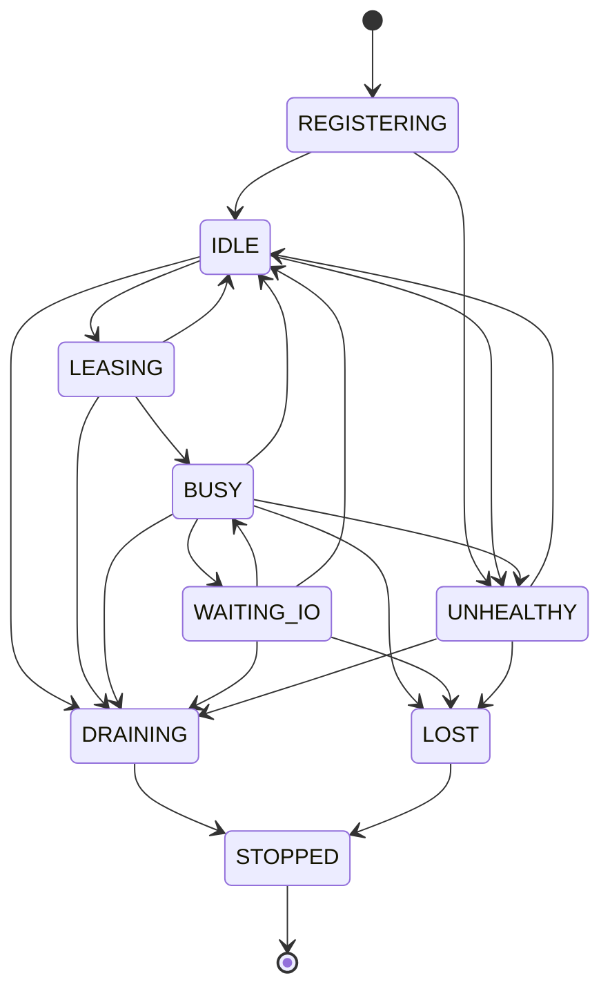

---

# Worker Registration

Workers must register before leasing Tasks.

Canonical registration:

```yaml id="x1q9ae"
worker_registration:
  worker_id:
  pool:
  capabilities:
  supported_task_classes:
  supported_task_types:
  software_version:
  configuration_hash:
  runtime_environment:
  maximum_concurrency:
  registered_at:
```

Registration must be rejected when:

* Pool is unknown;
* Worker version is incompatible;
* configuration mismatch is unsafe;
* required dependencies are absent;
* identity conflicts with an active Worker.

---

# Worker Capabilities

Capabilities may include:

```yaml id="s7br1m"
capabilities:
  ffmpeg:
  ffprobe:
  image_processing:
  provider_submission:
  provider_monitoring:
  audio_generation:
  technical_validation:
  editorial_review:
  maximum_memory_mb:
  supported_codecs:
  supported_providers:
```

Dispatch is capability-driven.

Worker Pool membership alone is insufficient when Task requirements are more specific.

---

# Worker Capacity

Each Worker declares:

```yaml id="u8nv4r"
worker_capacity:
  maximum_active_tasks:
  cpu_units:
  memory_mb:
  disk_mb:
  network_slots:
  provider_submission_slots:
```

Default recommendation:

```yaml id="c2ke5m"
maximum_active_tasks: 1
```

Multi-Task Workers require explicit design and testing.

---

# Pool Capacity

Pool capacity is derived from healthy Workers and configured limits.

```text id="p5v0wa"
available_pool_capacity =
min(
  configured_pool_limit,
  sum(healthy_worker_capacity),
  resource_limit,
  backpressure_limit
)
```

Pool capacity must be versioned in the scheduling snapshot.

---

# Dispatch Model

Canonical dispatch flow:

```text id="tt0b5j"
Scheduler Selects Task
↓
Reserve Resources
↓
Enqueue Task
↓
Worker Leases Item
↓
Verify Lease and Task State
↓
Transition Task to LEASED
↓
Load Immutable Task Definition
↓
Validate Capability
↓
Transition to DISPATCHED
↓
Execute
↓
Persist Result
↓
Transition Task State
↓
Acknowledge Queue
↓
Release Resources
```

---

# Dispatch Preconditions

Before Worker execution:

```yaml id="37r4sh"
dispatch_preconditions:
  queue_lease_valid: true
  task_state_compatible: true
  build_state_allows_execution: true
  worker_capability_sufficient: true
  task_definition_hash_matches: true
  resource_reservation_valid: true
  idempotency_record_valid: true
  cancellation_not_requested: true
```

Failure of any precondition blocks execution.

---

# Dispatch Decision Validation

A Worker must revalidate the Dispatch Decision because state may change after Scheduling.

Examples:

* Build paused;
* approval revoked;
* Task cancelled;
* lease expired;
* resource reservation expired;
* Task already completed by another Worker.

Workers must not trust stale Queue messages.

---

# Task Lease Acquisition

A Worker leases one Queue item.

Canonical lease:

```yaml id="6h4qmn"
task_lease:
  lease_id:
  task_id:
  queue_item_id:
  worker_id:
  issued_at:
  expires_at:
  heartbeat_interval_seconds:
  renewal_limit:
```

The lease grants temporary execution authority.

---

# Lease Ownership

Only the Worker named in the active lease may execute or acknowledge the Task Attempt.

A Worker may not transfer a lease directly to another Worker.

It must release the lease and return the Task to controlled scheduling.

---

# Lease Renewal

Lease renewal is allowed when:

* Worker remains healthy;
* Task is still active;
* Build State permits continuation;
* cancellation has not superseded work;
* renewal limit has not been exceeded;
* progress is being made.

Renewal is not automatic proof of health.

---

# Lease Expiration

On lease expiration:

```text id="kb0gt6"
Lease Expires
↓
Mark Worker Ownership Untrusted
↓
Reconcile Task State
↓
Check External Side Effects
↓
Requeue, Recover, or Manual Review
```

The Task must not be blindly redispatched.

---

# Heartbeat Model

Workers send heartbeats:

```yaml id="v8yk93"
worker_heartbeat:
  worker_id:
  worker_state:
  task_id:
  lease_id:
  observed_at:
  progress:
  resource_usage:
  health:
```

Heartbeat frequency is Pool-specific.

---

# Heartbeat Requirements

Suggested defaults:

```yaml id="7hr29v"
heartbeat_seconds:
  control: 10
  local_generation: 15
  provider_submission: 10
  provider_monitor: 20
  download: 15
  validation: 15
  ffmpeg: 15
  packaging: 30
```

---

# Worker Loss Detection

A Worker is considered LOST when:

```text id="7c3ye2"
current_time
>
last_heartbeat
+
loss_threshold
```

Worker loss triggers:

* active lease reconciliation;
* resource release;
* Task-side-effect reconciliation;
* Worker health event;
* possible capacity reduction.

---

# Local Task Execution Contract

Local Workers must:

1. create isolated working directory;
2. load immutable inputs;
3. validate input hashes;
4. execute declared command;
5. capture stdout and stderr safely;
6. enforce timeout;
7. validate outputs;
8. persist output references;
9. clean temporary files;
10. report Task Result.

---

# External Provider Submission Contract

Provider Submission Worker must:

1. load provider adapter;
2. resolve secret reference;
3. verify idempotency status;
4. assemble request from immutable Task Definition;
5. submit request;
6. capture provider task ID;
7. persist provider task ID immediately;
8. transition Task to `WAITING_EXTERNAL`;
9. enqueue Provider Monitor item;
10. acknowledge Submission Queue item.

---

# Provider Monitor Contract

Provider Monitor Worker must:

1. lease Monitor item;
2. verify provider task record;
3. query provider status;
4. classify response;
5. persist latest known status;
6. calculate next poll or completion route;
7. enqueue Download item when complete;
8. acknowledge or delay Monitor item;
9. emit provider status event.

It must not hold a local lease between polls.

---

# Download Contract

Download Worker must:

1. verify download authorization;
2. reserve storage;
3. stream to temporary path;
4. record byte progress;
5. verify expected size where available;
6. calculate checksum;
7. reject incomplete payload;
8. move valid raw artifact atomically;
9. persist artifact reference;
10. enqueue Validation Task.

---

# Validation Contract

Validation Worker must:

1. load immutable artifact;
2. verify checksum;
3. execute declared validators;
4. persist each validation result;
5. classify pass, warning, fail, or manual review;
6. transition Task accordingly;
7. emit validation event.

The Worker does not decide retry policy.

---

# FFmpeg Execution Contract

FFmpeg Worker must:

1. verify all input artifacts;
2. verify timeline identity;
3. reserve CPU, memory, and disk;
4. construct deterministic command;
5. record command specification;
6. execute in isolated subprocess;
7. enforce timeout;
8. capture logs;
9. validate output with FFprobe;
10. persist output in CAS;
11. remove partial output on failure.

---

# Packaging Contract

Packaging Worker must:

* use approved outputs only;
* preserve hashes;
* generate deterministic file names;
* create checksums;
* persist package manifest;
* avoid publication unless explicitly authorized.

---

# Task Acknowledgement Rule

A Worker acknowledges the Queue item only after the authoritative Task state has been persisted.

Required order:

```text id="x71n4d"
Persist Result
↓
Persist Task State
↓
Emit / Stage Event
↓
Acknowledge Queue
```

Acknowledging before persistence is prohibited.

---

# Worker Failure Before Side Effect

Example:

```text id="d3u9af"
Worker crashes before execution
↓
Lease expires
↓
Task safely requeued
```

No reconciliation of external effects is required if the idempotency record confirms none occurred.

---

# Worker Failure After Side Effect

Example:

```text id="jr6e2d"
Provider submission succeeds
↓
Worker crashes before Task State persistence
```

Required recovery:

```text id="d20xnr"
Inspect Idempotency Record
↓
Reconcile Provider
↓
Recover Provider Task ID
↓
Persist WAITING_EXTERNAL
```

Blind resubmission is prohibited.

---

# Worker Failure After Output Creation

Example:

```text id="j4mcx8"
FFmpeg output created
↓
Worker crashes before SUCCEEDED
```

Recovery:

* locate temporary or CAS artifact;
* verify hash and media validity;
* reconcile Task result;
* mark succeeded if evidence is complete;
* otherwise rerun safely.

---

# Process Isolation

Worker execution should occur in isolated:

* subprocess;
* container;
* temporary workspace;
* restricted environment.

A Task must not modify:

* another Build workspace;
* approved artifacts;
* Runtime Manifest directly;
* shared configuration;
* another Worker lease.

---

# Workspace Isolation

Recommended layout:

```text id="q8g74h"
workspace/
└── builds/
    └── <build_id>/
        └── tasks/
            └── <task_id>/
                └── attempts/
                    └── <attempt_number>/
                        ├── input/
                        ├── output/
                        ├── temp/
                        └── logs/
```

Each Task Attempt has an isolated workspace.

---

# Worker Secret Access

Workers receive only the minimum secret references required for their Task Class.

Examples:

| Worker Pool         | Secret Access                   |
| ------------------- | ------------------------------- |
| Provider Submission | Provider token                  |
| Provider Monitor    | Provider token                  |
| Download            | Signed URL or provider access   |
| Validation          | None by default                 |
| FFmpeg              | None                            |
| Packaging           | None                            |
| Control             | Lock or state-store credentials |

Secrets must not be inherited by unrelated subprocesses.

---

# Worker Version Compatibility

Task execution must record:

```yaml id="k26zgp"
worker_execution:
  worker_version:
  runtime_version:
  adapter_version:
  configuration_hash:
```

A Worker incompatible with the Task's minimum version must reject the lease.

---

# Worker Draining

During graceful shutdown:

```text id="f07efj"
Worker enters DRAINING
↓
Stops leasing new Tasks
↓
Completes or safely pauses current Task
↓
Persists state
↓
Releases lease
↓
Stops
```

DRAINING must not accept new ordinary Tasks.

---

# Worker Shutdown Modes

```yaml id="8n5zd7"
shutdown_modes:
  - GRACEFUL
  - FAST
  - EMERGENCY
```

## GRACEFUL

Finish active safe work.

## FAST

Stop after current atomic boundary.

## EMERGENCY

Terminate immediately and rely on reconciliation.

Emergency shutdown requires an incident event.

---

# SIGTERM Handling

GitHub Actions and container runtimes may issue SIGTERM.

Required Worker behavior:

1. enter DRAINING;
2. stop new leases;
3. persist current progress;
4. complete atomic state write;
5. release or preserve lease according to Task Class;
6. exit within grace period.

---

# Worker Concurrency

Default:

```yaml id="5dbxpu"
worker_concurrency:
  active_tasks_per_worker: 1
```

Higher concurrency is allowed only for I/O-bound Workers and requires explicit resource accounting.

Examples:

* Provider Monitor may process multiple short polls;
* Metadata Worker may process small Tasks concurrently;
* FFmpeg Worker should generally process one Task.

---

# Pool Concurrency

Example:

```yaml id="f40fwa"
pool_concurrency:
  control: 1
  local_generation: 4
  provider_submission: 6
  provider_monitor: 4
  download: 3
  validation: 4
  audio: 3
  ffmpeg: 1
  packaging: 2
  metadata: 2
```

Actual limits come from resolved configuration.

---

# Dispatch Fairness

Worker Pool Manager must respect Scheduler decisions.

It may not reorder Tasks except for:

* Worker capability mismatch;
* expired reservation;
* cancellation;
* safety;
* Pool-specific hard constraint.

Any rejection must be recorded and returned for rescheduling.

---

# Dispatch Rejection Model

```yaml id="x5bmn2"
dispatch_rejection:
  task_id:
  worker_id:
  reason:
  evidence:
  retryable:
  returned_to:
```

Standard reasons:

```yaml id="s0e29w"
dispatch_rejection_reasons:
  - CAPABILITY_MISMATCH
  - LEASE_EXPIRED
  - TASK_STATE_CHANGED
  - BUILD_STATE_CHANGED
  - RESOURCE_RESERVATION_EXPIRED
  - WORKER_UNHEALTHY
  - CONFIGURATION_MISMATCH
  - CANCELLATION_REQUESTED
```

---

# Worker Progress

Progress reporting is advisory.

It may include:

```yaml id="qg32nh"
task_progress:
  phase:
  percentage:
  processed_units:
  total_units:
  message:
  updated_at:
```

Progress may support timeout extension but cannot prove success.

---

# Worker Result Model

```yaml id="aa9g3m"
worker_result:
  worker_id:
  task_id:
  attempt:
  outcome:
  output_references:
  provider_task_id:
  validation_references:
  failure:
  started_at:
  completed_at:
  metrics:
  logs_reference:
```

The Worker Result is input to Task Result persistence.

It is not itself the authoritative terminal record.

---

# Worker Event Model

Required events include:

```text id="pjv6s8"
worker.registered
worker.ready
worker.leasing
worker.task_leased
worker.task_started
worker.heartbeat
worker.progress
worker.task_completed
worker.task_failed
worker.lease_released
worker.draining
worker.unhealthy
worker.lost
worker.stopped
dispatch.accepted
dispatch.rejected
```

---

# Worker Metrics

Required metrics:

```yaml id="w3v71a"
worker_metrics:
  registered_workers:
  healthy_workers:
  idle_workers:
  busy_workers:
  draining_workers:
  lost_workers:
  pool_capacity:
  active_leases:
  lease_expirations:
  dispatch_acceptance_rate:
  dispatch_rejection_rate:
  heartbeat_latency_ms:
  worker_utilization:
  task_execution_seconds:
  worker_restart_count:
  task_recovery_count:
```

---

# Worker Utilization

```text id="mhp0xa"
worker_utilization =
busy_time
/
available_time
```

A low utilization rate may indicate:

* insufficient runnable work;
* scheduling defect;
* capability mismatch;
* resource block;
* overprovisioning.

---

# Pool Saturation

```text id="tq8n2d"
pool_saturation =
active_leases
/
effective_pool_capacity
```

Saturation feeds Backpressure and Scheduling.

---

# Dispatch Latency

```text id="0fo9iu"
dispatch_to_start_latency =
task_started_at
-
dispatch_decision_at
```

This is separate from Queue wait.

---

# Worker Pool Manager Interface

```python id="v0o5c5"
class WorkerPoolManager:
    def register(
        self,
        descriptor: "WorkerDescriptor"
    ) -> "WorkerRegistrationResult":
        ...

    def capacity(
        self,
        pool: str
    ) -> "PoolCapacity":
        ...

    def lease_task(
        self,
        pool: str,
        worker_id: str
    ) -> "TaskLease | None":
        ...

    def heartbeat(
        self,
        heartbeat: "WorkerHeartbeat"
    ) -> None:
        ...

    def mark_draining(
        self,
        worker_id: str
    ) -> None:
        ...

    def mark_lost(
        self,
        worker_id: str,
        reason: str
    ) -> None:
        ...
```

---

# Dispatch Coordinator Interface

```python id="52ykqe"
class DispatchCoordinator:
    def dispatch(
        self,
        decision: "DispatchDecision"
    ) -> "DispatchResult":
        ...

    def reconcile(
        self,
        build_id: str,
        task_id: str
    ) -> "DispatchReconciliationResult":
        ...
```

---

# Worker Runtime Interface

```python id="hf08h2"
class WorkerRuntime:
    def start(self) -> None:
        ...

    def execute(
        self,
        lease: "TaskLease"
    ) -> "WorkerResult":
        ...

    def drain(self) -> None:
        ...

    def stop(self) -> None:
        ...
```

---

# Capability Matcher Interface

```python id="hjl5n1"
class CapabilityMatcher:
    def compatible(
        self,
        worker: "WorkerDescriptor",
        task: "RuntimeTask"
    ) -> bool:
        ...

    def explain_mismatch(
        self,
        worker: "WorkerDescriptor",
        task: "RuntimeTask"
    ) -> list[str]:
        ...
```

---

# Worker Health Monitor Interface

```python id="r8va93"
class WorkerHealthMonitor:
    def evaluate(
        self,
        worker_id: str
    ) -> "WorkerHealth":
        ...

    def detect_lost_workers(self) -> list[str]:
        ...

    def reconcile_leases(
        self,
        worker_id: str
    ) -> list["LeaseRecoveryDecision"]:
        ...
```

---

# Reference Configuration

```yaml id="l97t6c"
orchestrator:
  workers:
    require_registration: true
    require_capability_match: true
    active_tasks_per_worker: 1
    persist_worker_events: true

    heartbeat:
      default_seconds: 15
      loss_multiplier: 3

    leases:
      default_seconds: 300
      renew_before_seconds: 60
      maximum_renewals: 20

    shutdown:
      grace_period_seconds: 120
      sigterm_mode: GRACEFUL

    pools:
      control:
        max_workers: 1
        reserved: true

      local_generation:
        max_workers: 4

      provider_submission:
        max_workers: 6

      provider_monitor:
        max_workers: 4

      download:
        max_workers: 3

      validation:
        max_workers: 4

      audio:
        max_workers: 3

      ffmpeg:
        max_workers: 1

      packaging:
        max_workers: 2

      metadata:
        max_workers: 2
```

---

# Deployment Profiles

## Local Development

```text id="6s7gx8"
Single Orchestrator Process
+
Local Worker Threads or Processes
+
Persistent Local Queue
```

Requirements:

* same Task and lease semantics;
* no special shortcut that bypasses persistence;
* in-memory Worker state allowed only for unit tests.

---

## GitHub Actions

```text id="p5ss5h"
Workflow Job
├── Orchestrator
├── Local Worker Processes
├── Shared CAS
├── Persistent Manifest
└── External Providers
```

Requirements:

* handle runner termination;
* persist provider task IDs externally;
* checkpoint before job timeout;
* support a later resume workflow;
* avoid holding the job solely for provider rendering where architecture permits separation.

---

## Distributed Runtime

```text id="bw46h0"
Orchestrator Service
├── Durable Queues
├── Worker Fleet
├── Shared CAS
├── Shared Manifest Store
└── Provider Coordinators
```

Requirements:

* distributed leasing;
* heartbeat;
* authenticated Worker registration;
* network-failure tolerance;
* compare-and-set state updates.

---

# Security Requirements

Worker security requirements:

* least-privilege access;
* Pool-specific credentials;
* no broad secret inheritance;
* workspace isolation;
* output validation before persistence;
* signed URL redaction;
* command argument sanitization;
* no arbitrary shell execution from untrusted Task payload;
* Worker identity authentication;
* tamper-evident Worker events.

---

# Command Execution Safety

Local Workers must not execute arbitrary shell strings directly.

Preferred:

```python id="5o1a9r"
subprocess.run(
    args=[...],
    shell=False,
    check=False,
)
```

Task Definitions must provide structured command specifications rather than interpolated shell text.

---

# Output Trust Boundary

Worker output is untrusted until verified.

Required flow:

```text id="19ykrp"
Worker Produces Output
↓
Checksum
↓
Schema or Media Validation
↓
CAS Registration
↓
Task Success
```

A Worker may not directly mark an unvalidated artifact approved.

---

# Testing Requirements

## Unit Tests

* Worker registration;
* capability matching;
* Pool capacity;
* lease creation;
* lease renewal;
* lease expiration;
* heartbeat;
* Worker State transitions;
* dispatch preconditions;
* dispatch rejection;
* Task acknowledgement order;
* shutdown modes;
* deterministic workspace path.

## Integration Tests

* Provider submission Worker lifecycle;
* Provider Monitor without long-held lease;
* Download Worker to Validation Queue;
* FFmpeg Worker output validation;
* Worker crash before side effect;
* Worker crash after provider submission;
* Worker crash after output creation;
* graceful shutdown;
* GitHub Actions SIGTERM simulation;
* Pool saturation and release.

## Concurrency Tests

* two Workers attempt same lease;
* duplicate Worker identity;
* heartbeat and lease expiration race;
* cancellation during active execution;
* Worker result concurrent with Task retry;
* resource release after Worker loss.

## Security Tests

* Worker receives only required secret;
* shell injection attempt rejected;
* cross-Build workspace access rejected;
* signed URL redacted;
* incompatible Worker version rejected;
* unauthorized Worker registration rejected.

## Recovery Tests

* lost Worker lease reconciliation;
* provider Task recovery;
* orphan local subprocess handling;
* partial download cleanup;
* partial FFmpeg output quarantine;
* result persisted but Queue acknowledgement lost.

---

# Worker Pool Quality Gate

```yaml id="6tdmq4"
worker_pool_quality_gate:
  every_worker_registered: true
  every_worker_has_capabilities: true
  every_active_task_has_valid_lease: true
  no_task_has_multiple_active_workers: true
  provider_submission_workers_release_after_submission: true
  provider_monitor_workers_do_not_hold_long_leases: true
  every_worker_emits_heartbeat: true
  lost_worker_reconciliation_passed: true
  task_acknowledgement_after_state_persistence: true
  graceful_shutdown_test_passed: true
  sigterm_test_passed: true
  worker_crash_recovery_test_passed: true
  workspace_isolation_verified: true
  least_privilege_verified: true
```

---

# Architectural Invariants

## Invariant WD-301

Workers execute leased Tasks and never own permanent Task authority.

## Invariant WD-302

Every Worker must register capabilities before receiving work.

## Invariant WD-303

A Task Attempt may have only one active Worker lease.

## Invariant WD-304

Provider submission Workers release capacity immediately after provider task identity is persisted.

## Invariant WD-305

Provider monitoring does not hold submission Worker capacity.

## Invariant WD-306

Queue acknowledgement occurs only after authoritative Task State and result persistence.

## Invariant WD-307

Worker loss triggers reconciliation before redispatch.

## Invariant WD-308

Worker output remains untrusted until validation and CAS registration.

## Invariant WD-309

Each Task Attempt executes in an isolated workspace.

## Invariant WD-310

Runtime topology may change, but Task, lease, state, and idempotency semantics remain identical.

---

# Architectural Decision Records

| ADR     | Decision                                                                                                  |
| ------- | --------------------------------------------------------------------------------------------------------- |
| ADR-881 | Workers receive temporary leases and never permanently own Tasks.                                         |
| ADR-882 | Worker Pools are separated by execution class and resource profile.                                       |
| ADR-883 | Provider submission and provider monitoring use distinct Worker Pools.                                    |
| ADR-884 | External provider rendering never holds a submission Worker lease for its full duration.                  |
| ADR-885 | Worker capability matching is mandatory before dispatch.                                                  |
| ADR-886 | Worker loss requires side-effect reconciliation before requeue.                                           |
| ADR-887 | Worker acknowledgement follows result and state persistence.                                              |
| ADR-888 | FFmpeg and other CPU-intensive operations execute in isolated Workers.                                    |
| ADR-889 | Worker topology may scale from local processes to distributed services without changing domain contracts. |
| ADR-890 | Worker outputs are untrusted until independently validated and registered as immutable artifacts.         |

---

# Acceptance Criteria

Section **6.3.9** is complete when:

* Worker, Worker Pool, Worker State, Worker Lease, Worker Result, and capability models are formally defined.
* Control, Local Generation, Provider Submission, Provider Monitor, Download, Validation, Audio, FFmpeg, Packaging, Metadata, and Manual Review Pools have explicit responsibilities.
* Submission Workers do not remain occupied while providers render.
* Provider monitoring, downloading, validation, and composition operate through independent Pools.
* Dispatch includes capability validation, lease acquisition, resource reservation, state validation, and idempotency protection.
* Worker registration, heartbeat, lease renewal, loss detection, draining, shutdown, and SIGTERM behavior are standardized.
* Worker crashes before and after external side effects are recoverable without duplicate execution.
* Each Task Attempt uses an isolated workspace.
* Queue acknowledgement occurs only after authoritative persistence.
* Worker outputs are validated before they become trusted artifacts.
* Pool capacity, utilization, saturation, dispatch latency, events, security, configuration, interfaces, tests, Quality Gates, invariants, and ADRs are sufficiently detailed for Codex to implement a safe Worker execution layer for local development, GitHub Actions, and future distributed runtime environments.


# Part 6.3.10 — Provider Task Coordination

## Insynergy Cinematic Thought Leadership Platform

### Master Specification v2.1

---

# Purpose

This section defines the canonical **Provider Task Coordination** architecture used by the Build Orchestration & Runtime Control Layer.

Provider Task Coordination manages execution that crosses the platform boundary into an external service.

Typical external services include:

* video generation providers;
* image generation providers;
* text-to-speech providers;
* language-model providers;
* transcription providers;
* hosted media-processing providers;
* publication providers where publishing is included in the active execution profile.

The subsystem coordinates the complete external execution lifecycle:

```text
Provider Selection
→ Request Construction
→ Idempotency Registration
→ Submission
→ Provider Task Identity Persistence
→ Monitoring
→ Completion Detection
→ Artifact Retrieval
→ Validation
→ Cost Reconciliation
```

Its primary objective is to prevent external asynchronous work from becoming an uncontrolled side effect.

---

# Governing Principle

The platform adopts the following principle.

> **No provider request may exist without a persistent internal Task identity, idempotency record, lifecycle state, and reconciliation path.**

The platform must always be able to answer:

* which internal Task caused the provider request;
* which provider and capability were used;
* which request was sent;
* whether the provider accepted it;
* which external Task ID was returned;
* whether the operation may be retried;
* what cost was incurred;
* what artifact was produced;
* how the output was validated;
* whether the provider result is authoritative, ambiguous, failed, or cancelled.

---

# Architectural Position

```text
Runtime Task
    │
    ▼
Provider Coordinator
    │
    ├── Provider Policy Resolver
    ├── Capability Resolver
    ├── Provider Adapter Registry
    ├── Request Builder
    ├── Idempotency Registry
    ├── Submission Coordinator
    ├── Provider Task Repository
    ├── Status Monitor
    ├── Callback Receiver
    ├── Polling Coordinator
    ├── Cost Reconciler
    ├── Artifact Retrieval Coordinator
    └── Provider Failure Classifier
    │
    ▼
External Provider
```

Provider Coordination spans multiple Worker Pools but remains one coherent domain capability.

---

# Responsibilities

The Provider Task Coordination subsystem is responsible for:

* provider capability discovery;
* provider selection according to the approved Execution Plan;
* adapter resolution;
* request construction;
* request normalization;
* idempotency registration;
* provider submission;
* provider Task ID persistence;
* asynchronous status monitoring;
* callback processing;
* polling;
* provider state normalization;
* ambiguous submission reconciliation;
* external cancellation;
* provider timeout handling;
* provider artifact discovery;
* signed URL lifecycle management;
* cost and usage capture;
* quota reconciliation;
* provider-specific failure classification;
* provider substitution enforcement;
* provenance preservation;
* provider health and performance metrics.

It is not responsible for:

* inventing undeclared providers;
* changing the creative brief;
* weakening quality requirements;
* bypassing approval;
* deciding final artifact acceptance;
* silently retrying ambiguous requests;
* storing secrets inside Task payloads;
* allowing provider-specific states to replace canonical Task States.

---

# Provider Coordination Boundary

Provider Coordination begins when an approved Runtime Task requires an external provider capability.

It ends when one of the following occurs:

* the provider output has been retrieved and handed to validation;
* the provider Task has failed permanently;
* the provider Task has been cancelled;
* the result requires manual review;
* the provider operation has been reconciled into an internal terminal decision.

The subsystem does not end merely because a provider reports `completed`.

Provider completion is only one event in the internal lifecycle.

---

# Canonical Provider Lifecycle

```text
Provider Task Required
        │
        ▼
Provider Policy Resolution
        │
        ▼
Capability and Adapter Validation
        │
        ▼
Idempotency Registration
        │
        ▼
Request Submission
        │
        ├── Accepted
        │      │
        │      ▼
        │  Provider Task ID Persisted
        │      │
        │      ▼
        │  Monitoring
        │      │
        │      ├── Running
        │      ├── Completed
        │      ├── Failed
        │      └── Cancelled
        │
        ├── Rejected
        │
        └── Ambiguous
```

---

# Provider Model

Canonical provider descriptor:

```yaml
provider:
  provider_id:
  provider_type:
  adapter_id:
  adapter_version:
  capabilities:
  supported_models:
  supported_regions:
  health_state:
  authentication_mode:
  callback_support:
  idempotency_support:
  cancellation_support:
  usage_reporting:
  cost_model:
  limits:
```

Provider identity is immutable within one provider configuration version.

---

# Provider Types

```yaml
provider_types:
  - VIDEO_GENERATION
  - IMAGE_GENERATION
  - AUDIO_GENERATION
  - LANGUAGE_MODEL
  - TRANSCRIPTION
  - MEDIA_PROCESSING
  - PUBLICATION
```

One provider may support multiple Provider Types.

---

# Provider Capability Model

A provider capability is more specific than provider identity.

```yaml
provider_capability:
  capability_id:
  provider_id:
  operation:
  model:
  model_version:
  input_modalities:
  output_modalities:
  supported_parameters:
  maximum_duration:
  maximum_resolution:
  supported_aspect_ratios:
  callback_supported:
  deterministic_seed_supported:
```

Examples:

```yaml
capabilities:
  - image_to_video
  - text_to_video
  - text_to_image
  - text_to_speech
  - speech_to_text
  - structured_text_generation
```

A provider adapter may not claim capabilities that the provider does not currently support.

---

# Provider Requirement

Every external Runtime Task must declare a Provider Requirement.

```yaml
provider_requirement:
  provider_policy:
  preferred_provider:
  allowed_providers:
  prohibited_providers:
  required_capability:
  required_model_profile:
  region_policy:
  maximum_cost:
  maximum_latency:
  fallback_policy:
  output_requirements:
```

The requirement originates from the approved Execution Plan.

---

# Provider Selection Policy

Provider selection must be deterministic within the approved policy.

Supported policies:

```yaml
provider_selection_policies:
  - FIXED_PROVIDER
  - ORDERED_FALLBACK
  - CAPABILITY_MATCH
  - COST_BOUNDED
  - LATENCY_BOUNDED
  - QUALITY_PROFILE
```

---

# FIXED_PROVIDER

Exactly one provider is authorized.

Example:

```yaml
provider_policy:
  mode: FIXED_PROVIDER
  provider: runway
```

Failure does not authorize substitution unless the Execution Plan declares a fallback.

---

# ORDERED_FALLBACK

Providers are evaluated in approved order.

```yaml
provider_policy:
  mode: ORDERED_FALLBACK
  providers:
    - runway
    - approved_animated_still_provider
```

Fallback activation may require approval.

---

# CAPABILITY_MATCH

The coordinator selects from approved providers that satisfy all required capability constraints.

Selection must remain deterministic through a fixed ranking policy.

---

# COST_BOUNDED

The provider must satisfy capability requirements while remaining below a declared cost ceiling.

Cost optimization may not reduce required quality below plan constraints.

---

# LATENCY_BOUNDED

The provider must satisfy a declared completion-time objective.

Latency estimates must come from observed provider metrics or provider guarantees.

---

# QUALITY_PROFILE

Provider and model are selected according to a declared rendering profile.

Example:

```yaml
quality_profiles:
  preview:
    maximum_resolution: 1280x720
    maximum_duration_seconds: 5

  final:
    minimum_resolution: 1920x1080
    cinematic_quality_required: true
```

---

# Provider Adapter Architecture

Every provider integration must implement a canonical adapter contract.

```python
class ProviderAdapter:
    def capabilities(self) -> "ProviderCapabilities":
        ...

    def validate_request(
        self,
        request: "CanonicalProviderRequest"
    ) -> "ProviderRequestValidation":
        ...

    def submit(
        self,
        request: "CanonicalProviderRequest",
        idempotency_key: str
    ) -> "ProviderSubmissionResult":
        ...

    def get_status(
        self,
        provider_task_id: str
    ) -> "ProviderStatusResult":
        ...

    def cancel(
        self,
        provider_task_id: str
    ) -> "ProviderCancellationResult":
        ...

    def artifacts(
        self,
        provider_task_id: str
    ) -> list["ProviderArtifactReference"]:
        ...

    def usage(
        self,
        provider_task_id: str
    ) -> "ProviderUsage":
        ...
```

Provider-specific behavior must remain behind the adapter boundary.

---

# Canonical Provider Request

The internal system uses a provider-neutral request model.

```yaml
canonical_provider_request:
  request_id:
  build_id:
  task_id:
  attempt_number:
  capability:
  model_profile:
  inputs:
  parameters:
  output_requirements:
  safety_requirements:
  callback_reference:
  metadata:
```

Provider-specific request payloads are derived from this model.

---

# Request Immutability

Once submission begins, the canonical Provider Request is immutable.

The persisted request must include:

* canonical request hash;
* adapter version;
* provider-specific payload hash;
* idempotency key;
* provider configuration version;
* submission attempt.

Any material change requires a new Task Attempt or execution generation.

---

# Provider Request Hash

Recommended formula:

```text
provider_request_hash =
sha256(
  canonical_provider_request
  + provider_id
  + capability_id
  + adapter_version
)
```

Timestamps and non-semantic fields must not affect the hash.

---

# Provider-Specific Payload

The adapter may transform the canonical request into provider-specific fields.

Example:

```yaml
provider_payload:
  provider: runway
  operation: image_to_video
  fields:
    prompt:
    source_image:
    duration:
    aspect_ratio:
    model:
```

The normalized payload hash must be persisted.

Raw secret material must not be persisted with the payload.

---

# Request Validation

Before submission, the adapter must verify:

* required inputs exist;
* input hashes match;
* capability is supported;
* parameter ranges are valid;
* model profile is available;
* content-policy restrictions are satisfied;
* output requirements are achievable;
* provider region is allowed;
* maximum cost is not exceeded;
* callback configuration is valid;
* provider credentials are resolvable.

Submission must fail closed if validation fails.

---

# Idempotency Registry

Every provider side effect must be protected by a persistent idempotency record.

Canonical record:

```yaml
provider_idempotency_record:
  idempotency_key:
  build_id:
  task_id:
  attempt_number:
  execution_generation:
  provider:
  request_hash:
  state:
  provider_task_id:
  created_at:
  updated_at:
```

---

# Idempotency States

```yaml
provider_idempotency_states:
  - RESERVED
  - SUBMITTING
  - ACCEPTED
  - REJECTED
  - AMBIGUOUS
  - COMPLETED
  - CANCELLED
  - FAILED
```

The idempotency record must be created before the request is transmitted.

---

# Submission Sequence

Canonical sequence:

```text
Validate Runtime Task
↓
Resolve Provider and Capability
↓
Build Canonical Request
↓
Calculate Request Hash
↓
Reserve Idempotency Key
↓
Persist SUBMITTING
↓
Transmit Provider Request
↓
Classify Response
↓
Persist Provider Task Identity
↓
Transition Internal Task State
```

---

# Submission Preconditions

```yaml
submission_preconditions:
  task_state: DISPATCHED
  provider_requirement_valid: true
  provider_health_acceptable: true
  provider_slot_reserved: true
  budget_reserved: true
  idempotency_record_reserved: true
  request_hash_matches: true
  approval_valid: true
  cancellation_not_requested: true
```

A Worker must revalidate these conditions immediately before transmission.

---

# Submission Outcomes

Canonical submission outcomes:

```yaml
provider_submission_outcomes:
  - ACCEPTED
  - REJECTED_RETRYABLE
  - REJECTED_PERMANENT
  - RATE_LIMITED
  - AUTHENTICATION_FAILED
  - AMBIGUOUS
```

Provider-specific responses must normalize into one of these outcomes.

---

# ACCEPTED

The provider confirms acceptance and returns a provider Task ID.

Required actions:

1. persist provider Task ID;
2. update idempotency state to `ACCEPTED`;
3. transition Task to `WAITING_EXTERNAL`;
4. enqueue Provider Monitor item;
5. release submission Worker;
6. emit acceptance event.

---

# REJECTED_RETRYABLE

Examples:

* transient provider overload;
* temporary request timeout before acceptance;
* short-lived capacity issue;
* retryable validation response explicitly identified by provider.

The Failure Coordinator determines retry.

---

# REJECTED_PERMANENT

Examples:

* invalid parameter;
* unsupported capability;
* permanent content rejection;
* model unavailable under current contract;
* malformed provider payload.

The Task normally transitions toward `FAILED_PERMANENT` or `MANUAL_REVIEW`.

---

# RATE_LIMITED

A rate-limit response must capture:

```yaml
rate_limit:
  provider:
  scope:
  retry_after:
  limit:
  remaining:
  reset_at:
```

The Provider Capacity Controller must update provider availability.

---

# AUTHENTICATION_FAILED

Authentication failures are treated as configuration or secret-management failures.

Automatic retry is prohibited until the credential state changes.

---

# AMBIGUOUS Submission

A submission is ambiguous when the platform cannot determine whether the provider accepted the request.

Examples:

* network timeout after request transmission;
* connection reset after provider-side acceptance;
* invalid or truncated response;
* process crash before provider Task ID persistence.

The Task must not be blindly resubmitted.

---

# Ambiguous Submission State

```yaml
ambiguous_submission:
  task_id:
  provider:
  idempotency_key:
  request_hash:
  transmitted_at:
  failure_observed_at:
  reconciliation_required: true
```

Internal Task outcome should become:

* `WAITING_EXTERNAL` if an existing provider Task is recovered;
* `FAILED_RETRYABLE` if the provider confirms no Task exists;
* `MANUAL_REVIEW` if provider state cannot be established.

---

# Ambiguous Submission Reconciliation

Canonical workflow:

```text
Submission Outcome Unknown
        │
        ▼
Check Local Idempotency Record
        │
        ▼
Query Provider by Idempotency Key or Metadata
        │
        ├── Existing Task Found
        │       ▼
        │   Persist Provider Task ID
        │       ▼
        │   WAITING_EXTERNAL
        │
        ├── Provider Confirms No Task
        │       ▼
        │   Retry Classification
        │
        └── Cannot Determine
                ▼
            MANUAL_REVIEW
```

---

# Provider Task Record

Every accepted external task receives a persistent Provider Task Record.

```yaml
provider_task:
  provider_task_record_id:
  build_id:
  task_id:
  attempt_number:
  provider:
  capability:
  provider_task_id:
  request_hash:
  idempotency_key:
  normalized_state:
  provider_state:
  submitted_at:
  last_checked_at:
  next_check_at:
  completed_at:
  cancellation:
  artifacts:
  usage:
  cost:
  state_history:
```

---

# Canonical Provider States

Provider-specific states must normalize into:

```yaml
canonical_provider_states:
  - SUBMITTED
  - QUEUED
  - PROCESSING
  - SUCCEEDED
  - FAILED
  - CANCELLING
  - CANCELLED
  - EXPIRED
  - UNKNOWN
```

Provider-native state remains recorded separately.

---

# Provider State Mapping

Example:

```yaml
provider_state_mapping:
  pending: QUEUED
  running: PROCESSING
  completed: SUCCEEDED
  failed: FAILED
  cancelled: CANCELLED
```

Mappings are adapter-versioned.

An unmapped provider state becomes `UNKNOWN` and requires reconciliation.

---

# Provider State Machine

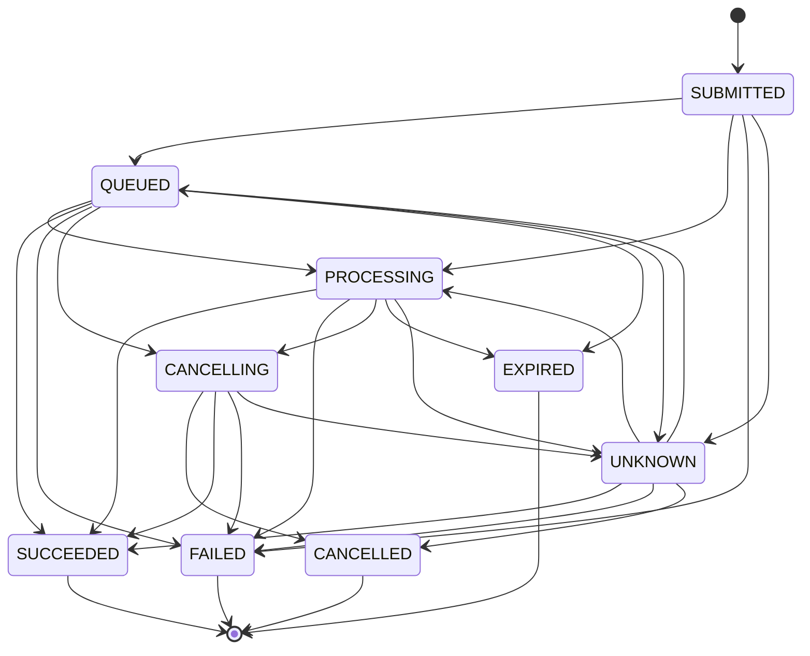

---

# Provider Monitoring Modes

Supported monitoring modes:

```yaml
provider_monitoring_modes:
  - CALLBACK
  - POLLING
  - HYBRID
```

---

# CALLBACK

The provider sends asynchronous status events.

Benefits:

* low polling cost;
* lower completion latency;
* reduced provider API traffic.

Callbacks must still be reconciled against provider status when necessary.

---

# POLLING

The platform periodically queries provider status.

Required when:

* callbacks are unavailable;
* callback delivery cannot be trusted;
* CI topology cannot expose a callback endpoint;
* provider semantics require polling.

---

# HYBRID

Callbacks provide primary notification, while polling acts as recovery and reconciliation.

Hybrid is the preferred production model when supported.

---

# Callback Security

Provider callbacks must be authenticated.

Supported verification mechanisms may include:

* signature verification;
* shared secret verification;
* mTLS;
* provider-issued token;
* source validation.

Unsigned callback payloads must not mutate authoritative state.

---

# Callback Event Model

```yaml
provider_callback:
  callback_id:
  provider:
  provider_task_id:
  provider_event_id:
  event_type:
  event_time:
  payload_hash:
  signature_verified:
  received_at:
```

Callback payloads must be persisted or referenced for audit.

---

# Callback Idempotency

Provider callbacks may be delivered more than once.

Deduplication key:

```text
provider
+ provider_event_id
```

When no event ID exists:

```text
provider
+ provider_task_id
+ normalized_state
+ payload_hash
```

Duplicate callbacks must be processed idempotently.

---

# Callback Ordering

Callbacks may arrive out of order.

Example:

```text
SUCCEEDED callback arrives
before
PROCESSING callback
```

The coordinator must reject state regression.

A later event with an earlier provider timestamp must not overwrite a terminal provider state.

---

# Polling Coordinator

Canonical polling item:

```yaml
provider_poll:
  provider_task_id:
  provider:
  polling_attempt:
  last_state:
  next_poll_at:
  timeout_at:
  priority:
```

Polling must use delayed Queue visibility.

---

# Adaptive Polling

Polling interval may adapt to:

* provider Task age;
* last known state;
* provider recommendations;
* rate-limit state;
* estimated duration;
* Build criticality.

Example:

```yaml
polling_schedule:
  initial_seconds: 10
  queued_seconds: 20
  processing_seconds: 30
  long_running_seconds: 60
  maximum_seconds: 120
```

---

# Poll Jitter

Small deterministic jitter may be used to prevent synchronized polling bursts.

The jitter must derive from stable provider Task identity.

Random non-reproducible jitter is prohibited in benchmark mode.

---

# Polling Timeout

A provider Task exceeds its monitoring timeout when:

```text
current_time > timeout_at
```

Timeout does not prove provider failure.

The coordinator must classify the Task as:

* still active but late;
* provider status unknown;
* expired;
* recovery required;
* manual review required.

---

# Provider Completion

Provider completion is accepted only when:

* provider Task identity matches;
* provider state maps to `SUCCEEDED`;
* output references are present or discoverable;
* result metadata is coherent;
* cancellation did not conclusively precede completion.

The Task then proceeds toward artifact retrieval.

---

# Provider Artifact Reference

```yaml
provider_artifact_reference:
  provider_task_id:
  artifact_role:
  media_type:
  provider_url:
  url_expires_at:
  expected_size:
  provider_checksum:
  metadata:
```

Provider URLs are temporary references, not trusted final artifacts.

---

# Signed URL Handling

Signed URLs must:

* be treated as secrets;
* be redacted from general logs;
* be persisted only in restricted encrypted storage or regenerated;
* include expiry tracking;
* never become permanent artifact identities.

If a URL expires before download, the coordinator must request a refreshed reference where supported.

---

# Artifact Retrieval Handoff

Canonical handoff:

```text
Provider SUCCEEDED
↓
Discover Output References
↓
Persist Restricted Artifact References
↓
Transition Task to DOWNLOADING
↓
Enqueue Download Task
```

Provider Monitor Workers must not perform large downloads unless the configured provider adapter explicitly combines operations and preserves isolation.

---

# Provider Output Provenance

Every retrieved artifact must preserve:

```yaml
provider_provenance:
  provider:
  provider_task_id:
  capability:
  model:
  model_version:
  request_hash:
  provider_payload_hash:
  idempotency_key:
  submitted_at:
  completed_at:
  retrieved_at:
  provider_metadata:
```

Provenance must remain attached through validation and composition.

---

# Provider Usage Model

```yaml
provider_usage:
  provider_task_id:
  units:
  unit_type:
  input_units:
  output_units:
  duration_seconds:
  resolution:
  model:
  reported_at:
```

Examples of unit types:

* generated seconds;
* images;
* characters;
* tokens;
* audio seconds;
* compute credits.

---

# Provider Cost Model

```yaml
provider_cost:
  provider_task_id:
  estimated_cost:
  actual_cost:
  currency:
  pricing_version:
  source:
  reconciled_at:
```

Actual cost should be captured from provider usage where available.

Estimated cost remains preserved for variance analysis.

---

# Cost Reconciliation

After provider completion or failure:

```text
Load Reserved Cost
↓
Load Actual Usage
↓
Calculate Actual Cost
↓
Release Unused Reservation
↓
Charge Actual Cost
↓
Persist Variance
```

Failed provider Tasks may still incur cost.

---

# Cost Variance

```text
cost_variance =
actual_cost
-
estimated_cost
```

Large variance may trigger:

* alert;
* budget hold;
* provider policy review;
* manual review for additional retries.

---

# Provider Quota Management

Quota dimensions may include:

* requests per minute;
* concurrent active jobs;
* daily credits;
* monthly credits;
* generated seconds;
* token allowance.

Canonical snapshot:

```yaml
provider_quota:
  provider:
  capability:
  limit:
  used:
  reserved:
  remaining:
  reset_at:
  observed_at:
```

---

# Capacity Reservation

The Scheduler reserves provider capacity before dispatch.

Provider Coordination confirms and consumes the reservation at submission.

Possible reservation states:

```yaml
provider_reservation_states:
  - RESERVED
  - CONSUMED
  - RELEASED
  - EXPIRED
```

Submission without a valid reservation is prohibited unless emergency policy explicitly permits it.

---

# Reservation Expiration

If provider submission does not begin before reservation expiry:

* release capacity;
* reject stale Dispatch Decision;
* return Task for rescheduling.

---

# Provider Health Model

Canonical states:

```yaml
provider_health_states:
  - HEALTHY
  - DEGRADED
  - RATE_LIMITED
  - UNAVAILABLE
  - AUTHENTICATION_FAILURE
  - UNKNOWN
```

Health is evaluated per capability where possible.

---

# Provider Health Inputs

Health may consider:

* successful request rate;
* latency;
* provider API health endpoint;
* rate-limit responses;
* authentication status;
* timeout rate;
* callback delay;
* output retrieval failures.

---

# Provider Circuit Breaker

A circuit breaker protects the platform from repeated provider failure.

States:

```yaml
circuit_breaker_states:
  - CLOSED
  - OPEN
  - HALF_OPEN
```

---

# Circuit Breaker Behavior

## CLOSED

Requests proceed normally.

## OPEN

New submissions are blocked.

Existing provider Tasks continue to be monitored where possible.

## HALF_OPEN

A limited number of test requests are allowed.

---

# Circuit Breaker Triggers

Example configuration:

```yaml
circuit_breaker:
  failure_threshold: 5
  observation_window_seconds: 300
  open_seconds: 120
  half_open_probe_count: 1
```

Authentication failures may open the circuit immediately.

---

# Provider Failure Classification

Provider failures normalize into:

```yaml
provider_failure_classes:
  - TRANSIENT_NETWORK
  - RATE_LIMIT
  - PROVIDER_OVERLOAD
  - AUTHENTICATION
  - AUTHORIZATION
  - INVALID_REQUEST
  - UNSUPPORTED_CAPABILITY
  - CONTENT_REJECTION
  - QUOTA_EXHAUSTED
  - PROCESSING_FAILED
  - ARTIFACT_UNAVAILABLE
  - ARTIFACT_CORRUPTED
  - TIMEOUT
  - UNKNOWN_STATE
  - PROVIDER_INTERNAL
```

---

# Retryability Matrix

| Failure Class          | Default Retryability                      |
| ---------------------- | ----------------------------------------- |
| TRANSIENT_NETWORK      | Retryable                                 |
| RATE_LIMIT             | Retryable after delay                     |
| PROVIDER_OVERLOAD      | Retryable                                 |
| AUTHENTICATION         | Not retryable until configuration changes |
| AUTHORIZATION          | Permanent or manual review                |
| INVALID_REQUEST        | Permanent                                 |
| UNSUPPORTED_CAPABILITY | Permanent                                 |
| CONTENT_REJECTION      | Manual review or permanent                |
| QUOTA_EXHAUSTED        | Blocked until quota changes               |
| PROCESSING_FAILED      | Policy-dependent                          |
| ARTIFACT_UNAVAILABLE   | Retry retrieval first                     |
| ARTIFACT_CORRUPTED     | Retry retrieval or generation             |
| TIMEOUT                | Reconcile before retry                    |
| UNKNOWN_STATE          | Manual reconciliation                     |
| PROVIDER_INTERNAL      | Retryable within policy                   |

The Failure Coordinator owns final retry decisions.

---

# Provider-Specific Retry Policy

A provider adapter may supply recommended retry hints.

The platform policy remains authoritative.

Provider instructions may influence:

* minimum delay;
* maximum retry rate;
* retry-after time;
* safe resubmission status.

They may not override internal attempt limits or budget policy.

---

# Provider Cancellation

Provider cancellation may be requested when:

* Build cancellation occurs;
* Task cancellation occurs;
* provider timeout exceeds policy;
* duplicate provider Task is detected;
* governance revokes authorization.

---

# Cancellation Contract

```python
class ProviderCancellationCoordinator:
    def cancel(
        self,
        provider_task_id: str,
        reason: str
    ) -> "ProviderCancellationDecision":
        ...
```

---

# Cancellation Outcomes

```yaml
provider_cancellation_outcomes:
  - CANCELLED
  - CANCELLATION_REQUESTED
  - NOT_CANCELLABLE
  - ALREADY_COMPLETED
  - ALREADY_FAILED
  - UNKNOWN
```

---

# Cancellation Race

Example:

```text
Platform requests cancellation
↓
Provider completes before cancellation applies
```

Required behavior:

* preserve both events;
* inspect provider timestamps;
* retrieve output only if policy permits;
* do not silently discard incurred cost;
* resolve Task outcome deterministically.

A Task may transition from `CANCELLING` to `SUCCEEDED` if completion conclusively preceded cancellation effect.

---

# Non-Cancellable Provider Tasks

If provider cancellation is unsupported:

* stop internal downstream processing where possible;
* continue monitoring until terminal provider state;
* record cost;
* quarantine output if Build remains cancelled;
* do not publish the artifact;
* preserve evidence.

---

# Provider Fallback Coordination

Fallback is permitted only when declared in the Execution Plan.

Canonical model:

```yaml
provider_fallback:
  primary_provider:
  fallback_provider:
  activation_failure_classes:
  approval_required:
  maximum_additional_cost:
  output_compatibility_requirements:
```

---

# Fallback Activation

```text
Primary Provider Failure
↓
Classify Failure
↓
Check Approved Fallback Policy
↓
Check Approval Requirement
↓
Create New Task Attempt or Branch
↓
Submit to Fallback Provider
```

The original Provider Task Record remains immutable.

---

# Fallback Compatibility

Before fallback execution, verify:

* output modality compatibility;
* required resolution;
* duration;
* codec;
* visual continuity constraints;
* seed or reference support;
* cost;
* licensing;
* provenance requirements.

A fallback provider is not acceptable merely because it produces the same file extension.

---

# Provider Substitution Governance

Substitution must record:

```yaml
provider_substitution:
  original_provider:
  replacement_provider:
  reason:
  policy_reference:
  approved_by:
  approved_at:
  expected_quality_effect:
  expected_cost_effect:
```

Silent substitution is prohibited.

---

# Provider Result Validation Boundary

Provider Coordination confirms transport-level completion.

It does not certify final output quality.

The following remain separate:

```text
Provider reports SUCCEEDED
≠
Artifact is technically valid
≠
Artifact meets cinematic quality
≠
Artifact is approved
```

Validation occurs after retrieval.

---

# Provider Metadata Trust

Provider metadata is untrusted until normalized and validated.

Examples:

* duration;
* file size;
* resolution;
* checksum;
* completion time;
* cost.

Independent validation should be used where possible.

---

# Provider Reconciliation

Reconciliation compares:

* internal Task State;
* Provider Task Record;
* provider-reported state;
* Queue state;
* idempotency record;
* artifact state;
* budget state.

---

# Reconciliation Cases

## Internal WAITING_EXTERNAL, Provider SUCCEEDED

Action:

* persist completion;
* route to Download Queue.

## Internal WAITING_EXTERNAL, Provider FAILED

Action:

* classify failure;
* invoke Failure Coordinator.

## Internal RUNNING, Provider Task already exists

Action:

* recover provider identity;
* transition to `WAITING_EXTERNAL`.

## Internal terminal success, Provider still processing

Action:

* orchestration defect;
* investigate duplicate or stale provider Task.

## Internal cancelled, Provider succeeded

Action:

* preserve cost and evidence;
* quarantine output;
* apply cancellation race policy.

---

# Provider Task Deduplication

Duplicate provider tasks may arise from:

* ambiguous submission retry;
* lost idempotency record;
* provider ignoring idempotency key;
* concurrent Workers;
* manual provider-side resubmission.

Detection signals:

```yaml
duplicate_detection:
  idempotency_key:
  request_hash:
  task_id:
  provider_metadata:
  submission_time_window:
```

---

# Duplicate Provider Task Resolution

```text
Detect Duplicate Provider Tasks
↓
Select Canonical Task
↓
Cancel Duplicates if Possible
↓
Preserve All Cost Records
↓
Record Incident
↓
Continue Only Canonical Output
```

Canonical selection must be deterministic.

---

# Provider Orphan Detection

A Provider Task is orphaned when no valid internal Task references it.

Sources:

* manual provider console submission;
* crashed workflow;
* deleted manifest;
* stale execution generation.

Orphan policy:

```yaml
provider_orphan_policy:
  detect:
  report:
  cancel_if_safe:
  never_auto_import_without_evidence:
```

---

# Provider Task Expiry

Some providers expire:

* task records;
* artifact URLs;
* generated artifacts;
* callbacks.

The Provider Coordinator must persist expiry information and retrieve artifacts before loss.

---

# Provider Retention Policy

```yaml
provider_retention:
  provider_task_record_days:
  raw_callback_days:
  restricted_url_reference_hours:
  usage_record_days:
  cost_record_days:
```

Internal provenance and cost evidence must outlive temporary provider records.

---

# Provider Event Model

Required events include:

```text
provider.selected
provider.request_built
provider.idempotency_reserved
provider.submission_started
provider.submission_accepted
provider.submission_rejected
provider.submission_ambiguous
provider.task_discovered
provider.status_changed
provider.callback_received
provider.poll_completed
provider.task_completed
provider.task_failed
provider.cancellation_requested
provider.task_cancelled
provider.artifact_discovered
provider.cost_reconciled
provider.fallback_activated
provider.circuit_opened
provider.circuit_closed
provider.reconciliation_completed
```

---

# Provider Metrics

Required metrics:

```yaml
provider_metrics:
  submission_attempts:
  submission_acceptance_rate:
  ambiguous_submission_count:
  provider_latency_seconds:
  provider_queue_time_seconds:
  provider_processing_time_seconds:
  callback_latency_seconds:
  polling_requests:
  polling_errors:
  completion_rate:
  failure_rate:
  cancellation_rate:
  duplicate_task_count:
  artifact_retrieval_failure_count:
  estimated_cost:
  actual_cost:
  cost_variance:
  quota_remaining:
  circuit_breaker_state:
```

Metrics must be labeled by:

* provider;
* capability;
* model;
* Build Profile;
* failure class.

---

# Provider Latency

```text
provider_total_latency =
provider_completed_at
-
submitted_at
```

Where provider timestamps are unreliable, internal observed timestamps must be retained separately.

---

# Provider Processing Latency

```text
provider_processing_latency =
provider_completed_at
-
provider_processing_started_at
```

This may be unavailable for some providers.

---

# Callback Latency

```text
callback_latency =
callback_received_at
-
provider_event_time
```

High callback latency may trigger additional polling.

---

# Provider Success Rate

```text
provider_success_rate =
successful_provider_tasks
/
terminal_provider_tasks
```

Cancelled Tasks should be reported separately.

---

# Provider Coordinator Interface

```python
class ProviderCoordinator:
    def prepare(
        self,
        task: "RuntimeTask",
        context: "ProviderContext"
    ) -> "PreparedProviderTask":
        ...

    def submit(
        self,
        prepared_task: "PreparedProviderTask"
    ) -> "ProviderSubmissionResult":
        ...

    def reconcile(
        self,
        task_id: str
    ) -> "ProviderReconciliationResult":
        ...

    def cancel(
        self,
        task_id: str,
        reason: str
    ) -> "ProviderCancellationResult":
        ...
```

---

# Provider Policy Resolver Interface

```python
class ProviderPolicyResolver:
    def resolve(
        self,
        requirement: "ProviderRequirement",
        context: "ProviderSelectionContext"
    ) -> "ProviderSelection":
        ...
```

---

# Provider Task Repository Interface

```python
class ProviderTaskRepository:
    def create(
        self,
        record: "ProviderTaskRecord"
    ) -> None:
        ...

    def by_internal_task(
        self,
        build_id: str,
        task_id: str,
        attempt_number: int
    ) -> "ProviderTaskRecord | None":
        ...

    def by_provider_task_id(
        self,
        provider: str,
        provider_task_id: str
    ) -> "ProviderTaskRecord | None":
        ...

    def update_state(
        self,
        record_id: str,
        expected_state: str,
        new_state: str,
        evidence: dict
    ) -> None:
        ...
```

---

# Idempotency Registry Interface

```python
class ProviderIdempotencyRegistry:
    def reserve(
        self,
        idempotency_key: str,
        request_hash: str,
        task_reference: "TaskReference"
    ) -> "IdempotencyReservation":
        ...

    def mark_accepted(
        self,
        idempotency_key: str,
        provider_task_id: str
    ) -> None:
        ...

    def mark_ambiguous(
        self,
        idempotency_key: str,
        evidence: dict
    ) -> None:
        ...

    def lookup(
        self,
        idempotency_key: str
    ) -> "ProviderIdempotencyRecord | None":
        ...
```

---

# Provider Status Monitor Interface

```python
class ProviderStatusMonitor:
    def poll(
        self,
        provider_task: "ProviderTaskRecord"
    ) -> "ProviderStatusResult":
        ...

    def handle_callback(
        self,
        callback: "ProviderCallback"
    ) -> "ProviderCallbackResult":
        ...

    def schedule_next_poll(
        self,
        provider_task: "ProviderTaskRecord"
    ) -> str:
        ...
```

---

# Cost Reconciler Interface

```python
class ProviderCostReconciler:
    def reconcile(
        self,
        provider_task: "ProviderTaskRecord",
        usage: "ProviderUsage"
    ) -> "ProviderCostResult":
        ...
```

---

# Reference Configuration

```yaml
orchestrator:
  providers:
    require_idempotency: true
    persist_request_hash: true
    persist_provider_payload_hash: true
    reconcile_ambiguous_submissions: true
    allow_silent_substitution: false
    validate_callback_signatures: true

    monitoring:
      mode: HYBRID
      initial_poll_seconds: 10
      queued_poll_seconds: 20
      processing_poll_seconds: 30
      maximum_poll_seconds: 120
      reconciliation_interval_seconds: 300

    timeouts:
      submission_seconds: 60
      provider_total_seconds: 3600
      artifact_discovery_seconds: 120

    circuit_breaker:
      enabled: true
      failure_threshold: 5
      observation_window_seconds: 300
      open_seconds: 120
      half_open_probe_count: 1

    cancellation:
      request_on_build_cancel: true
      monitor_non_cancellable_tasks: true
      quarantine_cancelled_outputs: true

    cost:
      reconcile_actual_usage: true
      block_retry_on_budget_exhaustion: true
      variance_alert_percentage: 20
```

---

# Provider Configuration Example

```yaml
providers:
  runway:
    adapter: runway_v1
    provider_type:
      - VIDEO_GENERATION

    capabilities:
      - image_to_video
      - text_to_video

    selection_priority: 100
    callback_support: true
    idempotency_support: provider_native
    cancellation_support: true

    limits:
      maximum_concurrent_submissions: 4
      maximum_active_tasks: 10

    policies:
      allowed_profiles:
        - preview
        - production
```

---

# Secret Management

Provider credentials must be referenced, never embedded.

```yaml
provider_credentials:
  provider: runway
  secret_reference: secrets://providers/runway/api-key
```

The Secret Resolver must return credentials only to authorized provider Workers.

---

# Secret Rotation

Credential rotation must not invalidate existing Provider Task Records.

New submissions use the current secret version.

Monitoring existing Tasks may use the new credential where provider policy permits.

Credential version may be recorded without storing the secret.

---

# Security Requirements

Provider Coordination must enforce:

* least-privilege secret access;
* callback authentication;
* payload redaction;
* signed URL protection;
* adapter allowlisting;
* provider-domain allowlisting;
* TLS;
* no arbitrary provider endpoint from Task input;
* request and response size limits;
* audit logging;
* prompt confidentiality classification;
* provider data-residency policy.

---

# Prompt and Input Privacy

Before provider submission, the coordinator must verify:

* provider is authorized to receive the input classification;
* restricted data is removed or approved;
* input retention policy is acceptable;
* provider training-use settings satisfy organizational requirements;
* region complies with policy.

A provider must not receive more context than required for the Task.

---

# Provider Data Classification

```yaml
provider_data_classification:
  - PUBLIC
  - INTERNAL
  - CONFIDENTIAL
  - RESTRICTED
```

Provider policy maps allowed classifications to providers and capabilities.

---

# Testing Requirements

## Unit Tests

* Provider Requirement validation;
* deterministic provider selection;
* capability matching;
* canonical request hashing;
* provider payload hashing;
* idempotency reservation;
* state normalization;
* callback deduplication;
* callback ordering;
* polling schedule;
* failure classification;
* cost calculation;
* fallback policy;
* cancellation outcome mapping;
* circuit-breaker transitions.

## Adapter Contract Tests

Every Provider Adapter must pass:

* capability declaration;
* valid request serialization;
* invalid request rejection;
* accepted submission;
* retryable rejection;
* permanent rejection;
* ambiguous submission;
* status polling;
* terminal-state normalization;
* artifact reference extraction;
* cancellation;
* usage extraction;
* secret redaction.

## Integration Tests

* Provider submission to asynchronous completion;
* callback-driven completion;
* polling-driven completion;
* hybrid monitoring;
* rate-limit handling;
* provider outage;
* ambiguous network timeout;
* process crash after provider acceptance;
* signed URL expiry;
* artifact retrieval handoff;
* Build cancellation during provider processing;
* cost reconciliation;
* approved fallback activation.

## Concurrency Tests

* two Workers submit the same Task;
* callback concurrent with poll;
* cancellation concurrent with completion;
* provider state regression;
* duplicate callback;
* duplicate provider Task detection;
* provider reservation expiry during submission;
* reconciliation concurrent with normal monitoring.

## Recovery Tests

* accepted provider Task missing internal provider ID;
* internal WAITING_EXTERNAL with no monitor Queue item;
* callback received while Orchestrator offline;
* provider complete but artifact not downloaded;
* expired signed URL;
* cancelled Build with active non-cancellable provider Task;
* orphan provider Task;
* lost idempotency state with recoverable metadata.

## Security Tests

* invalid callback signature;
* secret included in log payload;
* unauthorized provider endpoint;
* disallowed data classification;
* signed URL exposure;
* adapter injection attempt;
* provider substitution without approval;
* incompatible region.

---

# Provider Coordination Quality Gate

```yaml
provider_coordination_quality_gate:
  every_external_task_has_provider_requirement: true
  every_submission_has_idempotency_record: true
  every_request_has_canonical_hash: true
  every_accepted_submission_has_provider_task_id: true
  no_ambiguous_submission_blindly_retried: true
  every_provider_state_normalized: true
  callback_signatures_verified: true
  duplicate_callbacks_idempotent: true
  provider_state_regression_rejected: true
  provider_artifacts_retrieved_before_expiry: true
  actual_cost_reconciled: true
  cancellation_race_test_passed: true
  provider_fallback_requires_policy: true
  provider_secret_redaction_verified: true
  orphan_detection_test_passed: true
  crash_reconciliation_test_passed: true
```

---

# Architectural Invariants

## Invariant PC-301

Every provider request originates from one persisted Runtime Task.

## Invariant PC-302

Every external side effect has a persistent idempotency record created before transmission.

## Invariant PC-303

Provider-specific states are normalized but preserved as source evidence.

## Invariant PC-304

An ambiguous submission is reconciled before any resubmission is authorized.

## Invariant PC-305

Provider completion does not imply artifact validation or approval.

## Invariant PC-306

Provider Submission Workers release capacity after provider Task identity is persisted.

## Invariant PC-307

Provider callbacks are authenticated, idempotent, and protected against state regression.

## Invariant PC-308

Provider fallback and substitution occur only through approved policy.

## Invariant PC-309

Temporary provider URLs never become authoritative artifact identities.

## Invariant PC-310

Provider usage, cost, provenance, failure, and cancellation evidence remain auditable after the provider Task ends.

---

# Architectural Decision Records

| ADR     | Decision                                                                                                                |
| ------- | ----------------------------------------------------------------------------------------------------------------------- |
| ADR-891 | Every provider operation is coordinated through a persistent Provider Task Record.                                      |
| ADR-892 | Provider requests are built from a canonical provider-neutral request model.                                            |
| ADR-893 | Idempotency records are persisted before external request transmission.                                                 |
| ADR-894 | Ambiguous provider submissions require reconciliation before retry.                                                     |
| ADR-895 | Provider-native states are normalized into a canonical lifecycle without discarding source state.                       |
| ADR-896 | Provider monitoring uses callback, polling, or hybrid modes behind one coordination contract.                           |
| ADR-897 | Provider completion is separated from artifact retrieval, validation, and approval.                                     |
| ADR-898 | Provider fallback is permitted only when declared by the approved Execution Plan.                                       |
| ADR-899 | Provider cost and quota are reconciled as first-class runtime data.                                                     |
| ADR-900 | Provider secrets, callbacks, signed URLs, and submitted content remain within explicit security and privacy boundaries. |

---

# Acceptance Criteria

Section **6.3.10** is complete when:

* Provider, Capability, Provider Requirement, Provider Request, Provider Task Record, Provider Artifact Reference, Provider Usage, and Provider Cost models are formally defined.
* Provider selection is deterministic and constrained by the approved Execution Plan.
* Every provider integration implements the canonical adapter contract.
* Every request is validated, hashed, and protected by a persistent idempotency record before transmission.
* Accepted, rejected, rate-limited, authentication-failed, and ambiguous submissions have explicit behavior.
* Ambiguous submissions cannot be blindly retried.
* Provider-native states normalize into a canonical Provider State Machine.
* Callback, polling, and hybrid monitoring modes are defined.
* Callback authentication, deduplication, ordering, and state-regression prevention are enforced.
* Provider completion routes artifacts into controlled retrieval and validation rather than directly creating successful production outputs.
* Provider cancellation, cancellation races, non-cancellable Tasks, fallbacks, substitutions, duplicate Tasks, orphans, expiry, and reconciliation are modeled.
* Provider usage, quota, cost, variance, health, latency, circuit breakers, events, metrics, security, interfaces, configuration, tests, Quality Gates, invariants, and ADRs provide sufficient detail for Codex to implement reliable external-provider coordination without duplicate submissions, lost provider Tasks, uncontrolled costs, silent substitution, or untraceable outputs.


# Part 6.3.11 — Manifest Persistence & Runtime State

## Insynergy Cinematic Thought Leadership Platform

### Master Specification v2.1

---

# Purpose

This section defines the canonical **Manifest Persistence** and **Runtime State** architecture used by the Build Orchestration & Runtime Control Layer.

The Runtime Manifest is the authoritative persisted representation of an executing Build.

It records:

* Build identity;
* Execution Plan identity;
* Build lifecycle state;
* Task definitions and Task states;
* dependency and readiness status;
* Queue references;
* Worker leases;
* provider Tasks;
* retries;
* checkpoints;
* approvals;
* artifacts;
* resource reservations;
* budget reservations;
* failures;
* events;
* runtime metrics;
* recovery metadata.

Its primary objective is to ensure that the complete operational state of a Build survives:

* process restart;
* Worker loss;
* GitHub Actions runner termination;
* infrastructure failure;
* provider latency;
* partial Queue loss;
* manual pause;
* recovery;
* deployment migration.

The Runtime Manifest must make the Build explainable and reconstructable without relying on transient process memory.

---

# Governing Principle

The platform adopts the following principle.

> **Any runtime fact required for recovery, audit, coordination, or correctness must be persisted before it is treated as authoritative.**

The platform must never rely exclusively on:

* in-memory objects;
* process-local variables;
* active Worker memory;
* Queue contents;
* temporary files;
* provider dashboards;
* console logs;
* GitHub Actions job state.

If a runtime fact cannot be recovered from persisted state, it is not authoritative.

---

# Architectural Position

```text
Approved Execution Plan
        │
        ▼
Runtime Manifest Initialization
        │
        ▼
Orchestrator Runtime
        │
        ├── Build State
        ├── Task State
        ├── Queue State References
        ├── Worker Leases
        ├── Provider Tasks
        ├── Artifact State
        ├── Approval State
        ├── Failure State
        └── Checkpoint State
        │
        ▼
Manifest Repository
        │
        ├── Current Snapshot
        ├── Version History
        ├── Append-Only State History
        ├── Event Outbox
        └── Recovery Index
```

The Manifest Repository is a core infrastructure dependency of the Orchestrator.

---

# Responsibilities

The Manifest Persistence subsystem is responsible for:

* initializing Runtime Manifests;
* persisting Build State;
* persisting Task State;
* preserving immutable Task Definitions;
* recording state transitions;
* recording Queue references;
* recording Worker leases;
* recording provider Task identity;
* recording artifact references;
* recording approvals;
* recording resource and budget reservations;
* recording retries and failures;
* maintaining manifest version history;
* supporting compare-and-set updates;
* supporting atomic or recoverable state transitions;
* generating immutable snapshots;
* supporting checkpoint and resume;
* detecting state divergence;
* supporting runtime reconciliation;
* exposing read models;
* enforcing schema compatibility;
* preserving audit history;
* controlling retention and archival.

It is not responsible for:

* defining the Execution Plan;
* evaluating Task readiness;
* scheduling Tasks;
* executing Worker operations;
* approving editorial content;
* replacing the Event Store;
* storing large binary artifacts.

---

# Runtime State Definition

Runtime State is the complete operational condition of one Build at a specific logical point in time.

Canonical runtime state includes:

```yaml
runtime_state:
  build:
  execution_plan:
  runtime_graph:
  tasks:
  dependencies:
  queues:
  workers:
  providers:
  artifacts:
  approvals:
  checkpoints:
  retries:
  failures:
  resources:
  budgets:
  governance:
  metrics:
  events:
```

The Runtime Manifest is the persisted representation of this state.

---

# Runtime Manifest

The Runtime Manifest is a versioned document representing the current authoritative state of one Build.

Canonical top-level schema:

```yaml
runtime_manifest:
  schema_version:
  manifest_version:
  manifest_id:
  build_id:
  execution_generation:
  execution_plan:
  build:
  runtime_graph:
  tasks:
  provider_tasks:
  artifacts:
  approvals:
  checkpoints:
  reservations:
  failures:
  orchestration:
  state_history:
  integrity:
  created_at:
  updated_at:
```

---

# Manifest Identity

Each Runtime Manifest has:

```yaml
manifest_identity:
  manifest_id:
  build_id:
  execution_generation:
  schema_version:
  manifest_version:
```

## Manifest ID

Stable identifier for the Build execution generation.

Recommended form:

```text
manifest_id =
build_id
+
execution_generation
```

## Manifest Version

Monotonically increasing version number.

Example:

```text
1
2
3
4
```

Every authoritative mutation increments the Manifest Version.

---

# Build Identity

The Manifest must preserve:

```yaml
build_identity:
  build_id:
  content_id:
  project_id:
  execution_generation:
  build_profile:
  execution_mode:
  pipeline_version:
  configuration_version:
```

These values define the runtime identity boundary.

---

# Execution Plan Reference

The Manifest must reference, but not redefine, the immutable Execution Plan.

```yaml
execution_plan_reference:
  execution_plan_id:
  execution_plan_hash:
  execution_plan_schema_version:
  approved_at:
  approval_reference:
  storage_reference:
```

The Manifest must verify the Execution Plan hash during initialization and resume.

---

# Manifest Separation of Concerns

The Manifest contains both immutable and mutable regions.

```text
Runtime Manifest
├── Immutable Runtime Definition
│   ├── Build identity
│   ├── Execution Plan reference
│   ├── Task Definitions
│   ├── Runtime Graph structure
│   └── Initial policy references
│
└── Mutable Runtime State
    ├── Build State
    ├── Task States
    ├── Attempts
    ├── Queue references
    ├── Leases
    ├── Provider states
    ├── Failures
    ├── Artifacts
    └── Checkpoints
```

Mutable state must never rewrite immutable definitions.

---

# Immutable Runtime Definition

The immutable region includes:

```yaml
immutable_runtime_definition:
  execution_plan_hash:
  runtime_graph_hash:
  task_definitions:
  dependency_definitions:
  expected_outputs:
  provider_requirements:
  quality_requirements:
  retry_policies:
  idempotency_policies:
```

Any material change requires:

* a new Execution Plan;
* a new execution generation;
* or an explicitly versioned amendment process.

---

# Mutable Runtime State

The mutable region includes:

```yaml
mutable_runtime_state:
  build_state:
  task_states:
  task_attempts:
  blocking_reasons:
  queue_references:
  active_leases:
  provider_task_states:
  artifact_states:
  approval_states:
  retry_schedules:
  failure_records:
  reservations:
  checkpoint_references:
```

Every mutation must be versioned.

---

# Canonical Manifest Structure

```yaml
runtime_manifest:
  schema_version: "2.0"
  manifest_id: "build-001:generation-1"
  manifest_version: 42

  build_id: "build-001"
  execution_generation: 1

  execution_plan:
    execution_plan_id: "plan-001"
    execution_plan_hash: "sha256:..."
    storage_reference: "cas://..."

  build:
    state: RUNNING
    state_entered_at: "2026-07-20T12:00:00Z"
    profile: production
    mode: full
    deadline: null

  runtime_graph:
    graph_hash: "sha256:..."
    task_ids: []
    edge_count: 0

  tasks: {}

  provider_tasks: {}

  artifacts: {}

  approvals: {}

  checkpoints: {}

  reservations:
    resources: {}
    budgets: {}

  failures: []

  orchestration:
    active_scheduler_snapshot:
    active_backpressure_state:
    active_build_lock:
    last_reconciliation_at:

  state_history: []

  integrity:
    manifest_hash:
    previous_manifest_hash:
    signature:

  created_at:
  updated_at:
```

---

# Manifest Store

The Manifest Store is the authoritative persistence service.

Required capabilities:

```yaml
manifest_store_capabilities:
  - create
  - load_current
  - load_version
  - compare_and_set
  - append_history
  - create_snapshot
  - list_versions
  - verify_integrity
  - archive
  - recover
```

---

# Manifest Repository Interface

```python
class ManifestRepository:
    def create(
        self,
        manifest: "RuntimeManifest"
    ) -> "ManifestWriteResult":
        ...

    def load_current(
        self,
        build_id: str,
        execution_generation: int
    ) -> "RuntimeManifest":
        ...

    def load_version(
        self,
        build_id: str,
        execution_generation: int,
        manifest_version: int
    ) -> "RuntimeManifest":
        ...

    def compare_and_set(
        self,
        build_id: str,
        execution_generation: int,
        expected_version: int,
        updated_manifest: "RuntimeManifest"
    ) -> "ManifestWriteResult":
        ...

    def list_versions(
        self,
        build_id: str,
        execution_generation: int
    ) -> list[int]:
        ...
```

---

# Persistence Model

The preferred persistence model is:

```text
Immutable Versioned Snapshots
+
Current-Version Pointer
+
Append-Only Transition History
+
Outbox Events
```

This allows:

* current-state reads;
* historical inspection;
* crash recovery;
* audit;
* integrity verification;
* deterministic replay of selected events.

---

# Current Manifest Pointer

The Manifest Store must maintain an atomic reference to the current version.

```yaml
manifest_pointer:
  build_id:
  execution_generation:
  current_version:
  current_hash:
  updated_at:
```

The pointer must never reference a partially written Manifest.

---

# Versioned Manifest Storage

Recommended layout:

```text
manifests/
└── <build_id>/
    └── generation-<n>/
        ├── current.json
        ├── pointer.json
        ├── versions/
        │   ├── 00000001.json
        │   ├── 00000002.json
        │   └── 00000003.json
        ├── history/
        ├── outbox/
        └── checkpoints/
```

`current.json` may be a copy or a resolved pointer.

---

# Manifest Versioning

Every successful state mutation increments `manifest_version`.

Example:

```text
Version 41
↓
Task transitions RUNNING → WAITING_EXTERNAL
↓
Version 42
```

Version increments must be sequential within one execution generation.

Gaps may indicate incomplete persistence or repair operations and must be investigated.

---

# Compare-and-Set Semantics

All concurrent Manifest mutations must use compare-and-set semantics.

Canonical flow:

```text
Load Manifest Version 42
↓
Apply Mutation
↓
Write Expected Version = 42
↓
If Current Version Still 42
    Write Version 43
Else
    Reject Conflict
```

---

# Manifest Concurrency Conflict

Canonical error:

```yaml
manifest_conflict:
  code: MANIFEST_VERSION_CONFLICT
  build_id:
  expected_version:
  actual_version:
  attempted_operation:
  actor:
  occurred_at:
```

The caller must reload and reevaluate.

Blind overwrite is prohibited.

---

# Manifest Mutation Command

Every mutation must be represented as a command.

```yaml
manifest_mutation:
  mutation_id:
  build_id:
  execution_generation:
  expected_manifest_version:
  mutation_type:
  actor:
  reason:
  payload:
  occurred_at:
```

Examples:

```text
BUILD_STATE_TRANSITION
TASK_STATE_TRANSITION
PROVIDER_TASK_REGISTERED
ARTIFACT_REGISTERED
LEASE_CREATED
LEASE_RELEASED
APPROVAL_RECORDED
CHECKPOINT_CREATED
FAILURE_RECORDED
```

---

# Mutation Determinism

Given the same:

* starting Manifest version;
* mutation command;
* configuration;
* clock value;

the resulting Manifest must be identical.

Mutation handlers must not access uncontrolled external state during application.

External evidence must be included in the command payload.

---

# Manifest Mutation Service

```python
class ManifestMutationService:
    def apply(
        self,
        manifest: "RuntimeManifest",
        mutation: "ManifestMutation"
    ) -> "RuntimeManifest":
        ...
```

Mutation handlers must:

* validate source state;
* validate immutable identities;
* validate command authority;
* apply one logical change;
* append history;
* update integrity metadata;
* increment version.

---

# Atomic State Transition

A runtime transition may involve several related records.

Example:

```text
Provider request accepted
```

Required logical changes:

* register provider Task ID;
* update idempotency record;
* transition Task to `WAITING_EXTERNAL`;
* create Provider Monitor Queue outbox item;
* append state history;
* stage event.

These must form one recoverable transaction boundary.

---

# Transaction Boundary

Preferred transaction:

```text
Manifest Mutation
+
State History Append
+
Outbox Event Append
+
Queue Intent Registration
```

If the storage system supports atomic transactions, all operations should commit together.

If not, the platform must implement deterministic reconciliation.

---

# Outbox Model

Canonical outbox entry:

```yaml
outbox_entry:
  outbox_id:
  build_id:
  manifest_version:
  event_type:
  payload_reference:
  destination:
  state:
  created_at:
  delivered_at:
  delivery_attempts:
```

Outbox states:

```yaml
outbox_states:
  - PENDING
  - DELIVERING
  - DELIVERED
  - FAILED
```

---

# Outbox Guarantees

The Outbox ensures that a persisted state transition is eventually reflected in:

* Event Store;
* Queue;
* metrics pipeline;
* notifications;
* audit system.

The runtime state remains authoritative even if downstream delivery is delayed.

---

# Event Store Relationship

The Manifest and Event Store are complementary.

| Runtime Manifest            | Event Store                      |
| --------------------------- | -------------------------------- |
| Current authoritative state | Append-only event history        |
| Optimized for state loading | Optimized for timeline and audit |
| Contains latest values      | Contains all emitted events      |
| Versioned snapshots         | Ordered event sequence           |

The Event Store must not be the only source required to reconstruct current state in the normal path.

---

# Event Sequence

Every Build event should receive a monotonically increasing sequence.

```yaml
event_sequence:
  build_id:
  sequence:
  manifest_version:
  event_type:
  occurred_at:
```

Event sequence and Manifest Version may differ when one Manifest mutation produces several events.

---

# State History

The Manifest must preserve append-only state histories for:

* Build State;
* Task State;
* Provider State;
* approvals;
* failures;
* leases;
* reservations.

Example:

```yaml
task_state_history:
  - sequence: 11
    previous_state: RUNNABLE
    new_state: QUEUED
    reason: SCHEDULER_DISPATCH
    actor: scheduler
    occurred_at:
    manifest_version: 18
```

Historical entries must not be modified.

---

# Build State Persistence

Canonical Build State record:

```yaml
build_runtime_state:
  state:
  state_entered_at:
  previous_state:
  transition_id:
  reason:
  actor:
  evidence:
```

Only one Build State may be current.

---

# Task State Persistence

Canonical Task entry:

```yaml
task_runtime_state:
  task_id:
  task_definition_hash:
  state:
  attempt_number:
  execution_generation:
  blocking_reasons:
  queue_reference:
  lease_reference:
  provider_task_reference:
  inputs:
  outputs:
  result:
  failure:
  state_history:
```

---

# Task Definition Storage

Task Definitions may be stored:

1. inline in the Manifest;
2. in immutable CAS with references;
3. in a dedicated Task Definition repository.

Recommended hybrid approach:

```yaml
task_definition_reference:
  task_id:
  task_definition_hash:
  storage_reference:
  summary:
```

Large immutable definitions should not be duplicated in every Manifest version.

---

# Runtime Graph Persistence

The Manifest must preserve the Runtime Graph identity.

```yaml
runtime_graph:
  graph_id:
  graph_hash:
  node_count:
  edge_count:
  task_definition_references:
  dependency_references:
  storage_reference:
```

Graph structure is immutable within one execution generation.

---

# Queue Reference Persistence

The Manifest stores Queue references, not Queue transport truth.

```yaml
queue_reference:
  queue_class:
  queue_item_id:
  queue_state:
  enqueued_at:
  visible_at:
  last_reconciled_at:
```

This reference supports reconstruction and audit.

---

# Lease Persistence

Canonical Worker lease record:

```yaml
worker_lease:
  lease_id:
  task_id:
  queue_item_id:
  worker_id:
  issued_at:
  expires_at:
  renewed_at:
  state:
```

Lease states:

```yaml
lease_states:
  - ACTIVE
  - RELEASED
  - EXPIRED
  - REVOKED
  - RECONCILIATION_REQUIRED
```

---

# Provider Task Persistence

Provider Task data must include:

```yaml
provider_task_reference:
  provider_task_record_id:
  task_id:
  provider:
  provider_task_id:
  canonical_state:
  provider_state:
  idempotency_key:
  request_hash:
  submitted_at:
  last_checked_at:
  next_check_at:
  artifacts:
  cost:
```

Provider identity must be persisted immediately after acceptance.

---

# Artifact State Persistence

The Manifest records artifact references and lifecycle state.

```yaml
artifact_runtime_state:
  artifact_id:
  object_hash:
  role:
  source_task_id:
  lifecycle_state:
  validation_state:
  approval_state:
  storage_reference:
  provenance_reference:
  created_at:
```

Large artifacts remain in CAS or artifact storage.

---

# Artifact Lifecycle States

```yaml
artifact_lifecycle_states:
  - EXPECTED
  - CREATED
  - DOWNLOADED
  - VALIDATING
  - VALIDATED
  - APPROVED
  - REJECTED
  - QUARANTINED
  - SUPERSEDED
```

The Manifest must distinguish existence from validity and approval.

---

# Approval Persistence

Canonical approval record:

```yaml
approval_record:
  approval_id:
  approval_type:
  subject_type:
  subject_id:
  subject_hash:
  scope:
  status:
  authority:
  granted_at:
  expires_at:
  revoked_at:
  evidence_reference:
```

Approval states:

```yaml
approval_states:
  - REQUESTED
  - GRANTED
  - REJECTED
  - EXPIRED
  - REVOKED
```

---

# Reservation Persistence

Runtime reservations include:

* budget;
* provider capacity;
* Worker Pool capacity;
* storage;
* network;
* memory;
* CPU.

Canonical record:

```yaml
runtime_reservation:
  reservation_id:
  reservation_type:
  task_id:
  amount:
  unit:
  state:
  created_at:
  expires_at:
  consumed_at:
  released_at:
```

---

# Reservation States

```yaml
reservation_states:
  - RESERVED
  - CONSUMED
  - RELEASED
  - EXPIRED
  - FAILED
```

Expired reservations must not authorize dispatch.

---

# Retry Persistence

Canonical retry record:

```yaml
retry_record:
  task_id:
  attempt_number:
  previous_failure_id:
  retry_policy_id:
  retry_state:
  retry_at:
  delay_seconds:
  idempotency_generation:
  budget_authorized:
  created_at:
```

The retry schedule must survive process restart.

---

# Failure Persistence

Every failure must be persisted before it influences control flow.

```yaml
failure_record:
  failure_id:
  build_id:
  task_id:
  failure_class:
  source_component:
  message:
  evidence:
  retryable:
  recoverable:
  affects_build:
  occurred_at:
  resolved_at:
  resolution:
```

Failure history must remain immutable.

---

# Failure Resolution

A resolved failure is not deleted.

It is updated through an appended resolution record.

```yaml
failure_resolution:
  failure_id:
  resolution_type:
  resolved_by:
  resolved_at:
  evidence:
```

---

# Runtime Metrics Snapshot

The Manifest may store selected operational metrics needed for recovery or reporting.

```yaml
runtime_metrics_snapshot:
  active_tasks:
  queued_tasks:
  blocked_tasks:
  provider_tasks_active:
  estimated_cost:
  actual_cost:
  last_updated_at:
```

High-volume time-series metrics should remain in the observability system rather than every Manifest version.

---

# Current State vs Derived State

Some values are persisted directly.

Others may be derived.

## Persisted Authoritative State

* Build State;
* Task State;
* provider Task ID;
* approval record;
* artifact hash;
* retry schedule;
* failure record;
* lease identity.

## Derived State

* active Task count;
* phase completion percentage;
* critical-path estimate;
* queue backlog summary;
* cost forecast.

Derived values must be recalculable.

---

# Derived State Cache

Derived values may be cached in the Manifest for fast reads.

```yaml
derived_state:
  value:
  derived_from_manifest_version:
  calculated_at:
```

A derived value becomes stale when its source Manifest Version changes.

---

# Manifest Initialization

The Manifest is initialized after successful Preflight.

Canonical flow:

```text
Preflight Passed
↓
Validate Execution Plan Identity
↓
Materialize Runtime Graph
↓
Register Task Definitions
↓
Create Initial Task States
↓
Create Build State
↓
Persist Manifest Version 1
↓
Create Build Lock
↓
Emit Manifest Initialized Event
```

---

# Initial Task State

Each Task begins as:

* `DECLARED`;
* `SKIPPED` when plan-authorized;
* or `FAILED_PERMANENT` only when immutable runtime materialization detects a fatal defect.

Runtime readiness evaluation follows initialization.

---

# Manifest Initialization Idempotency

Repeated initialization requests must:

* return the existing compatible Manifest;
* reject an incompatible existing Manifest;
* never create duplicate execution generations;
* never overwrite runtime history.

---

# Runtime State Mutation Categories

Mutations are classified as:

```yaml
mutation_categories:
  - BUILD
  - TASK
  - PROVIDER
  - ARTIFACT
  - APPROVAL
  - LEASE
  - QUEUE
  - RETRY
  - FAILURE
  - RESERVATION
  - CHECKPOINT
  - GOVERNANCE
  - ORCHESTRATION
```

This supports authorization and audit policies.

---

# Mutation Authorization

Each mutation category has authorized actors.

Example:

| Mutation Category | Authorized Actor       |
| ----------------- | ---------------------- |
| BUILD             | Build State Controller |
| TASK              | Task State Controller  |
| PROVIDER          | Provider Coordinator   |
| ARTIFACT          | Artifact Registry      |
| APPROVAL          | Approval Manager       |
| LEASE             | Worker Pool Manager    |
| QUEUE             | Queue Coordinator      |
| RETRY             | Retry Policy Engine    |
| FAILURE           | Failure Coordinator    |
| CHECKPOINT        | Checkpoint Manager     |

Direct general-purpose Manifest writes are prohibited.

---

# Manifest Locking

The Build Lock prevents simultaneous active orchestration ownership.

Canonical lock:

```yaml
build_lock:
  lock_id:
  build_id:
  execution_generation:
  owner_id:
  acquired_at:
  expires_at:
  heartbeat_at:
  state:
```

---

# Build Lock States

```yaml
build_lock_states:
  - ACQUIRED
  - RENEWED
  - RELEASED
  - EXPIRED
  - REVOKED
```

Only one active orchestration owner may hold the Build Lock.

---

# Build Lock vs Task Lease

These are separate:

| Build Lock                       | Task Lease                          |
| -------------------------------- | ----------------------------------- |
| Controls orchestration ownership | Controls Worker execution ownership |
| One per active Build runtime     | One per active Task Attempt         |
| Held by Orchestrator             | Held by Worker                      |
| Longer-lived                     | Short-lived                         |

---

# Lock Renewal

The Orchestrator must renew the Build Lock periodically.

If renewal fails:

* stop new dispatch;
* enter safe draining mode;
* persist current state where possible;
* avoid further mutations;
* trigger reconciliation.

---

# Lock Expiration

A new Orchestrator may take ownership only after:

* prior lock expiry;
* ownership validation;
* runtime state reconciliation;
* active Worker lease inspection;
* provider Task inspection.

Lock expiry alone does not prove that no work is still active.

---

# Manifest Integrity

Every Manifest version must include integrity metadata.

```yaml
integrity:
  manifest_hash:
  previous_manifest_hash:
  content_hash_algorithm: sha256
  signature:
  signed_by:
```

---

# Manifest Hash

The Manifest hash must be computed over a canonical serialization excluding:

* `manifest_hash`;
* mutable transport metadata;
* non-semantic whitespace;
* unordered map variation.

---

# Hash Chain

Each Manifest version references the previous Manifest hash.

```text
Version 41 Hash
        ↓
Version 42 previous_manifest_hash
```

This creates a tamper-evident history.

---

# Manifest Signature

Production profiles may sign Manifest versions.

Purpose:

* detect unauthorized mutation;
* protect audit integrity;
* verify cross-system transfer;
* support compliance evidence.

Signing keys must not be stored inside the Manifest.

---

# Canonical Serialization

Manifest hashing requires deterministic serialization.

Requirements:

* UTF-8;
* normalized line endings;
* sorted object keys;
* stable numeric representation;
* ISO 8601 UTC timestamps;
* no insignificant whitespace;
* explicit null handling.

---

# Manifest Schema Versioning

The Manifest Schema has an independent version.

```yaml
schema_version: "2.0"
```

Schema changes must be classified as:

```yaml
schema_change_types:
  - BACKWARD_COMPATIBLE
  - MIGRATION_REQUIRED
  - INCOMPATIBLE
```

---

# Schema Compatibility

The runtime must verify:

* supported major version;
* supported minimum minor version;
* required fields;
* enum compatibility;
* migration availability.

Unknown critical fields or states must fail closed.

---

# Manifest Migration

Migration creates a new Manifest version or migrated copy.

Canonical flow:

```text
Load Old Manifest
↓
Verify Integrity
↓
Apply Versioned Migration
↓
Validate New Schema
↓
Persist Migration Record
↓
Continue Runtime
```

---

# Migration Record

```yaml
manifest_migration:
  migration_id:
  from_schema_version:
  to_schema_version:
  source_manifest_hash:
  target_manifest_hash:
  migration_tool_version:
  migrated_at:
```

Original Manifest versions remain preserved.

---

# Runtime Compatibility

Resume may fail when:

* Task Type is no longer supported;
* provider adapter version is incompatible;
* state enum is unknown;
* artifact schema changed;
* migration cannot preserve semantics.

The Build must enter `MANUAL_REVIEW` or `FAILED` rather than guessing.

---

# Snapshot Model

A Manifest Snapshot is an immutable copy of authoritative state at a known version.

```yaml
manifest_snapshot:
  snapshot_id:
  build_id:
  execution_generation:
  manifest_version:
  manifest_hash:
  created_at:
  reason:
  storage_reference:
```

---

# Snapshot Reasons

```yaml
snapshot_reasons:
  - INITIALIZED
  - CHECKPOINT
  - PAUSED
  - PRE_RESUME
  - PRE_CANCELLATION
  - COMPLETED
  - FAILED
  - MANUAL_REVIEW
  - MIGRATION
```

---

# Snapshot Frequency

Snapshots may be created:

* every Manifest version;
* every N versions;
* at lifecycle boundaries;
* before risky operations;
* at checkpoint creation.

The active persistence backend determines the practical strategy.

---

# Checkpoint Relationship

A Checkpoint references a Manifest Snapshot plus required runtime recovery metadata.

```text
Checkpoint
=
Manifest Snapshot
+
External State References
+
Recovery Instructions
```

Checkpoint behavior is defined in Section 6.3.12.

---

# Runtime State Read Models

The platform should expose optimized read models.

Examples:

```yaml
read_models:
  build_status:
  task_summary:
  active_provider_tasks:
  blocking_reasons:
  approval_status:
  cost_status:
  recovery_status:
```

Read models are derived and disposable.

---

# Build Status Read Model

```yaml
build_status:
  build_id:
  state:
  phase:
  completed_tasks:
  total_tasks:
  failed_tasks:
  blocked_tasks:
  active_provider_tasks:
  estimated_completion:
  current_cost:
  last_updated_at:
```

The read model must identify its source Manifest Version.

---

# Read Model Consistency

Read models may be eventually consistent.

They must never be used to authorize state mutation unless the authoritative Manifest is reloaded.

---

# Runtime State Query Interface

```python
class RuntimeStateQueryService:
    def build_status(
        self,
        build_id: str
    ) -> "BuildStatusReadModel":
        ...

    def task_status(
        self,
        build_id: str,
        task_id: str
    ) -> "TaskStatusReadModel":
        ...

    def recovery_status(
        self,
        build_id: str
    ) -> "RecoveryStatusReadModel":
        ...
```

---

# Runtime State Write Interface

No unrestricted `save_manifest()` interface should be exposed to domain components.

Components must use typed commands.

Example:

```python
class RuntimeStateCommandBus:
    def execute(
        self,
        command: "RuntimeStateCommand"
    ) -> "RuntimeStateCommandResult":
        ...
```

---

# Typed Runtime Commands

Examples:

```text
TransitionBuildState
TransitionTaskState
RegisterProviderTask
RegisterArtifact
CreateWorkerLease
ReleaseWorkerLease
RecordApproval
ScheduleRetry
RecordFailure
CreateCheckpoint
```

Typed commands enforce ownership and validation.

---

# Partial Manifest Loading

Large Builds may require partial loading.

Supported projections:

```yaml
manifest_projections:
  - BUILD_ONLY
  - TASK_SUMMARY
  - TASK_BY_ID
  - PROVIDER_TASKS
  - ACTIVE_LEASES
  - APPROVALS
  - FAILURES
  - RECOVERY_STATE
```

Partial loading must preserve version consistency.

---

# Manifest Partitioning

For large distributed Builds, Runtime State may be physically partitioned.

Recommended logical partitions:

```text
Build Root Manifest
├── Task State Partitions
├── Provider Task Partition
├── Artifact Partition
├── Approval Partition
├── Failure Partition
└── Checkpoint Partition
```

The Root Manifest preserves partition hashes and versions.

---

# Partition Consistency

A partitioned Manifest must expose one logical root version.

```yaml
manifest_partition_reference:
  partition_id:
  partition_version:
  partition_hash:
  storage_reference:
```

The root version must not reference partially committed partitions.

---

# Small-Build Strategy

For local and initial production deployments, a single Manifest document is preferred for simplicity.

Partitioning is introduced only when:

* Task count is large;
* write contention is measurable;
* Manifest size exceeds backend limits;
* partial loading materially improves performance.

---

# Manifest Size Policy

The Manifest must not contain:

* raw binary media;
* large prompt bodies when immutable CAS references suffice;
* full provider callback payloads;
* verbose process logs;
* full metrics time series.

These belong in referenced stores.

---

# Persistence Backends

Supported backend profiles may include:

```yaml
manifest_backends:
  - FILESYSTEM
  - SQLITE
  - POSTGRESQL
  - OBJECT_STORAGE_WITH_LOCK_SERVICE
  - DOCUMENT_DATABASE
```

Each backend must implement the same domain contract.

---

# Filesystem Backend

Suitable for:

* local development;
* single-runner environments;
* simple recovery tests.

Requirements:

* atomic file replacement;
* file locking;
* fsync or equivalent durability;
* versioned copies;
* crash-safe pointer update.

---

# SQLite Backend

Suitable for:

* local production;
* GitHub Actions with persisted database artifact;
* single-node orchestration.

Requirements:

* transactional updates;
* WAL mode where appropriate;
* compare-and-set;
* schema migrations;
* lock timeout handling.

---

# PostgreSQL Backend

Suitable for:

* distributed orchestration;
* concurrent Workers;
* high-volume runtime.

Requirements:

* transaction isolation;
* row-version compare-and-set;
* partition support;
* outbox table;
* advisory or explicit Build Lock;
* indexed Task State queries.

---

# Object Storage Backend

Suitable for immutable snapshots.

Requires an additional coordination mechanism for:

* current pointer;
* Build Lock;
* compare-and-set;
* outbox;
* lease coordination.

Object Storage alone is insufficient for distributed mutation coordination.

---

# Persistence Durability Levels

```yaml
durability_levels:
  - DEVELOPMENT
  - STANDARD
  - HIGH
```

## DEVELOPMENT

Allows reduced fsync and in-memory caching.

## STANDARD

Requires durable commit before acknowledging state.

## HIGH

Requires replicated durable storage and integrity verification.

---

# Write-Ahead Behavior

Before irreversible side effects, the platform must persist intent.

Examples:

```text
Before Provider Submission
→ Persist idempotency and submission intent
```

```text
Before Worker Execution
→ Persist lease and dispatch state
```

```text
Before Cancellation
→ Persist cancellation intent
```

This is the runtime equivalent of write-ahead control.

---

# Persistence Ordering Rules

## Provider Submission

```text
Persist Idempotency Intent
→ Submit Provider Request
→ Persist Provider Task ID
```

## Queue Acknowledgement

```text
Persist Task Outcome
→ Acknowledge Queue
```

## Artifact Registration

```text
Persist Artifact in CAS
→ Register Artifact Reference
→ Mark Task Success
```

## Completion

```text
Persist Final Outputs
→ Persist Quality Gate Results
→ Persist Final Manifest
→ Transition Build to COMPLETED
```

---

# Crash Consistency

The Manifest architecture must define recoverable outcomes for crashes between every persistence boundary.

Example:

```text
Task output exists
but
Task State still RUNNING
```

Reconciliation must inspect the output and determine whether to:

* finalize success;
* quarantine output;
* rerun;
* request manual review.

---

# Manifest Reconciliation

Reconciliation compares the Manifest with external runtime evidence.

Sources include:

* Queue backend;
* Worker registry;
* provider APIs;
* CAS;
* approval store;
* budget store;
* resource reservations;
* Event Store.

---

# Reconciliation Result

```yaml
manifest_reconciliation:
  reconciliation_id:
  build_id:
  source_manifest_version:
  detected_inconsistencies:
  applied_corrections:
  manual_review_items:
  resulting_manifest_version:
  completed_at:
```

Corrections create new Manifest versions.

History is never rewritten.

---

# Inconsistency Classes

```yaml
manifest_inconsistencies:
  - QUEUE_ITEM_MISSING
  - STALE_QUEUE_ITEM
  - LEASE_OWNER_MISSING
  - PROVIDER_TASK_UNREGISTERED
  - PROVIDER_STATE_DIVERGENCE
  - ARTIFACT_REFERENCE_MISSING
  - ARTIFACT_HASH_MISMATCH
  - APPROVAL_STATE_DIVERGENCE
  - RESERVATION_EXPIRED
  - OUTBOX_UNDELIVERED
  - EVENT_SEQUENCE_GAP
  - MANIFEST_HASH_MISMATCH
```

---

# Reconciliation Policy

Each inconsistency class must map to:

```yaml
reconciliation_actions:
  - AUTO_REPAIR
  - REBUILD_DERIVED_STATE
  - REQUEUE
  - RELEASE_STALE_RESOURCE
  - RECORD_FAILURE
  - MANUAL_REVIEW
  - FAIL_BUILD
```

The platform must not auto-repair integrity failures without policy.

---

# Manifest Corruption

Manifest corruption includes:

* invalid JSON or YAML;
* schema violation;
* hash mismatch;
* broken previous-hash chain;
* missing required partition;
* conflicting current pointers.

Corruption must fail closed.

---

# Corruption Recovery

Recovery order:

```text
Verify Current Manifest
↓
If Corrupt, Load Previous Valid Version
↓
Verify Event and External Evidence
↓
Create Recovery Manifest Version
↓
Record Corruption Incident
↓
Resume or Manual Review
```

A previous version must not silently replace current state without a recovery record.

---

# Manifest Backup

Production profiles must back up:

* current pointer;
* version history;
* state history;
* outbox;
* checkpoints;
* migration records.

Backup frequency depends on durability profile.

---

# Manifest Retention

Suggested retention:

```yaml
manifest_retention:
  active_builds: indefinite
  completed_builds_days: 365
  failed_builds_days: 365
  cancelled_builds_days: 180
  version_history_days: 365
  audit_history_days: 2555
```

Retention must align with organizational and legal policy.

---

# Manifest Archival

Archived Manifests must remain:

* readable;
* integrity-verifiable;
* schema-identifiable;
* linked to artifacts and approvals;
* protected from mutation.

---

# Completed Build Manifest

When a Build reaches `COMPLETED`, the platform creates a Final Runtime Manifest.

Required properties:

```yaml
final_manifest:
  terminal_state: COMPLETED
  final_outputs:
  final_quality_results:
  final_approvals:
  final_cost:
  provider_summary:
  task_summary:
  manifest_hash:
  completion_timestamp:
```

The Final Manifest is immutable.

---

# Cancelled Build Manifest

Required properties:

```yaml
cancelled_manifest:
  terminal_state: CANCELLED
  cancellation_reason:
  completed_artifacts:
  quarantined_artifacts:
  provider_tasks:
  incurred_cost:
  cancellation_timestamp:
```

---

# Failed Build Manifest

Required properties:

```yaml
failed_manifest:
  terminal_state: FAILED
  root_failure:
  unresolved_tasks:
  recoverability:
  latest_checkpoint:
  remediation:
  failure_timestamp:
```

---

# Manifest Export

The platform should support export to:

```yaml
manifest_export_formats:
  - JSON
  - YAML
  - HUMAN_READABLE_MARKDOWN
```

JSON remains canonical for machine use.

Markdown is generated for operator inspection.

---

# Manifest Redaction

Exports must redact:

* secrets;
* signed URLs;
* raw credentials;
* sensitive callback payloads;
* restricted prompt content where policy requires.

Redaction must not alter the authoritative stored Manifest.

---

# Manifest Observability

Required metrics:

```yaml
manifest_metrics:
  write_count:
  write_latency_ms:
  compare_and_set_conflicts:
  manifest_size_bytes:
  version_count:
  snapshot_count:
  outbox_pending_count:
  outbox_delivery_latency_ms:
  reconciliation_count:
  reconciliation_repairs:
  integrity_failure_count:
  migration_count:
  load_latency_ms:
```

---

# Manifest Write Latency

```text
manifest_write_latency =
commit_completed_at
-
mutation_received_at
```

High write latency directly affects orchestration throughput.

---

# Manifest Conflict Rate

```text
manifest_conflict_rate =
compare_and_set_conflicts
/
manifest_write_attempts
```

A high rate may indicate:

* excessive write contention;
* overly coarse Manifest partitioning;
* duplicate Orchestrators;
* stale components.

---

# Manifest Growth Rate

```text
manifest_growth_rate =
current_manifest_size
-
previous_manifest_size
```

Growth should be monitored to prevent unbounded inline history.

---

# State Persistence Events

Required events include:

```text
manifest.initialized
manifest.version_created
manifest.write_conflict
manifest.snapshot_created
manifest.integrity_verified
manifest.integrity_failed
manifest.migration_started
manifest.migration_completed
manifest.reconciliation_started
manifest.reconciliation_completed
manifest.archived
manifest.outbox_delivered
manifest.outbox_failed
```

---

# Security Requirements

Manifest Persistence must enforce:

* authenticated access;
* authorized mutation categories;
* encryption in transit;
* encryption at rest where required;
* tamper-evident history;
* secret exclusion;
* signed URL redaction;
* immutable audit records;
* least-privilege component access;
* backup protection;
* retention policy enforcement.

---

# Manifest Access Roles

Example:

```yaml
manifest_roles:
  orchestrator:
    read: all
    mutate: build_orchestration

  task_state_controller:
    read: task_scope
    mutate: task_state

  provider_coordinator:
    read: provider_scope
    mutate: provider_state

  worker:
    read: leased_task_scope
    mutate: none_directly

  operator:
    read: redacted
    mutate: controlled_commands

  auditor:
    read: immutable_history
    mutate: none
```

Workers must not directly write arbitrary Manifest content.

---

# Audit Requirements

Every Manifest mutation must record:

* actor;
* component;
* authority;
* command;
* reason;
* expected version;
* resulting version;
* timestamp;
* evidence reference.

---

# Public Interfaces

```python
class RuntimeManifestService:
    def initialize(
        self,
        execution_plan: "ExecutionPlan",
        context: "BuildInitializationContext"
    ) -> "RuntimeManifest":
        ...

    def current(
        self,
        build_id: str,
        execution_generation: int
    ) -> "RuntimeManifest":
        ...

    def execute(
        self,
        command: "RuntimeStateCommand"
    ) -> "RuntimeStateCommandResult":
        ...

    def snapshot(
        self,
        build_id: str,
        reason: str
    ) -> "ManifestSnapshot":
        ...

    def verify(
        self,
        build_id: str
    ) -> "ManifestIntegrityResult":
        ...
```

---

# Manifest Integrity Interface

```python
class ManifestIntegrityService:
    def hash(
        self,
        manifest: "RuntimeManifest"
    ) -> str:
        ...

    def verify_version(
        self,
        manifest: "RuntimeManifest"
    ) -> "IntegrityVerification":
        ...

    def verify_chain(
        self,
        build_id: str,
        execution_generation: int
    ) -> "IntegrityChainResult":
        ...
```

---

# Manifest Reconciliation Interface

```python
class ManifestReconciler:
    def inspect(
        self,
        manifest: "RuntimeManifest",
        external_state: "ExternalRuntimeState"
    ) -> "ReconciliationPlan":
        ...

    def apply(
        self,
        plan: "ReconciliationPlan"
    ) -> "ReconciliationResult":
        ...
```

---

# Manifest Migration Interface

```python
class ManifestMigrator:
    def supports(
        self,
        from_version: str,
        to_version: str
    ) -> bool:
        ...

    def migrate(
        self,
        manifest: "RuntimeManifest",
        target_version: str
    ) -> "ManifestMigrationResult":
        ...
```

---

# Reference Configuration

```yaml
orchestrator:
  manifest:
    backend: sqlite
    schema_version: "2.0"
    compare_and_set: true
    hash_chain: true
    sign_versions: false
    persist_every_transition: true
    preserve_version_history: true
    partial_loading: true

    snapshots:
      on_initialization: true
      on_pause: true
      on_failure: true
      on_completion: true
      every_n_versions: 25

    outbox:
      enabled: true
      delivery_retry_seconds: 10
      maximum_delivery_attempts: 20

    locking:
      enabled: true
      lease_seconds: 120
      renew_every_seconds: 30

    reconciliation:
      on_startup: true
      on_resume: true
      periodic_seconds: 300

    integrity:
      verify_on_load: true
      verify_previous_hash: true
      fail_closed: true

    retention:
      completed_days: 365
      failed_days: 365
      cancelled_days: 180
```

---

# Deployment Profiles

## Local Development

Recommended:

```yaml
manifest_backend: sqlite
single_writer: true
hash_chain: true
signatures: false
```

---

## GitHub Actions

Requirements:

* persist Manifest outside ephemeral job memory;
* upload or store Manifest before job termination;
* persist provider Task identity immediately;
* support resume from a later workflow;
* checkpoint before timeout;
* preserve lock-expiry semantics.

---

## Distributed Production

Recommended:

```yaml
manifest_backend: postgresql
compare_and_set: true
outbox: transactional
distributed_lock: true
partitioning: optional
signatures: enabled
```

---

# Testing Requirements

## Unit Tests

* Manifest initialization;
* deterministic serialization;
* Manifest hashing;
* previous-hash chaining;
* compare-and-set success;
* compare-and-set conflict;
* typed mutation handling;
* immutable field protection;
* version increment;
* approval persistence;
* retry persistence;
* reservation expiration;
* failure resolution;
* redaction;
* schema validation.

## Integration Tests

* full Build lifecycle persistence;
* Task State transition persistence;
* Queue outbox delivery;
* provider Task registration;
* Worker lease creation and release;
* artifact registration;
* approval grant and revocation;
* pause snapshot;
* completion Final Manifest;
* GitHub Actions restart recovery;
* backend migration.

## Concurrency Tests

* simultaneous Task State mutations;
* Build State transition concurrent with cancellation;
* two Orchestrators competing for Build Lock;
* Queue acknowledgement concurrent with Manifest update;
* lease expiration concurrent with Worker completion;
* provider callback concurrent with polling update.

## Crash Tests

* crash before Manifest commit;
* crash after Manifest commit before outbox delivery;
* crash after provider submission before provider ID persistence;
* crash after artifact creation before registration;
* crash during current-pointer update;
* crash during snapshot creation;
* crash during migration.

## Recovery Tests

* load previous valid Manifest after corruption;
* reconstruct Queue from Manifest;
* reconcile stale Worker lease;
* recover provider Task identity;
* recover pending retry;
* replay undelivered outbox event;
* resume from paused snapshot;
* repair stale derived read model.

## Security Tests

* unauthorized mutation rejected;
* Worker direct-write attempt rejected;
* signed URL redacted;
* secret field rejected;
* Manifest hash tampering detected;
* audit history mutation rejected;
* invalid signature rejected;
* cross-Build access rejected.

## Performance Tests

* 100 Tasks;
* 1,000 Tasks;
* 10,000 Task State transitions;
* concurrent read/write load;
* partial Task projection;
* version-history listing;
* snapshot creation;
* reconciliation scan.

---

# Manifest Persistence Quality Gate

```yaml
manifest_persistence_quality_gate:
  manifest_initialized_from_approved_plan: true
  every_authoritative_state_persisted: true
  immutable_runtime_definition_protected: true
  every_mutation_increments_version: true
  compare_and_set_enabled: true
  current_pointer_atomic: true
  hash_chain_valid: true
  state_history_append_only: true
  outbox_enabled: true
  queue_reconstruction_supported: true
  provider_identity_persisted_immediately: true
  worker_leases_persisted: true
  approvals_hash_bound: true
  artifact_references_hash_verified: true
  checkpoints_reference_manifest_snapshot: true
  corruption_recovery_test_passed: true
  crash_consistency_test_passed: true
  unauthorized_write_test_passed: true
  final_manifest_immutable: true
```

---

# Architectural Invariants

## Invariant MP-301

The Runtime Manifest is the authoritative persisted representation of Build runtime state.

## Invariant MP-302

Any runtime fact required for recovery or correctness must be persisted before it becomes authoritative.

## Invariant MP-303

Immutable Runtime Definitions may not be modified after execution begins.

## Invariant MP-304

Every authoritative mutation increments the Manifest Version.

## Invariant MP-305

All concurrent writes use compare-and-set semantics.

## Invariant MP-306

Queue state, Worker memory, and provider dashboards are never the sole runtime source of truth.

## Invariant MP-307

Every Manifest version is integrity-verifiable and linked to its predecessor.

## Invariant MP-308

Manifest history is append-only; reconciliation creates new versions rather than rewriting past state.

## Invariant MP-309

Large artifacts, secrets, raw logs, and temporary provider URLs are referenced rather than embedded.

## Invariant MP-310

Terminal Build Manifests are immutable and preserve complete execution, provenance, approval, failure, and cost evidence.

---

# Architectural Decision Records

| ADR     | Decision                                                                                                                             |
| ------- | ------------------------------------------------------------------------------------------------------------------------------------ |
| ADR-901 | The Runtime Manifest is the authoritative persisted runtime-state model for each Build execution generation.                         |
| ADR-902 | Manifest state is divided into immutable Runtime Definition and mutable Runtime State.                                               |
| ADR-903 | Every authoritative mutation creates a new monotonically versioned Manifest.                                                         |
| ADR-904 | Concurrent Manifest writes use compare-and-set semantics and never blind overwrite.                                                  |
| ADR-905 | Manifest persistence, state history, Queue intent, and events are coordinated through a transactional or recoverable Outbox pattern. |
| ADR-906 | Runtime Queues, Worker memory, provider systems, and read models are reconcilable projections rather than authoritative state.       |
| ADR-907 | Manifest versions form a tamper-evident hash chain.                                                                                  |
| ADR-908 | Runtime recovery appends corrective state instead of rewriting historical versions.                                                  |
| ADR-909 | Large immutable definitions and binary artifacts are stored by reference in CAS or dedicated repositories.                           |
| ADR-910 | Terminal Final Manifests are immutable audit records containing complete runtime provenance and accountability evidence.             |

---

# Acceptance Criteria

Section **6.3.11** is complete when:

* Runtime State and Runtime Manifest are formally defined.
* Build identity, Execution Plan identity, Runtime Graph, Tasks, providers, artifacts, approvals, checkpoints, failures, reservations, and orchestration state are represented.
* Immutable Runtime Definition and mutable Runtime State are structurally separated.
* Every authoritative mutation is typed, authorized, persisted, versioned, and auditable.
* Compare-and-set semantics prevent concurrent overwrite.
* Current Manifest pointers cannot reference partial writes.
* Versioned Manifests, state histories, snapshots, outbox records, and recovery indexes are defined.
* Build State, Task State, Queue references, Worker leases, provider Tasks, artifacts, approvals, retries, failures, and reservations have canonical persistence models.
* Runtime state remains reconstructable after process, Worker, Queue, provider, or CI runner failure.
* Manifest integrity is protected through deterministic serialization, hashing, previous-version chaining, and optional signatures.
* Schema compatibility, migration, corruption recovery, reconciliation, retention, archival, redaction, and final terminal Manifests are specified.
* Read models remain derived and cannot authorize mutation without reloading authoritative state.
* Interfaces, events, metrics, security controls, configuration, deployment profiles, tests, Quality Gates, invariants, and ADRs provide sufficient detail for Codex to implement a durable runtime-state subsystem that prevents lost execution state, silent overwrite, unrecoverable interruption, unaudited mutation, and dependence on transient process memory.


# Part 6.3.12 — Checkpoint & Resume Engine

## Insynergy Cinematic Thought Leadership Platform

### Master Specification v2.1

---

# Purpose

This section defines the canonical **Checkpoint & Resume Engine** used by the Build Orchestration & Runtime Control Layer.

The Checkpoint & Resume Engine enables an interrupted Build to continue safely without:

* repeating completed work;
* duplicating provider submissions;
* losing Task identity;
* corrupting runtime state;
* accepting stale approvals;
* reusing invalid artifacts;
* violating idempotency guarantees;
* bypassing failure or governance controls.

A Checkpoint captures the authoritative recovery position of a Build at a known Manifest Version.

The Resume Engine reconstructs the runtime from that Checkpoint and reconciles it against current external evidence before execution continues.

The subsystem must support recovery after:

* intentional pause;
* graceful shutdown;
* GitHub Actions job timeout;
* Worker loss;
* Orchestrator restart;
* provider delay;
* local infrastructure failure;
* Queue loss;
* deployment restart;
* process crash;
* selected recoverable Build failures.

---

# Governing Principle

The platform adopts the following principle.

> **A Build may resume only from a verified Checkpoint whose internal state, external references, artifacts, approvals, and execution policies have been reconciled.**

Resume is not equivalent to restarting the command.

A resumed Build must preserve:

* Build identity;
* Execution Plan identity;
* execution generation;
* completed Task Results;
* provider Task identities;
* artifact provenance;
* retry history;
* failure history;
* approval history;
* cost history;
* Manifest history.

---

# Architectural Position

```text id="q2g7r1"
Running Build
      │
      ├── Lifecycle Boundary
      ├── Pause Request
      ├── Shutdown Signal
      ├── Failure Recovery Point
      └── Periodic Policy
      │
      ▼
Checkpoint Manager
      │
      ├── Freeze Runtime Mutation Boundary
      ├── Persist Manifest Snapshot
      ├── Capture External References
      ├── Capture Recovery Metadata
      ├── Verify Integrity
      └── Publish Checkpoint
      │
      ▼
Checkpoint Repository
      │
      ▼
Resume Engine
      │
      ├── Load Checkpoint
      ├── Verify Compatibility
      ├── Acquire Build Lock
      ├── Reconcile External State
      ├── Rebuild Queues
      ├── Restore Runtime Services
      └── Continue Execution
```

---

# Responsibilities

The Checkpoint & Resume subsystem is responsible for:

* checkpoint policy evaluation;
* safe checkpoint initiation;
* checkpoint barrier coordination;
* Manifest snapshot creation;
* Task-state capture;
* Worker-lease capture;
* provider Task reference capture;
* Queue-intent capture;
* retry-schedule capture;
* approval-state capture;
* artifact-state capture;
* resource and budget reservation capture;
* external-state reference capture;
* checkpoint integrity verification;
* checkpoint publication;
* checkpoint selection;
* resume compatibility validation;
* runtime-state reconciliation;
* provider-task reconciliation;
* Queue reconstruction;
* Worker-lease reconciliation;
* artifact verification;
* retry restoration;
* approval revalidation;
* budget and resource revalidation;
* deterministic continuation.

It is not responsible for:

* editing the Execution Plan;
* changing completed Task Results;
* creating undeclared fallback paths;
* treating stale state as valid;
* erasing historical failures;
* restarting cancelled Builds without a new execution generation;
* bypassing manual review.

---

# Checkpoint Definition

A Checkpoint is an immutable recovery record referencing a verified Runtime Manifest Snapshot and all additional metadata required to reconstruct execution safely.

Canonical schema:

```yaml id="v8h2pt"
checkpoint:
  checkpoint_id:
  build_id:
  execution_generation:
  checkpoint_sequence:
  checkpoint_type:
  checkpoint_state:
  source_manifest:
  build_state:
  task_summary:
  active_tasks:
  provider_tasks:
  queues:
  leases:
  artifacts:
  approvals:
  retries:
  failures:
  reservations:
  external_references:
  recovery_policy:
  integrity:
  created_at:
  created_by:
  reason:
```

---

# Checkpoint Identity

Recommended identifier:

```text id="f38jw4"
checkpoint_id =
sha256(
  build_id
  + execution_generation
  + checkpoint_sequence
  + source_manifest_hash
  + checkpoint_type
)
```

Checkpoint identity must be deterministic.

---

# Checkpoint Sequence

Each Build execution generation maintains a monotonically increasing Checkpoint Sequence.

```text id="h1kgv5"
1
2
3
4
```

Sequence gaps are permitted only when a Checkpoint attempt failed before publication.

Failed attempts must remain auditable through events.

---

# Checkpoint Types

The platform defines:

```yaml id="pr1mxe"
checkpoint_types:
  - INITIAL
  - PERIODIC
  - PHASE_BOUNDARY
  - PRE_PROVIDER_SUBMISSION
  - POST_PROVIDER_ACCEPTANCE
  - PRE_COMPOSITION
  - PRE_PACKAGING
  - PAUSE
  - SHUTDOWN
  - FAILURE_RECOVERY
  - PRE_MIGRATION
  - PRE_CANCELLATION
  - MANUAL
  - FINAL
```

---

# INITIAL Checkpoint

Created after successful Runtime Manifest initialization and before ordinary execution begins.

Purpose:

* preserve initial runtime materialization;
* establish a known recovery baseline;
* verify Execution Plan and graph identity.

---

# PERIODIC Checkpoint

Created according to configured time or mutation thresholds.

Periodic Checkpoints reduce the amount of reconciliation required after unexpected interruption.

They must not create excessive persistence overhead.

---

# PHASE_BOUNDARY Checkpoint

Created when the Build crosses a major lifecycle boundary.

Examples:

* generation complete;
* validation complete;
* composition complete;
* packaging complete.

Phase-boundary Checkpoints are recommended for expensive Builds.

---

# PRE_PROVIDER_SUBMISSION Checkpoint

Optional high-safety Checkpoint created before a high-cost or irreversible provider operation.

This does not replace provider idempotency persistence.

It provides broader Build-level recovery context.

---

# POST_PROVIDER_ACCEPTANCE Checkpoint

Created after provider Task identity is persisted.

Recommended for:

* expensive provider jobs;
* long-running provider operations;
* GitHub Actions workflows likely to end before provider completion.

---

# PRE_COMPOSITION Checkpoint

Created before final media composition.

Ensures that all validated source assets and timeline identities are recoverable.

---

# PAUSE Checkpoint

Created as part of transition to `PAUSED`.

A Build must not enter `PAUSED` until the required Checkpoint is valid.

---

# SHUTDOWN Checkpoint

Created during graceful Orchestrator shutdown.

It captures:

* active Tasks;
* provider Tasks;
* Queue references;
* leases;
* pending outbox entries;
* recovery instructions.

---

# FAILURE_RECOVERY Checkpoint

Created when a Build enters `RECOVERABLE`.

It preserves the state necessary to apply the selected recovery path.

---

# PRE_MIGRATION Checkpoint

Created before Manifest, runtime, adapter, or infrastructure migration.

If migration fails, this Checkpoint provides the rollback reference.

---

# PRE_CANCELLATION Checkpoint

Optional record created before cancellation operations begin.

Useful when:

* provider Tasks may be non-cancellable;
* partial artifacts must be preserved;
* cost reconciliation remains pending.

It does not make a cancelled Build resumable by default.

---

# MANUAL Checkpoint

Created by an authorized operator.

Manual creation must include:

* authority;
* reason;
* requested scope;
* expected recovery use.

---

# FINAL Checkpoint

Created when the Build reaches a terminal state.

A Final Checkpoint supports audit and archival.

It is not an ordinary resume point for a completed or cancelled Build.

---

# Checkpoint States

```yaml id="7tq4ko"
checkpoint_states:
  - REQUESTED
  - PREPARING
  - BARRIER_ACTIVE
  - SNAPSHOTTING
  - VERIFYING
  - PUBLISHED
  - FAILED
  - SUPERSEDED
  - ARCHIVED
```

---

# REQUESTED

Checkpoint creation has been requested but no execution barrier is active.

---

# PREPARING

The system identifies:

* affected Tasks;
* safe boundaries;
* active Workers;
* provider Tasks;
* storage requirements;
* pending mutations.

---

# BARRIER_ACTIVE

The Checkpoint Barrier prevents incompatible new runtime mutations while the snapshot boundary is being established.

The barrier must not stop:

* critical lease renewal;
* provider identity persistence;
* mandatory safety writes;
* cancellation supersession.

---

# SNAPSHOTTING

The system persists:

* Manifest Snapshot;
* runtime reference set;
* recovery metadata;
* external reference versions.

---

# VERIFYING

The Checkpoint is checked for:

* schema validity;
* Manifest integrity;
* reference completeness;
* hash consistency;
* recovery sufficiency.

---

# PUBLISHED

The Checkpoint is valid and available for resume selection.

Only `PUBLISHED` Checkpoints may authorize normal resume.

---

# FAILED

Checkpoint creation failed.

The previous published Checkpoint remains authoritative.

A failed Checkpoint must never replace it.

---

# SUPERSEDED

A newer Checkpoint is preferred for ordinary resume.

Superseded Checkpoints remain immutable and available according to retention policy.

---

# ARCHIVED

The Checkpoint remains available in long-term storage but is not in the active recovery index.

---

# Checkpoint State Machine

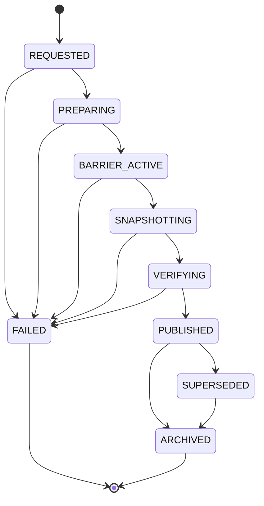

---

# Checkpoint Barrier

The Checkpoint Barrier establishes a consistent logical snapshot.

It coordinates:

* Manifest mutation flow;
* Task State transitions;
* Queue intent;
* Worker leases;
* provider acceptance events;
* artifact registration;
* approval changes;
* retry scheduling.

The barrier must be short-lived.

---

# Barrier Design Principle

The platform does not require all external execution to stop before Checkpoint creation.

Instead, it requires every active external operation to have a persisted identity and recoverable status.

Example:

```text id="50nl3s"
Provider still rendering
+
Provider Task ID persisted
+
Task state = WAITING_EXTERNAL
+
Monitor metadata persisted
=
Checkpoint-safe
```

---

# Barrier Modes

```yaml id="5d2knx"
checkpoint_barrier_modes:
  - QUIESCENT
  - LOGICAL
  - BEST_EFFORT
```

---

# QUIESCENT Barrier

Stops new dispatch and waits for all supported local atomic operations to reach safe boundaries.

Recommended for:

* pause;
* migration;
* final phase transitions;
* local-only Builds.

---

# LOGICAL Barrier

Allows external and selected local operations to continue if all recovery references are persisted.

Recommended default for:

* provider-heavy Builds;
* periodic Checkpoints;
* GitHub Actions.

---

# BEST_EFFORT Barrier

Captures the best available state without guaranteeing immediate resumability.

Allowed only for:

* emergency crash handling;
* diagnostic snapshots;
* incident response.

A Best-Effort Checkpoint may require manual review before resume.

---

# Checkpoint Safety Boundary

A Task is checkpoint-safe when one of the following is true:

```yaml id="h5ov3u"
checkpoint_safe_task_conditions:
  - task_is_terminal
  - task_is_blocked
  - task_is_runnable_but_not_leased
  - queue_reference_is_persisted
  - active_lease_and_worker_identity_are_persisted
  - provider_task_identity_is_persisted
  - local_operation_has_recoverable_subtask_checkpoint
  - output_is_persisted_and_verifiable
```

---

# Unsafe Checkpoint Conditions

Examples:

* provider request may have been sent but no idempotency record exists;
* external Task accepted but provider Task ID is not persisted;
* output exists only in Worker memory;
* Queue acknowledgement occurred before Task State persistence;
* active Task lease cannot be identified;
* current Manifest integrity fails;
* partial artifact cannot be distinguished from complete output.

A normal Checkpoint must fail closed under these conditions.

---

# Checkpoint Creation Flow

```text id="5j4wpg"
Receive Checkpoint Request
↓
Validate Build State
↓
Acquire Checkpoint Coordination Lock
↓
Select Barrier Mode
↓
Stop Incompatible New Dispatch
↓
Reach Safe Mutation Boundary
↓
Create Manifest Snapshot
↓
Capture External Runtime References
↓
Generate Recovery Plan
↓
Verify Integrity and Completeness
↓
Publish Checkpoint
↓
Release Barrier
↓
Resume or Enter PAUSED
```

---

# Checkpoint Preconditions

```yaml id="fgndqj"
checkpoint_preconditions:
  manifest_integrity_valid: true
  build_lock_owned: true
  no_incompatible_checkpoint_active: true
  checkpoint_type_allowed: true
  persistence_backend_available: true
  recovery_metadata_writable: true
```

---

# Checkpoint Request Model

```yaml id="9zmv9k"
checkpoint_request:
  request_id:
  build_id:
  checkpoint_type:
  barrier_mode:
  reason:
  actor:
  requested_at:
  maximum_barrier_seconds:
```

---

# Checkpoint Snapshot Reference

```yaml id="eq3vuo"
checkpoint_manifest_reference:
  snapshot_id:
  manifest_version:
  manifest_hash:
  schema_version:
  storage_reference:
```

The referenced Manifest Snapshot is immutable.

---

# Checkpoint Task Summary

```yaml id="q9gmlw"
checkpoint_task_summary:
  total:
  declared:
  blocked:
  runnable:
  queued:
  leased:
  running:
  waiting_external:
  retry_pending:
  paused:
  succeeded:
  skipped:
  failed_permanent:
  manual_review:
  cancelled:
```

---

# Active Task Recovery Record

Every nonterminal active Task must include:

```yaml id="0vycc7"
active_task_recovery:
  task_id:
  task_state:
  attempt_number:
  task_definition_hash:
  queue_reference:
  lease_reference:
  worker_reference:
  provider_task_reference:
  partial_output_references:
  idempotency_key:
  safe_resume_action:
  reconciliation_required:
```

---

# Safe Resume Actions

```yaml id="yjy8no"
safe_resume_actions:
  - REEVALUATE_READINESS
  - REQUEUE
  - RECONCILE_WORKER
  - RECONCILE_PROVIDER
  - CONTINUE_DOWNLOAD
  - RESTART_DOWNLOAD
  - VERIFY_OUTPUT
  - RESTART_LOCAL_TASK
  - RESTORE_RETRY_TIMER
  - WAIT_FOR_APPROVAL
  - MANUAL_REVIEW
  - NO_ACTION
```

The Checkpoint records a recommended action.

The Resume Engine revalidates it before application.

---

# External Runtime Reference Set

```yaml id="n3qh64"
external_runtime_references:
  provider_tasks:
  queue_items:
  worker_leases:
  artifacts:
  approvals:
  budget_reservations:
  resource_reservations:
  outbox_entries:
  locks:
```

Each reference must include identity and observed version or timestamp.

---

# Recovery Plan

Every published Checkpoint contains a Recovery Plan.

```yaml id="1g39n2"
recovery_plan:
  resume_strategy:
  required_reconciliations:
  task_actions:
  provider_actions:
  queue_actions:
  lease_actions:
  approval_actions:
  artifact_actions:
  reservation_actions:
  required_manual_decisions:
```

---

# Resume Strategies

```yaml id="vh8yqt"
resume_strategies:
  - CONTINUE
  - RECONCILE_AND_CONTINUE
  - PARTIAL_REBUILD
  - MANUAL_REVIEW_FIRST
  - MIGRATE_AND_CONTINUE
  - NOT_RESUMABLE
```

---

# CONTINUE

Used when:

* Checkpoint is recent;
* no external divergence exists;
* no active ambiguous operations exist;
* runtime compatibility remains unchanged.

Even this strategy requires basic validation.

---

# RECONCILE_AND_CONTINUE

Default strategy.

Used when external provider, Queue, Worker, approval, or reservation state may have changed.

---

# PARTIAL_REBUILD

Used when selected artifacts or Tasks are invalid but the Build can preserve unaffected completed work.

The Partial Rebuild Strategy defined in Section 6.2.7 remains authoritative for rebuild scope.

---

# MANUAL_REVIEW_FIRST

Used when:

* provider status is ambiguous;
* Checkpoint integrity is valid but external state conflicts;
* approval scope is unclear;
* migration changes semantics;
* a non-idempotent local operation cannot be reconciled automatically.

---

# MIGRATE_AND_CONTINUE

Used when schema or runtime migration is required and a compatible migration path exists.

---

# NOT_RESUMABLE

Used when:

* Build is cancelled and policy prohibits recovery;
* Manifest corruption cannot be repaired;
* Execution Plan identity is unavailable;
* required immutable artifacts are lost;
* idempotency guarantees are broken;
* provider operations cannot be reconciled safely;
* governance prohibits continuation.

---

# Checkpoint Integrity

Every Checkpoint must include:

```yaml id="rm10f3"
checkpoint_integrity:
  checkpoint_hash:
  manifest_hash:
  external_reference_hash:
  recovery_plan_hash:
  previous_checkpoint_hash:
  signature:
  verified_at:
```

---

# Checkpoint Hash Chain

Published Checkpoints form a hash chain.

```text id="blkl3y"
Checkpoint 10 Hash
        ↓
Checkpoint 11 previous_checkpoint_hash
```

This supports tamper detection and audit.

---

# Checkpoint Completeness Validation

A Checkpoint is complete only when:

* Manifest Snapshot is valid;
* every nonterminal Task has a recovery record;
* every accepted provider Task has a provider Task ID;
* every active lease has identity and expiry;
* every retry has `retry_at`;
* every approval dependency has current status;
* every required artifact has identity and lifecycle state;
* all pending Queue intents are represented;
* Build Lock state is recorded;
* recovery strategy is defined.

---

# Checkpoint Publication

Publication must use an atomic current-checkpoint pointer.

```yaml id="xlo95g"
checkpoint_pointer:
  build_id:
  execution_generation:
  current_checkpoint_id:
  checkpoint_sequence:
  checkpoint_hash:
  updated_at:
```

The pointer must never reference a partially written Checkpoint.

---

# Checkpoint Repository

```python id="7t6a8n"
class CheckpointRepository:
    def create(
        self,
        checkpoint: "Checkpoint"
    ) -> "CheckpointWriteResult":
        ...

    def load(
        self,
        checkpoint_id: str
    ) -> "Checkpoint":
        ...

    def latest(
        self,
        build_id: str,
        execution_generation: int
    ) -> "Checkpoint | None":
        ...

    def list(
        self,
        build_id: str,
        execution_generation: int
    ) -> list["CheckpointSummary"]:
        ...

    def publish(
        self,
        checkpoint_id: str,
        expected_previous_checkpoint_id: str | None
    ) -> "CheckpointPublicationResult":
        ...
```

---

# Checkpoint Manager Interface

```python id="o5nokr"
class CheckpointManager:
    def request(
        self,
        request: "CheckpointRequest"
    ) -> "CheckpointResult":
        ...

    def create(
        self,
        build_id: str,
        checkpoint_type: str,
        barrier_mode: str,
        reason: str
    ) -> "Checkpoint":
        ...

    def verify(
        self,
        checkpoint_id: str
    ) -> "CheckpointVerificationResult":
        ...
```

---

# Checkpoint Coordination Lock

Only one Checkpoint operation may actively establish a barrier for one Build.

```yaml id="nc8th6"
checkpoint_lock:
  checkpoint_request_id:
  build_id:
  owner:
  acquired_at:
  expires_at:
```

This lock is separate from the Build Lock.

The Checkpoint owner must also hold or be authorized by the Build Lock owner.

---

# Checkpoint Timeout

Checkpoint creation may have:

```yaml id="k8nr2w"
checkpoint_timeout:
  preparation_seconds:
  barrier_seconds:
  snapshot_seconds:
  verification_seconds:
  total_seconds:
```

A timeout must:

* release the Checkpoint Barrier;
* preserve the previous published Checkpoint;
* record failure;
* avoid entering `PAUSED` when the pause Checkpoint failed.

---

# Checkpoint Failure Model

```yaml id="83zvov"
checkpoint_failure:
  failure_id:
  checkpoint_request_id:
  phase:
  failure_class:
  message:
  recoverable:
  previous_checkpoint_id:
  occurred_at:
  remediation:
```

---

# Checkpoint Failure Classes

```yaml id="ahngsn"
checkpoint_failure_classes:
  - BARRIER_TIMEOUT
  - MANIFEST_WRITE_FAILED
  - MANIFEST_INTEGRITY_FAILED
  - EXTERNAL_REFERENCE_INCOMPLETE
  - PROVIDER_IDENTITY_MISSING
  - LEASE_STATE_AMBIGUOUS
  - ARTIFACT_STATE_AMBIGUOUS
  - STORAGE_UNAVAILABLE
  - POINTER_UPDATE_FAILED
  - VERIFICATION_FAILED
  - LOCK_CONFLICT
```

---

# Checkpoint and Build State

Recommended mapping:

| Build State       | Checkpoint Allowed             |
| ----------------- | ------------------------------ |
| CREATED           | Initial only                   |
| PREFLIGHT         | Diagnostic only                |
| READY             | Yes                            |
| RUNNING           | Yes                            |
| WAITING           | Yes                            |
| VALIDATING        | Yes                            |
| COMPOSING         | At safe boundary               |
| PACKAGING         | At safe boundary               |
| AWAITING_APPROVAL | Yes                            |
| PAUSING           | Required                       |
| PAUSED            | Existing pause Checkpoint      |
| RESUMING          | Pre-resume diagnostic only     |
| CANCELLING        | Pre-cancellation or diagnostic |
| CANCELLED         | Final only                     |
| FAILED            | Failure-recovery or final      |
| RECOVERABLE       | Required recovery Checkpoint   |
| MANUAL_REVIEW     | Yes                            |
| COMPLETED         | Final only                     |

---

# Pause Integration

Canonical pause flow:

```text id="vdu5k6"
Pause Requested
↓
Build → PAUSING
↓
Stop New Dispatch
↓
Create PAUSE Checkpoint
↓
Verify Checkpoint
↓
Release Nonessential Resources
↓
Build → PAUSED
```

A Build may not enter `PAUSED` without a valid published PAUSE Checkpoint.

---

# Shutdown Integration

Canonical graceful shutdown:

```text id="smh5yo"
Shutdown Requested
↓
Scheduler Draining
↓
Workers Draining
↓
Create SHUTDOWN Checkpoint
↓
Verify Persistent State
↓
Release Build Lock
↓
Stop Runtime
```

If shutdown grace expires, the platform must preserve the most recent valid Checkpoint and rely on reconciliation.

---

# Resume Definition

Resume is the controlled reconstruction and continuation of a nonterminal Build from a published Checkpoint.

Resume does not reset:

* Task Attempts;
* execution generation;
* cost;
* state history;
* Manifest Version;
* provider Task identities;
* artifact hashes;
* approval history.

---

# Resume Request

```yaml id="e6450f"
resume_request:
  request_id:
  build_id:
  execution_generation:
  checkpoint_id:
  requested_by:
  requested_at:
  runtime_version:
  configuration_version:
  mode:
```

Resume modes:

```yaml id="5j0l39"
resume_modes:
  - AUTOMATIC
  - OPERATOR_INITIATED
  - RECOVERY
  - MIGRATION
  - DRY_RUN
```

---

# Resume Preconditions

```yaml id="atwmzd"
resume_preconditions:
  checkpoint_published: true
  checkpoint_integrity_valid: true
  build_state_resumable: true
  build_lock_acquirable: true
  execution_plan_available: true
  execution_plan_hash_matches: true
  runtime_graph_available: true
  required_manifest_schema_supported: true
  secrets_resolvable: true
  storage_available: true
```

---

# Resumable Build States

Recommended resumable states:

```yaml id="7ou2wk"
resumable_states:
  - PAUSED
  - RECOVERABLE
  - WAITING
  - MANUAL_REVIEW
```

A crash-recovered Build persisted as `RUNNING`, `VALIDATING`, `COMPOSING`, or `PACKAGING` may be resumed only after recovery classification and reconciliation.

---

# Non-Resumable Build States

```yaml id="e73twv"
non_resumable_states:
  - COMPLETED
  - CANCELLED
```

A new execution generation is required to repeat or supersede these Builds.

`FAILED` must first transition to `RECOVERABLE` or `MANUAL_REVIEW`.

---

# Resume Lifecycle

```text id="8gs9ap"
Resume Requested
↓
Load Checkpoint
↓
Verify Integrity
↓
Acquire Build Lock
↓
Validate Runtime Compatibility
↓
Load Manifest Snapshot
↓
Reconcile Manifest with Current External State
↓
Apply Recovery Plan
↓
Persist Reconciled Manifest Version
↓
Rebuild Queues
↓
Restore Runtime Services
↓
Build → RESUMING
↓
Select Target State
↓
Continue
```

---

# Resume State Machine

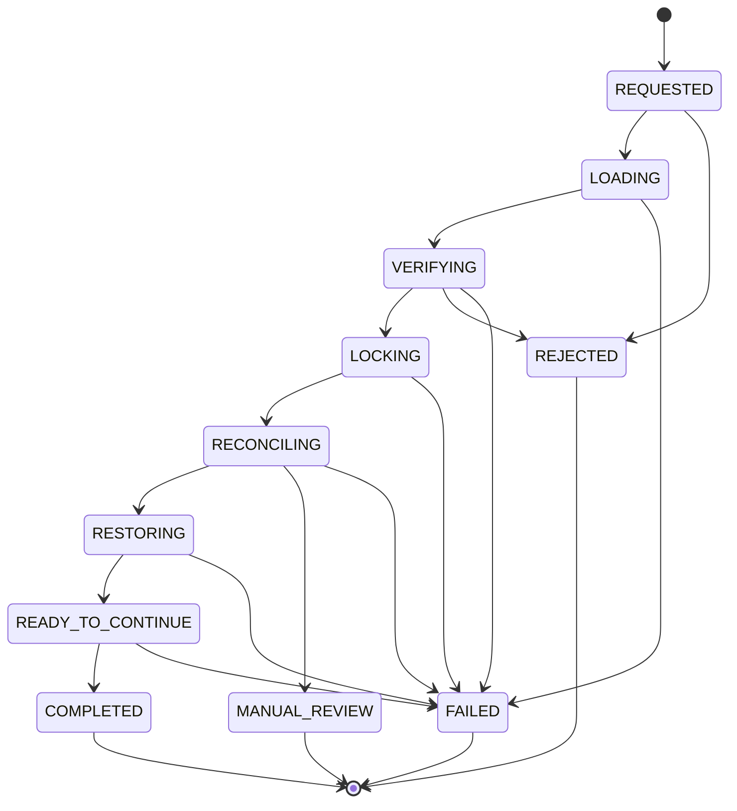

---

# Resume Engine States

```yaml id="wxz3ft"
resume_engine_states:
  - REQUESTED
  - LOADING
  - VERIFYING
  - LOCKING
  - RECONCILING
  - RESTORING
  - READY_TO_CONTINUE
  - COMPLETED
  - REJECTED
  - MANUAL_REVIEW
  - FAILED
```

---

# Checkpoint Selection

By default, the Resume Engine selects the latest valid published Checkpoint.

Selection criteria:

```text id="pm28bf"
1. Same Build ID
2. Same execution generation
3. Published state
4. Integrity valid
5. Runtime compatible
6. Highest sequence
7. Recovery policy permits use
```

---

# Explicit Older Checkpoint Selection

An operator may request an older Checkpoint for:

* corruption recovery;
* migration rollback;
* provider incident analysis;
* deterministic replay;
* diagnostic testing.

Using an older Checkpoint does not erase later history.

A new recovery Manifest version must record the selected rollback basis.

---

# Rollback vs Resume

Resume continues from persisted truth.

Rollback intentionally selects an earlier state basis.

They are distinct operations.

Rollback requires:

* explicit authority;
* impact analysis;
* provider reconciliation;
* artifact supersession handling;
* cost acknowledgment;
* new execution generation where semantic history would otherwise conflict.

Ordinary resume must not perform implicit rollback.

---

# Runtime Compatibility Validation

Resume must validate:

```yaml id="pw5sr5"
runtime_compatibility:
  pipeline_version:
  manifest_schema_version:
  execution_plan_schema_version:
  task_type_versions:
  provider_adapter_versions:
  artifact_schema_versions:
  configuration_compatibility:
  secret_compatibility:
```

---

# Compatibility Outcomes

```yaml id="wq8f2n"
compatibility_outcomes:
  - COMPATIBLE
  - COMPATIBLE_WITH_MIGRATION
  - MANUAL_REVIEW_REQUIRED
  - INCOMPATIBLE
```

---

# Configuration Drift

Configuration may have changed since Checkpoint creation.

The Resume Engine must classify changes.

## Safe Drift

Examples:

* observability endpoint;
* non-semantic log level;
* increased Worker capacity;
* reduced polling interval within policy.

## Controlled Drift

Examples:

* provider rate limit;
* retry delay settings;
* resource limits;
* Queue backend.

Requires validation and recorded application.

## Semantic Drift

Examples:

* prompt template version;
* provider selection policy;
* Task definition;
* quality threshold;
* fallback policy;
* approval requirement.

Requires a new Execution Plan or execution generation.

---

# Secret Revalidation

Resume must verify that required secret references remain resolvable.

It must not compare raw secret values.

Credential rotation is allowed when:

* provider account semantics remain compatible;
* existing provider Tasks remain accessible;
* policy permits the new credential version.

---

# Build Lock Acquisition

The Resume Engine must acquire the Build Lock before authoritative reconciliation.

If an unexpired lock exists:

* determine whether the previous Orchestrator is alive;
* reject concurrent resume;
* or wait according to policy.

Forced lock takeover requires explicit evidence and audit.

---

# Pre-Resume Snapshot

Before applying reconciliation changes, the Resume Engine should create a `PRE_RESUME` Manifest Snapshot.

This preserves the exact source state used for recovery.

---

# Resume Reconciliation Domains

The Resume Engine reconciles:

```yaml id="dqo68n"
resume_reconciliation_domains:
  - MANIFEST
  - BUILD_STATE
  - TASK_STATE
  - QUEUE
  - WORKER_LEASE
  - PROVIDER_TASK
  - ARTIFACT
  - APPROVAL
  - RETRY
  - BUDGET
  - RESOURCE
  - OUTBOX
  - LOCK
```

---

# Manifest Reconciliation

Verify:

* Manifest hash;
* previous-hash chain;
* current pointer;
* referenced partitions;
* snapshot identity;
* schema validity.

Integrity failure must fail closed.

---

# Build State Reconciliation

Examples:

## Checkpoint says PAUSED

Expected resume path:

```text id="mtl1fn"
PAUSED → RESUMING
```

## Checkpoint says RUNNING after crash

Required:

* classify interruption;
* inspect active Tasks;
* create recovery transition;
* avoid direct continuation without reconciliation.

---

# Task State Reconciliation

Every nonterminal Task receives one Resume Action.

```yaml id="c79rhz"
task_resume_decision:
  task_id:
  checkpoint_state:
  observed_state:
  resume_action:
  reason:
  evidence:
  target_state:
```

---

# Task Resume Matrix

| Checkpoint Task State | Default Resume Action                        |
| --------------------- | -------------------------------------------- |
| DECLARED              | Reevaluate readiness                         |
| BLOCKED               | Reevaluate blocking reasons                  |
| RUNNABLE              | Reevaluate and requeue                       |
| QUEUED                | Verify Queue item; reconstruct if missing    |
| LEASED                | Reconcile Worker and side effects            |
| DISPATCHED            | Reconcile side effects                       |
| RUNNING               | Reconcile output or restart safely           |
| WAITING_EXTERNAL      | Query provider                               |
| DOWNLOADING           | Verify partial download; restart or continue |
| VALIDATING            | Verify validation record; rerun if safe      |
| RETRY_PENDING         | Restore timer and revalidate policy          |
| PAUSED                | Restore according to Task Type               |
| MANUAL_REVIEW         | Restore review item                          |
| SUCCEEDED             | Verify immutable result                      |
| SKIPPED               | Preserve                                     |
| FAILED_PERMANENT      | Preserve                                     |
| CANCELLED             | Preserve                                     |

---

# Queue Reconciliation

For each Task:

## Manifest says QUEUED, Queue item exists

Preserve after compatibility check.

## Manifest says QUEUED, Queue item missing

Recreate idempotently.

## Queue item exists for terminal Task

Remove or acknowledge stale item.

## Queue item exists with incompatible attempt

Quarantine and record orchestration defect.

---

# Worker Lease Reconciliation

Active leases at Checkpoint time are not automatically trusted at resume.

Possible outcomes:

```yaml id="6zh0u7"
lease_reconciliation_outcomes:
  - WORKER_ACTIVE
  - LEASE_EXPIRED
  - WORKER_LOST
  - SIDE_EFFECT_RECONCILIATION_REQUIRED
  - RELEASED
```

A new runtime generally treats prior local Worker sessions as lost unless the distributed Worker registry proves continuity.

---

# Provider Task Reconciliation

For every provider Task:

```text id="j341ag"
Load Provider Task Record
↓
Query Provider or Process Callback Evidence
↓
Normalize Current State
↓
Compare with Checkpoint State
↓
Apply Forward-Only Transition
```

Possible outcomes:

* continue monitoring;
* route to download;
* classify failure;
* process cancellation;
* manual review.

---

# Provider Task Resume Rules

## Provider still processing

Restore `WAITING_EXTERNAL` and Monitor Queue item.

## Provider succeeded

Persist completion and route to download.

## Provider failed

Invoke Failure Coordinator.

## Provider Task missing

Classify:

* expired record;
* wrong credentials;
* provider data loss;
* internal identity defect.

Do not resubmit blindly.

---

# Artifact Reconciliation

Every reusable or completed artifact must be verified.

Checks:

* storage reference exists;
* object hash matches;
* lifecycle state is coherent;
* validation result exists;
* approval binding remains valid;
* artifact is not quarantined or superseded.

---

# Missing Artifact

If a Task is `SUCCEEDED` but its mandatory output is missing:

* record inconsistency;
* determine whether deterministic regeneration is possible;
* transition Build to `RECOVERABLE` or `MANUAL_REVIEW`;
* never treat the Task as complete without evidence.

---

# Partial Local Output

Partial outputs must be classified:

```yaml id="nbbzi2"
partial_output_actions:
  - DELETE_AND_RESTART
  - VERIFY_AND_PROMOTE
  - CONTINUE_FROM_SUBCHECKPOINT
  - QUARANTINE
  - MANUAL_REVIEW
```

Task-Type policy determines the action.

---

# Download Resume

Partial download continuation is allowed only when:

* provider or server supports range requests;
* source identity is unchanged;
* signed URL remains valid;
* downloaded byte range is verified;
* destination temporary file is intact.

Otherwise restart download from zero.

---

# FFmpeg Resume

FFmpeg Tasks are not resumed from arbitrary process memory.

Supported strategies:

* restart the Task deterministically;
* reuse validated completed segments;
* continue from explicitly persisted composition subtask boundaries.

Partial final media files are not trusted.

---

# Approval Revalidation

Approvals must be revalidated against:

* subject hash;
* scope;
* authority;
* expiration;
* revocation;
* execution generation;
* policy version.

An expired or revoked approval blocks resumed execution.

---

# Retry Restoration

For each `RETRY_PENDING` Task:

* restore attempt history;
* preserve original `retry_at`;
* determine whether the delay has elapsed;
* verify maximum attempts;
* revalidate budget;
* revalidate provider policy;
* revalidate idempotency generation.

Resume must not reset retry counters.

---

# Budget Reconciliation

Resume must compare:

* estimated Build budget;
* reserved budget;
* actual provider cost;
* outstanding provider Tasks;
* retry cost;
* expired reservations.

Expired budget reservations must be reacquired before new dispatch.

Previously incurred cost remains immutable.

---

# Resource Reconciliation

Local CPU, memory, network, and Worker reservations normally expire on restart.

They must be reacquired.

Provider active-job reservations may remain consumed while external Tasks are active.

---

# Outbox Reconciliation

Undelivered outbox entries must be replayed idempotently.

Examples:

* missing Queue insertion;
* missing event publication;
* missing notification;
* delayed metrics update.

Delivered entries must not be emitted again unless the consumer contract is idempotent.

---

# Build Lock Reconciliation

The resumed Orchestrator replaces the prior expired ownership with a new lock generation.

```yaml id="rtbg6d"
build_lock_takeover:
  previous_lock_id:
  new_lock_id:
  previous_owner:
  new_owner:
  takeover_reason:
  evidence:
  occurred_at:
```

---

# Resume Target State

After successful restoration, the Resume Engine selects a Build target state.

Possible targets:

```yaml id="6duv98"
resume_target_states:
  - RUNNING
  - WAITING
  - AWAITING_APPROVAL
  - MANUAL_REVIEW
  - FAILED
```

---

# Resume to RUNNING

Allowed when:

* runnable Tasks exist;
* dispatch is authorized;
* no global block remains;
* Scheduler and Worker Pools are active.

---

# Resume to WAITING

Used when:

* provider Tasks are active;
* retry timers remain;
* resources are temporarily unavailable;
* no Task is currently dispatchable.

A waiting reason is mandatory.

---

# Resume to AWAITING_APPROVAL

Used when required approval is missing, expired, or revoked.

---

# Resume to MANUAL_REVIEW

Used when automatic reconciliation cannot establish one safe continuation path.

---

# Resume to FAILED

Used when the Checkpoint is valid but continuation is impossible and unrecoverable.

---

# Resume Transaction Boundary

The Resume Engine must atomically or recoverably coordinate:

* reconciled Manifest mutation;
* Build State transition to `RESUMING`;
* Task corrections;
* Queue reconstruction intents;
* lease corrections;
* provider corrections;
* outbox events;
* new Build Lock ownership.

---

# Resume Idempotency

A repeated Resume Request must not duplicate:

* Queue items;
* provider submissions;
* Task Attempts;
* Build State transitions;
* Worker leases;
* outbox messages;
* recovery actions.

Canonical idempotency key:

```text id="yhj3gb"
resume_idempotency_key =
sha256(
  build_id
  + execution_generation
  + checkpoint_id
  + resume_mode
)
```

---

# Duplicate Resume Request

If the same Resume Request is repeated:

```yaml id="4vnn92"
resume_result:
  duplicate: true
  existing_resume_operation_id:
  current_state:
```

---

# Resume Operation Record

```yaml id="0sybqe"
resume_operation:
  resume_operation_id:
  resume_idempotency_key:
  build_id:
  checkpoint_id:
  state:
  requested_at:
  started_at:
  completed_at:
  source_manifest_version:
  resulting_manifest_version:
  target_build_state:
  reconciliation_summary:
  failure:
```

---

# Resume Operation States

```yaml id="ve5zx9"
resume_operation_states:
  - REQUESTED
  - IN_PROGRESS
  - MANUAL_REVIEW
  - SUCCEEDED
  - FAILED
  - REJECTED
```

---

# Resume Failure Model

```yaml id="y1mk6p"
resume_failure:
  failure_id:
  resume_operation_id:
  phase:
  failure_class:
  message:
  recoverable:
  checkpoint_id:
  source_manifest_version:
  evidence:
  remediation:
```

---

# Resume Failure Classes

```yaml id="56rf74"
resume_failure_classes:
  - CHECKPOINT_NOT_FOUND
  - CHECKPOINT_NOT_PUBLISHED
  - CHECKPOINT_INTEGRITY_FAILED
  - EXECUTION_PLAN_MISMATCH
  - RUNTIME_INCOMPATIBLE
  - LOCK_CONFLICT
  - PROVIDER_STATE_AMBIGUOUS
  - ARTIFACT_MISSING
  - APPROVAL_INVALID
  - QUEUE_RECONSTRUCTION_FAILED
  - MANIFEST_RECONCILIATION_FAILED
  - SECRET_UNAVAILABLE
  - STORAGE_UNAVAILABLE
  - BUDGET_REJECTED
  - GOVERNANCE_REJECTED
```

---

# Dry-Run Resume

A Dry-Run Resume evaluates recovery without mutating authoritative state.

It produces:

```yaml id="krtlh6"
resume_dry_run:
  checkpoint_id:
  compatibility:
  detected_inconsistencies:
  planned_task_actions:
  planned_provider_actions:
  planned_queue_actions:
  required_manual_decisions:
  predicted_target_state:
  safe_to_resume:
```

Dry-run is recommended before high-risk recovery.

---

# Resume Explanation

Every resume outcome must be explainable.

```yaml id="c9msez"
resume_explanation:
  checkpoint_selected:
  checkpoint_reason:
  compatibility_result:
  reconciliations_applied:
  tasks_requeued:
  tasks_preserved:
  providers_recovered:
  artifacts_invalidated:
  approvals_revalidated:
  retries_restored:
  target_build_state:
  remaining_blocks:
```

---

# Checkpoint Scheduling Policy

Checkpoint frequency may be based on:

```yaml id="r8dsgu"
checkpoint_triggers:
  elapsed_seconds:
  manifest_versions:
  completed_tasks:
  completed_provider_tasks:
  estimated_cost_increment:
  phase_boundary:
  lifecycle_transition:
  shutdown_signal:
```

---

# Checkpoint Frequency Trade-Off

Frequent Checkpoints:

* reduce recovery work;
* increase persistence load;
* increase storage use.

Infrequent Checkpoints:

* reduce runtime overhead;
* increase reconciliation scope;
* risk losing local intermediate progress.

Policy must reflect Build cost and Task duration.

---

# Recommended Checkpoint Policy

```yaml id="11uvlq"
checkpoint_policy:
  periodic_seconds: 300
  every_manifest_versions: 25
  on_phase_boundary: true
  after_provider_acceptance: true
  before_final_composition: true
  on_pause: true
  on_shutdown: true
  on_recoverable_failure: true
```

---

# Critical Task Checkpoints

A Task may declare a checkpoint criticality.

```yaml id="gd0n75"
task_checkpoint_policy:
  checkpoint_before:
  checkpoint_after:
  checkpoint_on_partial_progress:
```

Use sparingly for:

* expensive provider Tasks;
* long deterministic local generation;
* large downloads;
* segmented composition.

---

# Subtask Checkpoints

Long local Tasks may expose internal recovery points.

Example:

```yaml id="rcgww3"
subtask_checkpoint:
  task_id:
  attempt_number:
  subtask_id:
  completed_units:
  output_references:
  state_hash:
  created_at:
```

Subtask Checkpoints must not violate the canonical Task State Machine.

They are internal recovery evidence.

---

# Checkpoint Storage Layout

```text id="t5a4l9"
checkpoints/
└── <build_id>/
    └── generation-<n>/
        ├── pointer.json
        ├── active/
        │   └── <checkpoint_id>.json
        ├── snapshots/
        ├── recovery-plans/
        ├── verification/
        └── archive/
```

---

# Checkpoint Retention

Suggested policy:

```yaml id="0pd9lu"
checkpoint_retention:
  active_build_all: true
  completed_latest_count: 5
  failed_latest_count: 10
  superseded_days: 90
  final_checkpoint_days: 365
  audit_metadata_days: 2555
```

Retention must preserve any Checkpoint referenced by an unresolved failure or audit record.

---

# Checkpoint Garbage Collection

Garbage collection may remove:

* unreferenced temporary snapshot files;
* failed unpublished Checkpoint payloads after retention;
* superseded Checkpoints beyond policy.

It must never remove:

* current published Checkpoint;
* latest valid recovery Checkpoint;
* Checkpoint referenced by active Resume Operation;
* Final Checkpoint under retention;
* Checkpoint required by audit or incident record.

---

# Checkpoint Encryption and Redaction

Checkpoint payloads may contain sensitive references.

Required controls:

* encryption at rest;
* restricted provider URL references;
* secret exclusion;
* role-based read access;
* redacted human-readable exports;
* integrity verification.

---

# Checkpoint Export

Supported formats:

```yaml id="n6a5ea"
checkpoint_export_formats:
  - JSON
  - YAML
  - HUMAN_READABLE_MARKDOWN
```

Machine resume uses canonical JSON.

Markdown is diagnostic only.

---

# Checkpoint Observability

Required metrics:

```yaml id="8j9h0w"
checkpoint_metrics:
  checkpoint_requests:
  checkpoint_successes:
  checkpoint_failures:
  checkpoint_duration_ms:
  checkpoint_barrier_ms:
  checkpoint_size_bytes:
  checkpoint_verification_ms:
  active_checkpoint_age_seconds:
  resume_requests:
  resume_successes:
  resume_failures:
  resume_duration_ms:
  resume_reconciliation_ms:
  tasks_requeued_on_resume:
  provider_tasks_recovered:
  stale_queue_items_removed:
  artifact_inconsistencies:
  manual_review_resume_count:
```

---

# Recovery Point Objective

The platform should define a runtime **Recovery Point Objective**.

Example:

```yaml id="1vqhm7"
recovery_point_objective:
  maximum_manifest_versions_since_checkpoint: 25
  maximum_elapsed_seconds_since_checkpoint: 300
```

Authoritative Manifest mutations after the Checkpoint are not necessarily lost because the Manifest remains versioned.

The Checkpoint RPO primarily governs recovery convenience and external-reference completeness.

---

# Recovery Time Objective

Example:

```yaml id="04lfvs"
recovery_time_objective:
  preview_build_seconds: 120
  production_build_seconds: 300
```

The objective measures time from Resume Request to restored stable Build State.

---

# Checkpoint Events

Required events:

```text id="do17dx"
checkpoint.requested
checkpoint.preparing
checkpoint.barrier_activated
checkpoint.snapshot_created
checkpoint.verification_started
checkpoint.published
checkpoint.failed
checkpoint.superseded
checkpoint.archived
```

---

# Resume Events

Required events:

```text id="zdoofk"
resume.requested
resume.checkpoint_loaded
resume.checkpoint_verified
resume.lock_acquired
resume.compatibility_checked
resume.reconciliation_started
resume.task_reconciled
resume.provider_reconciled
resume.queue_reconstructed
resume.runtime_restored
resume.completed
resume.manual_review_required
resume.failed
resume.rejected
```

---

# Checkpoint Event Model

```yaml id="1hjvu5"
event:
  event_type: checkpoint.published
  build_id:
  checkpoint_id:
  checkpoint_sequence:
  manifest_version:
  checkpoint_type:
  barrier_mode:
  occurred_at:
```

---

# Resume Event Model

```yaml id="69f7l9"
event:
  event_type: resume.completed
  build_id:
  checkpoint_id:
  resume_operation_id:
  source_manifest_version:
  resulting_manifest_version:
  target_build_state:
  occurred_at:
```

---

# Resume Engine Interface

```python id="94vdn5"
class ResumeEngine:
    def dry_run(
        self,
        request: "ResumeRequest"
    ) -> "ResumeDryRunResult":
        ...

    def resume(
        self,
        request: "ResumeRequest"
    ) -> "ResumeResult":
        ...

    def explain(
        self,
        resume_operation_id: str
    ) -> "ResumeExplanation":
        ...
```

---

# Checkpoint Policy Interface

```python id="992lcl"
class CheckpointPolicy:
    def should_checkpoint(
        self,
        context: "CheckpointPolicyContext"
    ) -> "CheckpointDecision":
        ...

    def barrier_mode(
        self,
        checkpoint_type: str,
        context: "CheckpointPolicyContext"
    ) -> str:
        ...
```

---

# Resume Compatibility Interface

```python id="8nlswi"
class ResumeCompatibilityValidator:
    def validate(
        self,
        checkpoint: "Checkpoint",
        runtime: "RuntimeEnvironment"
    ) -> "CompatibilityResult":
        ...
```

---

# Resume Reconciler Interface

```python id="1v5kfv"
class ResumeReconciler:
    def plan(
        self,
        checkpoint: "Checkpoint",
        external_state: "ExternalRuntimeState"
    ) -> "ResumeReconciliationPlan":
        ...

    def apply(
        self,
        plan: "ResumeReconciliationPlan"
    ) -> "ResumeReconciliationResult":
        ...
```

---

# Queue Reconstruction Interface

```python id="sgxcsj"
class ResumeQueueRebuilder:
    def rebuild(
        self,
        manifest: "RuntimeManifest",
        reconciliation: "ResumeReconciliationResult"
    ) -> "QueueRebuildResult":
        ...
```

---

# Reference Configuration

```yaml id="tv4jha"
orchestrator:
  checkpoint:
    enabled: true
    default_barrier_mode: LOGICAL
    periodic_seconds: 300
    every_manifest_versions: 25

    triggers:
      phase_boundary: true
      provider_acceptance: true
      pre_final_composition: true
      pause: true
      shutdown: true
      recoverable_failure: true

    timeouts:
      preparation_seconds: 30
      barrier_seconds: 60
      snapshot_seconds: 60
      verification_seconds: 30
      total_seconds: 180

    integrity:
      hash_chain: true
      sign_published_checkpoints: false
      verify_on_load: true
      fail_closed: true

    retention:
      active_all: true
      completed_latest_count: 5
      failed_latest_count: 10
      superseded_days: 90

  resume:
    default_strategy: RECONCILE_AND_CONTINUE
    require_build_lock: true
    create_pre_resume_snapshot: true
    revalidate_approvals: true
    revalidate_artifacts: true
    reconcile_providers: true
    rebuild_queues: true
    replay_outbox: true
    reset_retry_counters: false
    allow_completed_build_resume: false
    allow_cancelled_build_resume: false
```

---

# Deployment Profiles

## Local Development

Recommended:

```yaml id="sfma2v"
checkpoint_backend: filesystem_or_sqlite
barrier_mode: QUIESCENT
periodic_seconds: 600
```

Requirements:

* deterministic Task restart;
* local workspace verification;
* no bypass of Manifest persistence.

---

## GitHub Actions

Recommended:

```yaml id="6l1whw"
checkpoint_backend: external_persistent_storage
barrier_mode: LOGICAL
checkpoint_before_job_timeout: true
checkpoint_after_provider_acceptance: true
resume_from_separate_workflow: true
```

Requirements:

* checkpoint before runner timeout;
* provider Task IDs persisted immediately;
* no dependency on local runner disk;
* Queue and Manifest restoration in a later workflow.

---

## Distributed Production

Recommended:

```yaml id="jledk4"
checkpoint_backend: shared_durable_store
distributed_checkpoint_lock: true
barrier_mode: LOGICAL
signed_checkpoints: true
parallel_reconciliation: true
```

Requirements:

* distributed Build Lock;
* shared Manifest;
* external Worker reconciliation;
* authenticated Resume operations.

---

# Security Requirements

The subsystem must enforce:

* authenticated checkpoint creation;
* authorized resume requests;
* Build-scoped access;
* immutable published Checkpoints;
* encrypted restricted references;
* secret exclusion;
* signed URL protection;
* Checkpoint integrity verification;
* audit of manual rollback;
* authorization for forced lock takeover;
* authorization for older Checkpoint selection.

---

# Checkpoint Access Roles

Example:

```yaml id="pwyfio"
checkpoint_roles:
  orchestrator:
    create: true
    resume: true

  operator:
    create_manual: true
    resume_non_terminal: true
    select_older_checkpoint: restricted

  auditor:
    read: true
    mutate: false

  worker:
    read_task_scope: true
    create: false
    resume: false
```

---

# Testing Requirements

## Unit Tests

* deterministic Checkpoint ID;
* Checkpoint sequence;
* Checkpoint state transitions;
* barrier-mode selection;
* completeness validation;
* Checkpoint hashing;
* Checkpoint hash chain;
* current-pointer update;
* Resume Request idempotency;
* Task resume matrix;
* configuration-drift classification;
* compatibility outcomes;
* Checkpoint selection;
* non-resumable Build states.

## Integration Tests

* periodic Checkpoint during running Build;
* PAUSE Checkpoint;
* graceful shutdown Checkpoint;
* provider Task active at Checkpoint;
* resume with provider still processing;
* resume after provider completion;
* Queue reconstruction;
* retry timer restoration;
* approval expiration during pause;
* missing artifact during resume;
* resume to `RUNNING`;
* resume to `WAITING`;
* resume to `AWAITING_APPROVAL`;
* resume to `MANUAL_REVIEW`.

## Crash Tests

* crash during Checkpoint preparation;
* crash during barrier;
* crash after Manifest Snapshot before Checkpoint publication;
* crash after pointer publication;
* crash during resume reconciliation;
* crash after Queue reconstruction before Build State transition;
* crash after Build Lock acquisition;
* crash during outbox replay.

## Concurrency Tests

* two simultaneous Checkpoint requests;
* Checkpoint concurrent with cancellation;
* Checkpoint concurrent with provider acceptance;
* Checkpoint concurrent with Task success;
* two simultaneous Resume Requests;
* Resume concurrent with active Orchestrator;
* Worker completion during resume reconciliation;
* callback arrival during provider reconciliation.

## Provider Recovery Tests

* accepted provider Task with active processing;
* provider Task succeeded while runtime offline;
* provider Task failed while runtime offline;
* provider Task missing;
* expired signed URL;
* non-cancellable provider Task after pause;
* ambiguous provider state.

## Artifact Recovery Tests

* successful Task with valid artifact;
* successful Task with missing artifact;
* partial download;
* partial FFmpeg output;
* validated artifact with expired approval;
* quarantined artifact;
* superseded artifact.

## Migration Tests

* compatible runtime version;
* compatible with Manifest migration;
* incompatible Task Type;
* changed provider adapter;
* semantic configuration drift;
* credential rotation.

## Security Tests

* unauthorized Checkpoint creation;
* unauthorized Resume Request;
* Checkpoint tampering;
* Checkpoint pointer tampering;
* cross-Build Checkpoint access;
* signed URL leakage;
* forced lock takeover without authority;
* older Checkpoint rollback without approval.

## Performance Tests

* Checkpoint with 100 Tasks;
* Checkpoint with 1,000 Tasks;
* Checkpoint with 100 active provider Tasks;
* parallel reconciliation;
* Queue reconstruction latency;
* artifact verification latency;
* repeated periodic Checkpoints;
* resume under large Manifest history.

---

# Checkpoint & Resume Quality Gate

```yaml id="infnwq"
checkpoint_resume_quality_gate:
  every_published_checkpoint_has_valid_manifest_snapshot: true
  every_nonterminal_task_has_recovery_action: true
  every_active_provider_task_has_persisted_identity: true
  every_active_lease_has_reconciliation_path: true
  every_retry_has_persisted_schedule: true
  every_required_artifact_has_verifiable_identity: true
  every_approval_revalidated_on_resume: true
  checkpoint_pointer_atomic: true
  checkpoint_hash_chain_valid: true
  pause_requires_published_checkpoint: true
  resume_requires_build_lock: true
  resume_idempotency_verified: true
  queue_reconstruction_test_passed: true
  provider_reconciliation_test_passed: true
  artifact_reconciliation_test_passed: true
  crash_during_checkpoint_test_passed: true
  crash_during_resume_test_passed: true
  completed_build_resume_rejected: true
  cancelled_build_resume_rejected: true
  stale_checkpoint_cannot_overwrite_newer_history: true
```

---

# Architectural Invariants

## Invariant CR-301

A Checkpoint is immutable after publication.

## Invariant CR-302

A published Checkpoint references exactly one verified Manifest Snapshot.

## Invariant CR-303

Every nonterminal Task in a Checkpoint has an explicit recovery action.

## Invariant CR-304

A Build may enter `PAUSED` only after a valid PAUSE Checkpoint is published.

## Invariant CR-305

Resume never resets Task Attempts, cost, history, provider identity, or artifact provenance.

## Invariant CR-306

Resume requires Checkpoint integrity verification and Build Lock acquisition.

## Invariant CR-307

Provider Tasks are reconciled before any resubmission is considered.

## Invariant CR-308

Queue and Worker state are reconstructed from authoritative persisted state rather than trusted blindly.

## Invariant CR-309

Completed and cancelled Builds are not resumable within the same execution generation.

## Invariant CR-310

Resume appends reconciled state and never rewrites prior Manifest or Checkpoint history.

---

# Architectural Decision Records

| ADR     | Decision                                                                                                                                  |
| ------- | ----------------------------------------------------------------------------------------------------------------------------------------- |
| ADR-911 | Checkpoints are immutable recovery records anchored to verified Runtime Manifest Snapshots.                                               |
| ADR-912 | Checkpoint creation uses explicit logical or quiescent barriers rather than relying on uncontrolled process state.                        |
| ADR-913 | External provider execution may remain active during Checkpoint creation only when provider identity and recovery metadata are persisted. |
| ADR-914 | A Build cannot enter PAUSED without a valid published PAUSE Checkpoint.                                                                   |
| ADR-915 | Resume is a reconciliation process, not a command restart.                                                                                |
| ADR-916 | Resume preserves execution generation, Task attempts, cost, failure history, provider identities, and artifact provenance.                |
| ADR-917 | Queue items, Worker leases, provider Tasks, artifacts, approvals, retries, and reservations are revalidated during resume.                |
| ADR-918 | Completed and cancelled Builds require a new execution generation rather than ordinary resume.                                            |
| ADR-919 | Configuration and runtime drift are classified as safe, controlled, or semantic before continuation.                                      |
| ADR-920 | Every Resume operation is idempotent, auditable, and anchored to one published Checkpoint.                                                |

---

# Acceptance Criteria

Section **6.3.12** is complete when:

* Checkpoint, Checkpoint Type, Checkpoint State, Recovery Plan, Resume Request, Resume Operation, and Resume Decision models are formally defined.
* Initial, periodic, phase-boundary, provider, pause, shutdown, failure-recovery, migration, cancellation, manual, and final Checkpoint types are specified.
* Checkpoint barriers distinguish quiescent, logical, and best-effort modes.
* Every nonterminal Task has a recoverable state or explicit manual-review requirement.
* Manifest Snapshots, provider identities, Queue references, Worker leases, artifacts, approvals, retries, failures, reservations, and external references are captured.
* Published Checkpoints are immutable, integrity-verifiable, hash-chained, and atomically referenced.
* Pause, graceful shutdown, provider waiting, and CI runner termination have explicit Checkpoint behavior.
* Resume validates Checkpoint integrity, runtime compatibility, Execution Plan identity, Build Lock ownership, storage, secrets, and schema support.
* Resume reconciles Build State, Task State, Queues, Worker leases, provider Tasks, artifacts, approvals, retries, budgets, resources, outbox entries, and locks.
* Task-specific recovery behavior is defined for queued, leased, running, external, downloading, validating, retry-pending, paused, manual-review, and terminal Tasks.
* Resume selects a deterministic target Build State.
* Duplicate Resume Requests cannot duplicate Queue items, provider submissions, Attempts, transitions, or recovery actions.
* Completed and cancelled Builds cannot resume within the same execution generation.
* Configuration drift, migration, rollback, dry-run, observability, security, retention, interfaces, tests, Quality Gates, invariants, and ADRs are sufficiently detailed for Codex to implement interruption-safe continuation without repeating completed work, losing provider Tasks, trusting stale runtime state, resetting history, or compromising governance.


# Part 6.3.13 — Retry, Backoff & Failure Classification

## Insynergy Cinematic Thought Leadership Platform

### Master Specification v2.1

---

# Purpose

This section defines the canonical **Retry, Backoff & Failure Classification** architecture used by the Build Orchestration & Runtime Control Layer.

The subsystem determines:

* what failed;
* where the failure originated;
* whether the failure is transient or permanent;
* whether retry is safe;
* when retry may occur;
* whether compensation or reconciliation is required first;
* whether the failure affects one Task, one branch, one phase, or the entire Build;
* whether automatic recovery is permitted;
* whether manual authority is required.

Its primary objective is to prevent two equally dangerous behaviors:

1. failing permanently on recoverable transient errors;
2. retrying unsafe or permanent errors until cost, latency, or duplicate side effects become uncontrolled.

Retry is a controlled recovery mechanism.

It is not a substitute for:

* idempotency;
* validation;
* reconciliation;
* provider coordination;
* governance;
* correct Task design.

---

# Governing Principle

The platform adopts the following principle.

> **A retry may occur only after the failure has been classified, retry safety has been proven, and retry policy has explicitly authorized a new Attempt.**

The system must never retry solely because:

* a command returned a nonzero exit code;
* a provider response was missing;
* a timeout occurred;
* a Worker disappeared;
* the operation did not report success;
* the maximum retry count has not yet been reached.

Failure classification precedes retry authorization.

---

# Architectural Position

```text
Task or Runtime Operation Fails
        │
        ▼
Failure Capture
        │
        ▼
Failure Normalization
        │
        ▼
Failure Classifier
        │
        ├── Transient
        ├── Permanent
        ├── Ambiguous
        ├── Governance
        ├── External Dependency
        └── Infrastructure
        │
        ▼
Retry Safety Evaluation
        │
        ├── Idempotency
        ├── Side-Effect Reconciliation
        ├── Attempt Limit
        ├── Budget
        ├── Deadline
        ├── Provider Policy
        └── Build State
        │
        ▼
Retry Policy Engine
        │
        ├── Retry
        ├── Block
        ├── Fail Permanently
        ├── Manual Review
        ├── Use Approved Fallback
        └── Recover Build
```

---

# Responsibilities

The subsystem is responsible for:

* capturing failure evidence;
* normalizing failure records;
* classifying failure origin and severity;
* distinguishing transient, permanent, and ambiguous failures;
* determining retryability;
* determining retry safety;
* selecting backoff policy;
* calculating retry time;
* enforcing attempt limits;
* preserving retry history;
* preventing retry storms;
* integrating provider rate limits;
* enforcing budget and deadline policy;
* routing unretryable failures;
* escalating repeated failures;
* supporting branch-level fallback;
* generating failure events and metrics;
* coordinating Build-level failure impact.

It is not responsible for:

* executing retries directly;
* creating undeclared fallback branches;
* changing Task Definitions;
* resetting Attempts;
* altering approved quality requirements;
* silently converting mandatory Tasks into optional Tasks;
* resolving ambiguous side effects without reconciliation.

---

# Failure Model

A Failure is a persisted fact describing an unsuccessful runtime condition.

Canonical schema:

```yaml
failure:
  failure_id:
  build_id:
  task_id:
  attempt_number:
  execution_generation:
  source_component:
  source_operation:
  failure_class:
  failure_category:
  severity:
  retryability:
  ambiguity:
  message:
  normalized_code:
  native_code:
  evidence:
  side_effect_state:
  occurred_at:
  first_observed_at:
  last_observed_at:
  affects_build:
  affects_downstream:
  remediation:
```

Every failure influencing control flow must be persisted.

---

# Failure Identity

Recommended identifier:

```text
failure_id =
sha256(
  build_id
  + task_id
  + attempt_number
  + source_component
  + normalized_code
  + first_observed_at
)
```

Repeated observations of the same underlying failure should update occurrence metadata or create linked observations rather than unrelated duplicate failures.

---

# Failure Observation

A Failure Observation records one detection of an underlying Failure.

```yaml
failure_observation:
  observation_id:
  failure_id:
  observed_by:
  observed_at:
  evidence_reference:
  native_message:
  native_code:
```

This allows:

* repeated polling failures;
* duplicate provider callbacks;
* repeated Worker heartbeat loss;
* recurring storage errors

to remain correlated.

---

# Failure Sources

Canonical source components:

```yaml
failure_sources:
  - ORCHESTRATOR
  - PREFLIGHT
  - DEPENDENCY_RESOLVER
  - READINESS_EVALUATOR
  - SCHEDULER
  - QUEUE
  - WORKER
  - PROVIDER
  - DOWNLOAD
  - VALIDATION
  - COMPOSITION
  - PACKAGING
  - MANIFEST
  - CHECKPOINT
  - RESUME
  - APPROVAL
  - BUDGET
  - RESOURCE
  - SECURITY
  - CONFIGURATION
```

---

# Failure Categories

The platform defines the following high-level Failure Categories.

```yaml
failure_categories:
  - TRANSIENT_INFRASTRUCTURE
  - TRANSIENT_EXTERNAL
  - RATE_LIMIT
  - RESOURCE_CAPACITY
  - TIMEOUT
  - NETWORK
  - PROVIDER
  - VALIDATION
  - INPUT
  - CONFIGURATION
  - AUTHENTICATION
  - AUTHORIZATION
  - BUDGET
  - GOVERNANCE
  - CANCELLATION
  - INTEGRITY
  - IDEMPOTENCY
  - STATE_CONFLICT
  - DEPENDENCY
  - UNKNOWN
```

---

# Canonical Failure Classes

```yaml
failure_classes:
  - NETWORK_TRANSIENT
  - NETWORK_PERMANENT
  - RATE_LIMITED
  - PROVIDER_OVERLOADED
  - PROVIDER_UNAVAILABLE
  - PROVIDER_REJECTED
  - PROVIDER_PROCESSING_FAILED
  - PROVIDER_STATE_UNKNOWN
  - PROVIDER_TASK_MISSING
  - WORKER_LOST
  - WORKER_UNHEALTHY
  - LEASE_EXPIRED
  - QUEUE_UNAVAILABLE
  - QUEUE_MESSAGE_CORRUPTED
  - STORAGE_TRANSIENT
  - STORAGE_UNAVAILABLE
  - STORAGE_CORRUPTION
  - DOWNLOAD_INTERRUPTED
  - DOWNLOAD_EXPIRED
  - DOWNLOAD_CHECKSUM_MISMATCH
  - LOCAL_PROCESS_FAILED
  - LOCAL_PROCESS_TIMEOUT
  - VALIDATION_TRANSIENT
  - VALIDATION_FAILED
  - INPUT_MISSING
  - INPUT_CORRUPTED
  - INVALID_CONFIGURATION
  - AUTHENTICATION_FAILED
  - AUTHORIZATION_FAILED
  - BUDGET_UNAVAILABLE
  - BUDGET_EXCEEDED
  - APPROVAL_MISSING
  - APPROVAL_REVOKED
  - GOVERNANCE_HOLD
  - MANIFEST_CONFLICT
  - MANIFEST_CORRUPTION
  - CHECKPOINT_FAILED
  - RESUME_INCOMPATIBLE
  - IDEMPOTENCY_CONFLICT
  - AMBIGUOUS_SIDE_EFFECT
  - ATTEMPT_LIMIT_EXCEEDED
  - DEADLINE_EXCEEDED
  - CANCELLED_BY_REQUEST
  - UNKNOWN_FAILURE
```

---

# Failure Severity

```yaml
failure_severity:
  - INFO
  - WARNING
  - ERROR
  - CRITICAL
  - FATAL
```

## INFO

A recoverable operational condition that does not currently block required work.

## WARNING

A degraded condition requiring observation.

## ERROR

A Task or subsystem cannot proceed normally.

## CRITICAL

The failure threatens Build correctness, recovery, cost control, or governance.

## FATAL

The Build cannot continue safely under the active execution generation.

Severity and retryability are independent.

A severe failure may still be retryable after reconciliation.

---

# Retryability States

```yaml
retryability_states:
  - RETRYABLE
  - RETRYABLE_AFTER_RECONCILIATION
  - RETRYABLE_AFTER_CONDITION_CHANGE
  - NOT_RETRYABLE
  - UNKNOWN
```

---

# RETRYABLE

A new Attempt may be authorized after the configured delay.

Examples:

* transient network failure before side effect;
* provider overload with explicit retry guidance;
* temporary storage timeout;
* interrupted download with safe restart.

---

# RETRYABLE_AFTER_RECONCILIATION

Retry is prohibited until the system determines whether an external or local side effect occurred.

Examples:

* provider submission timeout;
* Worker crash after provider request transmission;
* output created before Task State persistence;
* acknowledgement failure after Task completion.

---

# RETRYABLE_AFTER_CONDITION_CHANGE

Retry is blocked until a specific condition changes.

Examples:

* authentication credential rotated;
* budget approved;
* provider circuit closes;
* approval restored;
* disk space becomes available;
* quota resets.

This is not ordinary time-based backoff.

---

# NOT_RETRYABLE

Retry cannot fix the failure under the current Task Definition.

Examples:

* unsupported capability;
* invalid immutable input;
* permanent provider rejection;
* incompatible schema;
* mandatory quality rejection without regeneration policy;
* authorization denied;
* deadline exceeded where late completion is prohibited.

---

# UNKNOWN

The system lacks enough evidence to determine retry safety.

The default action is:

```text
UNKNOWN
→ Reconciliation or Manual Review
```

Unknown failures must not be automatically retried.

---

# Failure Ambiguity

```yaml
failure_ambiguity:
  - UNAMBIGUOUS
  - SIDE_EFFECT_UNKNOWN
  - RESULT_UNKNOWN
  - STATE_DIVERGENCE
```

## UNAMBIGUOUS

The system knows whether the operation occurred and what failed.

## SIDE_EFFECT_UNKNOWN

The system cannot determine whether the operation created an external effect.

## RESULT_UNKNOWN

The operation likely occurred, but output or completion state is unavailable.

## STATE_DIVERGENCE

Internal and external systems disagree.

Ambiguity requires reconciliation before retry.

---

# Side-Effect State

```yaml
side_effect_states:
  - NOT_STARTED
  - NOT_CREATED
  - POSSIBLY_CREATED
  - CREATED
  - COMPLETED
  - PARTIALLY_COMPLETED
  - COMPENSATED
  - UNKNOWN
```

Retry safety depends heavily on this field.

---

# Failure Classification Pipeline

```text
Capture Native Error
↓
Normalize Error Shape
↓
Identify Source Component
↓
Map Native Code
↓
Inspect Runtime Context
↓
Inspect Side-Effect Evidence
↓
Assign Failure Category
↓
Assign Failure Class
↓
Assign Severity
↓
Assign Retryability
↓
Persist Classification
```

---

# Failure Normalization

Provider, Worker, operating-system, HTTP, Queue, and validation failures must normalize into one internal structure.

Example:

```yaml
normalized_failure:
  normalized_code: PROVIDER_OVERLOADED
  native_code: HTTP_503
  category: TRANSIENT_EXTERNAL
  retryability: RETRYABLE
  retry_after: 60
```

Native evidence remains preserved.

---

# Failure Classifier Interface

```python
class FailureClassifier:
    def classify(
        self,
        evidence: "FailureEvidence",
        context: "FailureContext"
    ) -> "FailureClassification":
        ...
```

---

# Failure Classification Result

```yaml
failure_classification:
  failure_class:
  failure_category:
  severity:
  retryability:
  ambiguity:
  side_effect_state:
  confidence:
  reasoning_codes:
  required_next_action:
```

Confidence must not authorize unsafe retry.

Low confidence defaults to reconciliation or manual review.

---

# Classification Rules

Classification rules must be:

* deterministic;
* versioned;
* explainable;
* testable;
* source-specific where required;
* independent from free-form natural-language interpretation.

Machine-learning classification may assist but cannot be the sole authority for retry safety.

---

# Failure Rule Example

```yaml
failure_rule:
  rule_id: provider-http-429
  conditions:
    source_component: PROVIDER
    native_code: HTTP_429
  classification:
    failure_class: RATE_LIMITED
    category: RATE_LIMIT
    severity: WARNING
    retryability: RETRYABLE
    ambiguity: UNAMBIGUOUS
  backoff_policy: PROVIDER_RETRY_AFTER
```

---

# Retry Definition

A Retry is authorization to create a new Task Attempt after a prior Attempt failed.

A Retry must preserve:

* Task identity;
* Task Definition;
* attempt history;
* previous Failure ID;
* execution generation;
* cost history;
* provider history;
* idempotency history.

---

# Retry Decision

Canonical schema:

```yaml
retry_decision:
  retry_decision_id:
  build_id:
  task_id:
  failed_attempt:
  next_attempt:
  failure_id:
  authorized:
  retry_policy_id:
  retry_at:
  delay_seconds:
  idempotency_generation:
  reconciliation_required:
  compensation_required:
  budget_authorized:
  deadline_authorized:
  fallback_selected:
  decision_reason:
  decided_at:
```

---

# Retry Policy Engine

```python
class RetryPolicyEngine:
    def decide(
        self,
        task: "RuntimeTask",
        failure: "Failure",
        context: "RetryContext"
    ) -> "RetryDecision":
        ...
```

The Retry Policy Engine must not directly enqueue work.

It produces a persisted Retry Decision.

---

# Retry Preconditions

A Retry may be authorized only when:

```yaml
retry_preconditions:
  failure_retryability_allows: true
  side_effect_state_safe: true
  reconciliation_complete_if_required: true
  attempt_limit_not_exceeded: true
  build_state_allows_retry: true
  cancellation_not_requested: true
  deadline_allows_retry: true
  budget_allows_retry: true
  provider_policy_allows_retry: true
  retry_storm_guard_allows: true
  governance_allows_retry: true
```

---

# Retry Safety Evaluation

Canonical interface:

```python
class RetrySafetyEvaluator:
    def evaluate(
        self,
        task: "RuntimeTask",
        failure: "Failure",
        context: "RetryContext"
    ) -> "RetrySafetyDecision":
        ...
```

Output:

```yaml
retry_safety:
  safe:
  side_effect_reconciled:
  idempotency_valid:
  compensation_complete:
  blocking_reasons:
  required_actions:
```

---

# Unsafe Retry Conditions

Automatic retry is prohibited when:

* side-effect state is unknown;
* idempotency identity is missing;
* prior provider Task may still exist;
* compensation failed;
* immutable input is invalid;
* approval has been revoked;
* Build cancellation has begun;
* retry would exceed hard budget;
* deadline policy prohibits late completion;
* attempt limit is exhausted;
* failure class is permanent;
* Task Definition changed.

---

# Retry Attempt Model

Each retry creates a new Task Attempt.

```yaml
task_attempt:
  task_id:
  attempt_number:
  attempt_generation:
  previous_attempt:
  previous_failure_id:
  idempotency_key:
  retry_decision_id:
  state: DECLARED
  created_at:
```

The original Attempt remains immutable.

---

# Attempt Limit

Retry limits may be declared at:

* Task Type;
* Task Class;
* provider capability;
* failure class;
* Build Profile;
* global level.

The most restrictive applicable limit wins unless explicit policy states otherwise.

---

# Attempt Limit Model

```yaml
attempt_limit:
  maximum_attempts:
  maximum_retries:
  maximum_elapsed_retry_seconds:
  maximum_cost:
  maximum_same_failure_occurrences:
```

`maximum_attempts` includes the first Attempt.

---

# Attempt Limit Example

```yaml
retry_policy:
  maximum_attempts: 3
```

Meaning:

```text
Attempt 1
Retry Attempt 2
Retry Attempt 3
No Attempt 4
```

---

# Same-Failure Limit

A policy may terminate retries when the same normalized failure repeats.

```yaml
same_failure_policy:
  maximum_occurrences: 2
```

This prevents repeated retries against an unchanged permanent condition incorrectly classified as transient.

---

# Retry Exhaustion

When retry limits are exhausted:

```text
FAILED_RETRYABLE
↓
Attempt Limit Exceeded
↓
FAILED_PERMANENT / MANUAL_REVIEW / APPROVED_FALLBACK
```

A Task must not remain indefinitely in `RETRY_PENDING`.

---

# Backoff Definition

Backoff determines how long the system waits before retry eligibility.

The platform supports:

```yaml
backoff_strategies:
  - NONE
  - FIXED
  - LINEAR
  - EXPONENTIAL
  - EXPONENTIAL_WITH_JITTER
  - PROVIDER_RETRY_AFTER
  - CONDITION_BASED
  - SCHEDULED_WINDOW
```

---

# NONE

Immediate retry.

Allowed only for:

* deterministic local race conditions;
* extremely low-risk operations;
* one bounded retry;
* no external side effect.

Not recommended as a default.

---

# FIXED

```text
delay = fixed_seconds
```

Suitable for:

* predictable temporary resource release;
* short local dependency delays.

---

# LINEAR

```text
delay =
base_delay
×
attempt_number
```

Suitable for moderate transient failures.

---

# EXPONENTIAL

```text
delay =
min(
  maximum_delay,
  base_delay × multiplier^(attempt_number - 1)
)
```

Recommended default for:

* provider overload;
* network instability;
* Queue backend instability;
* storage transient failures.

---

# EXPONENTIAL_WITH_JITTER

```text
delay =
min(
  maximum_delay,
  exponential_delay
)
+
deterministic_jitter
```

Recommended for distributed retries to prevent synchronized retry bursts.

---

# PROVIDER_RETRY_AFTER

Uses provider-provided delay when valid.

```text
delay =
max(
  provider_retry_after,
  internal_minimum_delay
)
```

Provider guidance may not exceed internal deadline or budget policy without reevaluation.

---

# CONDITION_BASED

Retry occurs after an event or external condition changes.

Examples:

* credential rotation;
* quota reset;
* approval granted;
* circuit breaker closed;
* provider recovered;
* storage capacity restored.

A timestamp alone is insufficient.

---

# SCHEDULED_WINDOW

Retry is deferred until an approved operational window.

Examples:

* off-peak provider usage;
* scheduled high-bandwidth download window;
* overnight final composition.

---

# Deterministic Jitter

Jitter must be reproducible.

Recommended formula:

```text
jitter =
hash(task_id + attempt_number + failure_id)
mod jitter_window_seconds
```

Random non-deterministic jitter is prohibited in benchmark mode.

---

# Backoff Policy Model

```yaml
backoff_policy:
  strategy:
  base_delay_seconds:
  multiplier:
  maximum_delay_seconds:
  jitter_seconds:
  provider_retry_after_allowed:
  reset_after_success:
```

---

# Backoff Calculation Interface

```python
class BackoffCalculator:
    def calculate(
        self,
        policy: "BackoffPolicy",
        attempt_number: int,
        failure: "Failure",
        context: "RetryContext"
    ) -> "BackoffDecision":
        ...
```

---

# Backoff Decision

```yaml
backoff_decision:
  strategy:
  delay_seconds:
  retry_at:
  provider_retry_after:
  jitter_seconds:
  capped:
  calculation_version:
```

---

# Clock Abstraction

Retry timing must use the Orchestrator Clock abstraction.

```python
class Clock:
    def now(self) -> datetime:
        ...
```

Direct system-time access inside policy logic is prohibited.

This supports deterministic tests.

---

# Retry Scheduling

After authorization:

```text
Persist Retry Decision
↓
Transition Task to RETRY_PENDING
↓
Create Retry Queue Item
↓
Set visible_at = retry_at
↓
Reevaluate at Trigger
```

The Retry Queue does not dispatch directly.

It returns the Task to readiness evaluation.

---

# Retry Re-evaluation

At `retry_at`, the system must revalidate:

* Build State;
* cancellation;
* provider health;
* approval;
* budget;
* deadline;
* attempt limit;
* idempotency;
* governance;
* input availability.

A previously authorized retry may be revoked.

---

# Retry Revocation

Canonical record:

```yaml
retry_revocation:
  retry_decision_id:
  revoked_by:
  reason:
  revoked_at:
  resulting_action:
```

Possible reasons:

* Build cancelled;
* approval revoked;
* deadline passed;
* budget removed;
* provider fallback chosen;
* Task superseded;
* input invalidated.

---

# Retry Budget

Retries must have explicit cost policy.

```yaml
retry_budget:
  maximum_retry_cost:
  maximum_retry_percentage_of_build_budget:
  remaining_retry_budget:
  currency:
```

A retry may be technically safe but financially unauthorized.

---

# Retry Cost Estimation

```text
retry_estimated_cost =
provider_cost
+
download_cost
+
validation_cost
+
composition_rework_cost
```

Downstream invalidation cost should be considered where material.

---

# Retry Deadline Policy

Canonical fields:

```yaml
retry_deadline_policy:
  build_deadline:
  task_deadline:
  latest_retry_start:
  expected_duration:
  allow_completion_after_deadline:
```

A retry should not start when completion cannot meet a hard deadline unless authority explicitly permits it.

---

# Retry Priority

Retries generally receive a bounded scheduling penalty.

Priority may increase when:

* Task is on the critical path;
* Task is the last mandatory blocker;
* retry success probability is high;
* failure was caused by transient infrastructure;
* Build deadline is near.

Retry priority is determined by Section 6.3.8.

---

# Retry Storm Prevention

A Retry Storm occurs when many failed Tasks retry simultaneously.

Controls include:

```yaml
retry_storm_controls:
  global_retry_concurrency:
  per_provider_retry_concurrency:
  per_failure_class_rate:
  deterministic_jitter:
  circuit_breaker:
  retry_budget:
  queue_backpressure:
```

---

# Global Retry Limit

Example:

```yaml
retry_concurrency:
  global: 5
  per_provider:
    runway: 2
  per_build: 3
```

Retries must not consume all capacity and starve first attempts or control operations.

---

# Failure Correlation

Failures may share a common root cause.

Examples:

* provider outage;
* expired credential;
* storage backend unavailable;
* invalid shared input artifact;
* Manifest Store degradation.

The Failure Correlator groups related failures.

---

# Failure Correlation Model

```yaml
failure_correlation:
  incident_id:
  root_cause_candidate:
  correlated_failures:
  source_scope:
  first_observed_at:
  current_state:
```

---

# Failure Correlator Interface

```python
class FailureCorrelator:
    def correlate(
        self,
        failure: "Failure",
        recent_failures: list["Failure"]
    ) -> "FailureCorrelationResult":
        ...
```

---

# Incident-Level Retry Suppression

When many Tasks fail from one shared cause:

```text
Provider Outage Detected
↓
Open Circuit
↓
Suppress Individual Retries
↓
Wait for Provider Recovery
↓
Release Retries Gradually
```

This prevents wasteful repeated attempts.

---

# Circuit Breaker Integration

Failure classification feeds provider and subsystem circuit breakers.

Circuit states:

```yaml
circuit_states:
  - CLOSED
  - OPEN
  - HALF_OPEN
```

When `OPEN`:

* new affected Tasks remain blocked;
* retries are suppressed;
* unaffected Worker Pools continue;
* active external Tasks may still be monitored.

---

# Half-Open Probe

After recovery delay:

* allow a bounded probe;
* use low-cost Task where possible;
* evaluate success;
* close or reopen circuit.

Critical expensive Tasks should not be the first probe unless unavoidable.

---

# Failure Propagation Scope

Every failure declares a scope.

```yaml
failure_scopes:
  - ATTEMPT
  - TASK
  - BRANCH
  - PHASE
  - BUILD
  - PROVIDER
  - PLATFORM
```

---

# ATTEMPT Scope

Only the current Attempt failed.

Retry may proceed.

---

# TASK Scope

The Task cannot complete under current policy.

Downstream dependencies must be evaluated.

---

# BRANCH Scope

One conditional or fallback branch is invalid.

Another approved branch may continue.

---

# PHASE Scope

A complete production phase cannot proceed.

Example:

* all composition Workers unavailable;
* phase-wide required artifact missing.

---

# BUILD Scope

The Build cannot continue safely.

---

# PROVIDER Scope

Multiple Tasks using one provider are affected.

---

# PLATFORM Scope

Shared orchestration infrastructure is compromised.

Example:

* Manifest corruption;
* authentication system outage;
* widespread storage failure.

---

# Build Impact Decision

Canonical result:

```yaml
build_failure_impact:
  failure_id:
  scope:
  mandatory_task:
  downstream_blocked_count:
  approved_fallback_available:
  build_action:
```

Possible Build actions:

```yaml
build_failure_actions:
  - CONTINUE
  - WAIT
  - RECOVERABLE
  - MANUAL_REVIEW
  - FAILED
  - CANCELLING
```

---

# Optional Task Failure

An optional Task may fail permanently without failing the Build when:

* optionality is declared in the Execution Plan;
* no mandatory output depends on it;
* quality policy permits omission;
* the failure is recorded.

The Task remains `FAILED_PERMANENT`, not silently `SKIPPED`, unless policy explicitly converts the outcome.

---

# Mandatory Task Failure

A mandatory Task reaching permanent failure requires:

* approved fallback;
* manual review;
* partial rebuild;
* Build failure.

The Orchestrator may not downgrade mandatory status.

---

# Validation Failure Classification

Validation failures require special handling.

Possible classes:

```yaml
validation_failure_classes:
  - TECHNICAL_RETRYABLE
  - RETRIEVAL_CORRUPTION
  - GENERATION_DEFECT
  - QUALITY_REJECTION
  - CONTINUITY_REJECTION
  - POLICY_REJECTION
  - APPROVAL_REQUIRED
```

---

# Technical Validation Failure

Examples:

* truncated file;
* invalid container;
* checksum mismatch;
* temporary decoder error.

May authorize:

* re-download;
* local revalidation;
* regeneration.

---

# Quality Rejection

Examples:

* visible artifact;
* cinematic quality below threshold;
* continuity failure;
* narration mispronunciation.

Retry is allowed only when the Execution Plan or quality policy defines regeneration behavior.

---

# Deterministic Failure

A deterministic operation failing with identical inputs is unlikely to succeed through unchanged retry.

Examples:

* malformed FFmpeg command;
* invalid schema;
* missing immutable input;
* unsupported codec.

Policy should prefer:

* configuration correction;
* Task Definition amendment through a new execution generation;
* permanent failure;
* manual review.

Repeated unchanged retries are prohibited.

---

# Transient Failure

A transient failure may resolve without changing Task semantics.

Examples:

* temporary network loss;
* provider overload;
* short storage outage;
* temporary resource exhaustion.

Transient classification must still verify side-effect safety.

---

# Configuration Failure

Configuration failures are generally not time-retryable.

Examples:

* missing provider key;
* incompatible adapter;
* invalid endpoint;
* unavailable model configuration.

Retry may occur only after a configuration-change event.

---

# Authentication Failure

Automatic timed retry is prohibited.

Required action:

```text
Authentication Failure
↓
Open Provider Circuit
↓
Block Affected Tasks
↓
Wait for Credential Change
↓
Revalidate
```

---

# Authorization Failure

Authorization denial is usually permanent under current identity and policy.

It may require:

* operator correction;
* role change;
* provider contract update;
* manual review.

---

# Budget Failure

## Temporary Budget Unavailable

Task becomes blocked until authorization changes.

## Hard Budget Exceeded

Retry is not authorized.

Possible result:

* approved fallback;
* manual review;
* permanent failure;
* Build failure.

---

# Approval Failure

Missing approval is not a retryable execution failure.

It is a readiness or governance block.

Revoked approval may invalidate:

* pending retries;
* previously runnable Tasks;
* output use.

---

# State Conflict Failure

Compare-and-set conflicts are normally retryable at the command level.

Required flow:

```text
Manifest Version Conflict
↓
Reload Current State
↓
Reevaluate Command
↓
Retry Mutation if Still Valid
```

The underlying Task operation must not be repeated automatically.

---

# Queue Failure

Queue transport failure may permit re-enqueueing through Outbox reconciliation.

If Task State is already persisted as `QUEUED`, retry must recreate only the missing Queue item.

It must not recreate the Task Attempt.

---

# Worker Loss Failure

Worker loss requires class-specific reconciliation.

## Before Side Effect

Requeue safely.

## After Possible Side Effect

Reconcile:

* provider;
* local output;
* Queue acknowledgement;
* Task Result.

---

# Download Failure

Possible actions:

| Failure              | Default Action              |
| -------------------- | --------------------------- |
| Network interruption | Retry or resume download    |
| Signed URL expired   | Refresh reference           |
| Checksum mismatch    | Retry download first        |
| Repeated corruption  | Regenerate or manual review |
| Storage full         | Condition-based retry       |

---

# Composition Failure

Possible actions:

* restart deterministic composition;
* preserve validated source assets;
* inspect FFmpeg error;
* delete or quarantine partial output;
* avoid regenerating upstream assets unless required.

---

# Packaging Failure

Packaging is generally deterministic.

Retry may occur after:

* storage recovery;
* naming conflict resolution;
* output-lock release.

Invalid package definition is permanent under the current plan.

---

# Manifest Failure

Manifest integrity failures are never ordinary Task retries.

Possible actions:

* recover previous valid Manifest;
* reconcile;
* manual review;
* fail Build.

---

# Checkpoint Failure

A periodic Checkpoint failure may allow the Build to continue under policy.

A PAUSE Checkpoint failure prevents transition to `PAUSED`.

A recovery Checkpoint failure may make the Build non-resumable and therefore critical.

---

# Resume Failure

Resume failures are classified separately from Task failures.

Examples:

* incompatible schema;
* missing artifact;
* provider identity unavailable;
* lock conflict;
* approval invalid.

A Resume retry may be condition-based.

It must not create new Task Attempts unless reconciliation authorizes them.

---

# Compensation Requirement

Some failed Attempts require compensation before retry.

Examples:

* release provider reservation;
* cancel duplicate provider Task;
* remove partial output;
* release lock;
* release budget reservation;
* quarantine artifact;
* invalidate signed URL.

---

# Compensation Model

```yaml
compensation_requirement:
  required:
  compensation_type:
  target_reference:
  status:
  completed_at:
  evidence:
```

---

# Compensation States

```yaml
compensation_states:
  - NOT_REQUIRED
  - REQUIRED
  - IN_PROGRESS
  - COMPLETED
  - FAILED
  - MANUAL_REVIEW
```

A retry requiring compensation cannot proceed until compensation is complete or explicitly waived by authorized policy.

---

# Failure Resolution

A Failure is resolved through an appended resolution record.

```yaml
failure_resolution:
  failure_id:
  resolution_type:
  retry_decision_id:
  fallback_reference:
  manual_decision:
  resolved_by:
  resolved_at:
  evidence:
```

Resolution types:

```yaml
failure_resolution_types:
  - RETRY_AUTHORIZED
  - RETRY_SUCCEEDED
  - FALLBACK_ACTIVATED
  - CONDITION_RESOLVED
  - MANUAL_OVERRIDE
  - TASK_FAILED_PERMANENTLY
  - BUILD_FAILED
  - BUILD_CANCELLED
  - FALSE_POSITIVE
```

---

# Retry Success

When a later Attempt succeeds:

* prior Failures remain preserved;
* retry cost remains preserved;
* successful Attempt becomes Task Result source;
* Failure resolution references the successful Attempt.

The failure history must not be deleted.

---

# Retry Failure

If a retry also fails:

* create a new Failure;
* correlate with prior Failure;
* increment attempt history;
* recalculate policy;
* apply updated backoff;
* check same-failure threshold;
* check circuit breaker.

---

# Escalation Policy

Repeated failure may escalate from automatic retry to manual authority.

Example:

```yaml
escalation_policy:
  attempt_1: AUTO_RETRY
  attempt_2: AUTO_RETRY
  attempt_3: MANUAL_REVIEW
```

Escalation may also depend on:

* cost;
* editorial importance;
* provider;
* failure class;
* deadline;
* critical-path status.

---

# Failure Escalation Levels

```yaml
failure_escalation_levels:
  - TASK_AUTOMATION
  - ORCHESTRATOR_RECOVERY
  - OPERATOR_REVIEW
  - GOVERNANCE_REVIEW
  - BUILD_TERMINATION
```

---

# Manual Retry

An authorized operator may approve a retry that automatic policy rejected only when governance permits.

Required record:

```yaml
manual_retry_authorization:
  task_id:
  failure_id:
  authority:
  reason:
  maximum_additional_cost:
  provider_policy:
  approved_at:
```

Manual retry still requires:

* idempotency;
* reconciliation;
* attempt creation;
* budget reservation;
* state validity.

---

# Retry with Modified Inputs

Changing prompt, source image, model, provider, duration, or parameters is not an ordinary retry if the Task Definition changes.

It requires:

* a declared fallback;
* an approved regeneration variant;
* or a new execution generation.

Retry must not silently mutate inputs.

---

# Provider Retry Matrix

Example:

| Provider Failure      | Retry Strategy          |
| --------------------- | ----------------------- |
| HTTP 429              | Provider Retry-After    |
| HTTP 500              | Exponential             |
| HTTP 503              | Exponential with jitter |
| Authentication        | Condition-based         |
| Invalid request       | No retry                |
| Processing failed     | Policy-dependent        |
| Unknown submission    | Reconcile first         |
| Artifact URL expired  | Refresh, not regenerate |
| Provider Task missing | Manual reconciliation   |

---

# Local Execution Retry Matrix

| Local Failure                        | Retry Strategy            |
| ------------------------------------ | ------------------------- |
| Process terminated by infrastructure | Immediate or fixed        |
| Out of memory                        | Resource condition change |
| Disk full                            | Condition-based           |
| Invalid command                      | No retry                  |
| Temporary file lock                  | Fixed or linear           |
| FFmpeg deterministic error           | No unchanged retry        |
| Partial output                       | Cleanup then retry        |
| Worker lost                          | Reconcile first           |

---

# Failure Policy Registry

Failure handling rules must be versioned in a registry.

```yaml
failure_policy:
  policy_id:
  applies_to:
    task_class:
    task_type:
    provider:
    failure_class:
    build_profile:
  retryability:
  attempt_limit:
  backoff:
  compensation:
  fallback:
  escalation:
```

---

# Policy Resolution Order

Recommended order:

```text
1. Exact Task Type + Failure Class
2. Provider Capability + Failure Class
3. Task Class + Failure Class
4. Build Profile + Failure Class
5. Global Failure Class
6. Global Default
```

The most specific valid policy wins.

---

# Default Policy

Unknown or unmatched failures must default to:

```yaml
default_failure_policy:
  retryability: UNKNOWN
  action: MANUAL_REVIEW
  automatic_retry: false
```

Fail-open retry is prohibited.

---

# Retry State Transitions

Canonical Task flow:

```text
RUNNING / WAITING_EXTERNAL / DOWNLOADING / VALIDATING
↓
FAILED_RETRYABLE
↓
RETRY_PENDING
↓
RUNNABLE
↓
QUEUED
↓
New Attempt
```

Permanent flow:

```text
FAILED_RETRYABLE
↓
Policy Rejects Retry
↓
FAILED_PERMANENT / MANUAL_REVIEW
```

---

# Failure-to-Build Transition

A Task Failure may request a Build transition.

Examples:

```text
Mandatory Task permanently fails
→ Build MANUAL_REVIEW or FAILED
```

```text
Provider outage affects all active render Tasks
→ Build WAITING
```

```text
Recoverable infrastructure interruption
→ Build RECOVERABLE
```

The Build State Controller remains authoritative.

---

# Retry Persistence

Canonical Retry Record:

```yaml
retry_record:
  retry_id:
  task_id:
  failed_attempt:
  next_attempt:
  failure_id:
  policy_id:
  state:
  retry_at:
  delay_seconds:
  idempotency_generation:
  created_at:
  activated_at:
  revoked_at:
```

Retry states:

```yaml
retry_states:
  - PROPOSED
  - AUTHORIZED
  - SCHEDULED
  - READY_FOR_REEVALUATION
  - ACTIVATED
  - REVOKED
  - EXHAUSTED
  - COMPLETED
```

---

# Retry Idempotency

Repeated evaluation of the same Failure must not create duplicate Retry Records.

Recommended key:

```text
retry_idempotency_key =
sha256(
  task_id
  + failed_attempt
  + failure_id
  + retry_policy_id
)
```

---

# Retry Queue Handoff

```text
Retry Decision Authorized
↓
Persist Retry Record
↓
Transition Task to RETRY_PENDING
↓
Create Retry Queue Outbox Entry
↓
Deliver to Retry Queue
```

---

# Failure Events

Required events include:

```text
failure.detected
failure.normalized
failure.classified
failure.correlated
failure.escalated
failure.resolved
failure.compensation_required
failure.compensation_completed
```

---

# Retry Events

Required events include:

```text
retry.evaluated
retry.authorized
retry.rejected
retry.scheduled
retry.ready
retry.activated
retry.revoked
retry.exhausted
retry.succeeded
retry.failed
retry.storm_detected
```

---

# Failure Event Model

```yaml
event:
  event_type: failure.classified
  failure_id:
  build_id:
  task_id:
  failure_class:
  retryability:
  ambiguity:
  severity:
  occurred_at:
```

---

# Retry Event Model

```yaml
event:
  event_type: retry.scheduled
  retry_id:
  task_id:
  failed_attempt:
  next_attempt:
  retry_at:
  policy_id:
  occurred_at:
```

---

# Failure Metrics

Required metrics:

```yaml
failure_metrics:
  failures_total:
  failures_by_class:
  failures_by_source:
  retryable_failures:
  permanent_failures:
  ambiguous_failures:
  failure_classification_ms:
  failure_correlation_count:
  failure_escalation_count:
  build_failure_count:
  manual_review_failure_count:
```

---

# Retry Metrics

```yaml
retry_metrics:
  retry_evaluations:
  retries_authorized:
  retries_rejected:
  retries_scheduled:
  retries_activated:
  retries_succeeded:
  retries_failed:
  retries_exhausted:
  retry_success_rate:
  average_retry_delay_seconds:
  retry_cost:
  retry_budget_remaining:
  retry_storm_events:
```

---

# Retry Success Rate

```text
retry_success_rate =
Tasks eventually succeeding after retry
/
Tasks receiving at least one retry
```

This must be segmented by:

* failure class;
* Task Type;
* provider;
* attempt number.

---

# Failure Recurrence Rate

```text
failure_recurrence_rate =
repeated same-class failures
/
all failures
```

High recurrence may indicate incorrect classification or defective retry policy.

---

# Retry Waste Metric

```text
retry_waste =
cost of failed retry attempts
+
capacity consumed by failed retries
```

This supports policy tuning.

---

# Mean Time to Recovery

```text
mean_time_to_recovery =
resolved_at
-
first_observed_at
```

Measured by Failure Class and source.

---

# Retry Explanation

Every Retry Decision must be explainable.

```yaml
retry_explanation:
  task_id:
  failure_id:
  classified_as:
  retryability:
  side_effect_state:
  attempt_status:
  budget_status:
  deadline_status:
  idempotency_status:
  backoff_strategy:
  calculated_retry_at:
  authorized:
  rejection_reasons:
```

---

# Failure Explanation

```yaml
failure_explanation:
  failure_id:
  source_evidence:
  normalized_mapping:
  classification_rule:
  severity_reason:
  retryability_reason:
  ambiguity_reason:
  build_impact:
  next_action:
```

---

# Public Interfaces

```python
class FailureCoordinator:
    def capture(
        self,
        evidence: "FailureEvidence",
        context: "FailureContext"
    ) -> "Failure":
        ...

    def resolve(
        self,
        failure_id: str,
        resolution: "FailureResolution"
    ) -> "FailureResolutionResult":
        ...

    def impact(
        self,
        failure: "Failure"
    ) -> "BuildFailureImpact":
        ...
```

---

# Retry Coordinator Interface

```python
class RetryCoordinator:
    def evaluate(
        self,
        task_id: str,
        failure_id: str
    ) -> "RetryDecision":
        ...

    def schedule(
        self,
        decision: "RetryDecision"
    ) -> "RetryRecord":
        ...

    def activate(
        self,
        retry_id: str
    ) -> "RetryActivationResult":
        ...

    def revoke(
        self,
        retry_id: str,
        reason: str
    ) -> "RetryRevocationResult":
        ...
```

---

# Compensation Coordinator Interface

```python
class CompensationCoordinator:
    def plan(
        self,
        failure: "Failure",
        task: "RuntimeTask"
    ) -> "CompensationPlan":
        ...

    def execute(
        self,
        plan: "CompensationPlan"
    ) -> "CompensationResult":
        ...
```

---

# Failure Policy Registry Interface

```python
class FailurePolicyRegistry:
    def resolve(
        self,
        task: "RuntimeTask",
        failure: "Failure",
        build_profile: str
    ) -> "ResolvedFailurePolicy":
        ...
```

---

# Reference Configuration

```yaml
orchestrator:
  failure:
    fail_closed_on_unknown: true
    persist_native_evidence: true
    correlate_failures: true
    classification_version: "2.0"

    default_policy:
      retryability: UNKNOWN
      action: MANUAL_REVIEW
      automatic_retry: false

  retry:
    enabled: true
    reset_attempts_on_resume: false
    require_idempotency: true
    require_reconciliation_for_ambiguous: true
    require_budget_authorization: true
    require_deadline_authorization: true

    default:
      maximum_attempts: 3
      strategy: EXPONENTIAL_WITH_JITTER
      base_delay_seconds: 15
      multiplier: 2
      maximum_delay_seconds: 600
      jitter_seconds: 20

    concurrency:
      global: 5
      per_build: 3
      per_provider:
        runway: 2

    storm_protection:
      enabled: true
      shared_failure_threshold: 5
      observation_window_seconds: 120

    escalation:
      manual_review_after_attempt: 3
```

---

# Example Failure Policies

```yaml
failure_policies:
  - policy_id: runway-rate-limit
    applies_to:
      provider: runway
      failure_class: RATE_LIMITED
    retryability: RETRYABLE
    maximum_attempts: 5
    backoff:
      strategy: PROVIDER_RETRY_AFTER
      minimum_delay_seconds: 30

  - policy_id: provider-submission-ambiguous
    applies_to:
      task_class: EXTERNAL_RENDER
      failure_class: AMBIGUOUS_SIDE_EFFECT
    retryability: RETRYABLE_AFTER_RECONCILIATION
    automatic_retry: false
    required_action: RECONCILE_PROVIDER

  - policy_id: invalid-configuration
    applies_to:
      failure_class: INVALID_CONFIGURATION
    retryability: RETRYABLE_AFTER_CONDITION_CHANGE
    trigger: configuration.changed

  - policy_id: ffmpeg-invalid-command
    applies_to:
      task_class: COMPOSITION
      failure_class: LOCAL_PROCESS_FAILED
      native_code: INVALID_COMMAND
    retryability: NOT_RETRYABLE
    action: FAILED_PERMANENT
```

---

# Deployment Profiles

## Local Development

Recommended:

* lower delays;
* maximum two Attempts;
* deterministic jitter disabled or fixed;
* verbose Failure evidence;
* no bypass of idempotency.

---

## GitHub Actions

Requirements:

* retry schedule persisted externally;
* retries survive runner termination;
* long delays should use later workflow execution rather than sleeping indefinitely;
* provider reconciliation must precede retry;
* workflow timeout must not reset attempt counters.

---

## Distributed Production

Requirements:

* durable Retry Queue;
* distributed Retry concurrency limits;
* correlated-failure suppression;
* circuit breakers;
* shared Failure Policy Registry;
* idempotent Retry activation;
* metrics and alerting.

---

# Security Requirements

Failure records and retry logs must:

* redact secrets;
* redact signed URLs;
* avoid raw provider credentials;
* limit confidential prompt content;
* preserve only required evidence;
* enforce Build-scoped access;
* protect manual retry authorization;
* audit policy overrides;
* prevent untrusted native messages from becoming executable instructions.

---

# Error Message Handling

Native error messages are untrusted text.

They must not:

* be passed into shell commands;
* modify retry parameters directly;
* select providers;
* authorize fallback;
* alter Task Definitions.

They may be stored as evidence after redaction.

---

# Testing Requirements

## Unit Tests

* every canonical Failure Class;
* native-code mapping;
* severity assignment;
* retryability assignment;
* ambiguity assignment;
* side-effect-state evaluation;
* attempt-limit calculation;
* same-failure threshold;
* each backoff strategy;
* deterministic jitter;
* retry-budget check;
* retry-deadline check;
* policy resolution precedence;
* default fail-closed policy;
* compensation requirement;
* retry idempotency.

## Integration Tests

* transient network retry;
* provider HTTP 429;
* provider overload;
* provider authentication failure;
* ambiguous provider submission;
* Worker loss before side effect;
* Worker loss after provider submission;
* interrupted download;
* checksum mismatch;
* FFmpeg deterministic failure;
* Manifest conflict;
* approval revoked before retry;
* budget removed before retry;
* retry success;
* retry exhaustion;
* approved fallback after permanent failure.

## Concurrency Tests

* duplicate Failure observations;
* two Retry evaluations for the same Failure;
* retry activation concurrent with cancellation;
* provider recovery concurrent with retry scheduling;
* budget change concurrent with retry activation;
* callback completion concurrent with ambiguous-submission retry;
* circuit opening during scheduling.

## Failure Storm Tests

* provider-wide outage;
* storage outage;
* expired shared credential;
* invalid shared artifact;
* hundreds of simultaneous transient failures;
* gradual circuit recovery.

## Crash Tests

* crash after Failure persistence before Retry Decision;
* crash after Retry Decision before Queue insertion;
* crash after Retry Queue insertion before Task transition;
* crash during compensation;
* crash during retry activation;
* crash after successful retry before Failure resolution.

## Security Tests

* secret in native error;
* signed URL in provider failure;
* unauthorized manual retry;
* policy override without authority;
* malicious error text;
* cross-Build Failure access;
* mutation of historical Failure record.

## Performance Tests

* classify 1,000 Failures;
* correlate 1,000 provider failures;
* schedule 1,000 delayed retries;
* evaluate Retry Policy under 100 concurrent Builds;
* circuit-breaker response under high failure volume.

---

# Retry & Failure Quality Gate

```yaml
retry_failure_quality_gate:
  every_failure_persisted: true
  every_failure_classified: true
  every_retry_has_failure_reference: true
  no_unknown_failure_auto_retried: true
  no_ambiguous_side_effect_blindly_retried: true
  every_retry_has_attempt_limit: true
  every_retry_has_backoff_policy: true
  every_retry_has_budget_check: true
  every_retry_has_deadline_check: true
  every_external_retry_has_idempotency_check: true
  retry_history_immutable: true
  retry_queue_persistent: true
  retry_storm_protection_enabled: true
  circuit_breaker_integration_verified: true
  compensation_completed_before_required_retry: true
  repeated_failure_escalation_verified: true
  retry_exhaustion_test_passed: true
  crash_recovery_test_passed: true
  manual_retry_authorization_audited: true
```

---

# Architectural Invariants

## Invariant RF-301

No retry may be authorized before failure classification.

## Invariant RF-302

Unknown or ambiguous failures are never automatically retried.

## Invariant RF-303

A retry creates a new Task Attempt and never mutates the failed Attempt.

## Invariant RF-304

Retry history, Failure history, cost, and provider evidence are immutable.

## Invariant RF-305

Every external retry requires valid idempotency and reconciled side-effect state.

## Invariant RF-306

Backoff is deterministic, bounded, and policy-driven.

## Invariant RF-307

Retry timing does not bypass readiness, approval, budget, deadline, governance, or Build State checks.

## Invariant RF-308

Repeated failures from a shared root cause are correlated and may suppress individual retries.

## Invariant RF-309

Changing Task inputs or provider semantics is not an ordinary retry unless declared as an approved fallback.

## Invariant RF-310

Retry exhaustion produces an explicit permanent, fallback, recovery, or manual-review outcome.

---

# Architectural Decision Records

| ADR     | Decision                                                                                                                                                       |
| ------- | -------------------------------------------------------------------------------------------------------------------------------------------------------------- |
| ADR-921 | Failure classification is mandatory before retry evaluation.                                                                                                   |
| ADR-922 | Retryability and failure severity are independent properties.                                                                                                  |
| ADR-923 | Ambiguous side effects require reconciliation before resubmission.                                                                                             |
| ADR-924 | Every retry creates a new immutable Task Attempt under the same Task Definition.                                                                               |
| ADR-925 | Exponential backoff with deterministic jitter is the default transient-failure strategy.                                                                       |
| ADR-926 | Retry authorization is constrained by attempt, cost, deadline, idempotency, governance, and Build State policy.                                                |
| ADR-927 | Unknown failures fail closed into reconciliation or manual review.                                                                                             |
| ADR-928 | Correlated failures activate shared suppression and circuit-breaker behavior to prevent retry storms.                                                          |
| ADR-929 | Modified inputs, provider substitution, or altered execution semantics require an approved fallback or new execution generation rather than an ordinary retry. |
| ADR-930 | Failure and Retry histories remain immutable accountability records even after eventual success.                                                               |

---

# Acceptance Criteria

Section **6.3.13** is complete when:

* Failure, Failure Observation, Failure Classification, Retry Decision, Retry Record, Backoff Decision, Compensation Requirement, and Failure Resolution models are formally defined.
* Failure Sources, Categories, Classes, Severity, Retryability, Ambiguity, Side-Effect State, and propagation scopes are standardized.
* Failure classification is deterministic, versioned, explainable, and performed before retry authorization.
* Retry safety explicitly evaluates idempotency, side effects, reconciliation, attempt limits, Build State, cancellation, budget, deadline, provider policy, governance, and retry-storm controls.
* Every retry creates a new Task Attempt while preserving Task Definition and prior history.
* Fixed, linear, exponential, exponential-with-jitter, provider-guided, condition-based, and scheduled-window backoff strategies are defined.
* Jitter is deterministic and retry timing uses the Orchestrator Clock abstraction.
* Retry Queue scheduling, re-evaluation, revocation, escalation, exhaustion, and manual authorization are modeled.
* Shared root-cause failures activate correlation, retry suppression, and circuit breakers.
* Provider, Worker, Queue, Download, Validation, Composition, Packaging, Manifest, Checkpoint, Resume, Budget, Approval, and configuration failures have explicit handling rules.
* Ambiguous external side effects cannot be blindly retried.
* Compensation must complete before retry where required.
* Retry storms, excessive cost, deadline violations, stale approval, and provider outages cannot cause uncontrolled repeated execution.
* Events, metrics, security, interfaces, configuration, deployment profiles, tests, Quality Gates, invariants, and ADRs provide sufficient detail for Codex to implement reliable failure handling that recovers transient operations without duplicating side effects, concealing permanent defects, resetting history, exhausting budgets, or destabilizing the platform.


# Part 6.3.14 — Compensation & Rollback

## Insynergy Cinematic Thought Leadership Platform

### Master Specification v2.1

---

# Purpose

This section defines the canonical **Compensation & Rollback** architecture used by the Build Orchestration & Runtime Control Layer.

The subsystem governs how the platform responds when an operation:

* partially completes;
* creates an external side effect;
* reserves or consumes resources;
* produces an invalid artifact;
* modifies runtime coordination state;
* must be reversed, neutralized, quarantined, or superseded.

Compensation and rollback exist because many production operations cannot be treated as one atomic database transaction.

Examples include:

* external provider jobs;
* provider charges;
* large media downloads;
* filesystem writes;
* artifact registration;
* Queue publication;
* approval state changes;
* FFmpeg composition;
* packaging;
* publication actions;
* budget reservations;
* Worker leases.

The subsystem ensures that failed or cancelled workflows do not leave behind uncontrolled external work, stale reservations, contradictory state, unsafe artifacts, duplicate Queue entries, or invalid publication outputs.

---

# Governing Principle

The platform adopts the following principle.

> **When an operation cannot be atomically reversed, the platform must compensate explicitly, preserve evidence, and move forward through a new authoritative state.**

The platform does not pretend that irreversible work never occurred.

Compensation must preserve:

* history;
* incurred cost;
* provider identity;
* artifact provenance;
* failure evidence;
* prior approvals;
* cancellation timing;
* state-transition records.

Compensation creates a new controlled outcome.

It does not erase the original operation.

---

# Compensation vs Rollback

Compensation and rollback are distinct.

## Compensation

Compensation neutralizes or contains the effect of a completed or partially completed operation.

Examples:

* cancel an external provider job;
* release a budget reservation;
* quarantine an invalid artifact;
* remove a stale Queue item;
* revoke a generated package;
* mark a provider output unusable;
* publish a corrective state transition.

## Rollback

Rollback restores runtime execution to an earlier valid logical basis.

Examples:

* resume from a prior Checkpoint;
* rebuild from a previous validated artifact set;
* restore a prior Manifest Snapshot;
* revert a configuration migration;
* return to a prior approved timeline version.

Rollback must never rewrite history.

It creates a new execution or recovery state referencing the earlier basis.

---

# Governing Distinction

```text
Compensation
=
Neutralize or contain effects

Rollback
=
Select an earlier valid state basis
and continue through new authoritative history
```

A rollback may require compensation first.

---

# Architectural Position

```text
Failure / Cancellation / Governance Decision
        │
        ▼
Compensation Coordinator
        │
        ├── Impact Analyzer
        ├── Compensation Policy Resolver
        ├── Compensation Planner
        ├── Side-Effect Registry
        ├── Compensation Executor
        ├── Rollback Planner
        ├── Rollback Compatibility Validator
        ├── Artifact Supersession Manager
        ├── Provider Cancellation Coordinator
        ├── Reservation Release Coordinator
        └── Compensation Verifier
        │
        ▼
Authoritative Runtime State Update
        │
        ├── Continue
        ├── Retry
        ├── Partial Rebuild
        ├── Resume from Checkpoint
        ├── Manual Review
        ├── Cancelled
        └── Failed
```

---

# Responsibilities

The Compensation & Rollback subsystem is responsible for:

* identifying side effects requiring compensation;
* classifying reversibility;
* determining compensation scope;
* selecting compensation policy;
* constructing dependency-aware compensation plans;
* cancelling external work where possible;
* releasing reservations and locks;
* removing stale Queue intents;
* quarantining incomplete or invalid artifacts;
* superseding obsolete artifacts;
* compensating partially completed publication actions;
* recording incurred and unrecoverable cost;
* validating compensation completion;
* selecting rollback basis;
* validating rollback compatibility;
* coordinating rollback with Checkpoints and Manifests;
* preserving immutable historical evidence;
* preventing forward execution until mandatory compensation completes;
* escalating failed compensation;
* generating compensation and rollback events and metrics.

It is not responsible for:

* pretending irreversible provider cost can be refunded;
* deleting historical state;
* changing approved Execution Plans silently;
* inventing fallback behavior;
* restoring revoked approvals automatically;
* treating rollback as ordinary retry;
* reusing invalidated artifacts;
* bypassing governance authority.

---

# Compensation Trigger Conditions

Compensation may be triggered by:

```yaml
compensation_triggers:
  - TASK_FAILURE
  - RETRY_AUTHORIZATION
  - TASK_CANCELLATION
  - BUILD_CANCELLATION
  - BUILD_FAILURE
  - PROVIDER_DUPLICATE_DETECTED
  - PROVIDER_TIMEOUT
  - ARTIFACT_VALIDATION_FAILURE
  - APPROVAL_REVOKED
  - QUEUE_STATE_DIVERGENCE
  - WORKER_LOSS
  - RESERVATION_EXPIRY
  - CHECKPOINT_FAILURE
  - RESUME_RECONCILIATION
  - ROLLBACK_REQUEST
  - MIGRATION_FAILURE
  - PUBLICATION_FAILURE
  - GOVERNANCE_HOLD
```

---

# Compensation Definition

A Compensation Action is a declared operation that neutralizes, releases, quarantines, revokes, or supersedes a previous side effect.

Canonical schema:

```yaml
compensation_action:
  compensation_action_id:
  compensation_plan_id:
  build_id:
  task_id:
  source_operation_id:
  source_side_effect_id:
  compensation_type:
  target_reference:
  required:
  reversible:
  idempotency_key:
  dependencies:
  execution_policy:
  timeout_policy:
  retry_policy:
  authority_requirement:
  state:
  created_at:
```

---

# Compensation Types

```yaml
compensation_types:
  - CANCEL_PROVIDER_TASK
  - RELEASE_PROVIDER_RESERVATION
  - RELEASE_BUDGET_RESERVATION
  - RELEASE_RESOURCE_RESERVATION
  - RELEASE_WORKER_LEASE
  - RELEASE_BUILD_LOCK
  - REMOVE_QUEUE_ITEM
  - INVALIDATE_QUEUE_INTENT
  - DELETE_PARTIAL_LOCAL_OUTPUT
  - QUARANTINE_ARTIFACT
  - SUPERSEDE_ARTIFACT
  - REVOKE_PACKAGE
  - REVOKE_APPROVAL_DEPENDENCY
  - RESTORE_PREVIOUS_REFERENCE
  - CANCEL_PUBLICATION
  - PUBLISH_CORRECTIVE_METADATA
  - RECONCILE_COST
  - INVALIDATE_CACHE_ENTRY
  - REMOVE_TEMPORARY_SECRET_REFERENCE
  - RECORD_IRREVERSIBLE_EFFECT
```

---

# Compensation Classes

Compensation Actions are grouped into the following classes.

```yaml
compensation_classes:
  - EXTERNAL_EFFECT
  - RESOURCE
  - STATE_COORDINATION
  - ARTIFACT
  - GOVERNANCE
  - PUBLICATION
  - COST
  - SECURITY
```

---

# External Effect Compensation

Examples:

* cancel provider job;
* cancel external upload;
* revoke generated temporary URL;
* mark provider output unusable;
* detect and cancel duplicate provider Task.

External compensation depends on provider capability.

---

# Resource Compensation

Examples:

* release Worker Pool slot;
* release provider concurrency slot;
* release CPU or memory reservation;
* release storage reservation;
* release budget hold;
* release Build Lock.

---

# State Coordination Compensation

Examples:

* remove stale Queue item;
* invalidate pending outbox entry;
* close obsolete lease;
* mark stale scheduling reservation expired;
* reconcile Manifest divergence.

State compensation must produce new persisted state.

---

# Artifact Compensation

Examples:

* delete incomplete local temporary file;
* quarantine corrupted provider output;
* supersede an old composition;
* invalidate cache references;
* remove artifact from packaging eligibility.

Authoritative artifacts should normally be superseded or quarantined rather than physically deleted.

---

# Governance Compensation

Examples:

* invalidate approval dependency after artifact hash change;
* revoke publication eligibility;
* return Build to `AWAITING_APPROVAL`;
* require new authority decision.

---

# Publication Compensation

Examples:

* cancel scheduled publication;
* unpublish where supported;
* publish correction metadata;
* mark package revoked;
* preserve published-version evidence.

Publication compensation is potentially irreversible and must be governance-controlled.

---

# Cost Compensation

Cost compensation does not mean erasing cost.

It includes:

* releasing unused budget;
* reconciling actual provider charges;
* attributing duplicate cost;
* recording non-refundable spend;
* blocking further spend;
* calculating compensation variance.

---

# Security Compensation

Examples:

* revoke temporary credential;
* invalidate signed URL;
* remove secret reference from runtime state;
* rotate leaked token;
* quarantine output produced under invalid credentials.

---

# Side-Effect Registry

Every potentially compensatable side effect must be registered.

Canonical record:

```yaml
side_effect_record:
  side_effect_id:
  build_id:
  task_id:
  attempt_number:
  operation_type:
  target_system:
  target_reference:
  idempotency_key:
  reversibility:
  compensation_policy_id:
  state:
  created_at:
  completed_at:
  cost:
  evidence:
```

---

# Side-Effect States

```yaml
side_effect_states:
  - PLANNED
  - STARTED
  - COMPLETED
  - PARTIALLY_COMPLETED
  - UNKNOWN
  - COMPENSATION_REQUIRED
  - COMPENSATING
  - COMPENSATED
  - COMPENSATION_FAILED
  - IRREVERSIBLE
  - SUPERSEDED
```

---

# Reversibility Classification

Every side effect must declare one of:

```yaml
reversibility:
  - FULLY_REVERSIBLE
  - PARTIALLY_REVERSIBLE
  - COMPENSATABLE
  - IRREVERSIBLE
  - UNKNOWN
```

---

# FULLY_REVERSIBLE

The system can restore the prior operational condition.

Examples:

* release unused reservation;
* delete temporary file;
* remove undispatched Queue item.

---

# PARTIALLY_REVERSIBLE

Some effects can be reversed, but cost or evidence remains.

Examples:

* provider Task cancelled after partial processing;
* download cancelled after bandwidth consumed;
* package revoked after creation.

---

# COMPENSATABLE

The effect cannot be undone, but an offsetting state can neutralize it.

Examples:

* quarantine an invalid artifact;
* publish a correction;
* supersede a composition;
* preserve but stop downstream use.

---

# IRREVERSIBLE

The effect cannot be reversed or neutralized completely.

Examples:

* provider charge already incurred;
* externally published content already copied;
* deleted remote data without backup;
* third-party notification already sent.

The platform records and contains the effect.

---

# UNKNOWN Reversibility

Unknown reversibility requires:

* reconciliation;
* provider inquiry;
* manual review;
* no automatic rollback that assumes success.

---

# Compensation Requirement Model

```yaml
compensation_requirement:
  requirement_id:
  trigger:
  side_effect_id:
  required:
  blocking:
  policy_id:
  deadline:
  authority_required:
  created_at:
```

A blocking compensation requirement prevents retry or continuation.

---

# Compensation States

```yaml
compensation_states:
  - NOT_REQUIRED
  - REQUIRED
  - PLANNED
  - READY
  - EXECUTING
  - WAITING_EXTERNAL
  - VERIFYING
  - COMPLETED
  - PARTIALLY_COMPLETED
  - FAILED_RETRYABLE
  - FAILED_PERMANENT
  - MANUAL_REVIEW
  - WAIVED
  - CANCELLED
```

---

# Compensation State Machine

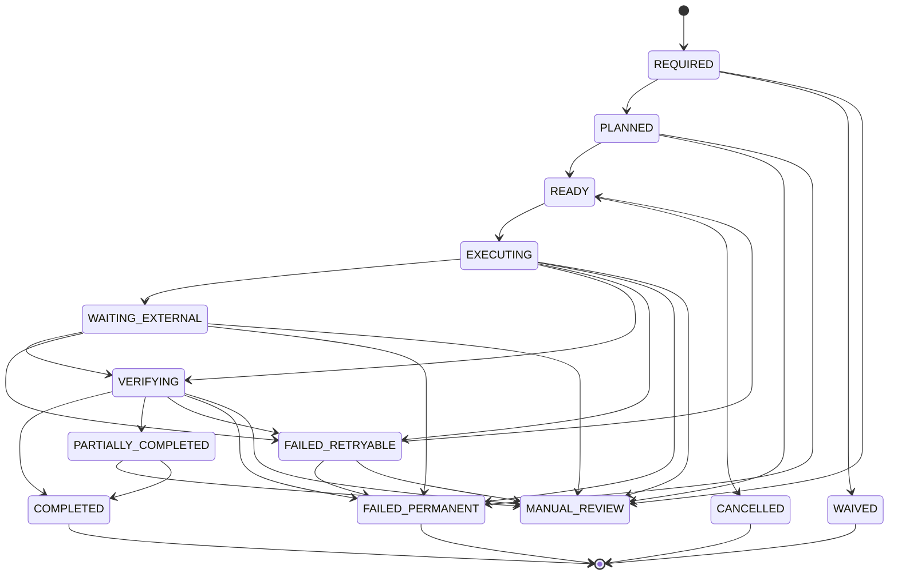

---

# Compensation Planning

Compensation must be planned before execution.

Canonical plan:

```yaml
compensation_plan:
  compensation_plan_id:
  build_id:
  trigger:
  source_failure_id:
  source_cancellation_id:
  scope:
  side_effects:
  actions:
  dependency_graph:
  execution_order:
  required_authorities:
  blocking:
  rollback_dependency:
  created_at:
  created_by:
```

---

# Compensation Scope

```yaml
compensation_scopes:
  - OPERATION
  - ATTEMPT
  - TASK
  - BRANCH
  - PHASE
  - BUILD
  - PROVIDER
  - PLATFORM
```

---

# OPERATION Scope

Compensates one low-level side effect.

Example:

* release one reservation.

---

# ATTEMPT Scope

Compensates effects produced by one Task Attempt.

Example:

* cancel provider Task;
* quarantine output;
* release Attempt-specific reservations.

---

# TASK Scope

Compensates all unresolved effects of a Task.

---

# BRANCH Scope

Compensates an abandoned execution branch while preserving the selected fallback branch.

---

# PHASE Scope

Compensates effects produced by an invalidated production phase.

---

# BUILD Scope

Compensates all unfinished or disallowed effects before Build cancellation, rollback, or terminal failure.

---

# PROVIDER Scope

Compensates duplicate or erroneous Tasks across one provider incident.

---

# PLATFORM Scope

Used for shared infrastructure defects.

Examples:

* revoke leaked credential;
* invalidate shared cache;
* release global outage reservations.

---

# Compensation Dependency Graph

Compensation Actions may depend on one another.

Example:

```text
Stop Downstream Packaging
        │
        ▼
Revoke Package
        │
        ▼
Quarantine Invalid Master
        │
        ▼
Release Storage Reservation
```

The Compensation Graph must be acyclic.

---

# Reverse Dependency Ordering

Compensation typically executes in reverse dependency order.

Forward execution:

```text
Generate
→ Validate
→ Compose
→ Package
→ Publish
```

Compensation:

```text
Unpublish or Revoke
→ Revoke Package
→ Quarantine Composition
→ Invalidate Validation Result
→ Preserve Source Generation Evidence
```

Not every forward action requires a compensating reverse action.

---

# Compensation Ordering Rules

Recommended ordering:

```text
1. Stop New Downstream Effects
2. Cancel Pending External Work
3. Revoke Publication Eligibility
4. Quarantine Invalid Outputs
5. Remove Stale Queue and Dispatch Intents
6. Release Active Leases
7. Release Resource Reservations
8. Release Budget Reservations
9. Reconcile Actual Cost
10. Persist Final Compensation State
```

---

# Stop-the-World vs Scoped Compensation

## Scoped Compensation

Preferred default.

Only affected Tasks, branches, artifacts, and resources are blocked.

## Build-Wide Compensation

Required when:

* Build cancellation occurs;
* security incident affects all outputs;
* Execution Plan becomes invalid;
* Manifest integrity cannot be trusted;
* publication approval is globally revoked.

---

# Compensation Policy

Canonical policy:

```yaml
compensation_policy:
  policy_id:
  applies_to:
    operation_type:
    task_type:
    failure_class:
    cancellation_type:
    provider:
  compensation_type:
  required:
  blocking:
  authority_required:
  timeout:
  retry_policy:
  verification_policy:
```

---

# Compensation Policy Resolution

Recommended precedence:

```text
1. Exact Operation + Provider + Failure Class
2. Task Type + Failure Class
3. Compensation Class + Failure Class
4. Build Profile Policy
5. Global Default
```

Unknown compensation requirements fail closed to manual review.

---

# Compensation Idempotency

Every Compensation Action must be idempotent.

Recommended key:

```text
compensation_idempotency_key =
sha256(
  source_side_effect_id
  + compensation_type
  + target_reference
  + compensation_generation
)
```

Repeated execution must not create contradictory outcomes.

---

# Compensation Generation

A new Compensation Generation is required when:

* previous compensation failed ambiguously;
* target state changed materially;
* provider returned a different external identity;
* operator authorized a modified compensation strategy.

---

# Compensation Execution Contract

```python
class CompensationExecutor:
    def execute(
        self,
        action: "CompensationAction",
        context: "CompensationContext"
    ) -> "CompensationResult":
        ...
```

---

# Compensation Preconditions

```yaml
compensation_preconditions:
  source_side_effect_exists: true
  compensation_policy_valid: true
  target_identity_verified: true
  authorization_valid: true
  idempotency_record_valid: true
  state_allows_compensation: true
  conflicting_compensation_absent: true
```

---

# Compensation Result

```yaml
compensation_result:
  compensation_action_id:
  outcome:
  target_state:
  external_reference:
  irreversible_effects:
  remaining_risk:
  actual_cost:
  evidence:
  completed_at:
```

Possible outcomes:

```yaml
compensation_outcomes:
  - COMPLETED
  - PARTIALLY_COMPLETED
  - NOT_NEEDED
  - ALREADY_COMPENSATED
  - FAILED_RETRYABLE
  - FAILED_PERMANENT
  - MANUAL_REVIEW
  - IRREVERSIBLE_RECORDED
```

---

# Compensation Verification

A Compensation Action is complete only after verification.

Examples:

## Provider Cancellation

Verify provider state is:

* `CANCELLED`;
* terminal failure;
* or conclusively non-cancellable with preserved evidence.

## Reservation Release

Verify available capacity or budget is restored.

## Artifact Quarantine

Verify:

* artifact remains stored;
* lifecycle state is `QUARANTINED`;
* downstream eligibility is removed.

## Queue Removal

Verify no active duplicate remains.

---

# Compensation Verifier Interface

```python
class CompensationVerifier:
    def verify(
        self,
        action: "CompensationAction",
        result: "CompensationResult"
    ) -> "CompensationVerification":
        ...
```

---

# Mandatory Compensation

Mandatory compensation must complete before:

* retry;
* fallback activation;
* partial rebuild;
* rollback;
* Build cancellation completion;
* resource release confirmation;
* terminal failure finalization.

Examples:

* duplicate provider Task cancellation;
* invalid output quarantine;
* stale Queue removal;
* release of exclusive Build Lock.

---

# Non-Blocking Compensation

Some compensation may continue asynchronously.

Examples:

* cost reconciliation;
* archival cleanup;
* delayed provider cancellation monitoring;
* noncritical temporary-file cleanup.

Non-blocking compensation must still be tracked to a terminal outcome.

---

# Failed Compensation

A failed Compensation Action may produce:

```yaml
failed_compensation_actions:
  - RETRY_COMPENSATION
  - MANUAL_REVIEW
  - RECORD_IRREVERSIBLE_EFFECT
  - FAIL_BUILD
  - SECURITY_INCIDENT
  - GOVERNANCE_ESCALATION
```

---

# Compensation Retry

Compensation retry uses the failure model defined in Section 6.3.13.

It requires:

* classified compensation failure;
* idempotency;
* attempt limit;
* backoff;
* external-state reconciliation.

A failed cancellation must not immediately submit another forward provider Task.

---

# Compensation Waiver

An authorized authority may waive compensation only when:

* policy permits;
* remaining risk is documented;
* cost impact is accepted;
* downstream use remains safe;
* no security or integrity requirement is violated.

Canonical record:

```yaml
compensation_waiver:
  waiver_id:
  compensation_requirement_id:
  authority:
  reason:
  residual_risk:
  expires_at:
  approved_at:
```

Security-critical compensation may not be waived.

---

# Irreversible Effect Record

When an effect cannot be reversed:

```yaml
irreversible_effect:
  side_effect_id:
  effect_type:
  target_system:
  occurred_at:
  incurred_cost:
  external_visibility:
  containment_actions:
  residual_risk:
  accepted_by:
  recorded_at:
```

The platform must never mark an irreversible effect as compensated when only containment occurred.

---

# Artifact Quarantine

Quarantine prevents an artifact from participating in:

* cache reuse;
* composition;
* packaging;
* approval;
* publication;
* fallback resolution.

Canonical record:

```yaml
artifact_quarantine:
  artifact_id:
  object_hash:
  quarantine_reason:
  source_failure_id:
  quarantined_at:
  quarantined_by:
  release_conditions:
```

---

# Quarantine Semantics

Quarantine does not delete the artifact.

It preserves:

* evidence;
* provider provenance;
* cost;
* debugging value;
* audit history.

---

# Artifact Supersession

A valid replacement artifact supersedes a prior artifact.

```yaml
artifact_supersession:
  superseded_artifact_id:
  replacement_artifact_id:
  reason:
  scope:
  approved_by:
  superseded_at:
```

The prior artifact remains immutable.

---

# Supersession Rules

A superseded artifact:

* remains retrievable for audit;
* cannot satisfy current artifact dependencies;
* cannot be reused by cache selection;
* cannot be packaged or published;
* may remain referenced by historical Manifests.

---

# Cache Compensation

When an artifact or Task Result becomes invalid:

```text
Invalidate Cache Index Entry
↓
Preserve CAS Object
↓
Mark Object Ineligible
↓
Reevaluate Dependent Builds
```

Physical CAS deletion is governed by lifecycle policy.

---

# Queue Compensation

Queue compensation includes:

* remove stale Queue item;
* cancel delayed Retry item;
* invalidate Provider Monitor item;
* remove Task item from incorrect Queue;
* preserve Queue history.

A Queue item may not be deleted without reconciling Task State.

---

# Lease Compensation

On cancellation, Worker loss, or rollback:

* revoke lease;
* stop renewal;
* reconcile side effects;
* release Worker capacity;
* append lease history.

Lease release does not prove operation cancellation.

---

# Reservation Compensation

Reservation compensation handles:

* provider capacity;
* Worker Pool slot;
* CPU;
* memory;
* disk;
* network;
* budget.

Release must be idempotent.

---

# Provider Compensation

Provider compensation may include:

```yaml
provider_compensation_actions:
  - CANCEL_ACTIVE_TASK
  - CANCEL_DUPLICATE_TASK
  - STOP_POLLING_AFTER_TERMINAL
  - REFRESH_ARTIFACT_REFERENCE
  - QUARANTINE_COMPLETED_OUTPUT
  - RECORD_NON_REFUNDABLE_COST
```

---

# Provider Cancellation Limitation

If provider cancellation is unsupported:

```text
Record Non-Cancellable State
↓
Continue Monitoring
↓
Prevent Downstream Use
↓
Quarantine Result
↓
Reconcile Cost
```

The Build may still complete cancellation while asynchronous cleanup remains tracked separately, depending on policy.

---

# Provider Duplicate Compensation

When duplicate provider Tasks exist:

1. identify canonical provider Task;
2. cancel duplicates where possible;
3. preserve all provider IDs;
4. preserve all cost;
5. quarantine duplicate outputs;
6. record incident;
7. continue only with canonical output.

---

# Download Compensation

For interrupted download:

* stop transfer;
* close file handle;
* preserve resume metadata if safe;
* delete or quarantine partial file;
* release storage reservation;
* expire signed URL reference where appropriate.

---

# Composition Compensation

For failed composition:

* terminate FFmpeg process;
* quarantine partial output;
* preserve source assets;
* release CPU, memory, disk;
* invalidate derived validation results;
* remove packaging eligibility.

Upstream validated artifacts should not be invalidated unless composition failure proves they are defective.

---

# Packaging Compensation

For invalid package:

* mark package revoked;
* quarantine archive;
* invalidate checksum bundle;
* preserve component outputs;
* prevent publication;
* regenerate package if policy permits.

---

# Publication Compensation

Publication may be:

```yaml
publication_reversibility:
  - REVERSIBLE
  - PARTIALLY_REVERSIBLE
  - IRREVERSIBLE
```

Examples:

## Reversible

* scheduled but not yet published;
* draft upload;
* private unpublished asset.

## Partially Reversible

* public post that can be deleted but may have been copied;
* public video that can be made private.

## Irreversible

* third-party syndication;
* external notification already delivered;
* indexed or cached public content.

---

# Publication Compensation Actions

```yaml
publication_compensation_actions:
  - CANCEL_SCHEDULE
  - DELETE_DRAFT
  - UNPUBLISH
  - MAKE_PRIVATE
  - REVOKE_PACKAGE
  - PUBLISH_CORRECTION
  - UPDATE_METADATA
  - RECORD_IRREVERSIBLE_DISTRIBUTION
```

Publication compensation requires explicit authority.

---

# Approval Compensation

An approval may need to be invalidated when:

* subject hash changes;
* artifact is superseded;
* rollback selects an earlier artifact;
* policy version changes;
* scope changes.

The approval record remains preserved but its active status changes.

---

# Rollback Definition

Rollback is an authorized operation that selects a prior valid runtime or artifact basis and continues through a new authoritative recovery path.

Canonical rollback request:

```yaml
rollback_request:
  rollback_request_id:
  build_id:
  execution_generation:
  rollback_type:
  target_reference:
  requested_by:
  reason:
  requested_at:
  authority:
  dry_run:
```

---

# Rollback Types

```yaml
rollback_types:
  - MANIFEST_ROLLBACK
  - CHECKPOINT_ROLLBACK
  - ARTIFACT_ROLLBACK
  - CONFIGURATION_ROLLBACK
  - PROVIDER_ADAPTER_ROLLBACK
  - PHASE_ROLLBACK
  - RELEASE_ROLLBACK
  - MIGRATION_ROLLBACK
```

---

# Manifest Rollback

Uses an earlier valid Manifest Version as a recovery basis.

It does not replace the current Manifest.

Required flow:

```text
Select Prior Valid Manifest
↓
Analyze Later Side Effects
↓
Compensate or Preserve Them
↓
Create New Recovery Manifest Version
↓
Continue
```

---

# Checkpoint Rollback

Uses an earlier published Checkpoint.

Required when:

* latest Checkpoint is valid but semantically unsuitable;
* recent runtime state is corrupted;
* migration must be reversed;
* operator selects prior recovery basis.

---

# Artifact Rollback

Selects an earlier approved artifact version.

Example:

* restore previous narration;
* restore prior composition;
* restore earlier storyboard frame.

Artifact rollback invalidates approvals tied to the replaced artifact unless policy says otherwise.

---

# Configuration Rollback

Restores a previous configuration version.

Allowed only when:

* runtime compatibility is verified;
* active Tasks are reconciled;
* no semantic Task Definition conflict exists;
* secrets remain valid.

---

# Provider Adapter Rollback

Restores a prior adapter version.

Requires:

* compatibility with active Provider Task Records;
* request and state-mapping compatibility;
* migration or dual-adapter support;
* explicit operational approval.

---

# Phase Rollback

Returns execution to a prior phase boundary.

Examples:

* packaging to composition;
* composition to validation;
* validation to generation.

Phase rollback must identify which outputs become superseded.

---

# Release Rollback

Reverts a published or packaged release where possible.

This may require publication compensation.

---

# Migration Rollback

Restores a pre-migration runtime basis.

Requires a `PRE_MIGRATION` Checkpoint.

---

# Rollback Preconditions

```yaml
rollback_preconditions:
  target_exists: true
  target_integrity_valid: true
  target_compatible: true
  authority_valid: true
  later_side_effects_identified: true
  compensation_plan_available: true
  execution_plan_compatibility_valid: true
  provider_state_reconciled: true
  artifact_state_reconciled: true
  budget_impact_accepted: true
```

---

# Rollback Is Not History Rewriting

After rollback:

* current history remains;
* later provider Tasks remain recorded;
* later cost remains recorded;
* superseded artifacts remain recorded;
* new Manifest Version references rollback basis;
* new recovery or execution generation may be required.

---

# Rollback Execution Generation

A new execution generation is required when rollback changes:

* Task Definitions;
* provider semantics;
* prompt content;
* approved execution graph;
* artifact identity assumptions;
* quality policy;
* approval scope.

A rollback within the same generation is allowed only when runtime semantics remain unchanged.

---

# Rollback Plan

Canonical schema:

```yaml
rollback_plan:
  rollback_plan_id:
  build_id:
  source_manifest_version:
  target_reference:
  rollback_type:
  compatibility_result:
  affected_tasks:
  affected_artifacts:
  affected_provider_tasks:
  compensation_plan_id:
  new_execution_generation_required:
  approvals_invalidated:
  cost_impact:
  recovery_target_state:
  created_at:
```

---

# Rollback Compatibility

Compatibility outcomes:

```yaml
rollback_compatibility:
  - COMPATIBLE
  - COMPATIBLE_WITH_COMPENSATION
  - REQUIRES_NEW_EXECUTION_GENERATION
  - MANUAL_REVIEW_REQUIRED
  - INCOMPATIBLE
```

---

# Rollback Impact Analysis

The Rollback Planner must calculate:

* Tasks completed after target basis;
* provider Tasks created after target basis;
* artifacts created after target basis;
* approvals granted after target basis;
* cost incurred after target basis;
* Queue items and retries created after target basis;
* downstream publications;
* security state changes.

---

# Rollback Dependency Closure

If an artifact is rolled back, all dependent outputs must be evaluated.

Example:

```text
Narration Rolled Back
↓
Subtitle Timing Invalidated
↓
Composition Invalidated
↓
Packaging Invalidated
↓
Publication Package Revoked
```

The rollback scope follows dependency closure.

---

# Rollback Target State

Possible Build target states:

```yaml
rollback_target_states:
  - READY
  - RUNNING
  - VALIDATING
  - COMPOSING
  - PACKAGING
  - AWAITING_APPROVAL
  - MANUAL_REVIEW
  - RECOVERABLE
  - FAILED
```

The target must correspond to the earliest invalidated phase.

---

# Rollback Approval Invalidation

Approvals tied to:

* Manifest hash;
* artifact hash;
* package hash;
* Execution Plan version;
* publication release

must be invalidated when their subject is rolled back or superseded.

---

# Rollback Cost Model

Rollback cost includes:

```yaml
rollback_cost:
  sunk_provider_cost:
  compensation_cost:
  rebuild_cost:
  storage_cost:
  publication_correction_cost:
  estimated_total:
  currency:
```

Rollback authorization may require cost approval.

---

# Rollback Dry Run

A rollback should support dry-run analysis.

```yaml
rollback_dry_run:
  safe:
  target_reference:
  affected_tasks:
  affected_artifacts:
  provider_tasks_to_cancel:
  artifacts_to_quarantine:
  approvals_to_invalidate:
  packages_to_revoke:
  estimated_cost:
  new_execution_generation_required:
  required_authorities:
  predicted_target_state:
```

---

# Rollback Operation Record

```yaml
rollback_operation:
  rollback_operation_id:
  rollback_request_id:
  rollback_plan_id:
  state:
  source_manifest_version:
  target_reference:
  compensation_plan_id:
  resulting_manifest_version:
  resulting_execution_generation:
  target_build_state:
  started_at:
  completed_at:
  failure:
```

---

# Rollback Operation States

```yaml
rollback_operation_states:
  - REQUESTED
  - ANALYZING
  - AWAITING_APPROVAL
  - COMPENSATING
  - APPLYING
  - VERIFYING
  - COMPLETED
  - PARTIALLY_COMPLETED
  - MANUAL_REVIEW
  - FAILED
  - REJECTED
```

---

# Rollback State Machine

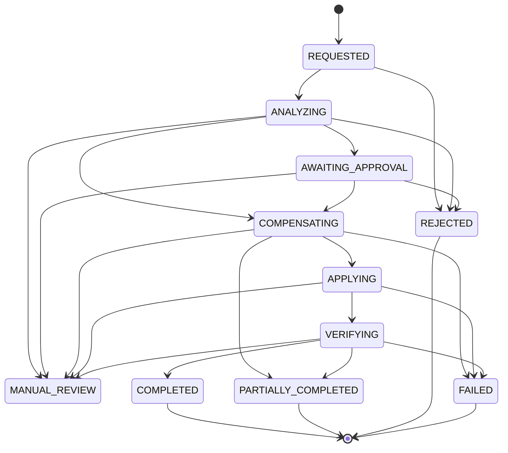

---

# Rollback Transaction Boundary

Rollback must coordinate:

* compensation state;
* Manifest recovery mutation;
* Task invalidation or supersession;
* artifact supersession;
* approval invalidation;
* Queue reconstruction;
* provider-state preservation;
* cost reconciliation;
* Build State transition;
* events and audit records.

---

# Rollback Idempotency

Recommended key:

```text
rollback_idempotency_key =
sha256(
  build_id
  + source_manifest_version
  + rollback_type
  + target_reference
)
```

Repeated rollback requests must return the existing operation.

---

# Rollback Verification

Rollback is complete only when:

* target basis integrity is valid;
* mandatory compensation completed;
* affected artifacts are quarantined or superseded;
* invalid approvals are inactive;
* stale Queue items are removed;
* new Queue intents are reconstructed;
* resulting Manifest is valid;
* Build State matches target state;
* no uncontrolled provider Task remains untracked.

---

# Partial Rollback

Partial rollback is permitted for isolated branches or phases when:

* dependency closure is known;
* unaffected outputs remain valid;
* artifact provenance is preserved;
* no shared mutable state is corrupted.

Partial rollback should be preferred over full Build rollback where safe.

---

# Build Cancellation Compensation

Canonical flow:

```text
Build → CANCELLING
↓
Stop New Dispatch
↓
Create Compensation Plan
↓
Cancel Provider Tasks
↓
Revoke Queue Intents
↓
Release Leases and Reservations
↓
Quarantine Partial Outputs
↓
Reconcile Cost
↓
Verify Remaining External Effects
↓
Build → CANCELLED
```

---

# Build Failure Compensation

For terminal Build failure:

* stop new work;
* cancel avoidable external work;
* preserve recoverable outputs;
* quarantine invalid outputs;
* release reservations;
* reconcile cost;
* create final failed Manifest;
* preserve latest recovery Checkpoint.

---

# Retry Compensation Integration

Before retry:

```text
Failure Classified
↓
Compensation Required?
├── No → Retry Evaluation
└── Yes
      ↓
   Execute Compensation
      ↓
   Verify Compensation
      ↓
   Retry Evaluation
```

---

# Resume Compensation Integration

During resume, compensation may be required for:

* stale Queue items;
* expired leases;
* duplicate provider Tasks;
* missing artifact references;
* invalid reservations;
* obsolete approval state.

Resume must complete required compensation before dispatch resumes.

---

# Compensation and Backpressure

Large compensation backlogs may trigger:

* suspension of new provider submissions;
* reduced Scheduler capacity;
* priority for Control Workers;
* Build-level waiting;
* incident alert.

Compensation work must not be starved by ordinary rendering.

---

# Compensation Queue

A dedicated logical Queue may be used.

```yaml
compensation_queue:
  queue_class: CONTROL
  priority: high
  durable: true
  idempotent_consumers: true
```

Security or cancellation compensation receives highest precedence.

---

# Compensation Worker Model

Compensation may execute through:

* Control Workers;
* Provider Coordination Workers;
* Artifact Management Workers;
* Publication Workers;
* authorized human review.

Ordinary generation Workers should not automatically execute governance-sensitive compensation.

---

# Compensation Authority

Authority requirements depend on action.

| Compensation Action         | Required Authority        |
| --------------------------- | ------------------------- |
| Release expired reservation | System                    |
| Remove stale Queue item     | System                    |
| Cancel provider Task        | System or operator policy |
| Quarantine invalid artifact | System                    |
| Supersede approved artifact | Approval authority        |
| Revoke package              | Release authority         |
| Unpublish public content    | Publication authority     |
| Waive failed compensation   | Governance authority      |
| Accept irreversible effect  | Governance authority      |

---

# Compensation Event Model

Required events:

```text
compensation.required
compensation.plan_created
compensation.action_ready
compensation.action_started
compensation.waiting_external
compensation.action_completed
compensation.action_failed
compensation.partially_completed
compensation.waived
compensation.plan_completed
compensation.plan_failed
```

---

# Rollback Event Model

Required events:

```text
rollback.requested
rollback.analysis_started
rollback.plan_created
rollback.approval_requested
rollback.compensation_started
rollback.applying
rollback.verified
rollback.completed
rollback.partially_completed
rollback.manual_review_required
rollback.failed
rollback.rejected
```

---

# Compensation Metrics

```yaml
compensation_metrics:
  requirements_created:
  plans_created:
  actions_started:
  actions_completed:
  actions_failed:
  actions_partially_completed:
  compensation_duration_seconds:
  compensation_retry_count:
  compensation_backlog:
  provider_tasks_cancelled:
  artifacts_quarantined:
  reservations_released:
  irreversible_effect_count:
  unrecovered_cost:
```

---

# Rollback Metrics

```yaml
rollback_metrics:
  rollback_requests:
  rollback_dry_runs:
  rollback_approved:
  rollback_rejected:
  rollback_completed:
  rollback_failed:
  rollback_duration_seconds:
  tasks_invalidated:
  artifacts_superseded:
  approvals_invalidated:
  packages_revoked:
  rollback_cost:
  new_execution_generations:
```

---

# Compensation Success Rate

```text
compensation_success_rate =
completed mandatory compensation actions
/
all terminal mandatory compensation actions
```

---

# Compensation Latency

```text
compensation_latency =
completed_at
-
required_at
```

Security and cancellation compensation should have stricter SLOs.

---

# Residual Risk Metric

```yaml
residual_risk:
  uncompensated_effects:
  irreversible_effects:
  unresolved_provider_tasks:
  invalid_outputs_not_quarantined:
  stale_publications:
```

A Build may not reach a clean terminal state when blocking residual risk remains.

---

# Compensation Explanation

```yaml
compensation_explanation:
  trigger:
  side_effects_detected:
  actions_required:
  actions_completed:
  actions_failed:
  irreversible_effects:
  residual_risk:
  next_action:
```

---

# Rollback Explanation

```yaml
rollback_explanation:
  source_state:
  target_basis:
  compatibility:
  affected_tasks:
  compensation_required:
  artifacts_superseded:
  approvals_invalidated:
  provider_tasks_preserved:
  cost_impact:
  resulting_state:
```

---

# Public Interfaces

```python
class CompensationCoordinator:
    def analyze(
        self,
        trigger: "CompensationTrigger",
        context: "CompensationContext"
    ) -> "CompensationRequirementSet":
        ...

    def plan(
        self,
        requirements: "CompensationRequirementSet"
    ) -> "CompensationPlan":
        ...

    def execute(
        self,
        plan_id: str
    ) -> "CompensationPlanResult":
        ...

    def verify(
        self,
        plan_id: str
    ) -> "CompensationVerificationResult":
        ...
```

---

# Side-Effect Registry Interface

```python
class SideEffectRegistry:
    def register(
        self,
        side_effect: "SideEffectRecord"
    ) -> None:
        ...

    def by_task(
        self,
        build_id: str,
        task_id: str,
        attempt_number: int
    ) -> list["SideEffectRecord"]:
        ...

    def mark_compensated(
        self,
        side_effect_id: str,
        compensation_action_id: str
    ) -> None:
        ...
```

---

# Rollback Planner Interface

```python
class RollbackPlanner:
    def dry_run(
        self,
        request: "RollbackRequest"
    ) -> "RollbackDryRun":
        ...

    def plan(
        self,
        request: "RollbackRequest"
    ) -> "RollbackPlan":
        ...
```

---

# Rollback Executor Interface

```python
class RollbackExecutor:
    def execute(
        self,
        plan: "RollbackPlan"
    ) -> "RollbackResult":
        ...

    def verify(
        self,
        rollback_operation_id: str
    ) -> "RollbackVerification":
        ...
```

---

# Rollback Compatibility Interface

```python
class RollbackCompatibilityValidator:
    def validate(
        self,
        source_manifest: "RuntimeManifest",
        target_reference: "RollbackTarget",
        context: "RollbackContext"
    ) -> "RollbackCompatibilityResult":
        ...
```

---

# Artifact Supersession Interface

```python
class ArtifactSupersessionManager:
    def supersede(
        self,
        old_artifact_id: str,
        replacement_artifact_id: str,
        reason: str,
        authority: str
    ) -> "ArtifactSupersessionResult":
        ...
```

---

# Reference Configuration

```yaml
orchestrator:
  compensation:
    enabled: true
    fail_closed_on_unknown: true
    require_side_effect_registration: true
    require_idempotency: true
    verify_every_action: true
    block_retry_until_required_compensation: true

    concurrency:
      global: 4
      provider: 2
      publication: 1

    timeouts:
      provider_cancellation_seconds: 300
      queue_cleanup_seconds: 60
      artifact_quarantine_seconds: 120
      reservation_release_seconds: 30

    retry:
      maximum_attempts: 3
      strategy: EXPONENTIAL_WITH_JITTER
      base_delay_seconds: 15
      maximum_delay_seconds: 300

    priorities:
      security: 100
      build_cancellation: 90
      provider_duplicate: 80
      retry_blocking: 70
      cleanup: 30

  rollback:
    enabled: true
    dry_run_required: true
    require_authority: true
    require_compensation_plan: true
    preserve_later_history: true
    allow_history_rewrite: false
    create_pre_rollback_snapshot: true
    verify_target_integrity: true
    require_new_generation_on_semantic_change: true
```

---

# Deployment Profiles

## Local Development

Recommended:

* filesystem and SQLite compensation records;
* deterministic cleanup;
* rollback dry-run enabled;
* physical deletion allowed only for temporary files;
* no silent Manifest replacement.

---

## GitHub Actions

Requirements:

* compensation state stored outside runner memory;
* provider cancellation survives workflow termination;
* expired local Worker leases are reconciled;
* rollback starts from persistent Checkpoint or Manifest;
* long-running compensation may continue in a separate workflow.

---

## Distributed Production

Requirements:

* durable Compensation Queue;
* distributed compensation locks;
* provider and publication adapters;
* shared Side-Effect Registry;
* auditable rollback authority;
* atomic or recoverable Manifest transitions;
* circuit breakers for failing compensation systems.

---

# Security Requirements

The subsystem must enforce:

* authorized rollback;
* authorized publication compensation;
* immutable side-effect history;
* protected provider identifiers;
* signed URL redaction;
* secret exclusion;
* restricted access to irreversible-effect records;
* approval for compensation waiver;
* tamper-evident compensation evidence;
* cross-Build isolation.

---

# Dangerous Compensation Operations

Operations such as:

* external deletion;
* unpublication;
* credential revocation;
* remote provider cancellation;
* release rollback

must require:

* exact target identity;
* expected state;
* authority validation;
* idempotency;
* audit record;
* post-action verification.

Wildcard or broad-scope destructive operations are prohibited.

---

# Testing Requirements

## Unit Tests

* reversibility classification;
* Compensation Requirement creation;
* policy resolution;
* deterministic Compensation Action ID;
* idempotency-key generation;
* dependency-order calculation;
* reverse-order execution;
* blocking compensation behavior;
* waiver validation;
* irreversible-effect recording;
* rollback compatibility;
* execution-generation decision;
* approval invalidation;
* dependency closure.

## Integration Tests

* provider cancellation;
* duplicate provider Task compensation;
* Queue item cleanup;
* Worker lease release;
* budget reservation release;
* partial download cleanup;
* artifact quarantine;
* composition supersession;
* package revocation;
* Build cancellation compensation;
* retry blocked until compensation completes;
* resume compensation;
* Checkpoint rollback;
* artifact rollback;
* phase rollback.

## Concurrency Tests

* compensation and provider completion race;
* compensation and retry activation race;
* duplicate compensation requests;
* rollback concurrent with Task success;
* rollback concurrent with cancellation;
* Queue cleanup concurrent with Worker lease;
* artifact supersession concurrent with packaging;
* approval revocation concurrent with rollback.

## Failure Tests

* provider cancellation fails;
* reservation release fails;
* artifact quarantine fails;
* Queue backend unavailable;
* publication unpublish fails;
* compensation verifier disagrees with executor;
* irreversible effect discovered after partial compensation.

## Rollback Tests

* rollback to latest Checkpoint;
* rollback to older Checkpoint;
* rollback with later provider Tasks;
* rollback requiring new execution generation;
* rollback with invalid target hash;
* rollback with missing artifact;
* rollback with expired approval;
* rollback with publication side effects;
* rollback dry-run only;
* rollback rejection.

## Crash Tests

* crash during Compensation Plan creation;
* crash after provider cancellation before persistence;
* crash after artifact quarantine before Manifest update;
* crash during rollback compensation;
* crash after rollback Manifest mutation before Queue reconstruction;
* crash during rollback verification.

## Security Tests

* unauthorized rollback;
* unauthorized unpublish;
* unauthorized compensation waiver;
* wildcard deletion attempt;
* wrong provider Task target;
* secret in compensation evidence;
* cross-Build artifact supersession;
* historical compensation mutation.

## Performance Tests

* compensation for 100 active Tasks;
* cancellation of 100 provider Tasks;
* rollback impact analysis for 1,000 Tasks;
* dependency closure for large graphs;
* artifact supersession across multiple phases;
* concurrent Build compensation.

---

# Compensation & Rollback Quality Gate

```yaml
compensation_rollback_quality_gate:
  every_external_side_effect_registered: true
  every_compensation_action_policy_bound: true
  every_compensation_action_idempotent: true
  every_mandatory_compensation_verified: true
  no_retry_before_required_compensation: true
  no_rollback_rewrites_history: true
  every_rollback_target_integrity_verified: true
  every_later_side_effect_analyzed: true
  every_invalid_artifact_quarantined_or_superseded: true
  every_invalid_approval_deactivated: true
  every_stale_queue_item_reconciled: true
  every_reservation_released_or_recorded: true
  every_irreversible_effect_recorded: true
  provider_cancellation_race_test_passed: true
  build_cancellation_compensation_test_passed: true
  rollback_dry_run_test_passed: true
  rollback_crash_recovery_test_passed: true
  unauthorized_rollback_test_passed: true
  final_residual_risk_reported: true
```

---

# Architectural Invariants

## Invariant CB-301

Compensation creates new authoritative state and never erases the original side effect.

## Invariant CB-302

Every potentially compensatable external side effect is registered before or immediately after creation.

## Invariant CB-303

Mandatory compensation completes before retry, fallback, rollback, or clean terminal completion.

## Invariant CB-304

Every Compensation Action is idempotent, policy-bound, persisted, and verifiable.

## Invariant CB-305

Irreversible cost, publication, provider, and external effects remain recorded permanently.

## Invariant CB-306

Rollback never rewrites Manifest, Task, Provider, Artifact, Approval, Failure, or Cost history.

## Invariant CB-307

A rollback target must be integrity-valid and runtime-compatible.

## Invariant CB-308

Semantic rollback requires a new execution generation.

## Invariant CB-309

Artifacts invalidated by compensation or rollback are quarantined or superseded before downstream execution continues.

## Invariant CB-310

A Build cannot enter a clean terminal or resumed state while blocking residual side effects remain unresolved.

---

# Architectural Decision Records

| ADR     | Decision                                                                                                                                |
| ------- | --------------------------------------------------------------------------------------------------------------------------------------- |
| ADR-931 | Compensation is modeled as explicit forward recovery rather than deletion or history reversal.                                          |
| ADR-932 | Every external side effect is registered with reversibility, compensation policy, identity, and evidence.                               |
| ADR-933 | Mandatory compensation blocks retry, fallback, rollback, and terminal completion until verified.                                        |
| ADR-934 | Artifacts are quarantined or superseded rather than silently deleted from authoritative history.                                        |
| ADR-935 | Irreversible provider cost, publication effects, and external visibility remain preserved as accountability evidence.                   |
| ADR-936 | Compensation executes through a dependency-aware plan, typically in reverse forward-execution order.                                    |
| ADR-937 | Rollback selects an earlier valid basis but appends new Manifest and runtime history.                                                   |
| ADR-938 | Rollback impact analysis includes later Tasks, provider jobs, artifacts, approvals, Queues, publications, and cost.                     |
| ADR-939 | Semantic rollback requires a new execution generation rather than mutation of the current Task Definition graph.                        |
| ADR-940 | Every rollback and governance-sensitive compensation action is authority-controlled, auditable, idempotent, and independently verified. |

---

# Acceptance Criteria

Section **6.3.14** is complete when:

* Compensation, Side Effect, Compensation Requirement, Compensation Action, Compensation Plan, Compensation Result, Rollback Request, Rollback Plan, Rollback Operation, and Rollback Result models are formally defined.
* Compensation and rollback are explicitly distinguished.
* External, resource, coordination, artifact, governance, publication, cost, and security compensation classes are standardized.
* Every compensatable side effect records identity, reversibility, state, cost, evidence, and compensation policy.
* Fully reversible, partially reversible, compensatable, irreversible, and unknown side effects have explicit behavior.
* Compensation planning supports dependency-aware and reverse-order execution.
* Mandatory compensation blocks retry, fallback, rollback, resume, cancellation completion, or terminal-state completion where required.
* Compensation Actions are idempotent, versioned, authorized, persisted, and independently verified.
* Provider cancellation, duplicate provider Tasks, Queue cleanup, lease release, reservation release, download cleanup, artifact quarantine, composition supersession, package revocation, and publication compensation are modeled.
* Irreversible cost and external effects remain preserved.
* Manifest, Checkpoint, Artifact, Configuration, Provider Adapter, Phase, Release, and Migration rollback types are defined.
* Rollback performs compatibility, dependency-closure, compensation, approval-invalidation, cost, and execution-generation analysis.
* Rollback never rewrites historical state.
* Semantic changes require a new execution generation.
* Partial rollback is supported where dependency isolation permits it.
* Events, metrics, authority boundaries, security, interfaces, configuration, deployment profiles, tests, Quality Gates, invariants, and ADRs are sufficiently detailed for Codex to implement safe forward recovery without deleting history, repeating uncompensated side effects, reusing invalid artifacts, silently reversing approvals, losing incurred cost, or restoring runtime state through unsafe mutation.


# Part 6.3.15 — Pause, Cancel & Graceful Shutdown

## Insynergy Cinematic Thought Leadership Platform

### Master Specification v2.1

---

# Purpose

This section defines the canonical **Pause**, **Cancel**, and **Graceful Shutdown** architecture used by the Build Orchestration & Runtime Control Layer.

The subsystem governs how the platform safely transitions from active execution into controlled suspension or termination without:

* losing runtime state;
* duplicating provider operations;
* abandoning Worker leases;
* corrupting Runtime Manifests;
* invalidating Task identity;
* violating idempotency;
* leaking resources;
* leaving provider Tasks unmanaged;
* creating inconsistent Queue state.

The subsystem provides deterministic operational control over Build execution while preserving recoverability, auditability, and institutional accountability.

---

# Governing Principle

The platform adopts the following principle.

> **Execution may stop only at explicitly defined safety boundaries that preserve authoritative runtime state and deterministic recovery paths.**

Stopping execution is not equivalent to killing processes.

Every interruption must preserve:

* Build identity;
* Manifest integrity;
* Task identity;
* provider identity;
* artifact provenance;
* retry history;
* checkpoint consistency;
* audit history.

---

# Operational States

The lifecycle defined in Section 6.3.4 introduces the following interruption states:

```yaml
build_control_states:
  - PAUSING
  - PAUSED
  - RESUMING
  - CANCELLING
  - CANCELLED
```

This section defines the behavior associated with each state.

---

# Operational Boundary

```text
Running Build
      │
      ├── Pause Request
      ├── Cancel Request
      ├── Shutdown Signal
      └── Infrastructure Event
              │
              ▼
Build Control Coordinator
      │
      ├── Dispatch Barrier
      ├── Worker Coordination
      ├── Queue Coordination
      ├── Provider Coordination
      ├── Manifest Persistence
      ├── Checkpoint Manager
      └── Lock Manager
              │
              ▼
Stable Runtime State
```

---

# Responsibilities

The subsystem is responsible for:

* pausing execution;
* cancelling execution;
* graceful shutdown;
* dispatch barriers;
* Worker draining;
* Queue draining;
* provider coordination;
* checkpoint creation;
* Manifest persistence;
* Build Lock release;
* lease reconciliation;
* resource release;
* recovery preparation;
* shutdown verification.

It is not responsible for:

* retry policy;
* scheduling;
* dependency evaluation;
* provider execution;
* artifact validation.

---

# Pause

Pause is an intentional suspension of execution that preserves resumability.

Pause does **not** terminate the Build.

Pause must preserve:

* Task identity;
* completed work;
* provider Tasks;
* retry schedules;
* approvals;
* runtime graph;
* Manifest history.

---

# Pause Workflow

```text
Pause Requested
        │
        ▼
Stop New Dispatch
        │
        ▼
Reach Safe Boundary
        │
        ▼
Create Pause Checkpoint
        │
        ▼
Persist Runtime State
        │
        ▼
Release Nonessential Resources
        │
        ▼
Build → PAUSED
```

---

# Pause Preconditions

```yaml
pause_preconditions:
  build_state_resumable: true
  checkpoint_possible: true
  manifest_integrity_valid: true
  build_lock_owned: true
```

---

# Dispatch Barrier

Immediately after entering `PAUSING`:

* no new Tasks may be dispatched;
* Scheduler must stop producing Dispatch Decisions;
* Queue Manager must reject new execution Queue insertions.

Already executing Tasks may continue to a safe boundary.

---

# Safe Pause Boundary

Examples of acceptable boundaries:

* provider Task ID persisted;
* FFmpeg segment completed;
* artifact written atomically;
* Manifest mutation completed;
* Queue acknowledgement completed.

Unsafe interruption points include:

* partially persisted Manifest;
* provider request transmitted without provider Task ID;
* incomplete CAS registration.

---

# Worker Pause Behavior

Worker Pools respond as follows:

| Worker Pool         | Pause Behavior                                  |
| ------------------- | ----------------------------------------------- |
| Control             | Continue                                        |
| Provider Submission | Finish current submission                       |
| Provider Monitor    | Continue monitoring                             |
| Download            | Finish atomic chunk or suspend safely           |
| Validation          | Finish validator                                |
| FFmpeg              | Finish checkpointable boundary or restart later |
| Packaging           | Finish atomic package step                      |

---

# Provider During Pause

Provider rendering continues unless explicitly cancelled.

The platform records:

* provider Task IDs;
* monitoring schedule;
* expected recovery action.

Pause never assumes provider execution stopped.

---

# Pause Checkpoint

A valid PAUSE Checkpoint is mandatory.

Checkpoint requirements:

```yaml
pause_checkpoint:
  checkpoint_type: PAUSE
  manifest_snapshot: required
  provider_state: required
  queue_state: required
  lease_state: required
```

---

# Pause Verification

Pause completes only after:

* checkpoint published;
* Manifest committed;
* runtime verified;
* Queue state stable;
* Build Lock preserved.

---

# Resume Relationship

Resume behavior is defined in Section 6.3.12.

Pause guarantees:

```text
PAUSED
↓
Resume
↓
No completed Task repeated
```

---

# Cancel

Cancellation intentionally terminates execution.

Cancellation differs from failure.

Cancellation is user-, operator-, or policy-initiated.

---

# Cancellation Goals

Cancellation must:

* stop future execution;
* compensate unfinished work;
* preserve history;
* preserve evidence;
* reconcile provider Tasks;
* release resources;
* create terminal Manifest.

---

# Cancellation Workflow

```text
Cancel Requested
        │
        ▼
Build → CANCELLING
        │
        ▼
Stop Dispatch
        │
        ▼
Stop Scheduling
        │
        ▼
Compensation
        │
        ▼
Provider Cancellation
        │
        ▼
Release Resources
        │
        ▼
Finalize Manifest
        │
        ▼
Build → CANCELLED
```

---

# Cancellation Preconditions

```yaml
cancel_preconditions:
  build_exists: true
  cancellation_authorized: true
```

Cancellation is always permitted for active Builds.

---

# Scheduler During Cancellation

Immediately:

* no new Tasks;
* no retries;
* no fallback activation;
* no provider submission.

Only Control Tasks may continue.

---

# Worker Behavior During Cancellation

Workers:

* finish atomic state writes;
* stop accepting new work;
* compensate where required;
* release leases.

Workers must not silently abandon owned Tasks.

---

# Provider Cancellation

Provider Coordinator determines:

```yaml
provider_cancel:
  supported:
  provider_task_id:
  compensation_required:
```

If provider cancellation is unsupported:

* continue monitoring;
* quarantine output;
* preserve cost.

---

# Queue Cleanup

Cancellation invalidates:

* Ready Queue;
* Retry Queue;
* delayed Queue entries.

Provider Monitor Queue remains active until provider Tasks become terminal.

---

# Lease Release

Every active lease must become:

```yaml
lease_state:
  RELEASED
```

or

```yaml
lease_state:
  RECONCILIATION_REQUIRED
```

---

# Resource Release

Release:

* CPU reservations;
* memory;
* provider slots;
* budget reservations;
* Build Lock.

---

# Final Cancellation Manifest

The final Manifest records:

```yaml
cancelled_build:
  reason:
  completed_tasks:
  cancelled_tasks:
  provider_summary:
  artifacts:
  incurred_cost:
```

History is immutable.

---

# Graceful Shutdown

Graceful Shutdown terminates runtime infrastructure while preserving Build continuity.

Typical causes:

* deployment;
* GitHub Actions timeout;
* operator shutdown;
* maintenance.

---

# Shutdown Goals

Graceful Shutdown must:

* preserve runtime state;
* avoid duplicate provider work;
* avoid duplicate retries;
* preserve leases;
* preserve provider identities;
* prepare deterministic resume.

---

# Shutdown Workflow

```text
Shutdown Requested
        │
        ▼
Scheduler → DRAINING
        │
        ▼
Workers → DRAINING
        │
        ▼
Checkpoint
        │
        ▼
Persist Manifest
        │
        ▼
Release Build Lock
        │
        ▼
Terminate Runtime
```

---

# Worker Draining

Workers:

* reject new leases;
* complete atomic operations;
* checkpoint progress where supported;
* persist results;
* release leases.

---

# Queue Draining

Queue Manager:

* preserves Queue state;
* rejects new enqueue requests;
* completes acknowledgements;
* flushes Outbox.

---

# Provider During Shutdown

Provider rendering continues.

Required actions:

* persist provider identity;
* preserve monitor schedule;
* create recovery metadata.

---

# Build Lock Release

The Build Lock must be released only after:

* Manifest persistence;
* checkpoint publication;
* Worker reconciliation.

Premature release is prohibited.

---

# Forced Shutdown

Forced shutdown occurs when graceful shutdown cannot complete.

Examples:

* SIGKILL;
* infrastructure crash;
* host termination.

Recovery relies on:

* latest Manifest;
* latest Checkpoint;
* reconciliation.

---

# Pause vs Cancel vs Shutdown

| Operation         | Build survives | Resume possible | Compensation     |
| ----------------- | -------------- | --------------- | ---------------- |
| Pause             | Yes            | Yes             | Minimal          |
| Cancel            | No             | No              | Yes              |
| Graceful Shutdown | Yes            | Yes             | Only operational |

---

# Control Priority

Control operations have highest runtime priority.

Order:

```text
Emergency Stop
>
Cancel
>
Pause
>
Shutdown
>
Retry
>
Normal Dispatch
```

---

# Idempotency

Repeated requests:

* Pause
* Cancel
* Shutdown

must return the same operation result.

Example:

```yaml
control_idempotency:
  operation:
  build_id:
  state:
```

---

# Events

Required events:

```text
build.pause_requested
build.pausing
build.paused

build.resume_requested

build.cancel_requested
build.cancelling
build.cancelled

runtime.shutdown_requested
runtime.draining
runtime.shutdown_completed
```

---

# Metrics

Required metrics:

```yaml
control_metrics:
  pause_count:
  cancel_count:
  shutdown_count:
  pause_duration:
  shutdown_duration:
  cancellation_duration:
  active_provider_tasks_at_shutdown:
  incomplete_leases:
```

---

# Public Interfaces

```python
class BuildControlCoordinator:
    def pause(
        self,
        build_id: str
    ) -> PauseResult:
        ...

    def cancel(
        self,
        build_id: str,
        reason: str
    ) -> CancelResult:
        ...

    def shutdown(
        self,
        mode: ShutdownMode
    ) -> ShutdownResult:
        ...
```

---

# Configuration

```yaml
orchestrator:
  control:
    pause_requires_checkpoint: true
    graceful_shutdown_timeout_seconds: 120
    release_build_lock_after_checkpoint: true
    cancel_provider_tasks: true
    preserve_provider_monitoring: true
```

---

# Testing Requirements

## Unit Tests

* Pause transition;
* Cancel transition;
* Shutdown transition;
* duplicate pause;
* duplicate cancel;
* duplicate shutdown.

## Integration Tests

* pause during provider rendering;
* cancel during download;
* shutdown during FFmpeg;
* shutdown with active retries;
* pause/resume correctness.

## Crash Tests

* crash during pause;
* crash during cancellation;
* crash during shutdown;
* provider active after shutdown;
* Queue persistence after shutdown.

---

# Quality Gate

```yaml
pause_cancel_shutdown_quality_gate:
  pause_creates_checkpoint: true
  cancel_compensates_side_effects: true
  shutdown_releases_lock: true
  provider_identity_preserved: true
  no_duplicate_resume: true
  runtime_recoverable: true
```

---

# Architectural Invariants

## Invariant PS-301

Pause never loses completed work.

## Invariant PS-302

Cancellation never deletes history.

## Invariant PS-303

Graceful Shutdown preserves resumability.

## Invariant PS-304

No new dispatch occurs after `PAUSING`.

## Invariant PS-305

No new dispatch occurs after `CANCELLING`.

## Invariant PS-306

Provider identities are preserved across pause, cancellation, and shutdown.

## Invariant PS-307

Every pause creates a valid PAUSE Checkpoint.

## Invariant PS-308

Every cancellation creates a terminal Manifest.

## Invariant PS-309

Shutdown releases Build ownership only after runtime state is durable.

## Invariant PS-310

Control operations are idempotent and auditable.

---

# Architectural Decision Records

| ADR     | Decision                                                                                                                                       |
| ------- | ---------------------------------------------------------------------------------------------------------------------------------------------- |
| ADR-941 | Pause is a resumable operational state requiring a published PAUSE Checkpoint.                                                                 |
| ADR-942 | Cancellation terminates execution through compensation rather than deleting history.                                                           |
| ADR-943 | Graceful Shutdown drains Workers and preserves runtime continuity instead of abruptly terminating execution.                                   |
| ADR-944 | External provider rendering may continue during Pause or Shutdown, provided provider identities and monitoring metadata are durably persisted. |
| ADR-945 | Dispatch barriers prevent new work from starting once Pause or Cancellation begins.                                                            |
| ADR-946 | Build Locks are released only after durable Manifest persistence and checkpoint verification.                                                  |
| ADR-947 | Queue, Worker, and provider state remain reconcilable after interruption.                                                                      |
| ADR-948 | Forced shutdown recovery relies on Manifest and Checkpoint reconciliation rather than transient runtime memory.                                |
| ADR-949 | Pause, Cancel, and Shutdown requests are idempotent operations.                                                                                |
| ADR-950 | Operational control transitions are first-class runtime events subject to full auditability and governance.                                    |

---

# Acceptance Criteria

Section **6.3.15** is complete when:

* Pause, Cancel, and Graceful Shutdown are modeled as distinct operational control flows.
* Dispatch barriers, Worker draining, Queue draining, provider coordination, and Build Lock handling are explicitly defined.
* Pause requires a published PAUSE Checkpoint before entering the `PAUSED` state.
* Cancellation performs required compensation while preserving immutable runtime history.
* Graceful Shutdown preserves resumability through durable Manifest persistence and checkpoint creation.
* Provider tasks, Queue state, Worker leases, retries, and runtime metadata remain recoverable across interruptions.
* Control operations are idempotent, auditable, and prioritized above ordinary execution.
* Events, metrics, interfaces, configuration, testing, Quality Gates, invariants, and ADRs are sufficiently specified for Codex to implement deterministic operational control without duplicate execution, state corruption, or loss of recoverability.


# Part 6.3.16 — Backpressure & Flow Control

## Insynergy Cinematic Thought Leadership Platform

### Master Specification v2.1

---

# Purpose

This section defines the canonical **Backpressure & Flow Control** architecture used by the Build Orchestration & Runtime Control Layer.

The subsystem regulates how work enters, moves through, and exits the runtime pipeline when downstream capacity is constrained.

Its purpose is to prevent:

* Queue overload;
* provider saturation;
* Worker exhaustion;
* memory pressure;
* disk exhaustion;
* network congestion;
* uncontrolled retry amplification;
* excessive in-flight artifacts;
* cost spikes;
* starvation of control operations;
* cascading runtime failure.

Backpressure ensures that upstream components reduce or stop production when downstream components cannot safely absorb additional work.

Flow Control ensures that work continues at a rate compatible with:

* available capacity;
* resource limits;
* provider quotas;
* budget;
* deadlines;
* Quality Gates;
* operational safety.

---

# Governing Principle

The platform adopts the following principle.

> **No stage may produce work faster than the downstream system can safely persist, process, validate, or recover.**

Throughput is not measured solely by how many Tasks can be started.

The platform optimizes for sustainable end-to-end flow.

Starting more provider Tasks is harmful when:

* completed assets cannot be downloaded;
* downloaded media cannot be validated;
* validated assets cannot be composed;
* composition outputs cannot be packaged;
* storage cannot retain intermediate artifacts;
* budget cannot support active work;
* control operations are starved.

---

# Architectural Position

```text
Readiness Evaluation
        │
        ▼
Scheduler
        │
        ▼
Backpressure Controller
        │
        ├── Queue Pressure
        ├── Worker Pressure
        ├── Provider Pressure
        ├── Storage Pressure
        ├── Network Pressure
        ├── Budget Pressure
        ├── Retry Pressure
        ├── Manifest Pressure
        └── Control-Plane Health
        │
        ▼
Flow-Control Decision
        │
        ├── NORMAL
        ├── THROTTLED
        ├── DRAINING
        ├── BLOCKED
        └── EMERGENCY_STOP
```

The Backpressure Controller influences Scheduling, Queue admission, Worker dispatch, provider submission, retry activation, and Build State.

---

# Responsibilities

The subsystem is responsible for:

* measuring pressure across pipeline stages;
* detecting saturation before failure;
* calculating safe admission rates;
* throttling upstream work;
* preserving control-plane capacity;
* preventing Queue growth beyond operational limits;
* limiting concurrent in-flight work;
* coordinating provider submission rates;
* managing download and validation flow;
* preventing storage overflow;
* controlling retry amplification;
* enforcing per-Build and global flow limits;
* applying fairness under constrained capacity;
* gradually releasing throttles after recovery;
* exposing pressure state and root causes;
* emitting operational events and alerts;
* supporting deterministic recovery from pressure conditions.

It is not responsible for:

* changing Task priority semantics;
* deciding whether a Task is valid;
* modifying provider requirements;
* weakening quality thresholds;
* skipping mandatory Tasks;
* cancelling work solely to improve throughput unless policy explicitly authorizes it;
* hiding capacity defects through silent delay.

---

# Backpressure Definition

Backpressure is an explicit runtime signal indicating that one or more downstream capacities are insufficient for the current or projected workload.

Canonical model:

```yaml
backpressure_state:
  backpressure_id:
  scope:
  level:
  source:
  affected_resources:
  affected_queues:
  affected_task_classes:
  active_since:
  observed_metrics:
  admission_policy:
  release_policy:
  next_evaluation_at:
  reason:
```

---

# Backpressure Levels

The platform defines:

```yaml
backpressure_levels:
  - NONE
  - LOW
  - MODERATE
  - HIGH
  - CRITICAL
  - EMERGENCY
```

---

# NONE

The pipeline has sufficient capacity.

Behavior:

* normal scheduling;
* normal Queue admission;
* standard provider submissions;
* normal retries.

---

# LOW

Early capacity pressure exists, but normal execution may continue.

Behavior may include:

* reduced batch size;
* slower provider admission;
* increased monitoring frequency;
* warning metrics.

---

# MODERATE

One or more stages are approaching safe limits.

Behavior:

* throttle noncritical Tasks;
* reduce per-Build concurrency;
* delay optional work;
* reduce provider submission rate;
* preserve critical-path execution.

---

# HIGH

Downstream capacity is materially saturated.

Behavior:

* stop optional work;
* pause selected upstream Task Classes;
* suppress low-priority retries;
* reserve capacity for critical-path and control work;
* possibly move Build to `WAITING`.

---

# CRITICAL

Continued normal flow risks data loss, state inconsistency, cost breach, or cascading failure.

Behavior:

* block new provider submissions;
* block new large downloads;
* preserve monitoring and control operations;
* initiate draining;
* escalate operationally.

---

# EMERGENCY

Immediate action is required to protect platform integrity.

Behavior:

* activate emergency dispatch barrier;
* stop all non-control work;
* preserve Manifest and Checkpoint state;
* cancel or pause safe operations where policy permits;
* move affected Builds to `WAITING`, `PAUSING`, `RECOVERABLE`, or `FAILED`.

---

# Flow-Control Modes

```yaml
flow_control_modes:
  - OPEN
  - LIMITED
  - THROTTLED
  - DRAIN_ONLY
  - CLOSED
  - EMERGENCY_STOP
```

---

# OPEN

Normal work admission.

---

# LIMITED

Admission allowed with reduced concurrency or batch size.

---

# THROTTLED

Admission rate is explicitly constrained.

---

# DRAIN_ONLY

No new ordinary work enters the affected stage.

Existing work may complete or move downstream.

---

# CLOSED

No work enters or exits the affected boundary except control and reconciliation operations.

---

# EMERGENCY_STOP

All nonessential work is halted.

Used only for integrity, security, or infrastructure risk.

---

# Pressure Sources

Canonical pressure sources:

```yaml
pressure_sources:
  - READY_QUEUE
  - RETRY_QUEUE
  - PROVIDER_SUBMISSION_QUEUE
  - PROVIDER_MONITOR_QUEUE
  - DOWNLOAD_QUEUE
  - VALIDATION_QUEUE
  - COMPOSITION_QUEUE
  - PACKAGING_QUEUE
  - WORKER_POOL
  - PROVIDER_QUOTA
  - PROVIDER_RATE_LIMIT
  - STORAGE_CAPACITY
  - STORAGE_IO
  - MEMORY
  - CPU
  - NETWORK
  - MANIFEST_STORE
  - OUTBOX
  - EVENT_STORE
  - BUDGET
  - DEADLINE
  - FAILURE_RATE
  - RETRY_RATE
  - CONTROL_PLANE
```

---

# Backpressure Scope

```yaml
backpressure_scopes:
  - TASK_CLASS
  - QUEUE
  - WORKER_POOL
  - PROVIDER
  - BUILD
  - PROJECT
  - RUNTIME_INSTANCE
  - GLOBAL
```

Backpressure should be applied at the narrowest safe scope.

A Runway rate limit should not stop local subtitle generation.

A full disk should affect all artifact-producing Tasks.

---

# Pressure Signal Model

```yaml
pressure_signal:
  signal_id:
  source:
  scope:
  metric:
  current_value:
  warning_threshold:
  critical_threshold:
  hard_limit:
  trend:
  observed_at:
  confidence:
```

---

# Signal Types

Pressure signals may be:

```yaml
pressure_signal_types:
  - ABSOLUTE_CAPACITY
  - UTILIZATION
  - QUEUE_DEPTH
  - QUEUE_AGE
  - LATENCY
  - ERROR_RATE
  - THROUGHPUT_IMBALANCE
  - COST_RATE
  - GROWTH_RATE
  - TIME_TO_LIMIT
```

---

# Queue Depth Pressure

```text
queue_depth_ratio =
current_queue_depth
/
configured_safe_capacity
```

Example thresholds:

```yaml
queue_depth_thresholds:
  low: 0.50
  moderate: 0.70
  high: 0.85
  critical: 0.95
```

Queue depth alone is insufficient.

Queue age and drain rate must also be considered.

---

# Queue Age Pressure

```text
oldest_item_age =
current_time
-
oldest_visible_item_enqueued_at
```

A small Queue with very old Tasks may indicate starvation or Worker failure.

---

# Queue Growth Rate

```text
queue_growth_rate =
enqueue_rate
-
completion_rate
```

Positive sustained growth indicates unstable flow.

---

# Drain Time Estimate

```text
estimated_drain_time =
current_queue_depth
/
effective_completion_rate
```

If completion rate is zero, the Queue is considered non-draining.

---

# Throughput Imbalance

A pipeline is imbalanced when upstream completion materially exceeds downstream capacity.

Example:

```text
Provider completion rate: 20 assets/hour
Download capacity: 8 assets/hour
Validation capacity: 5 assets/hour
```

The bottleneck is Validation, not Provider Submission.

Provider submissions must be reduced accordingly.

---

# Worker Pool Pressure

Worker Pool pressure considers:

```yaml
worker_pool_pressure:
  healthy_workers:
  active_leases:
  queued_tasks:
  utilization:
  average_task_duration:
  heartbeat_failures:
  lost_workers:
```

A saturated healthy Pool may require throttling.

An unhealthy Pool may require draining and incident handling.

---

# Provider Pressure

Provider pressure includes:

* concurrent active jobs;
* submissions per minute;
* quota remaining;
* rate-limit responses;
* provider queue latency;
* provider error rate;
* account-level cost rate;
* circuit-breaker state.

Canonical model:

```yaml
provider_pressure:
  provider:
  capability:
  active_jobs:
  active_job_limit:
  submission_rate:
  allowed_submission_rate:
  quota_remaining:
  rate_limit_state:
  circuit_state:
```

---

# Provider Submission Flow Control

Provider admission must account for downstream capacity.

Recommended calculation:

```text
safe_provider_submission_rate =
min(
  provider_capacity,
  download_capacity,
  validation_capacity,
  storage_capacity,
  budget_capacity
)
```

The provider limit is not the only limit.

---

# Provider Completion Surge

External providers may complete many Tasks simultaneously.

The platform must absorb completion bursts through:

* durable Provider Monitor Queue;
* bounded Download Queue;
* signed URL expiry prioritization;
* storage reservation;
* dynamic submission throttling.

---

# Download Pressure

Download pressure includes:

* active downloads;
* network bandwidth;
* signed URL expiry;
* storage reservations;
* partial files;
* Download Queue age.

When Download pressure rises:

* stop or reduce new provider submissions;
* prioritize soon-expiring provider URLs;
* preserve Provider Monitor capacity;
* avoid accepting outputs that cannot be retrieved before expiry.

---

# Validation Pressure

Validation pressure is critical because unvalidated artifacts cannot safely move downstream.

When Validation is saturated:

* throttle Downloads;
* throttle Provider Submissions;
* preserve already completed provider references;
* prioritize critical-path and soon-expiring artifacts;
* avoid unbounded accumulation of raw assets.

---

# Composition Pressure

Composition pressure includes:

* FFmpeg Worker saturation;
* CPU;
* memory;
* disk I/O;
* temporary workspace;
* timeline dependency count.

When Composition pressure is high:

* prioritize phase-completing and critical-path compositions;
* delay optional renders;
* avoid downloading noncritical large assets;
* preserve validated inputs.

---

# Packaging Pressure

Packaging pressure may block Build completion but should not normally halt early generation unless:

* storage is constrained;
* package backlog is global;
* publication deadlines are at risk;
* completed outputs cannot be safely retained.

---

# Storage Pressure

Storage pressure includes:

```yaml
storage_pressure:
  total_bytes:
  used_bytes:
  reserved_bytes:
  temporary_bytes:
  available_bytes:
  projected_growth_bytes:
  write_latency_ms:
```

---

# Storage Watermarks

```yaml
storage_watermarks:
  low: 0.70
  high: 0.85
  critical: 0.95
```

At high watermark:

* reject nonessential large work;
* trigger temporary cleanup;
* prioritize packaging or archival;
* throttle downloads and composition.

At critical watermark:

* stop artifact-producing Tasks;
* preserve control-plane writes;
* create Checkpoint if possible.

---

# Storage Reservation

Before large output generation or download:

```text
Estimate Output Size
↓
Reserve Storage
↓
Dispatch
```

Tasks without valid storage reservation must not start when reservation policy is enabled.

---

# Memory Pressure

Memory pressure is especially relevant to:

* FFmpeg;
* image processing;
* validation;
* large manifest projections.

At high memory pressure:

* reduce Pool concurrency;
* stop multi-Task Workers;
* prefer streaming operations;
* drain large Tasks.

---

# CPU Pressure

CPU pressure should throttle local execution without affecting Provider Monitor or Control Workers.

Example:

```text
FFmpeg CPU saturation
↓
Reduce FFmpeg dispatch
↓
Continue provider monitoring and approval processing
```

---

# Network Pressure

Network pressure affects:

* provider APIs;
* downloads;
* uploads;
* publication;
* remote storage.

Policies may reserve network capacity for:

* Manifest persistence;
* provider status polling;
* control operations;
* signed URL downloads nearing expiry.

---

# Manifest Store Pressure

Manifest Store pressure includes:

* write latency;
* compare-and-set conflict rate;
* connection saturation;
* outbox backlog;
* failed writes.

Manifest pressure is a control-plane risk.

When critical:

* stop new ordinary dispatch;
* preserve current Worker execution where safe;
* enter draining mode;
* avoid acknowledging Queue items before persistence.

---

# Outbox Pressure

Outbox backlog indicates persisted state is not reaching downstream systems.

Possible consequences:

* Queue items missing;
* delayed events;
* stale observability;
* delayed notifications.

At high Outbox pressure:

* reduce new state-producing operations;
* prioritize Outbox delivery;
* avoid creating additional provider Tasks when monitoring cannot be scheduled.

---

# Budget Pressure

Budget pressure measures:

* actual spend;
* reserved spend;
* retry spend;
* forecast spend;
* burn rate;
* remaining budget.

```yaml
budget_pressure:
  actual:
  reserved:
  forecast:
  limit:
  burn_rate_per_hour:
  remaining:
```

---

# Budget Flow Control

At moderate pressure:

* reduce optional Tasks;
* prioritize validation and reuse;
* delay expensive retries.

At high pressure:

* block new high-cost provider Tasks;
* require approval for additional cost;
* continue already accepted provider monitoring.

At critical pressure:

* stop new spend;
* move affected Builds to `AWAITING_APPROVAL`, `WAITING`, or `MANUAL_REVIEW`.

---

# Retry Pressure

Retry pressure occurs when retries consume disproportionate capacity.

Signals include:

* Retry Queue growth;
* retry concurrency;
* repeated same-failure class;
* low retry success rate;
* cost of failed retries;
* provider circuit state.

Controls:

* suppress retries;
* increase backoff;
* reduce retry concurrency;
* open circuit;
* prioritize first attempts;
* require manual review.

---

# Failure-Rate Pressure

A high failure rate may indicate:

* provider outage;
* invalid shared input;
* Worker defect;
* infrastructure degradation;
* configuration error.

Backpressure may be activated before retry storms begin.

---

# Deadline Pressure

Deadline pressure may justify increased admission for critical-path Tasks, but it must not override hard safety limits.

Deadline policy may:

* pause optional work;
* increase critical-path share;
* reserve capacity;
* suppress low-value retries.

It may not:

* exceed provider hard limits;
* bypass validation;
* exceed storage capacity;
* ignore budget authorization.

---

# Control-Plane Capacity Reservation

The platform must reserve capacity for:

* Build State transitions;
* cancellation;
* pause;
* Checkpoint creation;
* lease renewal;
* provider monitoring;
* Manifest persistence;
* compensation;
* reconciliation.

Ordinary work must never consume all control-plane capacity.

---

# Control-Plane Priority

```text
Emergency Control
>
Cancellation
>
Checkpoint and Manifest Safety
>
Provider Monitoring
>
Compensation
>
Retry
>
Normal Work
```

---

# Admission Control

Admission Control determines whether new work may enter a Queue or execution stage.

Canonical decision:

```yaml
admission_decision:
  admission_id:
  task_id:
  stage:
  admitted:
  mode:
  reason:
  pressure_state:
  limit_snapshot:
  next_evaluation_trigger:
```

---

# Admission Control Interface

```python
class AdmissionController:
    def evaluate(
        self,
        task: "RuntimeTask",
        stage: str,
        context: "FlowControlContext"
    ) -> "AdmissionDecision":
        ...
```

---

# Admission Control Boundaries

Admission may occur at:

* Scheduler selection;
* Queue insertion;
* Worker leasing;
* provider submission;
* download start;
* validation start;
* composition start;
* packaging start;
* retry activation.

Each stage must revalidate relevant pressure.

---

# Stage Capacity Model

```yaml
stage_capacity:
  stage:
  maximum_in_flight:
  active:
  reserved:
  queued:
  completion_rate:
  admission_rate:
  pressure_level:
```

---

# In-Flight Work Limit

In-flight work includes Tasks that are:

* leased;
* dispatched;
* running;
* waiting external;
* downloading;
* validating;
* composing.

Different Task Classes require different limits.

---

# Token-Based Flow Control

The platform may use capacity tokens.

```yaml
capacity_token:
  token_id:
  resource_class:
  amount:
  owner_task_id:
  acquired_at:
  expires_at:
```

A Task must acquire required tokens before entering a constrained stage.

---

# Token Classes

```yaml
capacity_token_classes:
  - PROVIDER_SUBMISSION
  - PROVIDER_ACTIVE_JOB
  - DOWNLOAD
  - VALIDATION
  - FFMPEG
  - STORAGE
  - NETWORK
  - RETRY
  - BUDGET
```

---

# Token Release

Tokens are released when:

* stage completes;
* Task fails;
* Task cancels;
* reservation expires;
* compensation releases the resource.

Token release must be idempotent.

---

# Credit-Based Flow Control

For pipelines with variable Task cost, capacity may be represented as credits.

Example:

```yaml
flow_credits:
  download_mb:
  ffmpeg_cpu_seconds:
  provider_cost_units:
  storage_mb:
```

Large Tasks consume more credits than small Tasks.

---

# Rate Limiting

Supported rate-limit models:

```yaml
rate_limit_models:
  - TOKEN_BUCKET
  - LEAKY_BUCKET
  - FIXED_WINDOW
  - SLIDING_WINDOW
  - PROVIDER_DEFINED
```

---

# Token Bucket

Recommended for provider submissions and API calls.

```yaml
token_bucket:
  capacity:
  refill_rate_per_second:
  current_tokens:
```

---

# Leaky Bucket

Recommended when a smooth downstream rate is required.

Example:

* downloads;
* publication uploads;
* validation admission.

---

# Dynamic Rate Limits

Rate limits may adapt based on:

* completion rate;
* error rate;
* Queue age;
* downstream saturation;
* provider feedback;
* budget pressure.

Dynamic changes must be bounded and auditable.

---

# Adaptive Concurrency

Adaptive concurrency changes the number of active Tasks based on observed conditions.

Canonical model:

```yaml
adaptive_concurrency:
  current_limit:
  minimum_limit:
  maximum_limit:
  increase_step:
  decrease_factor:
  observation_window:
```

---

# Additive Increase, Multiplicative Decrease

Recommended behavior:

```text
Stable Success
→ Increase Slowly

Failure or Saturation
→ Decrease Quickly
```

Example:

```yaml
adaptive_policy:
  increase_step: 1
  decrease_factor: 0.5
```

---

# Adaptive Concurrency Preconditions

Adaptive concurrency may be used only when:

* hard limits remain enforced;
* changes are bounded;
* configuration defines minimum and maximum;
* control capacity remains reserved;
* decisions are persisted or evented;
* benchmark mode can disable adaptation.

---

# Hysteresis

Hysteresis prevents rapid pressure-state oscillation.

Example:

```yaml
hysteresis:
  enter_high_at: 0.85
  leave_high_below: 0.70
```

The system must not repeatedly switch between throttled and open states around one threshold.

---

# Minimum State Duration

A backpressure state may require a minimum duration before release.

```yaml
backpressure_hold:
  minimum_seconds: 30
```

This prevents flapping.

---

# Pressure Aggregation

Multiple pressure signals are aggregated into one Flow-Control Decision.

Recommended precedence:

```yaml
pressure_precedence:
  EMERGENCY: 100
  CRITICAL: 90
  HIGH: 70
  MODERATE: 50
  LOW: 30
  NONE: 0
```

The highest relevant blocking pressure generally governs the affected scope.

---

# Weighted Pressure Score

A diagnostic pressure score may be calculated:

```text
Pressure Score =
Queue Depth Weight
+ Queue Age Weight
+ Utilization Weight
+ Error Rate Weight
+ Growth Rate Weight
+ Resource Exhaustion Weight
```

The final admission decision must still enforce hard limits directly.

---

# Flow-Control Decision

Canonical schema:

```yaml
flow_control_decision:
  decision_id:
  scope:
  pressure_level:
  mode:
  affected_task_classes:
  maximum_admission_rate:
  maximum_concurrency:
  queue_limits:
  provider_limits:
  retry_limits:
  priority_policy:
  release_conditions:
  decided_at:
  policy_version:
```

---

# Flow-Control Actions

```yaml
flow_control_actions:
  - REDUCE_BATCH_SIZE
  - REDUCE_CONCURRENCY
  - REDUCE_RATE
  - BLOCK_OPTIONAL_WORK
  - BLOCK_RETRIES
  - BLOCK_PROVIDER_SUBMISSIONS
  - BLOCK_DOWNLOADS
  - BLOCK_COMPOSITION
  - RESERVE_CRITICAL_CAPACITY
  - DRAIN_QUEUE
  - PAUSE_BUILD
  - MOVE_BUILD_TO_WAITING
  - TRIGGER_CHECKPOINT
  - TRIGGER_ALERT
  - EMERGENCY_STOP
```

---

# Scoped Throttling

Examples:

## Provider Rate Limit

```text
Throttle Provider Submission
Continue Provider Monitoring
Continue Local Validation
Continue Packaging
```

## Validation Saturation

```text
Throttle Downloads
Throttle Provider Submission
Continue Current Validation
Continue Control Operations
```

## FFmpeg Saturation

```text
Throttle Composition Admission
Continue Rendering and Validation if storage allows
```

---

# Optional Work Shedding

Under pressure, optional Tasks may be deferred.

Work shedding requires:

* Task marked optional;
* no mandatory dependency;
* policy approval;
* preserved ability to resume later.

Optional Tasks must not be silently converted to `SKIPPED` merely due to pressure.

They remain deferred or blocked.

---

# Load Shedding

Load shedding permanently rejects or cancels work to protect the system.

It is allowed only for:

* nonessential optional Tasks;
* expired benchmark work;
* superseded Builds;
* explicitly disposable preview Tasks.

Load shedding must be policy-bound and auditable.

---

# Build-Level Flow Control

A Build may receive a local flow limit.

```yaml
build_flow_limit:
  build_id:
  maximum_active_tasks:
  maximum_provider_jobs:
  maximum_downloads:
  maximum_cost_rate:
  mode:
```

This supports fairness and containment.

---

# Global Flow Control

Global limits protect shared infrastructure.

Examples:

* maximum provider jobs across all Builds;
* maximum active downloads;
* global storage watermark;
* global Manifest write rate;
* global retry concurrency.

Global safety limits supersede per-Build priority.

---

# Multi-Build Fairness Under Pressure

When capacity is constrained:

* preserve weighted fairness;
* enforce per-Build maximums;
* prevent one Build from consuming all recovered capacity;
* reserve capacity for control and recovery;
* support critical production weighting.

Backpressure must not disable fairness.

---

# Critical-Path Preservation

Under moderate or high pressure, the system may reserve capacity for critical-path Tasks.

Conditions:

* Task remains runnable;
* resource requirements fit;
* no hard safety limit is exceeded;
* fairness policy permits allocation.

---

# Recovery Work Priority

Compensation, reconciliation, and provider monitoring may receive priority over new generation because they reduce uncontrolled in-flight state.

---

# Flow-Control and Build State

Possible Build transitions:

## To WAITING

When:

* required work remains;
* no safe admission is currently possible;
* pressure is temporary.

Required waiting reason:

```yaml
waiting_reason: BACKPRESSURE
```

## To PAUSING

When pressure requires a durable suspension.

## To RECOVERABLE

When infrastructure interruption invalidates active execution but Checkpoint state remains safe.

## To FAILED

When pressure causes unrecoverable integrity loss or hard resource failure.

---

# Backpressure Release

Pressure is released only when configured conditions are satisfied.

Example:

```yaml
release_conditions:
  queue_depth_below:
  queue_age_below:
  resource_utilization_below:
  error_rate_below:
  stable_for_seconds:
```

---

# Gradual Recovery

The system should not restore full flow immediately after pressure clears.

Recommended sequence:

```text
CLOSED
→ DRAIN_ONLY
→ THROTTLED
→ LIMITED
→ OPEN
```

This reduces rebound saturation.

---

# Ramp-Up Policy

```yaml
ramp_up:
  initial_concurrency:
  increment:
  interval_seconds:
  maximum_concurrency:
```

---

# Rebound Detection

If pressure reappears during ramp-up:

* reduce capacity immediately;
* increase hold duration;
* emit rebound event;
* possibly escalate pressure level.

---

# Emergency Flow Control

Emergency triggers may include:

* Manifest Store unavailable;
* storage capacity near zero;
* control Worker loss;
* integrity failure;
* runaway cost;
* retry storm;
* security incident.

Emergency flow:

```text
Activate Emergency Barrier
↓
Stop Non-Control Dispatch
↓
Persist Runtime State
↓
Create Checkpoint if Safe
↓
Drain or Cancel According to Policy
↓
Escalate
```

---

# Backpressure and Retry

Retry activation must be suppressed when:

* provider circuit is open;
* Retry Queue is saturated;
* global retry limit reached;
* failure correlation identifies a shared incident;
* budget pressure is high;
* downstream capacity is unavailable.

Retry records remain persisted.

---

# Backpressure and Provider Coordination

Provider Monitor and cancellation operations must continue even when new submissions are blocked.

This avoids unmanaged external Tasks.

---

# Backpressure and Queue Architecture

Queue admission must reject or delay items that exceed configured capacity.

Canonical response:

```yaml
queue_admission_result:
  accepted: false
  reason: BACKPRESSURE_ACTIVE
  visible_after:
  flow_control_decision_id:
```

Queue rejection must not lose Task intent.

The Task remains persisted and reevaluable.

---

# Backpressure and Worker Pools

Worker Pool Manager must:

* advertise effective capacity;
* stop leasing when Pool is draining;
* reduce concurrency dynamically;
* reserve control Workers;
* report saturation.

---

# Backpressure and Manifest Persistence

Flow-control decisions that affect authoritative execution must be persisted or evented.

Examples:

* global provider block;
* Build-specific throttle;
* emergency barrier;
* dynamic concurrency change;
* pressure-induced `WAITING` transition.

---

# Backpressure State Persistence

Canonical record:

```yaml
backpressure_record:
  backpressure_id:
  scope:
  source:
  level:
  mode:
  activated_at:
  released_at:
  triggering_metrics:
  actions:
  policy_version:
```

---

# Flow-Control Idempotency

Repeated evaluation of the same pressure snapshot must not create duplicate control actions.

Recommended key:

```text
flow_control_idempotency_key =
sha256(
  scope
  + pressure_snapshot_id
  + policy_version
)
```

---

# Pressure Snapshot

```yaml
pressure_snapshot:
  snapshot_id:
  observed_at:
  queue_metrics:
  worker_metrics:
  provider_metrics:
  resource_metrics:
  budget_metrics:
  retry_metrics:
  manifest_metrics:
  control_plane_metrics:
```

---

# Stale Pressure Snapshot

A stale snapshot must not authorize capacity expansion.

Capacity reduction may be applied conservatively under uncertainty.

---

# Backpressure Controller Interface

```python
class BackpressureController:
    def evaluate(
        self,
        snapshot: "PressureSnapshot",
        context: "FlowControlContext"
    ) -> "FlowControlDecision":
        ...

    def release(
        self,
        backpressure_id: str,
        snapshot: "PressureSnapshot"
    ) -> "BackpressureReleaseDecision":
        ...
```

---

# Capacity Planner Interface

```python
class CapacityPlanner:
    def safe_capacity(
        self,
        stage: str,
        snapshot: "PressureSnapshot"
    ) -> "StageCapacity":
        ...
```

---

# Rate Limiter Interface

```python
class RateLimiter:
    def acquire(
        self,
        scope: str,
        amount: int = 1
    ) -> "RateLimitDecision":
        ...

    def update_policy(
        self,
        scope: str,
        policy: "RateLimitPolicy"
    ) -> None:
        ...
```

---

# Concurrency Controller Interface

```python
class ConcurrencyController:
    def current_limit(
        self,
        resource_class: str
    ) -> int:
        ...

    def adjust(
        self,
        resource_class: str,
        observed_pressure: "PressureSignal"
    ) -> "ConcurrencyAdjustment":
        ...
```

---

# Admission Policy Interface

```python
class FlowAdmissionPolicy:
    def admit(
        self,
        task: "RuntimeTask",
        stage: str,
        decision: "FlowControlDecision"
    ) -> "AdmissionDecision":
        ...
```

---

# Backpressure Policy

Canonical schema:

```yaml
backpressure_policy:
  policy_id:
  scope:
  signals:
  thresholds:
  actions:
  hysteresis:
  minimum_hold_seconds:
  ramp_up:
  emergency_behavior:
```

---

# Policy Resolution

Recommended precedence:

```text
1. Security Emergency Policy
2. Integrity and Manifest Policy
3. Global Resource Policy
4. Provider-Specific Policy
5. Worker-Pool Policy
6. Queue Policy
7. Build Profile Policy
8. Global Default
```

The strictest hard limit wins.

---

# Reference Configuration

```yaml
orchestrator:
  backpressure:
    enabled: true
    evaluation_interval_seconds: 5
    persist_decisions: true
    minimum_hold_seconds: 30
    gradual_release: true
    fail_closed_on_unknown_capacity: true

    queue_thresholds:
      moderate_depth_ratio: 0.70
      high_depth_ratio: 0.85
      critical_depth_ratio: 0.95

    storage:
      high_watermark: 0.85
      critical_watermark: 0.95
      reserve_control_bytes: 1073741824

    retries:
      maximum_global_active: 5
      suppress_on_shared_incident: true

    provider_submission:
      adaptive_concurrency: true
      minimum_concurrency: 0
      maximum_concurrency: 6
      increase_step: 1
      decrease_factor: 0.5

    control_plane:
      reserved_workers: 1
      reserved_manifest_capacity: true
      never_throttle_cancellation: true
      never_throttle_lease_renewal: true

    release:
      stable_seconds: 60
      ramp_interval_seconds: 30
```

---

# Queue-Specific Configuration

```yaml
queues:
  download:
    warning_depth: 10
    high_depth: 20
    critical_depth: 40
    maximum_oldest_item_seconds: 900

  validation:
    warning_depth: 15
    high_depth: 30
    critical_depth: 60

  composition:
    warning_depth: 5
    high_depth: 10
    critical_depth: 20
```

---

# Provider Flow Configuration

```yaml
providers:
  runway:
    submission_rate_limit_per_minute: 10
    maximum_active_jobs: 8
    minimum_reserved_monitor_capacity: 1
    block_submission_when:
      download_queue_high: true
      validation_queue_critical: true
      storage_high: true
      budget_critical: true
```

---

# Flow-Control Profiles

## Preview Profile

Priorities:

* rapid feedback;
* low in-flight count;
* strict provider cost limit;
* early optional-work shedding;
* preserved hero-shot capacity.

## Production Profile

Priorities:

* critical-path continuity;
* quality preservation;
* balanced pipeline;
* stronger storage reservation;
* controlled provider ramp-up.

## Recovery Profile

Priorities:

* reconciliation;
* provider monitoring;
* compensation;
* Queue repair;
* minimal new generation.

## Benchmark Profile

Requirements:

* fixed concurrency;
* fixed rate limits;
* adaptive behavior disabled;
* deterministic pressure thresholds;
* reproducible ordering.

---

# Events

Required events:

```text
backpressure.detected
backpressure.level_changed
backpressure.activated
backpressure.released
backpressure.rebound_detected
flow.admission_allowed
flow.admission_denied
flow.rate_reduced
flow.rate_increased
flow.concurrency_reduced
flow.concurrency_increased
flow.drain_started
flow.drain_completed
flow.emergency_stop
flow.optional_work_deferred
```

---

# Backpressure Event Model

```yaml
event:
  event_type: backpressure.activated
  backpressure_id:
  scope:
  source:
  level:
  mode:
  observed_metrics:
  actions:
  occurred_at:
```

---

# Metrics

Required metrics:

```yaml
backpressure_metrics:
  active_backpressure_count:
  backpressure_duration_seconds:
  backpressure_by_source:
  backpressure_by_level:
  admission_denied_count:
  throttle_count:
  emergency_stop_count:
  queue_depth:
  queue_oldest_item_seconds:
  queue_growth_rate:
  estimated_drain_seconds:
  provider_submission_rate:
  provider_active_jobs:
  worker_pool_utilization:
  storage_utilization:
  retry_suppression_count:
  optional_work_deferred_count:
  rebound_count:
  control_capacity_utilization:
```

---

# Pipeline Flow Metrics

```yaml
pipeline_flow_metrics:
  stage_input_rate:
  stage_completion_rate:
  stage_wait_time:
  stage_in_flight:
  bottleneck_stage:
  end_to_end_throughput:
  work_in_progress:
```

---

# Work in Progress

```text
WIP =
all nonterminal Tasks that have entered execution flow
```

WIP limits should be configured per stage and globally.

---

# Bottleneck Detection

The bottleneck stage is the stage with the highest combination of:

* utilization;
* Queue age;
* drain time;
* growth rate;
* downstream impact.

Bottleneck detection must be explainable.

---

# Flow Efficiency

```text
flow_efficiency =
active_processing_time
/
total_task_flow_time
```

Low flow efficiency indicates excessive waiting or imbalance.

---

# Admission Denial Explanation

```yaml
admission_explanation:
  task_id:
  stage:
  admitted:
  pressure_source:
  pressure_level:
  hard_limit:
  current_value:
  next_evaluation_trigger:
  expected_release_condition:
```

---

# Backpressure Explanation

```yaml
backpressure_explanation:
  scope:
  detected_bottleneck:
  triggering_signals:
  selected_level:
  selected_mode:
  actions_applied:
  unaffected_work:
  release_conditions:
```

---

# Security Requirements

Backpressure controls must:

* prevent unauthorized capacity overrides;
* protect provider quota data;
* protect budget information;
* prevent ordinary Workers from disabling throttles;
* audit manual limit increases;
* reserve emergency control capacity;
* treat unexplained capacity data as unsafe;
* avoid exposing secrets through pressure diagnostics.

---

# Manual Override

Authorized operators may temporarily override soft flow limits.

Canonical record:

```yaml
flow_override:
  override_id:
  scope:
  previous_limit:
  new_limit:
  authority:
  reason:
  created_at:
  expires_at:
```

Manual override may not exceed:

* hard provider limits;
* storage hard limits;
* security limits;
* approved budget;
* integrity constraints.

---

# Override Expiration

Overrides must expire automatically.

Permanent overrides require configuration change and review.

---

# Testing Requirements

## Unit Tests

* pressure-level calculation;
* Queue depth thresholds;
* Queue age thresholds;
* growth-rate calculation;
* drain-time estimation;
* pressure aggregation;
* hysteresis;
* minimum hold;
* ramp-up;
* adaptive concurrency;
* token-bucket rate limiting;
* admission decisions;
* hard-limit enforcement;
* scoped throttling;
* optional-work deferral;
* flow-control idempotency.

## Integration Tests

* Download Queue saturation throttles provider submission;
* Validation backlog throttles downloads;
* FFmpeg saturation does not stop provider monitoring;
* storage high watermark blocks large artifacts;
* budget pressure blocks high-cost Tasks;
* Retry Queue storm activates suppression;
* provider rate limit reduces submission rate;
* Control Queue remains available under saturation;
* Build transitions to `WAITING`;
* gradual recovery restores flow.

## Concurrency Tests

* multiple Scheduler instances request capacity;
* token acquisition race;
* capacity release concurrent with admission;
* provider completion burst;
* storage reservation race;
* pressure-level change during dispatch;
* manual override concurrent with automatic control.

## Failure Tests

* pressure metrics unavailable;
* Manifest Store degraded;
* Queue backend unavailable;
* Worker Pool reports inconsistent capacity;
* provider quota data stale;
* rate limiter storage unavailable;
* control Worker unavailable;
* backpressure release fails.

## Emergency Tests

* storage near zero;
* runaway retry storm;
* provider cost spike;
* Manifest write failure;
* control-plane saturation;
* global emergency stop;
* recovery from emergency state.

## Performance Tests

* 1,000 runnable Tasks;
* 10,000 Queue items;
* 100 active provider Tasks;
* burst of 100 provider completions;
* multi-Build fairness under saturation;
* adaptive concurrency over extended load;
* pressure evaluation every five seconds;
* rapid Queue growth.

## Determinism Tests

Given identical:

* Pressure Snapshot;
* policy version;
* Clock;
* Build metadata;

the resulting Flow-Control Decision must be identical.

---

# Backpressure & Flow Control Quality Gate

```yaml
backpressure_flow_control_quality_gate:
  all_constrained_stages_have_capacity_limits: true
  all_pressure_signals_have_thresholds: true
  all_hard_limits_fail_closed: true
  control_plane_capacity_reserved: true
  provider_submission_respects_downstream_capacity: true
  queue_growth_rate_monitored: true
  queue_age_monitored: true
  storage_watermarks_enforced: true
  retry_storm_protection_enabled: true
  adaptive_concurrency_bounded: true
  hysteresis_enabled: true
  gradual_release_enabled: true
  optional_work_not_silently_skipped: true
  no_manual_override_exceeds_hard_limit: true
  backpressure_decisions_explainable: true
  emergency_stop_test_passed: true
  provider_completion_burst_test_passed: true
  control_queue_starvation_test_passed: true
  recovery_ramp_test_passed: true
```

---

# Architectural Invariants

## Invariant BF-301

No pipeline stage may admit work beyond its declared safe capacity.

## Invariant BF-302

Backpressure is applied at the narrowest safe scope.

## Invariant BF-303

Control-plane operations retain reserved capacity under all ordinary saturation conditions.

## Invariant BF-304

Provider submission rate is constrained by downstream download, validation, storage, budget, and provider capacity.

## Invariant BF-305

Hard capacity limits may not be overridden by priority or deadlines.

## Invariant BF-306

Optional work may be deferred under pressure but may not be silently treated as completed or skipped.

## Invariant BF-307

Retry activation is suppressed when shared pressure or correlated failure makes retry unsafe or destabilizing.

## Invariant BF-308

Backpressure release uses hysteresis and gradual ramp-up to prevent rebound saturation.

## Invariant BF-309

Stale or unavailable capacity data cannot authorize capacity expansion.

## Invariant BF-310

Every material Flow-Control Decision is deterministic, explainable, auditable, and reversible through policy-controlled state change.

---

# Architectural Decision Records

| ADR     | Decision                                                                                                              |
| ------- | --------------------------------------------------------------------------------------------------------------------- |
| ADR-951 | Backpressure is a first-class runtime control mechanism rather than an incidental Queue side effect.                  |
| ADR-952 | Sustainable end-to-end flow takes precedence over maximizing Task starts or provider submissions.                     |
| ADR-953 | Backpressure is scoped by Queue, Worker Pool, provider, Build, resource, or global boundary.                          |
| ADR-954 | Provider admission is constrained by downstream retrieval, validation, storage, budget, and composition capacity.     |
| ADR-955 | Control-plane capacity is reserved and cannot be consumed by ordinary workload saturation.                            |
| ADR-956 | Adaptive concurrency uses bounded increase, rapid decrease, hysteresis, and deterministic policy.                     |
| ADR-957 | Retry storms are controlled through shared pressure detection, concurrency limits, circuit breakers, and suppression. |
| ADR-958 | Flow recovery is gradual and requires stable release conditions rather than immediate return to full capacity.        |
| ADR-959 | Optional work may be deferred or shed only through explicit policy and never by silent state mutation.                |
| ADR-960 | Every Flow-Control Decision is persisted or evented and remains explainable from a versioned Pressure Snapshot.       |

---

# Acceptance Criteria

Section **6.3.16** is complete when:

* Backpressure, Pressure Signal, Pressure Snapshot, Flow-Control Decision, Admission Decision, Capacity Token, rate-limit, concurrency, and stage-capacity models are formally defined.
* Queue, Worker, provider, download, validation, composition, packaging, storage, memory, CPU, network, Manifest, Outbox, budget, retry, deadline, and control-plane pressure sources are represented.
* None, low, moderate, high, critical, and emergency pressure levels have explicit runtime behavior.
* Open, limited, throttled, drain-only, closed, and emergency-stop flow modes are specified.
* Queue depth, Queue age, growth rate, throughput imbalance, estimated drain time, utilization, cost rate, and error rate participate in pressure evaluation.
* Admission Control is enforced at Scheduling, Queue, Worker, provider, download, validation, composition, packaging, and retry boundaries.
* Provider submission is constrained by downstream capacity rather than provider quota alone.
* Storage reservations, watermarks, capacity tokens, rate limits, WIP limits, and adaptive concurrency are defined.
* Control-plane capacity remains available during workload saturation.
* Backpressure is scoped narrowly, preserves unaffected work, and may transition Builds to `WAITING`, `PAUSING`, `RECOVERABLE`, or `FAILED` where appropriate.
* Retry storms, provider-completion bursts, Queue growth, storage pressure, cost pressure, and control-plane degradation have explicit handling.
* Hysteresis, minimum hold periods, gradual release, ramp-up, rebound detection, and fail-closed behavior prevent unstable oscillation.
* Optional work is deferred or shed only through explicit policy.
* Manual overrides are bounded, authorized, temporary, and incapable of exceeding hard safety limits.
* Events, metrics, security, interfaces, configuration, tests, Quality Gates, invariants, and ADRs provide sufficient detail for Codex to implement a resilient flow-control layer that prevents downstream overload, Queue explosion, provider saturation, uncontrolled spend, retry amplification, storage exhaustion, and starvation of critical control operations.


# Part 6.3.17 — Idempotency & Duplicate Prevention

## Insynergy Cinematic Thought Leadership Platform

### Master Specification v2.1

---

# Purpose

This section defines the canonical **Idempotency & Duplicate Prevention** architecture used by the Build Orchestration & Runtime Control Layer.

The subsystem ensures that repeated commands, Queue deliveries, Worker executions, provider submissions, callbacks, retries, state transitions, artifact registrations, and recovery operations do not create duplicated or contradictory side effects.

Duplicate execution can arise from:

* at-least-once Queue delivery;
* Worker crash after completing work but before acknowledgement;
* provider submission timeout;
* callback redelivery;
* polling and callback races;
* Orchestrator restart;
* GitHub Actions workflow rerun;
* stale Scheduler decisions;
* repeated API requests;
* Manifest compare-and-set retries;
* Queue reconstruction;
* Resume operations;
* operator retries;
* network partition;
* delayed events;
* concurrent Orchestrators;
* compensation retries.

The subsystem must guarantee that a repeated invocation produces either:

1. the same authoritative result; or
2. a deterministic conflict requiring reconciliation.

It must never silently create an additional external effect merely because the first outcome was not immediately observable.

---

# Governing Principle

The platform adopts the following principle.

> **Every operation capable of producing a material side effect must have a stable identity before execution begins.**

A repeated request with the same semantic identity must not create a second effect.

A request with different semantics must not reuse the same idempotency identity.

---

# Architectural Position

```text
Runtime Command
      │
      ▼
Canonicalization
      │
      ▼
Idempotency Key Generator
      │
      ▼
Idempotency Registry
      │
      ├── New Operation
      ├── Existing In Progress
      ├── Existing Completed
      ├── Existing Failed
      └── Conflict
      │
      ▼
Execution Authorization
      │
      ▼
Side Effect
      │
      ▼
Result Registration
      │
      ▼
Duplicate-Safe Response
```

The Idempotency Registry is consulted before irreversible or externally visible work begins.

---

# Responsibilities

The subsystem is responsible for:

* defining idempotency scopes;
* generating stable idempotency keys;
* canonicalizing semantic operation inputs;
* registering operation intent before execution;
* preventing duplicate active execution;
* returning prior results for repeated completed operations;
* reconciling ambiguous in-progress operations;
* detecting conflicting key reuse;
* deduplicating Queue items;
* deduplicating Worker execution;
* deduplicating provider submissions;
* deduplicating provider callbacks;
* deduplicating Manifest commands;
* deduplicating artifact registration;
* deduplicating retry activation;
* deduplicating Checkpoint and Resume operations;
* deduplicating compensation and rollback actions;
* detecting duplicate external side effects;
* preserving evidence of duplicate attempts;
* emitting idempotency events and metrics.

It is not responsible for:

* classifying business-level artifact similarity;
* merging semantically different Task Definitions;
* creating provider fallback policy;
* treating two different prompts as equivalent;
* replacing reconciliation;
* guaranteeing exactly-once transport;
* deleting duplicate evidence;
* hiding provider-side duplication.

---

# Idempotency Definition

An operation is idempotent when repeated execution with the same semantic identity produces the same authoritative outcome without creating additional material side effects.

Formally:

```text
execute(operation_key, input)
=
same authoritative outcome
for every valid repetition
```

Idempotency does not require that the underlying transport delivers exactly once.

---

# Duplicate Definition

A Duplicate is an additional request, delivery, execution, side effect, result, or event that represents the same semantic operation identity as an already registered operation.

Canonical duplicate classes:

```yaml
duplicate_classes:
  - DUPLICATE_COMMAND
  - DUPLICATE_QUEUE_ITEM
  - DUPLICATE_DELIVERY
  - DUPLICATE_LEASE
  - DUPLICATE_WORKER_EXECUTION
  - DUPLICATE_PROVIDER_SUBMISSION
  - DUPLICATE_PROVIDER_TASK
  - DUPLICATE_CALLBACK
  - DUPLICATE_POLL_RESULT
  - DUPLICATE_ARTIFACT_REGISTRATION
  - DUPLICATE_STATE_TRANSITION
  - DUPLICATE_RETRY_ACTIVATION
  - DUPLICATE_CHECKPOINT_REQUEST
  - DUPLICATE_RESUME_REQUEST
  - DUPLICATE_COMPENSATION_ACTION
  - DUPLICATE_ROLLBACK_REQUEST
  - DUPLICATE_PUBLICATION
```

---

# Exactly-Once Effect Model

The platform does not assume exactly-once transport.

Instead, it achieves exactly-once effects through:

```text
At-Least-Once Delivery
+
Stable Operation Identity
+
Persistent Idempotency Registry
+
Compare-and-Set State
+
Lease Ownership
+
Side-Effect Reconciliation
+
Immutable Result Identity
=
Exactly-Once Material Effect
```

---

# Idempotency Scope

Each key belongs to one explicit scope.

```yaml
idempotency_scopes:
  - BUILD
  - EXECUTION_GENERATION
  - TASK
  - TASK_ATTEMPT
  - QUEUE_CLASS
  - PROVIDER_OPERATION
  - ARTIFACT_OPERATION
  - CHECKPOINT_OPERATION
  - RESUME_OPERATION
  - COMPENSATION_OPERATION
  - ROLLBACK_OPERATION
  - PUBLICATION_OPERATION
```

The scope determines when key reuse is valid.

---

# Build Scope

Used for operations that must occur once per Build identity.

Examples:

* initial Build creation;
* terminal Build finalization.

---

# Execution Generation Scope

Used for operations that may repeat only when a new execution generation is created.

Examples:

* Runtime Manifest initialization;
* Runtime Graph materialization;
* Build-level orchestration startup.

---

# Task Scope

Used for one semantic Task Definition.

Examples:

* Task declaration;
* expected output registration.

---

# Task Attempt Scope

Used for execution-specific side effects.

Examples:

* Worker execution;
* provider submission;
* download Attempt;
* validation Attempt;
* composition Attempt.

---

# Provider Operation Scope

Used when one provider request must map to at most one provider-side Task.

---

# Checkpoint Operation Scope

Used to avoid duplicate Checkpoints from repeated lifecycle or operator requests.

---

# Resume Operation Scope

Used to ensure repeated Resume Requests do not duplicate Queue reconstruction, Task Attempts, or state transitions.

---

# Canonical Operation Identity

Every idempotent operation must define:

```yaml
operation_identity:
  operation_type:
  scope:
  build_id:
  execution_generation:
  task_id:
  attempt_number:
  semantic_input_hash:
  policy_version:
```

Not every field applies to every operation.

Unused fields must be explicitly omitted rather than replaced with unstable null-like values in key calculation.

---

# Idempotency Key

Canonical key format:

```text
idempotency_key =
sha256(
  namespace
  + operation_type
  + scope_identity
  + semantic_input_hash
  + policy_version
)
```

The key must not include:

* random UUIDs;
* request receipt time;
* Worker identity;
* Queue delivery ID;
* process ID;
* temporary signed URL;
* retry delay;
* log correlation ID;
* mutable resource snapshot.

These values would prevent stable duplicate detection.

---

# Key Namespace

Keys must use a versioned namespace.

Example:

```text
insynergy:v2:provider-submit:<hash>
```

Namespace versioning supports future key semantics without accidental collision.

---

# Semantic Input Hash

The semantic input hash represents operation meaning.

Example for provider submission:

```text
semantic_input_hash =
sha256(
  canonical_provider_request
  + provider_id
  + model_version
  + adapter_version
)
```

Example for composition:

```text
semantic_input_hash =
sha256(
  timeline_hash
  + ordered_input_artifact_hashes
  + composition_profile
  + ffmpeg_command_specification
)
```

---

# Canonicalization

Inputs must be canonicalized before hashing.

Requirements:

* deterministic object-key ordering;
* normalized Unicode;
* stable numeric formatting;
* normalized path representation;
* stable enum names;
* explicit boolean representation;
* semantic timestamp exclusion;
* ordered-list preservation;
* unordered-set sorting;
* default-value normalization.

---

# Canonicalization Interface

```python
class Canonicalizer:
    def canonicalize(
        self,
        operation_type: str,
        payload: object
    ) -> bytes:
        ...
```

---

# Canonicalization Version

Every canonicalization result must record:

```yaml
canonicalization:
  version:
  input_schema_version:
  canonical_hash:
```

Changing canonicalization semantics requires a version change.

---

# Idempotency Registry

The Idempotency Registry is the authoritative store for operation execution identity and outcome.

Canonical record:

```yaml
idempotency_record:
  idempotency_key:
  namespace:
  operation_type:
  scope:
  build_id:
  execution_generation:
  task_id:
  attempt_number:
  semantic_input_hash:
  state:
  owner:
  result_reference:
  side_effect_references:
  failure_reference:
  lease:
  created_at:
  updated_at:
  expires_at:
  version:
```

---

# Idempotency States

```yaml
idempotency_states:
  - RESERVED
  - IN_PROGRESS
  - SIDE_EFFECT_UNKNOWN
  - SUCCEEDED
  - FAILED_RETRYABLE
  - FAILED_PERMANENT
  - COMPENSATING
  - COMPENSATED
  - CANCELLED
  - CONFLICT
  - EXPIRED
```

---

# RESERVED

The operation identity has been registered, but execution has not started.

No other owner may begin the same operation.

---

# IN_PROGRESS

Execution has begun.

The record must contain:

* active owner;
* lease;
* operation start time;
* known side-effect status.

---

# SIDE_EFFECT_UNKNOWN

Execution outcome is ambiguous.

Examples:

* provider request transmitted but response lost;
* Worker crashed after output creation;
* external publication status unknown.

Automatic duplicate execution is prohibited.

---

# SUCCEEDED

The operation completed successfully.

Repeated requests return the same Result Reference.

---

# FAILED_RETRYABLE

The current operation attempt failed safely and retry policy may authorize a new attempt identity.

The same operation record must not be reused to create a new side effect unless policy explicitly models continuation under the same key.

---

# FAILED_PERMANENT

The operation cannot be repeated under the same semantic definition.

Repeated requests return the permanent failure.

---

# COMPENSATING

A prior side effect is being neutralized or contained.

Normal forward execution under the same key is prohibited.

---

# COMPENSATED

The side effect has been compensated.

A new forward operation requires a new authorized generation or attempt identity.

---

# CANCELLED

The operation was cancelled before or after side-effect reconciliation.

---

# CONFLICT

The same key was presented with incompatible semantic input or identity metadata.

This indicates an implementation or integrity defect.

---

# EXPIRED

The record passed retention or ownership expiry.

Expiry must not allow unsafe key reuse for externally visible operations without lifecycle policy.

---

# Idempotency State Machine

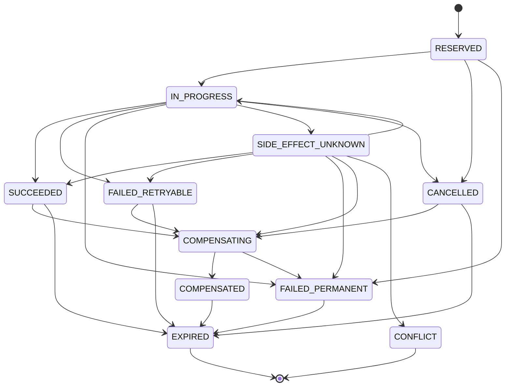

---

# Reservation Contract

An operation must reserve its idempotency key before execution.

```python
class IdempotencyRegistry:
    def reserve(
        self,
        request: "IdempotencyReservationRequest"
    ) -> "IdempotencyReservationResult":
        ...
```

---

# Reservation Result

```yaml
idempotency_reservation_result:
  status:
  idempotency_key:
  existing_record:
  execution_allowed:
  result_reference:
  reconciliation_required:
  conflict:
```

Possible statuses:

```yaml
reservation_statuses:
  - CREATED
  - ALREADY_RESERVED
  - ALREADY_IN_PROGRESS
  - ALREADY_SUCCEEDED
  - ALREADY_FAILED
  - SIDE_EFFECT_UNKNOWN
  - CONFLICT
```

---

# Reservation Semantics

## CREATED

Caller may proceed.

## ALREADY_RESERVED

Another owner has reserved but not started.

Caller must not execute.

## ALREADY_IN_PROGRESS

Another owner is active.

Caller may wait, return current status, or reconcile after lease expiry.

## ALREADY_SUCCEEDED

Return prior result.

## ALREADY_FAILED

Return prior failure or evaluate new Attempt policy.

## SIDE_EFFECT_UNKNOWN

Reconciliation is mandatory.

## CONFLICT

Fail closed.

---

# Compare-and-Set Registry Updates

Every record transition must use expected-state and expected-version semantics.

```python
class IdempotencyRegistry:
    def transition(
        self,
        idempotency_key: str,
        expected_state: str,
        expected_version: int,
        new_state: str,
        evidence: dict
    ) -> "IdempotencyTransitionResult":
        ...
```

Blind updates are prohibited.

---

# Ownership Lease

An in-progress idempotent operation may have one active execution lease.

```yaml
idempotency_lease:
  lease_id:
  idempotency_key:
  owner_id:
  acquired_at:
  expires_at:
  renewed_at:
```

The lease does not prove that no external side effect exists after expiry.

It only proves that ownership is no longer trusted.

---

# Duplicate Prevention Layers

Duplicate prevention operates at several layers.

```text
API Request
↓
Command Idempotency
↓
Manifest Command Deduplication
↓
Queue Item Deduplication
↓
Lease Exclusivity
↓
Worker Execution Deduplication
↓
Provider Idempotency
↓
Artifact Result Deduplication
↓
Event Deduplication
```

No single layer is sufficient.

---

# Command Idempotency

Every externally or internally initiated command that may mutate authoritative state must include a Command ID or stable operation identity.

Canonical command:

```yaml
runtime_command:
  command_id:
  idempotency_key:
  command_type:
  build_id:
  expected_manifest_version:
  payload_hash:
  actor:
  requested_at:
```

---

# Command Deduplication

When the same Command ID is received again:

* if completed, return the prior Command Result;
* if in progress, return operation status;
* if failed permanently, return prior failure;
* if payload hash differs, return conflict.

---

# Manifest Mutation Idempotency

Every Manifest mutation must include a unique `mutation_id`.

```yaml
manifest_mutation:
  mutation_id:
  idempotency_key:
  expected_manifest_version:
  mutation_type:
  payload_hash:
```

Repeated mutation with the same ID and payload must not create a second Manifest Version.

---

# Manifest Version Conflict vs Duplicate

These are distinct.

## Duplicate

Same mutation identity and payload already applied.

Result:

* return prior resulting Manifest Version.

## Version Conflict

Different valid command attempts to mutate stale state.

Result:

* reload and reevaluate.

A version conflict must not be mislabeled as a duplicate.

---

# Queue Item Deduplication

Queue item identity:

```text
queue_item_id =
sha256(
  build_id
  + task_id
  + attempt_number
  + execution_generation
  + queue_class
)
```

One active Queue item per identity is permitted.

---

# Queue Duplicate Cases

## Duplicate Enqueue Before Lease

Return existing Queue item.

## Duplicate Enqueue During Lease

Return existing lease state.

## Duplicate Delivery After Acknowledgement

Consumer loads authoritative Task and Idempotency State and acknowledges without reexecution.

## Duplicate Delivery After Worker Crash

Reconcile side effects before execution.

---

# Queue Deduplication Registry

The platform should persist Queue item lifecycle independently of the message backend.

```yaml
queue_deduplication_record:
  queue_item_id:
  task_id:
  attempt_number:
  queue_class:
  state:
  active_lease_id:
  transport_message_ids:
  created_at:
  acknowledged_at:
```

---

# Worker Execution Idempotency

Before execution, a Worker must verify:

* Task Attempt identity;
* idempotency key;
* current Task State;
* current lease;
* no completed Task Result exists;
* no conflicting active owner exists.

---

# Worker Duplicate Execution Flow

```text
Worker Leases Duplicate Delivery
        │
        ▼
Load Idempotency Record
        │
        ├── SUCCEEDED
        │      └── Return Prior Result and Ack
        │
        ├── IN_PROGRESS by Another Worker
        │      └── Release / Conflict
        │
        ├── SIDE_EFFECT_UNKNOWN
        │      └── Reconcile
        │
        └── New Valid Ownership
               └── Execute
```

---

# Local Deterministic Operation Idempotency

Local operations such as:

* SVG generation;
* subtitle generation;
* FFmpeg composition;
* metadata packaging

should produce deterministic output identities.

Recommended output key:

```text
output_artifact_key =
sha256(
  task_definition_hash
  + ordered_input_hashes
  + tool_version
  + deterministic_parameters
)
```

If the artifact already exists and validates, execution may be reused rather than repeated.

---

# Local Non-Deterministic Operation

If local execution uses non-deterministic behavior:

* random seed must be persisted;
* generated parameters must be persisted;
* output identity must bind to those parameters;
* ordinary retry must preserve semantics or create a new approved variant.

---

# Provider Submission Idempotency

Provider submission is a critical duplicate-risk boundary.

Required sequence:

```text
Build Canonical Provider Request
↓
Calculate Request Hash
↓
Reserve Internal Idempotency Key
↓
Persist SUBMITTING State
↓
Transmit with Provider-Native Key if Supported
↓
Persist Provider Task ID
```

---

# Provider-Native Idempotency

When supported, the internal key must be transmitted using the provider's native idempotency mechanism.

The platform must still maintain its own Registry.

Provider-native idempotency alone is insufficient because:

* provider retention may expire;
* provider semantics may differ;
* callbacks may duplicate;
* internal Task identity must be preserved;
* multiple providers require a common contract.

---

# Provider Without Native Idempotency

When provider-native idempotency is unavailable:

* embed stable internal metadata where supported;
* query provider by metadata or time window during reconciliation;
* prevent concurrent submission with internal lease;
* treat network ambiguity as `SIDE_EFFECT_UNKNOWN`;
* never blindly resubmit.

---

# Provider Submission Conflict

A conflict exists when the same idempotency key is associated with:

* a different provider;
* a different model;
* a different prompt hash;
* a different source artifact hash;
* a different output profile;
* a different execution generation.

The system must fail closed.

---

# Duplicate Provider Task Detection

Detection signals:

```yaml
provider_duplicate_signals:
  - idempotency_key
  - request_hash
  - provider_metadata
  - internal_task_id
  - submission_time_window
  - source_artifact_hash
```

---

# Duplicate Provider Task Resolution

```text
Duplicate Provider Tasks Found
↓
Select Canonical Provider Task
↓
Persist Duplicate Incident
↓
Cancel Noncanonical Tasks if Possible
↓
Quarantine Duplicate Outputs
↓
Reconcile All Costs
↓
Continue with Canonical Task Only
```

Canonical selection must be deterministic.

---

# Canonical Provider Task Selection

Recommended precedence:

```text
1. Task linked to accepted internal idempotency record
2. Earliest provider acceptance timestamp
3. Lowest provider task ID lexicographically
4. Manual Review if evidence conflicts
```

---

# Provider Callback Deduplication

Provider callbacks may be repeated.

Preferred key:

```text
callback_key =
provider_id
+ provider_event_id
```

Fallback:

```text
callback_key =
provider_id
+ provider_task_id
+ event_type
+ provider_event_time
+ payload_hash
```

---

# Callback Deduplication Record

```yaml
callback_record:
  callback_key:
  provider:
  provider_task_id:
  event_type:
  payload_hash:
  first_received_at:
  last_received_at:
  delivery_count:
  processing_result:
```

Repeated callbacks return the prior processing result.

---

# Callback State Regression Prevention

A duplicate or delayed callback must not regress provider state.

Example:

```text
Current Provider State = SUCCEEDED
Incoming Callback = PROCESSING
Result = Ignore as stale, preserve evidence
```

---

# Polling and Callback Race

A provider Task may complete through both polling and callback at nearly the same time.

Required handling:

* both normalize to the same provider transition identity;
* compare-and-set permits one transition;
* the losing operation returns the existing result;
* artifact retrieval is scheduled once.

---

# Artifact Registration Idempotency

Artifact identity must be content-addressed.

```text
artifact_id =
object_hash
+
artifact_role
+
provenance_scope
```

Registering the same immutable object twice must return the existing Artifact Record.

---

# Artifact Identity Conflict

A conflict exists when:

* same artifact ID references different object hash;
* same Task Result claims incompatible outputs;
* same role and Attempt produce different validated hashes without variant identity;
* artifact metadata changes semantic provenance.

Conflicts require manual review or a new variant identity.

---

# Artifact Write Process

```text
Write Temporary Output
↓
Calculate Hash
↓
Validate
↓
Atomically Store in CAS
↓
Register Artifact Record
↓
Persist Task Result
```

CAS insertion must be idempotent.

---

# Duplicate Artifact Output

Two Workers may produce the same deterministic artifact after a race.

If hashes match:

* store once;
* reuse the same Artifact Record;
* record duplicate computation metric;
* complete one authoritative Task Result.

If hashes differ:

* treat as determinism conflict;
* quarantine both if necessary;
* require reconciliation.

---

# Task Result Idempotency

One Task Attempt may have one authoritative terminal Task Result.

Repeated completion with the same Result Hash:

* return existing result.

Repeated completion with a different Result Hash:

* enter `MANUAL_REVIEW`;
* do not overwrite.

---

# State Transition Idempotency

Every Build and Task transition has a Transition ID.

```yaml
state_transition_identity:
  transition_id:
  entity_id:
  expected_state:
  new_state:
  reason_code:
```

Repeating the same transition returns the prior transition result.

A transition with the same ID but different target state is a conflict.

---

# Retry Activation Idempotency

Retry activation key:

```text
retry_activation_key =
sha256(
  task_id
  + failed_attempt
  + failure_id
  + retry_policy_id
)
```

Repeated activation must not create:

* multiple next Attempts;
* multiple Retry Queue items;
* multiple idempotency generations.

---

# Checkpoint Idempotency

Checkpoint identity is stable for:

* Build;
* execution generation;
* source Manifest Version;
* Checkpoint Type;
* triggering request.

Repeated Checkpoint Request returns the same published or active Checkpoint operation.

---

# Resume Idempotency

Resume key:

```text
resume_key =
sha256(
  build_id
  + execution_generation
  + checkpoint_id
  + resume_mode
)
```

Repeated Resume must not:

* reacquire multiple Build Locks;
* create duplicate Queue items;
* create new Task Attempts;
* duplicate provider monitoring;
* replay compensation twice.

---

# Compensation Idempotency

Every Compensation Action binds to:

* source Side Effect;
* compensation type;
* target;
* compensation generation.

Repeated compensation checks current target state and returns:

* already compensated;
* still in progress;
* reconciliation required;
* conflict.

---

# Rollback Idempotency

A rollback key binds to:

* Build;
* source Manifest Version;
* target basis;
* rollback type;
* approved plan hash.

Repeated Rollback Request returns the existing Rollback Operation.

---

# Publication Idempotency

Publishing is an externally visible side effect.

Publication identity should include:

```yaml
publication_identity:
  channel:
  destination_account:
  content_package_hash:
  publication_slot:
  release_generation:
```

Repeated publication must return the existing external publication reference.

---

# Publication Duplicate Prevention

Before publishing:

* verify package approval;
* reserve Publication Idempotency Key;
* query existing publication record;
* submit with provider-native key where supported;
* persist external publication ID immediately.

Ambiguous publication must be reconciled before retry.

---

# Idempotency Across Execution Generations

A new execution generation usually produces new side-effect identities.

However, immutable artifacts may still be reused when:

* content hash matches;
* provenance remains valid;
* approval policy permits reuse;
* artifact is not quarantined or superseded.

Task execution identity and artifact content identity must remain distinct.

---

# Idempotency Across Retries

Ordinary retries retain:

* Task ID;
* Task Definition Hash;
* semantic operation identity.

They increment:

* Attempt Number;
* Attempt Generation when required.

Provider resubmission uses a new provider-operation key only after:

* prior outcome is reconciled;
* previous provider Task is terminal or compensated;
* policy authorizes a new side effect.

---

# Operation Generation

An Operation Generation increments when the previous operation identity can no longer safely represent the new execution.

Examples:

* previous provider Task cancelled conclusively;
* manual rerender approved;
* prior side effect compensated;
* provider fallback activated;
* semantic variant authorized.

---

# Duplicate Prevention and Locks

Locks reduce concurrency but do not replace idempotency.

Examples:

* Build Lock prevents multiple Orchestrators;
* Task Lease prevents multiple Workers;
* Provider slot reservation controls capacity.

A lock may expire after a side effect occurs.

The Idempotency Registry remains necessary.

---

# Duplicate Prevention and Transactions

Preferred transaction boundary:

```text
Reserve Idempotency Record
+
Persist Execution Intent
+
Register Outbox Entry
```

After side effect:

```text
Persist Side-Effect Reference
+
Persist Result
+
Transition Idempotency State
+
Stage Event
```

---

# Outbox Idempotency

Outbox entries require stable identity.

```text
outbox_id =
sha256(
  manifest_version
  + destination
  + event_type
  + semantic_payload_hash
)
```

Repeated delivery must be safe.

---

# Event Deduplication

Every event has:

```yaml
event_identity:
  event_id:
  build_id:
  sequence:
  event_type:
  semantic_payload_hash:
```

Consumers must persist processed Event IDs.

---

# Event Consumer Idempotency

```python
class IdempotentEventConsumer:
    def handle(
        self,
        event: "RuntimeEvent"
    ) -> "EventProcessingResult":
        ...
```

Canonical flow:

```text
Receive Event
↓
Check Consumer Dedup Store
↓
Already Processed?
├── Yes → Return Prior Result
└── No
      ↓
   Process
      ↓
   Persist Result + Processed ID
```

---

# Event Ordering and Deduplication

Duplicate prevention does not solve out-of-order events.

Consumers must additionally verify:

* entity sequence;
* Manifest Version;
* provider event timestamp;
* state-transition legality.

---

# Duplicate Conflict Model

Canonical conflict:

```yaml
idempotency_conflict:
  conflict_id:
  idempotency_key:
  existing_operation:
  incoming_operation:
  conflicting_fields:
  detected_at:
  severity:
  resolution:
```

---

# Conflict Classes

```yaml
idempotency_conflict_classes:
  - SAME_KEY_DIFFERENT_INPUT
  - SAME_TASK_DIFFERENT_RESULT
  - MULTIPLE_ACTIVE_OWNERS
  - MULTIPLE_PROVIDER_TASKS
  - MULTIPLE_TERMINAL_RESULTS
  - ARTIFACT_HASH_DIVERGENCE
  - STATE_TRANSITION_DIVERGENCE
  - PUBLICATION_DUPLICATE
  - REGISTRY_STATE_DIVERGENCE
```

---

# Conflict Handling

Default behavior:

```text
Detect Conflict
↓
Stop Forward Execution
↓
Preserve All Evidence
↓
Prevent Overwrite
↓
Reconcile External State
↓
Manual Review if No Deterministic Resolution
```

---

# Duplicate Incident

Material duplicates must create an incident record.

```yaml
duplicate_incident:
  incident_id:
  build_id:
  task_id:
  duplicate_class:
  canonical_reference:
  duplicate_references:
  cost_impact:
  artifact_impact:
  containment_actions:
  root_cause:
  detected_at:
  resolved_at:
```

---

# Duplicate Cost Handling

All duplicate external costs must be preserved.

```yaml
duplicate_cost:
  canonical_operation_cost:
  duplicate_operation_cost:
  recoverable_amount:
  unrecoverable_amount:
  currency:
```

Cost must not be reassigned to the canonical operation in a way that hides duplication.

---

# Duplicate Artifact Handling

Duplicate outputs may be:

* identical;
* semantically equivalent;
* conflicting.

## Identical Hash

Deduplicate storage and preserve provenance references.

## Different Hash, Same Deterministic Inputs

Determinism defect.

## Different Hash, Non-Deterministic Operation

Require variant identity or canonical selection policy.

---

# Duplicate Reconciliation

Canonical reconciliation domains:

```yaml
duplicate_reconciliation_domains:
  - REGISTRY
  - MANIFEST
  - QUEUE
  - WORKER
  - PROVIDER
  - ARTIFACT
  - EVENT
  - COST
  - PUBLICATION
```

---

# Reconciliation Workflow

```text
Load Idempotency Record
↓
Load Manifest and Task State
↓
Inspect Queue and Lease State
↓
Inspect Provider or External State
↓
Inspect Artifacts and Results
↓
Select Canonical Outcome
↓
Compensate Duplicates
↓
Persist Reconciliation Result
```

---

# Canonical Outcome Selection

A canonical outcome may be selected when evidence is deterministic.

Recommended precedence:

```text
1. Authoritative persisted terminal Task Result
2. Validated immutable artifact linked to the correct Attempt
3. Accepted Provider Task linked to the reserved key
4. Earliest conclusively completed side effect
5. Manual Review
```

---

# Reconciliation Result

```yaml
idempotency_reconciliation:
  reconciliation_id:
  idempotency_key:
  canonical_outcome:
  duplicate_effects:
  compensation_required:
  cost_impact:
  resulting_registry_state:
  resulting_manifest_version:
  completed_at:
```

---

# Record Expiration

Idempotency records require retention policies.

Expiration must consider:

* external provider retention;
* artifact lifetime;
* publication permanence;
* audit requirements;
* retry window;
* Build retention;
* legal policy.

---

# Retention Classes

```yaml
idempotency_retention:
  local_temporary_operation_days:
  provider_operation_days:
  artifact_operation_days:
  publication_operation_days:
  checkpoint_operation_days:
  audit_operation_days:
```

Publication and external-provider records should generally have long retention.

---

# Safe Expiration

A record may expire from the active index only when:

* operation is terminal;
* no retry can reference it;
* no active compensation exists;
* no unresolved duplicate incident exists;
* retained historical evidence remains available;
* provider deduplication window has passed.

---

# Tombstones

After active expiration, a lightweight tombstone may remain.

```yaml
idempotency_tombstone:
  idempotency_key:
  final_state:
  result_hash:
  expired_at:
  historical_reference:
```

Tombstones prevent unsafe key reuse.

---

# Registry Partitioning

The Registry may be partitioned by:

* Build ID;
* operation type;
* provider;
* time;
* execution generation.

Partitioning must preserve uniqueness within the declared key namespace.

---

# Registry Availability

If the Idempotency Registry is unavailable:

* new external side effects must fail closed;
* provider submissions must stop;
* publication must stop;
* irreversible operations must stop;
* already registered provider Tasks may continue to be monitored;
* local deterministic read-only operations may continue only if policy permits.

---

# Idempotency Service Interface

```python
class IdempotencyService:
    def reserve(
        self,
        operation: "IdempotentOperation"
    ) -> "IdempotencyReservationResult":
        ...

    def begin(
        self,
        idempotency_key: str,
        owner_id: str
    ) -> "IdempotencyExecutionLease":
        ...

    def succeed(
        self,
        idempotency_key: str,
        result_reference: str,
        side_effect_references: list[str]
    ) -> "IdempotencyCompletionResult":
        ...

    def fail(
        self,
        idempotency_key: str,
        failure_reference: str,
        retryable: bool
    ) -> "IdempotencyFailureResult":
        ...

    def lookup(
        self,
        idempotency_key: str
    ) -> "IdempotencyRecord | None":
        ...
```

---

# Duplicate Detector Interface

```python
class DuplicateDetector:
    def detect(
        self,
        context: "DuplicateDetectionContext"
    ) -> "DuplicateDetectionResult":
        ...

    def reconcile(
        self,
        duplicate_incident_id: str
    ) -> "DuplicateReconciliationResult":
        ...
```

---

# Operation Key Generator Interface

```python
class IdempotencyKeyGenerator:
    def generate(
        self,
        operation_type: str,
        scope: "IdempotencyScope",
        semantic_payload: object,
        policy_version: str
    ) -> str:
        ...
```

---

# Result Repository Interface

```python
class IdempotentResultRepository:
    def store(
        self,
        idempotency_key: str,
        result: "OperationResult"
    ) -> str:
        ...

    def load(
        self,
        idempotency_key: str
    ) -> "OperationResult | None":
        ...
```

---

# Reference Configuration

```yaml
orchestrator:
  idempotency:
    enabled: true
    fail_closed_on_registry_unavailable: true
    require_for_external_side_effects: true
    require_for_manifest_commands: true
    require_for_queue_items: true
    require_for_task_attempts: true
    require_for_artifact_registration: true

    namespace: "insynergy:v2"
    canonicalization_version: "2.0"
    hash_algorithm: sha256

    leases:
      default_seconds: 300
      renew_before_seconds: 60

    conflicts:
      stop_forward_execution: true
      manual_review_on_unresolved: true

    retention:
      provider_days: 365
      artifact_days: 365
      publication_days: 2555
      checkpoint_days: 365
      temporary_local_days: 30

    tombstones:
      enabled: true
      retain_days: 2555

    duplicate_detection:
      provider_metadata_lookup: true
      callback_deduplication: true
      artifact_hash_deduplication: true
      event_consumer_deduplication: true
```

---

# Operation-Specific Configuration

```yaml
idempotency_policies:
  provider_submission:
    scope: TASK_ATTEMPT
    provider_native_key: preferred
    ambiguous_outcome_action: RECONCILE
    allow_blind_retry: false

  ffmpeg_composition:
    scope: TASK_ATTEMPT
    deterministic_output_required: true
    reuse_existing_valid_output: true

  checkpoint:
    scope: CHECKPOINT_OPERATION
    return_existing_on_duplicate: true

  resume:
    scope: RESUME_OPERATION
    return_existing_on_duplicate: true

  publication:
    scope: PUBLICATION_OPERATION
    provider_native_key: preferred
    retention_days: 2555
```

---

# Deployment Profiles

## Local Development

Recommended:

* SQLite-backed Registry;
* deterministic key logging;
* intentional duplicate-delivery tests;
* no bypass for provider submissions;
* optional short retention for local temporary operations.

---

## GitHub Actions

Requirements:

* Registry persisted outside ephemeral runner memory;
* workflow reruns reuse stable Build and Task identities;
* provider submissions reconcile before resubmission;
* Queue reconstruction uses stable Queue item IDs;
* Resume and Checkpoint Requests remain duplicate-safe across workflows.

---

## Distributed Production

Requirements:

* strongly consistent uniqueness;
* compare-and-set transitions;
* distributed leases;
* partitioned Registry;
* durable tombstones;
* high-availability reads and writes;
* authenticated operation ownership;
* cross-region duplicate policy where applicable.

---

# Security Requirements

The subsystem must enforce:

* authenticated Registry access;
* authorized state transitions;
* Build-scoped operation isolation;
* no secret material in idempotency keys;
* no raw prompt content in Registry metadata where unnecessary;
* tamper-evident operation history;
* signed URL redaction;
* publication-identity protection;
* manual-review authorization for conflicts;
* immutable duplicate-incident history.

---

# Privacy Requirements

Idempotency keys must use hashes rather than raw confidential content.

The Registry should store:

* semantic hashes;
* references;
* classifications;
* minimal metadata.

It should avoid storing:

* complete prompts;
* API keys;
* raw media;
* confidential article bodies;
* temporary provider credentials.

---

# Observability Events

Required events:

```text
idempotency.reserved
idempotency.execution_started
idempotency.completed
idempotency.failed
idempotency.side_effect_unknown
idempotency.conflict_detected
idempotency.reconciliation_started
idempotency.reconciliation_completed
idempotency.record_expired
idempotency.tombstone_created

duplicate.command_detected
duplicate.queue_item_detected
duplicate.delivery_detected
duplicate.worker_execution_prevented
duplicate.provider_task_detected
duplicate.callback_ignored
duplicate.artifact_deduplicated
duplicate.result_conflict
duplicate.publication_detected
duplicate.incident_created
```

---

# Idempotency Metrics

```yaml
idempotency_metrics:
  reservations_total:
  reservation_conflicts:
  duplicate_requests:
  duplicate_requests_returning_prior_result:
  active_operations:
  side_effect_unknown_count:
  reconciliation_count:
  reconciliation_success_count:
  registry_write_latency_ms:
  registry_read_latency_ms:
  lease_expiration_count:
  tombstone_lookup_count:
```

---

# Duplicate Prevention Metrics

```yaml
duplicate_metrics:
  duplicate_commands_prevented:
  duplicate_queue_items_prevented:
  duplicate_deliveries:
  duplicate_worker_executions_prevented:
  duplicate_provider_submissions_prevented:
  duplicate_provider_tasks_detected:
  duplicate_callbacks_ignored:
  duplicate_artifacts_deduplicated:
  conflicting_task_results:
  duplicate_publications_prevented:
  duplicate_cost:
```

---

# Duplicate Prevention Rate

```text
duplicate_prevention_rate =
prevented duplicate material effects
/
detected duplicate execution attempts
```

---

# Reconciliation Success Rate

```text
reconciliation_success_rate =
automatically resolved ambiguous operations
/
all reconciled ambiguous operations
```

---

# Duplicate Cost Metric

```text
duplicate_cost =
provider charges
+ compute cost
+ storage cost
+ publication correction cost
caused by duplicate effects
```

Duplicate cost must be reported separately from ordinary retry cost.

---

# Idempotency Explanation

```yaml
idempotency_explanation:
  operation_type:
  idempotency_key:
  scope:
  semantic_input_hash:
  record_state:
  execution_allowed:
  prior_result:
  reconciliation_required:
  conflict_reason:
```

---

# Duplicate Explanation

```yaml
duplicate_explanation:
  duplicate_class:
  canonical_operation:
  duplicate_operation:
  detection_evidence:
  material_side_effect_created:
  compensation_required:
  cost_impact:
  resolution:
```

---

# Testing Requirements

## Unit Tests

* canonical serialization;
* semantic-hash stability;
* key generation by scope;
* key namespace versioning;
* reservation creation;
* duplicate reservation;
* completed-result replay;
* in-progress detection;
* side-effect-unknown handling;
* conflicting payload detection;
* compare-and-set updates;
* lease expiry;
* tombstone lookup;
* retention eligibility.

## Queue Tests

* duplicate enqueue;
* duplicate delivery before acknowledgement;
* duplicate delivery after acknowledgement;
* Queue reconstruction;
* stale Queue item;
* duplicate Retry Queue item;
* duplicate Provider Monitor item.

## Worker Tests

* two Workers attempt same Task;
* stale lease execution;
* Worker crash after local output;
* duplicate deterministic output;
* conflicting output hashes;
* Worker reexecution after Task success.

## Provider Tests

* provider-native idempotency;
* provider without native idempotency;
* ambiguous submission;
* two concurrent submission Workers;
* duplicate provider Task detection;
* callback duplication;
* callback and polling race;
* provider state regression;
* duplicate artifact URLs.

## Artifact Tests

* identical CAS object registration;
* same Task Result submitted twice;
* same Task Result with different hash;
* deterministic composition divergence;
* cache registration duplication;
* superseded artifact reuse rejection.

## Manifest and Event Tests

* duplicate state-transition command;
* same mutation ID with different payload;
* Outbox redelivery;
* duplicate Event delivery;
* out-of-order duplicate Event;
* Manifest conflict distinct from duplicate command.

## Checkpoint and Resume Tests

* duplicate Checkpoint Request;
* duplicate Resume Request;
* Resume after partial Queue reconstruction;
* repeated provider reconciliation;
* repeated Outbox replay;
* concurrent Resume Requests.

## Compensation and Rollback Tests

* duplicate compensation action;
* ambiguous compensation result;
* repeated rollback request;
* rollback conflict with different target;
* provider duplicate cancellation;
* artifact quarantine idempotency.

## Publication Tests

* duplicate publication request;
* ambiguous publication response;
* repeated publication callback;
* same package to different channel;
* changed package hash with reused key;
* external publication already exists.

## Crash Tests

* crash after idempotency reservation;
* crash after side effect before Registry update;
* crash after result persistence before Queue acknowledgement;
* crash during duplicate reconciliation;
* crash after provider acceptance before provider ID persistence;
* crash after publication before external ID persistence.

## Concurrency Tests

* concurrent reservations;
* concurrent record transitions;
* Registry lease takeover;
* duplicate callback and poll;
* two Orchestrators issue same command;
* compensation concurrent with forward execution;
* retry activation concurrent with prior Attempt completion.

## Security Tests

* secret included in key payload;
* cross-Build key reuse;
* unauthorized Registry mutation;
* tampered Result Reference;
* tombstone deletion;
* manual conflict resolution without authority;
* raw prompt exposure in Registry.

## Performance Tests

* one million key lookups;
* 10,000 concurrent reservations;
* high-volume callback deduplication;
* large Queue reconstruction;
* distributed Registry contention;
* tombstone-index performance;
* artifact-hash deduplication under parallel generation.

## Determinism Tests

Given identical:

* operation type;
* scope;
* semantic input;
* canonicalization version;
* policy version;

the generated Idempotency Key must be identical.

Given one semantic input change, the key must change.

---

# Idempotency & Duplicate Prevention Quality Gate

```yaml
idempotency_duplicate_prevention_quality_gate:
  every_material_side_effect_has_idempotency_key: true
  every_key_has_explicit_scope: true
  every_key_uses_canonical_semantic_input: true
  no_key_contains_secret_material: true
  every_operation_reserved_before_execution: true
  every_in_progress_operation_has_owner_or_reconciliation_path: true
  no_duplicate_active_queue_items: true
  no_task_attempt_has_multiple_active_workers: true
  no_ambiguous_provider_submission_blindly_retried: true
  duplicate_callbacks_processed_idempotently: true
  provider_state_regression_rejected: true
  every_task_attempt_has_one_terminal_result: true
  conflicting_result_hashes_trigger_manual_review: true
  artifact_registration_content_addressed: true
  duplicate_resume_request_safe: true
  duplicate_checkpoint_request_safe: true
  duplicate_compensation_action_safe: true
  duplicate_publication_prevented: true
  registry_unavailability_fail_closed: true
  tombstone_retention_enabled: true
  duplicate_cost_reported: true
  crash_after_side_effect_test_passed: true
  concurrent_execution_test_passed: true
```

---

# Architectural Invariants

## Invariant ID-301

Every material side effect has a stable Idempotency Key before execution begins.

## Invariant ID-302

Idempotency Keys are derived from canonical semantic identity, not transport or process identity.

## Invariant ID-303

Repeated completed operations return the prior authoritative result rather than executing again.

## Invariant ID-304

An ambiguous side effect is reconciled before any duplicate forward execution is authorized.

## Invariant ID-305

One Task Attempt may have at most one authoritative terminal Task Result.

## Invariant ID-306

The same Idempotency Key may never represent different semantic inputs.

## Invariant ID-307

Queue deduplication, leases, Registry state, and external idempotency are complementary controls and may not replace one another.

## Invariant ID-308

Duplicate external cost, artifacts, provider Tasks, and publication effects remain preserved as accountability evidence.

## Invariant ID-309

Registry unavailability blocks new irreversible side effects.

## Invariant ID-310

Idempotency and duplicate reconciliation append authoritative history and never silently overwrite conflicting outcomes.

---

# Architectural Decision Records

| ADR     | Decision                                                                                                                                            |
| ------- | --------------------------------------------------------------------------------------------------------------------------------------------------- |
| ADR-961 | The platform assumes at-least-once transport and achieves exactly-once effects through persistent idempotency and reconciliation.                   |
| ADR-962 | Every material side effect receives a stable semantic identity before execution.                                                                    |
| ADR-963 | Idempotency Keys are generated from canonicalized semantic inputs and versioned namespaces.                                                         |
| ADR-964 | Queue deduplication, Task leases, Manifest compare-and-set, provider idempotency, and artifact hashes form layered duplicate prevention.            |
| ADR-965 | Ambiguous side effects enter an explicit reconciliation state and are never blindly retried.                                                        |
| ADR-966 | Provider-native idempotency is used where available but never replaces the internal Idempotency Registry.                                           |
| ADR-967 | One Task Attempt may produce only one authoritative terminal Task Result; conflicting results require manual review.                                |
| ADR-968 | Content-addressed artifact storage deduplicates identical outputs while preserving complete provenance.                                             |
| ADR-969 | Idempotency records and tombstones are retained long enough to prevent unsafe key reuse across retries, recovery, publication, and audit windows.   |
| ADR-970 | Duplicate side effects, costs, provider Tasks, artifacts, and publications are preserved, reconciled, compensated, and reported rather than hidden. |

---

# Acceptance Criteria

Section **6.3.17** is complete when:

* Idempotent Operation, Idempotency Scope, Idempotency Key, Semantic Input Hash, Idempotency Record, Execution Lease, Duplicate Incident, Reconciliation Result, and Tombstone models are formally defined.
* Build, execution-generation, Task, Attempt, Queue, provider, artifact, Checkpoint, Resume, Compensation, Rollback, and publication scopes are standardized.
* Every material side effect reserves a stable key before execution.
* Key generation uses deterministic canonicalization and excludes transport-, process-, time-, and secret-dependent values.
* Reserved, in-progress, ambiguous, succeeded, failed, compensating, compensated, cancelled, conflict, and expired Registry states have explicit behavior.
* Repeated completed operations return prior Results.
* In-progress duplicates do not execute concurrently.
* Ambiguous operations require reconciliation.
* Conflicting key reuse fails closed.
* Manifest commands, Queue items, Worker execution, provider submissions, callbacks, polling results, Task Results, artifact registration, retries, Checkpoints, Resume, Compensation, Rollback, Events, and publication operations are duplicate-safe.
* Provider-native idempotency is integrated without replacing the internal Registry.
* Queue delivery remains at least once while material effects remain exactly once.
* One Task Attempt has one authoritative terminal Result.
* Identical artifact hashes deduplicate storage, while conflicting deterministic outputs trigger reconciliation.
* Duplicate provider Tasks, callback races, external costs, publication effects, and artifact variants have explicit resolution.
* Registry availability, retention, tombstones, partitioning, security, privacy, observability, interfaces, configuration, deployment profiles, tests, Quality Gates, invariants, and ADRs are sufficient for Codex to implement exactly-once material effects without relying on exactly-once transport, losing ambiguous operations, duplicating provider charges, publishing twice, or overwriting conflicting runtime evidence.


# Part 6.3.18 — Event Model & Event Dispatch

## Insynergy Cinematic Thought Leadership Platform

### Master Specification v2.1

---

# Purpose

This section defines the canonical **Event Model** and **Event Dispatch** architecture used by the Build Orchestration & Runtime Control Layer.

The Event subsystem records and distributes authoritative runtime facts produced by:

* Build lifecycle transitions;
* Task lifecycle transitions;
* Queue operations;
* Worker activity;
* provider coordination;
* artifact creation and validation;
* approvals;
* retries;
* failures;
* compensation;
* rollback;
* Checkpoints;
* Resume operations;
* Backpressure;
* security and governance controls.

Its purpose is to ensure that every material runtime change becomes:

* explicit;
* immutable;
* ordered;
* attributable;
* replayable where permitted;
* dispatchable to interested consumers;
* auditable independently of transient process logs.

Events provide the historical narrative of runtime execution.

They do not replace the authoritative Runtime Manifest.

---

# Governing Principle

The platform adopts the following principle.

> **Every material authoritative state change must produce an immutable event after the state mutation has been durably accepted.**

An event represents a fact that has occurred.

It must not represent:

* an uncommitted intention;
* a speculative future state;
* an inferred condition;
* a mutable current-status object;
* an instruction disguised as a fact.

Commands request change.

Events record accepted outcomes.

---

# Architectural Position

```text
Runtime Command
      │
      ▼
Domain Validation
      │
      ▼
Authoritative State Mutation
      │
      ▼
Transactional Outbox Entry
      │
      ▼
Event Dispatcher
      │
      ├── Event Store
      ├── Queue and Workflow Consumers
      ├── Read Model Projectors
      ├── Observability
      ├── Notifications
      ├── Audit
      └── External Integrations
```

The Event Dispatcher operates only after the authoritative mutation is committed or recoverably staged.

---

# Responsibilities

The Event Model & Dispatch subsystem is responsible for:

* defining canonical runtime events;
* assigning stable event identity;
* preserving Build-scoped ordering;
* validating event schemas;
* persisting events append-only;
* coordinating state mutation and event publication;
* dispatching events to registered consumers;
* deduplicating dispatch;
* tracking delivery attempts;
* enforcing consumer isolation;
* handling delivery failure;
* supporting delayed and replayed dispatch;
* preserving causation and correlation metadata;
* maintaining event-version compatibility;
* redacting sensitive payload fields;
* exposing event queries and subscriptions;
* supporting read-model projection;
* supporting audit and incident analysis;
* measuring dispatch latency and consumer health.

It is not responsible for:

* mutating authoritative Build or Task State;
* substituting for Runtime Manifest persistence;
* retrying failed Tasks directly;
* treating Event Store replay as automatic side-effect replay;
* allowing arbitrary consumers to issue unrestricted runtime changes;
* storing binary artifacts;
* embedding secrets in event payloads.

---

# Event Definition

An Event is an immutable record that a material runtime fact has occurred.

Canonical schema:

```yaml
runtime_event:
  event_id:
  event_type:
  event_version:
  build_id:
  execution_generation:
  sequence:
  aggregate_type:
  aggregate_id:
  aggregate_version:
  manifest_version:
  causation_id:
  correlation_id:
  command_id:
  actor:
  source_component:
  occurred_at:
  recorded_at:
  payload:
  metadata:
  integrity:
```

---

# Event Identity

Every event must have one stable Event ID.

Recommended formula:

```text
event_id =
sha256(
  event_namespace
  + build_id
  + execution_generation
  + aggregate_type
  + aggregate_id
  + aggregate_version
  + event_type
  + semantic_payload_hash
)
```

Event identity must not depend on:

* transport message ID;
* dispatcher attempt;
* consumer identity;
* random delivery UUID;
* receipt time;
* log correlation generated after persistence.

---

# Event Namespace

Events use a versioned namespace.

Example:

```text
insynergy.runtime.v2
```

The namespace prevents collisions across incompatible event models.

---

# Event Type Naming

Canonical naming convention:

```text
<domain>.<entity_or_operation>.<past_tense_fact>
```

Examples:

```text
build.state.changed
task.execution.started
task.execution.succeeded
provider.submission.accepted
artifact.validation.failed
checkpoint.published
resume.completed
backpressure.activated
```

Event names must describe facts, not commands.

Invalid examples:

```text
task.execute
provider.submit
build.pause
```

These describe intentions or instructions.

---

# Event Taxonomy

The platform defines the following primary Event Domains.

```yaml
event_domains:
  - build
  - task
  - dependency
  - readiness
  - scheduler
  - queue
  - worker
  - provider
  - artifact
  - validation
  - approval
  - retry
  - failure
  - compensation
  - rollback
  - checkpoint
  - resume
  - backpressure
  - flow
  - manifest
  - idempotency
  - duplicate
  - budget
  - resource
  - governance
  - security
  - publication
  - runtime
```

---

# Event Categories

Events are categorized by operational role.

```yaml
event_categories:
  - DOMAIN
  - LIFECYCLE
  - CONTROL
  - INTEGRATION
  - OBSERVABILITY
  - AUDIT
  - SECURITY
```

---

# DOMAIN Events

Represent accepted domain facts.

Examples:

* Task succeeded;
* provider Task accepted;
* artifact validated;
* approval revoked.

---

# LIFECYCLE Events

Represent lifecycle movement.

Examples:

* Build state changed;
* Task state changed;
* Checkpoint published;
* Resume completed.

---

# CONTROL Events

Represent operational-control outcomes.

Examples:

* backpressure activated;
* dispatch barrier enabled;
* Worker draining started;
* circuit breaker opened.

---

# INTEGRATION Events

Intended for downstream integrations.

Examples:

* publishing package ready;
* final artifact approved;
* Build completed.

Integration events should contain stable references rather than internal mutable details.

---

# OBSERVABILITY Events

Support diagnostics and metrics.

Examples:

* Worker heartbeat;
* Queue pressure sampled;
* provider poll completed.

High-volume observability events may use separate retention and storage policy.

---

# AUDIT Events

Record institutional or governance decisions.

Examples:

* manual retry authorized;
* rollback approved;
* compensation waived;
* publication revoked.

---

# SECURITY Events

Record security-relevant facts.

Examples:

* callback signature rejected;
* unauthorized Manifest mutation denied;
* secret exposure detected;
* forced Build Lock takeover approved.

---

# Event Aggregate

Every event belongs to one logical aggregate.

Canonical aggregate types:

```yaml
aggregate_types:
  - BUILD
  - TASK
  - TASK_ATTEMPT
  - PROVIDER_TASK
  - ARTIFACT
  - APPROVAL
  - CHECKPOINT
  - RESUME_OPERATION
  - COMPENSATION_PLAN
  - ROLLBACK_OPERATION
  - QUEUE_ITEM
  - WORKER
  - FAILURE
  - RETRY
  - PUBLICATION
```

---

# Aggregate Version

`aggregate_version` is a monotonically increasing version for one aggregate identity.

Example:

```text
Task task-008:
1 task.declared
2 task.became.runnable
3 task.queued
4 task.leased
5 task.execution.started
6 task.execution.succeeded
```

Aggregate version enables:

* ordering;
* state-regression prevention;
* duplicate detection;
* projection consistency.

---

# Build Event Sequence

Every Build execution generation has a monotonically increasing Event Sequence.

```yaml
build_event_sequence:
  build_id:
  execution_generation:
  sequence:
```

This sequence establishes total order within one Build execution generation.

---

# Sequence Guarantees

The subsystem guarantees:

* no duplicate sequence within one Build generation;
* sequence increases monotonically;
* events are append-only;
* gaps are detectable;
* consumers may identify missing events;
* replay preserves sequence order.

Strict ordering across unrelated Builds is not required.

---

# Event Ordering Levels

The platform recognizes three ordering levels.

```yaml
event_ordering:
  aggregate_order: strict
  build_order: strict
  global_order: not_guaranteed
```

---

# Aggregate Order

Events for one aggregate must be processed in Aggregate Version order.

---

# Build Order

Events within one Build execution generation must be persisted in Build Sequence order.

---

# Global Order

Events from separate Builds may be interleaved differently by different consumers.

Consumers must not depend on a total global order.

---

# Event Time

Every event records:

```yaml
event_time:
  occurred_at:
  recorded_at:
  dispatched_at:
```

## occurred_at

When the domain fact occurred according to the authoritative runtime Clock.

## recorded_at

When the event was durably stored.

## dispatched_at

When one dispatch attempt occurred.

`recorded_at` must not replace `occurred_at`.

---

# Clock Source

Event timestamps must use the Orchestrator Clock abstraction.

Provider-native timestamps may be included separately as source evidence.

---

# Causation

`causation_id` identifies the immediate command or event that caused the event.

Example:

```text
Command: CancelBuild
↓
Event: build.cancellation.requested
↓
Event: build.state.changed
↓
Event: compensation.plan.created
```

Each downstream event points to its immediate cause.

---

# Correlation

`correlation_id` groups events belonging to one broader operation or business interaction.

Examples:

* one Build execution;
* one Resume operation;
* one rollback;
* one provider incident;
* one cancellation request.

---

# Command Relationship

Where applicable, events must retain:

```yaml
command_reference:
  command_id:
  command_type:
  actor:
  requested_at:
```

The event records the accepted outcome, not the command body.

---

# Actor Model

Canonical actor:

```yaml
event_actor:
  actor_type:
  actor_id:
  authority:
  delegation_reference:
```

Actor types:

```yaml
actor_types:
  - SYSTEM
  - ORCHESTRATOR
  - WORKER
  - PROVIDER
  - OPERATOR
  - APPROVER
  - GOVERNANCE_AUTHORITY
  - SECURITY_AUTHORITY
  - EXTERNAL_INTEGRATION
```

---

# Source Component

Every event identifies its producing component.

Examples:

```text
BuildStateController
TaskStateController
ProviderCoordinator
CheckpointManager
FailureCoordinator
BackpressureController
```

Only authorized source components may publish specific Event Types.

---

# Canonical Event Envelope

```yaml
runtime_event:
  event_id: "evt-..."
  event_type: "task.execution.succeeded"
  event_version: "1.0"

  build_id: "build-001"
  execution_generation: 1
  sequence: 142

  aggregate_type: "TASK"
  aggregate_id: "scene-04-shot-02-render"
  aggregate_version: 8

  manifest_version: 57

  causation_id: "cmd-..."
  correlation_id: "build-001:generation-1"
  command_id: "cmd-..."

  actor:
    actor_type: WORKER
    actor_id: "runway-submit-worker-02"
    authority: "leased-task-execution"

  source_component: "TaskStateController"

  occurred_at: "2026-07-20T12:30:00Z"
  recorded_at: "2026-07-20T12:30:00.040Z"

  payload:
    task_id: "scene-04-shot-02-render"
    result_reference: "cas://..."
    result_hash: "sha256:..."

  metadata:
    trace_id:
    environment:
    pipeline_version:

  integrity:
    payload_hash:
    event_hash:
    previous_event_hash:
    signature:
```

---

# Event Payload Principles

Event payloads must be:

* minimal;
* immutable;
* schema-defined;
* reference-oriented;
* sufficient for consumer interpretation;
* free of secrets;
* stable across transport systems.

Events should reference:

* artifacts;
* Manifests;
* Task Results;
* provider records;
* approvals;
* failure records.

They should not duplicate entire authoritative documents.

---

# Event Payload Prohibitions

Events must not contain:

* raw API keys;
* provider access tokens;
* signed URLs unless encrypted and explicitly authorized;
* binary media;
* full Runtime Manifest;
* complete large prompt bodies;
* unredacted confidential content;
* mutable object references without version or hash;
* arbitrary executable instructions.

---

# Event Schema

Every Event Type has a versioned schema.

Canonical registry record:

```yaml
event_schema:
  event_type:
  event_version:
  schema_reference:
  compatibility:
  owner:
  retention_class:
  sensitivity:
```

---

# Event Versioning

Event versions use:

```text
major.minor
```

Example:

```text
1.0
1.1
2.0
```

---

# Backward-Compatible Event Change

Examples:

* add optional field;
* add optional metadata;
* add enum value only when consumers are designed for unknown values;
* relax noncritical validation.

---

# Breaking Event Change

Examples:

* remove required field;
* change field meaning;
* change identity semantics;
* change aggregate mapping;
* change units;
* change ordering semantics.

Breaking changes require a new major Event Version.

---

# Consumer Compatibility

Every consumer must declare supported versions.

```yaml
consumer_subscription:
  event_type: "provider.task.status.changed"
  supported_versions:
    - "1.x"
```

Unsupported major versions must be rejected or routed to compatibility handling.

---

# Upcasting

Older Event Versions may be transformed into the current consumer model through deterministic upcasters.

```python
class EventUpcaster:
    def supports(
        self,
        event_type: str,
        from_version: str,
        to_version: str
    ) -> bool:
        ...

    def upcast(
        self,
        event: "RuntimeEvent"
    ) -> "RuntimeEvent":
        ...
```

Upcasting must not modify the stored original event.

---

# Event Store

The Event Store is the append-only persistence system for runtime events.

Required capabilities:

```yaml
event_store_capabilities:
  - append
  - append_batch
  - load_by_event_id
  - load_by_build
  - load_by_aggregate
  - load_from_sequence
  - verify_sequence
  - verify_integrity
  - archive
```

---

# Event Store Interface

```python
class EventStore:
    def append(
        self,
        event: "RuntimeEvent",
        expected_next_sequence: int
    ) -> "EventAppendResult":
        ...

    def append_batch(
        self,
        events: list["RuntimeEvent"],
        expected_next_sequence: int
    ) -> "EventBatchAppendResult":
        ...

    def by_build(
        self,
        build_id: str,
        execution_generation: int,
        from_sequence: int = 1
    ) -> list["RuntimeEvent"]:
        ...

    def by_aggregate(
        self,
        aggregate_type: str,
        aggregate_id: str,
        from_version: int = 1
    ) -> list["RuntimeEvent"]:
        ...
```

---

# Append-Only Rule

Stored events may never be:

* edited;
* reordered;
* replaced;
* silently deleted.

Corrections are represented as new events.

---

# Event Correction

Example:

```text
provider.task.status.changed → incorrect mapping detected
↓
provider.task.status.correction.recorded
```

The original event remains preserved.

---

# Event Retraction

Retraction means that a prior event should no longer be used as an active business fact.

Retraction must be represented through a new explicit event.

Example:

```text
approval.granted
↓
approval.revoked
```

The original grant event remains part of history.

---

# Event Integrity

Every stored event must include integrity metadata.

```yaml
event_integrity:
  payload_hash:
  event_hash:
  previous_event_hash:
  hash_algorithm:
  signature:
```

---

# Event Hash

The Event Hash is calculated over canonical event serialization excluding:

* `event_hash`;
* mutable transport metadata;
* delivery attempt metadata.

---

# Event Hash Chain

Events within one Build execution generation should form a hash chain.

```text
Event Sequence 141 Hash
        ↓
Event Sequence 142 previous_event_hash
```

This makes Build event history tamper-evident.

---

# Transactional Event Creation

Authoritative state mutation and event staging must form one transaction or one deterministic recoverable unit.

Preferred sequence:

```text
Validate Command
↓
Persist Runtime Manifest Mutation
↓
Persist Outbox Event
↓
Commit
↓
Dispatch Event
```

---

# Event Outbox

The Transactional Outbox is the authoritative handoff between state persistence and event dispatch.

Canonical entry:

```yaml
event_outbox_entry:
  outbox_id:
  event_id:
  build_id:
  manifest_version:
  destination_group:
  payload_reference:
  state:
  available_at:
  lease:
  delivery_attempts:
  created_at:
  delivered_at:
```

---

# Outbox States

```yaml
event_outbox_states:
  - PENDING
  - LEASED
  - DISPATCHING
  - DISPATCHED
  - PARTIALLY_DISPATCHED
  - FAILED_RETRYABLE
  - FAILED_PERMANENT
  - DEAD_LETTERED
```

---

# Outbox Identity

Recommended formula:

```text
outbox_id =
sha256(
  event_id
  + destination_group
)
```

One event may have separate Outbox entries for different destination groups.

---

# Destination Groups

Examples:

```yaml
destination_groups:
  - EVENT_STORE
  - INTERNAL_RUNTIME
  - READ_MODEL
  - OBSERVABILITY
  - AUDIT
  - NOTIFICATION
  - EXTERNAL_INTEGRATION
```

---

# Event Dispatch

Event Dispatch delivers persisted events to registered consumers.

Canonical flow:

```text
Lease Outbox Entry
↓
Load Event
↓
Resolve Subscriptions
↓
Apply Redaction and Version Policy
↓
Deliver
↓
Persist Consumer Delivery Result
↓
Mark Destination Complete
```

---

# Dispatch Guarantee

The platform adopts:

```yaml
event_dispatch_semantics:
  producer_to_outbox: atomic_or_recoverable
  outbox_to_consumer: at_least_once
  consumer_processing: idempotent
```

Exactly-once consumer effects require consumer-side idempotency.

---

# Dispatcher Interface

```python
class EventDispatcher:
    def dispatch(
        self,
        outbox_entry: "EventOutboxEntry"
    ) -> "EventDispatchResult":
        ...

    def replay(
        self,
        request: "EventReplayRequest"
    ) -> "EventReplayResult":
        ...
```

---

# Event Subscription

Canonical subscription:

```yaml
event_subscription:
  subscription_id:
  consumer_id:
  event_type_patterns:
  supported_versions:
  aggregate_filters:
  build_filters:
  delivery_mode:
  ordering_requirement:
  sensitivity_clearance:
  retry_policy:
  dead_letter_policy:
  enabled:
```

---

# Event Type Patterns

Supported patterns may include:

```text
task.*
provider.task.*
build.state.changed
artifact.validation.*
```

Pattern matching must be deterministic and configuration-controlled.

---

# Consumer Types

```yaml
consumer_types:
  - DOMAIN_COORDINATOR
  - READ_MODEL_PROJECTOR
  - METRICS_COLLECTOR
  - AUDIT_WRITER
  - NOTIFICATION_ADAPTER
  - EXTERNAL_WEBHOOK_ADAPTER
  - WORKFLOW_TRIGGER
  - SECURITY_MONITOR
```

---

# Internal Domain Consumer

An internal domain consumer may use an event to request a new command.

Example:

```text
provider.task.completed
↓
Artifact Retrieval Coordinator issues StartDownload command
```

The consumer must not directly mutate authoritative state outside typed command interfaces.

---

# Read Model Projector

Read-model consumers build:

* Build status;
* Task summary;
* provider dashboard;
* approval view;
* failure timeline;
* cost summary.

Projectors are disposable and replayable.

---

# Metrics Consumer

Metrics consumers convert events into counters, histograms, gauges, and traces.

They must avoid high-cardinality labels where prohibited.

---

# Audit Consumer

Audit consumers persist governance-sensitive events into protected retention storage.

Audit delivery may have stricter durability than observability delivery.

---

# Notification Consumer

Notification consumers may produce:

* operator alerts;
* approval requests;
* failure notifications;
* completion notices.

Notification delivery failure must not change authoritative runtime state unless policy explicitly requires escalation.

---

# External Integration Consumer

External integrations receive a restricted Integration Event representation.

They must not receive the full internal event envelope by default.

---

# Integration Event

Canonical external form:

```yaml
integration_event:
  event_id:
  event_type:
  event_version:
  occurred_at:
  subject:
  references:
  status:
  correlation_id:
```

Sensitive internal state is omitted.

---

# Delivery Modes

```yaml
delivery_modes:
  - SYNCHRONOUS_LOCAL
  - ASYNCHRONOUS_QUEUE
  - BATCH
  - WEBHOOK
  - FILE_EXPORT
```

---

# SYNCHRONOUS_LOCAL

Allowed only for:

* deterministic in-process projection;
* no external side effect;
* bounded latency;
* noncritical optional consumer.

Authoritative state commit must not depend on a nonessential synchronous consumer.

---

# ASYNCHRONOUS_QUEUE

Recommended default.

Provides:

* consumer isolation;
* retries;
* scaling;
* delayed delivery;
* backpressure.

---

# BATCH

Suitable for:

* archival export;
* analytics;
* large-scale projection rebuild.

---

# WEBHOOK

Suitable for approved external integrations.

Requires:

* destination allowlisting;
* authentication;
* signature;
* retry;
* rate limiting;
* redaction;
* delivery audit.

---

# FILE_EXPORT

Suitable for:

* offline audit;
* incident package;
* deterministic event archive;
* local debugging.

---

# Consumer Delivery Record

```yaml
consumer_delivery:
  delivery_id:
  event_id:
  subscription_id:
  consumer_id:
  attempt:
  state:
  available_at:
  started_at:
  completed_at:
  response_reference:
  failure_reference:
```

---

# Delivery States

```yaml
delivery_states:
  - PENDING
  - IN_PROGRESS
  - SUCCEEDED
  - FAILED_RETRYABLE
  - FAILED_PERMANENT
  - DEAD_LETTERED
  - SKIPPED
```

---

# Consumer Idempotency

Every consumer must deduplicate using:

```text
consumer_id
+
event_id
```

A consumer may additionally include projection version where appropriate.

---

# Consumer Processing Record

```yaml
consumer_processing_record:
  consumer_id:
  event_id:
  event_version:
  processing_state:
  result_reference:
  first_processed_at:
  last_processed_at:
  attempt_count:
```

---

# Duplicate Delivery

Repeated event delivery must:

* return prior processing result when already successful;
* avoid duplicate side effects;
* preserve delivery count;
* avoid duplicate read-model mutations.

---

# Consumer Ordering

Consumers may declare:

```yaml
ordering_requirements:
  - NONE
  - PER_AGGREGATE
  - PER_BUILD
```

---

# PER_AGGREGATE Ordering

Events for one aggregate must be processed in version order.

---

# PER_BUILD Ordering

Events for one Build generation must be processed in Build Sequence order.

This is required for some audit and state-summary projections.

---

# Ordering Buffer

When event sequence `N+1` arrives before `N`:

* hold `N+1`;
* request or wait for missing event;
* enforce timeout;
* enter reconciliation if the gap persists.

---

# Sequence Gap Model

```yaml
event_sequence_gap:
  build_id:
  expected_sequence:
  received_sequence:
  detected_at:
  affected_consumer:
  resolution_state:
```

---

# Sequence Gap Handling

Possible actions:

```yaml
sequence_gap_actions:
  - WAIT
  - FETCH_MISSING_EVENTS
  - REPLAY_FROM_SEQUENCE
  - REBUILD_PROJECTION
  - MANUAL_REVIEW
```

Consumers must not silently skip mandatory state events.

---

# Event Replay

Replay re-delivers stored events to selected consumers.

Replay purposes include:

* rebuilding read models;
* recovering a failed consumer;
* validating new consumer logic;
* generating audit exports;
* incident analysis.

---

# Event Replay Request

```yaml
event_replay_request:
  replay_id:
  source:
  build_id:
  execution_generation:
  aggregate_filter:
  event_type_filter:
  from_sequence:
  to_sequence:
  target_consumers:
  replay_mode:
  requested_by:
  requested_at:
```

---

# Replay Modes

```yaml
replay_modes:
  - DRY_RUN
  - PROJECTION_REBUILD
  - CONSUMER_RECOVERY
  - AUDIT_EXPORT
  - DIAGNOSTIC
```

Replay must not automatically recreate external side effects.

---

# Replay Safety

Consumers are classified as:

```yaml
replay_safety:
  - SAFE
  - SAFE_WITH_RESET
  - SIDE_EFFECT_RESTRICTED
  - NOT_REPLAYABLE
```

---

# SAFE

Pure projection or metrics computation.

---

# SAFE_WITH_RESET

Requires clearing or versioning target projection before replay.

---

# SIDE_EFFECT_RESTRICTED

May produce external effects.

Replay is prohibited unless special replay mode suppresses those effects.

---

# NOT_REPLAYABLE

Events may be inspected but not redelivered to that consumer.

---

# Replay Envelope

Replayed events must carry:

```yaml
replay_metadata:
  replayed: true
  replay_id:
  original_event_id:
  original_sequence:
  replay_started_at:
```

The original Event ID remains unchanged.

---

# Event Dispatch Retry

Delivery failure may be retried according to consumer policy.

Retry classification uses Section 6.3.13.

Typical retryable failures:

* transient network;
* consumer overload;
* rate limit;
* temporary storage outage.

Typical permanent failures:

* unsupported Event Version;
* invalid destination;
* authorization failure;
* schema incompatibility.

---

# Dispatch Backoff

Recommended default:

```yaml
dispatch_backoff:
  strategy: EXPONENTIAL_WITH_JITTER
  base_delay_seconds: 5
  multiplier: 2
  maximum_delay_seconds: 300
  maximum_attempts: 10
```

---

# Dispatch Failure Isolation

One consumer failure must not block unrelated consumers.

Example:

```text
Audit Consumer succeeds
Metrics Consumer succeeds
Webhook Consumer fails
```

The event remains successfully dispatched to the first two destinations.

The Webhook delivery continues independently.

---

# Partial Dispatch

An Outbox entry may become `PARTIALLY_DISPATCHED` when some mandatory destinations succeed and others remain pending.

Destination-level state must be persisted.

---

# Mandatory vs Optional Consumers

Subscriptions may be classified:

```yaml
consumer_criticality:
  - MANDATORY
  - IMPORTANT
  - OPTIONAL
```

---

# MANDATORY Consumer

Failure may trigger:

* Build waiting;
* operational alert;
* Event Dispatch recovery;
* manual review.

Examples:

* Event Store;
* protected audit store for governance events;
* Queue intent consumer when workflow depends on it.

---

# IMPORTANT Consumer

Failure requires retry and alert but does not immediately stop Build execution.

---

# OPTIONAL Consumer

Failure is recorded but does not block runtime progress.

Examples:

* noncritical analytics;
* operator convenience notification.

---

# Event Store Write vs Dispatch

An event is considered recorded after successful Event Store append.

It is considered fully dispatched only after required destination deliveries satisfy policy.

These states must remain distinct.

---

# Event Dispatch Barrier

Certain lifecycle transitions may require mandatory event persistence before progression.

Examples:

* Build terminal state;
* rollback approval;
* security incident;
* publication completion.

The event must be recorded before downstream consumers act.

---

# Event-Driven Workflow Trigger

Some events initiate new commands.

Examples:

```text
task.execution.succeeded
→ Reevaluate descendant readiness

provider.task.succeeded
→ Schedule artifact retrieval

artifact.validation.passed
→ Reevaluate composition readiness

approval.granted
→ Reevaluate blocked Tasks
```

Workflow-trigger consumers must:

* deduplicate events;
* issue typed commands;
* preserve causation;
* avoid direct state mutation.

---

# Event Loop Prevention

An event-triggered command may produce another event.

The system must prevent infinite loops.

Controls include:

* causation tracking;
* command idempotency;
* explicit transition guards;
* maximum recursion policy;
* cycle detection in workflow subscriptions.

---

# Event Loop Example

Invalid:

```text
task.blocked
→ issue BlockTask
→ task.blocked
→ issue BlockTask
```

The second command must be deduplicated or rejected as no-op.

---

# Subscription Cycle Validation

Subscription configuration must be statically analyzed where possible.

Canonical validation:

```yaml
subscription_cycle_validation:
  detect_direct_cycles: true
  detect_known_indirect_cycles: true
  fail_on_unbounded_cycle: true
```

---

# Event Filtering

Consumers may filter by:

* Event Type;
* Event Version;
* aggregate type;
* Build Profile;
* provider;
* Task Class;
* severity;
* project;
* sensitivity.

Filtering must not change Event identity.

---

# Event Transformation

A consumer-specific transformer may:

* redact fields;
* upcast version;
* map to integration schema;
* reduce payload.

It may not alter the stored original event.

---

# Event Sensitivity

Canonical sensitivity levels:

```yaml
event_sensitivity:
  - PUBLIC
  - INTERNAL
  - CONFIDENTIAL
  - RESTRICTED
```

---

# Sensitivity Rules

Event sensitivity derives from:

* payload content;
* referenced artifact classification;
* provider metadata;
* cost data;
* approval identity;
* security evidence.

Consumers must have sufficient clearance.

---

# Event Redaction

Redaction may remove:

* prompt excerpts;
* actor personal data;
* provider URLs;
* cost details;
* internal failure evidence;
* restricted content references.

Redaction must produce a consumer-specific representation while preserving Event ID and source reference.

---

# Security Event Dispatch

Security Events should use:

* restricted destination groups;
* stricter retention;
* signature verification;
* lower dispatch latency;
* elevated alerting.

They must not be published to general consumers.

---

# Webhook Dispatch

Webhook delivery requires:

```yaml
webhook_delivery:
  destination_id:
  endpoint_reference:
  authentication:
  signature:
  timeout_seconds:
  rate_limit:
  retry_policy:
  allowed_event_types:
  sensitivity_clearance:
```

---

# Webhook Security

Required controls:

* HTTPS;
* destination allowlist;
* request signing;
* secret reference isolation;
* replay-protection timestamp;
* Event ID header;
* delivery ID header;
* body hash;
* response-size limit;
* redirect restrictions.

---

# Webhook Idempotency

The receiving system should use Event ID as its deduplication key.

The platform must resend the same Event ID on retries.

---

# Webhook Response Handling

Expected success:

```text
HTTP 2xx
```

Possible classification:

| Response  | Default Handling                              |
| --------- | --------------------------------------------- |
| 2xx       | Success                                       |
| 408       | Retryable                                     |
| 409       | Consumer-specific; possibly already processed |
| 429       | Retryable using Retry-After                   |
| 4xx other | Usually permanent                             |
| 5xx       | Retryable                                     |
| Timeout   | Ambiguous; retry idempotently                 |

---

# Event Dead Letter Queue

Failed deliveries may enter an Event Dead Letter Queue.

Canonical entry:

```yaml
event_dead_letter:
  dead_letter_id:
  event_id:
  subscription_id:
  consumer_id:
  failure_class:
  delivery_attempts:
  first_failed_at:
  last_failed_at:
  payload_reference:
  remediation:
```

---

# Dead-Letter Criteria

Examples:

* maximum delivery attempts exceeded;
* unsupported schema;
* permanent authorization failure;
* invalid destination;
* repeated transformation failure;
* corrupt consumer configuration.

---

# Dead-Letter Recovery

```text
Inspect Failure
↓
Repair Consumer or Configuration
↓
Authorize Redelivery
↓
Create New Delivery Generation
↓
Preserve Original Dead-Letter Record
```

---

# Delivery Generation

A new Delivery Generation is created when a previously dead-lettered event is reauthorized for delivery.

The Event ID remains unchanged.

---

# Event Dispatcher Backpressure

The Dispatcher must apply backpressure when:

* Outbox backlog grows;
* consumer latency increases;
* destination rate limit occurs;
* Event Store is degraded;
* Dead Letter Queue grows;
* dispatch Workers are saturated.

---

# Dispatch Priority

Recommended event-delivery priority:

```text
Security and Integrity
>
Cancellation and Control
>
Provider Monitoring and Recovery
>
Build and Task Lifecycle
>
Approval and Governance
>
Read Model
>
Observability
>
Optional External Integration
```

---

# Event Dispatch and Build State

A Build may enter `WAITING` when a mandatory event consumer required for runtime progress is unavailable.

Example:

```text
provider.task.accepted event persisted
but
Provider Monitor Queue trigger cannot be delivered
```

The Outbox remains authoritative, and reconciliation must restore delivery.

---

# Event Compaction

Authoritative Domain and Audit Events must not be compacted destructively.

High-volume observability streams may be:

* aggregated;
* downsampled;
* archived;
* expired according to policy.

Compaction must not remove evidence required for state, recovery, governance, or audit.

---

# Event Retention Classes

```yaml
event_retention_classes:
  - RUNTIME_SHORT
  - RUNTIME_STANDARD
  - PROVIDER
  - FAILURE
  - GOVERNANCE
  - SECURITY
  - PUBLICATION
  - AUDIT_LONG_TERM
```

---

# Example Retention Policy

```yaml
event_retention:
  runtime_short_days: 30
  runtime_standard_days: 365
  provider_days: 365
  failure_days: 730
  governance_days: 2555
  security_days: 2555
  publication_days: 2555
  audit_long_term_days: 2555
```

Retention must align with legal and organizational policy.

---

# Event Archival

Archived events must remain:

* integrity-verifiable;
* ordered;
* schema-identifiable;
* queryable by Build and Aggregate;
* linked to original hashes;
* immutable.

---

# Event Query Model

Canonical filters:

```yaml
event_query:
  build_id:
  execution_generation:
  aggregate_type:
  aggregate_id:
  event_types:
  from_sequence:
  to_sequence:
  from_time:
  to_time:
  correlation_id:
  causation_id:
  sensitivity_clearance:
```

---

# Event Query Interface

```python
class EventQueryService:
    def query(
        self,
        query: "EventQuery"
    ) -> list["RuntimeEvent"]:
        ...

    def timeline(
        self,
        build_id: str,
        execution_generation: int
    ) -> list["RuntimeEvent"]:
        ...

    def causation_chain(
        self,
        event_id: str
    ) -> list["RuntimeEvent"]:
        ...
```

---

# Event Timeline

The platform should provide a human-readable Build timeline.

Example:

```text
12:00:00 Build created
12:00:03 Preflight passed
12:00:05 Build entered RUNNING
12:00:07 Task render-01 queued
12:00:10 Provider submission accepted
12:02:48 Provider Task completed
12:03:02 Artifact downloaded
12:03:06 Validation passed
```

The timeline is derived from Event Store order.

---

# Causation Chain

A causation chain supports questions such as:

* Why was this Task retried?
* Which failure caused the Build to pause?
* Which approval allowed final composition?
* Which provider completion caused this download?
* Which rollback invalidated this artifact?

---

# Event Projection

Projection transforms ordered events into derived read state.

Canonical interface:

```python
class EventProjector:
    def apply(
        self,
        current_projection: object,
        event: "RuntimeEvent"
    ) -> object:
        ...
```

Projection logic must be deterministic.

---

# Projection Version

Every projection records:

```yaml
projection_state:
  projection_name:
  projection_version:
  last_event_sequence:
  source_build_id:
  updated_at:
```

---

# Projection Rebuild

Projection rebuild:

1. create empty projection;
2. load events from sequence 1;
3. apply in order;
4. verify final sequence;
5. atomically replace active projection.

---

# Projection Failure

A projection failure must not corrupt authoritative runtime state.

Possible actions:

* retry event;
* rebuild projection;
* dead-letter projection event;
* alert.

---

# Event Dispatch Observability

Required metrics:

```yaml
event_metrics:
  events_created:
  events_appended:
  event_append_latency_ms:
  event_size_bytes:
  outbox_pending:
  outbox_oldest_age_seconds:
  dispatch_attempts:
  dispatch_successes:
  dispatch_failures:
  dispatch_latency_ms:
  consumer_processing_latency_ms:
  duplicate_deliveries:
  sequence_gaps:
  dead_letter_count:
  replay_count:
  projection_lag:
  webhook_latency_ms:
```

---

# Event Creation Latency

```text
event_creation_latency =
recorded_at
-
occurred_at
```

High values may indicate persistence pressure.

---

# Dispatch Latency

```text
dispatch_latency =
consumer_delivery_started_at
-
event_recorded_at
```

---

# End-to-End Consumer Latency

```text
consumer_latency =
consumer_completed_at
-
event_occurred_at
```

---

# Projection Lag

```text
projection_lag =
latest_build_event_sequence
-
projection_last_event_sequence
```

---

# Outbox Age

```text
outbox_age =
current_time
-
oldest_pending_outbox_created_at
```

High Outbox age is a control-plane warning.

---

# Event Delivery Success Rate

```text
delivery_success_rate =
successful_terminal_deliveries
/
all_terminal_delivery_attempt_groups
```

This should be segmented by consumer and Event Domain.

---

# Event Integrity Metrics

```yaml
event_integrity_metrics:
  event_hash_failures:
  hash_chain_breaks:
  duplicate_sequence_detected:
  aggregate_version_conflicts:
  schema_validation_failures:
```

---

# Event Dispatch Explanation

```yaml
event_dispatch_explanation:
  event_id:
  event_type:
  destinations:
  delivered:
  pending:
  failed:
  mandatory_destinations_satisfied:
  retries_scheduled:
  dead_letters:
```

---

# Event Explanation

```yaml
event_explanation:
  event_id:
  fact:
  aggregate:
  causation:
  correlation:
  actor:
  source_component:
  manifest_version:
  evidence_references:
```

---

# Public Interfaces

```python
class RuntimeEventFactory:
    def create(
        self,
        event_type: str,
        aggregate: "AggregateReference",
        payload: dict,
        context: "EventCreationContext"
    ) -> "RuntimeEvent":
        ...
```

---

# Event Schema Registry Interface

```python
class EventSchemaRegistry:
    def validate(
        self,
        event: "RuntimeEvent"
    ) -> "EventValidationResult":
        ...

    def schema(
        self,
        event_type: str,
        event_version: str
    ) -> "EventSchema":
        ...

    def compatible(
        self,
        event_type: str,
        producer_version: str,
        consumer_versions: list[str]
    ) -> bool:
        ...
```

---

# Subscription Registry Interface

```python
class EventSubscriptionRegistry:
    def subscriptions_for(
        self,
        event: "RuntimeEvent"
    ) -> list["EventSubscription"]:
        ...

    def register(
        self,
        subscription: "EventSubscription"
    ) -> None:
        ...

    def disable(
        self,
        subscription_id: str,
        reason: str
    ) -> None:
        ...
```

---

# Delivery Repository Interface

```python
class EventDeliveryRepository:
    def create(
        self,
        delivery: "ConsumerDelivery"
    ) -> None:
        ...

    def transition(
        self,
        delivery_id: str,
        expected_state: str,
        new_state: str,
        evidence: dict
    ) -> None:
        ...

    def by_event(
        self,
        event_id: str
    ) -> list["ConsumerDelivery"]:
        ...
```

---

# Replay Service Interface

```python
class EventReplayService:
    def dry_run(
        self,
        request: "EventReplayRequest"
    ) -> "EventReplayDryRun":
        ...

    def execute(
        self,
        request: "EventReplayRequest"
    ) -> "EventReplayResult":
        ...
```

---

# Reference Event Catalog

## Build Events

```text
build.created
build.preflight.started
build.preflight.passed
build.preflight.failed
build.state.changed
build.pause.requested
build.paused
build.resume.requested
build.cancel.requested
build.cancelled
build.completed
build.failed
```

---

# Task Events

```text
task.declared
task.blocked
task.became.runnable
task.queued
task.leased
task.dispatched
task.execution.started
task.waiting.external
task.downloading.started
task.validation.started
task.retry.scheduled
task.paused
task.cancellation.requested
task.execution.succeeded
task.execution.failed
task.skipped
task.cancelled
```

---

# Provider Events

```text
provider.selected
provider.request.built
provider.idempotency.reserved
provider.submission.started
provider.submission.accepted
provider.submission.rejected
provider.submission.ambiguous
provider.task.status.changed
provider.task.succeeded
provider.task.failed
provider.task.cancelled
provider.artifact.discovered
provider.cost.reconciled
```

---

# Artifact Events

```text
artifact.expected
artifact.created
artifact.downloaded
artifact.validation.started
artifact.validation.passed
artifact.validation.failed
artifact.approved
artifact.rejected
artifact.quarantined
artifact.superseded
```

---

# Failure and Retry Events

```text
failure.detected
failure.classified
failure.correlated
failure.escalated
failure.resolved
retry.evaluated
retry.authorized
retry.rejected
retry.scheduled
retry.activated
retry.exhausted
retry.succeeded
```

---

# Control Events

```text
checkpoint.requested
checkpoint.published
checkpoint.failed
resume.requested
resume.completed
resume.failed
compensation.required
compensation.completed
rollback.requested
rollback.completed
backpressure.activated
backpressure.released
runtime.shutdown.requested
runtime.shutdown.completed
```

---

# Governance Events

```text
approval.requested
approval.granted
approval.rejected
approval.revoked
approval.expired
manual_review.requested
manual_review.resolved
governance.hold.applied
governance.hold.released
```

---

# Security Events

```text
security.authorization.denied
security.callback.signature.rejected
security.secret.exposure.detected
security.build_lock.takeover
security.event.integrity.failed
```

---

# Reference Configuration

```yaml
orchestrator:
  events:
    enabled: true
    namespace: "insynergy.runtime.v2"
    append_only: true
    build_sequence_required: true
    aggregate_version_required: true
    hash_chain: true
    sign_events: false
    validate_schema_before_append: true
    fail_closed_on_invalid_domain_event: true

    outbox:
      enabled: true
      lease_seconds: 60
      poll_interval_seconds: 2
      maximum_batch_size: 100
      maximum_attempts: 20

    dispatch:
      semantics: at_least_once
      consumer_idempotency_required: true
      isolate_consumer_failures: true
      default_timeout_seconds: 30
      parallel_destinations: true

    ordering:
      per_build: true
      per_aggregate: true
      global: false

    replay:
      enabled: true
      dry_run_required_for_side_effect_consumers: true
      external_side_effects_disabled_by_default: true

    dead_letter:
      enabled: true
      alert_on_mandatory_consumer: true

    retention:
      runtime_standard_days: 365
      governance_days: 2555
      security_days: 2555
      publication_days: 2555
```

---

# Consumer Configuration Example

```yaml
event_consumers:
  task_readiness_projector:
    type: READ_MODEL_PROJECTOR
    event_patterns:
      - "task.*"
      - "approval.*"
      - "artifact.validation.*"
    ordering: PER_BUILD
    criticality: IMPORTANT
    replay_safety: SAFE_WITH_RESET

  provider_monitor_trigger:
    type: WORKFLOW_TRIGGER
    event_patterns:
      - "provider.submission.accepted"
    ordering: PER_AGGREGATE
    criticality: MANDATORY
    replay_safety: SIDE_EFFECT_RESTRICTED

  audit_writer:
    type: AUDIT_WRITER
    event_patterns:
      - "approval.*"
      - "rollback.*"
      - "compensation.*"
      - "security.*"
    ordering: PER_BUILD
    criticality: MANDATORY
    replay_safety: SAFE
```

---

# Deployment Profiles

## Local Development

Recommended:

```yaml
event_store: sqlite
dispatcher: in_process_async
outbox: transactional
sign_events: false
```

Requirements:

* same Event IDs and ordering semantics as production;
* replay support;
* no direct bypass from state mutation to consumer side effect;
* deterministic test Clock.

---

## GitHub Actions

Requirements:

* Event Store and Outbox survive ephemeral runner termination;
* undelivered events resume in later workflow;
* provider acceptance events are persisted before job end;
* replay does not duplicate provider submissions;
* event export is available for incident diagnosis.

---

## Distributed Production

Recommended:

```yaml
event_store: postgresql_or_durable_stream
dispatcher: distributed
outbox: transactional
consumer_offsets: durable
event_signatures: enabled
```

Requirements:

* distributed sequence allocation per Build;
* consumer-group isolation;
* durable subscriptions;
* partition-aware ordering;
* high-availability dispatch;
* cross-service authentication.

---

# Security Requirements

The Event subsystem must enforce:

* authenticated event producers;
* Event Type authorization;
* consumer subscription authorization;
* sensitivity-based delivery;
* encryption in transit;
* encryption at rest where required;
* secret exclusion;
* signed URL redaction;
* tamper-evident Event Store;
* protected audit retention;
* authenticated webhook delivery;
* replay authorization;
* cross-Build isolation.

---

# Event Producer Authorization

Example:

| Event Type                   | Authorized Producer    |
| ---------------------------- | ---------------------- |
| build.state.changed          | Build State Controller |
| task.state.changed           | Task State Controller  |
| provider.submission.accepted | Provider Coordinator   |
| artifact.validation.passed   | Validation Coordinator |
| approval.granted             | Approval Manager       |
| rollback.completed           | Rollback Coordinator   |
| security.*                   | Security Controller    |

Unauthorized production must fail closed.

---

# Replay Authorization

Replay requires authority based on mode.

| Replay Mode               | Required Authority                  |
| ------------------------- | ----------------------------------- |
| Projection rebuild        | System operator                     |
| Consumer recovery         | Runtime operator                    |
| Audit export              | Auditor                             |
| Side-effect consumer test | Governance or integration authority |
| Diagnostic                | Runtime operator                    |

---

# Testing Requirements

## Unit Tests

* Event ID determinism;
* Event Type validation;
* Event Version validation;
* aggregate-version assignment;
* Build Sequence assignment;
* canonical payload hashing;
* causation and correlation linkage;
* Event Store append;
* duplicate append;
* sequence conflict;
* hash-chain verification;
* subscription matching;
* sensitivity filtering;
* redaction;
* upcasting;
* delivery-state transitions;
* consumer deduplication.

## Integration Tests

* Manifest mutation creates Outbox event;
* Outbox dispatcher writes Event Store;
* one event delivered to multiple consumers;
* mandatory and optional consumer behavior;
* provider completion triggers download command;
* approval grant triggers readiness reevaluation;
* read-model projection;
* webhook delivery;
* audit delivery;
* dead-letter flow;
* event replay;
* projection rebuild.

## Ordering Tests

* per-aggregate ordering;
* per-Build ordering;
* out-of-order delivery buffering;
* sequence-gap recovery;
* callback and polling event race;
* duplicate event with same sequence;
* conflicting event with same Aggregate Version.

## Idempotency Tests

* duplicate Outbox dispatch;
* duplicate consumer delivery;
* duplicate webhook delivery;
* repeated workflow-trigger event;
* replay of already processed event;
* same Event ID with changed payload;
* duplicate projection update.

## Failure Tests

* Event Store unavailable;
* Outbox backend unavailable;
* consumer timeout;
* webhook HTTP 429;
* permanent HTTP 4xx;
* schema incompatibility;
* redaction failure;
* projection failure;
* dead-letter backend failure.

## Crash Tests

* crash after Manifest commit before Outbox dispatch;
* crash after Event Store append before Outbox completion;
* crash during multi-consumer dispatch;
* crash after consumer side effect before delivery acknowledgement;
* crash during replay;
* crash during projection rebuild.

## Replay Tests

* safe projection replay;
* replay from sequence;
* filtered replay;
* side-effect consumer replay blocked;
* replay with upcasting;
* replay after consumer repair;
* replay preserving Event IDs and order.

## Security Tests

* unauthorized Event Type production;
* unauthorized subscription;
* restricted Event delivered to unapproved consumer;
* secret in event payload;
* invalid webhook signature configuration;
* Event Store tampering;
* unauthorized replay;
* cross-Build event access;
* audit Event deletion attempt.

## Performance Tests

* 10,000 events per Build;
* 1,000 concurrent Builds;
* 100 consumers;
* large Outbox backlog;
* high-volume provider polling events;
* read-model rebuild;
* Event Store sequence queries;
* batch dispatch;
* consumer lag recovery.

## Determinism Tests

Given identical:

* Event Type;
* Aggregate identity;
* Aggregate Version;
* Build Sequence;
* semantic payload;
* event namespace;

the Event ID and Event Hash must be identical.

---

# Event Model & Dispatch Quality Gate

```yaml
event_model_dispatch_quality_gate:
  every_material_state_change_has_event: true
  every_event_has_stable_identity: true
  every_event_has_schema_version: true
  every_event_has_build_sequence: true
  every_aggregate_event_has_aggregate_version: true
  every_event_has_causation_and_correlation: true
  every_event_schema_validated: true
  event_store_append_only: true
  event_hash_chain_valid: true
  state_mutation_and_outbox_coordinated: true
  outbox_delivery_at_least_once: true
  every_consumer_idempotent: true
  mandatory_consumer_failures_visible: true
  consumer_failures_isolated: true
  per_build_ordering_verified: true
  sequence_gap_detection_enabled: true
  duplicate_delivery_test_passed: true
  replay_side_effects_disabled_by_default: true
  sensitive_payload_redaction_verified: true
  webhook_authentication_verified: true
  dead_letter_recovery_test_passed: true
  crash_after_state_commit_test_passed: true
```

---

# Architectural Invariants

## Invariant ED-301

Every material authoritative state change produces an immutable Event.

## Invariant ED-302

Events record accepted facts and never substitute for commands or speculative intentions.

## Invariant ED-303

Runtime Manifest remains the authoritative current-state source; Event Store remains the authoritative historical fact stream.

## Invariant ED-304

State mutation and event staging are atomic or deterministically recoverable through the Outbox.

## Invariant ED-305

Every Build execution generation has a monotonically ordered Event Sequence.

## Invariant ED-306

Every Aggregate has monotonically ordered Aggregate Versions.

## Invariant ED-307

Event delivery is at least once, and every consumer must be idempotent.

## Invariant ED-308

Consumer failure cannot corrupt the authoritative Event Store or unrelated consumer delivery.

## Invariant ED-309

Replay may rebuild derived state but may not recreate external side effects unless explicitly authorized and protected.

## Invariant ED-310

Stored Events are immutable, integrity-verifiable, sensitivity-controlled, and permanently attributable to their actor, cause, and authoritative Manifest Version.

---

# Architectural Decision Records

| ADR     | Decision                                                                                                                           |
| ------- | ---------------------------------------------------------------------------------------------------------------------------------- |
| ADR-971 | Material runtime state changes produce immutable domain Events after authoritative mutation acceptance.                            |
| ADR-972 | Runtime Manifest represents current authoritative state, while Event Store represents append-only historical facts.                |
| ADR-973 | State persistence and Event publication are coordinated through a transactional or recoverable Outbox pattern.                     |
| ADR-974 | Events use stable semantic identity, Build Sequence, Aggregate Version, causation, correlation, and Manifest Version.              |
| ADR-975 | Event dispatch uses at-least-once delivery with mandatory consumer-side idempotency.                                               |
| ADR-976 | Consumer delivery failures are isolated by subscription and destination.                                                           |
| ADR-977 | Event replay is safe for projections and diagnostics but suppresses external side effects by default.                              |
| ADR-978 | Event schemas are independently versioned, validated, and upcast without modifying stored originals.                               |
| ADR-979 | Sensitive and external Integration Events are delivered through restricted, redacted, authenticated representations.               |
| ADR-980 | Event histories are tamper-evident, ordered within Build and Aggregate boundaries, and preserved as accountability infrastructure. |

---

# Acceptance Criteria

Section **6.3.18** is complete when:

* Runtime Event, Event Envelope, Event Identity, Build Sequence, Aggregate Version, Event Schema, Subscription, Outbox Entry, Consumer Delivery, Replay Request, and Dead Letter models are formally defined.
* Domain, lifecycle, control, integration, observability, audit, and security Event Categories are standardized.
* Every material authoritative state mutation produces an immutable Event.
* Events use stable identity, explicit Event Type, version, Aggregate identity, Build Sequence, Manifest Version, causation, correlation, actor, source component, timestamps, payload hash, and integrity metadata.
* Commands and Events are formally separated.
* Runtime Manifest remains authoritative for current state, while Event Store remains authoritative for historical facts.
* Event Store is append-only, ordered, integrity-verifiable, and supports Build, Aggregate, sequence, and causation queries.
* State mutation and Event staging are coordinated through a transactional or recoverable Outbox.
* Event Dispatch uses at-least-once semantics with idempotent consumers.
* Consumer subscriptions define Event Types, versions, ordering, sensitivity, retry, criticality, and replay safety.
* Per-Build and per-Aggregate ordering, duplicate delivery, sequence gaps, callback races, and state regression have explicit handling.
* Mandatory, important, and optional consumers have distinct failure behavior.
* Workflow-trigger consumers issue typed commands and cannot mutate authoritative state directly.
* Replay supports projection rebuild, consumer recovery, audit export, and diagnostics while disabling external side effects by default.
* Webhook dispatch includes authentication, signing, retry, rate limiting, redaction, and idempotency.
* Event schemas support compatibility validation and deterministic upcasting.
* Sensitive events are classification-controlled and redacted for each destination.
* Events, delivery records, dead letters, metrics, security controls, interfaces, configuration, deployment profiles, tests, Quality Gates, invariants, and ADRs provide sufficient detail for Codex to implement a durable event architecture without lost state-change facts, duplicate consumer effects, unordered projections, unsafe replay, unauthorized event production, or dependence on transient logs.


# Part 6.3.19 — Orchestration Observability

## Insynergy Cinematic Thought Leadership Platform

### Master Specification v2.1

---

# Purpose

This section defines the canonical **Orchestration Observability** architecture for the Build Orchestration & Runtime Control Layer.

The Observability subsystem provides comprehensive visibility into orchestration behavior without becoming part of the orchestration decision process itself.

Its purpose is to enable operators, developers, auditors, and governance authorities to answer questions such as:

* What is the Build doing right now?
* Why is the Build waiting?
* Which Task is blocking completion?
* Which provider operation caused the delay?
* Where is capacity being consumed?
* Why did a retry occur?
* Why did a rollback happen?
* What decision caused this state transition?
* What changed between Build A and Build B?
* Which authority approved this action?
* What was the complete execution timeline?

Observability is not merely operational monitoring.

It is the evidence layer supporting operational correctness, reproducibility, governance, and accountability.

---

# Governing Principle

The platform adopts the following principle.

> **Every orchestration decision must be explainable from durable runtime evidence without requiring access to transient process memory or application logs.**

Observability must reconstruct execution from authoritative evidence.

Logs may assist diagnosis.

They must never be required to understand authoritative orchestration behavior.

---

# Architectural Position

```text
Runtime Components
        │
        ▼
Observation Collectors
        │
        ├── Runtime State
        ├── Events
        ├── Metrics
        ├── Traces
        ├── Queue State
        ├── Provider State
        ├── Manifest State
        └── Resource State
        │
        ▼
Observability Pipeline
        │
        ├── Time-Series Store
        ├── Trace Store
        ├── Log Store
        ├── Runtime Dashboards
        ├── Build Timeline
        ├── Audit View
        ├── Alert Engine
        └── Diagnostic APIs
```

Observability is downstream of authoritative orchestration.

It must never become the source of runtime truth.

---

# Responsibilities

The subsystem is responsible for:

* collecting runtime metrics;
* collecting traces;
* collecting structured logs;
* constructing Build timelines;
* exposing orchestration state;
* correlating Build execution across components;
* measuring latency;
* measuring throughput;
* exposing Queue health;
* exposing Worker health;
* exposing provider behavior;
* exposing retry behavior;
* exposing backpressure;
* exposing compensation;
* exposing rollback;
* exposing governance actions;
* exposing resource utilization;
* exposing execution bottlenecks;
* supporting diagnostics;
* supporting alerting.

It is not responsible for:

* orchestration decisions;
* retry policy;
* Build scheduling;
* state persistence;
* Task execution;
* replacing Event Store;
* replacing Runtime Manifest.

---

# Observability Pillars

The platform adopts five complementary pillars.

```yaml
observability_pillars:
  - METRICS
  - EVENTS
  - TRACES
  - STRUCTURED_LOGS
  - EXPLANATIONS
```

Each pillar serves a different purpose.

No single pillar is sufficient.

---

# Metrics

Metrics answer:

* How many?
* How fast?
* How often?
* How full?
* How expensive?

Metrics are optimized for aggregation.

---

# Events

Events answer:

* What happened?
* In what order?
* Why?

Events are immutable runtime facts.

---

# Traces

Traces answer:

* Where did execution spend time?
* Which component called which?
* Where is latency introduced?

---

# Structured Logs

Logs answer:

* What diagnostic context existed?
* What internal decision was made?
* What debug information was available?

Logs are supplemental.

---

# Explanations

Explanations answer:

* Why did the orchestrator make this decision?

Explanations are first-class runtime artifacts.

---

# Observation Model

Canonical schema:

```yaml
observation:
  observation_id:
  observation_type:
  build_id:
  execution_generation:
  source_component:
  occurred_at:
  collected_at:
  correlation_id:
  causation_id:
  payload:
```

---

# Observation Types

```yaml
observation_types:
  - METRIC
  - TRACE
  - LOG
  - EXPLANATION
  - SNAPSHOT
  - HEALTH
```

---

# Build Timeline

Every Build has a canonical timeline.

The timeline is reconstructed from:

* Events;
* Manifest versions;
* Checkpoints;
* Task transitions;
* provider transitions.

Logs must not be required.

---

# Timeline Example

```text
12:00 Build Created
12:01 Preflight Passed
12:03 Task Ready
12:05 Provider Submitted
12:22 Provider Completed
12:24 Download Completed
12:25 Validation Passed
12:28 Composition Started
12:35 Composition Completed
12:38 Package Created
12:40 Build Completed
```

---

# Runtime Snapshot

Snapshots provide current operational state.

Canonical model:

```yaml
runtime_snapshot:
  snapshot_id:
  build_id:
  execution_generation:
  build_state:
  active_tasks:
  queued_tasks:
  provider_tasks:
  active_workers:
  resource_usage:
  queue_depth:
  backpressure_level:
  created_at:
```

Snapshots are derived.

They are not authoritative state.

---

# Health Model

Health represents operational readiness.

```yaml
health_state:
  component:
  health:
  reason:
  observed_at:
```

Health values:

```yaml
health_levels:
  - HEALTHY
  - DEGRADED
  - UNAVAILABLE
```

---

# Component Health

Components include:

```yaml
components:
  - Scheduler
  - Queue
  - Worker Pool
  - Manifest Store
  - Event Store
  - Provider Adapter
  - Checkpoint Manager
  - Dispatcher
  - Backpressure Controller
```

---

# Metrics Model

Canonical metric:

```yaml
metric:
  metric_name:
  metric_type:
  labels:
  value:
  unit:
  observed_at:
```

---

# Metric Types

```yaml
metric_types:
  - COUNTER
  - GAUGE
  - HISTOGRAM
  - SUMMARY
```

---

# Build Metrics

Examples:

```yaml
build_metrics:
  builds_started
  builds_completed
  builds_failed
  builds_cancelled
  active_builds
  average_build_duration
```

---

# Task Metrics

```yaml
task_metrics:
  tasks_ready
  tasks_running
  tasks_waiting
  tasks_failed
  tasks_completed
```

---

# Queue Metrics

```yaml
queue_metrics:
  queue_depth
  queue_age
  enqueue_rate
  dequeue_rate
  queue_latency
```

---

# Worker Metrics

```yaml
worker_metrics:
  active_workers
  idle_workers
  lease_conflicts
  worker_failures
```

---

# Provider Metrics

```yaml
provider_metrics:
  submissions
  completion_latency
  failures
  retries
  cost
  active_jobs
```

---

# Backpressure Metrics

```yaml
backpressure_metrics:
  pressure_level
  throttled_tasks
  admission_denials
```

---

# Retry Metrics

```yaml
retry_metrics:
  retries_attempted
  retries_successful
  retries_exhausted
```

---

# Compensation Metrics

```yaml
compensation_metrics:
  compensation_required
  compensation_completed
  rollback_count
```

---

# Resource Metrics

```yaml
resource_metrics:
  cpu_usage
  memory_usage
  disk_usage
  storage_reserved
  bandwidth_usage
```

---

# Cost Metrics

```yaml
cost_metrics:
  provider_cost
  storage_cost
  orchestration_cost
  retry_cost
```

---

# Trace Model

Canonical trace:

```yaml
trace:
  trace_id:
  parent_span_id:
  span_id:
  operation:
  component:
  started_at:
  completed_at:
  duration_ms:
  status:
```

---

# Span Model

Each orchestration action creates spans.

Example:

```text
Build
 ├── Scheduler
 ├── Queue
 ├── Provider Submit
 ├── Provider Wait
 ├── Download
 ├── Validation
 ├── Composition
 └── Packaging
```

---

# Trace Correlation

Every trace shares:

* Build ID
* Correlation ID
* Execution Generation

This enables end-to-end tracing.

---

# Structured Logging

Canonical log:

```yaml
structured_log:
  log_id:
  level:
  component:
  build_id:
  task_id:
  correlation_id:
  message:
  fields:
  timestamp:
```

---

# Log Levels

```yaml
log_levels:
  - TRACE
  - DEBUG
  - INFO
  - WARN
  - ERROR
  - FATAL
```

---

# Logging Rules

Logs must:

* be structured;
* avoid secrets;
* include Build ID;
* include Correlation ID.

Logs must never contain:

* API keys;
* access tokens;
* provider secrets.

---

# Explanation Model

Canonical explanation:

```yaml
decision_explanation:
  explanation_id:
  decision:
  decision_reason:
  evaluated_conditions:
  selected_policy:
  rejected_alternatives:
  generated_at:
```

---

# Explainable Decisions

Every orchestration decision should be explainable.

Examples:

* Scheduler selected Task X because...
* Retry denied because...
* Backpressure activated because...
* Rollback required because...
* Compensation executed because...

---

# Dashboard Model

Dashboards include:

```yaml
dashboards:
  - Runtime Overview
  - Active Builds
  - Queue Health
  - Worker Health
  - Provider Status
  - Resource Usage
  - Build Timeline
  - Cost Dashboard
  - Governance Dashboard
```

---

# Runtime Overview Dashboard

Displays:

* active Builds;
* queue depth;
* provider status;
* failures;
* retries;
* throughput.

---

# Build Dashboard

Displays:

* Build State;
* active Tasks;
* dependencies;
* bottlenecks;
* timeline.

---

# Queue Dashboard

Displays:

* Queue age;
* Queue depth;
* throughput;
* blocked queues.

---

# Provider Dashboard

Displays:

* active providers;
* provider latency;
* provider failures;
* provider costs.

---

# Governance Dashboard

Displays:

* approvals;
* rollbacks;
* compensations;
* overrides;
* manual reviews.

---

# Alert Model

Canonical alert:

```yaml
alert:
  alert_id:
  severity:
  source:
  condition:
  observed_value:
  threshold:
  created_at:
```

---

# Alert Severity

```yaml
alert_levels:
  - INFO
  - WARNING
  - CRITICAL
```

---

# Alert Sources

Examples:

```yaml
alert_sources:
  - Queue
  - Worker
  - Provider
  - Manifest
  - Event Store
  - Backpressure
  - Security
```

---

# Typical Alerts

Examples:

* Queue depth exceeded
* Provider unavailable
* Manifest persistence failure
* Retry storm detected
* Storage critical
* Dead-letter growth

---

# Diagnostic Queries

Supported queries:

* Why is Build waiting?
* Why did Task retry?
* Which provider caused delay?
* Which Queue is saturated?
* Which policy activated backpressure?
* Which approval blocked execution?

---

# Public Interfaces

```python
class ObservabilityService:

    def metrics(
        self,
        query: MetricsQuery
    ) -> MetricsResult:
        ...

    def timeline(
        self,
        build_id: str
    ) -> BuildTimeline:
        ...

    def traces(
        self,
        trace_id: str
    ) -> TraceResult:
        ...

    def explanation(
        self,
        explanation_id: str
    ) -> DecisionExplanation:
        ...
```

---

# Configuration

```yaml
orchestrator:
  observability:
    enabled: true

    metrics:
      enabled: true

    tracing:
      enabled: true

    structured_logs:
      enabled: true

    explanations:
      enabled: true

    dashboards:
      enabled: true

    alerts:
      enabled: true
```

---

# Deployment Profiles

## Local Development

* in-memory metrics
* local trace viewer
* console logs
* explanation output enabled

---

## GitHub Actions

* upload traces
* upload metrics
* export Build timeline
* retain artifacts

---

## Distributed Production

Requirements:

* centralized metrics;
* distributed tracing;
* structured log aggregation;
* dashboard cluster;
* alert routing.

---

# Security Requirements

Observability must:

* redact secrets;
* restrict governance views;
* authenticate dashboard access;
* protect audit timelines;
* isolate Builds.

---

# Testing Requirements

## Unit Tests

* metric creation;
* trace generation;
* log generation;
* explanation generation.

## Integration Tests

* Build timeline;
* Queue metrics;
* Provider metrics;
* dashboard refresh.

## Performance Tests

* one million metrics;
* ten thousand traces;
* thousand concurrent Builds.

---

# Observability Quality Gate

```yaml
observability_quality_gate:
  every_build_has_timeline: true
  every_state_transition_observable: true
  every_decision_explainable: true
  metrics_complete: true
  traces_correlated: true
  logs_structured: true
  dashboards_available: true
  alerts_functional: true
```

---

# Architectural Invariants

## Invariant OB-301

Observability never becomes the authoritative runtime state.

## Invariant OB-302

Every orchestration decision is explainable.

## Invariant OB-303

Every Build has a complete timeline.

## Invariant OB-304

Metrics, traces, events, and logs share Correlation IDs.

## Invariant OB-305

Logs never contain secrets.

## Invariant OB-306

Observability survives process restart.

## Invariant OB-307

Dashboard views are derived from authoritative evidence.

## Invariant OB-308

Alerting never mutates runtime state.

## Invariant OB-309

Observability is append-oriented and auditable.

## Invariant OB-310

Operational diagnosis never depends on transient process memory.

---

# Architectural Decision Records

| ADR     | Decision                                                                                                                                                  |
| ------- | --------------------------------------------------------------------------------------------------------------------------------------------------------- |
| ADR-981 | Observability is treated as a first-class architectural subsystem rather than an operational afterthought.                                                |
| ADR-982 | Runtime explanations are first-class artifacts alongside metrics, traces, events, and logs.                                                               |
| ADR-983 | Build timelines are reconstructed from authoritative runtime evidence rather than transient application logs.                                             |
| ADR-984 | Metrics, traces, events, and logs are correlated through shared Build IDs, Correlation IDs, and Execution Generations.                                    |
| ADR-985 | Dashboards and projections are derived views and never become sources of runtime truth.                                                                   |
| ADR-986 | Structured logging is mandatory, with strict prohibition on secrets and credentials in log payloads.                                                      |
| ADR-987 | Alerting is observational only; it cannot directly mutate orchestration state or bypass governance controls.                                              |
| ADR-988 | Observability data must survive process restarts and support post-incident forensic reconstruction.                                                       |
| ADR-989 | Operational health is evaluated across orchestration components, providers, queues, resources, and governance activities.                                 |
| ADR-990 | Every significant orchestration decision must have a durable, queryable explanation that supports operational debugging and institutional accountability. |

---

# Acceptance Criteria

Section **6.3.19** is complete when:

* Metrics, Events, Traces, Structured Logs, and Explanations are formally defined as complementary observability pillars.
* Observation, Metric, Trace, Log, Runtime Snapshot, Health State, Alert, Dashboard, and Decision Explanation models are specified.
* Every Build has a reconstructable execution timeline derived from authoritative runtime evidence.
* Metrics cover Build lifecycle, Tasks, Queues, Workers, Providers, Backpressure, Retries, Compensation, Resources, and Cost.
* Distributed traces correlate end-to-end orchestration activities using Build IDs, Correlation IDs, and Execution Generations.
* Structured logs are schema-based, searchable, and free of secrets.
* Decision explanations exist for Scheduler, Retry, Backpressure, Compensation, Rollback, and other orchestration decisions.
* Runtime, Queue, Provider, Cost, Governance, and Health dashboards are defined as derived views.
* Alerts, health monitoring, diagnostic queries, APIs, configuration, deployment profiles, security controls, testing, Quality Gates, invariants, and ADRs provide sufficient detail for Codex to implement a comprehensive observability layer that supports debugging, operational excellence, governance, and forensic reconstruction without making observability itself an authoritative source of orchestration state.


# Part 6.3.20 — Security & Secret Boundaries

## Insynergy Cinematic Thought Leadership Platform

### Master Specification v2.1

---

# Purpose

This section defines the canonical **Security & Secret Boundaries** architecture for the Build Orchestration & Runtime Control Layer.

The subsystem establishes how the orchestration runtime protects:

* credentials;
* provider API keys;
* signing keys;
* webhook secrets;
* runtime identities;
* authority boundaries;
* execution privileges;
* Build isolation;
* artifact confidentiality;
* governance decisions;
* operational integrity.

Its objective is not merely to prevent unauthorized access.

It establishes explicit **institutional authority boundaries** between orchestration components so that no component can exceed its assigned authority, even if compromised.

---

# Governing Principle

The platform adopts the following principle.

> **Every runtime component operates with explicitly bounded authority and receives only the minimum secrets and privileges required for its declared responsibility.**

No runtime component is trusted universally.

Every privilege must be:

* explicit;
* bounded;
* auditable;
* revocable;
* independently verifiable.

---

# Security Architecture

```text
                    Security Authority
                           │
                           ▼
                 Identity & Trust Layer
                           │
        ┌──────────────────┼──────────────────┐
        ▼                  ▼                  ▼
 Authentication     Authorization     Secret Management
        │                  │                  │
        ▼                  ▼                  ▼
 Runtime Components   Policy Engine    Secret Provider
        │                  │                  │
        └──────────────┬───┴──────────────────┘
                       ▼
             Runtime Orchestration
                       │
                       ▼
      Provider APIs / Storage / Queue / Event Store
```

Security is orthogonal to orchestration.

It constrains orchestration rather than participating in orchestration logic.

---

# Responsibilities

The subsystem is responsible for:

* runtime authentication;
* authorization;
* secret distribution;
* secret isolation;
* credential rotation;
* privilege separation;
* Build isolation;
* tenant isolation;
* provider authentication;
* webhook verification;
* signing;
* encryption;
* audit security events;
* policy enforcement;
* runtime identity;
* integrity verification;
* least-privilege execution.

It is **not** responsible for:

* scheduling;
* dependency evaluation;
* retry policy;
* orchestration decisions;
* Build execution.

---

# Security Domains

Canonical domains:

```yaml
security_domains:
  - IDENTITY
  - AUTHORIZATION
  - SECRET_MANAGEMENT
  - DATA_PROTECTION
  - RUNTIME_ISOLATION
  - PROVIDER_SECURITY
  - EVENT_SECURITY
  - STORAGE_SECURITY
  - GOVERNANCE_SECURITY
```

---

# Security Boundary Principle

Every runtime interaction crosses an explicit security boundary.

Examples:

```text
Scheduler
   │
   ▼
Worker

Worker
   │
   ▼
Provider

Provider
   │
   ▼
Artifact Store

Artifact Store
   │
   ▼
Packaging
```

Crossing a boundary requires:

* authenticated identity;
* authorization;
* integrity validation.

---

# Identity Model

Canonical identity:

```yaml
runtime_identity:
  identity_id:
  identity_type:
  principal:
  authority:
  issued_at:
  expires_at:
```

---

# Identity Types

```yaml
identity_types:
  - SYSTEM
  - SERVICE
  - WORKER
  - PROVIDER
  - OPERATOR
  - GOVERNANCE
  - WEBHOOK
```

---

# Authentication

Authentication verifies identity.

Supported methods:

```yaml
authentication_methods:
  - API_KEY
  - OAUTH2
  - SERVICE_ACCOUNT
  - JWT
  - MTLS
  - SIGNED_WEBHOOK
```

Authentication must occur before authorization.

---

# Authorization

Authorization determines permitted actions.

Authorization evaluates:

* identity;
* authority;
* operation;
* Build scope;
* resource scope;
* policy version.

---

# Authorization Model

```yaml
authorization_request:
  identity:
  operation:
  resource:
  scope:
  authority:
```

---

# Authorization Result

```yaml
authorization_result:
  allowed:
  reason:
  evaluated_policy:
```

---

# Least Privilege

Every component receives the minimum authority required.

Example:

| Component            | Authority            |
| -------------------- | -------------------- |
| Scheduler            | Schedule Tasks       |
| Worker               | Execute leased Task  |
| Provider Coordinator | Submit Provider Jobs |
| Dashboard            | Read-only            |
| Audit                | Read Security Events |

---

# Authority Levels

```yaml
authority_levels:
  - READ
  - EXECUTE
  - WRITE
  - APPROVE
  - GOVERN
```

Higher authority does not imply unrestricted access.

---

# Secret Definition

A secret is any value whose disclosure could compromise:

* authentication;
* authorization;
* integrity;
* confidentiality.

---

# Secret Types

```yaml
secret_types:
  - API_KEY
  - ACCESS_TOKEN
  - REFRESH_TOKEN
  - PRIVATE_KEY
  - WEBHOOK_SECRET
  - DATABASE_PASSWORD
  - STORAGE_CREDENTIAL
  - SIGNING_KEY
```

---

# Secret Boundary

Secrets must never cross runtime boundaries unnecessarily.

Example:

```text
Secret Manager
        │
        ▼
Provider Coordinator

NOT

Secret Manager
        │
        ▼
Entire Runtime
```

---

# Secret Distribution

Secrets are retrieved:

* on demand;
* just in time;
* for one component.

Secrets must never be globally broadcast.

---

# Secret Storage

Secrets must never be stored in:

* Runtime Manifest;
* Event Store;
* Queue payloads;
* Build Timeline;
* logs;
* metrics.

Only references may be stored.

---

# Secret Reference

```yaml
secret_reference:
  secret_id:
  provider:
  version:
```

---

# Secret Rotation

Secrets must support rotation.

Rotation events:

```yaml
rotation_events:
  - MANUAL
  - SCHEDULED
  - COMPROMISE
```

---

# Secret Lifetime

Secrets should be:

* short-lived where possible;
* renewable;
* revocable.

---

# Runtime Isolation

Each Build executes within an isolated runtime context.

Isolation includes:

* Task state;
* provider metadata;
* artifacts;
* temporary storage;
* execution identity.

---

# Build Isolation

No Build may access:

* another Build's Manifest;
* temporary workspace;
* provider credentials;
* Task state.

---

# Workspace Isolation

Example:

```text
/workspaces
    /build-001
    /build-002
```

Cross-build writes are prohibited.

---

# Provider Credentials

Provider credentials are scoped.

Examples:

```yaml
provider_scope:
  runway:
    secret_reference:
```

Workers never receive credentials for unrelated providers.

---

# Temporary Credentials

Temporary credentials are preferred.

Examples:

* OAuth access tokens;
* STS credentials;
* signed URLs.

---

# Credential Expiration

Every credential records:

```yaml
credential:
  issued_at:
  expires_at:
```

Expired credentials must never be reused.

---

# Webhook Security

Incoming webhooks require:

* signature validation;
* timestamp validation;
* replay protection;
* provider identity.

---

# Replay Protection

Webhook replay prevention:

```yaml
webhook_replay:
  nonce:
  timestamp:
```

Duplicate webhook signatures are rejected.

---

# Signing

Messages may be signed.

Signing protects:

* integrity;
* authenticity.

---

# Encryption

Encryption applies to:

* secrets at rest;
* secrets in transit;
* provider credentials.

---

# Data Classification

Canonical classes:

```yaml
data_classification:
  - PUBLIC
  - INTERNAL
  - CONFIDENTIAL
  - RESTRICTED
```

---

# Confidential Data

Examples:

* prompts;
* provider credentials;
* approval identities;
* governance decisions.

---

# Restricted Data

Examples:

* signing keys;
* private keys;
* master credentials.

---

# Secret Redaction

Logs, traces, metrics, and Events must redact:

* API keys;
* passwords;
* tokens;
* signed URLs.

---

# Provider Boundary

Provider APIs are treated as untrusted external systems.

Returned data must be:

* validated;
* classified;
* sanitized.

---

# Artifact Trust

Downloaded artifacts must never be trusted automatically.

Validation is mandatory.

---

# Integrity Verification

Integrity applies to:

* artifacts;
* events;
* manifests;
* packages.

Integrity uses:

* hashes;
* signatures;
* provenance.

---

# Security Events

Canonical events:

```yaml
security_events:
  - authentication_failed
  - authorization_denied
  - webhook_signature_failed
  - secret_rotation
  - secret_access
  - privilege_escalation_attempt
```

---

# Audit

Every privileged action records:

* actor;
* authority;
* timestamp;
* resource.

Audit records are immutable.

---

# Governance Boundary

Governance authority is distinct from runtime authority.

Example:

* Scheduler cannot approve rollback.
* Worker cannot approve publication.

---

# Emergency Access

Emergency access requires:

* explicit authority;
* audit;
* expiration.

---

# Public Interfaces

```python
class AuthorizationService:

    def authorize(
        self,
        request: AuthorizationRequest
    ) -> AuthorizationResult:
        ...
```

---

```python
class SecretProvider:

    def resolve(
        self,
        secret_reference: SecretReference
    ) -> Secret:
        ...
```

---

# Configuration

```yaml
orchestrator:
  security:
    authentication: true
    authorization: true
    least_privilege: true
    secret_rotation: true
    webhook_signature: true
    runtime_isolation: true
```

---

# Deployment Profiles

## Local Development

* local secrets;
* isolated workspace;
* debug signing disabled.

---

## GitHub Actions

Requirements:

* GitHub Secrets;
* OIDC where supported;
* ephemeral credentials.

---

## Distributed Production

Requirements:

* centralized Secret Manager;
* mTLS;
* HSM-backed signing;
* centralized IAM;
* audit retention.

---

# Testing Requirements

## Unit Tests

* authorization;
* secret resolution;
* credential expiration.

## Integration Tests

* webhook verification;
* provider authentication;
* runtime isolation.

## Security Tests

* privilege escalation;
* secret leakage;
* Build isolation;
* replay attack.

---

# Security Quality Gate

```yaml
security_quality_gate:
  secrets_never_logged: true
  least_privilege_verified: true
  runtime_isolation_verified: true
  webhook_signatures_verified: true
  authorization_required: true
  audit_enabled: true
```

---

# Architectural Invariants

## Invariant SB-301

Every runtime component has an explicit identity.

## Invariant SB-302

Authentication precedes authorization.

## Invariant SB-303

Least privilege is enforced.

## Invariant SB-304

Secrets never appear in Runtime Manifests, Events, Metrics, or Logs.

## Invariant SB-305

Builds are mutually isolated.

## Invariant SB-306

Provider credentials are scoped.

## Invariant SB-307

Webhook authenticity is verified.

## Invariant SB-308

Governance authority is separate from execution authority.

## Invariant SB-309

All privileged actions are auditable.

## Invariant SB-310

Security boundaries remain enforceable even under orchestration failure.

---

# Architectural Decision Records

| ADR      | Decision                                                                                                                                                       |
| -------- | -------------------------------------------------------------------------------------------------------------------------------------------------------------- |
| ADR-991  | Security is modeled as an independent architectural layer that constrains orchestration rather than participating in orchestration decisions.                  |
| ADR-992  | Every runtime component operates under a distinct authenticated identity with explicitly bounded authority.                                                    |
| ADR-993  | Least-privilege authorization is mandatory for all runtime interactions and resource access.                                                                   |
| ADR-994  | Secrets are resolved just in time through references and are never embedded in Runtime Manifests, Events, Queue payloads, Metrics, Traces, or Logs.            |
| ADR-995  | Build workspaces, temporary artifacts, provider metadata, and execution contexts are isolated on a per-Build basis.                                            |
| ADR-996  | External providers and webhooks are treated as untrusted boundaries requiring authentication, integrity verification, replay protection, and input validation. |
| ADR-997  | Runtime integrity relies on cryptographic hashes, signatures, provenance, and immutable audit records rather than trust in execution components.               |
| ADR-998  | Governance authority (approval, rollback, publication) is institutionally separated from execution authority (Scheduler, Workers, Provider Coordinators).      |
| ADR-999  | Security events are first-class operational evidence with immutable audit retention and independent observability.                                             |
| ADR-1000 | All credentials support controlled rotation, expiration, revocation, and scoped distribution through a centralized Secret Management capability.               |

---

# Acceptance Criteria

Section **6.3.20** is complete when:

* Identity, Authorization, Secret, Secret Reference, Credential, Runtime Identity, Health, and Security Event models are formally defined.
* Authentication, authorization, least-privilege execution, secret management, runtime isolation, provider security, webhook security, data classification, integrity verification, audit logging, and governance boundaries are specified.
* Secrets are never persisted in Runtime Manifests, Events, Metrics, Traces, Queue payloads, or Logs, and are accessed only through scoped references.
* Every runtime component operates with an explicitly authenticated identity and bounded authority.
* Build workspaces, temporary storage, artifacts, provider metadata, and execution contexts are isolated across Builds.
* Provider credentials are scoped, short-lived where possible, rotatable, and revocable.
* Webhooks implement signature verification, replay protection, timestamp validation, and authenticated provider identity checks.
* Runtime integrity is protected through hashes, signatures, provenance, immutable audit records, and cryptographic verification.
* Governance authority remains institutionally separate from execution authority.
* Security Events, audit records, APIs, configuration, deployment profiles, testing, Quality Gates, invariants, and ADRs provide sufficient detail for Codex to implement a zero-trust orchestration security architecture with explicit authority boundaries and comprehensive secret protection.


# Part 6.3.21 — Configuration Model

## Insynergy Cinematic Thought Leadership Platform

### Master Specification v2.1

---

# Purpose

This section defines the canonical **Configuration Model** for the Build Orchestration & Runtime Control Layer.

The Configuration subsystem governs how runtime behavior is declared, validated, resolved, versioned, distributed, activated, observed, and rolled back across:

* Orchestrator processes;
* Scheduler instances;
* Worker Pools;
* Queue backends;
* provider adapters;
* artifact stores;
* Event Dispatch;
* Checkpoint and Resume operations;
* Retry and Compensation policies;
* Backpressure controls;
* Security boundaries;
* Build Profiles;
* environment-specific deployments.

Its purpose is to ensure that runtime behavior is never determined by undocumented defaults, mutable process-local values, or uncontrolled environment differences.

Configuration must be:

* explicit;
* typed;
* versioned;
* schema-validated;
* immutable after activation;
* attributable;
* environment-aware;
* policy-controlled;
* reproducible;
* safely deployable;
* rollback-capable.

---

# Governing Principle

The platform adopts the following principle.

> **Every runtime decision influenced by configuration must be reproducible from an immutable Configuration Snapshot referenced by the Runtime Manifest.**

A Build must not depend on configuration values that cannot later be reconstructed.

Configuration changes must never silently alter the semantics of an already-running Build.

---

# Architectural Position

```text
Configuration Sources
        │
        ├── Platform Defaults
        ├── Environment Configuration
        ├── Project Configuration
        ├── Build Profile
        ├── Provider Configuration
        ├── Runtime Overrides
        └── Emergency Controls
        │
        ▼
Configuration Loader
        │
        ▼
Schema Validation
        │
        ▼
Configuration Resolver
        │
        ▼
Policy Validation
        │
        ▼
Immutable Configuration Snapshot
        │
        ├── Configuration Registry
        ├── Runtime Manifest Reference
        ├── Worker Distribution
        ├── Provider Adapter Context
        └── Audit Event
```

---

# Responsibilities

The Configuration subsystem is responsible for:

* defining configuration schemas;
* loading configuration from approved sources;
* resolving configuration precedence;
* validating data types and constraints;
* applying environment-specific values;
* resolving references;
* preventing secret embedding;
* generating immutable Configuration Snapshots;
* calculating configuration hashes;
* tracking provenance;
* validating compatibility;
* activating new configuration versions;
* distributing configuration safely;
* detecting configuration drift;
* supporting runtime-safe dynamic configuration;
* enforcing immutable Build configuration;
* supporting configuration rollback;
* preserving configuration audit history;
* exposing configuration diagnostics;
* supporting deterministic local and benchmark execution.

It is not responsible for:

* storing secret values;
* modifying Task Definitions silently;
* bypassing governance approval;
* dynamically changing immutable Build semantics;
* treating environment variables as authoritative without validation;
* allowing Workers to select their own configuration;
* resolving business decisions through undocumented defaults.

---

# Configuration Domains

Canonical configuration domains:

```yaml
configuration_domains:
  - PLATFORM
  - ORCHESTRATOR
  - BUILD_PROFILE
  - SCHEDULER
  - QUEUE
  - WORKER_POOL
  - PROVIDER
  - STORAGE
  - ARTIFACT
  - VALIDATION
  - COMPOSITION
  - PACKAGING
  - RETRY
  - FAILURE
  - COMPENSATION
  - ROLLBACK
  - CHECKPOINT
  - RESUME
  - BACKPRESSURE
  - IDEMPOTENCY
  - EVENT
  - OBSERVABILITY
  - SECURITY
  - BUDGET
  - GOVERNANCE
  - PUBLICATION
```

---

# Configuration Source Types

The platform recognizes the following approved source types:

```yaml
configuration_source_types:
  - BUILT_IN_DEFAULT
  - VERSIONED_FILE
  - ENVIRONMENT_FILE
  - ENVIRONMENT_VARIABLE
  - CONFIGURATION_REGISTRY
  - PROJECT_CONFIGURATION
  - BUILD_PROFILE
  - PROVIDER_CAPABILITY_RECORD
  - RUNTIME_OVERRIDE
  - EMERGENCY_OVERRIDE
```

---

# Built-In Defaults

Built-in defaults provide conservative baseline behavior.

Requirements:

* defaults must be explicit in schema;
* defaults must fail safe;
* defaults must be versioned;
* defaults must not contain environment-specific secrets;
* defaults must not silently enable costly external operations.

Example:

```yaml
defaults:
  provider_submission:
    enabled: false

  publication:
    enabled: false

  retry:
    maximum_attempts: 3

  security:
    fail_closed: true
```

---

# Versioned File Configuration

Versioned configuration files are the preferred source for declarative platform behavior.

Recommended formats:

* YAML;
* JSON;
* TOML only where explicitly approved.

YAML is the canonical human-authored format.

JSON is the canonical serialized and API exchange format.

---

# Environment Variables

Environment variables may provide:

* deployment location;
* service endpoints;
* nonsecret feature flags;
* Secret References;
* process-level operational limits.

Environment variables must not bypass:

* schema validation;
* type conversion;
* range validation;
* authorization;
* provenance recording.

Raw environment variables must never be read directly throughout the codebase.

They must be loaded through the Configuration Loader.

---

# Secret Configuration

Secret values are not configuration values.

Configuration may contain only Secret References.

Valid:

```yaml
provider:
  runway:
    api_key:
      secret_reference: "secret://providers/runway/api-key"
```

Invalid:

```yaml
provider:
  runway:
    api_key: "actual-secret-value"
```

---

# Project Configuration

Project configuration defines behavior specific to the Insynergy Cinematic Thought Leadership Platform project.

Examples:

* default Build Profile;
* approved providers;
* default artifact retention;
* quality policy;
* publication restrictions;
* mandatory governance checks.

Project configuration must not override global security constraints.

---

# Build Profile Configuration

Build Profiles define coherent operational behavior.

Canonical profiles:

```yaml
build_profiles:
  - PREVIEW
  - PRODUCTION
  - RECOVERY
  - BENCHMARK
  - DOCUMENTARY
  - PUBLICATION
```

---

# Preview Profile

Purpose:

* low-cost iteration;
* rapid feedback;
* reduced resolution;
* limited provider submissions;
* optional artifact generation.

Example:

```yaml
profiles:
  preview:
    rendering:
      resolution: "1280x720"
      frame_rate: 24

    provider:
      maximum_active_jobs: 2

    quality:
      allow_preview_placeholders: true

    publication:
      enabled: false
```

---

# Production Profile

Purpose:

* full output quality;
* strict validation;
* complete provenance;
* governance enforcement;
* publication readiness.

Example:

```yaml
profiles:
  production:
    rendering:
      resolution: "1920x1080"
      frame_rate: 30

    validation:
      strict: true

    quality:
      placeholders_allowed: false

    checkpoint:
      phase_boundaries_required: true
```

---

# Recovery Profile

Purpose:

* reconciliation;
* Resume;
* Compensation;
* provider monitoring;
* minimal new generation.

Example:

```yaml
profiles:
  recovery:
    scheduler:
      policy: RECOVERY_FIRST

    provider:
      allow_new_submission: false

    worker_pools:
      control_reserved_capacity: 2
```

---

# Benchmark Profile

Purpose:

* deterministic performance comparison;
* reproducible ordering;
* fixed concurrency;
* disabled adaptation.

Example:

```yaml
profiles:
  benchmark:
    scheduler:
      policy: BENCHMARK_FIXED

    concurrency:
      adaptive: false

    clock:
      deterministic: true

    random:
      seed: 41287
```

---

# Configuration Hierarchy

Configuration is resolved through ordered layers.

Recommended precedence:

```text
1. Built-In Defaults
2. Platform Configuration
3. Environment Configuration
4. Project Configuration
5. Build Profile
6. Provider-Specific Configuration
7. Build-Specific Configuration
8. Authorized Runtime Override
9. Emergency Override
```

Higher-precedence layers may override lower-precedence layers only where policy permits.

---

# Configuration Precedence Rules

Precedence alone is insufficient.

Every field must define its override policy.

Canonical override classes:

```yaml
override_classes:
  - OVERRIDABLE
  - RESTRICTED
  - IMMUTABLE
  - MONOTONIC_RESTRICTIVE
  - GOVERNANCE_CONTROLLED
  - SECURITY_CONTROLLED
```

---

# OVERRIDABLE

May be replaced by a higher-priority approved source.

Example:

* log verbosity;
* Worker concurrency within bounds.

---

# RESTRICTED

May be overridden only within declared constraints.

Example:

```yaml
scheduler:
  maximum_batch_size:
    minimum: 1
    maximum: 100
```

---

# IMMUTABLE

May not be overridden after platform compilation or policy publication.

Examples:

* hash algorithm;
* Event identity semantics;
* Manifest integrity mode.

---

# MONOTONIC_RESTRICTIVE

Higher-precedence configuration may make the setting stricter but not weaker.

Examples:

* lower maximum cost;
* lower concurrency;
* stricter retention;
* stronger validation;
* narrower provider allowlist.

---

# GOVERNANCE_CONTROLLED

Requires explicit governance approval.

Examples:

* publication enabled;
* approval bypass;
* rollback authority;
* quality waiver.

---

# SECURITY_CONTROLLED

May be changed only by Security Authority.

Examples:

* authentication requirement;
* signature verification;
* Secret Manager endpoint;
* allowed webhook destinations;
* encryption policy.

---

# Configuration Schema

Every configuration domain must have a versioned schema.

Canonical schema metadata:

```yaml
configuration_schema:
  schema_id:
  schema_version:
  domain:
  document_type:
  owner:
  compatibility_policy:
  validation_rules:
  default_values:
  deprecated_fields:
```

---

# Schema Validation

Validation must include:

* syntax validation;
* schema validation;
* type validation;
* enum validation;
* required-field validation;
* range validation;
* cross-field validation;
* policy validation;
* environment compatibility;
* provider compatibility;
* security validation.

---

# Example JSON Schema

```json
{
  "$id": "https://insynergy.io/schemas/orchestrator-config-2.0.json",
  "type": "object",
  "required": [
    "schema_version",
    "orchestrator"
  ],
  "properties": {
    "schema_version": {
      "type": "string",
      "const": "2.0"
    },
    "orchestrator": {
      "type": "object",
      "required": [
        "scheduler",
        "queues",
        "security"
      ],
      "properties": {
        "scheduler": {
          "type": "object",
          "properties": {
            "maximum_dispatch_batch": {
              "type": "integer",
              "minimum": 1,
              "maximum": 100
            }
          }
        },
        "security": {
          "type": "object",
          "required": [
            "authentication",
            "authorization"
          ],
          "properties": {
            "authentication": {
              "type": "boolean",
              "const": true
            },
            "authorization": {
              "type": "boolean",
              "const": true
            }
          }
        }
      }
    }
  }
}
```

---

# Cross-Field Validation

Some configurations are individually valid but invalid in combination.

Example:

```text
publication.enabled = true
AND
approval.required = false
```

This must fail validation.

Additional examples:

```yaml
cross_field_rules:
  - if:
      provider_submission_enabled: true
    require:
      idempotency_enabled: true
      secret_reference_present: true

  - if:
      adaptive_concurrency: true
    require:
      backpressure_enabled: true

  - if:
      resume_enabled: true
    require:
      checkpoint_enabled: true
      manifest_persistence_enabled: true

  - if:
      webhook_dispatch_enabled: true
    require:
      webhook_signing_enabled: true
```

---

# Semantic Validation

Semantic validation ensures that configuration meaning is operationally valid.

Examples:

* Worker Pool references an existing Queue;
* Provider Profile references a supported capability;
* retry policy references known failure classes;
* publication channel references an authorized adapter;
* storage reservation does not exceed physical capacity;
* Checkpoint interval is shorter than platform shutdown window;
* Build Profile references compatible rendering providers.

---

# Configuration Document

Canonical configuration document:

```yaml
configuration_document:
  configuration_id:
  schema_version:
  configuration_version:
  environment:
  project:
  profile:
  source_references:
  values:
  metadata:
    created_by:
    created_at:
    change_reason:
    approval_reference:
```

---

# Configuration Identity

Configuration identity must be stable.

Recommended formula:

```text
configuration_id =
sha256(
  schema_version
  + canonical_resolved_configuration
  + source_provenance_hash
)
```

---

# Configuration Version

Configuration Version is a human-readable monotonic identifier.

Example:

```text
orchestrator-config-2026.07.20.3
```

Configuration ID and Configuration Version are distinct.

* Version supports operations.
* ID guarantees content identity.

---

# Configuration Snapshot

A Configuration Snapshot is the immutable fully resolved configuration used by one Build or runtime generation.

Canonical model:

```yaml
configuration_snapshot:
  snapshot_id:
  configuration_id:
  configuration_version:
  schema_version:
  environment:
  build_profile:
  resolved_values:
  source_provenance:
  secret_references:
  compatibility:
  created_at:
  activated_at:
  integrity:
```

---

# Snapshot Requirements

A Configuration Snapshot must:

* include all effective values;
* include resolved defaults;
* include source provenance;
* exclude secret values;
* include Secret References;
* include schema version;
* include policy versions;
* include configuration hash;
* remain immutable;
* be retrievable throughout Build retention.

---

# Runtime Manifest Reference

Every Runtime Manifest must reference:

```yaml
runtime_configuration_reference:
  configuration_snapshot_id:
  configuration_hash:
  schema_version:
  build_profile:
```

A Build without a valid Configuration Snapshot Reference must fail preflight.

---

# Build Configuration Immutability

Once a Build enters `RUNNING`, its semantic configuration is immutable.

Examples of semantic configuration:

* Task behavior;
* provider selection policy;
* validation thresholds;
* retry semantics;
* output format;
* publication authority;
* security policy;
* cost constraints.

Changing semantic configuration requires:

* new Execution Generation;
* explicit migration;
* rollback;
* or a new Build.

---

# Operationally Mutable Configuration

Some settings may change during a Build without changing semantics.

Examples:

* log level;
* metrics sampling rate;
* alert destination;
* Scheduler polling interval;
* soft concurrency limit;
* dashboard refresh interval.

Such changes must be explicitly classified as `RUNTIME_MUTABLE`.

---

# Configuration Mutability Classes

```yaml
configuration_mutability:
  - COMPILE_TIME
  - STARTUP_ONLY
  - BUILD_SNAPSHOT
  - RUNTIME_MUTABLE
  - EMERGENCY_ONLY
```

---

# COMPILE_TIME

Examples:

* serialization library;
* supported hash algorithm list;
* built-in schema registry.

Requires code deployment.

---

# STARTUP_ONLY

Examples:

* database endpoint;
* Queue backend;
* Secret Manager implementation.

Requires process restart.

---

# BUILD_SNAPSHOT

Examples:

* Build Profile;
* provider-selection policy;
* retry limits;
* rendering configuration.

Frozen per Build.

---

# RUNTIME_MUTABLE

Examples:

* log verbosity;
* soft concurrency;
* alert thresholds.

May be hot-reloaded when compatible.

---

# EMERGENCY_ONLY

Examples:

* global provider submission stop;
* publication freeze;
* emergency Queue closure.

Requires emergency authority.

---

# Configuration Resolution

Canonical resolution flow:

```text
Load Approved Sources
↓
Normalize Values
↓
Validate Individual Layers
↓
Apply Precedence
↓
Enforce Override Policy
↓
Resolve References
↓
Apply Defaults
↓
Perform Cross-Field Validation
↓
Perform Security Validation
↓
Create Immutable Snapshot
```

---

# Configuration Resolver Interface

```python
class ConfigurationResolver:
    def resolve(
        self,
        sources: list["ConfigurationSource"],
        context: "ConfigurationContext"
    ) -> "ConfigurationSnapshot":
        ...
```

---

# Configuration Source Model

```yaml
configuration_source:
  source_id:
  source_type:
  location_reference:
  priority:
  schema_version:
  content_hash:
  loaded_at:
  authority:
```

---

# Source Provenance

Every resolved field must be traceable to its source.

Canonical field provenance:

```yaml
field_provenance:
  field_path:
  effective_value_hash:
  source_id:
  source_type:
  source_priority:
  overridden_sources:
  resolution_rule:
```

---

# Configuration Explanation

The platform must explain why a configuration value is effective.

Example:

```yaml
configuration_explanation:
  field_path: "orchestrator.provider.maximum_active_jobs"
  effective_value: 4
  source: "production-profile.yaml"
  overridden_values:
    - source: "platform-defaults.yaml"
      value: 2
  override_policy: RESTRICTED
  validation_result: PASSED
```

---

# Configuration Registry

The Configuration Registry stores:

* schemas;
* configuration documents;
* Configuration Snapshots;
* activation records;
* compatibility records;
* deprecation notices;
* rollback records.

---

# Configuration Registry Interface

```python
class ConfigurationRegistry:
    def register(
        self,
        document: "ConfigurationDocument"
    ) -> "ConfigurationRegistrationResult":
        ...

    def activate(
        self,
        configuration_id: str,
        environment: str
    ) -> "ConfigurationActivationResult":
        ...

    def snapshot(
        self,
        configuration_id: str,
        context: "SnapshotContext"
    ) -> "ConfigurationSnapshot":
        ...

    def load_snapshot(
        self,
        snapshot_id: str
    ) -> "ConfigurationSnapshot":
        ...
```

---

# Configuration Activation

Registration and activation are distinct.

## Registration

* validates;
* stores;
* assigns identity;
* does not affect runtime.

## Activation

* makes configuration available to new runtime instances or Builds;
* requires compatibility validation;
* records authority;
* emits Event.

---

# Activation Record

```yaml
configuration_activation:
  activation_id:
  configuration_id:
  environment:
  scope:
  activated_by:
  approval_reference:
  activated_at:
  previous_configuration_id:
```

---

# Activation Scope

```yaml
activation_scopes:
  - GLOBAL
  - ENVIRONMENT
  - PROJECT
  - BUILD_PROFILE
  - PROVIDER
  - WORKER_POOL
  - NEW_BUILDS_ONLY
```

---

# New-Build Activation

Default behavior:

```text
New Configuration
→ Applies to New Builds Only
```

Existing Builds retain their Configuration Snapshot.

---

# Runtime Hot Reload

Hot reload is permitted only for `RUNTIME_MUTABLE` fields.

Canonical flow:

```text
Configuration Change Detected
↓
Validate Mutable Field Set
↓
Create Runtime Configuration Revision
↓
Distribute Revision
↓
Require Component Acknowledgement
↓
Activate
```

---

# Hot Reload Prohibitions

Hot reload must not change:

* Task Definition semantics;
* provider request semantics;
* artifact identity semantics;
* quality thresholds;
* approval requirements;
* security requirements;
* Event identity;
* Manifest schema;
* cost authority.

---

# Runtime Configuration Revision

```yaml
runtime_configuration_revision:
  revision_id:
  base_snapshot_id:
  changed_fields:
  previous_values:
  new_values:
  compatibility:
  activated_at:
  expires_at:
```

---

# Component Configuration Distribution

Components receive only relevant configuration subsets.

Examples:

| Component            | Configuration Scope                             |
| -------------------- | ----------------------------------------------- |
| Scheduler            | scheduling, fairness, priority                  |
| Worker               | Task Class, resource limits, tool versions      |
| Provider Coordinator | provider endpoint references, capability policy |
| Validation Worker    | validation rules                                |
| Event Dispatcher     | subscriptions, retry, delivery                  |
| Dashboard            | read-only display configuration                 |

---

# Configuration Projection

A component-specific projection contains:

```yaml
configuration_projection:
  projection_id:
  snapshot_id:
  component_type:
  component_id:
  allowed_fields:
  content_hash:
```

Components must not receive unrelated sensitive configuration.

---

# Component Acknowledgement

Configuration distribution must record acknowledgement.

```yaml
configuration_acknowledgement:
  component_id:
  snapshot_or_revision_id:
  accepted:
  compatibility:
  acknowledged_at:
  reason:
```

---

# Configuration Drift

Configuration Drift exists when a runtime component uses configuration different from its expected snapshot or revision.

Canonical record:

```yaml
configuration_drift:
  drift_id:
  component_id:
  expected_configuration_hash:
  observed_configuration_hash:
  affected_builds:
  detected_at:
  severity:
  action:
```

---

# Drift Sources

Examples:

* process started with stale file;
* environment variable differs;
* Worker failed to reload revision;
* local override not registered;
* provider adapter compiled against incompatible schema;
* manual file edit;
* missing configuration source.

---

# Drift Detection

Components must report:

```yaml
component_configuration_state:
  component_id:
  snapshot_id:
  configuration_hash:
  schema_version:
  loaded_at:
```

The Orchestrator compares reported state with expected state.

---

# Drift Handling

Possible actions:

```yaml
configuration_drift_actions:
  - ALERT
  - DRAIN_COMPONENT
  - RELOAD_CONFIGURATION
  - RESTART_COMPONENT
  - BLOCK_DISPATCH
  - PAUSE_BUILD
  - MANUAL_REVIEW
```

Security or semantic drift must fail closed.

---

# Configuration Compatibility

Compatibility must be evaluated across:

* schema version;
* runtime version;
* Worker version;
* provider adapter version;
* Execution Plan version;
* Manifest version;
* artifact format;
* Event version.

---

# Compatibility Result

```yaml
configuration_compatibility:
  result:
  compatible_runtime_versions:
  incompatible_components:
  required_migrations:
  warnings:
```

Possible results:

```yaml
compatibility_results:
  - COMPATIBLE
  - COMPATIBLE_WITH_WARNINGS
  - REQUIRES_RESTART
  - REQUIRES_NEW_BUILD
  - REQUIRES_NEW_EXECUTION_GENERATION
  - INCOMPATIBLE
```

---

# Configuration Migration

Schema changes may require migration.

Canonical migration:

```yaml
configuration_migration:
  migration_id:
  from_schema_version:
  to_schema_version:
  transformation:
  reversible:
  rollback_migration:
  validation:
```

---

# Migration Requirements

Configuration migration must be:

* deterministic;
* versioned;
* testable;
* reversible where possible;
* independently validated;
* applied before activation;
* never performed silently inside Workers.

---

# Migration Interface

```python
class ConfigurationMigrator:
    def migrate(
        self,
        document: "ConfigurationDocument",
        target_schema_version: str
    ) -> "ConfigurationMigrationResult":
        ...
```

---

# Deprecated Configuration

Deprecated fields must record:

```yaml
deprecated_configuration_field:
  field_path:
  deprecated_since:
  replacement:
  removal_version:
  migration_guidance:
```

Deprecated fields may produce warnings before becoming errors.

---

# Unknown Fields

Default policy:

```yaml
unknown_fields:
  production: reject
  benchmark: reject
  recovery: reject
  local_development: warn_or_reject
```

Silently ignoring unknown fields is prohibited.

---

# Null and Missing Semantics

The platform distinguishes:

* missing;
* explicit null;
* empty collection;
* false;
* zero.

These values must not be treated as equivalent.

Example:

```yaml
retry:
  maximum_attempts: 0
```

means retry disabled.

Missing means use declared default.

---

# Unit and Duration Semantics

All values with units must use explicit units.

Valid:

```yaml
timeout: "120s"
storage_limit: "10GiB"
cost_limit:
  amount: 50
  currency: USD
```

Invalid:

```yaml
timeout: 120
storage_limit: 10
```

---

# Duration Parsing

Supported duration units:

```yaml
duration_units:
  - ms
  - s
  - m
  - h
  - d
```

Durations must be normalized internally.

---

# Size Parsing

Supported binary size units:

```yaml
size_units:
  - KiB
  - MiB
  - GiB
  - TiB
```

Decimal units may be supported only when explicitly declared.

---

# Time Configuration

Time-related configuration must declare:

* timezone where relevant;
* absolute or relative semantics;
* Clock source;
* daylight-saving behavior;
* UTC normalization.

Runtime persistence uses UTC.

---

# Provider Configuration

Canonical provider configuration:

```yaml
providers:
  runway:
    enabled: true

    adapter:
      implementation: "runway_v3"
      version: "3.2.1"

    authentication:
      secret_reference: "secret://providers/runway/api-key"

    capabilities:
      - IMAGE_TO_VIDEO
      - TEXT_TO_VIDEO

    limits:
      maximum_active_jobs: 4
      submissions_per_minute: 10

    timeout:
      submission: "60s"
      completion: "30m"

    retry_policy: "provider-transient-v2"

    fallback:
      allowed: true
      providers:
        - "local_animated_still"
```

---

# Worker Pool Configuration

```yaml
worker_pools:
  ffmpeg:
    enabled: true
    minimum_workers: 1
    maximum_workers: 4
    concurrency_per_worker: 1

    resources:
      cpu: 4
      memory: "8GiB"
      temporary_storage: "20GiB"

    lease:
      duration: "10m"
      heartbeat_interval: "30s"
```

---

# Queue Configuration

```yaml
queues:
  ready:
    backend: "postgres"
    maximum_depth: 10000
    visibility_timeout: "5m"
    lease_renewal: true
    ordering: PRIORITY

  retry:
    delayed_delivery: true
    maximum_depth: 5000
```

---

# Retry Configuration

```yaml
retry_policies:
  provider-transient-v2:
    maximum_attempts: 4
    same_failure_limit: 2

    backoff:
      strategy: EXPONENTIAL_WITH_JITTER
      base_delay: "15s"
      maximum_delay: "5m"

    retryable_failure_classes:
      - PROVIDER_RATE_LIMIT
      - PROVIDER_UNAVAILABLE
      - NETWORK_TIMEOUT
```

---

# Backpressure Configuration

```yaml
backpressure:
  enabled: true
  evaluation_interval: "5s"

  queue_thresholds:
    moderate: 0.70
    high: 0.85
    critical: 0.95

  release:
    stable_period: "60s"
    gradual_ramp: true
```

---

# Security Configuration

```yaml
security:
  authentication:
    required: true

  authorization:
    required: true

  secrets:
    provider: "vault"
    allow_inline_values: false

  webhook:
    signature_required: true
    maximum_clock_skew: "5m"

  build_isolation:
    required: true
```

Security configuration is `SECURITY_CONTROLLED`.

---

# Governance Configuration

```yaml
governance:
  publication:
    approval_required: true

  rollback:
    authority_required: GOVERNANCE_AUTHORITY

  compensation_waiver:
    enabled: false

  manual_review:
    immutable_audit: true
```

---

# Feature Flags

Feature flags are configuration, but require explicit lifecycle control.

Canonical model:

```yaml
feature_flag:
  flag_id:
  enabled:
  scope:
  rollout:
  owner:
  expires_at:
  reason:
```

---

# Feature Flag Rules

Feature flags must:

* have an owner;
* have an expiry or review date;
* define scope;
* define default;
* be recorded in Configuration Snapshot;
* not bypass security;
* not change Build semantics after Build start unless classified runtime-safe.

---

# Rollout Strategies

```yaml
feature_rollout_strategies:
  - OFF
  - ON
  - ENVIRONMENT
  - PROJECT
  - BUILD_PROFILE
  - PERCENTAGE
  - ALLOWLIST
```

Percentage rollout must use deterministic subject hashing.

---

# Configuration Override

Canonical override:

```yaml
configuration_override:
  override_id:
  scope:
  target:
  field_path:
  previous_value:
  new_value:
  authority:
  reason:
  activated_at:
  expires_at:
```

---

# Override Requirements

Overrides must be:

* authorized;
* time-bounded;
* schema-valid;
* policy-compatible;
* auditable;
* reversible;
* excluded from secrets;
* reflected in effective Configuration Snapshot or Runtime Revision.

---

# Build-Specific Override

Build-specific override is allowed only before Build preflight completes unless the field is runtime-mutable.

Changing Build semantics after preflight requires:

* Build restart;
* new execution generation;
* or explicit rollback.

---

# Emergency Override

Emergency overrides may:

* disable provider submissions;
* disable publication;
* reduce concurrency;
* close Queues;
* require manual approval;
* activate global Backpressure.

Emergency overrides may not:

* disable authentication;
* expose secrets;
* remove audit;
* weaken integrity;
* silently approve publication.

---

# Emergency Configuration Record

```yaml
emergency_configuration:
  emergency_id:
  authority:
  trigger:
  scope:
  restrictive_changes:
  activated_at:
  expires_at:
  recovery_conditions:
```

---

# Configuration Rollback

Configuration rollback restores an earlier approved configuration for future runtime use or compatible runtime-mutable fields.

It does not mutate historical Configuration Snapshots.

---

# Rollback Workflow

```text
Select Prior Configuration
↓
Validate Current Runtime Compatibility
↓
Create Rollback Activation Record
↓
Activate Prior Configuration for New Builds
↓
Distribute Runtime-Mutable Changes
↓
Verify Component Acknowledgements
```

---

# Rollback Preconditions

```yaml
configuration_rollback_preconditions:
  target_configuration_exists: true
  target_integrity_valid: true
  schema_supported: true
  runtime_compatible: true
  security_policy_not_weakened: true
  authority_valid: true
```

---

# Configuration Diff

The platform must produce semantic configuration diffs.

Canonical model:

```yaml
configuration_diff:
  from_configuration_id:
  to_configuration_id:
  changed_fields:
    - field_path:
      previous_value:
      new_value:
      mutability:
      risk:
      required_action:
```

---

# Diff Risk Classes

```yaml
configuration_change_risk:
  - LOW
  - MEDIUM
  - HIGH
  - CRITICAL
```

---

# LOW Risk

Examples:

* dashboard refresh interval;
* log verbosity.

---

# MEDIUM Risk

Examples:

* soft Worker concurrency;
* alert threshold.

---

# HIGH Risk

Examples:

* provider selection order;
* retry attempts;
* resource limits.

---

# CRITICAL Risk

Examples:

* publication enabled;
* approval policy;
* security control;
* Event identity;
* Manifest schema;
* rollback authority.

---

# Configuration Change Approval

Suggested authority matrix:

| Change Type                 | Required Authority     |
| --------------------------- | ---------------------- |
| Logging and dashboard       | Runtime Operator       |
| Soft concurrency            | Runtime Operator       |
| Provider allowlist          | Platform Owner         |
| Budget limit increase       | Budget Authority       |
| Publication enablement      | Governance Authority   |
| Security policy             | Security Authority     |
| Event or Manifest semantics | Architecture Authority |

---

# Configuration Events

Required Events:

```text
configuration.registered
configuration.validation.failed
configuration.activated
configuration.activation.failed
configuration.snapshot.created
configuration.hot_reload.requested
configuration.hot_reload.completed
configuration.hot_reload.failed
configuration.drift.detected
configuration.drift.resolved
configuration.override.applied
configuration.override.expired
configuration.rollback.requested
configuration.rollback.completed
configuration.migration.completed
configuration.deprecated_field.used
```

---

# Configuration Metrics

```yaml
configuration_metrics:
  registered_configurations:
  active_configurations:
  validation_failures:
  activation_failures:
  snapshot_creation_latency_ms:
  hot_reload_successes:
  hot_reload_failures:
  drift_detected:
  override_count:
  expired_override_count:
  deprecated_field_usage:
  rollback_count:
```

---

# Configuration Health

```yaml
configuration_health:
  registry_available:
  active_configuration_valid:
  schema_registry_available:
  drift_count:
  unacknowledged_components:
  expired_overrides:
  deprecated_fields_in_use:
```

---

# Public Interfaces

```python
class ConfigurationService:
    def validate(
        self,
        document: "ConfigurationDocument"
    ) -> "ConfigurationValidationResult":
        ...

    def resolve(
        self,
        context: "ConfigurationContext"
    ) -> "ConfigurationSnapshot":
        ...

    def activate(
        self,
        configuration_id: str,
        scope: "ActivationScope",
        authority: "AuthorityReference"
    ) -> "ConfigurationActivationResult":
        ...

    def diff(
        self,
        from_configuration_id: str,
        to_configuration_id: str
    ) -> "ConfigurationDiff":
        ...
```

---

# Configuration Validation Interface

```python
class ConfigurationValidator:
    def validate_schema(
        self,
        document: "ConfigurationDocument"
    ) -> "SchemaValidationResult":
        ...

    def validate_semantics(
        self,
        document: "ConfigurationDocument",
        context: "ValidationContext"
    ) -> "SemanticValidationResult":
        ...

    def validate_security(
        self,
        document: "ConfigurationDocument"
    ) -> "SecurityValidationResult":
        ...
```

---

# Configuration Distribution Interface

```python
class ConfigurationDistributor:
    def distribute(
        self,
        snapshot_or_revision_id: str,
        targets: list["ComponentReference"]
    ) -> "ConfigurationDistributionResult":
        ...

    def acknowledgements(
        self,
        snapshot_or_revision_id: str
    ) -> list["ConfigurationAcknowledgement"]:
        ...
```

---

# Drift Detector Interface

```python
class ConfigurationDriftDetector:
    def evaluate(
        self,
        expected: "ConfigurationProjection",
        observed: "ComponentConfigurationState"
    ) -> "ConfigurationDriftResult":
        ...
```

---

# Reference Root Configuration

```yaml
schema_version: "2.0"
configuration_version: "orchestrator-config-2026.07.20.1"

platform:
  name: "insynergy-cinematic-thought-leadership"
  environment: "production"

orchestrator:
  profile: "production"

  scheduler:
    policy: "BALANCED"
    maximum_dispatch_batch: 20

  checkpoint:
    enabled: true
    periodic_interval: "15m"

  idempotency:
    enabled: true

  events:
    enabled: true

  backpressure:
    enabled: true

  security:
    authentication: true
    authorization: true
    fail_closed: true

  observability:
    metrics: true
    tracing: true
    explanations: true
```

---

# Environment Configuration

Example:

```yaml
environments:
  development:
    provider_submission_enabled: false
    publication_enabled: false
    log_level: DEBUG

  staging:
    provider_submission_enabled: true
    publication_enabled: false
    log_level: INFO

  production:
    provider_submission_enabled: true
    publication_enabled: true
    log_level: INFO
```

Publication still requires governance approval even when enabled.

---

# Configuration File Layout

Recommended repository structure:

```text
config/
├── schemas/
│   ├── orchestrator-config.schema.json
│   ├── provider-config.schema.json
│   └── profile-config.schema.json
├── defaults/
│   └── platform-defaults.yaml
├── environments/
│   ├── development.yaml
│   ├── staging.yaml
│   └── production.yaml
├── profiles/
│   ├── preview.yaml
│   ├── production.yaml
│   ├── recovery.yaml
│   └── benchmark.yaml
├── providers/
│   ├── runway.yaml
│   ├── openai.yaml
│   └── local.yaml
├── policies/
│   ├── retry.yaml
│   ├── backpressure.yaml
│   ├── security.yaml
│   └── governance.yaml
└── migrations/
    └── 1.0-to-2.0.py
```

---

# Configuration Loading Sequence

```text
1. Load Schema Registry
2. Load Built-In Defaults
3. Load Platform Configuration
4. Load Environment Configuration
5. Load Project Configuration
6. Load Build Profile
7. Load Provider Configuration
8. Apply Authorized Overrides
9. Resolve References
10. Validate
11. Generate Snapshot
```

---

# Startup Behavior

Runtime startup must fail when:

* required configuration is missing;
* schema validation fails;
* security policy fails;
* required Secret References are invalid;
* Queue or storage configuration is incompatible;
* active configuration hash cannot be verified;
* unsupported schema version is used.

---

# Partial Configuration Failure

The platform must not start partially with unknown configuration state.

Exceptions may be allowed only for explicitly optional components.

Example:

* optional analytics exporter unavailable;
* core Orchestrator remains valid.

The failure must be visible.

---

# Configuration Caching

Configuration Snapshots may be cached locally.

Cache requirements:

* content-addressed;
* integrity-verified;
* versioned;
* read-only;
* invalidated by activation policy;
* not used beyond declared lifetime for runtime-mutable revisions.

---

# Cache Fallback

If Configuration Registry is temporarily unavailable:

* an already-running Build may continue using its verified Snapshot;
* new Builds may start only if policy permits use of a verified active cached Snapshot;
* no unknown or stale configuration may be selected silently;
* configuration activation and override operations must stop.

---

# Offline Reproducibility

A Build archive should include:

* Configuration Snapshot;
* schema references;
* policy versions;
* provider adapter versions;
* tool versions;
* Secret References without secret values.

This enables reconstruction without exposing credentials.

---

# Configuration Audit Record

```yaml
configuration_audit:
  audit_id:
  action:
  configuration_id:
  snapshot_id:
  actor:
  authority:
  reason:
  previous_state:
  new_state:
  occurred_at:
```

---

# Security Requirements

The Configuration subsystem must enforce:

* authenticated configuration authors;
* authorized registration and activation;
* schema integrity;
* signed configuration where required;
* Secret Reference validation;
* no inline secrets;
* immutable Snapshot storage;
* protected governance and security settings;
* Build-scoped configuration isolation;
* tamper-evident audit history;
* restricted emergency override authority.

---

# Configuration Signing

Production Configuration Documents and Snapshots should support signing.

Canonical integrity record:

```yaml
configuration_integrity:
  content_hash:
  schema_hash:
  signer:
  signature_algorithm:
  signature:
  signed_at:
```

---

# Configuration Tampering

If a configuration hash or signature fails:

* reject configuration;
* block activation;
* emit Security Event;
* preserve evidence;
* require manual review.

---

# Testing Requirements

## Unit Tests

* source loading;
* precedence resolution;
* override-policy enforcement;
* canonicalization;
* configuration hashing;
* schema validation;
* cross-field validation;
* semantic validation;
* Secret Reference validation;
* Snapshot creation;
* field provenance;
* configuration diff;
* mutability classification;
* unknown-field rejection;
* unit parsing;
* duration parsing.

## Integration Tests

* load full production configuration;
* create Build Snapshot;
* Runtime Manifest references Snapshot;
* distribute component projections;
* component acknowledgement;
* environment override;
* Build Profile application;
* provider configuration resolution;
* hot reload of runtime-mutable field;
* activation for new Builds only;
* Configuration Registry outage with cached Snapshot.

## Compatibility Tests

* runtime version mismatch;
* Worker version mismatch;
* provider adapter mismatch;
* schema migration;
* deprecated field;
* unsupported major schema;
* Execution Plan incompatibility;
* Manifest incompatibility.

## Drift Tests

* stale Worker configuration;
* changed environment variable;
* manual file modification;
* mismatched configuration hash;
* failed hot reload;
* cross-Build configuration use;
* provider adapter using stale configuration.

## Override Tests

* valid temporary override;
* expired override;
* unauthorized override;
* hard-limit override attempt;
* security weakening attempt;
* governance-controlled change;
* emergency provider shutdown;
* publication freeze.

## Rollback Tests

* rollback to previous active configuration;
* rollback with incompatible runtime;
* rollback of runtime-mutable revision;
* rollback preserving existing Build Snapshots;
* rollback requiring process restart;
* rollback with invalid signature.

## Failure Tests

* malformed YAML;
* missing required field;
* invalid enum;
* invalid cross-field combination;
* missing provider capability;
* missing Secret Reference;
* Registry unavailable;
* schema registry unavailable;
* Snapshot persistence failure;
* activation Event failure.

## Security Tests

* inline secret detection;
* unauthorized configuration read;
* unauthorized activation;
* tampered Configuration Snapshot;
* signature mismatch;
* restricted setting modification;
* emergency override without authority;
* Secret Reference exfiltration;
* cross-project configuration access.

## Performance Tests

* resolve 1,000 configuration layers;
* validate large provider catalog;
* distribute to 1,000 Workers;
* detect drift across 10,000 components;
* load snapshots for 1,000 concurrent Builds;
* Configuration Registry query latency;
* configuration diff for large documents.

## Determinism Tests

Given identical:

* source documents;
* source order;
* schemas;
* environment;
* Build Profile;
* authorized overrides;

the resulting Configuration Snapshot and Configuration ID must be identical.

---

# Configuration Model Quality Gate

```yaml
configuration_model_quality_gate:
  every_configuration_domain_schema_defined: true
  every_effective_value_has_provenance: true
  every_build_references_immutable_snapshot: true
  every_snapshot_has_content_hash: true
  every_snapshot_excludes_secret_values: true
  every_secret_value_replaced_by_reference: true
  every_override_has_policy: true
  every_override_authorized: true
  semantic_build_configuration_immutable_after_start: true
  runtime_mutable_fields_explicitly_classified: true
  unknown_fields_rejected: true
  cross_field_validation_enabled: true
  security_validation_enabled: true
  configuration_drift_detected: true
  hot_reload_acknowledgement_required: true
  configuration_rollback_supported: true
  configuration_migration_tested: true
  emergency_override_cannot_weaken_security: true
  existing_builds_preserve_original_snapshot: true
  deterministic_resolution_test_passed: true
  tamper_detection_test_passed: true
```

---

# Architectural Invariants

## Invariant CM-301

Every Build executes against one immutable Configuration Snapshot.

## Invariant CM-302

Every effective configuration value is traceable to an approved source and resolution rule.

## Invariant CM-303

Secret values never appear in Configuration Documents, Snapshots, Manifests, Events, Logs, or Queue payloads.

## Invariant CM-304

Semantic configuration changes cannot affect an already-running Build without a new Execution Generation, migration, rollback, or new Build.

## Invariant CM-305

Configuration precedence cannot override security, governance, or immutable architectural constraints without the required authority.

## Invariant CM-306

Unknown, invalid, incompatible, or tampered configuration fails closed.

## Invariant CM-307

Runtime-mutable configuration is explicitly classified, bounded, versioned, distributed, and acknowledged.

## Invariant CM-308

Existing Builds preserve their original Configuration Snapshot when a new configuration is activated.

## Invariant CM-309

Configuration Drift is detectable and cannot silently persist for security- or semantics-sensitive components.

## Invariant CM-310

Configuration resolution is deterministic, reproducible, auditable, and independent of undocumented process-local state.

---

# Architectural Decision Records

| ADR      | Decision                                                                                                                                                   |
| -------- | ---------------------------------------------------------------------------------------------------------------------------------------------------------- |
| ADR-1001 | Every Build binds to an immutable, content-addressed Configuration Snapshot referenced by the Runtime Manifest.                                            |
| ADR-1002 | Configuration is resolved through explicit layered precedence with field-level override policy rather than unrestricted merging.                           |
| ADR-1003 | Secret values are excluded from configuration and represented only through scoped Secret References.                                                       |
| ADR-1004 | Semantic Build configuration is immutable after execution begins; semantic change requires a new Build or Execution Generation.                            |
| ADR-1005 | Runtime hot reload is limited to explicitly classified runtime-mutable fields and requires component acknowledgement.                                      |
| ADR-1006 | Every effective configuration value retains field-level source provenance and resolution explanation.                                                      |
| ADR-1007 | Configuration registration, activation, Snapshot creation, runtime distribution, and rollback are separate auditable operations.                           |
| ADR-1008 | Unknown fields, invalid cross-field combinations, incompatible versions, and failed security validation are rejected rather than ignored.                  |
| ADR-1009 | Configuration Drift is continuously detectable through component-reported Snapshot IDs and hashes.                                                         |
| ADR-1010 | Configuration changes are versioned, integrity-protected, authority-controlled, reproducible, and reversible without modifying historical Build Snapshots. |

---

# Acceptance Criteria

Section **6.3.21** is complete when:

* Configuration Source, Configuration Document, Configuration Schema, Configuration Snapshot, Activation Record, Runtime Revision, Override, Drift Record, Compatibility Result, Migration, and Audit models are formally defined.
* Platform, environment, project, Build Profile, provider, Worker, Queue, Retry, Backpressure, Event, Security, Governance, Budget, and Publication configuration domains are supported.
* Built-in defaults, versioned files, environment configuration, Configuration Registry, Build Profiles, provider capability records, runtime overrides, and emergency overrides have explicit precedence.
* Every field has an override and mutability classification.
* Configuration resolution is deterministic, schema-validated, semantically validated, security-validated, and provenance-preserving.
* Every Build references one immutable, content-addressed Configuration Snapshot.
* Existing Builds retain their original Snapshot when new configuration is activated.
* Semantic configuration cannot change during active execution without a new Build, new Execution Generation, migration, or rollback.
* Runtime hot reload is limited to explicitly safe fields and requires distribution acknowledgement.
* Secret values are prohibited from configuration and replaced with scoped Secret References.
* Configuration Drift is detected through Snapshot IDs, hashes, and component acknowledgements.
* Configuration migration, deprecation, rollback, diffing, feature flags, emergency overrides, unit parsing, compatibility validation, and activation workflows are specified.
* Security- and governance-controlled fields cannot be weakened through ordinary precedence or override.
* Unknown, incompatible, invalid, unsigned, or tampered configurations fail closed.
* Events, metrics, explanations, public interfaces, configuration repository layout, deployment behavior, caching, offline reproducibility, tests, Quality Gates, invariants, and ADRs provide sufficient detail for Codex to implement a deterministic configuration architecture without undocumented defaults, secret leakage, configuration drift, unsafe hot reload, semantic mutation of active Builds, or environment-dependent runtime behavior.


# Part 6.3.22 — Public Interfaces

## Insynergy Cinematic Thought Leadership Platform

### Master Specification v2.1

---

# Purpose

This section defines the canonical **Public Interfaces** exposed by the Build Orchestration & Runtime Control Layer.

Public Interfaces provide stable, typed, versioned, authenticated, and auditable entry points for:

* Build submission;
* Build inspection;
* lifecycle control;
* Task inspection;
* execution diagnostics;
* approvals;
* manual review;
* Checkpoint and Resume;
* Retry;
* Compensation;
* Rollback;
* configuration inspection;
* Event queries;
* observability;
* artifact retrieval;
* provider reconciliation;
* administrative operations.

The interfaces form the external contract between the orchestration runtime and:

* command-line clients;
* GitHub Actions workflows;
* administrative applications;
* operator dashboards;
* internal platform services;
* approved automation clients;
* publication pipelines;
* governance authorities.

The interface layer must protect internal runtime invariants.

A caller may request an operation.

A caller may not directly mutate Runtime Manifest, Queue, Worker Lease, Task State, Provider State, or Event Store records.

---

# Governing Principle

The platform adopts the following principle.

> **Public Interfaces expose typed commands and immutable queries, never direct access to internal mutable orchestration state.**

Every state-changing interface must:

* authenticate the caller;
* authorize the operation;
* validate the request;
* enforce idempotency;
* verify expected state;
* issue a typed runtime command;
* return an operation reference;
* emit authoritative Events;
* preserve audit evidence.

---

# Interface Architecture

```text
External Caller
      │
      ▼
API Gateway / CLI Adapter
      │
      ├── Authentication
      ├── Authorization
      ├── Rate Limiting
      ├── Request Validation
      ├── Idempotency
      └── Correlation Context
      │
      ▼
Application Interface Layer
      │
      ├── Command Handlers
      ├── Query Handlers
      ├── Operation Repository
      ├── Representation Mapper
      └── Error Mapper
      │
      ▼
Orchestration Domain Services
      │
      ├── Build Controller
      ├── Task Controller
      ├── Checkpoint Manager
      ├── Resume Engine
      ├── Retry Coordinator
      ├── Compensation Coordinator
      ├── Rollback Coordinator
      ├── Approval Manager
      └── Configuration Service
```

---

# Responsibilities

The Public Interface layer is responsible for:

* accepting typed requests;
* validating request schemas;
* authenticating callers;
* authorizing operations;
* enforcing Build and project scope;
* assigning correlation and command identities;
* requiring idempotency keys for mutations;
* invoking domain commands;
* returning immutable representations;
* exposing long-running operation status;
* supporting pagination and filtering;
* standardizing error responses;
* publishing interface-level audit Events;
* maintaining backward-compatible versioning;
* preventing internal implementation leakage;
* applying rate and concurrency controls;
* redacting sensitive data;
* supporting CLI, HTTP, and internal service adapters.

It is not responsible for:

* directly writing Runtime Manifest state;
* directly inserting Queue items;
* directly acquiring Worker Leases;
* directly mutating provider records;
* bypassing orchestration transition guards;
* implementing provider-specific APIs;
* returning secrets;
* exposing raw internal database schemas;
* guaranteeing synchronous completion of long-running operations.

---

# Interface Categories

```yaml
public_interface_categories:
  - COMMAND
  - QUERY
  - OPERATION_STATUS
  - STREAM
  - ARTIFACT_ACCESS
  - ADMINISTRATION
  - HEALTH
```

---

# Command Interfaces

Command Interfaces request an authoritative state change.

Examples:

* create Build;
* pause Build;
* cancel Build;
* resume Build;
* authorize Retry;
* request Rollback;
* submit Approval Decision;
* apply Governance Hold.

Commands are processed asynchronously unless explicitly documented otherwise.

---

# Query Interfaces

Query Interfaces retrieve immutable or derived representations.

Examples:

* inspect Build;
* list Tasks;
* retrieve timeline;
* inspect blocking reasons;
* query Events;
* inspect Configuration Snapshot.

Queries must not mutate state.

---

# Operation Status Interfaces

Long-running commands return an Operation Resource.

Examples:

* Build creation;
* Pause;
* Cancel;
* Resume;
* Rollback;
* Compensation;
* Checkpoint;
* configuration activation.

---

# Stream Interfaces

Streams deliver runtime updates.

Supported forms may include:

* Server-Sent Events;
* WebSocket;
* durable Event subscription;
* CLI watch mode.

Streams are advisory representations.

They do not replace Event Store queries.

---

# Artifact Access Interfaces

Artifact access provides controlled retrieval of:

* generated media;
* validation reports;
* final packages;
* manifests;
* checkpoints;
* audit exports.

Artifact access must enforce classification, Build scope, integrity, and authorization.

---

# Administration Interfaces

Administration Interfaces include:

* Queue reconciliation;
* Worker draining;
* provider circuit control;
* configuration activation;
* Dead Letter recovery;
* Event replay;
* emergency override.

These interfaces require elevated authority.

---

# Health Interfaces

Health Interfaces expose:

* process liveness;
* dependency readiness;
* service health;
* version and compatibility metadata.

Health responses must not reveal secrets or restricted infrastructure details.

---

# Interface Styles

The platform supports three canonical interface styles.

```yaml
interface_styles:
  - HTTP_JSON_API
  - COMMAND_LINE_INTERFACE
  - INTERNAL_PYTHON_INTERFACE
```

Optional future adapters may include:

* gRPC;
* GraphQL read APIs;
* administrative UI;
* approved webhook command intake.

The authoritative semantics remain independent of transport.

---

# HTTP API Root

Canonical API root:

```text
/api/v2
```

Example:

```text
POST /api/v2/builds
GET  /api/v2/builds/{build_id}
POST /api/v2/builds/{build_id}/pause
```

---

# API Versioning

Public API versions use major-version routing.

```text
/api/v2
```

Minor backward-compatible changes do not change the route.

Breaking changes require a new major route.

---

# API Compatibility

Backward-compatible changes include:

* adding optional response fields;
* adding optional request fields;
* adding new endpoints;
* adding new enum values only where clients are required to tolerate unknown values;
* adding new error metadata.

Breaking changes include:

* removing fields;
* changing field meaning;
* changing default command behavior;
* changing identity semantics;
* changing authorization semantics;
* changing synchronous to asynchronous behavior without compatibility support.

---

# Request Envelope

Canonical command request:

```yaml
command_request:
  request_id:
  idempotency_key:
  command_type:
  build_id:
  expected_state:
  expected_manifest_version:
  payload:
  actor_context:
  requested_at:
```

Transport-specific authentication context is not trusted merely because it appears in the body.

Authenticated identity must be derived from the security layer.

---

# Response Envelope

Canonical response:

```yaml
api_response:
  request_id:
  correlation_id:
  status:
  data:
  error:
  metadata:
    api_version:
    server_version:
    occurred_at:
```

---

# Command Acceptance Response

Accepted asynchronous commands return:

```yaml
command_acceptance:
  operation_id:
  operation_type:
  state: ACCEPTED
  build_id:
  command_id:
  status_reference:
  accepted_at:
```

Recommended HTTP status:

```text
202 Accepted
```

---

# Synchronous Query Response

Successful synchronous query:

```yaml
query_response:
  data:
  metadata:
    generated_at:
    source_manifest_version:
    projection_version:
```

Recommended HTTP status:

```text
200 OK
```

---

# Public Operation Model

```yaml
public_operation:
  operation_id:
  operation_type:
  build_id:
  state:
  requested_by:
  requested_at:
  started_at:
  completed_at:
  progress:
  result_reference:
  failure:
  correlation_id:
```

---

# Operation States

```yaml
public_operation_states:
  - ACCEPTED
  - VALIDATING
  - QUEUED
  - RUNNING
  - WAITING
  - SUCCEEDED
  - PARTIALLY_SUCCEEDED
  - FAILED
  - CANCELLED
  - REJECTED
```

---

# Operation Status Endpoint

```text
GET /api/v2/operations/{operation_id}
```

Example response:

```json
{
  "operation_id": "op-01J...",
  "operation_type": "BUILD_RESUME",
  "build_id": "build-001",
  "state": "RUNNING",
  "progress": {
    "phase": "PROVIDER_RECONCILIATION",
    "completed_units": 14,
    "total_units": 20
  }
}
```

---

# Operation Result Stability

Once an Operation reaches a terminal state, its public result representation is immutable except for additive audit metadata.

---

# Resource Identity

Public resources use stable opaque identifiers.

Examples:

```text
build-01J...
task-01J...
artifact-01J...
checkpoint-01J...
operation-01J...
approval-01J...
```

Internal database keys must not be exposed when they reveal implementation structure.

---

# URI Conventions

Canonical resource URIs:

```text
/api/v2/builds/{build_id}
/api/v2/builds/{build_id}/tasks/{task_id}
/api/v2/builds/{build_id}/artifacts/{artifact_id}
/api/v2/builds/{build_id}/checkpoints/{checkpoint_id}
/api/v2/operations/{operation_id}
```

---

# Build Interfaces

## Create Build

```text
POST /api/v2/builds
```

Request:

```yaml
create_build_request:
  idempotency_key:
  execution_plan_reference:
  configuration_snapshot_reference:
  build_profile:
  project_id:
  labels:
  requested_start_mode:
```

Possible start modes:

```yaml
build_start_modes:
  - CREATE_ONLY
  - PREFLIGHT
  - START
```

Response:

```yaml
create_build_response:
  build_id:
  operation_id:
  initial_state:
  execution_generation:
  manifest_reference:
```

---

# Build Creation Preconditions

The interface must validate:

* caller authority;
* Execution Plan existence;
* Configuration Snapshot integrity;
* project scope;
* Build Profile compatibility;
* idempotency;
* budget authority;
* provider policy;
* security policy.

---

# Inspect Build

```text
GET /api/v2/builds/{build_id}
```

Public representation:

```yaml
build_view:
  build_id:
  project_id:
  state:
  execution_generation:
  profile:
  created_at:
  started_at:
  completed_at:
  current_phase:
  progress:
  blocking_reasons:
  active_task_count:
  failed_task_count:
  provider_task_count:
  estimated_cost:
  actual_cost:
  manifest_version:
  configuration_snapshot_id:
  latest_checkpoint_id:
  links:
```

---

# List Builds

```text
GET /api/v2/builds
```

Supported filters:

```yaml
build_filters:
  project_id:
  state:
  profile:
  created_after:
  created_before:
  label:
  provider:
  has_failure:
  awaiting_approval:
```

---

# Start Build

```text
POST /api/v2/builds/{build_id}/start
```

Preconditions:

* Build state permits start;
* preflight passed;
* Configuration Snapshot remains valid;
* authority is valid;
* no conflicting control operation exists.

---

# Pause Build

```text
POST /api/v2/builds/{build_id}/pause
```

Request:

```yaml
pause_build_request:
  idempotency_key:
  reason:
  preferred_deadline:
  expected_state:
  expected_manifest_version:
```

Response returns a Pause Operation.

---

# Resume Build

```text
POST /api/v2/builds/{build_id}/resume
```

Request:

```yaml
resume_build_request:
  idempotency_key:
  checkpoint_id:
  resume_strategy:
  dry_run:
  expected_state:
```

---

# Cancel Build

```text
POST /api/v2/builds/{build_id}/cancel
```

Request:

```yaml
cancel_build_request:
  idempotency_key:
  reason:
  cancellation_mode:
  expected_state:
  authority_reference:
```

Cancellation modes:

```yaml
cancellation_modes:
  - GRACEFUL
  - EXPEDITED
  - EMERGENCY
```

---

# Retry Build-Level Recovery

```text
POST /api/v2/builds/{build_id}/recover
```

This endpoint requests recovery analysis.

It must not blindly restart failed Tasks.

---

# Build Timeline

```text
GET /api/v2/builds/{build_id}/timeline
```

Parameters:

```yaml
timeline_query:
  execution_generation:
  from_sequence:
  to_sequence:
  event_types:
  include_explanations:
```

---

# Build Explanation

```text
GET /api/v2/builds/{build_id}/explanation
```

Response:

```yaml
build_explanation:
  current_state:
  state_reason:
  blocking_reasons:
  critical_path:
  active_controls:
  required_actions:
  evidence_references:
```

---

# Task Interfaces

## List Tasks

```text
GET /api/v2/builds/{build_id}/tasks
```

Filters:

```yaml
task_filters:
  state:
  task_type:
  task_class:
  phase:
  provider:
  critical_path:
  mandatory:
  blocked:
```

---

# Inspect Task

```text
GET /api/v2/builds/{build_id}/tasks/{task_id}
```

Representation:

```yaml
task_view:
  task_id:
  task_type:
  task_class:
  state:
  mandatory:
  attempt_number:
  dependencies:
  blocking_reasons:
  provider_reference:
  result_reference:
  failure_reference:
  retry_reference:
  lease:
  progress:
  created_at:
  updated_at:
```

Sensitive internal lease details must be redacted for ordinary callers.

---

# Task Explanation

```text
GET /api/v2/builds/{build_id}/tasks/{task_id}/explanation
```

Response:

```yaml
task_explanation:
  current_state:
  readiness:
  unsatisfied_dependencies:
  active_holds:
  scheduling_score:
  retry_decision:
  provider_status:
  next_possible_transition:
```

---

# Retry Task

```text
POST /api/v2/builds/{build_id}/tasks/{task_id}/retry
```

Request:

```yaml
task_retry_request:
  idempotency_key:
  failure_id:
  retry_mode:
  modified_input_reference:
  provider_override:
  reason:
  authority_reference:
```

Retry modes:

```yaml
retry_modes:
  - POLICY_RETRY
  - MANUAL_RETRY
  - MODIFIED_INPUT_RETRY
  - PROVIDER_FALLBACK_RETRY
```

The endpoint requests Retry evaluation.

It does not directly create a new Attempt.

---

# Cancel Task

```text
POST /api/v2/builds/{build_id}/tasks/{task_id}/cancel
```

Allowed only where Task-level cancellation policy permits.

---

# Skip Optional Task

```text
POST /api/v2/builds/{build_id}/tasks/{task_id}/skip
```

Requirements:

* Task is optional;
* no mandatory downstream dependency requires the output;
* governance policy permits skipping;
* caller has appropriate authority.

---

# Provider Interfaces

## List Provider Tasks

```text
GET /api/v2/builds/{build_id}/provider-tasks
```

---

# Inspect Provider Task

```text
GET /api/v2/builds/{build_id}/provider-tasks/{provider_task_record_id}
```

Public representation must exclude:

* provider credentials;
* signed URLs;
* restricted provider payload;
* raw secret-bearing headers.

---

# Reconcile Provider Task

```text
POST /api/v2/builds/{build_id}/provider-tasks/{provider_task_record_id}/reconcile
```

This is an administrative command.

---

# Cancel Provider Task

```text
POST /api/v2/builds/{build_id}/provider-tasks/{provider_task_record_id}/cancel
```

The operation is routed through the Compensation Coordinator.

---

# Provider Health Query

```text
GET /api/v2/providers
GET /api/v2/providers/{provider_id}
```

Responses expose capability, operational health, and circuit state.

They must not expose credentials or account-sensitive details to unauthorized callers.

---

# Artifact Interfaces

## List Artifacts

```text
GET /api/v2/builds/{build_id}/artifacts
```

Filters:

```yaml
artifact_filters:
  role:
  state:
  validation_status:
  provider:
  task_id:
  approved:
  quarantined:
```

---

# Inspect Artifact

```text
GET /api/v2/builds/{build_id}/artifacts/{artifact_id}
```

Representation:

```yaml
artifact_view:
  artifact_id:
  role:
  media_type:
  object_hash:
  size_bytes:
  state:
  validation_status:
  provenance:
  created_by_task:
  approved:
  quarantined:
  superseded_by:
  created_at:
```

---

# Download Artifact

```text
GET /api/v2/builds/{build_id}/artifacts/{artifact_id}/content
```

Possible behaviors:

* controlled stream;
* short-lived signed URL;
* redirect to authorized artifact gateway.

The interface must verify:

* caller authorization;
* artifact classification;
* Build scope;
* quarantine policy;
* integrity;
* download audit requirement.

---

# Artifact Validation Report

```text
GET /api/v2/builds/{build_id}/artifacts/{artifact_id}/validation
```

---

# Quarantine Artifact

```text
POST /api/v2/builds/{build_id}/artifacts/{artifact_id}/quarantine
```

Requires operational or governance authority depending on artifact state.

---

# Release Artifact from Quarantine

```text
POST /api/v2/builds/{build_id}/artifacts/{artifact_id}/release
```

Requires:

* remediation evidence;
* revalidation;
* authority;
* no supersession conflict.

---

# Checkpoint Interfaces

## Create Checkpoint

```text
POST /api/v2/builds/{build_id}/checkpoints
```

Request:

```yaml
checkpoint_request:
  idempotency_key:
  checkpoint_type:
  barrier_mode:
  reason:
  expected_manifest_version:
```

---

# List Checkpoints

```text
GET /api/v2/builds/{build_id}/checkpoints
```

---

# Inspect Checkpoint

```text
GET /api/v2/builds/{build_id}/checkpoints/{checkpoint_id}
```

---

# Validate Checkpoint

```text
POST /api/v2/builds/{build_id}/checkpoints/{checkpoint_id}/validate
```

---

# Resume Dry Run

```text
POST /api/v2/builds/{build_id}/resume-dry-run
```

Response:

```yaml
resume_dry_run_response:
  checkpoint_id:
  compatible:
  task_reconciliation:
  provider_reconciliation:
  queue_reconstruction:
  artifact_reconciliation:
  approval_revalidation:
  compensation_required:
  predicted_state:
  warnings:
```

---

# Failure Interfaces

## List Failures

```text
GET /api/v2/builds/{build_id}/failures
```

---

# Inspect Failure

```text
GET /api/v2/builds/{build_id}/failures/{failure_id}
```

---

# Failure Explanation

```text
GET /api/v2/builds/{build_id}/failures/{failure_id}/explanation
```

Response:

```yaml
failure_explanation:
  failure_class:
  source:
  severity:
  retryability:
  side_effect_state:
  affected_scope:
  correlated_failures:
  recommended_action:
  evidence_references:
```

---

# Resolve Failure

```text
POST /api/v2/builds/{build_id}/failures/{failure_id}/resolve
```

Request:

```yaml
failure_resolution_request:
  idempotency_key:
  resolution_type:
  reason:
  evidence_reference:
  authority_reference:
```

Resolution types:

```yaml
failure_resolution_types:
  - MARK_RESOLVED
  - AUTHORIZE_RETRY
  - ACCEPT_FAILURE
  - REQUIRE_COMPENSATION
  - ESCALATE_MANUAL_REVIEW
```

---

# Compensation Interfaces

## Analyze Compensation

```text
POST /api/v2/builds/{build_id}/compensation-analysis
```

---

# Create Compensation Plan

```text
POST /api/v2/builds/{build_id}/compensation-plans
```

---

# Inspect Compensation Plan

```text
GET /api/v2/builds/{build_id}/compensation-plans/{plan_id}
```

---

# Execute Compensation Plan

```text
POST /api/v2/builds/{build_id}/compensation-plans/{plan_id}/execute
```

---

# Waive Compensation Requirement

```text
POST /api/v2/builds/{build_id}/compensation-requirements/{requirement_id}/waive
```

Requires Governance Authority.

---

# Rollback Interfaces

## Rollback Dry Run

```text
POST /api/v2/builds/{build_id}/rollback-dry-run
```

Request:

```yaml
rollback_dry_run_request:
  rollback_type:
  target_reference:
  reason:
```

---

# Request Rollback

```text
POST /api/v2/builds/{build_id}/rollbacks
```

Request:

```yaml
rollback_request:
  idempotency_key:
  rollback_type:
  target_reference:
  dry_run_reference:
  reason:
  authority_reference:
```

---

# Inspect Rollback

```text
GET /api/v2/builds/{build_id}/rollbacks/{rollback_operation_id}
```

---

# Approval Interfaces

## List Approval Requests

```text
GET /api/v2/approvals
```

Filters:

```yaml
approval_filters:
  build_id:
  state:
  approval_type:
  requested_for:
  authority:
```

---

# Inspect Approval

```text
GET /api/v2/approvals/{approval_id}
```

---

# Submit Approval Decision

```text
POST /api/v2/approvals/{approval_id}/decision
```

Request:

```yaml
approval_decision_request:
  idempotency_key:
  decision:
  reason:
  conditions:
  evidence_references:
  subject_hash:
```

Decisions:

```yaml
approval_decisions:
  - APPROVE
  - REJECT
  - REQUEST_CHANGES
  - ABSTAIN
```

The authenticated approver identity is authoritative.

It must not be accepted from untrusted request fields.

---

# Revoke Approval

```text
POST /api/v2/approvals/{approval_id}/revoke
```

Requires appropriate authority and reason.

---

# Manual Review Interfaces

## List Manual Reviews

```text
GET /api/v2/manual-reviews
```

---

# Inspect Manual Review

```text
GET /api/v2/manual-reviews/{review_id}
```

---

# Resolve Manual Review

```text
POST /api/v2/manual-reviews/{review_id}/resolve
```

Request:

```yaml
manual_review_resolution:
  idempotency_key:
  resolution:
  reason:
  evidence_references:
  follow_up_command:
```

---

# Governance Interfaces

## Apply Governance Hold

```text
POST /api/v2/builds/{build_id}/governance-holds
```

---

# Release Governance Hold

```text
POST /api/v2/builds/{build_id}/governance-holds/{hold_id}/release
```

---

# Publication Interfaces

## Inspect Publication Readiness

```text
GET /api/v2/builds/{build_id}/publication-readiness
```

---

# Request Publication

```text
POST /api/v2/builds/{build_id}/publications
```

Request:

```yaml
publication_request:
  idempotency_key:
  package_id:
  channel:
  destination:
  schedule:
  approval_reference:
  metadata:
```

---

# Cancel Publication

```text
POST /api/v2/builds/{build_id}/publications/{publication_id}/cancel
```

---

# Revoke or Unpublish

```text
POST /api/v2/builds/{build_id}/publications/{publication_id}/revoke
```

Requires Publication or Governance Authority.

---

# Configuration Interfaces

## List Configurations

```text
GET /api/v2/configurations
```

---

# Validate Configuration

```text
POST /api/v2/configurations/validate
```

The endpoint accepts a Configuration Document or reference.

It must not accept inline secrets.

---

# Register Configuration

```text
POST /api/v2/configurations
```

---

# Inspect Configuration

```text
GET /api/v2/configurations/{configuration_id}
```

---

# Inspect Configuration Snapshot

```text
GET /api/v2/configuration-snapshots/{snapshot_id}
```

Secret values must never be returned.

---

# Configuration Diff

```text
GET /api/v2/configurations/{configuration_id}/diff/{other_configuration_id}
```

---

# Activate Configuration

```text
POST /api/v2/configurations/{configuration_id}/activate
```

---

# Roll Back Configuration

```text
POST /api/v2/configurations/{configuration_id}/rollback
```

---

# Configuration Explanation

```text
GET /api/v2/configuration-snapshots/{snapshot_id}/explanation
```

Optional field filter:

```text
?field=orchestrator.scheduler.maximum_dispatch_batch
```

---

# Event Interfaces

## Query Events

```text
GET /api/v2/events
```

Filters:

```yaml
event_filters:
  build_id:
  execution_generation:
  event_type:
  aggregate_type:
  aggregate_id:
  correlation_id:
  causation_id:
  from_sequence:
  to_sequence:
  from_time:
  to_time:
```

---

# Inspect Event

```text
GET /api/v2/events/{event_id}
```

---

# Stream Build Events

```text
GET /api/v2/builds/{build_id}/events/stream
```

The stream must support:

* Last-Event-ID;
* reconnection;
* Event ID preservation;
* sequence metadata;
* authorization;
* heartbeat frames.

---

# Event Replay

```text
POST /api/v2/event-replays
```

Administrative endpoint.

External side effects must remain disabled by default.

---

# Observability Interfaces

## Runtime Overview

```text
GET /api/v2/observability/runtime
```

---

# Build Metrics

```text
GET /api/v2/builds/{build_id}/metrics
```

---

# Build Traces

```text
GET /api/v2/builds/{build_id}/traces
```

---

# Decision Explanation

```text
GET /api/v2/explanations/{explanation_id}
```

---

# Queue Health

```text
GET /api/v2/queues
GET /api/v2/queues/{queue_name}
```

---

# Worker Health

```text
GET /api/v2/workers
GET /api/v2/workers/{worker_id}
```

Restricted fields must be redacted.

---

# Backpressure State

```text
GET /api/v2/backpressure
```

---

# Runtime Health Interfaces

## Liveness

```text
GET /health/live
```

Meaning:

* process is running;
* request loop is responsive.

Liveness must not depend on all external providers being healthy.

---

# Readiness

```text
GET /health/ready
```

Meaning:

* runtime can safely accept its configured responsibilities;
* required stores are available;
* configuration is valid;
* identity and authorization services are available;
* critical control-plane dependencies are healthy.

---

# Detailed Health

```text
GET /api/v2/health
```

Requires authorization.

---

# CLI Architecture

Canonical executable:

```text
insynergy-documentary
```

Orchestration namespace:

```text
insynergy-documentary orchestrator
```

---

# CLI Command Model

```text
insynergy-documentary orchestrator <resource> <action> [options]
```

---

# Build CLI

```bash
insynergy-documentary orchestrator build create \
  --execution-plan ./execution-plan.yaml \
  --profile production

insynergy-documentary orchestrator build inspect build-001

insynergy-documentary orchestrator build pause build-001 \
  --reason "Scheduled maintenance"

insynergy-documentary orchestrator build resume build-001 \
  --checkpoint checkpoint-014

insynergy-documentary orchestrator build cancel build-001 \
  --reason "Source article withdrawn"
```

---

# Task CLI

```bash
insynergy-documentary orchestrator task list \
  --build build-001 \
  --state FAILED

insynergy-documentary orchestrator task inspect \
  --build build-001 \
  --task scene-04-render

insynergy-documentary orchestrator task retry \
  --build build-001 \
  --task scene-04-render \
  --reason "Provider recovered"
```

---

# Checkpoint CLI

```bash
insynergy-documentary orchestrator checkpoint create \
  --build build-001 \
  --type MANUAL

insynergy-documentary orchestrator checkpoint list \
  --build build-001
```

---

# Rollback CLI

```bash
insynergy-documentary orchestrator rollback dry-run \
  --build build-001 \
  --type CHECKPOINT_ROLLBACK \
  --target checkpoint-010

insynergy-documentary orchestrator rollback execute \
  --build build-001 \
  --dry-run-reference rollback-analysis-004
```

---

# Configuration CLI

```bash
insynergy-documentary orchestrator config validate \
  --file config/environments/production.yaml

insynergy-documentary orchestrator config diff \
  config-002 config-003

insynergy-documentary orchestrator config activate \
  config-003 \
  --scope NEW_BUILDS_ONLY
```

---

# Event CLI

```bash
insynergy-documentary orchestrator events list \
  --build build-001 \
  --from-sequence 100

insynergy-documentary orchestrator events watch \
  --build build-001
```

---

# CLI Output Formats

Supported formats:

```yaml
cli_output_formats:
  - table
  - json
  - yaml
  - jsonl
```

Machine-readable commands should default to deterministic JSON when `--json` is supplied.

---

# CLI Exit Codes

```yaml
cli_exit_codes:
  0: SUCCESS
  1: GENERAL_ERROR
  2: INVALID_ARGUMENT
  3: AUTHENTICATION_FAILED
  4: AUTHORIZATION_DENIED
  5: RESOURCE_NOT_FOUND
  6: STATE_CONFLICT
  7: VALIDATION_FAILED
  8: OPERATION_FAILED
  9: TIMEOUT
  10: PARTIAL_SUCCESS
```

---

# Internal Python Interface

The internal Python interface must preserve the same command and query semantics as HTTP and CLI adapters.

---

# Command Bus

```python
from typing import Protocol, TypeVar, Generic

CommandT = TypeVar("CommandT")
ResultT = TypeVar("ResultT")


class CommandHandler(Protocol, Generic[CommandT, ResultT]):
    def handle(
        self,
        command: CommandT,
        context: "CommandContext",
    ) -> ResultT:
        ...
```

---

# Query Bus

```python
QueryT = TypeVar("QueryT")
ViewT = TypeVar("ViewT")


class QueryHandler(Protocol, Generic[QueryT, ViewT]):
    def handle(
        self,
        query: QueryT,
        context: "QueryContext",
    ) -> ViewT:
        ...
```

---

# Public Orchestration Service

```python
class OrchestrationService:
    def create_build(
        self,
        command: "CreateBuildCommand",
    ) -> "OperationReference":
        ...

    def pause_build(
        self,
        command: "PauseBuildCommand",
    ) -> "OperationReference":
        ...

    def resume_build(
        self,
        command: "ResumeBuildCommand",
    ) -> "OperationReference":
        ...

    def cancel_build(
        self,
        command: "CancelBuildCommand",
    ) -> "OperationReference":
        ...

    def inspect_build(
        self,
        query: "InspectBuildQuery",
    ) -> "BuildView":
        ...
```

---

# Command Context

```yaml
command_context:
  request_id:
  command_id:
  idempotency_key:
  correlation_id:
  authenticated_identity:
  authority:
  expected_manifest_version:
  received_at:
```

---

# Query Context

```yaml
query_context:
  request_id:
  correlation_id:
  authenticated_identity:
  authority:
  consistency:
  received_at:
```

---

# Query Consistency Levels

```yaml
query_consistency_levels:
  - EVENTUAL
  - MANIFEST_CURRENT
  - STRONG
```

---

# EVENTUAL

May use read-model projection.

Suitable for:

* dashboards;
* list views;
* analytics.

---

# MANIFEST_CURRENT

Must reflect the current authoritative Runtime Manifest Version.

Suitable for:

* operator decisions;
* readiness inspection;
* control preflight.

---

# STRONG

Requires authoritative records and any required consistency boundary.

Suitable for:

* approval subject validation;
* rollback planning;
* publication authorization;
* security operations.

---

# Consistency Metadata

Query responses should include:

```yaml
consistency_metadata:
  requested_consistency:
  achieved_consistency:
  manifest_version:
  projection_version:
  event_sequence:
  generated_at:
```

---

# Pagination

List endpoints must support cursor-based pagination.

Request:

```text
?limit=50&cursor=<opaque-cursor>
```

Response:

```yaml
pagination:
  limit:
  next_cursor:
  previous_cursor:
  has_more:
```

Offset pagination should not be used for rapidly changing operational data unless explicitly documented.

---

# Sorting

Sorting must use declared stable fields.

Example:

```text
?sort=-created_at,build_id
```

A deterministic tie-breaker is mandatory.

---

# Filtering

Filters must be:

* schema-defined;
* typed;
* authorized;
* bounded;
* index-aware where possible.

Arbitrary database query expressions are prohibited.

---

# Field Selection

Optional sparse field selection:

```text
?fields=build_id,state,current_phase,progress
```

Restricted fields remain excluded regardless of request.

---

# Expansion

Related resources may be expanded explicitly.

Example:

```text
?expand=blocking_reasons,latest_failure
```

Expansion depth must be bounded.

---

# Error Model

Canonical error response:

```yaml
api_error:
  code:
  message:
  category:
  retryable:
  details:
  field_errors:
  correlation_id:
  documentation_reference:
```

---

# Error Categories

```yaml
error_categories:
  - VALIDATION
  - AUTHENTICATION
  - AUTHORIZATION
  - NOT_FOUND
  - CONFLICT
  - PRECONDITION
  - RATE_LIMIT
  - TRANSIENT
  - PERMANENT
  - INTEGRITY
  - GOVERNANCE
  - INTERNAL
```

---

# Canonical Error Codes

```yaml
error_codes:
  INVALID_REQUEST:
  SCHEMA_VALIDATION_FAILED:
  AUTHENTICATION_REQUIRED:
  AUTHORIZATION_DENIED:
  RESOURCE_NOT_FOUND:
  BUILD_STATE_CONFLICT:
  MANIFEST_VERSION_CONFLICT:
  IDEMPOTENCY_CONFLICT:
  PRECONDITION_FAILED:
  APPROVAL_REQUIRED:
  GOVERNANCE_HOLD_ACTIVE:
  BACKPRESSURE_ACTIVE:
  RATE_LIMIT_EXCEEDED:
  PROVIDER_UNAVAILABLE:
  CONFIGURATION_INVALID:
  CONFIGURATION_DRIFT:
  INTEGRITY_VALIDATION_FAILED:
  OPERATION_IN_PROGRESS:
  OPERATION_FAILED:
  INTERNAL_ERROR:
```

---

# HTTP Status Mapping

| Condition                       | HTTP Status |
| ------------------------------- | ----------: |
| Success                         |         200 |
| Resource created synchronously  |         201 |
| Command accepted asynchronously |         202 |
| No response body                |         204 |
| Invalid request                 |         400 |
| Authentication required         |         401 |
| Authorization denied            |         403 |
| Resource not found              |         404 |
| State or idempotency conflict   |         409 |
| Precondition failed             |         412 |
| Validation failure              |         422 |
| Rate limited                    |         429 |
| Internal failure                |         500 |
| Dependency unavailable          |         503 |

---

# Validation Errors

Field errors use stable paths.

```yaml
field_errors:
  - path: "payload.configuration_snapshot_reference"
    code: "REFERENCE_NOT_FOUND"
    message: "Configuration Snapshot does not exist."
```

---

# Internal Error Redaction

Internal errors must not expose:

* stack traces;
* database details;
* credentials;
* internal network topology;
* raw provider responses containing sensitive data.

The response returns a Correlation ID for diagnosis.

---

# Idempotency Header

HTTP mutation requests must support:

```text
Idempotency-Key: <stable-key>
```

The body may also contain a key for CLI or internal transport compatibility, but conflicting values must be rejected.

---

# Expected State Headers

Optional headers:

```text
If-Match: "<manifest-version-or-etag>"
X-Expected-Build-State: RUNNING
```

These headers support optimistic concurrency.

---

# ETag

Read resources should expose an ETag derived from authoritative representation identity.

Example:

```text
ETag: "manifest-57"
```

Mutation requests may use `If-Match`.

---

# Correlation Headers

```text
X-Request-ID
X-Correlation-ID
X-Command-ID
```

The server may generate missing IDs except where stable client command identity is required.

---

# Trace Context

The interface should support standard distributed tracing headers.

Example:

```text
traceparent
tracestate
```

Untrusted trace values must be validated.

---

# Authentication

Supported public authentication methods may include:

* OAuth 2.0 access token;
* OpenID Connect identity;
* workload identity;
* service account;
* short-lived signed token;
* mTLS for internal services.

Static long-lived API keys should not be the default for production administrative access.

---

# Authorization Model

Authorization evaluates:

```yaml
interface_authorization:
  actor:
  operation:
  resource_scope:
  project_scope:
  build_scope:
  required_authority:
  governance_conditions:
```

---

# Interface Roles

Reference roles:

```yaml
interface_roles:
  - VIEWER
  - BUILD_OPERATOR
  - RUNTIME_OPERATOR
  - APPROVER
  - PUBLICATION_OPERATOR
  - GOVERNANCE_AUTHORITY
  - SECURITY_AUTHORITY
  - PLATFORM_ADMINISTRATOR
  - AUDITOR
```

Roles are not sufficient by themselves.

Resource scope and contextual authority must also be evaluated.

---

# Role Capability Matrix

| Operation                | Viewer | Build Operator | Approver |  Governance |          Platform Admin |
| ------------------------ | -----: | -------------: | -------: | ----------: | ----------------------: |
| Inspect Build            |    Yes |            Yes |      Yes |         Yes |                     Yes |
| Start Build              |     No |            Yes |       No |         Yes |                     Yes |
| Pause Build              |     No |            Yes |       No |         Yes |                     Yes |
| Cancel Build             |     No |    Conditional |       No |         Yes |                     Yes |
| Retry Task               |     No |    Conditional |       No |         Yes |                     Yes |
| Approve Artifact         |     No |             No |      Yes |         Yes |             Conditional |
| Request Rollback         |     No |    Conditional |       No |         Yes |                     Yes |
| Approve Rollback         |     No |             No |       No |         Yes |                      No |
| Activate Security Config |     No |             No |       No |          No | Security Authority only |
| Event Replay             |     No |             No |       No | Conditional |                     Yes |

---

# Rate Limiting

Public Interfaces must enforce rate limits.

Scopes:

```yaml
api_rate_limit_scopes:
  - IDENTITY
  - PROJECT
  - BUILD
  - ENDPOINT
  - GLOBAL
```

---

# Mutation Rate Limits

Mutations should have stricter limits than queries.

Examples:

```yaml
api_rate_limits:
  build_create:
    requests_per_minute: 10

  build_control:
    requests_per_minute: 30

  artifact_download:
    requests_per_minute: 120

  event_query:
    requests_per_minute: 300
```

---

# Rate-Limit Response

Recommended headers:

```text
RateLimit-Limit
RateLimit-Remaining
RateLimit-Reset
Retry-After
```

---

# Request Size Limits

Request limits must be defined by endpoint.

Execution Plans and Configuration Documents exceeding inline limits must be supplied by approved artifact reference.

Binary uploads must use a dedicated upload interface, not ordinary JSON endpoints.

---

# Timeout Model

HTTP request timeout does not cancel accepted asynchronous operation.

The client must use Idempotency Key and Operation Status to determine outcome after an ambiguous response.

---

# Client Retry Guidance

Clients may retry:

* GET queries;
* idempotent command submissions with the same key;
* transient 5xx responses;
* 429 responses after `Retry-After`.

Clients must not retry with a new Idempotency Key after an ambiguous mutation result unless reconciliation proves the first operation absent.

---

# Streaming Semantics

Stream consumers must tolerate:

* reconnection;
* duplicate events;
* heartbeat frames;
* temporary gaps;
* reordering across Builds.

Per-Build Event Sequence remains authoritative.

---

# Server-Sent Events Format

Example:

```text
id: evt-01J...
event: task.execution.succeeded
data: {"build_id":"build-001","sequence":142,"task_id":"task-008"}
```

---

# Stream Recovery

On reconnect, the client supplies:

```text
Last-Event-ID
```

The server resumes where retention permits.

Otherwise, the client must query Event Store by sequence.

---

# Webhook Command Intake

External command webhooks are disabled by default.

When enabled, they require:

* allowlisted source;
* signature;
* timestamp;
* replay protection;
* command schema;
* Idempotency Key;
* restricted operation set;
* explicit authorization mapping.

Webhook callers may not submit unrestricted administrative commands.

---

# Artifact Upload Interface

Where source or manual-review artifacts must be uploaded, use a staged upload protocol.

Canonical flow:

```text
Request Upload Session
↓
Receive Restricted Upload Target
↓
Upload Object
↓
Commit Upload
↓
Validate Hash and Media Type
↓
Register Artifact
```

---

# Upload Session

```yaml
upload_session:
  upload_session_id:
  build_id:
  expected_media_type:
  maximum_size_bytes:
  expected_hash:
  expires_at:
  commit_reference:
```

---

# Upload Security

Uploads must enforce:

* Build scope;
* media-type allowlist;
* size limit;
* malware scanning where applicable;
* hash verification;
* temporary quarantine;
* no executable interpretation;
* expiry;
* one-time commit.

---

# API Schema Publication

The HTTP API must publish an OpenAPI specification.

Recommended location:

```text
/api/v2/openapi.json
```

The specification must include:

* endpoints;
* request schemas;
* response schemas;
* error schemas;
* authentication;
* authorization notes;
* idempotency requirements;
* pagination;
* examples;
* deprecation metadata.

---

# OpenAPI Example

```yaml
openapi: 3.1.0
info:
  title: Insynergy Orchestration API
  version: 2.0.0

paths:
  /api/v2/builds/{build_id}/pause:
    post:
      operationId: pauseBuild
      parameters:
        - in: path
          name: build_id
          required: true
          schema:
            type: string
        - in: header
          name: Idempotency-Key
          required: true
          schema:
            type: string
      responses:
        "202":
          description: Pause operation accepted
```

---

# Client Generation

Generated clients may be produced for:

* Python;
* TypeScript;
* CLI bindings.

Generated clients must not contain embedded credentials.

---

# Internal vs Public Representations

Internal domain models must not be returned directly.

A Representation Mapper converts internal models into stable public schemas.

```python
class BuildRepresentationMapper:
    def to_public(
        self,
        manifest: "RuntimeManifest",
        projection: "BuildProjection",
        authorization: "AuthorizationContext",
    ) -> "BuildView":
        ...
```

---

# Representation Redaction

Redaction depends on:

* caller authority;
* field classification;
* Build scope;
* artifact classification;
* security policy.

Examples of restricted fields:

* Worker hostnames;
* internal Queue transport IDs;
* provider account identifiers;
* raw provider payload;
* signed URLs;
* Secret References where even names are sensitive;
* security investigation evidence.

---

# Public Data Classification

```yaml
public_representation_classification:
  - PUBLIC
  - INTERNAL
  - CONFIDENTIAL
  - RESTRICTED
```

Most orchestration API resources are at least `INTERNAL`.

---

# Audit Requirements

Every mutation interface must audit:

```yaml
interface_audit:
  request_id:
  command_id:
  idempotency_key:
  actor:
  authority:
  operation:
  resource:
  request_hash:
  result:
  operation_id:
  occurred_at:
```

Sensitive payload contents should be hashed or referenced rather than copied.

---

# Interface Events

Required Events:

```text
interface.request.received
interface.request.validated
interface.request.rejected
interface.command.accepted
interface.command.completed
interface.command.failed
interface.query.completed
interface.rate_limit.applied
interface.authorization.denied
interface.schema.version.deprecated
interface.stream.connected
interface.stream.disconnected
```

High-volume query Events may use observability retention rather than long-term domain retention.

---

# Interface Metrics

```yaml
interface_metrics:
  requests_total:
  requests_by_endpoint:
  request_latency_ms:
  validation_failures:
  authentication_failures:
  authorization_denials:
  rate_limit_rejections:
  command_acceptances:
  operation_completion_latency_ms:
  active_streams:
  stream_reconnects:
  artifact_download_bytes:
  response_size_bytes:
  api_error_rate:
```

---

# Service-Level Indicators

Canonical SLIs:

```yaml
interface_slis:
  availability:
  latency:
  error_rate:
  command_acceptance_success:
  query_freshness:
  operation_status_freshness:
  stream_delivery_lag:
```

---

# Suggested Service-Level Objectives

Reference objectives:

```yaml
interface_slos:
  query_availability: "99.9%"
  command_acceptance_availability: "99.9%"
  p95_query_latency: "500ms"
  p95_command_acceptance_latency: "750ms"
  p95_operation_status_latency: "300ms"
  event_stream_lag: "5s"
```

These are reference targets, not substitutes for deployment-specific capacity planning.

---

# API Gateway Failure

If API Gateway is unavailable:

* running Builds continue;
* Workers continue;
* provider monitoring continues;
* command intake stops;
* clients may retry later with the same Idempotency Key;
* no runtime state is inferred from gateway memory.

---

# Query Projection Failure

If a read projection is unavailable:

* eventual-consistency query may fail or fall back;
* `MANIFEST_CURRENT` query may load authoritative state;
* strong query must fail closed if required authoritative dependencies are unavailable.

---

# Command Bus Failure

If Command Bus is unavailable:

* mutation requests return a retryable failure;
* no operation is reported as accepted unless the command was durably registered;
* Idempotency Registry determines ambiguous acceptance state.

---

# Interface Idempotency

Every mutation endpoint must define:

* whether Idempotency Key is required;
* scope;
* retention;
* duplicate response behavior;
* conflict behavior.

Repeated accepted command returns the existing Operation Resource.

---

# Duplicate Request Response

Example:

```yaml
duplicate_command_response:
  duplicate: true
  original_operation_id:
  original_command_id:
  state:
  result_reference:
```

Recommended HTTP response may remain `200` or `202`, depending on terminal state.

---

# Precondition Enforcement

Mutation endpoints must support explicit preconditions.

Examples:

* expected Build State;
* expected Manifest Version;
* expected Approval subject hash;
* expected Artifact hash;
* expected Configuration ID.

Precondition failure must not mutate state.

---

# Dry-Run Interfaces

Dry-run should be supported for high-impact operations:

* Resume;
* Rollback;
* Compensation;
* configuration activation;
* Event replay;
* publication;
* emergency control.

Dry-run output must be deterministic for the same authoritative snapshot.

---

# Dry-Run Response

```yaml
dry_run_response:
  safe:
  predicted_changes:
  affected_resources:
  required_authorities:
  required_compensation:
  estimated_cost:
  warnings:
  source_manifest_version:
  analysis_hash:
```

---

# Analysis Hash

A high-impact command may reference a prior Dry-Run Analysis Hash.

Before execution, the platform must verify that relevant authoritative state has not changed.

---

# Deprecation

Deprecated interfaces must provide:

* deprecation date;
* replacement;
* removal version;
* migration guidance;
* response header where applicable.

Recommended headers:

```text
Deprecation: true
Sunset: <date>
Link: <replacement>; rel="successor-version"
```

---

# Interface Registry

Canonical interface registry:

```yaml
interface_definition:
  interface_id:
  operation_id:
  transport:
  method:
  path_or_command:
  request_schema:
  response_schema:
  error_schema:
  required_authority:
  idempotency_policy:
  consistency:
  version:
  status:
```

---

# Interface Status

```yaml
interface_status:
  - EXPERIMENTAL
  - STABLE
  - DEPRECATED
  - RETIRED
```

Production automation must depend only on `STABLE` interfaces unless explicitly approved.

---

# Reference Configuration

```yaml
orchestrator:
  public_interfaces:
    enabled: true

    api:
      base_path: "/api/v2"
      openapi_enabled: true
      default_query_consistency: EVENTUAL
      maximum_page_size: 200
      default_page_size: 50
      maximum_request_body: "2MiB"
      command_timeout: "30s"
      query_timeout: "15s"

    authentication:
      required: true
      accepted_methods:
        - OIDC
        - WORKLOAD_IDENTITY
        - MTLS

    idempotency:
      required_for_mutations: true
      header_name: "Idempotency-Key"

    concurrency:
      optimistic_manifest_version: true
      etag_enabled: true

    streaming:
      sse_enabled: true
      websocket_enabled: false
      heartbeat_interval: "15s"

    rate_limits:
      enabled: true
      mutation_requests_per_minute: 60
      query_requests_per_minute: 600

    redaction:
      enabled: true
      fail_closed_on_unknown_field_classification: true

    audit:
      mutation_requests: true
      denied_requests: true
      query_sampling_rate: 0.10
```

---

# Deployment Profiles

## Local Development

Recommended:

```yaml
interface_profile:
  http_api: true
  cli: true
  authentication: local_identity
  tls: optional
  openapi: true
  detailed_errors: true
```

Detailed errors must still redact secrets.

---

## GitHub Actions

Requirements:

* CLI is the primary interface;
* machine-readable JSON output;
* stable exit codes;
* noninteractive authentication;
* OIDC or scoped token;
* Idempotency Key persisted across reruns;
* Operation polling supported;
* artifacts and timelines exportable.

---

## Distributed Production

Requirements:

* TLS;
* API Gateway;
* centralized authentication;
* policy-based authorization;
* durable command registration;
* distributed rate limiting;
* OpenAPI publication;
* structured audit;
* high-availability Operation Status;
* bounded request size;
* stream reconnection;
* per-project isolation.

---

# Security Requirements

Public Interfaces must enforce:

* authentication before request processing;
* authorization before domain command execution;
* least privilege;
* resource-scoped access;
* Build and project isolation;
* mandatory idempotency for mutations;
* request and response schema validation;
* secret redaction;
* restricted artifact access;
* signed upload sessions;
* audit for privileged operations;
* rate limiting;
* replay protection for webhook intake;
* integrity validation for referenced documents;
* fail-closed behavior for unknown authority or field classification.

---

# Testing Requirements

## Unit Tests

* request validation;
* response mapping;
* error mapping;
* pagination cursor encoding;
* filter parsing;
* ETag generation;
* precondition evaluation;
* Idempotency-Key validation;
* role capability evaluation;
* redaction;
* Operation representation;
* CLI exit-code mapping;
* API-version routing.

## Build Interface Tests

* create Build;
* duplicate create request;
* inspect Build;
* list Builds;
* start Build;
* pause Build;
* resume Build;
* cancel Build;
* invalid state transition;
* stale Manifest Version;
* unauthorized control request.

## Task Interface Tests

* list Tasks;
* inspect Task;
* Task explanation;
* retry request;
* cancel Task;
* skip optional Task;
* mandatory Task skip rejection;
* conflicting Task Result visibility.

## Provider Interface Tests

* inspect provider Task;
* reconcile provider Task;
* cancel provider Task;
* provider data redaction;
* provider health query;
* unauthorized provider administration.

## Artifact Interface Tests

* list artifacts;
* inspect artifact;
* authorized download;
* unauthorized download;
* quarantined artifact access;
* signed URL expiry;
* hash mismatch;
* upload session;
* upload commit;
* oversized upload rejection.

## Checkpoint and Resume Tests

* create Checkpoint;
* duplicate Checkpoint request;
* inspect Checkpoint;
* Resume Dry Run;
* Resume command;
* stale Dry-Run Analysis Hash;
* incompatible Checkpoint.

## Failure, Retry, Compensation, and Rollback Tests

* list failures;
* resolve failure;
* retry request;
* compensation analysis;
* execute Compensation Plan;
* compensation waiver authorization;
* Rollback Dry Run;
* rollback request;
* duplicate rollback request.

## Approval and Governance Tests

* list approvals;
* submit decision;
* subject-hash mismatch;
* unauthorized approval;
* approval revocation;
* Governance Hold;
* manual-review resolution;
* publication approval enforcement.

## Configuration Interface Tests

* validate configuration;
* inline secret rejection;
* register configuration;
* inspect Snapshot;
* activate configuration;
* unauthorized security change;
* configuration diff;
* configuration rollback;
* field explanation.

## Event and Observability Tests

* query Events;
* Event pagination;
* Event stream reconnection;
* Last-Event-ID recovery;
* timeline query;
* trace query;
* backpressure query;
* Queue health;
* Worker redaction;
* Event replay authorization.

## Error Tests

* malformed JSON;
* unsupported content type;
* unknown field;
* invalid enum;
* missing Idempotency Key;
* authentication failure;
* authorization denial;
* rate limit;
* state conflict;
* precondition failure;
* internal error redaction;
* dependency unavailable.

## Idempotency Tests

* repeated mutation while operation active;
* repeated mutation after success;
* repeated mutation after permanent failure;
* same key with changed payload;
* ambiguous API timeout;
* workflow rerun with same key;
* duplicate webhook command.

## Concurrency Tests

* simultaneous Pause and Cancel;
* simultaneous Retry requests;
* concurrent Approval decisions;
* concurrent configuration activations;
* operation polling during terminal transition;
* Event stream while rollback occurs;
* ETag conflict.

## Security Tests

* cross-Build resource access;
* cross-project access;
* role escalation;
* forged authority field;
* secret in request or response;
* signed upload misuse;
* webhook replay;
* unauthorized Event replay;
* unrestricted internal field expansion;
* path traversal in artifact access.

## Performance Tests

* 1,000 concurrent query clients;
* 100 concurrent mutation clients;
* 10,000 Build list records;
* Event timeline with 100,000 Events;
* 1,000 active SSE streams;
* large artifact metadata listing;
* distributed rate-limit contention;
* Operation Status polling load.

## Contract Tests

* OpenAPI validates all routes;
* generated Python client compatibility;
* generated TypeScript client compatibility;
* CLI and HTTP semantic equivalence;
* stable error codes;
* backward-compatible response extension;
* deprecated endpoint headers.

## Determinism Tests

Given identical:

* authenticated identity;
* authoritative state;
* request body;
* Idempotency Key;
* API version;
* Configuration Snapshot;

the command acceptance or conflict result must be identical.

---

# Public Interfaces Quality Gate

```yaml
public_interfaces_quality_gate:
  every_mutation_exposed_as_typed_command: true
  no_direct_manifest_mutation_endpoint: true
  no_direct_queue_mutation_endpoint: true
  no_direct_lease_mutation_endpoint: true
  every_mutation_requires_authentication: true
  every_mutation_requires_authorization: true
  every_mutation_requires_idempotency_key: true
  every_high_impact_command_supports_preconditions: true
  every_long_running_command_returns_operation_reference: true
  every_public_resource_has_stable_identity: true
  every_request_and_response_schema_versioned: true
  every_error_uses_stable_code: true
  every_list_endpoint_cursor_paginated: true
  every_sensitive_field_redacted: true
  every_artifact_access_authorized: true
  every_privileged_command_audited: true
  every_stream_supports_reconnection: true
  openapi_contract_generated: true
  cli_and_http_semantics_equivalent: true
  duplicate_command_test_passed: true
  cross_build_access_test_passed: true
  internal_error_redaction_test_passed: true
  ambiguous_timeout_recovery_test_passed: true
```

---

# Architectural Invariants

## Invariant PI-301

Public Interfaces expose typed Commands and immutable Queries, never direct mutable infrastructure access.

## Invariant PI-302

Every state-changing request is authenticated, authorized, schema-validated, idempotent, and auditable.

## Invariant PI-303

A command is not reported as accepted until its identity and intent are durably registered.

## Invariant PI-304

Long-running operations return stable Operation Resources and do not depend on synchronous request completion.

## Invariant PI-305

Public representations are versioned abstractions and never expose internal persistence models directly.

## Invariant PI-306

Every high-impact mutation verifies expected authoritative state or an equivalent precondition before execution.

## Invariant PI-307

Secret, restricted provider, Worker, Queue, and security data is redacted according to caller authority.

## Invariant PI-308

Duplicate requests return the existing authoritative Operation or Result rather than creating additional side effects.

## Invariant PI-309

CLI, HTTP, and internal Python adapters preserve equivalent command, query, authorization, idempotency, and error semantics.

## Invariant PI-310

Interface unavailability cannot corrupt running Builds or become the authoritative source of orchestration state.

---

# Architectural Decision Records

| ADR      | Decision                                                                                                                                                                                |
| -------- | --------------------------------------------------------------------------------------------------------------------------------------------------------------------------------------- |
| ADR-1011 | Public Interfaces expose application-level Commands and Queries rather than internal database, Queue, Lease, or Manifest mutation primitives.                                           |
| ADR-1012 | Long-running orchestration actions are represented as durable asynchronous Operation Resources.                                                                                         |
| ADR-1013 | Every mutation requires stable idempotency identity, authenticated authority, schema validation, and audit evidence.                                                                    |
| ADR-1014 | Optimistic concurrency uses expected Build State, Manifest Version, subject hash, ETag, or equivalent authoritative preconditions.                                                      |
| ADR-1015 | HTTP, CLI, and internal Python interfaces share one transport-independent command and query contract.                                                                                   |
| ADR-1016 | Public resources use stable opaque identifiers and versioned representation schemas independent of persistence implementation.                                                          |
| ADR-1017 | Query consistency is explicit: eventual, Manifest-current, or strong, with consistency metadata returned to callers.                                                                    |
| ADR-1018 | Event streams are advisory and reconnectable; Event Store sequence remains the authoritative delivery basis.                                                                            |
| ADR-1019 | High-impact operations provide deterministic Dry-Run analysis and verify that authoritative state has not changed before execution.                                                     |
| ADR-1020 | Public Interface security includes authentication, contextual authorization, rate limiting, redaction, resource isolation, request integrity, and immutable privileged-operation audit. |

---

# Acceptance Criteria

Section **6.3.22** is complete when:

* Command, Query, Operation, Stream, Artifact Access, Administration, and Health interface categories are formally defined.
* HTTP JSON API, CLI, and internal Python interfaces preserve one transport-independent semantic contract.
* Build creation, inspection, start, pause, resume, cancellation, recovery, timeline, and explanation endpoints are specified.
* Task listing, inspection, explanation, retry, cancellation, and optional-skip interfaces are specified.
* Provider Task inspection, reconciliation, cancellation, and health interfaces are specified.
* Artifact listing, inspection, controlled download, upload, validation, quarantine, and release interfaces are specified.
* Checkpoint, Resume Dry Run, Failure, Compensation, Rollback, Approval, Manual Review, Governance, Publication, Configuration, Event, Observability, Queue, Worker, and Health interfaces are specified.
* Every mutation is represented as a typed Command and returns a durable Operation Resource when execution is asynchronous.
* No public endpoint directly mutates Runtime Manifest, Queue, Worker Lease, Provider State, or Event Store records.
* Idempotency Keys, expected-state preconditions, Manifest Version checks, ETags, Command IDs, Correlation IDs, and trace context are standardized.
* Query consistency levels, cursor pagination, filtering, sorting, sparse field selection, expansion, and consistency metadata are defined.
* Stable error categories, error codes, HTTP mappings, field errors, retryability, and internal-error redaction are specified.
* Authentication, contextual authorization, role capability, Build isolation, project isolation, rate limiting, request-size limits, artifact access control, webhook protection, and audit requirements are defined.
* Event streaming supports stable Event IDs, per-Build sequence, reconnection, duplicate tolerance, and Event Store recovery.
* CLI commands, output formats, exit codes, and GitHub Actions behavior are defined.
* OpenAPI publication, generated clients, deprecation, interface registry, interface status, compatibility, and contract testing are specified.
* Dry-run behavior is defined for Resume, Rollback, Compensation, configuration activation, Event replay, publication, and emergency operations.
* Events, metrics, SLIs, reference configuration, deployment profiles, tests, Quality Gates, invariants, and ADRs provide sufficient detail for Codex to implement stable public contracts without bypassing domain invariants, leaking internal state, duplicating side effects, weakening authority boundaries, or coupling clients to orchestration persistence internals.


# Part 6.3.23 — Testing Strategy

## Insynergy Cinematic Thought Leadership Platform

### Master Specification v2.1

---

# Purpose

This section defines the canonical **Testing Strategy** for the Build Orchestration & Runtime Control Layer.

The strategy verifies that orchestration behavior remains:

* correct;
* deterministic;
* recoverable;
* idempotent;
* secure;
* observable;
* compatible;
* performant;
* governance-compliant;
* safe under failure and concurrency.

The testing system must validate not only isolated code behavior, but also the runtime guarantees established throughout Sections 6.3.1–6.3.22.

The strategy therefore covers:

* pure domain logic;
* persistent state transitions;
* asynchronous dispatch;
* Queue delivery;
* Worker leasing;
* provider coordination;
* external side effects;
* Checkpoint and Resume;
* retries;
* compensation;
* rollback;
* Backpressure;
* Events;
* security boundaries;
* configuration;
* Public Interfaces;
* production-like failure conditions.

Testing is treated as executable architectural evidence.

---

# Governing Principle

The platform adopts the following principle.

> **Every architectural invariant must be represented by one or more automated tests that can fail independently of the implementation that claims to satisfy it.**

A specification is not considered implemented merely because:

* the code compiles;
* a happy-path Build completes;
* unit tests pass;
* one provider integration succeeds;
* no visible error occurred.

The implementation is complete only when the required behavioral guarantees are demonstrated under:

* normal execution;
* duplicate execution;
* concurrency;
* partial failure;
* process termination;
* external ambiguity;
* configuration change;
* recovery;
* adversarial input.

---

# Testing Objectives

The testing strategy must establish evidence that:

1. Runtime state transitions obey declared State Machines.
2. Every material side effect is idempotent or reconciled.
3. Queue redelivery does not duplicate execution.
4. Worker loss does not lose authoritative work.
5. provider ambiguity does not trigger blind resubmission.
6. Checkpoint and Resume preserve completed work.
7. Compensation neutralizes abandoned side effects.
8. Rollback appends recovery history rather than rewriting history.
9. Backpressure protects constrained downstream capacity.
10. Event dispatch is durable, ordered, and duplicate-safe.
11. configuration resolution is deterministic.
12. Public Interfaces cannot bypass domain invariants.
13. security and authority boundaries remain enforced during failure.
14. production diagnostics remain reconstructable from durable evidence.

---

# Architectural Position

```text
Specification
      │
      ▼
Architectural Invariants
      │
      ▼
Test Requirements
      │
      ├── Unit Tests
      ├── Component Tests
      ├── Contract Tests
      ├── Integration Tests
      ├── System Tests
      ├── Failure Tests
      ├── Concurrency Tests
      ├── Recovery Tests
      ├── Security Tests
      ├── Performance Tests
      └── Acceptance Tests
      │
      ▼
Evidence Repository
      │
      ├── Test Results
      ├── Coverage
      ├── Logs
      ├── Traces
      ├── Timelines
      ├── Failure Artifacts
      └── Quality Gate Decision
```

---

# Responsibilities

The Testing Strategy is responsible for:

* defining testing layers;
* defining test ownership;
* mapping requirements to tests;
* defining deterministic test infrastructure;
* controlling provider test doubles;
* executing production-like integration tests;
* injecting faults;
* testing concurrency and races;
* testing crash recovery;
* validating schemas and contracts;
* validating security and authority boundaries;
* measuring performance and capacity;
* preventing flaky test acceptance;
* preserving test evidence;
* governing test data;
* defining release gates;
* supporting regression analysis;
* supporting incident-derived tests;
* validating deployment profiles.

It is not responsible for:

* weakening runtime behavior to make tests easier;
* accepting nondeterministic failure without diagnosis;
* using production credentials in tests;
* hiding flaky tests through retries;
* replacing code review;
* treating coverage percentage as sufficient correctness evidence;
* relying exclusively on mocked integrations.

---

# Testing Taxonomy

Canonical test categories:

```yaml
test_categories:
  - STATIC_ANALYSIS
  - UNIT
  - PROPERTY_BASED
  - MODEL_BASED
  - COMPONENT
  - CONTRACT
  - INTEGRATION
  - SYSTEM
  - END_TO_END
  - FAILURE_INJECTION
  - CONCURRENCY
  - CRASH_RECOVERY
  - SECURITY
  - PERFORMANCE
  - LOAD
  - STRESS
  - SOAK
  - COMPATIBILITY
  - MIGRATION
  - ACCEPTANCE
  - CHAOS
```

---

# Test Pyramid

The platform uses a layered test portfolio.

```text
                 End-to-End
              System / Recovery
           Integration / Contract
       Component / Model / Property
               Unit / Static
```

The pyramid is not purely numerical.

Higher layers are fewer, slower, and more production-like.

Lower layers are broader, faster, and more deterministic.

---

# Test Layer Definitions

## Static Analysis

Static analysis validates code and configuration without executing the runtime.

Includes:

* type checking;
* linting;
* formatting;
* dependency analysis;
* forbidden import checks;
* security scanning;
* schema validation;
* API specification validation;
* secret scanning;
* architecture-boundary enforcement.

---

## Unit Tests

Unit tests verify isolated deterministic behavior.

Examples:

* State Machine transition guard;
* retry calculation;
* idempotency-key generation;
* readiness evaluation;
* priority score;
* compensation ordering;
* configuration precedence;
* Event identity generation.

---

## Property-Based Tests

Property-based tests verify general invariants across generated inputs.

Examples:

* State Machine never reaches illegal state;
* idempotency key remains stable under canonical key ordering;
* Queue duplicate insertion never produces more than one active Queue Item;
* configuration merge remains deterministic;
* retry backoff never exceeds configured maximum;
* rollback dependency closure includes all descendants.

---

## Model-Based Tests

Model-based tests compare the implementation against an abstract State Machine or reference model.

Suitable domains:

* Build lifecycle;
* Task lifecycle;
* Queue lifecycle;
* provider Task lifecycle;
* Compensation lifecycle;
* Rollback lifecycle;
* Event delivery lifecycle;
* Public Operation lifecycle.

---

## Component Tests

Component tests execute one subsystem with real local persistence and controlled dependencies.

Examples:

* Scheduler with real Manifest Repository and fake Worker Registry;
* Queue Manager with real database;
* Provider Coordinator with fake provider server;
* Event Dispatcher with real Outbox and test consumer.

---

## Contract Tests

Contract tests verify compatibility across component or provider boundaries.

Includes:

* OpenAPI;
* Python Protocols;
* Queue payload schemas;
* Event schemas;
* provider adapter contracts;
* artifact metadata;
* Configuration Snapshots;
* Manifest schemas;
* webhook schemas.

---

## Integration Tests

Integration tests verify multiple real components working together.

Examples:

* Task readiness to Queue insertion;
* Queue lease to Worker completion;
* provider acceptance to monitoring to download;
* Manifest mutation to Event Outbox to consumer;
* failure classification to retry scheduling.

---

## System Tests

System tests execute a complete Orchestrator deployment using production-like infrastructure.

They validate:

* lifecycle;
* persistence;
* Worker Pools;
* Queue behavior;
* Event dispatch;
* observability;
* recovery;
* API behavior.

---

## End-to-End Tests

End-to-End tests execute a representative Markdown article through the full platform.

Typical scope:

```text
Markdown
→ Execution Plan
→ Runtime Manifest
→ Generated Assets
→ Audio
→ Composition
→ Validation
→ Package
→ Final MP4
```

External providers may be:

* sandboxed;
* emulated;
* selectively real.

---

# Test Traceability

Every test must be traceable to one or more:

* Requirement IDs;
* Architectural Invariants;
* ADRs;
* Quality Gates;
* failure scenarios;
* Public Interface contracts.

Canonical traceability record:

```yaml
test_traceability:
  test_id:
  test_name:
  specification_sections:
  requirements:
  invariants:
  adrs:
  quality_gate_items:
  risk:
```

---

# Requirement-to-Test Matrix

Canonical model:

```yaml
requirement_test_mapping:
  requirement_id:
  description:
  risk_level:
  required_test_categories:
  test_ids:
  current_status:
  evidence_references:
```

---

# Coverage Model

Coverage is multidimensional.

```yaml
coverage_dimensions:
  - CODE
  - BRANCH
  - STATE_TRANSITION
  - REQUIREMENT
  - INVARIANT
  - API_CONTRACT
  - FAILURE_MODE
  - PROVIDER_CAPABILITY
  - CONFIGURATION_PROFILE
  - AUTHORITY_BOUNDARY
```

Code coverage alone is insufficient.

---

# State Transition Coverage

Every declared Build, Task, Queue, provider, Compensation, Rollback, and Operation transition must have tests for:

* valid transition;
* invalid source state;
* failed guard;
* duplicate request;
* concurrent request;
* persistence conflict;
* recovery after crash.

Canonical report:

```yaml
state_transition_coverage:
  state_machine:
  transition:
  valid_path_test:
  invalid_path_test:
  concurrency_test:
  recovery_test:
```

---

# Architectural Invariant Coverage

Every invariant from Sections 6.3.1–6.3.22 must map to automated evidence.

Example:

```yaml
invariant_test_mapping:
  invariant_id: ID-304
  invariant: "Ambiguous side effects are reconciled before duplicate execution."
  tests:
    - test_provider_timeout_enters_side_effect_unknown
    - test_ambiguous_submission_blocks_resubmission
    - test_reconciliation_recovers_provider_task_id
```

---

# Risk-Based Testing

Testing depth is based on operational risk.

Canonical risk levels:

```yaml
test_risk_levels:
  - LOW
  - MEDIUM
  - HIGH
  - CRITICAL
```

---

# Critical-Risk Areas

The following areas are always `CRITICAL`:

* provider submission;
* publication;
* Manifest persistence;
* Build and Task State transitions;
* idempotency;
* Checkpoint and Resume;
* compensation;
* rollback;
* security authorization;
* secret handling;
* approval decisions;
* Event integrity;
* configuration activation.

Critical areas require:

* unit tests;
* integration tests;
* failure tests;
* concurrency tests;
* crash tests;
* security tests;
* release-gate evidence.

---

# Deterministic Test Environment

Tests must control all nondeterministic dependencies.

Controlled elements include:

* Clock;
* UUID generation;
* random seed;
* provider responses;
* Queue delivery order;
* Worker identity;
* network latency;
* filesystem behavior;
* process termination points;
* retry jitter;
* concurrency scheduling where feasible.

---

# Test Clock

All runtime time behavior must use an injectable Clock.

```python
from typing import Protocol
from datetime import datetime, timedelta


class Clock(Protocol):
    def now(self) -> datetime:
        ...

    def sleep(self, duration: timedelta) -> None:
        ...
```

Test implementations must support virtual time.

---

# Virtual Time

Virtual time is required for:

* retry backoff;
* Queue visibility timeout;
* Worker lease expiry;
* provider polling;
* Checkpoint intervals;
* Backpressure hold periods;
* configuration override expiry;
* webhook timestamp validation.

Tests must not wait for real multi-minute durations.

---

# Deterministic Identity Generation

Test identities should be generated from stable fixtures or seeded generators.

Example:

```yaml
test_identity_seed:
  build_id: "build-test-001"
  execution_generation: 1
  task_prefix: "task-test"
  random_seed: 41287
```

---

# Test Isolation

Every test must isolate:

* database schema or transaction;
* artifact workspace;
* Queue namespace;
* Event namespace;
* Configuration Registry;
* Secret Provider;
* provider emulator state;
* metrics registry.

No test may depend on execution order.

---

# Test Data Strategy

Test data categories:

```yaml
test_data_categories:
  - SYNTHETIC
  - GOLDEN
  - GENERATED
  - SANITIZED_PRODUCTION_DERIVED
  - ADVERSARIAL
```

Production confidential content must not be copied into ordinary test fixtures.

---

# Synthetic Data

Synthetic data is the default.

It should include:

* small valid articles;
* large articles;
* Unicode content;
* multilingual content;
* malformed front matter;
* missing citations;
* conflicting metadata;
* extreme scene counts.

---

# Golden Fixtures

Golden fixtures represent stable expected outputs.

Suitable for:

* Execution Plan;
* canonicalized provider request;
* Runtime Manifest;
* Event sequence;
* subtitle files;
* metadata;
* FFmpeg command;
* Configuration Snapshot;
* API response.

Golden files must be reviewed when changed.

---

# Golden File Policy

A golden file update must include:

* reason;
* semantic diff;
* reviewer approval;
* linked requirement or intentional behavior change.

Blind regeneration is prohibited.

---

# Snapshot Tests

Snapshot tests may be used for structured representations.

They must not replace semantic assertions.

A snapshot test should also assert critical fields explicitly.

---

# Generated Test Data

Generated data supports property and fuzz tests.

Examples:

* random DAGs;
* random Task dependency graphs;
* random valid and invalid configuration trees;
* randomized provider event sequences;
* randomized Queue deliveries;
* randomized failures.

---

# Adversarial Test Data

Adversarial data includes:

* path traversal values;
* oversized payloads;
* cyclic dependencies;
* malformed provider callbacks;
* duplicate Event IDs;
* invalid hashes;
* unauthorized authority claims;
* secret-like values;
* decompression bombs;
* malicious metadata;
* Unicode normalization edge cases.

---

# Test Doubles

Canonical test-double types:

```yaml
test_double_types:
  - STUB
  - FAKE
  - MOCK
  - SPY
  - EMULATOR
  - FAULT_INJECTOR
```

---

# Stub

Returns predefined output.

Use for narrow unit behavior.

---

# Fake

Provides a working simplified implementation.

Examples:

* in-memory Manifest Repository;
* local Queue;
* fake Secret Manager.

---

# Mock

Verifies interaction expectations.

Mocks should be used sparingly for orchestration flow because they can overfit implementation details.

---

# Spy

Records interactions without controlling all behavior.

Useful for:

* Event publication;
* provider calls;
* authorization checks;
* compensation calls.

---

# Emulator

Simulates external protocol behavior.

Examples:

* provider API emulator;
* webhook target;
* object storage;
* Queue backend;
* OAuth issuer.

---

# Fault Injector

Introduces controlled failure.

Examples:

* network timeout;
* lost response;
* partial file write;
* process crash;
* stale read;
* database conflict;
* Queue duplicate delivery.

---

# Provider Test Architecture

```text
Provider Adapter
      │
      ▼
Provider Test Harness
      │
      ├── Deterministic Emulator
      ├── Failure Scripts
      ├── Callback Generator
      ├── Polling Endpoint
      ├── Artifact Server
      └── Usage / Cost Simulator
```

---

# Provider Emulator Requirements

The emulator must support:

* successful submission;
* rejection;
* rate limiting;
* delayed acceptance;
* lost response after acceptance;
* duplicated provider Task;
* asynchronous completion;
* failure;
* cancellation;
* non-cancellable Task;
* callback duplication;
* callback reordering;
* signed URL expiry;
* corrupted artifact;
* cost reporting;
* quota exhaustion.

---

# Provider Scenario Script

```yaml
provider_scenario:
  scenario_id: "ambiguous-submission-001"

  submission:
    accept: true
    response:
      behavior: DROP_CONNECTION

  provider_task:
    create: true
    state_sequence:
      - QUEUED
      - RUNNING
      - SUCCEEDED

  callback:
    enabled: true
    deliveries: 2

  artifact:
    valid: true

  cost:
    amount: 1.20
    currency: USD
```

---

# Provider Contract Test Suite

Every provider adapter must pass the same canonical suite.

Required cases:

```yaml
provider_contract_cases:
  - REQUEST_VALIDATION
  - IDEMPOTENCY
  - SUCCESSFUL_SUBMISSION
  - REJECTED_SUBMISSION
  - AMBIGUOUS_SUBMISSION
  - POLLING
  - CALLBACK
  - CALLBACK_SIGNATURE
  - CANCELLATION
  - NON_CANCELLABLE_TASK
  - ARTIFACT_DISCOVERY
  - COST_EXTRACTION
  - RATE_LIMIT_MAPPING
  - FAILURE_MAPPING
  - STATE_REGRESSION_REJECTION
```

---

# Queue Testing

Queue tests must verify:

* enqueue durability;
* delayed delivery;
* duplicate delivery;
* visibility timeout;
* lease renewal;
* acknowledgement;
* release;
* priority ordering;
* fairness;
* Dead Letter behavior;
* reconstruction;
* backpressure;
* consumer crash.

---

# Queue Conformance Harness

```python
class QueueConformanceSuite:
    def run(
        self,
        queue_backend: "QueueBackend",
    ) -> "QueueConformanceReport":
        ...
```

Every supported Queue backend must pass the same conformance suite.

---

# Manifest Persistence Testing

Manifest tests must verify:

* initialization;
* compare-and-set;
* version monotonicity;
* mutation idempotency;
* concurrent mutation conflict;
* Outbox coordination;
* Snapshot creation;
* hash-chain integrity;
* corruption detection;
* migration;
* recovery from partial write.

---

# Event Testing

Event tests must verify:

* deterministic Event ID;
* schema validation;
* Build Sequence;
* Aggregate Version;
* hash chain;
* Outbox persistence;
* at-least-once dispatch;
* consumer idempotency;
* sequence gap handling;
* replay;
* redaction;
* Dead Letter recovery.

---

# Public Interface Contract Testing

The OpenAPI specification is executable contract evidence.

Tests must verify:

* every route is documented;
* request examples validate;
* response examples validate;
* error formats are stable;
* generated clients compile;
* deprecated interfaces emit metadata;
* CLI and HTTP semantics match.

---

# CLI Contract Testing

Tests must verify:

* command parsing;
* help output;
* stable flags;
* exit codes;
* JSON output;
* noninteractive execution;
* ambiguous request recovery;
* environment-independent behavior.

---

# Security Testing Strategy

Security testing includes:

```yaml
security_test_domains:
  - AUTHENTICATION
  - AUTHORIZATION
  - SECRET_HANDLING
  - BUILD_ISOLATION
  - ARTIFACT_ACCESS
  - WEBHOOK_SECURITY
  - EVENT_SECURITY
  - CONFIGURATION_SECURITY
  - SUPPLY_CHAIN
  - DEPENDENCY_SECURITY
```

---

# Authentication Tests

Verify:

* valid identity accepted;
* expired identity rejected;
* malformed token rejected;
* wrong issuer rejected;
* wrong audience rejected;
* revoked credential rejected;
* mTLS identity mismatch rejected.

---

# Authorization Tests

Verify:

* least privilege;
* resource scope;
* project scope;
* Build scope;
* authority separation;
* governance decisions;
* security operations;
* denial audit.

---

# Secret Tests

Verify:

* secrets absent from Manifests;
* secrets absent from Events;
* secrets absent from logs;
* secrets absent from traces;
* secrets absent from Queue payloads;
* secret rotation;
* expired secret rejection;
* Secret Reference resolution;
* redaction.

---

# Build Isolation Tests

Verify:

* no cross-Build workspace read;
* no cross-Build artifact access;
* no cross-Build Manifest access;
* no cross-project API access;
* no Worker lease reuse across Builds;
* no provider metadata leakage.

---

# Fuzz Testing

Fuzz targets include:

* YAML parser;
* JSON parser;
* configuration resolver;
* Event decoder;
* provider callback parser;
* artifact metadata parser;
* Public Interface request parser;
* path normalization;
* duration and size parser.

---

# Static Security Analysis

Required tools or equivalent capabilities:

* dependency vulnerability scanning;
* secret scanning;
* static application security testing;
* license policy scanning;
* container image scanning;
* infrastructure configuration scanning.

---

# Concurrency Testing

Concurrency tests are mandatory for all shared mutable state.

Target areas:

* Manifest CAS;
* Queue admission;
* Worker leasing;
* provider submission;
* Event sequencing;
* retry activation;
* Compensation Action execution;
* Rollback request;
* Approval decision;
* configuration activation;
* Build control.

---

# Race Scenario Model

```yaml
race_scenario:
  scenario_id:
  actors:
  initial_state:
  concurrent_actions:
  allowed_outcomes:
  prohibited_outcomes:
  invariant_checks:
```

---

# Required Race Scenarios

```yaml
required_race_scenarios:
  - TWO_WORKERS_ONE_TASK
  - PAUSE_AND_CANCEL
  - RETRY_AND_LATE_SUCCESS
  - CALLBACK_AND_POLL
  - COMPENSATION_AND_PROVIDER_COMPLETION
  - ROLLBACK_AND_TASK_SUCCESS
  - APPROVE_AND_REVOKE
  - TWO_CONFIGURATION_ACTIVATIONS
  - QUEUE_ACK_AND_LEASE_EXPIRY
  - CHECKPOINT_AND_STATE_MUTATION
```

---

# Concurrency Success Criteria

A concurrency test must verify:

* one authoritative outcome;
* no lost state;
* no duplicate side effect;
* all losing operations receive deterministic conflict or prior result;
* history remains complete;
* invariants remain valid.

---

# Linearizability Testing

Critical operations should support linearizability tests where applicable.

Targets:

* idempotency reservation;
* Task lease acquisition;
* Manifest version update;
* approval decision;
* provider canonical Task selection;
* configuration activation.

---

# Failure Injection Strategy

Fault injection must occur at explicit failure points.

Canonical points:

```yaml
failure_injection_points:
  - BEFORE_STATE_PERSIST
  - AFTER_STATE_PERSIST
  - BEFORE_EXTERNAL_CALL
  - AFTER_EXTERNAL_CALL_BEFORE_RESPONSE
  - AFTER_RESPONSE_BEFORE_PERSIST
  - BEFORE_QUEUE_ACK
  - AFTER_QUEUE_ACK
  - DURING_ARTIFACT_WRITE
  - DURING_CHECKPOINT
  - DURING_COMPENSATION
  - DURING_ROLLBACK
  - DURING_EVENT_DISPATCH
```

---

# Failure Injector Interface

```python
class FailureInjector:
    def trigger(
        self,
        injection_point: str,
        context: dict,
    ) -> None:
        ...
```

Production builds must compile or configure fault injection off by default.

---

# Crash Recovery Testing

Crash tests must terminate the process rather than raising an ordinary application exception.

Examples:

* process exit;
* container termination;
* runner cancellation;
* database connection loss;
* filesystem unmount;
* Worker host loss.

---

# Crash Test Harness

```text
Start Runtime
↓
Run Until Failure Injection Point
↓
Terminate Process
↓
Restart Runtime
↓
Reconcile
↓
Verify Authoritative State
↓
Verify No Duplicate Side Effects
```

---

# Required Crash Scenarios

```yaml
required_crash_scenarios:
  - AFTER_PROVIDER_ACCEPTANCE_BEFORE_ID_PERSIST
  - AFTER_ARTIFACT_WRITE_BEFORE_REGISTRATION
  - AFTER_MANIFEST_COMMIT_BEFORE_EVENT_DISPATCH
  - AFTER_TASK_SUCCESS_BEFORE_QUEUE_ACK
  - DURING_CHECKPOINT_PUBLICATION
  - DURING_RESUME_RECONSTRUCTION
  - DURING_COMPENSATION
  - DURING_ROLLBACK
  - DURING_CONFIGURATION_ACTIVATION
  - DURING_BUILD_CANCELLATION
```

---

# Recovery Assertions

Every crash recovery test must assert:

* Build remains inspectable;
* Manifest is valid;
* Event history is continuous or reconciled;
* Queue state is recoverable;
* provider Tasks are tracked;
* active leases are reconciled;
* no completed Task repeats;
* no unregistered artifact is used;
* no duplicate publication occurs;
* residual ambiguity is surfaced.

---

# Chaos Testing

Chaos Testing validates the system under sustained unpredictable infrastructure disruption.

Potential faults:

* Worker termination;
* Queue latency;
* database failover;
* provider outage;
* storage slowdown;
* network partition;
* clock skew;
* Event Dispatcher loss;
* Secret Manager outage.

Chaos Testing is performed only in approved nonproduction or isolated environments unless explicitly authorized.

---

# Chaos Experiment Model

```yaml
chaos_experiment:
  experiment_id:
  hypothesis:
  target:
  fault:
  duration:
  safety_limit:
  abort_conditions:
  expected_behavior:
  evidence:
```

---

# Chaos Safety

Every Chaos Experiment must define:

* blast radius;
* affected environment;
* maximum duration;
* cost ceiling;
* external provider protection;
* publication disabled;
* abort mechanism;
* responsible operator.

---

# Performance Testing

Performance testing measures:

* latency;
* throughput;
* saturation;
* resource use;
* Queue growth;
* recovery time;
* Event lag;
* API performance;
* storage performance.

---

# Performance Test Types

```yaml
performance_test_types:
  - MICRO_BENCHMARK
  - COMPONENT_BENCHMARK
  - LOAD
  - STRESS
  - SPIKE
  - SOAK
  - CAPACITY
  - RECOVERY_TIME
```

---

# Micro-Benchmarks

Targets:

* dependency evaluation;
* priority scoring;
* configuration resolution;
* Event serialization;
* Manifest projection;
* idempotency lookup;
* DAG traversal.

Micro-benchmarks must not be used as sole system-capacity evidence.

---

# Load Tests

Representative load:

```yaml
reference_load:
  concurrent_builds: 100
  tasks_per_build: 500
  active_provider_tasks: 200
  queue_items: 10000
  workers: 100
  event_consumers: 25
```

Actual targets must be adjusted per deployment.

---

# Stress Tests

Stress tests exceed expected capacity to identify:

* saturation point;
* degradation pattern;
* Backpressure activation;
* recovery behavior;
* failure mode;
* data integrity.

The platform must degrade safely rather than corrupt state.

---

# Spike Tests

Spike tests simulate:

* provider completion burst;
* sudden Build submissions;
* retry storm;
* Event callback burst;
* artifact download burst;
* API query burst.

---

# Soak Tests

Soak tests run long enough to detect:

* memory leaks;
* lease leaks;
* Queue drift;
* file-handle leaks;
* connection leaks;
* stale cache;
* Event lag accumulation;
* retry buildup;
* timestamp drift.

---

# Performance Baseline

Canonical record:

```yaml
performance_baseline:
  baseline_id:
  runtime_version:
  configuration_snapshot_id:
  environment:
  workload:
  metrics:
  created_at:
```

Performance comparisons must reference identical or explicitly comparable configuration.

---

# Performance Regression Policy

A release fails when a critical performance metric degrades beyond configured tolerance without approval.

Example:

```yaml
performance_regression_policy:
  p95_api_latency_max_regression: 0.15
  scheduler_cycle_max_regression: 0.10
  manifest_write_max_regression: 0.10
  event_dispatch_max_regression: 0.15
```

---

# Reliability Testing

Reliability tests measure:

* success rate;
* recovery rate;
* duplicate prevention;
* retry effectiveness;
* compensation completion;
* Mean Time to Recovery;
* long-running stability.

---

# Availability Testing

Tests must verify behavior when dependencies are:

* healthy;
* degraded;
* unavailable;
* intermittently available.

The runtime must distinguish:

* liveness;
* readiness;
* dependency health;
* Build recoverability.

---

# Compatibility Testing

Compatibility dimensions:

```yaml
compatibility_dimensions:
  - CONFIGURATION_SCHEMA
  - MANIFEST_SCHEMA
  - EVENT_SCHEMA
  - API_VERSION
  - WORKER_VERSION
  - PROVIDER_ADAPTER_VERSION
  - ARTIFACT_FORMAT
  - CHECKPOINT_VERSION
  - EXECUTION_PLAN_VERSION
```

---

# Backward Compatibility Tests

Verify:

* old Configuration Snapshot loads;
* old Event upcasts;
* old Checkpoint resumes where supported;
* old API client works;
* old Manifest migrates;
* old artifact metadata remains readable.

---

# Forward Compatibility Tests

Where designed, verify:

* unknown optional fields tolerated;
* unknown minor Event Version fields ignored safely;
* unsupported major version rejected clearly;
* newer read models do not corrupt older state.

---

# Migration Testing

Migration tests must include:

* successful migration;
* invalid source version;
* partial migration failure;
* rollback;
* data integrity;
* idempotent rerun;
* large dataset;
* mixed-version runtime.

---

# Upgrade Testing

Rolling upgrade tests verify:

* old and new Workers coexist where supported;
* version compatibility is enforced;
* Tasks are not transferred to incompatible Workers;
* Event consumers handle version transition;
* Build continues or pauses safely;
* rollback is possible.

---

# Test Environments

Canonical environments:

```yaml
test_environments:
  - LOCAL
  - UNIT_CI
  - INTEGRATION_CI
  - SYSTEM_CI
  - PROVIDER_SANDBOX
  - STAGING
  - CHAOS
  - BENCHMARK
```

---

# Local Environment

Purpose:

* rapid feedback;
* deterministic tests;
* component-level execution.

Uses:

* local database;
* fake Queue;
* provider emulator;
* local artifact storage.

---

# Unit CI

Runs:

* formatting;
* linting;
* type checks;
* unit tests;
* property tests;
* schema tests;
* secret scans.

---

# Integration CI

Runs:

* real database;
* real Queue backend where practical;
* transactional Outbox;
* Worker process;
* provider emulator;
* artifact storage emulator.

---

# System CI

Runs a complete deployment profile.

Validates:

* API;
* Orchestrator;
* Workers;
* Queue;
* Event Store;
* observability;
* recovery.

---

# Provider Sandbox

Used for approved tests against real provider sandbox or low-risk production API.

Requirements:

* dedicated test account;
* budget limit;
* publication disabled;
* test metadata;
* cleanup;
* credential isolation.

---

# Staging

Staging must resemble production in:

* topology;
* authentication;
* authorization;
* persistence;
* Queue semantics;
* Secret Manager;
* observability;
* deployment process.

---

# Benchmark Environment

Benchmark results are valid only when environment and workload are controlled.

Required metadata:

* hardware;
* runtime version;
* configuration;
* dataset;
* concurrency;
* provider emulation mode;
* Clock mode.

---

# CI Test Stages

Recommended pipeline:

```text
1. Static Validation
2. Unit and Property Tests
3. Contract Tests
4. Component Tests
5. Integration Tests
6. Security Tests
7. System Tests
8. Crash and Recovery Tests
9. Performance Smoke Tests
10. Package and Evidence Publication
```

---

# Pull Request Test Suite

Every Pull Request must run:

```yaml
pull_request_required_tests:
  - formatting
  - lint
  - type_check
  - unit
  - property_smoke
  - schema
  - contract
  - secret_scan
  - architecture_boundary
```

---

# Main Branch Test Suite

Main branch adds:

```yaml
main_branch_tests:
  - component
  - integration
  - concurrency
  - migration
  - provider_emulator
  - api_contract
```

---

# Release Candidate Test Suite

Release Candidate adds:

```yaml
release_candidate_tests:
  - full_system
  - crash_recovery
  - chaos_smoke
  - security_full
  - performance
  - soak
  - provider_sandbox
  - upgrade
  - rollback
```

---

# Nightly Test Suite

Nightly tests may include:

* full property-based generation;
* long concurrency tests;
* soak tests;
* fuzz tests;
* provider sandbox tests;
* dependency scans;
* compatibility matrix;
* replay of recorded failure scenarios.

---

# Test Sharding

Large suites may be sharded by:

* category;
* provider;
* Build Profile;
* database backend;
* Queue backend;
* Python version;
* runtime mode.

Sharding must preserve deterministic test ownership and evidence aggregation.

---

# Test Parallelism

Tests may run in parallel only when isolation is guaranteed.

Shared external provider tests must use:

* rate limits;
* separate identities;
* deterministic cleanup;
* budget controls.

---

# Flaky Test Policy

A flaky test is a defect.

Canonical states:

```yaml
flaky_test_states:
  - SUSPECTED
  - CONFIRMED
  - QUARANTINED
  - FIXED
```

---

# Flaky Test Requirements

A flaky test must:

* create an issue;
* record failure evidence;
* have an owner;
* have a resolution deadline;
* remain visible in Quality Gate reporting.

Retrying the test without preserving the original failure is prohibited.

---

# Test Retry Policy

Test retries may be used only to classify flakiness.

A retried pass does not erase the initial failure.

Release-critical tests must not be considered passed solely because a retry succeeded.

---

# Quarantined Tests

Quarantine is permitted only when:

* the test is demonstrably flaky;
* production risk is understood;
* equivalent coverage remains;
* approval is recorded;
* expiry is defined.

Critical invariant tests may not be quarantined without Architecture and Governance approval.

---

# Test Failure Classification

Canonical classes:

```yaml
test_failure_classes:
  - PRODUCT_DEFECT
  - TEST_DEFECT
  - ENVIRONMENT_DEFECT
  - FLAKY_BEHAVIOR
  - PROVIDER_INSTABILITY
  - PERFORMANCE_REGRESSION
  - SECURITY_FINDING
  - CONFIGURATION_ERROR
```

---

# Test Evidence

Every significant test run must produce an evidence bundle.

Canonical model:

```yaml
test_evidence_bundle:
  run_id:
  commit:
  runtime_version:
  configuration_snapshot:
  environment:
  test_plan:
  results:
  coverage:
  logs:
  traces:
  timelines:
  artifacts:
  failures:
  started_at:
  completed_at:
```

---

# Evidence Retention

Recommended retention:

```yaml
test_evidence_retention:
  pull_request_days: 30
  main_branch_days: 90
  release_candidate_days: 365
  released_version_days: 2555
  security_test_days: 2555
```

---

# Release Evidence

Every release must retain:

* test summary;
* invariant coverage;
* Quality Gate result;
* security scan;
* dependency inventory;
* performance comparison;
* migration results;
* crash-recovery results;
* known limitations;
* approvals.

---

# Incident-Derived Tests

Every confirmed production incident should produce a regression test where technically feasible.

Canonical record:

```yaml
incident_regression_test:
  incident_id:
  root_cause:
  test_id:
  reproduced:
  fixed:
  first_passing_version:
```

---

# Defect Reproduction

A defect is not considered fully fixed until:

1. a test reproduces the failure;
2. the test fails against the defective version;
3. the fix causes the test to pass;
4. related invariants remain passing.

---

# Mutation Testing

Mutation Testing should be used for critical deterministic domains.

Targets:

* transition guards;
* retry classification;
* authorization;
* idempotency;
* dependency resolution;
* configuration validation;
* Event integrity.

Mutation score is diagnostic, not the sole release criterion.

---

# Differential Testing

Differential testing compares:

* old vs new Scheduler;
* old vs new configuration resolver;
* old vs new provider adapter;
* old vs new Manifest migration;
* reference State Machine vs implementation.

---

# Metamorphic Testing

Metamorphic properties include:

* reordering unordered configuration keys does not change Snapshot ID;
* duplicate Event delivery does not change projection;
* repeated completed command returns same Operation;
* adding unrelated optional Task does not alter required Task results;
* replaying Events produces same read model.

---

# Build Reproducibility Test

Given identical:

* source content;
* Execution Plan;
* Configuration Snapshot;
* tool versions;
* provider emulator responses;
* random seed;
* Clock;

the Build must produce identical:

* Task graph;
* Event ordering;
* Manifest state;
* deterministic artifacts;
* package metadata.

External stochastic media may differ only when the provider contract declares nondeterminism and preserves variant identity.

---

# Artifact Validation Testing

Artifact tests must verify:

* media readability;
* declared media type;
* checksum;
* duration;
* frame rate;
* dimensions;
* audio stream;
* subtitle syntax;
* timeline synchronization;
* package completeness;
* metadata validity;
* provenance.

---

# FFmpeg Test Strategy

FFmpeg tests include:

* command generation unit tests;
* small real execution tests;
* corrupted input tests;
* process termination;
* timeout;
* partial output cleanup;
* deterministic metadata normalization;
* cross-platform compatibility where supported.

---

# Media Golden Tests

Representative small media fixtures should be used to validate:

* composition;
* transitions;
* subtitle placement;
* audio normalization;
* black-frame detection;
* silent audio detection;
* duration alignment.

Large media assets should not be required for ordinary Pull Request tests.

---

# Governance Testing

Governance tests verify:

* approval required before publication;
* revoked approval blocks downstream action;
* changed subject hash invalidates approval;
* rollback requires authority;
* compensation waiver requires authority;
* Emergency Override cannot weaken security;
* execution authority cannot self-approve.

---

# Audit Testing

Audit tests verify:

* actor identity;
* authority;
* command identity;
* before and after state;
* timestamp;
* reason;
* immutable record;
* Event linkage.

---

# Observability Testing

Observability tests verify:

* every Build has timeline;
* every significant decision has explanation;
* traces correlate;
* metrics emit;
* logs are structured;
* secrets are redacted;
* dashboards use derived state;
* alerting does not mutate runtime.

---

# Alert Testing

Alerts should be tested through synthetic signals.

Examples:

* Queue depth high;
* provider failure rate high;
* Manifest Store unavailable;
* Event Outbox backlog;
* storage critical;
* duplicate provider Task;
* unauthorized access;
* stale configuration.

---

# Backpressure Testing

Backpressure tests must verify:

* pressure detection;
* scope selection;
* admission denial;
* control capacity reservation;
* optional-work deferral;
* retry suppression;
* hysteresis;
* gradual release;
* rebound handling;
* emergency barrier.

---

# Compensation Testing

Compensation tests must verify:

* Action ordering;
* idempotency;
* provider cancellation;
* artifact quarantine;
* Queue cleanup;
* reservation release;
* partial compensation;
* failed compensation;
* irreversible-effect record;
* Build terminal behavior.

---

# Rollback Testing

Rollback tests must verify:

* target integrity;
* compatibility;
* dependency closure;
* compensation before apply;
* approval invalidation;
* new Manifest history;
* execution-generation rules;
* Queue reconstruction;
* resulting Build State;
* no history deletion.

---

# Pause, Cancel, and Shutdown Testing

Tests must verify:

* dispatch barrier;
* Worker draining;
* provider tracking;
* Pause Checkpoint;
* cancellation compensation;
* Build Lock release;
* graceful shutdown;
* forced shutdown recovery;
* duplicate control requests.

---

# Configuration Testing

Tests must verify:

* source precedence;
* override classes;
* Secret References;
* Snapshot hashing;
* Build immutability;
* hot reload;
* component acknowledgement;
* drift detection;
* rollback;
* migration;
* emergency restrictive override.

---

# Test Selection Strategy

Tests may be selected using change impact analysis.

Inputs:

* changed files;
* affected modules;
* linked requirements;
* dependency graph;
* prior failures;
* risk classification.

Critical suites must still run on Release Candidates regardless of change selection.

---

# Test Ownership

Every test suite must have an owner.

Canonical model:

```yaml
test_suite_owner:
  suite:
  owning_component:
  owner:
  review_group:
  escalation:
```

---

# Definition of Done

A change is complete only when:

* required tests exist;
* tests pass;
* traceability is updated;
* no critical coverage gap exists;
* new configuration is validated;
* observability is updated;
* migration path is tested where applicable;
* security impact is tested;
* documentation and contracts are synchronized.

---

# Public Testing Interfaces

```python
class TestScenarioRunner:
    def run(
        self,
        scenario: "TestScenario",
        environment: "TestEnvironment",
    ) -> "TestScenarioResult":
        ...
```

---

# Fault Injection Interface

```python
class RuntimeFaultController:
    def enable(
        self,
        fault: "FaultDefinition",
    ) -> "FaultHandle":
        ...

    def disable(
        self,
        fault_handle: str,
    ) -> None:
        ...
```

---

# Test Evidence Repository Interface

```python
class TestEvidenceRepository:
    def store(
        self,
        evidence: "TestEvidenceBundle",
    ) -> str:
        ...

    def load(
        self,
        run_id: str,
    ) -> "TestEvidenceBundle":
        ...
```

---

# Quality Gate Evaluator Interface

```python
class TestQualityGateEvaluator:
    def evaluate(
        self,
        evidence: "TestEvidenceBundle",
        policy: "TestQualityGatePolicy",
    ) -> "TestQualityGateResult":
        ...
```

---

# Test Scenario Model

```yaml
test_scenario:
  scenario_id:
  title:
  category:
  risk:
  initial_state:
  inputs:
  actions:
  fault_injections:
  expected_events:
  expected_state:
  prohibited_effects:
  invariant_checks:
  cleanup:
```

---

# Test Result Model

```yaml
test_result:
  test_id:
  state:
  duration:
  assertions:
  evidence:
  failure_class:
  failure_reference:
  retry_count:
  environment:
```

---

# Test States

```yaml
test_states:
  - NOT_RUN
  - RUNNING
  - PASSED
  - FAILED
  - SKIPPED
  - QUARANTINED
  - INFRASTRUCTURE_ERROR
```

`SKIPPED` and `QUARANTINED` are not equivalent to `PASSED`.

---

# Reference Test Configuration

```yaml
testing:
  deterministic:
    clock: true
    seeded_random: true
    stable_ids: true

  unit:
    parallel: true
    minimum_branch_coverage: 0.85

  property_based:
    enabled: true
    default_examples: 500
    nightly_examples: 10000

  integration:
    database: postgres
    queue: postgres
    object_store: local_s3_emulator
    provider: deterministic_emulator

  failure_injection:
    enabled_in_test: true
    enabled_in_production: false

  crash_recovery:
    process_termination: true
    required_for_release: true

  security:
    secret_scan: true
    dependency_scan: true
    sast: true

  performance:
    regression_check: true
    benchmark_profile: benchmark

  flaky_tests:
    automatic_retry: 1
    retry_does_not_override_failure: true

  evidence:
    retain_release_results: true
    upload_logs: true
    upload_traces: true
    upload_timelines: true
```

---

# Repository Test Layout

Recommended structure:

```text
tests/
├── unit/
│   ├── lifecycle/
│   ├── scheduling/
│   ├── readiness/
│   ├── retry/
│   └── configuration/
├── property/
├── model/
├── component/
├── contract/
│   ├── providers/
│   ├── events/
│   ├── api/
│   └── queues/
├── integration/
├── system/
├── end_to_end/
├── concurrency/
├── failure_injection/
├── crash_recovery/
├── security/
├── performance/
├── compatibility/
├── migrations/
├── fixtures/
├── golden/
├── scenarios/
└── helpers/
```

---

# CI Workflow Layout

Recommended GitHub Actions workflows:

```text
.github/workflows/
├── test-static.yml
├── test-unit.yml
├── test-contract.yml
├── test-integration.yml
├── test-security.yml
├── test-system.yml
├── test-recovery.yml
├── test-performance.yml
├── test-nightly.yml
└── test-release-gate.yml
```

---

# Pull Request Quality Gate

```yaml
pull_request_quality_gate:
  formatting_passed: true
  lint_passed: true
  type_check_passed: true
  unit_tests_passed: true
  property_smoke_passed: true
  contract_tests_passed: true
  schema_validation_passed: true
  secret_scan_passed: true
  no_new_critical_security_findings: true
  no_unmapped_critical_requirement: true
```

---

# Release Quality Gate

```yaml
release_quality_gate:
  pull_request_gate_passed: true
  component_tests_passed: true
  integration_tests_passed: true
  system_tests_passed: true
  end_to_end_test_passed: true
  concurrency_tests_passed: true
  crash_recovery_tests_passed: true
  compensation_tests_passed: true
  rollback_tests_passed: true
  security_tests_passed: true
  configuration_migration_tests_passed: true
  api_contract_tests_passed: true
  performance_regression_within_policy: true
  soak_test_passed: true
  invariant_coverage_complete: true
  quality_gate_evidence_archived: true
```

---

# Test Failure Release Policy

A release must be blocked when:

* any critical invariant test fails;
* any security boundary test fails;
* any crash-recovery test fails;
* any duplicate-publication test fails;
* any Manifest integrity test fails;
* any required migration test fails;
* any required provider contract test fails;
* any unresolved critical flaky test exists;
* test evidence is incomplete or unverifiable.

---

# Exception Policy

A test exception requires:

```yaml
test_exception:
  exception_id:
  failed_test:
  affected_requirement:
  risk:
  justification:
  compensating_controls:
  authority:
  expires_at:
  remediation_plan:
```

Critical security, integrity, publication, and idempotency failures are not ordinarily waivable.

---

# Testing Events

Required Events:

```text
test.run.started
test.run.completed
test.run.failed
test.case.failed
test.flaky.detected
test.quarantine.applied
test.quarantine.expired
test.evidence.published
test.quality_gate.passed
test.quality_gate.failed
test.performance.regression.detected
test.security.finding.detected
```

---

# Testing Metrics

```yaml
testing_metrics:
  test_runs:
  tests_executed:
  tests_passed:
  tests_failed:
  tests_skipped:
  tests_quarantined:
  flaky_test_count:
  average_test_duration:
  unit_coverage:
  branch_coverage:
  requirement_coverage:
  invariant_coverage:
  state_transition_coverage:
  mutation_score:
  provider_contract_pass_rate:
  crash_recovery_pass_rate:
  performance_regression_count:
  mean_time_to_fix_flaky_test:
```

---

# Test Suite Health

```yaml
test_suite_health:
  status:
  last_successful_run:
  failing_tests:
  quarantined_tests:
  stale_tests:
  unmapped_requirements:
  missing_invariant_coverage:
  environment_failures:
```

---

# Architectural Invariants

## Invariant TS-301

Every architectural invariant has automated test coverage.

## Invariant TS-302

Every critical side-effect boundary is tested under duplicate, ambiguous, concurrent, and crash conditions.

## Invariant TS-303

Tests use deterministic Clocks, identities, random seeds, and provider behavior wherever runtime semantics depend on them.

## Invariant TS-304

A test retry never erases or reclassifies the original failure evidence.

## Invariant TS-305

Mocks do not replace provider, Queue, persistence, Event, or API contract tests.

## Invariant TS-306

Crash recovery tests terminate real runtime processes and verify recovery from durable state.

## Invariant TS-307

Security, authority, secret, and Build-isolation tests are mandatory release evidence.

## Invariant TS-308

Every production incident produces a regression test where technically feasible.

## Invariant TS-309

Release approval depends on traceable test evidence, not only aggregate coverage percentages.

## Invariant TS-310

Test environments, fixtures, evidence, and Quality Gate decisions are reproducible, attributable, and auditable.

---

# Architectural Decision Records

| ADR      | Decision                                                                                                                                                                             |
| -------- | ------------------------------------------------------------------------------------------------------------------------------------------------------------------------------------ |
| ADR-1021 | Testing is executable architectural evidence and must map directly to requirements, invariants, ADRs, and Quality Gates.                                                             |
| ADR-1022 | The platform uses layered testing: static, unit, property-based, model-based, component, contract, integration, system, recovery, security, and performance.                         |
| ADR-1023 | All time-, identity-, randomness-, provider-, and Queue-dependent behavior must be controllable through deterministic test infrastructure.                                           |
| ADR-1024 | Critical external integrations are validated through protocol emulators and canonical provider contract suites rather than implementation-specific mocks alone.                      |
| ADR-1025 | Crash-recovery testing uses real process termination at explicit failure injection points.                                                                                           |
| ADR-1026 | Concurrency correctness is validated through race scenarios, compare-and-set conflicts, duplicate delivery, and linearizability testing where applicable.                            |
| ADR-1027 | Flaky tests are treated as defects; retries preserve original failure evidence and cannot independently satisfy release gates.                                                       |
| ADR-1028 | Every release preserves a durable Test Evidence Bundle containing results, coverage, traces, timelines, performance data, security findings, and Quality Gate outcomes.              |
| ADR-1029 | Production incidents, failed compensations, duplicate side effects, and recovery defects must become regression scenarios where technically feasible.                                |
| ADR-1030 | Release decisions require risk-based, multidimensional coverage of code, requirements, State Machines, failure modes, contracts, authority boundaries, and architectural invariants. |

---

# Testing Strategy Quality Gate

```yaml
testing_strategy_quality_gate:
  every_architectural_invariant_mapped: true
  every_critical_requirement_has_test: true
  every_state_transition_covered: true
  every_provider_adapter_passes_contract_suite: true
  every_queue_backend_passes_conformance_suite: true
  every_public_interface_matches_openapi: true
  deterministic_clock_used: true
  deterministic_identity_generation_used: true
  duplicate_delivery_tests_passed: true
  ambiguous_side_effect_tests_passed: true
  concurrent_execution_tests_passed: true
  process_crash_tests_passed: true
  checkpoint_resume_tests_passed: true
  compensation_tests_passed: true
  rollback_tests_passed: true
  backpressure_tests_passed: true
  event_replay_tests_passed: true
  security_boundary_tests_passed: true
  secret_leakage_tests_passed: true
  configuration_drift_tests_passed: true
  performance_regression_within_policy: true
  no_unapproved_critical_flaky_tests: true
  release_evidence_bundle_complete: true
```

---

# Acceptance Criteria

Section **6.3.23** is complete when:

* Static, Unit, Property-Based, Model-Based, Component, Contract, Integration, System, End-to-End, Failure Injection, Concurrency, Crash Recovery, Security, Performance, Compatibility, Migration, Acceptance, and Chaos test categories are formally defined.
* Every requirement, invariant, ADR, Quality Gate, State Machine transition, failure mode, and authority boundary can be mapped to automated evidence.
* Code, branch, requirement, invariant, State Transition, API contract, provider capability, configuration profile, and failure-mode coverage are measured independently.
* Deterministic Clock, identity generation, random seeds, Queue behavior, provider responses, network conditions, retry jitter, and fault injection are supported.
* Synthetic, golden, generated, sanitized, and adversarial test-data strategies are defined.
* Provider emulators support successful, failed, ambiguous, duplicate, rate-limited, callback, polling, cancellation, signed-URL, artifact, quota, and cost scenarios.
* Every provider adapter and Queue backend must pass canonical contract or conformance suites.
* Manifest, Event, Public Interface, Artifact, Configuration, Security, Governance, Pause, Cancel, Shutdown, Retry, Compensation, Rollback, Checkpoint, Resume, Backpressure, and Observability testing requirements are specified.
* Concurrency tests cover shared mutable state and require one authoritative outcome without lost state or duplicate side effects.
* Crash tests terminate real runtime processes at defined failure injection points and validate deterministic reconciliation from durable state.
* Chaos Tests define hypotheses, blast radius, safety limits, cost ceilings, abort conditions, and evidence.
* Performance testing covers micro-benchmark, load, stress, spike, soak, capacity, recovery time, and regression detection.
* Compatibility testing covers Configurations, Manifests, Events, APIs, Workers, provider adapters, artifacts, Checkpoints, and Execution Plans.
* Pull Request, main branch, nightly, Release Candidate, and release Quality Gates are explicitly defined.
* Flaky tests are treated as defects, with quarantine, ownership, expiry, and preserved failure evidence.
* Test Evidence Bundles, retention, incident-derived regression tests, mutation testing, differential testing, metamorphic testing, and reproducibility are specified.
* Public test interfaces, repository structure, CI workflows, Testing Events, metrics, suite health, Quality Gates, invariants, and ADRs provide sufficient detail for Codex to implement a comprehensive verification system that detects illegal transitions, duplicate side effects, unsafe retries, broken recovery, provider ambiguity, configuration drift, authority violations, performance regressions, and incomplete accountability evidence before release.


# Part 6.3.24 — Quality Gates

## Insynergy Cinematic Thought Leadership Platform

### Master Specification v2.1

---

# Purpose

This section defines the canonical **Quality Gate** architecture for the Build Orchestration & Runtime Control Layer.

Quality Gates determine whether execution may safely proceed from one stage to another by evaluating objective evidence rather than assumptions.

The subsystem prevents:

* incomplete execution;
* invalid artifacts;
* missing approvals;
* corrupted runtime state;
* unsafe provider outputs;
* unreconciled failures;
* duplicate side effects;
* configuration drift;
* governance violations;
* publication of non-compliant deliverables.

Quality Gates are the formal decision boundaries of the orchestration platform.

---

# Governing Principle

The platform adopts the following principle.

> **No Build, Task, artifact, or publication may advance solely because the previous activity completed. It advances only after independently verifiable evidence satisfies the required Quality Gate.**

Completion is not equivalent to acceptance.

Every transition across a significant execution boundary requires evidence.

---

# Architectural Position

```text
Execution
      │
      ▼
Evidence Collection
      │
      ├── Runtime Manifest
      ├── Task Results
      ├── Artifact Validation
      ├── Event History
      ├── Provider State
      ├── Configuration Snapshot
      ├── Security State
      ├── Governance State
      └── Observability Evidence
      │
      ▼
Quality Gate Engine
      │
      ├── Rule Evaluation
      ├── Policy Evaluation
      ├── Authority Verification
      ├── Integrity Verification
      ├── Risk Assessment
      └── Decision
      │
      ▼
PASS / FAIL / CONDITIONAL / MANUAL REVIEW
```

---

# Responsibilities

The Quality Gate subsystem is responsible for:

* evaluating execution evidence;
* validating completeness;
* validating integrity;
* validating authority;
* validating configuration compatibility;
* validating artifact quality;
* validating publication readiness;
* validating recovery readiness;
* validating security constraints;
* validating governance requirements;
* producing explainable decisions;
* blocking unsafe transitions;
* recording gate evidence;
* emitting Quality Gate Events.

It is not responsible for:

* executing Tasks;
* creating artifacts;
* retry scheduling;
* orchestration planning;
* provider communication.

---

# Quality Gate Definition

A Quality Gate is a deterministic decision process that evaluates evidence against one or more policies.

Canonical model:

```yaml
quality_gate:
  gate_id:
  gate_type:
  gate_version:
  scope:
  policy_reference:
  evidence:
  decision:
  evaluated_at:
```

---

# Quality Gate Types

```yaml
quality_gate_types:
  - PREFLIGHT
  - BUILD_START
  - TASK_START
  - TASK_COMPLETION
  - PHASE_COMPLETION
  - CHECKPOINT
  - RESUME
  - COMPENSATION
  - ROLLBACK
  - CONFIGURATION
  - SECURITY
  - GOVERNANCE
  - PUBLICATION
  - RELEASE
```

---

# Decision States

```yaml
quality_gate_decisions:
  - PASS
  - FAIL
  - CONDITIONAL_PASS
  - MANUAL_REVIEW_REQUIRED
```

---

# PASS

Execution continues automatically.

---

# FAIL

Execution stops.

Recovery, Retry, Compensation, or Rollback is required.

---

# CONDITIONAL_PASS

Execution continues only under explicit restrictions.

Examples:

* degraded provider;
* reduced concurrency;
* optional artifact omitted;
* temporary runtime limitation.

---

# MANUAL_REVIEW_REQUIRED

Execution pauses awaiting human authority.

---

# Evidence Model

Canonical evidence:

```yaml
quality_evidence:
  evidence_id:
  evidence_type:
  source:
  hash:
  collected_at:
```

---

# Evidence Sources

```yaml
quality_evidence_sources:
  - Runtime Manifest
  - Task Result
  - Artifact
  - Event Store
  - Configuration Snapshot
  - Provider State
  - Approval
  - Security State
  - Metrics
```

---

# Gate Evaluation

Evaluation order:

```text
Schema
↓
Integrity
↓
Dependencies
↓
Policy
↓
Authority
↓
Decision
```

---

# Gate Policy

Canonical policy:

```yaml
quality_gate_policy:
  policy_id:
  scope:
  required_evidence:
  mandatory_checks:
  optional_checks:
  authority_requirements:
```

---

# Preflight Gate

Verifies:

* Configuration Snapshot;
* Execution Plan;
* Manifest initialization;
* provider availability;
* required Secrets;
* Build Profile;
* Security policy.

Failure blocks Build creation.

---

# Build Start Gate

Verifies:

* Preflight PASS;
* Configuration compatibility;
* runtime readiness;
* Queue availability;
* Worker capacity.

---

# Task Start Gate

Verifies:

* dependencies satisfied;
* readiness satisfied;
* authority valid;
* configuration valid;
* resource reservation exists;
* Backpressure permits execution.

---

# Task Completion Gate

Verifies:

* Task Result;
* artifact integrity;
* expected outputs;
* validation status;
* Event publication.

---

# Phase Completion Gate

Verifies:

* all mandatory Tasks complete;
* no blocking failures;
* compensation complete;
* required approvals.

---

# Checkpoint Gate

Verifies:

* Manifest integrity;
* Queue consistency;
* provider reconciliation;
* lease reconciliation.

---

# Resume Gate

Verifies:

* Checkpoint compatibility;
* Configuration compatibility;
* provider reconciliation;
* Queue reconstruction;
* artifact availability.

---

# Compensation Gate

Verifies:

* all mandatory compensations complete;
* residual risk acceptable;
* provider reconciliation complete.

---

# Rollback Gate

Verifies:

* rollback compatibility;
* dependency closure;
* approvals invalidated;
* new Manifest produced.

---

# Configuration Gate

Verifies:

* schema validity;
* compatibility;
* signatures;
* Secret References;
* policy.

---

# Security Gate

Verifies:

* authentication;
* authorization;
* Build isolation;
* secret integrity;
* webhook validation.

---

# Governance Gate

Verifies:

* approvals;
* publication authority;
* rollback authority;
* waiver policy.

---

# Publication Gate

Verifies:

* package completeness;
* artifact integrity;
* approvals;
* metadata;
* publication policy.

---

# Release Gate

Verifies:

* Testing Strategy;
* Quality Gates;
* security scans;
* performance regression;
* documentation.

---

# Gate Result

```yaml
quality_gate_result:
  gate_id:
  decision:
  failed_checks:
  warnings:
  explanation:
```

---

# Public Interfaces

```python
class QualityGateService:

    def evaluate(
        self,
        gate: QualityGate
    ) -> QualityGateResult:
        ...
```

---

# Events

Required events:

```text
quality_gate.started
quality_gate.passed
quality_gate.failed
quality_gate.manual_review
```

---

# Metrics

```yaml
quality_gate_metrics:
  gates_evaluated:
  gates_passed:
  gates_failed:
  manual_reviews:
```

---

# Testing Requirements

Quality Gates require:

* unit tests;
* integration tests;
* policy tests;
* security tests;
* governance tests.

---

# Quality Gate Quality Gate

```yaml
quality_gate_system_quality_gate:
  deterministic: true
  explainable: true
  auditable: true
  reproducible: true
```

---

# Architectural Invariants

## Invariant QG-301

No execution proceeds without passing required Quality Gates.

## Invariant QG-302

Every Quality Gate evaluates immutable evidence.

## Invariant QG-303

Quality Gate decisions are reproducible.

## Invariant QG-304

Failures produce explainable evidence.

## Invariant QG-305

Manual Review preserves authority boundaries.

## Invariant QG-306

Quality Gates are versioned.

## Invariant QG-307

Quality Gate decisions emit Events.

## Invariant QG-308

Quality Gate evidence is auditable.

## Invariant QG-309

Security and Governance Gates cannot be bypassed.

## Invariant QG-310

Release requires successful completion of all mandatory gates.

---

# Architectural Decision Records

| ADR      | Decision                                                                                                                                                                                                                                                       |
| -------- | -------------------------------------------------------------------------------------------------------------------------------------------------------------------------------------------------------------------------------------------------------------- |
| ADR-1031 | Quality Gates are modeled as first-class runtime decision mechanisms independent of execution completion.                                                                                                                                                      |
| ADR-1032 | Every gate evaluates immutable evidence collected from authoritative runtime sources rather than transient process state.                                                                                                                                      |
| ADR-1033 | Gate evaluation follows a deterministic pipeline of schema, integrity, dependency, policy, authority, and decision checks.                                                                                                                                     |
| ADR-1034 | Quality Gate outcomes are restricted to PASS, FAIL, CONDITIONAL_PASS, or MANUAL_REVIEW_REQUIRED, ensuring predictable orchestration behavior.                                                                                                                  |
| ADR-1035 | Every gate emits immutable Events and preserves complete evidence to support audit, diagnostics, and governance.                                                                                                                                               |
| ADR-1036 | Preflight, Build Start, Task Start, Task Completion, Phase Completion, Checkpoint, Resume, Compensation, Rollback, Configuration, Security, Governance, Publication, and Release are treated as independent gate types with specialized evidence requirements. |
| ADR-1037 | Manual Review is modeled as an explicit governance decision rather than an exceptional runtime state.                                                                                                                                                          |
| ADR-1038 | Conditional Pass permits controlled forward progress only under explicitly documented operational restrictions.                                                                                                                                                |
| ADR-1039 | Quality Gate policies are versioned, reproducible, and independently testable from orchestration implementation.                                                                                                                                               |
| ADR-1040 | A release is considered eligible only after every mandatory Quality Gate has been successfully evaluated and all required evidence has been preserved.                                                                                                         |

---

# Acceptance Criteria

Section **6.3.24** is complete when:

* Quality Gate, Quality Evidence, Gate Policy, Gate Result, and Gate Decision models are formally defined.
* Preflight, Build Start, Task Start, Task Completion, Phase Completion, Checkpoint, Resume, Compensation, Rollback, Configuration, Security, Governance, Publication, and Release gate types are specified.
* PASS, FAIL, CONDITIONAL_PASS, and MANUAL_REVIEW_REQUIRED decision semantics are explicitly defined.
* Every gate evaluates immutable evidence drawn from authoritative runtime sources rather than transient execution state.
* Evaluation order, policy resolution, authority verification, integrity verification, and evidence validation are deterministic and reproducible.
* Quality Gate decisions produce explainable results, immutable audit evidence, and runtime Events.
* Security and Governance gates cannot be bypassed by ordinary runtime execution.
* Manual Review preserves institutional authority boundaries while Conditional Pass supports explicitly constrained execution.
* Public interfaces, metrics, testing requirements, invariants, ADRs, and release criteria provide sufficient detail for Codex to implement a production-grade Quality Gate subsystem that consistently blocks unsafe execution, enforces governance, and preserves accountability across the orchestration lifecycle.

# Part 6.3.25 — Acceptance Criteria & Transition

## Insynergy Cinematic Thought Leadership Platform

### Master Specification v2.1

---

# Purpose

This section defines the canonical **Acceptance Criteria & Transition** architecture for the Build Orchestration & Runtime Control Layer.

It establishes how the implementation of Sections **6.3.1 through 6.3.24** is evaluated, accepted, transitioned into operational use, and governed after initial deployment.

The section converts the architecture into an executable completion contract covering:

* implementation completeness;
* architectural conformance;
* functional correctness;
* operational readiness;
* security readiness;
* recoverability;
* provider readiness;
* deployment readiness;
* migration readiness;
* production transition;
* post-transition validation;
* ownership transfer;
* evidence retention.

The subsystem is accepted only when the implementation demonstrates that it can safely orchestrate production Builds under:

* normal operation;
* duplicate delivery;
* concurrent execution;
* provider ambiguity;
* infrastructure failure;
* pause and cancellation;
* recovery;
* compensation;
* rollback;
* configuration change;
* governance intervention.

Acceptance is based on evidence.

It is not based on implementation intent, code volume, or successful execution of one demonstration Build.

---

# Governing Principle

The platform adopts the following principle.

> **The Orchestration Layer is accepted only when every mandatory architectural guarantee is implemented, independently verified, operationally owned, and supported by durable evidence.**

Transition to production is a governed state change.

It must not occur merely because development is declared complete.

---

# Acceptance Scope

This section governs acceptance of the complete Orchestration capability defined by:

```yaml id="8uyv4p"
acceptance_scope:
  - PURPOSE_AND_ORCHESTRATION_BOUNDARY
  - ORCHESTRATOR_ARCHITECTURE
  - EXECUTION_PLAN_INTAKE_AND_PREFLIGHT
  - BUILD_LIFECYCLE
  - TASK_MODEL
  - DEPENDENCY_AND_READINESS
  - QUEUE_ARCHITECTURE
  - SCHEDULING_AND_PRIORITY
  - WORKER_POOLS_AND_DISPATCH
  - PROVIDER_COORDINATION
  - MANIFEST_PERSISTENCE
  - CHECKPOINT_AND_RESUME
  - RETRY_AND_FAILURE
  - COMPENSATION_AND_ROLLBACK
  - PAUSE_CANCEL_AND_SHUTDOWN
  - BACKPRESSURE_AND_FLOW_CONTROL
  - IDEMPOTENCY_AND_DUPLICATE_PREVENTION
  - EVENT_MODEL_AND_DISPATCH
  - OBSERVABILITY
  - SECURITY_AND_SECRET_BOUNDARIES
  - CONFIGURATION_MODEL
  - PUBLIC_INTERFACES
  - TESTING_STRATEGY
  - QUALITY_GATES
```

---

# Architectural Position

```text id="z29m2f"
Implementation
      │
      ▼
Verification Evidence
      │
      ├── Functional Tests
      ├── Contract Tests
      ├── Security Tests
      ├── Recovery Tests
      ├── Performance Tests
      ├── Quality Gate Results
      ├── Operational Runbooks
      └── Governance Approvals
      │
      ▼
Acceptance Evaluation
      │
      ├── ACCEPT
      ├── ACCEPT_WITH_CONDITIONS
      ├── REJECT
      └── DEFER
      │
      ▼
Transition Plan
      │
      ├── Pilot
      ├── Shadow
      ├── Limited Production
      ├── General Production
      └── Operational Handover
```

---

# Responsibilities

The Acceptance & Transition capability is responsible for:

* defining acceptance categories;
* defining mandatory evidence;
* verifying architectural conformance;
* evaluating implementation readiness;
* evaluating operational readiness;
* evaluating security and governance readiness;
* evaluating provider and infrastructure readiness;
* identifying residual risks;
* defining transition stages;
* defining entry and exit criteria;
* assigning operational ownership;
* approving production activation;
* validating post-transition behavior;
* governing acceptance exceptions;
* preserving acceptance records;
* defining transition rollback;
* defining post-acceptance review.

It is not responsible for:

* implementing missing functionality;
* silently waiving failed Quality Gates;
* replacing Testing Strategy;
* replacing Security Review;
* approving production use without operational ownership;
* treating documentation as evidence of runtime correctness;
* treating a temporary workaround as permanent acceptance.

---

# Acceptance Categories

Canonical acceptance categories:

```yaml id="m56z0v"
acceptance_categories:
  - ARCHITECTURAL
  - FUNCTIONAL
  - DATA_AND_STATE
  - INTEGRATION
  - PROVIDER
  - SECURITY
  - GOVERNANCE
  - OPERATIONAL
  - OBSERVABILITY
  - PERFORMANCE
  - RECOVERY
  - COMPATIBILITY
  - DEPLOYMENT
  - DOCUMENTATION
  - OWNERSHIP
```

---

# Acceptance Decision States

```yaml id="rw7mr4"
acceptance_decisions:
  - ACCEPTED
  - ACCEPTED_WITH_CONDITIONS
  - DEFERRED
  - REJECTED
```

---

# ACCEPTED

All mandatory acceptance criteria are satisfied.

No blocking residual risk remains.

Production transition may proceed according to the approved Transition Plan.

---

# ACCEPTED_WITH_CONDITIONS

Acceptance is granted under explicit, bounded conditions.

Requirements:

* no critical security, integrity, publication, or idempotency defect;
* residual risks are documented;
* compensating controls exist;
* conditions have owners;
* conditions have deadlines;
* usage scope is restricted;
* rollback remains available.

This decision is suitable for:

* limited pilot;
* controlled provider subset;
* reduced concurrency;
* non-public output;
* manual approval requirement.

---

# DEFERRED

Evaluation cannot be completed because evidence or prerequisites are incomplete.

Examples:

* provider sandbox unavailable;
* performance test environment unavailable;
* migration rehearsal incomplete;
* operational owner not assigned.

Deferred is not accepted.

---

# REJECTED

One or more mandatory criteria fail.

Production transition is prohibited.

---

# Acceptance Authority

Acceptance requires explicitly assigned authorities.

```yaml id="01tigg"
acceptance_authorities:
  architecture:
    authority: ARCHITECTURE_AUTHORITY

  engineering:
    authority: ENGINEERING_OWNER

  operations:
    authority: RUNTIME_OPERATIONS_OWNER

  security:
    authority: SECURITY_AUTHORITY

  governance:
    authority: GOVERNANCE_AUTHORITY

  publication:
    authority: PUBLICATION_AUTHORITY

  release:
    authority: RELEASE_AUTHORITY
```

No single authority may approve all dimensions unilaterally.

---

# Acceptance Record

Canonical acceptance record:

```yaml id="h3y8pb"
acceptance_record:
  acceptance_id:
  platform_version:
  orchestration_version:
  configuration_snapshot_id:
  deployment_profile:
  evaluated_scope:
  evidence_bundle_ids:
  category_results:
  residual_risks:
  conditions:
  decision:
  authorities:
  decided_at:
  transition_plan_id:
```

---

# Acceptance Evidence Bundle

Canonical model:

```yaml id="aeytzb"
acceptance_evidence_bundle:
  evidence_bundle_id:
  source_commit:
  runtime_version:
  configuration_snapshot_id:
  execution_plan_versions:
  environment:
  test_evidence:
  quality_gate_results:
  security_assessment:
  performance_baseline:
  recovery_results:
  provider_contract_results:
  migration_results:
  operational_documents:
  known_limitations:
  created_at:
```

---

# Evidence Integrity

Every Acceptance Evidence Bundle must include:

* content hashes;
* source references;
* timestamps;
* producing tool or authority;
* environment identity;
* configuration identity;
* runtime version;
* test run identity.

Evidence must be immutable after acceptance decision.

Corrections require a new evidence generation.

---

# Acceptance Generations

Each reevaluation creates a new Acceptance Generation.

```yaml id="afshwb"
acceptance_generation:
  acceptance_id:
  generation:
  supersedes_generation:
  reason:
  evidence_bundle_id:
  decision:
```

Prior rejected or conditional decisions remain preserved.

---

# Global Acceptance Preconditions

The Orchestration Layer may enter formal acceptance evaluation only when:

```yaml id="8k5n6s"
acceptance_preconditions:
  implementation_scope_declared: true
  source_commit_frozen: true
  release_candidate_built: true
  configuration_snapshot_created: true
  schema_versions_frozen: true
  provider_adapters_declared: true
  supported_deployment_profiles_declared: true
  test_evidence_available: true
  known_limitations_documented: true
  responsible_owners_assigned: true
```

---

# Architectural Acceptance Criteria

Architectural acceptance verifies conformance with Sections 6.3.1–6.3.24.

Required evidence includes:

* component boundaries;
* dependency direction;
* public interface isolation;
* Manifest authority;
* Event Store role;
* Queue abstraction;
* Worker Pool separation;
* provider adapter isolation;
* security boundaries;
* configuration immutability;
* Quality Gate integration.

---

# Architectural Boundary Verification

The implementation must demonstrate that:

```yaml id="d4mgv8"
architectural_boundary_acceptance:
  public_interfaces_do_not_mutate_internal_stores_directly: true
  workers_do_not_mutate_build_state_directly: true
  providers_are_accessed_through_adapters: true
  runtime_manifest_is_authoritative_current_state: true
  event_store_is_authoritative_history: true
  queues_do_not_define_task_truth: true
  observability_is_derived: true
  configuration_is_snapshot_bound: true
  security_constrains_all_runtime_components: true
```

---

# Dependency Direction Acceptance

Forbidden dependencies must be tested.

Examples:

```text id="yoq4x9"
Worker → Public API internals
Provider Adapter → Manifest Store direct mutation
Dashboard → Queue backend mutation
Metrics Collector → Build State Controller
```

Architecture-boundary tests must fail when prohibited imports or calls are introduced.

---

# Functional Acceptance Criteria

The platform must successfully execute the full Build lifecycle.

Required lifecycle:

```text id="u6dqxt"
Create
→ Preflight
→ Ready
→ Running
→ Validate
→ Compose
→ Package
→ Await Approval
→ Complete
```

Where applicable, the lifecycle must also demonstrate:

```text id="6t4o6s"
Pause
Resume
Retry
Cancel
Compensate
Rollback
Shutdown
Recover
```

---

# Functional Reference Build

At least one controlled production-profile reference Build must produce:

```yaml id="8u5x63"
reference_build_outputs:
  runtime_manifest:
  event_history:
  final_mp4:
  captioned_mp4:
  thumbnail:
  subtitles_srt:
  subtitles_vtt:
  chapters:
  metadata:
  validation_report:
  final_package:
```

---

# Reference Build Requirements

The reference Build must:

* originate from a valid Markdown article;
* use a versioned Execution Plan;
* use an immutable Configuration Snapshot;
* exercise multiple Task Classes;
* exercise at least one provider Task;
* produce validated artifacts;
* create Checkpoints;
* pass Publication or Final Release Gate;
* preserve provenance;
* produce a complete Event timeline.

---

# Data and State Acceptance Criteria

The implementation must demonstrate:

* Manifest version monotonicity;
* Task state consistency;
* Event sequence continuity;
* Artifact immutability;
* approval subject binding;
* configuration Snapshot binding;
* Queue reconstruction;
* lease reconciliation;
* cost persistence;
* failure history preservation.

---

# Runtime Manifest Acceptance

Required checks:

```yaml id="0gkeq2"
runtime_manifest_acceptance:
  initialized_once: true
  immutable_versions: true
  compare_and_set_enforced: true
  hash_chain_valid: true
  every_task_represented: true
  every_provider_task_referenced: true
  every_artifact_referenced: true
  every_approval_referenced: true
  configuration_snapshot_referenced: true
  terminal_manifest_created: true
```

---

# Event History Acceptance

Required checks:

```yaml id="3mj4pt"
event_history_acceptance:
  every_material_state_change_evented: true
  build_sequence_continuous: true
  aggregate_versions_monotonic: true
  event_hash_chain_valid: true
  causation_present: true
  correlation_present: true
  duplicate_delivery_safe: true
  replay_projection_reproducible: true
```

---

# Artifact Acceptance

Every accepted artifact must have:

```yaml id="x1o8si"
artifact_acceptance:
  immutable_object_hash:
  media_type:
  role:
  provenance:
  producing_task:
  configuration_reference:
  validation_status:
  lifecycle_state:
```

No quarantined or superseded artifact may satisfy final completion dependencies.

---

# Integration Acceptance Criteria

The implementation must prove correct integration among:

* Execution Plan;
* Runtime Manifest;
* Scheduler;
* Queue;
* Worker;
* provider adapter;
* artifact storage;
* Event Outbox;
* Checkpoint Store;
* Configuration Registry;
* Secret Provider;
* Public API;
* observability.

---

# Integration Transaction Boundaries

Acceptance must demonstrate correct behavior for:

```yaml id="e6q16u"
integration_boundaries:
  - MANIFEST_MUTATION_AND_OUTBOX
  - TASK_STATE_AND_QUEUE_INTENT
  - PROVIDER_SUBMISSION_AND_IDEMPOTENCY
  - ARTIFACT_STORE_AND_REGISTRATION
  - TASK_RESULT_AND_TERMINAL_STATE
  - CHECKPOINT_AND_MANIFEST_VERSION
  - APPROVAL_AND_SUBJECT_HASH
  - CONFIGURATION_ACTIVATION_AND_EVENT
```

---

# Provider Acceptance Criteria

Every supported provider adapter must pass the provider contract suite.

Required provider evidence:

```yaml id="s0szpm"
provider_acceptance:
  request_validation: true
  native_or_internal_idempotency: true
  successful_submission: true
  ambiguous_submission_reconciliation: true
  polling: true
  callback_validation: true
  duplicate_callback_handling: true
  cancellation: true
  non_cancellable_handling: true
  artifact_discovery: true
  artifact_validation: true
  cost_reconciliation: true
  quota_handling: true
  rate_limit_handling: true
  state_regression_prevention: true
```

---

# Real Provider Validation

At least one controlled test must use the actual supported provider API where operationally and financially permitted.

Requirements:

* dedicated test credential;
* strict budget cap;
* no public publication;
* identifiable test metadata;
* output quarantine until validated;
* cleanup or retention policy;
* no production confidential input.

A provider emulator remains required even when real-provider testing succeeds.

---

# Security Acceptance Criteria

Security acceptance requires independent evaluation.

Mandatory checks:

```yaml id="92ebwg"
security_acceptance:
  authenticated_component_identity: true
  least_privilege_authorization: true
  no_inline_secrets: true
  no_secrets_in_manifest: true
  no_secrets_in_events: true
  no_secrets_in_logs: true
  no_secrets_in_queue_payloads: true
  build_isolation: true
  project_isolation: true
  artifact_access_control: true
  webhook_signature_validation: true
  webhook_replay_protection: true
  configuration_integrity: true
  audit_integrity: true
  emergency_authority_control: true
```

---

# Security Blocking Conditions

Acceptance must be rejected when:

* secret leakage exists;
* authentication can be bypassed;
* authorization can be bypassed;
* Build isolation fails;
* provider credentials are exposed;
* governance authority can be impersonated;
* Event or Manifest integrity can be silently modified;
* publication can occur without approval;
* emergency override can weaken security.

---

# Governance Acceptance Criteria

The implementation must prove that:

* execution authority cannot self-approve;
* approval subjects are hash-bound;
* changed artifacts invalidate approvals;
* rollback requires authority;
* publication requires authority;
* compensation waiver requires authority;
* manual review decisions are immutable;
* governance holds block execution;
* governance actions emit Audit Events.

---

# Governance Decision Matrix Acceptance

The following must be demonstrated:

| Decision                     | Required Authority    | Ordinary Runtime May Execute Directly |
| ---------------------------- | --------------------- | ------------------------------------: |
| Start approved Build         | Build Operator        |                                   Yes |
| Retry policy-authorized Task | Runtime Policy        |                                   Yes |
| Manual retry                 | Authorized Operator   |                                    No |
| Rollback                     | Governance Authority  |                                    No |
| Compensation waiver          | Governance Authority  |                                    No |
| Publication                  | Publication Authority |                                    No |
| Security override            | Security Authority    |                                    No |

---

# Operational Acceptance Criteria

Operational readiness requires:

* assigned Runtime Operations Owner;
* documented escalation path;
* dashboards;
* alerts;
* runbooks;
* backup policy;
* restore procedure;
* provider outage procedure;
* cancellation procedure;
* emergency stop procedure;
* credential rotation procedure;
* configuration rollback procedure;
* incident response procedure.

---

# Mandatory Runbooks

```yaml id="46ynri"
mandatory_runbooks:
  - BUILD_STUCK
  - PROVIDER_OUTAGE
  - AMBIGUOUS_PROVIDER_SUBMISSION
  - QUEUE_BACKLOG
  - WORKER_POOL_FAILURE
  - MANIFEST_STORE_FAILURE
  - STORAGE_PRESSURE
  - RETRY_STORM
  - DUPLICATE_PROVIDER_TASK
  - FAILED_COMPENSATION
  - ROLLBACK_EXECUTION
  - BUILD_CANCELLATION
  - GRACEFUL_SHUTDOWN
  - FORCED_SHUTDOWN_RECOVERY
  - SECRET_ROTATION
  - CONFIGURATION_ROLLBACK
  - EVENT_DISPATCH_BACKLOG
  - PUBLICATION_REVOCATION
```

---

# Runbook Acceptance

Each Runbook must include:

```yaml id="c0ws6l"
runbook:
  trigger:
  symptoms:
  diagnostic_queries:
  immediate_actions:
  authority_required:
  recovery_steps:
  validation_steps:
  escalation:
  evidence_to_preserve:
```

---

# Observability Acceptance Criteria

The implementation must provide:

```yaml id="em5j0e"
observability_acceptance:
  runtime_overview_dashboard: true
  build_dashboard: true
  task_dashboard: true
  queue_dashboard: true
  provider_dashboard: true
  governance_dashboard: true
  build_timeline: true
  decision_explanations: true
  correlated_traces: true
  structured_logs: true
  secret_redaction: true
  alerting: true
```

---

# Diagnostic Acceptance

Operators must be able to answer, without direct database manipulation:

* Why is this Build waiting?
* Which Task blocks completion?
* Which dependency is unsatisfied?
* Which provider job is active?
* Was a provider submission duplicated?
* Why was a retry denied?
* Which approval is missing?
* Which configuration is active?
* Which Quality Gate failed?
* Which compensation remains incomplete?
* Which event caused the current state?

---

# Performance Acceptance Criteria

Performance acceptance must use a declared benchmark environment and Configuration Snapshot.

Required measurements include:

```yaml id="4jwz6p"
performance_acceptance:
  scheduler_cycle_latency:
  manifest_write_latency:
  queue_lease_latency:
  event_dispatch_latency:
  public_api_latency:
  checkpoint_duration:
  resume_duration:
  recovery_duration:
  maximum_supported_concurrent_builds:
  maximum_supported_task_count:
  provider_completion_burst_capacity:
```

---

# Performance Acceptance Policy

Each metric must define:

* target;
* warning threshold;
* blocking threshold;
* workload;
* percentile;
* environment.

Example:

```yaml id="9zp7pw"
performance_target:
  metric: "manifest_write_latency"
  percentile: "p95"
  target: "100ms"
  blocking_threshold: "250ms"
  workload: "100 concurrent builds"
```

---

# Performance Safety Acceptance

The platform must demonstrate safe degradation beyond nominal capacity.

Required behavior:

* Backpressure activates;
* Queue growth remains bounded;
* control capacity remains available;
* no state corruption occurs;
* retries are suppressed where required;
* recovery occurs after load falls.

---

# Recovery Acceptance Criteria

Recovery acceptance is mandatory.

Required scenarios:

```yaml id="nh4jye"
recovery_acceptance_scenarios:
  - ORCHESTRATOR_PROCESS_CRASH
  - WORKER_PROCESS_CRASH
  - PROVIDER_RESPONSE_LOSS
  - QUEUE_REDELIVERY
  - MANIFEST_WRITE_CONFLICT
  - EVENT_DISPATCH_FAILURE
  - CHECKPOINT_INTERRUPTION
  - RESUME_INTERRUPTION
  - COMPENSATION_INTERRUPTION
  - ROLLBACK_INTERRUPTION
  - GITHUB_ACTIONS_TERMINATION
  - STORAGE_TEMPORARY_UNAVAILABLE
```

---

# Recovery Success Criteria

Each recovery scenario must prove:

```yaml id="it9xx4"
recovery_success:
  authoritative_state_valid: true
  completed_work_preserved: true
  duplicate_effects_prevented_or_reconciled: true
  provider_tasks_tracked: true
  queue_state_reconstructed: true
  leases_reconciled: true
  artifacts_validated: true
  residual_ambiguity_visible: true
  build_recoverable_or_terminal: true
```

---

# Recovery Point Objective

Reference requirement:

```yaml id="qe10lw"
recovery_point_objective:
  authoritative_state_loss: "0 committed Manifest mutations"
  accepted_provider_identity_loss: "0"
  terminal_task_result_loss: "0"
```

---

# Recovery Time Objective

RTO must be declared per deployment profile.

Example:

```yaml id="h6e0uv"
recovery_time_objective:
  local: "15m"
  github_actions: "30m"
  distributed_production: "10m"
```

These targets must be validated empirically.

---

# Compatibility Acceptance Criteria

Compatibility acceptance covers:

* Execution Plan;
* Runtime Manifest;
* Configuration;
* Event;
* Checkpoint;
* Public API;
* Worker;
* provider adapter;
* artifact format.

---

# Compatibility Matrix

```yaml id="8wdqdw"
compatibility_matrix:
  runtime_version:
  supported_execution_plan_versions:
  supported_manifest_versions:
  supported_configuration_versions:
  supported_event_versions:
  supported_checkpoint_versions:
  supported_worker_versions:
  supported_provider_adapter_versions:
```

---

# Upgrade Acceptance Criteria

A supported upgrade must demonstrate:

* old Build inspection;
* existing Build continuation or controlled pause;
* compatible Worker coexistence;
* Event consumer compatibility;
* configuration compatibility;
* migration idempotency;
* rollback capability;
* no duplicate side effects.

---

# Deployment Acceptance Criteria

Deployment acceptance requires:

```yaml id="n9crq3"
deployment_acceptance:
  artifact_versioned: true
  container_or_runtime_image_scanned: true
  configuration_snapshot_declared: true
  schema_migrations_declared: true
  rollback_package_available: true
  health_checks_defined: true
  startup_fail_closed: true
  graceful_shutdown_supported: true
  observability_connected: true
  secrets_resolved_securely: true
```

---

# Deployment Artifact

Canonical deployment artifact metadata:

```yaml id="mv2i6h"
deployment_artifact:
  artifact_id:
  runtime_version:
  source_commit:
  image_digest:
  dependency_lock_hash:
  schema_versions:
  supported_profiles:
  created_at:
  signed_by:
```

---

# Documentation Acceptance Criteria

Mandatory documentation includes:

* architecture specification;
* deployment guide;
* operator guide;
* provider adapter guide;
* configuration guide;
* API and CLI reference;
* Runbooks;
* security model;
* recovery guide;
* migration guide;
* known limitations;
* ownership matrix.

Documentation must match the accepted release version.

---

# Ownership Acceptance Criteria

Every operational domain must have an owner.

```yaml id="td8nhn"
ownership_matrix:
  orchestration_runtime:
  manifest_store:
  queue_backend:
  worker_pools:
  provider_adapters:
  artifact_store:
  event_store:
  configuration_registry:
  security:
  governance:
  observability:
  publication:
```

---

# Ownership Requirements

Each owner must accept responsibility for:

* monitoring;
* incident response;
* change approval;
* Runbook maintenance;
* capacity review;
* security remediation;
* deprecation;
* recovery tests.

Unowned critical capability blocks transition.

---

# Transition Definition

Transition is the controlled movement from development or prior implementation into approved operational use.

Transition is divided into stages.

```yaml id="04kgbu"
transition_stages:
  - DEVELOPMENT_COMPLETE
  - VERIFICATION
  - SHADOW_OPERATION
  - PILOT
  - LIMITED_PRODUCTION
  - GENERAL_PRODUCTION
  - OPERATIONAL_HANDOVER
  - POST_TRANSITION_REVIEW
```

---

# Transition State Machine

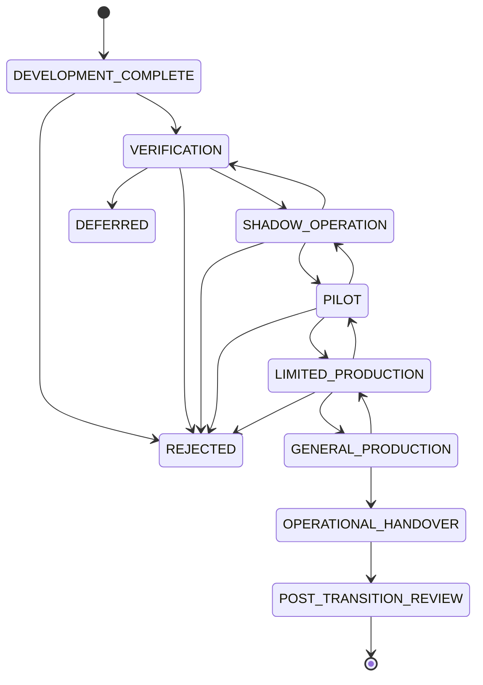

---

# DEVELOPMENT_COMPLETE

Entry criteria:

* implementation scope declared complete;
* source code frozen for Release Candidate;
* required migrations included;
* documentation draft complete;
* no known untracked critical defect.

Exit criteria:

* Verification Plan approved;
* test environment ready;
* evidence collection started.

---

# VERIFICATION

Activities:

* execute Testing Strategy;
* evaluate Quality Gates;
* perform security review;
* perform recovery tests;
* perform provider contract tests;
* perform deployment rehearsal;
* evaluate documentation.

Exit criteria:

```yaml id="nzg70x"
verification_exit:
  mandatory_tests_passed: true
  no_blocking_security_findings: true
  no_blocking_integrity_findings: true
  acceptance_evidence_bundle_complete: true
  shadow_plan_approved: true
```

---

# SHADOW_OPERATION

Shadow Operation runs the new Orchestrator alongside the current or reference process without controlling production publication.

Purposes:

* compare scheduling;
* compare state transitions;
* compare provider decisions;
* validate observability;
* detect configuration drift;
* measure performance;
* validate operator workflows.

---

# Shadow Mode Restrictions

```yaml id="wxxfpn"
shadow_mode:
  provider_submission: disabled_or_isolated
  publication: disabled
  authoritative_state_mutation: isolated
  external_side_effects: prohibited
```

---

# Shadow Comparison

Required comparison outputs:

```yaml id="dmgxzz"
shadow_comparison:
  task_graph_diff:
  scheduling_diff:
  provider_selection_diff:
  quality_gate_diff:
  artifact_expectation_diff:
  estimated_cost_diff:
  event_sequence_diff:
```

Differences must be explained.

---

# PILOT

Pilot enables controlled execution for a limited scope.

Possible restrictions:

* one project;
* one Build at a time;
* one provider;
* no automatic publication;
* mandatory human approval;
* low budget;
* fixed concurrency;
* enhanced logging.

---

# Pilot Entry Criteria

```yaml id="mxjjk1"
pilot_entry:
  shadow_operation_passed: true
  rollback_plan_validated: true
  operators_trained: true
  provider_budget_approved: true
  publication_disabled_or_manual: true
  incident_escalation_ready: true
```

---

# Pilot Exit Criteria

Pilot may advance when:

* required number of Builds completes;
* no critical defect occurs;
* no duplicate external effect occurs;
* recovery procedure succeeds;
* operator feedback is addressed;
* observability proves sufficient;
* cost remains within tolerance;
* all conditions are closed or explicitly transferred.

---

# LIMITED_PRODUCTION

Limited Production supports real operational use under bounded capacity and scope.

Typical restrictions:

```yaml id="du4gy6"
limited_production:
  maximum_concurrent_builds: 3
  automatic_publication: false
  provider_allowlist:
    - approved_provider
  manual_release_gate: true
  enhanced_alerting: true
```

---

# Limited Production Exit Criteria

```yaml id="zgtdba"
limited_production_exit:
  reliability_target_met: true
  performance_target_met: true
  recovery_drill_passed: true
  security_monitoring_stable: true
  no_open_critical_conditions: true
  operational_owner_signoff: true
  general_production_plan_approved: true
```

---

# GENERAL_PRODUCTION

General Production enables the approved production scope.

It does not imply unrestricted behavior.

All Configuration, Security, Governance, Budget, and Quality Gate constraints remain active.

---

# General Production Preconditions

```yaml id="t86rbb"
general_production_preconditions:
  acceptance_decision: ACCEPTED
  release_quality_gate_passed: true
  operational_handover_ready: true
  rollback_ready: true
  monitoring_ready: true
  alerting_ready: true
  on_call_ready: true
  capacity_approved: true
  security_approval: true
  governance_approval: true
```

---

# OPERATIONAL_HANDOVER

Operational Handover transfers responsibility from implementation owners to declared runtime owners.

Required handover package:

```yaml id="4ciuxg"
operational_handover_package:
  architecture:
  deployment_artifacts:
  configuration_snapshots:
  runbooks:
  dashboards:
  alerts:
  provider_contacts:
  recovery_procedures:
  known_limitations:
  ownership_matrix:
  open_conditions:
  evidence_bundle:
```

---

# Handover Acceptance

Operational owners must acknowledge:

* access is available;
* dashboards are functional;
* alerts are routed;
* Runbooks are understood;
* recovery can be performed;
* escalation contacts are valid;
* configuration change process is understood;
* security incident procedure is understood.

---

# POST_TRANSITION_REVIEW

A Post-Transition Review occurs after a defined operating period.

Recommended timing:

```yaml id="zkeqtc"
post_transition_review:
  initial_review_after: "14d"
  full_review_after: "30d"
```

---

# Post-Transition Review Scope

Review:

* reliability;
* incidents;
* retries;
* provider failures;
* duplicate prevention;
* compensation;
* rollback;
* cost;
* throughput;
* operator burden;
* Quality Gate effectiveness;
* security alerts;
* configuration overrides;
* residual risks.

---

# Transition Plan

Canonical model:

```yaml id="nnz7jk"
transition_plan:
  transition_plan_id:
  source_state:
  target_state:
  scope:
  stages:
  stage_entry_criteria:
  stage_exit_criteria:
  responsible_owners:
  rollback_plan:
  monitoring_plan:
  communication_plan:
  training_plan:
  risk_register:
  approved_by:
```

---

# Transition Entry Gate

Every stage transition requires a Quality Gate.

Examples:

```text id="qmzq7v"
Verification → Shadow
Shadow → Pilot
Pilot → Limited Production
Limited Production → General Production
```

No transition may be based solely on elapsed time.

---

# Transition Quality Gate

Canonical result:

```yaml id="l9jbez"
transition_gate_result:
  transition:
  source_stage:
  target_stage:
  decision:
  criteria_results:
  evidence_references:
  residual_risks:
  conditions:
  authority:
  evaluated_at:
```

---

# Transition Rollback

Every transition stage must define rollback.

Examples:

| Current Stage      | Rollback Target                     |
| ------------------ | ----------------------------------- |
| Shadow             | Verification                        |
| Pilot              | Shadow                              |
| Limited Production | Pilot                               |
| General Production | Limited Production or prior runtime |

---

# Transition Rollback Triggers

```yaml id="ugpih3"
transition_rollback_triggers:
  - CRITICAL_SECURITY_FINDING
  - MANIFEST_INTEGRITY_FAILURE
  - DUPLICATE_PUBLICATION
  - UNRECONCILED_PROVIDER_DUPLICATE
  - RECOVERY_FAILURE
  - CONFIGURATION_DRIFT
  - SUSTAINED_ERROR_RATE
  - COST_LIMIT_BREACH
  - OPERATIONAL_CONTROL_FAILURE
  - GOVERNANCE_BYPASS
```

---

# Rollback Readiness

Before each production stage:

```yaml id="zgv6k3"
transition_rollback_readiness:
  prior_version_available: true
  prior_configuration_available: true
  data_compatibility_understood: true
  schema_rollback_or_forward_fix_defined: true
  traffic_or_workload_switch_defined: true
  running_build_policy_defined: true
  rollback_authority_assigned: true
```

---

# Running Build Transition Policy

During deployment or transition, active Builds must follow an explicit policy.

Supported policies:

```yaml id="1l61iv"
running_build_transition_policies:
  - COMPLETE_ON_OLD_RUNTIME
  - PAUSE_AND_RESUME_ON_NEW_RUNTIME
  - MIGRATE_IF_COMPATIBLE
  - CANCEL_AND_RESTART
```

Default:

```text id="e77y1j"
COMPLETE_ON_OLD_RUNTIME
```

unless compatibility and migration safety are proven.

---

# Dual Runtime Operation

During staged rollout, old and new runtime versions may coexist.

Requirements:

* Build ownership is exclusive;
* each Build is bound to one runtime compatibility set;
* Queue routing is version-aware;
* Worker compatibility is enforced;
* Event versions are supported;
* Configuration Snapshot remains stable;
* provider idempotency identity remains unique.

---

# Traffic or Build Allocation

Pilot and limited production allocation may use:

```yaml id="0b2jao"
allocation_strategies:
  - ALLOWLIST
  - PROJECT
  - BUILD_PROFILE
  - PERCENTAGE
  - MANUAL_SELECTION
```

Percentage rollout must use deterministic allocation.

---

# Transition Data Migration

Transition may require migration of:

* Runtime Manifests;
* Event indexes;
* Configuration records;
* Checkpoints;
* Idempotency records;
* Queue metadata;
* Artifact metadata;
* read models.

---

# Data Migration Preconditions

```yaml id="hyjc57"
transition_migration_preconditions:
  backup_complete: true
  migration_tested: true
  migration_idempotent: true
  integrity_checks_defined: true
  rollback_or_forward_repair_defined: true
  downtime_or_online_mode_declared: true
```

---

# Migration Verification

Post-migration checks:

* record counts;
* hash verification;
* sequence continuity;
* foreign-reference validity;
* schema version;
* representative Build inspection;
* Checkpoint loading;
* Event replay;
* API query.

---

# Transition Communication

The Transition Plan must define communication for:

* operators;
* developers;
* governance authorities;
* publication owners;
* provider owners;
* incident responders.

---

# Transition Communication Record

```yaml id="7elopm"
transition_communication:
  audience:
  message:
  effective_time:
  expected_action:
  owner:
  acknowledgement_required:
```

---

# Training Acceptance

Operators must be trained on:

* Build inspection;
* Pause and Cancel;
* Resume;
* provider reconciliation;
* failed Task diagnosis;
* compensation;
* rollback;
* Configuration Drift;
* emergency controls;
* publication revocation;
* security incident escalation.

Training completion must be recorded.

---

# Residual Risk Model

Canonical residual risk:

```yaml id="oh31ue"
residual_risk:
  risk_id:
  category:
  description:
  probability:
  impact:
  affected_scope:
  compensating_control:
  owner:
  due_date:
  acceptance_authority:
  status:
```

---

# Residual Risk Status

```yaml id="8wcn06"
residual_risk_states:
  - OPEN
  - ACCEPTED_TEMPORARILY
  - MITIGATING
  - CLOSED
  - EXPIRED
```

---

# Blocking Residual Risks

The following risks block General Production:

* known secret leakage;
* unresolved Manifest corruption;
* duplicate publication path;
* unauthorized rollback path;
* unreliable provider reconciliation;
* failed crash recovery;
* missing operational owner;
* missing rollback capability;
* unbounded cost exposure;
* security- or governance-critical drift.

---

# Acceptance Condition

Canonical condition:

```yaml id="7zsq9a"
acceptance_condition:
  condition_id:
  acceptance_id:
  description:
  scope:
  restriction:
  owner:
  due_date:
  verification_method:
  status:
```

---

# Condition Expiration

An expired unresolved condition automatically invalidates `ACCEPTED_WITH_CONDITIONS`.

The platform must:

* alert;
* restrict use;
* reevaluate acceptance;
* potentially roll back transition stage.

---

# Known Limitation

Canonical record:

```yaml id="pfsi9x"
known_limitation:
  limitation_id:
  description:
  affected_profiles:
  operational_impact:
  workaround:
  planned_resolution:
  owner:
```

Known limitations must be visible to operators and clients where relevant.

---

# Acceptance Exception

An exception allows temporary deviation from a noncritical criterion.

Canonical model:

```yaml id="y74yzr"
acceptance_exception:
  exception_id:
  criterion_id:
  justification:
  risk:
  compensating_controls:
  authority:
  scope:
  expires_at:
  remediation_plan:
```

---

# Non-Waivable Criteria

The following are non-waivable for production:

```yaml id="08s6fb"
non_waivable_acceptance_criteria:
  - AUTHENTICATION_REQUIRED
  - AUTHORIZATION_REQUIRED
  - NO_SECRET_LEAKAGE
  - MANIFEST_INTEGRITY
  - IDEMPOTENT_EXTERNAL_SIDE_EFFECTS
  - PUBLICATION_APPROVAL
  - BUILD_ISOLATION
  - CRASH_RECOVERY
  - AUDIT_PRESERVATION
  - ROLLBACK_AUTHORITY
```

---

# Acceptance Evaluation Process

```text id="ptdzwf"
Collect Evidence
↓
Validate Evidence Integrity
↓
Evaluate Category Criteria
↓
Evaluate Quality Gates
↓
Evaluate Residual Risk
↓
Obtain Authority Decisions
↓
Create Acceptance Record
↓
Approve or Reject Transition Plan
```

---

# Category Result

```yaml id="esyzlw"
acceptance_category_result:
  category:
  decision:
  criteria_total:
  criteria_passed:
  criteria_failed:
  conditions:
  evidence_references:
  authority:
```

---

# Acceptance Score

A diagnostic score may be calculated.

```text id="m91md8"
Acceptance Score =
weighted passed criteria
/
weighted applicable criteria
```

The score must not override mandatory blocking criteria.

---

# Acceptance Criteria Registry

Canonical criterion:

```yaml id="jpg0c9"
acceptance_criterion:
  criterion_id:
  category:
  description:
  mandatory:
  risk:
  evidence_required:
  evaluation_method:
  authority:
```

---

# Acceptance Evaluator Interface

```python id="mt1tb3"
class AcceptanceEvaluator:
    def evaluate(
        self,
        candidate: "AcceptanceCandidate",
        policy: "AcceptancePolicy",
    ) -> "AcceptanceEvaluationResult":
        ...
```

---

# Transition Coordinator Interface

```python id="wos7p6"
class TransitionCoordinator:
    def request_transition(
        self,
        plan: "TransitionPlan",
    ) -> "TransitionOperation":
        ...

    def evaluate_stage_exit(
        self,
        transition_plan_id: str,
        stage: str,
    ) -> "TransitionGateResult":
        ...

    def rollback_stage(
        self,
        transition_plan_id: str,
        reason: str,
    ) -> "TransitionRollbackResult":
        ...
```

---

# Acceptance Evidence Interface

```python id="4m1udl"
class AcceptanceEvidenceRepository:
    def register(
        self,
        bundle: "AcceptanceEvidenceBundle",
    ) -> str:
        ...

    def verify(
        self,
        evidence_bundle_id: str,
    ) -> "EvidenceVerificationResult":
        ...

    def load(
        self,
        evidence_bundle_id: str,
    ) -> "AcceptanceEvidenceBundle":
        ...
```

---

# Acceptance Registry Interface

```python id="03i68u"
class AcceptanceRegistry:
    def record(
        self,
        acceptance: "AcceptanceRecord",
    ) -> None:
        ...

    def current(
        self,
        platform_version: str,
        deployment_profile: str,
    ) -> "AcceptanceRecord | None":
        ...
```

---

# Transition Public Interfaces

Recommended endpoints:

```text id="t91mqy"
POST /api/v2/acceptance-evaluations
GET  /api/v2/acceptance-evaluations/{acceptance_id}

POST /api/v2/transitions
GET  /api/v2/transitions/{transition_plan_id}

POST /api/v2/transitions/{transition_plan_id}/advance
POST /api/v2/transitions/{transition_plan_id}/rollback

GET  /api/v2/releases/{version}/acceptance
GET  /api/v2/releases/{version}/transition-status
```

These interfaces require elevated authority.

---

# Acceptance Dry Run

Acceptance evaluation should support dry-run.

```yaml id="txvu68"
acceptance_dry_run:
  candidate_version:
  applicable_criteria:
  currently_satisfied:
  currently_failed:
  missing_evidence:
  blocking_risks:
  required_authorities:
  predicted_decision:
```

---

# Transition Dry Run

```yaml id="uxqz1v"
transition_dry_run:
  source_stage:
  target_stage:
  entry_criteria:
  unsatisfied_criteria:
  affected_builds:
  migration_required:
  rollback_ready:
  estimated_risk:
  required_authorities:
```

---

# Acceptance and Transition Events

Required Events:

```text id="ywf3br"
acceptance.evaluation.started
acceptance.evidence.verified
acceptance.evidence.rejected
acceptance.category.passed
acceptance.category.failed
acceptance.condition.created
acceptance.condition.closed
acceptance.accepted
acceptance.accepted_with_conditions
acceptance.deferred
acceptance.rejected

transition.plan.created
transition.stage.entry.requested
transition.stage.entered
transition.stage.exit.evaluated
transition.stage.completed
transition.rollback.requested
transition.rollback.completed
transition.handover.completed
transition.post_review.completed
```

---

# Acceptance Metrics

```yaml id="gho33r"
acceptance_metrics:
  evaluations_started:
  evaluations_accepted:
  evaluations_conditional:
  evaluations_deferred:
  evaluations_rejected:
  criteria_pass_rate:
  blocking_criteria_failures:
  open_conditions:
  expired_conditions:
  residual_risks:
  evidence_verification_failures:
```

---

# Transition Metrics

```yaml id="v9us95"
transition_metrics:
  transitions_started:
  stage_duration_seconds:
  stage_rollbacks:
  pilot_builds:
  pilot_failure_rate:
  limited_production_builds:
  transition_incidents:
  post_transition_conditions:
  handover_completion_rate:
```

---

# Acceptance Dashboard

The Acceptance Dashboard should display:

* candidate version;
* category results;
* blocking criteria;
* evidence status;
* Quality Gate status;
* security findings;
* residual risks;
* conditions;
* authority approvals;
* current decision.

---

# Transition Dashboard

The Transition Dashboard should display:

* current stage;
* stage entry time;
* exit criteria;
* pilot or production Build statistics;
* incidents;
* rollback readiness;
* active restrictions;
* conditions;
* next decision authority.

---

# Reference Acceptance Policy

```yaml id="wmkzcj"
acceptance:
  require_complete_evidence_bundle: true
  require_release_quality_gate: true
  require_security_approval: true
  require_governance_approval: true
  require_operational_owner: true
  require_crash_recovery: true
  require_provider_contracts: true
  allow_conditional_acceptance: true

  non_waivable:
    - SECRET_LEAKAGE
    - MANIFEST_INTEGRITY
    - IDEMPOTENCY
    - BUILD_ISOLATION
    - PUBLICATION_AUTHORITY
    - CRASH_RECOVERY

transition:
  stages:
    - VERIFICATION
    - SHADOW_OPERATION
    - PILOT
    - LIMITED_PRODUCTION
    - GENERAL_PRODUCTION
    - OPERATIONAL_HANDOVER

  require_stage_gate: true
  require_rollback_plan: true
  require_monitoring_plan: true
  require_operator_training: true
```

---

# Reference Pilot Configuration

```yaml id="h4d9kn"
pilot:
  maximum_concurrent_builds: 1
  maximum_daily_builds: 3
  provider_allowlist:
    - runway
    - local

  publication:
    automatic: false
    approval_required: true

  budget:
    maximum_per_build:
      amount: 25
      currency: USD

  operations:
    enhanced_logging: true
    manual_release_gate: true
    on_call_required: true
```

---

# Testing Requirements

## Unit Tests

* criterion applicability;
* mandatory criterion handling;
* evidence verification;
* category decision aggregation;
* conditional acceptance logic;
* non-waivable criterion enforcement;
* condition expiration;
* transition-stage validation;
* deterministic rollout allocation.

## Integration Tests

* evidence bundle registration;
* Test Evidence linkage;
* Quality Gate linkage;
* Acceptance Record creation;
* authority approval workflow;
* Transition Plan creation;
* stage advancement;
* stage rollback;
* handover completion.

## Acceptance Tests

* fully accepted Release Candidate;
* accepted with noncritical conditions;
* deferred due to missing evidence;
* rejected due to security failure;
* rejected due to Manifest integrity failure;
* expired condition invalidates acceptance;
* incomplete ownership blocks transition.

## Transition Tests

* Verification to Shadow;
* Shadow to Pilot;
* Pilot to Limited Production;
* Limited Production to General Production;
* failed stage gate;
* rollback to prior stage;
* dual-runtime Build ownership;
* active Build deployment policy;
* migration during transition;
* Post-Transition Review.

## Security Tests

* unauthorized acceptance decision;
* unauthorized stage advancement;
* forged authority;
* evidence tampering;
* exception for non-waivable criterion;
* hidden security finding;
* cross-project transition access.

## Recovery Tests

* rollback from Pilot;
* rollback from Limited Production;
* configuration rollback during transition;
* prior runtime restoration;
* active Build completion on old runtime;
* resumed Build on new runtime where compatible.

## Performance Tests

* large evidence bundle evaluation;
* 10,000 criteria;
* multiple concurrent candidate releases;
* dashboard query;
* transition metrics aggregation.

## Determinism Tests

Given identical:

* candidate version;
* acceptance policy;
* evidence bundle;
* authority decisions;
* residual risks;

the Acceptance Decision must be identical.

---

# Acceptance & Transition Quality Gate

```yaml id="pw578u"
acceptance_transition_quality_gate:
  full_orchestration_scope_evaluated: true
  every_mandatory_criterion_has_evidence: true
  every_architectural_invariant_verified: true
  release_quality_gate_passed: true
  provider_contracts_passed: true
  security_acceptance_passed: true
  governance_acceptance_passed: true
  recovery_acceptance_passed: true
  performance_acceptance_passed: true
  operational_runbooks_complete: true
  observability_acceptance_passed: true
  operational_owner_assigned: true
  rollback_plan_validated: true
  transition_stages_defined: true
  every_stage_has_entry_and_exit_criteria: true
  every_stage_has_rollback_target: true
  pilot_restrictions_defined: true
  active_build_transition_policy_defined: true
  non_waivable_criteria_enforced: true
  residual_risks_recorded: true
  acceptance_conditions_time_bounded: true
  handover_package_complete: true
  post_transition_review_scheduled: true
```

---

# Architectural Invariants

## Invariant AT-301

Acceptance is based on immutable, versioned, independently verifiable evidence.

## Invariant AT-302

No Release Candidate may transition to production with a failed non-waivable criterion.

## Invariant AT-303

Acceptance and production transition are separate governed decisions.

## Invariant AT-304

Every transition stage has explicit entry criteria, exit criteria, responsible authority, monitoring, and rollback.

## Invariant AT-305

A successful demonstration Build does not independently establish platform acceptance.

## Invariant AT-306

Existing Builds remain bound to their original Runtime, Execution Plan, and Configuration compatibility contract during transition unless an approved migration occurs.

## Invariant AT-307

Conditional acceptance is time-bounded, scope-bounded, owner-assigned, and automatically invalidated when conditions expire.

## Invariant AT-308

Operational ownership, Runbooks, monitoring, recovery, and escalation are mandatory components of production acceptance.

## Invariant AT-309

Transition rollback preserves Runtime Manifest, Event, Artifact, Cost, Approval, and Acceptance history.

## Invariant AT-310

General Production requires completed technical, security, governance, operational, recovery, and ownership acceptance.

---

# Architectural Decision Records

| ADR      | Decision                                                                                                                                                                                                         |
| -------- | ---------------------------------------------------------------------------------------------------------------------------------------------------------------------------------------------------------------- |
| ADR-1041 | Acceptance is a formal evidence-based architectural decision rather than a declaration of development completion.                                                                                                |
| ADR-1042 | The complete Orchestration scope is evaluated across architectural, functional, state, integration, provider, security, governance, operational, performance, recovery, compatibility, and ownership dimensions. |
| ADR-1043 | Acceptance Decisions are limited to ACCEPTED, ACCEPTED_WITH_CONDITIONS, DEFERRED, or REJECTED.                                                                                                                   |
| ADR-1044 | Acceptance Evidence Bundles are immutable, content-verified, version-bound, and preserved for audit and release reconstruction.                                                                                  |
| ADR-1045 | Non-waivable security, integrity, idempotency, isolation, publication-authority, and crash-recovery criteria block production transition.                                                                        |
| ADR-1046 | Production transition proceeds through Verification, Shadow Operation, Pilot, Limited Production, General Production, Operational Handover, and Post-Transition Review stages.                                   |
| ADR-1047 | Every transition stage requires explicit entry, exit, monitoring, ownership, and rollback criteria.                                                                                                              |
| ADR-1048 | Existing Builds remain bound to their original runtime and configuration contract unless explicitly migrated through a compatible and approved process.                                                          |
| ADR-1049 | Conditional acceptance is restricted, temporary, auditable, and automatically subject to reevaluation when conditions expire.                                                                                    |
| ADR-1050 | Production acceptance requires operational ownership, tested Runbooks, observability, recovery, rollback readiness, security approval, and governance approval in addition to implementation correctness.        |

---

# Final Acceptance Criteria for Part 6.3

Part **6.3 — Build Orchestration & Runtime Control** is complete when:

* Sections 6.3.1 through 6.3.25 are implemented as one coherent runtime architecture.
* The Orchestrator accepts a valid Execution Plan and creates one authoritative Runtime Manifest.
* Build and Task State Machines enforce all transition guards.
* Dependencies, readiness, Scheduling, Queues, Workers, Providers, Artifacts, Events, and Manifests remain internally consistent.
* Runtime execution survives duplicate delivery, concurrent commands, Worker loss, Orchestrator loss, provider ambiguity, Queue redelivery, and GitHub Actions termination.
* Every material external side effect is idempotent, reconciled, or compensated.
* Checkpoint and Resume preserve completed work and do not repeat accepted provider or publication operations.
* Retry, Backoff, Failure Classification, Compensation, and Rollback preserve complete evidence and never rewrite history.
* Pause, Cancel, and Graceful Shutdown create safe, durable interruption boundaries.
* Backpressure protects Providers, Queues, Workers, Storage, Budget, and control-plane capacity.
* Events are immutable, ordered, dispatchable, replay-safe, and linked to authoritative Manifest mutations.
* Observability reconstructs complete Build timelines and explains material orchestration decisions without relying on transient memory.
* Security and Secret Boundaries enforce authenticated identity, least privilege, Build isolation, Secret References, webhook verification, and governance separation.
* Configuration is resolved deterministically into immutable Build-bound Snapshots.
* Public Interfaces expose typed Commands, Queries, durable Operations, controlled artifact access, and stable error contracts without exposing mutable infrastructure internals.
* Testing Strategy provides automated coverage for every architectural invariant, critical State Machine transition, failure mode, provider contract, security boundary, recovery path, and Quality Gate.
* Quality Gates prevent unsafe stage progression and preserve immutable evidence for every decision.
* Acceptance evidence proves functional, security, governance, operational, performance, recovery, compatibility, deployment, and ownership readiness.
* Production transition follows explicit Verification, Shadow, Pilot, Limited Production, General Production, Handover, and Post-Transition Review stages.
* Every transition stage has entry criteria, exit criteria, responsible authority, monitoring, residual-risk handling, and rollback capability.
* No production transition occurs with unresolved non-waivable security, integrity, idempotency, isolation, publication-authority, audit, or crash-recovery failure.
* Final Acceptance and Transition records are immutable, versioned, attributable, and independently auditable.
