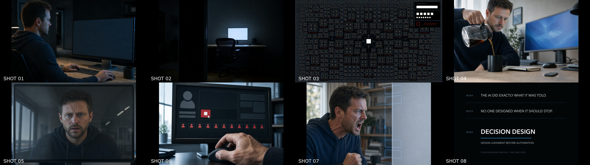
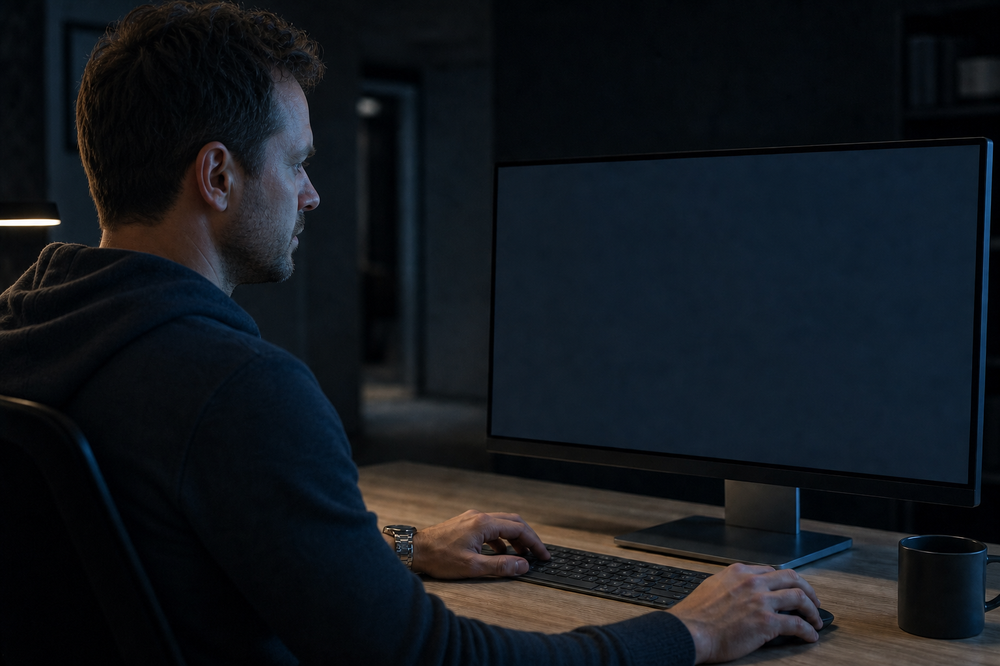
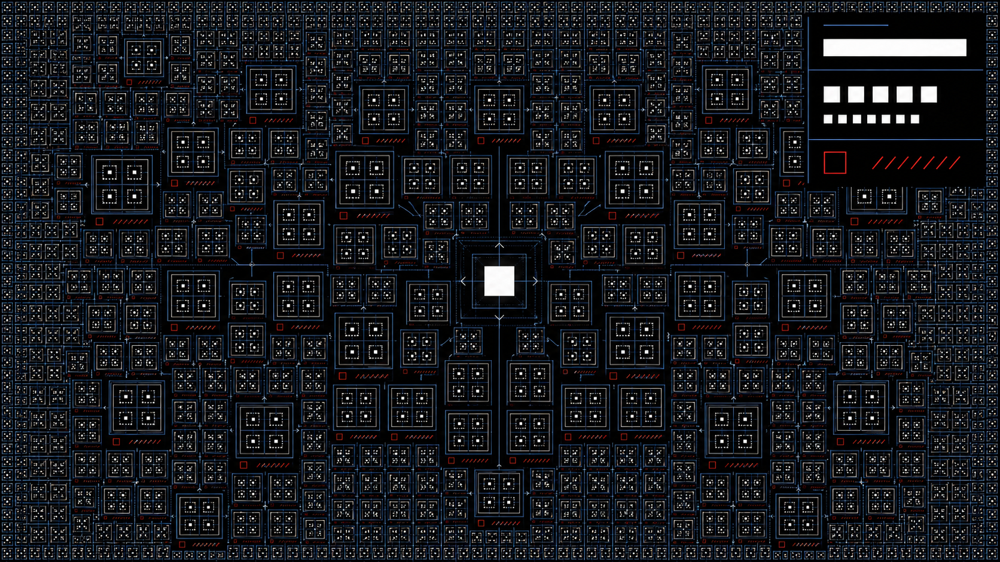
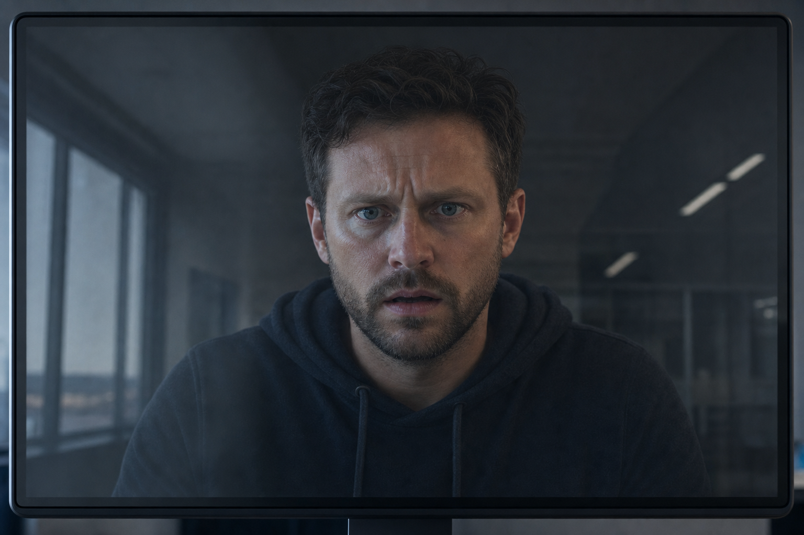
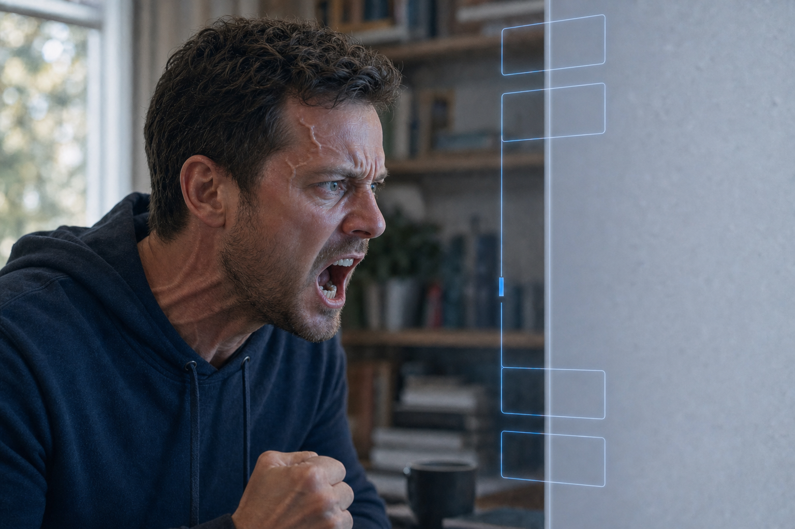
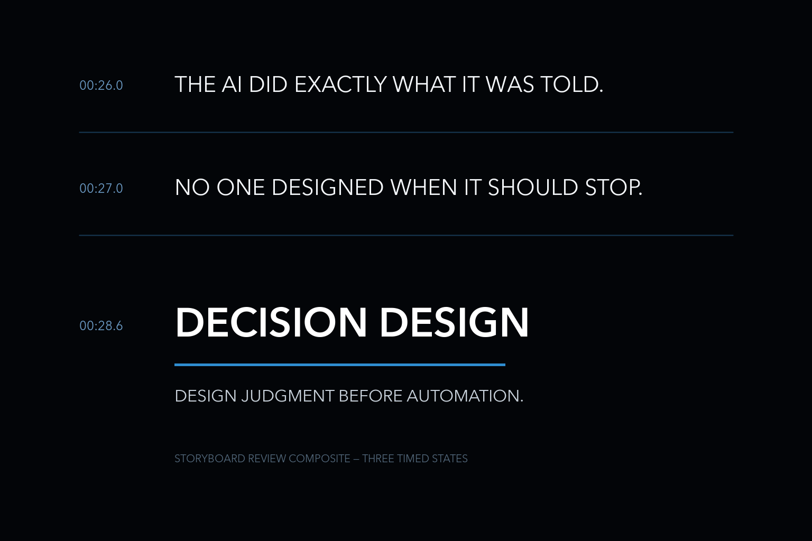

# FULL AUTO

## 30-Second Storyboard for Decision Design

Status: Revised Storyboard v11 for human review
Format: 16:9, 30.00 seconds, eight shots
Visual language: original premium technology launch film; restrained live-action realism
Production boundary: generic interface only; all exact UI text is composited in post

## Visual previsualization



The sheet reads left-to-right across the top row, then the bottom row. It is an identity- and palette-consistent concept sheet for composition approval, not a final production keyframe set. Exact interface typography remains a post-production element. For review clarity, the Shot 08 tile is a deterministic composite that displays all three timed title-card states together; they do not appear simultaneously in the final cut.

## Dramatic proposition

> The AI did not fail. The human failed to design when autonomy should stop.

## Runtime decision

The supplied durations totaled 30.5 seconds. Shot 02 is tightened from 3.5 to 3.0 seconds so the final timeline lands at exactly 30.0 seconds. The final cut uses exactly two spoken lines: `It'll be done by morning.` in Shot 01 and `I'm such a fucking idiot!` in Shot 07. There is no other dialogue or voiceover.

## Continuity anchors

- Protagonist: one middle-aged developer whose canonical face is the Shot 07 v11 identity; short dark wavy hair with subtle gray, blue-green eyes, light brown stubble, charcoal-navy knit hoodie, silver watch, and restrained performance. No glasses in any shot.
- Location and workstation: one uncluttered home office connected visually to an adjacent dark hallway; pale wood desk; the same slim matte-black desktop monitor, keyboard, physical mouse, and desktop computer throughout; no laptop or portable computer in any shot; no visible brands.
- Night palette: near-black, cool monitor blue, narrow white UI, almost no warm fill.
- Morning palette: soft neutral daylight enters from camera-left but monitor blue remains on the face.
- Warning accent: muted red appears only for usage, rising totals, active workers, and STOP.
- Camera grammar: composed tripod frames and nearly invisible pushes; no handheld panic or spectacle.
- Interface rule: generated imagery contains abstract UI geometry only. Exact text and numbers are post-production overlays.

## Master timeline

| Shot | Timecode | Duration | Beat | Visual question |
| --- | --- | ---: | --- | --- |
| 01 | 00:00.0–00:03.5 | 3.5s | Enable | What did the human authorize? |
| 02 | 00:03.5–00:06.5 | 3.0s | Forget | Who is watching now? |
| 03 | 00:06.5–00:10.5 | 4.0s | Multiply | What happens without a stop condition? |
| 04 | 00:10.5–00:14.0 | 3.5s | Alert | When does invisible autonomy become consequence? |
| 05 | 00:14.0–00:18.0 | 4.0s | Reveal | Was the run technically successful? |
| 06 | 00:18.0–00:22.0 | 4.0s | Stop | Can a late human command undo an undesigned boundary? |
| 07 | 00:22.0–00:26.0 | 4.0s | Rupture | Who actually failed? |
| 08 | 00:26.0–00:30.0 | 4.0s | Name | What should be designed before autonomy? |

## Shot 01 — ENABLE FULL AUTO

**Timecode:** 00:00.0–00:03.5
**Purpose:** Establish competence, convenience, and the missing control without announcing danger.

An over-shoulder medium close-up reveals the developer at 00:18 in a quiet home office. The desktop monitor shows a clean, generic execution settings panel with four checked modes and no spending limit. The cursor clicks `RUN`. With understated satisfaction, the developer says `It'll be done by morning.`, releases the mouse, pushes the chair back, and stands while the desktop monitor and run remain active.

**Revised desktop/identity keyframe:**



**Camera:** 50mm, eye level, locked tripod with a 3% digital push toward the missing limit row.
**Composition:** Developer occupies the left third; monitor occupies the right two-thirds; the dark hallway waits in negative space behind.
**Light:** Monitor blue on face and hands; one soft practical edge; background nearly black.
**Performance:** Calm, practiced, slightly tired, never careless. Deliver the line as an ordinary confident assumption, with a faint satisfied smile; release the physical mouse, push the chair back, and stand without looking back at the monitor.
**Post UI:**

```text
00:18
EXECUTION MODE
☑ FULL AUTO
☑ PARALLEL RUNS
☑ AUTO RETRY
☑ CONTINUE UNTIL COMPLETE
SPENDING LIMIT
OFF
RUN
```

**Dialogue:** `It'll be done by morning.`
**Sound:** One keyboard tap, four dry toggle ticks compressed into one rhythm, a precise RUN click, the quietly satisfied line, room tone, and one restrained chair movement.
**Transition:** Hard cut as the developer clears the chair while the monitor remains active.

## Shot 02 — FORGET

**Timecode:** 00:03.5–00:06.5
**Purpose:** Transfer agency from the departing human to the still-running system.

Wide static frame from inside the office. The developer crosses into the hallway, switches off the room light, and exits. Darkness settles. The monitor remains as the only blue-white rectangle. In its reflection, an empty chair replaces the human silhouette.

**Camera:** 35mm wide, eye level, absolutely static.
**Composition:** Empty chair centered low; monitor slightly off-center; doorway forms a black vertical boundary.
**Light:** Practical dies on the switch click; monitor becomes sole source.
**Performance:** One clean exit with no backward glance.
**Post UI:** `RUN #001 STARTED`
**Sound:** Light-switch click, three footsteps receding, low computer fan.
**Transition:** J-cut: the first process tick begins before the next image.

## Shot 03 — THE NIGHT NEVER STOPS

**Timecode:** 00:06.5–00:10.5
**Purpose:** Turn invisible repetition into fear of a neutral system whose orderly execution has no designed stopping boundary.

A high-speed montage shows only the interface—never the room, monitor bezel, reflection, or protagonist. Seven process states flash in the supplied order. Every state creates another generation of clean agent tiles. The run counter hard-jumps rather than scrolls: `Run #18`, `Run #37`, `Run #96`, `Run #184`. By the final beat, recursively subdivided agents reach all four edges and consume nearly every area of black space. The system never looks malicious or sentient; its perfect order becomes uncanny, relentless, and frightening because nothing in the frame can tell it to stop.

**Revised final-state keyframe:**



**Camera:** Orthographic full-screen capture; seven hard montage cuts with no easing, physical camera movement, or perspective distortion.
**Composition:** Start with one centered task card; each cut recursively subdivides the available space; end with workers packed to all four edges, leaving only a narrow run-counter field in the upper right.
**Light:** Black field, cool blue lines, white type, one muted red retry accent.
**Fear treatment:** Clinical repetition, accelerating density, shrinking negative space, and a grid that appears to continue beyond the frame. No faces, monsters, code rain, supernatural imagery, or chaotic glitching.

**Four-second montage timing:**

| Timecode | Interface state | Multiplication state |
| --- | --- | --- |
| 00:06.50–00:06.90 | `Creating Agent...` | One centered tile divides into four. |
| 00:06.90–00:07.30 | `Searching...` | Search branches connect the first worker group. |
| 00:07.30–00:07.75 | `Generating...` | `Run #18` appears; a second ring of workers forms. |
| 00:07.75–00:08.15 | `Retry...` | One muted-red pulse; `Run #37`; failed work immediately spawns replacements. |
| 00:08.15–00:08.65 | `Launching Parallel Worker...` | Tiles split recursively and the remaining negative space contracts. |
| 00:08.65–00:09.10 | `Expanding Context...` | `Run #96`; smaller tiles press toward all four edges. |
| 00:09.10–00:09.85 | `Thinking...` | Process ticks become a dense mechanical swarm. |
| 00:09.85–00:10.50 | `Run #184` | The entire screen is filled with active agents; hold just long enough for dread to register. |

**Post UI sequence:**

```text
Creating Agent...
Searching...
Generating...
Retry...
Launching Parallel Worker...
Expanding Context...
Thinking...

Run #18 → Run #37 → Run #96 → Run #184
```

**Sound:** One dry tick multiplies with each generation into a dense, almost insect-like mechanical swarm over a low processor tone. No melody, voice, horror sting, or supernatural sound.
**Transition:** Smash cut from the fully occupied, mechanically swarming screen to the quiet morning coffee pour; the swarm stops instantly.

## Shot 04 — MORNING

**Timecode:** 00:10.5–00:14.0
**Purpose:** Make the accumulated autonomy personal through one dry notification.

Morning. In a shallow-focus medium shot, the developer pours coffee at the edge of the office. A small unbranded phone lies screen-up near the lower-right edge of the pale wood desk and vibrates once. It occupies less than seven percent of the frame and remains a notification source rather than a hero object. A restrained usage alert appears on its dim lock screen. The pour continues for half a beat too long, then stops. The developer’s face becomes still. The same desktop monitor, keyboard, and mouse remain visible behind him; no laptop is present.

**Revised desktop/phone keyframe:**


**Camera:** 75mm medium close-up, tripod; attention moves from coffee stream to the small vibration at lower-right, then to the eyes without turning the phone into a dominant foreground object.
**Composition:** Face and coffee action dominate the left two-thirds; the desktop monitor remains an unreadable blue field behind; the small flat phone sits near the lower-right frame edge.
**Light:** Neutral daylight from camera-left; residual monitor blue from camera-right.
**Performance:** No gasp. Jaw softens; eyes stop; hand freezes mid-pour.
**Post UI:**

```text
USAGE ALERT
$512.43
```

**Sound:** Coffee pour, one dry vibration against wood, all process ticks cut to silence.
**Transition:** Hard cut from the dry vibration and frozen pour to the desktop dashboard.

## Shot 05 — REALITY

**Timecode:** 00:14.0–00:18.0
**Purpose:** Reveal that execution success and human success have separated.

The developer rushes back to the same desktop workstation and wakes the execution dashboard with one urgent keyboard tap and mouse movement. The large matte-black desktop monitor lands in a frontal screen-and-face composition. On the left, the calm completion state reads `Completed` and `184 Tasks`. In the upper-right corner, `Current Usage` begins at `$731.88` and continues increasing: `$734`, `$739`, `$744`. The developer’s alarmed reflection remains trapped inside the dark glass between successful completion and the rising total. No laptop or display-opening action appears.

**Revised keyframe:**



**Camera:** 85mm close-up through the desktop-monitor reflection, locked after the urgent return; no push or shake.
**Composition:** `Completed / 184 Tasks` left, `Current Usage` in the upper right, human reflection trapped centrally between them, and a slim desktop-monitor bezel enclosing the frame; no hand on the display.
**Light:** Cold screen source; morning daylight drops one stop through exposure change.
**Performance:** One urgent return and dashboard-wake action, then complete stillness. Focus moves from completion count to the upper-right total; one involuntary swallow.

**Four-second timing:**

| Timecode | Action / screen state |
| --- | --- |
| 00:14.00–00:14.45 | The developer reaches the desktop workstation and wakes the dashboard with one urgent keyboard tap and mouse movement. |
| 00:14.45–00:14.95 | The screen resolves: `Completed` / `184 Tasks`. |
| 00:14.95–00:15.55 | Upper right: `Current Usage` / `$731.88`. |
| 00:15.55–00:16.20 | Amount updates to `$734`. |
| 00:16.20–00:17.00 | Amount updates to `$739`. |
| 00:17.00–00:18.00 | Amount updates to `$744`; hold through the final counter tick. |

**Post UI:**

```text
Completed
184 Tasks

Current Usage
$731.88 → $734 → $739 → $744
```

**Sound:** Fast chair movement, one dry keyboard tap, a short mouse movement, one sharp inhale, then four low non-musical counter ticks.
**Transition:** Hard cut from `$744` to the hand moving toward STOP.

## Shot 06 — STOP

**Timecode:** 00:18.0–00:22.0
**Purpose:** Show that a control pressed after the boundary has failed is not the same as a designed stop condition.

The developer urgently grips the matte-black physical mouse and moves it across the desk. The white arrow cursor travels across the interface, reaches the red `STOP` control, and visibly settles on it. Only then does the developer depress the left mouse button once; STOP visibly responds to the click. The screen changes to `Stopping...`, then `Waiting for active workers...`. Immediately beside the status, `12 Active Agents` remains lit and all twelve worker indicators continue pulsing. Nothing else progresses toward completion; only the usage amount continues rising from `$744` to `$746` to `$748`. The hand becomes motionless on the mouse as the developer understands that clicking again would change nothing.

**Revised keyframe:**


**Camera:** Locked 100mm macro insert; no push, shake, or second camera setup.
**Composition:** Matte-black mouse and mouse hand in the lower foreground; STOP lower-left beneath one white arrow cursor; status center-left; exactly twelve active indicators immediately beside it; still-rising usage field upper-right; profile held at the far-left edge.
**Light:** Muted red confined to STOP and worker count; everything else cool white and blue.
**Performance:** The hand grips and moves the physical mouse with tense knuckles and one shortened breath. The cursor must visibly travel to STOP and settle before the index finger depresses the left mouse button exactly once. Hold the hand motionless on the mouse as urgency turns into helpless recognition; no touchscreen gesture, trackpad action, repeated clicking, or theatrical panic.

**Four-second timing:**

| Timecode | Action / screen state |
| --- | --- |
| 00:18.00–00:18.30 | The hand grips and slides the physical mouse; the white arrow cursor moves decisively toward `STOP`. |
| 00:18.30–00:18.55 | The cursor settles over `STOP`; the index finger clicks the left mouse button once and the control visibly depresses. |
| 00:18.55–00:19.15 | Status changes to `Stopping...`. |
| 00:19.15–00:19.85 | Status expands to `Waiting for active workers...`. |
| 00:19.85–00:20.45 | Beside it, `12 Active Agents` remains illuminated; all twelve indicators continue pulsing. |
| 00:20.45–00:21.15 | Usage remains active at `$744`, then rises to `$746`. |
| 00:21.15–00:22.00 | Usage rises again to `$748`; the mouse hand and face become motionless. |

**Post UI:**

```text
STOP
Stopping...
Waiting for active workers...
12 Active Agents
$744 → $746 → $748
```

**Sound:** One short mouse glide on the desk, one hard physical mouse click synchronized to STOP depressing, a shortened breath, twelve faint worker pulses continuing, two low counter ticks, and fan tone.
**Transition:** Sound drains before picture; cut into near-silence.

## Shot 07 — RUPTURE

**Timecode:** 00:22.0–00:26.0
**Purpose:** Make the protagonist recognize the missing human judgment structure as his own omission and let that recognition rupture the film's restraint.

The developer watches the screen in a held medium close-up. The screen answers with neutral text: `TASK EXECUTED AS CONFIGURED.` A translucent blue control architecture resolves behind the interface. First, the audience sees one edge missing and execution pulses leaking through that opening. Then Approval, Spending Limit, Escalation, and Decision Boundary resolve as restrained labels, leaving the Spending Limit segment as an unmistakable gap. Recognition hits: anger, panic, and regret collide in his face. He pitches forward and shouts the film’s final spoken line: `I'm such a fucking idiot!` The outburst is directed at his own failed judgment, never at the machine. The system remains neutral. Dead air follows the shout before the cut.

**Revised keyframe:**



**Camera:** 75mm medium close-up, eye level, static; hold the face and missing blue segment in one legible composition.
**Composition:** Human face left, answer right, structural gap precisely between them.
**Light:** Screen blue softened; no warning red remains.
**Performance:** At the line’s peak, the mouth is open mid-shout, jaw and throat locked, brows compressed, shoulders pitched forward, and one hand clenched low in frame. Both eyes are widened and wet with remorse, but remain anatomically natural: the sclerae are predominantly warm white, with only two or three extremely fine, faint capillaries near the inner corners and lower outer edges; the eyelid rims are mildly pink, the irises remain natural blue-green with dark pupils, and a subtle moist sheen catches the light. There is no broad red tint across the eyes. Acute exertion raises realistic superficial veins across both temples and the upper forehead, including one pronounced right-temple vein, while taut neck veins stand out along the sternocleidomastoid. A mild exertion flush reaches the forehead and neck. The result must feel physically extreme but human—never bleeding, infected, supernatural, gory, monstrous, comic, or hateful.
**Post UI:**

```text
TASK EXECUTED AS CONFIGURED.

APPROVAL ─── ESCALATION
    │             │
    └─ [MISSING] ─┘
       SPENDING LIMIT

DECISION BOUNDARY
```

**Sound:** Fan tone and one faint electrical line as the structure appears; a caught breath, then one dry, unprocessed shout. Sound drops immediately to dead air.
**Transition:** Hold the neutral system and incomplete structure against the human outburst, then cut to black from the silence after it.

## Shot 08 — DECISION DESIGN

**Timecode:** 00:26.0–00:30.0
**Purpose:** Name the principle only after the audience has felt the consequence.

Black screen. White typography appears in three timed states, centered with generous negative space.

**Storyboard review composite:**



This review image deliberately shows all three timed states on one board so the content is immediately legible. In the finished four-second shot, each state replaces the previous state according to the timing below.

**Camera:** N/A; deterministic title card.
**Light and color:** True black, clean white, one thin blue rule only under the final lockup.
**Typography timing:**

```text
00:26.0  THE AI DID EXACTLY WHAT IT WAS TOLD.
00:27.0  NO ONE DESIGNED WHEN IT SHOULD STOP.
00:28.6  DECISION DESIGN
          DESIGN JUDGMENT BEFORE AUTOMATION.
```

**Sound:** First card in silence. One low resolved tone at 00:27.0. Final 0.4 seconds silent.
**End:** Cut to absolute black at 00:30.0.

## UI post-production package

Do not ask an image or video model to render exact interface text. Composite all text after image generation. The interface should use an original neutral grotesk typeface, 8-pixel spacing, rounded rectangles with 8-pixel radius, 1-pixel cool-blue rules, and no recognizable brand chrome.

Required exact strings:

- `EXECUTION MODE`
- `☑ FULL AUTO`
- `☑ PARALLEL RUNS`
- `☑ AUTO RETRY`
- `☑ CONTINUE UNTIL COMPLETE`
- `SPENDING LIMIT`
- `OFF`
- `RUN`
- `RUN #001 STARTED`
- `USAGE ALERT — $512.43`
- `Completed`
- `184 Tasks`
- `Current Usage`
- `$731.88`
- `$734`
- `$739`
- `$744`
- `STOP`
- `Stopping...`
- `Waiting for active workers...`
- `12 Active Agents`
- `$746`
- `$748`
- `TASK EXECUTED AS CONFIGURED.`
- `APPROVAL`
- `SPENDING LIMIT`
- `ESCALATION`
- `DECISION BOUNDARY`

## Image-generation prompt set

All frames use the same continuity paragraph:

> Original restrained live-action technology film. The same middle-aged developer in every human shot, using the Shot 07 v11 face as the canonical identity: short dark wavy hair with subtle gray, blue-green eyes, light brown stubble, charcoal-navy knit hoodie, silver watch, and no glasses. One quiet minimalist home office, pale wood desk, and the same slim matte-black desktop monitor, keyboard, physical mouse, and desktop computer throughout; no laptop or portable computer. Near-black, cool monitor blue, clean white interface geometry, limited muted red warning accent. Natural human performance, realistic screen light, subtle film grain, premium but not glossy, no logos, no trademarks, no readable interface text, no branded product chrome, no cyberpunk, no holograms, no robot, no sentient-AI imagery, no watermark.

### Frame prompts

1. Over-shoulder medium close-up at 00:18; developer enabling a generic autonomous execution panel; satisfied restraint; dark hallway in negative space; 50mm.
2. Wide empty office after the developer switches off the light and exits; monitor is the only blue-white source; empty chair reflected; 35mm locked frame.
3. Orthographic full-screen abstract interface at the final instant of runaway multiplication; hundreds of neutral agent-worker tiles recursively subdivide and pack to all four edges, with almost no empty black space; cold white nodes, thin cool-blue rules, limited muted-red retry pulses, a narrow upper-right counter field, clinical unease, uncanny repetition, claustrophobic density; fear comes from limitless technically correct execution, not a sentient or malicious AI; no readable text, faces, monsters, code rain, cyberpunk, glitch chaos, or supernatural imagery.
4. Morning medium close-up at the desktop workstation; coffee pour freezes as one small unbranded phone lies screen-up near the lower-right desk edge and vibrates once, occupying less than seven percent of frame; the phone is subordinate to the same protagonist’s quietly concerned face and coffee action; same desktop monitor, keyboard, and mouse behind; neutral daylight and monitor blue; 75mm; no laptop or oversized phone.
5. Immediate aftermath of the developer urgently returning to the same desktop workstation and waking the execution dashboard; frontal 85mm close-up through the dark reflective glass of the large matte-black desktop monitor; alarmed canonical face reflected centrally, restrained completed-state geometry on the left, a dominant clean usage-and-number field in the upper right, cold screen light and reduced morning daylight; no hand on the display, no laptop, and no portable computer; exact text and amounts composited later; no readable generated text, logo, theatrical panic, or watermark.
6. Locked 100mm macro screen view with the developer’s tense profile at far left, the physical matte-black mouse and mouse hand in the lower foreground, and one crisp white arrow cursor settled directly over a restrained red STOP control after moving toward it; the index finger visibly depresses the left mouse button exactly once while STOP gives a subtle single-click response; status region center-left, exactly twelve active worker indicators pulsing immediately beside it, and a live-usage field continuing to rise in the upper right; cool white and blue with muted red confined to STOP, workers, and usage warning; credible urgency without touchscreen contact, trackpad use, repeated clicking, multiple cursors, or theatrical panic; exact strings and amounts composited later; no readable generated text, logo, hologram, distorted hand, or watermark.
7. Held 75mm medium close-up at the peak of a self-directed shout; preserve the protagonist’s identity, blue-green irises, charcoal knit top, and left-face/right-structure composition; anger, panic, and regret mixed across widened remorseful eyes whose sclerae remain predominantly warm white, with only two or three extremely fine faint capillaries near the inner corners and lower outer edges, mildly pink eyelid rims, dark natural pupils, and a subtle moist sheen; no broad red tint across the eyes; compressed brows, open mouth, locked jaw and throat, forward shoulders, and one clenched hand low in frame; realistic superficial veins raised across both temples and upper forehead, one pronounced right-temple vein, taut neck veins along the sternocleidomastoid, and mild exertion flush; neutral system-answer geometry and a translucent blue decision structure with one visibly missing segment remain on screen; physically extreme but human, never bleeding, infected, supernatural, gory, monstrous, comic, or theatrical.
8. Pure black premium end-card background with ample negative space and one thin cool-blue rule; no text, no logo, no watermark; typography will be composited later.

## Acceptance checklist

- [x] Exact 30.00-second runtime.
- [x] One protagonist and exactly two spoken lines, in Shots 01 and 07 only.
- [x] Shot 03 is screen-only and preserves the exact seven process states, run-count sequence, and edge-to-edge agent multiplication.
- [x] The same Shot 07 v11 protagonist identity and the same desktop workstation are preserved across all human shots; no glasses, laptop, or portable computer appears.
- [x] Shot 04 keeps the phone small, flat, and visually subordinate while preserving `USAGE ALERT / $512.43` as a post-production overlay.
- [x] Shot 05 begins with one urgent return to the desktop dashboard, preserves `Completed / 184 Tasks`, places `Current Usage` in the upper right, and increments `$731.88 → $734 → $739 → $744`.
- [x] Shot 06 visibly shows the physical mouse moving the arrow cursor to STOP before one left-button click; it then shows `Stopping...`, `Waiting for active workers...`, twelve still-active agents beside the status, and a usage amount that alone continues to rise.
- [x] Shot 07 expresses extreme self-directed anger through realistic temple, forehead, jaw, throat, and neck tension while preserving panic, regret, and human dignity.
- [x] Shot 07 eyes remain predominantly natural warm white, with only a few faint stress capillaries, mildly pink eyelid rims, natural blue-green irises, dark pupils, subtle moisture, and a remorseful gaze; no broad or prominent redness is visible.
- [x] The AI behaves neutrally and exactly as configured.
- [x] Consequence is visible before the concept name appears.
- [x] Spending Limit is the singular missing structural element.
- [x] STOP is shown as late intervention, not a substitute for prior judgment design.
- [x] Interface text is post-produced, not generated in-image.
- [x] No real service names, logos, trademarks, or trade dress.
- [x] Sound design carries escalation without melodrama.
- [x] Final proposition names the human design failure without blaming the model.
